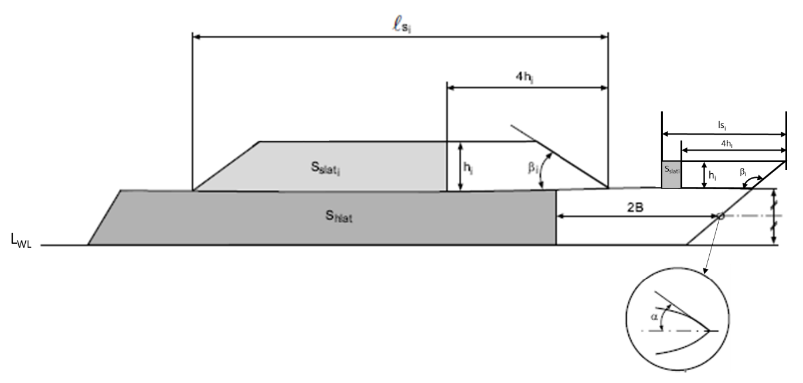

# PART 4 Hull Equipment

> RULES FOR CLASSIFICATION OF STEEL SHIPS / RA-04-E / 2025 / EN / Guidance

## Annex 4-4 Direct force calculation for anchoring equipment (2024)

### 1. Total force _s2

The total force (static + dynamic) $F _{EN}$, in kN, induced by wind and current acting on monohull in anchoring condition as defined in **Ch 8, Sec 1, 101.** of the Rules may be calculated as follows:
$F _{EN} =2(F _{SLPH} +F _{SH} +F _{SS} )$
$F _{SLPH}$ : Static force on wetted part of the hull due to current, as specified in (1)
$F _{SH}$ : Static force on hull due to wind, as specified in (2)
$F _{SS}$ : Static force on superstructures due to wind, as specified in (3)

#### (1) Static force on wetted part of hull _s2

$F _{SLPH} = \frac{1}{2} \rho C _{f} S _{m} V _{c}^{2} 10 ^{-3}$
$\rho$ : Water density, equal to 1025 $\mathrm{kg}/m ^{3}$
$C _{f}$ : Coefficient equal to:
$C _{f} =(1+k) \frac{0.075}{(logR _{e }-2) ^{ 2}}$
With $R _{e}$, Reynolds number:
$R _{e} = \frac{(V _{c} L _{WL} )}{1.054*10 ^{-6}}$
$k$ : Coefficient equal to:
$k=0.017+20 \frac{C _{bWL}}{L _{WL}^{2} T ^{-0.5}B _{ WL} ^{ -1.5}}$
With $C _{bWL}$, block coefficient at waterline:
$C _{bWL} = \frac{\Delta _{}}{1.025L _{WL} B _{WL} T}$
$\Delta$ : Moulded displacement at waterline $T$, in $\mathrm{m} ^{3}$
$S _{m}$ : Total wetted surface of the part of the hull under draught, in $\mathrm{m} ^{2}$
The value of Sm is to be given by the Designer. When this value is not available, $S _{m}$ may be taken equal to $S _{m} =6* \Delta ^{2/3}$
$V _{C}$ : Speed of the current, in m/s, as specified in **Ch 8, Sec 1, 101. 4** of the Guidance

#### (2) Static force on hull _s2

$F _{SH} = \frac{1}{2} \rho (C _{hfr} S _{hfr} +0.02S _{hlat} )V _{W}^{2} 10 ^{-3}$
$\rho$ : Air density, equal to 122 $\mathrm{kg}/m ^{3}$
$V _{W}$ : Speed of the wind, in $\mathrm{m}/s$, as specified in **Ch 8, Sec 1, 101. 4** of the Guidance
$S _{hfr}$ : Front surface of hull and bulwark if any, in $\mathrm{m} ^{2}$, projected on a vertical plane of the ship situated aft of the aft end of the ship and perpendicular to the longitudinal axis of the ship
$S _{hlat}$ : Partial lateral surface of one single side of the hull and bulwark if any, in $\mathrm{m} ^{2}$, through the overall length of the ship, projected on a vertical plane parallel to the longitudinal axis of the ship and delimited according to Figure 1.
$C _{hfr} = 0.8*\sin \alpha$, with $\alpha$ defined in **Figure 1.**
$B$ is the breadth of the hull, in m.
The upper part of the hull is the part extending from side to side to the uppermost continuous deck extending over the ship length.

**Figure 1**

#### (3) Static force _s2 on superstructures and deckhouses

- **(A)** The theoretical static force induced by wind applied on the superstructures and deckhouses, in kN, is defined as the sum of the forces applied to each superstructure and deckhouse tier according to the following formula:
  $F _{SS} = \frac{1}{2} \rho \sum (C _{sfr _{i}} S _{sfr _{i}} +0.08S _{slat _{i}} )V _{W}^{2} 10 ^{-3}$
  $\rho$,$V _{W}$ : according to (2)
  $S _{sfr _{i}}$ : Front surface of tier $i$ (superstructure or deckhouse, including bulwark if any), in $\mathrm{m} ^{2}$, projected on a vertical plane of the ship situated aft of the aft end of the ship and perpendicular to the longitudinal axis of the ship
  $S _{slat _{i}}$ : Partial lateral surface of one single side of tier $i$ (superstructure or deckhouse, including bulwark if any), in $\mathrm{m} ^{2}$, projected on a vertical plane parallel to the longitudinal axis of the ship and delimited according to Figure 1
  When $4h _{i} \geq l _{si}$, $S _{slat _{i}}$ is to be taken equal to 0
  $C _{sfr _{i}} = 0.8*\sin \beta _{i}$, with $\beta _{i}$ defined in Figure 1 without being greater than $90 {}^{\circ}$
- **(B)** When superstructures are located in the front of the hull with front and side walls of superstructures in the continuity of the side shell, the static force induced by wind applied on these superstructures, in $\mathrm{kN}$, is defined as the sum of the forces applied to each superstructure tier according to the following formula:
  $F _{SS} = \frac{1}{2} \rho \sum (C _{hfr _{i}} S _{hfr _{i}} +0.08S _{slat _{i}} )V _{W}^{2} 10 ^{-3}$
  $\rho$,$V _{W}$, $S _{slat _{i}}$ : according to (A)
  $S _{hfr _{i}}$ : Front surface of tier $i$ of the superstructure, in $\mathrm{m} ^{2}$, projected on a vertical plane of the ship situated aft of the aft end of the ship and perpendicular to the longitudinal axis of the ship
  $C _{hfr _{i}} = 0.8*\sin \alpha _{s}$, with $\alpha _{s}$ as defined for $\alpha$ in Figure 1 and measured at mid height of the superstructure tier located in the front of the hull.
  The static force is to be added to the static force calculated for the other superstructures and deckhouses according to (A).

### 2. Anchor weight

The individual mass of anchor, in kg, is to be at least equal to:

#### (1) for ordinary anchor: _s2

#### (2) for high holding power anchor: _s2

#### (3) for very high holding power: _s2

### 3. Chain cable

#### (1) Stud link chain cable scantling

Chain cable diameters are to be selected from **Ch 8, Sec 4, Table 4.8.8** of the Rules, based on the minimum breaking load $BL$ and proof load $PL$ of steel grades, in $\mathrm{kN}$, calculated according to the following formulae:

- **(A)** for steel Grade 1:
  $BL=6*F _{EN}$
  $PL=0.7*BL$
- **(B)** for steel Grade 2:
  $BL=6.8*F _{EN}$
  $PL=0.7*BL$
- **(C)** for steel Grade 3:
  $BL=7.5*F _{EN}$
  $PL=0.7*BL$
  The chain cable scantling is to be consistent with the mass of the associated anchor. In case the anchor on board is heavier by more than 7% from the mass calculated in **Par 2**, the value of $F _{EN} \mathrm{kN}$ to take into account in the present Par. for the calculation of $BL$ and $PL$ is to be deduced from the actual mass of the anchor according to the formulae in **Par 2**.

#### (2) Length of individual chain cable

The length of chain cable $L _{CC}$, in m, linked to each anchor is to be at least equal to:

- **(A)** When $P <180$
  $L _{CC} =30\ln(P)-42$
- **(B)** When $P \geq 180$
  $L _{CC}$ to be selected according to **Ch 8, Sec 1, Table 4.8.1**
  $P$ : Anchor weight, in $\mathrm{kg}$, defined in **Par 2** for an ordinary anchor according to the considered
  case.

  | **Rules for the Classification of Steel Ships** **Guidance Relating to the Rules for the Classification** **of Steel Ships** |
  | --- |
  | **PART 4 HULL EQUIPMENT** Published by **KR** 36, Myeongji ocean city 9-ro, Gangseo-gu, BUSAN, KOREA TEL : +82 70 8799 7114 FAX : +82 70 8799 8999 Website : http://www.krs.co.kr |
  |   |

  | CopyrightⒸ 2025, KR Reproduction of this Rules and Guidance in whole or in parts is prohibited without permission of the publisher. |
  | --- |
