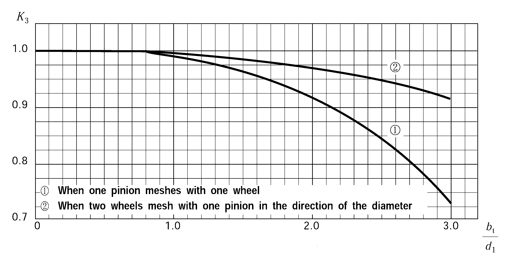
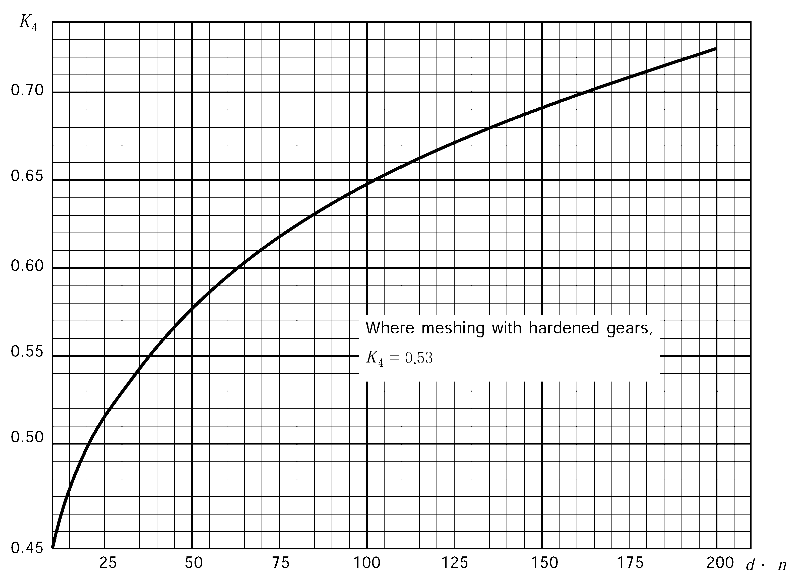

# PART 5 Machinery Installations

> RULES FOR CLASSIFICATION OF STEEL SHIPS / RA-05-E / 2025 / EN / Rules

## CHAPTER 3 PROPULSION SHAFTING AND POWER TRANSMISSION SYSTEMS

### Section 1 General

#### 101. Welded construction components

Where the main components are to be welded, the Society may require the preliminary test and other tests for the fabrication of welding before the work is commenced when considered specifically necessary. The welding procedure is to be approved. This requirement also applies to repair of main component parts by welding. **【See Guidance】**

#### 102. Other propulsion and maneuvering machinery

The propulsion and maneuvering machinery not specified in this chapter are to comply with the special requirements given by the Society. **【See Guidance】**

#### 103. Installation of propulsion shafting system

- **1.** Where resin chocks are used for the power transmission systems, stern tube, shaft bearing, etc., resin chocks are to be subjected to the type approval by the Society and the surface pressure of resin chocks under the maximum axial force calculated is to be within the approved value in type approval. The arrangements and installation procedure are to be in accordance with the manufacturer’s recommendations of resin chocks. *(2018)*
- **2.** Where propeller shaft or stern tube shaft is to be supported by the strut, this strut is to have sufficient strength.
- **3.** Propulsion shafting systems are to be installed so that the excessive bending stress and shear stress are not occurred on the shaft and the appropriate reactive force is acted on each bearing.

### Section 2 Shaftings

#### 201. Application

- **1.** The requirements of this Section apply to the shaftings of ships having reciprocating internal combustion engines, steam turbines and gas turbines as their main engines and of ships of electric propulsion.
- **2.** Where alternative calculation methods other than this section are used for calculating dimensions of shafts, they are considered appropriate by the Society. **【See Guidance】**

#### 202. Materials

- **1.** The materials for intermediate shaft, thrust shaft, stern tube shaft, propeller shaft, shaft coupling and coupling bolts are to comply with the requirements for steel forging of **Pt 2, Ch 1.** Built-up type shaft couplings may be of steel castings conforming to the requirements in **Pt 2, Ch 1.**
- **2.** The elongation of the material(L-direction) in **Par 1** is not to be less than 16 % except when an approval is specially obtained by the Society. **【See Guidance】**
- **3.** Where shafts may experience vibratory stresses close to the permissible stresses for transient operation, the materials are to have a specified minimum ultimate tensile strength($\sigma _{B}$) of 500 $\mathrm{N}/mm ^{2}$. Otherwise materials having a specified minimum ultimate tensile strength of 400 $\mathrm{N}/mm ^{2}$ may be used.

#### 203. Intermediate shaft and thrust shaft

The diameters of intermediate shaft and thrust shaft are not to be less than those obtained by the following formula: **【See Guidance】**
$d _{0} =F ․K _{1} root {3} of {\frac{P}{n} \times \frac{560}{(T+160)}} (\mathrm{mm})$
where:
$P$ = Shaft output of engine at maximum continuous output ($\mathrm{kW}$)
$n$ = Number of shaft revolution at maximum continuous output ($\mathrm{rpm}$)
$F$ = Factor for the type of propulsion installations
․ 95 for intermediate shafts in turbine installation, reciprocating internal combustion engines with hydraulic(slip type) couplings, electric propulsion installations
․ 100 for all other reciprocating internal combustion engines
$T$ = Specified minimum tensile strength ($\mathrm{N}/mm ^{2}$) of proposed material. For the minimum specified tensile strength of carbon steels exceeding 760 $\mathrm{N}/mm ^{2}$, T is to be taken 760 $\mathrm{N}/mm ^{2}$ and for the minimum specified tensile strength of alloy steels exceeding 800 $\mathrm{N}/mm ^{2}$, T is to be taken 800 $\mathrm{N}/mm ^{2}$ unless specially approved by the Society. *(2017)*
$K_1$ = Factor for different shaft design features, the values given by **Table 5.3.1.**

| For intermediate shafts with |   |   |   |   | For thrust shafts with |   |
| --- | --- | --- | --- | --- | --- | --- |
| Integral coupling flange | Shrink fit coupling flange | Keyways | Radial holes | Longitudinal slots | On both side of thrust collar | In way of bearing when a roller bearing is used |
| 1.00 | 1.00(1) | 1.10(2) | 1.10(3) | 1.20(4) | 1.10 | 1.10 |
| NOTES: (1)$K_1$ refer to the plain shaft section only. Where shafts may experience vibratory stresses close to the permissible stresses for continuous operation, an increase of 1 to 2 % in diameter to the shrink fit diameter and a blending radius nearly equal to the change in diameter are to be provided, (2) After a length of not less than 0.2$d _{0}$ from the end of the keyway the shaft diameter may be reduced to the diameter calculated with $K _{1}$=1.0. The fillet radius in the transverse section of keyway bottom is to be 0.0125$d _{0}$ or more. However, keyways are in general not to be used in installations with a barred speed range. (3) Diameter of radial hole not to exceed 0.3$d _{0}$ When a transverse hole intersects an eccentric axial hole(see below), the values is to be determined by the Society based on the submitted data in each case.   (4) Subject to limitations as slot length($l$)/outside diameter($d_o$) < 0.8 and inner diameter($d_i$)/outside diameter($d_o$) < 0.7 and slot width($e$)/outside diameter($d_o$) > 0.15. The end rounding of the slot($r$) is not to be less than $e$/2. An edge rounding should preferably be avoided as this increases the stress concentration slightly. The number of slots is to be 1, 2 or 3 and they are to be arranged 360, 180 or 120 degrees apart from each other respectively. |   |   |   |   |   |   |

#### 204. Propeller shaft and stern tube shaft

- **1.** The diameter of propeller shaft and stern tube shaft is not to be less than that obtained by the following formula:
  $d _{p} =100 \times K _{2} root {3} of {\frac{P}{n} \times \frac{560}{(T+160)}} (\mathrm{mm})$
  where:
  $P$, $n$ = As specified in **203.**
  $K_2$ = Factor concerning different shaft design features, the values given by **Table 5.3.2**
  $T$ = Specified minimum tensile strength ($\mathrm{N}/mm ^{2}$). For the tensile strength exceeding 600 $\mathrm{N}/mm ^{2}$, $T$ is to be taken as 600 $\mathrm{N}/mm ^{2}$.

  | Portion(1) | Propeller fitting method(2) | $K_2$(4) |
  | --- | --- | --- |
  | **1.** The portion between the forward face of the propeller hub (or shaft flange) and the forward edge of the aftermost shaft bearing, or 2.5 $d_p$ (4.0 $d_p$ in water-lubricated), whichever is the greater. | Keyed | 1.26 |
  | **1.** The portion between the forward face of the propeller hub (or shaft flange) and the forward edge of the aftermost shaft bearing, or 2.5 $d_p$ (4.0 $d_p$ in water-lubricated), whichever is the greater. | Keyless fitting by shrink fit | 1.22 |
  | **1.** The portion between the forward face of the propeller hub (or shaft flange) and the forward edge of the aftermost shaft bearing, or 2.5 $d_p$ (4.0 $d_p$ in water-lubricated), whichever is the greater. | Flange(3) | 1.22 |
  | **2.** Excluding the portion given in **1** above, the portion in the direction toward the bow up to the fore end of the forward stern tube seal. |   | 1.15 |
  | NOTES: (1) Transitions of diameters between portions are to be designed with either a smooth taper or a blending radius. (2) Other propeller fitting methods are subject to special consideration. (3) The fillet radius in the base of the flange is to be at least the order of 0.125$d_p$_. (4) $K_2$ is applied to the shafts to which approved measures(sleeves or type approved corrosion resisting) against corrosion by sea water are taken. The diameters of Kind 1 shaft made of approved corrosion resistant materials and Kind 2 shaft are taken are to be dealt with as considered appropriate by the Society. *(2020)* **【See Guidance】** |   |   |
- **2.** **Reducing diameter**
  The shaft diameter of the portion located forward of the fore end of the forward stern tube seal, may be gradually reduced at the coupling to the value determined in **Par 1** with the values of $K_2$ replaced by $K_1$ the same as intermediate shafts in **Table 5.3.1. 【 See Guidance】**
- **3.** **Sleeves**
  - **(1)** Propeller shafts or stern tube shafts which are not made of corrosion resistant materials and run in seawater are to be protected against contact with sea water by sea water resistant metal sleeves.
  - **(2)** Manufacturing of sleeves
    Sleeves are to be of bronze of high grade, stainless steel or above its equivalent thereto and free from porosity and other defects.
  - **(3)** thickness of sleeves
    $t _{1 } = 0.03d _{p} +7.5 (\mathrm{mm})$
    $t _{2} = 0.75t _{1} (\mathrm{mm})$
    Where :
    $t _{1}$ : Thickness of sleeves in contact with stern tube bearing of strut bearing ($\mathrm{mm}$)
    $t _{2}$ : Thickness of sleeves of other parts than the above ($\mathrm{mm}$)
    $d _{p}$ : Minimum required diameter of propeller shaft ($\mathrm{mm}$)
    - **(A)** The thickness of bronze sleeves fitted with propeller shafts and stern tube shafts is not to be less than that given by the following formula.
    - **(B)** The thickness of stainless steel sleeves fitted with propeller shafts and stern tube shafts is not to be less than one-half that required for bronze sleeves or 6.5 $\mathrm{mm}$, whichever is greater.
  - **(4)** Security of sleeves
    - **(A)** Sleeves are to be shrunk or forced on the shaft by pressure and they are not to be secured by pins or bolts.
    - **(B)** Sleeves are to be installed in one piece in principle. Where installed by two or more pieces, shafts not protected by sleeves is to be protected by corrosion resisting material with rubber or synthetic resin etc.. The corrosion resisting materials are to be type approved by Society and installed by an approved method. *(2021)*
- **4.** **Taper of propeller shaft cone**
  The propeller shaft cone is to be provided with the 1/10 (the 1/15 in keyless propeller) or less taper at the stern end of the propeller shaft.
- **5.** **Key of propeller shaft fixing of propellers 【See Guidance】** *(2025)*
  - **(1)** Key and keyway
    Where a key is provided to the taper part of the propeller shaft, the key is to be tightly fitted in the keyway and to be secured by use of a set bolt. The fillet radius at the bottom of the keyway is to be not less than 1.25 % of the actual propeller shaft diameter at the large end of the cone. The forward end of the keyway is in general to be made a spoon shaped ending and the distance from the large end of the propeller shaft cone to the forward end of the key is to be not less than 20 % of the actual propeller shaft diameter in way of the large end of the cone.
  - **(2)** Set bolt for key
    Two screw pins are to be provided for securing the key in the keyway, and the forward set bolt is to be placed at least one-third of the length of the key from the end. The depth of the tapped holes for the set bolt is not to exceed the bolt diameters, and the edges of the holes are to be bevelled slightly.
  - **(3)** Key area
    The Key material is in general to be of equal or higher than the shaft material. The effective area of the key in shear is not to be less than those obtained by the following formula.
    $A= \frac{d _{0} ^{3}}{2.55d _{m}} \cdot \frac{Y _{S}}{Y _{K}}$ (mm^2)
    where:
    $d _{0}$ = Diameter of intermediate shaft as determined in accordance with **203.** (mm)
    $d _{m}$ = Diameter of shaft at mid-length of the key (mm)
    $Y _{S}$ = Specified yield strength of shaft material (N/mm^2)
    $Y _{K}$ = Specified yield strength of key material (N/mm^2)

#### 205. Hollow shaft

In accordance with the kind of shafts, the outside diameter of hollow shaft is not to be less than that given by the corresponding formula specified in **203.** and **204.** multiplying by the following coefficient $K_h$. For the $R$ not exceeding 0.4, $K_h$ is to be taken as 1.
$K_h = root {3} of { \frac{1}{1}-R^4}$
where:
$R= \frac{I nside D iameter}{Outside D iameter}$ for hollow shafts

#### 206. Stern tube bearing and sealing device

- **1.** The length of stern bearing in the stern tube or of strut bearing supporting the weight of propeller is to comply with the following requirements.
  - **(1)** The bearings are to be type approved by the Society in their materials, construction and lubricating arrangements when rubber or synthetic materials are used.
  - **(2)** For sea water lubricated bearings, the length of the bearing is to be not less than 4 times the required diameter of the shaft in way of the bearing. However when rubber or synthetic materials are used, where the material has been proven satisfaction of society through testing and operating experience, consideration may be given to an increased bearing pressure or a lessened bearing length. In this case, the length of the bearing is to be not less than 2 times the required diameter of the shaft in way of the bearing. *(2020)*
  - **(3)** For oil lubricated bearings of white metal or synthetic materials, the length of the bearing is to be not less than 2 times the required diameter of the shaft in way of the bearing. The length of the bearing may be less provided the nominal bearing pressure is not more than 0.8 $\mathrm{MPa}$ as determined by static bearing reaction calculation taking into account shaft and propeller weight which is deemed to be exerted solely on the aft bearing divided by the projected area of the shaft. For oil lubricated bearings of synthetic materials, the length of the bearing may be less provided the nominal bearing pressure is not more than 0.6 $\mathrm{MPa}$ as determined by static bearing reaction calculation taking into account shaft and propeller weight which is deemed to be exerted solely on the aft bearing divided by the projected area of the shaft. However, the minimum length is to be not less than 1.5 times the actual diameter. **【See Guidance】**
  - **(4)** The oil lubricated stern tube is always to be filled with oil and the lubricating oil is to be cooled by submerging the stern tube in the water of the after peak tank or by other suitable means. Means for ascertaining the temperature of the oil in the stern tube are also to be provided. Where a gravity tank supplying lubricating oil to the stern tube bearing is fitted, it is to be located above the load water line and provided with a low level alarm device. Adequate means are to be provided to supply ample amount of sea water for lubrication and cooling in the sea water lubricated stern tube.
  - **(5)** For grease lubricated bearings, the length of a grease lubricated bearing is to be not less than 4.0 times the required diameter of the shaft in way of the bearing. *(2021)*
- **2.** The sealing devices other than gland packing type sea water sealing device are to be type approved by the Society in their materials, construction and arrangement. **【See Guidance】**

#### 207. Shaft coupling and coupling bolts

- **1.** **Coupling bolt**
  The diameter of the coupling bolts at joining face of the couplings is not to be less than that given the following formula:
  $d _{b} =0.65 \sqrt {\frac{d _{0} ^{3} (T+160)}{n \times D \times T _{b}}} (\mathrm{mm})$
  where:
  $d_0$ = Minimum required diameter of intermediate shaft calculated with $K_1$=1.0 ($\mathrm{mm}$)
  $n$ = Number of bolts
  $D$ = Diameter of pitch circle ($\mathrm{mm}$)
  $T$ = Specified minimum tensile strength of the intermediate shaft material ($\mathrm{N}/mm ^{2}$)
  $T_b$ = Specified minimum tensile strength of bolt material, while in general $T \leq T_b \leq 1.7T$, but not higher than 1,000 $\mathrm{N}/mm ^{2}$.
- **2.** **Shaft coupling**
  - **(1)** The thickness of coupling flange at the pitch circle is not to be less than that obtained by the following formulae, whichever is the greater.
    $t 1 =d b (\mathrm{mm})\#
    t 2 =0.2d (\mathrm{mm})$
    where:
    $d_b$ = Minimum required diameter of bolts calculated for the material having the same tensile strength as the corresponding shaft
    $d$ = Minimum required diameter of corresponding shaft
  - **(2)** The fillet radius at the base of the flange is not to be less than 0.08 times the diameter of the shaft. Where the fillet is recessed in way of nuts and bolt heads, the fillet radius at the base of the flange is not to be less than 0.125 times the diameter of the shaft.
- **3.** **Built-up type couplings**
  Where the shaft couplings are separate from the shaft, the couplings are to have strength enough to resist the transmitting torque of shaft and the astern pull. In this case, the shaft is to be of construction to avoid excessive stress concentration. **【See Guidance】**

#### 208. Tests and inspections

- **1.** **Hydraulic test of stern tube**
  Stern tubes are to be tested by hydraulic pressure of 0.2 $\mathrm{MPa}$ after manufacturing.
- **2.** **Leakage test**
  The oil sealing devices in stern tubes are to be tested for leakage under working oil pressure after being installed in ships.
- **3.** **Hydraulic test of sleeve**
  Propeller shaft sleeves and stern tube shaft sleeves are to be tested by hydraulic pressure of 0.1 $\mathrm{MPa}$ before they are to be shrunk or forced on the shaft.

### Section 3 Propellers

#### 301. Application

The requirements of this Section apply to screw propellers. The structure and strength of propellers of special design are to be in accordance with the requirements which the Society considers appropriate. **【See Guidance】**

#### 302. Materials

The materials of propellers and blade fixing bolts of built-up propeller are to be in accordance with the requirements of **Pt 2, Ch 1. 【 See Guidance】**

#### 303. Thickness of blade 【See Guidance】

- **1.** The thicknesses of the propeller blades for solid propellers and controllable pitch propellers (fillet at the root of the blades is not to be considered in the determination of blade thickness) are not to be less than obtained from the formula in **Table 5.3.3.** In case of high speed ship, the higher requirement may be requested.
- **2.** For the controllable pitch propellers of tugs, trawlers or other special duty ships with similar operating profiles, the diameter/pitch ratio for the maximal bollard pull has to be used in formula. For the controllable pitch propellers of other ships, the diameter/pitch ratio applicable to open-water navigation at maximum engine power(MCR) can be used in formula.
- **3.** **Consideration**
  For the blades of different materials from those specified in **Table 5.3.3,** the value of $K _{ m}$ will be determined by the Society in each case. For propellers having a diameter of 2.5 $\mathrm{m}$ and less, the value of $K$ may be taken as the value in **Table 5.3.3** multiplied by the following factors.
  for $D$ ≤ 2.0 $\mathrm{m}$ : 1.2
  for $D$ ＞ 2.0 $\mathrm{m}$ : 2.0 - 0.4$D$
  $D$ : Diameter of propeller

  | Thickness of blade ($\mathrm{mm}$) | $t _{x} = \sqrt {\frac{0.1K _{1} ․P}{C _{x} K _{2} ․Z ․N ․l _{x}}}$ |   |
  | --- | --- | --- |
  | $P$ : Maximum continuous output of main propulsion machinery ($\mathrm{kW}$ ) $Z$ : Number of blades $N$ : Number of maximum continuous revolution per minute devided by 100 $C _{x}$ : Section modulus values at the blade position $x$ (Actual section modulus÷$l_x t_ax ^2$), where $C _{x}$ exceeds 0.1, $C _{x}$ is to be taken as 0.1 | $l_x$ : Width of blade at the radius $xR$ ($\mathrm{m}$) (*x* : 0.25, 0.35, 0.6) $R$ : Radius of propeller ($\mathrm{m}$) $x$ : Radius position having no dimension $t_ax$ : Actual thickness of Blades ($\mathrm{m}$) $K_1$, $K_2$ : Coefficient given by the following table |   |
  | Expected accuracy of finishing gears ; $\varepsilon$ $\varepsilon$≥1.25 ; $\varepsilon = \frac{10b_e \sin \beta_0}{piM}$＜1.25 Those corresponding to finishing by shaving or grinding ; 0.044 ; 0.088 those corresponding to finishing by hobbing ; 0.11 ; 0.22 $b_e$ $\mathrm{cm}$ = Face width (in case of double helical gears, the face width is for one side) ($\beta_0$) $M$ = Helix angle $K_3 = 1 - k_3 left(b_\frac{t}{d_1} right)^3$ = Normal module Coefficient *x* Solid propeller Controllable pitch propeller 0.25 $K 1 = \frac{61}{\sqrt {1+1.62 \left( \frac{P 0.25}{D} \right) 2}} \left[ 0.092+0.329 \left( \frac{D}{P 0.7} \right) +0.238 \left( \frac{P 0.25}{D} \right) \right]\# K 2 =K m - \frac{D 3 ․ N 2 ․ \xi}{1,000 l 0.25 ․ Z} \left[ 2.02+ \frac{1.17 \left( \frac{100E}{D} \right) +2.39}{\sqrt {1+1.62 \left( \frac{P 0.25}{D} \right) 2}} \right]$ 0.35 $K 1 = \frac{61}{\sqrt {1+0.827 \left( \frac{P 0.35}{D} \right) 2}} \left[ 0.074+0.264 \left( \frac{D}{P 0.7} \right) +0.131 \left( \frac{P 0.35}{D} \right) \right]\# K 2 =K m - \frac{D 3 ․ N 2 ․ \xi}{1,000 l 0.35 ․ Z} \left[ 2.29+ \frac{1.23 \left( \frac{100E}{D} \right) +2.51}{\sqrt {1+0.827 \left( \frac{P 0.35}{D} \right) 2}} \right]$ 0.6 $K 1 = \frac{61}{\sqrt {1+0.281 \left( \frac{P 0.6}{D} \right) 2}} \left[ 0.028+0.096 \left( \frac{D}{P 0.7} \right) +0.026 \left( \frac{P 0.6}{D} \right) \right]\# K 2 =K m - \frac{D 3 ․ N 2 ․ \xi}{1,000 l 0.6 ․ Z} \left[ 1.48+ \frac{0.68 \left( \frac{100E}{D} \right) +1.38}{\sqrt {1+0.281 \left( \frac{P 0.6}{D} \right) 2}} \right]$ $K 1 = \frac{61}{\sqrt {1+0.281 \left( \frac{P 0.6}{D} \right) 2}} \left[ 0.028+0.100 \left( \frac{D}{P 0.7} \right) +0.026 \left( \frac{P 0.6}{D} \right) \right]\# K 2 =K m - \frac{D 3 ․ N 2 ․ \xi}{1,000 l 0.6 ․ Z} \left[ 1.70+ \frac{0.78 \left( \frac{100E}{D} \right) +1.59}{\sqrt {1+0.281 \left( \frac{P 0.6}{D} \right) 2}} \right]$ |   |   |
  | Expected accuracy of finishing gears | $\varepsilon$ |   |
  | Expected accuracy of finishing gears | $\varepsilon$≥1.25 | $\varepsilon = \frac{10b_e \sin \beta_0}{piM}$＜1.25 |
  | Those corresponding to finishing by shaving or grinding | 0.044 | 0.088 |
  | those corresponding to finishing by hobbing | 0.11 | 0.22 |
  | $b_e$ $\mathrm{cm}$ = Face width (in case of double helical gears, the face width is for one side) ($\beta_0$) $M$ = Helix angle $K_3 = 1 - k_3 left(b_\frac{t}{d_1} right)^3$ = Normal module |   |   |
  | $D$ : Diameter of propeller ($\mathrm{m}$) $E$ : Rake of blade at propeller shaft center line (Distance between a cross of perpendicular line of blade tip and a cross of extension line of backface at shaft center line in the projection of maximum thickness section of the blade) ($\mathrm{m}$) $P_x$ : Pitch at the radius $xR$ ($\mathrm{m}$) ($x$ : 0.25, 0.35, 0.6, 0.7) $\xi = A_\frac{E}{\frac{\pi}{4} D^2}$: Expanded area ratio $A _{E}$ : Expanded area of propeller | $K_m$ : Values given by the following table $Z$ When one pinion meshes with one wheel ; 0.01 When two wheels mesh with one pinion in the direction of the diameter ; 0.003 Materials $K_m$ Grey cast iron 0.6 Cast steel *RSC* 42 0.9 *RSC* 46 *RSC* 49 1.0 Copper alloy casting *CU* 1 1.15 *CU* 2 *CU* 3 1.3 *CU* 4 1.15 |   |
  |   | $Z$ |   |
  | When one pinion meshes with one wheel | 0.01 |   |
  | When two wheels mesh with one pinion in the direction of the diameter | 0.003 |   |

#### 304. Blade Fixing of built-up type or controllable pitch propeller

- **1.** The blades are to be fitted tightly into the boss (or pitch control gear) by bolts, and the bolts are to be secured by appropriate means to prevent from loosening. Blade fixing bolts are to have sufficient strength as considered appropriate by the Society, and corrosion resistant materials are to be used or effective means precluding their direct contact with sea water are to be provided. **【See Guidance】**
- **2.** Bolt fixing part of the blade flange and blade flange fixing part of boss are to be provided with the recesses or an equivalent means, and the recesses for bolt fixing part of flange are to be so provided that it has no significant influence to the strength at the root of blades. **【See Guidance】**
- **3.** The face of the blade flange is to be fitted tightly to the face of the boss (or pitch control gear), and the circumferential clearance of the edge of flange is to be kept to a minimum. **【See Guidance】**

#### 305. Fitting of propeller

- **1.** The propeller is to be force-fitted on the taper of the propeller shaft or to be firmly fixed to the shaft by other appropriate means. Propeller, on force fitting or drawing out, is not to be heated partially to a high temperature. **【See Guidance】**
- **2.** Where the propeller is force-fitted to the propeller shaft without the use of a key, the calculation sheets of the pull-up length are to be submitted for approval. Where the propeller is bolted to the shaft, the blade fixing bolts are to have sufficient strength. **【See Guidance】**
- **3.** **Anti-corrosion**
  Effective constructions are to be provided to prevent sea water from having access to the part between propeller cap or propeller boss and propeller shaft. **【See Guidance】**

#### 306. Hydraulic oil pump

Where, in controllable pitch propeller, pitch controlling devices are operated by hydraulic oil pump, a stand-by oil pump or other suitable means are to bo provided so that the ship can keep the normal voyage condition in the event of failure of the oil pump.

#### 307. Tests and inspections

- **1.** **Balancing tests**
  Propellers are to be subjected to static balancing tests. Dynamic balancing tests are necessary for propellers running above 500 rpm. *(2020)* **【See Guidance】**
- **2.** **Contact tests**
  Where the propeller is force-fitted to the taper of the propeller shaft cone, the contact marking between the mating surfaces is to be verified by contact facing-up test or other suitable means.
- **3.** **Confirmation of the pull-up length**
  Where a propeller is force-fitted to the propeller shaft without the use of a key, the pull-up length is to be confirmed and recorded.

### Section 4 Power Transmission Systems

#### 401. General

- **1.** **Application**
  The requirements of this Section apply to power transmission systems which transmit a maximum continuous power not less than 100 kW for main propulsion machinery or prime movers driving generators (excluding emergency generator) or essential auxiliaries for propulsion and safety of ships. *(2017)*
- **2.** **Special requirement**
  The construction of other power transmission systems not specified in this Section is to be such that the Society considers appropriate, functioning safely and reliably and having sufficient strength against transmitted power.
- **3.** **Hydraulic pump or air compressor, etc.**
  Where the clutching device of power transmission systems for propulsion is operated with hydraulic oil or air pressure, the stand-by hydraulic oil pumps or air compressor which can be used at any time or any other appropriate unit is to be provided, thereby to ensure that a ship can keep the normal service condition. However, in the case of small ships the requirement for this stand-by unit can be dispensed with at the discretion of the Society. **【See Guidance】**
- **4.** **Electro-magnetic slip coupling**
  The electro-magnetic slip couplings are also to comply with the requirements of **Pt 6, Ch 1, 1603. 4.**
- **5.** **Materials**
  The materials used for main components of the power transmission system are to comply with the requirements in **Pt 2, Ch 1**. *(2017)* **【See Guidance】**

#### 402. General construction of gearing 【See Guidance】

- **1.** **Gear of built-up type**
  Where a gear is of built-up type, the rim is to be of a thickness to ensure sufficient strength and is to have an enough shrinkage fit against transmitted power. Where shrinkage fit is made after cutting of the teeth, the construction is to be such as to fully guarantee the accuracy of gearing, or the final tooth finishing is to be carried out after the shrinkage fit. Where gears are of welded construction, they are to have sufficient rigidity and are to be stress relieved before cutting of the teeth.
- **2.** **Casing**
  Gear casings are to have sufficient rigidity, and their construction is to be such that all possible facility is provided for inspection and maintenance. Where the casing is of welded structure, its construction and materials are to be approved by the Society.
- **3.** **Machining**
  Gear teeth are to be machined by hobbing machines of high accuracy, and it is recommended that the finishing, if available, is to be carried out as far as possible in a temperature controllable room. After the final machining, both edges of the teeth or any other sharp parts are to be properly hand finished. The surface hardening processes are to be carried out considering the influence of the thermal deformation to ensure that the necessary flank hardness and depth of hardened zone are obtained.
- **4.** **Other components of gears**
  Other components of the gears are also to be of reliable quality and their attachment are to be so arranged that they have no influence to the centers of gear shafts.
- **5.** **Noise**
  Gears are to be adjusted to give minimum noise in the normal range of revolution.
- **6.** **Lubricating oil arrangement**
  - **(1)** Lubricating oil arrangement is also to comply with the requirements of **Ch 6, Sec 8**. Oil strainers used for gearing are to be those with a magnet if available.
  - **(2)** The gearing of the forced lubrication system with the driving units above 37 $\mathrm{kW}$ are to be provided with alarm devices which give visual and audible alarm in the event of failure of lubricating oil pressure supply or appreciable reduction in pressure of lubricating oil supply. For the lubricating oil arrangements other than forced lubrication system, suitable means are to be provided to ascertain oil level in sump.

#### 403. Allowable tangential load for gears

- **1.** **Application**
  These provisions are applied to the external tooth cylindrical gears having an involute tooth profile. The external tooth cylindrical gears having tooth profiles other than the involute tooth profile are to comply with the requirements which the Society deems appropriate. **【See Guidance】**
- **2.** **Allowable tangential load by bending strength**
  Allowable tangential loads decided for the bending strength of the teeth are to conform to the following condition: **【See Guidance】**
  $P_MCR \leq P_b$
  $P_MCR$ = Tangential loads of gears at maximum continuous output, being the value to be obtained from the following formula:
  $P _{MCR} = \frac{1.91P}{nd _{1} b} \times 10 ^{6} (\mathrm{N}/cm)$
  where:
  $P$ = Output which the pinion shares at maximum continuous output ($\mathrm{kW}$)
  $n$ = Revolutions of the pinion at maximum continuous output ($\mathrm{rpm}$)
  $d_1$ = Pitch circle diameter of the pinion ($\mathrm{cm}$)
  $b$ = Effective face width of the gears on the pitch circle of the shaft parallel section ($\mathrm{cm}$)
  $P_b$ = Allowable tangential loads decided for the bending strength, being obtained from the following formula:
  $P _{b} =9.81(K _{1} ․S _{b} -K _{2} ) \times K _{3} (4.85- \frac{30.6}{Z} )M (\mathrm{N}/cm)$
  $K_1$ = External load magnification coefficient, being the value to be decided for the size of fluctuating loads working on the gears and to be given by the following formula. Where the value of $K_1$ can not be calculated, the values in **Table 5.3.4** may be used.
  $K_1 = 1.10P_\frac{MCR}{P_M}AX$
  $P_\max$ = Instantaneous maximum tangential loads occurring within the continuous revolution range ($\mathrm{N}/cm$)

  | Driving engine | Construction or method of connection | $K_1$(3) |   |
  | --- | --- | --- | --- |
  | Driving engine | Construction or method of connection | Gear for propulsion | Gear for auxiliaries |
  | Steam turbine or electric motor | Single stage reduction gear | 1.00 | 1.15 |
  | Steam turbine or electric motor | Multiple stage reduction gear | 1.00(1), 1.10(2) | 1.15 |
  | Reciprocating internal combustion engine | Hydro-dynamic or electro-magnetic coupling | 1.00 | 1.15 |
  | Reciprocating internal combustion engine | High elastic coupling | 0.90 | 1.05 |
  | Reciprocating internal combustion engine | Elastic coupling | 0.80 | 0.95 |
  | Reciprocating internal combustion engine | Rigid coupling | 0.50 | 0.60 |
  | NOTES: (1) marked is applicable only to the gearing connected directly with the propulsion shaft system. (2) marked is applicable only to the gearing connected directly with the propulsion shaft system through effective flexible couplings. (3) Where one pinion meshes with more than two wheels, 0.9 times these values may be applied as the value of $K_1$. |   |   |   |

  $K_2$ = Internal load magnification value, being the value to be derived from the following formula or **Fig 5.3.1** which is dependent on the accuracy of gears and their overlap ratio.
  $K_2 = k_2 (d timesn )^0.8$
  where:
  $d$ = Pitch circle diameter of gears ($\mathrm{cm}$)
  $n$ = Number of revolution per minute of gears divided by 1,000 ($\mathrm{rpm}$/1,000)
  $k_2$ = Value given in **Table 5.3.5.**
  $K_3$ = Load magnification coefficient, being the value to be derived from the following formula or **Fig 5.3.2** which is dependent on the face width and pitch circle diameter.

  | Expected accuracy of finishing gears | $k_2$ |   |
  | --- | --- | --- |
  | Expected accuracy of finishing gears | $\varepsilon$≥1.25 | $\varepsilon$＜1.25 |
  | Those corresponding to finishing by shaving or grinding | 0.044 | 0.088 |
  | those corresponding to finishing by hobbing | 0.11 | 0.22 |
  | $\varepsilon = \frac{10b_e \sin \beta_0}{piM}$ $b_e$ = Face width (in case of double helical gears, the face width is for one side) ($\mathrm{cm}$) $\beta_0$ = Helix angle $M$ = Normal module |   |   |

  
  **Fig 5.3.1 Values of K_2**
  
  **Fig 5.3.2 Values of K_3**
  $K_3 = 1 - k_3 left(b_\frac{t}{d_1} right)^3$
  where:
  $b_t$ = Total face width of pinions (in case of double helical gears, central gap is included) ($\mathrm{cm}$)
  $d_1$ = Pitch circle diameter of pinion ($\mathrm{cm}$)
  $k_3$ = Value given by **Table 5.3.6.**

  |   | $k_3$ |
  | --- | --- |
  | When one pinion meshes with one wheel | 0.01 |
  | When two wheels mesh with one pinion in the direction of the diameter | 0.003 |

  $Z$ = Number of teeth
  $S_b$ = The value related mainly to the material of gears, given by the following formula. In case of ahead idle gears and astern gears, however, 0.7 times and 1.2 times respectively such value are regarded as $S_b$ values. In any case, $S_b$ value is not to exceed 25.
  Gears to which surface hardening process was applied including bottom land:$S _{b} =0.83 \sqrt {S}$
  Other gears : $S _{b} = \frac{S+Y}{49} \times \frac{1}{F}$
  $F = 1 + (0.0096S - 2.4) left( \frac{0.04}{\gamma_0} + 0.02 right) \times (0.023M + 0.75)$
  where:
  $S$ = Specified minimum tensile strength of gear material ($\mathrm{N}/mm ^{2}$)
  $Y$ = Specified minimum yield stress of gear material ($\mathrm{N}/mm ^{2}$)
  $\gamma_0$ = Ratio between the tooth tip radius and module
  $M$ = Normal module
- **3.** **Tangential load by surface durability**
  The tangential loads of gears decided for surface durability of the teeth flank are to conform to the following condition, but these are not applicable to astern gears.
  $P_MCR \leq P_S$
  $P_MCR$ = As specified in **Par 2.**
  $P_S$ = Allowable tangential loads decided for the surface durability of the teeth flank and obtained by the following formula:
  $P _{S} =9.81(K _{1} S _{S} -K _{2} )K _{3} K _{4} \frac{i}{1+i} d _{1} (\mathrm{N}/cm)$
  where:
  $K_1$, $K_2$, $K_3$ = As specified in **Par 2.**
  $S_S$ = Decided by the material of gears and as given by the following formula:
  Combination of gears both of which have been subjected to surface hardening process:
  $S _{S} =2.236 \sqrt {S _{W}}$
  Combination of other gears:
  $S _{S} = \left( 0.005 \frac{H _{BWP}}{H _{BWW}} +0.007 \right) S _{W} +7.5$
  where:
  $S_W$ = Specified minimum tensile strength of wheel material ($\mathrm{N}/mm ^{2}$)
  $H _{BWP}$ = Hardness of tooth face of pinion (Brinell hardness $\mathrm{H} _{BW}$)
  $H _{BWW}$ = Hardness of tooth face of wheel (Brinell hardness $\mathrm{H} _{BW}$)
  $K_4$ = Lubricating coefficient, being the value decided for the following formula or **Fig 5.3.3,** which is dependent on pitch circle diameter and number of revolution. In case of meshing with hardened gears, however, $K_4$ = 0.53.
  
  **Fig 5.3.3 Values of K_4**
  $K_4 = 0.3(d ․ n) ^{\frac{1}{6}}$
  where :
  $d$ = Pitch circle diameter of gears ($\mathrm{cm}$)
  $n$ = Number of revolution per minute of gears divided by 1,000 ($\mathrm{rpm}$/1,000)
  $i$ = Gear ratio (number of teeth of wheel/number of teeth of pinion)
  $d_1$ = Pitch circle diameter of pinion ($\mathrm{cm}$)
- **4.** **Consideration**
  The Society may approve special gearing devices, notwithstanding the requirements of **Pars 2** and **3,** provided that the detailed data for design, machining, using and calculations on the strength are submitted. **【See Guidance】**

#### 404. Gear shaft

- **1.** **Gear shaft**
  The diameter of gear shafts by which power is transmitted is not to be less than the value given by the formula in **203.** In this case, $P$ and n in this formula represent respectively the output and the number of revolutions of the shaft at the maximum continuous output. For the tensile strength exceeding 1,000 $\mathrm{N}/mm ^{2}$ in the pinion shafts, $T$ is to be taken as 1,000 $\mathrm{N}/mm ^{2}$. However, the diameter between the wheel shaft bearings is not to be less than the above values that multiplied by coefficient given in **Table 5.3.7.**

  | Arrangement of pinions | $C$ |
  | --- | --- |
  | When one pinion is gearing, or when two pinions which are arranged at an angle less than 120° each other are gearing | 1.16 |
  | When two pinions which are arranged at an angle more than 120° each other are gearing | 1.10 |
- **2.** **Pinion shaft**
  The diameter of pinion shaft is to have sufficient rigidity against the bending force generated by meshing of gears.

#### 405. Flexible shaft

The diameter of flexible shaft is not to be less than that given by the following formula:
$d _{f} =100 root {3} of {\frac{P}{n} \times \frac{440}{S}} (\mathrm{mm})$
where:
$P$ = Output shared by flexible shaft at the maximum continuous output ($\mathrm{kW}$)
$n$ = Number of revolution per minute of flexible shaft at the maximum continuous output ($\mathrm{rpm}$)
$S$ = Specified minimum tensile strength of shaft material ($\mathrm{N}/mm ^{2}$)

#### 406. Shaft couplings

- **1.** **Shaft couplings and coupling bolts**
  The dimensions of couplings and coupling bolts are applied to the related requirements in **207.** In case where they support heavy materials in cantilever style, they are to be designed so as to have sufficient strength to resist the weight.
- **2.** **Flexible couplings**
  The flexible couplings are to have sufficient strength against the torque to be transmitted to the shaft. *(2019)* **【See Guidance】**

#### 407. Tests and inspections

- **1.** **Finishing accuracy**
  For the parts subjected to surface hardening process, the hardened depth are to be measured on sample materials, and hardness test and suitable non-destructive tests are to be carried out. The finishing accuracy of final machining of gears is to be measured minutely.
- **2.** **Dynamical balancing test**
  In the case of gears where the value given by the following formula exceeds 50, dynamic balancing tests are to be carried out, except for the case where specially approved by the Society to omit such test. **【See Guidance】**
  $\frac{D n}{1},000$
  where:
  $D$ = Pitch circle diameter of the gear ($\mathrm{cm}$)
  $n$ = Number of revolution of the gear ($\mathrm{rpm}$)
- **3.** **Contact marking of teeth**
  The contact marking of the teeth of all gearing is to be verified under appropriate loads by coating suitable paint thinly and uniformly. And, in the case of propulsion gears where the total face width (in the case of double helical gears, the central gap is included) exceeds 300 $\mathrm{mm}$ or where the ratio between the total face width and pitch circle diameter of the pinion exceeds 2, the contact marking of the teeth is to be verified at sea trial by coating with paint capable of verifying the contact marking on teeth flank thinly and uniformly.
- **4.** **Flexible couplings** ***(2019)***
  - **(1)** The certification of flexible couplings is to be issued as required by **Table 5.3.8.**

    **Table 5.3.8 Certification of flexible couplings**

    | Items | Certificate | Issued by | Remarks |
    | --- | --- | --- | --- |
    | Non-metallic type flexible couplings (rubber, silicon, etc.) $\geq 100$ kW | Product | Society |   |
    | Non-metallic type flexible couplings (rubber, silicon, etc.) $\geq 100$ kW | Type approval | Society |   |
    | Non-metallic type flexible couplings (rubber, silicon, etc.) $\geq 100$ kW | Material | Manufacturer | Torque transmitting parts |
    | Non-metallic type flexible couplings (rubber, silicon, etc.) $\geq 100$ kW | NDE | Manufacturer | Torque transmitting parts |
    | Metallic type flexible coupling (spring type, etc.) $\geq 100$ kW | Product | Society |   |
    | Metallic type flexible coupling (spring type, etc.) $\geq 100$ kW | Type approval | Society | For use of propulsion only |
    | Metallic type flexible coupling (spring type, etc.) $\geq 100$ kW | Material | Manufacturer | Torque transmitting parts |
    | Metallic type flexible coupling (spring type, etc.) $\geq 100$ kW | NDE | Manufacturer | Torque transmitting parts |
    | NOTES: Issued by Society means KR Certificate Issued by Manufacturer means Work's certificate |   |   |   |
  - **(2)** For non-metallic type (rubber, silicone, etc.) flexible couplings are to be subjected to a torque test. The test is to be carried out by twisting the flexible coupling or by subjecting the elastomer to a load which is equivalent to the coupling twist. The test torque is to be not less than 1.5 times the permissible nominal torque $T _{KN}$. The deflection from test results is to be within the tolerance specified by manufacturer. Flexible couplings not used with reciprocating internal combustion engines may adjust the scope of the torque test at the discretion of the Surveyor.
  - **(3)** For flexible couplings using bonding with rubber or silicone, etc. the bonding test is to be carried out under the load at least one direction 1.5 times the permissible nominal torque $T _{KN}$. At this load the elastomers are to be inspected for any signs of slippage in the bonding surface.

### Section 5 Water-jet propulsion systems (2023)

#### 501. General

- **1.** **Application**
  - **(1)** The requirements in this Section apply to the water-jet propulsion systems (hereinafter referred to as “propulsion systems”) intended for main propulsion and steering driven by high speed engines.
  - **(2)** For items not specified in this Section, the relevant requirements specified in **Pt 5** and **Pt 6** apply.
  - **(3)** Equivalency
    Propulsion systems which do not comply with the requirements of this Section may be accepted provided that they are deemed to be equivalent by the Society according to **Pt 1 Ch 1 105**.
- **2.** **Definitions**
  The terms used in this Section are defined as follows:
  - **(1)** **Water-jet propulsion systems** are systems that accelerates water sucked from outside the ship by the impeller, ejects it backward, and use the propulsive thrust generated at this time for propulsion and steering of the ship. Includes the following components:
    - **(A)** Shaftings (main shafts, bearings, shaft couplings, coupling bolts and sealing devices)
    - **(B)** Water intake ducts
    - **(C)** Water-Jet pump units
    - **(D)** steering gears and reversing systems
  - **(2)** **Impeller** is a rotating assembly provided with blades to give energy to the water.
  - **(3)** **Main shaft** is a shaft that transmits power to the impeller blades.
  - **(4)** **Water intake duct** is the part that leads the water sucked from the water intake to the impeller inlet.
  - **(5)** **Nozzle** is the part that ejects water accelerated by the impeller.
  - **(6)** **Deflecter** is the device serving as a rudder by leading the water injected from the nozzle either to port or to starboard.
  - **(7)** **Reverser** is the device to thrust the ship to go astern by reversing the flow direction of the water injected from the nozzle.
  - **(8)** **High speed engine** is the high-rotating-speed reciprocating internal combustion engine specified in **Pt 1, Ch 2, 303. 3** of the Guidance or gas turbine.
  - **(9)** **Water-jet pump units** are consist of impellers, impeller casings, stators, stator casings, nozzles, bearings, bearing housing and sealing devices.
  - **(10)** **Stators** are assemblies composed of rows of stationary vanes that reduce any swirl added to water by impellers.
  - **(11)** **Steering gears and reversing systems** are those systems consisting of deflectors, reversers and steering actuating systems driving defectors or reversers.
  - **(12)** **Steering actuating system** consists of a steering gear power unit, a steering actuator and, for hydraulic or electrohydraulic steering gears, the hydraulic piping.
  - **(13)** **Steering system** is a ship’s directional control system, including steering gear, steering gear control system and rudder (including the rudder stock) if any, or any equivalent system for applying force on the ship hull to cause a change of heading or course.
  - **(14)** **Declared steering angle limits** are the operational limits in terms of maximum steering angle, or equivalent, according to manufacturers' guidelines for safe operation, also taking into account the ship's speed or propeller torque/speed or other limitation; the "declared steering angle limits" are to be declared by the steering system manufacturer for each ship specific non-traditional steering means. ship manoeuvrability tests, such as those in the Standards for ship manoeuvrability (IMO Res. MSC.137(76)) are to be carried out with steering angles not exceeding the declared steering angle limits.
- **3.** **Plans and Documents to be Submitted**
  Before the work is commenced, the shipyard or the manufacturers of propulsion systems are to submit plans in triplicate and a copy of documents specified below, to the Society.
  - **(1)** Plans
    - **(A)** Particulars, specifications, material specifications, detail of welding procedures
    - **(B)** General arrangement and sectional assembly drawings (showing the materials and dimensions of various parts including the water intake duct, etc.)
    - **(C)** Shafting arrangement (showing the arrangements, shapes and construction of the main engine, gear, clutch, coupling, main shaft, main shaft bearing, thrust bearing, sealing device, impeller, etc.)
    - **(D)** Details of water intake duct
    - **(E)** Construction of impeller (showing the detailed blade sections, the maximum diameter of blade from the centre of the main shaft, number of blades, and material specifications)
    - **(F)** Details of bearing and sealing device (including thrust bearing), in the case of roller bearing, together with specifications of such bearings and the calculation sheets for the life times of roller bearings.
    - **(G)** Details of deflectors and reversers
    - **(H)** Piping diagrams (hydraulic systems, lubricating systems, cooling water systems and etc.)
    - **(I)** Arrangements of control systems and diagram of hydraulic and electrical systems (including safety devices, alarm devices and automatic steering)
    - **(J)** Arrangements and diagram of an alternative source of power
    - **(K)** Diagram of indication devices for deflector positions
    - **(L)** Details of hydraulic actuators
  - **(2)** Documents
    - **(A)** Torsional vibration calculation sheets and calculation sheets of the bending natural frequency when bending vibration due to self-weight is expected.
    - **(B)** Strength calculation sheets for deflector and reverser
    - **(C)** Others deemed necessary by the Society

#### 502. Materials, Construction and Strength

- **1.** **Materials**
  The materials of parts of the propulsion system are to be suitable for service conditions, and the following important components are to comply with the requirements in **Pt 2, Ch 1**. However, the Society may accept to use those made of materials which comply with Korean Industrial Standards or standards as considered equivalent therto.
  - **(1)** Main shaft, shaft coupling and coupling bolts
  - **(2)** Nozzle and impeller
  - **(3)** Impeller casings, stator casings and bearing housings
  - **(4)** Water intake duct which are composing a part of shell plating (including shaft cover)
  - **(5)** Mounting flanges and bolts of water-jet pump units
  - **(6)** Deflectors and reversers
- **2.** **Construction and strength**
  - **(1)** Main shaft
    The minimum diameter of the main shaft is to be not less than the value determined by the following formula:
    $d _{s} =k \cdot root {3} of {\frac{P}{N}}$
    where:
    $d _{s}$ : Required diameter of main shaft ($\mathrm{mm}$)
    $P$ : Maximum continuous output of main engine ($\mathrm{kW}$)
    $N$ : Number of revolutions of main shaft at the maximum continuous output ($\mathrm{rpm}$)
    $k$ : Values shown in **Table 5.3.9**

    | Position Fitting method Shaft material |   | Fitting part of shaft with impeller and shaft coupling |   |   |   | Other positions |
    | --- | --- | --- | --- | --- | --- | --- |
    | Position Fitting method Shaft material |   | With key way | With spline | With flange coupling | Force fitting | Other positions |
    | Carbon steel or low alloy steel | Shaft of Class 2 | 105 | 108 | 102 | 102 | 105 |
    | Carbon steel or low alloy steel | Shaft of Class 1 | $a _{1}$=100 $a _{2}$=80 in Notes | $a _{1}$=102 $a _{2}$=82 in Notes | $a _{1}$=98 $a _{2}$=78 in Notes |   | $a _{1}$=100 $a _{2}$=80 in Notes |
    | Austenitic stainless steel |   | $a _{1}$=100 $a _{2}$=80 in Notes | $a _{1}$=102 $a _{2}$=82 in Notes | $a _{1}$=98 $a _{2}$=78 in Notes |   | $a _{1}$=100 $a _{2}$=80 in Notes |
    | Precipitation hardened stainless steel |   | 80 | 82 | 78 | 78 | 80 |
    | NOTES For $200 \leq \sigma y \leq 400\# k=a 1 -0.1( \sigma y -200)$ For $\sigma y >400\# k=a 2$ $\sigma _{y}$ : Specified yield point or 0.2 $\%$ of proof strength of shaft material ($\mathrm{N}/mm ^{2}$) |   |   |   |   |   |   |
  - **(2)** Shaft couplings and coupling bolts
    $d _{b} =15,300 \sqrt {\frac{P}{N} \cdot \frac{1}{nDT _{b}}}$
    where:
    $d _{b}$ : Required diameter of shaft coupling bolt ($\mathrm{mm}$)
    $P$ : Maximum continuous output of main engine ($\mathrm{kW}$)
    $N$ : Number of revolutions of main shaft at the maximum continuous output ($\mathrm{rpm}$)
    $n$ : Number of bolts
    $D$ : Pitch circle diameter ($\mathrm{mm}$)
    $T _{b}$ : Specified tensile strength of bolt material ($\mathrm{N}/mm ^{2}$)
    - **(A)** The minimum diameter of the shaft coupling bolts at the joining face of the couplings is to be not less than the value determined by the following formula:
    - **(B)** The thickness of the shaft coupling flange at the pitch circle is not to be less than the required diameter of shaft coupling bolts determined by the formula in (A) above. However, it is not to be less than 0.2 times the required diameter of the corresponding shaft.
    - **(C)** The fillet radius at the base of the flange is not to be less than 0.08 times the diameter of the shaft. The fillets are to have a smooth finish. Where the fillet is recessed in way of nuts and bolt heads, the fillet radius at the base of the flange is not to be less than 0.125 times the diameter of the shaft.
  - **(3)** Water intake duct, etc.
    The water intake duct, impeller casing and nozzle are to have strength according to the design pressure, and consideration is to be given for corrosion.
  - **(4)** Impeller blade
    The strength of the impeller blade at root is to be determined so that the following formula is satisfied. In this case, the allowable stress value of the material is, in principle, to be 1/1.8 of the specified yield point (or 0.2 $\%$ of proof strength).
    $S \geq \frac{5.8 \times 10 ^{5} P}{Lt ^{2} ZN _{i}} +2.2 \times 10 ^{-7} D ^{2} N _{i}^{2}$
    where:
    $S$ : Allowable stress of impeller material ($\mathrm{N}/mm ^{2}$)
    $P$ : Maximum continuous output of main engine ($\mathrm{kW}$)
    $N _{i}$ : Value obtained by dividing the number of revolutions of impeller by 100 ($\mathrm{rpm}$/100)
    $Z$ : Number of impeller blades
    $L$ : Width of impeller blade at root ($\mathrm{mm}$)
    $t$ : Maximum thickness of impeller blade at root ($\mathrm{mm}$)
    $D$ : Diameter of impeller ($\mathrm{mm}$)
- **3.** **Torsional vibration and bending vibration of main shaft**
  - **(1)** General
    - **(A)** Notwithstanding the requirements specified in above **501. 3** (2) (A) concerning to submission of the torsional vibration calculation sheets for the main shafting systems, submission of those may be omitted in cases where the shafting system is of the same type as previously approved one or it can be readily assumed that the shafting system has no excessive vibration stress.
    - **(B)** Measurements of torsional vibration to confirm accuracy of the estimated value are to be carried out. In cases, however, submission of the torsional vibration calculation sheets is omitted according to the requirements in above (A), or the Society considers that there is no critical vibration within the service speed range, the measurement of torsional vibration may be omitted.
  - **(2)** Allowable limit of torsional vibration stress
    The torsional vibration stress of the shafting system is to be in accordance with the following requirements within the service speed range of the shafting system.
    $\tau _{1} =A - B \times \lambda ^{2} ( \lambda \leq 0.9)$
    $\tau _{1} =C (0.9< \lambda \leq 1.05)$
    where:
    $\tau _{1}$ : Allowable limit of torsional vibration stresses ($\mathrm{N}/mm ^{2}$)
    $\lambda$ : Ratio of the number of maximum continuous revolutions to the number of service revolution of the engine
    $A$, $B$ and $C$ : Values shown in **Table 5.3.10**

    |   | Carbon steel or low alloy steel |   | Austenitic stainless steel | Martensite precipitation hardened type stainless steel |
    | --- | --- | --- | --- | --- |
    |   | Shaft of Kind 1 | Shaft of Kind 2 | Austenitic stainless steel | Martensite precipitation hardened type stainless steel |
    | A | 24.3 | 9.0 | 26.4 | 39.6 |
    | B | 24.1 | 6.2 | 26.4 | 37.1 |
    | C | 4.8 | 4.0 | 5.0 | 9.6 |

    In case where the specified tensile strength of materials of carbon steel shafts or low alloy steel shafts of Kind 1 exceeds 400 $\mathrm{N}/mm ^{2}$ the value of $\tau _{1}$ may be increased by multiplying the factor $k _{m}$ given in the following formula:
    $k _{m} =(T _{s} +160)/560$
    where:
    $k _{m}$ : Correction factor
    $T _{s}$ : Specified tensile strength of main shaft material ($\mathrm{N}/mm ^{2}$)
    $\tau _{2} =2.3 \tau _{1}$
    where:
    $\tau _{2}$ : Allowable limit of torsional vibration stresses for transient operation within the range of $\lambda$ ≤ 0.8 ($\mathrm{N}/mm ^{2}$)
    - **(A)** The torsional vibration stresses produced when the revolutions of the engine are within the range from 80 $\%$ to 105 $\%$ of maximum continuous revolutions are not to exceed $\tau _{1}$ given in following:
    - **(B)** The torsional vibration stresses of the main shaft within the range below and at 80 $\%$ of the maximum continuous revolutions of the engine are not to exceed $\tau _{2}$ given in following. In case where torsional vibration stresses exceed the value calculated by the formula of $\tau _{1}$ shown in (A), the barred speed ranges are to be imposed and can be approved on condition for transient operation by passing through rapidly this range.
  - **(3)** Bending vibration
    For the main shafting system of the propulsion system, consideration is to be given to natural vibrations due to bending of the shafting system.

#### 503. System design

- **1.** **Number of propulsion systems**
  - **(1)** In general, a minimum of two propulsion systems are to be provided for ships. Propulsion systems are to be designed so that the failure of any one system does not result in the performance of all of the other systems.
  - **(2)** In cases where the ship is not engaged in international voyage, a single propulsion system installation may be considered notwithstanding the requirements specified in above (1). In this case, the functions of propulsion, steering and reversing are to be designed with redundancy in the following arrangements:
    - **(A)** At least two prime movers are to be provided.
    - **(B)** At least two steering actuating systems for steering and reversing are to be provided.
    - **(C)** Electric supply is to be maintained or restored immediately in cases where there is a loss of any one of the main generators in service so that the functioning of at least one of prime movers and one of steering actuating systems, is maintained by the arrangements specified in **504. 1**.
- **2.** **General of steering gears and reversing systems**
  - **(1)** The steering systems of water-jet propulsion systems are to comply with the requirements for the performance and arrangement of non-traditional steering systems in **Annex 5-1** of the Guidance.
  - **(2)** The reverser is to be such that it provide sufficient power for going astern to secure proper control of the ship in all normal circumstances, and when transferred from ahead to astern runs, it is to have an astern power to provide effective breaking for the ship.
  - **(3)** The reverser is to have sufficient strength against the thrust at the maximum astern power output.
  - **(4)** The design pressure for calculations to determine the scantlings of piping and other components of steering gear subject to internal hydraulic pressure are to be at least 125% of the maximum working pressure expected under the worst permissible operating condition, taking into account any pressure which may exist in the low pressure side of systems. Design pressures are no to be less than relief valve setting pressures.
- **3.** **Steering actuating systems**
  - **(1)** Where pressure vessels such as accumulators, etc. are used in steering actuating systems, their strength is to comply with the relevant requirements in **Ch 5**.
  - **(2)** Hydraulic piping systems used in steering actuating systems are to comply with the relevant requirements in **Ch 6** in addition to this **Par**.
  - **(3)** The strength of steering actuators is to comply with the requirements specified in **Ch 7, 404**.
  - **(4)** The construction of oil seals in steering actuators is to comply with the requirements specified in **Ch 7, 405**.
  - **(5)** Suitable arrangements to maintain the cleanliness of the hydraulic fluid are to be provided taking into consideration the type and design of the steering actuating system.
  - **(6)** Arrangements for bleeding air from steering actuating system are to be provided where necessary.
  - **(7)** Relief valves are to be fitted to any part of the hydraulic system which can be isolated and in which pressure can be generated from the power source or from external forces. The setting pressure of the relief valves is not to be less than 1.25 times the maximum working pressure but not to exceed the design pressure. The minimum discharge capacity of the relief valves are not to be less than total capacity of pumps which provided power for steering actuators. Under such conditions the rise in pressure is not to exceed 10 % of the setting pressure. In this regard, due consideration is to be given to the extreme foreseen ambient conditions in respect of oil viscosity.
  - **(8)** A low level alarm is to be provided for each hydraulic fluid reservoir to give the earliest practicable indication of hydraulic fluid leakage. This alarm is to be audible and visual and to be given on the navigating bridge and at a position from which the main engine is normally controlled. **【See Guidance】**
  - **(9)** In cases where flexible hoses are used for steering actuating systems, the construction and strength of such flexible hoses are to comply with the requirements specified in **Ch 6, 102. 5**.
- **4.** **Stoppers**
  - **(1)** Propulsion systems are to be provided with stoppers for deflectors in order to limit steering angles.
  - **(2)** Propulsion systems are to be provided with positive arrangements, such as limit switches, for stopping deflectors before the stoppers are reached. These arrangements are to be activated by the actual movements of deflectors and not through control systems for steering. Mechanical links may be used for this purpose.
- **5.** **Lubricating oil systems**
  - **(1)** Lubricating oil systems for propulsion systems are to comply with those relevant requirements specified in **Ch 6, Sec 8**.
  - **(2)** Lubricating oil arrangements of propulsion systems are to be provided with alarm devices which give visible and audible alarms on navigation bridge and at positions from which main engines are normally controlled in the event of any failure of the supply of lubricating oil or an appreciable reduction of lubricating oil pressure.
- **6.** **Sealing devices**
  The materials, constructions and arrangements of sealing devices for shaftings and water-jet pump units, other than gland packing type sea water sealing devices, are to be approved by the Society.

#### 504. Electrical installations

- **1.** **Main source of electrical power 【See Guidance】**
  - **(1)** Where the main source of electrical power is necessary for propulsion, steering and reversing of the ship, the system is to be so arranged that electric supplies to relevant equipment are maintained, or restored immediately in the case of a loss of any one of the generators in service, to ensure the functions of propulsion, steering and reversing of at least one of the propulsion systems, its associated control systems and its indication devices for deflectors positions by the following arrangements:
    - **(A)** Where the electrical power is normally supplied by one generator, adequate provisions are to be made for automatic starting and connecting to main switchboards of standby generators of sufficient capacity to maintain the functions of the above with automatic restarting of important auxiliaries including sequential operations in cases where there is a loss of electrical power of the generator in operation.
    - **(B)** Where the electrical power is normally supplied by more than one generator simultaneously in parallel operations, provisions are to be made to ensure that, in cases where there is a loss of electrical power of one of generating sets, the remaining ones are kept in operation to maintain the functions of the above.
- **2.** Where the propulsion power exceeds 2,500 kW per propulsion system, an alternative source of power is to be provided in accordance with the following. **【See Guidance】**
  - **(1)** Any alternative source of power is to be capable of automatically supplying alternative power within 45 seconds to the deflector complying with the following requirement and its associated control system and its indication devices for deflector positions.
    - **(A)** The alternative source of power is to be capable of changing direction of the ship's directional control system from one side to the other at declared steering angle limits at an average rotational speed of not less than 0.5 degree/s with the ship running ahead at one half of the maximum ahead speed or 7 knots, whichever is greater.
  - **(2)** In every ship of 10,000 gross tonnage and upwards, the alternative power supply is to have a capacity for at least 30 min of continuous operation and in any other ship for at least 10 min.
  - **(3)** The alternative source of power is to be either:
    - **(A)** emergency source of electric power; or
    - **(B)** an independent source of power located in the steering gear compartment and used only for this purpose.
  - **(4)** Automatic starting arrangements for generators or prime movers of pumps used as the independent source of power specified in (3) (B) are to comply with the requirements for starting devices and performance in **Pt 6, Ch 1, 203, 6**.
- **3.** **Electrical Installations for Steering gears and Reversing systems 【See Guidance】**
  Where hydraulic pumps for steering actuating systems are driven by electric motors, electrical installations for steering and reversing systems are to comply with the following requirements.
  - **(1)** Steering system of each propulsion system is to be served by at least two exclusive circuit fed directly from the main switchboard. However, one of the circuits may be supplied through the emergency switchboard. An auxiliary electric or electrohydraulic steering gear associated with a main electric or electrohydraulic steering gear may be connected to one of the circuits supplying this main steering gear. The circuits supplying an electric or electrohydraulic steering gear shall have adequate rating for supplying all motors which can be simultaneously connected to them and may be required to operate simultaneously.
  - **(2)** Cables used in those exclusive circuits required in above (1) are to be separated as far as practicable throughout their length.
  - **(3)** Audible and visual alarms are to be given on navigation bridges in the event of any power failure to electric motors for hydraulic pumps.
  - **(4)** Means for indicating that electric motors for hydraulic pumps are running are to be installed on navigation bridges and positions from which main engines are normally controlled.
  - **(5)** Short circuit protection and overload alarms are to be provided for such circuits and motors respectively. Overload alarms are to be both audible and visible and are to be situated in conspicuous positions in places from which main engines are normally controlled.
  - **(6)** Protection against excess current, including starting currents, if provided, is to be for not less than twice the full load current of those motors or circuits so protected, and to be arranged to permit the passage of any appropriate starting currents.
  - **(7)** Where a three-phase supply is used, alarms are to be provided that will indicate failure of any one of the supply phases. Such alarms are to be both audible and visible and are to be situated in conspicuous positions in places from which main engines are normally controlled.

#### 505. Control systems

- **1.** **General**
  - **(1)** The requirements for controls not specified in this Section are to be complied with the requirements specified in **Ch 7, Sec 3**.
  - **(2)** Reversing systems are to be controlled in local control stations for main propulsion or in steering stations. Means are to be provided in local control stations for main propulsion or in steering stations for disconnecting any control systems, operable from navigation bridges, from reversing systems they serve.
  - **(3)** In the event of any failure of remote control devices for reversing systems, preset positions of reversers are to be maintained until control of such systems can be gained at local control stations for main propulsion or in steering stations.
  - **(4)** Independent control devices are to be provided for propulsion systems. Where multiple propulsion systems are designed to operate simultaneously, they may be control by a single device such as a joystick.
  - **(5)** Those control devices specified in above (4) are to be so designed that any failure of one such control device does not result in the failure of the others.
  - **(6)** For those items concerned with safety, alarms and control devices for propulsion systems not specified in this Section, the related requirements specified in **Pt 9, Ch 3** are to apply.
- **2.** **Monitoring**
  - **(1)** Indication devices for deflector positions
    - **(A)** Deflector positions are to be indicated on navigation bridges and in steering stations.
    - **(B)** Indication devices for deflector positions are to be independent of control systems.
  - **(2)** Indication devices for reverser positions
    Reverser positions are to be indicated on navigation bridges and at control stations including steering stations and monitoring stations for propulsion systems.
  - **(3)** Indication devices for impeller speed
    Impeller speeds are to be indicated on navigation bridges and at control stations including steering stations and monitoring stations for propulsion systems.

#### 506. Tests and Inspections

- **1.** **Shop tests**
  - **(1)** Hydrostatic tests at pressures 1.5 times design pressure for impeller casings, stator casings and bearing housings are to be carried out.
  - **(2)** Hydrostatic tests are to be carried out at a pressure of at least 0.2 $\mathrm{MPa}$ or 1.5 times the design pressure whichever is higher for the forward bearing tube of the main shaft and the sealing device.
  - **(3)** The tests specified in **Ch 7, 501.** for steering actuating systems are to be carried out.
  - **(4)** Performance tests of control, safety and alarm devices are to be carried out.
  - **(5)** For the impellers of the water-jet pump units, dynamic balancing tests are to be carried out.
- **2.** **Tests after installation on board**
  - **(1)** Leak tests of hydraulic piping systems at pressures at least equal to the maximum working pressure after installed on board are to be carried out.
  - **(2)** Leak tests of sealing devices for water-jet pump units at working oil pressure are to be carried out.
  - **(3)** Operation tests of propulsion systems as far as practicable are to be carried out.
- **3.** **Sea trials**
  The following tests are to be carried out during sea trials. However, those tests other than tests required in (2) and (3) may be carried out either at dockside or in dry dock.
  - **(1)** Measurement of torsional vibration is to be in accordance with **Ch 4, 103**.
  - **(2)** Tests on steering capability specified in **503. 2** (1).
  - **(3)** Test on operation of controls for steering and reversing systems, including tests on change-overs of control systems between navigation bridges and steering stations, and change-overs between manual steering and automatic steering, if automatic steering is provided.
  - **(4)** Tests on measures for maintaining power supplies and on the alternative source of power required by **504. 1** and **2**.
  - **(5)** Tests on means of communication between navigation bridges and steering stations, and between engine rooms and steering stations.
  - **(6)** Tests on the functioning of relief valves for preventing over-pressure.
  - **(7)** Tests on the functioning of alarm and safety devices, and indication devices for deflector positions, reverser positions and impeller speed, and running indicators of electric motors for steering actuating systems.
  - **(8)** Tests on the functioning of stoppers.
  - **(9)** Ship manoeuvrability tests, such as according to Resolution MSC.137(76) on Standards for ship manoeuvrability, are to be carried out with steering angles not exceeding the declared steering angle limits.

### Section 6 Azimuth thrusters (2023)

#### 601. General

- **1.** **Application**
  - **(1)** The requirements in this Section apply to ships equipped with azimuth thrusters (including pod thrusters) intended for main propulsion and steering.
  - **(2)** For items not specified in this Section, the relevant requirements specified in **Pt 5** and **Pt 6** apply.
  - **(3)** Equivalency
    Propulsion systems which do not comply with the requirements of this Section may be accepted provided that they are deemed to be equivalent by the Society according to **Pt 1 Ch 1 105**.
- **2.** **Definitions**
  The terms used in this Section are defined as follows.
  - **(1)** **Thruster** is a unit equipped with a propeller (impeller) in order to produce thrust.
  - **(2)** **Azimuth thruster** is a thruster capable of providing omni-directional thrust by being rotated around the vertical axis. Azimuth thruster is made up of the following components.
    - **(A)** Propellers and propeller shafts
    - **(B)** Gears, clutches and gear shafts for transmission of propulsion torque (when integrated in thrusters)
    - **(C)** Azimuth thruster casings
    - **(D)** Steering gears
  - **(3)** **Rotating podded electrical thruster** (hereinafter referred to as “**pod thruster**”) is an azimuth thruster with the propeller directly driven by the electrical prime mover.
  - **(4)** **Azimuth thruster casing** is watertight structures including steering columns (or struts), pods, propeller nozzles, etc.
  - **(5)** **Steering system** is a ship’s directional control system, including steering gear, steering gear control system and rudder (including the rudder stock) if any, or any equivalent system for applying force on the ship hull to cause a change of heading or course.
  - **(6)** **Steering-propulsion unit** is a unit intended for both propulsion and steering of the ship (for example, an azimuth thruster or a pod thruster).
  - **(7)** **Steering gear** is the machinery, actuators, power units, and auxiliary equipment applied to turn the rudder or thruster or equivalent about the axis of rotation in both directions for the purpose of steering the ship.
  - **(8)** **Steering actuating system** consists of a steering gear power unit, a steering actuator and, for hydraulic or electrohydraulic steering gears, the hydraulic piping.
  - **(9)** **Steering actuator** is a steering gear component which converts power into mechanical action to control the rotation of the rudder or thruster or equivalent.
    - **(A)** In case of electric steering: electric motor and driving pinion
    - **(B)** In case of electro hydraulic steering: hydraulic motor and driving pinion
  - **(10)** **Declared steering angle limits** are the operational limits in terms of maximum steering angle, or equivalent, according to manufacturers' guidelines for safe operation, also taking into account the ship's speed or propeller torque/speed or other limitation; the "declared steering angle limits" are to be declared by the steering system manufacturer for each ship specific non-traditional steering means. ship manoeuvrability tests, such as those in the Standards for ship manoeuvrability (IMO Res. MSC.137(76)) are to be carried out with steering angles not exceeding the declared steering angle limits.
- **3.** **Plans and Documents to be Submitted**
  Before the work is commenced, the shipyard or the manufacturers of thrusters are to submit plans in triplicate and a copy of documents specified below, to the Society.
  - **(1)** Plans
    - **(A)** Particulars, specifications, material specifications, details of welding procedures
    - **(B)** General arrangement and sectional assembly drawings (showing the materials and dimensions of various parts including nozzle)
    - **(C)** Details of fixed pitch/controllable pitch propeller, shafting arrangement, gears, shaft couplings, coupling bolts, clutch and gear shafts
    - **(D)** Details of steering gears (details of steering actuating systems, gears, bearings, etc.)
    - **(E)** Sealing arrangements, exposed to seawater
    - **(F)** Piping systems (hydraulic systems, lubricating systems, cooling water systems, etc.)
    - **(G)** Details of azimuth thruster casings
    - **(H)** Arrangements of control systems and diagram of hydraulic and electrical systems (including safety devices, alarm devices and automatic steering)
    - **(I)** Arrangements and diagrams of an alternative source of power
    - **(J)** Diagrams of indication devices for azimuth angles
  - **(2)** Documents
    - **(A)** Torsional vibration calculation sheets of shafting
    - **(B)** Strength calculations of fixed pitch/controllable pitch propeller blade thickness, pitch control mechanism, shafts, shaft coulings, gears, azimuth thruster casings, load carrying components of the steering gear
    - **(C)** Operating manual
    - **(D)** Service life calculations of roller bearings and propeller pull-up length calculations sheets, etc.
    - **(E)** Others considered to be necessary by the Society

#### 602. Materials, Construction and Strength

- **1.** Materials used for azimuth thruster casings, bedplates for supporting thrusters and the construction of the torque-transmitting components of thrusters are to comply with the requirements in **Pt 2**, **Ch 1**.
- **2.** Materials, constructions and strength of shaftings, propellers, gears and steering gears are to be applied with appropriate modifications of the relevant requirements of **Ch 3**, **Ch 4** and **Ch 7**.
- **3.** Materials, constructions and strength of piping systems and auxiliaries are to be applied with appropriate modifications of the relevant requirements of **Ch 6**.

#### 603. System design

- **1.** **Number of thrusters**
  - **(1)** In general, a minimum of two thrusters is to be provided for ships. Thrusters are to be designed so that the failure of one thruster does not result in the performance of any other thrusters.
  - **(2)** In cases where the ship is not engaged in international voyage, a single thruster installation may be considered notwithstanding the requirements specified in above (1). In this case, the functions of propulsion, steering and reversing are to be designed with redundancy in the following arrangements:
    - **(A)** At least two prime movers are to be provided.
    - **(B)** At least two independent steering actuating systems are to be provided. However, such steering actuating systems may have one gear wheel.
    - **(C)** Electric supply is to be maintained or restored immediately in the case of loss of any main generators in service so that the functioning of at least one of prime movers and one of steering actuating systems, is maintained by the arrangements specified in **604. 1**.
- **2.** **Steering gears**
  - **(1)** The steering gears of azimuth thrusters are to comply with the requirements for the performance and arrangement of non-traditional steering systems in **Annex 5-1** of the Guidance.
  - **(2)** Design pressure for calculations to determine the scantlings of piping and other components of steering gears subject to internal hydraulic pressure are to be at least 125% of the maximum working pressure expected under the worst permissible operation conditions after taking into account any pressure which may exist in low pressure sides of such systems. Design pressures are not to be less than relief valve setting pressures.
  - **(3)** The rate of turning for steering gears is to be not less than 1.0 rpm in static conditions of ships if astern power is obtained by turning steering-propulsion unit.
- **3.** **Steering actuating systems**
  Where the steering actuating system is hydraulic or electro-hydraulic, the steering actuating system driven by hydraulic power is to be installed in accordance with the following requirements.
  - **(1)** Where pressure vessels such as accumulators, etc. are used in the steering actuating systems, their strength is to comply with the relevant requirements in **Ch 5**.
  - **(2)** Hydraulic piping systems used in the steering actuating systems are to comply with the relevant requirements in **Ch 6** in addition to this **Par**.
  - **(3)** Suitable arrangements to maintain the cleanliness of hydraulic fluids are to be provided after taking into consideration the types and designs of such hydraulic systems.
  - **(4)** Arrangements for bleeding air from hydraulic systems are to be provided where necessary.
  - **(5)** Relief valves are to be fitted to any part of hydraulic systems which can be isolated and in which pressure can be generated from power sources or from external forces. The setting pressure of such relief valves is not to be less than 1.25 times the maximum working pressure but not to exceed the design pressure. The minimum discharge capacity of relief valves are not to be less than 110% of the total capacity of pumps which provide power for hydraulic motors. Under such conditions, any rise in pressure is not to exceed 10% of the setting pressure. In this regard, due consideration is to be given to any extreme foreseen ambient conditions in respect to oil viscosity.
  - **(6)** Low level alarms are to be provided for hydraulic fluid tanks to give the earliest practicable indication of any hydraulic fluid leakage. These alarm are to be audible and visual and to be given on navigation bridge and at positions from which main engines are normally controlled. **【See Guidance】**
  - **(7)** In cases where flexible hoses are used for hydraulic systems, the construction and strength of such flexible hoses are to comply with the requirements specified in **Ch 6, 102. 5**.
- **4.** **Lubricating oil systems**
  - **(1)** Lubricating oil systems for thrusters are to comply with the relevant requirement specified in **Ch 6, Sec. 8**.
  - **(2)** Lubricating oil arrangements of thrusters are to be provided with alarm devices which give visible and audible alarms on navigation bridges and at positions from which main engines are normally controlled in the event of any failure of the supply of lubricating oil or any appreciable reduction of lubricating oil pressure.
- **5.** **Cooling systems**
  - **(1)** Cooling systems of thrusters are to comply with the requirements specified in **Ch 6, Sec. 7**.
  - **(2)** The ventilation and cooling systems are to maintain the machinery and equipment of steering-propulsion units within the temperatures for which they were designed to operate.
  - **(3)** Where water cooling is used the cooler is to be arranged to avoid water leakage inside the steering-propulsion units.
- **6.** **Sealing Devices**
  Sealing devices for steering parts of steering propulsion units and propeller shafts are to be approved by the society in their materials, construction and arrangement.
- **7.** **Position of steering gears**
  - **(1)** The steering gears of steering-propulsion units are to be installed in an enclosed compartment readily accessible and, as far as possible, separated from machinery spaces.
  - **(2)** The steering gear compartment of steering-propulsion unit is to be provided with suitable arrangements to ensure working access to steering gear machinery and controls. These arrangements are to include handrails and gratings or other non-slip surfaces to ensure suitable working conditions in the event of hydraulic fluid leakage.

#### 604. Electrical installations

- **1.** **Main source of electrical power 【See Guidance】**
  - **(1)** Where the main source of electrical power is necessary for propulsion and steering of the ship, the system is to be so arranged that electric supplies to relevant equipment are maintained, or restored immediately in the case of a loss of any one of the generators in service, to ensure the functions of propulsion and steering of at least one thruster, its associated control systems and its indication devices for azimuth angles by the following arrangements:
    - **(A)** Where the electrical power is normally supplied by one generator, adequate provisions are to be made for the automatic starting and the connecting to main switchboards of standby generators of sufficient capacities to maintain the functions of the above with automatic restarting of important auxiliaries, including sequential operations, in cases of loss of electrical power to generators in operation.
    - **(B)** Where the electrical power is normally supplied by more than one generator simultaneously in parallel operations, provisions are to be made to ensure that, in cases where there is a loss of electrical power to one of such generating sets, the remaining ones are kept in operation to maintain the functions of those above.
- **2.** Where the propulsion power exceeds 2,500 kW per thruster, an alternative source of power is to be provided in accordance with the following. **【See Guidance】**
  - **(1)** Any alternative source of power is to be capable of automatically supplying alternative power within 45 seconds to the steering gear complying with the following requirement and its associated control system and its indication devices for azimuth angle.
    - **(A)** The alternative source of power is to be capable of changing direction of the ship's directional control system from one side to the other at declared steering angle limits at an average rotational speed of not less than 0.5 degree/s with the ship running ahead at one half of the maximum ahead speed or 7 knots, whichever is greater.
  - **(2)** In every ship of 10,000 gross tonnage and upwards, the alternative power supply is to have a capacity for at least 30 min of continuous operation and in any other ship for at least 10 min.
  - **(3)** The alternative source of power is to be either:
    - **(A)** emergency source of electric power; or
    - **(B)** an independent source of power located in the steering gear compartment and used only for this purpose.
  - **(4)** Automatic starting arrangements for generators or prime movers of pumps used as the independent source of power specified in (3) (B) are to comply with the requirements for starting devices and performance in **Pt 6, Ch 1, 203, 6**.
- **3.** **Electrical installations for steering-propulsion units 【See Guidance】**
  Electrical installations for steering-propulsion units are to comply with the following requirements.
  - **(1)** Steering system of each thruster is to be served by at least two exclusive circuit fed directly from the main switchboard. However, one of the circuits may be supplied through the emergency switchboard. An auxiliary electric or electrohydraulic steering gear associated with a main electric or electrohydraulic steering gear may be connected to one of the circuits supplying this main steering gear. The circuits supplying an electric or electrohydraulic steering gear shall have adequate rating for supplying all motors which can be simultaneously connected to them and may be required to operate simultaneously.
  - **(2)** Cables used in those exclusive circuits required in above (1) are to be separated as far as practicable throughout their length.
  - **(3)** Audible and visual alarms are to be given on navigation bridges and at the position from which the main engine is normally controlled in the event of any power failure to electric motors for propulsion and steering.
  - **(4)** Means for indicating that electric motors for steering are running are to be installed on navigation bridges and those positions from which main engines are normally controlled.
  - **(5)** Short circuit protection and overload alarms are to be provided for such circuits and motors respectively. Overload alarms are to be both audible and visible and are to be situated in conspicuous positions in those places from which main engines are normally controlled.
  - **(6)** Any protection against excess current, including starting currents, if provided, is to be for not less than twice the full load current of motors or circuits so protected, and is to be arranged to permit passage of appropriate starting currents.
  - **(7)** Where a three-phase supply is used, alarms are to be provided that will indicate failure of any one of the supply phases. Such alarms are to be both audible and visible and are to be situated in conspicuous positions in places from which main engines are normally controlled.

#### 605. Control systems

- **1.** **General**
  - **(1)** The requirements for controls not specified in this **Section** are to be complied with the requirements specified in **Ch 7, Sec 3**.
  - **(2)** Independent control devices are to be provided for thrusters. Where multiple thrusters are designed to operate simultaneously, they may be control by a single device such as a joystick.
  - **(3)** Those control devices specified in above (2) are to be so designed that a failure of any one control device does not result in the failure of the others.
  - **(4)** It is to be possible to override operational limitations (e.g. steering angle limits) dedicated to equipment protection by remotely controlling thrusters from the navigating bridge, when required to initiate an emergency manoeuvre. The override procedure is to be documented in the operating manual of the unit and displayed at its control position(s).
- **2.** **Monitoring**
  - **(1)** The monitoring systems are to provide at least the following and individual indications are to be provided on the bridge.
    - **(A)** Overload of prime mover and steering gear driver
    - **(B)** Propeller speed
    - **(C)** Propeller pitch for CP propeller
    - **(D)** Direction of thrust and/or direction of rotation for fixed propeller
    - **(E)** Angular position of steering-propulsion units
    - **(F)** Electrical supply to the alarm and monitoring systems available
    - **(G)** Electrical supply to the steering gear available
  - **(2)** Indication of the angular position of steering-propulsion units is to be independent from the control system and also be locally indicated in steering-propulsion unit’s compartment.
- **3.** **Alarms**
  Audible and visual alarms are to be provided to indicate the failure scenarios in **Ch 7, 302. 1** and the following.
  - **(1)** lowering of liquid level of hydraulic fluid tanks caused by hydraulic leakage from steering actuating system
  - **(2)** power failure to electric motor for propulsion and steering
  - **(3)** overload of prime mover and steering gear driver
  - **(4)** lowering of lubricating oil pressure
  - **(5)** high temperature of electric motor cooling medium inlet/outlet
  - **(6)** sea water ingress into propeller pods (for pod thrusters)
  - **(7)** potential hydraulic leakage from actuating system, found and indicated at the earliest (as applicable)
  - **(8)** lowering of hydraulic oil pressure (as applicable)
  - **(9)** high temperature of lubricating oil (as applicable)

#### 606. Additional requirements for pod thrusters

- **1.** Means to detect any ingress of sea water into propeller pods are to be provided, and audible and visual alarms are to be given on navigation bridges and at positions from which main engines are normally controlled.
- **2.** Means for discharging sea water from propeller pods are to be provided.
- **3.** Where cooling fans are provided for propulsion motors, main cooling fans with sufficient capacities at maximum output of propulsion motors as well as auxiliary cooling fans with sufficient capacities at normal output of propulsion motors are to be provided. These cooling fans are to be arranged so that they can easily changed over. However, such auxiliary fans may be omitted provided that exclusive cooling fans are provided for thrusters. **【See Guidance】**
- **4.** Where cooling fans are provided for propulsion motors, control means for stopping such fans and closing any inlets and outlets of air for such fans from safe positions in the case of fire, are to be provided.
- **5.** For pods providing direct access to their interior space for maintenance and examination, the arrangement is to ensure protection to both equipment and personnel.

#### 607. Tests and Inspections

- **1.** **Shop tests**
  - **(1)** Tests and inspections of shafting arrangement, propellers, gears and steering systems are to be applied with appropriate modifications of the relevant requirements of **Ch 3** and **Ch 7**.
  - **(2)** Tests and inspections of piping systems and auxiliaries such as hydraulic systems, lubricating oil systems and cooling systems are to be applied with appropriate modifications of the relevant requirements of **Ch 6**.
  - **(3)** After assembly, azimuth thruster casings are to be carried out pressure tests at the larger value between 0.2 MPa and the following pressure of a water head equivalent to 1.5 D or 2 d whichever is smaller. However, airtight tests may be acceptable for propeller nozzles at pressures of 0.05 MPa.
    where:
    - **(A)** D : The depth of ship (m)
    - **(B)** d : The design maximum load draught (m)
- **2.** **Tests after installation on board**
  - **(1)** Leak tests of sealing devices for propeller shafts and steering gears are to be carried out at working pressure after installation on board.
  - **(2)** Leak tests of hydraulic systems for steering gears are to be carried out at pressures at least equal to maximum working pressures after installation on board. However, when it is difficult to carry out such tests after installation on board, such tests may be carried out as shop tests.
  - **(3)** Operation tests of the thruster, including the following, is to be carried out.
    - **(A)** Smooth operation of the manually controlled turning mechanism
    - **(B)** Operation of the reduction gear and seals
    - **(C)** Turning time, pressure and temperature of the systems
  - **(4)** If applicable, performance tests (excluding discharging devices) for the arrangement specified in **606.** is to be carried out.
- **3.** **Sea trials**
  The following tests are to be carried out during sea trials. However, those tests other than tests required in (2) and (3) may be carried out either at dockside or in dry dock. Also, when it is difficult to carry out tests on the functioning of relief valves after installation on board, these tests may be carried out as shop tests.
  - **(1)** Torsional vibration of shafting are to be applied with the requirements of **Ch 4, 103.**.
  - **(2)** Tests on steering capability specified in **603. 2** (1) and (3).
  - **(3)** Tests on the operation of controls for steering, including tests on change-overs of control systems between navigation bridges and azimuth thruster compartments, and change-overs between manual steering and automatic steering, if automatic steering is provided.
  - **(4)** Tests on measures for maintaining power supplies and on the alternative source of power required by **604. 1** and **2**.
  - **(5)** Tests on means of communication between navigation bridges and the azimuth thruster compartments, and between engine rooms and azimuth thruster compartments.
  - **(6)** Tests on the functioning of relief valves for preventing over-pressure.
  - **(7)** Tests on the functioning of monitoring, alarms and safety devices.
  - **(8)** Ship manoeuvrability tests, such as according to Resolution MSC.137(76) on Standards for ship manoeuvrability, are to be carried out with steering angles not exceeding the declared steering angle limits. 
