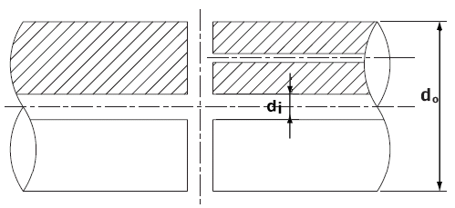

# PART 5 Machinery Installations

> RULES FOR CLASSIFICATION OF STEEL SHIPS / RA-05-E / 2025 / EN / Rules

## CHAPTER 4 TORSIONAL VIBRATION OF SHAFTINGS

### Section 1 General

#### 101. Application

- **1.** The requirements of this Chapter apply to power transmission systems for propulsion and propulsion shafting systems, shafting systems to transmit power from main engines to generators, crankshafts of reciprocating internal combustion engines used as main engines and shafting systems of generators driven by reciprocating internal combustion engines. In addition, the requirements of this chapter apply with appropriate modifications to the shaft systems of the essential auxiliaries driven by reciprocating internal combustion engines. *(2022)*
- **2.** Where alternative calculation methods other than this section are used for calculating dimensions of allowable torsional vibration stresses, they are to be complied with the requirements in **Ch 3, 201.2.**

#### 102. Data to be submitted

- **1.** In the case of new ships, or in case of replacing the main engine of existing ships, or in case of modifying or replacing parts that affects vibration such as shaft systems or propellers (or shaft systems of auxiliaries), etc., torsional vibration calculation sheets including the following items are to be submitted:
  - **(1)** Natural frequencies and modes for one node and two nodes vibration, also more nodes vibration if necessary.
  - **(2)** Estimated vibratory stresses for shafting system at each resonant critical within a speed range up to 120 % of the maximum continuous revolutions, and estimated torsional vibration stresses for the frank appearing at each non-resonant critical in the service speed range caused by a resonance having its critical speed above 120 % of the maximum continuous revolutions.
  - **(3)** Estimated vibratory torques for shafting system, gearings and flexible couplings.
  - **(4)** For propulsion shafts, estimated vibratory stresses for operation with any one cylinder misfiring(i.e. no injection but with compression)
- **2.** Notwithstanding the requirements specified in **Par 1**, submission of the torsional vibration calculation sheets may be omitted in the following cases provided that approval of the Society is obtained:
  - **(1)** In case where the shafting system is of the same types as previously approved one.
  - **(2)** In case where there is a slight alternation in specifications of the vibration system, and the frequency and torsional vibration stress can be deduced with satisfactory accuracy on the basis of the previous result of calculations or measurements.
  - **(3)** In case where the maximum continuous output of engine is 100 $\mathrm{kW}$ and below.

#### 103. Measurements

- **1.** The alternating torsional stress amplitude can be measured on a shaft in a relevant condition over a repetitive cycle.
- **2.** For the shafting systems where the submission of the torsional vibration calculation sheets is required, measurements to confirm correctness of the estimated value are to be carried out. However, where the submission of the calculation sheets is omitted according to the requirement in **102. 2**, or the Society considers that there is no critical vibration within the service speed range, the measurement of torsional vibration may be omitted.

### Section 2 Allowable Limit of Vibration Stresses

#### 201. Crankshafts

The torsional vibration stresses on the crankshafts of reciprocating internal combustion engines used as main engines are to be in accordance with the following requirements. However, where the strength calculation for crankshafts is carried out according to the special requirements given by the Society, these stresses are to comply with this special requirements. **【See Guidance】**

- **1.** For continuous operation within the range below the maximum continuous revolution, the torsional vibration stresses are not to exceed $\tau_1$ given in following.
  - **(1)** For 4 cycle in-line engines and 4 cycle vee type engines with firing intervals of 45° or 60°, the value of $\tau_1$ is given by the following formula:
    $\tau _{1} =45-24 \lambda ^{2}$ ($0 \leq \lambda \leq 1$)
  - **(2)** For 2 cycle engines and 4 cycle vee type engines other than shown in (1) above, the value of $\tau_1$ is given by the following formula:
    $\tau _{1} =45-29 \lambda ^{2}$ ($0 \leq \lambda \leq 1$)
    where:
    $\tau_1$ = Allowable limit of torsional vibration stresses for continuous operation ($\mathrm{N}/mm ^{2}$)
    $\lambda$ = Ratio of the number of revolutions to the number of maximum continuous revolutions.
- **2.** Within the range below and at 80 % of the maximum continuous revolutions, the torsional vibration stresses not exceeding $\tau_2$ given in the following formula may be accepted, only for transient operation by passing through rapidly the range where the stresses exceed $\tau_1$:
  $\tau_2 = 2 \tau_1$ ($0 \leq \lambda \leq 0.8$)
  where:
  $\tau_2$ = Allowable limit of torsional vibration stresses for transient operation ($\mathrm{N}/mm ^{2}$)
- **3.** The torsional vibration stresses are not to exceed $\tau_3$ given in the following, within the range from the maximum continuous revolutions to 115 %.
  - **(1)** For 4 cycle in-line engines and 4 cycle vee type engines with firing intervals of 45° or 60°, the value of $\tau_3$ is given by the following formula:
    $\tau _{3} =21+237( \lambda -0.8) \sqrt {\lambda -1}$ ($1.0 \leq \lambda \leq 1.15$)
  - **(2)** For 2 cycle engines and 4 cycle vee type engines other than shown in (1) above, the value of $\tau_3$ is given by the following formula:
    $\tau _{3} =16+237( \lambda -0.8) \sqrt {\lambda -1}$ ($1.0 \leq \lambda \leq 1.15$)
    where:
    $\tau_3$ = Allowable limit of torsional vibration stresses in the range over the maximum continuous revolutions ($\mathrm{N}/mm ^{2}$)
    = As specified in **Par 1.**
- **4.** In case where the specified minimum tensile strength of the shaft material exceeds 440 $\mathrm{N}/mm ^{2}$, or its yield strength exceeds 225 $\mathrm{N}/mm^2$, the values of $\tau_1$, $\tau_2$ and $\tau_3$ given in **Pars 1** to **3** may be increased by multiplying the factor $f_m$ given in the following formula: **【See Guidance】**
  - **(1)** For $\tau_1$ and $\tau_3$
    $f _{m} =1+ \frac{2}{3} \left( \frac{T _{s}}{440} -1 \right)$
  - **(2)** For $\tau_2$
    $f _{m} = \frac{Y}{225}$
    where:
    $f_m$ = Correction factor for allowable limit of torsional vibration stresses concerning the shaft material
    $T_s$ = Specified minimum tensile strength of shaft material ($\mathrm{N}/mm ^{2}$). However, in case where the specified minimum tensile strength exceeds 590 $\mathrm{N}/mm ^{2}$ for carbon steel forgings, or 835 $\mathrm{N}/mm ^{2}$ for low alloy steel forgings, the value of $T_s$ for calculating $f_m$ is to be as deemed appropriate by the Society.
    $Y$ = Specified minimum yield stress of the shaft material ($\mathrm{N}/mm ^{2}$).

#### 202. Intermediate shafts, thrust shafts, propeller shafts and stern tube shafts

- **1.** For ships equipped with reciprocating internal combustion engines used as main engines, the torsional vibration stresses on the intermediate shafts, thrust shafts, propeller shafts and stern tube shafts are to be in accordance with the following requirements (1) and (2).
  - **(1)** For continuous operation, the torsional vibration stresses are not to exceed $\tau_1$ given in the following formulae. Where propeller shafts and stern tube shafts are made of the approved corrosion resistant materials, the formulae is to be as deemed appropriate by the Society. *(2017)* **【See Guidance】**
    $\tau _{1} = \frac{T _{s} +160}{18} C _{k} C _{d} (3-2 \lambda ^{2} )$ ($0 \leq \lambda \leq 0.9$)
    $\tau _{1} =1.38 \frac{T _{s} +160}{18} C _{k} C _{d}$ ($0.9 \leq \lambda \leq 1.05$)
    where:
    $\tau_1$ = Allowable limit of torsional vibration stresses for continuous operation $\mathrm{N}/mm ^{2}$.
    $\lambda$ = As specified in **201. 1.**
    $T_s$ = Specified minimum tensile strength of shaft material ($\mathrm{N}/mm ^{2}$). However, the values of $T_s$ for using in the formulae is not to exceed 600 $\mathrm{N}/mm ^{2}$ for carbon steel forgings, and not to exceed 800 $\mathrm{N}/mm ^{2}$ unless specially approved by the Society for low alloy steel forgings in intermediate shafts and thrust shafts, and not to exceed 600 $\mathrm{N}/mm ^{2}$ in propeller shafts and stern tube shafts. *(2017)* **【See Guidance】**
    $C_k$ = Coefficient concerning to the type and shape of the shaft, given in **Table 5.4.1.**
    $C_d$ = Coefficient concerning to the shaft size and determined by the following formula:
    $C_d = 0.35 + 0.93 d^-0.2$
    $d$ = Diameter of the shaft ($\mathrm{mm}$)

    | Intermediate shaft |   |   |   |   |   | Thrust shafts |   | Propeller shaft | Stern tube shaft |
    | --- | --- | --- | --- | --- | --- | --- | --- | --- | --- |
    | Integral coupling flanges | Shrink fit coupling flanges | Keyways (tapered connection) | Keyways (cylinderical connection) | Radial hole | Longitudinal slot | On both sides of thrust collar | In way of bearing when a roller bearing is used | - |   |
    | 1.0 | 1.0(1) | 0.6(2) | 0.45(2) | 0.50(3) | 0.30(4)(5) | 0.85 | 0.85 | 0.55(6) | 0.8 |
    | NOTE: (1) $C_k$ refer to the plain shaft section only. Where shafts may experience vibratory stresses close to the permissible stresses for continuous operation, an increase of 1 to 2 % in diameter to the shrink fit diameter and a blending radius nearly equal to the change in diameter are to be provided, (2) Keyways are in general not to used in installations with a barred speed range. (3) Diameter of radial bore not to exceed 0.3$d _{0}$ When a transverse hole intersects an eccentric axial hole(see below), the values is to be determined by the Society based on the submitted data in each case. (4) Subject to limitations as slot length($l$)/outside diameter($d_o$) < 0.8 and inner diameter($d_i$)/outside diameter($d_o$) < 0.7 and slot width($e$)/outside diameter($d_o$) > 0.15. The end rounding of the slot($r$) is not to be less than $e$/2. An edge rounding should preferably be avoided as this increases the stress concentration slightly. The number of slots is to be 1, 2 or 3 and they are to be arranged 360, 180 or 120 degrees apart from each other respectively. (5) $C_k$= 0.3 is an approximation within the limitations in (4) above. More accurate estimate of $C_k$, the stress concentration factor(scf) may be determined by direct application of FE calculation or to be as deemed appropriate by the Society. (6) Application to the portion of the propeller shaft between the forward edge of the aftermost shaft bearing and the forward face of the propeller boss(or propeller flange), but not less than 2.5$d_s$. Where ; $d_s$ : required diameter of propeller shaft or stern tube shaft. |   |   |   |   |   |   |   |   |   |
  - **(2)** Within the range below 80 $\%$ of the maximum continuous revolutions, the torsional vibration stresses not exceeding $\tau_2$ given in the following formula may be accepted, only for transient operation by passing through rapidly the range where the stresses exceed $\tau_1$.
    $\tau_2 = \frac{1.7 \tau_1}{sqrtC_k}$
    where:
    $\tau_2$ = Allowable limit of torsional vibration stresses for transient operation ($\mathrm{N}/mm ^{2}$)
    $\tau_1$, $C_k$ = As specified in (1)
- **2.** For main propulsion system formed by steam turbines, gas turbines, reciprocating internal combustion engines having slide couplings such as electro-magnetic coupling or fluid couplings, or electric propulsion systems, allowable limits of the torsional vibration stress on the intermediate shafts, thrust shafts, propeller shaft and stern tube shafts are to be as deemed appropriate by the Society. **【See Guidance】**

#### 203. Shafting system of generators

- **1.** Torsional vibration stresses on the crankshafts of reciprocating internal combustion engines to drive generators are to be in accordance with the following requirements (1) and (2). However, where the strength calculation for crankshafts is carried out according to the special requirements given by the Society, these stresses are to comply with the special requirements. **【See Guidance】**
  - **(1)** The torsional vibration stresses are not to exceed $\tau_1$ given in the following, within the range from 90 % to 110 % of the maximum continuous revolutions.
    $\tau _{1} =21 \mathrm{N}/mm ^{2}$
    $\tau _{1} =16 \mathrm{N}/mm ^{2}$
    - **(A)** For 4 cycle in-line engines and 4 cycle vee type engines with firing intervals of 45° or 60°, the value of $\tau_1$ is given by the following formula:
    - **(B)** For 2 cycle engines and 4 cycle vee type engines other than shown in (A), the value of $\tau_1$ is given by the following formula:
  - **(2)** Within the range below and at 90 % of the maximum continuous revolutions, the torsional vibration stresses not exceeding $\tau_2$ given in the following formula may be accepted, only for transient operation by passing through rapidly the range where the stresses exceed $\tau_1$.
    $\tau _{1} =90 \mathrm{N}/mm ^{2}$
- **2.** The torsional vibration stresses on the generator shafts driven by #underline{r}eciprocating internal combustion engines are to be in accordance with the following requirements (1) and (2).
  - **(1)** The torsional vibration stresses are not to exceed $\tau_1$ given in the following, within the range from 90 % to 110 % of the maximum continuous revolutions.
    $\tau _{1} =31 \mathrm{N}/mm ^{2}$
  - **(2)** Within the range below and at 90 % of the maximum continuous revolutions, the torsional vibration stresses not exceeding $\tau_2$ given in the following formula may be accepted, only for transient operation by passing through rapidly the range where the stresses exceed $\tau_1$.
    $\tau _{2} =118 \mathrm{N}/mm ^{2}$
- **3.** In case where the specified minimum tensile strength of the shaft material exceeds 440 $\mathrm{N}/mm ^{2}$, or its yield strength exceeds 225 $\mathrm{N}/mm ^{2}$, the values of $\tau_1$ and $\tau_2$ given in **Pars 1** and **2** may be increased by multiplying the factor $f_m$ given in **201. 4.**

#### 204. Avoidance of major criticals

The major criticals of one node vibration in in-line reciprocating internal combustion engine, e.g. the n th and $n$/2th order for 4 cycle and the #eqnID-640_s1th order for 2 cycle (n denotes the number of cylinders), are not to exist within the following speed range except when an approval is specifically obtained by the Society:
For main propulsion shafting system $0.8 \leq \lambda \leq 1.1$
For generator shafting system $0.9 \leq \lambda \leq 1.1$
where
$\lambda$ = Ratio of the number of revolutions at the major critical to the maximum continuous revolutions

#### 205. Detailed evaluation for strength

Special consideration will be given to the allowable limit of torsional vibration stresses not complying with the requirements in **201.** to **203.** provided that detailed data and calculations are submitted to the Society and considered appropriate. **【See Guidance】**

#### 206. Barred speed range

- **1.** In case where the torsional vibration stresses exceed the allowable limit $\tau _{1}$ specified in 201. to 203., the barred speed ranges are to be imposed in accordance with the following. The barred speed ranges are to be marked with red zones on the engine tachometers for passing through the ranges as rapidly as possible.
  - **(1)** the barred speed ranges are to be imposed between the following speed limits.
    $16N_\frac{c}{18}-\lambda \leq N \leq \frac{(18-\lambda)N_c}{16}$
    where:
    $N$ = The number of revolutions to be barred ($\mathrm{rpm}$)
    $N_c$ = The number of revolutions at the resonant critical ($\mathrm{rpm}$)
    $\lambda$ = Ratio of the number of revolutions at the resonant critical to the maximum continuous revolutions
  - **(2)** For controllable pitch propellers, both full and zero pitch conditions are to be considered.
  - **(3)** Restricted speed ranges in one cylinder misfiring conditions are to enable safe navigation even where the ship is provided with one propulsion engine.
- **2.** In case where there are problems such as chattering or generation of heat caused by excessive alternating torque arising from the torsional vibration in the gears and flexible couplings, the requirement for those speed ranges is to comply with preceding **Par 1.** However, excessive alternating torque is not to be occurred in the speed range specified in **204.**
- **3.** In case where the range in which the stresses exceed the allowable limit $\tau_1$ specified in **201.** to **203.** is verified by measurements, such range may be taken as the barred speed range for avoiding continuous operation, notwithstanding the required range specified in the preceding **Par 1,** having regard to the tachometer accuracy. 
