# PART 5 Machinery Installations

> RULES FOR CLASSIFICATION OF STEEL SHIPS / RA-05-E / 2025 / EN / Rules

## CHAPTER 5 BOILERS AND PRESSURE VESSELS

### Section 1 Boilers

#### 101. Application

- **1.** The requirements in this Section apply to welded type boilers and their accessories, provided that the following are excluded from the scope.
  - **(1)** Steam boilers with design pressure not exceeding 0.1 $\mathrm{MPa}$ and heating surface not exceeding 1 $\mathrm{m} ^{2}$.
  - **(2)** Hot water boilers with design pressure not exceeding 0.1 $\mathrm{MPa}$ and heating surface not exceeding 8 $\mathrm{m} ^{2}$.
- **2.** In cases where boilers are of unconventional construction and the requirements of this Section are unsuitable to be applied, the manufacturer is to submit the detailed plans, data and strength calculations for the construction to the Society for its approval. **【See Guidance】**

#### 102. Materials

- **1.** The materials used in the construction of the pressure parts of boilers are to comply with the following requirements.
  - **(1)** All materials used for boilers are to comply with the requirements in **Pt 2, Ch 1.**
  - **(2)** The materials of fittings for boilers and piping systems are to comply with the requirements in **Pt 2. Ch 1.** However, where deemed as appropriate by the Society, the Society may accept to use the materials which meet Korean Industrial standards or equivalent. **【See Guidance】**
  - **(3)** In case where heat treatment, such as hot working or stress relieving, is carried out on steel plates during the manufacturing process of boilers, the manufacturer is to inform of such intention with an order for the materials. What are expected of the manufacturer of steel plates in this case, are prescribed in **Pt 2, Ch 1, 302. 3.**
  - **(4)** Appropriate heat treatments are to be carried out on the cold-formed steel plates, where it is considered that the cold-forming affects the safety of boiler.
- **2.** Cast steel may be used in the shell plates or the end plates of the boilers where the thickness does not exceed 50 mm and the maximum working temperature does not exceed 350 °C. **【See Guidance】**
- **3.** **Steel tubes**
  - **(1)** Tubes used for boilers, which are subjected to the internal pressure and come in contact with fire or combustion gas, are to be either seamless steel tubes or electric resistance welded steel tubes.
  - **(2)** *RSTH* 33 as electric resistance welded steel tubes may be used for a boiler which has the design pressure of 2 $\mathrm{MPa}$ or below, at the places where wall temperatures are estimated to be 350 °C or below.
  - **(3)** *RSTH* 35 and *RSTH* 42 as electric resistance welded steel tubes may be used for a boiler which has the design pressure of 3 $\mathrm{MPa}$ or below, at the place where wall temperatures are estimated to be 400 °C or below.
- **4.** **Pipe fittings for boiler**
  - **(1)** Stand pipes, flanges or distance pieces attached directly to boiler drums are to be made of steel.
  - **(2)** Except for those specified in (1), valve chests or other pipe fittings which are connected to a boiler and are subjected to its pressure, are to be made of steel. Materials and service limitations are to comply with **Ch 6, 103.** of the Rules.

#### 103. Type of joint

Longitudinal and circumferential joints of boilers are to be of the approved double welded butt joints. However, for cylindrical shells of small diameter, where the inside welding is considered difficult, the joints may be of the single welded butt joint subject to the approval by the Society.

#### 104. Welding method for each part

The welding methods to be adopted for each part are to be as those shown in **Fig 5.5.1** or the equivalent. The definitions of representative symbols are stated at the end of the figures.(Unit : $\mathrm{mm}$)

#### 105. Efficiencies of joints

The values of efficiencies of joints for the shells of boilers are to be as follows in relation to their application and type of joints.

#### 106. Ligament efficiency

- **1.** The efficiency of longitudinal ligament (hereinafter referred to as "**longitudinal efficiency**") along the row of tube holes of shell plate having a row parallel or nearly parallel to the shell axis, or of shell or tube plate having several parallel rows with sufficient distance to each other, is to be determined by the following formula.
  - **(1)** In case where the pitch of tube holes is uniform (See **Fig 5.5.2**(a))
    $J = P-\frac{d}{P}$
    where :
    $J$ = Efficiency of ligament
    $P$ = Pitch of tube holes ($\mathrm{mm}$)
    $d$ = Diameter of tube holes ($\mathrm{mm}$)
  - **(2)** In case where the pitch of tube holes is irregular (see **Fig 5.5.2**(b))
    $J = L-\frac{nd}{L}$
    where :
    $J$, $d$ = As specified in (1)
    $L$ = Total length between centres corresponding to n consecutive ligaments ($\mathrm{mm}$)
    $n$ = Number of tube holes in length $L$
- **2.** The efficiency of circumferential ligament (hereinafter referred to as "circumferential efficiency") at the part of tube holes drilled in the circumferential direction of the shell is to be calculated in a similar manner to that prescribed in **Par 1** and is to be at least 0.50 times the efficiency of longitudinal ligaments. In this case, the pitches of tube holes in the circumferential direction are to be measured either on the flat plate before rolling or along the median line of plate thickness after rolling.
- **3.** The efficiency of ligament at the part of tube holes drilled in the diagonal direction of the shell is to be determined by the following formula.
  - **(1)** Where tube holes drilled in the diagonal direction of the shell as shown in **Figs 5.5.2** (c) and (d) : The value calculated by the following formula or longitudinal efficiency, whichever is lower, is to be used as the lowest efficiency of ligaments. (see **Fig 5.5.3**)
    $J = \frac{2}{A+B+ \sqrt{(A-B)^2 + 4C^2}}$
    $A = \frac{\cos^2 \alpha +1}{2 left(1 - \frac{d \cos \alpha}{a} right)}$
    $B = \frac{1}{2} left(1- \frac{d \cos \alpha}{a} right) (\sin^2 \alpha + 1 )$
    $C = \frac{\sin \alpha ․ \cos \alpha}{2 left(1 - \frac{d \cos \alpha}{a} right)}$
    $\cos \alpha = \frac{a}{\sqrt{a^2 + b^2}} , \sin \alpha = \frac{b}{\sqrt{a^2 + b^2}}$
    where :
    $J$ = Efficiency of ligament
    $\alpha$ = As given in **Figs 5.5.2** (c), (d) and (e)
    $a$, $b$ = As given in **Figs 5.5.2** (c), (d) and (e) ($\mathrm{mm}$)
    $d$ = Diameter of tube holes ($\mathrm{mm}$)
  - **(2)** For the above requirements in (1), where the tube holes are arranged in a regular staggered spacing as shown in **Fig 5.5.2** (e) :
    The value calculated by above formula, twice the circumferential efficiency or longitudinal efficiency, whichever is the lowest, is to be used as the lowest efficiency of ligament. (see **Fig 5.5.4**)
- **4.** Where the efficiency of tube plate cannot be obtained by the above requirements due to the special pattern of tube holes, the manufacturer may submit to the Society for its approval an alternative method of calculating the efficiency.

  | Welding part | Symbol | Welding mode | Remark |
  | --- | --- | --- | --- |
  | **(1) Welding joint between formed end plate and shell plate** | 1 A |  | $L \geq 3T_h$ (but, need not be more than 38 $\mathrm{mm}$.). Where $T_h \leq 1.25T_s$, the above mentioned value may be reduced. |
  | **(1) Welding joint between formed end plate and shell plate** | 1 B |  |   |
  | **(2) Welding joint between flat end plate or cover plate and shell plate** | 2 A |  | (1) $L$ = see **Table 5.5.4** (2) $R \geq 3 T_E$ |
  | **(2) Welding joint between flat end plate or cover plate and shell plate** | 2 B |  | (1) $T_f \geq 2T_s$ (2) $R \geq 3 T_f$ |
  | **(2) Welding joint between flat end plate or cover plate and shell plate** | 2 C |  | (1) $r \geq 0.02T_E$ (but, not less than 5 $\mathrm{mm}$) (2) $t_n \geq 1.25T_ro$ (3) In welding the part ⓐ, such welding process as should have a good penetration to the root is to be employed. (4) End plates or cover plates are to be made of forged steel. |
  | **(2) Welding joint between flat end plate or cover plate and shell plate** | 2 D |  | Same as above |

  | Welding part | Symbol | Welding mode | Remark |
  | --- | --- | --- | --- |
  | **(2) Welding joint between flat end plate or cover plate and shell plate** | 2 E |  | (1) $r \geq 0.3T_E$ (2) $L \geq T_E$ (3) For the part ⓐ, the same is required as above. (4) End plates or cover plates are to be made of forged steel. |
  | **(2) Welding joint between flat end plate or cover plate and shell plate** | 2 F |  | (1) $T_s \geq 1.25 T_ro$ (2) $t_h \geq T_s$ (3) Where the welding of part ⓐ is considered difficult, the backing strip is to be used or the welding process which should have a good penetration to the root is to be employed. |
  | **(2) Welding joint between flat end plate or cover plate and shell plate** | 2 G |  | $T_s \geq 1.25 T_ro$ |
  | **(2) Welding joint between flat end plate or cover plate and shell plate** | 2 H |  | $T_s \geq 1.25 T_ro$ |
  | **(2) Welding joint between flat end plate or cover plate and shell plate** | 2 I |  | (1) $T_s \geq 1.25 T_ro$ (2) $t_o \geq T_s$ (but, need not be over 6.5 $\mathrm{mm}$) (3) $t_e \geq 1.25T_s$ |
  | **(2) Welding joint between flat end plate or cover plate and shell plate** | 2 J | 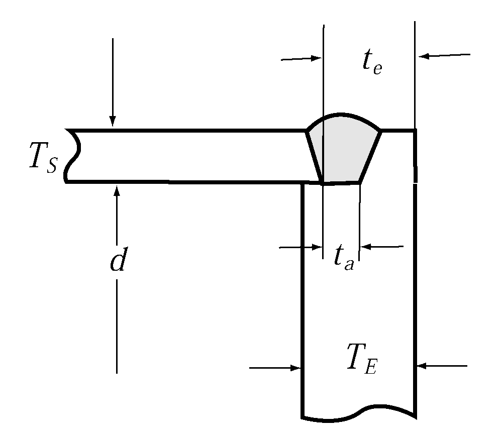 | (1) Tube headers only. (2) $T_s \geq 1.25 T_ro$ (circular only) (3) $t_e$ is not to be less than 2$T_ro$ or 1.25$T_s$, whichever is the larger. (4) $t_a \geq T_s$ (but, need not be over 6.5 $\mathrm{mm}$) |

  | Welding part | Symbol | Welding mode | Remark |
  | --- | --- | --- | --- |
  | **(3) Welding joint between flue or furnace and shell or end plate** | 3 A |  | (1) To be applied for welding of boiler front. (2) Light fillet welding is to be employed for part ⓐ, (throat depth 4~6 $\mathrm{mm}$) (3) $\theta$ is to be 10°~20° (4) 5 ≦ $r$ ≦ 10 |
  | **(3) Welding joint between flue or furnace and shell or end plate** | 3 B |  | (1) To be applied for welding of boiler front. (2) $t \geq T_f$ (3) $L \geq 2T_s$ |
  | **(3) Welding joint between flue or furnace and shell or end plate** | 3 C |  | (1) To be applied for welding of boiler front. (2) $t \geq T_s - 3$ (3) $\theta$ is to be 10°~20° (4) 5 ≦ $r$ ≦ 10 |
  | **(3) Welding joint between flue or furnace and shell or end plate** | 3 D |  | To be applied for welding of boiler rear. |
  | **(4) welding joint between furnace ogee ring and shell plate** | 4 A 4 B |  | (1) $t \geq T_s$ (2) The welded surface is not be lower than the plate surface. |
  | **(4) welding joint between furnace ogee ring and shell plate** | 4 C 4 D |  | (1) $t \geq T_s$ (2) The welded surface is not be lower than the plate surface. |

  | Welding part | Symbol | Welding mode | Remark |
  | --- | --- | --- | --- |
  |   | 4 E |  | (1) $T \geq 1.265sqrtDP$ Where : $D$ = Inside diameter of shell ($\mathrm{mm}$) $P$ = Design pressure ($\mathrm{MPa}$) $T$ = Thickness of foundation ring ($\mathrm{mm}$) (2) Where $D$ ≦ 750 : $l$ ≧ 50 Where $D$ > 750 : $l$ ≧ 60 (3) In welding the part ⓐ, such welding process as should have a good penetration to the root is to be employed. |
  | **(5) Welding joint between washer or reinforcement ring and shell or end plate** | 5 A |  | (1) In case of $d$ < 60, to be applied. (2) $t_2 \geq 0.7t_m$ (3) The seal welding is to be employed for part ⓐ. |
  | **(5) Welding joint between washer or reinforcement ring and shell or end plate** | 5 B |  | (1) $t_1 + t_2 \geq 1.25t_m$ (2) $t_1$ , $t_2 \geq \frac{1}{3} t_m$ (but, the minimum is 6.5 $\mathrm{mm}$) |
  | **(5) Welding joint between washer or reinforcement ring and shell or end plate** | 5 C |  | (1) $t_1 + t_2 \geq 1.25t_m$ (2) $t_1$ , $t_2 \geq \frac{1}{3} t_m$ (but, the minimum is 6.5 $\mathrm{mm}$) |
  | **(6) Welding joint between nozzle and shell or end plate** | 6 A |  | (1) $t_c$ ≧ 6.5 or 0.7$t_m$, whichever is the smaller. (2) $t_1 + t_2 \geq 1.25t_m$ (3) $t_1$ , $t_2 \geq \frac{1}{3} t_m$ (but, the minimum is 6.5 $\mathrm{mm}$ ) (4) $t_w \geq 0.7t_m$ |
  | **(6) Welding joint between nozzle and shell or end plate** | 6 B |  | (1) $t_c$ ≧ 6.5 or 0.7$t_m$, whichever is the smaller. (2) $t_1 + t_2 \geq 1.25t_m$ (3) $t_1$ , $t_2 \geq \frac{1}{3} t_m$ (but, the minimum is 6.5 $\mathrm{mm}$ ) (4) $t_w \geq 0.7t_m$ |

  | Welding part | Symbol | Welding mode | Remark |
  | --- | --- | --- | --- |
  | **(6) Welding joint between nozzle and shell or end plate** | 6 C |  | (1) $t_c$ ≧ 6.5 or 0.7$t_m$, whichever is the smaller. (2) $t_1 + t_2 \geq 1.25t_m$ (3) $t_1$ , $t_2 \geq \frac{1}{3} t_m$ (but, the minimum is 6.5 $\mathrm{mm}$ ) (4) $t_w \geq 0.7t_m$ |
  | **(6) Welding joint between nozzle and shell or end plate** | 6 D |  | (1) $t_c$ ≧ 6.5 or 0.7$t_m$, whichever is the smaller. (2) $t_1 + t_2 \geq 1.25t_m$ (3) $t_1$ , $t_2 \geq \frac{1}{3} t_m$ (but, the minimum is 6.5 $\mathrm{mm}$ ) (4) $t_w \geq 0.7t_m$ |
  | **(6) Welding joint between nozzle and shell or end plate** | 6 E |  | (1) $t_c$ ≧ 6.5 or 0.7$t_m$, whichever is the smaller. (2) $t_1 + t_2 \geq 1.25t_m$ (3) $t_1$ , $t_2 \geq \frac{1}{3} t_m$ (but, the minimum is 6.5 $\mathrm{mm}$ ) (4) $t_w \geq 0.7t_m$ |
  | **(6) Welding joint between nozzle and shell or end plate** | 6 F |  | (1) $t_c$ ≧ 6.5 or 0.7$t_m$, whichever is the smaller. (2) $t_1 + t_2 \geq 1.25t_m$ (3) $t_1$ , $t_2 \geq \frac{1}{3} t_m$ (but, the minimum is 6.5 $\mathrm{mm}$ ) (4) $t_w \geq 0.7t_m$ |
  | **(7) Welding joint between stay stay tube or** **tube and tube plate or end plate** | 7 A |  | (1) $\phi \geq \frac{2}{3} P$, $P$ means the pitch of stay (same in the following) (2) $t_1 \geq \frac{2}{3} T_p$ (3) For the part marked ※, the light fillet welding (throat depth 4~6 $\mathrm{mm}$ ) or caulking from the plate side is to be done to fill up the gap. |
  | **(7) Welding joint between stay stay tube or** **tube and tube plate or end plate** | 7 B |  | (1) $\frac{2}{3} P > \phi \geq 3.5D$ (2) $t_1 \geq \frac{2}{3} T_p$ (3) The part marked with ※ is to be treated as mentioned above. |

  | Welding part | Symbol | Welding mode |   | Remark |
  | --- | --- | --- | --- | --- |
  | **(7) Welding joint between stay, stay tube or tube and tube plate or end plat** | 7 C |  |   |   |
  | **(7) Welding joint between stay, stay tube or tube and tube plate or end plat** | 7 D | 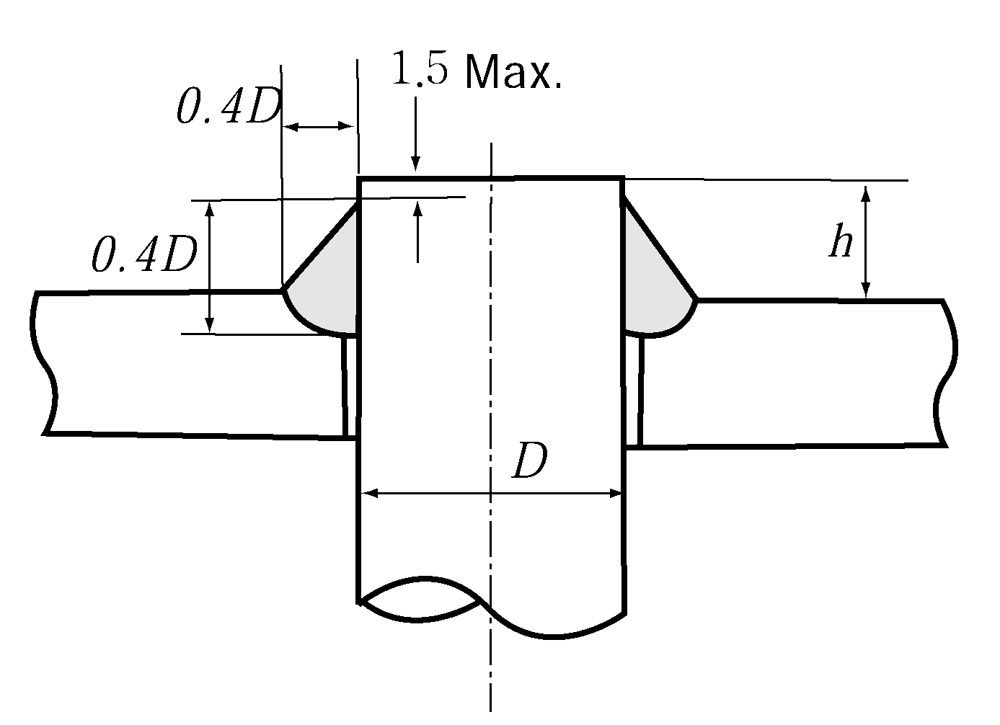 |   | On the side exposed to flame, $h$ ≦ 10.0 |
  | **(7) Welding joint between stay, stay tube or tube and tube plate or end plat** | 7 E | 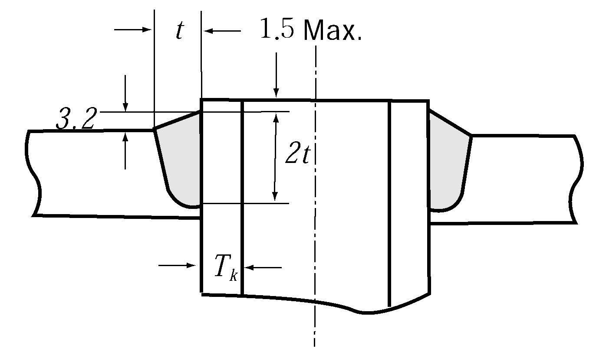 |   | (1) $t \geq T_k$ (2) To be welded after expanding the tube, and after the welding the tube is to be further expanded slightly. |
  | **(7) Welding joint between stay, stay tube or tube and tube plate or end plat** | 7 F | 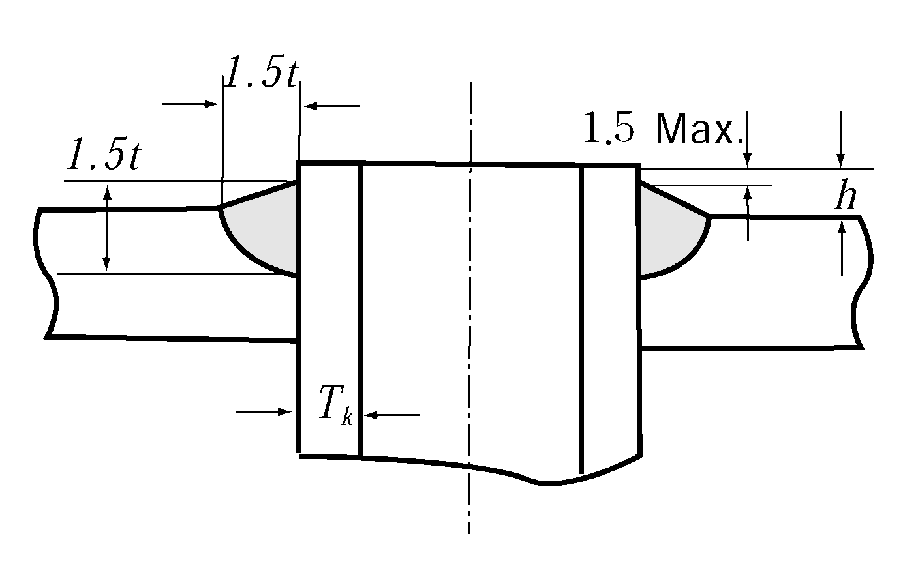 |   | (1) $t \geq T_k$ (2) To be welded after expanding the tube, and after the welding the tube is to be further expanded slightly. (3) On the side exposed to flame, $h$ ≦ 10 |
  | **(7) Welding joint between stay, stay tube or tube and tube plate or end plat** | 7 G | 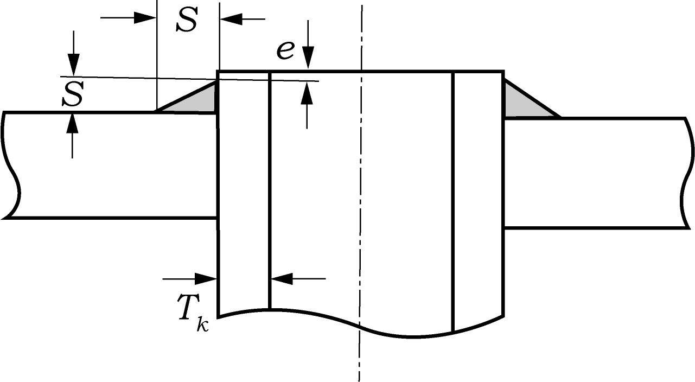 |   | (1) $S \geq T _{k} + 3$ (2) On the side exposed to flame, $e \leq 1.5$ (3) To be welded after expanding the tube |
  | NOTES : $T_s$ : Actual thickness of shell plate $T_h$ : Actual thickness of formed end plate $T_E$ : Actual thickness of flat end plate or cover plate $T_ro$ : Required thickness of seamless shell $T_p$ : Actual thickness of tube plate or flat end plate (formed end plate) |   |   | $T_f$ : Actual thickness of flue or furnace plate, actual thickness of the flange on a forged head at the large end. $T_n$ : Actual thickness of nozzle $t_m$ : Smaller value of thickness of plates to be welded, however, the maximum value being 20 $\mathrm{mm}$ $T_k$ : Actual thickness of stay tube or tube. |   |

  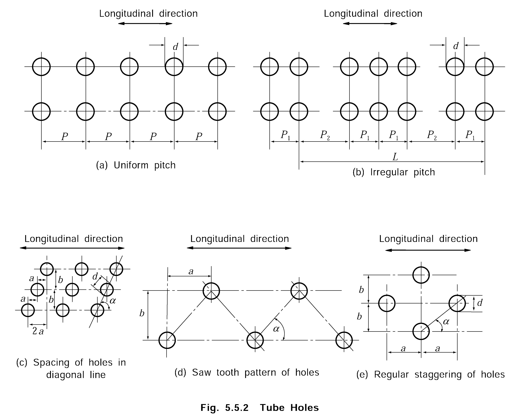
  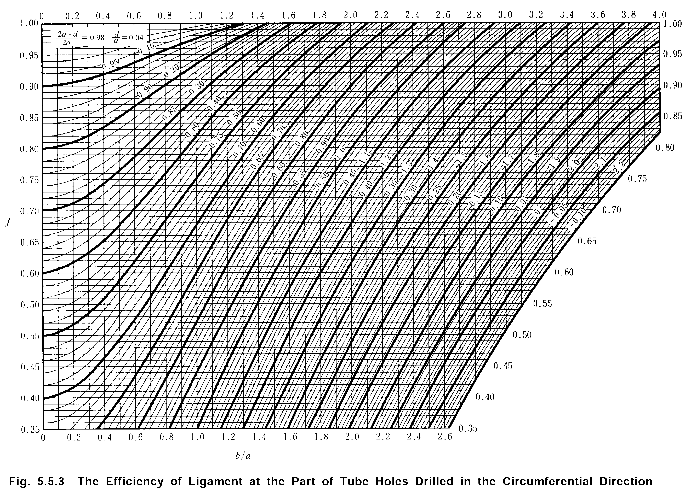
  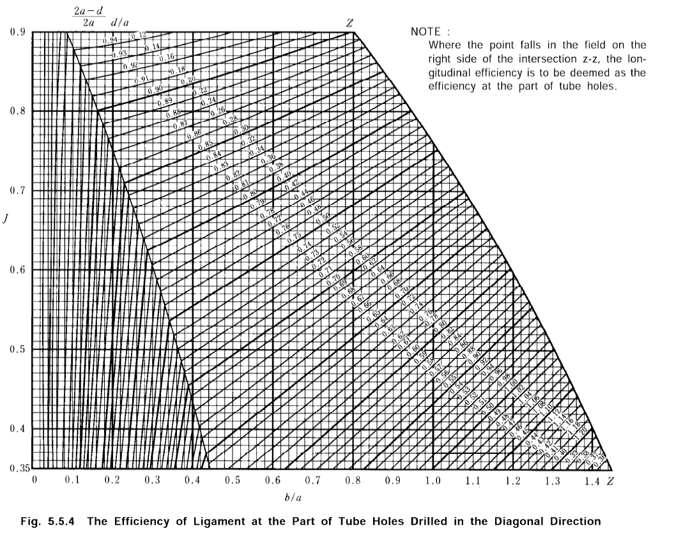

#### 107. Allowable stress

- **1.** The metal temperature at the heating surface, used to evaluate the allowable stress is to be taken as not less than the planned maximum temperature of the internal fluid increased by the temperature indicated in **Table 5.5.1.**

  | Heating surface in general | Heated by contact | 25 °C |
  | --- | --- | --- |
  | Heating surface in general | Heated by radiation | 50 °C |
  | Heating surface of superheater | Heated by contact | 35 °C |
  | Heating surface of superheater | Heated by radiation | 50 °C |
  | Heating surface of economizer | - | 25 °C |
- **2.** The allowable stresses which are used for the calculation of strength in this Section are to be as follows.
  - **(1)** The allowable stress of carbon steel (including carbon manganese steel, hereinafter the same being referred in this Section) and low alloy steels excluding cast steels is not to be greater than obtained from the following formulae, whichever is the smallest. The allowable stress at each metal temperature may also be in accordance with the values given in **Table 5.5.2** instead of the following formulae.
    $f = R_\frac{20}{2.7} , f = f_\frac{R}{1.6} , f = E_\frac{T}{1.6} , f = S_\frac{C}{1.0}$
    where :
    $R_20$ = Specified minimum tensile strength at room temperature ($\mathrm{N}/mm ^{2}$)
    $f_R$ = Average stress to produce rupture in 100,000 hours at the design temperature ($\mathrm{N}/mm ^{2}$)
    $E_T$ = Specified minimum yield stress or 0.2 percent proof stress ($\mathrm{N}/mm ^{2}$)
    $S_C$ = Average stress to produce an elongation (creep) of 1 % in 100,000 hours at metal temperature ($\mathrm{N}/mm ^{2}$)
  - **(2)** The allowable stress of cast steels is to be 80 % of the value obtained by the formula in (1) or the value given in **Table 5.5.2.**
  - **(3)** The allowable stress of materials other than those specified in (1) and (2) will be considered in each case by the Society taking account of the mechanical properties of the materials.

    | Kind of materials |   | Allowable stress $\mathrm{N}/mm ^{2}$ (1) |   |   |   |   |   |   |   |   |   |   |   |
    | --- | --- | --- | --- | --- | --- | --- | --- | --- | --- | --- | --- | --- | --- |
    | Kind of materials |   | 250 °C and below | 300 °C | 350 °C | 375 °C | 400 °C | 425 °C | 450 °C | 475 °C | 500 °C | 525 °C | 550 °C | 575 °C |
    | Steel plates for boiler | *RSP 24* | 110 | 104 | 103 | 96 | 88 | 76 | 57 | 39 |   |   |   |   |
    | Steel plates for boiler | *RSP 30* | 122 | 117 | 113 | 106 | 95 | 80 | 58 | 39 |   |   |   |   |
    | Steel plates for boiler | *RSP 32* | 124 | 122 | 121 | 114 | 102 | 84 | 58 | 39 |   |   |   |   |
    | Steel plates for boiler | *RSP 30A* | 122 | 117 | 113 | 113 | 113 | 108 | 101 | 90 | 69 | 48 |   |   |
    | Steel plates for boiler | *RSP 32A* | 124 | 122 | 121 | 121 | 121 | 117 | 106 | 91 | 69 | 48 |   |   |
    | Steels for header | *RBH*-1 | 105 | 104 | 103 | 97 | 88 | 76 | 57 | 39 |   |   |   |   |
    | Steels for header | *RBH*-2 | 117 | 115 | 113 | 106 | 95 | 80 | 58 | 39 |   |   |   |   |
    | Steels for header | *RBH*-3 | 102 | 99 | 96 | 96 | 96 | 93 | 91 | 87 | 67 |   |   |   |
    | Steels for header | *RBH*-4 | 106 | 104 | 103 | 103 | 103 | 102 | 98 | 92 | 74 |   |   |   |
    | Steels for header | *RBH*-5 | 106 | 104 | 103 | 103 | 103 | 102 | 98 | 92 | 81 | 64 |   |   |
    | Steels for header | *RBH*-6 | 106 | 104 | 103 | 103 | 103 | 102 | 98 | 92 | 81 | 64 |   |   |
    | Steel tubes for boiler(2) | *RSTH* 33 | 86 | 84 | 81 | 78 | 74 |   |   |   |   |   |   |   |
    | Steel tubes for boiler(2) | *RSTH* 35 | 88 | 87 | 86 | 82 | 76 | 66 | 53 |   |   |   |   |   |
    | Steel tubes for boiler(2) | *RSTH* 42 | 113 | 104 | 103 | 97 | 88 | 76 | 57 |   |   |   |   |   |
    | Steel tubes for boiler(2) | *RSTH* 12 | 102 | 99 | 96 | 96 | 96 | 94 | 91 | 87 | 69 |   |   |   |
    | Steel tubes for boiler(2) | *RSTH* 22 | 106 | 104 | 103 | 103 | 103 | 102 | 98 | 92 | 81 | 64 | 44 |   |
    | Steel tubes for boiler(2) | *RSTH* 23 | 106 | 104 | 103 | 103 | 103 | 102 | 98 | 92 | 81 | 64 | 47 | 34 |
    | Steel tubes for boiler(2) | *RSTH* 24 | 106 | 104 | 103 | 103 | 103 | 102 | 98 | 92 | 81 | 64 | 48 | 34 |
    | Forged Steel(3) |   | 1/4 of specified minimum tensile strength of material (where 350 °C and below) |   |   |   |   |   |   |   |   |   |   |   |
    | Cast steel(3) |   | 1/5 of specified minimum tensile strength of material (where 350 °C and below) |   |   |   |   |   |   |   |   |   |   |   |
    | NOTES : (1) In case where the temperature of a material is between those indicated in the Table, the value of allowable stress is to be determined by interpolation. (2) For the electric-resistance welded steel tubes, the values of $f$ are to be 85 $\%$ of these values. (3) Materials specified in **Pt 2, Ch 1.** |   |   |   |   |   |   |   |   |   |   |   |   |   |

#### 108. General construction and strength

- **1.** Because the formulae of this Section do not take into account such additional stresses as load from boiler fittings, localized stress, repeated load, thermal stress and so on, some measures such as increasing the size, etc. are to be taken, in case those effects are considered to exist.
- **2.** Economizer, exhaust-gas economizer and their accessories, and fittings on feed water pipes are to be designed to stand a pressure 1.25 times the design pressure of the boiler. Where, however, it is difficult to comply with the above, they may be designed basing upon the maximum working pressure of the feed water pump or the boiler water circulating pump concerned.
- **3.** Where part of the boiler drum and tube header is of the construction exposed to flames or high temperature gas, the part is to be suitably insulated with non-combustible material and sheathed with steel or other non-combustive material. In case where a part of the flue gas duct is composed of the end plate at the vapour space of the cylindrical boiler, the exposure of that part of flame is to be avoided by preparing an intercepting plate.
- **4.** The construction of shell type economizer is to be such that the inspection of welding part of the tube plate to shell plate can be easily carried out. And shell type economizer is to be provided with removable lagging at the welding part of the tube plate to shell plate to enable ultrasonic examination of the part even during subsequent surveys.
- **5.** The fixed parts of the flue tube of the vertical boilers are to be so designed that deformation of the flue tube induced by the thermal expansion of the hemispherical furnace may not be extremely restricted.
- **6.** Sufficient consideration is to be given to (1) and (2) to prevent overheat of the water tubes for the boilers having a high carolific capacity of combustion chamber :
  - **(1)** Boiler water is to sufficiently circulate to the water tubes
  - **(2)** Proper means such as water softner, etc. are to be provided, if necessary, to prevent attachment of scales.
- **7.** Consideration is to be given to prevent exhaust gas boilers and exhaust gas economizers, from being damaged by a soot fire.

#### 109. Shell plates and end plates

- **1.** The thickness of shell plates or end plates is not to be less than the required thickness prescribed in **Table 5.5.3** and further is not to be less than 6 $\mathrm{mm}$. The thickness of the formed end plate except for the full hemispherical end plate is not to be less than the thickness (calculated by using the efficiency equal to 1.00) of the shell to which the end plate is attached.
- **2.** The required thickness of the end plate having openings for which reinforcement is required is to comply with the following :
  - **(1)** In case where the openings are reinforced in accordance with the requirements in **115. 2** the required thickness is to be calculated by the previous paragraph.
  - **(2)** Where an end plate has a flanged-in manhole or access opening with a maximum diameter exceeding 150 $\mathrm{mm}$, and the flanged-in reinforcement complies with the requirements in **115. 6,** the thickness is to be calculated as follows :
    - **(A)** Dished or hemispherical end plates : The thickness is to be increased by not less than 15 % (if the calculated value is less than 3 $\mathrm{mm}$, the value is to be taken to 3 $\mathrm{mm}$) of the required thickness calculated by the formula in **Table 5.5.3.** In this case, where the inside crown radius of the end plate is smaller than 0.80 times the inside diameter of the shell, the value of the inside crown radius in the formula is to be 0.80 times the inside diameter of the shell. In calculating the thickness of the end plate having two manholes in accordance with this (A), the distance between the two manholes is not to be less than 1/4 of the outside diameter of the end plate.
    - **(B)** Semi-ellipsoidal end plates : In this case, the formula for a dished end plate in **Table 5.5.3** is to be applied. However, in this case $R _{2}$ is to be 0.80 times the inside diameter of shell and $E$ to be 1.77. *(2025)*
- **3.** The required thickness of end plates subject to pressure on the convex sides is not to be less than that obtained from the formula for end plates subject to pressure on the concave sides provided that the value of design pressure $P$, in the formula is taken as 1.67 times $P$.

  | Shell plates and end plates |   | Thickness ($\mathrm{mm}$) |
  | --- | --- | --- |
  | Shell plates | Cylindrical | $T = PD_\frac{1}{2 fJ -1.2P} + 1.0$ |
  | Shell plates | Spherical | $T = PR_\frac{1}{2 fJ -0.2P} + 1.0$ |
  | End plates | Dished(1) | $T = \frac{PR_2 E}{2 fJ -0.2P} + 1.0$ |
  | End plates | Semi-spherical | $T = PR_\frac{2}{2 fJ -0.2P} + 1.0$ |
  | End plates | Semi-ellipsoidal(2) | $T = PD_\frac{2}{2 fJ -0.2P} + 1.0$ |
  | $P$ = Design pressure ($\mathrm{MPa}$) $J$ = Minimum value of the efficiencies prescribed in **105.** and **106.** $f$ = Allowable stress prescribed in **107. 2.** ($\mathrm{N}/mm ^{2}$) $D_1$ = Inside diameter of shell ($\mathrm{mm}$) $D_2$ = Inside length of the major axis ($\mathrm{mm}$) $R_1$ = Inside radius of shell ($\mathrm{mm}$) $R_2$ = Inside crown radius ($\mathrm{mm}$) $E = \frac{1}{4} left( 3 + \sqrt{R_\frac{2}{r}} right)$ $r$ = Inside knuckle radius ($\mathrm{mm}$). |   |   |
  | NOTES : (1) The inside crown radius of dished end plate is not to be greater than the outside diameter of the flanged part of the end plate. The inside knuckle radius of end plate is not to be less than 6 % of the outside diameter of the flanged part of the end plate or 3 times the thickness of the end plate, whichever is greater. (2) Half the minor axis inside the semi-ellipsoidal end plate is not to be less than 1/2 of half the inside major axis of the end plate. |   |   |

#### 110. Flat end plates or cover plates without stay or other supports

The required thickness of flat end plates and cover plates without stay or other supports is not to be less than that obtained by the following formula :
$T=C _{1} C _{2} d \sqrt {\frac{P}{f}} +1.0 (\mathrm{mm})$
where :
$P$, $f$ = As specified in **Table 5.5.3.**
$d$ = Inside diameter of end plate at flange part in case of circular type ($\mathrm{mm}$)
= Inside length of the shortest of the spans in case of non-circular type ($\mathrm{mm}$)
$C_2$ = 1.00 for circular type
$C_2 = \sqrt{3.4 - \frac{2.4d}{b}}$ for non-circular type (but, need not exceed 1.6)
$b$ = Inside length of the greatest of the spans perpendicular to $d$ in case of noncircular end plates($\mathrm{mm}$)
$C_1$ = Constant determined by the fixing method and given in **Table 5.5.4.**

| Fixing method | #eqnID-829_1 |
| --- | --- |
| In case 2A in **Fig 5.5.1** | 1) In case $L$ is not restricted (circular or non-circular), $C_1$ = 0.50 |
| In case 2A in **Fig 5.5.1** | 2) Where $L \geq (1.1-0.8 \times T_S^2 /T_E^2 ) \sqrt{dT_E$ (circular only), $C_1$ = 0.39 |
| In case 2B in **Fig 5.5.1** | Circular or non-circular, $C_1$ = 0.50 |
| In case 2C, 2D, 2E, 2G, 2H in **Fig 5.5.1** | Circular, $C_1$ = 0.55. Non-circular, $C_1$ = 0.70 |
| In case 2F, 2J in **Fig 5.5.1** | Circular or non-circular, $C_1$ = 0.70 |
| In case 2I in **Fig 5.5.1** | Circular only, $C_1$ = 0.55 |

#### 111. Flat plates or tube plates with stay or other supports

- **1.** The required thickness of tube plates and flat plates is not to be less than 10 $\mathrm{mm}$ for tube plates and 6 $\mathrm{mm}$ for flat plates, regardless of the following paragraphs.
- **2.** The required thickness of flat plates supported by stays or stay tubes, arranged regularly is not to be less than that obtained by the following formula :
  $T=Cd \sqrt {\frac{P}{f}} +1.0 (\mathrm{mm})$
  where :
  $P$ = Design pressure ($\mathrm{MPa}$)
  $f$ = Allowable stress prescribed in **107. 2.** ($\mathrm{N}/mm ^{2}$)
  $d$ = $\sqrt{a^2 + b^2}$
  $a$ = Horizontal pitch of stays or stay tubes ($\mathrm{mm}$)
  $b$ = Vertical pitch of stays or stay tubes ($\mathrm{mm}$)
  $C$ = Constant determined by the fixing methods of stays or stay tubes and given in **Table 5.5.5.** In case where various fixing methods are used, the value $C$ is to be the mean of the constants for the respective methods.

  | Fixing method of stay or stay tube | $C$ |   |
  | --- | --- | --- |
  | Fixing method of stay or stay tube | In case the plates are exposed to flame | In case the plates are not exposed to flame |
  | In case the stays are inserted into the plate as 7 *A* in **Fig 5.5.1** | 0.38 | 0.35 |
  | In case the stays are inserted into the plate as 7 *B* in **Fig 5.5.1** | 0.40 | 0.37 |
  | In case the stays are inserted into the plate as 7 *C* in **Fig 5.5.1** | 0.44 | 0.41 |
  | In case the stays are inserted into the plate as 7 *D* in **Fig 5.5.1** | 0.53 | 0.50 |
  | In case the stay tubes are inserted into the plate as 7 *E* in **Fig 5.5.1** | 0.45 | 0.42 |
  | In case the stay tubes are inserted into the plate as 7 *F* in **Fig 5.5.1** | 0.52 | 0.49 |
  | In case the stay tubes are inserted into the plate as 7 *G* in **Fig 5.5.1** | 0.52 | 0.49 |
- **3.** At tube nests of tube plates supported by stay tubes arranged regularly, the required thickness of tube plates is not to be less than that obtained by the following formula : **【See Guidance】**
  $T=Cd \sqrt {\frac{P}{f}} +1.0 (\mathrm{mm})$
  where :
  $P$, $f$ = As specified in **Par 2.**
  $d$ = Average length of four sides of the quadrilateral composed by four centre points of stay tubes at the corresponding parts ($\mathrm{mm}$)
  $C$ = Constants determined by **Table 5.5.6.**

  | Fixing methods of stay tubes | $C$ |   |
  | --- | --- | --- |
  | Fixing methods of stay tubes | In case the plates are exposed to flame | In case the plates are not exposed to flame |
  | In case the stay tubes are inserted into the plate as 7 *E* in **Fig 5.5.1** | 0.54 | 0.51 |
  | In case the stay tubes are inserted into the plate as 7 *F* in **Fig 5.5.1** | 0.61 | 0.57 |
  | In case the stay tubes are inserted into the plate as 7 *G* in **Fig 5.5.1** | 0.61 | 0.57 |
- **4.** For the calculation of the required thickness of the flat plate in case where points of supports of stays or stay tubes are irregularly pitched, draw a maximum circle that passes through at least three points of supports with no point inside and the diameter $d_1$ of the circle is to be used as $d$ in the formula in **Par 2,** or $\sqrt{a^2 + b^2}$ is to be used as $d$ in the formula in **Par 3.**
- **5.** In case where the above formulae are applied, the commencement of curvature of the flange or the inside plain ends welded on shell or furnaces are to be regarded as points of supports, and the value of constant $C$ in **Par 2** is determined by **Table 5.5.7.**

  | Item | $C$ |   |
  | --- | --- | --- |
  | Item | In case exposed to flame | In case not exposed to flame |
  | The commencement of curvature. However, when the inner radius of the curvature is greater than 2.5 times the thickness of the plate, the points located at a distance of 3.5 times the thickness of plate from outer surface of the flange may be considered as a commencement of the curvature. | 0.39 | 0.36 |
  | The inside plain ends welded on shell or furnaces | 0.47 | 0.43 |

#### 112. Tube plates of vertical boiler

For vertical boilers where the smoke tubes are arranged horizontally, the required thickness of tube plate at the tube nests is not to be less than that obtained from the following formula or than that given by **111.3,** whichever is greater.
$T= \frac{PD}{1.97fJ} +1.0 (\mathrm{mm})$
where :
$P$, $f$ = As specified in **111. 2.**
$D$ = Twice the distance between the axis of shell and the centre of the outer row of tube holes ($\mathrm{mm}$)
$J = \frac{P_i - d}{P_i}$
$P_i$ = Vertical pitch of smoke tubes ($\mathrm{mm}$).
$d$ = Diameter of tube holes ($\mathrm{mm}$).

#### 113. Tube plates of boilers with wet combustion chamber

The required thickness of rear tube plate in boiler with wet combustion chamber subjected to compression due to the pressure on the top plate is not to be less than that obtained by the following formula or than that obtained from **111. 3,** whichever is the greater.
$T = \frac{PW}{183J} \mathrm{mm}$
where :
$P$ = Design pressure ($\mathrm{MPa}$)
$W$ = Breadth at the top of combustion chamber (Inside distance between rear tube plate and back chamber plate) ($\mathrm{mm}$)
$J = \frac{P_i - d}{P_i}$
$P_i$ = Horizontal pitch of smoke tube ($\mathrm{mm}$)
$d$ = Inside diameter of ordinary smoke tube ($\mathrm{mm}$)

#### 114. Manholes, mud holes and peep holes 【See Guidance】

- **1.** Manholes or mud holes are to be provided for boilers in a location where they do not come in the way on inspecting and cleaning of each portion of the boiler. The clear opening of manholes is to be not less than 300 $\mathrm{mm}$ by 400 $\mathrm{mm}$. A mudhole opening in a boiler shell is not to be less than 60 $\mathrm{mm}$ by 90$\mathrm{mm}$. Where, due to size or interior arrangement of a boiler, it is impractical to provide a manhole or other suitable opening for direct access, there are to be two or more suitable openings through which the interior can be inspected.
- **2.** The manhole cover of internal type is to be provided with a spigot which has a clearance of not more than 1.5$\mathrm{mm}$ all round.
- **3.** For the vertical boilers having cross tubes, a mud hole or some other proper attachment is to be provided for the purpose of cleaning the tube interior. Where, however, the diameter of the cross tubes is large, there are to be peep holes in the shell opposite to one end of each tube sufficiently large to permit the tube to be examined and cleaned in the easiest accessible position.
- **4.** The caps of the peep holes of headers are to be rigid in construction, and the repetition of covering and uncovering is not to impair safety. In case where the cap is bolted, it is to be of such construction that the breakage of the bolts does not cause danger.

#### 115. Reinforcement of openings

- **1.** Openings in the shell are to be reinforced in accordance with the following Paragraph except single openings having a maximum diameter of not larger than 1/4 of the inside diameter of the shell and of not larger than 60 $\mathrm{mm}$ and the shell plate having margin in thickness for which no reinforcement is needed.
- **2.** For openings in shell plates and formed end plates, reinforcement is to be provided in such a manner that the area of its cross section through the centre of the opening and normal to the surface of the opening is not less than that calculated by the following formula:
  $A=dT _{r} (\mathrm{mm} ^{2} )$
  where :
  $d$ = Maximum diameter of the finished opening in the longitudinal cross section for the shell plate or in the cross section for the end plate ($\mathrm{mm}$)
  $T_r$ = Required thickness for a seamless shell or for a blank end plate ($\mathrm{mm}$), except that, where the opening and its reinforcement are entirely within the spherical portion of a dished end plate, $T_r$ is the thickness required for a seamless hemispherical end having the equal radius to the spherical portion of the head plate, and where the opening and its reinforcement are in semi-ellipsoidal end plate and are located entirely within a circle the centre of which coincides with the centre of the end plate and the diameter of which is equal to 80 % of the shell inside diameter, $T_r$ is the thickness required for a seamless hemispherical head plate of a radius equal to 90 % of the shell inside diameter.
- **3.** Where the flat head plates or cover plates prescribed in **110.** have openings with a diameter not exceeding one-half of the end plate diameter or the shortest span, the end plates are to have a total cross-sectional area of reinforcement not less than that given by the following formula :
  $A=0.5dT _{r} (\mathrm{mm} ^{2} )$
  where :
  $d$ = Maximum diameter of holes ($\mathrm{mm}$)
  $T_r$ = Required thickness calculated from the formula prescribed in **110.** ($\mathrm{mm}$)
- **4.** **Effective limits of reinforcement**
  Reinforcement is to be provided within its effective limits. The limits of reinforcement are designated as the boundaries which are surrounded by two lines parallel to the centre line of the opening expressed by $L$ and two lines vertical to inner and outer surfaces of the plate containing the centre of the opening expressed by $H$. The values of $L$ and $H$ may be taken as follows : (Also see **Fig 5.5.5**)
  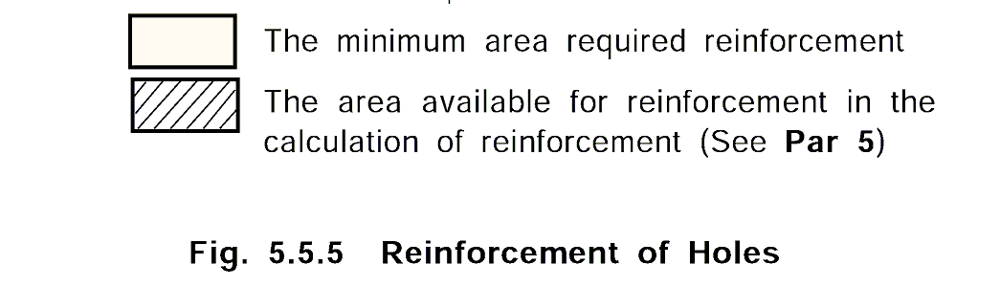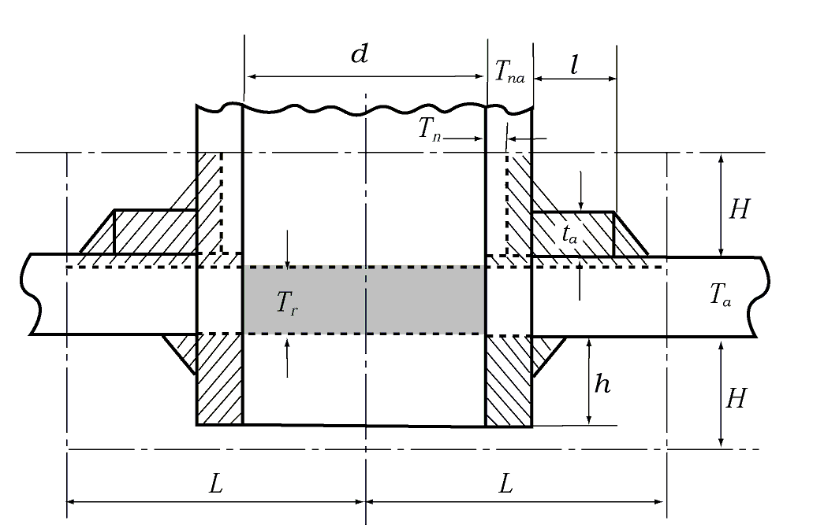
  where :
  $L$ = $d$ or ($d/2 + T_a + T_na$), whichever is greater ($\mathrm{mm}$)
  $H$ = 2.5$T_a$ or (2.5$T_na + t_a$), whichever is smaller ($\mathrm{mm}$)
  *d* = Diameter of opening in the cross section where reinforcement is intended ($\mathrm{mm}$)
  $T_a$ = Actual thickness of the shell or end plate ($\mathrm{mm}$)
  $T_na$ = Actual thickness of stand pipe ($\mathrm{mm}$)
  $t_a$ = Actual thickness of reinforcement plate ($\mathrm{mm}$)
- **5.** **The area available for reinforcement**
  The area available for reinforcement in the shell or end plate may be obtained as follows :
  The total of these areas in each case is not to be less than the required sectional area $A$ of reinforcement given in **Par 2** or **Par 3.** Where the opening requiring reinforcement passes through a joint in the shell or end plate, the actual area of the reinforcement is to be such that the efficiency of the joint is fully taken into account
  $A _{1} =(T _{a} -T _{r} )(2L-d) (\mathrm{mm} ^{2} )$
  $A _{2} =2KH(T _{na} -T _{n} ) (\mathrm{mm} ^{2} )$
  $A _{3} =2KhT _{na} (\mathrm{mm} ^{2} )$
  $A _{4} =2Kt _{a} l (\mathrm{mm} ^{2} )$
  $A_5$ = Total section area of weld metal in one side ($\mathrm{mm} ^{2}$)
  $A \leq A_1 + A_2 + A_3 + A_4 + A_5$
  where :
  $T_a$, $T_na$, $t_a$, $d$, $L$*,* $H$ = As specified in **Par 4.**
  $T_r$ = As specified in **Par 2** or **3.**
  $T_n$ = Thickness of stand pipe provided as calculated from the formula in **Ch 6, 102. 6** minus corrosion allowance ($\mathrm{mm}$)
  $h$ = Length of stand pipe within the effective limit where provided inside of the shell or end plate ($\mathrm{mm}$)
  $l$ = Length of reinforcement in one side appearing in the cross section ($\mathrm{mm}$)
  $K = \frac{Allowable stress of reinforcing material or stand p ipe}{Allowable stress of shell or end plate}$ (Provided that $K$≤1.0)
- **6.** Where the end plate is bent around the manhole to form a flange, the depth of flange is not to be less than that obtained by the following formula :
  Where the thickness of end plate is not more than 38 $\mathrm{mm}$ :
  $h=3T _{r} (\mathrm{mm})$
  Where the thickness of end plate exceeds 38 $\mathrm{mm}$ :
  $h=T _{r} +76 (\mathrm{mm})$
  where :
  $h$ = Depth of flange measured along the major axis of opening from the outer surface of end plate ($\mathrm{mm}$)
  $T_r$ = The required thickness of end plate ($\mathrm{mm}$)

#### 116. Flues, furnaces, ogee rings and cross tubes

- **1.** The thickness of flues is not to be less than that given by the following Paragraph and in no case is to be less than 5 $\mathrm{mm}$ and more than 22 $\mathrm{mm}$.
- **2.** The thickness of corrugated furnace plates is not to be less than that obtained by the following formula :
  $T= \frac{PD}{C} +1.0 (\mathrm{mm})$
  where :
  $P$ = Design pressure ($\mathrm{MPa}$)
  $D$ = Minimum outside diameter measured at corrugated part of furnace ($\mathrm{mm}$)
  $C$ = Constant determined by **Table 5.5.8.**

  | Furnaces | $C$ |
  | --- | --- |
  | Morison, Deighton, Fox and similar furnaces | 107 |
  | Leeds forge bulb furnaces | 104 |
- **3.** The required thickness of plain cylindrical furnace or cylindrical bottom of combustion chambers which are not reinforced by stays or other means is not to be less than that obtained by the following formulae, whichever is greater. **【See Guidance】**
  $T _{1} = \sqrt {\frac{PD(L+610)}{10,500}} +1.0 (\mathrm{mm}), T _{2} = \frac{1}{325} \left( \frac{PD}{0.35} +L \right) +1.0 (mm)$
  where :
  $P$ = Design pressure ($\mathrm{MPa}$)
  $D$ = External diameter of furnace or combustion chamber bottom ($\mathrm{mm}$)
  $L$ = Length of furnace or depth of combustion chamber bottom ($\mathrm{mm}$)
  The length of furnace, however, is measured from commencement of curvature where the furnace plates are flanged and jointed to other plates, reinforcing rings, etc.
- **4.** The required thickness of a hemispherical furnace without stays or other means is not to be less than that obtained by the following formula :
  $T= \frac{PR}{62} +1.0 (\mathrm{mm})$
  where :
  $P$ = Design pressure ($\mathrm{MPa}$)
  $R$ = Outside radius of hemispherical furnace ($\mathrm{mm}$)
- **5.** The required thickness of furnace supported by stays or other means or cylindrical steel plates exposed to flame is to be determined in accordance with the following requirements, choosing the value whichever is greater.
  - **(1)** The sum of the thickness calculated by the formula in **Par 3** and that given by the formula in **111. 2** using 0.50 times the design pressure specified.
  - **(2)** The sum of the thickness calculated by the formula in **111. 2** and that given by the formula in **Par 3** using 0.50 times the design pressure specified, whichever is the greater.
- **6.** **Ogee rings**
  Where ogee rings are used to connect the furnace bottom of vertical boiler to shell and to sustain the whole load of the furnace, the required thickness of ogee rings is not to be less than that obtained by the following formula :
  $T= \frac{\sqrt {PD(D-D _{0} )}}{1010} +1.0 (\mathrm{mm})$
  where :
  $P$ = Design pressure ($\mathrm{MPa}$)
  $D$ = Inside diameter of boiler shell ($\mathrm{mm}$)
  $D_0$ = Outside diameter of the lower part of the furnace at the joint with ogee ring ($\mathrm{mm}$)
- **7.** **Cross tubes**
  In cross tube boilers, the required thickness of cross tubes is not to be less than that obtained by the following formula. In no case, however, the thickness of cross tubes is to be less than 9.5 $\mathrm{mm}$.
  $T= \frac{PD}{45} +6.5 (\mathrm{mm})$
  where :
  $P$ = Design pressure ($\mathrm{MPa}$)
  $D$ = Inside diameter of cross tubes ($\mathrm{mm}$)

#### 117. Stays, stay tubes and girders

- **1.** The required diameter of stays or stay tubes is not to be less than that obtained by the following formula. However, the thickness of stay tube is not to be less than 6.0 $\mathrm{mm}$ for those in bounding rows of tube nests, nor 4.5 $\mathrm{mm}$ for others. **【See Guidance】**
  $d=C _{1} k \sqrt {PA} +C _{2} (\mathrm{mm})$
  where :
  $P$ = Design pressure ($\mathrm{MPa}$)
  $A$ = Area of plate supported by one stay or stay tube ($\mathrm{mm} ^{2}$)
  $k = \frac{1}{\sqrt{1-z^2}}$
  $z = \frac{I nside diameter}{Outside diameter}$, for stay tube
  = 0, for stays
  $C_1$, $C_2$ = Constants determined by **Table 5.5.9.**

  | Description | $C_1$ | $C_2$ |
  | --- | --- | --- |
  | Longitudinal stays without screws | 0.127 | 3 |
  | Screwed stays | 0.139 | 3 |
  | Stay tubes | 0.158 | 0 |
- **2.** Where stays are fitted diagonally, the required diameter of the stay is not to be less than that obtained from the formula in **Par 1** with the value of $C_1$ substituted by $C_3$ given in the following formula :
  $C_3 = C_1 \sqrt{\frac{L}{H}}$
  where :
  $L$ = Length of diagonal stay ($\mathrm{mm}$)
  $H$ = Length of line, drawn perpendicular to boiler head or surface supported, to center of palm of diagonal stay ($\mathrm{mm}$)
- **3.** The required thickness of girders, or sum of the thickness in case of double plate construction supporting top plates of combustion chambers is not to be less than that obtained by the following formula :
  $T= \frac{PWP _{i} (W-a)}{CH ^{2} S} (\mathrm{mm})$
  where :
  $P$ = Design pressure ($\mathrm{MPa}$)
  $W$ = Width of combustion chamber at upper part (the inside distance between rear tube plate and back plate of combustion chamber) ($\mathrm{mm}$)
  $P_i$ = Pitch of girders ($\mathrm{mm}$)
  $a$ = Spacing of stay bolts supporting girder ($\mathrm{mm}$). For the welding type, $a$ is to be 0.
  $S$ = Specified minimum tensile strength of the girder material ($\mathrm{N}/mm ^{2}$)
  $H$ = Depth of girder at centre ($\mathrm{mm}$)
  $C$ = Constants determined by **Table 5.5.10.**

  | Description |   | $C$ |
  | --- | --- | --- |
  | Bolt type | The number ($n$) of stay bolts in each girder is odd | $25 \times \frac{n}{n}+1$ |
  | Bolt type | The number ($n$) of stay bolts in each girder is even | $25 \times n+\frac{1}{n}+2$ |
  | Welding type |   | 31 |
- **4.** For top and side plates of combustion chambers in boiler with wet combustion chamber, the distance between outer row of the nearest stay to tube plate or back plate and the commencement of curvature of tube plate or back plate is to be not more than the value of "$a$" calculated by substituting design pressure in the formula of **111. 2.**
- **5.** Where the outer radius of curvature at the flange part joining the top and side plates of combustion chambers is less than one-half the allowable pitch, $P_i$, of the girder calculated by substituting design pressure in the formula in **Par 3,** the distance measured from the inside surface of side plate to the centre of girder adjacent to the side plate is not to be greater than the allowable pitch, $P_i$, of the girder. Where this radius is greater than one-half the value of $P_i$, the distance from the beginning point of the curvature at the flange part to the centre of the girder is not to be greater than one-half the value of $P_i$.

#### 118. Headers

- **1.** The required thickness of cylindrical headers is not to be less than that obtained by the formula in **Table 5.5.3.**
- **2.** The required thickness of square headers is not to be less than that obtained by the following formula :
  $T= \frac{Pl _{2}}{4f} \left( 1+ \sqrt {1+ \frac{8fl _{1} ^{2}}{CPl _{2} ^{2}}} \right) +1.0 (\mathrm{mm})$
  where :
  $P$ = Design pressure ($\mathrm{MPa}$)
  $f$ = Allowable stress prescribed in **107. 2** ($\mathrm{N}/mm ^{2}$)
  $l_1$ = Inside breadth measured between supports of flat surface for the strength calculation ($\mathrm{mm}$)
  $l_2$ = Inside breadth of another side adjacent to $l_1$ ($\mathrm{mm}$)
  $C$ = 2.0, where holes are not arranged in succession
  = 1.0 + $J$, where holes are arranged in succession.
  $J$ = Longitudinal efficiency of openings arranged in succession choosing the least value obtained in accordance with **106.**
- **3.** Where the shape and dimension of the openings provided on headers are irregular, the minimum shell thickness of headers is to be specially considered by the Society.
- **4.** **Thickness of part of peep holes of tube header**
  The peep holes of tube headers are to be well machined so that they may be effectively covered. In this case, the thickness of the tube headers may be 1.0 $\mathrm{mm}$ less than that calculated by the formula in **Par 2,** but is not to be less than 9 $\mathrm{mm}$.

#### 119. Stand pipes

The thickness of stand pipes welded to shell is not to be less than either the value of 1/25 of the outside diameter of the stand pipes plus 2.5 $\mathrm{mm}$ or the value calculated by the formula in **Ch 6, 102. 6.** However, it need not exceed the required thickness of the shell at the part where the stand pipe is attached.

#### 120. Boiler tubes

- **1.** The thickness of the boiler tubes is not to be less than that given by the formula in **Par 2,** and not to be less than 2$\mathrm{mm}$ for the tubes less than 30 $\mathrm{mm}$ in outside diameter and not to be less than 2.5 $\mathrm{mm}$ for the tubes more than 30 $\mathrm{mm}$ in outside diameter. For tubes to be expanded or bent, their thickness is to be increased to compensate for thickness reduction due to expansion or bending.
- **2.** The required thickness of smoke tubes for boilers is to be calculated by the following formula (1). And, the required thickness of water tubes, evaporating tubes, and superheater tubes subjected to the internal pressure of boilers is to be calculated by the following formula (2).
  - **(1)** $T= \frac{Pd}{70} +2.0 (\mathrm{mm})$
  - **(2)** $T= \frac{Pd}{2f+P} +1.5 (\mathrm{mm})$
    where :
    $P$ = Design pressure ($\mathrm{MPa}$)
    $d$ = Outside diameter of tube ($\mathrm{mm}$)
    $f$ = Allowable stress prescribed in **107. 2** ($\mathrm{N}/mm ^{2}$)
- **3.** **Tube holes**
  Tube holes in the tube plates of drums are to be formed in such a way that the tubes can be effectively tightened in them. Where the tubes are practically normal to the tube plates, the parallel seating of the holes is not to be less than 10 $\mathrm{mm}$ in depth. Where the tube ends are not normal to the tube plate, the depth of the holes perpendicular to the tube plate is not to be less than 10 $\mathrm{mm}$ for tubes not exceeding 60 $\mathrm{mm}$ in outside diameter, and not to be less than 13 $\mathrm{mm}$ for tubes exceeding 60 $\mathrm{mm}$ in outside diameter.
- **4.** **Fixing**
  All tubes are to be tightly attached to the tube plate by expanding or other suitable methods and the ends are to project through the tube plate not less than 6 $\mathrm{mm}$, except where being attached by welding. Both ends of tubes are to be fixed to tube plates in such a manner that they will never fall off. When fixing them simply with the tube end expanded in a flare shape, the taper is to be 30° or more.

#### 121. Bolting methods of cover plates

- **1.** Bolting methods of attaching unstayed cover plates are to follow the examples in **Fig 5.5.6** or other methods with the equivalent effectiveness, and the required thickness of unstayed cover plates is not to be less than that obtained by the following formulae.
  - **(1)** In case where a full-face gasket is used : (**Fig 5.5.6 A**)
    $T=d \sqrt {\frac{C _{1} P}{f}} +1.0 (\mathrm{mm})$
  - **(2)** In case where it is necessary to consider a moment due to gasket reaction : (**Fig 5.5.6 B**)
    For circular plate : $T=d \sqrt {\frac{C _{1} P}{f} + \frac{1.78Wl}{fd ^{3}}} +1.0 (\mathrm{mm})$
    For non-circular plate : $T=d \sqrt {\frac{C _{1} C _{2} P}{f} + \frac{6Wl}{fLd ^{2}}} +1.0 (\mathrm{mm})$
    where :
    $P$ = Design pressure ($\mathrm{MPa}$)
    $f$ = Allowable stress given in **107. 2** ($\mathrm{N}/mm ^{2}$)
    $d$ = Diameter of circular plate or the shortest span of non-circular plate measured as indicated in **Fig 5.5.6** ($\mathrm{mm}$)
    $b$ = Longest span of non-circular plate measured perpendicular to the shortest span $d$ ($\mathrm{mm}$)
    $C_1$ = Constant depending on attaching methods given in **Fig 5.5.6.**
    $C_2 = 3.4 - 2.4d/b$ (but, need not exceed 2.5)
    $W$ = Total bolt load ($\mathrm{N}$)
    $L$ = Length of non-circular curve through the centres of bolts ($\mathrm{mm}$)
    $l$ = Arm length due to gasket reaction, equal to radial distance from the centre line of bolts to the line of gasket reaction ($\mathrm{mm}$)
    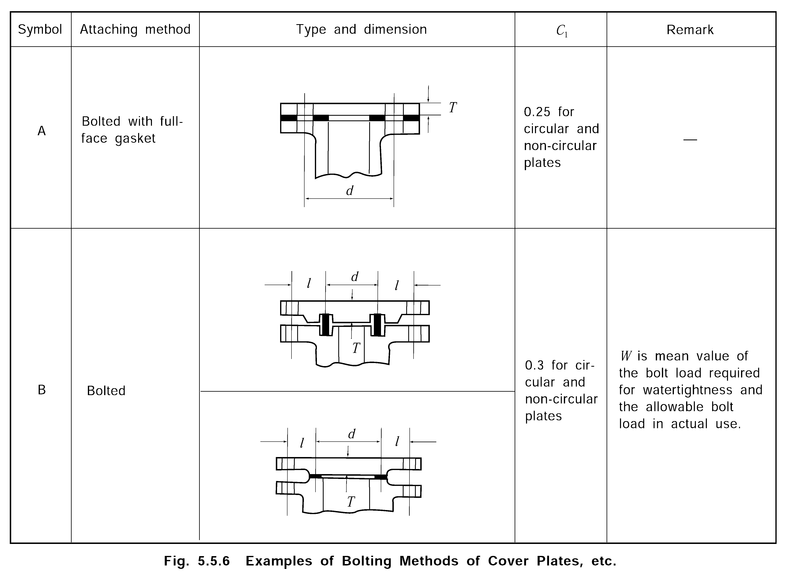

#### 122. Boiler mountings

- **1.** The requirements in this Section apply to the fittings attached to boilers, such as valves, except where otherwise specified, and the requirements in **Ch 6** and **Pt 6, Ch 2** also apply respectively to the portions of boiler fittings that have close relation with piping systems and to the boilers that employ automatic and/or remote control.
- **2.** Valves having nominal diameter not less than 50 $A$ are to be of the outside-screw and yoke-rising-spindle type closing to the right hand with the bolted bonnet. Valves are to be fitted with an indicator to show whether the valve is opened or closed, except for the rising stem type.
- **3.** All valves and cocks attached directly to a boiler are to be attached to the boiler with flange or by welding. Where stand pipes or distance pieces are used between the shell and mountings, they are to be as short as practicable. Where the thickness of boiler plate is 12 $\mathrm{mm}$ or above, or where a special stand for screwing is welded to the plate, the valves or cocks may be effectively attached to the boiler by pipe thread having a nominal diameter of 32 $A$ and under. Where valves or cocks are attached to the boiler by stud bolts, the depth of threaded part inside the bolt holes is not to be less than diameter of bolt. The holes, however, are not to penetrate the whole thickness of the boiler plate.

#### 123. The quantity and capacity of safety valves and relief valves

- **1.** Boilers are to be fitted with not less than 2 spring loaded safety valves. However, only 1 safety valve may be accepted for the following boilers :
  - **(1)** Boilers with heating surface of less than 10 $\mathrm{m} ^{2}$
  - **(2)** Boilers with the design pressure of not more than 1 $\mathrm{MPa}$, provided that they are equipped with a pressure controlling device and a device which cuts off fuel supply automatically at a pressure not exceeding the design pressure.
- **2.** Safety valve with spring pilot valve may be used in lieu of spring loaded safety valve. The safety valve with spring pilot valve is to operate satisfactorily with the steam pressure.
- **3.** In case where the boiler is provided with a superheater, at least one safety valve is to be fitted up at the outlet of the superheater.
- **4.** **Total area of safety valve seats**
  The total area of safety valve seats(for full bore valve, the required nozzle throat area) is not to be less than the required area given by the following formula. And, the seat diameter of safety valves is to be 25 $\mathrm{mm}$ or over, unless it is specially approved. For any boiler with an exhaust gas economizer which is so designed that it may be additionally heated while in use, the required area of the safety valves is to be calculated with the aggregated value of maximum evaporating capacity of boiler and evaporating capacity of exhaust gas economizer. But, the safety valves of the boiler having a superheater are to comply with **Par 6.**
  - **(1)** For saturated steam
    $A= \frac{KW}{10.5P+1.0} (\mathrm{mm} ^{2} )$
    where :
    $A$ = Required area of safety valve seats ($\mathrm{mm} ^{2}$)
    $W$ = Designed maximum evaporating capacity ($\mathrm{kg}/hr$)
    $P$ = Set pressure of safety valve ($\mathrm{MPa}$)
    $K$ = Values given by **Table 5.5.11.**

    | Type of safety valves | $K$ | Remarks |
    | --- | --- | --- |
    | Ordinary type ( 15 ＜ $D/L$ ≤ 24 ) | 20.8 | $d _{n}$ : Diameter of throat ($\mathrm{mm}$) $L$ : Lift ($\mathrm{mm}$) $D$ : Inside diameter of valve seat ($\mathrm{mm}$) |
    | High lift type ( 7 ＜ $D/L$ ≤ 15 ) | 10.0 | $d _{n}$ : Diameter of throat ($\mathrm{mm}$) $L$ : Lift ($\mathrm{mm}$) $D$ : Inside diameter of valve seat ($\mathrm{mm}$) |
    | Improved high lift type ( $D/L$ ≤ 7 ) | 5.0 | $d _{n}$ : Diameter of throat ($\mathrm{mm}$) $L$ : Lift ($\mathrm{mm}$) $D$ : Inside diameter of valve seat ($\mathrm{mm}$) |
    | Full bore type ( $D$ ≥ 1.15 $d _{n}$ ) | 3.34 | $d _{n}$ : Diameter of throat ($\mathrm{mm}$) $L$ : Lift ($\mathrm{mm}$) $D$ : Inside diameter of valve seat ($\mathrm{mm}$) |
    | NOTES : 1. Where $K$ is less than the above values, $K$ is to be approved by the Society. |   |   |
  - **(2)** For superheated steam
    The area is to be the value calculated by the formula in (1), multiplied by
    $1+ \frac{De gree of su perheat}{556}$
- **5.** **Area of steam passages**
  - **(1)** The required areas of steam passages of the ordinary type safety valve at the chest inlet and outlet are not to be less than 0.5 times and 1.1 times the required valve seat area respectively.
  - **(2)** The required areas of steam passages of the high lift type safety valve at the chest inlet and outlet are not to be less than the same and 2 times the required valve seat area respectively.
  - **(3)** The required areas of steam passages of the improved high lift type safety valve at the chest inlet and outlet are not to be less than 1.1 times and 2 times the steam passage area when the valve lift is 1/7 of the valve seat diameter respectively.
  - **(4)** The area of steam passage at the valve seat for the full bore safety valve is not to be less than 1.05 times the area at the throat, when the valve is open. Further, the areas of steam passages at the valve inlet and the nozzle are not to be less than 1.7 times the area at the throat, and the minimum steam passage area at the outlet is not to be less than 2 times the area at the valve seat when the valve is open.
- **6.** **Safety valve of superheater and reheater**
  - **(1)** Where a superheater is considered as an integral part of a boiler with no intervening valve between the superheater and the boiler, the area of superheater safety valve seats may be included in determining the required total area of safety valve seats for the boiler as a whole, but is not to be credited of more than 25 $\%$ of the total capacity required in **Par 4.**
  - **(2)** The discharge capacity of the superheater safety valve is to be such that when main steam supply at normal load is shut down in an emergency, the superheater does not receive damages. In cases where this purpose cannot be achieved, the installation is to be provided so that a part of the fuel supply to the boiler is automatically shut down in emergency.
  - **(3)** One or more safety valves are to be fitted at the inlet and the outlet respectively of the independent reheater or the independent superheater, and the total discharge capacity is not to be less than the maximum passing steam quantity. The total discharge capacity of the safety valve provided at its outlet is not to be less than the quantity necessary to keep the steam temperature of the independent reheater or independent superheater not more than the designed point. However, for the independent superheater connected directly to the boiler which is designed with the same design pressure as that of the boiler, one or more safety valves are to be fitted at its outlet, and the total discharge capacity is not to be less than the quantity necessary to keep the steam temperature of the independent superheater not more than the designed point.
- **7.** For the economizer and exhaust gas economizer equipped with a cutoff device from the boiler, one or more relief valves that are capable of discharging the quantity not lower than that calculated from the maximum absorbable energy are to be fitted. But, for shell type exhaust gas economizer having a total heating surface of 50 $\mathrm{m} ^{2}$ or more, two or more relief valves that are capable of discharging the quantity not lower than that calculated from the maximum absorbable energy are to be fitted.

#### 124. Construction and tests of safety valves and relief valves 【See Guidance】

- **1.** The safety valves and relief valves are to be so constructed that the springs and valves cannot be overloaded from outside and in case of fracture of the springs cannot spring out of their cages.
- **2.** The valve springs are to be so set that the amount of contraction in length is not less than one-tenth the diameter of the valve seat, and the spring is to be such that the amount of permanent set will not exceed 1 $\%$ of the free length after it is fully compressed at cold state for 10 *minutes*.
- **3.** The safety valves and relief valves are to be provided with easing gears which will surely open the valves in case of emergency and their handles are to be placed in a safe and easily accessible location.
- **4.** The safety valves and relief valves are to be attached directly to boiler shells, headers, outlet connections of the superheater, or shells of shell type exhaust gas economizer by flanges or welded joints and the chests are to be of such type that they are not used in common with those of other valves. However, superheater safety valves may be fitted to the stand pipes or distance pieces attached at the outlet.
- **5.** **Waste steam pipe**
  - **(1)** The waste steam pipe of the safety valve and relief valve is to be of such construction that back pressure does not interfere with operation of the valve. The inside diameter of the waste steam pipe is not to be less than the diameter of the valve outlet, and is to be designed at the pressure 1/4 or more of the setting pressure of the safety valve or relief valve.
  - **(2)** Where a common waste steam pipe is provided for two or more safety valves, the cross sectional area of the common pipe is not to be less than the aggregate area of required outlet area of each safety valve and where a common waste steam pipe is provided for two or more relief valves, the cross sectional area of the common pipe is not to be less than the aggregate area of required outlet area of each relief valve. The waste steam pipes of boiler safety valves are to be separated from pipe lines containing drains such as waste steam pipes of relief valves for exhaust gas economizer or steam blow-out pipes to the atmosphere.
- **6.** **Drain**
  To avoid the accumulation of condensate on the outlet side of safety valves, the discharge pipes or safety valve housings are to be fitted with drainage arrangements from the lowest part, directed with continuous fall to a position clear of the economizer where it will not pose threats to either personnel or machinery. No valves or cocks are to be fitted in the drainage arrangements.
- **7.** **Setting**
  The safety valve or relief valve is to be set in accordance with the following requirements at the completion of manufacturing at the factory and after the installation in the ship. And the valve is to operate satisfactorily while relieving at its setting pressure.
  - **(1)** The safety valve of the boiler drum is to be set to relieve steam automatically at a pressure not exceeding the design pressure. In no case is the relief pressure to be greater than the design pressure of the steam piping or that of the machinery connected to the boiler plus the pressure drop in the steam piping.
  - **(2)** Where a superheater is fitted, the superheater safety valve is to be set to relieve at a pressure no greater than the design pressure of the steam piping or the design pressure of the machinery connected to the superheater plus pressure drop in the steam piping. In no case is the superheater safety valve to be set at a pressure greater than the design pressure of the superheater. The superheater safety valve is to be set to relieve steam automatically at a pressure not greater than the value which is obtained by subtracting the setting pressure of the safety valve or valves at the boiler drum by the value of 0.035 $\mathrm{MPa}$ plus the steam pressure drop in the superheater at the rated load.
  - **(3)** The relieving pressure of the safety valve at the outlet of the superheater is to be set lower than that at the inlet.
  - **(4)** The relieving pressure of the relief valve provided to the economizer or exhaust gas economizer is to be set at a pressure not exceeding the design pressure.
- **8.** **Accumulation test**
  The accumulation test of the boiler is to be conducted in the methods specified below. However, in case the data on the evaporation of the boiler submitted to the Society has been approved, the accumulation test prescribed in (1) may be omitted.
  - **(1)** When the safety valve blows under the maximum firing condition of the boiler with the stop valves closed except for the valves for steam supply to the machinery necessary to the operation of the boiler, the accumulation of pressure in the boiler drum is not to exceed 110 $\%$ of the design pressure. In this case, however, the feed water necessary to maintain a safe water level may be supplied.
  - **(2)** For the oil burning boiler with superheater, where the accumulation test might endanger the superheater with possible overheating, the operation test of the installation by merely shutting down quickly the main steam supply under the maximum output of the boiler, as specified in **123. 6** (2).
- **9.** In case the calculated discharge capacity of the safety valve does not comply with the requirement of **123. 4** on account of the reduction of the design pressure for the boiler, it may be accepted provided the accumulation test required by **Par 8,** (1) of the preceding Paragraph has been carried out with satisfactory results.

#### 125. Low water level safety device

Boiler is to be fitted with a low water level safety device which is capable of shutting off automatically the oil supply to the burners when the water level falls to a predetermined level higher than the critical level. The water level detector for this device is to be independent of water level detector for the feed water control system. For forced circulation boilers or once-through boilers, the safety device may be omitted, provided that the boiler is fitted with safety device specified in **129. 2.**

#### 126. Steam stop valves

- **1.** Main and auxiliary steam stop valves are to be fitted to the boiler shells at all steam outlets of boilers. Where a superheater is fitted as an integral part of a boiler, superheater steam stop valve is to be fitted at the superheater outlet side in order to prevent damage to the superheater.
- **2.** Where the steam discharge pipes of two or more boilers are connected to each other, two stop valves are to be fitted between the boiler and the connecting part and the stop valve adjoining to the boiler is to be of the screw down check valve.
- **3.** Where the diameter of steam stop valves exceeds 150 $\mathrm{mm}$ nominal diameter, by-pass valve is to be arranged as far as practicable for plant warm-up purpose.

#### 127. Feed water connection and valves

- **1.** A feed stop valve attached directly to the boiler is to be fitted to feed openings and a screw down check valve is to be provided as close to the stop valve as practicable. An approved feed water regulator may, however, be fitted between the check and stop valves.
- **2.** Notwithstanding the requirement in **Par 1**, where the boiler has an economizer which is recognized as integral part of the boiler, the stop valves may be provided directly at the economizer inlet. In this case a screw-down check valve is to be provided as close to the stop valve as practicable.
- **3.** Boilers fitted with economizers are to be provided with a check valve located in the feed water line between the economizer and the boiler drum. This check valve is to be located as close to the boiler drum feed water inlet openings as possible. When a by-pass is provided for the economizer, the check valve is to be of the stop-check type.
- **4.** The part of the drum shell where feed water is discharged into the boiler is to be so arranged that a remarkable thermal stress may not occur due to direct contact of the feed water to the shell plate. This requirement is also to be applied to the parts of the boiler drum having desuperheater where the superheated steam pipes are penetrated through the drum.
- **5.** Feed water discharge in the drum is to be distributed as far apart as practicable so that it may not impinge directly on the heating surfaces of the boiler at high temperature.

#### 128. Blowoff valves and blowoff piping

- **1.** **Design**
  The design pressure of blowoff piping is not to be less than 1.25 times the design pressure of the boiler.
- **2.** **Blowoff valves**
  The boiler is to be provided with a blowoff valve mounted directly on its drum so that the boiler water may be discharged from the bottom of its water space ; its nominal diameter is not to be less than 25$\mathrm{A}$ but not more than 65$\mathrm{A}$, except that for boilers with heating surface of 10 $\mathrm{m} ^{2}$ or less, the blowoff valve may be 20$\mathrm{A}$ in nominal diameter. Blowoff valves are to be of such construction that they are free from accumulation of scale and other sediments.
- **3.** **Blowoff pipe**
  - **(1)** Where two or more boilers are installed and the blow off pipe of each boiler is connected to each other, screw-down check valves are to be fitted in each pipe line.
  - **(2)** Where the blowoff pipes are exposed to flame or high temperature gases, they are to be protected by thermal insulation materials.

#### 129. Water level indicator

- **1.** Each boiler is to be provided with at least two water level indicators independently, one of which is to be a glass water level gauge and the other is to comply with either of the following requirements. And, water level indicators other than glass water level gauge are to be type approved by the Society.
  - **(1)** Glass water level gauge located where the water level is easily read by the operator in his working area.
  - **(2)** Remote water level indicator.
- **2.** For forced circulation or once-through boilers, where **Par 1** is not applicable for the indication of water level, a suitable level detector and the low water level safety device which are comprised of two detectors so designed to prevent the overheating of any part of the boiler by lack of water supply is to be provided. **【See Guidance】**
- **3.** In cases the water space in the boiler is long in the transverse direction of the ship, or an excessive difference in water level is feared to occur, the level indicators prescribed in **Par 1** are to be provided on both ends of the water space.
- **4.** Construction of glass water level gauge is to be of the built-up rectangular-section box type(double-plate type) specified in the *Korean Industrial Standards or equivalent standards* or the equivalent approved by the Society.
- **5.** The lowest visible part of the glass water gauge is to be at least 50 $\mathrm{mm}$ above the lowest permissible water level. The visible range of the remote level indicator is to be such that it covers all the possible water levels as related to the water level control in the boiler.
- **6.** Each water gauge is to be fitted with shut-off valve or cock on the top and bottom, and drain valve at the bottom. Where top and bottom shut-offs of the watergauge are cocks, and where the water gauge or the water column is connected by the pipe to the boiler drum, the stop valves are to be fitted to the boiler drum.
- **7.** The water column to which the water gauge is attached is to be strongly supported so that it may maintain its correct position. The inside diameter of the water column is to be 45 $\mathrm{mm}$ or over and the draining device with nominal diameter 20$\mathrm{A}$ or over is to be attached to the bottom of column. The connection pipes to the boiler drum are to be 15$\mathrm{A}$ or over for water gauge, and 25$\mathrm{A}$ or over for the water column in nominal diameter.
- **8.** The connection pipes from the water column to the boiler are not to penetrate the flue, unless they are enclosed all through the flue and further the air passage of not less than 50 $\mathrm{mm}$ is provided around the pipes.

#### 130. Pressure gauges and thermometers

- **1.** The boiler drum, the superheater outlet and shell type exhaust gas economizer are to be provided with pressure gauges. These gauges are to be such that they have a scale 1.5 times and above the pressure at which the safety valves or relief valves are set and are to be placed where they can easily be observed. And they are also to be located such that the pressure can be easily read even from a position where the pressure can be controlled. In the scale of the pressure gauges, the approved working pressure and the working pressure at the superheater outlet are to be marked. A thermometer is to be provided at the outlet of superheater or reheater.
- **2.** The pressure gauge is to be provided with a device to which a test pressure gauge for the indicator can be attached while the boiler is in operation, unless it is already equipped with a pressure gauge tester.

#### 131. Monitoring of boiler water quality

- **1.** Each boiler is to be provided with a boiler water takeout valve or cock in a convenient position of the body and the valve or cock is to be independent from a water gauge.
- **2.** Boilers are to be provided with means such as water analyzer or other suitable device to supervise and control the quality of the feed water and boiler water.

#### 132. Draught fans

The boilers are to be provided with draught fans with a capacity sufficient for the designed maximum steam evaporation of the boiler and for the stable combustion in the boiler within its service range. An alternative means which is available to ensure the normal navigation and cargo heating that is required continuously is to be provided, in the case of failure of the draught fan.

#### 133. Safety devices and alarm devices

- **1.** **Fuel oil shut-off device**
  Each boiler is to be fitted with a safety device which is capable of shutting off automatically the fuel supply to all burners in the cases of the following :
  - **(1)** When automatic ignition fails.
  - **(2)** When the flame vanishes (in this case, the fuel oil supply is to be shut-off within 4 *seconds* after the extinguishing of flame).
  - **(3)** When the water level falls.
  - **(4)** When the combustion air supply stops.
  - **(5)** When the fuel oil supply pressure to the oil burners falls in the case of pressure atomizing, or when the steam pressure to the burners falls in steam atomizing.
  - **(6)** When considered necessary by the Society.
- **2.** **Alarm device**
  - **(1)** Each boiler is to be provided with an alarm device which operates when the water level in the drum falls.
  - **(2)** In addition to the above, the main boilers are to be provided with alarm devices which operate in the following cases :
    - **(A)** When combustion air supply reduces, or when the draught fan stops.
    - **(B)** When the fuel oil supply pressure to the burner falls, in the case of pressure atomizing, or when the steam pressure to burner falls, in steam atomizing.
    - **(C)** When the water level in boiler drum reaches to a high level.
    - **(D)** When the steam temperature at the superheater outlet rises, if the superheater is provided.
    - **(E)** When the exhaust gas temperature at the outlet of the gas type air preheater or economizer rises.
    - **(F)** When the flame vanishes
  - **(3)** For auxiliary boiler supplying steam to the turbines driving main generators, alarm devices which operate when the water level in the boiler drum reaches to a high level are to be provided in addition to those alarm devices given in (1).

#### 134. Boiler installation

- **1.** Boilers are to be efficiently insulated as far as possible and so arranged that all exterior parts, after lagging is removed, may be readily inspected or repaired. Boilers are to be so installed as to minimize the effect of the following loads or external forces.
  - **(1)** Ship motion or vibrations caused by machinery installations.
  - **(2)** External forces caused by the piping and supporting members fitted on the boiler.
  - **(3)** Thermal expansions due to temperature fluctuation.
- **2.** **Distance between boilers and fuel oil tanks**
  The distance between boilers and fuel oil tanks is to be 610 $\mathrm{mm}$ or more at the rear ends of the boilers and 457 $\mathrm{mm}$ or more at the other parts in order to prevent the oil temperature in the tanks from reaching the flash point of the oil. However, at the cylindrical part of a cylindrical boiler or the casing corners of a water tube boiler, the distance may be reduced down to 230 $\mathrm{mm}$.
- **3.** **Water tube boilers**
  Water tube boilers are to be so arranged as to prevent the fuel oil from leaking into the bilge wells out of boiler bottom.
- **4.** **Dampers**
  In case dampers are installed in the funnels or uptakes of boilers, the opening of the damper is to be more than 1/3 of the flue area when closed. They are to be capable of locking in any open position and the degree of the opening is to be clearly indicated. However, when the automatic control damper is installed, the application of above provisions may not apply if the damper is a fail-open type. *(2020)*
- **5.** **Boiler casings**
  The boiler casings, the joints of funnels, and the covers of openings are to be so arranged as to prevent flue gas from leaking into the engines or boiler rooms.
- **6.** **Valves and cocks**
  All valve and cocks attached to boilers are to be so arranged as to have proper space around each of them in order to give facilities for their handling and repairing.

#### 135. Drainage of superheaters and reheaters

Drain valves or cocks are to be arranged in the positions proper for draining water completely from the superheaters or reheaters.

#### 136. Tests and Inspections

- **1.** **Hydraulic tests**
  Boilers, valves and cocks attached directly to a boiler, and water level indicators are to be tested by the hydraulic pressure specified in **Table 5.5.12** after construction in the presence of the Surveyor. **【See Guidance】**
- **2.** **Tests and inspections of boiler**
  For the tests and inspections of the safety valves and accumulation tests of boilers, the requirements in **124. 7** and **8** are to be applied. Where boilers are automatically operated or remote-controlled, the requirements in **Pt 6, Ch 2, Sec 3** are to be applied.

  | Item | Test pressure |
  | --- | --- |
  | Boiler, superheater, reheater and the equivalent | 1.5 times the design pressure |
  | Economizer, exhaust gas economizer | 1.5 times the design pressure in accordance with **108. 2.** |
  | Valves and cocks attached directly to a boiler, superheater, reheater and the equivalent | 2 times the design pressure of the boiler |
  | Valves and cocks attached directly to a economizer and exhaust gas economizer | 2 times the design pressure in accordance with **108. 2.** |
  | Blow-off valves | 2.5 times the design pressure of the boiler |
  | Water level indicators | 2 times the design pressure of the boiler |

### Section 2 Thermal Oil Heaters

#### 201. Application

The thermal oil heaters heated by flame or combustion gas are to comply with the relevant requirements specified in **Sec 1** (in this case the term "boiler" is to be read as "thermal oil heater") as well as the requirements in this Section.

#### 202. Safety devices for thermal oil heaters heated by flame

- **1.** Temperature regulators are to be provided to control the temperature of the thermal oil within the predetermined range.
- **2.** The master valve of the expansion tank is to be kept always open, and the burning system is to be interlocked in such a way that it does not start when the master valve is closed.
- **3.** Safety valve or pressure relief pipe of sufficient capacity is to be provided.
- **4.** The discharge pipes from the safety valve or the pressure relief pipe specified in **Par 3** are to have their open ends in the thermal oil tank with sufficient capacity.
- **5.** The following safety devices are to be provided :
  - **(1)** Prepurging system for preventing explosion of the furnace gas.
  - **(2)** Fuel oil shut-off systems which operate in the following cases :
    - **(A)** When the temperature of the thermal oil rises abnormally.
    - **(B)** When the flow rate of the thermal oil falls or when the pressure difference of the thermal oil between the inlet and outlet of the heater falls.
    - **(C)** When the level of the thermal oil in the expansion tank falls abnormally.

#### 203. Safety devices for thermal oil heaters directly heated by the exhaust gas of engines

- **1.** Safety devices etc., are to comply with the requirements in **202. 1, 3** and **4.**
- **2.** The master valve of an expansion tank is to be kept normally open and, such a interlocking device that exhaust gas does not enter into the heater where the master valve is closed, is to be provided.
- **3.** A by-pass damper is to be provided at the exhaust gas inlet of the thermal oil heater so that the engine can be operable even when the supply of the exhaust gas to the heater is shut-off.
- **4.** Means are to be provided to prevent the leakage oil form thermal oil heaters or water used for fire fighting from flowing into the exhaust gas duct of the engine.
- **5.** Stop valves are to be provided at the inlet and outlet of thermal oil of the thermal oil heater.
- **6.** Audible-visible alarm is to be provided to warn on the following occasions and relayed to the monitoring station.
  - **(1)** When a fire breaks out in the thermal oil heater
  - **(2)** When abnormal high temperature of the thermal oil arises
  - **(3)** When the thermal oil leaks within the thermal oil heater
  - **(4)** When the flow rate of thermal oil falls, or when the pressure difference of the thermal oil between the inlet and outlet of the heater decreases
  - **(5)** When the liquid level in the expansion tank drops abnormally
- **7.** A fixed fire extinguishing and cooling system as deemed appropriate by the Society is to be provided. **【See Guidance】**

#### 204. Thermal oil piping systems

Piping systems for thermal oil heaters are to comply with **Ch 6, Sec 10.**

### Section 3 Pressure Vessels

#### 301. Application

- **1.** The requirements in this Section apply to pressure vessels and their fittings intended for marine service, provided that pressure vessels belong to Class 3 (*PV*-3) which are not used for important purposes are excluded.
- **2.** In cases where pressure vessels are of unconventional construction and the requirements of this Section are unsuitable to be applied, the manufacturer is to submit the detailed drawings, data and strength calculations for the construction to the Society for its approval.
- **3.** The pressure vessels concerned in (1) to (3) are also to comply with the requirements in this Chapter except specially specified.
  - **(1)** Pressure vessels used for liquefied gas (**Pt 7, Ch 5**).
  - **(2)** Pressure vessels used for the refrigerating machinery (Requirements in **Ch 6, Sec 12** and **Pt 9, Ch 1**).
  - **(3)** Other pressure vessels used for inflammable gas or liquid are to comply with the separate requirements to the Society about the property and working condition of gas and liquid.

#### 302. Classification

- **1.** **Class 1 pressure vessels** (Symbol *PV*-1) **【See Guidance】**
  - **(1)** Steam generators whose design pressure exceed 0.35 $\mathrm{MPa}$.
  - **(2)** Pressure vessels in which inflammable high pressure gas having the vapour pressure not less than 0.2 $\mathrm{MPa}$ at 38 °C (hereinafter referred to as "inflammable high pressure gas") is contained. However, the requirements for "*PV*-2" may be applied to the pressure vessels with the capacity of 0.5 $\mathrm{m} ^{3}$ or under with respect to their materials, construction and welding.
  - **(3)** Pressure vessels whose shell plates exceed 38 $\mathrm{mm}$ in thickness, and/or whose design pressures exceed 4 $\mathrm{MPa}$, and /or whose maximum working temperatures exceed 350 °C. However, the pressure vessels in which the shell plates exceed 38 $\mathrm{mm}$ in thickness and/or the design pressure exceed 4 $\mathrm{MPa}$ are classified as "*PV*-2", provided that they are subject to hydraulic pressure or water pressure at the atmospheric temperature.
  - **(4)** Pressure vessels contained ammonia or toxic gases.
- **2.** **Class 2 pressure vessels** (Symbol *PV*-2)
  - **(1)** Steam generators whose design pressure do not exceed 0.35 $\mathrm{MPa}$.
  - **(2)** Pressure vessels whose shell plate exceed 16 $\mathrm{mm}$ in thickness, and/or whose design pressure exceed 1 $\mathrm{MPa}$, and/or whose maximum working temperature exceed 150 °C.
- **3.** **Class 3 pressure vessels** (Symbol *PV*-3)
  Pressure vessels not included in Class 1 and 2.

#### 303. Materials 【See Guidance】

- **1.** The materials used in the construction of the pressure parts of pressure vessels are to comply with following requirements.
  - **(1)** All materials used for pressure vessels are to comply with the requirements in **Pt 2, Ch 1.** However, for the following Class 2 pressure vessels, the materials may be in accordance with the requirements in (3) below :
    - **(A)** Vessels of which design pressure is less than 0.7 $\mathrm{MPa}$.
    - **(B)** Vessels whose design pressure and maximum working temperature are not more than 2 $\mathrm{MPa}$ and 150 °C respectively, and whose internal capacity is not more than 0.5 $\mathrm{m} ^{3}$.
  - **(2)** The materials of fittings for pressure vessels are to comply with the requirements in **Pt 2, Ch 1.** However, where deemed as appropriate by the Society, the Society may accept to use the materials which meet *Korean Industrial Standards* or equivalent.
  - **(3)** The materials for Class 3 pressure vessels and their fittings are to comply with the requirements in **Pt 2, Ch 1.** or be specified in *Korean Industrial Standards* in accordance with the usage, or equivalent thereto. *(2025)*
  - **(4)** In case where the heat treatment, such as hot working or stress relieving, is carried out on steel plates during the manufacturing process of pressure vessels, the manufacturer is to inform of such intention with an order for the materials. What are expected of the manufacturer of steel plates in this case, are prescribed in **Pt 2, Ch 1, 303. 3.**
  - **(5)** Appropriate heat treatments are to be carried out on the cold-formed steel plates, where it is considered that the cold-forming affects the safety of pressure vessel.
- **2.** Materials of cast steel and grey iron casting are to be used for the construction of pressure vessels, according to the following items.
  - **(1)** Cast steel may be used in pressure vessels.
  - **(2)** Grey iron castings may be used in the pressure vessels where the working temperature does not exceed 220 °C and the design pressure does not exceed 1 $\mathrm{MPa}$*.* However, grey iron castings are not to be used for the pressure vessels which contain inflammable or toxic liquid or gas.
  - **(3)** Special cast iron such as nodular graphite cast iron etc. may be used for the pressure vessels with the maximum working temperature not exceeding 350 °C where approved by the Society. *(2022)*

#### 304. Type of joint

- **1.** **Class 1 pressure vessels**
  Longitudinal and circumferential joints of Class 1 pressure vessels are to be of the approved double welded butt joints. However, for cylindrical shells of small diameter, where the inside welding is considered difficult, the joints may be of the single welded butt joint subject to the approval by the Society.
- **2.** **Class 2 pressure vessels**
  - **(1)** Longitudinal joints : They are to be the same as the case of Class 1 pressure vessels.
  - **(2)** Circumferential joints : They are to be of double welded butt joints or single welded butt joints with backing strip. However, for shell plates of 16$\mathrm{mm}$ or under in thickness, they may be of single welded butt joints.
- **3.** **Class 3 pressure vessels**
  - **(1)** Longitudinal joints : Double welded butt joints or single welded butt joints with backing strip are to be applied. However, for plates of 9 $\mathrm{mm}$ or below in thickness, both sides welded full fillet lap joints may be accepted, and for plates of 6 $\mathrm{mm}$ or below in thickness, single welded butt joints may be accepted.
  - **(2)** Circumferential joints : Single welded butt joints or one side welded full fillet lap joints may be accepted.

#### 305. Welding method for each part

The welding methods are to be in accordance with **104.**

#### 306. Efficiencies of joints

The values of efficiencies of joints for pressure vessels are to be as follows in relation to their application and type of joints.

| Kind of radiographic testing Type of joint | Full radiographic testing carried out | Spot radiographic testing carried out | No radiographic testing carried out |
| --- | --- | --- | --- |
| Double-welded butt joint or the butt welded joint considered equivalent by the Society | 1.00 | 0.85 | 0.75 |
| Single-welded butt joint where the backing strip is left unremoved or the single-welded butt joint considered equivalent by the Society | 0.90 | 0.80 | 0.70 |
| Single welded butt joint without backing strip | ─ | ─ | 0.60 |
| Double-welded full fillet lap joint | ─ | ─ | 0.55 |
| Single fillet welded lap joint | ─ | ─ | 0.45 |

#### 307. Allowable stress

- **1.** The allowable stress of the materials used at room temperature is to be determined by the following items.
  - **(1)** The allowable stress of carbon steel (including carbon manganese steel) and low alloy steels excluding cast steels is not to be taken to be greater than obtained from the following formulae, whichever is the smaller. For pressure vessels used for liquefied gas, the values of denominator for $f_1$ and $f_2$ are to be 3.0 and 1.5, respectively.
    $f_1 = R_\frac{20}{2.7} , f_2 = E_\frac{20}{1.6}$
    where :
    $R_20$ = Specified minimum tensile strength at room temperature ($\mathrm{N}/mm ^{2}$)
    $E_20$ = Specified minimum yield stress or 0.2$\%$ proof stress ($\mathrm{N}/mm ^{2}$)
  - **(2)** The allowable stress of the electric resistance welded steel tubes except where they are used for the shell of pressure vessels is to be taken to the value specified in (1) when subjected to the ultrasonic testing or any other compatible flaw detection approved by the Society for the entire length of the weld, and other cases 85 $\%$ of the value specified in (1).
  - **(3)** The allowable stress of cast steel is to be taken to the value obtained by (1) multiplied by the coefficients given in **Table 5.5.14.**

    | Type of test | Coefficient |
    | --- | --- |
    | When no radiographic test or any other alternative testing is carried out | 0.7 |
    | When spot radiographic test or alternative testing is carried out | 0.8 |
    | When the above tests are carried out on all parts | 0.9 |
  - **(4)** The allowable stress of cast iron is to be taken to 1/8 of the specified minimum tensile strength. However, the allowable stress of special cast iron approved by the Society may be taken to 1/6 of the specified minimum tensile strength.
  - **(5)** The allowable stress of austenitic stainless steel is to be taken to the following $f_1$ or $f_2$, whichever is the smaller.
    $f _{1} = \frac{R _{20}}{3.5} ,$ $f _{2} = \frac{E _{20}}{1.5}$
    where :
    $R_20$, $E_20$ = As specified in (1)
  - **(6)** The allowable stress of aluminium alloy is to be taken to the following $f_1$ or $f_2$, whichever is the smaller.
    $f_1 = R_\frac{20}{4.0} , f_2 = E_\frac{20}{1.5}$
    where :
    $R_20$, $E_20$ = As specified in (1)
- **2.** For the allowable stress of materials used for pressure vessels for high temperature service, the requirements in **107.** or the value deemed appropriate by the Society apply.
- **3.** The allowable tensile stress is to conform to the requirements in **Pars 1** and **2.** However, the allowable tensile stress of bolts is to comply with the following requirements :
  - **(1)** In case where bolts are used at room temperature, the value is to be taken to the following (A) or (B), whichever is the smaller. However, for bolts complying with the requirements in the recognized standards the value may be 1/3 of the proof load stress specified therein. **【See Guidance】**
    where :
    $R_20$, $E_20$ = As specified in (1)
    - **(A)** $R_\frac{20}{5.0}$
    - **(B)** $E_\frac{20}{4.0}$
  - **(2)** In case where bolts are used at high temperature, the value will be considered by the Society in each case.
- **4.** The allowable bending stress is to comply with the following requirements :
  - **(1)** In case where the materials are used at room temperature, the requirements in **Par 1** are to be complied with. However, for cast iron or cast steel, the value is to be taken to 1.2 times thereof.
  - **(2)** In case where the materials are used at high temperature, the value will be considered by the Society in each case.
- **5.** The allowable shearing stress for the mean primary shearing stress in the section subjected to shearing load is to be taken to 80 $\%$ of the allowable tensile stress.
- **6.** The allowable compression stress in the cylindrical shell of pressure vessels used at room temperature subject to a load causing compression stress in longitudinal direction is to be taken to the following (1) or (2), whichever is the smaller :
  - **(1)** The value specified in **Par 1.**
  - **(2)** The allowable buckling stress by the following formula :
    $\sigma_z = 0.3ET_\frac{0}{D_m left(1+0.004 \frac{E}{E_2}0 right)}$
    where :
    $\sigma_z$ = Allowable buckling stress ($\mathrm{N}/mm ^{2}$)
    $E$ = Modulus of longitudinal elastisity at room temperature ($\mathrm{N}/mm ^{2}$)
    $T_0$ = Net thickness of shell plate excluding corrosion allowance from the actual shell plate ($\mathrm{mm}$)
    $D_m$ = Average shell diameter ($\mathrm{mm}$)
- **7.** The allowable stress for various stresses of carbon steel or carbon manganese steel used for the shell of pressure vessels formed by rotating unit when detailed calculations are carried out, may be as follows :
  $P_m \leq f$
  $P_L \leq 1.5f$
  $P_b \leq 1.5f$
  $P_L + P_b \leq 1.5f$
  $P_m + P_b \leq 1.5f$
  $P_L + P_b + Q \leq 3f$
  where :
  $P_m$ = Equivalent primary general membrane stress ($\mathrm{N}/mm ^{2}$)
  $P_L$ = Equivalent primary local membrane stress ($\mathrm{N}/mm ^{2}$)
  $P_b$ = Equivalent primary bending stress ($\mathrm{N}/mm ^{2}$)
  $Q$ = Equivalent secondary stress ($\mathrm{N}/mm ^{2}$)

#### 308. General construction and strength 【See Guidance】

- **1.** Because the formulae of this Section do not take into account such additional stresses as load from fittings, localized stress, repeated load, thermal stress and so on, some measures such as increasing the size, etc. are to be taken, in case those effects are considered to exist.
- **2.** In the provisions in this Section, the design pressure of the pressure vessels used for refrigerating machinery, inflammable high pressure gases or of those subjected to delivery pressure of the boiler feed pump is not to be less than the values given below ;
  - **(1)** For pressure vessels used for refrigerating machinery, **Pt 9, Ch 1, 102. 5** is to be applied depending on kinds of the refrigerants.
  - **(2)** Design pressure of pressure vessels used for liquefied gases, storaged under pressurized condition at atmospheric temperature or near it, is not to be less than the following, whichever is the greatest :
    - **(A)** Vapour pressure of the gas at 45 °C.
    - **(B)** Maximum working pressure to be expected.
    - **(C)** 0.7 $\mathrm{MPa}$*.*
  - **(3)** For pressure vessels subjected to delivery pressure of boiler feed water pump, the allowable pressure is to be 1.25 times the design pressure of the boiler. Where, however, this is not applicable, the maximum working pressure of the feed water pump may be taken.

#### 309. Shell plates and end plates

- **1.** The thickness of shell plates or end plates is not to be less than the required thickness prescribed in **Table 5.5.15** and further is not to be less than 5 $\mathrm{mm}$ except where specially approved by the Society in consideration of the diameter, pressure, temperature, materials, etc.
- **2.** The required thickness of the end plate having openings for which reinforcement is required is to comply with the following :
  - **(1)** In case where the openings are reinforced in accordance with the requirements in **115. 2** the required thickness is to be calculated by **Table 5.5.15.**
  - **(2)** Where an end plate has a flanged-in manhole or access opening with a maximum diameter of which exceeds 150$\mathrm{mm}$ and flanged-in reinforcement of which complies with the requirements in **115. 6,** the thickness is to be calculated as follows :
    - **(A)** Dished or hemi-spherical end plates : The thickness is to be increased by not less than 15 $\%$ of the required thickness by **Table 5.5.15** using the design pressure or 3 $\mathrm{mm}$, whichever is greater. In this case, where the inside crown radius of the end plate is smaller than 0.80 times the inside diameter of the shell, the value of the inside crown radius in the formula is to be 0.80 times the inside diameter of the shell. In calculating the thickness of the end plate having two manholes in accordance with above paragraph, the distance between the two manholes is not to be less than 1/4 of the outside diameter of the head plate.
    - **(B)** Semi-ellipsoidal end plates : In this case, the formula for a dished end plate in **Table 5.5.15** is to be applied. However, in this case $R _{2}$ is to be 0.80 times the inside diameter of shell and $E$ to be 1.77. *(2025)*
- **3.** The required thickness of end plates subject to pressure on the convex sides is not to be less than that obtained from the formula for end plates subject to pressure on the concave sides provided that the value of design pressure $P$ in the formula is taken as 1.67 times $P$.

  | Shell plates and end plates |   | The required thickness ($\mathrm{mm}$) |
  | --- | --- | --- |
  | Shell plates | Cylindrical | $T= \frac{PD _{1}}{2fJ-1.2P} +c$ |
  | Shell plates | Spherical | $T= \frac{PR _{1}}{2fJ-0.2P} +c$ |
  | End plates | Dished(1) | $T= \frac{PR _{2} E}{2fJ-0.2P} +c$ |
  | End plates | Semi-spherical | $T= \frac{PR _{2}}{2fJ-0.2P} +c$ |
  | End plates | Semi-ellipsoidal(2) | $T= \frac{PD _{2}}{2fJ-0.2P} +c$ |
  | $P$ = Design pressure ($\mathrm{MPa}$) $J$ = Minimum value of the efficiencies prescribed in **306.** $f$ = Allowable stress prescribed in **307.** ($\mathrm{N}/mm ^{2}$) $D_1$ = Inside diameter of shell ($\mathrm{mm}$) $D_2$ = Inside length of the major axis ($\mathrm{mm}$) $R_1$ = Radius of shell ($\mathrm{mm}$) $R_2$ = Inside crown radius ($\mathrm{mm}$). $E = \frac{1}{4} left(3 + \sqrt{R_\frac{2}{r}} right)$ $r$ = Inside knuckle radius ($\mathrm{mm}$). $c$ = Corrosion allowance(3) ($\mathrm{mm}$) |   |   |
  | NOTES : (1) The inside crown radius of dished end plate is not to be greater than the outside diameter of the flanged part of the end plate. The inside knuckle radius of the plate is not to be less than 6 $\%$ of the outside diameter of the flanged part of the end plate or 3 times the thickness of the end plate, whichever is greater. (2) Half the minor axis inside the semi-ellipsoidal end plate is not to be less than 1/2 of half the inside major axis of the end plate. (3) The corrosion allowance is to be 1/6 of the required thickness(excluding the corrosion allowance) or 1 mm, whichever is less. However, pressure vessels containing corrosive liquids or gases may increase the corrosion allowance, and pressure vessels containing non-corrosive liquids or gases or pressure vessels using corrosion resistant materials may reduce the corrosion allowance. *(2021) (2024)* |   |   |

#### 310. Flat end plates or cover plates without stay or other supports

The required thickness of flat end plates or cover plates without stay or other supports is to be in accordance with **110.**

#### 311. Flat plates or tube plates

- **1.** The required thickness of flat plates or tube plates with stay or other supports is to be in accordance with 111.
- **2.** The thickness of tube plates for heat exchangers without tube stays is to be as deemed appropriate by the Society. *(2020)* **【See Guidance】**

#### 312. Bolting methods of cover plates

The required thickness of cover plates is to be in accordance with **121.**

#### 313. Manholes, cleaning holes and inspection holes

- **1.** Pressure vessels are to be provided with manholes or cleaning holes or inspection holes on the shell plates or end plates for inspection and maintenance in accordance with **Table 5.5.16**. *(2017)* **【See Guidance】**
  - **(1)** The size of the manholes is to be not less than 300 $\mathrm{mm}$ by 400 $\mathrm{mm}$ (in case of circular internal diameter is to be not less than 400 $\mathrm{mm}$).
  - **(2)** The size of the mud holes is to be not less than 75 $\mathrm{mm}$ by 100 $\mathrm{mm}$ (in case of circular internal diameter is to be not less than 100 $\mathrm{mm}$). and 100$\mathrm{mm}$ by 150 $\mathrm{mm}$ (in case of circular internal diameter is to be not less than 150 $\mathrm{mm}$) where the internal diameter of shell exceeds 750 $\mathrm{mm}$.
  - **(3)** The size of the inspection holes is to be not less than 50 $\mathrm{mm}$.

    **Table 5.5.16 The number of Manholes, Cleaning holes and Inspection holes** ***(2017)***

    | Internal diameter of shell | The number of holes |
    | --- | --- |
    | ID $\leq$ 300 $\mathrm{mm}$ | One or more inspection holes (If two or more detachable pipe connections not less than 20 $\mathrm{mm}$ are installed, the inspection hole can be omitted.) |
    | 300 $\mathrm{mm}$ < ID $\leq$ 450 $\mathrm{mm}$ | Two or more cleaning holes, or Two or more inspection holes |
    | 450 $\mathrm{mm}$ < ID $\leq$ 900 $\mathrm{mm}$ | One or more manholes, or Two or more cleaning holes, or Two or more inspection holes |
    | 900 $\mathrm{mm}$ < ID | One or more manholes, or Two or more cleaning holes |
- **2.** The construction of holes and covers is to be in accordance with **114. 2.**

#### 314. Reinforcement of openings

Openings in the shell and end plate are to be reinforced in accordance with **115.**

#### 315. Stand pipes

The thickness of stand pipes welded to shell is to be in accordance with **119.**

#### 316. Required thickness of tubes for heat exchangers

The materials of the tubes for heat exchangers are to be suitable for their purposes, and the required thickness is to be calculated by the following formula.
$t= \frac{PD _{0}}{2fJ} +a (\mathrm{mm})$
where ;
$P$ = Design pressure ($\mathrm{MPa}$)
$f$ = Allowable stress. As given in **307. 1, Ch.6 Table 5.6.8.** or **Ch.6 Table 5.6.9.**
$D_0$ = Outside diameter of tube ($\mathrm{mm}$)
$a$ = Corrosion allowance mentioned below :

- **1.** 0 $\mathrm{mm}$ for steel tube
- **0.** 3 $\mathrm{mm}$ for copper or copper alloy tube
  0 $\mathrm{mm}$ for austenite stainless steel and approved corrosion resistance materials
  *T* : Actual thickness of tube ($\mathrm{mm}$)
  $J$ = Efficiencies of joints mentioned below :
- **1.** 0 for seamless tubes
- **0.** 85 for electric resistance welded tubes.

#### 317. Relief valves on pressure vessels

- **1.** For pressure vessels in which pressure may exceed the design pressure under working condition and a pressure vessel where an additional hazard may be created by exposure of the pressure vessel to a fire or other unexpected source of external heat, a pressure relieving device is to be provided to prevent the pressure from exceeding the design pressure. However, if an air reservoir is provided with a fusible plug with melting point of approximately 100 °C to release the pressure automatically in the case of a fire, the pressure relieving device may be omitted.
- **2.** A heat exchanger or other similar pressure vessels, where internal pressure may exceed the design pressure due to internal failure or other, is to be provided with a suitable relief valve.
- **3.** A steam generator which comes under *PV*-1 is to be provided with a safety valve prescribed in **123.** and **124.**
- **4.** There is to be no stop valve between a pressure vessel and a relief valve or other relieving devices, except where approved by the Society.
- **5.** A rupture disc may be installed between a pressure vessel and a relief valve or at a discharge line of the relief valve. In this case, the bursting pressure of the rupture disc is not to exceed the setting pressure of the relief valve. In addition, the discharge capacity of the rupture disc is to be the same as the relief valve or larger.

#### 318. Arrangement of pressure vessels

Pressure vessels and their fittings are to be arranged at places convenient for operation, repair and inspection.

#### 319. Tests and inspections

- **1.** **Hydraulic tests**
  Pressure vessels and their fittings attached directly to a pressure vessel are to be subjected to hydraulic test according to **Table 5.5.17** after construction in the presence of the Surveyor. **【See Guidance】**

  | Item | Test pressure |
  | --- | --- |
  | Class 1 and Class 2 pressure vessels${} ^{(1)}$ | 1.5 times the design pressure |
  | Heat exchangers and other special vessels not applicable to the above | To be determined in each case |
  | Fittings directly affected by pressure of Class 1 and Class 2 pressure vessels (not directly welded to pressure vessels) | 2 times the design pressure of the pressure vessel |
  | NOTE : (1) Class 3 pressure vessels considered necessary by the Society are to be subjected to hydraulic test. |   |

### Section 4 Welding for Boilers and Pressure Vessels

#### 401. General

- **1.** The manufacturers of welded boiler, Class 1 and Class 2 pressure vessels are to obtain the approval of manufacturing process and to submit to the Society for approval the detailed construction drawings and welding procedures as specified in **Ch 1, 208. 1** (7) (quality of materials, welding method, specification of welding materials, type of edge preparation, heat treatment, test methods are to be shown) before the commencement of the work. Unless specially specified otherwise, the following requirements are also to be applied to welded construction.
- **2.** **Welding procedure qualification test**
  The manufacturers are to submit the detailed data in connection with the welding work for examination of the Society and also conduct the welding procedure qualification tests specified by the Society if they plan to construct boilers or pressure vessels with welded structure for the first time, or if they adopt a new welding method, and if they change types of base metals, types of welding materials, or types of joints. But, for minor changes in the welding process, the test may be omitted if approved by the Surveyor. **【See Guidance】**
- **3.** **General requisites for welded construction**
  General requisites for welded construction are as follows :
  - **(1)** Welding method and welding materials : Welding is to be carried out in accordance with the previously approved welding plans using approved electrodes, approved automatic welding materials or other equivalent materials.
  - **(2)** Welders : All important weldings are to be carried out by welders holding Society's qualification.
  - **(3)** Base materials: Unless specially approved otherwise, the base materials used are conform to the requirements of **Pt 2, Ch 1** and the carbon content is not to exceed 0.35 $\%$. **【See Guidance】**

#### 402. Welding workmanship

- **1.** **V-out**
  The dimension and shape of the edges to be joined is to be such that the welding can be carried out without failure. The welded joint portion is to be designed so as not to be subjected to direct bending stress.
- **2.** **Plates of unequal thickness**
  Where plates of unequal thickness are to be jointed in a longitudinal butt weld of a shell, the thicker plate is as a rule to be reduced by machining both surfaces to the thickness of thinner plate with an inclination of not more than 1/4 so as to coincide the centre lines of both plates. Where the reduction in thickness is made on one surface, the distance between the centre line of weld and the commencement of the inclination is to be at least equal to the thickness of the thinner plate.
- **3.** **Joints**
  Details of welded joints of essential members are to be as required in **104.** or other equivalent methods with equal effectiveness.
- **4.** **Application**
  The details of welding workmanship are to conform to the requirements of **Pt 2, Ch 2, Sec 3** as far as practicable in addition to the requirements specified in the following Articles.
- **5.** **Misalignment**
  The butting edges of the plates are to be in line within a limit of the following misalignment:
  - **(1)** Longitudinal joints
    1 $\mathrm{mm}$ for plates of 20 $\mathrm{mm}$ and under in thickness. 5 % of plate thickness for plates of over 20 $\mathrm{mm}$ but less than 60 $\mathrm{mm}$ in thickness.
    3 $\mathrm{mm}$ for plates of 60 $\mathrm{mm}$ and over in thickness.
  - **(2)** Circumferential joints
- **1.** 5 $\mathrm{mm}$ for plates of 15 $\mathrm{mm}$ and under in thickness. 10 % of the plate thickness for plates of over 15 $\mathrm{mm}$ but less than 60 $\mathrm{mm}$ in thickness.
  6 $\mathrm{mm}$ for plates of 60 $\mathrm{mm}$ and over in thickness.
- **6.** **Deformation**
  Deformation of all boilers and pressure vessels of cylindrical type is to be measured on completion of the welding or after heat treating if heat treatment is required. The difference between the maximum and minimum in inside diameter of any section of the shell is to be within a limit of 1 $\%$ of the designed diameter and there is to be no flat part on welded line.

#### 403. Heat treatment 【See Guidance】

- **1.** **Boilers and Class 1 pressure vessels**
  Boilers and Class 1 pressure vessels are to be heat-treated after the joints of shells, end plates and all fitting such as stand pipes or reinforcements, are welded in place. But, for fusion-welded corrugated furnace, heat treatment may be dispensed with because the heating necessary for forming the corrugation after welding is considered to be sufficient stress relieving.
- **2.** **Class 2 pressure vessels**
  Class 2 pressure vessels corresponding to the following are to be subjected to stress relieving heat treatment.
  - **(1)** The thickness of shell plates exceeds 30 $\mathrm{mm}$.
  - **(2)** The thickness of shell plates is not less than 16 $\mathrm{mm}$ and is greater than the value of $T_n$ determined by the following formula :
    $T_n = \frac{D}{120} + 10$
    where:
    $D$ = The inside diameter of the shell ($\mathrm{mm}$)
- **3.** **Omission of stress relief**
  In case corresponding to the following stress relieving may be omitted. *(2025)*
  - **(1)** The stress relieving for following parts may be omitted in case where the thickness of the welded part is not more than 19 $\mathrm{mm}$ for carbon steel or carbon manganese steel, or not more than 13$\mathrm{mm}$ for alloy steel.
    - **(A)** welded joint between tubes, tubes and tube flanges, and tubes and headers
    - **(B)** Circumferential joints of headers
    - **(C)** Welded parts of the boiler specially approved by the Society **【See Guidance】**
  - **(2)** Subsequent stress relieving is not necessary to boiler and pressure vessels which have been carried out stress relieving, even if fillet weld is applied as described below:
    - **(A)** Seal welding not feared to induce a remarkable strain.
    - **(B)** Intermittent welding for attaching fittings provided that the welds do not exceed 6 $\mathrm{mm}$ in throat thickness and 50 $\mathrm{mm}$ in length, and have an interval of 50 $\mathrm{mm}$ or larger.
  - **(3)** In case where the material of pressure vessels having a superior notch toughness is specially used and approved by the Society. **【See Guidance】**
  - **(4)** Subsequent stress relieving is not necessary for the pressure vessels which have been carried out stress relieving applied as described below:
    - **(A)** When fittings with inside diameter not more than 50 $\mathrm{mm}$ are fitted by fillet welding with a throat thickness of not more than 12 $\mathrm{mm}$
    - **(B)** When non-pressured fittings are fitted by fillet welding with a throat thickness of not more than 12 $\mathrm{mm}$
    - **(C)** Stud weld parts
- **4.** **Furnace**
  Heat treatment is to be carried in a furnace capable of readily adjusting the temperature and of maintaining the adjusted temperature. At least 2 thermometers are to be provided to measure or record the temperature in the furnace.
- **5.** **Procedure of post weld heat treatment**
  The welds of boilers and Class 1 pressure vessels using carbon steel, carbon manganese steel and low alloy steel as the base metal are to be heated to a stress relieving temperature, maintained at that temperature for a period of at least one hour per 25$\mathrm{mm}$ of thickness and allowed to cool down slowly to a temperature of 400 °C or below in the furnace and thereafter in a still atmosphere. The stress relieving temperature is in general to be taken as 625 °C ± 25 °C but to be suitably adjusted to the material used.
- **6.** **Area of heat treatment**
  Where the heat treatment of a boiler and a pressure vessel cannot be accomplished at one time due to an insufficient size of the furnace, it may be carried out twice or more times, but in this case, care is to be taken to assure that sufficient area between each heat treated section is overlapped in the process of heat treatment. This provision may also be applied when a structure in sections heat-treated is welded together, in which case the joints between the sections are to be heat treated to an entire bend with width of at least six times the plate thickness on each side of the seams.
- **7.** **Local heat treatment**
  Stress-relieving heat treatment for reinforcements or other welded connections on heat treated boilers and pressure vessels may be carried out locally by heating a circular area around such connections provided that any part of the welded edge thereof is not less than 12 times the thickness of the plate from the nearest adjacent welded joint or other element that would tend to resist the free expansion of the heated area. The width of heat treatment area measured from the welded seam is to be at least 6 times the thickness of the plates. However, this width is not to be less than 125 $\mathrm{mm}$.
- **8.** **Special heat treatment**
  Where the heat treatment is carried out on special materials and by special procedures, the requirements are to be specially considered by the Society according to the type of base metal and welding materials, and welding procedures. In case of need, another effectiveness test of heat treatment could be required by the Society.

#### 404. Radiographic examination 【See Guidance】

- **1.** **Fully radiographed**
  For boilers and pressure vessels whose joint efficiency has been determined subject to a fully radiographic examination specified in **306.,** the entire length of both longitudinal and circumferential welded joints is to be subjected to radiographic examination (hereinafter referred to as **"fully radiographed"**).
- **2.** **Spot radiographed**
  For pressure vessels whose joint efficiency has been determined subject to spot radiographic examination specified in **306.,** the radiographic examination is to be carried out in accordance with the following requirements (hereinafter referred to as **"spot radiographed"**):
  - **(1)** The length which is not less than 20 $\%$ of the longitudinal joints (minimum 300$\mathrm{mm}$) and the intersecting part of the circumferential joints with the longitudinal joints which were welded by the same method and by the same welder, are to be spot radiographed.
  - **(2)** The locations to be spot radiographed are to be chosen by the Surveyor.
- **3.** **Reinforcement of welding**
  The reinforcement of the welding at the joints on which the radiographic examination is to be carried out is to be machined down to a plane surface to enable the examination. In this case, the height of reinforcement is not to exceed the following values:
  - **(1)** Double welded butt joints:

    | Thickness of base plate $t$ ($\mathrm{mm}$) | Height of reinforcement ($\mathrm{mm}$) |
    | --- | --- |
    | $t$ ≤ 12 | 1.5 |
    | 12 < $t$ ≤ 25 | 2.5 |
    | $t$ ＞ 25 | 3.0 |
  - **(2)** Single welded butt joints: 1.5 $\mathrm{mm}$ and under, regardless of the plate thickness.
- **4.** **Radiograph film**
  The radiographic technique employed is to be such as to detect as small as 2 $\%$ of the welding depth, and the thickness of the penetrameter corresponding to 2 $\%$ of the thickness of the base metal is to be clearly shown on the radiograph film. Each radiograph film is to be marked clearly as to the relative position of the weld seams to the radiograph position, and the following items are to be included in the report of radiographic examination:
  - **(1)** Thickness of material (flush or reinforced).
  - **(2)** Distance from radiation source to weld surface.
  - **(3)** Distance from film to weld surface.
  - **(4)** Type of penetrameter used.
- **5.** **Re-radiographed**
  The radiograph films are to be submitted to the Surveyor. There are to be no defects, such as crack, long cavity, slag inclusion, etc. If there are defects, the area is to be chipped off and to be rewelded and radiographed again. When spot radiographed is used, additional radiographic examination is to be carried out on both sides of the original spot in accordance with the indication of the Surveyor.

#### 405. Welding workmanship approval tests for boilers and Class 1 pressure vessels

- **1.** **Test plates**
  Where the boilers and Class 1 pressure vessels are to be welded the approval test is to be in accordance with the following requirements, and test plates of sufficient size are to be prepared in order to make test specimens specified by the requirements in **Par 2.**
  - **(1)** The test plate is to be attached to the shell in such a manner that the centre of weld coincide with that of the longitudinal joint of the shell and that the welding is carried out continuously from the welding of the longitudinal joint of the shell. The test plates are to be adequately supported during welding in order to minimize any deformation.
  - **(2)** The test plate for the circumferential joints of shells are to be made separately under the same welding conditions as the circumferential joint. However, test plates for the circumferential joints are not required except where the shell has no longitudinal joints or welding procedure for the circumferential joints is very much different from that for the longitudinal joints.
  - **(3)** The material for the test plates is in general to be taken from a part of the structure.
  - **(4)** The test plate is to be subjected to the same post weld heat treatment as in the actual welding of the shell.
- **2.** **Mechanical tests**
  Mechanical tests for test plate are to be in accordance with the following.
  - **(1)** The kind, number and dimension of test specimens are to be as shown in **Table 5.5.18.** However, the impact tests are to be carried out, where stress relieving was omitted in accordance with **403. 3** (1) or alloy steel was used.
  - **(2)** Face bend and root bend test are to be conducted for the test plate not more than 19 $\mathrm{mm}$ in thickness and side bend test is to be conducted for the test plate exceeds 19 $\mathrm{mm}$.

    | Kind of test specimen | Number of test specimen | Dimension of test specimen |
    | --- | --- | --- |
    | Tensile test for joint | 1 | As specified in **Table 2.2.1** of **Pt 2, Ch 2** (*R* 2*A* Type) |
    | Guide bend test | 1 | As specified in **Table 2.2.2** of **Pt 2, Ch 2** |
    | Charpy impact test | 3 | As specified in **Table 2.1.3** of **Pt 2, Ch 1** |
    | Macro-etching test | 1 | ─ |
- **3.** **Tensile test for welded joints**
  The tensile strength is not to be less than the minimum tensile strength specified for the base metal. However, if the test specimen breaks at the base metal but the specimen shows no sign of defect in the welded joint, and tensile strength is not less than 95 % of the specified minimum tensile strength for the base metal, the test may be considered to be satisfactory. **【See Guidance】**
- **4.** **Guide bend test**
  The test specimen is to be put on the guide bend jig shown in **Fig 2.2.1** of **Pt 2, Ch 2,** so as to coincide with the centre line of the weld at the centre of the jig. For the side bend test, the test specimen is to be bent with one of both sides in tension, and for the root bend test, with the narrow side of the weld in tension. In all cases, the test specimens are to be bent in the jig through an angle of 180 *degrees* with internal radius of 20 $\mathrm{mm}$. Cracks exceeding 3 $\mathrm{mm}$ in length or any other defect are not to be observed on the outer surface of the weld; however, any crack at corners of the test piece may not be considered as a failure.
- **5.** **Impact test**
  The impact test specimen is to be sampled from the welded joint portions such that its longitudinal axis is at right angle to the weld line and its surface is 5 $\mathrm{mm}$ inside from the surface of the plate. The notch on the test specimen is to coincide with the centre of the weld line and to be on the surface at right angle to the plate surface. The mean value of absorbed energy of three test specimens is not to be smaller than the standard value approved by the Society. **【See Guidance】**
- **6.** **Macro-etching test**
  Cracks, lack of fusion, incomplete penetration or any other defect are not to be observed.

#### 406. Welding workmanship approval tests for Class 2 pressure vessels

In case the important parts of Class 2 pressure vessels are welded, the workmanship tests prescribed for Class 1 pressure vessels are to be carried out. The guide bend test of the requirements in **405. 2,** however, are not necessary.

#### 407. Retests and modification

- **1.** **Retest**
  If the result of any test does not conform to the requirements, two additional test specimens may be taken from the same test plate for each failure. In the case of retests, both of the test specimens are to conform to the requirements. Retest is allowed in the following cases :
  - **(1)** In case the results of tensile and impact tests are not less than 90 $\%$ of the value specified in the requirements.
  - **(2)** In case guide bend test fails to meet the requirements from the cause due to defects found in the part excepting the welded parts.
- **2.** **Modification of test**
  The workmanship tests for pressure vessels may be modified at the discretion of the Surveyor taking account of their past performances. 
