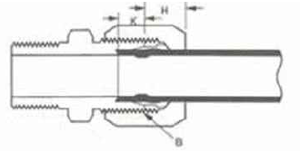
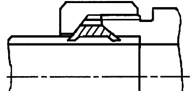
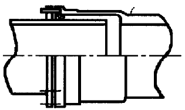
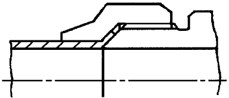
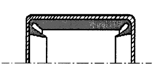

# PART 5 Machinery Installations

> RULES FOR CLASSIFICATION OF STEEL SHIPS / RA-05-E / 2025 / EN / Rules

## CHAPTER 6 AUXILIARIES AND PIPING ARRANGEMENT

### Section 1 General

#### 101. General

- **1.** **Application 【See Guidance】**
  - **(1)** The requirements in this Chapter apply to the materials, design, fabrication, tests and piping arrangement of auxiliaries and piping systems.
  - **(2)** The requirements in this Chapter may be modified for ships having special limitation for their service and usage and for small ships.
- **2.** **Related requirements**
  In addition to the requirements in this Chapter, the following relevant requirements are to be complied with.
  - **(1)** For piping systems of ships to be registered as those strengthened for navigation in ice, **Ch 1** of **Guidance for Ships for Navigation in Ice;** For piping systems of the ships for navigation in polar waters, **Ch 2** of **Guidance for Ships for Navigation in Ice;** For piping systems of the vessels for polar and ice breaking service, **Ch 3** of **Guidance for Ships for Navigation in Ice.**
  - **(2)** For steering gears, **Pt 5, Ch 7;** For windlasses and mooring winches, **Pt 5, Ch 8.**
  - **(3)** For automatic and remote control systems, **Pt 6, Ch 2.**
  - **(4)** For pumping arrangements of oil tankers, **Pt 7, Ch 1, Sec. 10;** For drainage of ore holds of ore carriers, **Pt 7, Ch 2 Sec. 2;** For water level detection & alarms and drainage & pumping systems for bulk carriers and single hold cargo ships, **Pt 7, Ch 3 Sec. 14;** For water level detectors on multiple hold cargo ships other than bulk carriers and tankers, **Pt 7, Annex 7-6-1;** For cargo handling facilities and piping systems of liquefied gas carriers and chemical carriers, **Pt 7, Ch 5** and **Ch 6;** For ships using low-flashpoint fuels, **Rules for the Classification of Ships Using Low-flashpoint Fuels** *(2024)*
- **3.** **Definition 【See Guidance】**
  - **(1)** Design pressure is the maximum working pressure of a medium inside pipes and is not to be less than the following pressures given in (A) to (H).
    - **(A)** For pipings fitted with a relief valve or other overpressure protective device, the pressure based on the set pressure of the relief valve or overpressure protective device. However, for steam pipings connected to the boiler or pipings fitted to pressure vessel, the design pressure of the boiler or the pressure vessel.
    - **(B)** For piping on the discharge side of the pumps, the pressure based on the delivery pressure of the pump with the valve on the discharge side closed running the pump at rated speed. However, for pumps having a relief valve or overpressure protective device, the pressure based on its set pressure.
    - **(C)** For feed water pipings on the discharge from the feed water pumps to feed water check valves, the pressure of the 1.25 times the design pressure of the boiler or the pump pressure against a shut valve, whichever is the greater.
    - **(D)** For pipings without relief valves on the low pressure side of pressure reducing valves, the pressure as the design pressure on the high-pressure side of the pressure reducing valve.
    - **(E)** For boiler blow-off pipings, the pressure of 1.25 times the design pressure of the boiler.
    - **(F)** For refrigerating machinery pipings, the pressure prescribed in **Pt 9, Ch 1, 102. 5.**
    - **(G)** For pipes containing fuel oil, the design pressure is to comply with the following requirements.
      - **(a)** Where the working pressure is not more than 0.7 $\mathrm{MPa}$ and the working temperature is not more than 60 °C : 0.3 $\mathrm{MPa}$ or max. working pressure, whichever is greater
      - **(b)** Where the working pressure is not more than 0.7 $\mathrm{MPa}$ and the working temperature exceeds 60 °C : 0.3 $\mathrm{MPa}$ or max. working pressure, whichever is greater
      - **(c)** Where the working pressure exceeds 0.7 $\mathrm{MPa}$ and the working temperature is not more than 60 °C : max. working pressure
      - **(d)** Where the working pressure exceeds 0.7 $\mathrm{MPa}$ and the working temperature exceeds 60 °C : 1.4 $\mathrm{MPa}$ or max. working pressure, whichever is greater
    - **(H)** Where it is impracticable to adopt the above values, the design pressure is to be specially considered by the Society in each case.
  - **(2)** The design temperature in this Chapter is the highest working temperature of the medium. However, for piping systems intended for lower temperature services than the room temperature, the design temperature is the lowest working temperature of the medium.
- **4.** **Classes of piping systems**
  - **(1)** For the purpose of testing, type of joint to be adopted, heat treatment and welding procedure, piping systems are subdivided into three classes as indicated in **Table 5.6.1** depending upon the service, design pressure and design temperature of the medium.
  - **(2)** Piping systems for other media than specified in **Table 5.6.1** are to be specially considered by the Society depending upon the nature of the mediums and their service conditions.

    | Class of piping Service | Class I | Class II | Class III |
    | --- | --- | --- | --- |
    | Toxic(7) | O | - | - |
    | corrosive(7) | O | O(With special safeguards(6)) | - |
    | Flammable media heated above flash point or with flash point below 60 C(7) | O | O(With special safeguards(6)) | - |
    | Steam | $P$＞1.6 or $T$＞300 | Any pressure-temperature combination not belonging to Class I or III | $P$≤0.7 and $T$≤170 |
    | Thermal oil | $P$＞1.6 or $T$＞300 | Any pressure-temperature combination not belonging to Class I or III | $P$≤0.7 and $T$≤150 |
    | Fuel oil Lubricating oil Flammable hydraulic oil | $P$＞1.6 or $T$＞150 | Any pressure-temperature combination not belonging to Class I or III | $P$≤0.7 and $T$≤60 |
    | Other media(1) | $P$＞4.0 or $T$＞300 | Any pressure-temperature combination not belonging to Class I or III | $P$≤1.6 and $T$≤200 |
    | NOTES; (1) Other media : water, air, gases(non-toxic, non-flammable), non-flammable hydraulic oil, Urea for SCR systems (When piping materials selected according to ISO 18611-3:2014 for Urea in SCR systems.) (2) $P$ = Design Pressure ($\mathrm{MPa}$), $T$ = Design temperature (℃) (3) Cargo oil pipes belong to Class Ⅲ. (4) Open ended pipes(drains, overflows, vents, exhaust gas lines, boiler escape pipes) irrespective of $T$, belong to Class Ⅲ. (5) Piping systems for *R* 717 (*NH*_3) used as a primary refrigerant belonging to Class Ⅰ, and for *R*22, *R* 134*a*, *R* 404*A*, *R* 407*C*, *R* 410*A* and *R* 507*A* used as a primary refrigerant belonging to Class Ⅲ. (6) Safeguards for reducing leakage possibility and limiting its consequences(e.g. double piping, pipe duct ect.) (7) Application is not allowed for below piping system and relevant requirements are to be complied with. - Chemical cargo piping systems of ships subject to **Pt 7, Ch 6** and shipboard hydrocarbon/chemical process piping system - Gas cargo/fuel and process piping systems of ships, subject to **Pt 7, Ch 5** and gas fuel piping systems of ships subject to **Rules for the Classification of Ships Using Low-flashpoint Fuels**. - Piping systems for other low flashpoint fuels defined in SOLAS II-1/2.29. |   |   |   |
- **5.** **Structure, materials and strength for auxiliaries**
  - **(1)** Materials for auxiliaries **【See Guidance】**
    - **(A)** The shaft materials of essential auxiliaries driven by prime movers having output of 100 $\mathrm{kW}$ or more are to comply with the requirements in **Pt 2, Ch 1** of the Rules.
    - **(B)** The materials used for essential parts of auxiliary machinery are to be manufactured by the manufacturer approved by the Society and complied with Korean Industrial Standards or equivalent, unless the Society specially considers necessary.
  - **(2)** Strength of shafts for auxiliaries
    Except crankshaft, the diameters of shafts for essential auxiliaries are not to be less than those obtained by the formula specified in **Ch 3, 203.** And for electric motor or hydraulic driving, P and F in this formula are to be as follows;
    P : Output of prime mover driving essential auxiliaries ($\mathrm{kW}$)
    F : Factor, 95
  - **(3)** Power transmission systems which transmit power from prime movers driving essential auxiliaries for propulsion and safety of ships are to be complied with requirements specified in **Ch 3, Sec 4.**
- **6.** Incinerators of waste oil and waste substance, gas bottles and piping systems of gas welding equipment are to be specially considered by the Society in each case. **【See Guidance】**

#### 102. Pipes

- **1.** **Materials**
  Materials for pipes are to be suitable for the medium and service for which the pipes are intended and are to be of the materials complying with the following requirements.
  - **(1)** The materials for pipes belonging to Class I or Class II are, as a rule, to be manufactured and tested in accordance with the appropriate requirements of **Pt 2, Ch 1.**
  - **(2)** The materials for pipes belonging to Class III piping systems are to be manufactured and tested in accordance with Korean Industrial Standards or equivalent.
- **2.** **Service limitations for steel pipes**
  - **(1)** Grade 1 and Grade 2 specified in **Pt 2, Ch 1, 402.** are not to be used for pipes whose design temperature exceeds 350 °C. However, they may be used up to 400 °C if the value of the allowable stress is guaranteed.
  - **(2)** Grade 3, *RST* 338 and *RST* 342 are not to be used for the pipes whose design temperature exceeds 450 °C and Grade 3, *RST* 349 is not to be used for pipes whose design temperature exceeds 425 °C.
  - **(3)** Grade 4, *RST* 412 is not to be used for pipes whose design temperature exceeds 500 °C and Grade 4, *RST* 422, *RST* 423 and *RST* 424 are not to be used for pipes whose design temperature exceeds 550 °C.
  - **(4)** Carbon steel pipes for ordinary piping (*KS D* 3507*, SPP*) may be used for Class II and Class III piping systems having a design pressure up to 1 $\mathrm{MPa}$ with a design temperature up to 230 °C. **【See Guidance】**
- **3.** **Service limitations for copper and copper alloy pipes 【See Guidance】**
  - **(1)** Copper and copper alloy pipes are to be seamless drawn pipes or pipes fabricated by the procedure approved by the Society.
  - **(2)** Copper pipes for Class I and II are to be seamless.
  - **(3)** The design temperature of the pipes is not to exceed 200 °C for phosphorous-deoxidized copper and brass, and 300 °C for copper-nickel in **Table 5.6.7.**
  - **(4)** Copper and copper alloy pipes which are considered inappropriate by the Society are not to be used for piping system.
- **4.** **Service limitations for cast iron pipes**
  Spheroidal or nodular graphite iron castings according to **Pt 2, Ch 1** may be accepted for bilge, ballast and cargo oil piping.
- **5.** **Special material pipes, expansion pipes and flexible pipes**
  - **(1)** Such special materials as rubber hoses, plastic pipes, vinyl pipes, aluminium alloys, etc, notwithstanding the provision in **Pars 2, 3** and **4** above, may be used where approved by the Society taking into account safety against fire and flooding as well as their service conditions.
  - **(2)** Expansion pipes and flexible pipes of metallic or non-metallic material may be installed between two points to provide flexibility for proper operation of the machinery, and they are to be as deemed appropriate by the Society.
- **6.** **Required wall thickness of pipes**
  - **(1)** The minimum wall thickness of steel pipes is not to be less than the greater of the minimum wall thickness calculated by **Par 7** or the minimum wall thickness shown in **Table 5.6.2.** and **5.6.3.**
  - **(2)** The minimum wall thickness of copper and copper alloy pipes is not to be less than the greater of the minimum wall thickness calculated by **Par 7** or the minimum wall thickness shown in **Table 5.6.4.**
  - **(3)** The minimum wall thickness of austenitic stainless steel pipes is not to be less than the greater of the minimum wall thickness calculated by **Par 7** or the minimum wall thickness shown in **Table 5.6.5.**
- **7.** **Minimum calculated wall thickness of pipes**
  - **(1)** The minimum calculated wall thickness of straight pipes subject to internal pressure is to be determined by the following formula:
    $t=(t _{0} +c) \frac{100}{100-a} (\mathrm{mm})$
    where:
    $t_0$ = Strength thickness specified in (3) ($\mathrm{mm}$)
    $c$ = Corrosion allowance specified in **Tables 5.6.6** and **5.6.7** ($\mathrm{mm}$)
    $a$ = Negative manufacturing tolerance ($\%$)

    | Nominal diameter ($A$) | Pipes in general | 1. Air, overflow and sounding pipes for structural tanks 2. Over board scupper pipes | Bilge, ballast and sea water pipes | 1. Bilge pipes, overflow pipes, air pipes, sounding pipes and fresh water pipes passing through ballast or fuel oil tanks 2. Ballast pipes passing through fuel oil tanks 3. Fuel oil pipes passing through ballast tank 4. Air pipes on exposed deck(position I or II) | Overboard scupper pipes to be omitted the nonreturn valve | 1. Ballast piping passing through cargo tanks 2. Cargo oil pipes passing through segregated ballast tanks |
    | --- | --- | --- | --- | --- | --- | --- |
    | 6 | 1.6 |   |   |   |   |   |
    | 8 | 1.8 |   |   |   |   |   |
    | 10 | 1.8 |   |   |   |   |   |
    | 15 | 2.0 |   | 3.2 |   |   |   |
    | 20 | 2.0 |   | 3.2 |   |   |   |
    | 25 | 2.0 |   | 3.2 |   |   |   |
    | 32 | 2.0 | 4.5 | 3.6 | 6.3 |   |   |
    | 40 | 2.3 | 4.5 | 3.6 | 6.3 |   |   |
    | 50 | 2.3 | 4.5 | 4.0 | 6.3 |   | 6.3 |
    | 65 | 2.6 | 4.5 | 4.5 | 6.3 | 7.0 | 6.3 |
    | 80 | 2.9 | 4.5 | 4.5 | 7.1 | 7.6 | 7.1 |
    | 90 | 2.9 | 4.5 | 4.5 | 7.1 | 8.0 | 7.1 |
    | 100 | 3.2 | 4.5 | 4.5 | 8.0 | 8.6 | 8.6 |
    | 125 | 3.6 | 4.5 | 4.5 | 8.0 | 8.8 | 9.5 |
    | 150 | 4.0 | 4.5 | 4.5 | 8.8 | 10.0 | 11.0 |
    | 175 | 4.5 | 5.3 | 5.3 | 8.8 | 10.0 | 11.8 |
    | 200 | 4.5 | 5.8 | 5.8 | 8.8 | 12.5 | 12.5 |
    | 225 | 5.0 | 6.2 | 6.2 | 8.8 | 12.5 | 12.5 |
    | 250 | 5.0 | 6.3 | 6.3 | 8.8 | 12.5 | 12.5 |
    | 300 | 5.6 | 6.3 | 6.3 | 8.8 | 12.5 | 12.5 |
    | 350 | 5.6 | 6.3 | 6.3 | 8.8 |   | 12.5 |
    | 400 | 6.3 | 6.3 | 6.3 | 8.8 |   | 12.5 |
    | 450 | 6.3 | 6.3 | 6.3 | 8.8 |   | 12.5 |
    | NOTES: 1. Diameter and thickness according to other national or international standards recognized by the Society may be accepted. 2. Where pipes and any integral pipe joints are protected against corrosion by means of coating, lining etc., the thickness may be reduced by an amount up to not more than 1 $\mathrm{mm}$. 3. For sounding pipes, except those for flammable cargoes, the minimum wall thickness in air, overflow and sounding pipes for structural tanks is intended to apply only to the part outside the tank. 4. The minimum thicknesses listed in this table are the nominal wall thickness. No allowance needs to be made for negative tolerance or for reduction in thickness due to bending. 5. For threaded pipes, where allowed, the minimum wall thickness is to be measured at the bottom of the thread. 6. The minimum wall thickness for pipes larger than 450 $A$ nominal size is to be in accordance with a national or international standard recognized by the Society and in any case not less than the minimum wall thickness of the appropriate column indicated for 450 $A$ pipe size. 7. The air pipes located within the forward 0.25 $L$ are to be complied with the requirements of **Pt 4, Ch 9, 303. 1.** |   |   |   |   |   |   |

    | Nominal diameter ($A$) | Fire extinguishing CO*_2* pipes |   |
    | --- | --- | --- |
    | Nominal diameter ($A$) | From bottles to distribution station | From distribution station to nozzle |
    | 15 | 3.2 | 2.6 |
    | 20 | 3.2 | 2.6 |
    | 25 | 4.0 | 3.2 |
    | 32 | 4.0 | 3.2 |
    | 40 | 4.0 | 3.2 |
    | 50 | 4.5 | 3.6 |
    | 65 | 5.0 | 3.6 |
    | 80 | 5.6 | 4.0 |
    | 90 | 6.3 | 4.0 |
    | 100 | 7.1 | 4.5 |
    | 125 | 8.0 | 5.0 |
    | 150 | 8.8 | 5.6 |
    | NOTES: 1. Pipes are to be galvanized at least inside, except those fitted in the engine room where galvanizing may not be required at the discretion of the Society. 2. For threaded pipes, where allowed, the minimum wall thickness is to be measured at the bottom of the thread. **【See Guidance】** 3. The external diameters and thicknesses have been selected from ISO Recommendations *R* 336 for smooth welded and seamless steel pipes. Diameter and thickness according to other national or international standards may be accepted. 4. For larger diameters specified in this table, the minimum wall thickness will be subject to special consideration by the Society. 5. The minimum thicknesses listed in this table are the nominal wall thickness. No allowance needs to be made for negative tolerance or for reduction in thickness due to bending. |   |   |

    | External diameter (mm) | Copper pipes | Copper alloy pipes |
    | --- | --- | --- |
    | 8 ~ 10 12 ~ 22 25 ~ 44.5 50 ~ 76.1 88.9 ~ 108 133 ~ 159 193.7 ~ 267 273 ~ 457 (470) 508 | 1.0 1.2 1.5 2.0 2.5 3.0 3.5 4.0 4.0 4.5 | 0.8 1.0 1.2 1.5 2.0 2.5 3.0 3.5 3.5 4.0 |
    | NOTES: Diameter and thickness according to national or international standards recognized by the Society may be accepted. |   |   |

    | External diameter | Minimum wall thickness |
    | --- | --- |
    | 10.2 ~ 17.2 | 1.0 |
    | 21.3 ~ 48.3 | 1.6 |
    | 60.3 ~ 88.9 | 2.0 |
    | 114.3 ~ 168.3 | 2.3 |
    | 219.1 | 2.6 |
    | 273.0 | 2.9 |
    | 323.9 ~ 406.4 | 3.6 |
    | over 406.4 | 4.0 |
    | NOTES: Diameters and thicknesses according to national or international standards recognized by the Society may be accepted. |   |

    | Piping service | $c$ |
    | --- | --- |
    | Superheated steam systems | 0.3 |
    | Saturated steam systems | 0.8 |
    | Steam coil systems in cargo tanks | 2.0 |
    | Steam coil systems in fuel oil tanks | 1.0 |
    | Feed water for boilers in open circuit systems | 1.5 |
    | Feed water for boilers in closed circuit systems | 0.5 |
    | Blow-off (for boilers) systems | 1.5 |
    | Compressed air systems | 1.0 |
    | Lubricating and hydraulic oil systems | 0.3 |
    | Fuel oil systems | 1.0 |
    | Cargo oil systems | 2.0 |
    | Refrigerating plants | 0.3 |
    | Fresh water systems | 0.8 |
    | Sea water systems | 3.0 |
    | NOTES: 1. For pipes passing through tanks, an additional corrosion allowance is to be considered according to the figures given in the Table, and depending on the external medium, in order to account for the external corrosion. 2. Where pipes and any integral pipe joints are protected against corrosion by means of coating, lining, etc., the corrosion allowance may be reduced by not more than 50 %. 3. In the case of use of special alloy steel with sufficient corrosion resistance, the corrosion allowance may be reduced to zero. 4. For other systems than specified in this Table, the corrosion allowance is to comply with Korea Industrial Standards or equivalent. 5. For sea water systems, steel pipes whose nominal diameter is 25 $A$ or below, the corrosion allowance may be reduced to 1.5 $\mathrm{mm}$. |   |

    | Pipe material | $c$ |
    | --- | --- |
    | Phosphorus-deoxidized copper seamless pipes and brass seamless pipes specified in **Table 5.6.9** | 0.8 |
    | Copper nickel seamless pipes specified in **Table 5.6.9** | 0.5 |
    | NOTE: For media without corrosive action in respect of the material employed, the corrosion allowance may be reduced to zero. |   |
  - **(2)** Where pipes are bent, the minimum calculated wall thickness, $t_b$, before bending is to be determined by the following formula.
    $t _{b} =(t _{0} +c+b) \frac{100}{100-a} (\mathrm{mm})$
    where:
    $b$ = Bending allowance specified in (4) ($\mathrm{mm}$)
    $t_0$, $c$*,* $a$ = As defined in (1)
  - **(3)** The strength thickness is to be determined by the following formula:
    $t _{0} = \frac{PD}{2fJ+P} ( \mathrm{mm})$
    where:
    $P$ *=* Design pressure ($\mathrm{MPa}$)
    $D$ *=* Outer diameter of pipe ($\mathrm{mm}$)
    $f$ *=* Allowable stress specified in (5) ($\mathrm{N}/mm ^{2}$)
    $J$ *=* Efficiency factor
    ․Seamless pipes -------------------------- 1.00
    ․Electric resistance welded pipes ---- 0.85 (1.0 may be adopted for those which are considered as equivalent to seamless pipes.)
    ․For other welded pipes and forge butt welded pipes, the Society will consider an efficiency factor value depending upon the welding procedure.
  - **(4)** The bending allowance, $b$, is not be less than calculated by the following formula, except where it can be demonstrated that the minimum wall thickness at any point after bending is not to be less than the minimum calculated wall thickness of straight pipe:
    $b= \frac{1}{2.5} \times \frac{D}{R} t _{0} (\mathrm{mm})$
    where:
    $D$ = Outer diameter of pipe ($\mathrm{mm}$)
    $R$ = Radius of curvature of a pipe bend at the centre line of the pipe ($\mathrm{mm}$)
    However, $R \geq 2D$
    $t_0$ = Strength thickness specified in (3) ($\mathrm{mm}$)
  - **(5)** Allowable stress
    $f = E_\frac{T}{1.6} , f = R_\frac{20}{2.7} , f = f_\frac{R}{1.6}$
    where:
    $E_T$ = Specified minimum yield stress or 0.2 percent proof stress ($\mathrm{N}/mm ^{2}$)
    $R_20$ = Specified minimum tensile strength at room temperature ($\mathrm{N}/mm ^{2}$)
    $f_R$ = Average stress to produce rupture in 100,000 hours at the design temperature ($\mathrm{N}/mm ^{2}$)

    | Design Temperature °C Kinds Symbols |   | 100 or less | 150 | 200 | 250 | 300 | 350 | 375 | 400 | 425 | 450 | 475 | 500 | 525 | 550 |
    | --- | --- | --- | --- | --- | --- | --- | --- | --- | --- | --- | --- | --- | --- | --- | --- |
    | Grade 1 | *RST* 138 | 123 | 114 | 105 | 96 | 87 | 78 |   |   |   |   |   |   |   |   |
    | Grade 1 | *RST* 142 | 138 | 129 | 118 | 107 | 96 | 90 |   |   |   |   |   |   |   |   |
    | Grade 2 | *RST* 238 | 123 | 114 | 105 | 96 | 87 | 78 |   |   |   |   |   |   |   |   |
    | Grade 2 | *RST* 242 | 138 | 129 | 118 | 107 | 96 | 90 |   |   |   |   |   |   |   |   |
    | Grade 2 | *RST* 249 | 156 | 145 | 133 | 122 | 117 | 113 |   |   |   |   |   |   |   |   |
    | Grade 3 | *RST* 338 | 123 | 114 | 105 | 96 | 87 | 78 | 75 | 70 | 63 | 56 |   |   |   |   |
    | Grade 3 | *RST* 342 | 138 | 129 | 118 | 107 | 96 | 90 | 87 | 84 | 71 | 57 |   |   |   |   |
    | Grade 3 | *RST* 349 | 156 | 145 | 133 | 122 | 117 | 113 | 105 | 96 | 77 |   |   |   |   |   |
    | Grade 4 | *RST* 412 | 119 | 112 | 105 | 97 | 89 | 85 | 83 | 80 | 77 | 73 | 70 | 65 |   |   |
    | Grade 4 | *RST* 422 | 121 | 116 | 111 | 105 | 99 | 93 | 91 | 89 | 85 | 80 | 76 | 71 | 55 | 38 |
    | Grade 4 | *RST* 423 | 121 | 116 | 111 | 105 | 99 | 93 | 91 | 89 | 85 | 80 | 76 | 71 | 57 | 40 |
    | Grade 4 | *RST* 424 | 121 | 116 | 111 | 105 | 99 | 93 | 91 | 89 | 85 | 80 | 76 | 71 | 57 | 41 |
    | NOTES: Intermediate values are to be determined by interpolation. |   |   |   |   |   |   |   |   |   |   |   |   |   |   |   |

    | Design Temp.°C Kind of Materials |   | 50 or below | 75 | 100 | 125 | 150 | 175 | 200 | 225 | 250 | 275 | 300 |
    | --- | --- | --- | --- | --- | --- | --- | --- | --- | --- | --- | --- | --- |
    | Phosphorous- deoxidized copper seamless pipes | *C* 1201 *C* 1220 | 41 | 41 | 40 | 40 | 34 | 27.5 | 18.5 |   |   |   |   |
    | Brass seamless pipes for condenser and heat exchanger | *C* 4430 | 68 | 68 | 68 | 68 | 68 | 67 | 24 |   |   |   |   |
    | Brass seamless pipes for condenser and heat exchanger | *C* 6870 *C* 6871 *C* 6872 | 78 | 78 | 78 | 78 | 78 | 51 | 24.5 |   |   |   |   |
    | Copper nickel seamless pipes for condenser and heat exchanger | *C* 7060 | 68 | 68 | 67 | 65.5 | 65 | 62 | 59 | 56 | 52 | 48 | 44 |
    | Copper nickel seamless pipes for condenser and heat exchanger | *C* 7100 | 73 | 72 | 72 | 71 | 70 | 70 | 67 | 65 | 63 | 60 | 57 |
    | Copper nickel seamless pipes for condenser and heat exchanger | *C* 7150 | 81 | 79 | 77 | 75 | 73 | 71 | 69 | 67 | 65.5 | 64 | 62 |
    | NOTES: 1. Intermediate values are to be determined by interpolation. 2. Kind of materials are to be in compliance with *KS D* 5301. 3. Allowable stress for materials not specified in the Table is to comply with Korea Industrial Standards or equivalent. |   |   |   |   |   |   |   |   |   |   |   |   |
    - **(A)** The allowable stress for carbon steel and alloy steel pipes is in general to be chosen as the lowest of the following values:
    - **(B)** For steel pipes for pressure piping prescribed in **Pt 2, Ch 1** the allowable stresses may be obtained from **Table 5.6.8.**
    - **(C)** The allowable stresses for copper and copper alloy pipes are to be obtained from **Table 5.6.9.**

#### 103. Valves and fitting 【See Guidance】

- **1.** **Materials**
  Materials for valves and pipe fittings are to be suitable for the medium and service for which the pipes are intended and are to be of the materials complying with the following requirements.
  - **(1)** The materials of valves and fittings belonging to Class I and Class II piping systems, ship-side valves and fittings, and valves on the collision bulkhead are, as a rule, to comply with the relevant requirement of **Pt 2, Ch 1.** However, the Society may accept to use valves and fittings made of materials which meet *Korean Industrial Standards* or equivalent.
  - **(2)** The materials for valves and pipe fittings belonging to Class III piping systems are to be manufactured and tested in accordance with the requirements of acceptable *Korean Industrial Standards or equivalent*.
- **2.** **Service limitations for carbon and low alloy steel**
  Carbon steel castings and steel forgings are not to be used for valves and pipe fittings in the piping system whose design temperature exceeds 425 °C. Low alloy steel castings and low alloy steel forgings are not to be used for valves and pipe fittings in the piping system whose design temperature exceeds 550 °C.
- **3.** **Service limitations for copper alloy**
  Valves and pipe fittings made of copper alloy are not to be used for valves and pipe fittings with a design temperature over 200 °C. However, special bronze suitable for high temperature can be used for valves and pipe fittings with a design temperature of 260 °C or less
- **4.** **Service limitations for cast iron for valves and pipe fittings**
  - **(1)** Valves and pipe fittings made of cast iron with an elongation of 12 % or above can be used for valves and pipe fittings in the piping system with a design temperature of 350 °C or less. *(2021)*
  - **(2)** Valves and pipe fittings made of cast iron with an elongation of less than 12 % are not to be used for the following piping system.
    - **(A)** Ship-side valves and fittings.
    - **(B)** Valves fitted on the collision bulkhead.
    - **(C)** Valves fitted on the external wall of fuel oil tanks, lubricating oil tanks and other flammable oil tanks under the static head of internal fluid. *(2024)*
    - **(D)** Valves and pipe fittings for boiler blow-off piping.
    - **(E)** Valves fitted on shore connection for cargo pipings of inflammable liquid.
    - **(F)** Valves and pipe fittings for piping liable to be subjected to water hammer, excessive strain or vibration.
    - **(G)** Valves and pipe fittings whose design temperature exceeds 220 °C.
    - **(H)** Valves and pipe fittings used for pipes of Class II.
    - **(I)** Valves and pipe fittings for clean ballast piping systems which penetrate cargo oil tanks and reach the forepeak tank.
    - **(J)** Valves and pipe fittings used for cargo oil pipelines exceeding design pressure of 1.6 $\mathrm{MPa}$.
  - **(3)** Cast iron products are not to be used for valves and pipe fittings in the piping system belonging to Class I, unless specially approved by the Society.
- **5.** **Construction of valves and pipe fittings**
  Valves, pipe fittings, gaskets and packings are to be suitable for the condition of use and to have a construction specified in *Korean Industrial Standards* or equivalent construction thereto. The dimensions of flanges and relative bolts are to be chosen in accordance with *Korean Industrial Standards* or equivalent. For special applications, when the temperature, the pressure and the size of the flange have values above certain limits, to be fixed, the complete calculation of bolts and flanges is to be carried out.

#### 104. Type of connections

- **1.** **Direct connection of pipe lengths**
  Direct connection of pipe lengths is to be made by direct welding, flanges, threaded joints or mechanical joints, and is to be of a recognized standard or of a design proven to be suitable for the intended purpose and acceptable to the Society. **【See Guidance】**
- **2.** **Welded connections**
  - **(1)** Butt welded joints
    - **(A)** Butt welded joints are to be of full penetration type generally with or without special provision for a high quality of root side. The expression "special provision for a high quality of root side" means that butt welds were accomplished as double welded or by use of a backing ring or inert gas back-up on first pass, or other similar methods accepted by the Society.
    - **(B)** Butt welded joints with special provision for a high quality of root side may be used for piping of any Class, any outside diameter.
    - **(C)** Butt welded joints without special provision for a high quality of root side may be used for piping systems of Class II and III irrespective of outside diameter.
  - **(2)** Slip-on sleeve and socket welded joints **【See Guidance】**
    - **(A)** Slip-on sleeve and socket welded joints are to have sleeves, sockets and weldments of adequate dimensions conforming to the Society Rules or recognized Standard.
    - **(B)** Slip-on sleeve and socket welded joints may be used in Class III systems, any outside diameter.
    - **(C)** Slip-on sleeve and socket welded joints may be allowed by the Society for piping systems of Class I and II having nominal diameter 80 $A$ and below except for piping systems conveying toxic media or services where fatigue, severe erosion or crevice corrosion is expected to occur.
- **3.** **Flange connections 【See Guidance】**
  - **(1)** The dimensions and configuration of flanges and bolts are to be chosen in accordance with recognized standards.
  - **(2)** Gaskets are to be suitable for the media being conveyed under design pressure and temperature conditions and their dimensions and configuration are to be in accordance with recognised standards.
  - **(3)** For non-standard flanges, the dimensions of flanges and bolts are to be subject to special consideration.
  - **(4)** Typical examples of flange attachments are shown in **Fig 5.6.1.** However, other types of flange attachments may be considered by the Society in each particular case.
  - **(5)** Flange attachments are to be in accordance with *Korean Industrial Standards or equivalent* that are applicable to the piping system and are to recognize the boundary fluids, design pressure and temperature conditions, external or cyclic loading and location.
- **4.** **Slip-on threaded joints 【See Guidance】**
  - **(1)** Slip-on threaded joints having pipe threads where pressure-tight joints are made on the threads with parallel or tapered threads, are to comply with requirements of a recognized national and/or international standard (Standards such as ASME B31.1 and ASME B31.3 may be referenced for the purpose). *(2024)*
  - **(2)** Slip-on threaded joints may be used for outside diameters as stated below except for piping systems conveying toxic or flammable media or services where fatigue, severe erosion or crevice corrosion is expected to occur.
    - **(A)** Threaded joints in *CO*_2 systems are to be allowed only inside protected spaces and in *CO*_2 cylinder rooms.
    - **(B)** Threaded joints for direct connectors of pipe lengths with tapered thread are to be allowed for:
      - **(a)** Class I, outside diameter not more than 33.7 $\mathrm{mm}$.
      - **(b)** Class II and Class III, outside diameter not more than 60.3 $\mathrm{mm}$.
    - **(C)** Threaded joints with parallel thread are to be allowed for Class III, outside diameter not more than 60.3 $\mathrm{mm}$.
    - **(D)** In particular cases, sizes in excess of those mentioned above may be accepted by the Society if in compliance with *Korean Industrial Standards or equivalent.*
- **5.** **Mechanical joints** ***(2017)***
  These requirements are applicable to pipe unions, compression couplings, slip-on joints as shown in **Fig 5.6.2.** Similar joints complying with these requirements may be acceptable.

  | Type of flange | Example of attachments |   |   |   |
  | --- | --- | --- | --- | --- |
  | Type A |  |   |  |   |
  | Type A | Welding neck flange |   | Loose flange with welding neck |   |
  | Type B |  |  |   |  |
  | Type B | Slip-on welding flange-fully welded |   |   |   |
  | Type C |  |  |   |  |
  | Type C | Slip-on welding flange |   |   |   |
  | Type D |  |   |   |   |
  | Type D | Slip-on threaded flange-conical thread |   |   |   |
  | Type E |  |   |   |   |
  | Type E | Lap joint flange-on flanged pipe |   |   |   |
  | NOTE : For type D, the pipe and flange are to be screwed with a tapered thread and the diameter of the screw portion of the pipe over the thread is not to be appreciably less than the outside diameter of the unthreaded pipe. For certain types of thread, after the flange has been screwed hard home, the pipe is to be expanded into the flange. |   |   |   |   |

  | Type of mechanical joints | Examples of mechanical joints | Type of mechanical joints | Examples of mechanical joints |
  | --- | --- | --- | --- |
  | Pipe union |   | Slip-on joints |   |
  | Welded and brazed types |  | Grip type |  |
  | Compression couplings |   | Machine grooved type |  |
  | Swage type |  | Machine grooved type |   |
  | Press type |  | Machine grooved type |   |
  | Press type |   | Slip type |  |
  | Typical compression type |  | Slip type |   |
  | Bite type |  | Slip type |  |
  | Flared type |  | Slip type |   |
  | Flared type |   | Slip type |  |
  - **(1)** Mechanical joints including pipe unions, compression coupling, slip-on joints and similar joints are to be of approved type for service conditions and the intended application.
  - **(2)** Where the application of mechanical joints results in reduction in pipe wall thickness, this is to be taken into account in determining the minimum wall thickness of the pipe to withstand the design pressure.
  - **(3)** Material of mechanical joints is to be compatible with the piping material and internal and external media.
  - **(4)** Mechanical joints are to be tested where applicable, to a burst pressure of 4 times the design pressure. For design pressures above 20 $\mathrm{MPa}$, the required burst pressure will be specially considered by the Society.
  - **(5)** Mechanical joints are to be of fire resistant type as required by **Table 5.6.10.**
  - **(6)** Mechanical joints, which in the event of damage could cause fire or flooding, are not to be used in piping sections directly connected to the ship’s side below the bulkhead deck of passenger ships and freeboard deck of cargo ships or tanks containing flammable fluids.
  - **(7)** The number of mechanical joints in flammable fluid systems is to be kept to a minimum.
  - **(8)** Piping in which a mechanical joint is fitted is to be adequately adjusted, aligned and supported. Supports or hangers are not to be used to force alignment of piping at the point of connection.
  - **(9)** Slip-on joints are not to be used in pipelines in cargo holds, tanks and other spaces which are not easily accessible (refer to MSC/Circ.734), except that these joints may be permitted in tanks that contain the same media. Usage of slip type slip-on joints as the main means of pipe connection is not permitted except for cases where compensation of axial pipe deformation is necessary.
  - **(10)** Application of mechanical joints and their acceptable use for each service is indicated in **Table 5.6.10**; dependence upon the Class of piping and pipe dimensions is indicated in **Table 5.6.11.** In particular cases, sizes in excess of those mentioned above may be accepted by the Classification Society if in compliance with a recognized national and/or international standard.

    | Systems |   | Kind of connections |   |   |   |   |
    | --- | --- | --- | --- | --- | --- | --- |
    | Systems |   | Pipe Unions | Compression Couplings | Slip-on joints | Classification of pipe system | Fire endurance test condition(7) |
    | Flammable fluids (Flash point ≤ 60 °C) |   |   |   |   |   |   |
    | 1 | Cargo oil lines(1) | ○ | ○ | ○ | dry | 30 min dry (*) |
    | 2 | Crude oil washing lines(1) | ○ | ○ | ○ | dry | 30 min dry (*) |
    | 3 | Vent lines(3) | ○ | ○ | ○ | dry | 30 min dry (*) |
    | Inert Gas |   |   |   |   |   |   |
    | 4 | Water seal effluent lines | ○ | ○ | ○ | wet | 30 min wet (*) |
    | 5 | Scrubber effluent lines | ○ | ○ | ○ | wet | 30 min wet (*) |
    | 6 | Main lines(1)(2) | ○ | ○ | ○ | dry | 30 min dry (*) |
    | 7 | Distributions lines(1) | ○ | ○ | ○ | dry | 30 min dry (*) |
    | Flammable fluids (Flash point 〉 60 °C) |   |   |   |   |   |   |
    | 8 | Cargo oil lines(1) | ○ | ○ | ○ | dry | 30 min dry (*) |
    | 9 | Fuel oil lines(2)(3) | ○ | ○ | ○ | wet | 30 min wet (*) |
    | 10 | Lubricating oil lines(2)(3) | ○ | ○ | ○ | wet | 30 min wet (*) |
    | 11 | Hydraulic oil(2)(3) | ○ | ○ | ○ | wet | 30 min wet (*) |
    | 12 | Thermal oil(2)(3) | ○ | ○ | ○ | wet | 30 min wet (*) |
    | Sea water |   |   |   |   |   |   |
    | 13 | Bilge lines(4) | ○ | ○ | ○ | dry/wet | 8 min dry + 22 min wet (*) |
    | 14 | Permanent water filled fire extinguishing systems, e.g. fire main, sprinkler systems(3) | ○ | ○ | ○ | wet | 30 min wet (*) |
    | 15 | Non-permanent water filled fire extinguishing systems, e.g. foam, drencher systems and fire main(3) | ○ | ○ | ○ | dry/wet | 8 min dry + 22 min wet (*) For foam systems FSS Code Chapter 6 to be observed |
    | 16 | Ballast system(4) | ○ | ○ | ○ | wet | 30 min wet (*) |
    | 17 | Cooling water system(4) | ○ | ○ | ○ | wet | 30 min wet (*) |
    | 18 | Tank cleaning services | ○ | ○ | ○ | dry | Fire endurance test not required |
    | 19 | Non-essential systems | ○ | ○ | ○ | dry dry/wet wet | Fire endurance test not required |

    | Systems |   | Kind of connections |   |   |   |   |
    | --- | --- | --- | --- | --- | --- | --- |
    | Systems |   | Pipe Unions | Compression Couplings | Slip-on joints | Classification of pipe system | Fire endurance test condition(7) |
    | Fresh water |   |   |   |   |   |   |
    | 20 | Cooling water system(4) | ○ | ○ | ○ | wet | 30 min wet (*) |
    | 21 | Condensate return(4) | ○ | ○ | ○ | wet | 30 min wet (*) |
    | 22 | Non-essential system | ○ | ○ | ○ | dry dry/wet wet | Fire endurance test not required |
    | Sanitary/Drains/Scuppers |   |   |   |   |   |   |
    | 23 | Deck drains (internal)(5) | ○ | ○ | ○ | dry | Fire endurance test not required |
    | 24 | Sanitary drains | ○ | ○ | ○ | dry | Fire endurance test not required |
    | 25 | Scuppers and discharge (overboard) | ○ | ○ | - | dry | Fire endurance test not required |
    | Sounding/Vent |   |   |   |   |   |   |
    | 26 | Water tanks/Dry spaces | ○ | ○ | ○ | dry, wet | Fire endurance test not required |
    | 27 | Oil tanks (f.p. 〉60 °C)(2)(3) | ○ | ○ | ○ | dry | Fire endurance test not required |
    | Miscellaneous |   |   |   |   |   |   |
    | 28 | Starting/Control air(4) | ○ | ○ | - | dry | 30 min dry (*) |
    | 29 | Service air (non-essential) | ○ | ○ | ○ | dry | Fire endurance test not required |
    | 30 | Brine | ○ | ○ | ○ | wet | Fire endurance test not required |
    | 31 | CO2 system (outside protected space) | ○ | ○ | - | dry | 30 min dry (*) |
    | 32 | CO2 system (inside protected space) | ○ | ○ | - | dry | Mechanical joints shall be constructed of materials with melting point above 925°C. Ref. to FSS Code Chapter 5. |
    | 33 | Steam | ○ | ○ | ○(6) | wet | Fire endurance test not required |

    | Abbreviations ○ : Application is allowed, - : Application is not allowed, * : Fire endurance test as specified in **Ch 3, Sec 18, Table 3.18.2, 6.** of the **"Guidance for Approval of Manufacturing Process and Type Approval, Etc.“** NOTES - Fire resistance capability If mechanical joints include any components which readily deteriorate in case of fire, the following footnotes are to be observed: 1) Fire endurance test shall be applied when mechanical joints are installed in pump rooms and open decks. 2) Slip on joints are not accepted inside machinery spaces of category A or accommodation spaces. May be accepted in other machinery spaces provided the joints are located in easily visible and accessible positions(refer to MSC/Circ.734). 3) Approved fire-resistant types except in cases where such mechanical joints are installed on open decks, as defined in SOLAS II-2/Reg. 9.2.3.3.2.2(10) and not used for fuel oil lines. 4) Fire endurance test shall be applied when mechanical joints are installed inside machinery spaces of category A. NOTES - General 5) Only above bulkhead deck of passenger ships and freeboard deck of cargo ships. 6) Slip type slip-on joints as shown in Fig 5.6.2. May be used for pipes on deck with a design pressure of 10 bar or less. 7) If a connection has passed the "30 min dry” test, it is considered suitable also for applications for which the "8 min dry+22 min wet" and/or "30 min wet " tests are required. If a connection has passed the "8 min dry+22 min wet" test, it is considered suitable also for applications for which the "30 min wet" test is required. |
    | --- |

    | Type of joints | Classes of piping systems |   |   |
    | --- | --- | --- | --- |
    |   | Class Ⅰ | Class Ⅱ | Class Ⅲ |
    | Pipe Unions |   |   |   |
    | Welded and brazed type | ○(OD≤60.3 $\mathrm{mm}$) | ○(OD≤60.3 $\mathrm{mm}$) | ○ |
    | Compression Couplings |   |   |   |
    | Swage type | ○ | ○ | ○ |
    | Bite type | ○ | ○ | ○ |
    | Typical compression type | ○ | ○ | ○ |
    | Flared type | ○ | ○ | ○ |
    | Press type | - | - | ○ |
    | Slip-on joints |   |   |   |
    | Machine grooved type | ○ | ○ | ○ |
    | Grip type | - | ○ | ○ |
    | Slip type | - | ○ | ○ |
    | Abbreviations ○ : Application is allowed - : Application is not allowed |   |   |   |

#### 105. Welding of pipes and pipe fittings

- **1.** **Scope and documentation**
  - **(1)** The following requirements apply to the fabrication of Class I and II piping systems operating at ambient or high temperature and made of steel of the types given below. If necessary, these requirements may be applied also to the Class III piping systems and to repair welding pipelines.
    - **(A)** carbon and carbon-manganese steels having minimum tensile strength 320, 360, 410, 460 and 490 $\mathrm{N}/mm ^{2}$.
    - **(B)** low alloy carbon-molybdenum, chromium-molybdenum, chromium-molybdenum-vanadium steels having chemical composition 0.3% Mo; 1% Cr - 0.5% Mo; 2.25% Cr - 1% Mo; 0.5% Cr - 0.5% Mo - 0.25% V.
  - **(2)** The manufacturers are to submit to the Society for its approval the detailed construction drawings and welding procedures (quality of materials, welding method, specification of welding materials, type of edge preparation, heat treatment, test methods are to be shown) before the commencement of the work.
- **2.** **Welding workmanship**
  - **(1)** Welding is to be carried out in accordance with the previously approved welding procedures using approved electrodes, approved automatic welding materials or other equivalent materials. Tack welds are to be made with an electrode suitable for the base metal; tack welds which form part of the finished weld are to be made using approved welding procedures. When welding materials requiring preheating, the same preheating is to be applied during tack welding.
  - **(2)** Welding is to be carried out at welding shops, in principle, and by the welders holding the Society's qualification specified in **Pt 2, Ch 2, Sec 5.**
  - **(3)** Base materials used in the welding work, unless otherwise specifically approved, are to conform to the requirements in **Pt 2, Ch 1,** and further the carbon content is not to exceed 0.35 $\%$.
  - **(4)** Edge preparation is to be in accordance with recognized standards and/or approved drawings. The preparation of the edges is to be preferably carried out by mechanical means. When flame cutting is used, care is to be taken to remove the oxide scales and any notch due to irregular cutting by matching grinding or chipping back to sound metal.
- **3.** **Welded connections**
  - **(1)** Welded butt joints are to be of the full penetration type. For Class I pipes, special provisions are to be taken to ensure a high quality of the root side.
  - **(2)** If the parts to be joined differ in wall thickness, the thicker wall is to be gradually tapered to that of the thinner of the butt joint with a slope not steeper than 1/4.
  - **(3)** Mis-alignment of joints
    The tolerances on the alignment of the pipes to be welded are to be as follows.
    - **(A)** Where the pipes welded with backing ring: 0.5 $\mathrm{mm}$
    - **(B)** Where the pipes welded without backing ring:
      - **(a)** In the case of the inside diameter less than 150 $\mathrm{mm}$ and up to 6 $\mathrm{mm}$ in thickness, 1 $\mathrm{mm}$ or 25 $\%$ of the thickness, whichever is less.
      - **(b)** In the case of the inside diameter less than 300 $\mathrm{mm}$ and up to 9.5 $\mathrm{mm}$ in thickness, 1.5 $\mathrm{mm}$ or 25 $\%$ of the thickness, whichever is less.
      - **(c)** In the case of the inside diameter 300 $\mathrm{mm}$ and over, or over 9.5 $\mathrm{mm}$ in thickness, 2 $\mathrm{mm}$ or 25 $\%$ of the thickness, whichever is less.
  - **(4)** Branches may be attached to pressure pipes by means of welding provided that the pipe is reinforced at the branch by a compensating plate or collar or other approved means, or alternatively that the thicknesses of pipe and branch are increased to maintain the strength of the pipe. **【See Guidance】**
- **4.** **Preheating of welds**
  When pipes are welded, pipes are to be preheated adequately depending on the kinds and thickness of materials as specified in **Table 5.6.12.**

  | Kind of material |   | Thickness of welds $t$ ($\mathrm{mm}$) | Minimum preheating temperature(°C) |
  | --- | --- | --- | --- |
  | Grade 1 Grade 2 Grade 3 | $C + \frac{Mn}{6} \leq 0.4$ | $t$ ≥ 20(1) | 50 |
  | Grade 1 Grade 2 Grade 3 | $C + \frac{Mn}{6} > 0.4$ | $t$ ≥ 20(1) | 100 |
  | Grade 4 | *RST* 412 | $t$ ＞ 13(1) | 100 |
  | Grade 4 | *RST* 422 *RST* 423 | $t$ ＜ 13 | 100 |
  | Grade 4 | *RST* 422 *RST* 423 | $t$ ≥ 13 | 150 |
  | Grade 4 | *RST* 424(2) | $t$ ＜ 13 | 150 |
  | Grade 4 | *RST* 424(2) | $t$ ≥ 13 | 200 |
  | NOTES: 1. Kind of materials are to be in accordance with the requirements in **Pt 2, Ch 1, 402.** 2. (1) and (2) marked in this Table are as follows : (1) For welding in ambient temperature below 0 °C, the minimum preheating temperature is required independent of the thickness unless specifically approved by the Society. (2) For these materials, preheating may be omitted for thicknesses up to 6 $\mathrm{mm}$ if the results of hardness test carried out on welding procedure qualification are considered acceptable by the Society. |   |   |   |
- **5.** **Post weld heat treatment**
  - **(1)** The heat treatments are not to impair the specified properties of the materials; verifications may be required to this effect as necessary. The heat treatments are preferably to be carried out in suitable furnaces provided with temperature recording equipment. However, localized heat treatments on a sufficient portion of the length way of the welded joint, carried out with approved procedures, also can be accepted.
  - **(2)** After the welding(excluding the oxy-acetylene welding process), the pipes specified in **Table 5.6.13** are to be subject to post weld heat treatment according to the kinds of materials for relieving the residual stress. The post weld heat treatment is to consist in heating the piping slowly and uniformly to a temperature within the range indicated in the **Table 5.6.13,** and soaking at this temperature for a suitable period(in general, one hour per 25 $\mathrm{mm}$ of thickness with minimum of half an hour), cooling slowly and uniformly in the furnace to a temperature not exceeding 400 °C and subsequently cooling in a still atmospheric temperature. In any case, the heat treatment temperature is not to be higher than $t _{T} -20$ °C, where $t_T$ is the temperature of the final tempering treatment of the material.
  - **(3)** After the oxy-acetylene welding, the pipes specified in **Table 5.6.14** are to be subject to post weld heat treatment according to the kinds of materials.
  - **(4)** Post weld heat treatment of pipes and pipe fittings made of materials other than those specified in (1), (2) and (3) above is to be made as deemed appropriate by the Society according to the kinds of base metals, welding materials, welding procedure and so on.

    | Kind of material |   | Thickness of welds $t$ ($\mathrm{mm}$) | Minimum preheating temperature (°C) |
    | --- | --- | --- | --- |
    | Grade 1 Grade 2 Grade 3 |   | $t$ ≥ 15(2),(3) | 550 ~ 620 |
    | Grade 4 | *RST* 412 | $t$ ≥ 15(2) | 550 ~ 620 |
    | Grade 4 | *RST* 422 *RST* 423 | $t$ ＞ 8 | 620 ~ 680 |
    | Grade 4 | *RST* 424 | any (1) | 650 ~ 720 |
    | NOTES: 1. Kind of materials is to be in accordance with the requirements in **Pt 2, Ch 1, 402.** 2. (1) ~ (3) in this Table are as following. (1) Post weld heat treatment may be omitted for pipes having thickness ≤ 8 $\mathrm{mm}$, diameter ≤ 100 $\mathrm{mm}$ and design temperature ≤ 450 °C. (2) When steels with specified Charpy V notch impact properties at low temperature are used, the above thickness which post welded heat treatment is to be applied may be increased by special consideration of the Society. (3) For C and C-Mn steels, stress relieving heat treatment may be omitted up to 30 $\mathrm{mm}$ thickness by special consideration of the Society. |   |   |   |

    | Kind of Material |   | Heat treatment and temperature (°C) |
    | --- | --- | --- |
    | Grade 1, Grade 2, Grade 3 |   | Normalizing 880 to 940 |
    | Grade 4 | *RST* 412 | Normalizing 900 to 940 |
    | Grade 4 | *RST* 422, *RST* 423 | Normalizing 900 to 960, Tempering 640 to 720 |
    | Grade 4 | *RST* 424 (2.25 Cr - 1 Mo) | Normalizing 900 to 960, Tempering 650 to 780 |
    | Grade 4 | R*RST* 424 (0.5 Cr - 0.5 Mo - 0.25 V) | Normalizing 930 to 980, Tempering 670 to 720 |

#### 106. Forming of pipes and heat treatment after forming

- **1.** Hot forming of pipes of Class I and Class II is to be generally carried out in the temperature range of 1,000 °C ~ 850 °C. However, the temperature may decrease to 750 °C during the forming process. For steel pipes of Grade 4, the stress relieving heat treatment is to be carried out according to the requirements specified in **Table 5.6.13. 【 See Guidance】**
  - **(1)** When the hot forming is carried out within this temperature range, a subsequent new heat treatment in accordance with is required for *RST* 422, *RST* 423 and *RST* 424. No subsequent heat treatment is required for Grade 1 through 3 and *RST* 412.
  - **(2)** When the hot forming is carried outside the above temperature range, a subsequent new heat treatment in accordance with **Table 5.6.14** is generally required for all grades.
- **2.** When pipes of Class I and Class II are subjected to cold-forming, a stress relieving heat treatment in accordance with **Table 5.6.13** is required for all grades other than carbon and carbon-manganese steels with minimum tensile strength 320, 360 and 410 $\mathrm{N}/mm ^{2}$. After cold forming, when $r \leq 4D$ (where $r$ is the mean bending radius and $D$ is the outside diameter of pipe), consideration is to be given to a complete heat treatment in accordance with **Table 5.6.14.**

#### 107. General requirements for piping arrangement

- **1.** **Installation**
  - **(1)** Pipes are to be arranged in good and systematic order to facilitate the removal of pipes and fittings as well as the maintenance of machinery.
  - **(2)** Ample provision is to be made to take care of expansion or contraction stresses in pipes due to temperature changes or deflection of the hull.
  - **(3)** Piping arrangements are to be so made as not to give effects on the performance of machinery due to the stay of drain and air or the pressure loss in pipes.
  - **(4)** The support of the pipe system is to be such that detrimental vibrations do not arise in the system.
  - **(5)** Heavy pipes, valves and fittings are to be supported in such a way that their weight does not cause large additional stresses in adjacent piping and connected machinery.
  - **(6)** So far as practicable, pipes are not to be led in the vicinity of electrical equipment such as generators, motors, switchboards, control gears, etc. Where it is not practicable, all detachable pipe joints are to be at a safe distance from the electrical equipment, unless provision is made to prevent any leakage from pouring on the equipment. **【See Guidance】**
  - **(7)** Oil pipes (fuel oil, lubricating oil, cargo oil and other oil) are not to be led upright the boiler, steam pipes, exhaust gas pipes, silencer and the other areas which are in a high temperature, and so far as practicable, to be isolated from the above systems.
  - **(8)** Hydraulic unit having working pressure above 1.5 $\mathrm{MPa}$ and having potential of oil leakage coming contact with hot surfaces, electrical installations or other sources of ignition, is to preferably be placed in separate spaces. If it is impracticable to locate such units in a separate space, adequate shielding is to be provided.
- **2.** **Protection of pipes and fittings**
  - **(1)** All pipes, valves, cocks, pipe fittings, valve operating rods and handles are to be effectively secured and adequately protected for those liable to be damaged, and for those installed in cargo holds and chain lockers. Where a casing is provided for protection, it is to be so constructed as to be easily removed for inspection.
  - **(2)** All pipes including bilge, air and sounding pipes in refrigerating spaces are to be well insulated so that water in pipes may not freeze. **【See Guidance】**
  - **(3)** For pipes arranged in the positions inaccessible for maintenance and inspection, due consideration such as corrosion protection is to be given to prevent corrosion.
  - **(4)** Seawater pipes in cargo holds for dry cargoes, including cargo spaces of container ships, ro-ro ships, are to be protected from impact of cargo where they are liable to be damaged. *(2022)*
- **3.** **Relief valves**
  All pipe lines which may be exposed to pressures greater than the design pressure are to be safeguarded by suitable relief valves or equivalent safety devices.
- **4.** **Pressure gauges and thermometers 【See Guidance】**
  - **(1)** Pressure gauges and thermometers are to be provided on piping systems where deemed necessary.
  - **(2)** Cocks or valves are to be provided at the root of pressure measuring devices for isolating them from the pipes under a pressurized condition.
  - **(3)** Where thermometers are fitted in fuel oil, lubricating oil and other flammable oil piping or apparatuses, the thermometer is to be put in a safe protective pocket to prevent oil from spraying in case of fracture or removal of the thermometer.
- **5.** **Gaskets and packings for piping**
  Gaskets and packings used for flanges, pipe joints, valve covers, valves spindles, etc. in piping systems are to be selected carefully by taking account of the kinds of fluids, operating conditions and the type of flange contact surfaces. **【See Guidance】**
- **6.** **Slip joints**
  Slip joints are not to be used in pipe lines in cargo holds, deep tanks and other spaces which are not easily accessible, unless otherwise specified. **【See Guidance】**
- **7.** **Penetrations through bulkheads, decks, etc.**
  Where pipes are led through watertight bulkheads, decks, boundary plates of deep tanks and inner bottom plating, arrangements are to be made to ensure the integrity of the watertightness of the structure. **【See Guidance】**
- **8.** **Watertight bulkheads 【See Guidance】**
  - **(1)** Valves or cocks such as drain valves, which do not constitute a part of any pipe line are not to be fitted on the collision bulkhead.
  - **(2)** Except as provided in **107. 8.** (3) of the Rules, the collision bulkhead may be pierced below the bulkhead deck of passenger ships and the freeboard deck of cargo ships by not more than one pipe for dealing with fluid in the forepeak tank, provided that the pipe is fitted with a remotely controlled valve capable of being operated from above the bulkhead deck of passenger ships and the freeboard deck of cargo ships. The valve shall be normally closed. If the remote control system should fail during operation of the valve, the valve shall close automatically or be capable of being closed manually from a position above the bulkhead deck of passenger ships and the freeboard deck of cargo ships. The valve shall be located at the collision bulkhead on either the forward or aft side, provided the space on the aft side is not a cargo space. The valve shall be of steel, bronze or other approved ductile material. Valves of ordinary cast iron or similar material are not acceptable. *(2024)*
  - **(3)** If the fore peak is divided to hold two different kinds of liquids, the Society may allow the collision bulkhead to be pierced below the bulkhead deck by two pipes complying with para. (2), provided that the Society is satisfied that there is no practical alternative to the fitting of such a second pipe and that, having regard to the additional subdivision provided in the forepeak, the safety of the ship is maintained.
  - **(4)** Valves and cocks, such as drain valves, which do not constitute a part of any pipe lines may be fitted to watertight bulkheads other than the collision bulkhead, provided that they are readily accessible at any time for the inspection. Such valves and cocks are to be operable from above the bulkhead deck and to be provide with an indicator to show whether they are open or closed, except where the valves or cocks are secured at the fore or after bulkhead inside the engine room. In addition, the operation rod is to be so constructed that the weight of it is not supported by the valve or cock.
- **9.** **Prohibition of carriage of oil in forepeak tanks**
  In ships of 400 gross tonnage and above, compartments forward of the collision bulkhead are not to be arranged for the carriage of oil or other liquid substances which are flammable.
- **10.** **Marking**
  - **(1)** The pipes located in the space where deemed necessary for safety are to be marked with distinctive colour. **【See Guidance】**
  - **(2)** The valves for piping systems which are available for fire extinguishing aboard ship are to be marked with red paint.
- **11.** **Pipe cleaning**
  Piping systems are to be cleaned after fabrication or installation in ships where considered necessary.
- **12.** **Sea water and fresh water pipings**
  Sea water pipes are to be led separately as far as possible from fresh water pipes. Where such leading is not practicable, care is to be taken to prevent the accidental contamination of fresh water with sea water. **【See Guidance】**

### Section 2 Air Pipes, Overflow Pipes and Sounding Devices

#### 201. Air pipes

- **1.** **General**
  - **(1)** Air pipes are to be fitted to all tanks, cofferdams, tunnels and void space of the enclosed structure. **【See Guidance】**
  - **(2)** Tanks are to be provided with two or more air pipes as far apart as possible. Where the tanks are less than 7 $\mathrm{m}$ both in length and in width or having inclined top plates, one air pipe may be fitted at the highest part of the tanks.
  - **(3)** Where the tank top is of unusual or irregular profile, special consideration is to be given to the number and position of the air pipes.
  - **(4)** Air pipes are to be arranged to be self-draining under normal conditions of trim and to be clearly marked at the upper end.
  - **(5)** Air pipes for fuel oil service, settling and lubrication oil tanks are to be such that in the event of a broken air pipe this is not directly to lead to the risk of ingress of seawater splashes or rain water. **【See Guidance】**
- **2.** **Termination of air pipe outlets**
  Air pipe to double bottom tank, deep tanks, cofferdams or tanks which can be run up from the sea are to be led to above the bulkhead deck. The position of open ends of air pipes are to be in accordance with the following requirements depending on the kinds of tanks. *(2018)*
  - **(1)** Air pipes to fuel oil and cargo oil tanks, cofferdams adjacent to their tanks and all tanks which can be pumped up are to be led to the open area. **【See Guidance】**
  - **(2)** The open ends of air pipes to fuel oil and cargo oil tanks are to be situated where no danger will be incurred from issuing oil or vapour when the tank is being filled.
  - **(3)** Air pipes from lubricating oil tanks may terminate in the machinery space, provided that the open ends are so situated that issuing oil or gas cannot come into contact with electrical equipment or heated surfaces. However, air pipes from the heated lubricating oil tanks are to be led to the open area.
  - **(4)** Air pipes from fresh water tanks may terminate in the machinery space.
- **3.** **Protection of air pipe outlets**
  - **(1)** All openings of air pipes extending above weather decks are to be provided with an automatic type closing devices. All automatic type closing devices are to be type approved by the Society.
  - **(2)** The open ends of air pipes to fuel oil and cargo oil tanks are to be furnished with the flame-screens which can be readily removed for cleaning or renewal and deemed appropriate by the Society. The clear area through the mesh of the flame-screens is not to be less than the required sectional area of the air pipe. **【See Guidance】**
- **4.** **Size of air pipes**
  - **(1)** The aggregated sectional area of air pipes to tanks which can be pumped up is not to be less than 1.25 times the aggregated sectional area of filling pipes. Where the tank is provided with an overflow pipe, the aggregated sectional area of air pipes is to be accordance with the requirements which the Society considers appropriate. **【See Guidance】**
  - **(2)** The internal diameters of air pipes to cofferdams or tanks which form part of ship's structure are not to be less than 50 $\mathrm{mm}$.
- **5.** **Height of air pipes**
  Where air pipes extend above the freeboard and superstructure decks, the exposed parts of the pipes are to be of substantial construction; the height from the upper surface of the deck to the point where water may have access below is to be at least as given in the following table: Where these height may interfere with the working of the ship, a lower height may be accepted, provided that the Society is satisfied that the closing arrangement and other circumstances justify the lower height. **【See Guidance】**

  | Location | Height of coaming |
  | --- | --- |
  | On the freeboard deck | 760 $\mathrm{mm}$ |
  | On the superstructure deck | 450 $\mathrm{mm}$ |

#### 202. Overflow pipes

- **1.** **General**
  - **(1)** Where tanks which can be pumped up come under either one of the following categories, overflow pipes of steel are to be fitted:
    - **(A)** Where the cross-sectional area of the air pipes does not comply with the requirements in **201. 4** (1).
    - **(B)** Where there is any opening below the open ends of air pipes fitted to tanks. **【See Guidance】**
    - **(C)** Fuel oil settling tank and fuel oil service tank.
  - **(2)** Overflow pipes are to be arranged to be readily visible and self-draining under normal conditions of trim and to be clearly marked at the upper end.
- **2.** **Termination of overflow pipes**
  - **(1)** In case of fuel oil and lubricating oil tanks, the overflow pipe is to be led to an overflow tank of adequate capacity or to a storage tank having a space reserved for overflow purposes.
  - **(2)** A sight glass is to be provided in the overflow pipe at a readily visible position or, alternatively, an alarm device is to be provided to give warning either when the tanks are overflowing or when the oil reaches a predetermined level in the tanks. **【See Guidance】**
  - **(3)** Overflow pipes from tanks, other than fuel oil, cargo oil and lubricating oil tanks, are to be led to the open air or to suitable tanks where the overflows can be disposed of.
- **3.** **Size of overflow pipes**
  The total cross-sectional area of the overflow pipes is not to be less than 1.25 times the effective area of the filling pipes. In any case, the minimum internal diameter for overflow pipes is not to be less than 50 $\mathrm{mm}$.
- **4.** **Prevention of counter-flow of overflow lines**
  - **(1)** The overflow system is to be so arranged that water from the sea cannot enter through the overflow main line into tanks located in other watertight compartments in the event of any tank being damaged.
  - **(2)** Where overflows from tanks which are used for the alternative carriage of oil, ballast water, general cargo, etc., are connected to an overflow system, arrangements are to be made to prevent the entering of liquid or vapour from other tanks into the tank carrying general cargo, or to prevent the entering of oil different quality or ballast water from other tanks into the tank carrying oil.
  - **(3)** Overflow pipes discharging through the ship's sides are to extend above the load line and are to be provided with non-return valves fitted on the ship's sides.
    Where the overflow pipes do not extend above the freeboard deck, the opening at the shell is to be protected against sea water ingress in accordance with the same provisions as that for overboard gravity drain from watertight spaces described in **303. 4.** In this connection, the vertical distance of the 'inboard end' from the summer load water line may be taken as the height from the summer load water line to the level that the sea water has to rise to find its way inboard through the overboard pipe.
    Where, in accordance with **303. 4**, a non-return valve with positive means of closing is required, means is to be provided to prevent unauthorized operation of this valve. This may be a notice posted at the valve operator warning that it may be shut by authorized personnel only.

#### 203. Sounding devices

- **1.** **General**
  - **(1)** All tanks, cofferdams and other compartments which are not at all times readily accessible are to be provided with sounding pipes. **【See Guidance】**
  - **(2)** In cargo holds, sounding pipes are to be fitted to the bilges on each side and as near the suction pipe rose boxes as practicable.
  - **(3)** All sounding pipes are to be clearly marked at the upper end.
  - **(4)** In addition to this requirements, the relevant requirements in **Pt 8, Ch 2, Sec 1** are to be complied with.
- **2.** **Termination of sounding pipes**
  - **(1)** Sounding pipes are to be led to positions above the bulkhead deck which are at all times readily accessible and are to be provided with effective closing means at the upper end.
  - **(2)** In machinery spaces and shaft tunnels where it is not always practicable to extend the sounding pipes above the bulkhead deck, short sounding pipes extending to readily accessible positions above the platform may be fitted. In this case, the following closing means are to be fitted to the upper end of the pipes according to the kinds of tanks: **【See Guidance】**
    - **(A)** Sounding pipes to fuel oil tank, lubricating oil tank and other flammable oil storage tank are to comply with relevant requirements in **Pt 8, Ch 2, Sec 1.**
    - **(B)** Sounding pipes to other tanks mentioned in (A) and cofferdams are to be fitted with sluice valves, cocks or screw caps attached to the pipes by chains.
- **3.** **Construction of sounding pipes 【See Guidance】**
  - **(1)** Sounding pipes are to be arranged as straight as practicable, and if curved, the curvature must be sufficiently easy to permit the ready passage of the sounding rod or chain.
  - **(2)** Striking plates of adequate thickness and size are to be fitted under open ended sounding pipes. Where sounding pipes having closed ends are employed, the closing plugs are to be of substantial construction.
  - **(3)** The inside diameter of sounding pipes is not to be less than 32 $\mathrm{mm}$. But the inside diameter of sounding pipes passing through a refrigerated chamber cooled down 0 °C or below is not to be less than 65 $\mathrm{mm}$.
- **4.** **Sounding devices other than sounding pipes**
  - **(1)** Level indicating devices of approved type may be used in lieu of sounding pipes for sounding tanks. Where a remote level indicating system is installed in lieu of sounding pipes, an emergency means (i.e. a manholes always accessible and checkable or a secondary means of sounding) is to be provided for checking of level in the event of failure of the system.
  - **(2)** These devices are to be tested at the working condition on completion of the installation.
  - **(3)** Glass gauges used for tanks carrying fuel oils, lubricating oils and other flammable oils are to comply with the requirements specified in **Pt 8, Ch 2, 102. 3** (5) (B) and (C).

### Section 3 Sea Suction and Overboard Discharge

#### 301. Ship-side valves and fittings

- **1.** **Installation**
  - **(1)** All sea suction and overboard discharge pipes are to be fitted with valves or cocks secured direct to the shell plating or to the plating of fabricated steel water boxes attached to the shell plating.
  - **(2)** These valves or cocks are to be fitted up to the doublings which are welded to shell plating or sea chest by using stud bolts not piercing the shell plating, or to the distance pieces attached to shell plating by using bolts. In this case, the distance pieces attached to shell plating are to be extended passing through the shell plating. And the doublings on which overboard discharge valves or cocks are fitted are to have spigots.
  - **(3)** The protecting rings are to be provided on the outside of shell plating on which these blow-off valves or cocks of boiler and evaporators are attached. And the distance pieces attached to shell plating or spigots are to be extended passing through these protecting rings.
- **2.** **Construction of distance pieces 【See Guidance】**
  Distance pieces attached to the shell plating are to be of rigid construction and as short as practicable.
- **3.** **Sea suction and overboard discharge valves**
  - **(1)** Sea suction and overboard discharge valves or cocks are in all cases to be fitted in easily accessible position. Indicators are to be provided local to the valves or cocks showing whether they are open or shut.
  - **(2)** Sea suction valves are to be so located as to minimize the possibility of blanking off the suction and the valve spindles are to be extended above the lower platform. Power operated sea inlet valves are to be arranged for manual operation in the event of failure of the power supply.
  - **(3)** Blow-off valves or cocks of boiler and evaporators are to be fitted on the accessible ship's side and are to be provided with indicators showing whether they are open or shut, Cock handles are not to be capable of being removed unless the cocks are shut and if valves are fitted, the hand wheels are to be suitably retained on the spindle.
- **4.** **Location of overboard discharges**
  The location of overboard discharges is not to be such that water can be discharged into life boats when launched. Where such location is unavoidable, special consideration is to be given to prevent the discharge water from entering into the life boats. **【See Guidance】**

#### 302. Construction of sea chests

- **1.** Sea chests forming part of the ship's structure are to be as compact as possible and of rigid construction with no air to stay inside.
- **2.** Gratings are to be fitted at all openings in the ship's side for sea inlet valves or sea chest. The net area through the gratings is to be not less than twice that of the valves connected to the sea inlets, and provision is to be made for clearing the gratings by use of low pressure steam or compressed air, etc. *(2023)*

#### 303. Scuppers and sanitary discharge

- **1.** **General**
  Scuppers, sanitary discharges or similar openings led through the ship's side are to have, as far as possible, one common discharge; if this is impracticable, it is recommended to minimize the number of discharge openings by other means. In general, however, different systems of overboard discharges are not to be connected to each other unless specially approved by the Society.
- **2.** **Scupper**
  - **(1)** Scuppers sufficient in number and size to provide effective drainage are to be fitted in all decks.
  - **(2)** Where scuppers penetrate shell plating or superstructure side plating, suitable reinforcement is to be made at the penetrating parts.
- **3.** **Scuppers of exposed decks 【See Guidance】**
  Scuppers draining weather decks and spaces within superstructures or deck houses not fitted with efficient weathertight doors are to be led overboard.
- **4.** **Non-return valves of scuppers and sanitary pipes**
  Scuppers and sanitary pipes from spaces below the freeboard deck or from spaces within enclosed superstructures or enclosed deckhouses on the freeboard deck are to be led to the bilges or to suitable sanitary tanks. Alternatively, they may be led to overboard where they are provided with valves in accordance with the following requirements. **【See Guidance】**
  - **(1)** Each separate discharge is to have one automatic non-return valve with a positive means of closing it from a position above the freeboard deck or, alternatively, one automatic non-return valve having no positive closing means and one stop valve controlled from above the freeboard deck. The means for operating the positive action valve from above the freeboard deck are to be readily accessible and provided with an indicator showing whether the valve is open or closed. However, where the scuppers lead overboard through the shell plating in way of machinery spaces, a locally operated positive closing valve at the shell, together with a non-return valve inboard, is acceptable. The controls of the valves shall be in an easily accessible position. *(2021)*
  - **(2)** Where, however, the vertical distance from the load line to the inboard end of the scupper pipe exceeds 0.01$L_f$ ($L_f$ : length for freeboard specified in **Pt 3, Ch 1** of the Rules), the scupper pipe may have two automatic non-return valves without positive means of closing in lieu of valves prescribed in (1). In this case, the inboard valve is to be located above the level of the tropical load line and always accessible for inspection under service condition. If this is not practicable, the inboard valve need not be located above the tropical load line, provided that a locally controlled stop valve is fitted between the two automatic non-return valves.
  - **(3)** Where the vertical distance from the summer load water line to the inboard end of the discharge pipe exceeds 0.02 $L_f$*_,* a single automatic non-return valve without positive means of closing may be fitted.
- **5.** **Scupper pipes from the enclosed cargo spaces on the freeboard deck**
  Notwithstanding the requirements in above **Par 4.**, scupper pipes from the enclosed cargo spaces on the freeboard deck are to be in accordance with the following requirements.
  - **(1)** Where the freeboard to the freeboard deck is such that the deck edge is immersed when the ship heels more than 5°, scupper pipes are to be led directly overboard, fitted in accordance with the requirement specified in above **Par 4**. **【See Guidance】**
  - **(2)** Where the freeboard to the freeboard deck is such that the deck edge is immersed when the ship heels 5° or less, scupper pipes are to be in accordance with the following requirements.
    - **(A)** Scupper pipes are to be led directly to inboard bilge wells.
    - **(B)** High water level alarm is to be provided in the bilge wells to where scupper pipes are led.
    - **(C)** Where the enclosed cargo space is protected by a carbon dioxide fire-extinguishing system, the deck scuppers are to be fitted with means to prevent the escape of the smothering gas.
- **6.** **Overboard scuppers**
  Scuppers and discharge pipes originating at any level and penetrating the shell plating either more than 450 $\mathrm{mm}$ below the freeboard deck or less than 600 $\mathrm{mm}$ above the summer load waterline, are to be provided with an automatic non-return valve at the shell plating. This valve, unless required by **Par 4,** may be omitted provided that the pipe thickness is in accordance with the **Table 5.6.2.**
- **7.** **Deck wash and sanitary pipes**
  Sea water pipes for deck wash and sanitary pipes are not to be led through cargo holds except where specially approved for unavoidable cases.
- **8.** **Garbage chute**
  - **(1)** For garbage chute, two gate valves instead of the non-return valve with a positive means of closing from a position above the freeboard deck which comply with the following requirements are acceptable.
    - **(A)** Two gate valves are to be controlled from the working deck of the chute.
    - **(B)** The lower gate valve is to be controlled from a position above the freeboard deck. An interlock system between the two valves is to be arranged.
    - **(C)** The inboard end is to be located above the waterline formed by an 8.5° heel to port or starboard at a draft corresponding to the assigned summer freeboard, but not less than 1,000 $\mathrm{mm}$ above the summer waterline. Where the inboard end exceeds 0.01 $L_f$ above the summer waterline, valve control from the freeboard deck is not required, provided the inboard gate valve is always accessible under service conditions.
  - **(2)** A hinged weathertight cover at the inboard end of the chute together with a discharge flap may be acceptable in lieu of the upper and lower gate valves complying with the requirements in (1). In this case, the cover and flap are to be arranged with an interlock so that the discharge flap cannot be operated until the hopper cover is closed.
  - **(3)** The entire chute, including the cover, is to be constructed of material of substantial thickness.
  - **(4)** The controls for the gate valves and/or hinged covers are to be clearly marked: **“Keep closed when not in use”**.
  - **(5)** For ships applied to damage stability requirements, following requirements are to be satisfied where the inboard end of the chute is below the freeboard deck.
    - **(A)** The inboard end hinged cover/valve is to be watertight.
    - **(B)** The screw-down non-return valve is to be fitted in an easily accessible position above the deepest load line and is to be controlled from a position above the bulkhead deck and provided with open/closed indicators. The valve control is to be clearly marked: **“Keep closed when not in use”**.

### Section 4 Bilge and Ballast System

#### 401. General

- **1.** **Application 【See Guidance】**
  - **(1)** The requirements of this Section apply to the bilge and ballast system on the ship not less than 50 $\mathrm{m}$ in length.
  - **(2)** Bilge and ballast system of passenger ship, special ship and the ship less than 50 $m$ in length are to be in accordance with the discretion of the Society.
- **2.** **Piping arrangement 【See Guidance】**
  - **(1)** An efficient bilge pumping system is to be provided, capable of pumping from and draining any watertight compartment other than a space permanently appropriate for the carriage of liquid and for which other efficient means of pumping are provided, under all practical conditions and these suctions are, except where otherwise stated, to be branch bilge suctions connected to a main bilge line.
  - **(2)** An efficient ballast piping system is to be provided, capable of pumping ballast water into and from any tanks for carriage of ballast water under all practical conditions.
  - **(3)** In addition to the requirements in this chapter, following requirements for the drainage system are to comply with:
    - **(A)** Where means of cooling the under deck cargo space for dangerous goods by an arrangement of fixed spraying nozzles etc. are installed, **Pt 8, Ch 12, 201. 1** (3);
    - **(B)** Where a fixed pressure water-spraying system is installed in the ro-ro space for dangerous goods, **Pt 8, Ch 12, 201. 9**;
    - **(C)** Where a fixed pressure water-spraying system is installed in the vehicle, special category and ro-ro spaces, **Pt 8, Ch 13, 501. 4** and 5.

#### 402. Drainage of compartment other than machinery spaces 【See Guidance】

- **1.** **Cargo holds**
  - **(1)** In ships having only one hold, and this over 33 $\mathrm{m}$ in length, bilge suctions are to be fitted in suitable positions in the fore and after suctions of the hold.
  - **(2)** Where the inner bottom plating extends to the ship's side, the bilge suctions are to be led to wells placed at the wings and also at the center line if the top plating has inverse camber. But in the case of fishing vessels, a single well may be accepted.
  - **(3)** Where close ceiling or continuous gusset plates are fitted over the bilges, arrangements are to be made whereby water in a hold compartment may find its way to the suction pipes.
  - **(4)** Bilge pipe arrangement in refrigerating chambers of ships except those to be registered according to **Pt 1, Ch 1, Sec 13,** is to be in accordance with the requirements in **Pt 9, Ch 1, Sec 5.**
- **2.** **Tanks**
  - **(1)** All tanks including double bottom tanks are to be provided with suction pipes, led to suitable power pumps, from the after end of each tank. Where fore and after peak tanks are used as fresh water tanks and small capacity, a hand pump may be substituted.
  - **(2)** All ballast tanks are to be connected to at least two(2) power driven ballast pumps. One of which may be driven by the propulsion unit. Bilge, sanitary and general service pumps driven by independent power may be accepted as independent power ballast pumps, provided that they are connected properly to the line. However, gravity discharge from top side tanks are to be complied with **303. 2** (1) (B) of **the Guidance**. And, where cargo pump is arranged for de-ballasting in emergency as **Pt 7, Ch 1, 1003. 2** (2), the cargo pump may be accepted as one(1) independent power ballast pumps,
- **3.** **Dry compartment other than cargo holds**
  - **(1)** Bilge of chain lockers, fore and after peaks not used as tanks or deck forming the top of these tanks may be drained by eductors or hand pumps. These eductors or hand pumps are to be capable of being operated at any time from accessible position above the summer load water line.
  - **(2)** If steering gear compartments or other enclosed spaces situated above the after peak compartment are adequately isolated from the adjacent decks and are capable of draining by gravity, they may be drained to the shaft tunnel or the machinery space by scuppers. In this cases, these pipes are not to be more than 65 A in nominal diameter and are to be provided with a quick-acting self-closing valve located in an accessible position. *(2023)*
- **4.** **Maintenance of integrity of bulkheads**
  - **(1)** The intactness of the machinery space bulkhead, and of tunnel plating required to be of watertight construction, is not to be impaired by the fitting of scuppers discharging to machinery space or tunnels from adjacent compartments which are situated below the bulkhead deck. These scuppers may, however, be led into a strongly constructed scupper drain tank situated in the machinery space or tunnel, but closed to these spaces and drained by means of a suction of appropriate size led from the main bilge line through a screw-down non-return valve.
  - **(2)** The air pipe of scupper drain tank is to be led above the bulkhead deck, and provision is to be made for ascertaining the level of water in the tank.
  - **(3)** Where one tank is used for the drainage of several watertight compartments, the scupper pipes are to be provided with screw-down non-return valves.

#### 403. Drainage of machinery spaces 【See Guidance】

- **1.** **Machinery space with double bottom**
  - **(1)** Where the double bottom extends to the full length of the machinery space and the bilge ways are to be formed at both wings, one branch bilge suction and one direct bilge suction are to be provided at each side.
  - **(2)** Where the double bottom plating extends the full length and breadth of the compartment, one branch bilge suction and one direct bilge suction are to be led to each of two bilge wells, situated one at each side.
- **2.** **Machinery space without double bottom**
  - **(1)** Where there is no double bottom and the rise of floor is not less than 5°, one branch and one direct bilge suction are to be led to accessible positions as near the centerline as practicable.
  - **(2)** In ships where the rise of floor is less than 5°, additional bilge suctions are to be provided at the wings.
- **3.** **Additional bilge suctions**
  Additional bilge suctions are to be provided where considered necessary in connection with the arrangement of machinery room, ship's bottom structure or machinery layout.
- **4.** **Separate machinery spaces**
  Where the machinery space if divided by a watertight bulkhead to separate the boiler room or the auxiliary engine room from the main engine room, the bilge pipe arrangements in the boiler room and the auxiliary engine room are to be in accordance with the requirements of **Par 1** or **2.** However, only one direct bilge suction is enough though there is a double bottom.
- **5.** **Direct bilge suction**
  - **(1)** The direct bilge suctions provided in machinery rooms are to be connected directly to the pumps driven by independent power specified in **405. 1** and their arrangements are to be such that they can be used independently of all other piping lines.
  - **(2)** The inside diameter of direct bilge suction pipes is not to be less than the inside diameter of main bilge pipes required. Where direct bilge suction is provided on each side of the machinery room with double bottom and also the emergency bilge suction is provided, the inside diameter of the direct bilge suction pipe at the side where the emergency bilge suction is provided, may be reduced to the required inside diameter of bilge suction branch pipe.
  - **(3)** Where the separate machinery spaces are of small dimensions, the sizes of the direct bilge suctions to these spaces will be specially considered.
- **6.** **Emergency bilge suction** ***(2017)***
  - **(1)** In addition to the bilge branch suctions and direct bilge suctions, an emergency bilge suction is to be provided in each main machinery space.
  - **(2)** This suction with a screw-down non-return valve having a hand wheel which is easily operable from above the platform in the machinery space is to be led to the main cooling water pump or main circulating pump and the suction is to be led to a suitable level in the machinery space.
    However, where the pumps which is larger than the main cooling water pump are provided, the emergency bilge suction may be led to the largest available power pump, which is not a bilge pump as specified in **405. 1.**
  - **(3)** The pump specified in (2) is to have a capacity not less than that required for a bilge pump specified in **405. 2** and it is to be driven by independent power.
  - **(4)** Where two or more cooling water pumps are provided, the emergency bilge suction pipe is to be directly connected to the largest main cooling water pump.
  - **(5)** In ships with steam propelling machinery, the internal diameter of suction pipe is not to be less than two-thirds of the diameter of that of the main circulating pump suction. In other ships, the suction is to be the same size as the diameter of the pump suction which is connected to the emergency bilge suction.
  - **(6)** Where the pump to which the emergency bilge suction is connected is of self-priming type, the direct bilge suction arranged on the same side of the ship as the emergency bilge suction may be omitted.

#### 404. Size of bilge suction pipes. 【See Guidance】

- **1.** **Main bilge line**
  The internal diameter $d_m$ of the main bilge line is to be not less than that required by the following formula, to the nearest s*tandard pipes*, but in no case is the diameter to be less than that required for any branch bilge suction:
  $d _{m} =1.68 \sqrt {L(B+D)} +25 (\mathrm{mm})$
  where:
  $L$, $B$, $D$ = Length, breadth and depth of ship, respectively ($\mathrm{m}$), defined in **Pt 3, Ch 1.**
- **2.** **Branch bilge suction**
  The internal diameter $d_b$ of the branch bilge suction pipes is not to be less than that required by the following formula, to the nearest s*tandard pipes*, but in no case is the diameter to be less than 50 $mm$ except that for drainage of a small compartment, it may be reduced to 40 $\mathrm{mm}$, where considered acceptable by the Society.
  $d _{b} =2.15 \sqrt {l(B+D)} +25 (\mathrm{mm})$
  where:
  $l$ = Length of the compartment which shall be drained by branch pipe ($\mathrm{m}$)
  $B$, $D$ = Breadth and depth of ship, respectively ($\mathrm{m}$), defined in **Pt 3, Ch 1.**
- **3.** **Main bilge line of tanker and similar ships**
  In oil tankers, where bilge pumps in the machinery space are exclusively used for the bilge drainage of the machinery space, the internal diameter of main bilge suction pipes may be reduced to the value obtained from the following formula.
  $d _{m0} = \sqrt {2} (2.15 \sqrt {l _{m} (B+D)} +25) (\mathrm{mm})$
  where:
  $l_m$ = Length of engine room ($\mathrm{m}$)
  $B$, $D$ = Breadth and Depth of ship, respectively ($\mathrm{m}$), defined in **Pt 3, Ch 1**.
- **4.** **Common bilge suction pipes**
  - **(1)** The internal sectional area of common bilge suction pipes connecting two or more branch bilge suction pipes to the main bilge line is not to be less than the sum of internal sectional areas of the largest two branch bilge suction pipes, but need not be greater than the internal sectional area of the main bilge line.
  - **(2)** Where permitted, common-main type bilge system is to have the fore-and-after piping installed inboard of 20 % of the molded beam of the vessel. The control valves required in the branches from the bilge main are to be accessible at all times and are to be of the stopcheck type with an approved type of remote operator. Remote operators may be located in a manned machinery space, or from an accessible position above the freeboard deck, or from underdeck walkways. Remote operators may be of the hydraulic, pneumatic or reach-rod type.
- **5.** **Peak tanks and shaft tunnels**
  The internal diameter of bilge pipes in peak tanks and shaft tunnels is not to be less than 65 $\mathrm{mm}$. However, in ships of 60 $\mathrm{m}$ or less in length, the internal diameter may be reduced to 50 $\mathrm{mm}$.
- **6.** Where bilge suctions are provided at the fore and after part of cargo hold in accordance with the requirements in **402. 1** (1), the internal diameter of the branch bilge suction pipe at the fore part may be reduced to 0.7 times that obtained from the formula in **Par 2.**

#### 405. Bilge pumps 【See Guidance】

- **1.** **Number of pumps**
  - **(1)** All ships are to be provided in their machinery rooms with at least two sets or two groups of independent power bilge pumps connected to the bilge main. In ships of 90 $\mathrm{m}$ in length and under, one of these pumps may be driven by the main engines.
  - **(2)** Ballast, sanitary and general service pumps driven by independent power may be accepted as independent power bilge pumps, provided that they are connected properly to the main bilge line.
  - **(3)** One of the independent power bilge pumps prescribed in (1) may be substituted by an eductor in connection with a sea water pump other than bilge pump where considered acceptable by the Society. In this case, the capacity of the eductor is to comply with the requirement in **Par 2.**
- **2.** **Capacity of pumps**
  - **(1)** The capacity, $Q$, of each bilge pumping unit or bilge pump is not to be less than that required by the following formula.
    $Q=5.66d _{m} ^{2} 10 ^{-3} (\mathrm{m} ^{3} /hr)$
    where:
    $d_m$ = Required internal diameter of main bilge line ($\mathrm{mm}$)
  - **(2)** Where one bilge pump or pumping unit is of slightly less than the required capacity, the deficiency may be made good by an excess capacity of the other unit. But in any cases the capacity of this pump is to be more than 70 $\%$ of the required capacity.
- **3.** **Self-priming type**
  All power pumps required in **Par 1** are to be of the self-priming or the equivalent type and are to be so arranged that they are immediately operable when in use.
- **4.** **Connection of bilge pumps and suction pipes**
  All of the power pumps prescribed in **Par 1** are to be arranged for discharging bilge from all holds, engine room and shaft tunnel. Where, however, an eductor is used exclusively for bilge drainage in a hold, the bilge suction pipe of this hold need not be connected to the bilge pumps prescribed in **Par 1**. In this case, the eductor is to be so arranged as to be driven by two or more pumps. Capacity of the sea water pump for sending driving water to the eductor, capacity of the eductor, internal diameter of the suction pipe are to be considered appropriate by the Society.
- **5.** **Pump connections**
  - **(1)** The bilge pumps may be used for ballast, fire or general service duties of an intermittent nature.
  - **(2)** The connections at the bilge pumps are to be such that one unit may continue in operation when the other pump is being opened up for overhaul.
  - **(3)** Pumps required for essential services are not to be connected to a common suction or discharge chest or pipe unless the arrangements are such that the working of any of the pumps so connected is unaffected by the other pumps being in operation at the same time.

#### 406. Pipe systems and their fittings

- **1.** **Isolation of bilge system**
  Bilge suction pipes used for draining cargo holds, machinery room and shaft tunnels are to be entirely separate from pipes other than the bilge suction pipes.
- **2.** **Prevention of communication between compartments**
  The arrangement of bilge system is to be such as to prevent the ingress of water or oil inadvertently from the sea or the tanks to machinery spaces, dry cargo spaces or other similar compartments, or of bilge passing from one watertight compartment to another. For this purpose, screw-down non-return valves or cocks are to be provided as follow.
  - **(1)** Screw-down non-return valves or cocks which bilge and water or oil are not to be communicated at same time, are to be provided at the bilge pipes connected to the pump drawing water or oil.
  - **(2)** Screw-down non-return valves are to be provided between each branch bilge suction and distribution chests.
- **3.** **Bilge pipes in way of double bottom tanks**
  Bilge pipes passing through double bottom tanks are to be led through oiltight or watertight pipe tunnel or alternatively, are to be of sufficient thickness complying with the requirements in **Table 5.6.2.**
- **4.** **Bilge pipes or ballast pipes in way of deep tanks 【See Guidance】**
  Bilge pipes passing through deep tanks and ballast pipes passing through deep tanks except for ballast tanks are to be led through an oiltight or watertight pipe tunnel or alternately, are to be of sufficient thickness complying with the requirements in **Table 5.6.2** and all joint of them are to be welded, and they are to be properly installed taking sufficient care of leakage, expansion and contraction.
- **5.** **Valves and valve boxes**
  - **(1)** All valves, valve boxes or cocks which are fitted to the bilge piping are to be provided at easily accessible locations in any condition of the ship.
  - **(2)** Bilge pipes passing through double bottoms, side tanks, bilge hopper tanks or void spaces, where there is a possibility of damage of these pipes due to grounding or collision, are to be provided with non-return valves near the bilge suctions or stop valves capable of being closed from readily accessible positions.
- **6.** **Pipes in various purpose deep tanks**
  - **(1)** Where a hold is intended for carrying ballast water and cargo alternately, adequate provisions such as blank flange or spool piece are to be made in the ballast piping system to prevent inadvertent ingress of sea water through ballast pipes when carrying cargo and in the bilge piping system to prevent inadvertent discharge of ballast water through bilge pipes when carrying ballast water.
  - **(2)** Where a tank is intended to be used both for fuel oil and ballast water, adequate provisions such as blank flange or spool piece are to be made to prevent mixing of fuel oil and ballast water in the ballast pipe when carrying fuel oil and in the fuel oil pipe when carrying ballast water.
- **7.** **Ballast piping system**
  - **(1)** Ballast piping system is to be provided with a suitable provision such as a non-return valve or a stop valve which can be kept closed at all times excluding the time of ballasting and de-ballasting and which is provided with an indicator to show whether it is open or closed, in order to prevent the possibility of water inadvertently passing from the sea to the ballast tanks or of ballast passing from one ballast tank to another.
    Where butterfly valves(except remote control valves) are used, they are to be of type with positive holding arrangements, or equivalents, that will prevent movement of the valve position due to vibration or flow of fluids.
  - **(2)** Remote control valves, where fitted, are to be arranged so that they will close and remain closed in the event of loss of control power. Alternatively, the remote control valves may remain in the last ordered position upon loss of power, provided that there is a readily accessible manual means to close the valves upon loss of power.
    Remote control valves are to be clearly identified as to the tanks they serve and are to be provided with position indicators at the ballast control station. *(2025)*
- **8.** **Mud boxes 【See Guidance】**
  All bilge suction pipes in the machinery room are to be provided with mud boxes, having straight tail pipes to bilges and fitted with covers which can be readily opened or closed and placed at easily accessible positions above the floor level of the machinery room. For emergency bilge suction pipes these requirements may not be complied with.
- **9.** **Rose boxes**
  All bilge suction branch pipes of such cargo holds and spaces other than machinery compartment are to be fitted at their open ends with rose boxes which can be cleaned without disconnecting the flanges of the suction pipes. The diameter of suction holes on the rose boxes is not to be greater than 10mm and the total open area of perforation is not to be less than three times that of the suction pipe.
- **10.** **Bilge wells**
  - **(1)** Bilge wells are to be constructed of steel and not less in capacity than 0.17 $\mathrm{m}^3$. However, where the spaces to be drained are of small dimensions, steel bilge hats of reasonable capacity may be fitted.
  - **(2)** The depth of bilge wells constructed in double bottom and the vertical distance between the bottom shell plating and the bottom plate of bilge wells are to comply with the requirements in **Pt 3, Ch 7, 103.**
- **11.** **Manhole**
  Where accessible manholes to the bilge well of cargo holds are necessary, they are to be fitted as near bilge suctions as practicable. It is to be avoided to provide the above manholes in the fore and after bulkheads and tank top plating of the machinery space. Where, however, this arrangement is necessary, a manhole cover of the hinged type is to be fitted and notice plate indicating **"To be kept shut except when access is required"**, is to be posted up in well observable position near the manholes.

### Section 5 Feed Water and Condensate System for Boiler

#### 501. Feed water pumps 【See Guidance】

- **1.** Ships equipped with main boiler for steam propulsion and essential auxiliary boiler for driving of essential auxiliaries are to be provided with at least two independent power driven feed water pumps. One feed pump may, however, be accepted in case of auxiliary boiler other than the essential auxiliary boiler.
- **2.** Each pump is to be of the capacity sufficient to supply water to the boilers under designed full load conditions.
- **3.** The feed pumps are to be driven by independent prime movers.
- **4.** The feed pumps are to be used exclusively for feed purposes.

#### 502. Feed water piping 【See Guidance】

- **1.** For all main and auxiliary boilers which are required for essential services, at least two separate means of feed are to be provided between the pumps and each boiler. However, a single penetration in the steam drum is acceptable. In this case, the screw down check valve in **Ch 5, 127.** is to be installed in each of the two feed lines.
- **2.** One feed water system may be accepted in case of auxiliary boilers other than the essential auxiliary boilers. In this case, feed water regulator, feed water heater and de-oiler installed on discharge piping of feed water pumps are to be provided with a by-pass valve.
- **3.** A feed water regulator capable of automatically controlling the feed rate is to be provided on the feed water system of main boiler or essential auxiliary boiler.
- **4.** Where auxiliary boiler other than essential auxiliary boiler is controlled automatically, a feed water regulator capable of automatically controlling the feed rate is to be provided on the feed water piping.

#### 503. Condensate pumps

- **1.** At least two independent condensate pumps are to be provided for dealing with condensate from the main condenser.
- **2.** Each of these condensate pumps is to have a capacity to deal with the maximum designed rate of condensate from the condenser.

#### 504. Piping

- **1.** Where two feed pumps or two condensate pumps are required, these pumps are to be installed such that one pump may continue in operation when the other pump is being opened up for overhaul.
- **2.** The pipe lines connected to boiler feed water or drinking fresh water tanks are to be entirely separate from oil pipe lines or pipe lines for oily water.
- **3.** Boiler feed water pipes are not to be led through tanks which contain oil, nor are oil pipes to be led through boiler feed water tanks.

#### 505. Distilling plant and feed water tank

- **1.** In ships with main boilers, at least one distilling plant with a sufficient capacity is to be provided.
- **2.** All ships with boilers are to be provided with feed water tanks of sufficient capacity.

### Section 6 Steam and Exhaust Gas Piping

#### 601. Steam piping 【See Guidance】

- **1.** **Piping**
  - **(1)** In all steam piping systems, provision is to be made for expansion and contraction to take place without unduly straining the pipes.
  - **(2)** Water pockets in the steam flow lines are to be avoided as far as practicable in order to prevent water hammer in the system. If this cannot be avoided, drain cocks or valves are to be fitted in such places that the pipes may be efficiently drained while in operation.
  - **(3)** Steam pipes are not to be led through cargo spaces without special approval.
  - **(4)** If a steam pipe or fitting may receive steam from any source at a higher pressure than that for which it is designed a suitable reducing valve, relief valve and pressure gauge are to be fitted.
- **2.** **Steam supply to auxiliary machinery**
  In ships with two or more boilers, the arrangement of steam piping for auxiliaries is to be such that it is possible to supply steam from at least two boilers to the essential auxiliaries, prime movers thereof and steam whistle.
- **3.** **Oil heating pipes**
  Where steam is used for heating of fuel oil or lubricating oil, the steam drain pipes are to be led to observation tanks in a well-lighted and accessible position in machinery spaces.

#### 602. Exhaust gas piping

- **1.** **Exhaust gas pipes for internal combustion engines 【See Guidance】**
  - **(1)** Exhaust gas pipes and silencers are to be water cooled or effectively insulated against heat. Silencers are to be so arranged that they may be easily cleaned.
  - **(2)** In principle, exhaust gas pipes of two or more engines are not to be connected together. But if the pipes have to be led to a common silencer, effective means are to be arranged to prevent the return of exhaust gases to the cylinders of non-operating engines.
  - **(3)** Boiler uptakes and engine exhaust lines are not to be connected, except when specially approved as in the case where the boilers are arranged to utilize the waste heat from the engines.
  - **(4)** Exhaust gas lines led overboard near the water line are to be provided with suitable device to prevent water from being siphoned back to the cylinders.
- **2.** **Exhaust gas pipes for boilers**
  Exhaust gas pipes for boilers are to be complied with **Ch 5, 134. 4.**

### Section 7 Cooling System

#### 701. Main cooling pumps

- **1.** Cooling system for the main engines, essential auxiliary engines and various attached coolers are to be provided with the main cooling water pumps to have sufficient capacity for supplying the cooling water under working condition at the maximum continuous output.
- **2.** In steam turbine ships, adequately installed scoop arrangement may be accepted in place of main cooling water pumps.
- **3.** Main cooling pumps may be driven either directly by main or auxiliary engines or by independent prime movers.

#### 702. Stand-by cooling water pumps 【See Guidance】

- **1.** Cooling system for the main engines, essential auxiliary engines and various attached coolers are to be provided with stand-by cooling water pump in addition to the main cooling pump to have sufficient capacity for supplying the cooling water under normal service condition.
- **2.** Stand-by cooling pumps are to be driven by independent prime movers.
- **3.** In ships having steam turbines as their main engines and provided with the scoop arrangement in place of main cooling pumps, their main condensers are to be so arranged as to be sufficiently cooled with other cooling systems while ships run at low speed, in addition to the cooling system by stand-by cooling pumps.
- **4.** Where duplicate essential auxiliary engines are provided with exclusive cooling pump respectively, stand-by cooling pump need not be provided.
- **5.** Where any suitable independent power driven pump for other purposes is available as a stand-by cooling pump, this pump may be regarded as a stand-by cooling pump.
- **6.** Where fresh water is employed for the cooling, the stand-by fresh water cooling pump need not be fitted if there is suitable connections with sea water cooling system.
- **7.** Where two or more main engines are provided, each of them having a built-in main cooling pump, and where it is possible to give a navigable speed even if one of the pumps is out of use, the stand-by cooling pumps may be dispensed with on condition that one complete spare pump is carried on board.
- **8.** Where engines with a built-in main cooling pump in a small ship, a stand-by cooling pump may be omitted.

#### 703. Sea inlets

Sea water cooling systems for the main engine and prime mover driving the essential auxiliaries needed to propel the ship, are to be connected to at least two sea inlets, on opposite sides and close to the ships bottom. **【See Guidance】**

#### 704. Strainer

Where sea water is used for the direct cooling of the main engine and essential auxiliary engine, strainers which are arranged to be capable of being cleaned without stopping the supply of filtered cooling water to the respective engines are to be provided between the sea suction valve and the cooling sea water pump. In small ships. however, these strainers may be omitted with approval of the Society. **【See Guidance】**

#### 705. Using lubricating oil or fuel oil

Where lubricating oil or fuel oil is used for cooling the machinery, the lubricating oil system or fuel oil systems are to be complied with **Sec 8** or **9** respectively.

### Section 8 Lubricating Oil System

#### 801. General

In addition to the requirements in this section, the relevant requirements in **Pt 8, Ch 2, Sec 1** are to be complied with.

#### 802. Lubricating oil pumps 【See Guidance】

- **1.** Main engines, propulsion shaftings and their power transmission systems, and auxiliary machinery essential for the propulsion and their prime movers are to be provided with main lubricating oil pumps of sufficient capacity to maintain the supply of oil at the maximum continuous output and stand-by lubricating oil pumps of sufficient capacity to supply oil under normal service condition.
- **2.** The main lubricating oil pumps may be driven either directly by main engines or by independent prime movers. Stand-by lubricating oil pump, however, are to be driven by independent prime movers.
- **3.** Where two or more main engines, propulsion shaftings and their power transmission systems are provided, and where each of them has a built-in main lubricating oil pump and when it is possible to give a navigable speed even if one of them is out of use, the stand-by lubricating oil pumps may be dispensed with on condition that one complete spare pump is carried on board.
- **4.** Where duplicate essential auxiliary engines are provided with exclusive lubricating oil pump respectively stand-by pump may be omitted.
- **5.** Where any suitable independent power driven pump for other purposes is available as a stand-by lubricating oil pump, this pump may be regarded as a stand-by lubricating oil pump.
- **6.** For engines having maximum continuous output not exceeding 257 $\mathrm{kW}$ with a built-in main lubricating oil pump, a stand-by lubricating oil pump may be omitted with the approval of the Society.
- **7.** Main lubricating oil pumps and their corresponding stand-by lubricating oil pumps are to be easily changed over each other.

#### 803. Piping 【See Guidance】

- **1.** Lubricating oil pipings are to be entirely separate from other piping system except where specially approved by the Society.
- **2.** For ships of 100 $\mathrm{m}$ and above in length where a double bottom is used as a lubricating oil sump tank, a stop valve is to be provided between the engine and the lubricating oil sump tank and is to be so arranged as to facilitate its operation from the engine room floor.

#### 804. Lubricating oil filters and purifiers 【See Guidance】

- **1.** Where forced lubrication system (including gravity supply from head tank) is adopted for lubrication of engines, lubrication oil filters are to be provided.
- **2.** The filters used for the lubricating oil systems of main engine, power transmission of propeller shafting and controllable pitch propeller system are to be capable of being cleaned without stopping the supply of filtered lubricating oil.
- **3.** Where diesel engines for propulsion burning residual oil fuel as define ISO 8217, lubricating oil purifiers are to be provided in ships additional to the filters required in **1**.

#### 805. Lubricating oil drain

Metallic drip trays with sufficiently deep coaming are to be provided under lubricating oil pumps, lubricating oil filters, lubricating oil tanks and other lubricating oil appliances which are often opened up for cleaning or adjustment, and leaked oil and/or discharged drain are to be led to lubricating oil drain tanks. If it is impossible to lead them from each drip tray to a lubricating oil drain tank, coaming of each drip tray is to be made deep and every possible means is to be taken to ensure that no drain is left behind at any time.

### Section 9 Fuel Oil System

#### 901. General

- **1.** In addition to the requirements in this section, the relevant requirements in **Pt 8, Ch 2, Sec 1** are to be complied with.
- **2.** **Arrangement of fuel oil systems 【See Guidance】**
  - **(1)** The compartments in which fuel oil burning systems, fuel oil settling and service tanks, fuel oil purifiers, etc. are located, are to be readily accessible and well ventilated.
  - **(2)** Fuel oil tanks, fuel oil pumps, fuel oil filters, etc. are not to be located right above or near units of high temperature including boilers, steam pipe lines, exhaust pipe lines, silencers, etc.
  - **(3)** The distance of separation between fuel oil tanks and boilers is to be complied with the requirements **Ch 5, 134. 2.**
  - **(4)** As far as practicable, fuel oil pipes are to be located far from hot surfaces and electrical equipments, but where this is impracticable, the pipe joints are not to be located above nor near such ignition sources. The pipes are to be led in well lighted and readily visible positions.
  - **(5)** Valves, cocks and other fittings fitted on fuel oil tanks are to be located in safe positions so as to protect them from the external damage.
  - **(6)** All valves or cocks connected to fuel oil system in machinery spaces or boiler spaces are to be capable of being operated from the floor.
- **3.** **Fuel oil pipes and their fittings**
  - **(1)** Fuel oil pipes are to be of steel. Fuel oil pipes intended for the design temperature above 60 °C and the design pressure above 1 $\mathrm{MPa}$ are to be seamless steel pipes or pipes fabricated with the approved procedure.
  - **(2)** The valves and fittings used for the fuel oil system with a design temperature above 60 °C and a design pressure above 1 $\mathrm{MPa}$ are to be of not to be less than 1.6 $\mathrm{MPa}$ in nominal pressure of Korean Industry Standard or national industry standard. The valves and fittings used for fuel oil transfer piping lines, fuel oil suction piping lines and other low pressure fuel oil piping lines are not to be less than 0.5 $\mathrm{MPa}$ in nominal pressure.
  - **(3)** Packings for pipe joints are to be both heat and oil resisting and to be as thin as practicable.
  - **(4)** Where union joints are used for short pipes connecting fuel oil injection pipes for internal combustion engines or boiler burners, they are to be of specially robust construction and to have metal contact of conical or spherical shape.
  - **(5)** Oil fuel lines are to be screened or otherwise suitably protected to avoid as far as practicable oil spray or oil leakages onto hot surfaces, into machinery air intakes, or other sources of ignition. The number of joints in such piping systems are to be kept to a minimum. **【See Guidance】**
- **4.** **Drainage system 【See Guidance】**
  - **(1)** Metallic drip trays with sufficiently deep coaming are to be provided under burners, fuel oil pumps, fuel oil filters, fuel oil tanks such as fuel oil settling and service tanks, and other fuel oil appliances which are opened up for cleaning or maintenance.
  - **(2)** Fuel oil settling tanks and service tanks are to be provided with drain valves or cocks on their bottoms.
  - **(3)** Where drain valves or cocks are fitted to fuel oil tanks, the valves or cocks are to be of self-closing type.
  - **(4)** Oil in the drip trays and from drain valves is to be led to suitable oil drain tanks not forming part of an overflow system.
  - **(5)** Suitable appliances are to be provided for disposing fuel oil drains stored in the drain tanks.
- **5.** **Construction of fuel tanks**
  Fuel oil tanks which do not form part of ship's structure are to be so constructed that they can be readily inspected and cleaned, and the thickness of plating of the tank is not to be less than 5 $\mathrm{mm}$, but in case of small tanks may be reduced to 3 $\mathrm{mm}$. **【See Guidance】**
- **6.** **Tank filling pipes**
  - **(1)** Filling pipes of fuel oil tanks from outboard are to be of exclusive use and to be led above decks as far as possible, and to be provided with strong covers at their open ends.
  - **(2)** Where fuel oil filling pipes are fitted not on nor near the top of fuel oil tanks, non-return valves are to be directly fitted to the tanks, or alternatively, valves or cocks having remote closing means specified in **Pt 8, Ch 2, 102. 3** (4) are to be provided.
  - **(3)** Notwithstanding the requirements in (1), where fuel oil filling pipes are connected to suction pipes, stop valves are to be provided on the filling pipes. And additional non-return valves are to be provided where the tanks are situated on a higher position than the double bottom and fuel oil may flow to other fuel oil tanks through the filling pipes thereto and overflow from the openings of sounding pipes, etc.
- **7.** **Valves for tank suction pipe**
  - **(1)** All suction pipes from double bottom fuel oil tanks are to be provided with stop valves or cocks which are capable of controlling in engine room.
  - **(2)** The relevant requirements in **Pt 8, Ch 2, 102. 3** (4) are to be complied with.
- **8.** **Fuel oil pumps**
  - **(1)** Stop valves or cocks are to be fitted on both the suction and delivery sides of fuel oil pumps to overhaul these pumps.
  - **(2)** All pumps which are capable of developing a pressure exceeding the design pressure of the system are to be provided with relief valves arranged discharge back to the suction side of the pump. However, pressure relief valves may not be fitted when the system is served only by centrifugal pumps, so designed that the pressure delivered can not exceed that for which the piping is designed.
  - **(3)** The power supply to the fuel oil transfer pump, fuel oil burning pump, fuel valve cooling oil pump, other similar fuel oil pumps and fuel oil purifiers is to be capable of being stopped from a remote position which will always be accessible in the event of fire taking place in the compartment in which they are situated or its neighbourhood, as well as from the compartment itself.
- **9.** **Fuel oil transfer pumps 【See Guidance】**
  - **(1)** In ships where a power pump is used for pumping up to the settling and service tanks, at least, two independent power fuel oil pumps are to be provided, and these pumps are to be connected ready for use. In case of small ships, however, a manual pump of proper capacity may be used in lieu of power pump.
  - **(2)** Where any suitable fuel oil pump being driven by an independent prime mover for other purposes is available as one of the transfer pumps, this pump may be regarded as a fuel oil transfer pump.
- **10.** **Fuel oil piping 【See Guidance】**
  - **(1)** Fuel oil piping systems are to be entirely separated from other piping systems as far as practicable. Should it be unavoidable to interconnect to other systems, effective means are to be provided to prevent the accidental contamination with other liquids.
  - **(2)** Where it is intended to carry fuel oil and ballast water in the same compartment alternately, the pipes are to be so arranged that the fuel oil can be pumped from any one compartment at the same time as the ballast water is being discharged from any other compartment. Where settling or service tanks are provided, each having a capacity sufficient to permit 12 *hours* normal service without replenishment, the above requirement may be modified.
  - **(3)** Pipelines intended for serving the oil fuel tanks are not to pass through the cargo and slop tanks and are to have no connection with pipelines serving the cargo and sloptanks.
- **11.** **Fuel oil heating systems**
  - **(1)** Heating arrangements in tanks
    Fuel oil in storage tanks is not to be heated within 10 °C below its flash point, except that where fuel oil in service tanks, settling tanks and any other tanks in the supply system is heated, the following arrangements are to comply with :
    All heated fuel oil tanks located within machinery spaces are to be fitted with a temperature indicator. Means of temperature control are to be provided to prevent overheating of fuel oil, in accordance with (A) above. However, electric heaters are to be provided with automatic temperature controlling devices.
    Where heating is by means of fluid heating medium(steam, thermal oil, etc.), a high temperature alarm is to be fitted to warn of any high medium temperature. This alarm may be omitted if the maximum temperature of the heating medium can, in no case, exceed 220 °C.
    To guard against possible contamination of boiler feed water, where fuel oil tanks are heated by steam heating coils, steam condensate returns are to be led to an observation tank, or other approved means, to enable detection of oil leaking into the steam system.
    Fuel oil tanks provided with heating arrangements are to be fitted with the following alarms at the centralized control station.
    - **(A)** Flash point
      - **(a)** The length of the air pipes from such tanks and/or a cooling device is to be sufficient for cooling the vapours to below 60°C, or the outlet of the air pipes is to be located 3m away from a source of ignition.
      - **(b)** Air pipes are to be fitted with the flame-screens.
      - **(c)** There are no openings from the vapor space of the fuel tanks leading into machinery spaces, except for bolted manholes.
      - **(d)** Enclosed spaces, such as workshops, accommodation spaces, etc., are not to be located directly over the fuel tanks, except for vented cofferdams.
      - **(e)** Electrical equipment is not to be fitted in the vapour space of the tanks, unless it is to be certified to be intrinsically safe.
    - **(B)** Fuel oil temperature control
    - **(C)** Temperature of heating media
    - **(D)** Steam heating
    - **(E)** Electric heating
      - **(a)** Where electric heating is installed, the heating elements are to be arranged to be submerged at all times during operation, and are to be fitted with an safety temperature switch of preventing the surface temperature of the heating element from exceeding 220 °C. This safety temperature switch is to be independent of the fuel oil temperature control specified in (B) above. Additionally, this safety temperature switch is to cut off the electrical power supply in the event of excessive temperature and is to be provided with manual reset.
      - **(b)** Double bottom tanks and deep tanks are not to be provided with electric heaters, unless approved by the Society.
    - **(F)** UMA and CMA ships
      - **(a)** High temperature alarm and temperature display for the heated fuel oil in the settling and service tanks.
      - **(b)** High temperature alarm for the fluid heating medium (steam, thermal oil, etc.) for fuel oil tanks, where the maximum temperature of the heating medium would exceed 220 °C.
  - **(2)** Heaters
    All heaters are to be fitted with a fuel oil temperature indicator and a means of temperature control.
    The requirements specified in (1) (C), (D) and (E) (a)are also applicable to fuel oil heaters.
    Relief valves are to be fitted on the fuel oil side of the heaters. The discharge from the relief valve is to be led to a safe location.
    Fuel oil heaters are to be fitted with the following alarms at the centralized control station.
    - **(A)** Fuel oil temperature control
    - **(B)** Heating media and electric heating
    - **(C)** Relief valve
    - **(D)** UMA and CMA ships
      - **(a)** Fuel oil high temperature (or low viscosity) alarm
      - **(b)** High temperature alarm for the fluid heating medium (steam, thermal oil, etc.) for fuel oil heater, where the maximum temperature of the heating medium would exceed 220℃.
- **12.** Where the fuel oil cooling system(eg., Chiller unit) is provided in ships, at least two independent power driven cooling pumps are to be provided.
- **13.** **Oil tanks for galleys**
  Oil tanks provided for galleys are not to be installed in the galley space and are to be fitted with filling and air pipes of approved construction. Stop valve is to be fitted on the fuel oil supply line at an easily accessible location so that the valve can be readily shut in case of fire in the galley.
- **14.** **Fuel oil service tanks**
  Two fuel oil service tanks for each type of fuel used on board necessary for propulsion and vital systems or equivalent arrangements are to be provided with a capacity of at least 8 *hours* at maximum continuous rating of the propulsion plant and normal operating load at sea of the generating plant. **【See Guidance】**

#### 902. Burning systems for boiler 【See Guidance】

- **1.** **Burning system**
  - **(1)** Where the main boiler is provided with the combustion system of pressurized fuel injection type, at least two oil burning units, each unit comprising a burning pump, a suction filter, a discharge filter and a heater, are to be provided, and each unit is to be capable of supplying oil for generating steam of required quality even in the case of failure of one unit.
  - **(2)** As for essential auxiliary boiler and other boilers to supply steam for fuel oil heating necessary for the operation of the main engine or cargo heating that is required continuously, the burning systems are to be provided in accordance with the requirements in (1) above. However, where the alternative means, such as exhaust gas economizer, heating equipments, etc., are available to ensure the normal navigation and cargo heating with the burning system being out of operation only one unit of burning system will be accepted.
- **2.** **Oil feeding by gravity**
  Where in main boiler or essential auxiliary boiler oil is fed to the burners by gravity, the fuel oil filters are to be capable of being cleaned without stopping the supply of fuel oil.
- **3.** **Cold starting**
  In main or essential auxiliary boiler, a suitable cold starting device which does not require power from the shore is to be provided.
- **4.** **Burners**
  - **(1)** Boiler burners are to be so arranged that they cannot be removed unless the fuel supply is cut off and also that the fuel oil cannot be supplied unless the burners are set correctly.
  - **(2)** Boilers designed to use both exhaust gas and fuel oil, are to be provided with devices which will not allow the supply of fuel oil unless the gas in the exhaust gas pipe is cut off.
- **5.** **Piping arrangement for fuel oil burning pumps**
  Fuel oil pipings of burning pumps are not to be connected with other piping lines than those for fuel oil.
- **6.** **Automatic combustion systems**
  Where the automatic control and/or remote control are used with boilers, the burning systems are to be in accordance with the requirements in **Pt 6, Ch 2** in addition to the requirements in this Chapter.

#### 903. Fuel oil supply system of internal combustion engines 【See Guidance】

- **1.** **Fuel oil supply pumps**
  - **(1)** For main engines and essential auxiliary engines, one stand-by fuel oil supply pump driven by independent power having a sufficient capacity to maintain the supply of fuel under normal service condition is to be provided in addition to the main fuel oil supply pump which has a sufficient capacity for suppling the fuel oil under working condition at the maximum continuous output.
  - **(2)** Where any fuel oil pump driven by independent power source intended for other purposes is available as a stand-by fuel oil supply pump, this pump may be regarded as a stand-by fuel oil supply pump.
  - **(3)** As for the internal combustion engines driving the auxiliary machinery for important use requiring main and stand-by and where each engine is provided with a fuel oil supply pump, the stand-by fuel oil supply pump may be omitted.
  - **(4)** For engines having maximum continuous output not exceeding 370 $\mathrm{kW}$ with a built-in main fuel oil supply pump, a stand-by fuel oil supply pump may be omitted subject to the approval by the Society.
  - **(5)** Main fuel oil supply pumps may be driven by engines or independent power, but stand-by fuel oil supply pumps are to be driven by independent power sources.
  - **(6)** Where two or more main propulsion machinery is provided, and where each of them has a built-in main fuel oil supply pump and when it is possible to give a navigable speed even if one of them is out of use, stand-by fuel oil supply pump may be dispensed with on condition that one complete spare pump is carried on board.
- **2.** **Fuel oil filters**
  - **(1)** Fuel oil filters are to be provided on fuel oil supply piping lines for internal combustion engines. These fuel oil filters under pressure for diesel engines are to be located such that, in the event of oil leakage, they can not be sprayed onto the exhaust manifold.
  - **(2)** The filters for internal combustion engines for propulsion are to be capable of being cleaned without stopping the supply of filtered fuel oil.
- **3.** **Fuel oil heating devices and fuel oil purifying devices**
  Where low grade oil is used as fuel oil, suitable fuel oil heating devices and fuel oil purifying devices are to be provided.

### Section 10 Thermal Oil System

#### 1001. Application

- **1.** Thermal oil piping systems are to be complied with the requirements specified in **201., 901. 2, 4, 6** (2), **7** and **8** (1).
- **2.** In addition to the requirements of this Section, these systems are to comply with the requirements in **Pt 8, Ch 2, 104.** of the Rules.

#### 1002. Thermal oil piping system

- **1.** Expansion tanks are to be provided with liquid level indicator.
- **2.** Circulating pumps are to be provided with a pressure measuring device at a suitable position on the delivery and suction sides.
- **3.** The inlet and outlet valves on thermal oil heaters are to be controllable from outside the compartment where they are installed. As an alternative, an arrangement for quick gravity drainage of the thermal oil contained in the system into a collecting tank is acceptable.

#### 1003. Pumps for thermal oil system 【See Guidance】

- **1.** The thermal oil system for important use is to be provided with two thermal oil circulating pumps and two fuel oil burning pumps. However, only one fuel oil burning pump will be accepted, where alternative means are available to ensure the normal navigation and cargo heating in case of failure of the pump.
- **2.** Circulating pumps are to be capable of being stopped from a suitable position other than a space in which thermal oil heaters are situated.

#### 1004. Heating of liquid cargoes with flash points below 60 ℃

- **1.** Heating of liquid cargoes with flash points below 60 °C is to be arranged by means of a separate secondary system, located completely within the cargo area. However, a single circuit system may be accepted, where the thermal oil systems are satisfied with the following whole conditions:
  - **(1)** The system is to be arranged so that a positive pressure in the coil is at least 3 $\mathrm{m}$ water column above the static head of the cargo when circulating pump is not in operation.
  - **(2)** The thermal oil system expansion tank is to be fitted with high and low level alarms.
  - **(3)** Means is to be provided in the thermal oil system expansion tank for detection of flammable cargo vapours. Portable equipment may be accepted.
  - **(4)** Valves for the individual heating coils are to be provided with locking arrangement to ensure that the coils are under static pressure from thermal oils at all times.

### Section 11 Compressed Air System

#### 1101. Compressed air starting devices 【See Guidance】

- **1.** **Number and capacity of main air reservoirs** ***(2023)***
  - **(1)** Where the main engines are arranged for starting by compressed air, at least two starting air reservoirs of about equal capacity are to be fitted. These reservoirs are to be connected ready for use.
  - **(2)** The total capacity of air reservoirs is to be sufficient to provide, without their being replenished, not less than 12 consecutive starts altering between Ahead and Astern of each main engine of the reversible type, and not less than 6 consecutive starts of each main non-reversible type engine.
  - **(3)** Where the auxiliary engines are designed for starting by compressed air, two separate auxiliary air reservoirs which are to be sufficient for at least three starts for each auxiliary engine are to be fitted, or starting air for auxiliary engines is to be supplied by separate piping from main air reservoirs. In case where only one auxiliary reservoir is fitted, starting air pipes are to be connected with main air reservoir.
  - **(4)** Where the auxiliary engines are designed for starting by the main air reservoirs, the capacity of the main air reservoirs is to be more than sum of the capacity required in (2) and (3) above, and the amount consumed for engine control systems, whistle, low-pressure compressed air systems (see **1101. 5.**) etc.
  - **(5)** For multi-engine installations, the number of starts required for each engine is to be determined as deemed appropriate by the Society.
- **2.** **Number and total capacity of air compressors** ***(2024)***
  - **(1)** Where the main engines are designed for starting by compressed air, at least two starting air compressors are to be provided and arranged so as to be able to charge each reservoir.
  - **(2)** At least one of them is to be driven independent of the main propulsion unit. The capacity of one of the said independently driven compressors or the combined capacity of independently driven compressors shall not be less than 50 % of the total required. Where cylinders are provided with air charging valves by the small engine, the charging valves may be considered as equivalent to an air compressor driven by the main engine.
  - **(3)** The total capacity of air compressors is to be sufficient to supply air in the reservoirs from atmospheric pressure to the pressure required for the consecutive starts prescribed in **Par 1** within one hour.
- **3.** **Emergency air compressors**
  - **(1)** Where prime movers driving air compressors specified in **Par 2** are arranged for air starting, an independent power driven emergency air compressor is to be provided.
  - **(2)** The prime movers driving the emergency air compressor are to be capable of starting without compressed air.
  - **(3)** The capacity of the emergency air compressor is to be sufficient to start the prime movers of the air compressor prescribed in **Par 2** For this purpose, a small air reservoir for emergency air compressor may be provided.
  - **(4)** In case of a small installation, a manual air compressor of adequate capacity may be accepted as an emergency air compressor.
- **4.** **Arrangement of starting air piping**
  - **(1)** All discharge pipes from starting air compressors are to be led directly to starting air reservoirs.
  - **(2)** All starting pipes from the air reservoirs to main or auxiliary engines are to be entirely separate from the said compressor discharge system.
- **5.** **Capacity and availability of compressed air for essential services** ***(2025)***
  The following requirements apply to the supply of compressed air required by essential services (refer to **Pt.6 Ch.1 101. 4**) onboard ships other than the supply of compressed air for engine starting.
  - **(1)** The arrangements for the supply of compressed air to essential services are to ensure that sufficient compressed air to satisfy the total demand of the essential services is available at all times during normal operation, during maintenance, and in the event of a failure of the compressed air system.
  - **(2)** Where compressed air is supplied from the engine starting air system, either continuously in normal operation, or periodically during maintenance or in the event of a failure of the compressed air system, the required compressed air demand is not to reduce the capacity and availability of the engine starting air required by **1101.**

#### 1102. Construction and safety devices

- **1.** **Construction, materials, strength and safety device of air compressors**
  - **(1)** Provision is to be made to the arrangement of air compressor to reduce the entry of oil into compressed air to a minimum.
  - **(2)** Air coolers of air compressors are to be so constructed and arranged that they can be easily overhauled for inspection.
  - **(3)** Materials used for shafts and essential parts of air compressor are to be in accordance with **101. 5** (1).
  - **(4)** The strength of crankshafts of air compressors is to be in accordance with **1102. of the Guidance** and the strength of shafts other than crankshafts is to be in accordance with **101. 5** (2). **【See Guidance】**
  - **(5)** Each air compressor is to be provided with a relief valve to prevent that the pressure of cylinder exceeds the design pressure.
- **2.** **Construction and safety device of air reservoirs.**
  - **(1)** Relief devices and other fittings for air reservoirs are to comply with the requirements in **Ch 5, 317.**
  - **(2)** Air reservoirs are to be so constructed and arranged that they can be readily opened up for cleaning and inspection, and to be provided with drainage arrangement at a suitable position permitting drain to be effectively blown out under extreme condition of trim.
  - **(3)** All air reservoirs are to be provided with pressure gauges at the position where it can be easily seen.

### Section 12 Refrigerating Machinery

#### 1201. General 【See Guidance】

- **1.** **Application**
  - **(1)** The requirements in this Section apply to the cargo refrigerating machinery of refrigerating chamber using the primary refrigerants listed below and forming the refrigerating cycle used for refrigeration, etc.. However, the cargo refrigerating machinery with compressors of 7.5 $\mathrm{kW}$ or less and the cargo refrigerating machinery using primary refrigerants other than those listed below are to be as deemed appropriate by the Society. *(2021)*
    *R* 22 *: CHClF*2
    *R* 134*a : CH*2*FCF*3
    *R* 404*A : R* 125*/R* 143*a/R* 134*a* (44/52/4 *wt%*)
    *CHF*2*CF*3*/CH*3*CF*3*/CH*2*FCF*3
    *R* 407*C : R* 32*/R* 125*/R* 134*a*(23/25/52 *wt%*)
    *CH*2*F*2*/CHF*2*CF*3*/CH*2*FCF*3
    *R* 410*A : R* 32/*R* 125 *(*50/50 *wt%*) *CH2F*2*/CHF*2*CF*3
    *R* 507*A : R* 125/*R* 143*a*(50/50 *wt%*)
    *CHF*2*CF*3/*CH*3*CF*3
  - **(2)** For items especially provided in this Section, the requirements in this Section are applied in lieu of the requirements in **Ch 5** and **6**.

#### 1202. Design of refrigerating machinery

- **1.** **General**
  The design pressure of pressure vessels and piping systems and the class of pipes used for refrigerating machinery are as follows :
  - **(1)** The design pressure of the pressure vessels and piping systems used for the refrigerating machinery and exposed to a pressure of the refrigerant is not to be less than the pressure in **Table 5.6.15** depending on the kind of the refrigerants.
  - **(2)** Pipes for the refrigerants specified in **Table 5.6.15** are to be classified into Class III.
- **2.** **Locations**
  Refrigerating machinery compartments are to be provided with efficient arrangements of drainage and ventilation, and separated by gastight bulkheads from the adjacent refrigerated chambers.

  | Refrigerants | High Pressure side ($\mathrm{MPa}$)${} ^{(1)}$ | Low Pressure side ($\mathrm{MPa}$)${} ^{(2)}$ |
  | --- | --- | --- |
  | *R* 22 | 1.9 | 1.5 |
  | *R* 134*a* | 1.4 | 1.1 |
  | *R* 404*A* | 2.5 | 2.0 |
  | *R* 407*C* | 2.4 | 1.9 |
  | *R* 410*A* | 3.3 | 2.6 |
  | *R* 507*A* | 2.5 | 2.0 |
  | NOTES: (1) High Pressure side : The pressure part from the compressor delivery side to the expansion valve. (2) Low Pressure side : The pressure part from the expansion valve to the compressor suction valve. In case where a multistage compression system is adopted, the pressure part from the lower-stage delivery side to the higher-stage suction side is to be included. |   |   |
- **3.** **Materials**
  - **(1)** Materials used for the refrigerating machinery are to be suitable for the refrigerant used, the design pressure, the minimum working temperature, etc.
  - **(2)** Materials used for the primary refrigerant pipes, valves and their fittings are to comply with the requirements in **102. 1.** to **5.** and **103. 1.** to **5.** according to the classes of pipes specified in **1202. 1** (2).
  - **(3)** Materials used for the pressure vessels exposed to the refrigerant pressure(condensers, receivers and other pressure vessels) are to comply with the requirements in **Ch 5, 303.** to **307.** according to the classes of pressure vessels specified in **Ch 5, 302.**
  - **(4)** Materials used for essential parts of refrigerating compressor are to be in accordance with **101. 5** (1).
  - **(5)** The following materials are not to be used for the parts of refrigerating machinery.
    - **(A)** Aluminium alloy containing magnesium over 2 % for parts to be contacted with primary refrigerants.
    - **(B)** Pure aluminium less than 99.7 % for parts to be usually contacted with water without corrosion protection.
  - **(6)** The service limitations of valves made of iron castings are shown in **Table 5.6.16.** Although utilizing of iron castings is permitted by the Table, they are not to be used for valves in pipings having a design temperature below 0 °C or exceeding 220 °C. However, where the normal working pressure of the piping is not exceeding 1/2.5 times the design pressure, the temperature limitations may be lowered to -50 °C.

    | Kind of valves | Materials | Application |
    | --- | --- | --- |
    | Stop valves | Gray iron castings with specified tensile strength not exceeding 200 $\mathrm{N}/mm ^{2}$ or equivalent thereto | Not to be used |
    | Stop valves | Gray iron castings other than those specified in above, Spheroidal graphite iron castings, Malleable iron castings or equivalent thereto | 1) May be used for design pressure not exceeding 1.6 $\mathrm{MPa}$ 2) May be used for design pressure exceeding 1.6 $\mathrm{MPa}$ but not exceeding 2.6 $\mathrm{MPa}$, provided nominal diameter does not exceed 100 $\mathrm{mm}$ and design temperature is 150 ℃ or below. |
    | Relief Valve | Any iron casting | Not to be used |
    | Automatic control valve | Gray iron castings with specified tensile strength not exceeding 200 $\mathrm{N}/mm ^{2}$ or equivalent thereto | Not to be used |
    | Automatic control valve | Gray iron castings other than those specified in above or equivalent thereto | 1) May be used for design pressure not exceeding 1.6 $\mathrm{MPa}$ 2) May be used for design pressure exceeding 1.6 $\mathrm{MPa}$ but not exceeding 2.6 $\mathrm{MPa}$, provided nominal diameter does not exceed 100 $\mathrm{mm}$ and design temperature is 150 ℃ or below. |
    | Automatic control valve | Spheroidal graphite iron castings, Malleable iron castings or equivalent thereto | Not to be used for design pressure exceeding 3.2 $\mathrm{MPa}$ |
- **4.** **Pressure relief devices**
  - **(1)** A relief valve is to be provided between compressor cylinder and gas delivery stop valve, and then the discharge is to be led to suction side of the compressor. However, compressors of 11 $kW$ or less for the refrigerating installation may be provided with a pressure control switch in lieu of the above safety device.
  - **(2)** Relief valves are to be fitted to the pressure vessels which may be isolated and store the primary refrigerants in a liquid condition. The discharged gases from the relief valves are to be led to the atmosphere in a safe place above the weather deck or to the low pressure parts of the equipment.
  - **(3)** Where the discharged gases from relief valves on high pressure parts of primary refrigerants are led to low pressure parts before being relieved to the atmosphere, the operation of the relief valves are not to be interrupted by back pressure accumulation.
  - **(4)** Relief valves are to be provided to the cooling liquid side of condenser and brine side of evaporator except where the pump connected is so constructed that the pressure does not exceed the design pressure.

#### 1203. Test

- **1.** **Shop test**
  Refrigerating machinery is, to be tested according to the following :
  - **(1)** Pressure vessels exposed to a pressure of the primary refrigerant are to be subjected to a hydraulic test at the pressure of 1.5 times the design pressure and a tightness test at a pressure equal to the design pressure.
  - **(2)** Cylinders and crankcases of the compressors of the refrigerator are to be subjected to a hydraulic test at the pressure of 1.5 times the design pressure and a tightness test at a pressure equal to the design pressure.
- **2.** **Test after installation on board**
  The piping systems which are exposed to a pressure of the primary refrigerant are, after installed on board, to be subjected to a leak test at the pressure of 90 % of the design pressure.

### Section 13 Hydraulic System (2017)

#### 1301. General

- **1.** Application
  - **(1)** Hydraulic system is to be applied in following equipments - Windlass, Winch, Deck crane, Bow thruster, Side thruster, Stabilizer, Open-closed devices for valves (associated with sea ballast, cargo pipes)& etc., watertight, hatch cover and gangway. The other equipments where deemed necessary by the Society are to be reviewed at that time.
  - **(2)** In addition to the requirements in this section, the relevant requirements in **Pt 8, Ch 2, Sec 1** are to be complied with.
  - **(3)** For powered riven steering gears, the relevant requirements in **Ch 7** are to be complied with.

#### 1302. System design

#### 1303. Hydraulic oil storage tanks

#### 1304. Hydraulic cylinders (2018)

- **1.** **Materials**
  - **(1)** Materials for cylinder tube, piston rod, end covers are to comply with the requirements of **Pt 2, Ch 1**.
  - **(2)** Materials for cylinder tube, piston rod, end covers used in steering gear (including water jet propulsion systems) are to be subjected to KR certificate (KRC) in accordance with **Ch 7, 401.**.
  - **(3)** Materials for cylinder tube, piston rod, end covers used in hatch covers, water tight doors, cranes, ramps, and etc. other than steering gears are to be subjected to Work’s Certificate (W).
  - **(4)** Cylinder tube, piston rod and end covers are to be charpy tested. Transverse charpy V-notch requirement (average) is to be not less than 27J at design temperature.
  - **(5)** In case of that the end cover is made from a rolled plate, the plate is to have through thickness properties corresponding to grade Z25 or better in accordance with **Pt 2, Ch 1, 310.**.
- **2.** **Design**
  - **(1)** The thickness of cylinder tube is to be not less than the required thickness of cylindrical shell plates in **Table 5.5.15** of **Ch 5, 309.**.
  - **(2)** The thickness of end covers are to be in accordance with **Ch 5, 110.**.
  - **(3)** In application to (1) and (2) above, an additional corrosion allowance may apply 0.3 instead of 1 and in case of hydraulic cylinders of actuators for steering gears (including water jet propulsion systems), allowable stress $f$ is to comply with **Ch 7**.
  - **(4)** Hydraulic cylinders used for pushing corresponding to the following application criteria are to be examined for buckling in accordance with the requirements specified otherwise by the Society. However, in case of hydraulic cylinders for cleating and the operation of watertight doors and hatch covers or where deemed necessary by the Society, buckling is to be reviewed regardless of the following application criteria. **【See Guidance】**
    $P \cdot D _{i} > 2,000$
    where:
    $P$ = Design pressure (MPa)
    $D _{i}$ = Internal diameter of cylinder tube (mm)

#### 1305. Hydraulic accumulators (2018)

- **1.** The requirements for materials, design and tests of hydraulic accumulators are to comply with Pressure Vessels of **Ch 5, Sec 3**.
- **2.** Each accumulator which may be isolated from the system is to be protected by its own relief valve, fuse plug or rupture disc to prevent excess pressure if overheated. Where a gas charging system is used, a relief valve is to be provided on the gas side of the accumulator.

#### 1306. Tests and inspections

- **1.** **Valves and pipe fittings**
  - **(1)** Valves, pipes, and fittings belonging to Class I or Class II are to be hydraulically tested at the pressure of 1.5 times relief valve setting pressure, and that pressure is to be punched, by the manufacturer. However, test pressure need not be more than design pressure plus 7MPa.
- **2.** **Hydraulic pump, motor & cylinder**
  - **(1)** The pressure side of hydraulic pump, motor & cylinder to be hydraulically tested at the pressure of 1.5 times relief valve setting pressure, and that pressure is to be punched, by the manufacturer. However, test pressure need not be more than design pressure plus 7MPa. **【See Guidance】**
- **3.** **Testing of piping systems on board**
  - **(1)** Verify that no leakage is found in operation condition of devices, operation of various safety devices and use of piping arrangements after installed on board.

### Section 14 Tests and Inspections

#### 1401. Tests of auxiliary machinery

- **1.** **Hydrostatic Tests**
  - **(1)** The pressure receiving portions of the essential auxiliary are to be tested to a hydrostatic pressure of 1.5 times the design pressure after having been machine-finished. The test pressure, however, is not to be less than 0.2 $\mathrm{MPa}$.
  - **(2)** The compressor cylinders and crankcases of the refrigerating machinery subject to the requirements in **Sec 12** are to be tested to hydrostatic pressure of 1.5 times the pressure specified in **Pt 9, Ch 1, 102. 5,** respectively and additionally be subjected to tightness tests for the pressure respectively stipulated in the same Article.
- **2.** **Capacity Tests**
  - **(1)** Capacity tests of auxiliary machinery required to check capacity such as pumps, air compressors, blowers and fans etc. are to be carried out at the manufacturer’s facility under design condition (rated speed and pressure head, viscosity, etc.). However, for the auxiliary machinery designed the same as an auxiliary machinery approved by the Society and having satisfactory in-service experience, consideration may be given to waiving the capacity test. **【See Guidance】**

#### 1402. Hydrostatic tests of valves and pipe fittings 【See Guidance】

- **1.** Valves and pipe fittings belonging to Class I and Class II piping are to be subjected to a hydrostatic test at the pressure of 1.5 times the design pressure. However, the hydrostatic test may be omitted according to the discretion of the Society.
- **2.** Ship-side valves and cocks fitted at the ship side below the load waterline are to be subjected to a hydrostatic test at the pressure of 0.5 $\mathrm{MPa}$.

#### 1403. Hydrostatic tests of fuel tanks

Fuel oil tanks with their fittings which do not form part of ship's structure are, after having been constructed, to be tested to a hydrostatic pressure corresponding to a head of water not less than 2.5 $\mathrm{m}$ above the top plates. **【See Guidance】**

#### 1404. Tests on workmanship of pipes 【See Guidance】

- **1.** **Welding procedure qualification tests**
  The manufacturers are to submit the detailed data in connection with the welding work for examination by the Society and also to conduct the welding procedure qualification test specified by the Society where they plan to joint pipes to pipes, pipes to valves or pipes to fittings belonging to Class I and Class II piping system by welding for the first time, or where they adopt a new welding method, and where they change quality of base metals, grade of welding materials or type of joint. But, for minor changes in the welding process, the test may be omitted complying with the requiremets in **Pt 2, Ch 2 407.** of the Rules, where approved by the Society.
- **2.** **Non-destructive tests**
  - **(1)** For butt welded joints of Class I pipes with a nominal diameter exceeding 65$\mathrm{A}$, fully radiographic examination is to be carried out.
  - **(2)** For butt welded joints of Class I pipes with a nominal diameter not exceeding 65$\mathrm{A}$ and of Class II pipes with a nominal diameter exceeding 90$\mathrm{A}$, at least 10 $\%$ spot radiography examination is to be carried out.
  - **(3)** More stringent requirements may be applied at the Society's discretion depending on the kinds of materials, welding procedure and controls during the fabrication. An approved ultrasonic testing procedure may be accepted, at the Society's discretion, in lieu of radiography testing when the conditions are such that a comparable level of weld quality is assured.
  - **(4)** Fillet welds of flange pipe connections are to be examined by the magnetic particle method or by other appropriate non-destructive methods, in case of Class I pipes. In other cases, magnetic particle examination or equivalent non-destructive testing may be required at the discretion of the Surveyor.
  - **(5)** The Society may require other particular testing considering welding procedures or properties of welding consumables.
  - **(6)** Radiographic examination methods are to comply with the requirements in **Ch 5, 404. 3** to **5.**
  - **(7)** Radiographic and ultrasonic examination are to be performed with an appropriate technique by trained operators. At the request of the Society, complete details of the radiographic and ultrasonic technique are to be submitted for approval.
  - **(8)** Magnetic particle examination is to be performed with suitable equipment and procedures, and with a magnetic flux output sufficient for defect detection. The equipment is to be required to be checked using standard samples.
- **3.** **Hydrostatic tests**
  - **(1)** All Class I and II pipes and all steam pipes, feed water pipes, compressed air pipes and fuel oil pipes having a design pressure greater than 0.35 $\mathrm{MPa}$ are to be subjected to hydrostatic tests together with the welded fittings, after completion of manufacture but before insulation or coating, at a pressure of 1.5 times the design pressure. However, where joints between pipes and valves are welded on board, the hydrostatic test may be omitted provided non-destructive tests deemed appropriate by the Society are carried out.
  - **(2)** For steel pipes and intergral fittings having a design temperatures above 300 °C, the test pressure($P _{h}$) is to be determined by the following formula but need not exceed 2 times the design pressure.
    $P _{h} =1.5 \frac{\sigma _{100}}{\sigma} P (\mathrm{MPa})$
    where:
    $\sigma_100$ = Allowable stress at 100 °C ($\mathrm{N}/mm ^{2}$)
    $\sigma$ = Allowable stress at the design temperature ($\mathrm{N}/mm ^{2}$)
    $P$ = Design pressure ($\mathrm{MPa}$)
    The test pressure may be reduced to 1.5 times the design pressure, in order to avoid excessive stress in way of bends, T-pieces, etc.
  - **(3)** In any case the membrane stress is not to exceed 90 % of the specified yield stress at the testing temperature.
  - **(4)** When, for technical reasons, it is not possible to carry out complete hydro-testing before assembly on board, for all sections of piping, proposals are to be submitted for approval to the Society for testing the closing lengths of piping, particularly in respect to the closing seams.
  - **(5)** The hydrostatic test of piping referred in (1) may be carried out after installation on board. In this case, the test is to be carried out together with the welded fittings at a pressure described in (1) or (2) after completion of manufacture but before insulation or coating and this test may be carried out in conjunction with the test required under **1405.**
  - **(6)** Pressure testing of small bore pipes (outside diameter less than 15 $\mathrm{mm}$) may be waived at the discretion of the Society depending on the application.

#### 1405. Tests of piping systems on board

- **1.** **Piping systems are, after installation on board, to be tested in accordance with the following requirements.**
  - **(1)** All piping systems specified in this Chapter are to be tested for effectiveness together with machinery under the working conditions and checked for leakage.
  - **(2)** Fuel oil piping systems and heating coil in tanks are to be tested by hydrostatic pressure not less than 1.5 times the design pressure but in no case less than 0.4 $\mathrm{MPa}$. **【See Guidance】** 
