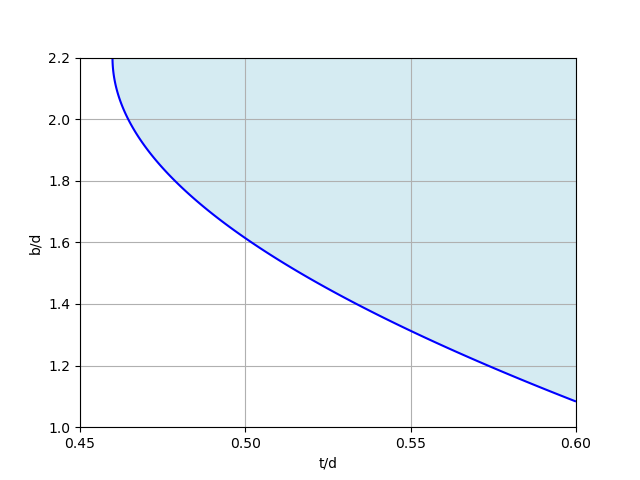
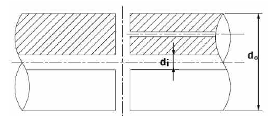
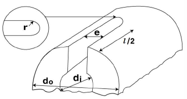
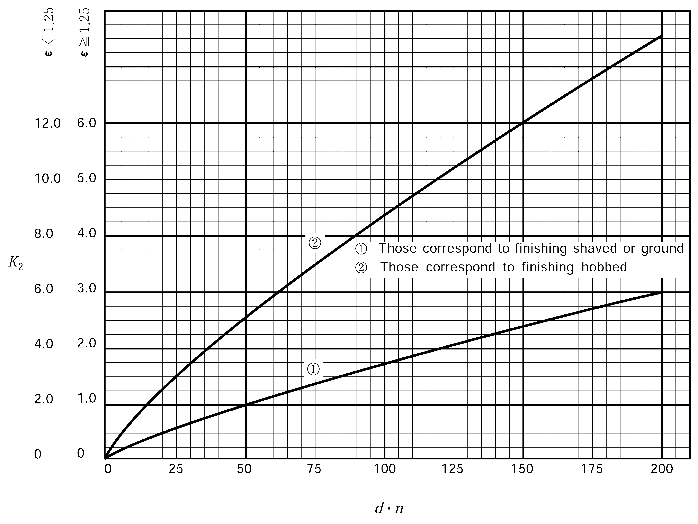

# PART 5 Machinery Installations

> RULES FOR CLASSIFICATION OF STEEL SHIPS / RA-05-E / 2025 / EN / Guidance

## CHAPTER 2 MAIN AND AUXILIARY ENGINES

### Section 1 General

#### 101. Application

- **1.** In application to **101. 1** of the Rules, the small auxiliary engines may apply to the following; *(2017)* **【See Rule】**
  - **(1)** For auxiliary engines having output of less than 100 $\mathrm{kW}$ driving generators (including emergency generator) or essential auxiliaries.
    - **(A)** The submission of plans and documents may be omitted. However, plans or documents to confirm that the engines are comply with requirements in **Ch 1, 103. 1** and **Ch 2, 203. 9** of the Rules, are to be submitted to attending Surveyor.
    - **(B)** Materials used in the main components may comply with *Korean Industrial Standards or equivalent.*
    - **(C)** For tests except visual inspections of engine assembly and shop tests, if manufacturers carry out internal tests and submit test reports, the presence of the Surveyor may be omitted.
  - **(2)** The requirements for the plans and documents, materials, tests of auxiliary engines driving cargo handling machinery are in accordance with **Pt 9, Ch 2** of the Rules.
- **2.** **Welding** In application to **101. 5** of the Rules, the general requirements for principal component with welded construction are to be comply with **Ch 5, Sec 4** of the Rules. **【See Rule】**
- **3.** **Electronically controlled reciprocating internal combustion engines** In application to **101. 7** of the Rules, the additional requirements specified otherwise by the Society are to be in accordance with **Annex 5-8**. **【See Rule】**

### Section 2 Reciprocating Internal Combustion Engines

#### 202. Construction and installation

- **1.** In application to **202. 1** (2) of the Rules, the strength of each bolt is to be satisfied to following formula. **【See Rule】**
  - **(1)** Where the torque control tightening method is applied, following formula are to be met with. *(2023)*
    $F _{a} = \frac{T}{k _{a} \cdot d} \times 1000$,
    $F _{a} /A _{bolt}$ (pre-tension value) is recommended to be around 70 % of $\sigma _{BY}$
    where:
    $F_{ a}$ : Axial force of bolt (axial direction tension force applied to the bolt tightened by torque)(N)
    $T$ : Torque recommended by an engine manufacturer (moment tightening nut) (N·m)
    $k _{ a}$ : Torque factor value given by an engine manufacturer
    $d$ : Nominal dimension of screw outer diameter of bolt (mm)
    $A _{bolt}$ : Minimum section area of screw of bolt (mm^2)
    $\sigma _{BY}$ : Specified minimum yield strength of bolt material (N/mm^2)
  - **(2)** Where the hydraulic tightening method is applied, following formula are to be met with. *(2023)*
    $F _{b} = k _{ b} \times P \times A _{ p}$,
    $F _{a} /A _{bolt}$ (pre-tension value) is recommended to be around 70 % of $\sigma _{BY}$
    where:
    $F_{ b}$ : Axial force of bolt (axial direction tension force applied to the bolt calculated from tightening hydraulic pressure) (N)
    $P$ : Hydraulic pressure of hydraulic tension device (N/mm2)
    $A _{p}$ : Effective piston area of hydraulic tension device (mm^2)
    $k_{ b}$ : Hydraulic coefficient for setting and resilience behaviour, to be taken as 0.85. However, where $k_{ b}$ is different form this value, it may be accepted if detailed review report is submitted to the Society and deemed appropriate by the Society
    $A _{bolt}$, $\sigma _{BY}$ : To be followed to (1)
- **2.** In application to **202. 5** (5) of the Rules, it is acceptable to charge the starting batteries through a charging generator attached to the engine. However, starting devices for emergency generating sets are to comply with the requirements in **Pt 6, Ch 1, 203. 6** of the Rules. *(2019)* **【See Rule】**

#### 203. Safety devices

- **1.** In application to **203. 2** of the Rules, other acceptable means may be considered as follows. *(2021)* **【See Rule】**
  - **(1)** Methods to prevent over pressure by tension of cylinder head bolts
  - **(2)** Devices that activate the alarm and automatically stop or slow down the engine when cylinder overpressure occurs by installing cylinder pressure sensors capable of continuously monitoring
  - **(3)** Other devices deemed appropriate by the Society
- **2.** In application to **203. 4** of the Rules, manual and name plate for relief valves of crankcase are to be in accordance with the following. **【See Rule】**
  - **(1)** A copy manufacturer's installation and maintenance manual that is pertinent to the size and type of relief valve being supplied for installation on a particular engine is to be provided on board ship. The manual is to contain the following information.
    - **(A)** Description of valve with details of function and design limits
    - **(B)** Installation instructions
    - **(C)** Maintenance in service instructions to include testing and renewal of any sealing arrangements
    - **(D)** Actions required after a crankcase explosion
  - **(2)** Relief valves are to be provided with suitable markings that include the following information.
    - **(A)** Name and address of manufacturer
    - **(B)** Designation and size
    - **(C)** Month/Year of manufacture
    - **(D)** Approved installation orientation
- **3.** In application to **203. 10** (1) of the Rules, bearing temperature monitors or equivalent devices are to be in accordance with the following. **【See Rule】**
  - **(1)** Bearing temperature monitors of low speed reciprocating internal combustion engines are to be capable of monitoring temperature(or oil outlet temp.) of main bearing, crank bearing and crosshead bearing.
  - **(2)** Bearing temperature monitors of medium and high speed reciprocating internal combustion engines are to be capable of monitoring temperature(or oil outlet temp.) of main bearing and crank bearing.
  - **(3)** An equivalent device could be interpreted as measures applied to high speed engines where specific design features to preclude the risk of crankcase explosions are incorporated.
- **4.** In application to **203. 10** (1) of the Rules, where an overriding for automatic shutoff arrangements is installed, the documents on the consequences are to be submitted to this Society for approval.
- **5.** In application to **203. 10** (2) of the Rules, the engine designer's and oil mist manufacturer's instructions are to be included the following particulars. **【See Rule】**
  - **(1)** Schematic layout of engine oil mist detection and alarm system showing location of engine crankcase sample points and piping or cable arrangements together with pipe dimensions to detector.
  - **(2)** Evidence of study to justify the selected location of sample points and sample extraction rate (if applicable) in consideration of the crankcase arrangements and geometry and the predicted crankcase atmosphere where oil mist can accumulate.
  - **(3)** The manufacturer's maintenance and test manual.(A copy of the manual is to be provided on board ship.)
  - **(4)** Information relating to type or in-service testing of the engine with engine protection system test arrangements having approved types of oil mist detection equipment.
- **6.** In application to **203. 10** (8) of the Rules, the details are to be submitted for consideration are to be in accordance with the following. **【See Rule】**
  - **(1)** Engine particulars (type, power, speed, stroke, bore and crankcase volume, etc.)
  - **(2)** Details of arrangements prevent the build up of potentially explosive conditions within the crankcase, e.g., bearing temperature monitoring, oil splash temperature, crankcase pressure monitoring, recirculation arrangements.
  - **(3)** Evidence to demonstrate that the arrangements are effective in preventing the build up of potentially explosive conditions together with details of in-service experience.
  - **(4)** Operating instructions and the maintenance and test instructions.

#### 204. Crank shafts 【See Rule】

- **1.** Minimum diameter in application to **Table 5.2.3 of Rules,** coefficients A and B for engines having unequal firing intervals are to be in accordance with the following;
  - **(1)** 4-stroke cycle in-line engines
    
  - **(2)** 2-stroke cycle vee engines
    

#### 205. Dimensions of crank arms

The dimensions of the crank arms breadth $b$, crank arms thickness $t$ and radius in fillet $r$ are to be in accordance with the following;

- **1.** **Solid crankshaft 【See Rule】**
  - **(1)** In application to **205. 1** of the Rules, as for $b$, the breadth on the perpendicular bisector of the line between the crankpin center and journal center is to be used. As for $t$, the thickness at the same section as $b$ is to be used, and the recess need not be accounted in the thickness even when it is provided. As for $r$, the radius connecting to the crankpin or journal is to be used when a composite radius is provided.
  - **(2)** When the diameters of crankpin and journal are different each other, their $t/d$ and $b/d$ are to be in accordance with **205. 1** or **Fig 5.2.1** of the Rules.
    
- **2.** **Semi-built-up crankshaft 【See Rule】**
  In application to **205. 3** of the Rules as for $b$, the breath on the line perpendicularly interested to the line between the crankpin center and journal center and tangent to the crankpin is to be used. As for $t$, the thickness at the same section as $b$ is to be used, and the recess need not be accounted in the thickness even when it is provided, and the ring around the shringkage hole is not to be included in the thickness. As for $r$, the radius connecting to the crankpin or journal is to be used when a composite radius is provided. $b$ and $t$ are given in **Fig 5.2.1** of the Guidance.
- **3.** In application to **205. 3** and **4** of the Rules the thickness of crankarm in way of the shrinkage fit as **Fig 5.2.1** (d) of the Guidance is to comply with the following formula instead of **205. 3** of the Rules; **【See Rule】**
  $t 1 \left( 1- \frac{1}{A s _{1} 2} \right) +t 2 \left( 1- \frac{1}{A s _{2} 2} \right) + \cdot \cdot \cdot \cdot \cdot \cdot \geq \frac{C 1 TD 2}{C 2 d h 2}\#
  \#
  t 2 \geq 0.525d c$

#### 206. Material consideration 【See Rule】

In the application **206.** of the Rules, in case where the semi-built-up crankshaft made of the materials having a specified tensile strength less than 440 $\mathrm{N}/mm ^{2}$, the coefficient $K _{m}$ may be 1**.**

#### 208. Special consideration 【See Rule】

- **1.** The requirements of **208.** of the Rules are in accordance with the following;
  - **(1)** The definition and approval test for “manufacturing process of the different manufacturing methods of forged crankshaft” are to be in accordance with **Ch 2, Sec 5** of the **"Guidance for Approval of Manufacturing Process and Type Approval, Etc."**
  - **(2)** The diameter of crankshaft manufactured by the different manufacturing methods mentioned previous (1) may be reduced by multiplying $d_{ c}$ by the less coefficient between $k_{ r}$ and $k_{ \rho }$*.*
    $k _{r} = root {3} of {\frac{1}{1.15}}$
    $k _{\rho } = root {3} of {\frac{1}{1+ \rho /100}}$
    $\rho$ : Degree of improvement in strength approved by the Society relative to the surface hardening ($\%$)
    - **(A)** In case where the crankshaft are manufacturers by such a special method approved by the Society that the forging grain-flow is continuous, and the product quality is stable, and the fatigue strength is considered to be improved by 20 % or more compared with that in free forging process;
    - **(B)** In case where the crankshaft are manufactured by such a special method approved by the Society that a surface hardening is provided and the product quality is stable, and a superiority is considered in the fatigue strength;
  - **(3)** In case **205. 3** and **210. 1** of the Rules, the previous (2) is not to be applied.
- **2.** In case where the diameter of crankshaft, dimension of crankarm and radius in fillet are less than the valves required in **204.** and **205.** of the Rules, the requirements of **208.** of the Rules are in accordance with the following (refer to **Fig 5.2.2** of the Guidance).
  
  - **(1)** When it is not satisfied with **204. 2** of the Rules;
    In case where the diameter of crankpins or journals is less than the required diameter $d _{c}$ given in **204. 2** of the Rules and considered according to **206., 207.** of the Rules and **208. 1** (2) of the Guidance, consideration will be given in each case on basis of the stress levels in fillets, the torsional stress levels in parallel parts, friction force of shrinkage fitted parts, material, etc. In this connection, the stress levels in fillets are to be in accordance with the following (A) or (B).
    The diameter of pin may be acceptable where the value of equivalent stress amplitude de calculated by the **Annex 5-2** (Guidance for calculation of crankshaft stress(1)) is not more than the allowable stress s obtained from the formula below with the coefficient shown in **Table 5.2.1** of the Guidance.
    $\sigma = \sigma _{a} \cdot f _{m} \cdot f _{s} + \alpha ( \mathrm{N}/mm ^{2} )$

    | $\sigma _{ a}$ *(*$\mathrm{N}/mm ^{ 2}$*)* | Cycle |   | 2 cycle |   | 4 cycle |
    | --- | --- | --- | --- | --- | --- |
    | $\sigma _{ a}$ *(*$\mathrm{N}/mm ^{ 2}$*)* | Type of crankshaft |   | Semi-built-up | Solid | Solid |
    | $\sigma _{ a}$ *(*$\mathrm{N}/mm ^{ 2}$*)* | Solid Shaft Diameter(*d*) | $d$≥200 | 53.9 | 53.9(※) | 83.3 |
    | $\sigma _{ a}$ *(*$\mathrm{N}/mm ^{ 2}$*)* | Solid Shaft Diameter(*d*) | 200＞$d$≥100 | ─ | 132.3 - $d$/4 |   |
    | $\sigma _{ a}$ *(*$\mathrm{N}/mm ^{ 2}$*)* | Solid Shaft Diameter(*d*) | 100＞$d$ | ─ | 107.8 |   |
    | $\sigma _{ a}$ *(*$\mathrm{N}/mm ^{ 2}$*)* | NOTES : $d$ is the actual diameter of crankpin or journal whichever is larger. (※) In case engine bed other than welded type, $\sigma _{a}$ may be applied 83.3. |   |   |   |   |
    | $f_{ m}$ | $1 + \frac{2}{3} \left( \frac{T_s}{440} - 1 \right)$ |   |   |   |   |
    | $f_{ m}$ | NOTES : $T_{ s}$ is the minimum specified tensile strength ($\mathrm{N}/mm ^{2}$) of crankshaft materials. |   |   |   |   |
    | $f_{ s}$ | Manufacturing method |   |   |   |   |
    | $f_{ s}$ | Ordinary method | Method meeting (A) for $k_{ r}$ specified in **208. 1.** (2) of the Guidance |   | Method meeting (B) for $k_{ \rho }$ specified in **208. 1.** (2) of the Guidance |   |
    | $f_{ s}$ | 1 | 1.15 |   | 1 + $\rho$/100 |   |
    | $f_{ s}$ | NOTES : $\rho$ signifies the degree of strength improvement($\%$) approved by the Society relative to surface hardening. |   |   |   |   |
    | $\alpha$ *(*$\mathrm{N}/mm^2$*)* | Main bearing material |   |   |   |   |
    | $\alpha$ *(*$\mathrm{N}/mm^2$*)* | White metal |   | Tri-metal or kelmet |   |   |
    | $\alpha$ *(*$\mathrm{N}/mm^2$*)* | 0 |   | 9.8 |   |   |

    The diameter may be acceptable where the value of the acceptability factor $Q$ calculated by the **Annex 5-3** (Guidance for calculation of crankshaft stress(2)) is comply with the following formula.
    $Q$ ≥ 1.15
    - **(A)** In case where the torsional stress in crankpins and journals are evaluated without carrying out a forced vibration calculation including the stern shaftings;
    - **(B)** In case where the torsional stress in crankpins and journals are evaluated by carrying out a forced vibration calculation in including the stern shafting:
  - **(2)** In case where the dimensions of crankarms fail to meet the requirements **205.** of the Rules;
    $M=10 ^{-2} APL \times \frac{\alpha _{KB}}{5}$
    $T=10 ^{-2} BP _{i} S \times \frac{\alpha {{} _{KT}}}{1.8}$
    Where :
    $0 \leq \frac{q}{r} \leq 1, -0.3 \leq \frac{s}{d} \leq 0.4, 8 \leq \frac{d}{r} \leq 27$
    $1.1 \leq \frac{b}{d} \leq 2.1, 0.2 \leq \frac{t}{d} \leq 0.56$
    $\alpha _{KB} =4.84 \times f _{1} \times f _{2} \times f _{3} \times f _{4} \times f _{5}$ (Stress concentration factor for bending)
    $f _{1} =0.42+0.16 \sqrt {\frac{d}{r} -6.864}$
    $f _{2} =1+81 \left\{ 0.769- \left( 0.407- \frac{s}{d} \right) ^{2} \right\} \left( \frac{q}{r} \right) \left( \frac{r}{d} \right) ^{2}$
    $f _{3} =0.285 \left( 2.2- \frac{b}{d} \right) ^{2} +0.785$
    $f _{4} =0.444 \left( \frac{d}{t} \right) ^{1.4}$
    $f _{5} =1- \left\{ \left( \frac{s}{d} +0.1 \right) ^{2} / \left( 4 \frac{t}{d} -0.7 \right) \right\} .................... \left( \frac{t}{d} \geq 0.36 \right)$
    $=1-1.35 \left( \frac{s}{d} +0.1 \right) ^{2} ..................... \left( \frac{t}{d} <0.36 and \frac{s}{d} >-0.1 \right)$
    $=1 ..................... \left( \frac{t}{d} <0.36 and \frac{s}{d} \leq -0.1 \right)$
    $\alpha _{KT} =1.75 \times g _{1} \times g _{2} \times g _{3}$ (Stress concentration factor for torsion)
    $g _{1} =31.6 \left( 0.152- \frac{r}{d} \right) ^{2} +0.67$
    $g _{2} =1.04+0.317 \frac{s}{d}$
    $g _{3} =1.31-0.233 \frac{b}{d}$
    $d$ : actual diameter of crankpin or journal ($\mathrm{mm}$)
    $r$ : radius in fillet ($\mathrm{mm}$)
    $q$ : recess ($\mathrm{mm}$)
    $s$ : Offset between crankpin and journal ($\mathrm{mm}$)
    $s= \frac{Diameter of p i n+Diameter of journal- "Length of stroke"}{2}$
    $d ^{2} \times t \times p _{m} \geq CTD ^{2}$
    where :
    $C$ : 103 for 2-stroke cycle in-line engines
    165 for 4-stroke cycle in-line engines
    $d$ : Diameter of the hole at shrinkage fit ($\mathrm{mm}$)
    $t$ : Thickness of crankarm measured parallel to the axis ($\mathrm{mm}$)
    $T$ : Same as **204.** of the Rules
    $D$ : Cylinder bore ($\mathrm{mm}$)
    $p _{m}$ : Surface pressure at shrinkage fit ($\mathrm{N}/mm ^{2}$), as given by the following formula;
    $p _{m} =Y \left[ \log _{e} K+ \frac{1}{2} \left\{ 1- \frac{K ^{2}}{A _{s} ^{2}} \right\} \right] \times \left( 1-R ^{2} \right)$
    *Y* : Yield strength of crank web material ($\mathrm{N}/mm ^{2}$)
    $A _{s} = \frac{External diameter of web(\mathrm{mm})}{d}$
    $K=0.9 \sqrt {\frac{206 \alpha}{Y} +0.25}$
    $\alpha = \frac{Shrinkage allowance( \mathrm{mm}) it}{d} \times 10 ^{3}$
    $R$ : Quotient obtained by dividing the inside diameter of hollow shaft by its outside diameter
    - **(A)** The dimension of crankarms may be acceptable where the actual diameters $d$ of crankpins and journals are not less than the required diameter $d _{c}$ calculated by **204.** of the Guidance by replacing *M* and *T* with those specified below. In this case, the dimensions are to be within the following ranges. And, *b*, *t* and *r* are specified in **205.** of the Guidance.
    - **(B)** In case where the dimensions of the crankarms fail to meet the requirements even after applying (A) above, **208. 2** (1) (A) and (B) of the Guidance may be applied.
    - **(C)** In case where the thickness or outside diameter of crankarms of built-up crankshaft fail to meet the requirements, they may be acceptable provided that the following is satisfied.

#### 211. Tests and inspections

- **1.** In application to **Table 5.2.4** of the Rules, necessary actions for prohibition of arc strike are to be taken at magnetic particle test by prod method.
- **2.** In the application **211. 3** of the Rules, "the procedure as deemed appropriate by the Society" means the procedure specified in **Ch 3, Sec 8** of the **"Guidance for Approval of Manufacturing Process and Type Approval, Etc."** For auxiliary engines having output of less than 100 $\mathrm{kW}$ driving generators (including emergency generator) or essential auxiliaries, and auxiliary engines (regardless of power) driving cargo handling machinery, the type approval can be exempted. *(2017)* **【See Rule】**
- **3.** In the application **211. 4** and **5** of the Rules, safety precautions and general are to be in accordance with the following. **【See Rule】**
  - **(1)** Before any test run is carried out, all relevant equipment for the safety of attending personnel is to be made available by the manufacturer/shipyard and is to be operational. This applies especially to crankcase explosive conditions protection, but also to over-speed protection and any other shut down function. The overspeed protective device is to be set to a value, which is not higher than the overspeed value that was demonstrated during the type test for that engine. This set point shall be verified by the surveyor.
  - **(2)** Before any official testing, the engines shall be run-in as prescribed by the engine manufacturer. Adequate test bed facilities for various load points shall be provided. All fluids used for testing purposes such as fuel, lubrication oil and cooling water are to be suitable for the purpose intended, e.g. they are to be clean, preheated if necessary and cause no harm to engine parts. This applies to all fluids used temporarily or repeatedly for testing purposes only.
  - **(3)** When no-load operating is carried out for adjusting the engine maneuvering conditions, the fuel delivery system, maneuvering system and safety devices are to be properly adjusted before operating.
  - **(4)** Engines are to be inspected for the following.
    - **(A)** Jacketing of high-pressure fuel oil lines including the system used for the detection of leakage
    - **(B)** Screening of pipe connections in piping containing flammable liquids
    - **(C)** Insulation of hot surfaces by taking random temperature readings that are to be compared with corresponding readings obtained during the type test. This shall be done while running at the rated power of engine. Use of contact thermometers may be accepted at the discretion of the attending Surveyor. If the insulation is modified subsequently to the Type Approval Test, the Society may request temperature measurements by use of Infrared Thermoscanning Equipment. Equivalent measurement equipment may be used. Readings obtained are to be randomly verified by use of contact thermometers.
    - **(D)** These inspections are normally to be made during the works trials by the manufacturer and the attending surveyor, but at the discretion of the Society parts of these inspections may be postponed to the shipboard testing.
- **4.** In the application **211. 4** of the Rules, shop trials deemed appropriated by the Society mean to be in accordance with the following. **【See Rule】**
  - **(1)** The programme shown in **Table 5.2.2** of the Guidance is to be used as a standard for shop trial of reciprocating internal combustion engines. Alternatives to the detailed tests may be agreed between the manufacturer and the Society when the overall scope of tests is found to be equivalent. Additional test items may be requested according to the discretion of the Society. *(2023)*
  - **(2)** Records
    - **(A)** The following environmental test conditions are to be recorded
      - **(a)** Ambient air temperature
      - **(b)** Ambient air pressure
      - **(c)** Atmospheric humidity
    - **(B)** For each required load point, the following parameters are normally to be recorded
      - **(a)** Power and speed
      - **(b)** Fuel index (or equivalent reading)
      - **(c)** Maximum combustion pressures (only when the cylinder heads installed are designed for such measurement)
      - **(d)** Exhaust gas temperature before turbine and from each cylinder
      - **(e)** Charge air temperature
      - **(f)** Charge air pressure
      - **(g)** Turbocharger speed
    - **(C)** Calibration records for the instrumentation are, upon request, to be presented to the attending Surveyor.
    - **(D)** For all stages at which the engine is to be tested, the pertaining operational values are to be measured and recorded by the engine manufacturer. All results are to be compiled in an acceptance protocol to be issued by the engine manufacturer. This also includes crankshaft deflections if considered necessary by the engine designer.
    - **(E)** In each case, all measurements conducted at the various load points are to be carried out at steady state operating conditions. However, for all load points provision should be made for time needed by the Surveyor to carry out visual inspections.
  - **(3)** Turbocharger matching with engine
    Turbochargers shall have a compressor characteristic that allows the engine, for which it is intended, to operate without surging during all operating conditions and also after extended periods in operation. For abnormal, but permissible, operation conditions, such as misfiring and sudden load reduction, no continuous surging shall occur. In this section, surging and continuous surging are defined as follows: Surging means the phenomenon, which results in a high pitch vibration of an audible level or explosion-like noise from the scavenger area of the engine. Continuous surging means that surging happens repeatedly and not only once.
    Category C turbochargers used on propulsion engines are to be checked for surge margins during the engine workshop testing as specified below. These tests may be waived if successfully tested earlier on an identical configuration of engine and turbocharger (including same nozzle rings).
    The following shall be performed without indication of surging.
    The surge margin shall be demonstrated by at least one of the following methods.
    The maximum power permitted for one cylinder misfiring.
    The engine load corresponding to a charge air pressure of about 0.6 bar (but without auxiliary blowers running).
    - **(A)** Compressor chart
    - **(B)** Surge margin verification
      - **(a)** For 4-stroke engines
      - **(i)** With maximum continuous power and speed (=100 %), the speed shall be reduced with constant torque (fuel index) down to 90 % power.
        - **(ii)** With 50 % power at 80 % speed (= propeller characteristic for fixed pitch), the speed shall be reduced to 72 % while keeping constant torque (fuel index).
      - **(b)** For 2-stroke engines
      - **(i)** The engine working characteristic established at workshop testing of the engine shall be plotted into the compressor chart of the turbocharger (established in a test rig). There shall be at least 10 % surge margin in the full load range, i.e. working flow shall be 10 % above the theoretical (mass) flow at surge limit (at no pressure fluctuations).
        - **(ii)** Sudden fuel cut-off to at least one cylinder shall not result in continuous surging and the turbocharger shall be stabilized at the new load within 20 seconds. For applications with more than one turbocharger the fuel shall be cut-off to the cylinders closest upstream to each turbocharger. This test shall be performed at two different engine loads as following.
        - **(iii)** No continuous surging and the turbocharger shall be stabilised at the new load within 20 seconds when the power is abruptly reduced from 100 % to 50 % of the maximum continuous power.
  - **(4)** Integration tests
    For electronically controlled engines, integration tests are to be made to verify that the response of the complete mechanical, hydraulic and electronic system is as predicted for all intended operational modes and the tests considered as a system are to be carried out at the works. If such tests are technically unfeasible at the works, however, these tests may be conducted during sea trial. The scope of these tests is to be agreed with the Society for selected cases based on the FMEA.
- **5.** In the application **211. 5** of the Rules, on-board tests deemed appropriated by the Society mean to be in accordance with the following. **【See Rule】**
  - **(1)** The **Table 5.2.3** of the Guidance is to be used as a standard for the details of on-board test programme or sea trial programme for reciprocating internal combustion engines. Additional tests may be carried out according to *KS V* 0811 (Sea Trials Code for Machinery Department) where considered necessary by the Society. The details of the programme are referred to *KS V* 0811 or standards considered as equivalent thereto, and the overhaul inspection for cylinder assembly may be carried out where considered necessary by the Society.
  - **(2)** Barred speed range
    Where a barred speed range is required, passages through this barred speed range, both accelerating and decelerating, are to be demonstrated as following. The times taken are to be recorded and are to be equal to or below those times stipulated in the approved documentation, if any. This also includes when passing through the barred speed range in reverse rotational direction, especially during the stopping test.

    | Use of engines Test items |   | Propulsion engines driving propeller or impeller only(2) | Engines driving generators for electric propulsion and main power supply(3) | Propulsion engines also driving power take off (PTO) generator(4) | Engines driving essential auxiliaries(2) |
    | --- | --- | --- | --- | --- | --- |
    | 110 % power run |   | 15 *minutes* at the speed of 1.032 times of the rated engine speed or after steady conditions have been reached, whichever is shorter(1) | 15 *minutes* at the rated engine speed | 15 *minutes* at the rated engine speed | 15 *minutes* at the rated engine speed |
    | Approved intermittent overload (if applicable) |   | testing for duration as agreed with the manufacturer | - | testing for duration as agreed with the manufacturer | testing for duration as agreed with the manufacturer |
    | Load tests | 100 % power run(5) | 60 *minutes* at the rated engine speed | 60 *minutes* at the rated engine speed | 60 *minutes* at the rated engine speed | 30 *minutes* at the rated engine speed |
    | Load tests | 90 % or Normal continuous cruise power run(6) | 20 *minutes* at engine speed in accordance with characteristics of propeller | - | 20 *minutes* at engine speed in accordance with characteristics of propeller or the rated engine speed | - |
    | Load tests | 75 % power run(6) | 20 *minutes* at engine speed in accordance with characteristics of propeller | 20 *minutes* at the rated engine speed | 20 *minutes* at engine speed in accordance with characteristics of propeller or the rated engine speed | 20 *minutes* at engine speed in accordance with the nominal power consumption curve |
    | Load tests | 50 % power run(6) | 20 *minutes* at engine speed in accordance with characteristics of propeller | 20 *minutes* at the rated engine speed | 20 *minutes* at engine speed in accordance with characteristics of propeller or the rated engine speed | 20 *minutes* at engine speed in accordance with the nominal power consumption curve |
    | Load tests | 25 % power run(6) | 20 *minutes* at engine speed in accordance with characteristics of propeller | 20 *minutes* at the rated engine speed | 20 *minutes* at engine speed in accordance with characteristics of propeller or the rated engine speed | 20 *minutes* at engine speed in accordance with the nominal power consumption curve |
    | Reverse maneuvering test(7) |   | ○ | - | ○ | - |
    | Governor characteristics test |   | ○ | ○ | ○ | ○ |
    | Performance test of alarm and safety devices |   | ○ | ○ | ○ | ○ |
    | Overhaul inspection(8) |   | ○ | ○ | ○ | ○ |
    | NOTES : 1. For electronically controlled reciprocating internal combustion engines, integration tests are to be carried out in accordance with **211. 4** (4) of the Guidance. 2. (1) through (8) in this Table are subject to the following; (1) When the test report for identical engine and turbocharger configuration is presented proving the compatibility for overloaded operation, the 110 % power run may be waived. *(2019)* (2) After the trials, the fuel delivery system is to be blocked so as to limit the engines to run at not more than 100 $\%$ power, unless intermittent overload power is approved by the Society. (3) After running on the test bed, the fuel delivery system is to be adjusted so that full power plus a 10 % margin for transient regulation can be given in service after installation onboard. The transient overload capability is required so that the required transient governing characteristics are achieved also at 100 % loading of the engine, and also so that the protection system utilised in the electric distribution system can be activated before the engine stalls. (4) After running on the test bed, the fuel delivery system is to be adjusted so that full power plus a margin for transient regulation can be given in service after installation onboard. The transient overload capability is required so that the electrical protection of downstream system components is activated before the engine stalls. This margin may be 10 % of the engine power but at least 10 % of the PTO power. (5) The readings are to be taken twice at an interval of at least 30 *minutes.* (6) The sequence is to be selected by the engine manufacturer. *(2021)* (7) The test item applies only to direct reversible engines. (8) Random checks of components to be presented for inspection after works trials are left to the discretion of the attending Surveyor. *(2018)* |   |   |   |   |   |

    | Use of engines Test items | Propulsion engines driving propeller or impeller only(1) | Engines driving generators for electric propulsion and main power supply(2) | Propulsion engines also driving power take off (PTO) generator | Engines driving essential auxiliaries |
    | --- | --- | --- | --- | --- |
    | 110 % power run(3) | 30 *minutes* at the speed of 1.032 times of the rated engine speed | 10 *minutes* at the 110 % rated electrical power of generator | 30 *minutes* at the speed of 1.032 times of the rated engine speed | - |
    | Approved intermittent overload (if applicable) | testing for duration as agreed with the manufacturer | - | testing for duration as agreed with the manufacturer | testing for duration as agreed with the manufacturer |
    | 100 % power run | 4 *hours* at the rated engine speed | 1 *hour* at the 100 % rated electrical power of generator | 4 *hours* at the rated engine speed (4) | 30 *minutes* at the rated engine speed |
    | Minimum engine speed test | ○ | - | ○ | - |
    | Starting maneuvering test(5) | ○ | ○ | ○ | ○ |
    | Reverse maneuvering test(6) | ○ | - | ○ | - |
    | UMA test(7) | ○ | ○ | ○ | ○ |
    | Alarms and safety devices test(8) | ○ | ○ | ○ | ○ |
    | Test for fitness of fuel oil(9) | ○ | ○ | ○ | ○ |

    | NOTES: (1) through (9) in this Table are subject to the following; (1) For controllable pitch propellers, the tests are to be carried out at the maximum achievable power if 100 % cannot be reached, the tests are to be carried out at the various pitches. For controllable pitch propellers, the test at the speed of 1.032 × rated engine speed is not required. *(2021)* (2) Each engine is to be tested 100 % electrical power for at least 60 min and 110 % of rated electrical power of the generator for at least 10 min. This may, if possible, be done during the electrical propulsion plant test, which is required to be tested with 100 % propulsion power (i.e. total electric motor capacity for propulsion) by distributing the power on as few generators as possible. The duration of this test is to be sufficient to reach stable operating temperatures of all rotating machines or for at least 4 hours. When some of the gen. set(s) cannot be tested due to insufficient time during the propulsion system test mentioned above, those required tests are to be carried out separately. Demonstration of the generator prime movers’ and governors’ ability to handle load steps as described in **Pt 6, Ch 1, 202. 2 of the Rules.** (3) The test is to be carried out in case that engine adjustment permit (See **Table 5.2.2** Note 2. (2)). However, the test may be dispensed with when deemed appropriate by the Society in consideration of the result of the shop trials. *(2021)* (4) The test is to be carried out for 2 hours with 100 % propeller branch power at rated engine speed (unless already covered in the test at 100 % power run). In addition, the test is to be carried out for 1 hour with 100 % PTO branch power at rated engine speed. *(2021)* (5) The direct reversible engines are to be carried out ahead and astern starting repeatedly without replenishment, and the other engines are to be carried out starting and stop repeatedly without replenishment. (6) For controllable pitch propellers in reverse pitch, for the direct reversible engine in reverse rotational direction during stopping tests, passages through the barred speed range are to be demonstrated in accordance with **211. 6** (2) of the Guidance. (7) The test is to be carried out for ships which are going to be registered as ships provided with unattended machinery automatic systems. (8) The monitoring and alarm systems are to be checked to the full extent for all engines, except items already verified during the works trials. (9) The test is to be carried out for the engines used residue oil or equivalent thereto. However, the test may be dispense with when deemed appropriate by the Society or in the case of that the fitness was certified at the shop trial. |
    | --- |
    - **(A)** Applies both for manual and automatic passing-through systems.
    - **(B)** The ship’s draft and speed during all these demonstrations is to be recorded. In the case of a controllable pitch propeller, the pitch is also to be recorded.
    - **(C)** The engine is to be checked for stable running (steady fuel index) at both upper and lower borders of the barred speed range. Steady fuel index means an oscillation range less than 5 % of the effective stroke (idle to full index).

### Section 3 Steam Turbines

#### 304. Safety devices 【See Rule】

It is recommended that the main turbines are provided with a quick acting device which automatically shut off the steam supply in case of unacceptable axial displacement of the turbine rotor in addition to the devices mentioned in **304. 2** and **3** of the Rules.

#### 306. Strength and sectional area of turbine blades 【See Rule】

When the calculations for vibration stress for the blade or the specified 0.01 $\%$ proof-stress of the blade material are submitted to the Society and are deemed appropriate by the Society, the values of 2 times the specified 0.01 $\%$ proof-stress for the blade material may be applied instead of *S* in the formula given in **306.** of the Rules.

#### 307. Tests and inspections

- **1.** In the application **307. 3** of the Rules, the programme as deemed appropriate by the Society means *KS V* 4211 (Shop Test Code of Marine Steam Engine for Propelling Use) or standards considered as equivalent thereto are to be used as a standard. **【See Rule】**
- **2.** In the application **307. 4** (2) of the Rules, the programme as deemed appropriate by the Society means *KS V* 0811 (Sea Trials Code for Machinery Department) or standards considered as equivalent thereto are to be used as a standard. **【See Rule】** 
