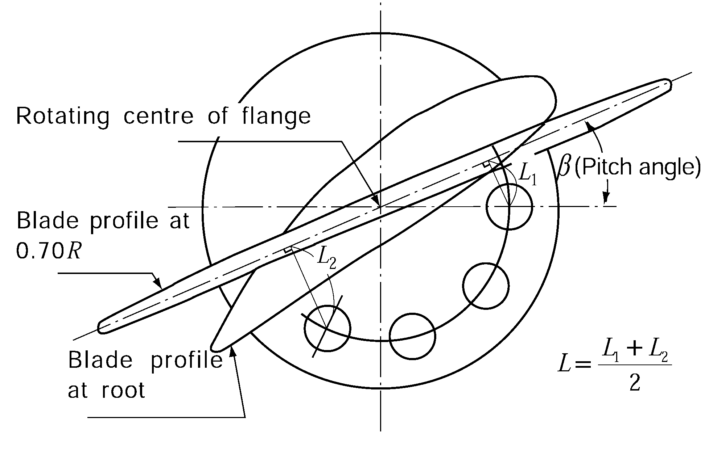

# PART 5 Machinery Installations

> RULES FOR CLASSIFICATION OF STEEL SHIPS / RA-05-E / 2025 / EN / Guidance

## CHAPTER 3 PROPULSION SHAFTING AND POWER TRANSMISSION SYSTEMS

### Section 1 General

#### 101. Welded structure component

In application to **101.** of the Rules, the general requirements for major parts with welded construction are to apply appropriate modifications of **Ch 5, Sec 4** of the Rules. **【See Rule】**

#### 102. Other propulsion and maneuvering machinery 【See Rule】

In application to **102.** of the Rules, it may be complied with the following;

- **1.** Bow or side thrusters and their control units (hereinafter called **"thrusters"**) are to comply with the followings. However, in the case of small thrusters with less than 100kW of driving power, the requirements of (1), (2), (3), and (4) (A) below may be omitted. *(2019) (2022)*
  - **(1)** Plans and documents
    Before the work is commenced, the manufacturers are to submit the following plans and documents in triplicate to the Society for approval.
    - **(A)** General arrangement of thruster
    - **(B)** Sectional assembly (including materials of principal component)
    - **(C)** Controlling diagrams
    - **(D)** Shaft arrangement and sealing devices
    - **(E)** Propeller
    - **(F)** Power transmission gear arrangement
    - **(G)** Piping arrangement
    - **(H)** Main particulars (kind of prime mover, output, number of revolution, capacity, etc. are to be stated)
    - **(I)** Plans and documents considered necessary by the Society
  - **(2)** Materials
    The materials used in the principal component, in principle, are to be complied with the requirements of **Pt 2, Ch 1** of the Rules. However, the Society may accept to be used of the materials which comply with *Korean Industrial Standard* or standard considered as equivalent thereto.
  - **(3)** Design *(2020)*
    The construction and strength of propeller blades is to comply with the requirements in **Ch 3, 303.** of the Rules. However, where the manufacturer submits a detailed calculation and deemed as appropriate by the Society, it may be complied with.
  - **(4)** Shop tests
    For shafting, **Ch 3, Sec 2** of the Rules; For propellers, **Ch 3, Sec 3** of the Rules;
    For power transmission gears **Ch 3, Sec 4** of the Rules.
    - **(A)** The test requirements of shafting, propellers and power transmission gears are to be applied appropriate modifications respectively such as follows;
    - **(B)** The hydraulic tests for hydraulically pressurised parts of equipment and piping systems are to be in accordance with the requirements of **Ch 6** of the Rules. However, theses shop tests may be substituted for the tests carried out by the manufacturer.
    - **(C)** The test requirements of piping system are to be applied appropriate modifications of **Ch 6** of the Rules.
    - **(D)** The requirements of electrical installations are to be applied appropriate modifications of **Pt 6, Ch 1** of the Rules.
  - **(5)** On board tests
    The performance test and the safety device test for thruster are to be carried out.

### Section 2 Shafting

#### 201. Application 【See Rule】

- **1.** In application to **201. 2.** of the Rules, the alternative calculation methods are considered appropriate by the Society are to be in accordance with the following.
  - **(1)** Any alternative calculation method is to include all relevant loads on the complete dynamic shafting system under all permissible operating conditions.
  - **(2)** Consideration is to be given to the dimensions and arrangements of all shaft connections.
  - **(3)** An alternative calculation method is to take into account design criteria for continuous and transient operating loads (dimensioning for fatigue strength) and for peak operating loads (dimensioning for yield strength).
  - **(4)** The fatigue strength analysis may be carried out separately for different load assumptions as follows.
    - **(A)** Low cycle fatigue criterion (typically < $10 ^{4}$)
    - **(B)** High cycle fatigue criterion (typically >> $10 ^{7}$)
    - **(C)** The accumulated fatigue due to torsional vibration when passing through a barred speed range or any other transient condition

#### 202. Materials

- **1.** In application to **202. 2** of the Rules, the term "when an approval is specially obtained by the Society" means that includes the cases of obtaining approval in accordance with **Pt 2, Ch 1, 601. 18** of the Rules. *(2017)* **【See Rule】**

#### 203. Intermediate shaft and thrust shaft 【See Rule】

- **1.** In case the ships engaged in smooth water service area, the values of *F* in formula given in **203.** of the Rules may be taken as 95.
- **2.** The diameter of shafts may be reduced on the basis of the application to **204. 2** of the Rules.
- **3.** In application to **203.** of the Rules, the term "specially approved by the Society" means that obtains an approval in accordance with **Pt 2, Ch 1, 601. 18** of the Rules. Specified minimum tensile strength of approved alloy steels can be used in the calculation. *(2017)*

#### 204. Propeller shaft and stern tube shaft

- **1.** In application to **Table 5.3.2** NOTE (4) of the Rules, the required diameters of Kind 1 shaft made of approved corrosion-resistant materials and kind 2 shaft are to be determined by the following formula; **【See Rule】**
  $d _{p} =K _{4} \times root {3} of {\frac{P}{n}} (\mathrm{mm})$
  $P$ : Maximum continuous output of main propulsion machinery ($\mathrm{kW}$)
  $n$ : Number of shaft revolution at maximum continuous output ($\mathrm{rpm}$)
  $K _{4}$ : Factor concerning shaft design, given in **Table 5.3.1** of the Guidance

  | Shaft Material Application |   | Propeller shaft kind 1 |   | Propeller shaft kind 2 |
  | --- | --- | --- | --- | --- |
  | Shaft Material Application |   | Precipitation hardened stainless(KS STS 630 series or equivalent)approved by the Society | Austenitic stainless steels with the diameter not exceeding 200 $\mathrm{mm}$ (KS STS 316 series or equivalent) | Austenitic stainless steels (KS STS 304 or equivalent series) |
  | 1 | The portion from the big end of the tapered part of propeller shaft(in case of flange connected propeller, the fwd end of flange) to the fwd end of the after most stern tube bearing or to 2.5 $d _{p}$(4.0 $d _{p}$ in seawater-lubricated) whichever is larger | 105 | 128 | 128 |
  | 2 | The portion in the direction toward the bow side up to the fwd end of fwd stern tube sealing assembly and excluding the portion shown in 1 above | 94(1) | 116(1) | 116(1) |
  | 3 | The portion between the fwd end of the fwd stern tube sealing assembly and the intermediate shaft coupling | 94(2) | 116(2) | 116(2) |
  | 4 | Stern tube shaft | 94 | 116 | 116 |
  | NOTES : (1) and (2) in the Table are as follows; (1) The diameter of boundary portion is to be tapered down smoothly. (2) The diameter may be tapered down to the diameter calculated by the formula given in **203.** of the Rules assumed as *T* = 410 $\mathrm{N}/mm ^{2}$ |   |   |   |   |
- **2.** **Reducing diameter 【See Rule】**
  In case where the diameter of shafts fails to meet the requirements specified in **203.** and **204.** of the Rules, the criteria specified in below may be used.
  - **(1)** In case of ships engaged in smooth water service area, the diameters of propeller shaft and stern shaft may be taken as the values not less than 92 $\%$ of the value calculated in accordance with **204. 1** of the Rules or prescribed **1.**
  - **(2)** The diameter of shafts may be reduced to those having the torsional stress satisfying following formula.
    $\beta _{m} \times \tau _{m} + \beta _{t} \times \tau _{D} \leq \frac{\tau _{y}}{S _{y}}$
    $\beta_t \times \tau_D \leq \frac{\tau_f}{S_f}$
    $\tau_m$ : Average torsional stress on the shaft. However, in case where the average bending stress acts on the shaft, it is to be accordance with the following formula.
    $\tau _{me} = \sqrt {\tau _{m} ^{2} + \frac{1}{3} \sigma _{m} ^{2}}$
    $\tau_me$ : Equivalent average torsional stress ($\mathrm{N}/mm ^{2}$)
    $\sigma_m$ : Average bending stress ($\mathrm{N}/mm ^{2}$)
    $\beta_m$ : Notch parameter for static stress
    $\tau_D$ : Variable torsional stress on shaft. However, where the variable bending stress acts on the shaft, it is to be accordance with the following formula.
    $\tau_De = \sqrt {\tau_D^2 + \frac{1}{3} \left( { \frac{\beta_b}{\beta_t} \times \sigma_D} \right)^2$
    $\tau_De$ : Equivalent variable torsional stress ($\mathrm{N}/mm ^{2}$)
    $\sigma_D$ : Variable bending stress ($\mathrm{N}/mm ^{2}$)
    $\beta_b$ : Notch parameter for bending stress
    $\beta_t$ : Notch parameter for torsional stress
    $\tau_y$ : Torsional yield strength of shaft material ($\mathrm{N}/mm ^{2}$)
    $S_y$ : Safety factor for yield strength
    $\tau_f$ : Torsional fatigue strength of shaft material when average stress $\tau_m$ (or $\tau_me$) is loaded on ($\mathrm{N}/mm ^{2}$)
    $S_f$ : Safety factor for fatigue strength
  - **(3)** In above (2), the torsional fatigue strength and torsional yield strength of shaft are determinated by the Society through considering the materials, heat-treatment and surface treatment and reviewing the submitted documents. The safety factors for fatigue and yield are determinated by the Society through considering the using purpose and conditions of shaft.
- **3.** In application to **204. 5.** of the Rules, the fixing parts of a propeller where the diameter of propeller shaft is 200 ㎜ or less may be in accordance with the requirements of the standard as deemed appropriate by the Society. 【See Rule】 *(2025)*

#### 206. Stern tube bearing and sealing devices

- **1.** In application to **206. 1.** (3) of the Rules, where the length of oil lubricated bearings is less than 2 times the required calculation diameter of the propeller shaft in way of the bearing, the following are to be satisfied with. **【See Rule】**
  - **(1)** Improvement in condition of bearing loads
    The relative contact condition between propeller shaft and its bearing in the longitudinal direction is to be improved by employing the slope alignment (including the slope boring) and uniform distribution of bearing loads are to be ensured. For approval of the above, an slop alignment calculation sheet (bending moment, bending stress bearing pressure, bearing load, amount of deflection, angle of inclination, etc.) satisfying the following, and installation instruction is to be submitted.
    - **(A)** The design of slop alignment is based on the static external force.(the review for shaft alignment variation due to dynamic external force such as bending moment, bending stress and other variation factors is above and beyond the requirements).
    - **(B)** An absolute static bending moment value acting on any section of propeller shaft shall not exceed the absolute static moment value acting on the aft end of the stern tube bearing.
  - **(2)** Improvement in lubricating oil and condition of lubricating
    For improving the lubricating condition of stern tube bearing, the following measures are to be taken;
    For early detection of bearing burn-out and preventing its spread, the temperature measuring device fitted inside of bearing shell is to be provided at one or more locations including the maximum load point of stern tube bearing and high temperature alarm set 60℃ or below is to be fitted.
    - **(A)** The lubricating oil inlet is to be provided at the aft end of the bearing and the slow forced circulation of lubricating oil is to be provided.
    - **(B)** The lubricating oil of which characteristic is superior against burn-out resistance of bearing and easy to be emulsified(being difficult to be separated) is to be selected. And the compatibility of additives for lubricating oil with sealing materials for stern tube oil sealing device such as rubber is to be also reviewed.
    - **(C)** Early detection of bearing damage
    - **(D)** Low level alarm is to be provided in the lubricating oil tank.
- **2.** In application to **206. 2** of the Rules, oil-lubricated stern tube sealing devices are to obtain the type approval for each oil type series such as mineral oil and bio oil. **【See Rule】**

#### 207. Shaft coupling and coupling bolts

- **1.** In application to **207. 3** of the Rules, may be in compliance with following calculations. However, when manufacturers and designers submit separate calculations it may be acceptable with the approval by the Society. **【See Rule】**
  - **(1)** When fitting the keyless shrunk assembly, the axial pull-up of the shaft coupling hub(hereinafter refered to as "**hub**") $\Delta h$ in relation to the shaft or intermediate sleeve, as soon as the contact area between mating surfaces is checked after eliminating the clearance, may be determined by the following formula. (refer to **Fig 5.3.1)**
    $\Delta h= \left[ \frac{8000B}{hz} \sqrt {( \frac{19100P}{nD _{w}} ) ^{2} +T ^{2}} + \frac{D _{w} ( \alpha _{y} - \alpha _{w} )(t _{e} -t _{m)}}{z} \right] k$ (mm)
    $B$ = material and shape factor of the assembly, determined by the following formula,
    $B= \frac{1}{E _{y}} ( \frac{y ^{2} +1}{y ^{2} -1} + \nu _{y} )+ \frac{1}{E _{w}} ( \frac{1+w ^{2}}{1-w ^{2}} - \nu _{w} )$
    For assemblies with a steel shaft having no axial bore, the factor $B$ may be obtained
    from **Table 5.3.2** using linear interpolation.
    $E _{y}$ = modulus of elasticity of the hub material ($\mathrm{N}/mm ^{2}$)
    $E _{w}$ = modulus of elasticity of the shaft material ($\mathrm{N}/mm ^{2}$)
    $\nu _{y}$ = Poisson's ratio for the hub material
    $\nu _{w}$ = Poisson's ratio for the shaft material (for steel $\nu _{w}$=0.3)
    $y$ = mean factor of outside hub diameter
    $y= \frac{D _{z1} +D _{z2} +D _{z3}}{D _{y1} +D _{y2} +D _{y3}}$
    $w$ = mean factor of shaft bore
    $w= \frac{D _{o1} +D _{o2} +D _{o3}}{D _{w1} +D _{w2} +D _{w3}}$
    $D _{y}$ = mean internal hub diameter in way of contact with the shaft or intermediate sleeve
    $D _{y} =(D _{y1} +D _{y2} +D _{y3} )/3$ (mm)
    $D _{w}$ = mean outside shaft diameter in way of contact with the hub or intermediate sleeve
    $D _{w} =(D _{w1} +D _{w2} +D _{w3} )/3$ (mm)
    without intermediate sleeve,
    $D _{w1} =D _{y1}$, $D _{w2} =D _{y2}$, $D _{w3} =D _{y3}$ therefore $D _{w} =D _{y}$
    with intermediate sleeve,
    $D _{w1} != D _{y1}$, $D _{w2} != D _{y2}$, $D _{w3} != D _{y3}$ therefore $D _{w} != D _{y}$
    $h$ = active length of the shaft cone or sleeve at the contact with the hub (mm)
    $z$ = taper of the hub
    $P$ = power transmitted by assembly (kW)
    $n$ = speed (rpm)
    $T$ = propeller thrust at ahead speed (kN) (In case that the thrust directly transfer to the coupling)
    $\alpha _{y}$ = thermal coefficient of liner expansion of the hub material ($1/ {}^{\circ}\mathrm{C}$)
    $\alpha _{w}$ = thermal coefficient of liner expansion of the shaft material ($1/ {}^{\circ}\mathrm{C}$)
    $t _{e}$ = temperature of the assembly in service conditions (${}^{\circ}\mathrm{C}$)
    $t _{m}$ = temperature of the assembly in the course of fitting (${}^{\circ}\mathrm{C}$)
    $k$ = 1 for assemblies without intermediate sleeve
    $k$ = 1.1 for assemblies with the use of intermediate sleeve
    **Table 5.3.2 Factor** $B$

    **Factor $B \times 10 ^{5}$, Steel shaft $w=0$, $E _{w} = 2.059 \times 10 ^{5}$ ($\mathrm{N}/mm ^{2}$), $\nu _{w} =0.3$**

    | Factor *y* | Copper alloy hub $\nu _{y} = 0.34$ with $E _{y}$ ($\mathrm{N}/mm ^{2}$) |   |   |   |   |   |   | Steel hub $\nu _{y} = 0.3$ with $E _{y} =2.059 \times 10 ^{5}$ ($\mathrm{N}/mm ^{2}$) |
    | --- | --- | --- | --- | --- | --- | --- | --- | --- |
    | Factor *y* | $0.98 \times 10 ^{5}$ | $1.078 \times 10 ^{5}$ | $1.176 \times 10 ^{5}$ | $1.274 \times 10 ^{5}$ | $1.373 \times 10 ^{5}$ | $1.471 \times 10 ^{5}$ | $1.569 \times 10 ^{5}$ | Steel hub $\nu _{y} = 0.3$ with $E _{y} =2.059 \times 10 ^{5}$ ($\mathrm{N}/mm ^{2}$) |
    | 1.2 1.3 1.4 1.5 1.6 1.7 1.8 1.9 2.0 2.1 2.2 2.3 2.4 | 6.34 4.66 3.83 3.33 3.01 2.78 2.62 2.49 2.39 2.30 2.23 2.18 2.13 | 5.79 4.26 3.52 3.07 2.77 2.48 2.38 2.29 2.20 2.13 2.06 2.01 1.97 | 5.34 3.95 3.25 2.83 2.57 2.38 2.23 2.13 2.05 1.98 1.92 1.88 1.84 | 4.96 3.66 3.03 2.64 2.40 2.22 2.09 1.99 1.92 1.86 1.79 1.75 1.72 | 4.63 3.43 2.83 2.48 2.24 2.09 1.97 1.88 1.80 1.74 1.69 1.65 1.62 | 4.34 3.22 2.67 2.34 2.12 1.97 1.86 1.77 1.70 1.65 1.60 1.57 1.54 | 4.09 3.04 2.52 2.21 2.01 1.87 1.76 1.68 1.62 1.57 1.53 1.49 1.46 | 3.18 2.38 1.98 1.74 1.59 1.49 1.41 1.35 1.29 1.25 1.22 1.19 1.17 |

    
    **Fig 5.3.1 Details of shaft couplings**
  - **(2)** When assembling steel couplings and shafts with cylindrical mating surfaces, the interference fit $\Delta D$ may be determined by the following formula.
    $\Delta D= \frac{8000B}{h} \sqrt {\left( \frac{19100P}{nD _{w}} \right) ^{2} +T ^{2}}$ (mm)
    Other terms are as defined in (1).
  - **(3)** For the hub in keyless assemblies with the shafts, the following condition may be met.
    $\frac{A}{B} \left[ \frac{C}{D _{y}} +( \alpha _{y} - \alpha _{w} )t _{m} \right] \leq 0.75R _{e}$
    $A$ = shape factor of the hub determined by the formula
    $A= \frac{1}{y ^{2} -1} \sqrt {1+3y ^{4}}$
    The factor A may be obtained from **Table 5.3.3** by linear interpolation.
    $C = \Delta h _{r} z$ for assemblies with conical mating surfaces.
    $\Delta h _{r}$ = actual pull-up of the hub in the course of fitting at a temperature $t _{m}$, $\Delta h _{r} \geq \Delta h$ (mm)
    $C = \Delta D _{r}$ for assemblies with cylindrical mating surfaces.
    $\Delta D _{r}$ = actual interference fit of the assembly with cylindrical mating surfaces, $\Delta D _{r} \geq \Delta D$ (mm)
    $R _{e}$ = yield stress of the hub material, ($\mathrm{N}/mm ^{2}$)
    Other terms are as defined in (1).

    **Table 5.3.3 Factor** $A$

    | $y$ | $A$ | $y$ |   | $A$ |   |
    | --- | --- | --- | --- | --- | --- |
    | 1.2 1.3 1.4 1.5 1.6 1.7 1.8 | 6.11 4.48 3.69 3.22 2.92 2.70 2.54 | 1.9 2.0 2.1 2.2 2.3 2.4 |   | 2.42 2.33 2.26 2.20 2.15 2.11 |   |

### Section 3 Propellers

#### 301. Application 【See Rule】

- **1.** Where the detailed calculation of propeller blades is carried out, the thickness of the blades required by 303. of the Rules may be reduced based on the detailed calculation submitted by the manufacturers. Detailed calculations shall include the followings. *(2019)*
  - **(1)** Loading conditions and hydrodynamic loads applied to blades
  - **(2)** Finite element model and boundary conditions (if requested by the Society, blades model data are to be provided.)
  - **(3)** Yield and fatigue assessment
  - **(4)** Proposed safety factor and its backgrounds for yield and fatigue
  - **(5)** Other documents considered necessary by the Society
- **2.** For the propellers such as following, the Society may request the submission of calculation sheets for stress of blades.
  - **(1)** Propellers having special type blade such as nozzle propeller, jacket propeller, etc.
  - **(2)** Propellers for special purpose ships such as tug boat, stern trawler, pusher, etc.
  - **(3)** Propellers having pitch ratio of more than 0.8 at the radius 0.25 $R$.
  - **(4)** Specially designed propellers for improving propelling efficiency.

#### 302. Materials 【See Rule】

For separate propeller hubs and blade bolts not used for main propulsion, or for components of controllable pitch propeller not transmitted propulsion torque such as crank disc, push pull rod, actuator cylinder and cross head etc. in case that manufacturers carry out internal test and submit the test report, the test witnessed by the Surveyor may be omitted. *(2017)*

#### 303. Thickness of blades 【See Rule】

- **1.** The thickness of skewed propeller blades more than 25° of skew angle is to comply with the following requirements depending on skew angle (the angle, on the expanded blade drawing, between the line connecting the center of the propeller shaft with the point at the blade tip on the center line of blade width and the tangential line drawn from the center of the propeller shaft to center line of blade width(See **Fig 5.3.2**)
  - **(1)** In case where the skew angle exceeds 25° but is 60° or less
    $A= \left( 1+B \frac{\theta -25 {}^{\circ}}{60 {}^{\circ}} \right)$
    $\theta$ : Skew angle (°)
    $B$ : 0.2 at 0.25 $R$ (0.35 $R$ for controllable pitch propeller)
    - **(A)** The blade thicknesses at a radius of 0.25 $R$ (0.35 $R$ for controllable pitch propellers) and 0.6 $R$ are not to be less than the values obtained by multiplying the values ($t _{x}$) calculated by the formula in **303.** of the Rules, by the coefficient *A* given in the formula below;
- **0.** 6 at 0.6 $R$
  $t _{x} =0.003D+ \frac{(1-x)(t _{0.6} -0.003D)}{0.4} (\mathrm{mm})$
  $D$ : Diameter of propeller ($\mathrm{mm}$)
  $x$ : Radius position having no dimension
  $t _{0.6}$ : blade thickness at 0.6 $R$ as required in (A) above
  - **(2)** In case where the skew angle exceeds 60°
    On the basis of the precise calculation sheet on propeller strength submitted by the manufacturer or designer, the blade thickness is to be determined under the satisfaction of the Society.
    
    **Fig 5.3.2 Skew Angle**

#### 304. Blade Fixing of built-up type or controllable pitch propeller

- **1.** In **304. 1** of the Rules, the diameter of blade fixing bolts is not to be less than the value calculated by the following formula. In this case, the value of $K _{3}$ may be taken as the values specified in **Fig 5.3.3** of the Guidance. **【See Rule】**
  $d = 0.55 \sqrt {\frac{1}{\sigma _{a}} \cdot \frac{1}{n} \left( \frac{A \cdot K _{3}}{L} +F _{c} \right)}$
  where;
  $d$ : Required diameter of blade fixing bolt ($\mathrm{mm}$)
  $A$ : Value given by the following formula.
  $A=3.0 \times 10 ^{4} \frac{H}{NZ}$
  $H$ : Maximum continuous output of main propulsion machinery ($\mathrm{kW}$)
  $Z$ : Number of blades
  $N$ : Number of maximum continuos revolution per minute divided by 100 ($\mathrm{rpm}$/100)
  $K _{3}$ : Values given by the following formula
  $K _{3} = \sqrt {(D/P) ^{2} (0.622-0.9x _{0} ) ^{2} +(0.318-0.499x _{0} ) ^{2}}$
  $x _{0}$ : Ratio of the radius at the boundary between blade flange and the boss (or pitch control gear) to propeller radius (see **Fig 5.3.3** of the Guidance). Where $x _{0} >$ 0.3, the ratio is to be taken as 0.3.
  $D$ : Diameter of propeller ($\mathrm{m}$)
  $P$ : Pitch at radius of 0.7 $R$ ($\mathrm{m}$), ($R$ = Radius of propeller)
  $L$ : Mean value of $L _{1}$ and $L _{2}$ ($\mathrm{cm}$)
  $L _{1}$ and $L _{2}$ show the length of the perpendicular lines constructed to the line which passes through the rotating center of blade flange and has an inclination compatible with the pitch angle $\beta$ at 0.7 $R$, from the center of bolts located on each edge side in face side when the pitch angle is $\beta$. (see **Fig 5.3.4** of the Guidance)
  $F _{C}$ : Centrifugal force ($\mathrm{N}$) of propeller blade given by the following formula:
  $F _{C} =1.10 \times mR 'N ^{2}$
  $m$ : Mass of one blade ($\mathrm{kg}$)
  $R '$ : Distance between center of gravity of blade and propeller shaft center line ($\mathrm{cm}$)
  $n$ : Number of bolts on the face side of blade
  $\sigma _{a}$ : Allowable stress of bolt material given by the following formula ($\mathrm{N}/mm ^{2}$)
  $\sigma _{a} =34.7 \times \left( \frac{\sigma _{B} +160}{600} \right)$
  $\sigma _{B}$ : Specified tensile strength of bolt material ($\mathrm{N}/mm ^{2}$). Where $\sigma _{B}$ > 800 $\mathrm{N}/mm ^{2}$, it is to be taken as 800 $\mathrm{N}/mm ^{2}$.
- **2.** In **304. 2** of the Rules, the thickness of flange for bolt fixing part is to be not less than the value calculated by the following formula (the thickness as measured from the seat of fixing bolt or nut to the boundary face between the flange and the boss (or the pitch control gear): **【See Rule】**
  $t _{f} =0.9 d$
  Where;
  $t _{f}$ : Thickness of flange ($\mathrm{mm}$) (see **Fig 5.3.3** of the Guidance)
  $d$ : Required diameter of bolt calculated by the formula specified in (1) ($\mathrm{mm}$)
  
  **Fig 5.3.3 Measuring Method of Blade Fixing Bolt Dimension** 
  **Fig 5.3.4 Determination of** ***L***
- **3.** In **304. 3** of the Rules, the blades are to be fixed securely to the boss (or the pitch control gear) by giving the fixing bolts the adequate initial fixing force. It is to be regarded as the standard practice that the initial fixing force complies with the following condition; **【See Rule】**
  $\frac{1.3}{n} \left( \frac{A \cdot K _{3}}{L} +F _{C} \right) where
  \(T _{0}$ : Initial fixing force ($\mathrm{N}$)
  $\sigma _{0}$ : Yield strength or 0.2 $\%$ proof strength of bolt material ($\mathrm{N}/mm ^{2}$)
  Other symbols are the same as in the formula shown in **1.**

#### 305. Fitting of propeller

- **1.** In **305. 1** of the Rules, the heating temperature of propeller boss at drawing out is to be not more than 100 °C. **【See Rule】**
- **2.** In application **305. 2** of the Rules, keyless forced fitting propellers are to satisfy the following. **【See Rule】**
  Modulus of elasticity, Poisson's ratio and coefficient of linear expansion of materials are in accordance with the **Table 5.3.4** of the Guidance.

  | Kind of material | Modulus of elasticity ($\mathrm{N}/mm ^{2}$) | Poisson's ratio | Coefficient of linear expansion ($\mathrm{mm}/mm$ °C) |
  | --- | --- | --- | --- |
  | Steel castings and steel forgings | 20.6×10^4 | 0.29 | 12.0×10^-6 |
  | Cast iron | 9.8×10^4 | 0.26 | 12.0×10^-6 |
  | High strength brass casting, CU1, CU2 | 10.8×10^4 | 0.33 | 17.5×10^-6 |
  | Aluminium bronze casting, CU3, CU4 | 11.8×10^4 | 0.33 | 17.5×10^-6 |

  $\delta _{35} =P _{35} \frac{D _{s}}{2 \theta} \left[ \frac{1}{E _{b}} \left( \frac{K ^{2} +1}{K ^{2} -1} + \nu _{b} \right) + \frac{1}{E _{s}} (1- \nu _{s} ) \right]$
  $\delta _{t} = \delta _{35} + \frac{D _{s}}{2 \theta} ( \alpha _{b} - \alpha _{s)} (35-t)$
  $\delta_\max = \frac{P_\max}{P_35} \delta_35$
  Where
  $P _{35}$ : Minimum required surface pressure at 35 °C ($\mathrm{N}/mm ^{2}$)
  $P _{35} = \frac{ST}{AB} \left[ -S \theta + \sqrt {\mu ^{2} +B \left( \frac{F _{V}}{T} \right) ^{2}} \right]$
  $S$ : Factor of safety against friction slip at 35 °C
  $T$ : Thrust($\mathrm{N}$) (if not given, calculate $P _{35}$ with the value calculated by the following formulas and take the value which make $P _{35}$ grater)
  $T=1,762 \frac{H}{V _{s}} or T=57.4 \times 10 ^{6} \frac{H}{PN}$
  $H$ : Maximum continuous output ($\mathrm{kW}$)
  $V _{s}$ : Ship speed at maximum continuous output ($\mathrm{Knots}$)
  $P$ : Mean propeller pitch ($\mathrm{mm}$)
  $N$ : Number of revolution at maximum continuous output ($\mathrm{rpm}$)
  $A$ : 100 $\%$ theoretical contact area between boss and shaft, as read from drawings and disregarding oil grooves ($\mathrm{mm} ^{2}$)
  $B$ : Values according to the following formula
  $B= \mu ^{2} -S ^{2} \theta ^{2}$
  *m* : Coefficient of friction between mating surfaces
  *q* : Half taper of tail-shaft (e.g. taper = 1/15, $\theta$ = 1/30)
  $F _{V}$ : Shear force at interface ($\mathrm{N}$)
  $F _{V} = \frac{2cQ}{D _{s}}$
  $c$ : Constant,
  1 : for turbines, geared reciprocating internal combustion engines, electric drives and for direct diesel drives with a hydraulic or an electromagnetic or high elasticity coupling
- **1.** 2 : for a direct reciprocating internal combustion engine
  $Q$ : Torque transmitted according to maximum continuous output ($\mathrm{N} \cdot mm$)
  $D _{s}$ : Diameter of tail-shaft at the midpoint of the taper in the axial direction ($\mathrm{mm}$)
  $K$ : Values according to the following formula
  $K= \frac{D _{b}}{D _{s}}$
  $D _{b}$ : Mean outer diameter of propeller boss at the axial position corresponding to $D _{s}$ ($\mathrm{mm}$)
  $E _{b}$ : Modulus of elasticity of boss material ($\mathrm{N}/mm ^{2}$)
  $V _{b}$ : Poisson’s ratio for boss material
  $E _{s}$ : Modulus of elasticity of shaft material ($\mathrm{N}/mm ^{2}$)
  $V _{s}$ : Poisson’s ratio for shaft material
  $a _{b}$ : Coefficient of linear expansion of boss material ($\mathrm{mm}/mm$ °C)
  $a _{s}$ : Coefficient of linear expansion of shaft material ($\mathrm{mm}/mm$ °C)
  $P _{\max}$ : Maximum permissible surface pressure at 0 °C ($\mathrm{N}/mm ^{2}$)
  $P _{\max} =0.7 \frac{\sigma _{y} (K ^{2} -1)}{\sqrt {3K ^{4} +1}}$
  $\sigma _{y}$ : Yield point or 0.2 $\%$ proof stress (0.2 $\%$ offset yield strength) boss material ($\mathrm{N}/mm ^{2}$)
  $W _{t} =AP _{t} ( \mu + \theta )$
  where
  $P _{t}$ : Corresponding minimum surface pressure at temperature $t$ °C ($\mathrm{N}/mm ^{2}$)
  $P _{t } = P _{35} \frac{\delta _{t}}{\delta _{35}}$
- **3.** When the propeller is forced fitted to the propeller shaft by hydraulic force, the confirmation of the pull-up length specified in **307. 3** of the Rules is to be made assuming that the true relative start point is the point where the pull-up load equal zero on the approximate line drawn in the measured points plotted on the chart of the relation between pull-up length and load. And when the propeller is forced fitted to the propeller shaft after second times, the pull-up length is to be confirmed by the calculations and the records drawn up at the previous time. **【See Rule】**

#### 307. Tests and inspections

- **1.** **Static balancing test for propellers** The unbalanced mass at a static balancing test of propeller is not to exceed the value determined by the following formula; **【See Rule】**
  $P=C \frac{m}{R \cdot n ^{2}} or P=K \cdot m$
  where
  $P$ : Unbalanced mass referred to the circumference of the propeller ($\mathrm{kg}$)
  $m$ : Mass of propeller ($\mathrm{kg}$)
  $R$ : Radius of propeller ($\mathrm{m}$)
  $n$ : Number of propeller revolution at the maximum continuos output ($\mathrm{rpm}$)
  $C$ and $K$ : Given in the following table

  | Class* | S | I | II | III |
  | --- | --- | --- | --- | --- |
  | C K | 15 0.0005 | 25 0.001 | 40 0.001 | 75 0.001 |
  | NOTE: * Refer to ISO 484/1-1981 |   |   |   |   |
- **2.** **Dynamic balancing test for propellers** The residual unbalance the dynamic balancing test for propellers is not to exceed the value of the permissible residual unbalance $U _{per}$ in the following equation according to (KS B) ISO 1940-1. *(2020)* **【See Rule】**
  $U _{per} =1000 \times \frac{(e _{per} \cdot \Omega ) \cdot m}{\Omega }$ ($\mathrm{g} \cdot mm$)
  ($e _{per} \cdot \Omega$) : the numerical value of the balance ($\mathrm{mm}/s$)
  unless otherwise specified 40 to be used.
  $m$ : the rotor mass ($\mathrm{kg}$)
  $\Omega$ : the angular velocity of the service speed. ($\mathrm{rad}/s$)

### Section 4 Power Transmission Systems

#### 401. General

- **1.** "Small ships" given in **401. 3** of the Rules means ships having length not more than 50 $\mathrm{m}$. **【See Rule】**
- **2.** The main components specified in **401. 5** of the Rules mean the following. *(2017)* **【See Rule】**
  - **(1)** Shafts and gears of power transmission system
  - **(2)** Couplings and coupling bolts of power transmission system
  - **(3)** Clutches of power transmission system

#### 402. General construction of gearing 【See Rule】

The general requirements for the major parts with welded construction are to apply **Pt 2, Ch 2** of the Rules.

#### 403. Allowable tangential load for gears

- **1.** In application to **403. 1** of the Rules, the term “which the Society deems appropriate" is to comply with AGMA, ISO or equivalent. **【See Rule】**
- **2.** In gearing for main propulsion reciprocating internal combustion engines having maximum continuos output not more than 257 $\mathrm{kW}$ and maximum continuos revolution not less than 1,300 $\mathrm{rpm}$, where the coupling complied with the following (1) or (2) is provided between engines and gearing, and the gearing and coupling are of type having actual examples used on ships, the value of $K _{1}$ given in **403. 2** of the Rules may be taken as 1.0. **【See Rule】**
  - **(1)** High elasticity couplings
  - **(2)** Elasticity coupling not existed resonance rpm occurring critical fluctuation at revolution ratio 0.4 through 1.15
- **3.** In application **403. 4** of the Rules, the strength calculation for gears of power transmission systems may be in accordance with **Annex 5-4**. **【See Rule】**

#### 406. Shaft couplings (2017)

- **1.** In the application **406. 2** of the Rules, the wording “to have sufficient strength against the torque“ means complying with the following requirements. *(2019)* **【See Rule】**
  - **(1)** The permissible torque $T$ of the flexible coupling used in main propulsion shafting systems is to be complied with following formula. *(2021)*
    $T \geq 2.933 \times 10 ^{4} \left( \frac{P}{n} \right)$ ($\mathrm{N} \cdot m$)
    where:
    $P$ = Maximum output in continuous service (kW)
    $n$ = Number of revolution at maximum output in continuous service (rpm)
  - **(2)** The actual working values of flexible coupling in environmental and service conditions over the design life such as maximum torque, maximum torque range, vibratory torque, number of revolution and power loss (heat dissipation) etc. are not to be exceeded the permissible values specified by manufacturer.

#### 407. Tests and inspections

- **1.** In application to **407. 2** of the Rules, the residual unbalance of the dynamic balancing test for gears is not to exceed the value of the permissible residual unbalance $U _{per}$ in the following equation according to (KS B) ISO 1940-1. **【See Rule】**
  $U _{per} =1000 \times \frac{(e _{per} \cdot \Omega ) \cdot m}{\Omega }$ ($\mathrm{g} \cdot mm$)
  ($e _{per} \cdot \Omega$) : the numerical value of the balance ($\mathrm{mm}/s$) and obtained by the following value.
  In case of $n \leq 3000$ : ($e _{per} \cdot \Omega$) = 6.3
  In case of $n>3000$ : ($e _{per} \cdot \Omega$) = 2.5
  $n$ : number of revolution of the gear ($\mathrm{rpm}$)
  $m$ : the rotor mass ($\mathrm{kg}$)
  $\Omega$ : the angular velocity of the service speed. ($\mathrm{rad}/s$)

### Section 5 Water-jet propulsion systems (2023)

#### 503. System design

- **1.** In case of ships complied with the following, the requirements of **503. 3** (8) of the Rules may not be applied. **【See Rule】**
  - **(1)** Ships with a gross tonnage less than 500 $\mathrm{t} ons$, or
  - **(2)** Ships engaged in domestic coastal or smooth water service area

#### 504. Electrical installations

- **1.** In case of ships complied with the following, the requirements of **504. 1**, **2**, and **3** (2), (5) (excluding short circuit protection) and (7) of the Rules may not be applied. **【See Rule】**
  - **(1)** Ships with a gross tonnage less than 500 $\mathrm{t} ons$, or
  - **(2)** Ships engaged in domestic coastal or smooth water service area
- **2.** In case of ships complied with the following, notwithstanding **504. 3** (1) of the Rules, steering system of each propulsion system may be served separately by one exclusive circuit fed directly from main switchboards. In addition, in cases where three or more propulsion systems are provided, these exclusive circuits may be composed of at least two exclusive circuits. One of these circuits may be supplied through the emergency switchboard. **【See Rule】**
  - **(1)** Ships with a gross tonnage less than 500 $\mathrm{t} ons$, or
  - **(2)** Ships engaged in domestic coastal or smooth water service area

### Section 6 Azimuth thrusters (2023)

#### 603. System design

- **1.** In case of ships complied with the following, the requirements of **603. 3** (6) of the Rules may not be applied. **【See Rule】**
  - **(1)** Ships with a gross tonnage less than 500 $\mathrm{t} ons$, or
  - **(2)** Ships engaged in domestic coastal or smooth water service area

#### 604. Electrical installations

- **1.** In case of ships complied with the following, the requirements of **604. 1**, **2**, and **3** (2), (5) (excluding short circuit protection) and (7) of the Rules may not be applied. **【See Rule】**
  - **(1)** Ships with a gross tonnage less than 500 $\mathrm{t} ons$, or
  - **(2)** Ships engaged in domestic coastal or smooth water service area
- **2.** In case of ships complied with the following, notwithstanding **604. 3** (1) of the Rules, steering system of each thruster may be served separately by one exclusive circuit fed directly from main switchboards. In addition, in cases where three or more thrusters are provided, these exclusive circuits may be composed of at least two exclusive circuits. One of these circuits may be supplied through the emergency switchboard. **【See Rule】**
  - **(1)** Ships with a gross tonnage less than 500 $\mathrm{t} ons$, or
  - **(2)** Ships engaged in domestic coastal or smooth water service area

#### 606. Additional requirements for pod thrusters

- **1.** In case of ships complied with the following, the requirements of **606. 3** of the Rules may not be applied. **【See Rule】**
  - **(1)** Ships with a gross tonnage less than 500 $\mathrm{t} ons$, or
  - **(2)** Ships engaged in domestic coastal or smooth water service area 
