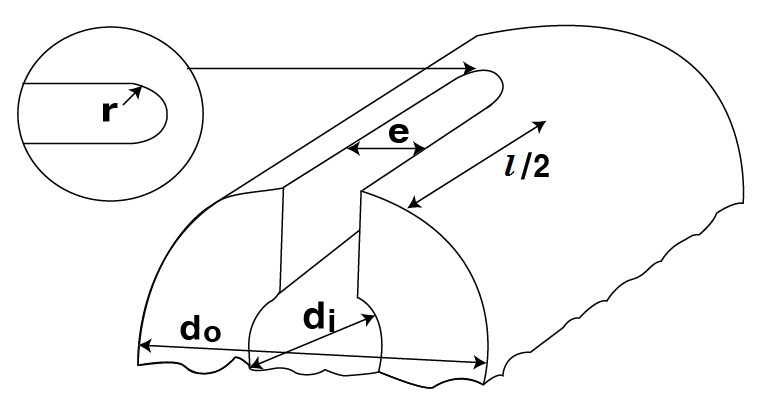

# PART 5 Machinery Installations

> RULES FOR CLASSIFICATION OF STEEL SHIPS / RA-05-E / 2025 / EN / Guidance

## CHAPTER 4 TORSIONAL VIBRATION OF SHAFTING

### Section 2 Allowable Limit of Vibration Stresses

#### 201. Crankshafts

- **1.** In application to **201.** of the Rules, the strength calculation for crankshafts is carried out according to the special requirements given by the Society means **Annex 5-3**. For the allowable limit of vibration stresses, the nominal alternating torsional stresses($\tau _{N}$) specified in **Annex 5-3**, **2**. (2) (A) are to be applied in the operational speed range of the engine. Where barred speed ranges are imposed, the allowable torsional vibration stresses in the ranges may be specially considered. **【See Rule】**
- **2.** In application to **201. 4** of the Rules, in case where the specified minimum tensile strength of the crankshaft exceeds 590 $\mathrm{N}/mm ^{2}$ for carbon steel forging, or 835 $\mathrm{N}/mm ^{2}$ for low alloy steel forging, the value of $T _{s}$ given in formula for $f _{m}$ is to be in accordance with the following. **【See Rule】**
  - **(1)** The value of $T _{s}$ is to be taken as 590 $\mathrm{N}/mm ^{2}$ for carbon steel forging, and 835 $\mathrm{N}/mm ^{2}$ for low alloy steel forging. However (2) below is to be excepted.
  - **(2)** Where the crankshaft approved by **Ch 2, Sec 5, 503. 2** of the "**Guidance for Approval of Manufacturing Process and Type Approval, etc."** for torsional fatigue strength of crankshaft, the value of $T _{s}$ is to be taken as the value added the fatigue strength improved.

#### 202. Intermediate shafts, thrust shafts, propeller shafts and stern tube shafts

- **1.** The allowable limit of torsional vibration stress for propeller shafts made of the approved corrosion resistance materials is to be calculated by the following formula in place of the formula for $\tau _{1}$ shown in **202. 1** (1) of the Rules. **【See Rule】**
  $\tau 1 =A-B \lambda 2 ( \lambda \leq 0.9)\#
  \tau 1 =C (0.9< \lambda )$
  $\tau _{1}$ : Allowable limit of torsional vibration stress at the continuos operation ($\mathrm{N}/mm ^{2}$)
  $\lambda$ : Ratio of the number of revolution to the number of maximum continuos revolution
  *A*, *B*, *C* : Constant dependent on shaft materials given in **Table 5.4.1** of the Guidance

  |   | Precipitation hardened stainless steel | Austenitic stainless steel(*KS STS* 304 or equivalent) |
  | --- | --- | --- |
  | *A* | 61.1 | 40.7 |
  | *B* | 47.3 | 30.5 |
  | *C* | 22.8 | 16.0 |
  | NOTES : For material other than above, the values are to be determined on each case. |   |   |
- **2.** In application to **202. 1** (1) of the Rules, the term "specially approved by the Society" means that obtains an approval in accordance with **Pt 2, Ch 1, 601. 18** of the Rules. Specified minimum tensile strength of approved alloy steels can be used in the calculation. *(2017)* **【See Rule】**
- **3.** In the application 202. 2 of the Rules, the allowable limits of torsional vibration stress are to be calculated by applying the values of $C _{K}$ given in the Table 5.4.2 of the Guidance in lieu of the formula specified in 202. 1 of the Rules. **【See Rule】**

  | Intermediate shaft | Integral flange couplings | 0.75 |
  | --- | --- | --- |
  | Intermediate shaft | Shrink fit couplings | 0.75 |
  | Intermediate shaft | Keyways | 0.45 |
  | Thrust shaft | On both sides of the thrust collar | 0.65 |
  | Thrust shaft | In way of axial bearings where a roller bearing is used as a thrust bearing | 0.65 |
  | Propeller shaft and stern tube shaft | - | 0.35 |
  | NOTE : The value of $C _{K}$ other than above is to be determined by the Society in each case. |   |   |
- **4.** In application to **Table 5.4.1** NOTE (5) of the Rules, “as deemed appropriate by the Society” is to be in accordance with the following.
  $C _{K} = 1.45/scf$
  $scf$ : stress concentration factor at the end of slots defined as the ratio between the maximum local principal stress and $\sqrt {3}$ times the nominal torsional stress determined for the hollow shaft without slots.
  $scf = \alpha _{t(hole)} +0.8 \cdot \frac{(l-e)/d _{o}}{\sqrt {\left( 1- \frac{d _{i}}{d _{o}} \right) \cdot \frac{e}{d _{o}}}}$
  $l$ : slot length ($\mathrm{mm}$)
  $e$ : slot width ($\mathrm{mm}$)
  $d _{i}$ : inside diameter of the hollow shaft at the slot ($\mathrm{mm}$)
  $d _{o}$ : outside diameter of the hollow shaft ($\mathrm{mm}$)
  $\alpha _{t(hole)}$ : stress concentration factor of radial holes(in this context $e$ = hole diameter) determined by the following formula
  $\alpha _{t(hole)} =2.3-3 \cdot \frac{e}{d _{o}} +15 \cdot \left( \frac{e}{d _{o}} \right) ^{2} +10 \cdot \left( \frac{e}{d _{o}} \right) ^{2} \cdot \left( \frac{d _{i}}{d _{o}} \right) ^{2}$
  or simplied to $\alpha _{t(hole)} = 2.3$
  However, this formula for above stress concentrate factor applies to the following slots.

#### 203. Shafting system of generators 【See Rule】

- **1.** In application to **203. 1** of the Rules, the strength calculation for crankshafts is carried out according to the special requirements given by the Society means **Annex 5-3**. For the allowable limit of vibration stresses, the nominal alternating torsional stresses($\tau _{N}$) specified in **Annex 5-3**, **2**. (2) (A) are to be applied in the operational speed range of the engine. Where barred speed ranges are imposed, the allowable torsional vibration stresses in the ranges may be specially considered.

#### 205. Detailed evaluation for strength 【See Rule】

Where the torsional vibration stress acted on shaft is satisfied with requirements of **Ch 3, 204. 2** (2) of the Guidance, $\tau _{D}$ according to the requirements of **Ch 3, 204. 2** (2) of the Guidance may be taken instead of $\tau _{1}$ given in **Pt 5, Ch 4** of the Rules at the calculation for allowable limit of torsional vibration stress. 
