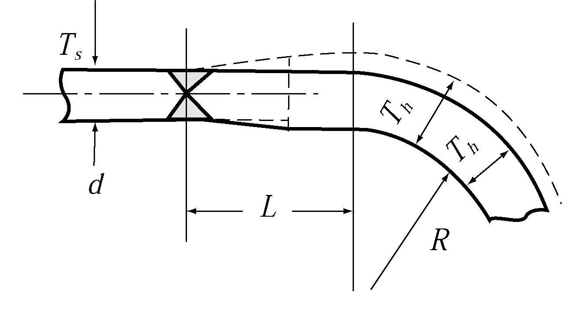
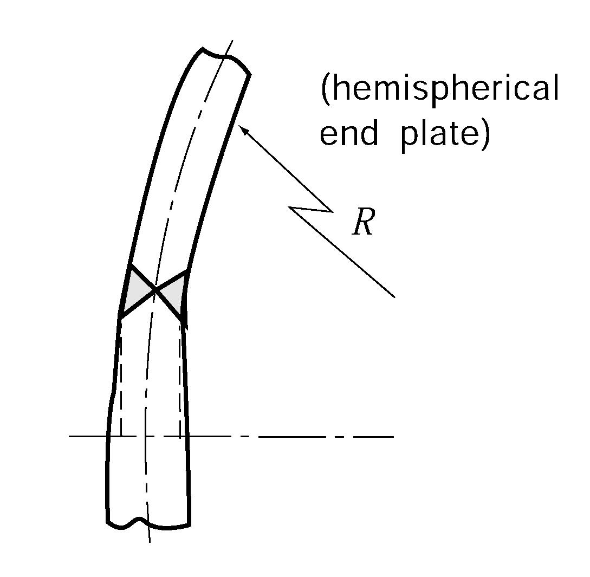
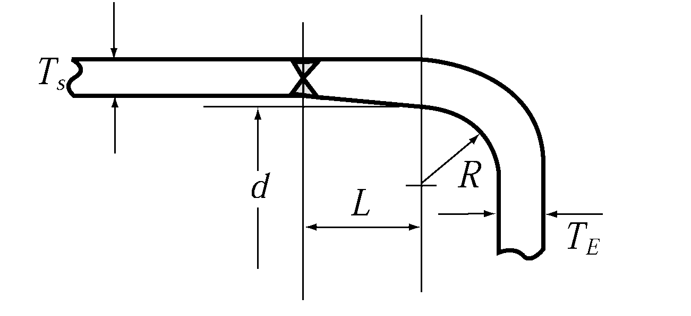
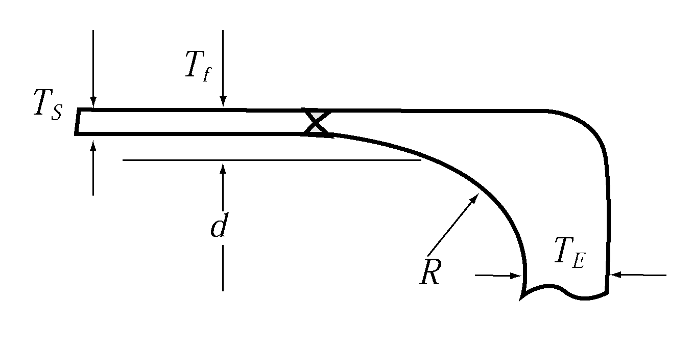

# PART 5 Machinery Installations

> RULES FOR CLASSIFICATION OF STEEL SHIPS / RA-05-E / 2025 / EN / Guidance

## CHAPTER 5 BOILERS AND PRESSURE VESSELS

### Section 1 Boilers

#### 101. Applications 【See Rule】

- **1.** In application to **101. 2** of the Rules, small boilers having design pressure less than 0.35 $\mathrm{MPa}$ (hereinafter referred to as "**small boiler**") may be in accordance with the following regardless of requirements in **Ch 5, Sec 1** of the Rules.
  - **(1)** Materials, construction, strength and accessories of small boilers
    - **(A)** Materials, construction, strength and accessories of small boilers are to be complied with *Korean Industrial Standards or equivalent.*
    - **(B)** Safety valve or pressure relief pipe having sufficient capacity is to be fitted.
    - **(C)** Safety devices for the following are to be fitted.
      - **(a)** Draught fan for pre-purging to prevent the gas explosion in furnace
      - **(b)** Fuel oil shut-off device in the case of flame vanishes, automatic ignition fails or combustion air supply stops
      - **(c)** Fuel oil shut-off device when the fuel oil supply pressure to the oil burners falls in case of pressure atomizing
      - **(d)** Fuel oil shut-off device for preventing from overheating of boilers when the water level falls
  - **(2)** Tests
    - **(A)** The pressure receiving portions are to be tested to a hydrostatic pressure of 2 times the design pressure. However, the test pressure is not to be less than 0.2 $\mathrm{MPa}$
    - **(B)** Performance test for the safety devices mentioned above (1) (C) are to be carried out.

#### 102. Materials

- **1.** In application to **102. 1** (2) of the Rules, "where deemed appropriate by the Society" means the fittings having design pressure less than 3 $\mathrm{MPa}$ and nominal diameter less than 100 A. **【See Rule】**
- **2.** In application to **102. 2** of the Rules, the cast steels used for body of the boilers are to be ensured that the materials have not any harmful defect through radiographic examination and magnetic particle test. Test methods and judgement standards are to be in accordance with the following. **【See Rule】**
  - **(1)** The radiographic examination is to be carried out according to KS D 0227 (method of radiographic examination for cast steels), (KS B) ISO 5579 or other equivalent standards and if there is crack, the cast steel is to be rejected. The defects such as blowholes, sand spots, inclusions and shrinkages are to be accepted only defects of Grade 1. *(2019)*
  - **(2)** The magnetic particle test is to be carried out according to KS D 0213 (method of magnetic particle testing of ferromagnetic materials and classification of magnetic particle indication) or other equivalent standards. The acceptance criteria of defects may be in accordance with **Pt 2, Annex 2-2, 6** of the Guidance or other international standards recognized by the Society. *(2019)*
  - **(3)** The cast steels rejected by above (1) and (2) may be repaired. Repairing method by welding is to comply with **Pt 2, Ch 1, 501. 11** of the Rules.

#### 111. Flat plates or tube plates with stay or other supports

- **1.** Where the required thickness at the portion including water tube holes of the tube plates of a dry combustion cylindrical boiler is calculated by the formula specified in **111. 3** of the Rules, the value of $C$ in the formula for the supports adjacent to water tube holes is to be divided by the square of the rate of strength reduction obtained by the following formula. **【See Rule】**
  $\eta = \frac{p-0.5d}{p}$
  where
  $\eta$ : Rate of strength reduction
  $p$ : Pitch of water tube holes ($\mathrm{mm}$)
  $d$ : Diameter of water tube holes ($\mathrm{mm}$)

#### 114. Manholes, mud holes and peep holes 【See Rule】

- **1.** The required thickness of manhole covers is to be determined by the formula below. However, the thickness at the center is not to be made 14 $\mathrm{mm}$ or less. In case where a groove is provided at the periphery of a manhole cover, the thickness of such a part may be reduced to 2/3 of that of the central area.
  $T= \frac{b}{2c} \sqrt {\frac{100P}{f}}$
  where
  $T$ : Required thickness of manhole cover ($\mathrm{mm}$)
  $P$ : Design pressure ($\mathrm{MPa}$)
  $f$ : Allowable stress specified in the Rules ($\mathrm{N}/mm ^{2}$)
  $b$ : Length of minor axis of manhole ($\mathrm{mm}$)
  $c$ : Value given in **Fig 5.5.1** of the Guidance. In **Fig 5.5.1** of the Guidance, a stands for the length of major axis of manhole ($\mathrm{mm}$), and when $b/a$ is 1, $c$ is to be 9. In the case of the corrugated manhole cover, $a$ and $b$ are to be taken as shown in **Fig 5.5.2** of the Guidance.
  
  **Fig 5.5.1 Values of** #eqnID-514 
  **Fig 5.5.2** #eqnID-515 **and** #eqnID-516 **of Corrugated Manhole Cover**

#### 116. Flues, furnaces, ogee rings and cross tubes 【See Rule】

- **1.** The required thickness of plain cylindrical furnaces supported with stays or other members is to be calculated by the formula in **116. 3** of the Rules by regarding the effective length between the stays as $L$ in the formula.

#### 117. Stays, stay tubes and girders 【See Rule】

- **1.** The required diameter ($d$) of stays or stay tubes specified in **117. 1** of the Rules is to be determined as follows.
  - **(1)** When the adjacent support is a stay or stay tube, the boundary is considered as the perpendicular bisector of the line connecting the both support points.
  - **(2)** When the adjacent support is curved flange or welded joint, the boundary is considered as the locus of the center of inscribed circle to the support point in question and the commencement line of curvature or the inside plain ends welded on shell or furnaces specified in **111. 5** of the Rules.
  - **(3)** At the corner part of smoke tube nests, the calculation may be carried out by regarding the half of the sum of two area supported by stays or stay tubes adjacent each other.
  - **(4)** The areas of stay, stay tube and smoke tube included in the concerned area are to exclude from the area specified in above (1) through (3).

#### 124. Construction and tests of safety valves 【See Rule】

- **1.** In application to **124. 8** of the Rules, the duration of accumulation test is to be in accordance with the following.
  - **(1)** For water tube boilers : 7 minutes
  - **(2)** For smoke tube boilers : 15 minutes

#### 129. Water level indicator 【See Rule】

- **1.** In application to **129. 2** of the Rules, exhaust gas boilers are to be provided with a glass water level gauge, and a remote water level indicator or a high/low water level alarm device.

#### 136. Tests and inspections

- **1.** **Hydraulic test 【See Rule】**
  - **(1)** The hydraulic test of desuperheaters installed within water drum or steam drum of boiler is to be carried out at 1.5 times or more the design pressure of the boiler when a steam stop valve is provided at the inlet of desuperheater, and 1.5 times or more the assumed pressure difference when a stop valve is provided only at the outlet of the desuperheater. However, test pressure is not to be less than 2 $\mathrm{MPa}$*.*
  - **(2)** In the hydraulic tests for boilers the test pressure for the hydraulic test of boiler tubes and connecting pipes after completion of welding and assembly may be modified to 1.25 times the design pressure, in case where parts or members such as drums, headers, and others are subjected to hydraulic test individually at a test pressure of 1.5 times the design pressure.

### Section 2 Thermal Oil Heaters

#### 203. Safety devices for thermal oil heaters directly heated by the exhaust gas of engines 【See Rule】

In application to **203. 7** of the Rules, “Fixed fire extinguishing and cooling system as deemed appropriate by the Society” means the combination of fixed gas fire-extinguishing systems and the systems for cooling the heating coil, header, casing, etc., and the heater itself such as water-spray. The fixed fire extinguishing cooling system can be a water-drenching system able to discharge copious amounts of water. In this case, the suitable means for collection and drainage, to prevent the water from flowing into the reciprocating internal combustion engines, are to be provided on exhaust ducting below the heater, and the drainage is to be led to suitable places.

### Section 3 Pressure Vessels

#### 302. Classification 【See Rule】

- **1.** The low pressure steam generators belong to Class 1 are to be provided with the following accessories.
  - **(1)** Water level indicators : 1 set of glass water level gauge
  - **(2)** Safety valves : To be applied with appropriate modifications of the requirements of the boilers.
  - **(3)** Peep holes : To be applied with appropriate modifications of the requirements of the boilers.
  - **(4)** Boiler water blow-off valves : To be applied with appropriate modifications of the requirements of the boilers.
  - **(5)** Relief valve : To be applied with appropriate modifications of the requirements of the boilers.
  - **(6)** Pressure gauges : To be applied with appropriate modifications of the requirements of the boilers.
  - **(7)** Thermometers : To be applied with appropriate modifications of the requirements of the boilers.

#### 303. Materials 【See Rule】

- **1.** In application to **303. 2** of the Rules, body of pressure vessels used for noxious substances is not to be used special iron castings.
- **2.** When the steel castings are used for the body of Class 1 or Class 2 pressure vessels, non-destructive test methods and judgement standards are to be in accordance with the following.
  - **(1)** The radiographic examination is to be carried out according to KS D 0227 (method of radiographic examination for cast steels), (KS B) ISO 5579 or other equivalent standards and if there is crack, the cast steel is to be rejected. The defects such as blowholes, sand spots, inclusions and shrinkages are to be accepted only defects of Grade 1. However, in the case of Class 2 pressure vessels, the defects such as blowholes, sand spots and inclusions found on test portions of thickness more than 25 $\mathrm{mm}$ may be accepted defects of Grade 1 and Grade 2. *(2019)*
  - **(2)** The magnetic particle test is to be carried out according to KS D 0213 (method of magnetic particle testing of ferromagnetic materials and classification of magnetic particle indication) or other equivalent standards. The acceptance criteria of defects may be in accordance with **Pt 2, Annex 2-2, 6** of the Guidance or other international standards recognized by the Society. *(2019)*
  - **(3)** The penetration inspection is to be carried out according to KS D 0816 (method of penetration inspection and classification of grade for defect shape), the judgement standards of defects are to be applied with appropriate modifications the above (2).
  - **(4)** The steel castings rejected by above (1) through (3) may be repaired. Repairing method by welding is to comply with **Pt 2, Ch 1, 501. 11** of the Rules.
- **3.** The materials used for fitting are restricted to the following;
  - **(1)** The gray iron castings are not for fitting of pressure vessels intended for containing inflammable or toxic substances.
  - **(2)** The special iron castings are not used for fittings for pressure vessels intended for containing toxic substances.
- **4.** In application to **303. 1** (3) of the Rules, "where deemed as appropriate by the Society" means the fittings having design pressure less than 3 $\mathrm{MPa}$ and nominal diameter less than 100 A.

#### 307. Allowable stress 【See Rule】

- **1.** In application to **307. 3** (1) of the Rules, the term "complying with the requirements in the recognized standards" means that comply with Korean Industrial Standards or equivalent thereto.

#### 308. General construction and strength 【See Rule】

- **1.** Construction of fitting is to comply with the following.
  - **(1)** Fittings such as valves, flanges, and bolts, nuts, gaskets, etc. are to have the construction and dimension conforming to the recognized standards and they are to conform to the service conditions specified in such standards.
  - **(2)** Fittings are to be attached to shells of Class 1 and Class 2 pressure vessels by flanged joint or by welding. However, in case where the thickness of the shell is over 12 $\mathrm{mm}$ or in case where a seat for screwing is fitted to the shell, the fittings of not more than 32 $A$ in nominal diameter may be attached to the shell by screwing.

#### 311. Flat end plates or tube plates 【See Rule】

- **1.** The thickness of tube plates for heat exchangers without tube stays is to comply with the following requirements:
  - **(1)** Except for floating head, the required thickness of flat tube plates without tube stays for the heat exchangers and the like is to be either of the values calculated by the following formula, whichever is the greater;
    $T 1 = \frac{CD}{2} \sqrt {\frac{P}{f}} +a\#
    T 2 = \frac{PA}{\tau L} +a$
    where
    $P$ : Design pressure ($\mathrm{MPa}$)
    $f$ : Allowable bending stress of material ($\mathrm{N}/mm ^{2}$)
    $\tau$ : Allowable shearing stress of material ($\mathrm{N}/mm ^{2}$)
    $C$ : Factor determined by the supporting method of tube end plate. Where the tube plates are not integral with the shell, this value is to be taken to 1.0 when straight tubes are used and 1.25 when U-tubes are used. Where the tube plates are integral with the shell, the values are shown in **Fig 5.5.3** of the Guidance.
    $D$ : Diameter of outer circle of tube end plate ($\mathrm{mm}$), i.e., in case where the tube end plate is bolted to flange, $D$ is the diameter of a circle passing through the position to which gasket reaction is acted; where tube end plate is fixed to the shell, $D$ is the inside diameter of the shell (corrosion allowance is to be deducted)
    $A$ : Area of a polygon obtained by connecting the center of outermost tube holes ($\mathrm{mm} ^{2}$) (see **Fig 5.5.4** of the Guidance)
    $L$ : Length obtained by deducting the sum of tube hole diameters of the outermost tubes from the length of the outer periphery of the forementioned polygon ($\mathrm{mm}$)
    $a$ : 1.0 $\mathrm{mm}$ as corrosion allowance. In case where corrosion resistance materials are used, where effective corrosion control measures are taken or when there is no possibility of corrosion, $a$ may be taken as 0.
  - **(2)** In obtaining the thickness in (1), calculations are to be carried out on both sides by using respective $P$, $C$ and $D$. However, in case where differential pressure calculation is carried out, consideration will be given by the Society in each case.
     
    **Fig 5.5.3 Value of** $C$ **Fig 5.5.4 Polygon Used for Tube Plate Calculation**

#### 313. Manholes, cleaning holes and inspection holes 【See Rule】

In application to **313. 1** of the Rules, the number and size of manholes, cleaning holes or inspection holes may be applied with Korean Industrial Standards or standards considered as equivalent thereto according to the discretion of the Society. *(2017)*

#### 319. Tests and inspections 【See Rule】

- **1.** In application to **319. 1 Table 5.5.17** of the Rules, despite being classified as a Class 3 pressure vessel, pressure vessels satisfied with the following (1) or (2) are to be subjected to hydraulic test.
  - **(1)** Design pressure ($\mathrm{MPa}$) × Capacity ($\mathrm{m} ^{3}$) ≥ 1
  - **(2)** Heat exchangers (heater/coolers for fresh water, lubricating oil, hydraulic oil and fuel oil, condensors, feed water heaters, air coolers, etc.) and air tanks (control air tank, etc.) for operating the following; and other essential pressure vessels : *(2019)*
    - **(A)** Main propulsion engines, essential auxiliary engines and propulsion shafting systems
    - **(B)** Motors and electric power converters for electric propulsion unit
    - **(C)** Boilers and thermal oil installations (main boilers, essential auxiliary boilers, boilers and thermal oil heaters for main propulsion engine fuel oil heating and for heating of cargo to be usually heated)

### Section 4 Welding for Boilers and Pressure Vessels

#### 401. General

- **1.** **Welding procedure qualification tests** In application to **401. 2** of the Rules, the welding procedure qualification tests are to comply with **Pt 2, Ch 2, Sec 4** of the Guidance. **【See Rule】**
- **2.** In application to **401. 3** (3) of the Rules, the requirements of base metals for welding are to be in accordance with the following. **【See Rule】**
  - **(1)** Base metals used in the welding work are to be those suitable for welding. And the carbon content is not to exceed 0.23 $\%$ for carbon steel and low alloy steel castings and forging, or 0.35 $\%$ for other materials. When approved by the Society in consideration of the welding conditions, the carbon content may be increased to the value approved.
  - **(2)** The upper limit of the carbon equivalent for high tensile steels as base material is to be as deemed appropriate by the Society.

#### 403. Heat treatment 【See Rule】

- **1.** **Omission of stress relief**
  - **(1)** In application to **403. 3** (1) (C) of the Rules, the required conditions for omitting stress relieving in case where the material having superior notch toughness is used, are to be as specified below:
    - **(A)** The base metal is to be steel plate with a specified Charpy V-notch impact value of 47J or more using full-size test specimens as given in **Pt 2, Ch 1, 202. Table 2.1.3** of the Guidance, at a temperature of 0 °C, and
    - **(B)** The impact test value of welds in the production weld test is not to be less than the required value for the base metal at a temperature of 0 °C.
    - **(C)** The joints between shells and end plates or tube plates are to be butt weld.
  - **(2)** In application to **403. 3** (3) of the Rules, the required conditions for omitting stress relieving in cases where material with superior notch toughness is used are specified below:
    - **(A)** The base metal is to be steel plate with a specified Charpy V-notch impact value of 47J or more, using of full-size test specimens as given in **Pt 2, Ch 1, 202. Table 2.1.3** of the Guidance, at a temperature of 0 °C, and
    - **(B)** The impact test value of welds in the production weld test is not to be less than the rule-required value for the base metal at a temperature of 0 °C, and
    - **(C)** The plate thickness of the material for pressure vessels is to be 40$\mathrm{mm}$ or less.
  - **(3)** Regardless above (1) and (2), in case of the pressure vessels and boilers specially designed or used for special condition, the necessity of stress relieving is to be determined at every time of test.

#### 404. Radiographic examination 【See Rule】

- **1.** In application to **404.** of the Rules, ultrasonic examination may be substituted for radiographic examination subject to the approval by the Society.
- **2.** The acceptance levels and required quality levels for radiographic testing are provided in table below. *(2024)*

  **The acceptance levels and required quality levels for Radiographic Testing**

  | Quality Levels (ISO 5817:2014 applies)(1) | Testing Techniques/ levels (ISO 17636-1:2022 applies)(1) | Acceptance levels (ISO 10675-1:2021 applies)(1) |
  | --- | --- | --- |
  | B | B(class) | 1 |
  | Note: (1) Or any recognized standard agreed with the Society and demonstrated to be acceptable |   |   |
- **3.** The acceptance levels and required quality levels for ultrasonic testing are provided in table below. *(2024)*

  **The acceptance levels and required quality levels for Ultrasonic Testing**

  | Quality Levels (ISO 5817:2014 applies)(1) | Testing Techniques/Levels (ISO 17640:2018 applies)(1) | Acceptance Levels (ISO 11666:2018 applies)(1) |
  | --- | --- | --- |
  | B | at least B | 2 |
  | Note: (1) Or any recognized standard agreed with the Society and demonstrated to be acceptable |   |   |

#### 405. Welding workmanship approval tests for boilers and Class 1 pressure vessels

- **1.** In application to **405. 3** of the Rules, when the capacity of tensile test equipment is insufficient, the thickness of tensile test specimens may be reduced to thickness which can be carried out the test. However, when the distribution of strength is identified by the welding procedure qualification test and etc., the tensile test for representative specimens may be substituted for the tensile tests. **【See Rule】**
- **2.** In application to **405. 5** of the Rules, "the standard value approved by the Society" means the impact test values specified in **Pt 2, Ch 2, Table 2.2.7** and **2.2.8** of the Rules, and in case when materials are not specified in the Tables, that means the impact values of base metal. However, in case where the impact values for base metals are not specified, impact test may be omitted subject to the approval by the Society. **【See Rule】** 
