# PART 5 Machinery Installations

> RULES FOR CLASSIFICATION OF STEEL SHIPS / RA-05-E / 2025 / EN / Guidance

## CHAPTER 6 AUXILIARIES AND PIPING ARRANGEMENT

### Section 1 General

#### 101. General 【See Rule】

- **1.** **Application** In application to **101. 1** of the Rules, the construction of auxiliaries is accordance with the following.
  - **(1)** The auxiliaries are to have the sufficient strength and adapt to purpose of service, and they are to be maintained and checked easily and made of materials adequate for service.
  - **(2)** Bearing bolt of auxiliaries, bolts and nuts of moving parts are to be well secured by effective means to prevent from slaking such as split pin or equivalent.
  - **(3)** The auxiliaries and piping systems, as practicable as, are not to leak gases harmful to operators or inflammable gases.
  - **(4)** The auxiliaries are installed in the space where the gases mentioned in (3) can be discharged rapidly.
  - **(5)** The rotating parts, reciprocating parts and high temperature parts are to be arranged with suitable protection means for the safety of watchmen, operators or men neighbouring to these parts.
- **2.** **Definitions** The definitions are in accordance with the following and **101. 3** of the Rules; **【See Rule】**
  - **(1)** The planned discharge pressure of 1.1 times is to be used as the standard for design pressure of piping systems on the discharge side for positive displacement pumps.
  - **(2)** The range for applying to design pressure specified in **101. 3** (1) (A) and (B) of the Rules is in accordance with the following;
    - **(A)** For piping systems on the discharge side of ballast pumps or cargo oil pumps, from piping systems on the discharge side of pumps to inlet valves of ballast tanks or cargo oil tanks and joints of shore connection. However, where the ships discharge ballast water through sea chests, piping systems to sea chests are to be included.
    - **(B)** For piping systems for operating oil, from hydraulic winches and hydraulic operating valves to the nearest stop valves.
  - **(3)** The design pressure of piping systems on the discharge side of circulating water pumps for exhaust gas economizer is applied appropriate modifications of the definitions for design pressure of feed water pump specified in **101. 3** (1) (C) of the Rules.
- **3.** **Structure, materials and strength for auxiliaries**
  In application to **101. 5** (1) of the Rules, "the Society specially considers necessary" is to be in accordance with the following; **【See Rule】**
  - **(1)** For the special auxiliaries specially considered necessary by the Society, the materials are to be determined case by case by the Society.
- **4.** In application to **101. 6.** of the Rules, the term "be considered by the Society" means the following requirements. **【See Rule】**
  - **(1)** Gas bottles and piping systems for gas welding equipment are to comply with the requirements of **Annex 5-5**.
  - **(2)** Incinerators for waste oil and waste substance are to comply with the related International Conventions or the requirements of flag state.

#### 102. Pipes

- **1.** **Materials 【 See Rule】**
  - **(1)** The carbon steel pipes for ordinary piping marked $KS$ as pipes produced at the manufacturing process approval factory of the Society may be used for Class II on the assumption that the requirement specified in **102. 2.** (4) of the Rules.
- **2.** **Service limitations for copper and copper alloy pipes** In application to **102. 3** of the Rules, service limitations for copper and copper alloy pipes are to be in accordance with the following; **【See Rule】**
  - **(1)** Copper pipes are not to be used for the following;
    - **(A)** Pipes of which design temperature exceeds 200 °C (excluding pipes for gauging)
    - **(B)** Fuel oil pipes (excluding pipes arranged in tanks, pipes for gauging, drain pipes, air purge pipes, and short pipes from fuel oil burning pumps to combustion units)
    - **(C)** Lubricating oil pipes (excluding pipes arranged in tanks, pipes for gauging, drain pipes, air purge pipes, and pipes arranged in spaces except machinery spaces)
    - **(D)** Hydraulic oil pipes (excluding pipes arranged in tanks, pipes for gauging, drain pipes and air purge pipes)
    - **(E)** Thermal oil pipes (excluding pipes arranged in tanks, pipes for gauging, drain pipes and air purge pipes)
    - **(F)** Cargo oil pipes (excluding pipes arranged in tanks, pipes for gauging, drain pipes and air purge pipes)
    - **(G)** Bilge pipes (excluding pipes for gauging, drain pipes and air purge pipes)
    - **(H)** Ballast water pipes (excluding pipes for gauging and air purge pipes)
    - **(I)** Pipes for fire extinguishing (excluding pipes for gauging)
    - **(J)** Pipes which directly affect water ingress by damage when fire(application range is cooling sea water pipes installed below the load water line in machinery space category A excluding pipes for gauging, drain pipes and air purge pipes).
    - **(K)** Air pipes (including starting air pipes)
    - **(L)** Overflow pipes
    - **(M)** Sounding pipes (excluding pipes in the sounded compartments)
    - **(N)** Pipes considered necessary by the Society
  - **(2)** Copper alloy pipes are not to be used for the following;
    - **(A)** Pipes of which design temperature exceeds 200 °C (excluding pipes for gauging), white copper pipes of which design temperature exceeds 300 °C (excluding pipes for gauging)
    - **(B)** Fuel oil pipes (excluding pipes arranged in tanks, pipes for gauging, drain pipes and air purge pipes)
    - **(C)** Lubricating oil pipes (excluding pipes arranged in tanks, pipes for gauging, drain pipes, air purge pipes, and pipes arranged in spaces except machinery spaces)
    - **(D)** Hydraulic oil pipes (excluding pipes arranged in tanks, pipes for gauging, drain pipes, air purge pipes and pipes arranged in spaces exept machinery spaces)
    - **(E)** Control oil pipes (excluding pipes arranged in tanks, pipes for gauging, drain pipes and air purge pipes)
    - **(F)** Thermal oil pipes (excluding pipes arranged in tanks, pipes for gauging, drain pipes, and air purge pipes and pipes arranged in spaces except machinery spaces)
    - **(G)** Cargo oil pipes (excluding pipes arranged in tanks, pipes for gauging, drain pipes and air purge pipes)
    - **(H)** Pipes for fire extinguishing (excluding pipes for gauging and copper-nickel used for water spraying equipment of liquefied gas carriers)
    - **(I)** Pipes which directly affect water ingress by damage when fire(application range is cooling sea water pipes installed below the load water line in machinery space category A(it can be used only copper-nickel) excluding pipes for gauging, drain pipes and air purge pipes) *(2017)*
    - **(J)** Control air pipes of auxiliaries and valves being used for fire extinguishing (excluding drain pipes)
    - **(K)** Any pipe penetrating either A class division or B class division
    - **(L)** Pipes specified in above (1) (G), (H), (K) through (N)
  - **(3)** Copper and copper alloy pipes for gauging are to be of short only.
- **3.** **Use of special materials and flexible pipes** In application to **102. 5** of the Rules, the following are to apply.
  - **(1)** In case where plastic pipes are used, plastic piping system are to comply with the requirements given in the **Annex 5-6.** *(2017)*
  - **(2)** When aluminium alloy pipes are used, the following requirements are to be complied with;
    The wall thickness of pipes is to be determined by the formula in **102. 6** of the Rules. In this case, the allowable stress $f$ is to be of the minimum value of the following values. However, when the design temperature is not in the creep region of the material, no consideration may be required for the value of $f _{3}$.
    $f _{1} = \frac{R _{20}}{4.0} , f _{2} = \frac{E _{T}}{1.5} , f _{3} = \frac{S _{R}}{1.6}$
    Where
    $R _{20}$ : Specified minimum tensile strength ($\mathrm{N}/mm ^{2}$) of the material at room temperature (less than 50 °C)
    $E _{T}$ : 0.2 $\%$ proof strength ($\mathrm{N}/mm ^{2}$) of the material at the design temperature
    $S _{R}$ : Mean value of creep breaking stress ($\mathrm{N}/mm ^{2}$) of the material after 100,000 hours at the design temperature
    - **(A)** Aluminium alloy pipes are, as a rule, to be in accordance with the requirements of the standards deemed appropriate by the Society, and are to be of seamless drawn pipes or seamless extruded pipes.
    - **(B)** The pipes for the following are not to be of aluminium alloy;
      - **(a)** As a rule, pipes with a design temperature exceeding 150 °C
      - **(b)** Pipes specified in above **2.** (2) (B) through (L)
    - **(C)** The required wall thickness of aluminium alloy pipes subject to internal pressure are to be in accordance with the following;
  - **(3)** Expansion pipes(including end connection parts) and flexible pipes(including end connection parts) of metallic or non-metallic material, used for the pipes of Class 1 or class 2 or used for pipes likely to cause fire or flooding in case of their fracture, are to be of approved type. And flexible pipes(including end connection parts) are to be in accordance with the requirements given in the **Annex 5-9.**
- **4.** **Required wall thickness of pipes 【See Rule】**
  - **(1)** The column "Overboard scupper pipes" in **Table 5.6.2** of the Rules is applied to ships having length of 24 $\mathrm{m}$ or over, and international service area.
  - **(2)** The requirement of "threaded pipes" in **Table 5.6.3** NOTES 2. of the Rules is not applied to pipes from distribution stations to nozzles on $CO _{2}$ piping for fire fighting. **【See Rule】**
  - **(3)** The minimum wall thickness of exposed parts of air pipes opened on free-board deck or superstructure of ships having length of 24 $\mathrm{m}$ or over, and international service area is to be in accordance with the following;
    - **(A)** For the air pipes installed on position I or position II of exposed deck openings defined in **Pt 4, Ch 2, 102.** of the Rules, and induced to compartments under freeboard deck, enclosed super-structure or enclosed deck house, the relevant column of "Air pipes on exposed deck" in **Table 5.6.2** of the Rules is applied.
    - **(B)** For the pipes other than above (A), the relevant column of "Air, overflow and sounding pipes for hull structural tanks" in **Table 5.6.2** of the Rules is applied.
  - **(4)** The corrosion allowance for $CO _{2}$ pipes used for fire fighting may be reduced to zero.

#### 103. Valves and fittings 【See Rule】

- **1.** In application to **103. 1.** (1) of the Rules, "the Society may accept to use valves and fittings made of materials which meet Korean Industrial Standards or Equivalent." means the following valves and fittings. *(2021)*

  | Materials | Design Temperature (°C) | Nominal diameter ($D$) : $\mathrm{A}$ Design pressure ($P$) : $\mathrm{MPa}$ |
  | --- | --- | --- |
  | Carbon and low alloy steel, stainless steel, cast iron with an elongation of 12 $\%$ or above | ＜300 and | $D$ ≤50 or $P$*×*$D$ ≤ 250 |
  | Copper alloy | ＜200 and | $D$ ≤ 50 or $P$*×*$D$ ≤ 150 |
- **2.** In application to "to comply with the relevant requirement of **Pt 2, Ch 1.**" in **103. 1.** (1) of the Rules, work’s certificate with manufacturing process approved by the Society may be accepted where deemed necessary by the Society. *(2024)*
- **3.** The materials for pipes, valves, cocks and fittings of piping systems used for ships having length less than 30 $\mathrm{m}$ may be manufactured and tested in accordance with Korean Industrial Standards or standards considered as equivalent thereto.
- **4.** **Service limitations for cast iron for valves and pipe fittings** In application to **103. 4** (3) of the Rules, the gray cast iron may be used for the following piping system.
  - **(1)** The valves and pipe fittings used in cargo oil lines within cargo tanks of tankers.
  - **(2)** The valves and pipe fittings used in piping systems on open deck for flammable liquid cargo which has not any other risks.
- **5.** Rubber seat butterfly valves are to be dealt with under the following requirements ;
  - **(1)** Application
    Rubber seat butterfly valves (hereinafter referred to as the butterfly valve) may not to be used for the applications below. However, they may be used according to the discretion of the Society considering manufacturers’ specification. *(2021)*
    - **(A)** Outlet valves fitted to the tank carrying flammable or combustible liquid (e.g., fuel oil, crude oil, etc.) and subjected to the liquid head, installed in the engine room or area susceptible to fire. However, they may be as those installed within the cargo oil tanks or outlet valves leading to the pump room of oil tankers.
    - **(B)** Valves in piping system with a design pressure exceeding 1.6 $\mathrm{MPa}$
    - **(C)** Valves in piping system with a design temperature exceeding 70 °C
    - **(D)** Valves in piping system handling special liquids other than water and oil
    - **(E)** Valves in the fuel oil piping system within the engine room in case they have such a construction that the internal lining rubber is extended to the abutting face of flange for using as a gasket.
  - **(2)** Construction and marking of product
    The construction of butterfly valves is to conform to the following requirements ;
    The butterfly valve is to be marked with the following items at a conspicuous place of the product:
    - **(A)** Stopper can be engaged at the designed "Open" and "Shut" positions.
    - **(B)** Valves serving at intermediate valve disc position can be kept the position with the locking system not to be loosened between "Open" and "Shut" by vibration, mechanical impact or liquid flow, etc..
    - **(C)** The valve can be one-man-operated.
    - **(D)** Means are to be provided to indicate the valve disc position.
    - **(E)** The valve stem is to have a sufficient strength and the valve disc is to be fitted to the valve stem in such a way of hardly loosening.
    - **(F)** The materials of the main parts of the valve are to have sufficient corrosion resistance and wear resistance in consideration of its intended use.
    - **(G)** Butterfly valves used as seawater suction valves or overboard discharge valves are, in principle, to be of the flange type.
    - **(H)** Marking of product
      - **(a)** Kind of liquid
      - **(b)** Design pressure
      - **(c)** Material of valve box
      - **(d)** Nominal diameter
      - **(e)** Name of manufacturer
  - **(3)** Tests and Inspections
    The butterfly valve is to be tested and inspected in accordance with the following. However, where the attendance of the surveyor is required by the Rules, tests and inspections are to be in accordance with the relevant requirements.
    Material test is to comply with the requirement given in **103. 1.**
    Valves are to be subjected to a hydrostatic test at the pressure not less than 1.5 times the design pressure. However, the ship-side valves are to be subjected to a hydrostatic test at the pressure of 0.5 $\mathrm{MPa}$. (in way of valves with rubber lining, to be tested after lining)
    Valves are to be subjected to a leak test by 1.1 times the design pressure at each sides. Valves with special seat construction are to be subjected to tests according to the construction. However, leak test of pressure side only may be accepted where deemed necessary by the Society.
    Operating tests are to be carried out appropriate times.
    Visual inspections for valve seat and valve disc are to be carried out after tests specified in (B) and (C).
    - **(A)** Material test
    - **(B)** Hydrostatic test for valves
    - **(C)** Leak test for valves
    - **(D)** Operating test
    - **(E)** Visual inspection
    - **(F)** The attending surveyor may request documents relating to inspections for rubber materials used for seat and lining.
- **6.** **Construction and standard of pipe fittings**
  - **(1)** Standards for pipe flanges
    Standards for pipe flanges are to be in accordance with the following;
    - **(A)** In **103. 5** of the Rules, "construction specified in Korean Industrial Standards" means those complying with the requirements of "$KS$ $B$ 1501-1503, 1506, 1507, 1509-1511, 1519, 1521 and $KS$ $B$ 1540"
    - **(B)** Where pipe flanges complying with "$B$ 16-150~2500 $Lb$*"* specified in $ANSI$ are used, the material, size and type of weld joints may be taken as equivalent to those complying with the Rules.
  - **(2)** Nominal diameter (The following applies same-wise to "nominal diameter of pipes" used in **Pt 5, Ch 6** of the Rules)
    Nominal diameters of pipes are to be in accordance with the following;
    - **(A)** For the pipes having their nominal diameter specified in $KS$*,* the pipes having the nominal diameter specified in the Rules or the Guidance are to be taken for those having same nominal diameter in $KS$.
    - **(B)** For the pipes having their nominal diameter not specified in $KS$, the pipes having "nominal diameter 00 $\mathrm{mm}$" specified in the Rules or the Guidance are to be taken for those having corresponding "out-diameter xx $\mathrm{mm}$" in $KS$, being replaced by the relation between the nominal diameters and the outside diameters of pipes in $KS$.
  - **(3)** Pipe flanges
    Flanges specified in "$KS$ $B$ 1503, 1511 and $KS$ $B$ 1521*"* may be used at the pressure specified in "$KS$ $B$ 1501".
  - **(4)** Nominal pressure for piping system related to ship-side is to be at least 5K. *(2019)*

#### 104. Type of connection

- **1.** **Welded connections 【See Rule】**
  In application to **104. 2.** (2) of the Rules, ‘nominal diameter 80 $A$ and below’ means outside diameter ≤ 89.1 $\mathrm{mm}$.
- **2.** **Flange connections 【See Rule】**
  - **(1)** The type of pipe joint with a bell-mouthed pipe end as shown in **Fig 5.6.1** of the Guidance may be used for pipes in pipes in Class Ⅲ and pipes in Class I or II with a design pressure of 1 $\mathrm{MPa}$ or less and with a nominal diameter of 50 *A* or less.
    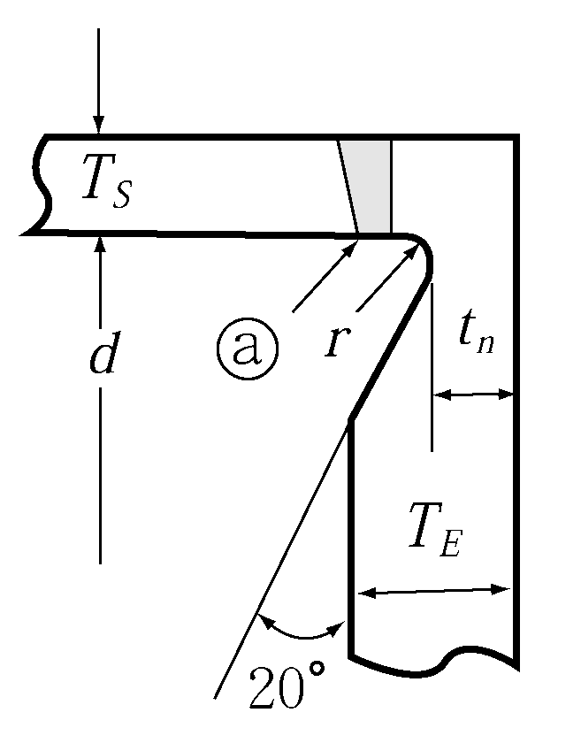
    **Fig 5.6.1** 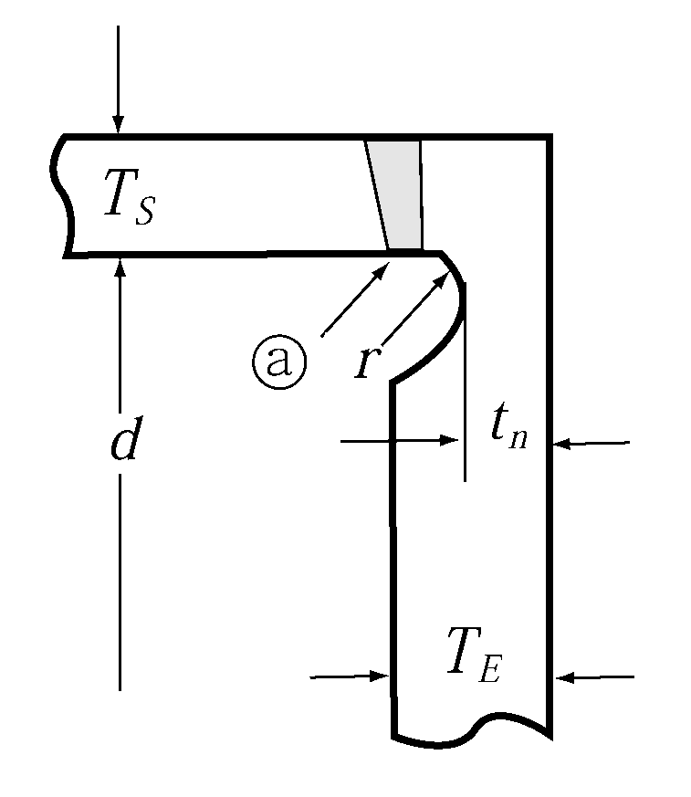
    **Fig 5.6.2**
  - **(2)** The one side welded flange joint shown in **Fig 5.6.2** of the Guidance may be used for drinking water piping, scupper piping and sanitary piping located above the load line, drain piping, overflow piping, air vent piping, exhaust gas piping, gas vent piping of crank chambers, exhaust steam piping and foam fire extinguishing agent discharge piping having an open end. For pipes in Class Ⅲ used for pipes other than above, they may be used for pipes with a nominal diameter of 40 *A* or less other than for flammable oils.
  - **(3)** In application to 104. 3. (4) of the Rules, the term " particular case" means the type of flange other than typical examples of flange attachments are shown in **Fig 5.6.1**.
  - **(4)** In application to **104. 3.** (5) of the Rules, application of flange connections is to comply with Guidance **Table 5.6.1**.
- **3.** **Slip-on threaded joints 【See Rule】**
  In application to **104. 4** of the Rules, slip-on threaded joints may be used for connecting small bore instrumentation equipment (e.g., pressure/temperature sensors) to piping systems conveying flammable media if such connections comply with a recognized national and/or international standard (Standards such as ASME B31.1 and ASME B31.3 may be referenced for the purpose). The use of such threaded joints shall be limited to outside diameters of maximum 25 $\mathrm{mm}$. *(2024)*
- **4.** **Solder 【See Rule】**
  In application to **104. 1** of the Rules, non-ferrous metal valves and fittings may be soldered to non-ferrous metal pipes. Where design pressure 0.7 $\mathrm{MPa}$ or below and the design temperature does not exceed 93 °C, ordinary solder may be used. When pipe flanges are soldered to copper pipes, the procedure for soldering is to comply with the following.
  - **(1)** The portion to be soldered is to be provided with a suitable molten pool and the pipe end is to be bell mouthed.
  - **(2)** Fillet welding is not recommendable for connecting a copper pipe with pipe flange. However, this recommendation may be waived when special soldering method such as silver soldering or TIG welding is applied.
  - **(3)** Copper pipes connected by soldering may be used for applications when the design temperature is 200 °C or below.

    **Table 5.6.1 Typical Application of Flange Connections**

    | Service Class of piping | Steam(1) and thermal oil | Fuel and lubricating oil | Air(1), Water(1), Hydraulic oil(1) and gas(1) |
    | --- | --- | --- | --- |
    | I | A, B(2) | A, B | A, B |
    | II | A, B, C, D(3) | A, B, C | A, B, C, D(3) |
    | III | A, B, C, D | A, B, C | A, B, C, D, E(4) |
    | NOTES: 1. (1) to (4) marked in this Table are as follows. (1) Type A joints are to be used for pipes whose design temperature exceeds 400°C. (2) Type B joints may be used for pipes having a nominal diameter not exceeding 150A only. (3) Types D and E joints are not to be used for pipes whose design temperature exceeds 250°C. (4) Type E joints may be used for water pipes or pipes with an open end. 2. Type A, B or C joints may be used for refrigerant piping of ammonia. |   |   |   |
- **5.** In application to **104. 5.** (5) of the Rules, following burst pressure may be tested. However, for design pressure with more than 20 MPa but less than 120 MPa, the burst pressures may be obtained by linear interpolation.
  - **(1)** Design pressure below 20 MPa : 4 times of design pressure
  - **(2)** Design pressure not less than 120 MPa : 2 times of design pressure
- **6.** **Pressure rating of CO2 fire extinguishing** In application to **104. 1** of the Rules, the pressure rating of pipe connections such as flanges from the distribution station to nozzle is to be not less than the maximum pressure developed during the discharge of CO2 into protected spaces. *(2021)* **【See Rule】**

#### 105. Welding of pipes and pipe fittings 【See Rule】

In application to **105. 3.** (4) of the Rules, branches may be attached to pressure pipes by means of welding without an additional reinforcement or an increase of the thicknesses provided that the pipes are meet the requirement of reinforcement of openings in accordance with **Ch.5 115.** of the Rules.

#### 106. Post weld heat treatment 【See Rule】

- **1.** Nevertheless the requirements of **106. 1** of the Rules, for pipes for pressure gauge equipped with pipe systems belonging to Class I or Class II, the post weld heat treatment may be omitted after considering temperature of fluid.

#### 107. General requirements for piping arrangement

- **1.** **Installation** In application to **107. 1** (6) of the Rules, where pipes are inevitably led in the vicinity of electrical equipment, it is to be also complied with requirements of **Part 6, 401. 1** of the Guidance. **【See Rule】**
- **2.** **Protection of pipes and fittings** In application to **107. 2** (2) of the Rules, drain traps are to be provided on the scuppers from refrigerating spaces. **【See Rule】**
- **3.** **Pressure gauges and temperature gauges** In application to **107. 4** of the Rules, pressure gauges and temperature gauges, as a general rule, are to be installed in accordance with "$KS$ $V$ 7013 and $KS$ $V$ 7014". **【See Rule】**
- **4.** **Gaskets and packings** In application to **107. 5** of the Rules, packings for flanges, pipe fittings, valve covers and valve stems, as a general rule, are to be installed in accordance with the national standard or equivalent standards. **【See Rule】**
- **5.** **Slip joints** In application to **107. 6** of the Rules, the slip joints are to be complied with the following. **【See Rule】**
  - **(1)** The joints of bilge suction piping and ballast piping led to cargo hold are to be flanged connections or welding type joints. However, slip joints may be used where deemed appropriate by the Society.
  - **(2)** For the pipes within the tanks containing the same liquid as that drawn through the piping, slip joints may be used.
  - **(3)** Slip joints may be used for the cargo oil pipes, but are not to be used within the ballast tanks through which the pipes are passing.
- **6.** **Penetration of pipes** In application to **107. 7** of the Rules, valve stems of various valves are, in principle, not to penetrate through the part subjected to liquid head such as the bottom plate of wing tanks and top plate of double bottom used for tanks. In case where such penetrations are unavoidable, considerations are to be taken by providing such means as protection pipe to prevent liquid head from imposing on the stuffing box. Any penetration used for the passage of heat-sensitive piping systems through a watertight bulkhead or deck on a passenger ship under SOLAS regulation II-1/13.2.3 shall be tested with the heat-sensitive piping and shall be type approved for watertight integrity after the fire test. *(2024)* **【See Rule】**
- **7.** **Watertight Bulkhead 【 See Rule】**
  - **(1)** In application to **107. 8** of the Rules, suction pipes of the stern tank are to be fitted with stop valves at the fore side of the bulkhead.
  - **(2)** In application to **107. 8.** (2) of the Rules, ships of less than 500 gross tonnage and engaged in under coastal services may be also loosened as follows.
    - **(A)** The number of the pipe passing through the collision bulkhead may be not applied.
    - **(B)** If it is not possible to install a screw down valve, a butterfly valve may be fitted. In this cases, a butterfly valve is to be of type with positive holding arrangements, or equivalents, that will prevent movement of the valve position due to vibration or flow of fluids.
  - **(3)** **107. 8.** (2) of the Rules is applied to ships one of the followings. *(2024)*
    - **(A)** Ships for which the building contract is placed on or after 1 January 2024 (in the absence of a building contract, the keels of which are laid or which are at a similar stage of construction on or after 1 July 2024)
    - **(B)** Ships the delivery of which is on or after 1 January 2028
- **8.** **Sea water and fresh water piping** In application to **107. 12** of the Rules, Where the piping are unavoidably used both as sea water service and fresh water service, the stop valve is to be provided on each suctions, with a notice plate suitably put so as to prevent from mishandling. **【See Rule】**
- **9.** When equipment for gas welding are provided on-board, it is to comply with **Annex 5-5**.
- **10.** **Marking** In application to **107. 10** (1) of the Rules, markings for identification of pipes, as a general rule, are to be in accordance with "$KS$ $V$ 7015 (Identification of Pipes for Vessels)" or "$KS$ $V$ *ISO 14726-1. 2*(Ships and marine technology - Identification colors for the content of piping systems)". **【See Rule】**

### Section 2 Air Pipes, Overflow Pipes and Sounding Devices

#### 201. Air pipes

- **1.** **General**
  - **(1)** In application to **201. 1** (1) of the Rules, for a normally inaccessible small void compartment such as an echo sounder recess, air pipes may be omitted under the approval of the Society. For such arrangements, a warning notice is to be located in a prominent position specifying the precautions for ventilation to be taken prior opening the manhole and entering the small void compartment. **【See Rule】**
  - **(2)** In application to **201. 1** (5) of the Rules, the examples of the construction preventing direct ingress of seawater splashes or rain water are as shown in **Fig 5.6.3** of the Guidance. This requirement applies only to ships subject to the requirements of the SOLAS. However, where air pipes are located in higher position than the upper deck and are considered not to be damaged by wave or other external force such as fuel oil tank and lubricating oil tank for emergency generator, this may be omitted. **【See Rule】**
    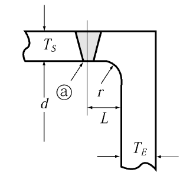
    **Fig 5.6.3 The Example of Construction Preventing Direct Ingress of Seawater Splashes or Rain Water** ***(2017)***
- **2.** **Termination of air pipe outlets** ***(2018)*** **【See Rule】**
  - **(1)** In application to **201. 2** (1) of the Rules, it may be in accordance with the following;
    - **(A)** Air pipes to cofferdams adjacent to fuel oil and cargo oil tanks having oils exceeding a flash point 60℃ and all tanks which can be pumped up may be led to the enclosed cargo space under the approval of the Society with submission of documents demonstrating SOLAS Reg.II-1/17.3, ventilation system and drainage system etc..
- **3.** **Protection of air pipe outlets 【See Rule】**
  - **(1)** In application to **201. 3** (2) of the Rules, the wording "the flame-screens which deemed appropriate by the Society" is to comply with the following.
    - **(A)** to be made of corrosion resisting material
    - **(B)** to comprise two fitted screens of at least 20 × 20 *mesh* spaced 25.4 ± 12.7 $\mathrm{mm}$ apart or single fitted screen of at least 30 × 30 *mesh*, or to have a performance equivalent thereto.
- **4.** **Size of air pipes 【See Rule】**
  In application to **201. 4** (1) of the Rules, the air pipes for the tank is provided with an overflow pipe are to comply with the following.
  - **(1)** Where the aggregated sectional area of overflow pipes in the tank, which are not fitted with valves impeding air flow, is greater than 1.25 times the effective area of the filling pipes, the air pipes may be omitted. In this time, the sectional area of air pipes in the overflow tank is not less than the aggregated sectional area of overflow pipes.
  - **(2)** For the tanks which are provided with common overflow pipes, the air pipes in each tank may be omitted where the sectional area of overflow pipes from each tank is greater than 1.25 times the effective area of filling pipes from each tank, and the sectional area of common overflow pipes and the sectional area of air pipes of the overflow tank are greater than 1.25 times the aggregated sectional area of the filling pipe of each tank which filled simultaneously. However, the sectional area of common overflow pipes and the sectional area of air pipes of the overflow tank are need not to exceed 1.25 times the sectional area of common filling pipes.
  - **(3)** In application to (1) and (2) above, where overflows from the tanks such as fuel oil settling tank, fuel oil service tank, etc. are led to other tank with air pipes, suitable means are to be provided so that the air in the highest portion of these tanks is vented to other tank with air pipes. (refer to **Fig 5.6.4** of the Guidance).
    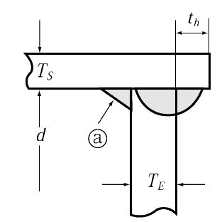
    **Fig 5.6.4 Example of Details of Overflow Pipe**
- **5.** **Height of air pipes 【See Rule】**
  - **(1)** In application to **201. 5** of the Rules, the height of air pipes above deck is to be measured as shown in **Fig 5.6.5** of the Guidance.
  - **(2)** In application to 201.5 of the Rules, height of air pipes are to be as below. *(2017)*
    - **(A)** 760 mm on the freeboard deck or other exposed decks lower than one standard height of superstructure above the freeboard deck; and
    - **(B)** 450 mm on other exposed decks lower than two standard heights of superstructure above freeboard deck.
    - **(C)** Exposed decks is included top decks of superstructures, deckhouses, companionways and other similar deck structures.
    - **(D)** Where these height interfere with the working of the ships, such as ships not engaging on international voyages, tug boat, barge, etc., a lower height may be accepted, provided that the automatic closing device approved by the Society is fitted. In such cases, the minimum height may be reduced from 760mm on (A) to 450 $\mathrm{mm}$ and from 450mm on (B) to 300 $\mathrm{mm}$.

#### 202. Overflow pipes

- **1.** In application to **202. 1** (1) (B) of the Rules, opening below the open ends of air pipes fitted to tanks means openings having permanent air gap such as a float sounding system. And such openings are to be situated above the highest point of the overflow piping. **【See Rule】**
- **2.** In application to **202. 2** (2) of the Rules, In case that the fuel oil or lubricating oil circulated from the settling tank circulates to the settling tank through the overflow pipe of the service tank, the installation of the sight glass on the overflow pipe or the high level alarm device for the service tank may be omitted. **【See Rule】**

#### 203. Sounding devices

- **1.** In application to **203. 1** (1) of the Rules, sounding devices may be complied with following. **【See Rule】**
  - **(1)** For a normally inaccessible small void compartment such as an echo sounder recess, sounding pipes may be omitted under the approval of the Society. For such arrangements, means for sampling such as plugs or cocks are to be provided to the manhole and a warning notice is to be located in a prominent position specifying the precautions for checking flooding of the compartment to be taken prior opening the manhole.
  - **(2)** Special shaped voids, etc. which installation of sounding pipes or other sounding devices is impracticable as structural reason may be provided with a bilge alarm instead of sounding pipe under the approval of the Society.
- **2.** Termination of sounding pipes In application to **203. 2** (2) of the Rules, Sounding pipes to the tanks and cofferdams located in double bottom are to be fitted with self-closing blanking devices. *(2019)* **【See Rule】**
- **3.** **Construction of sounding pipes** In application to **203. 3** of the Rules, construction of sounding pipes is to be complied with the following. **【See Rule】**
  - **(1)** In case where elbow type sounding pipe is unavoidable to use, sufficient support is to be provided for the arm of the pipe.
  - **(2)** The standard thickness value of striking plate is approximately 10 $\mathrm{mm}$ for ships having length less than 30 $\mathrm{m}$ and 12 $\mathrm{mm}$ for ships having length 30 $\mathrm{m}$ or over. (refer to **Fig 5.6.6** of the Guidance)
    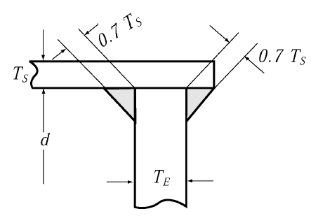
    **Fig 5.6.5 The Height of Air Pipe** 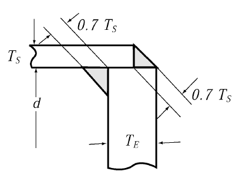
    **Fig 5.6.6 Example of Elbow Type Sounding Pipe Arrangement**

### Section 3 Sea inlet and Overboard Discharge

#### 301. Ship-side valves and fittings

- **1.** **Construction of distance pieces** In application to **301. 2** of the Rules, distance pieces are to be complied with “**KS V 7141** (distance pieces for ship's hull)” or equivalent standards and it is to be of the butt welded joints. The flanged joints may be accepted under the approval of the Society where distance pieces are comply with the below requirements and documents demonstrating it are submitted. *(2023)* **【See Rule】**
  - **(1)** It is to be passed through above load line.
  - **(2)** It is not to be affect to ship's safety where distance pieces is damaged.
  - **(3)** Piping system corresponding to a nominal pressure one rank higher than that according to the design pressure are to be used.
- **2.** **Location of overboard discharges** In application to **301. 4** of the Rules, location of overboard discharges is to be complied with the following. **【See Rule】**
  - **(1)** The wording "overboard discharges" means the discharge opening subjected to pressure by the pump and not including those for natural gravitational discharge.
  - **(2)** The wording "such location" means the area other than that hatched in **Fig 5.6.7** of the Guidance.
  - **(3)** Where the location of overboard discharges is to be such that water can be discharged into life boats when launched, either of the following means is to be provided.
    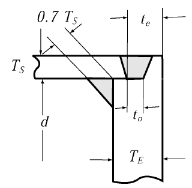
    **Fig 5.6.7**
    - **(A)** Means to guide the water flow to the shell plating.
    - **(B)** Means to stop water discharge which is able to be operated from the weather deck and in the vicinity of the installed place of the lifeboat.

#### 303. Scuppers and sanitary discharge

- **1.** **Scuppers of exposed decks** In application to **303. 3** of the Rules, scuppers piping within superstructures are not to be connected to the scupper piping of exposed decks. **【See Rule】**
- **2.** **Non-return valves of scuppers and sanitary pipes** In application to **303. 4** of the Rules, discharge from spaces under the freeboard deck is to comply with the following. **【See Rule】**
  - **(1)** Discharge from under the freeboard deck
    Requirements of **303. 4** of the Rules are to be applied to normally opened discharge pipes during a voyage, but, in case normally closed discharge pipes, except when discharging, during a voyage such as gravity discharge of top side tank, a screw down stop valve with opened/close indicator being operable from a position easily accessible on the freeboard deck may be used.
    Discharge pipes passing through cargo hold are to be of steel pipe with SCH.160 or 16 $\mathrm{mm}$ of wall thickness and above, or are to be protected appropriately.
    
    **Table 5.6.2. Acceptable arrangements of scupper and discharge**
    - **(A)** Inboard open end of scuppers
      - **(a)** Where discharge of bilge from the small compartments at fore and stern (steering gear room, boatswain's store, chain locker, etc.) is carried out by hand pumps or ejectors, "the vertical distance to the inboard opening end of scupper" means the vertical distance to the position located highest in the system of such discharge pipes.
      - **(b)** Inboard open end of scupper pipes in case where timber load lines are marked, the vertical distance to the inboard open end is to be measured from the timber summer load line.
    - **(B)** Overboard discharge pipes which are always closed during navigation.
    - **(C)** Overboard discharge pipes
    - **(D)** Acceptable arrangements of scupper and discharge are to comply with **Table 5.6.2**. *(2021)*
- **3.** **Scupper pipes from the enclosed cargo spaces on the freeboard deck 【See Rule】**
  In application to **303. 5** (1) of the rules, where the freeboard to the freeboard deck is such that the deck edge is immersed when the ship heels more than 5°, the drainage of the enclosed cargo spaces on the freeboard deck to suitable spaces below deck is also permitted, provided such drainage is arranged in accordance with the requirements in **303. 5** (2) of the Rules.

### Section 4 Bilge and Ballast System

#### 401. General

- **1.** **Application** Bilge piping of ships having length less than 50 $\mathrm{m}$ is to comply with the following. However, requirements not specified in the following are to be in accordance with the Rules. **【See Rule】**
  - **(1)** Number of bilge pumps
    Number of bilge pumps are to be in accordance with **Table 5.6.3** of the Guidance.
  - **(2)** Capacity of bilge pump
    The independent power bilge pump specified **Table 5.6.3** of the Guidance, is to have capacity not less than that obtained from the formula in **405. 2** of the Rules. However, it may be added to the capacity of a independent power bilge pump given in (1) above.

    | Length of ship(*L*) | Power bilge pump |   | Manual pump | Remarks |
    | --- | --- | --- | --- | --- |
    | Length of ship(*L*) | Main engine driven pump | Independent power pump | Manual pump | Remarks |
    | $L<25\mathrm{m}$ | 1 set | ─ | 1 set | The main engine driven pump may be omitted according to the discretion of the Society. In case ships less than 10 $\mathrm{m}$, a bucket may be provided instead of a pump.(※) |
    | $25 \mathrm{m} \leq itL<30 \mathrm{m}$ | 1 set | 1 set | ─ | 2 sets of manual pumps may be provided instead of the main engine driven pump. Where ships is difficult to be provided with the independent power pump, the independent power pump may be omitted by considering piping system and capacity of other pumps.(※) |
    | $30 \mathrm{m} \leq itL<50 \mathrm{m}$ | 1 set | 1 set | ─ | 2 sets of manual pumps may be provided instead of the main engine driven pump. |
    | (Note) 1. The requirement with mark (※) is to be applied to ships other than passenger ship. 2. In this Table, power pump may be provided instead of manual pump, and independent power pump may be provided instead of main engine driven pump. 3. In ships having length 25 $\mathrm{m}$ or over, but less than 30 $\mathrm{m}$, the requirement for omission of independent power pump is to be applied to ships difficult to be provided with the independent power pump, provided with main engine driven pump having capacity more than suction capacity required by independent power pump, and arranged bilge piping in all compartment required bilge discharge. Where the hand pump is substituted for main engine driven pump, the independent power pump may be omitted. 4. In ships having coastal service area, the bilge pump for oil filtering equipment may be recognized as a manual bilge pump. 5. All power pumps and manual pumps are to discharge bilge from cargo hold, engine room and shaft tunnel. |   |   |   |   |
  - **(3)** Internal-diameter of bilge suction pipes
    Main bilge suction pipes, direct bilge suction pipes and bilge suction branch pipes are to be of internal diameters not less than the diameter obtained from the following formula (A) through (C).
    $d=1.22 \times (L-10)+10 (\mathrm{mm})$
    $d=2.67 \times (L-20)+15 (\mathrm{mm})$
    $d=1.68 \sqrt {L(B+D)} +25 (\mathrm{mm})$
    (However, $d$ is not to be less than 50 $\mathrm{mm}$.)
    $d ' =2.15 \sqrt {l(B+D)} +25 (\mathrm{mm})$
    - **(A)** Main bilge suction pipes or direct bilge suction pipes
      - **(a)** For ships having length less than 25 $\mathrm{m}$
      - **(b)** For ships having length 25 $\mathrm{m}$ or over, but less than 35 $\mathrm{m}$
      - **(c)** For ships having length 35 $\mathrm{m}$ or over
    - **(B)** Bilge suction branch pipes
      - **(a)** For ships having length 35 $\mathrm{m}$ or over
      - **(b)** In ships having international service area, internal diameter of bilge suction branch pipes is not to be less than 50 $\mathrm{mm}$, but, internal diameter of bilge suction pipe for small compartments may be 40 $\mathrm{mm}$ according to the discretion of the Society.
      - **(c)** Internal diameter of bilge suction branch pipes for bow and stern tanks and shaft tunnel may be reduced to 50 $\mathrm{mm}$ in ships having length 35 $\mathrm{m}$ or over, and to internal diameter approved by the Society in ships having length less than 35 $\mathrm{m}$.
    - **(C)** In ships having length 35 $\mathrm{m}$ or over, internal diameter of main bilge suction pipes is not to be less than the largest value for bilge suction branch pipe obtained from the formula specified in (B).
  - **(4)** Direct bilge suction pipe
    Nevertheless above (A), the internal diameter of direct bilge suction pipes may be reduced appropriately according to the discretion of the Society.
  - **(5)** Emergency bilge suction pipe
    Emergency bilge suction pipes are to comply with the following.
    - **(A)** Ships provided with steam turbine as main engine are to be provided with emergency bilge suction pipes complied with the Rules.
    - **(B)** Ships provided with diesel engine as main engine may be omitted according to the discretion of the Society.
  - **(6)** Bilge pipe in engine room
    Bilge pipes made of copper may be used.
- **2.** **Piping arrangement**
  - **(1)** In application to **401. 2** (1) of the Rules, where void spaces and cofferdams do not affect to ship's stability and are located above the load water line, the spaces may be drained by installation of a separate bilge pump(a portable pump may be accepted) or by gravity, instead of fixed bilge piping system connected to main bilge line. However, where draining by gravity, this pipe is to be provide with a quick-acting self-closing valve located in a readily accessible position. **【See Rule】**
  - **(2)** **401. 2** (2) of the Rules does not apply to permanent ballast water in sealed tanks. *(2021)*
- **3.** **Piping arrangement** In application to **Sec 4** of the Rules, a stop valve and a non return valve in series is regarded as equivalent for screw-down non-return valves. *(2021)*

#### 402. Drainage of compartment other than machinery spaces 【See Rule】

- **1.** **Omission of bilge suction pipes** For small compartment such as echo sounder recess, the provision of bilge suction pipes may be omitted under the approval of the Society.
- **2.** **Bilge scuppers in special case** In case where hold or cabin bilges are drained to the engine room or shaft tunnel adjacent thereto through the watertight construction as specified in **Fig 5.6.8** of the guidance, the bilge drainage piping is to be led to spaces readily accessible and self-closing valve or cock is to be provided. Where such bilge is led to the watertight bilge tanks, the above mentioned valve or cock may be omitted, but where the hold is located under the load line, non-return valve is to be provided. In case where hold bilges are led to the shaft tunnel, no sounding pipe may be provided, but the diameter of the drainage pipe is not to be less than the value specified for bilge suction pipe.
- **3.** **Bilge well high water level alarms** For ships being within the application limits of regulation XII/4.3 of SOLAS, which have been constructed with an insufficient number of transverse watertight bulkheads to satisfy the regulation, it is provided with bilge well high water level alarms in all cargo holds, or in cargo conveyor tunnels, as appropriate, giving an audible and visual alarm on the navigation bridge.
- **4.** **Bilge drainage system of fish hold & etc** Where drainage of bilge water is possible by means of water pipes or circulating water pipes installed in tanks or fish hold in which fish are caught with ice or water, the bilge pipes may be used instead of bilge pipes and they shall be deemed to comply with the bilge pipes. *(2019)*

#### 403. Drainage of machinery spaces (2019) 【See Rule】

- **1.** **Emergency bilge suction**
  - **(1)** In application to **403. 6** (3) of the Rules, The emergency bilge suction may be led to the main cooling water pump or the main circulation water pump driven by the main engine.

#### 404. Size of bilge suction pipes 【See Rule】

- **1.** **Main bilge pipes**
  - **(1)** Internal diameter of main bilge pipes is not to be less than 60 $\mathrm{mm}$ in ship engaged in international service area, and not to be less than 50 $\mathrm{mm}$ in ships having length 35$\mathrm{m}$ or over.
  - **(2)** The standard pipes of internal diameter nearest to the calculated diameter may be used.
  - **(3)** In application to above (2), standard pipes of one grade higher diameter are to be used in the following cases.
    - **(A)** When the calculated value of internal diameter is not greater than 110 mm, in case where the diameter of such standard pipes is small of the calculated value by 6 mm or over.
    - **(B)** When the calculated value of internal diameter is greater than 110 mm, in case where the diameter of such standard pipes is small of the calculated value by 13 mm or over.
- **2.** **Bilge suction branch pipes** In application to **404. 2** of the Rules, the bilge suction branch pipes are to be complied with the following.
  - **(1)** For bilge suction piping of hold bilges, the main bilge suction system (Christmas tree system) is, in principle, not to be adopted. In case where such an arrangement is unavoidable, the ship is to be ensured satisfying the one-sub-division flooding condition. The internal diameter of bilge suction pipe in such a system is to be calculated according to the **Fig 5.6.9** of the Guidance.
    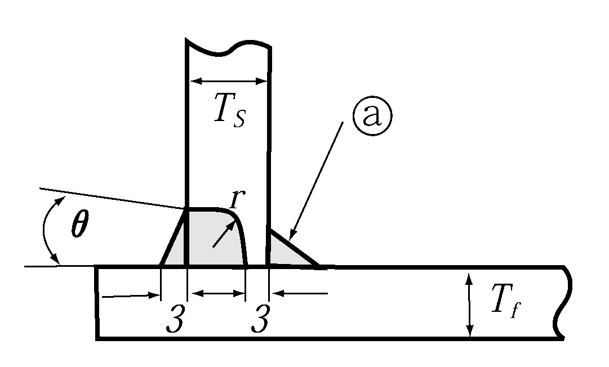
    **Fig 5.6.8 Example of Hold Bilge Drainage Line through the Watertight Construction** 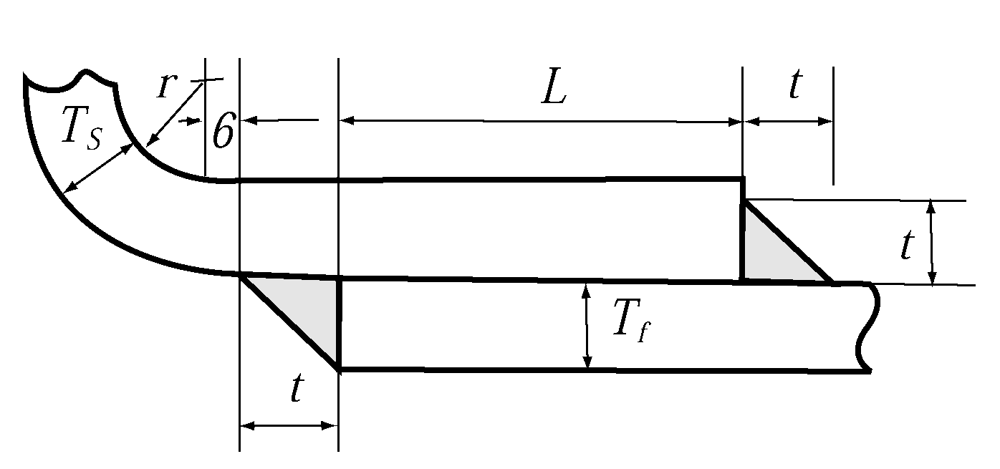
    **Fig 5.6.9 Example of Main Bilge Suction System for Hold Bilge Suction Line**
    - **(A)** Pipes $A$*,* $B$*,* $C$ and $D$ are to be calculated as bilge suction branch pipe respectively by substituting $l _{1}$, $l _{2}$, $l _{3}$ and #eqnID-656_s2to $l$.
    - **(B)** Pipe $E$ is to be calculated as main bilge line by regarding the sum of #eqnID-659_s2as $L$, and the sectional area of pipe $E$ is to be sum of sectional areas of pipe $A$ and $B$ or more.
    - **(C)** Pipe F is to be calculated as main bilge line by regarding the sum of $l _{1} +l _{2} +l _{3}$ as $L$, and the sectional area of pipe $F$ is to be sum of sectional areas of the largest two bilge suction branch pipes among $A$*,* $B$ and $C$.
    - **(D)** Pipe $G$ is to be calculated as main bilge line by regarding the sum of $l _{1} +l _{2} +l _{3} +l _{4}$ as $L$, and the sectional area of pipe $G$ is to be sum of sectional areas of the largest two bilge suction branch pipes among $A$*,* $B$*,* $C$ and $D$. In this case, a screw-down type non-return valve is to be provided at the suction of each branch piping. In case where the installed position of such valve is not readily accessible, a remote control device is to be provided.
  - **(2)** Internal diameter of bilge suction pipe of a ship with double hull construction. In ships with double hull construction, the inside diameter of bilge suction pipe may be determined by using the distance between the inner hull in place of the breadth of a ship.
  - **(3)** In case of **401. 2.** (3) of the Rules, internal diameter of the bilge branch suction pipes is to have a capacity of not less than 125 $\%$ of the capacity required in water spraying system, etc.
  - **(4)** In application to **404. 2** of the Rules, the standard pipes of internal diameter nearest to the calculated diameter may be used and above **404.1.**(3) is to be applied.
  - **(5)** The term "it may be reduced to 40 $\mathrm{mm}$, where considered acceptable by the Society" specified in **404. 2** of the Rules means those ships not engaged on international voyages and the internal diameter of the branch bilge suction pipes by the formula specified in **404. 2** of the Rules is to be 40 mm or less.

#### 405. Bilge pumps 【See Rule】

- **1.** **Number of bilge pumps**
  - **(1)** Ships other than passenger ship may be provided with a bilge eductor instead of 1 set of bilge pump required **405. 1** of the Rules. In this case, pump supplying sea water to bilge eductor is to be pump other than main cooling water pump.
  - **(2)** Minimum number of combined using pumps for essential services (fire pump, ballast pump, bilge pump and auxiliary gas scrubber pump) of non-continuous nature in ships of 500 $GT$ and over are in accordance with the following.
    - **(A)** On tankers provided with inert gas system, a minimum of 4 pumps, including an emergency fire pump, are to be required.
    - **(B)** On other cargo ships and tankers not provided with inert gas system, a minimum of 3 pumps, including an emergency fire pump, are to be required.
- **2.** The wording "to be considered appropriate by the Society" specified in **405. 4** of the Rules means as below.
  - **(1)** Internal diameter of bilge suction pipes
    The internal diameter of bilge suction pipes is not to be less than the value obtained by the following formula.
    $d=1.68 \sqrt {l(B+D)} +25 (\mathrm{mm})$
    Where
    $d$ : Internal diameter of bilge suction pipe ($\mathrm{mm}$)
    $l$ : Length of cargo hold ($\mathrm{m}$)
    $B$ : Breadth of cargo hold ($\mathrm{m}$)
    $D$ : depth of ship ($\mathrm{m}$)
  - **(2)** Suction capacity of eductor
    The suction capacity of eductors is to be not less than that obtained from the formula.
    $Q=5.66d ^{2} \times 10 ^{-3} (\mathrm{m} ^{3} /h)$
    where
    $Q$ : Bilge suction capacity of eductor ($\mathrm{m} ^{3} /h$)
    $d$ : Same as in (1) above
  - **(3)** Amount of driving water for eductor
    The eductor is to be so arranged as to be driven by two or more units of pumps. In case where bilges in two or more cargo holds are discharged by the eductors driven by these pumps, the amount of driving water of each pump is to be sufficient to draw bilges in at least two cargo holds simultaneously with the suction capacity as specified in (2) above.
  - **(4)** Eductor driving water stop valve and bilge discharge valve are to be provided. These valves are to be operable from a position on the bulkhead deck or upward, except where these valves are provided in the engine room.
  - **(5)** Bilge high level alarm device
    - **(A)** To prevent the back-flow of the eductor driving water to the bilge wells, a bilge high level alarm device is to be provided in each bilge well which activates the alarm when the back-flow occurs. The bilge high level alarm device is to activate audible and visible alarm in a normally manned position at which the cargo hold whose bilge level in the bilge well becomes high can be identified. Instead of a alarm device, screw-down non-return valves may be fitted to near the open ends of bilge suction pipes in cargo holds.
    - **(B)** The circuit of bilge high level alarm device is to have a self-monitoring function or at least two independent circuits are to be arranged in each cargo hold.
    - **(C)** The bilge high level alarm device in cargo holds loaded with coal is to comply with the requirements in **Pt 7, Ch 3, 1602.** of the Rules.
  - **(6)** Eductor driving water pipes passing through a side tank
    In ships omitted bulkhead subject to double bottoms, where eductor driving water pipes pass through a side tank, open end of bilge suction pipes is provided with a non-return valve. And eductor driving water pipes, bilge discharge pipes and eductors in side tanks, as far as practicable, are to be located in the vicinity of longitudinal bulkhead of cargo hold side.
  - **(7)** Rose boxes at bilge suction ends
    The rose boxes provided at bilge suction ends are to be of adequate ones matching the bilge suction capacity of eductor and comply with the requirements specified in **406. 9** of the Rules.
  - **(8)** Protection of bilge piping system in cargo holds
    The eductor driving water piping, bilge discharge piping and eductor are to be so arranged as not to be damaged by cargo.
  - **(9)** Common use of eductor driving water with fire water
    In case where eductor driving water is taken from the fire piping, consideration is to be so given that no adverse effect is cause on the fire-fighting function.

#### 406. Pipe systems and their fittings

- **1.** **Bilge suction pipes and ballast suction pipes passing through deep tanks** In application to **406. 4** of the Rules, the bilge suction pipes and ballast suction pipes passing through deep tanks are to be dealt with under the following requirements. **【See Rule】**
  - **(1)** For the bilge suction pipes passing through deep tank serving as the exclusive ballast tank, welded pipe joints may not be required if flange joints corresponding to a nominal pressure one rank higher than that according to the design pressure are used.
  - **(2)** In case where gravitational ballasting/deballasting is intended by using sea chests provided in the exclusive ballast tanks, double stop valves being operable from a position on the freeboard deck are to be provided.
  - **(3)** Suction pipes such as the bilge suction pipes and ballast suction pipes are not to pass through deep tanks carrying cargo oil, except that in case where th pipes are installed in pipe tunnel provided within the deep tanks.
  - **(4)** In the application of the requirements specified in (1) to (3) above, bilge hoppers are to be regarded as deep tanks.
- **2.** **Means for operating the ballast valves** In application to “provided that there is a readily accessible manual means to close the valves upon loss of power” in **406. 7** (2) of the Rules, manual means to close the valves are not to be located in double bottoms, side tanks, bilge hopper tanks or void spaces, where manual means are not operable when the spaces are flooded. *(2025)*
- **3.** **Mud box** In application to **406. 8** of the Rules, where ships having length less than 50 $\mathrm{m}$, a rose box is provided instead of a mud box fitted in open end of bilge suction pipes and reserve bilge suction pipes according to the discretion of the Society. **【See Rule】**

### Section 5 Feed Water and Condensate System for Boiler

#### 501. Feed water pumps 【See Rule】

- **1.** Where feed water system of main boilers is group system, a stand-by feed water pump having capacity same as one set among feed water pumps in the group is to be provided. And, when one set among feed water pumps in the group is out of order during operating, the stand-by feed water pump is to be easily operated instead of it.
- **2.** In essential auxiliary boilers having heat surface area 50 $\mathrm{m} ^{2}$ or less, a injector may be provided instead of one set among two sets of feed water pump.

#### 502. Feed water piping 【See Rule】

- **1.** In application to **502. 1** of the Rules, the examples of a single penetration in the steam drum from two separate means of feed are as shown in **Fig 5.6.10** of the Guidance.
  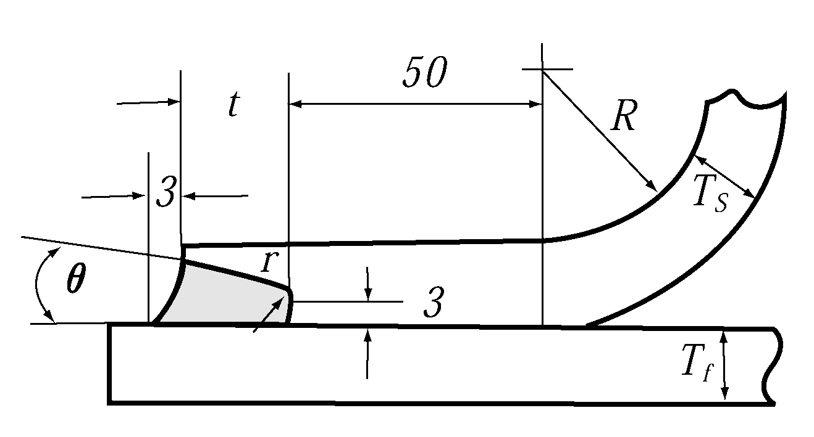
  **Fig 5.6.10**
- **2.** In application to **502. 1** of the Rules, where two or more adequately sized boilers are installed and the feed water for each of these boilers is supplied by a single feed water pipe, the level of redundancy for the piping of the feedwater system is considered to comply with **502. 1** of the Rules.
- **3.** One feed water system may be accepted to provide for small package type auxiliary boilers which are required for essential services according to the discretion of the Society. In this case, one set of spare feed water pump is to be provided and when feed water pump is out of order, the spare feed water pump is to be easily exchanged for it.
- **4.** Essential auxiliary boilers or other boilers intended to supply steam for fuel oil heating necessary for the operation of the main propulsion or cargo heating that is required continuously are to be provided with feed water systems in accordance with **501.** and **502.** of the Rules. The requirements in **501. 1, 2** and **502. 1** of the Rules need not to be applied provided that an alternative means is available to ensure the normal navigation and cargo heating with the feed water system being out of operation. For an auxiliary boiler used exclusively for the fuel oil heating necessary for the operation of main propulsion machinery and the cargo heating requiring continuously, only one feed water system may be accepted when one complete spare unit of feed water pump and one set of feed water check valve capable of being replaced in a short period of time.

### Section 6 Steam and Exhaust Gas Piping

#### 601. Steam piping 【See Rule】

- **1.** **Piping** In application to **601. 1** of the Rules, steam piping is to comply with the following.
  - **(1)** Steam heating pipes are to be so supported as not to be in direct contact with the hull members such as floor plates, etc.
  - **(2)** In principle, steam pipes are not to be led through cargo holds, but where it is impracticable to avoid this arrangement, pipes are to be insulated and protected by steel plate and, all joints are to be welded.
  - **(3)** Steam piping for steam turbine is to be in accordance with **Ch 2** of the Rules.
  - **(4)** Steam piping for boiler safety valves is in accordance with **Ch 5** of the Rules.
- **2.** Where main steam lines of two or more boilers connected to common steam line, main steam valve of each boiler is to be screw down check valve and a stop valve is to be fitted between the screw down check valve and the common steam line.
- **3.** **Oil heating pipes** In application to **601. 3** of the Rules, where oil heating pipe is jointed between heating main line and heating branch line for cargo oil tanks, duplicate stop valves or spectacle flanges are to be fitted in the heating branch line.

#### 602. Exhaust gas piping 【See Rule】

- **1.** In application to **602. 1** of the Rules, the Selective Catalytic Reduction(SCR) system using ammonia solution or urea solution as the reductant agents is to comply with requirements in **Ch 2** of **Guidance for Prevention System of Pollution from Ships** in addition to those in this Chapter.
- **2.** In application to **602. 1** of the Rules, the ships provided the Exhaust Gas Recirculation(EGR) system are to comply with requirements in **Ch 2** of **Guidance for Prevention System of Pollution from Ships** in addition to those in this Chapter.
- **3.** In application to **602.** of the Rules, the ships provided the Exhaust Gas Cleaning(EGC) system are to comply with requirements in **Ch 3** of **Guidance for Prevention System of Pollution from Ships** in addition to those in this Chapter. *(2017)*

### Section 7 Cooling System

#### 702. Stand-by cooling water pumps 【See Rule】

- **1.** In application to **702. 3** of the Rules, the capacity of stand-by circulating pump in ships with main turbine propulsion machinery is to be of assuring sufficient engine output to develop speed of the ship to 7 $\mathrm{knots}$ or over, and speed effectively capable of steering.
- **2.** In application to **702.** of the Rules, ships complied with the following as ships having a gross tonnage less than 500 $\mathrm{t} ons$ may be omitted to provide the stand-by cooling pump.
  - **(1)** Ships engaged in smooth water service.
  - **(2)** Ships engaged in coastal service area, and equipped with two sets of main engine and independent cooling water pump for each main engine.
- **3.** In application to **702. 7** of the Rules, high speed rotating engine of specific construction which can not be changed to spare pump without complete engine overhaul may be omitted to provide with spare pump.
- **4.** In application to **702. 8** of the Rules, engines in small ship means a main engine or a auxiliary engine which are installed in ships having length less than 30 $\mathrm{m}$. In case of a main engine, one set of spare pump is to be provided.

#### 703. Sea inlets 【See Rule】

Two sea inlets are located at bottom plate and, as far as practicable, are to be departed from each other to ship sides.

#### 704. Strainers 【See Rule】

- **1.** In application to **704**. of the Rules, "the strainers which can be cleaned without interruption to the cooling water supply" is to comply with the following.
  - **(1)** For multi propeller ships and where single strainer is fitted between the sea water suction valves and the cooling water pump of internal combustion engine which coupled with each shafting system
  - **(2)** Where two or more the independent driven engines are coupled with one shafting system and single strainer is fitted in the individual engine
  - **(3)** Where two or more internal combustion engines driving essential auxiliary machinery are installed and single strainer is fitted in the individual engine
- **2.** In application to **704.** of the Rules, "in small ship, the strainers may be omitted with approval of Society" is to comply with the following.
  - **(1)** In ships having length lass than 30 $\mathrm{m}$, internal combustion engine driving main engine and essential auxiliary machinery may be omitted to provide the strainers.
  - **(2)** In ships having length lass than 30 $\mathrm{m}$ or over, and less than 50 $\mathrm{m}$, internal combustion engine driving essential auxiliary machinery may be omitted to provide the strainers.

### Section 8 Lubricating Oil System

#### 802. Lubricating oil pumps 【See Rule】

- **1.** In **802.** of the Rules, ships complied with the following as ships having gross tonnage less than 500 $\mathrm{t} ons$ may be omitted to provide the stand-by lubricating oil pump.
  - **(1)** Ships engaged in smooth water service.
  - **(2)** Ships engaged in coastal service area, and equipped with two sets of main engine and independent lubricating oil pump for each main engine.
- **2.** In application to **802. 3** of the Rules, high speed rotating engine of specific construction which can not be changed to spare pump without complete engine overhaul may be omitted to provide with spare pump.
- **3.** In application to **802. 6** of the Rules, the engine means a main engine or an auxiliary engine. In case of a main engine, one set of spare pump is to be provided.

#### 803. Piping 【See Rule】

Where steam heaters or heaters using other heating media are provided in lubricating oil systems, the heaters are to comply with **901. 11** (1) and (2) of the Rules.

#### 804. Lubricating oil filters and purifiers 【See Rule】

- **1.** In application to **804. 2** of the Rules, the following may be accepted as "filters capable of being cleaned without stopping the supply of filtered lubricating oil".
  - **(1)** Auto cleaner or self cleaning filter
  - **(2)** Where single filter capable of being readily replaced or cleaned is fitted and by-pass line is provided in the ships engaged in smooth water service or coastal service.
  - **(3)** In case where a high-rotating-speed internal combustion engine of specific construction has single filter and differential pressure alarm device for the filter, and is provided with automatic lubricating oil feed line, and the Society considers appropriate.
  - **(4)** For multi propeller ships and where single filter is fitted in each engine which coupled with each shafting system.
  - **(5)** Where two or more the independent driven engines are coupled with one shafting system and single filter fitted in the individual engine.
- **2.** In application to **804. 3** of the Rules, where any one of following is fulfilled, lubricating oil purifiers or equal effective filters may be omitted.
  - **(1)** In case where ships engaged in coastal service area have lubricating oil storage tank with sufficient capacity to exchange the system lubricating oil one time.
  - **(2)** In case where ships provided two or more main engines having the independent lubricating oil system, ships are to be obtained a navigable speed even if one of them is out of use and provided lubricating oil storage tank with sufficient capacity to exchange the system lubricating oil at least one time for one main engine.
  - **(3)** In case where fishing vessels have lubricating oil storage tank with sufficient capacity to exchange the system lubricating oil one time regardless of tonnage and navigation area.

### Section 9 Fuel Oil System

#### 901. General

- **1.** **Arrangement of fuel oil system** In application to the **901. 2** of the Rules, it is recommendable for fuel oil tanks not to be installed above main engine, auxiliary boiler and such others as far as practicable in consideration of oil leakage from tanks and accumulation of inflammable gas. In case where installation of oil tanks above the high temperature units is unavoidable, the following requirements are to apply, in addition to the relevant requirements provided in **Pt 5, Ch 6, Sec 1** and **Sec 9** of the Rules. The existing ships, if they are of such consideration as mentioned above, are to be reconstructed accordingly as far as practicable. **【See Rule】**
  - **(1)** Provision of means such as to install, if necessary, mechanical ventilation ducts and others, is to be considered, for the purpose of improving ventilation at the compartment installed the tanks.
  - **(2)** Drip trays are to have an adequate area as well as a sufficient depth. The trays are recommended to have their surface made less by increasing its depth than its area when the trays are intended to increase their volume.
  - **(3)** Oil drains from drip trays to oil drain tanks through drain pipes having suitable diameter. In this case, care is to be taken to arrange the pipes shortest possible with ample declivity and to permit no oil to stay in pipes. Drain tanks are to be equipped with the sounding gauge or to be of the construction being capable of sounding its depth.
  - **(4)** The overflow pipes fitted to fuel oil tanks are to comply with the requirements provided in the following.
    - **(A)** The fuel oil tanks having its opening within machinery space like the case of fitting internal mount type float gauge into fuel oil tank, are to be provided with the overflow pipes having their aggregate sectional area 1.25 times or above as much the aggregate sectional area of filling pipes to such tanks.
    - **(B)** The highest point of overflow pipes is to be located lower than the opened portion of fuel oil tank.
    - **(C)** Overflow pipes are to be short and declined as far as possible.
    - **(D)** Overflow pipes are to be fitted with non-return valve at a suitable position in order to prevent oil or water from counter-flowing into fuel oil tank when the tanks to receive overflow oil are being filled with oil or water. The non-return valve intended for this purpose is not to be of screw-down type. In case, however, the use of such type is necessary, suitable notice plate is to be affixed to the valve.
    - **(E)** Excepting the non-return valves specified in the preceding (d), no stop valve is to be fitted to overflow pipes.
    - **(F)** Overflow pipes and drain pipes are not to be connected mutually.
  - **(5)** Exhaust gas manifolds in the vicinity of which are installed fuel oil tanks, are to be adequately insulated for heat and further be covered, including their flanges, with the oil tight metal casing or with the cloth specially coated by oil resistant compound.
- **2.** **Fuel oil pipes and their fittings** In application to **901. 3** (5) of the Rules, "hot surfaces" means all surfaces with temperatures above 220 °C. **【See Rule】**
- **3.** **Drainage system** In **901. 4** of the Rules, the drainage systems are to be complied with the following. **【See Rule】**
  - **(1)** Fuel oil heaters having possibility to get pressure exceeding its maximum working pressure are to be provided with an relief valve, and the relieved drain is to be led to drain tanks or alternatively be disposed of by other means so as not to get scattered.
  - **(2)** In case where fuel oil tanks are unavoidably installed intermediately above the high temperature units, fuel oil drain is to be comply with the requirements in above **1** (2) and (3).
  - **(3)** In the application of **901. 4 (4)** of the Rules, where leading to suitable oil drain tanks is not practicable, alternative means may be considered. *(2025)*
- **4.** **Construction of fuel oil tanks** In application to **901. 5** of the Rules, "small tanks" means fuel oil tanks having 1 $\mathrm{m} ^{3}$ or less in its full capacity. **【See Rule】**
- **5.** **Fuel oil transfer pumps** In application to **901. 9** of the Rules, the following may be accepted. **【See Rule】**
  - **(1)** The fuel oil transfer pumps may be in accordance with the following.
    - **(A)** For main engine with output 368 $\mathrm{kW}$ or above but less than 1,471 $\mathrm{kW}$ or ships having length less than 50 $\mathrm{m}$, the main fuel oil transfer pump is to be a power pump. Stand-by pump may be acceptable by hand pump.
    - **(B)** Where main engine output is 368 $\mathrm{kW}$ or less, hand pump may be acceptable.
    - **(C)** In case of ships equipped with two or more engines, the main engine output means total output of the engines.
  - **(2)** In case of ships engaged in smooth water service, 1 set of fuel oil transfer pump may be acceptable.
- **6.** **Fuel oil piping** In application to **901. 10** of the Rules, for tanks used in common service with fuel oil tanks and ballast tanks, piping arrangement is to be made in such a way that either fuel oil or ballast water can be drawn individually under any circumstances. (refer to **Fig 5.6.11** of the Guidance) **【See Rule】**
  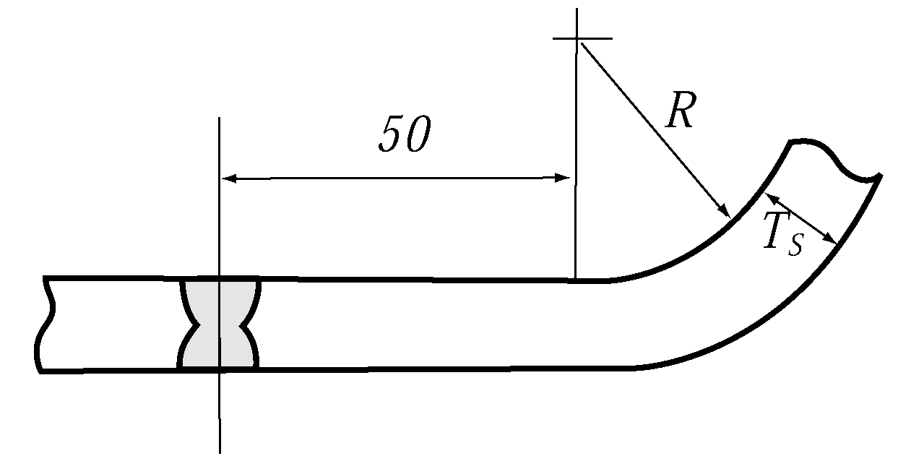
  **Fig 5.6.11 Example of Piping Arrangement for Fuel Oil Tank andBallast Tank in Common Service**
- **7.** No fuel oil pipes are to be led through drinking water tanks, and no drinking water pipes are to be led through fuel oil tanks.
- **8.** In application to **901. 14** of the Rules, the example of two fuel oil service tanks for each type of fuel oil used on board are as shown in **Fig 5.6.12** of the Guidance. This requirement applies only to ships subject to the requirements of the SOLAS. **【See Rule】**

  | (1) Example 1 |
  | --- |
  | (A) Requirement according to SOLAS : main, auxiliary engines and boilers operating with Heavy Fuel Oil(HFO) (one fuel ship) |
  | HFO service tank capacity for at least 8 h Main engine + Aux. engine + Aux. boiler HFO service tank capacity for at least 8 h Main engine + Aux. engine + Aux. boiler MDO tank For initial cold starting or repair work of engines/boiler |
  | (B) Equivalent arrangement**^3** |
  | HFO service tank capacity for at least 8 h Main engine + Aux. engine + Aux. boiler MDO service tank capacity for at least 8 h Main engine + Aux. engine + Aux. boiler |
  | (Note) 1. this arrangement only applies where main and auxiliary engines can operate with heavy fuel oil under all load conditions and, in the case of main engines, during maneuvering. 2. For pilot burners of auxiliary boilers of provided, an additional MDO tank for 8 hours may be necessary. 3. Any fuel oil which requires post service tank heating to achieve the required injection viscosity is not regarded in this context as MDO. *(2024)* |
  | (2) Example 2 |
  | (A) Requirement according to SOLAS : main engines and auxiliary boilers operating with Heavy Fuel Oil(HFO), auxiliary engines operating with Marine Diesel Oil(MDO) |
  | HFO service tank capacity for at least 8 h Main engine+Aux. boiler HFO service tank capacity for at least 8 h Main engine+Aux. boiler MDO service tank capacity for at least 8 h Aux. engine MDO service tank capacity for at least 8 h Aux. engine |
  | (B) Equivalent arrangement**^3** |
  | HFO service tank capacity for at least 8 h Main engine+Aux. boiler MDO service tank Capacity for at least the highest of : ․ 4 h Main engine+Aux. engine+Aux. boiler or ․ 8 h Aux. engine+Aux. boiler MDO service tank Capacity for at least the highest of : ․ 4 h Main engine+Aux. engine+Aux. boiler or ․ 8 h Aux. engine+Aux. boiler |
  | (Note) 1. The arrangements in above apply, provided the propulsion and vital systems which use two type of fuel support rapid change over and are capable of operating in all normal operating conditions at sea with both types of fuel(MDO and HFO). 2. Service tank is a fuel oil tank which contains only fuel of a quality ready for use. use of a setting tank with or without purifiers, or purifiers alone, and one service tank is not acceptable as an equivalent arrangement to two service tank. 3. Any fuel oil which requires post service tank heating to achieve the required injection viscosity is not regarded in this context as MDO. *(2024)* |

#### 902. Burning systems for boiler 【See Rule】

- **1.** **Burning system** For an auxiliary boiler used exclusively for the fuel oil heating necessary for the operation of main propulsion machinery or the cargo heating requiring continuously, only one burning system may be accepted, when one complete spare unit of burning pump capable of being replaced in a short period of time is equipped, notwithstanding the requirements in **902. 1** (2) of the Rules.
- **2.** For small package type auxiliary boilers, where it is difficult to arrange two burning systems, one burning system may be accepted. In this case, one set of spare burning pump is to be provided and when burning pump is out of order, the spare burning system is to be easily exchanged for it.

#### 903. Fuel oil supply system of internal combustion engines 【See Rule】

- **1.** **Fuel oil supply pumps** In application to **903. 1** of the Rules, the following are to apply.
  - **(1)** In case of ships complied with the following as ships having gross tonnage less than 500 *tons* may be omitted to provide the stand-by fuel oil supply pump.
    - **(A)** Ships engaged in smooth water service
    - **(B)** Ships engaged in coastal service area, and equipped with two sets of main engine and independent fuel oil supply pump for each main engine.
  - **(2)** In application to **903. 1** (4) of the Rules, the engine means a main engine or an auxiliary engine. In case of a main engine, one set of spare pump is to be provided.
  - **(3)** In ships engaged in smooth water service area and coastal service area, where internal combustion engines use lighting fuel oil supplied by gravity, the fuel oil supply pump may be omitted.
  - **(4)** In application to **903. 1** (6) of the Rules, engine of specific construction which can not be changed to spare pump without complete engine overhaul may be omitted to provide with spare pump.
- **2.** **Fuel oil filters**
  In Application to **903. 2** (2) of the Rules, "the filters are to be capable of being cleaned without stopping the supply of filtered fuel oil" is to comply with the following.
  - **(1)** Auto cleaner or self cleaning filter
  - **(2)** For multi propeller ships and where single filter is fitted in each engine which coupled with each shafting system.
  - **(3)** Where two or more the independent engines are coupled with one shafting system and single filter fitted in the individual engine.
- **3.** **Fuel oil heaters and purifiers** In application to **903. 3** of the Rules, in principle, "low grade oil" means heavy oil which have a kinematic viscosity(50 ℃, cSt) more than 150.

### Section 10 Thermal Oil System

#### 1003. Pumps for thermal oil system 【See Rule】

- **1.** The wording “the thermal oil system for important use" specified in **1003. 1** of the Rules means the one in which thermal oil is used for either of the following :
  - **(1)** The fuel oil heating necessary for the operation of main propulsion machinery
  - **(2)** The cargo oil heating requiring continuously
- **2.** Notwithstanding the requirements in **1003.** of the Rules, the thermal oil system for important use may be provided with only one fuel oil burning pump where one complete spare unit of the pump capable of being replaced in a short period of time is placed onboard.

### Section 11 Compressed Air System

#### 1101. Compressed air starting devices 【See Rule】

- **1.** **Number and total capacity of main air reservoirs** In **1101. 1** (5) of the Rules, for multi-engine propulsion plants, the total capacity of the starting air receivers is to be sufficient to ensure at least 3 consecutive starts per engine, without replenishment. However, the total capacity is not to be less than 12 starts and need not exceed 18 starts. *(2022)*
- **2.** In application to **1101. 1** (4) of the Rules, “the amount consumed for engine control systems, whistle, etc.” means the quantity naturally consumed by other consumers such as control systems, whistle during the specified number of starting and operation of whistle which assumes the restricted visibility, etc. during the sea going is not considered.
- **3.** **Number and total capacity of air compressors** In application to **1101. 2** and **3** of the Rules, the following are to apply.
  - **(1)** "Small engines" mean engines having output 368 $\mathrm{kW}$ or less.
  - **(2)** In case where the capacity of compressors are different, the compressor having a little capacity is to supply within one hours air sufficient to provide not less than 4 consecutive starts for direct reversible engines, and 2 consecutive starts for in-direct reversible engines.
  - **(3)** The compressor driven by engine capable to manual start may be accepted to use for emergency.
  - **(4)** In case of ships equipped with diesel engine having output 88 $\mathrm{kW}$ or less, a manual operating compressor may be considered as equivalent to one unit among the compressors. Ships engaged in smooth water service area may be accepted to be provided with only a compressor.
- **4.** **Emergency air compressor**
  In application to **1101. 3** of the Rules, where the motor driving air compressor is powered by the emergency generator, emergency air compressor may be omitted.

#### 1102. Construction and safety devices 【See Rule】

- **1.** In application to **1102. 1** (4) of the Rules, the strength of crankshaft of air compressor is to comply with the following (1) or (2). However, for other cases, special consideration may be given to the diameter of crank shafts, if the detailed data and calculations on the strength of crank shafts are submitted.
  - **(1)** The required diameters $d _{k}$ of journals and crank pins are not to be less than that given by the following formula.
    $d _{k} =0.126 \cdot root {3} of {D ^{2} \cdot p _{c} \cdot C _{l} \cdot C _{W} \cdot (2 \cdot H+f \cdot L)}$ ($\mathrm{mm}$)
    D = Cylinder bore for single-stage compressors ($\mathrm{mm}$)
    = $D _{Hd}$ : Cylinder bore of the second stage in two-stage compressors with separate pistons
    = $1.4 \cdot D _{Hd}$ : for two stage compressors with a stepped piston as in **Fig 5.6.13** of the Guidance
    =$\sqrt {(D _{Nd} ^{} ) ^{2} -(D _{Hd} ^{{} ^{}} ) ^{2}}$ : for two stage compressors with a differential piston as in **Fig 5.6.14** of the Guidance
    $p _{c}$ : Design pressure, applicable up to 40 (bar)
    $H$ : Piston stroke ($\mathrm{mm}$)
    $L$ : a value of distance between main bearing centers ($\mathrm{mm}$) X following factor.
    ① Where one crank is located between two bearings : 1.0
    ② Where two cranks at different angles are located between two main bearings : 0.85
    ③ Where 2 or 3 connecting rods are mounted on one crank : 0.95
    $f$ : ① Where the cylinders are in line : 1.0
    ② V or W type
    - where the cylinders are at 90° : 1.2
    - where the cylinders are at 60° : 1.5
    - where the cylinders are at 45° : 1.8
    $C _{l}$ : Coefficient according to **Table 5.6.4** of the Guidance
    $z$ : Number of cylinders
    $C _{w}$ : Material factor according to **Table 5.6.5** or **Table 5.6.6** of the Guidance
    $R _{m}$ : Specified minimum tensile strength ($\mathrm{N}/mm ^{2}$)
    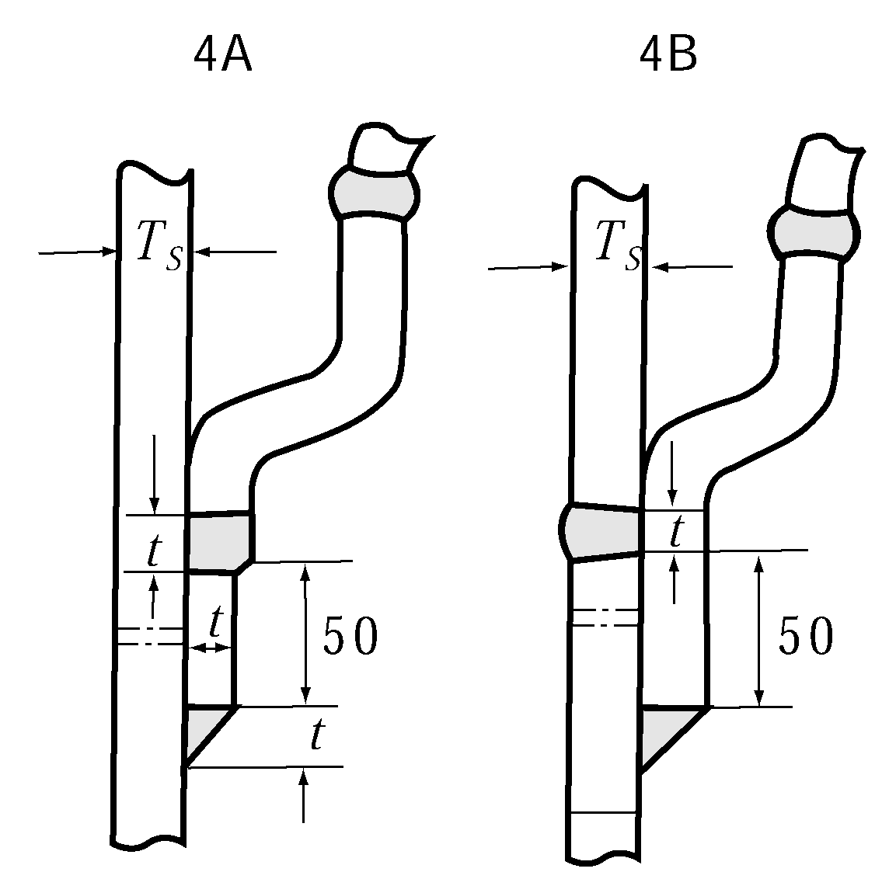
    **Fig 5.6.13** 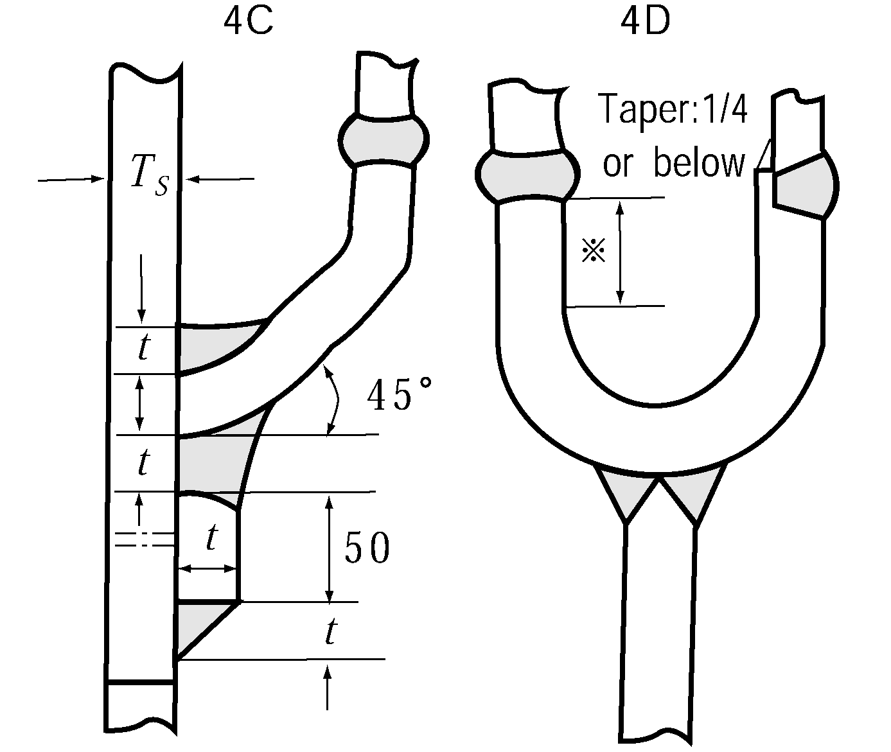
    **Fig 5.6.14**

    | $z$ | 1 | 2 | 4 | 6 | ≥ 8 |
    | --- | --- | --- | --- | --- | --- |
    | $C _{l}$ | 1.0 | 1.1 | 1.2 | 1.3 | 1.4 |

    | $R _{m}$ | $C _{w}$ |
    | --- | --- |
    | 400 | 1.03 |
    | 440 | 0.94 |
    | 480 | 0.91 |
    | 520 | 0.85 |
    | 560 | 0.79 |
    | 600 | 0.77 |
    | 640 | 0.74 |
    | ≥ 680 | 0.70 |
    | 720^1) | 0.66 |
    | ≥ 760^1) | 0.64 |
    | 1) Only for forged crank shafts. |   |

    | $R _{m}$ | $C _{w}$ |
    | --- | --- |
    | 370 | 1.20 |
    | 400 | 1.10 |
    | 500 | 1.08 |
    | 600 | 0.98 |
    | 700 | 0.94 |
    | ≥ 800 | 0.90 |
  - **(2)** Crankshafts are to include a satisfactory safety factor against fatigue failures. Various calculation methods may be used. Following gives one method for evaluation of safety against fatigue in the arm fillets. The method applies for crankshafts made of forged and cast steel and nodular cast iron intended for one or multistage compressors with the cylinders arranged in line, V or W.
    $\sigma _{b} \leq \frac{\sigma _{f}}{S}$
    $\sigma _{b}$ = the bending stress amplitude in the fillet ($\mathrm{N}/mm ^{2}$)
    $\sigma _{f}$ = the fatigue strength ($\mathrm{N}/mm ^{2}$)
    $S$ = the minimum safety factor
    For the fatigue criteria mentioned below, the following minimum safety factor applies:
    $S$ = 1.4
    This safety factor includes the influence of torsional stresses in the fillets, which for the sake of simplicity are neglected in this method.
    The fatigue strength is to be calculated as follows:
    $\sigma _{f} = (0.33 \sigma _{B} +40)k _{m}$
    $\sigma _{B}$ = ultimate tensile strength of the material ($\mathrm{N}/mm ^{2}$)
    $k _{m}$ = material factor according to **Table 5.6.7** of the Guidance

    | materials | $k _{m}$ |
    | --- | --- |
    | Forged steel | 1.0 |
    | Cast steel | 0.8 |
    | Nodular cast iron | 0.9 |

    The bending stress amplitude is to be evaluated as follows:
    $\sigma _{b} =0.7 \sigma _{nom} \alpha$
    - **(A)** The stresses in the crankpin fillet is to fulfil the following criterion:
- **0.** 7 = factor to correlate the pulsating bending stress range into an equivalent single amplitude reversed stress
  $\alpha$ = fatigue notch factor for bending
  $\sigma _{nom} = M _{B} /W _{B}$ ($\mathrm{N}/mm ^{2}$)
  $M _{B}$ = bending moment in the middle of the arm nearest the center of the bearing span
  $M _{B} = \frac{k _{d} \pi D ^{2} pab}{4L}$
  $D$ = cylinder bore (mm), $p$ = design pressure (MPa).
  For multicylinder arrangements on one bearing span, use the maximum of the individual $pD ^{2}$.
  $L$ = distance between the centers of two bearings (mm), (see **Fig 5.6.15** of the Guidance)
  $a$ = distance from the center of a bearing to the center of the arm nearest the center of the bearing span (mm), (see **Fig 5.6.15** of the Guidance)
  $b = L-a, (b \geq a)$, (mm)
  $k _{d}$ = design factor according to **Table 5.6.8** of the Guidance

  | Design | $k _{d}$ |
  | --- | --- |
  | In line | 1.00 |
  | V-90, W-90 | 1.15 |
  | V-60, W-60 | 1.50 |
  | V-45, W-45 | 1.75 |

  $W _{B} =BW ^{ 2} /6$
  $W _{B}$ = sectional modulus of the arm
  $B$ = width of the arm (mm), (see **Fig 5.6.15** of the Guidance)
  $W _{}$ = thickness of the arm (mm) (see **Fig 5.6.15** of the Guidance)
  The fatigue notch factor for bending is to be calculated as follows;
  $a = 1 + \eta ( \alpha _{th} -1)$
  $\eta$ = notch sensitivity factor
  $\eta = 0.62 +0.2 logR + \sigma _{y} 10 ^{-4} \log (400/R)$
  (if calculated > 1, $\eta$ = 1 applies)
  $\sigma _{y}$ = the yield strength of the material ($\mathrm{N}/mm ^{2}$)
  $R$ = the actual fillet radius (mm)
  $\alpha _{th}$ = theoretical stress concentration factor (referred to arm bending stress)
  $\alpha _{th} = 3.0 f(A/d) f(W/d) f(B/d) f(R/d)$
  $f(A/d) = 1 - 0.8 A/d$
  $f(W/d) = 1 + 2.2 (W/d - 0.35)$
  $f(B/d) = 1 + 0.4 (B/d - 1.45)$
  $f(R/d) = \frac{0.22}{\sqrt {R/d}}$
  $A$ = pin overlap (mm), (see **Fig 5.6.15** of the Guidance)
  $d$ = diameter of the crankpin (mm).
  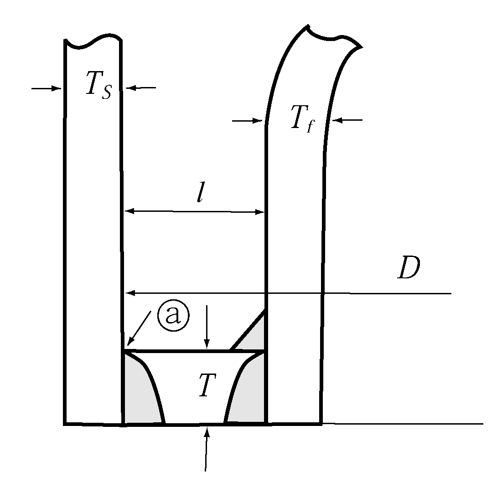
  **Fig 5.6.15 Crank throw for air compressor**

### Section 12 Refrigerating Machinery

#### 1201. General 【See Rule】

- **1.** **Application**
  - **(1)** In application to **1201. 1** (1) of the Rules, "the refrigerating machinery forming refrigerating cycle" contains compressor, condenser, receiver, evaporator, pipings and associated equipments, etc.
  - **(2)** The refrigerating machinery with compressors of 7.5 $\mathrm{rmkW}$ or less using *R*22, *R* 134*a*, *R* 404*A*, *R* 407*C*, *R* 410*A* or *R* 507*A* as the primary refrigerant is to be suitable for use, service condition and environment on board.
  - **(3)** Refrigerating machinery using *R* 717 as the primary refrigerant is to comply with the requirements specified in (4) to (14) given below, in addition to those specified in the Rules.
  - **(4)** Plans and documents to be submitted, in addition to those specified in **Pt 5, Ch 1, 209.** of the Rules are generally as the following :
    - **(A)** *R* 717 Refrigerant Piping Diagram
    - **(B)** Gas Detector Arrangement
    - **(C)** General Arrangement of Refrigerating Machinery Compartment
  - **(5)** General requirements of ammonia refrigerating machinery
    - **(A)** Pressure vessels used in refrigerating machinery is to be classed into Class 1 pressure vessels specified in **Pt 5, Ch 5, Sec 3** of the Rules, and the primary refrigerant pipes (hereinafter referred to as refrigerant pipes) are to be classified into Class I pipes specified in **Pt 5, Ch 6, Sec 1** of the Rules.
    - **(B)** The design pressure of pressure vessels and pipes which form the refrigerating machinery is not to be less than 2.3 $\mathrm{MPa}$ at the high pressure side and not to be less than 1.8 $\mathrm{MPa}$ at the low pressure side.
  - **(6)** Materials of ammonia refrigerating machinery
    - **(A)** Material capable of highly corrosion (copper, zinc, cadmium, or their alloys) and materials containing mercury are not to be used at locations where ammonia comes into contact.
    - **(B)** Nickel steel is not to be used in pressure vessels and piping systems.
    - **(C)** Cast iron valves are not to be used in the refrigerant piping system.
    - **(D)** Material for sea water-cooled condenser is to be selected considering the corrosion due to sea water.
    - **(E)** Where flat tanks of quick freezers(contact freezers) are manufactured by extrusion molding of aluminium alloy, the material is to be approved in accordance with **Ch 2, Sec 6** of **"Guidance for approval of Manufacturing Process and Type Approval, Etc"**.
  - **(7)** Piping arrangement of ammonia refrigerating machinery
    - **(A)** Refrigerant piping is not to pass through accommodation spaces.
    - **(B)** Pipe joints of the refrigerant piping system are to be butt welded as far as practicable.
    - **(C)** The refrigerant gas discharged from a pressure relief valve is to be absorbed in water, except when leading the gas to the low pressure side.
    - **(D)** If liquid level gauges made of glass are used at locations where pressure exists permanently, they are to comply with the following requirements ;
      - **(a)** Flat type glass is to be used in the liquid level gauge, and the construction is to be such that the gauge is adequately protected against external impacts.
      - **(b)** The construction of the stop valve for the liquid level gauge is to be such that the flow of liquid is automatically cut off if the glass breaks.
    - **(E)** The gas discharged from the purging valve is not to be discharged directly to the atmosphere, but absorbed in water.
    - **(F)** The discharge pipes of cooling sea water for the condenser are to be the independent pipes. The piping is to be led directly overboard without passing through accommodation spaces.
  - **(8)** Control and alarm system of ammonia refrigerating machinery
    Refrigerant compressors are to be provided with means for automatically stopping the compressor when the pressure on the high pressure side of the refrigerant piping system becomes excessively high. Also, an alarm system which generates visible and audible alarms when this means are in operation is to be installed in the refrigerating machinery compartment and monitoring position.
  - **(9)** Machinery compartment using ammonia as a refrigerant
    - **(A)** The compartment where the compressor, receiver and condenser are installed (hereinafter referred to as **refrigerating machinery compartment**) is to be special compartment isolated by gastight bulkheads and decks from all other compartments so that leaked ammonia does not enter other compartments. Also, the refrigerating machinery compartment is to be provided with doors which comply with the following requirements :
      - **(a)** Except for small compartments, at least two access doors are to be provided in the refrigerating machinery compartment as far apart as possible from each other.
      - **(b)** Access doors not leading to weather deck are to be of highly tight and self-closing type.
      - **(c)** Access doors are to be capable of being operated easily and are to open outward.
    - **(B)** Penetrations on gastight bulkheads and decks where cables and piping from the refrigerating machinery compartment pass through, are to be of gastight construction.
    - **(C)** Passages leading to the refrigerating machinery compartment are to be isolated from accommodation spaces, hospital room or control room by gastight bulkheads and decks.
    - **(D)** An independent drainage system is to be provided in the refrigerating machinery compartment so that the drainage is not discharged into open bilge wells or bilge ways of other compartments.
  - **(10)** Ammonia gas expulsion system
    A gas expulsion system consisting of ventilation system and water screening system is to be installed in the refrigerating machinery compartment, in accordance with (A) to (B) below so that gas leaked out accidentally can be expelled quickly from the refrigerating machinery compartment.
    - **(A)** A exhaust type mechanical ventilation system which complies with the following requirements as a rule, is to be installed in the refrigerating machinery compartment so that this space can be ventilated all the time.
      - **(a)** The ventilation system is to have adequate capacity to ensure at least 30 air changes per hour in the refrigerating machinery compartment.
      - **(b)** The ventilation system is to be independent of other ventilation systems on board the ship, and is to be capable of being operated from outside the refrigerating machinery compartment.
      - **(c)** Exhaust outlets are to be installed properly so as to prevent exhaust air from flowing in through air intake openings, openings of accommodation spaces, service spaces and control stations.
      - **(d)** Ventilation fan of non-sparking type is to be provided and complied with the requirements specified in **Pt 8, Ch 3, 104.** of the Rules.
    - **(B)** All doors of the refrigerating machinery compartment are to be provided with water screening system which can be operated from outside the compartment.
  - **(11)** Ammonia gas detection and alarm systems
    For crew's safety, fixed type ammonia gas detection and alarm systems are to be provided to activate alarms inside and outside of the refrigerating machinery compartment. And, the detector is to activate an alarm when the ammonia gas concentration exceeds 25ppm.
  - **(12)** Electrical equipment for ammonia refrigerating machinery
    - **(A)** Electrical equipment in the refrigerating machinery compartment required to be operated in the event of leakage accidents, gas detection and alarm system and emergency lights are to be of certified safe types for use in the flammable atmosphere concerned.
    - **(B)** In addition to the alarm systems in (11), an leakage alarm is to be activated at the ammonia gas concentration not more than 4.5% in refrigerating machinery compartment. And, electrical equipment in the refrigerating machinery compartment other than certified safe types, are required to switch off automatically by means of circuit breakers outside the refrigerating machinery compartment when the gas concentration is sustained over an appointed periods
  - **(13)** Safety and protective equipment for ammonia refrigerating machinery
    Safety and protective equipment for ammonia refrigerating machinery as given below, as a rule, are to be provided, and are to be stored at locations outside the refrigerating machinery compartment so that they can be easily retrieved in the event of leakage of the refrigerant. Storage locations are to be marked with signs so that they can be identified easily.
    - **(A)** Protective clothing (helmet, safety boots, gloves, etc.) × 2
    - **(B)** Self-contained breathing apparatus (capable of functioning for at least 30 minutes) × 2
    - **(C)** Protective goggles × 2
    - **(D)** Eye washer × 1
    - **(E)** Boric acid
    - **(F)** Emergency electric torch × 2
    - **(G)** Electric insulation resistance meter × 1
  - **(14)** Requirements for fishing vessels, etc.
    - **(A)** Refrigerating installations provided in fishing vessels of length under 55 $\mathrm{m}$ or refrigeration machinery retaining ammonia not more than 25 $\mathrm{kg}$ are to be according to (a) to (e) given below, notwithstanding (9) to (13).
      - **(a)** Refrigerating machinery may be installed in the engine room. In this case, drain trays are to be provided at a position lower than the refrigerating machinery.
      - **(b)** Ammonia gas exclusion system is to comply with the following.
      - **(i)** Ventilation system with special hoods above the refrigerating machinery is to be provided for exhaust capable of ventilation without accumulation of ammonia gas. The fans of the ventilation systems are to be independent of those of engine room ventilation systems.
        - **(ii)** A water sprinkler system capable of absorbing enough leaked ammonia gas is to be provided in the vicinity of the space where the refrigerating machinery is installed. Sprinkler hoses and water spraying nozzles are to be positioned so that water can be dispersed quickly when a leak occurs.
      - **(c)** Ammonia gas detection and alarm systems are to be provided to activate visible and audible alarms in the monitoring room (or control room) and engine room entrance. And, the detector is to activate an alarm when the ammonia gas concentration exceeds 25ppm. In this case, the detectors are to be installed in the vicinity of the upper parts of the refrigerating machinery, exhaust outlets and other locations deemed necessary by the Society.
      - **(d)** As far as possible, electrical equipment are not to be installed in the vicinity of the refrigerating machinery.
      - **(e)** Two(2) sets of protective clothing (helmet, safety boots, gloves, etc.) and two(2) sets of self-contained breathing apparatus (capable of functioning for at least 30 minutes) are to be provided. And, if the escape route from the monitoring room (or control room) passes through the engine room, one of the self-contained breathing apparatus sets is to be provided in the monitoring room (or control room).
    - **(B)** Above (A) may be applied to the refrigerating installations provided in fishing vessels of length 55 $\mathrm{m}$ and above only when the administration specially accepts installations of the ammonia refrigerating installations in machinery spaces.

### Section 13 Hydraulic System

#### 1304. Hydraulic cylinders (2018)

- **1.** In application to **1304. 2** (4) of the Rules, the requirements specified otherwise by the Society mean to submit and to be approved in accordance with the following. For hydraulic cylinders used for pushing, the acceptance criteria of buckling load $P _{E}$ is to comply with the following. **【See Rule】**
  $P _{E} \geq 4 \cdot P _{A}$ (kN)
  A lower buckling safety factor than 4.0 may be accepted for more accurate calculation methods as deemed appropriate by the Society. However, the lowest acceptable safety factor is not less than 2.7 regardless of calculation method.
  $P _{A}$ = Actual maximum load (kN)
  $P _{E}$ = Buckling load as given by the following;
  $P _{E} = \frac{\pi ^{2} E}{1,000 L Z}$ (kN)
  $E$ = Young's modulus of elasticity ($\mathrm{N}/mm ^{2}$)
  $L$ = Length of fully extracted hydraulic cylinder between mountings, $L _{1} +L _{2}$ (mm)
  $L _{1}$ = Length of the cylinder tube from the center of its mounting (mm)
  $L _{2}$ = Visible length of the piston rod in fully extracted position from centre of its mounting (mm)
  $L$, $L _{1}$, $L _{2}$ are to be calculated by multiplying the effective length coefficient $K$ depending on the fixation types of the cylinder, as given by the following;
  Simply supported at both ends : $K=1$
  One side simply supported and the other side fixed : $K= \frac{1}{\sqrt {2}}$
  Fixed at both ends : $K=0.5$
  $Z$ = A shape factor obtained by the following;
  $Z= \frac{L _{1}}{I _{1}} + \frac{L _{2}}{I _{2}} +( \frac{1}{I _{2}} - \frac{1}{I _{1}} ) \times \frac{L}{2 \pi} \mathrm{\sin} it(2 \pi \frac{L _{1}}{L} )$
  $I _{1}$ = Moment of inertia for the cylinder tube as given by the following;
  $I _{1} = \frac{\pi (D _{o} ^{4} -D _{i} ^{4} )}{64}$ ($\mathrm{mm} ^{4}$)
  $D _{o}$ = Outer diameter of the cylinder tube (mm)
  $D _{i}$ = Inner diameter of the cylinder tube (mm)
  $I _{2}$ : Moment of inertia for the piston rod as given by the following;
  $I _{2} = \frac{\pi (d _{o} ^{4} -d _{i} ^{4} )}{64}$ ($\mathrm{mm} ^{4}$)
  $d _{o}$ = Outer diameter of the piston rod (mm)
  $d _{i}$ = Inner diameter of the piston rod (mm)

#### 1306. Test and Inspections

- **1.** In the hydraulic test of the hydraulic motor, for hydraulic motors for pumps which are not related to ship’s safety and propulsion as a special structure (eg submerged type), witness inspection may be omitted where the hydraulic test reports are submitted to this Society and is accepted by this Society. **【See Rule】**

### Section 14 Tests and Inspections

#### 1401. Hydraulic tests of auxiliary machinery

- **1.** Capacity tests
  In application to **1401. 2** (1) of the Rules, the capacity test may be omitted for the remainder of the design, except for the first example of a particular design series for the auxiliary machinery designed the same as first example. **【See Rule】**

#### 1402. Hydrostatic tests of valves and pipe fittings 【See Rule】

- **1.** In application to **1402. 1** of the Rules, the hydrostatic test of following valves and pipe fittings may be omitted.
  - **(1)** Pipe flanges and pipe pieces(elbow, reducer, tee, bend, socket, etc.), etc.
  - **(2)** Valves and pipe fittings not exceeding 25 $\mathrm{A}$
- **2.** In application to **1402. 2** of the Rules, the valve means valve body.
- **3.** Considering the characteristics and purpose of valves, scoop valves may be subjected to a leak test at pressure side only.
- **4.** Dimension and visual inspection may be omitted for the valves and pipe fittings not exceeding 25 $A$.

#### 1403. Hydrostatic tests of fuel tanks 【See Rule】

- **1.** When hydrostatic test is replaced by gastight tests, the pressure of gastight test is to be 0.02 $\mathrm{MPa}$.

#### 1404. Tests on workmanship of pipes 【See Rule】

- **1.** **Welding procedure qualification tests** Welding procedure qualification tests specified in **1404. 1** of the Rules are to comply with **Pt 2, Ch 2, Sec 4** of the Guidance.
- **2.** Welding joints of hydraulic pipes belong to Class I and passed through the spaces other than engine room, cargo pump room, steering gear room and accommodation space may be applied with the requirements for pipes belong to Class II specified in **1404. 2** of the Rules.
- **3.** RST 422, 423 or 424 used for design temperature 550 °C and over, and belong to Grade 4 of steel pipes for pressure piping, specified in **Pt 2, Ch 1** of the Rules and over are to be carried out hydrostatic test by 2 times the design pressure. However, the test pressure $P _{h}$ is not required to be more than the value calculated by the following formula. And in case where a bent of pipes, tee, etc. have a risk of excessive stress at the test, the test pressure may be reduced to 1.5 times the design pressure.
  $P _{h} = \frac{378t}{D-t} (\mathrm{MPa})$
  where
  $D$ : Outside diameter of pipe ($\mathrm{mm}$)
  $t$ : Thickness of pipe ($\mathrm{mm}$)
- **4.** When water residue by the hydraulic test completion of shipboard installation of piping systems may not be desirable, the hydraulic test may be omitted in case where adequate non-destructive tests are carried out on welded joints with results free from defects.
- **5.** In application to **1404. 3.** (6) of the Rules, the term "at the discretion of the Society depending on the application" means the following requirements, etc.
  - **(1)** As piping systems without welding processing, hydrostatic test of piping systems except that conveying toxic media or services where fatigue, severe erosion or crevice corrosion, etc is expected to occur may be waived.

#### 1405. Tests of piping system on board (2024) 【See Rule】

- **1.** In application to **1405. 1.** (2) of the Rules, "tests by hydrostatic pressure" are to be in accordance with the following.
  - **(1)** In principle, tests by hydrostatic pressure are to be carried out hydrostatic tests using liquid such as water, etc.
  - **(2)** In general, airtight tests instead of hydrostatic test are not permitted. Where it is impracticable to carry out the required hydrostatic test(such as water sensitive systems, etc.), airtight tests may be considered. In certain circumstances, a combined hydrostatic–pneumatic strength test may also be applied, where the system is partially filled with water and the free space above is pressurized with a test gas (typically air or nitrogen). When pneumatic tests cannot be avoided, the safety precautions in IACS Rec. 140, Part F, are to be observed.
  - **(3)** In such case, the procedure for carrying out the airtight test, having regard to safety of personnel, is to be submitted to the Surveyor. 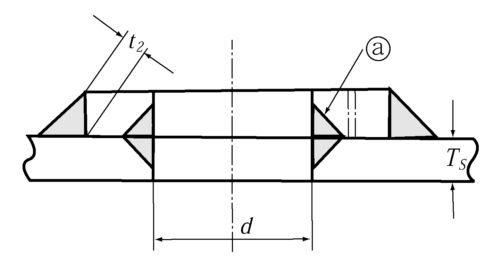
