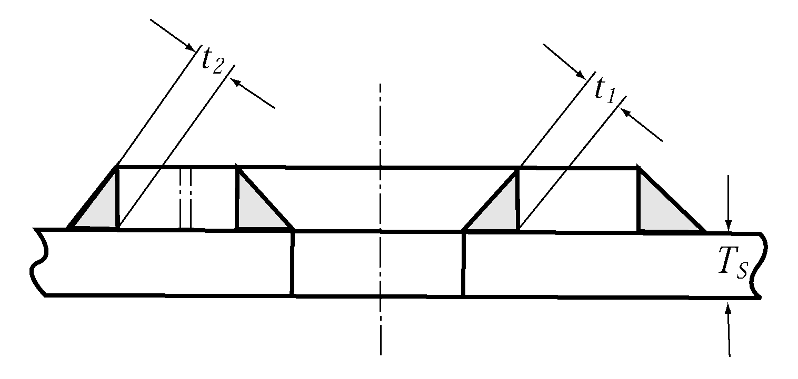
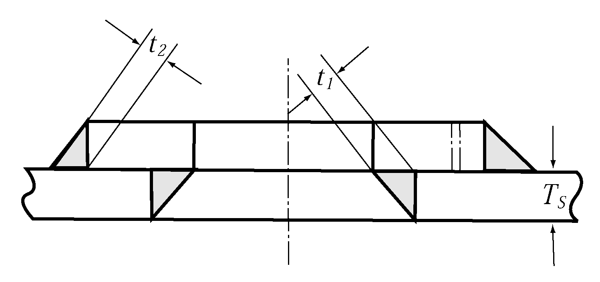
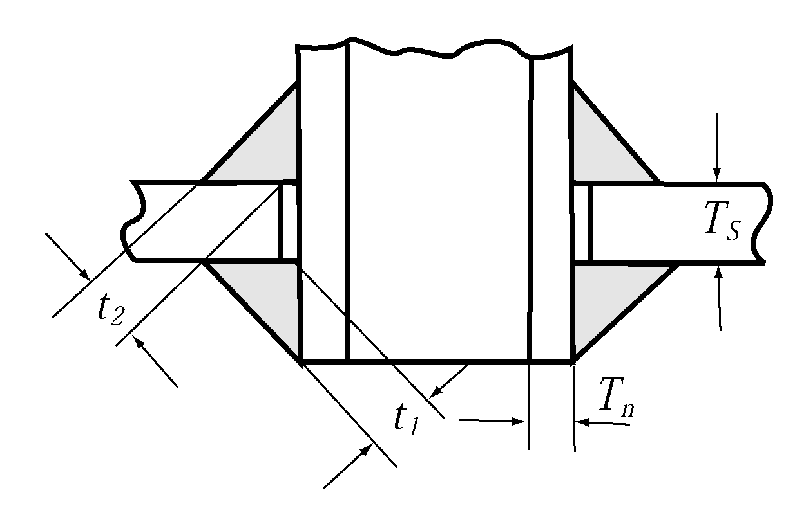
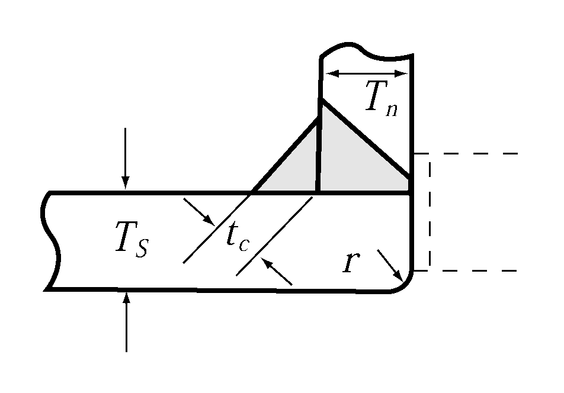
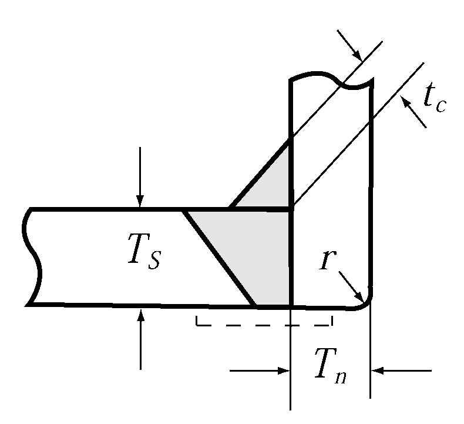

# PART 5 Machinery Installations

> RULES FOR CLASSIFICATION OF STEEL SHIPS / RA-05-E / 2025 / EN / Guidance

## CHAPTER 7 STEERING GEARS

### Section 1 General

#### 101. Application 【See Rule】

Manual steering gears are to be in accordance with the requirements of **Pt 5, Ch 7, Sec 1, 201.** through **203., 208.** through **210., 301., Sec 4** (excluding **409. 2**) and **Sec 5** of the Rules and the relevant requirements of the Guidance.

#### 102. Terminology 【See Rule】

In **102. 1** (3) (A) of the Rules, the motor for electric steering gears is to be considered as part of power unit and actuator.

#### 103. Drawings and documents 【See Rule】

Operating instructions for hydraulic type steering gear are to include informations about importance of hydraulic fluid quality and its influence to probability of hydraulic locking possibility of two simultaneously operated power units. The operating instructions of same contents as above-mentioned ones, are to be kept on the bridge.

#### 104. Display of operating instructions 【See Rule】

In application to **104. 2** of the Rules, the “appropriate instructions for emergency procedures” are to simply indicate emergency procedures corresponding to the design of steering gear (for example, to shut down the failed system indicated by the alarming system), and are to be fitted at a suitable place on steering control post on the navigation bridge where applicable.

### Section 2 Performance and Arrangement

#### 201. Number of steering gears 【See Rule】

- **1.** In case where ships whose required upper stock diameter is not more than 120 $\mathrm{mm}$ according to **Pt 4, Ch 1** of the Rules and engaged in the service in smooth water area, or ships with a gross tonnage less than 50 $\mathrm{t} ons$, provide that spare parts liable to wear down such as packings, bearings are provided where the main steering gear is operated by power, the auxiliary steering gear required by **201.** of the Rules may be omitted.
- **2.** In case where the auxiliary steering gear as specified in **201. 1** of the Rules is of hydraulic type, the rudder actuator can serve in common with that for the main steering gear. Further, part of the hydraulic piping of the rudder actuator of the main steering gear may be used in common with that for the auxiliary steering gear. In this case, but the pipe length of the part of common use is to be as short as practicable.

#### 202. Performances of main steering gear 【See Rule】

- **1.** In application to **202. 2** of the Rules, the diameter specified in **Pt 4, Ch 1** of the Rules is to be taken as having been calculated for upper rudder stock of mild steel with a yield strength of 235 $\mathrm{N}/mm ^{2}$ (i.e. with a material factor $K _{s}$ = 1).

#### 203. Performances of auxiliary steering gear 【See Rule】

- **1.** In application to **203. 2** of the Rules, the diameter specified in **Pt 4, Ch 1** of the Rules is to be taken as having been calculated for upper rudder stock of mild steel with a yield stress of 235 $\mathrm{N}/mm ^{2}$ (i.e. with a material factor $K _{s}$ = 1).

#### 204. Piping 【See Rule】

- **1.** In case of steering gears complied with the following, the requirements of **204. 5** and **6** of the Rules may not be applied.
  - **(1)** Steering gears equipped in ships with a gross tonnage less than 500 $\mathrm{t} ons$
  - **(2)** Steering gears equipped in ships engaged in domestic coastal or smooth water service area (excluding where auxiliary steering gear is omitted by **201. 2** of the Rules)

#### 206. Alternative source of power 【See Rule】

- **1.** In case of steering gears complied with the following, the requirements of **206.** of the Rules may not be applied.
  - **(1)** Steering gears equipped in ships with a gross tonnage less than 500 $\mathrm{t} ons$, or
  - **(2)** Steering gears equipped in ships engaged in domestic coastal or smooth water service area

#### 207. Electric installations for electric and electro-hydraulic steering gear 【See Rule】

- **1.** In case of manual auxiliary steering gears for a ship which SOLAS is not applicable to, the power supply circuit from the main switchboard to the steering gear may be one circuit.
- **2.** In case of steering gears complied with the following, the requirements of **207. 1, 5** (excluding short circuit protection) and **7** of the Rules may not be applied.
  - **(1)** Ships with a gross tonnage less than 500 $\mathrm{t} ons$, or
  - **(2)** Ships engaged in domestic coastal or smooth water service area
- **3.** In application to **207. 5** and **6** of the Rules, steering gear motor circuits which are limited to full load current via an electronic converter are exempt from the requirement to provide protection against excess current, including starting current, of not less than twice the full load current of the motor. In this case, the required overload alarm is to be set to a value not greater than the normal load of the electronic converter.
- **4.** Electric motors for electric steering gear power unit are to be at least of S3 40 % with intermittent periodic duty and electric motors for electro-hydraulic steering gear power unit are to be at least of S6 25 % with continuous operation periodic duty according to IEC 60034-1. *(2020)*

#### 209. Means of communication 【See Rule】

- **1.** Means of communication between the navigating bridge and the steering gear compartment are not to depend solely on the shipboard telephone system for general purpose.
- **2.** In case of ships complied with the following, the means of communication specified in **209.** of the Rules and above **1** may be alternated with appropriate means of communication.
  - **(1)** Ships with a gross tonnage less than 500 $\mathrm{t} ons$, or
  - **(2)** Ships engaged in domestic coastal or smooth water service area

### Section 3 Controls

#### 301. General (2017) 【See Rule】

- **1.** It may be acceptable that only one set of floating lever or other mechanical follow-up control system is provided.
- **2.** The control system specified in the requirements of **301. 1** (2) of the Rules is to comply with following requirements.
  - **(1)** The control system is in principle to be of the follow-up type.
  - **(2)** Control systems and components are to be so designed and arranged that the failure of one of them will not render the other one inoperative.
    - **(A)** Wires, terminals and the components for duplicated steering gear control systems installed in units, control boxes, switchboards or bridge consoles are to be separated as far as practicable. Where physical separation is not practicable, separation may be achieved by means of a fire retardant plate.
    - **(B)** All electric components of the steering gear control systems are to be duplicated. This dose not require duplication of the steering wheel or steering lever.
    - **(C)** If a joint steering mode selector switch (uniaxial switch) is employed for both steering gear control systems, the connections for the circuits of the control systems are to be divided accordingly and separated from each other by an isolating plate or by air gap.
    - **(D)** In the case of double follow-up control, the amplifiers are to be designed and fed so as to be electrically and mechanically separated.
    - **(E)** Control circuits for additional control systems, e.g. steering lever or autopilot are to be designed for all-pole disconnection.
    - **(F)** The feed-back units and limit switches, if any, for the steering gear control systems are to be separated electrically and mechanically connected to the rudder stock or actuator separately.
    - **(G)** Hydraulic system components in the power actuating or hydraulic servo systems controlling the power systems of the steering gear (e.g. solenoid valves, magnetic valves) are to be considered as part of the steering gear control system and are to be duplicated and separated. Hydraulic system components in the steering gear control system that are part of a power unit may be regarded as being duplicated and separated when there are two or more separate power units provided and the piping to each power unit can be isolated.
- **3.** Amplifiers, relays, etc., included in the control system may be used also for the automatic pilot systems.
- **4.** In electro-hydraulic steering gears equipped with power units comprising variable-displacement pumps, two sets each of hydraulic servo cylinders and associated hydraulic system (including pump driving electric motors and control equipment) or electric servo motors for controlling displacement of the pump plungers are to be provided.
- **5.** In case of ships complied with the following, the means of communication specified in **301. 3** of the Rules may not be applied.
  - **(1)** Ships with a gross tonnage less than 500 $\mathrm{t} ons$, or
  - **(2)** Ships engaged in domestic coastal or smooth water service area
- **6.** In application to **301. 4** of the Rules, in general, following cases are not considered as the case of “where hydraulic locking, caused by a single failure, may lead to loss of steering”.
  - **(1)** Steering systems with performance at least equal to that required for an auxiliary steering gear are fitted as stand-by systems and are operable from navigating bridge. In this case, the stand-by systems are so designed not to run parallel using an interlocking devices, etc.
  - **(2)** Not less than 3 systems are operated parallel and, in the case of a single failure, steering capability at least equal to that required for an auxiliary steering gears are maintained.
  - **(3)** Steering gears designed to avoid leading to loss of steering by by-passing the failed system automatically using duplicated control valve system. This arrangement is subject to special consideration with respect to reduced reliability due to increased complexity.
- **7.** In application to **301. 4** of the Rules, the "audible and visual alarm, which identifies the failed system" is to be activated in following conditions in general.
  - **(1)** Position of the variable displacement pump control system does not correspond with given order.
  - **(2)** Incorrect position of 3-way full flow valve or similar in constant delivery pump system is detected.
- **8.** The location of sensors of alarm specified in aforementioned **7**, are to be as near actuator as possible. For the part of steering gears, where two or more pumps are mechanically interconnected by floating bar or similar, their breakage may not be considered. The example of acceptable location of alarm sensors are indicated in **Fig 5.7.1**.

  |  **(a) Separated system** **(a) Separated system** |  : denoted location of alarm sensors 1. Main pump of variable displacement type. 2. Pilot pump 3. Control actuator 4. Control linkage 5. Solenoid controlled 3-way valve. 6. Solenoid. |
  | --- | --- |

  |  **(b) Mechanically interconnected system** **(b) Mechanically interconnected system** | (Note) Where systems are so designed not to run 1A & 1B IN (a) nor 2A & 2B in (b), the alarm devices are not required. |
  | --- | --- |

  **Fig 5.7.1 Example location of hydraulic locking alarm sensors**

#### 303. Change over from automatic to manual steering 【See Rule】

- **1.** At any rudder angle, the change over from automatic to manual steering is to be available within 3 seconds by two attempts of control operation at the most.
- **2.** The change over from automatic to manual steering is to be available under any circumstances including the case of failure of the automatic pilot.
- **3.** The device to change over from automatic to manual steering is to be installed close to the normal steering position.

### Section 4 Materials, Constructions and Strength

#### 401. Materials 【See Rule】

- **1.** In application to **401. 2** of the Rules, gray cast iron may be accepted for redundant parts with low stress level, excluding cylinders, upon special consideration. *(2025)*
- **2.** In application to **401. 4** of the Rules, the term "comply with the requirements in the recognized standards" means that comply with Korean Industrial Standards or equivalent thereto.

#### 407. Tillers, etc.

- **1.** In the case where the scantlings of arms are reduced in accordance with **407. 2** (4) of the Rules, following requirements are to be complied with. **【See Rule】**
  - **(1)** For the tillers designed so that equal torque is applied on each arm : Required values of section modulus Z and sectional area A specified in **407. 2** (2) and (3) of the Rules respectively, may be divided by number of arms ($n$).
  - **(2)** For the tillers designed so that unequal torque is applied on each arm : Required values of section modulus Z and sectional area A specified in **407. 2** (2) and (3) of the Rules respectively, may be multiplied by $a$. Where, “$a$” means the ratio of the torque applied to the arm to the total torque.
- **2.** The scantling of tillers for the exclusive use of auxiliary steering gear are to have the strength assures 1/2 or more of that specified in the requirements of **407. 2** of the Rules. **【See Rule】**
- **3.** In application to **407. 3** (2) of the Rules, B(breadth of vane) is to be referred to **Fig 5.7.2** of the Guidance. **【See Rule】**
  
  **Fig 5.7.2 Rotary vane type rudder actuator**
- **4.** The wording “where the fitting methods which are acceptable to the Society" specified in **407. 4** of the Rules means a method which is comply with the "Cone couplings of rudder stocks and rudder main pieces" specified in **Pt 4, Ch 1, 703. 2** of the Rules. **【See Rule】**

#### 409. Buffers 【See Rule】

In case of ships having smooth water service area and ships with a gross tonnage less than 500 tons, the buffers required by **409.** of the Rules may be omitted.

### Section 5 Testing

#### 503. Sea trials

- **1.** In Application to **503. 1** (1) of the Rules, the trials for steering capabilities may be conducted in accordance with procedures in Section 6.1.5.1 of ISO 19019. **【See Rule】**
- **2.** For **503. 1** (1) (C) of the Rules, it is to comply with one of the following methods. *(2017)*
  - **(1)** The rudder torque at the trial loading condition have been reliably predicted (based on the system pressure measurement) and extrapolated to the full load draught condition using the following method to predict the equivalent torque and actuator pressure at the full load draught. **【See Rule】**
    $Q _{F} =Q _{T} \cdot \alpha$
    $\alpha =1.25( \frac{A _{F}}{A _{T}} )( \frac{V _{F}}{V _{T}} ) ^{2}$
    where :
    $\alpha$ = Extrapolation factor
    $Q _{F}$ = Rudder stock moment for the full load draught and maximum service speed condition
    $Q _{T}$ = Rudder stock moment for the trial condition
    $A _{F}$ = Total immersed projected area of the movable part of the rudder in the full load condition
    $A _{T}$ = Total immersed projected area of the movable part of the rudder in the trial condition
    $V _{F}$ = Contractual design speed of the vessel corresponding to the maximum continuous revolutions of the main engine at the full load draught
    $V _{T}$ = Measured speed of the vessel (considering current) in the trial condition
    Where the rudder actuator system pressure is shown to have a linear relationship to the rudder stock torque the above equation can be taken as:
    $P _{F} =P _{T} \cdot \alpha$
    where :
    $P _{F}$ = Estimated steering actuator hydraulic pressure in the deepest full load condition
    $P _{T}$ = Maximum measured actuator hydraulic pressure in the trial condition
    Where constant volume fixed displacement pumps are utilised then the regulations can be deemed satisfied if the estimated steering actuator hydraulic pressure at the full load draught is less than the specified maximum working pressure of the rudder actuator. Where a variable delivery pump is utilised pump data should be supplied and interpreted to estimate the delivered flow rate corresponds to the full load draught in order to calculate the steering time and allow it to be compared to the required time.
    Where $A _{T}$ is greater than $0.95A _{F}$ there is no need for extrapolation methods to be applied.
  - **(2)** Alternatively the designer or builder may use computational fluid dynamic(CFD) studies or experimental investigations to predict the rudder stock moment at the full load draught condition and service speed. These calculations or experimental investigations are to be to the satisfaction of the Society.
- **3.** In application to **503. 1** (9) of the Rules, the wordings “steering gear is designed to avoid hydraulic locking” means steering gears designed not to run parallel using an interlocking devices, etc. or steering gears designed to maintain their steering capability or to recover them by by-passing the failed system automatically. For the steering systems which are dispensed with the consideration of hydraulic locking because of that considerations of the breakages at mechanical linkage of floating bar or similar are waived, these demonstrations may not be carried out. **【See Rule】**

### Section 6 Additional Requirements Concerning Tankers of 10,000 Gross Tonnage and Upwards and Other Ships of 70,000 Gross Tonnage and Upwards

#### 604. Non-destructive tests 【See Rule】

In application to **604.** of Rules, where the procedure and acceptance criteria for the non-destructive testing considered by the Society means that the requirement may be in accordance with **Pt 2, Annex 2-2** & **Annex 2-5** of the Guidance considering their materials, kinds, shapes and stress condition be subjected. 
