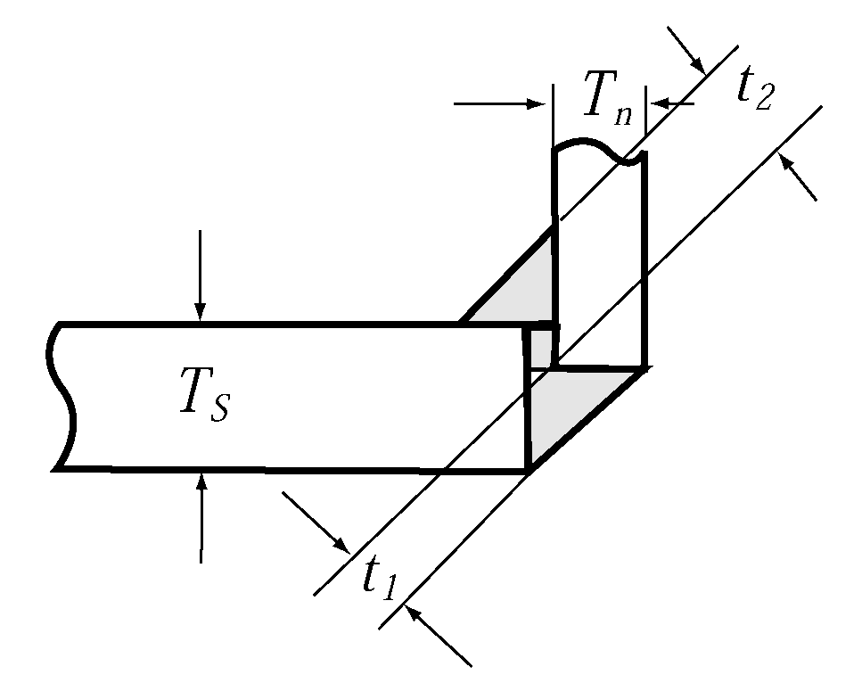

# PART 5 Machinery Installations

> RULES FOR CLASSIFICATION OF STEEL SHIPS / RA-05-E / 2025 / EN / Guidance

## CHAPTER 8 WINDLASSES AND MOORING WINCHES

### Section 1 General

#### 101. Application 【See Rule】

- **1.** In application to **101. 1** of the Rules, manual operating windlasses are to be complied with the following.
  - **(1)** In the case of windlasses complied with the following, the manual operating windlasses may be accepted.
    - **(A)** In the case of windlasses for anchor with weight 250 *kgf* or less
    - **(B)** In the case of windlasses for anchors with weight 500 *kgf* or less equipped on barges engaged in domestic service area and ships engaged in smooth water service area
  - **(2)** Manual operating windlasses are to be capable of lifting anchor and chain at the nominal speed of at least 0.033 $\mathrm{m}/s$*.* In this case, the human power driving them is to be 147 $\mathrm{N}$ or less when their crank radius of 350 $\mathrm{mm}$ is rotated about 30 $\mathrm{rpm}$.
  - **(3)** Materials used in the major parts are complied with Korean Industrial Standards or other recognized standards.
  - **(4)** For manual operating windlasses, brake test and load test are to be carried out. The test procedures are to be applied with appropriate modifications of the requirements of **206.** of the Rules. However, the nominal speed and the human power driving them are to be applied with (2) above.

#### 102. Materials 【See Rule】

- **1.** In application to **102. 1** of the Rules, "major parts" means the following.
  - **(1)** Driving shafts and gears of power transmission system (Mooring winch)
  - **(2)** Chain lifters and shafts of chain lifter (Windlass)
  - **(3)** Rope drums and shafts of rope drum (Mooring winch)
  - **(4)** Brake bands and spindles
  - **(5)** Chain stoppers (Windlass)

### Section 2 Windlasses

#### 206. On-board tests (2018) 【See Rule】

- **1.** In application to **206. 2** of the Rules, where the depth of water deeper than the total length of 3 lengths of anchor chain and anchor is difficult to be ensured geographically at sea trial, load test may be carried out according to the following. However, in this case, the tests are to be carried out at the deepest area among the sea trial area.
  - **(1)** Symmetrical double cable-lifter windlasses
    - **(A)** The anchor chain cable of each side is to be lifted until the position that the anchor gets to the surface of water. And the anchor of each side is to be fallen in the water until 1 length of chain cable is submerged in water but anchor is not got to sea-bed.
    - **(B)** The average speeds are to be measured when each 1 length of both sides anchor chain is lifted simultaneously, and are to be 0.15 $\mathrm{m}/s$ or over at the conditions mentioned above (A).
  - **(2)** Single cable lifter windlasses
    Average speed is to be measured by one of the following after confirming the (1) (A) above.
    - **(A)** Where a hydraulic pump unit is used to lift simultaneously both sides of anchor chain cables, the average speed, when each 1 length of both sides anchor chains are lifted simultaneously, is to be 0.15 m/s or over at the test condition mentioned in (1) (A) above.
    - **(B)** Where each hydraulic pump unit is used to lift relevant side of anchor chain cable, the average speed of recovery of chain cables, when the maximum length of anchor chain cables are released but freely suspended at commencement of lifting, is to be 0.15 $\mathrm{m}/s$ or over by comparing with the measurements for capability particulars and the estimated performance curve. In case where the result is suspected by comparing with performance curve, a retest may be requested.
    - **(C)** For single cable lifter windlass driven by an electric motor or steam, appropriately modified requirements on the (B) above are to be applied.
  - **(3)** Couple windlasses
    Requirements of above (1) apply, with appropriate modifications, to couple windlasses. In this case, 2 sets of prime mover may be used for lifting each side anchor or both sides anchors simultaneously. 
