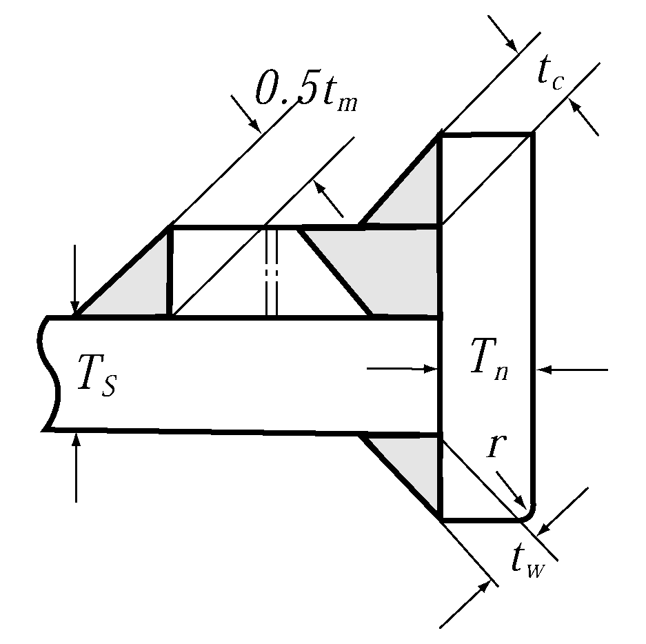
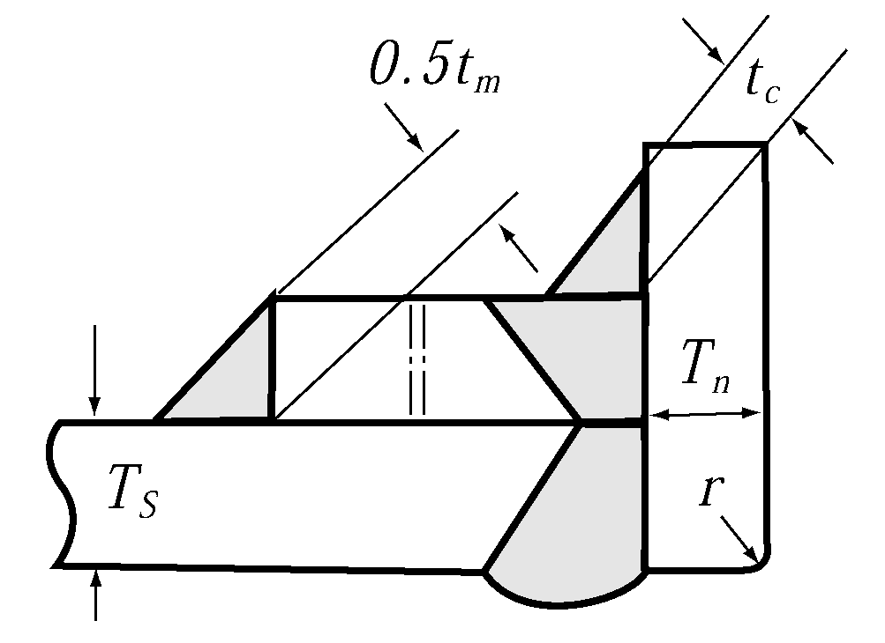
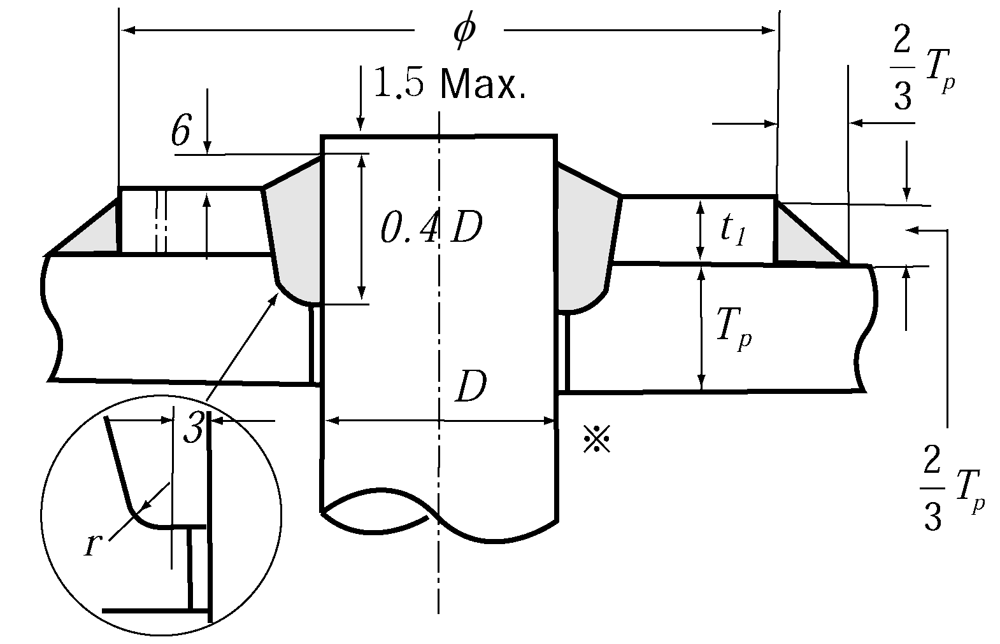

# PART 5 Machinery Installations

> RULES FOR CLASSIFICATION OF STEEL SHIPS / RA-05-E / 2025 / EN / Guidance

## Annex 5-1 Requirements for Performance and Arrangement of Non-traditional Steering Sys. (2023)

### 2. Definitions

The definitions of non-traditional steering systems, such as but not limited to, azimuth thrusters or water-jet propulsion systems, are as follows. (See **Fig. 1 ~ Fig. 3**)

#### (1) Steering system is a ship’s directional control system, including steering gear, steering gear control system and rudder (including the rudder stock) if any, or any equivalent system for applying force on the ship hull to cause a change of heading or course.

#### (2) Steering-propulsion unit is a unit intended for both propulsion and steering of the ship (for example, an azimuth thruster or a rotating podded electrical thruster).

#### (3) Steering gear is the machinery, actuators, power units, and auxiliary equipment applied to turn the rudder or thruster or equivalent about the axis of rotation in both directions for the purpose of steering the ship.

#### (4) Steering actuating system consists of a steering gear power unit, a steering actuator and, for hydraulic or electrohydraulic steering gears, the hydraulic piping.

#### (5) Steering actuator is a steering gear component which converts power into mechanical action to control the rotation of the rudder or thruster or equivalent.

- **(A)** In case of electric steering: electric motor and driving pinion
- **(B)** In case of electro hydraulic steering: hydraulic motor and driving pinion

#### (6) Declared steering angle limits are the operational limits in terms of maximum steering angle, or equivalent, according to manufacturers' guidelines for safe operation, also taking into account the ship's speed or propeller torque/speed or other limitation; the "declared steering angle limits" are to be declared by the steering system manufacturer for each ship specific non-traditional steering means. ship manoeuvrability tests, such as those in the Standards for ship manoeuvrability (IMO Res. MSC.137(76)) are to be carried out with steering angles not exceeding the declared steering angle limits.

|  |
| --- |
| **Fig 1 Definition of non-traditional steering system – where equipped with two identical steering actuating systems** |

|  |
| --- |
| **Fig 2 Definition of non-traditional steering system - where equipped with a main steering gear and an auxiliary steering gear** |

|  |
| --- |
| **Fig 3 Definition of non-traditional steering system - in case of electric steering system** |

### 3. Number of steering gears

#### (1) For a ship fitted with multiple steering propulsion units, each of the steering-propulsion units shall be provided with a main steering gear and an auxiliary steering gear or with two or more identical steering actuating systems in compliance with (4). The main steering gear and the auxiliary steering gear shall be so arranged that the failure of one of them will not render the other one inoperative. For ships not engaged in international voyage one steering actuating system per each steering propulsion system is acceptable.

#### (2) For a ship fitted with a single steering-propulsion unit, the requirement in Ch 7, 201. 1 of Rules is considered satisfied if the steering gear is provided with two or more steering actuating systems and is in compliance with (3). A detailed risk assessment is to be submitted in order to demonstrate that in the case of any single failure in the steering gear, control system and power supply the ship steering is maintained.

#### (3) For a ship fitted with a single steering-propulsion unit where the main steering gear comprises two or more identical power units and two or more identical steering actuators, an auxiliary steering gear need not be fitted provided that the steering gear:

- **(A)** in a passenger ship is capable of satisfying the requirements in **4** while any one of the power units is out of operation; in a cargo ship, is capable of satisfying the requirements in **4** while operating with all power units; and
- **(B)** is arranged so that after a single failure in its piping system or in one of the power units’ steering capability can be maintained or speedily regained.

#### (4) For a ship fitted with multiple steering propulsion units, where each main steering system comprises two or more identical steering actuating systems, an auxiliary steering gear need not be fitted provided that each steering gear:

- **(A)** in a passenger ship, is capable of satisfying the requirements in **4** while any one of the steering actuating systems is out of operation; in a cargo ship, is capable of satisfying the requirements in **4** while operating with all steering actuating systems; and
- **(B)** is arranged so that after a single failure in its piping system or in one of the steering actuating systems, steering capability can be maintained or speedily regained.
  The above capacity requirements apply regardless whether the steering systems are arranged with common or dedicated power units.

### 4. Performances of main steering gear

#### (1) of adequate strength and capable of steering the ship at maximum ahead service speed which is to be demonstrated;

#### (2) capable of changing direction of the steering-propulsion unit from one side to the other at declared steering angle limits at an average turning speed of not less than 2.3 °/s with the ship running ahead at maximum ahead service speed;

#### (3) for all ships, operated by power; and

#### (4) so designed that they will not be damaged at maximum astern speed. This design requirement need not be proved by trials at maximum astern speed and declared steering angle limits.

### 5. Performances of auxiliary steering gear

#### (1) of adequate strength and capable of steering the ship at navigable speed and of being brought speedily in to action in an emergency;

#### (2) capable of changing direction of the steering-propulsion unit from one side to the other at declared steering angle limits at an average turning speed, of not less than 0.5 °/s with the ship running ahead at one half of the maximum ahead service speed or 7 knots, whichever is the greater; and

#### (3) operated by power where necessary to meet the requirements of (2) and in any ship having power of more than 2,500 kW propulsion power per steering-propulsion unit.
