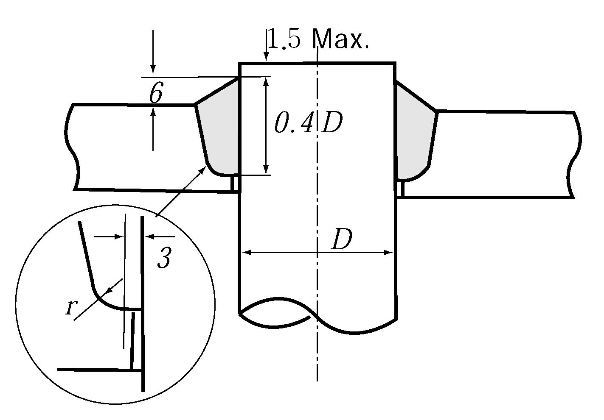

# PART 5 Machinery Installations

> RULES FOR CLASSIFICATION OF STEEL SHIPS / RA-05-E / 2025 / EN / Guidance

## Annex 5-2 Guidance for Calculation of Crankshaft Stress (1)

### (1) Stress af fillet due to bending moment is to be obtained by the following formula:

$\sigma _{x} =1.08 \alpha _{KB} \frac{M _{W}}{Z}$--------------- (1)
$\sigma _{y} =0.285 \alpha _{KB} \frac{M _{W}}{Z}$-------------- (2)
where
$\sigma _{x}$ : Axial stress due to bending moment at fillet
$\sigma _{y}$ : Circumferential stress due to bending moment at fillet
$\alpha _{KB}$: Stress concentration factor for bending, as shown in **Ch 2, 208. 2** (2) of the Guidance
$Z$ : Section modules of crankpin or journal
$M _{W}$: Bending moment at the centre of the arm thickness, normal to the crankplane

#### (A) As external forces acting on the crankshaft, combustion pressure, and inertial forces of reciprocating and unbalanced rotating mass may only be considered. It is assumed that external force acts on the centre of crankpin bearing as a concentrated load, and the shaft is supported at the centre of each main bearing.

#### (B) Bending moment (_s2) at the support is to be determined by solving a set of simultaneous continuous beam equations taking account of the deflection of support due to reaction force. (See Fig 1)

Calculation is to be developed in such a way that at least one each span directly afore and abaft the crank throw under consideration are included.
$\frac{3}{32} \frac{L i-1 2}{L i} M i-2 + \left\{ L i - \frac{2}{32} \frac{L i-1 2}{L i} \left( 1+ \frac{L i-1}{L i} \right) - \frac{3L i}{32} \left( 1+ \frac{L i}{L i+1} \right) \right\} M i-1\#
\#
+ \left[ 2 \left( L i +L i+1 \right) + \frac{3}{32} \left\{ \frac{L i-1 3}{L i 2} +L i \left( 1+ \frac{L i}{L i+1} \right) 2 +L i+1 \right\} \right] M i\#
\#
+ \left[ L i+1 - \frac{3}{32} \left\{ \frac{L i 2}{L i+1} \left( 1+ \frac{L i}{L i+1} \right) +L i+1 \left( 1+ \frac{L i+1}{L i+2} \right) \right\} \right] M i+1 + \frac{3}{32} \frac{L i+1 2}{L i+2} M i+2$
$+ \frac{3}{32} \left\{ \frac{L _{i-1} ^{2}}{L _{i}} SUM_j W_i-1timesj a_i-1timesj - L_i \left( { 1 + \frac{L_i}{L_i+1} \right)\sum_j W_ij a_ij$
$+ \frac{L _{i-1} ^{3}}{L _{i} ^{2}} \sum _{j} ^{} W _{ij} (L _{i} -a _{ij} )+L _{i+1} \sum _{j} ^{} W _{i+1 \times j} a _{i+1 \times j} - \frac{L _{i} ^{2}}{L _{i+1}}$
$\left( { 1 + \frac{L_i}{L_i+1}} \right) SUM_j W_i+1timesj (L_i+1 - a_i+1timesj ) + \frac{L_i+1^2}{L_i+2} SUM_j W_ij a_ij (L_i^2 - a_ij^2 )$
$+\frac{1}{L_i+1} \sum_j W_i+1timesj a_i+1timesj (L_i+1 - a_i+1timesj ) (2L_i+1 - a_i+1timesj ) = 0$ ------ (3)

**Fig 1 Continuous Beam**

#### (C) Bending moment on the centre of crank web (_s2) is to be obtained by the following formulae: (see Fig 2)

$M_WFi = \frac{L_i - l_WFi}{L_i} M_i-1 + \frac{l_WFi}{L_i} M_i + l_WFi \sum_j \left( { 1- \frac{a_ij}{L_i}} \right) W_ij$
$M_WAi = \frac{L_i - l_WFi}{L_i} M_i-1 + \frac{l_WFi}{L_i} M_i + (L_i - l_WAi ) \sum_j \frac{a_ij}{L_i} W_ij$ -------------------- (4)

**Fig 2 Bending Moment at Arbitrary Point**
