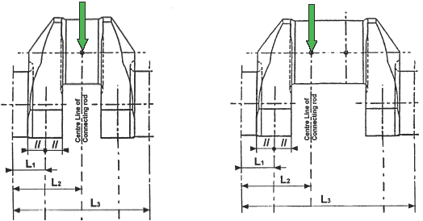
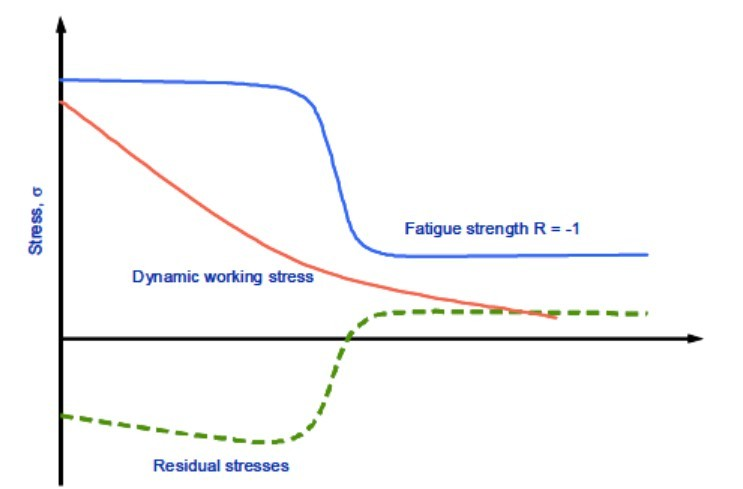
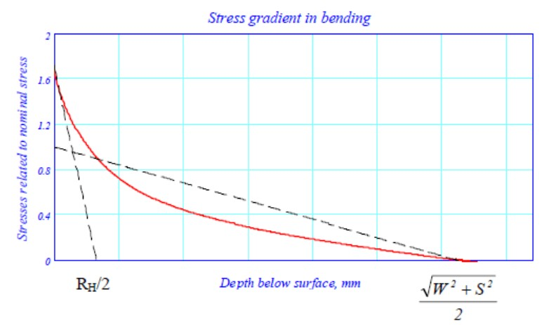
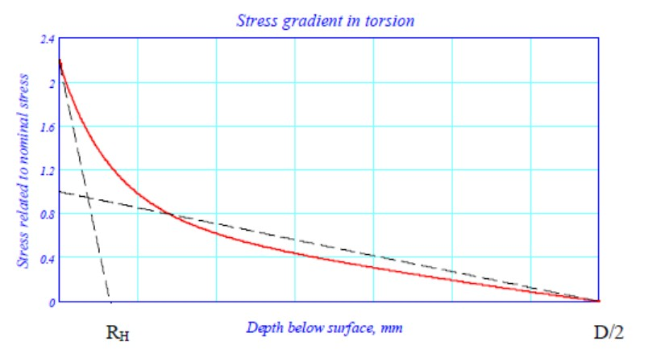
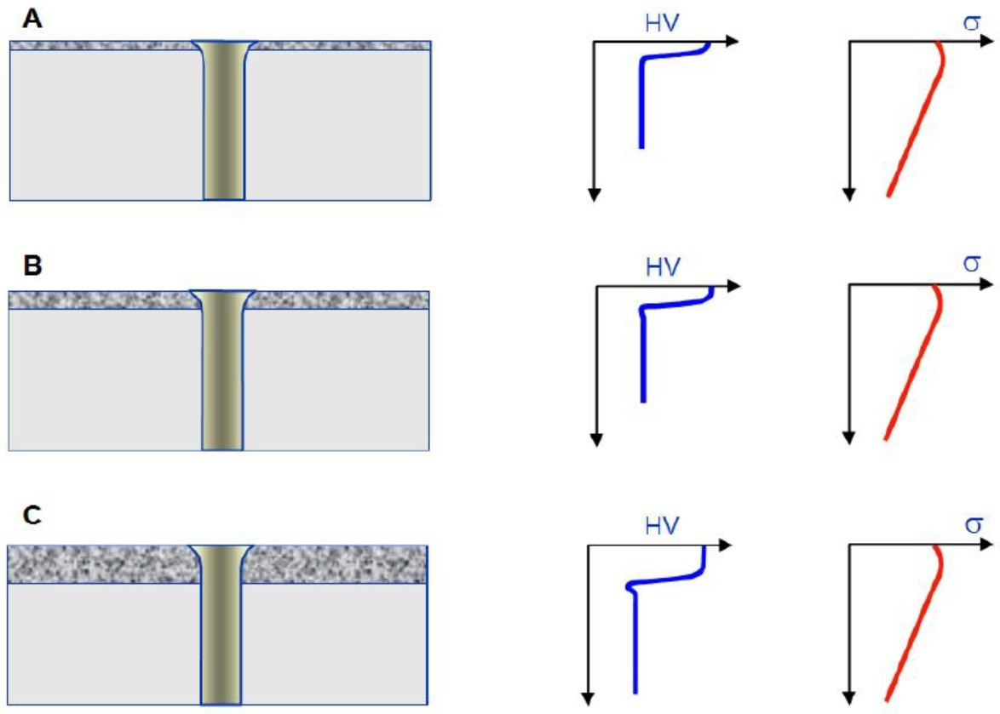
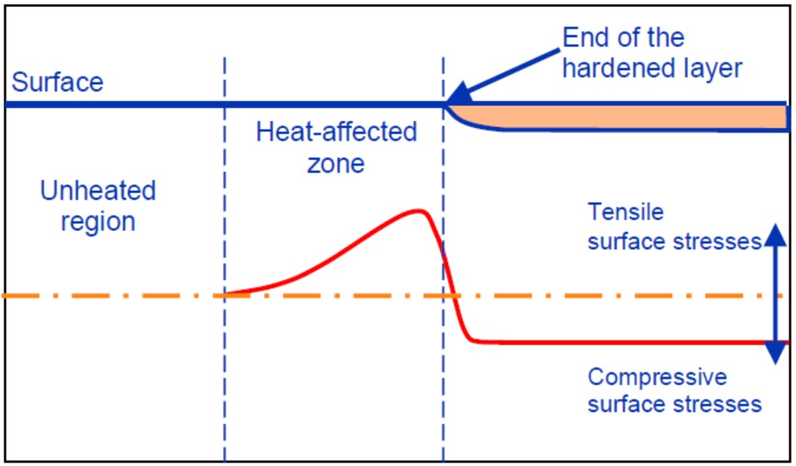
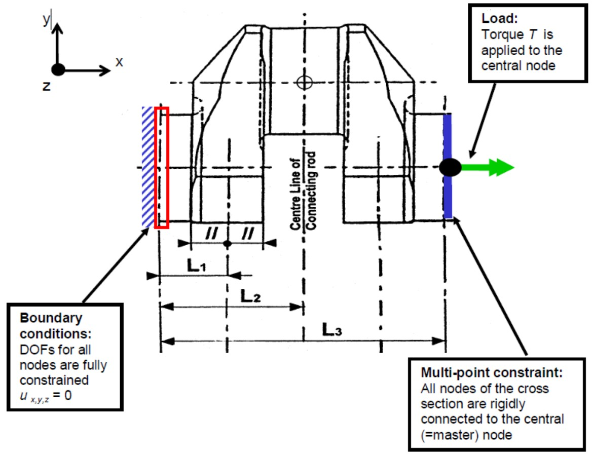

# PART 5 Machinery Installations

> RULES FOR CLASSIFICATION OF STEEL SHIPS / RA-05-E / 2025 / EN / Guidance

## Annex 5-3 Guidance for Calculation of Crankshaft Stress (2)

### 1. General

#### (1) Scope

This Guidance is to apply to solid-forged and semi-built-up crankshafts of forged or cast steel, with one crankthrow between main bearings.

#### (2) Principles of calculation

- **(A)** The design of crankshafts is based on an evaluation of safety against fatigue in the highly stressed areas.
- **(B)** The calculation is based on the assumption that the areas exposed to highest stresses are as follows.
  - **(a)** Fillet transitions between the crankpin and web as well as between the journal and web
  - **(b)** Outlets of crankpin oil bores
- **(C)** When journal diameter is equal or larger than the crankpin one, the outlets of main journal oil bores are to be formed in a similar way to the crankpin oil bores, otherwise separate documentation of fatigue safety may be required.
- **(D)** Calculation of crankshaft strength consists initially in determining the nominal alternating bending and nominal alternating torsional stresses which, multiplied by the appropriate stress concentration factors, result in an equivalent alternating stress(uni-axial stress). This equivalent alternating stress is then compared with the fatigue strength of the selected crankshaft material. This comparison will show whether or not the crankshaft concerned is dimensioned adequately.

### 2. Calculation of Stresses

#### (1) Calculation of alternating stresses due to bending moments and radial forces

- **(A)** Assumption
  - **(a)** The calculation of alternating stresses is based on a statically determined system, composed of a single crankthrow supported in the centre of adjacent main journals and subject to gas and inertia forces. The bending length is taken as the length between the two main bearing midpoints(distance $L _{3}$, see **Fig 1** and **Fig 2**).
  - **(b)** The bending moments($M _{BR}$, $M _{BT}$) are calculated in the relevant section based on triangular bending moment diagrams due to the radial component($F _{R}$) and tangential component($F _{T}$) of the connecting-rod force, respectively(see **Fig 1**).
  - **(c)** For crankthrows with two connecting-rods acting upon one crankpin, the relevant bending moments are obtained by superposition of the two triangular bending moment diagrams according to phase(see **Fig 2**).
  - **(d)** Bending moments and radial forces acting in web
  - **(i)** The bending moment($M _{BRF}$) and the radial force($Q _{RF}$) are taken as acting in the centre of the solid web(distance $L _{1}$) and are derived from the radial component of the connecting-rod force.

    ****

    | **Fig 1 Crankthrow for in line engine** |   | **Fig 2 Crankthrow for Vee engine with 2 adjacent connecting-rods** |
    | --- | --- | --- |
    | $L _{1}$ = Distance between main journal centre line and crankweb center(see also **Fig 3** for crankshaft without overlap) $L _{2}$ = Distance between main journal centre line and connecting-rod centre $L _{3}$ = Distance between two adjacent main journal centre lines |   |   |

    
    **Fig 3 Reference area of crankweb cross section**
    - **(ii)** The alternating bending and compressive stresses due to bending moments and radial forces are to be related to the cross-section of the crank web. This reference section results from the web thickness($W$) and the web width($B$)(see **Fig 3**).
    - **(iii)** Mean stresses are neglected.
  - **(e)** Bending acting in outlet of crankpin oil bore
  - **(i)** The two relevant bending moments are taken in the crankpin cross-section through the oil bore.

    |  | $M _{BRO}$ : is the bending moment of the radial component of the connecting-rod force $M _{BTO}$ : is the bending moment of the tangential component of the connecting-rod force **Fig 4 Crankpin section through the oil bore** |
    | --- | --- |
    - **(ii)** The alternating stresses due to these bending moments are to be related to the cross-sectional area of the axially bored crankpin.
    - **(iii)** Mean bending stresses are neglected.
- **(B)** Nominal alternating bending and compressive stresses in web
  - **(a)** The methods of calculation are as follows.
  - **(i)** The radial and tangential forces due to gas and inertia loads acting upon the crankpin at each connecting-rod position will be calculated over one working cycle.
    - **(ii)** Using the forces calculated over one working cycle and taking into account of the distance from the main bearing midpoint, the time curve of the bending moments($M_BRF$, $M_BRO$, $M_BTO$) and radial forces($Q_RF$) - as defined in (1) (A) (d) and (e) - will then be calculated.
    - **(iii)** In case of V-type engines, the bending moments - progressively calculated from the gas and inertia forces - of the two cylinders acting on one crankthrow are superposed according to phase. Different designs (forked connecting-rod, articulated-type connecting-rod or adjacent connecting-rods) shall be taken into account.
    - **(iv)** Where there are cranks of different geometrical configurations in one crankshaft, the calculation is to cover all crank variants.
  - **(v)** The decisive alternating values are to be calculated according to the following formula:
    $X _{N } = ± \frac{1}{2} \left[ X _{\max} -X _{\min} \right]$
    where
    $X _{N}$ : Alternative values considered as alternating force, moment or stress
    $X _{\max}$ : Maximum value within one working cycle
    $X _{\min}$ : Minimum value within one working cycle
  - **(b)** The calculation of the nominal alternating bending and compressive stresses is as follows.
    $\sigma _{BFN} = ± \frac{M _{BRFN}}{W _{eqw}} \cdot 10 ^{3} \cdot K _{e}$
    $\sigma _{QFN} = ± \frac{Q _{RFN}}{F} \cdot K _{e}$
    where,
    $\sigma _{BFN}$ : Nominal alternating bending stress related to the web ($\mathrm{N}/mm ^{2}$)
    $M _{BRFN}$ : Alternating bending moment related to the center of the web ($\mathrm{N} \cdot m$)
    (see **Fig 1** and **Fig 2**)
    $M _{BRFN} = ± \frac{1}{2} \left[ M _{BRF _{\max}} -M _{BRF _{\min}} \right]$
    $W _{eqw}$ : Section modulus related to cross-section of web ($\mathrm{mm} ^{3}$)
    $W _{eqw} = \frac{B \cdot W ^{2}}{6}$
    $K _{e}$ : Empirical factor considering to some extent the influence of adjacent crank and bearing restraint with : $K _{e}$ = 0.8 for 2-stroke engines
    $K _{e}$ = 1.0 for 4-stroke engines
    $\sigma _{QFN}$ : Nominal alternating compressive stress due to radial force related to the web ($\mathrm{N}/mm ^{2}$)
    $Q _{RFN}$ : Alternating radial force related to the web ($\mathrm{N}$) (see **Fig 1** and **Fig 2**)
    $Q _{RFN} = ± \frac{1}{2} \left[ Q _{RF _{\max}} -Q _{RF _{\min}} \right]$
    $F$ : Area related to cross-section of web ($\mathrm{mm} ^{2}$)
    $F = B \cdot W$
  - **(c)** The calculation of nominal alternating bending stress in outlet of crankpin oil bore is as follows.
    $\sigma _{BON} = ± \frac{M _{BON}}{W _{e}} \cdot 10 ^{3}$
    where,
    $\sigma _{BON}$ : Nominal alternating bending stress related to the crank pin diameter
    ($\mathrm{N}/mm ^{2}$)
    $M _{BON}$ : Alternating bending moment calculated at the outlet of crankpin oil bore
    ($\mathrm{N} \cdot m$)
    $M _{BON} = ± \frac{1}{2} \left[ M _{BO _{\max}} -M _{BO _{\min}} \right]$
    $M _{BO} = \left( M _{BTO} \cdot \cos \psi + M _{BRO} \cdot \sin \psi \right)$ and $\psi$ (°) angular position
    (see **Fig 4**)
    $W _{e}$ : Section modulus related to cross-section of axially bored crankpin ($\mathrm{mm} ^{3}$)
    $W _{e} = \frac{\pi}{32} \left[ \frac{D ^{4} -D _{BH} ^{4}}{D} \right]$
- **(C)** Alternating bending stresses in fillets
  - **(a)** The calculation of stresses for the crankpin fillet is to be carried out as the following formula:
    $\sigma _{BH} = ± \left( \alpha _{B} \cdot \sigma _{BFN} \right)$
    where,
    $\sigma _{BH}$ : Alternating bending stress in crankpin fillet ($\mathrm{N}/mm ^{2}$)
    $\alpha _{B}$ : Stress concentration factor for bending in crankpin fillet (see **3.** (2))
  - **(b)** The calculation of stresses for the journal fillet is to be carried out as the following formula(not applicable to semi-built crankshaft):
    $\sigma _{BG} = ± \left( ( \beta _{B} \cdot \sigma _{BFN } + \beta _{Q} \cdot \sigma _{QFN} \right)$
    where,
    $\sigma _{BG}$ : Alternating bending stress in journal fillet ($\mathrm{N}/mm ^{2}$)
    $\beta _{B}$ : Stress concentration factor for bending in journal fillet (see **3.** (2))
    $\beta _{Q}$ : Stress concentration factor for compression due to radial force in journal fillet (see **3**. (2))
- **(D)** The calculation of alternating bending stresses in outlet of crankpin oil bore is to be carried out as the following formula:
  $\sigma _{BO } = ± \left( \gamma _{B} \cdot \sigma _{BON} \right)$
  where,
  $\sigma _{BO}$ : alternating bending stress in outlet of crankpin oil bore ($\mathrm{N}/mm ^{2}$)
  $\gamma _{B}$ : stress concentration factor for bending in crankpin oil bore (see **3.** (2))

#### (2) Alternating torsional stresses

- **(A)** Nominal alternating torsional stresses
  - **(a)** The maximum and minimum torques are to be ascertained for every mass point of the complete dynamic system and for the entire speed range by means of a harmonic synthesis of the forced vibrations from the 1st order up to and including the 15th order for 2-stroke cycle engines and from the 0.5th order up to and including the 12th order for 4-stroke cycle engines.
  - **(b)** The allowance must be made for the damping that exists in the system and for unfavourable conditions such as misfiring in one of the cylinders.
  - **(c)** The speed step calculation shall be selected in such a way that any resonance found in the operational speed range of the engine shall be detected.
  - **(d)** Where barred speed ranges are necessary, they shall be arranged so that satisfactory operation is possible despite their existence. There are to be no barred speed ranges above a speed ratio of λ ≥ 0.8 for normal firing conditions.
  - **(e)** The nominal alternating torsional stress in every mass point, which is essential to the assessment, results from the following equation.
    $\tau _{N } = ± \frac{M _{TN}}{W _{P}} \cdot 10 ^{3}$
    where,
    $\tau _{N}$ : Nominal alternating torsional stress referred to crankpin or journal ($\mathrm{N}/mm ^{2}$)
    $M _{TN}$ : Maximum alternating torque ($\mathrm{N} \cdot m$)
    $M _{TN } = ± \frac{1}{2} \left[ M _{T _{\max}} -M _{T _{\min}} \right]$
    $M _{T _{\max}}$ : Maximum value of the torque ($\mathrm{N} \cdot m$)
    $M _{T _{\min}}$ : Minimum value of the torque ($\mathrm{N} \cdot m$)
    $W _{P}$ : Polar section modulus related to cross-section of axially bored crankpin or bored journal ($\mathrm{mm} ^{3}$)
    $W _{P } = \frac{\pi}{16} \left( \frac{D ^{4} -D _{BH} ^{4}}{D} \right)$ or $W _{P } = \frac{\pi}{16} \left( \frac{D _{G} ^{4} -D _{BG} ^{4}}{D _{G}} \right)$
  - **(f)** For the purpose of the crankshaft assessment, the nominal alternating torsional stress considered in further calculations is the highest calculated value, according to above method, occurring at the most torsionally loaded mass point of the crankshaft system. Where barred speed ranges exist, the torsional stresses within these ranges are not to be considered for assessment calculations.
  - **(g)** The approval of crankshaft will be based on the installation having the largest nominal alternating torsional stress (but not exceeding the maximum figure specified by engine manufacturer).
- **(B)** Alternating torsional stresses in fillets and outlet of crankpin oil bore
  - **(a)** The calculation of stresses for the crankpin fillet is to be carried out as the following equation.
    $\tau _{H } = ± \left( \alpha _{T} \cdot \tau _{N} \right)$
    where,
    $\tau _{H}$ : Alternating torsional stress in crankpin fillet ($\mathrm{N}/mm ^{2}$)
    $\alpha _{T}$ : Atress concentration factor for torsion in crankpin fillet (see **3.** (2))
    $\tau _{N}$ : Nominal alternating torsional stress related to crankpin diameter ($\mathrm{N}/mm ^{2}$)
  - **(b)** The calculation of stresses for the journal fillet is to be carried out as the following equation(not applicable to semi-built crankshafts).
    $\tau _{G} = ± \left( \beta _{T} \cdot \tau _{N} \right)$
    where,
    $\tau _{G}$ : Alternating torsional stress in journal fillet $\mathrm{N}/mm ^{2}$($\mathrm{N}/mm ^{2}$)
    $\beta _{T}$ : Stress concentration factor for torsion in journal fillet (see **3.** (2))
    $\tau _{N}$ : Nominal alternating torsional stress related to journal diameter ($\mathrm{N}/mm ^{2}$)
  - **(c)** The calculation of stresses for the outlet of the crankpin oil bore is to be carried out as the following equation.
    $\sigma _{T0} =± \left( \gamma _{T} \cdot \tau _{N} \right)$
    where,
    $\sigma _{T0}$ : Alternating stress in outlet of crankpin oil bore due to torsion ($\mathrm{N}/mm ^{2}$)
    $\gamma _{T}$ : Stress concentration factor for torsion in outlet of crankpin oil bore (see **3.** (2))
    $\tau _{N}$ : Nominal alternating torsional stress related to crankpin diameter ($\mathrm{N}/mm ^{2}$)

### 3. Stress Concentration Factors

#### (1) General

- **(A)** The stress concentration factors are evaluated by means of the formulae according to **3** (2), (3) and (4) applicable to the fillets and crankpin oil bore of solid forged web-type crankshafts and to the crankpin fillets of semi-built crankshafts only. It must be noticed that stress concentration factor formulae concerning the oil bore are only applicable to a radially drilled oil hole. All formulae are based on investigations of FVV (Forschungsvereinigung Verbrennungskraftmaschinen) for fillets and on investigations of ESDU(Engineering Science Data Unit) for oil holes(All crank dimensions necessary for the calculation of stress concentration factors are shown in **Fig 5**).
  Where the geometry of the crankshaft is outside the boundaries of the analytical stress concentration factors (SCF), the calculation method detailed in **Appendix III** may be undertaken.
- **(B)** The stress concentration factor for bending ($\alpha _{B}$, $\beta _{B}$) is defined as the ratio of the maximum equivalent stress (VON MISES) - occurring in the fillets under bending load - to the nominal bending stress related to the web cross-section (see **Appendix I**).
- **(C)** The stress concentration factor for compression ($\beta _{Q}$) in the journal fillet is defined as the ratio of the maximum equivalent stress (VON MISES) - occurring in the fillet due to the radial force - to the nominal compressive stress related to the web cross-section.
- **(D)** The stress concentration factor for torsion ($\alpha _{T}$, $\beta _{T}$) is defined as the ratio of the maximum equivalent shear stress - occurring in the fillets under torsional load - to the nominal torsional stress related to the axially bored crankpin or journal cross-section(see **Appendix I**).
- **(E)** The stress concentration factors for bending($\gamma _{B}$) and torsion($\gamma _{T}$) are defined as the ratio of the maximum principal stress - occurring at the outlet of the crankpin oil-hole under bending and torsional loads - to the corresponding nominal stress related to the axially bored crankpin cross section(see **Appendix II**).
- **(F)** When reliable measurements and/or calculations are available, which can allow direct assessment of stress concentration factors, the relevant documents and their analysis method have to be submitted to the Society in order to demonstrate their equivalence to present rules evaluation. This is always to be performed when dimensions are outside of any of the validity ranges for the empirical formulae presented in (2) to (3). **Appendix III** and **Appendix VI** describes how FE analyses can be used for the calculation of the stress concentration factors. Care should be taken to avoid mixing equivalent (von Mises) stresses and principal stresses. *(2018)*
  
  **Fig 5 Crank dimension**
- **(G)** The symbols mean as follows.
  $D$ : Crankpin diameter ($\mathrm{mm}$)
  $D _{RH}$ : Diameter of axial bore in crankpin ($\mathrm{mm}$)
  $D _{O}$ : Diameter of oil bore in crankpin ($\mathrm{mm}$)
  $R _{H}$ : Fillet radius of crankpin ($\mathrm{mm}$)
  $T _{H}$ : Recess of crankpin fillet ($\mathrm{mm}$)
  $D _{G}$ : Journal diameter ($\mathrm{mm}$)
  $D _{BG}$ : Diameter of axial bore in journal ($\mathrm{mm}$)
  $R _{G}$ : Fillet radius of journal ($\mathrm{mm}$)
  $T _{G}$ : Recess of journal fillet ($\mathrm{mm}$)
  $E$ : Pin eccentricity ($\mathrm{mm}$)
  $S$ : Pin overlap ($\mathrm{mm}$)
  $S = \frac{D+D _{G}}{2} -E$
  $W$ : web thickness ($\mathrm{mm}$)
  $B$ : web width ($\mathrm{mm}$)
  In the case of 2 stroke semi-built crankshafts :
  - When $T _{H}$ > $R _{H}$, the web thickness($W$) must be considered as equal to :
  $W _{red =} W- \left( T _{H} -R _{H} \right)$ (refer to **Fig 3**)
  - Web width($B$) must be taken in way of crankpin fillet radius centre according to **Fig 3.**
  The following related dimensions will be applied for the calculation of stress concentration factors in :

  | Crankpin fillet | Journal fillet |
  | --- | --- |
  | $r = R _{H} /D$ (0.03 ≤ $r$ ≤ 0.13) | $r = R _{G} /D$ (0.03 ≤ $r$ ≤ 0.13) |
  | $s = S/D$ ($s$ ≤ 0.5) |   |
  | $w = W/D$ (0.2 ≤ $w$ ≤ 0.8) (crankshafts with overlap) $W _{red} /D$ (0.2 ≤ $w$ ≤ 0.8) (crankshafts without overlap) |   |
  | $b = B/D$ (1.1 ≤ $b$ ≤ 2.2) |   |
  | $d _{o } = D _{O} /D$ (0 ≤ $d _{O}$ ≤ 0.2) |   |
  | $d _{G } = D _{BG} /D$ (0 ≤ $d _{G}$ ≤ 0.8) |   |
  | $d _{H } = D _{BH} /D$ (0 ≤ $d _{H}$ ≤ 0.8) |   |
  | $t _{H } = T _{H} /D$ |   |
  | $t _{G } = T _{G} /D$ |   |
- **(H)** Low range of $s$ can be extended down to large negative values provided that :
  - If calculated $f$(recess) < 1 then the factor $f$(recess) is not to be considered ($f$(recess) = 1)
  - If $s$ < -0.5 then $f$($s$, $w$) and $f$($r$, $s$) are to be evaluated replacing actual value of $s$ by -0.5.

#### (2) Stress concentration factors for crankpin fillet

- **(A)** The stress concentration factor for bending($\alpha _{B}$) is given as follows.
  $\alpha _{B} =2.6914 \cdot f(s,w) \cdot f(w) \cdot f(b) \cdot f(r) \cdot f(d _{G} ) \cdot f(d _{H} ) \cdot f(\mathrm{recess})$
  where,
  $f(s,w) = -4.1883+29.2004 \cdot w-77.5925 \cdot w ^{2} +91.9454 \cdot w ^{3} -40.0416 \cdot w ^{4}$
  $+(1-s) \cdot (9.5440-58.3480 \cdot w+159.3415 \cdot w ^{2} -192.5846 \cdot w ^{3} +85.2916 \cdot w ^{4} )$
  $+(1-s) ^{2} \cdot (-3.8399+25.0444 \cdot w-70.5571 \cdot w ^{2} +87.0328 \cdot w ^{3} -39.1832 \cdot w ^{4} )$
  $f(w)=2.1790 \cdot w ^{0.7171}$
  $f(b)=0.6840-0.0077 \cdot b+0.1473 \cdot b ^{2}$
  $f(r)=0.2081 \cdot r ^{-0.5231}$
  $f(d _{G} )=0.9993+0.27 \cdot d _{G} -1.0211 \cdot d _{G} ^{2} +0.5306 \cdot d _{G} ^{3}$
  $f(d _{H} )=0.9978+0.3145 \cdot d _{H} -1.5241 \cdot d _{H} ^{2} +2.4147 \cdot d _{H} ^{3}$
  $f(recess)=1+(t _{H} +t _{G} ) \cdot (1.8+3.2 \cdot s)$
- **(B)** The stress concentration factor for torsion($\alpha _{T}$) is given as follows.
  $\alpha _{T} =0.8 \cdot f(r,s) \cdot f(b) \cdot f(w)$
  where,
  $f(r,s)=r ^{-0.322+0.1015(1-s)}$
  $f(b)=7.8955-10.654 \cdot b+5.3482 \cdot b ^{2} -0.85 \cdot b ^{3}$
  $f(w)=w ^{-0.145}$

#### (3) Stress concentration factors for journal fillet (not applicable to semi-built crankshaft)

- **(A)** The stress concentration factor for bending ($\beta _{B}$) is given as follows.
  $\beta _{B} =2.7146 \cdot f _{B} (s,w) \cdot f _{B} (w) \cdot f _{B} (b) \cdot f _{B} (r) \cdot f _{B} (d _{G} ) \cdot f _{B} (d _{H} ) \cdot f(\mathrm{recess})$
  where,
  $f _{B} (s,w) = -1.7625+2.9821 \cdot w-1.527 \cdot w ^{2} +(1-s) \cdot (5.1169-5.8089 \cdot w+3.1391 \cdot w ^{2} )$
  $+(1-s) ^{2} \cdot (-2.1567+2.3297 \cdot w-1.2952 \cdot w ^{2} )$
  $f _{B} (w)=2.2422 \cdot w ^{0.7548}$
  $f _{B} (b)=0.5616+0.1197 \cdot b+0.1176 \cdot b ^{2}$
  $f _{B} (r)=0.1908 \cdot r ^{-0.5568}$
  $f _{B} (d _{G} )=1.0012-0.6441 \cdot d _{G} +1.2265 \cdot d _{G} ^{2}$
  $f _{B} (d _{H} )=1.0022-0.1903 \cdot d _{H} +0.0073 \cdot d _{H} ^{2}$
  $f(\mathrm{recess})it=1+(t _{H} +t _{G}) \cdot (1.8+3.2 \cdot s)$
- **(B)** The stress concentration factor for compression ($\beta _{Q}$) due to the radial force is given as follows.
  $\beta _{Q} =3.0128 \cdot f _{Q} (s) \cdot f _{Q} (w) \cdot f _{Q} (b) \cdot f _{Q} (r) \cdot f _{Q} (d _{H} ) \cdot f(\mathrm{recess})$
  where,
  $f _{Q} (s)=0.4368+2.1630 \cdot (1-s)-1.5212 \cdot (1-s) ^{2}$
  $f _{Q} (w)= \frac{w}{0.0637+0.9369 \cdot w}$
  $f _{Q} (b) = -0.5+b$
  $f _{Q} (r)=0.5331 \cdot r ^{-0.2038}$
  $f _{Q} (d _{H} )=0.9937-1.1949 \cdot d _{H} +1.7373 \cdot d _{H} ^{2}$
  $f(\mathrm{recess})it=1+(t _{H} +t _{G}) \cdot (1.8+3.2 \cdot s)$
- **(C)** The stress concentration factor for torsion ($\beta _{T}$) is given as follows.
  - **(a)** If the diameters and fillet radii of crankpin and journal are the same.
    $\beta _{T} = \alpha _{T}$
  - **(b)** If crankpin and journal diameters and/or radii are of different sizes.
    $\beta _{T} =0.8 \cdot f(r,s) \cdot f(b) \cdot f(w)$
    where,
    $f(r,s)$, $f(b)$ and $f(w)$ are to be determined in accordance with item 3 (2), however, the radius of the journal fillet is to be related to the journal diameter :
    $r= \frac{R _{G}}{D _{G}}$
- **(D)** The stress concentration factor for outlet of crankpin oil bore
  - **(a)** The stress concentration factor for bending($\gamma _{B}$) is given as follows.
    $\gamma _{B} =3-5.88 \cdot d _{O} +34.6 \cdot d _{O} ^{2}$
  - **(b)** The stress concentration factor for torsion($\gamma_T$) is given as follows.
    $\gamma _{T} =4-6 \cdot d _{O} +30 \cdot d _{O} ^{2}$

### 4. Additional Bending Stresses _s2

#### (1) In addition to the alternating bending stresses in fillets further bending stresses due to misalignment and bedplate deformation as well as due to axial and bending vibrations are to be considered by applying additional bending stresses(_s2) as given by table.

| Type of engine | $\sigma _{add}$ ($\mathrm{N}/mm ^{2}$) |
| --- | --- |
| Crosshead engines | ± 30 |
| Trunk piston engines | ± 10 |
| NOTES : The additional stress of ± 30 $\mathrm{N}/mm ^{2}$ is composed of two components. 1) An additional stress of ± 20 $\mathrm{N}/mm ^{2}$ resulting from axial vibration 2) An additional stress of ± 10 $\mathrm{N}/mm ^{2}$ resulting from misalignment/bedplate deformation |   |

#### (2) It is recommended that a value of ± 20 _s2 be used for the axial vibration component for assessment purposes where axial vibration calculation results of the complete dynamic system (engine/shafting/gearing/propeller) are not available.

#### (3) Where axial vibration calculation results of the complete dynamic system are available, the calculated figures may be used instead.

### 5. Calculation of Equivalent Alternating Stress

#### (1) General

- **(A)** In the fillets, bending and torsion lead to two different biaxial stress fields which can be represented by a Von Mises equivalent stress with the additional assumptions that bending and torsion stresses are time phased and the corresponding peak values occur at the same location(see **Appendix I**). As a result the equivalent alternating stress is to be calculated for the crankpin fillet as well as for the journal fillet by using the Von Mises criterion.
- **(B)** At the oil hole outlet, bending and torsion lead to two different stress fields which can be represented by an equivalent principal stress equal to the maximum of principal stress resulting from combination of these two stress fields with the assumption that bending and torsion are time phased(see **Appendix II**).
- **(C)** The above two different ways of equivalent stress evaluation both lead to stresses which may be compared to the same fatigue strength value of crankshaft assessed according to Von Mises criterion.

#### (2) The equivalent alternating stress for the crankpin fillet is calculated in accordance with the formulae given.

$\sigma _{v} = ± \sqrt {( \sigma _{BH} + \sigma _{add} ) ^{2} +3 \cdot \tau _{H} ^{2}}$

#### (3) The equivalent alternating stress for the journal fillet is calculated in accordance with the formulae given.

$\sigma _{v} = ± \sqrt {( \sigma _{BG} + \sigma _{add} ) ^{2} +3 \cdot \tau _{G} ^{2}}$

#### (4) The equivalent alternating stress for the outlet of crankpin oil bore is calculated in accordance with the formulae given.

$\sigma _{V} =± \frac{1}{3} \sigma _{BO} \cdot \left[ 1+2 \sqrt {1+ \frac{9}{4} \left( \frac{\sigma _{T0}}{\sigma _{BO}} \right) ^{2}} \right]$
where,
$\sigma _{V}$ : equivalent alternating stress ($\mathrm{N}/mm ^{2}$)
for other parameters see **2**, (1) (C), **2.** (2) (B) and **4**.

### 6. Fatigue Strength

#### (1) Fatigue strength related to the crankpin diameter

The fatigue strength related to the crankpin diameter may be evaluated by means of the following formula.
$\sigma _{DW} =±K \cdot (0.42 \cdot \sigma _{B} +39.3) \cdot \left[ 0.264+1.073 \cdot D ^{-0.2} + \frac{785- \sigma _{B}}{4900} + \frac{196}{\sigma _{B}} \cdot \sqrt {\frac{1}{R _{X}}} \right]$
where,
$R _{X} =R _{H}$ (in the fillet area)
$R _{X} =D _{O} /2$ (in the oil bore area)

#### (2) Fatigue strength related to the journal diameter

- **(A)** The fatigue strength related to the journal diameter may be evaluated by means of the following formula.
  $\sigma _{DW} =±K \cdot (0.42 \cdot \sigma _{B} +39.3) \cdot \left[ 0.264+1.073 \cdot D _{G} ^{-0.2} + \frac{785- \sigma _{B}}{4900} + \frac{196}{\sigma _{B}} \cdot \sqrt {\frac{1}{R _{G}}} \right]$
  where,
  $\sigma _{DW}$ : Allowable fatigue strength of crankshaft ($\mathrm{N}/mm ^{2}$)
  $K$ : Factor for different types of crankshafts without surface treatment. Values greater than 1 are only applicable to fatigue strength in fillet area.
  = 1.05 for continuous grain flow forged or drop-forged crankshafts
  = 1.0 for free form forged crankshafts (without continuous grain flow)
  Factor for cast steel crankshafts with cold rolling treatment in fillet area
  = 0.93 for cast steel crankshafts manufactured by companies using approved cold rolling process of the Society
  $\sigma _{B}$ : minimum tensile strength of crankshaft material ($\mathrm{N}/mm ^{2}$)
  For other parameters see **3.** (1). However, for calculation purposes $R _{H}$, $R _{G}$ or $R _{X}$ are to be taken as not less than 2 $\mathrm{mm}$.
- **(B)** When a surface treatment process is applied, it must be approved by the Society. Guidance for calculation of surface treated fillets and oil bore outlets is presented in Appendix V. *(2018)*
- **(C)** Surfaces of the fillet, the outlet of the oil bore and inside the oil bore(down to a minimum depth equal to 1.5 times the oil bore diameter) shall be smoothly finished.

#### (3) Alternative method

- **(A)** As an alternative the fatigue strength of the crankshaft can be determined by experiment based either on full size crankthrow (or crankshaft) or on specimens taken from a full size crankthrow. For evaluation of test results, see Appendix IV.

### 8. Calculation of Shrink-fits of Semi-built crankshaft

#### (1) General

- **(A)** All crank dimensions necessary for the calculation of the shrink-fit are shown in **Fig 6.**
  
  **Fig 6 Crankthrow of semi-built crankshaft**
- **(B)** the symbols means as follows.
  $D _{A}$ : Outside diameter of web or twice the minimum distance($X$) between centre-line of journals and outer contour of web, whichever is less ($\mathrm{mm}$)
  $D _{S}$ : Shrink diameter ($\mathrm{mm}$)
  $D _{G}$ : Journal diameter ($\mathrm{mm}$)
  $D _{BG}$ : Diameter of axial bore in journal ($\mathrm{mm}$)
  $L _{S}$ : Length of shrink-fit ($\mathrm{mm}$)
  $R _{G}$ : Fillet radius of journal ($\mathrm{mm}$)
  $Y$ : Distance between the adjacent generating lines of journal and pin ($\mathrm{mm}$)
  - $Y \geq 0.05 \cdot D _{S}$
  - Where $Y$ is less than 0.1․$D _{S}$ special consideration is to be given to the effect of the stress due to the shrink-fit on the fatigue strength at the crankpin fillet.
- **(C)** Respecting the radius of the transition from the journal to the shrink diameter, the following should be complied with :
  $R_G \geq 0.015 \cdot D_G$
  and
  $R_G \geq 0.5 \cdot \left( D_S -D_G \right)$
  where the greater value is to be considered.
- **(D)** The actual oversize($Z$) of the shrink-fit must be within the limits $Z _{\min}$ and $Z _{\max}$ calculated in accordance with **8** (3) and (4).
- **(E)** In the case where **8** (2) condition cannot be fulfilled then **8** (3) and **8** (4) calculation methods of $Z _{\min}$ and $Z _{\max}$ are not applicable due to multizone-plasticity problems. In such case $Z _{\min}$ and $Z _{\max}$ have to be established based on FEM calculations.

#### (2) Maximum permissible hole in the journal pin

- **(A)** The maximum permissible hole diameter in the journal pin is calculated in accordance with the following formula:
  $D _{BG} =D _{S} \cdot \sqrt {1- \frac{4000 \cdot S _{R} \cdot M _{\max}}{\mu \cdot \pi \cdot D _{S} ^{2} \cdot L _{S} \cdot \sigma _{sp}}}$
  $S _{R}$ : Safety factor against slipping, however a value not less than 2 is to be taken unless documented by experiments.
  $M _{\max}$ : A bsolute maximum value of the torque($M _{T _{\max}}$) in accordance with **2** (2) (A) ($\mathrm{N} \cdot m$)
  $\mu$ : Coefficient for static friction, however a value not greater than 0.2 is to be taken unless documented by experiments.
  $\sigma _{SP}$ : Minimum yield strength of material for journal pin ($\mathrm{N}/mm ^{2}$)
- **(B)** This condition serves to avoid plasticity in the hole of the journal pin.

#### (3) Necessary minimum oversize of shrink-fit

The necessary minimum oversize is determined by the greater value calculated according to the following formula:
$Z _{\min} \geq \frac{\sigma _{SW} \cdot D _{S}}{E _{m}}$
$Z _{\min} \geq \frac{4000}{\mu \cdot \pi} \cdot \frac{S _{R} \cdot M _{\max}}{E _{m} \cdot D _{S} \cdot L _{S}} \cdot \frac{1-Q _{A} ^{2} \cdot Q _{S} ^{2}}{\left( 1-Q _{A} ^{2} \right) \cdot \left( 1-Q _{S} ^{2} \right)}$
where,
$Z _{\min}$ : Minimum oversize ($\mathrm{mm}$)
$E _{m}$ : Young's modulus ($\mathrm{N}/mm ^{2}$)
$\sigma _{SW}$ : Minimum yield strength of material for crank web ($\mathrm{N}/mm ^{2}$)
$Q _{A}$ : Web ratio, $Q _{A} = \frac{D _{S}}{D _{A}}$
$Q _{S}$ : Shaft ratio, $Q _{S} = \frac{D _{BG}}{D _{S}}$

#### (4) Maximum permissible oversize of shrink-fit

- **(A)** The maximum permissible oversize is calculated according to the following formula:
  $Z _{\max} \leq D _{S} \cdot \left( \frac{\sigma _{SW}}{E _{m}} + \frac{0.8}{1000} \right)$
- **(B)** This condition serves to restrict the shrinkage induced mean stress in the fillet.

### <Appendix III Calculation of Stress Concentration Factors in the arm fillet radii of crankshafts by utilizing Finite Element Method>

#### 1. General

- **(1)** The objective of the analysis is to develop Finite Element Method (FEM) calculated figures as an alternative to the analytically calculated Stress Concentration Factors (SCF) at the crankshaft fillets. The analytical method is based on empirical formulae developed from strain gauge measurements of various crank geometries and accordingly the application of these formulae is limited to those geometries.
- **(2)** The SCF's calculated according to this Appendix are defined as the ratio of stresses calculated by FEM to nominal stresses in both journal and pin fillets. When used in connection with the present method or the method for calculation by utilizing FEM, von Mises stresses is to be calculated for bending and principal stresses for torsion.
- **(3)** The procedure as well as evaluation guidelines in this Appendix are valid for both solid cranks and semi-built cranks (except journal fillets).
- **(4)** The analysis is to be conducted as linear elastic FE analysis, and unit loads of appropriate magnitude are to be applied for all load cases.
- **(5)** The calculation of SCF at the oil bores is not covered by this Appendix.
- **(6)** It is advised to check the element accuracy of the FE solver in use, e.g. by modeling a simple geometry and comparing the stresses obtained by FEM with the analytical solution for pure bending and torsion.
- **(7)** Boundary Element Method (BEM) may be used instead of FEM.

#### 2. Model requirements

- **(1)** Element mesh recommendations
  In order to fulfil the mesh quality criteria, it is advised to construct the FE model for the evaluation of Stress Concentration Factors according to the following recommendations:
  - **(A)** The model consists of one complete crank, from the main bearing centerline to the opposite side main bearing centerline.
  - **(B)** Element types used in the vicinity of the fillets:
    - **(a)** 10 node tetrahedral elements
    - **(b)** 8 node hexahedral elements
    - **(c)** 20 node hexahedral elements
  - **(C)** Mesh properties in fillet radii.
    The following (D) and (E) applies to ±90 degrees in circumferential direction from the crank plane.
  - **(D)** Maximum element size a = r/4 through the entire fillet as well as in the circumferential direction. When using 20 node hexahedral elements, the element size in the circumferential direction may be extended up to 5a. In the case of multi-radii fillet, r is the local fillet radius. (If 8 node hexahedral elements are used even smaller element size is required to meet the quality criteria.)
  - **(E)** Recommended manner for element size in fillet depth direction:
    - **(a)** First layer thickness equal to element size of a
    - **(b)** Second layer thickness equal to element to size of 2a
    - **(c)** Third layer thickness equal to element to size of 3a
  - **(F)** Minimum 6 elements across web thickness.
  - **(G)** Generally the rest of the crank should be suitable for numeric stability of the solver.
  - **(H)** Counterweights only have to be modeled only when influencing the global stiffness of the crank significantly.
  - **(I)** Modeling of oil drillings is not necessary as long as the influence on global stiffness is negligible and the proximity to the fillet is more than 2r (see **Fig 7**).
  - **(J)** Drillings and holes for weight reduction have to be modeled.
  - **(K)** Sub-modeling may be used as far as the software requirements are fulfilled.
    
    **Fig 7 Oil bore proximity to fillet**
- **(2)** Material
  Annex 5-3 does not consider material properties such as Young’'s Modulus ($E$) and Poisson’s ratio ($v$). In FE analysis those material parameters are required, as strain is primarily calculated and stress is derived from strain using the Young’ Modulus and Poisson’ ratio.
  Reliable values for material parameters have to be used, either as quoted in literature or as measured on representative material samples.
  For steel the following is advised : $E$ = 2.05·10^5 MPa and $v$ = 0.3.
- **(3)** Element mesh quality criteria
  If the actual element mesh does not fulfil any of the following criteria at the examined area for SCF evaluation, then a second calculation with a refined mesh is to be performed.
  - **(A)** Principal stresses criterion
    The quality of the mesh should be assured by checking the stress component normal to the surface of the fillet radius. Ideally, this stress should be zero. With principal $\sigma _{1}$, $\sigma _{2}$ and $\sigma _{3}$, the following criterion is required:
    $\min( \left| \sigma _{1} \right| , \left| \sigma _{2} \right| , \left| \sigma _{3} \right| )<0.03 \cdot \max( \left| \sigma _{1} \right| , \left| \sigma _{2} \right| , \left| \sigma _{3} \right| )$
  - **(B)** Averaged/unaveraged stresses criterion
    The criterion is based on observing the discontinuity of stress results over elements at the fillet for the calculation of SCF. Unaveraged nodal stress results calculated from each element connected to a node should differ less than by 5 % from the 100 % averaged nodal stress results at this node at the examined location.

#### 3. Load cases

To substitute the analytically determined SCF in **Annex 5-3** the following load cases have to be calculated.

- **(1)** Torsion
  In analogy to the testing apparatus used for the investigations made by FVV, the structure is loaded pure torsion as per **Fig 8.** In the model surface warp at the end faces is suppressed.
  Torque is applied to the central node located at the crankshaft axis. This node acts as the master node with 6 degrees of freedom and is connected rigidly to all nodes of the end face.
  Boundary and load conditions are valid for both in-line and V-type engines.
  
  **Fig 8 Boundary and load conditions for the torsion load case**
  For all nodes in both the journal and crank pin fillet principal stresses are extracted and the equivalent torsional stress is calculated:
  $\tau _{equi v} = \max \left( \frac{\left| \sigma _{1} - \sigma _{2} \right|}{2} , \frac{\left| \sigma _{2} - \sigma _{3} \right|}{2} , \frac{\left| \sigma _{1} - \sigma _{3} \right|}{2} \right)$
  The maximum value taken for the subsequent calculation of the SCF:
  $\alpha _{T} = \frac{\tau _{equi v, \alpha }}{\tau _{N}}$
  $\beta _{T} = \frac{\tau _{equi v, \beta }}{\tau _{N}}$
  where,
  $\tau _{N} _{{} _{}}$$\) is nominal torsional stress referred to the crankpin and respectively journal as per **Annex 5-3, 2** (2) with the torsional torque \(T$ :
  $\tau _{N} = \frac{T}{W _{P}}$
- **(2)** Pure bending (4 point bending)
  In analogy to the testing apparatus used for the investigations made by FVV, the structure is loaded in pure bending as per **Fig 9.** In the model surface warp at the end faces is suppressed.
  The bending moment is applied to the central node located at the crankshaft axis. This node acts as the master node with 6 degrees of freedom and is connected rigidly to all nodes of the end face.
  Boundary and load conditions are valid for both in-line- and V- type engines.
  
  **Fig 9 Boundary and load conditions for the pure bending load case**
  For all nodes in both the journal and pin fillet von Mises equivalent stresses $\sigma _{equi v _{}}$ are extracted. The maximum value is used to calculate the SCF according to:
  $\alpha _{B} = \frac{\sigma _{equi v, \alpha }}{\sigma _{N}}$
  $\beta _{B} = \frac{\sigma _{equi v, \beta }}{\sigma _{N}}$
  Nominal stress $\sigma _{N} _{}$ is calculated as per **Annex 5-3, 2** (1) (B) (b) with the bending moment M:
  $\sigma _{N} = \frac{M}{Weqw}$
- **(3)** Bending with shear force (3-point bending)
  - **(A)** This load case is calculated to determine the SCF for pure transverse force (radial force, $\beta _{Q _{}}$) for the journal fillet.
  - **(B)** In analogy to the testing apparatus used for the investigations made by FVV, the structure is loaded in 3-point bending as per **Fig 10**. In the model, surface warp at the both end faces is suppressed. All nodes are connected rigidly to the centre node; boundary conditions are applied to the centre nodes. These nodes act as master nodes with 6 degrees of freedom.
  - **(C)** The force is applied to the central node located at the pin centre-line of the connecting rod. This node is connected to all nodes of the pin cross sectional area. Warping of the sectional area is not suppressed.
  - **(D)** Boundary and load conditions are valid for in-line and V-type engines. V-type engines can be modeled with one connecting rod force only. Using two connecting rod forces will make no significant change in the SCF.
  - **(E)** The maximum equivalent von Mises stress $\sigma _{3P} _{{} _{{} _{}}}$ in the journal fillet is evaluated. The SCF in the journal fillet can be determined in two ways as shown below.
    This method is analogue to the FVV investigation. The results from 3-point and 4-point bending are combined as follows:
    $\sigma _{3P} _{{} _{{} _{}}} = \sigma _{N3P} \cdot \beta _{B} + \sigma _{Q3P} \cdot \beta _{Q}$
    where:
    $\sigma _{3P} _{{} _{{} _{}}}$ : as found by the FE calculation.
    $\sigma _{N3P _{{} _{{} _{}}}}$ : nominal bending stress in the web centre due to the force $F _{3P _{{} _{{} _{}}}}$ [N] applied to the centre-line of the actual connecting rod, see **Fig 11**.
    $\beta _{B}$ : as determined in para (2).
    $\sigma _{Q3P} =Q _{3P} /(B.W)$
    where,
    $Q _{3P}$ is the radial (shear) force in the web due to the force $F _{3P _{{} _{{} _{}}}}$ [N] applied to the centre-line of the actual connecting rod, see also **Fig 1** and **Fig 2** in **Annex 5-3.**
    This method is not analogous to the FVV investigation. In a statically determined system with one crank throw supported by two bearings, the bending moment and radial (shear) force are proportional. Therefore the journal fillet SCF can be found directly by the 3-point bending FE calculation. The SCF is then calculated according to the following.
    $\beta _{BQ} = \frac{\sigma _{3P}}{\sigma _{N3P}}$
    For symbols see (a).
    When using this method the radial force and stress determination in **Annex 5-3** becomes superfluous. The alternating bending stress in the journal fillet as per **Annex 5-3, 2** (1) (C) is then evaluated:
    $\sigma _{BG} =± \left| \beta _{BQ} \cdot \sigma _{BFN} \right|$
    Note: that the use of this method does not apply to the crankpin fillet and this SCF must not be used in connection with calculation methods other than those assuming a statically determined system as in **Annex 5-3.**
    
    **Fig 10 Boundary and load conditions for the 3-point bending load case of an inline engine.**
    
    **Fig 11 Load applications for in-line and V-type engines.**
    - **(a)** Method 1
    - **(b)** Method 2

### <Appendix IV Evaluation of Fatigue Tests> (2018)}

#### 1. Introduction

Fatigue testing can be divided into two main groups; testing of small specimens and full-size crank throws. Testing can be made using the staircase method or a modified version thereof which is presented in this document. Other statistical evaluation methods may also be applied.

- **(1)** Small specimen testing
  - **(A)** For crankshafts without any fillet surface treatment, the fatigue strength can be determined by testing small specimens taken from a full-size crank throw. When other areas in the vicinity of the fillets are surface treated introducing residual stresses in the fillets, this approach cannot be applied.
  - **(B)** One advantage of this approach is the rather high number of specimens which can be then manufactured. Another advantage is that the tests can be made with different stress ratios (R-ratios) and/or different modes e.g. axial, bending and torsion, with or without a notch. This is required for evaluation of the material data to be used with critical plane criteria.
- **(2)** Full-size crank throw testing
  For crankshafts with surface treatment the fatigue strength can only be determined through testing of full size crank throws. For cost reasons, this usually means a low number of crank throws. The load can be applied by hydraulic actuators in a 3- or 4- point bending arrangement, or by an exciter in a resonance test rig. The latter is frequently used, although it usually limits the stress ratio to $R=-1$.

#### 2. Evaluation of test results

- **(1)** Principles
  - **(A)** Prior to fatigue testing the crankshaft must be tested as required by quality control procedures, e.g. for chemical composition, mechanical properties, surface hardness, hardness depth and extension, fillet surface finish, etc.
  - **(B)** The test samples should be prepared so as to represent the “lower end” of the acceptance range e.g. for induction hardened crankshafts this means the lower range of acceptable hardness depth, the shortest extension through a fillet, etc. Otherwise the mean value test results should be corrected with a confidence interval: a 90 % confidence interval may be used both for the sample mean and the standard deviation.
  - **(C)** The test results, when applied in **Annex 5-3**, shall be evaluated to represent the mean fatigue strength, with or without taking into consideration the 90 % confidence interval as mentioned above. The standard deviation should be considered by taking the 90 % confidence into account. Subsequently the result to be used as the fatigue strength is then the mean fatigue strength minus one standard deviation.
  - **(D)** If the evaluation aims to find a relationship between (static) mechanical properties and the fatigue strength, the relation must be based on the real (measured) mechanical properties, not on the specified minimum properties.
  - **(E)** The calculation technique presented in 2 (4) was developed for the original staircase method. However, since there is no similar method dedicated to the modified staircase method the same is applied for both.
- **(2)** Staircase method
  - **(A)** In the original staircase method, the first specimen is subjected to a stress corresponding to the expected average fatigue strength. If the specimen survives $10 ^{7}$ cycles, it is discarded and the next specimen is subjected to a stress that is one increment above the previous, i.e. a survivor is always followed by the next using a stress one increment above the previous. The increment should be selected to correspond to the expected level of the standard deviation.
  - **(B)** When a specimen fails prior to reaching $10 ^{7}$ cycles, the obtained number of cycles is noted and the next specimen is subjected to a stress that is one increment below the previous. With this approach, the sum of failures and run-outs is equal to the number of specimens.
  - **(C)** This original staircase method is only suitable when a high number of specimens are available. Through simulations it has been found that the use of about 25 specimens in a staircase test leads to a sufficient accuracy in the result.
- **(3)** Modified staircase method
  - **(A)** When a limited number of specimens are available, it is advisable to apply the modified staircase method. Here the first specimen is subjected to a stress level that is most likely well below the average fatigue strength. When this specimen has survived $10 ^{7}$ cycles, this same specimen is subjected to a stress level one increment above the previous. The increment should be selected to correspond to the expected level of the standard deviation. This is continued with the same specimen until failure. Then the number of cycles is recorded and the next specimen is subjected to a stress that is at least 2 increments below the level where the previous specimen failed.
  - **(B)** With this approach, the number of failures usually equals the number of specimens. The number of run-outs, counted as the highest level where $10 ^{7}$ cycles were reached, also equals the number of specimens.
  - **(C)** The acquired result of a modified staircase method should be used with care, since some results available indicate that testing a runout on a higher test level, especially at high mean stresses, tends to increase the fatigue limit. However, this “training effect” is less pronounced for high strength steels (e.g. UTS > 800 MPa).
  - **(D)** If the confidence calculation is desired or necessary, the minimum number of test specimens is 3.
- **(4)** Calculation of sample mean and standard deviation
  - **(A)** A hypothetical example of tests for 5 crank throws is presented further in the subsequent text. When using the modified staircase method and the evaluation method of Dixon and Mood, the number of samples will be 10, meaning 5 run-outs and 5 failures, i.e.:
    Number of samples, $n=10$
    Furthermore, the method distinguishes between
    Less frequent event is failures $C=1$
    Less frequent event is run-outs $C=2$
    The method uses only the less frequent occurrence in the test results, i.e. if there are more failures than run-outs, then the number of run-outs is used, and vice versa.
  - **(B)** However, the testing can be unsuccessful, e.g. the number of run-outs can be less than the number of failures if a specimen with 2 increments below the previous failure level goes directly to failure. On the other hand, if this unexpected premature failure occurs after a rather high number of cycles, it is possible to define the level below this as a run-out.
  - **(C)** Dixon and Mood’s approach, derived from the maximum likelihood theory, which also may be applied here, especially on tests with few samples, presented some simple approximate equations for calculating the sample mean and the standard deviation from the outcome of the staircase test.
    The sample mean can be calculated as follows:
    when $C=1$, ${\bar{S _{a}}} =S _{a0} +d \cdot ( \frac{A}{F} - \frac{1}{2} )$
    when $C=2$, ${\bar{S _{a}}} =S _{a0} +d \cdot ( \frac{A}{F} + \frac{1}{2} )$
    The standard deviation can be found by
    $s=1.62 \cdot d \cdot \left( \frac{F \cdot B-A ^{2}}{F ^{2}} +0.029 \right)$
    where,
    $S _{a0}$ is the lowest stress level for the less frequent occurrence
    $d$ is the stress increment
    $F= \sum _{} ^{} fi$
    $A= \sum _{} ^{} i \cdot fi$
    $B= \sum _{} ^{} i ^{2} \cdot fi$
    $i$ is the stress level numbering
    $fi$ is the number of samples at stress level $i$
    The formula for the standard deviation is an approximation and can be used when
    $\frac{B \cdot F-A ^{2}}{F ^{2}} >0.3$ and \(0.5 \cdot sIf any of these two conditions are not fulfilled, a new staircase test should be considered or the standard deviation should be taken quite large in order to be on the safe side.
  - **(D)** If increment $d$ is greatly higher than the standard deviation $s$, the procedure leads to a lower standard deviation and a slightly higher sample mean, both compared to values calculated when the difference between the increment and the standard deviation is relatively small. Respectively, if increment $d$ is much less than the standard deviation $s$, the procedure leads to a higher standard deviation and a slightly lower sample mean.
- **(5)** Confidence interval for mean fatigue limit
  - **(A)** If the staircase fatigue test is repeated, the sample mean and the standard deviation will most likely be different from the previous test. Therefore, it is necessary to assure with a given confidence that the repeated test values will be above the chosen fatigue limit by using a confidence interval for the sample mean.
  - **(B)** The confidence interval for the sample mean value with unknown variance is known to be distributed according to the t-distribution (also called student’s t-distribution) which is a distribution symmetric around the average.

    ****

    |   | The confidence level normally used for the sample mean is 90 %, meaning that 90 % of sample means from repeated tests will be above the value calculated with the chosen confidence level. The figure shows the t-value for $(1- \alpha ) \cdot 100$ % confidence interval for the sample mean. |
    | --- | --- |
    |   |   |
    | **Fig 12 Student’s t-distribution** |   |
  - **(C)** If $S _{a}$ is the empirical mean and $s$ is the empirical standard deviation over a series of $n$ samples, in which the variable values are normally distributed with an unknown sample mean and unknown variance, the $(1- \alpha ) \cdot 100$ % confidence interval for the mean is:
    \(P \left( S _{a} -t _{\alpha ,n-1} \cdot \frac{s}{\sqrt {n}}
  - **(D)** The resulting confidence interval is symmetric around the empirical mean of the sample values, and the lower end point can be found as:
    $S _{aX \%} =S _{a} -t _{\alpha ,n-1} \cdot \frac{s}{\sqrt {n}}$
    which is the mean fatigue limit (population value) to be used to obtain the reduced fatigue limit where the limits for the probability of failure are taken into consideration.
- **(6)** Confidence interval for standard deviation
  - **(A)** The confidence interval for the variance of a normal random variable is known to possess a chi-square distribution with $n-1$ degrees of freedom.

    ****

    |   | The confidence level on the standard deviation is used to ensure that the standard deviations for repeated tests are below an upper limit obtained from the fatigue test standard deviation with a confidence level. The figure shows the chi-square for $(1- \alpha ) \cdot 100$ % confidence interval for the variance. |
    | --- | --- |
    |   |   |
    | **Fig 13 Chi-square distribution** |   |
  - **(B)** An assumed fatigue test value from $n$ samples is a normal random variable with a variance of $\sigma ^{2}$ and has an empirical variance $\sigma ^{2}$. Then a $(1- \alpha ) \cdot 100$ % confidence interval for the variance is:
    $P \left( \frac{(n-1)s ^{2}}{\sigma ^{2}} < \chi _{\alpha ,n-1}^{2} \right) =1- \alpha$
  - **(C)** A $(1- \alpha ) \cdot 100$ % confidence interval for the standard deviation is obtained by the square root of the upper limit of the confidence interval for the variance and can be found by
    $s _{X \%} = \sqrt {\frac{n-1}{\chi _{\alpha ,n-1}^{2}}} \cdot s$
    This standard deviation (population value) is to be used to obtain the fatigue limit, where the limits for the probability of failure are taken into consideration.

#### 3. Small specimen testing

In this connection, a small specimen is considered to be one of the specimens taken from a crank throw. Since the specimens shall be representative for the fillet fatigue strength, they should be taken out close to the fillets, as shown in Fig 14. It should be made certain that the principal stress direction in the specimen testing is equivalent to the full-size crank throw. The verification is recommended to be done by utilising the finite element method. The (static) mechanical properties are to be determined as stipulated by the quality control procedures.

|  |
| --- |
| **Fig 14 Specimen locations in a crank throw** |

- **(1)** Determination of bending fatigue strength
  - **(A)** It is advisable to use un-notched specimens in order to avoid uncertainties related to the stress gradient influence. Push-pull testing method (stress ratio $R= -1$) is preferred, but especially for the purpose of critical plane criteria other stress ratios and methods may be added.
  - **(B)** In order to ensure principal stress direction in push-pull testing to represent the full-size crank throw principal stress direction and when no further information is available, the specimen shall be taken in 45 degrees angle as shown in Fig 14.
  - **(C)** If the objective of the testing is to document the influence of high cleanliness, test samples taken from positions approximately 120 degrees in a circumferential direction may be used. See Fig 14.
  - **(D)** If the objective of the testing is to document the influence of continuous grain flow (CGF) forging, the specimens should be restricted to the vicinity of the crank plane.
- **(2)** Determination of torsional fatigue strength
  - **(A)** If the specimens are subjected to torsional testing, the selection of samples should follow the same guidelines as for bending above. The stress gradient influence has to be considered in the evaluation.
  - **(B)** If the specimens are tested in push-pull and no further information is available, the samples should be taken out at an angle of 45 degrees to the crank plane in order to ensure collinearity of the principal stress direction between the specimen and the full-size crank throw. When taking the specimen at a distance from the (crank) middle plane of the crankshaft along the fillet, this plane rotates around the pin centre point making it possible to resample the fracture direction due to torsion (the results are to be converted into the pertinent torsional values).
- **(3)** Other test positions
  - **(A)** If the test purpose is to find fatigue properties and the crankshaft is forged in a manner likely to lead to CGF, the specimens may also be taken longitudinally from a prolonged shaft piece where specimens for mechanical testing are usually taken. The condition is that this prolonged shaft piece is heat treated as a part of the crankshaft and that the size is so as to result in a similar quenching rate as the crank throw.
  - **(B)** When using test results from a prolonged shaft piece, it must be considered how well the grain flow in that shaft piece is representative for the crank fillets.
- **(4)** Correlation of test results
  - **(A)** The fatigue strength achieved by specimen testing shall be converted to correspond to the full-size crankshaft fatigue strength with an appropriate method (size effect).
  - **(B)** When using the bending fatigue properties from tests it should be kept in mind that successful continuous grain flow (CGF) forging leading to elevated values compared to other (non CGF) forging, will normally not lead to a torsional fatigue strength improvement of the same magnitude. In such cases it is advised to either carry out also torsional testing or to make a conservative assessment of the torsional fatigue strength, e.g. by using no credit for CGF. This approach is applicable when using the Gough Pollard criterion. However, this approach is not recognised when using the von Mises or a multi-axial criterion such as Findley.
  - **(C)** If the found ratio between bending and torsion fatigue differs significantly from $\sqrt {3}$, one should consider replacing the use of the von Mises criterion with the Gough Pollard criterion. Also, if critical plane criteria are used, it must be kept in mind that CGF makes the material inhomogeneous in terms of fatigue strength, meaning that the material parameters differ with the directions of the planes.
  - **(D)** Any addition of influence factors must be made with caution. If for example a certain addition for clean steel is documented, it may not necessarily be fully combined with a K-factor for cgf. Direct testing of samples from a clean and CGF forged crank is preferred.

#### 4. Full size testing

- **(1)** Hydraulic pulsation
  - **(A)** A hydraulic test rig can be arranged for testing a crankshaft in 3-point or 4-point bending as well as in torsion. This allows for testing with any R-ratio.
  - **(B)** Although the applied load should be verified by strain gauge measurements on plain shaft sections for the initiation of the test, it is not necessarily used during the test for controlling load. It is also pertinent to check fillet stresses with strain gauge chains.
  - **(C)** Furthermore, it is important that the test rig provides boundary conditions as defined in Appendix III 3 (1) to (3).
  - **(D)** The (static) mechanical properties are to be determined as stipulated by the quality control procedures.
- **(2)** Resonance tester
  - **(A)** A rig for bending fatigue normally works with an R-ratio of -1. Due to operation close to resonance, the energy consumption is moderate. Moreover, the frequency is usually relatively high, meaning that $10 ^{7}$ cycles can be reached within some days. Fig 15 shows a layout of the testing arrangement.

    |  |
    | --- |
    | **Fig 15 An example of testing arrangement of the resonance tester for bending loading** |
  - **(B)** The applied load should be verified by strain gauge measurements on plain shaft sections. It is also pertinent to check fillet stresses with strain gauge chains.
  - **(C)** Clamping around the journals must be arranged in a way that prevents severe fretting which could lead to a failure under the edges of the clamps. If some distance between the clamps and the journal fillets is provided, the loading is consistent with 4-point bending and thus representative for the journal fillets also.
  - **(D)** In an engine, the crankpin fillets normally operate with an R-ratio slightly above -1 and the journal fillets slightly below -1. If found necessary, it is possible to introduce a mean load (deviate from $R= -1$) by means of a spring preload.
  - **(E)** A rig for torsion fatigue can also be arranged as shown in Fig 16. When a crank throw is subjected to torsion, the twist of the crankpin makes the journals move sideways. If one single crank throw is tested in a torsion resonance test rig, the journals with their clamped-on weights will vibrate heavily sideways.
  - **(F)** This sideway movement of the clamped-on weights can be reduced by having two crank throws, especially if the cranks are almost in the same direction. However, the journal in the middle will move more.

    |  |
    | --- |
    | **Fig 16 An example of testing arrangement of the resonance tester for torsion loading with double crank throw section** |
  - **(G)** Since sideway movements can cause some bending stresses, the plain portions of the crankpins should also be provided with strain gauges arranged to measure any possible bending that could have an influence on the test results.
  - **(H)** Similarly, to the bending case the applied load shall be verified by strain gauge measurements on plain shaft sections. It is also pertinent to check fillet stresses with strain gauge chains as well.
- **(3)** Use of results and crankshaft acceptability
  - **(A)** In order to combine tested bending and torsion fatigue strength results in calculation of crankshaft acceptability (see **Annex 5-3**, **7**), the Gough-Pollard approach and the maximum principal equivalent stress formulation can be applied for the following cases: *(2021) (2024)*
    At the crankpin fillet:
    $Q= \left( \sqrt {\left( \frac{\sigma _{BH} + \sigma _{add}}{\sigma _{DWCT}} \right) ^{2} + \left( \frac{\tau _{H}}{\tau _{DWCT}} \right) ^{2}} \right) ^{-1}$
    where:
    $\sigma _{DWCT}$ : fatigue strength by bending testing
    $\tau _{DWCT}$ : fatigue strength by torsion testing
    for other parameters see **2**, (1) (C), **2**. (2) (B) and **4**.
    Related to crankpin oil bore:
    $Q = \frac{\sigma _{DWOT}}{\sigma _{v}}$; $\sigma _{v} = \frac{1}{3} \sigma _{BO} \cdot \left( 1+2 \sqrt {1+ \frac{9}{4} \left( \frac{\sigma _{T O}}{\sigma _{BO}} \right) ^{2}} \right)$
    where:
    $\sigma _{DWOT}$ : fatigue strength by means of largest principal stress from torsion testing
    At the journal fillet:
    $Q= \left( \sqrt {\left( \frac{\sigma _{BG} + \sigma _{add}}{\sigma _{DWJT}} \right) ^{2} + \left( \frac{\tau _{G}}{\tau _{DWJT}} \right) ^{2}} \right) ^{-1}$
    where:
    $\sigma _{DWJT}$ : fatigue strength by bending testing
    $\tau _{DWJT}$ : fatigue strength by torsion testing
    for other parameters see **2**, (1) (C), **2**. (2) (B) and **4**.
  - **(B)** In case increase in fatigue strength due to the surface treatment is considered to be similar between the above cases, it is sufficient to test only the most critical location according to the calculation where the surface treatment had not been taken into account.

#### 5. Use of existing results for similar crankshafts

- **(1)** For fillets or oil bores without surface treatment, the fatigue properties found by testing may be used for similar crankshaft designs providing below.
  - **(A)** Material
    - **(a)** Similar material type
    - **(b)** Cleanliness on the same or better level
    - **(c)** The same mechanical properties can be granted (size versus hardenability)
  - **(B)** Geometry
    - **(a)** Difference in the size effect of stress gradient is insignificant or it is considered
    - **(b)** Principal stress direction is equivalent. See Par 3.
  - **(C)** Manufacturing
    - **(a)** Similar manufacturing process
- **(2)** Induction hardened or gas nitrited crankshafts will suffer fatigue either at the surface or at the transition to the core. The surface fatigue strength as determined by fatigue tests of full size cranks, may be used on an equal or similar design as the tested crankshaft when the fatigue initiation occurred at the surface. With the similar design, it is meant that a similar material type and surface hardness are used and the fillet radius and hardening depth are within approximately ± 30 % of the tested crankshaft.
- **(3)** Fatigue initiation in the transition zone can be either subsurface, i.e. below the hard layer, or at the surface where the hardening ends. The fatigue strength at the transition to the core can be determined by fatigue tests as described above, provided that the fatigue initiation occurred at the transition to the core. Tests made with the core material only will not be representative since the tension residual stresses at the transition are lacking.
- **(4)** It has to be noted also what some recent research has shown: The fatigue limit can decrease in the very high cycle domain with subsurface crack initiation due to trapped hydrogen that accumulates through diffusion around some internal defect functioning as an initiation point. In these cases, it would be appropriate to reduce the fatigue limit by some percent per decade of cycles beyond $10 ^{7}$. Based on a publication by Yukitaka Murakami “Metal Fatigue: Effects of Small Defects and Non-metallic Inclusions” the reduction is suggested to be 5 % per decade especially when the hydrogen content is considered to be high.

### <Appendix V Calculation of Surface Treated Fillets and Oil Bore Outlets> (2018)}

#### 1. Introduction

This appendix deals with surface treated fillets and oil bore outlets. The various treatments are explained and some empirical formulae are given for calculation purposes. Conservative empiricism has been applied intentionally, in order to be on the safe side from a calculation standpoint. Please note that measurements or more specific knowledge should be used if available. However, in the case of a wide scatter (e.g. for residual stresses) the values should be chosen from the end of the range that would be on the safe side for calculation purposes.

#### 2. Definition of surface treatment

‘Surface treatment’ is a term covering treatments such as thermal, chemical or mechanical operations, leading to inhomogeneous material properties - such as hardness, chemistry or residual stresses - from the surface to the core.

- **(1)** Surface treatment methods
  The following **Table 1** covers possible treatment methods and how they influence the properties that are decisive for the fatigue strength.

  **Table 1 Surface treatment methods and the characteristics they affect**

  | Treatment method | Affecting |
  | --- | --- |
  | Induction hardening | Hardness and residual stresses |
  | Nitriding | Chemistry, hardness and residual stresses |
  | Case hardening | Chemistry, hardness and residual stresses |
  | Die quenching (no temper) | Hardness and residual stresses |
  | Cold rolling | Residual stresses |
  | Stroke peening | Residual stresses |
  | Shot peening | Residual stresses |
  | Laser peening | Residual stresses |

  It is important to note that since only induction hardening, nitriding, cold rolling and stroke peening are considered relevant for marine engines, other methods as well as combination of two or more of the above are not dealt with in this document. In addition, die quenching can be considered in the same way as induction hardening.

#### 3. Calculation principles

The basic principle is that the alternating working stresses shall be below the local fatigue strength (including the effect of surface treatment) wherein non-propagating cracks may occur, see also 6 (1) for details. This is then divided by a certain safety factor. This applies through the entire fillet or oil bore contour as well as below the surface to a depth below the treatment-affected zone - i.e. to cover the depth all the way to the core.
Consideration of the local fatigue strength shall include the influence of the local hardness, residual stress and mean working stress. The influence of the ‘giga-cycle effect’, especially for initiation of subsurface cracks, should be covered by the choice of safety margin.
It is of vital importance that the extension of hardening/peening in an area with concentrated stresses be duly considered. Any transition where the hardening/peening is ended is likely to have considerable tensile residual stresses.
This forms a ‘weak spot’ and is important if it coincides with an area of high stresses.
Alternating and mean working stresses must be known for the entire area of the stress concentration as well as to a depth of about 1.2 times the depth of the treatment. The following figure indicates this principle in the case of induction hardening. The base axis is either the depth (perpendicular to the surface) or along the fillet contour.

|  |
| --- |
| **Fig 17 Stresses as functions of depth, general principles** |

- **(1)** Evaluation of local fillet stresses
  - **(A)** It is necessary to have knowledge of the stresses along the fillet contour as well as in the subsurface to a depth somewhat beyond the hardened layer. Normally this will be found via FEA as described in **Appendix III**. However, the element size in the subsurface range will have to be the same size as at the surface. For crankpin hardening only the small element size will have to be continued along the surface to the hard layer.
    If no FEA is available, a simplified approach may be used. This can be based on the empirically determined stress concentration factors (SCFs), as in **Annex 5-3** if within its validity range, and a relative stress gradient inversely proportional to the fillet radius.
    Bending and torsional stresses must be addressed separately. The combination of these is addressed by the acceptability criterion.
  - **(B)** The subsurface transition-zone stresses, with the minimum hardening depth, can be determined by means of local stress concentration factors along an axis perpendicular to the fillet surface. These functions $\alpha _{B-local}$ and $\alpha _{T-local}$ have different shapes due to the different stress gradients.
  - **(C)** The SCFs $\alpha _{B}$ and $\alpha _{T}$ are valid at the surface. The local $\alpha _{B-local}$ and $\alpha _{T-local}$ drop with increasing depth. The relative stress gradients at the surface depend on the kind of stress raiser, but for crankpin fillets they can be simplified to $2/R _{H}$ in bending and $1/R _{H}$ in torsion. The journal fillets are handled analogously by using $R _{G}$ and $D _{G}$. The nominal stresses are assumed to be linear from the surface to a midpoint in the web between the crankpin fillet and the journal fillet for bending and to the crankpin or journal centre for torsion.
  - **(D)** The local SCFs are then functions of depth $t$ according to following equation as shown in **Fig 18** for bending.
    $\alpha _{B-local} =( \alpha _{B} -1) \cdot e ^{\frac{-2t}{R _{H}}} +1- \left( \frac{2t}{\sqrt {W ^{2} +S ^{2}}} \right) ^{\frac{0.6}{\sqrt {\alpha _{B}}}}$
    Respectively for torsion in following equation and **Fig 19**.
    $\alpha _{T-local} =( \alpha _{T} -1) \cdot e ^{\frac{-t}{R _{H}}} +1- \left( \frac{2t}{D} \right) ^{\frac{1}{\sqrt {\alpha _{T}}}}$
  - **(E)** If the pin is hardened only and the end of the hardened zone is closer to the fillet than three times the maximum hardness depth, FEA should be used to determine the actual stresses in the transition zone.

    |  |
    | --- |
    | **Fig 18 Bending SCF in the crankpin fillet as a function of depth. The corresponding SCF for the journal fillet can be found by replacing** $R _{H}$ **with** $R _{G}$ |

    |  |
    | --- |
    | **Fig 19 Torsional SCF in the crankpin fillet as a function of depth. The corresponding SCF for the journal fillet can be found by replacing** $R _{H}$ **with** $R _{G}$ **and** $D$ **with** $D _{G}$ |
- **(2)** Evaluation of oil bore stresses
  - **(A)** Stresses in the oil bores can be determined also by FEA. The element size should be less than 1/8 of the oil bore diameter $D _{o}$ and the element mesh quality criteria should be followed as prescribed in Appendix III. The fine element mesh should continue well beyond a radial depth corresponding to the hardening depth.
  - **(B)** The loads to be applied in the FEA are the torque - see **Appendix III 3** (1) - and the bending moment, with four-point bending as in **Appendix III 3** (2).
  - **(C)** If no FEA is available, a simplified approach may be used. This can be based on the empirically determined SCF from **Annex 5-3**, **3** if within its applicability range. Bending and torsional stresses at the point of peak stresses are combined as in **Annex 5-3**, **5**.
  - **(D)** **Fig 20** indicates a local drop of the hardness in the transition zone between a hard and soft material. Whether this drop occurs depends also on the tempering temperature after quenching in the QT process.

    |  |
    | --- |
    | **Fig 20 Stresses and hardness in induction hardened oil holes** |
  - **(E)** The peak stress in the bore occurs at the end of the edge rounding. Within this zone the stress drops almost linearly to the centre of the pin. As can be seen from **Fig 20**, for shallow (A) and intermediate (B) hardening, the transition point practically coincides with the point of maximal stresses. For deep hardening the transition point comes outside of the point of peak stress and the local stress can be assessed as a portion $(1-2t _{H} /D)$ of the peak stresses where $t _{H}$ is the hardening depth.
  - **(F)** The subsurface transition-zone stresses (using the minimum hardening depth) can be determined by means of local stress concentration factors along an axis perpendicular to the oil bore surface. These functions $\gamma _{B-local}$ and $\gamma _{T-local}$ have different shapes, because of the different stress gradients.
  - **(G)** The stress concentration factors $\gamma _{B}$ and $\gamma _{T}$ are valid at the surface. The local SCFs $\gamma _{B-local}$ and $\gamma _{T-local}$ drop with increasing depth. The relative stress gradients at the surface depend on the kind of stress raiser, but for crankpin oil bores they can be simplified to $4/D _{o}$ in bending and $2/D _{o}$ in torsion. The local SCFs are then functions of the depth $t$:
    $\gamma _{B-local} =( \gamma _{B} -1) \cdot e ^{\frac{-4t}{D _{o}}} +1$
    $\gamma _{T-local} =( \gamma _{T} -1) \cdot e ^{\frac{-2t}{D _{o}}} +1$
- **(3)** Acceptability criteria
  Acceptance of crankshafts is based on fatigue considerations; **Annex 5-3** compares the equivalent alternating stress and the fatigue strength ratio to an acceptability factor of $Q \geq 1.15$ for oil bore outlets, crankpin fillets and journal fillets. This shall be extended to cover also surface treated areas independent of whether surface or transition zone is examined.

#### 4. Induction hardening

Generally, the hardness specification shall specify the surface hardness range i.e. minimum and maximum values, the minimum and maximum extension in or through the fillet and also the minimum and maximum depth along the fillet contour. The referenced Vickers hardness is considered to be $HV 0.5$...$HV 5$. The induction hardening depth is defined as the depth where the hardness is 80 % of the minimum specified surface hardness.

|  |
| --- |
| **Fig 21 Typical hardness as a function of depth. The arrows indicate the defined hardening depth. Note the indicated potential hardness drop at the transition to the core. This can be a weak point as local strength may be reduced and tensile residual stresses may occur.** |

In the case of crankpin or journal hardening only, the minimum distance to the fillet shall be specified due to the tensile stress at the heat-affected zone as shown in **Fig 22**.

|  |
| --- |
| **Fig 22 Residual stresses along the surface of a pin and fillet** |

If the hardness-versus-depth profile and residual stresses are not known or specified, one may assume the following:
• The hardness profile consists of two layers (see **Fig 21**):
- Constant hardness from the surface to the transition zone
- Constant hardness from the transition zone to the core material
• Residual stresses in the hard zone of 200 MPa (compression)
• Transition-zone hardness as 90 % of the core hardness unless the local hardness drop is avoided
• Transition-zone maximum residual stresses (von Mises) of 300 MPa tension
If the crankpin or journal hardening ends close to the fillet, the influence of tensile residual stresses has to be considered. If the minimum distance between the end of the hardening and the beginning of the fillet is more than 3 times the maximum hardening depth, the influence may be disregarded.

- **(1)** Local fatigue strength
  - **(A)** Induction-hardened crankshafts will suffer fatigue either at the surface or at the transition to the core. The fatigue strengths, for both the surface and the transition zone, can be determined by fatigue testing of full size cranks as described in Appendix IV. In the case of a transition zone, the initiation of the fatigue can be either subsurface (i.e. below the hard layer) or at the surface where the hardening ends. Tests made with the core material only will not be representative since the tensile residual stresses at the transition are lacking.
  - **(B)** Alternatively, the surface fatigue strength can be determined empirically as follows where $HV$ is the surface Vickers hardness. The following equation provides a conservative value, with which the fatigue strength is assumed to include the influence of the residual stress. The resulting value is valid for a working stress ratio of $R=-1$:
    $\sigma _{Fsurface} =400+0.5 \cdot (HV-400)$ (MPa)
  - **(C)** It has to be noted also that the mean stress influence of induction-hardened steels may be significantly higher than that for QT steels.
  - **(D)** The fatigue strength in the transition zone, without taking into account any possible local hardness drop, shall be determined by the equation introduced in **Annex 5-3**, **6**.
    For journal and respectively to crankpin fillet applies:
    $\sigma _{Ftransition.cpin} =±K \cdot (0.42 \cdot \sigma _{B} +39.3) \cdot \left( 0.264+1.073 \cdot Y ^{-0.2} + \frac{785- \sigma _{B}}{4900} + \frac{196}{\sigma _{B}} \cdot \sqrt {\frac{1}{X}} \right)$
    where,
    $Y=D _{G}$ and $X=R _{G}$ for journal fillet
    $Y=D$ and $X=R _{H}$ for crankpin
    $Y=D$ and $X=D _{o} /2$ for oil bore outlet
    The influence of the residual stress is not included.
  - **(E)** For the purpose of considering subsurface fatigue, below the hard layer, the disadvantage of tensile residual stresses has to be considered by subtracting 20% from the value determined above. This 20 % is based on the mean stress influence of alloyed quenched and tempered steel having a residual tensile stress of 300 MPa. When the residual stresses are known to be lower, also smaller value of subtraction shall be used. For low-strength steels the percentage chosen should be higher.
  - **(F)** For the purpose of considering surface fatigue near the end of the hardened zone - i.e. in the heat-affected zone shown in the **Fig 22** - the influence of the tensile residual stresses can be considered by subtracting a certain percentage, in accordance with **Table 2**, from the value determined by the above formula.

    **Table 2 The influence of tensile residual stresses at a given distance from the end of the hardening towards the fillet**

    | distance from the end of the hardening towards the fillet | The influence of tensile residual stresses |
    | --- | --- |
    | Ⅰ. 0 to 1.0 of the max. hardening depth: | 20 % |
    | Ⅱ. 1.0 to 2.0 of the max. hardening depth | 12 % |
    | Ⅲ. 2.0 to 3.0 of the max. hardening depth | 6 % |
    | Ⅳ. 3.0 or more of the max. hardening depth | 0 % |
    |  |   |

#### 5. Nitriding

The hardness specification shall include the surface hardness range (min and max) and the minimum and maximum depth. Only gas nitriding is considered. The referenced Vickers hardness is considered to be $HV$ 0.5. The depth of the hardening is defined in different ways in the various standards and the literature. The most practical method to use in this context is to define the nitriding depth $t _{N}$ as the depth to a hardness of 50 $HV$ above the core hardness. The hardening profile should be specified all the way to the core. If this is not known, it may be determined empirically via the following formula:
$HV(t)=HV _{core} +(HV _{surface} -HV _{core} ) \cdot \left( \frac{50}{HV _{surface} -HV _{core}} \right) ^{\left( \frac{t}{t _{N}} \right) ^{2}}$
where,
$t$ : The local depth
$HV(t)$ : Hardness at depth $t$
$HV _{core}$ : Core hardness (minimum)
$HV _{surface}$ : Surface hardness (minimum)
$t _{N}$ : Nitriding depth as defined above (minimum)

- **(1)** Local fatigue strength
  - **(A)** It is important to note that in nitrided crankshaft cases, fatigue is found either at the surface or at the transition to the core. This means that the fatigue strength can be determined by tests as described in Appendix IV.
  - **(B)** Alternatively, the surface fatigue strength (principal stress) can be determined empirically and conservatively as follows. This is valid for a surface hardness of 600 $HV$ or greater:
    $\sigma _{Fsurface} =450$ (MPa)
    Note that this fatigue strength is assumed to include the influence of the surface residual stress and applies for a working stress ratio of $R=-1$.
  - **(C)** The fatigue strength in the transition zone can be determined by the equation introduced in **Annex 5-3**, **6**.
    For crankpin and respectively to journal applies:
    $\sigma _{Ftransition.cpin} =±K \cdot (0.42 \cdot \sigma _{B} +39.3) \cdot \left( 0.264+1.073 \cdot Y ^{-0.2} + \frac{785- \sigma _{B}}{4900} + \frac{196}{\sigma _{B}} \cdot \sqrt {\frac{1}{X}} \right)$
    where,
    $Y=D _{G}$ 및 $X=R _{G}$ for journal fillet
    $Y=D$ 및 $X=R _{H}$ for crankpin fillet
    $Y=D$ 및 $X=D _{o} /2$ for oil bore outlet
    Note that this fatigue strength is notassumed to include the influence of the residual stresses.
  - **(D)** In contrast to induction-hardening the nitrited components have no such distinct transition to the core. Although the compressive residual stresses at the surface are high, the balancing tensile stresses in the core are moderate because of the shallow depth. For the purpose of analysis of subsurface fatigue the disadvantage of tensile residual stresses in and below the transition zone may be even disregarded in view of this smooth contour of a nitriding hardness profile.
  - **(E)** Although in principle the calculation should be carried out along the entire hardness profile, it can be limited to a simplified approach of examining the surface and an artificial transition point. This artificial transition point can be taken at the depth where the local hardness is approximately 20 $HV$ above the core hardness. In such a case, the properties of the core material should be used. This means that the stresses at the transition to the core can be found by using the local SCF formulae mentioned earlier when inserting $t=1.2t _{N}$.

    |  |
    | --- |
    | **Fig 23 Sketch of the location for the artificial transition point in the depth direction** |

#### 6. Cold forming

The advantage of stroke peening or cold rolling of fillets is the compressive residual stresses introduced in the high-loaded area. Even though surface residual stresses can be determined by X-ray diffraction technique and subsurface residual stresses can be determined through neutron diffraction, the local fatigue strength is virtually non-assessable on that basis since suitable and reliable correlation formulae are hardly known.
Therefore, the fatigue strength has to be determined by fatigue testing; see also **Appendix IV**. Such testing is normally carried out as four-point bending, with a working stress ratio of $R=-1$. From these results, the bending fatigue strength - surface- or subsurface-initiated depending on the manner of failure - can be determined and expressed as the representative fatigue strength for applied bending in the fillet.
In comparison to bending, the torsion fatigue strength in the fillet may differ considerably from the ratio $\sqrt {3}$ (utilized by the von Mises criterion). The forming-affected depth that is sufficient to prevent subsurface fatigue in bending, may still allow subsurface fatigue in torsion. Another possible reason for the difference in bending and torsion could be the extension of the highly stressed area.
The results obtained in a full-size crank test can be applied for another crank size provided that the base material (alloyed Q+T) is of the similar type and that the forming is done so as to obtain the similar level of compressive residual stresses at the surface as well as through the depth. This means that both the extension and the depth of the cold forming must be proportional to the fillet radius.

- **(1)** Stroke peening by means of a ball
  The fatigue strength obtained can be documented by means of full size crank tests or by empirical methods if applied on the safe side. If both bending and torsion fatigue strengths have been investigated and differ from the ratio $\sqrt {3}$, the von Mises criterion should be excluded. If only bending fatigue strength has been investigated, the torsional fatigue strength should be assessed conservatively. If the bending fatigue strength is concluded to be $x$ % above the fatigue strength of the non-peened material, the torsional fatigue strength should not be assumed to be more than 2/3 of $x$ % above that of the non-peened material.
  As a result of the stroke peening process the maximum of the compressive residual stress is found in the subsurface area. Therefore, depending on the fatigue testing load and the stress gradient, it is possible to have higher working stresses at the surface in comparison to the local fatigue strength of the surface. Because of this phenomenon small cracks may appear during the fatigue testing, which will not be able to propagate in further load cycles and/or with further slight increases of the testing load because of the profile of the compressive residual stress. Put simply, the high compressive residual stresses below the surface ‘arrest’ small surface cracks.
  This is illustrated in **Fig 24** as gradient load 2.

  |  |
  | --- |
  | **Fig 24 Working and residual stresses below the stroke-peened surface** |

  In fatigue testing with full-size crankshafts these small “hairline cracks” should not be considered to be the failure crack. The crack that is technically the fatigue crack leading to failure, and that therefore shuts off the test-bench, should be considered for determination of the failure load level. This also applies if induction-hardened fillets are stroke-peened.
  In order to improve the fatigue strength of induction-hardened fillets it is possible to apply the stroke peening process in the crankshafts’ fillets after they have been induction-hardened and tempered to the required surface hardness. If this is done, it might be necessary to adapt the stroke peening force to the hardness of the surface layer and not to the tensile strength of the base material. The effect on the fatigue strength of induction hardening and stroke peening the fillets shall be determined by a full-size crankshaft test.
  - **(A)** Use of existing results for similar crankshafts
    The increase in fatigue strength, which is achieved by applying stroke peening, may be utilized in another similar crankshaft if all of the following criteria are fulfilled:
    - **(a)** Ball size relative to fillet radius within ±10 % in comparison to the tested crankshaft
    - **(b)** At least the same circumferential extension of the stroke peening
    - **(c)** Angular extension of the fillet contour relative to fillet radius within ±15 % in comparison to the tested crankshaft and located to cover the stress concentration during engine operation
    - **(d)** Similar base material, e.g. alloyed quenched and tempered
    - **(e)** Forward feed of ball of the same proportion of the radius
    - **(f)** Force applied to ball proportional to base material hardness (if different)
    - **(g)** Force applied to ball proportional to square of ball radius
- **(2)** Cold rolling
  The fatigue strength can be obtained by means of full size crank tests or by empirical methods, if these are applied so as to be on the safe side. If both, bending and torsion fatigue strengths have been investigated, and differ from the ratio $\sqrt {3}$, the von Mises criterion should be excluded. If only bending fatigue strength has been investigated, the torsional fatigue strength should be assessed conservatively. If the bending fatigue strength is concluded to be $x$ % above the fatigue strength of the non-rolled material, the torsional fatigue strength should not be assumed to be more than 2/3 of $x$ % above that of the non-rolled material.
  - **(A)** Use of existing results for similar crankshafts
    The increase in fatigue strength, which is achieved applying cold rolling, may be utilized in another similar crankshaft if all of the following criteria are fulfilled:
    - **(a)** At least the same circumferential extension of cold rolling
    - **(b)** Angular extension of the fillet contour relative to fillet radius within ±15 % in comparison to the tested crankshaft and located to cover the stress concentration during engine operation
    - **(c)** Similar base material, e.g. alloyed quenched and tempered
    - **(d)** Roller force to be calculated so as to achieve at least the same relative (to fillet radius) depth of treatment

### <Appendix VI Calculation of Stress Concentration Factors in the Oil Bore Outlets of crankshafts through utilisation of the Finite Element Method> (2018)}

#### 1. General

- **(1)** The objective of the analysis described in this document is to substitute the analytical calculation of the stress concentration factor (SCF) at the oil bore outlet with suitable finite element method (FEM) calculated figures. The former method is based on empirical formulae developed from strain gauge readings or photo-elasticity measurements of various round bars. Because use of these formulae beyond any of the validity ranges can lead to erroneous results in either direction, the FEM-based method is highly recommended.
- **(2)** The SCF calculated according to the rules set forth in this document is defined as the ratio of FEM-calculated stresses to nominal stresses calculated analytically. In use in connection with the present method in Annex 5-3, principal stresses shall be calculated.
- **(3)** The analysis is to be conducted as linear elastic FE analysis, and unit loads of appropriate magnitude are to be applied for all load cases.
- **(4)** It is advisable to check the element accuracy of the FE solver in use, e.g. by modelling a simple geometry and comparing the FEM-obtained stresses with the analytical solution.
- **(5)** A boundary element method (BEM) approach may be used instead of FEM.

#### 2. Model requirements

The basic recommendations and assumptions for building of the FE-model are presented in (1). The final FE-model must meet one of the criteria in (3).

- **(1)** Element mesh recommendations
  For the mesh quality criteria to be met, construction of the FE model for the evaluation of stress concentration factors according to the following recommendations is advised:
  - **(A)** The model consists of one complete crank, from the main bearing centre line to the opposite side’s main bearing centre line.
  - **(B)** The following element types are used in the vicinity of the outlets:
    - **(a)** 10-node tetrahedral elements
    - **(b)** 8-node hexahedral elements
    - **(c)** 20-node hexahedral elements
  - **(C)** The following mesh properties for the oil bore outlet are used:
    - **(a)** Maximum element size a = r/4 through the entire outlet fillet as well as in the bore direction (if 8-node hexahedral elements are used, even smaller elements are required for meeting of the quality criterion)
    - **(b)** Recommended manner for element size in the fillet depth direction
    - **(i)** First layer’s thickness equal to element size of a
      - **(ii)** Second layer’s thickness equal to element size of 2a
      - **(iii)** Third -layer thickness equal to element size of 3a
  - **(D)** In general, the rest of the crank should be suitable for numeric stability of the solver.
  - **(E)** Drillings and holes for weight reduction have to be modelled.
  - **(F)** Submodeling may be used as long as the software requirements are fulfilled.
- **(2)** Material
  Annex 5-3 does not consider material properties such as Young’s modulus ($E$) and Poisson’s ratio ($\nu$). In the FE analysis, these material parameters are required, as primarily strain is calculated and stress is derived from strain through the use of Young’s modulus and Poisson’s ratio. Reliable values for material parameters have to be used, either as quoted in the literature or measured from representative material samples. For steel the following is advised: $E=2.05 \cdot 10 ^{5}$ MPa and $\nu =0.3$.
- **(3)** Element mesh quality criteria
  If the actual element mesh does not fulfil any of the following criteria in the area examined for SCF evaluation, a second calculation, with a finer mesh is to be performed.
  - **(A)** Principal - stresses criterion
    The quality of the mesh should be assured through checking of the stress component normal to the surface of the oil bore outlet radius. With principal stresses $\sigma _{1}$, $\sigma _{2}$ and $\sigma _{3}$ the following criterion must be met:
    $\min( \left| \sigma _{1} \right| , \left| \sigma _{2} \right| , \left| \sigma _{3} \right| )<0.03 \cdot \max( \left| \sigma _{1} \right| , \left| \sigma _{2} \right| , \left| \sigma _{3} \right| )$
  - **(B)** Averaged/unaveraged - stresses criterion
    The averaged/unaveraged - stresses criterion is based on observation of the discontinuity of stress results over elements at the fillet for the calculation of the SCF. Unaveraged nodal stress results calculated from each element connected to a node i should differ less than 5 % from the 100 % averaged nodal stress results at this node i at the location examined.

#### 3. Load cases and assessment of stress

For substitution of the analytically determined SCF in **Annex 5-3**, calculation shall be performed for the following load cases.

- **(1)** Torsion
  The structure is loaded in pure torsion. The surface warp at the end faces of the model is suppressed. Torque is applied to the central node, on the crankshaft axis. This node acts as the master node with six degrees of freedom, and is connected rigidly to all nodes of the end face. The boundary and load conditions are valid for both in-line- and V- type engines.

  |  |
  | --- |
  | **Fig 25 Boundary and load conditions for the torsion load case** |

  For all nodes in an oil bore outlet, the principal stresses are obtained and the maximum value is taken for subsequent calculation of the SCF:
  $\gamma _{T} = \frac{\max( \left| \sigma _{1} \right| , \left| \sigma _{2} \right| , \left| \sigma _{3} \right| )}{\tau _{N}}$
  where the nominal torsion stress $\tau _{N}$ referred to the crankpin is evaluated per **Annex 5-3 2** (2) (A) with torque T:
  $\tau _{N} = \frac{T}{W _{P}}$
- **(2)** Bending
  The structure is loaded in pure bending. The surface warp at the end faces of the model is suppressed. The bending moment is applied to the central node on the crankshaft axis. This node acts as the master node, with six degrees of freedom, and is connected rigidly to all nodes of the end face. The boundary and load conditions are valid for both in-line- and V- type engines.

  |  |
  | --- |
  | **Fig 26 Boundary and load conditions for the pure bending load case** |

  For all nodes in the oil bore outlet, principal stresses are obtained and the maximum value is taken for subsequent calculation of the SCF:
  $\gamma _{B} = \frac{\max( \left| \sigma _{1} \right| , \left| \sigma _{2} \right| , \left| \sigma _{3} \right| )}{\sigma _{N}}$
  where the nominal bending stress $\sigma _{N}$ referred to the crankpin is calculated per **Annex 5-3 2** (1) (B) (c) with bending moment $M$:
  $\sigma _{N} = \frac{M}{W _{e}}$
