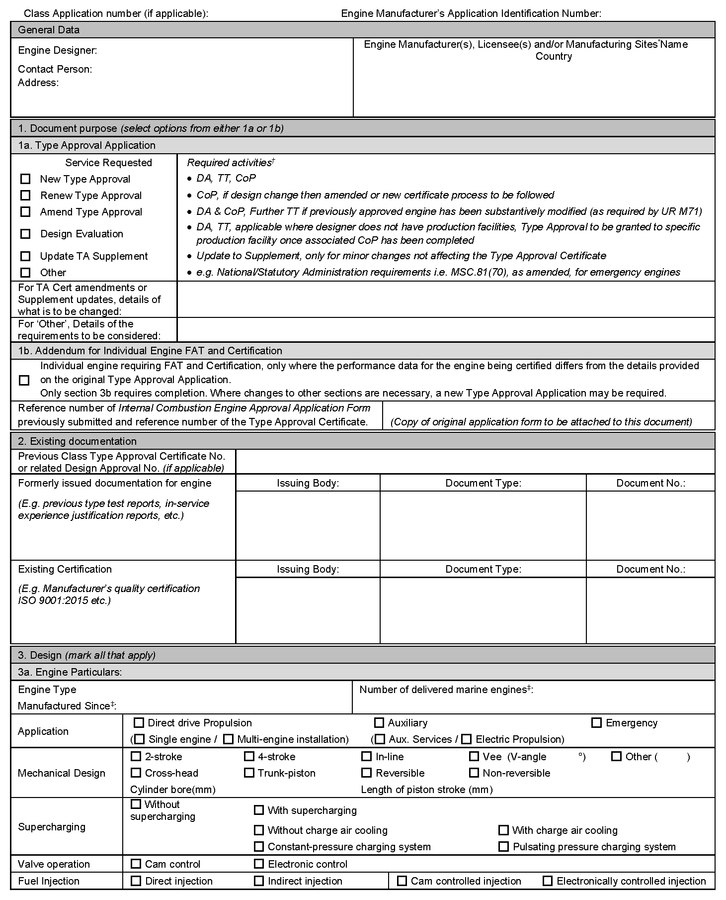
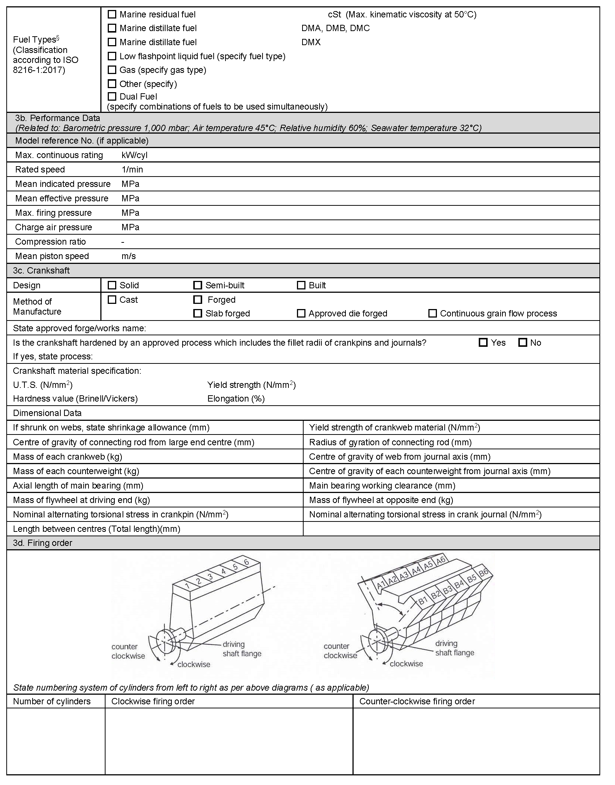
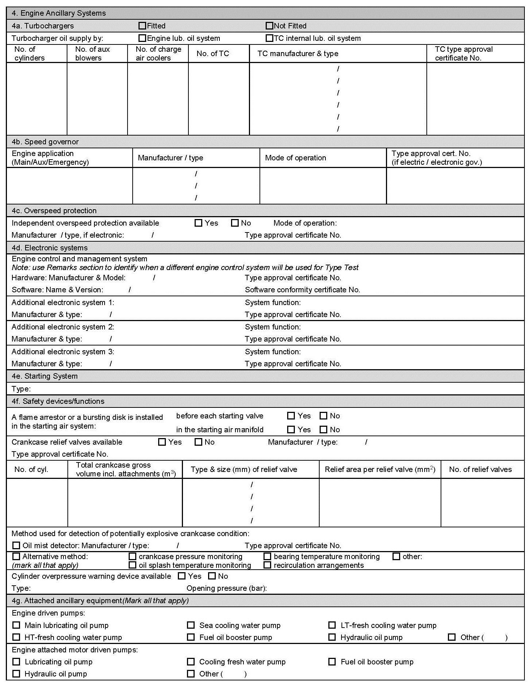
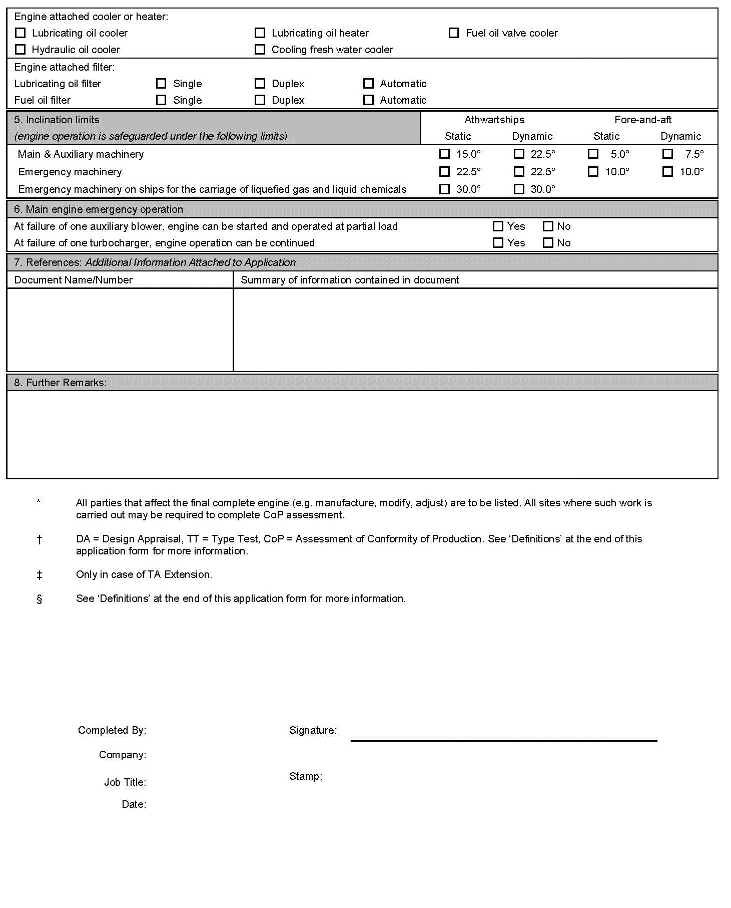
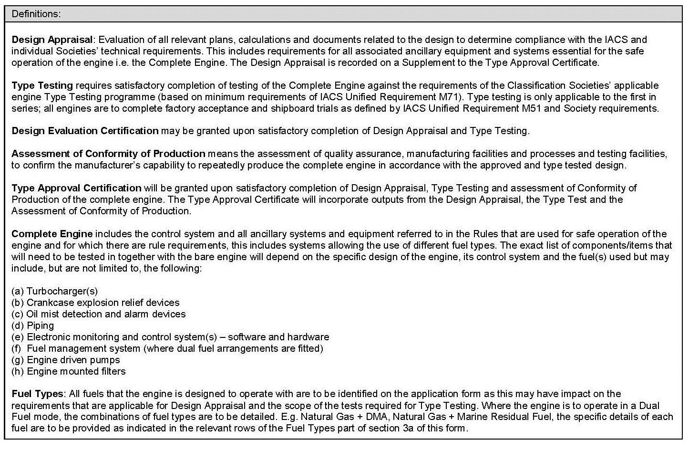
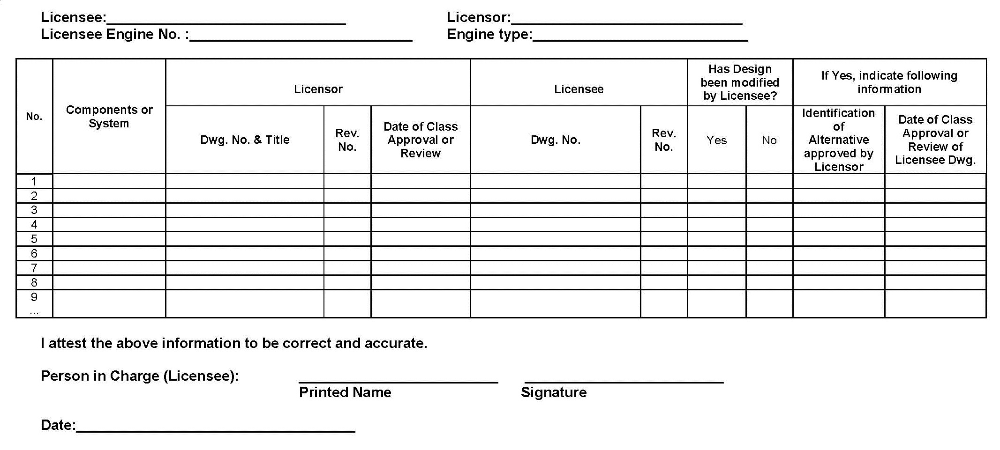
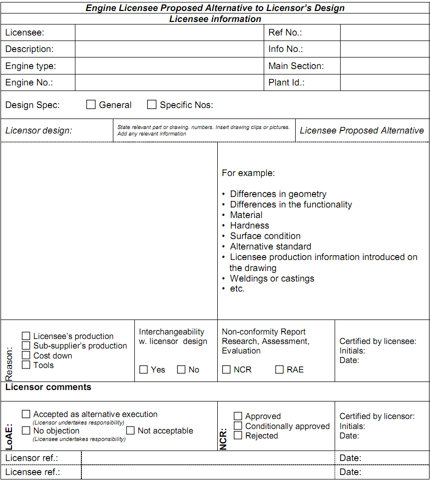

# PART 5 Machinery Installations

> RULES FOR CLASSIFICATION OF STEEL SHIPS / RA-05-E / 2025 / EN / Guidance

## Annex 5-11 Documents for the Approval of Reciprocating Internal Combustion Engines

### 1. General

#### (1) Type approval certificate

For each type of engine that is required to be approved, a type approval certificate is to be obtained by the engine licensor. This process consists of the engine designer obtaining followings.

- **(A)** drawing and specification approval
- **(B)** conformity of production
- **(C)** approval of type testing programme
- **(D)** type testing of engines
- **(E)** review of the obtained type testing results
- **(F)** evaluation of the manufacturing arrangements
- **(G)** issue of a type approval certificate upon satisfactorily meeting the Rule requirements

#### (2) Engine certificate

Each engine manufactured for a shipboard application is to have an engine certificate. The certification process details for obtaining followings.

- **(A)** drawing approval of the engine application specific documents
- **(B)** submitting a comparison list of the production drawings to the previously approved engine design drawings
- **(C)** forwarding the relevant production drawings and comparison list for the use of the Surveyors at the manufacturing plant and shipyard
- **(D)** engine shop testing
- **(E)** the issuance of an engine certificate

### 2. Document flow for obtaining a type approval certificate

#### (1) For the initial engine type, the engine designer prepares the documentation in accordance with Table 5.1.4 and Table 5.1.5 of the Rules including data sheet with general engine information in Table 1 and forwards to the Society according to the agreed procedure for review and approval. (2019)

#### (2) Upon review and approval of the submitted documentation (evidence of approval), it is returned to the engine licenser.

#### (3) The engine designer arranges for a Surveyor to attend an engine type test and upon satisfactory testing the Society issues a type approval certificate.

#### (4) A representative document flow process for obtaining a type approval certificate is shown in Fig 1.

#### (5) After the Society has approved the engine type for the first time, which have undergone substantive changes, such as strength, safety and performance will have to be resubmitted for consideration by the Society.

#### (6) The assignment of documents to Table 5.1.5 of the Rules for information does not preclude possible comments by the individual Society.

#### (7) Where considered necessary, the Society may request further documents to be submitted.

### 3. Document flow for engine certificate

#### (1) The engine type must have a type approval certificate. For the first engine of a type, the type approval process and the engine certification process may be performed simultaneously.

#### (2) Engines to be installed in specific applications may require the engine designer/licensor to modify the design or performance requirements. The modified drawings are forwarded by the engine designer/licensor to the engine builder/licensee to develop production documentation for use in the engine manufacture in accordance with Table 5.1.6 of the Rules.

#### (3) The engine builder/licensee develops a comparison list of the production documentation to the documentation listed in Tables 5.1.4 and Tables 5.1.5 of the Rules. An example comparison list is provided in Table 2. If there are differences in the technical content on the licensee’s production drawings/documents compared to the corresponding licensor’s drawings, the licensee must obtain agreement to such differences from the licensor using the template in Table 3.

#### (4) The engine builder/licensee submits the comparison list and the production documentation to the Society according to the agreed procedure for review/approval.

#### (5) As the attending Surveyors may request the engine builder/licensee or their subcontractors to provide the actual documents indicated in the list, the documents are necessary to be prepared and available for the Surveyors.

#### (6) The attending Surveyors, at the engine builder/licensee/subcontractors, will issue product certificates as necessary for components manufactured upon satisfactory inspections and tests.

#### (7) The engine builder/licensee assembles the engine, tests the engine with a Surveyor present. An engine certificate is issued by the Surveyor upon satisfactory completion of assembly and tests.

#### (8) A representative document flow process for obtaining an engine certificate is shown in Fig 2.

#### (9) In addition to the documents listed in Table 5.1.6 of the Rules, the engine builder/licensee is to be able to provide to the Surveyor performing the inspection upon request the relevant detail drawings, production quality control specifications and acceptance criteria. These documents are for supplemental purposes to the survey only.

**Fig 1 Type Approval document flow**

| Engine Designer/Licensor | Class Approval Center (Department for Type Approval) | Class Site Office |
| --- | --- | --- |
|   |   |   |

| **Fig 2 Engine Certificate document flow** |
| --- |
|  |

| **Fig 2 Engine Certificate document flow (continued)** |
| --- |
|  |

| **Table 1 Data Sheet with General Engine Information** |
| --- |
|  |

| **Table 1 Data Sheet with General Engine Information (continued)** |
| --- |
|  |

| **Table 1 Data Sheet with General Engine Information (continued)** |
| --- |
|  |

| **Table 1 Data Sheet with General Engine Information (continued)** |
| --- |
|  |

| **Table 1 Data Sheet with General Engine Information (continued)** |
| --- |
|  |

| **Table 2 Tubular Listing of Licensor's and Licensee's Drawing and Data** |
| --- |
|  |

| **Table 3 Sample Template for Confirmation of the Licensor's Acceptance of Licensee's Modifications** |
| --- |
|  |
