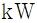
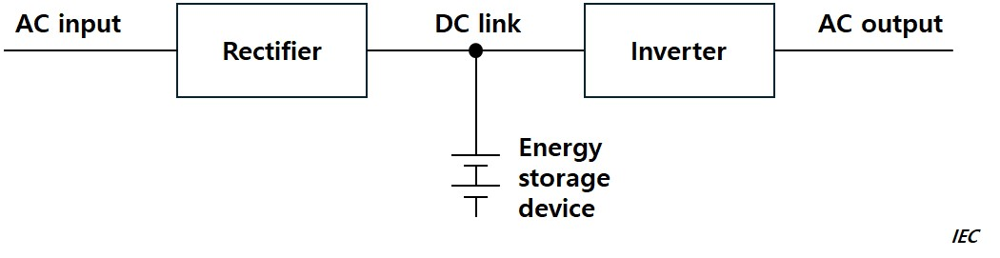
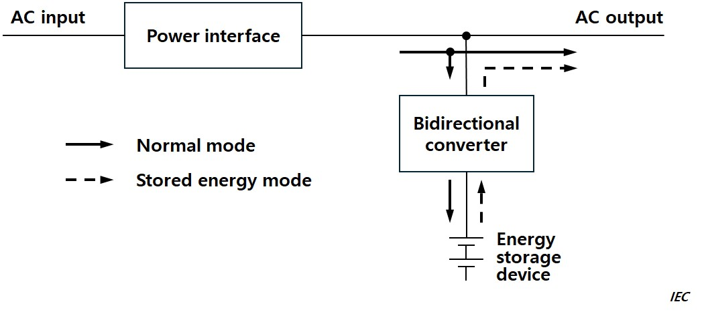
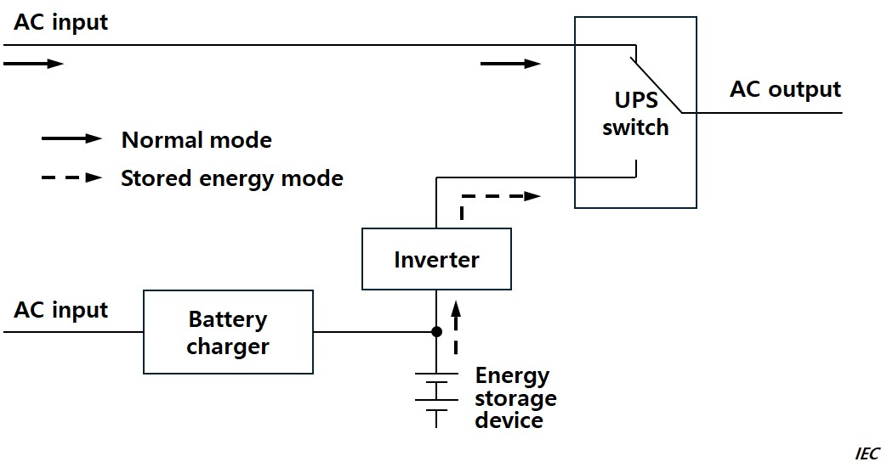

# PART 6 Electrical Equipment and Control Systems

> RULES FOR CLASSIFICATION OF STEEL SHIPS / RA-06-E / 2025 / EN / Rules

## CHAPTER 1 ELECTRICAL EQUIPMENT

### Section 1 General

#### 101. General

- **1.** **Application 【See Guidance】**
  - **(1)** The requirements of this Chapter apply to the electrical equipment and electric propulsion machinery intended for ships without special limitations for their service or purpose. For electrical equipment and electric propulsion machinery intended for ships with special limitations for their service or purpose and intended for small ships of less than 500 ton gross tonnage, the requirements in this Chapter may be modified within an extent considered appropriate by this Society.
  - **(2)** Except where a specific statement is made to the contrary, all requirements specified in this chapter are equally applicable to *a.c.* and *d.c.* installations.
  - **(3)** When the Society considers necessary, requirements specified in international electrical standards may apply.
- **2.** **Special electrical equipment 【See Guidance】**
  Electrical equipment and electric propulsion machinery not specified in this Chapter are to be as deemed appropriate by the Society.
- **3.** **Passenger ships**
  The electrical equipment of passenger ships engaged on international voyages is to comply with the requirements in this Part and in addition, attention is to be paid to compliance with the requirements of passenger ships specified in the International Convention for the Safety of Life at Sea (hereinafter referred to as the "SOLAS Convention").
- **4.** **Terminology**
  Terms used in this Chapter are as follows:
  - **(1)** **Dangerous spaces** are the following areas or spaces where flammable or explosive substances are placed and where it is likely to arise flammable or explosive gases or vapours from these substances and they are classified according to generation frequency and period of life for explosive gas atmosphere. **【See Guidance】**
    - **(A)** Zone 0 : area in which an explosive gas atmosphere is present continuously or is present for long periods.
    - **(B)** Zone 1 : area in which an explosive gas atmosphere is sometimes likely to occur in normal operation..
    - **(C)** Zone 2 : area in which an explosive gas atmosphere is not likely to occur in normal operation and, if it does occur, is likely to do so only infrequently and will exist for a short period only.
  - **(2)** **Selective tripping** is such an arrangement that only the protective device nearest to a fault point is opened automatically in order to maintain the power supply to the rests of sound circuits, in the event of a fault in the circuit having protective devices connected in series.
  - **(3)** **Preference tripping** is such an arrangement that the protective devices for unimportant circuits are opened automatically in order to ensure the power supply for vital services, when any one generator becomes overloaded or likely.
  - **(4)** **Normal operational and habitable condition** is a condition under which the ship as a whole, the machinery, services, means and aids ensuring propulsion, ability to steer, safe navigation, fire and flooding safety, internal and external communication and signals, means of escape, and emergency boat winches, as well as the designed comfortable conditions of habitability are in working order and functioning normally. All electrical services necessary for maintaining the ship in normal operational and habitable conditions are essential services and services for habitability.
  - **(5)** **Emergency condition** is a condition under which any services needed for normal operational and habitable conditions are not in working order due to failure of the main source of electrical power.
  - **(6)** **Main source of electrical power** is a source intended to supply electrical power to the main switchboard for distribution to all services necessary for maintaining the ship in normal operational and habitable conditions.
  - **(7)** **Main generator** is a generator for generating the main source of electrical power.
  - **(8)** **Main generating station** is the space in which the main source of electrical power is situated.
  - **(9)** **Main switchboard** is a switchboard which is directly supplied by the main source of electrical power and is intended to distribute electrical energy to the ship*′*s services.
  - **(10)** **Emergency source of electrical power** is a source of electrical power, intended to supply the emergency switchboard in the event of failure of the supply from the main source of electrical power.
  - **(11)** **Emergency switchboard** is a switchboard which in the event of failure of the main electrical power supply system is directly supplied by the emergency source of electrical power or the transitional source of emergency power and is intended to distribute electrical energy to the emergency services.
  - **(12)** Electrical services are classified into essential services and services for habitability.
  - **(13)** Essential services are those services essential for propulsion and steering, and safety of the ship, which are made up of "primary essential services" and "secondary essential services". Definitions and examples of such services are given in (A) and (B) below.
    - **(A)** Primary essential services are those services which need to be in continuous operation to maintain propulsion and steering. Examples of equipment for primary essential services are as follows:
      - **(a)** Steering gears
      - **(b)** Pumps for controllable pitch propellers
      - **(c)** Scavenging air blower, fuel oil supply pumps, fuel valve cooling pumps, lubricating oil pumps and cooling water pumps for main and auxiliary engines and turbines necessary for propulsion
      - **(d)** Forced draught fans, feed water pumps, water circulating pumps, vacuum pumps and condensate pumps for steam plants on steam turbine ships, and also for auxiliary boilers on ships where steam is used for equipment supplying primary essential services
      - **(e)** Oil burning installations for steam plants on steam turbine ships and for auxiliary boilers where steam is used for equipment supplying primary essential services
      - **(f)** Azimuth thrusters which are the sole means for propulsion/steering with lubricating oil pumps, cooling water pumps
      - **(g)** Electrical equipment for electric propulsion plant with lubricating oil pumps and cooling water pumps
      - **(h)** Electric generators and associated power sources supplying the primary essential service equipment
      - **(i)** Hydraulic pumps supplying the primary essential service equipment
      - **(j)** Viscosity control equipment for heavy fuel oil
      - **(k)** Low duty gas compressor and other boil-off gas treatment facilities supporting boil-off gas usage as fuel to main propulsion or electric power generation machinery
      - **(l)** Control, monitoring and safety devices/systems for equipment to primary essential services
    - **(B)** Secondary essential services are those services which need not necessarily be in continuous operation to maintain propulsion and steering but which are necessary for maintaining the vessel's safety. Examples of equipment for secondary essential services are as follows:
      - **(a)** Windlass
      - **(b)** Fuel oil transfer pumps and fuel oil treatment equipment
      - **(c)** Lubrication oil transfer pumps and lubrication oil treatment equipment
      - **(d)** Pre-heaters for heavy fuel oil
      - **(e)** Starting air and control air compressors
      - **(f)** Bilge, ballast and heeling pumps
      - **(g)** Fire pumps and other fire extinguishing medium pumps
      - **(h)** Ventilating fans for engine and boiler rooms
      - **(i)** Services considered necessary to maintain dangerous spaces in a safe condition
      - **(j)** Navigation lights, aids and signals
      - **(k)** Internal safety communication equipment
      - **(l)** Fire detection and alarm system
      - **(m)** Lighting system
      - **(n)** Electrical Equipment for watertight closing appliances
      - **(o)** Electric generators and associated power sources supplying the secondary essential service equipment
      - **(p)** Hydraulic pumps supplying the secondary essential service equipment
      - **(q)** Re-liquefaction plant on liquefied gas carriers
      - **(r)** Ventilation fans for hazardous areas
      - **(s)** Auxiliary and main engine starting installations
      - **(t)** Inert gas fans and scrubber and deck seal pumps
      - **(u)** Watertight doors, shell doors and other electrical operated closing appliances
      - **(v)** Jacking motors
      - **(w)** Water ingress detection and alarm system
      - **(x)** Thrusters not part of steering or propulsion
      - **(y)** Control, monitoring and safety systems for cargo containment systems
      - **(z)** Control, monitoring and safety devices/systems for equipment to secondary essential services
  - **(14)** Services for habitability are those services which need to be in operation for maintaining the vessel's minimum comfort conditions for the crew and passengers. Examples of equipment for maintaining conditions of habitability are as follows:
    - **(A)** Cooking
    - **(B)** Heating
    - **(C)** Domestic refrigeration
    - **(D)** Mechanical ventilation
    - **(E)** Sanitary and fresh water
    - **(F)** Electric generators and associated power sources supplying the above equipment
  - **(15)** Dead ship condition means a condition under which:
    - **(A)** the main propulsion plant, boilers and auxiliary machinery are not in operation due to the loss of the main source of electrical power, and
    - **(B)** in restoring propulsion, the stored energy for starting the propulsion plant, the main source of electrical power and other essential auxiliary machinery is assumed to be not available. It is assumed that means are available to start the emergency generator at all times.
  - **(16)** **Section board** is an assembly of switchgear, control gear, etc for controlling the supply of electrical power from a switchboard and distributing it to other section boards, distribution boards or final sub-circuits.
  - **(17)** **Distribution board** is an assembly of one or more protective devices arranged for the distribution of electrical power to final sub-circuits.
  - **(18)** **Diversity factor** is the ratio of the estimated total load of a group of consumers under their normal working conditions to the sum of their nominal ratings. *(2019)*

#### 102. Drawings and data

The drawings and data to be submitted for approval before the commencement of work are generally as follows:

- **1.** **Drawings and data to be submitted by the shipyard**
  - **(1)** Investigation table of electrical load analysis (main and emergency sources including batteries)
  - **(2)** Wiring diagram for power systems (including emergency source)
  - **(3)** Wiring diagram for lighting systems (including emergency lightings)
  - **(4)** Wiring diagram for control systems
  - **(5)** Wiring diagram for navigation and communication systems
  - **(6)** Wiring diagram for radio systems
  - **(7)** Wiring diagram for fire detection and alarm systems
  - **(8)** General arrangement for electrical systems (bridge, radio room, accommodation space, engine room, all decks, etc.)
  - **(9)** Arrangement for navigation and signal lights
  - **(10)** Drawings indicating dangerous spaces (if necessary)
  - **(11)** Drawings of measuring equipment for cargo tanks (if necessary)
  - **(12)** List of particulars of high voltage electrical equipment(if necessary)
  - **(13)** Calculation sheets of short-circuit current in the circuits(if the sum of rated power is 500 $\mathrm{kVA}$($\mathrm{kW}$) and over)
  - **(14)** Drawings and data as deemed necessary by the Society (in case of special construction ships) **【See Guidance】**
- **2.** **Drawings and data to be submitted by the manufacturers of electrical equipment**
  Drawings and data are to be submitted and approved by manufacturers of electrical equipment in accordance with **103. 1. Table 6.1.1.**

#### 103. Testing and inspection

- **1.** **General**
  - **(1)** The electrical equipment and cables in **Table 6.1.1** are to be approved(drawing approval, type approval) by the Society or to be tested in accordance with relevant requirements of this Chapter at the manufacturer's works or at other works having the adequate apparatus for testing and inspections.
  - **(2)** The electrical equipment and cables specified in the **Table 6.1.1** are to be type approved in accordance with the「Guidance for Approval of Manufacturing Process and Type Approval, etc.」before being taken into use. **【See Guidance】**
- **2.** **Inspections based on Quality Assurance Scheme**
  Where the electrical equipment is manufactured by Quality Assurance Scheme specified in「Guidance for Approval of Manufacturing Process and Type Approval, etc.」, a part or all of the tests and inspections in the presence of the Society's Surveyor may be omitted.
- **3.** **Tests after installation on board**
  Electrical equipment and cables, after installation on board the ship, are to be tested and inspected in accordance with the requirements in **Sec 17.**
- **4.** **Additional tests and inspections 【See Guidance】**
  The Society may require, when it deems necessary, other tests and inspections than those specified in this Chapter.
- **5.** **Exemption from tests and inspections**
  Electrical equipment having the certificate considered acceptable by the Society may be exempted partially or wholly from the tests and inspections.
- **6.** **Tests and inspections on type approved products 【See Guidance】**
  Tests and inspections on type approved products are to be in accordance with the requirements which the Society considers appropriate.

  | No. | Electrical equipment and cables | Drawing approval | Test and inspection | Type approval |
  | --- | --- | --- | --- | --- |
  | 1 | Generators(1) | X(2) | X |   |
  | 2 | Motors(3)(4)(5) | X(6) | X |   |
  | 3 | Control gears for Motors(3)(4)(5) | X(6) | X |   |
  | 4 | Main switchboards and emergency switchboards | X | X |   |
  | 5 | Battery charging and discharging board for emergency sources of electrical power | X | X |   |
  | 6 | Power converters | X(17) | X(16) | X(16) |
  | 7 | Control gears for electric propulsion unit | X | X | X |
  | 8 | Transformers(7)(8) | X(9) | X |   |
  | 9 | Power semi-conductor rectifiers(10) |   | X |   |
  | 10 | Uninterrupted power supplies(11) |   | X | X |
  | 11 | Cables(18) |   |   | X |
  | 12 | Fuses, Circuit-breakers, Protection relay, Electro-magnetic contactors |   |   | X |
  | 13 | Explosion-protected electrical equipment **【See Guidance】** |   | X(12) | X |
  | 14 | Cable splices |   |   | X |
  | 15 | Navigation light control panel |   | X |   |
  | 16 | Shore connection box(9) | X | X |   |
  | 17 | Electric fuel oil heating systems(13) | X | X |   |
  | 18 | LED lighting(14) |   |   | X |
  | 19 | Cable trays/protective casings made of plastic materials |   |   | X |
  | 20 | Busbar trunking systems(15) |   | X | X |
  | (Notes) (1) Only applicable for main and emergency generators, except harbor generators. (2) Only applicable for generators of 100 $\mathrm{kVA}$ and above. (3) Only applicable for Control gears for the motors, and motors which drive essential auxiliaries specified in **Pt 5, Ch 1, 102.** of the Guidance and exceed the output 7.5 $\mathrm{kW}$. (4) Only applicable for motors for electric propulsion. (5) For the output of not more than 50 $\mathrm{kW}$, if there are manufacturer's own test reports, a part or all of tests and inspections in the presence of the Society's Surveyor may be replaced subject to the Society's permission. *(2018)* **【See Guidance】** (6) To be complied with note (10) in Table 6.1.10. *(2018)* (7) Only applicable for transformers for power and lighting of single phase 1 $\mathrm{kVA}$ and above or 3 phase 5 $\mathrm{kVA}$ and above. |   |   |   |   |

  | (Notes) (8) For the transformer with running capacity of less than 100 $\mathrm{kVA}$, if there are manufacturer's own test reports, a part or all of tests and inspections in the presence of the Society's Surveyor may be replaced subject to the Society's permission. *(2018)* **【See Guidance】** (9) Only applicable for high voltage electrical installations(1 $\mathrm{kV}$ and above). (10) Only applicable for Power semi-conductor rectifiers of 5 $\mathrm{kW}$ or more. (11) Uninterrupted power supplies for essential services 5 $\mathrm{kVA}$ or more and emergency source of electrical power of 50 $\mathrm{kVA}$ or more are to satisfy the requirements of the type approval test specification in accordance with **Ch 3, Sec 39** of the「**Guidance for Approval of Manufacturing Process and Type Approval, etc.**」. Test and inspection apply for Uninterrupted power supplies of 50 $\mathrm{kVA}$ or more are to satisfy the requirements of the test and inspection in accordance with 1203. 6. *(2023)* (12) Only applicable for rotating machines. And note (5) can be applied. *(2018)* (13) To be carried out test and inspection in accordance with **Table 6.1.24**. *(2019)* (14) Only applicable for LED lighting installed in navigation bridge. (15) To be carried out test and inspection in accordance with **Table 6.1.25** and to be carried out type approval in accordance with **Ch 3, Sec 37** of the「**Guidance for Approval of Manufacturing Process and Type Approval, etc.**」 *(2019)* (16) The following power converters are to meet the requirements of the type approval test specification in accordance with **Ch 3, Sec 39** of the「**Guidance for Approval of Manufacturing Process and Type Approval, etc.**」. For power and control modules certified type approval such as IGBT are installed in enclosures, test and inspection may be accepted. *(2023)* - For power supply of 50 $\mathrm{kVA}$ or more - For essential motors of 100 $\mathrm{kW}$ or more - For electric propulsion (17) The requirements apply to the following power converters. *(2023)* - For essential motors of 100 $\mathrm{kW}$ or more - For electric propulsion (18) Cable manufacturers are to be carried out manufacturer approval in accordance with Ch 6 of the Guidance for Approval Manufacturing Process and Type Approval, etc. *(2025)* |
  | --- |

### Section 2 System Design

#### 201. General

- **1.** **Requirements of electrical installation**
  - **(1)** All electrical auxiliary services necessary for maintaining the ship in normal operational and habitable conditions will be ensured without recourse to the emergency source of electrical power.
  - **(2)** Electrical services essential for safety will be ensured under various emergency conditions.
  - **(3)** The safety of crew and ship from electrical hazards will be ensured.
- **2.** **Construction and installation**
  - **(1)** **Construction**
    Electrical equipment is to be so constructed as to provide easy accessibility to all parts requiring inspection, overhaul and repair.
  - **(2)** **Protection against corrosion**
    - **(A)** Bolts, nuts, pins, screws, terminals, studs, springs and such other small parts are to be made of corrosion resistant materials or those suitably protected against corrosion.
    - **(B)** If electrical fittings, not of aluminium, are attached to aluminium, suitable means are to be taken to prevent corrosion.
  - **(3)** **Protection against electrical shock 【See Guidance】**
    - **(A)** Where the operators are liable to inadvertently touch the live part of electrical apparatus due to ship*′*s inclination and vibration, such parts are to be protected with suitable means to prevent electrical shock.
    - **(B)** The moving parts, reciprocating parts, high temperature parts or charged parts of electrical equipment are to be provided with suitable protections for one who watches, operates or approaches the equipment to avoid injury.
    - **(C)** To minimize shock from high-frequency voltage induced by the radio transmitter, handles, handrails, etc. of metal on the bridge or upper decks are to be in good electrical connection with the hull or superstructure.
  - **(4)** **Installation of propulsion machines**
    Means are to be provided to prevent the accumulation of bilge under propulsion machines (generators, motor-generators, motors, electro-magnetic slip couplings).
  - **(5)** **Installation and protective enclosure 【See Guidance】**
    Electrical equipment is to be accessibly placed in well ventilated and adequately lighted spaces in which inflammable gases cannot accumulate and where it is not exposed to the risk of mechanical injuries or damage from water, steam or oil, and is to be so installed that space is available for maintenance. Where, however, electrical equipment are unavoidably installed in spaces not fulfilled the above conditions, they are to be of the following construction.
    - **(A)** Drip-proof construction where water drip and oil are liable to drop.
    - **(B)** Water-proof construction where installed on exposed decks liable to get wet by sea water, rain or bilge water.
    - **(C)** Submersible construction where employed in water.
    - **(D)** Explosion-proof construction where explosive or inflammable materials are stored or liable to accumulate.
  - **(6)** **Insulating materials and insulated windings**
    Insulating materials and insulated windings are to be of resisting quality against moisture, sea air and oil vapour.
  - **(7)** **Power source control switches**
    Electrical equipment is not to remain alive through the control circuits or pilot lamps when switched off by the control switch.
  - **(8)** **Mechanical lock**
    All nuts and screws used in connection with current carrying parts and working parts are to be effectively locked.
  - **(9)** **Consideration of magnetic compass 【See Guidance】**
    Electrical equipment and cables are to be placed at such a distance from the magnetic compasses that the interfering external magnetic field is negligible, even when circuits are switched on and off.
  - **(10)** **Electromagnetic compatibility**
    Electrical and electronic equipment on the bridge are to be so installed that electromagnetic interference does not affect the proper function of navigational systems and equipment.
- **3.** **Earthing of electrical equipment 【See Guidance】**
  - **(1)** **Fixed electrical equipment**
    All accessible non-current-carrying metal parts of fixed electrical equipment are to be effectively earthed. Where earthing connections are necessary, the sectional area of the earthing conductor is to be as deemed appropriate by the Society. (refer to the Guidance)
  - **(2)** Exposed metal parts of electrical machines or equipment which are not intended to be live but which are liable under fault conditions to become live are to be earthed unless the machines or equipment are:
    - **(A)** supplied at a voltage not exceeding 50 $\mathrm{V}$ *d.c.* or 50 $\mathrm{V}$ *a.c.*, root mean square between conductors; auto-transformers are not to be used for the purpose of achieving this voltage; or
    - **(B)** supplied at a voltage not exceeding 250 $\mathrm{V}$ by safety isolating transformers supplying only one consuming device; or
    - **(C)** constructed in accordance with the principle of double insulation.
  - **(3)** Additional safety means are to be provided for portable electrical apparatus for use in confined or exceptionally damp spaces where particular risks due to conductivity exist.
- **4.** **System of supply**
  The following systems of supply are considered as standard:
  - **(1)** Two-wire for direct current.
  - **(2)** Three-wire for direct current (three-wire insulated system or three-wire mid-wire earthed system).
  - **(3)** Single phase two-wire for alternating current.
  - **(4)** Three phase three-wire for alternating current.
  - **(5)** Three phase four-wire for alternating current.
- **5.** **Voltage and frequency** ***(2017)***
  - **(1)** **Supply voltage**
    Supply voltage is not to exceed:
    - **(A)** 500$\mathrm{V}$ for cooking and heating equipment permanently connected to fixed wiring.
    - **(B)** 15,000 $\mathrm{V}$ *a.c*. or 3,000 $\mathrm{V}$ *d.c.* for electric propulsion equipment.
    - **(C)** 15,000 $\mathrm{V}$ *a.c.* or 500 $\mathrm{V}$ *d.c.* for generators and power equipment.
    - **(D)** 250 $\mathrm{V}$ for lighting, heaters in cabins and public rooms and other applications not mentioned (A), (B) and (C) above.
  - **(2)** **Standard frequency**
    Frequency of 50 $\mathrm{Hz}$ or 60 $\mathrm{Hz}$ is recognized as a standard.
  - **(3)** **Voltage and frequency variations**

    **Table 6.1.2 Voltage and frequency variations**

    | **(c) Voltage variations for battery systems** Systems ; Variations Components connected to the battery during charging (see Note) ; +30 $\%$, -25 $\%$ Components not connected to the battery during charging ; +20 $\%$, -25 $\%$ (Note) Different voltage variations as determined by the charging/discharging characteristics, including ripple voltage from the charging device, may be considered. **(a) Voltage and frequency variations for** ***a.c.*** **distribution systems** Type of variations Variations Permanent Transient Frequency ± 5 $\%$ ± 10 $\%$ (5 sec) Voltage + 6 $\%$, -10 $\%$ ± 20 $\%$ (1.5 sec) **Table 6.1.3 Minimum Clearance and Creepage inside the Terminal Box of Rotating Machine** Rated voltage ($\mathrm{V}$) ; Clearance ($\mathrm{mm}$) ; Creepage ($\mathrm{mm}$) 61 ~ 250 251 ~ 380 381 ~ 500 ; 5 6 8 ; 8 10 12 **(b) Voltage variations for** ***d.c*** **distribution systems** Parameters Variations Voltage tolerance (continuous) ± 10 $\%$ Voltage cyclic variation deviation 5 $\%$ Voltage ripple(*a.c.* r.m.s. over steady *d.c.* voltage) 10 $\%$ **Table 6.1.4 Values of Constant** $F$ Bearing arrangement of a rotating machinery shaft ; In case of generator driven by steam or gas turbine, generator driven by diesel engine through slip type coupling${} ^{(1)}$, or electrical motor ; In case of generator driven by diesel engine other than those mentioned in the left-hand column Where bearings are arranged at both sides of a rotating machinery shaft ; 110 ; 115 Where no bearing is arranged at prime mover side or load side of a rotating machinery shaft ; 120 ; 125 (NOTE) (1) Slip type coupling signifies hydraulic coupling, electro-magnetic coupling or the equivalent **(c) Voltage variations for battery systems** Systems Variations Components connected to the battery during charging (see Note) +30 $\%$, -25 $\%$ Components not connected to the battery during charging +20 $\%$, -25 $\%$ (Note) Different voltage variations as determined by the charging/discharging characteristics, including ripple voltage from the charging device, may be considered. |   |   |
    | --- | --- | --- |
    | **(c) Voltage variations for battery systems** |   |   |
    | Systems | Variations |   |
    | Components connected to the battery during charging (see Note) | +30 $\%$, -25 $\%$ |   |
    | Components not connected to the battery during charging | +20 $\%$, -25 $\%$ |   |
    | (Note) Different voltage variations as determined by the charging/discharging characteristics, including ripple voltage from the charging device, may be considered. |   |   |
    | **Table 6.1.3 Minimum Clearance and Creepage inside the Terminal Box of Rotating Machine** |   |   |
    | Rated voltage ($\mathrm{V}$) | Clearance ($\mathrm{mm}$) | Creepage ($\mathrm{mm}$) |
    | 61 ~ 250 251 ~ 380 381 ~ 500 | 5 6 8 | 8 10 12 |
    | **Table 6.1.4 Values of Constant** $F$ |   |   |
    | Bearing arrangement of a rotating machinery shaft | In case of generator driven by steam or gas turbine, generator driven by diesel engine through slip type coupling${} ^{(1)}$, or electrical motor | In case of generator driven by diesel engine other than those mentioned in the left-hand column |
    | Where bearings are arranged at both sides of a rotating machinery shaft | 110 | 115 |
    | Where no bearing is arranged at prime mover side or load side of a rotating machinery shaft | 120 | 125 |
    | (NOTE) (1) Slip type coupling signifies hydraulic coupling, electro-magnetic coupling or the equivalent |   |   |
    - **(A)** All electrical appliances supplied from the main or emergency systems are to be so designed and manufactured that they are capable of operating satisfactorily under the normally occurring variations in voltage and frequency.
    - **(B)** Unless otherwise stated in the national or international standards, all equipment are to operate satisfactorily with the variations from its rated value shown in the **Tables 6.1.2** on the following conditions.
      - **(a)** For alternative current components, voltage and frequency variations shown in the **Table 6.1.2** (a) are to be assumed.
      - **(b)** For direct current components supplied by *d.c.* generators or converted by rectifiers, voltage variations shown in the **Table 6.1.2** (b) are to be assumed.
      - **(c)** For direct current components supplied by electrical batteries, voltage variations shown in the **Table 6.1.2** (c) are to be assumed.
    - **(C)** Any special systems, e.g. electronic circuits, whose function cannot operate satisfactorily within the limits shown in **Table 6.1.2** is not to be supplied directly from the system but by alternative means, e.g. through stabilized supply.
- **6.** **Ambient conditions**
  - **(1)** The ambient conditions given in **Table 5.1.2** and **Table 5.1.3** in **Pt 5, Ch 1** are to be applied unless otherwise specified, to the design, selection and arrangement of electrical installations as to ensure proper operation. However, ambient temperatures for electrical equipment installed in environmentally controlled spaces are to be in accordance with the requirements which the Society considers appropriate. **【See Guidance】**
  - **(2)** The operation of all electrical equipment is to be sufficient under such conditions of vibration as to arise in normal practice.
- **7.** **Clearance and creepage 【See Guidance】**
  - **(1)** The clearances and creepages between live parts and between live part and earthed metal (hereinafter to be called the “clearance and creepage”) are to be adequate for the working voltage having regard to the nature and service condition of the insulating material.
  - **(2)** The clearance and creepage for the inside terminal box of rotating machinery, the switchboard busbar and the controlling equipment, etc. are to conform to the values as required in each relevant Section in this Chapter.
- **8.** **Harmonic distortion** *(2020)*
  - **(1)** **General**
    - **(A)** The total harmonic distortion (THD) in the voltage waveform of electrical distribution systems is not to exceed 8% and any single order harmonics not to exceed 5%. *(2023)*
    - **(B)** This limit may be exceeded where all installed equipment and systems have been designed for a higher specified limit and this relaxation on limits is documented (harmonic distortion calculation report) and made available on board as a reference for the surveyor at each periodical survey.
  - **(2)** **Harmonic distortion for ship electrical distribution system including harmonic filters**
    The these requirements apply to ships where harmonic filters are installed on main busbars of electrical distribution system, other than those installed for single application frequency drives such as pump motors.
    - **(A)** Application
    - **(B)** Monitoring of harmonic distortion levels for a ship where harmonic filters are installed
      - **(a)** The ships are to be fitted with facilities to continuously monitor the levels of harmonic distortion experienced on the main busbar as well as alerting the crew should the level of harmonic distortion exceed the acceptable limits. Where the engine room is provided with automation systems, this reading is to be logged electronically, otherwise it is to be recorded in the engine log book for future inspection by the surveyor.
    - **(C)** Mitigation of the effects of harmonic filter failure on a ship's operation
      - **(a)** Where the electrical distribution system on board a ship includes harmonic filters the system integrator of the distribution system is to show, by calculation, the effect of a failure of a harmonic filter on the level of harmonic distortion experienced.
      - **(b)** The system integrator of the distribution system is to provide the ship owner with guidance documenting permitted modes of operation of the electrical distribution system while maintaining harmonic distortion levels within acceptable limits during normal operation as well as following the failure of any combination of harmonic filters.
      - **(c)** The calculation results and validity of the guidance provided are to be verified by the surveyor during sea trials.
    - **(D)** Protection arrangements for harmonic filters
      - **(a)** Arrangements are to be provided to alert the crew in the event of activation of the protection of a harmonic filter circuit.
      - **(b)** A harmonic filter is to be arranged as a three phase unit with individual protection of each phase. The activation of the protection arrangement in a single phase is to result in automatic disconnection of the complete filter. Additionally, there is to be installed a current unbalance detection system independent of the overcurrent protection alerting the crew in case of current unbalance.
      - **(c)** Consideration is to be given to additional protection for the individual capacitor element as e.g. relief valve or overpressure disconnector in order to protect against damage from rupturing. This consideration should take into account the type of capacitors used.

#### 202. Main source of electrical power (2019)

- **1.** **Capacity and arrangement of generating sets**
  - **(1)** A main source of electrical power of sufficient capacity to supply essential services and services for habitability is to be provided. This main source of electrical power is to consist of at least two generating sets.
  - **(2)** The capacity of these generating sets is to be such that in the event of any one generating set being stopped it will still be possible to supply essential services and services for habitability necessary to provide normal operational conditions of propulsion and safety. Minimum comfortable conditions of habitability shall also be ensured which include at least adequate services for cooking, heating, domestic refrigeration, mechanical ventilation, sanitary and fresh water.
  - **(3)** Where the main source of electrical power is necessary for propulsion and steering of the ship, the system is to be so arranged that the electrical supply to equipment necessary for propulsion and steering and to ensure safety of the ship will be maintained or immediately restored in the case of loss of any one of the generators in service. Preference tripping or other equivalent arrangements are to be provided to protect the generators against sustained overload. **【See Guidance】**
  - **(4)** The arrangements of the ship's main source of electrical power is to be such that the essential services and services for habitability can be maintained regardless of the speed and direction of rotation of the propulsion machinery or shafting. **【See Guidance】**
  - **(5)** The generating sets are to be such as to ensure that with any one generator or its primary source of power out of operation, the remaining generating sets are to be capable of providing the electrical services necessary to start the main propulsion plant from a dead ship condition. The emergency source of electrical power may be used for the purpose of starting from a dead ship condition if its capability either alone or combined with that of any other source of electrical power is sufficient to provide at the same time those services required to be supplied by **203. 2.** (2) (A) to (E).
- **2.** **Transformers and Converters**
  - **(1)** Capacity and number of transformer **【See Guidance】**
    Where essential services are supplied, the number and ratings of transformers are to be sufficient to ensure the operation of essential services even when one transformer is out of service.
  - **(2)** Transformers and converters for battery charger
    - **(A)** Where batteries connected to a single battery charger are the sole means of supplying DC power to equipment for essential services, failure of the single battery charger under normal operating conditions are not to result in total loss of these services once the batteries are depleted. In order to ensure continuity of the power supply to such equipment, one of the following arrangements is to be provided:
      - **(a)** Duplicate battery chargers
      - **(b)** A single battery charger and a transformer/rectifier (or switching converter) which is independent of the battery charger, provided with a changeover switch
      - **(c)** Duplicate transformer/rectifier (or switching converter) units within a single battery charger, provided with a changeover switch
    - **(B)** The above requirements are not applicable for equipment for essential services, which contains a single transformer/rectifier with a single AC power supply feeder to such equipment.

#### 203. Emergency source of electrical power

- **1.** **Application**
  - **(1)** A self-contained emergency source of electrical power is to be provided.
  - **(2)** The emergency source of electrical power, associated transforming equipment, if any, transitional source of emergency power, emergency switchboard and emergency lighting switchboard are to be located above the uppermost continuous deck and are to be readily accessible from the open deck. They are not to be located forward of the collision bulkhead, except where permitted by the Society in exceptional circumstances.
  - **(3)** The location of the emergency source of electrical power, associated transforming equipment, if any, the transitional source of emergency power, the emergency switchboard and the emergency lighting switchboard in relation to the main source of electrical power, associated transforming equipment, if any, and the main switchboard are to be such as to ensure to the satisfaction of the Society that a fire or other casualty in spaces containing the main source of electrical power, associated transforming equipment, if any, and the main switchboard, or in any machinery space of category A will not interfere with the supply, control and distribution of emergency electrical power. As far as practicable, the space containing the emergency source of electrical power, associated transforming equipment, if any, the transitional source of emergency electrical power and the emergency switchboard are not to be contiguous to the boundaries of machinery spaces of category A or those spaces containing the main source of electrical power, associated transforming equipment, if any, or the main switchboard.
  - **(4)** Provided that suitable measures are taken for safeguarding independent emergency operation under all circumstances, the emergency generator may be used exceptionally, and for short periods, to supply non-emergency circuits. **【See Guidance】**
- **2.** **Capacity of emergency source of power**
  - **(1)** The electrical power available is to be sufficient to supply all those services that are essential for safety in an emergency, due regard being paid to such services as may have to be operated simultaneously.
  - **(2)** The emergency source of electrical power is to be capable, having regard to starting currents and the transitory nature of certain loads, of supplying simultaneously at least the following services for the periods specified hereinafter, if they depend upon an electrical source for their operation: **【See Guidance】**
    VHF radio installation required by regulations IV/7.1.1 and IV/7.1.2, MF radio installation required by regulations IV/9.1.1, IV/9.1.2, IV/10.1.2 and IV/10.1.3, INMARSAT Ship Earth Stations required by regulation IV/10.1.1 and MF/HF radio installation as required by regulations IV/10.2.1, IV/10.2.2 and IV/11.1 of SOLAS Convention.
    - **(A)** For a period of 3 hours, emergency lighting at every muster and embarkation station and over the sides as required by regulations III/11.4 and III/16.7, Amendments to SOLAS 1974.
    - **(B)** For a period of 18 hours, following emergency lighting.
      - **(a)** In all service and accommodation alleyways, stairways and exits, personnel lift cars and personnel lift trunks ;
      - **(b)** In the machinery spaces and main generating stations including their control positions ;
      - **(c)** In all control stations, machinery control rooms, and at each main and emergency switchboard ;
      - **(d)** At all stowage positions for firemen's outfits ;
      - **(e)** At the steering gear ; and.
      - **(f)** At the fire pump referred to in (F) at the sprinkler pump, if any, and at the emergency bilge pump, if any, and at the starting positions of their motors.
      - **(g)** In all cargo pump rooms of tankers
    - **(C)** For a period of 18 hours, the navigation lights and other lights required by the International Regulations for Preventing Collisions at Sea in force.
    - **(D)** For a period of 18 hours ;
    - **(E)** For a period of 18 hours, except those services have an independent supply for the period of 18 hours from an accumulator battery suitably located for use in an emergency.
      - **(a)** All internal communication equipment as required in an emergency.
      - **(b)** The navigational equipment as required by regulation V/19 of SOLAS Convention where such provision is unreasonable or impracticable the Society may waive this requirement for ships of less than 5,000 gross tonnage.
      - **(c)** The fire detection and fire alarm system.
      - **(d)** Intermittent operation of the daylight signalling lamp, the ship's whistle, the manual fire alarms and all internal signals that are required in an emergency.
    - **(F)** For a period of 18 hours, one of the fire pumps required by regulation II-2 / 10 of SOLAS Convention if dependent upon the emergency generator for its source of power.
    - **(G)** For the period of time required by **Pt 5, Ch 7** the steering gear where it is required to be so supplied by that requirement.
    - **(H)** In a ship engaged regularly in voyages of short duration, the Society if satisfied that an adequate standard of safety would be attained may accept a lesser period than the 18 hours period specified in (B) to (F) but not less than 12 hours.
- **3.** **Kind and performance of emergency source of electrical power**
  The emergency source of electrical power is to be a generator, an accumulator battery or an uninterruptible power system(UPS), which is to comply with the following ;
  - **(1)** Where the emergency source of electrical power is a generator, it is to comply with the following :
    - **(A)** The emergency generator is to be driven by a suitable prime mover with an independent supply of fuel, having a flashpoint (closed cup test) of not less than 43°C ;
    - **(B)** The emergency generator is to be started automatically upon failure of the main source of electrical power supply unless a transitional source of emergency electrical power in accordance with (C) is provided; where the emergency generator is automatically started, it is to be automatically connected to the emergency switchboard; those services referred to the requirements in **4.** are then to be connected automatically to the emergency generator ;
    - **(C)** A transitional source of emergency electrical power as specified in **4.** is to be provided unless an emergency generator is provided capable both of supplying the services mentioned in that paragraph and of being automatically started and supplying the required load as quickly as is safe and practicable subject to a maximum of 45 seconds.
  - **(2)** Where the emergency source of electrical power is an accumulator battery, it is to be capable of :
    - **(A)** carrying the emergency electrical load without recharging while maintaining the voltage of the battery throughout the discharge period within 12 $\%$ above or below its nominal voltage ; **【See Guidance】**
    - **(B)** automatically connecting to the emergency switchboard in the event of failure of the main source of electrical power ; and
    - **(C)** immediately supplying at least those services specified in **4.**
  - **(3)** Where the emergency source of electrical power is an uninterruptible power system(UPS), it is to comply with 1203. *(2021)*
  - **(4)** Where electrical power is necessary to restore propulsion, the capacity is to be sufficient to restore propulsion to the ship in conjunction with other machinery, as appropriate, from a dead ship condition within 30 minutes*.* **【See Guidance】**
- **4.** **Transitional source of emergency electrical power**
  The transitional source of emergency electrical power where required by **3.** is to consist of an accumulator battery suitably located for use in an emergency which is to :
  - **(1)** operate without recharging while maintaining the voltage of the battery throughout the discharge period within 12 % above or below its nominal voltage ; and **【See Guidance】**
  - **(2)** be of sufficient capacity and be so arranged as to supply automatically in the event of failure of either the main or the emergency source of electrical power for half an hour at least the following services if they depend upon an electrical source for their operation :
    - **(A)** The lighting required by **2.** (2) (A) to (C). For this transitional phase, the required emergency electric lighting, in respect of the machinery space and accommodation and service spaces may be provided by permanently fixed, individual, automatically charged, relay operated accumulator lamps ; and
    - **(B)** All services required by **2.** (2) (E) (a), (c) and (d) unless such services have an independent supply for the period specified from an accumulator battery suitably located for use in an emergency.
- **5.** **Location, etc. of emergency source of electrical power**
  - **(1)** The emergency switchboard is to be installed as near as is practicable to the emergency source of electrical power.
  - **(2)** Where the emergency source of electrical power is a generator, the emergency switchboard is to be located in the same space unless the operation of the emergency switchboard would thereby be impaired. No accumulator battery fitted in accordance with this regulation is to be installed in the same space as the emergency switchboard.
  - **(3)** An indicator is to be mounted in a suitable place on the main switchboard or in the machinery control room to indicate when the batteries constituting either the emergency source of electrical power or the transitional source of electrical power are being discharged.
  - **(4)** The emergency switchboard is to be supplied during normal operation from the main switchboard by an interconnector feeder which is to be adequately protected at the main switchboard against overload and short circuit and which is to be disconnected automatically at the emergency switchboard upon failure of the main source of electrical power. Where the system is arranged for feedback operation the interconnector feeder is also to be protected at the emergency switch board at least against short circuit.
  - **(5)** In order to ensure ready availability of the emergency source of electrical power, arrangements are to be made where necessary to disconnect automatically non-emergency circuits from the emergency switchboard to ensure that electrical power is to be available automatically to the emergency circuits.
  - **(6)** Emergency electrical system is to be provided with measures for periodic testing. The periodic testing is to include the testing of automatic starting arrangements.
- **6.** **Starting arrangements for emergency generating sets**
  - **(1)** Emergency generating sets are to be capable of being readily started in their cold condition at a temperature of 0${}^{\circ}\mathrm{C}$. If this is impracticable, or if lower temperatures are likely to be encountered, provision acceptable to the Society is to be made for maintenance of heating arrangements, to ensure ready starting of the generating sets.
  - **(2)** Each emergency generating set arranged to be automatically started is to be equipped with approved starting devices approved by the Society with a storage energy capability of at least three consecutive starts. The source of stored energy is to be protected to preclude critical depletion by the automatic starting system, unless a second independent means of starting is provided. In addition, a second source of energy is to be provided for an additional three starts within 30 minutes unless manual starting can be demonstrated to be effective. **【See Guidance】**
  - **(3)** The stored energy is to be maintained at all times, as follows :
    - **(A)** Electrical and hydraulic starting systems are to be maintained from the emergency switchboard.
    - **(B)** Compressed air starting systems may be maintained by the main or auxiliary compressed air receivers through a suitable non-return valve or by an emergency air compressor which, if electrically driven, is supplied from the emergency switchboard.
    - **(C)** All of these starting, charging and energy storing devices are to be located in the emergency generator space. These devices are not to be used for any purpose other than the operation of the emergency generating set. This does not preclude the supply to the air receiver of the emergency generating set from the main or auxiliary compressed air system through the non-return valve fitted in the emergency generator space. *(2021)*
  - **(4)** Where automatic starting is not required, manual starting is permissible, such as manual cranking inertia starters, manually charged hydraulic accumulators, or power charge cartridges, where they can be demonstrated as being effective.
  - **(5)** When manual starting is not practicable, the requirements of (2) and (3) are to be complied with except that starting may be manually initiated.

#### 204. Distribution

- **1.** **Methods of distribution**
  - **(1)** **General**
    Every current-consuming appliance is to be supplied by either a switchboard or a section board or a distribution board.
  - **(2)** **Power and lighting circuits**
    Lighting circuits and power circuits are to be supplied from a switchboard independently.
  - **(3)** **Insulation monitoring system 【See Guidance】**
    - **(A)** When a distribution system, whether primary or secondary, for power, heating or lighting, with no connection to earth is used, a device capable of continuously monitoring the insulation level to earth and of giving an audible or visual indication of abnormally low insulation values is to be provided.
    - **(B)** Earthing current flowing through the insulation monitoring system specified in (A) is not to exceed 30 $\mathrm{mA}$ under any circumstances.
  - **(4)** Hull return distribution
    - **(A)** The hull return system of distribution is not to be used for power, heating, or lighting in a tanker or in a ship of 1,600 tons gross tonnage and upwards.
      - **(a)** Impressed current cathodic protection system for outer hull protection only.
      - **(b)** Earth indication devices or other alternative means, however, in no case the circulation current to exceed 30 $\mathrm{mA}$.
      - **(c)** Limited and locally earthed systems, such as starting and ignition systems of internal combustion engines.
      - **(d)** Electrical circuits having no fear of causing hull current in the dangerous spaces, subjected to the approval of the Society.
    - **(B)** Where the hull return system is used, all final subcircuits, i.e. all circuits fitted after the last protective device, are to be two-wire and special precautions are to be taken to the satisfaction of the Society. **【See Guidance】**
- **2.** **Unbalance of circuits**
  - **(1)** **Three-wire** *d.c.* **systems**
    Unbalance of loads between an outer conductor and the middle wire at the switchboards, section boards and distribution boards is not to exceed 15 $\%$ of the full load current as far as possible.
  - **(2)** **Three-wire** *a.c.* **systems**
    Unbalance of loads on each phase at the switchboards, section boards and distribution boards is not to exceed 15 $\%$ of the full load current as far as possible.
- **3.** **Shore connections**
  - **(1)** **Installation of connection boxes**
    Where arrangements are made for the supply of electricity from a source on shore, a connection box is to be installed in a suitable position. And also high voltage shore connections(above 1 $\mathrm{kV}$), are to comply with requirements in **Sec 15**.
  - **(2)** **Connection boxes 【See Guidance】**
    The connection box is to contain terminals to facilitate a satisfactory connection and a circuit-breaker or an isolating switch with fuses. Means are to be provided for checking the phase sequence (for three-phase alternating current) or the polarity (for direct current).
  - **(3)** **Cables between connection box and main switchboard**
    Cables between the connection box and the main switchboard are to be permanently fixed and a pilot lamp for source and a switch or a circuit-breaker are to be provided on the main switchboard.
  - **(4)** **Interlock arrangements**
    An interlocking arrangement is to be provided between all generators, including the emergency generator, and the shore power supply to prevent the shore power from being inadvertently paralleled with the shipboard power. Short-term parallel operation of the ship's mains and the shore mains for load transfer is permissible.
- **4.** **Power feeders**
  - **(1)** **Essential power circuits**
    The circuits supplying electrical equipment which is disconnected at sea are, as a rule, not to be connected to the power circuits supplying electrical equipment required for essential services.
  - **(2)** **Independently supplied circuits**
    The feeders of the auxiliaries in main engine room and boiler room, cargo gear motors, radio equipment, searchlights, ventilating sets, etc. are to be independently supplied from switchboards or distribution boards.
  - **(3)** **Circuits for ventilation fans**
    Fans for cargo hold ventilation and for accommodation ventilation are not to be supplied from the same feeder.
- **5.** **Steering gear circuits**
  Steering gear power unit circuits are to comply with the relevant requirements in **Pt 5, Ch 7.**
- **6.** **Navigation light circuits**
  - **(1)** **Final sub-circuits of navigation lights**
    Navigation lights are to be connected separately to the navigation light indicator.
  - **(2)** **Control and protection**
    Each navigation light is to be controlled and protected in each insulated pole by a switch with fuses and a circuit-breaker fitted on the navigation light indicator.
  - **(3)** **Feeder circuits of navigation lights**
    The navigation light indicator is to be supplied by two alternative circuits, one from the main source of power and one from the emergency source of power.
  - **(4)** **Prohibition of switches and fuses**
    Switch and fuse are not to be provided on the feeder circuits of navigation lights, except the switchboard and indicator.
  - **(5)** **Installation of navigation light indicator 【See Guidance】**
    The navigation light indicator is to be placed in an accessible position on the navigation bridge.
- **7.** **Lighting circuits**
  - **(1)** **Lighting in engine room, accommodation spaces, etc.**
    In main engine room, boiler room, large machinery spaces, large galleys, corridors, stairways leading to boat-decks and public spaces, lighting is to be supplied from at least two circuits and to be so arranged that failure of any one circuit will not leave these spaces in darkness. One of the circuits may be emergency lighting circuit.
  - **(2)** The arrangement of the main electric lighting system is to be such that a fire or other casualty in spaces containing the main source of electrical power, associated transforming equipment, if any, the main switchboard and the main lighting switchboard, will not render the emergency electric lighting system required by **203. 2.** (2) (A) to (C) inoperative.
  - **(3)** The arrangement of the emergency electric lighting system is to be such that a fire or other casualty in spaces containing the emergency source of electrical power, associated transforming equipment, if any, the emergency switchboard and the emergency lighting switchboard will not render the main electric lighting system required by **Par 1** inoperative.
  - **(4)** **Fixed lighting fittings of cargo holds and coal stores**
    Fixed lighting fittings of cargo holds and coal stores are to be controlled by multipole linked switches situated outside these areas. Provision is to be made to lock in the switches or switch boxes except where installed in cargo holds carrying cargoes with no danger of ignition.
  - **(5)** A main electric lighting system which shall provide illumination throughout those parts of the ship normally accessible to and used by passengers or crew shall be supplied from the main source of electrical power.
- **8.** **Feeder circuits for communication and signalling system, other lights**
  - **(1)** **Radio installation**
    Feeder circuits for radio installation are to be in compliance with the requirements of the relevant regulations.
  - **(2)** **Internal communications**
    Feeder circuits for internal communications are to comply with the requirements in **Sec 11.**
  - **(3)** **Daylight signalling lamp 【See Guidance】**
    The daylight signalling lamp is not to be solely dependent upon the ship's energy source of electrical power. When emergency source of electrical power is used for the lamp, it is to be in accordance with the requirements in **203. 2.** (2)
  - **(4)** **General emergency alarm systems**
    General emergency alarm systems specified in 7.2.1 of International Life-Saving Appliance Code (LSA Code) and public address system or other suitable means of communication specified in Regulation III / 6.4.2 of SOLAS Convention are to be supplied from both main source of electrical power and emergency source of electrical power.
  - **(5)** **Not under command lights and anchor lights**
    Not under command lights and anchor lights are to be supplied from both main source of electrical power and emergency source of electrical power.
- **9.** **Final sub-circuits**
  - **(1)** **Motor circuits**
    In general, a separate final sub-circuit is to be provided for every motor of essential service and every motor of 1 $\mathrm{kW}$ or more in rating.
  - **(2)** **Lighting circuits**
    For circuits of 50 $\mathrm{V}$ and below 10 ea.
    For circuits of 51 $\mathrm{V}$ - 130 $\mathrm{V}$ 14 ea.
    For circuits of 131 $\mathrm{V}$ - 250 $\mathrm{V}$ 24 ea.
    - **(A)** Lighting fittings are not to be supplied from final sub-circuits for heaters and motors.
    - **(B)** The number of lighting points supplied from a final sub-circuit of 16 $\mathrm{A}$ or less in rating is not to exceed the followings, except the case where the number of lighting points and total load current are invariable, the number of lighting points may be increased, provided the aggregate load current does not exceed 80 $\%$ of the rating of protective device in the circuit. *(2019)*
    - **(C)** In a final sub-circuits for panel lighting and electric signs, where lamp holders are closely grouped, the number of points supplied is unrestricted, provided the maximum operating current in the sub-circuit does not exceed 10 $\mathrm{A}$.
  - **(3)** **Heating circuits** *(2019)*
    A separate final sub-circuit is to be provided for each heater, except the small heaters up to 10 of aggregate current rating not exceeding 16 $\mathrm{A}$ may be supplied from a single final sub-circuit.
  - **(4)** **Final sub-circuits of rating exceeding 16** $\mathrm{A}$ *(2019)*
    A final sub-circuit of rating exceeding 16 $\mathrm{A}$ is not to supply more than one point as a rule.
  - **(5)** **Protection of final sub-circuits**
    Each insulated pole of final sub-circuits is to be protected by a fuse or a circuit breaker.
- **10.** **Indication of circuits**
  The current-carrying capacity of each circuit is to be permanently indicated together with the rating or appropriate setting of the overload protective device.

#### 205. Protective devices

- **1.** **General**
  Electrical installations of ships are to be protected against accidental over-currents including short-circuit. The protective devices are to be capable of breaking the fault circuit and continuously serve other circuits as far as possible and at the same time eliminate the danger of damage to the system and fire hazard.
- **2.** **Protection of circuits**
  - **(1)** Short-circuit protection is to be provided in each pole and phase of all insulated circuits except neutral and equalizer circuits.
  - **(2)** Overload protections are to be provided for all circuits liable to be overloaded as follows, except as permitted where the Society may exceptionally permit, and the rating or appropriate setting of the overload protective device for each circuit is to be permanently indicated at the location of the protective device. **【See Guidance】**
    - **(A)** Two-wire *d.c.* or single-phase *a.c.* system: at least one line or phase.
    - **(B)** Three-wire *d.c.* system: both outer lines.
    - **(C)** Three-phase, three-wire *a.c.* system: at least two phases.
    - **(D)** Three-phase, four-wire *a.c.* system: at each phase.
  - **(3)** Fuse, non-linked circuit breaker or non-linked switch is not to be inserted in an earthed conductor and a neutral line.
- **3.** **Circuit breakers and fuses**
  - **(1)** Circuit breakers and fuses are to comply with the requirements in **Sec 8.**
  - **(2)** Circuit breakers are to be such that repairs and replacement can be done without disconnecting from the busbar connections and switching off the power source. Where isolation switch is provided additionally, the requirement may be exempted.
  - **(3)** Overcurrent relays of circuit breakers for generators and overload protection except moulded-case circuit breakers are to be capable of adjusting their current setting or time-delay characteristics.
- **4.** **Protection against overload**
  - **(1)** The overcurrent tripping characteristics of circuit breakers and the fusing characteristics of fuses are to be chosen suitably taking into consideration of the thermal capacity of electrical equipment and cables to be protected thereby.
  - **(2)** Fuses of the rated current exceeding 200$\mathrm{A}$ are not to be used for overload protection.
- **5.** **Protection against short-circuit 【See Guidance】**
  - **(1)** The rated breaking capacity of every protective device is not to be less than the maximum value of the short-circuit current which can flow at the point of installation at the instant of contact separation.
  - **(2)** Where the rated breaking capacity of the shortcircuit protection is not in compliance with the requirement in (1) above, fuses or circuit breakers having the rated breaking capacity not less than the prospective short-circuit current are to be provided at the power source side of the foregoing short-circuit protection. The generator breaker is not to be used for this purpose. The circuit breakers connected to the load side, are to be capable of being continuously in service without excessive damage in the following cases:
  - **(3)** The making capacity of every circuit-breaker or switch intended to be capable of being closed, if necessary, on short-circuit, is not to be less than the maximum value of the short-circuit current at the point of installation.
  - **(4)** In the absence of precise data of rotating machines, the following tripping short-circuit currents are to be assumed. Where the motor is considered as load, the short-circuit current of the motor is to be added to that of generator.
    10 times the rated current for generators normally connected (including spare).
    6 times the rated current for motors simultaneously in service.
    10 times the rated current for generators normally connected (including spare).
    3 times the rated current for motors simultaneously in service.
    - **(A)** *d.c.* system
    - **(B)** *a.c.* system
- **6.** **Protection of generators 【See Guidance】**
  - **(1)** Protection against short-circuit and overload
    Generators are to be protected against short-circuit and overcurrent by a multipole circuit-breaker arranged to open simultaneously all insulated poles. For generators with capacity of less than 65 $\mathrm{kVA}$, however, a multipole-linked switch with a fuse in each insulated pole may be used for protection. The overload protection is to be adequate to the thermal capacity of generators.
  - **(2)** Reverse-power protection
    - **(A)** For *d.c*. generators arranged to operate in parallel, in addition to the requirement of (1), an instantaneous reverse-current protection, operating at a fixed value of reverse-current within the limits of 2 $\%$ to 15 $\%$ of the rated current of generators, is to be provided. This requirement, however, does not apply to the reverse-current generated from load side, e.g. cargo winch motors, etc.
    - **(B)** For *a.c*. generators arranged to operate in parallel, in addition to the requirement in (1), a reverse-power protection, with time delay, selected and set within the limits of 2 $\%$ to 15 $\%$ of full load to a value fixed in accordance with the characteristics of the prime mover, is to be provided.
  - **(3)** Undervoltage protection
    For generators arranged for parallel operation with one another or with shore power feeder, measures are to be taken to prevent the generator breaker from closing if the generator is not generating and to prevent the generator remaining connected to the busbars if voltage collapses. In the case of an undervoltage release provided for this purpose, the operation is to be instantaneous when preventing closure of the braker, but is to be delayed for discrimination purposes when tripping a breaker.
- **7.** **Protection of power and lighting transformers**
  - **(1)** The primary circuits of power and lighting transformers are to be protected against short-circuit and overload by circuit-breakers or fuses.
  - **(2)** When transformers are arranged to operate in parallel, means of isolation are to be provided on the secondary circuits. Switches and circuit-breakers are to be capable of withstanding surge currents.
- **8.** **Protection of motors**
  - **(1)** Motors of rating exceeding 0.5 $\mathrm{kW}$ and all motors for essential services are to be protected individually against overload, except steering gear motors complying with the requirements in **Pt 5, Ch 7, 207.**
  - **(2)** The protective device is to have a delay characteristics to enable the motor to start.
  - **(3)** For motors of intermittent service, the protective device is to be chosen in relation to the service condition.
- **9.** **Protection of feeder circuits 【See Guidance】**
  - **(1)** Feeder circuits to section boards, distribution boards, group starters and the similar are to be protected against overload and short-circuit by multi-pole circuit breakers or fuses. Where fuses are used for this purpose, the switches complying with the requirements in **1004. 3** are to be provided at the power source side of the fuses as a rule.
  - **(2)** Circuits which supply motors fitted with overload protection may be provided with short-circuit protection only.
  - **(3)** When fuses are used to protect three-phase *a.c.* motor circuits, consideration is to be given for protection against single phasing.
- **10.** **Protection of batteries**
  - **(1)** Storage batteries other than engine starting batteries, are to be protected against overload and short-circuit with devices placed as near as practicable to the batteries. Emergency batteries supplying essential services may have short-circuit protection only.
  - **(2)** Batteries and their charger are to be connected with protection against short circuits, and one of following methods may be used. *(2025)*
    - **(A)** single core cables (i.e. conductors with both insulation and overall jacket)
    - **(B)** double insulated wires or conductors.
- **11.** **Protection of meters, pilot lamps and control circuits**
  - **(1)** Protection is to be provided for voltmeters, voltage coils of measuring instruments, earth indicating devices and pilot lamps with their connecting leads by means of fuses fitted to each insulating pole. A pilot lamp installed as an integral part of another item of equipment need not be individually protected, provided that any damage of pilot lamp circuit does not cause failures on the supply to essential equipment. Consideration is to be given to the omission of fuses in circuits such as those of automatic voltage regulators where loss of voltage might have serious consequences.
  - **(2)** Insulated wires for control and instrument circuits directly led from busbars and generator mains are to be protected by fuses at the nearest location to the connecting points. Insulated wires from the connecting points to the fuses are not to be bunched together with the wires for other circuits.

### Section 3 Rotating Machinery

#### 301. General

- **1.** **Fault current**
  Ship*′*s service generators are to be capable of withstanding the mechanical and thermal effects of fault current for the duration of any time delay which may be fitted in a tripping device for discrimination purposes.
- **2.** **Clearance and creepage inside terminal box**
  The clearance and creepage for the inside terminal box of rotating machine are not to be less than as required **Table 6.1.3.** However, the requirements in the above are not applied to small motors such as controlling motors, self synchronous motors, etc. and also not applied when an insulating barrier is used.

  **Table 6.1.3 Minimum Clearance and Creepage inside the Terminal Box of Rotating Machine**

  | Rated voltage ($\mathrm{V}$) | Clearance ($\mathrm{mm}$) | Creepage ($\mathrm{mm}$) |
  | --- | --- | --- |
  | 61 ~ 250 251 ~ 380 381 ~ 500 | 5 6 8 | 8 10 12 |
- **3.** **Air coolers and means of prevention of moisture condensation**
  - **(1)** Where air coolers are provided for rotating machines they are so arranged as to prevent the possibility of water into the machines by leakage or condensation in the air coolers.
  - **(2)** Where there is fear of deterioration of insulations by moisture condensation within rotating machines, it is to be provided with means, such as space heater, etc., to prevent it and rotating machines and space heaters to prevent work at the same time are to be interlocked.

#### 302. Prime movers for generators

- **1.** **Application**
  Prime movers are to be constructed in accordance with the following requirements in addition to the requirements of the applicable Chapters of the Rules.
- **2.** **Governors**
  Governors on prime movers driving main or emergency electric generators are to be capable of automatically maintaining the speed within the following limits:
  - **(1)** Prime movers for driving generators of the main and emergency sources of electrical power are to be fitted with a speed governor which will prevent transient frequency variations in the electrical network in excess of ±10% of the rated frequency with a recovery time to steady state conditions not exceeding 5 seconds, when the maximum electrical step load is switched on or off. In the case when a step load equivalent to the rated output of a generator is switched off, a transient speed variation in excess of 10% of the rated speed may be acceptable, provided this does not cause the intervention of the overspeed device specified in (5).
  - **(2)** Application of electrical load is to be possible with 2 load steps and must be such that prime movers - running at no load - can suddenly be loaded to 50% of the rated power of the generator followed by the remaining 50% after an interval sufficient to restore the speed to steady state. Steady state conditions are to be achieved in not more than 5 seconds. Steady state conditions are those at which the envelope of speed variation does not exceed +1% of the declared speed at the new power. **【See Guidance】**
  - **(3)** At all loads between no load and rated power the permanent speed variation should not be more than ±5% of the rated speed.
  - **(4)** Emergency generator sets must satisfy the governor conditions as per items (1) and (3) even when:
    - the total load is supplied within 45 seconds since power failure on the main switchboard.
    - the maximum step load is declared and demonstrated.
    - the power distribution system is designed such that the declared maximum step loading is not exceeded.
    - the compliance of time delays and loading sequence with the above is to be demonstrated at ship's trials.
    - **(A)** their total consumer load is applied suddenly, or
    - **(B)** their total consumer load is applied in steps, subject to:
  - **(5)** In addition to the speed governor, each prime mover driving an electric generator and having a rated power of 220 kW and above must be fitted with a separate overspeed protective device so adjusted that the speed cannot exceed the rated speed by more than 15%.
- **3.** **Governors on prime movers operating in parallel**
  For *a.c.* generating sets operating in parallel, the governors or prime movers are to have such characteristics that load sharing stipulated in **306. 4** is ensured, and are to be of those easily conducting the load adjustment, at normal frequency, within 5 $\%$ of the rated load.
- **4.** **Turbine-driven** *d.c.* **generators operating in parallel**
  Turbine-driven *d.c.* generators arranged to run in parallel are to be fitted with switching device to open the generator circuit-breakers when the emergency governor comes into function.

#### 303. Rotating machinery shaft

- **1.** **Rotating machinery shaft 【See Guidance】**
  The diameter of rotating machinery shaft in the length from the section where rotor is fixed to the shaft end of prime mover side or load side is not to be less than value obtained from the formula specified in **Pt 5, Ch 3, 203.** of the Rules. $P$, $n$ and $F$ in the formula mean as follows:
  $P$ = Output of rotating machinery ($\mathrm{kW}$).
  $n$ = Number of revolutions of rotating machinery ($\mathrm{rpm}$).
  $F$ = Values given in **Table 6.1.4.**
  In case where the stress concentration remains on the part of minimum shaft diameter or where it is apprehended that the transient torque is remarkably greater than the normal torque in operation, *F* is to be increased by the value recognized by the Society.
- **2.** **Shaft coupling**
  Where bearings are fitted at both ends of rotating machinery shaft, the diameter of the shaft near the coupling part of the driving side and the shaft of bearing contacting parts may be taken as 93% of the values obtained from the formula in **Par 1** provided that there is no sudden change in the shape of the shaft.
- **3.** **Torsional vibration**
  Generator shafting is to be so designed to prevent any excessive vibration within the operating range. The torsional vibration of generator shafting driven by diesel engine is to conform to the requirements equivalent to those given in **Pt 5, Ch 4, 203.**

  **Table 6.1.4 Values of Constant** $F$

  | Bearing arrangement of a rotating machinery shaft | In case of generator driven by steam or gas turbine, generator driven by diesel engine through slip type coupling${} ^{(1)}$, or electrical motor | In case of generator driven by diesel engine other than those mentioned in the left-hand column |
  | --- | --- | --- |
  | Where bearings are arranged at both sides of a rotating machinery shaft | 110 | 115 |
  | Where no bearing is arranged at prime mover side or load side of a rotating machinery shaft | 120 | 125 |
  | (NOTE) (1) Slip type coupling signifies hydraulic coupling, electro-magnetic coupling or the equivalent |   |   |

#### 304. Temperature rise

- **1.** The temperature rise of rotating machines is not to exceed the values in **Table 6.1.5** when continuously operated at the rated load or intermittently operated according to their duties. **【See Guidance】**
- **2.** The temperature rise of static exciters is to comply with the requirements in **406. 2.**
- **3.** The temperature rise of rotating machines equipped with air cooler may be increased by 13℃ from the values in the **Table 6.1.5**, provided that the temperature of cooling water at the inlet of air cooler does not exceed 32℃.
- **4.** Where the ambient temperature exceeds 45℃, limits of temperature rise are to be decreased by the difference from the values given in **Table 6.1.5.**
- **5.** Where the ambient temperature does not exceed 45℃, the limits of temperature rise may be increased by the difference from the values in the **Table 6.1.5.** In this case, the ambient temperature is not to be set below 40℃.

  **Table 6.1.5 Temperature Rise of Rotating Machines (°C) (Based on 45**${}^{\circ}\mathrm{C}$ **ambient temperature)**

  | Item |   | Part of machine | Class A insulation |   |   | Class E insulation |   |   | Class B insulation |   |   | Class F insulation |   |   | Class H insulation |   |   |
  | --- | --- | --- | --- | --- | --- | --- | --- | --- | --- | --- | --- | --- | --- | --- | --- | --- | --- |
  | Item |   | Part of machine | T | R | E.T.D. | T | R | E.T.D. | T | R | E.T.D. | T | R | E.T.D. | T | R | E.T.D. |
  | 1 | a) | *a.c.* windings of machines having outputs of 5,000 $\mathrm{kW}$ (or $\mathrm{kVA}$) or more | - | 55 | 60 | - | - | - | - | 75 | 80 | - | 95 | 100 | - | 120 | 125 |
  | 1 | b) | *a.c.* windings of machines having outputs above 200 $\mathrm{kW}$ (or $\mathrm{kVA}$) but less than 5,000 $\mathrm{kW}$ (or $\mathrm{kVA}$) | - | 55 | 60 | - | 70 | - | - | 75 | 85 | - | 100 | 105 | - | 120 | 125 |
  | 1 | c) | *a.c*. windings of machines having outputs of 200 $\mathrm{kW}$ (or $\mathrm{kVA}$) or less, other than those in items 1d) or 1e) *1 | - | 55 | - | - | 70 | - | - | 75 | - | - | 100 | - | - | 120 | - |
  | 1 | d) | *a.c*. windings of machines having rated outputs of less than 600 $\mathrm{W}$ (or $\mathrm{VA}$) *1 | - | 60 | - | - | 70 | - | - | 80 | - | - | 105 | - | - | 125 | - |
  | 1 | e) | *a.c*. windings of machines which are self-cooled without fan and/or with encapsulated windings *1 | - | 60 | - | - | 70 | - | - | 80 | - | - | 105 | - | - | 125 | - |
  | 2 |   | Windings of armatures having commutators | 45 | 55 | - | 60 | 70 | - | 65 | 75 | - | 80 | 100 | - | 100 | 120 | - |
  | 3 |   | Field winding of *a.c*. and *d.c*. machines having *d.c*. excitation other than those in item 4 | 45 | 55 | - | 60 | 70 | - | 65 | 75 | - | 80 | 100 | - | 100 | 120 | - |
  | 4 | a) | Field windings of synchronous machines with cylindrical rotors having *d.c*. excitation winding embedded in slots except synchronous induction motors | - | - | - | - | - | - | - | 85 | - | - | 105 | - | - | 130 | - |
  | 4 | b) | Stationary field windings, of *d.c*. machines, having more than one layer | 45 | 55 | - | 60 | 70 | - | 65 | 75 | 85 | 80 | 100 | 105 | 100 | 120 | 130 |
  | 4 | c) | Low resistance field winding of *a.c*. and *d.c*. machines and compensating windings of *d.c*. machines having more than one layer | 55 | 55 | - | 70 | 70 | - | 75 | 75 | - | 95 | 95 | - | 120 | 120 | - |
  | 4 | d) | Single-layer windings of *a.c*. and *d.c*. machines with exposed bare or varnished metal surfaces and single-layer compensating windings of *d.c*. machines *2 | 60 | 60 | - | 75 | 75 | - | 85 | 85 | - | 105 | 105 | - | 130 | 130 | - |
  | 5 |   | Permanently short-circuited windings | The temperature rise is in no case to reach such a value that there is a risk of injury to any insulating material on adjacent parts. |   |   |   |   |   |   |   |   |   |   |   |   |   |   |
  | 6 |   | Magnetic cores and all structural components, whether or not in direct contact with insulation (excluding bearings) | The temperature rise is in no case to reach such a value that there is a risk of injury to any insulating material on adjacent parts. |   |   |   |   |   |   |   |   |   |   |   |   |   |   |
  | 7 |   | Commutators and slip-rings and their brushes and brush gear | The temperature rise is in no case to reach such a value that there is a risk of injury to any insulating material on adjacent parts. Additionally, the temperature is not to exceed that at which the combination of brush grade and commutator/slip-ring materials can handle the current over the complete operating range. |   |   |   |   |   |   |   |   |   |   |   |   |   |   |
  | T = Thermometer method, R = Resistance method, E.T.D. = Embedded temperature detector (NOTES) 1. With application of the super position method to windings of machines rated 200 $\mathrm{kW}$ (or $\mathrm{kVA}$) or less with insulation classes A, E, B and F, marked with *1, the limits of temperature rise given for the resistance method may be exceeded by 5℃ 2. Also includes multiple layer windings provided that the under layers are each in contact with the circulating primary coolant. |   |   |   |   |   |   |   |   |   |   |   |   |   |   |   |   |   |

#### 305. Ship's service d.c.} generator

- **1.** **d.c. generators**
  *d.c.* generators other than those referred to in **Par 2** are to be either of the following types:
  - **(1)** Compound-wound generator
  - **(2)** Shunt-wound generator with an automatic voltage regulator
- **2.** **d.c. generators used for charging batteries**
  *d.c*. generators used for charging batteries without series of regulating resistor are to be either of the following types:
  - **(1)** Shunt-wound generator
  - **(2)** Compound-wound generator with switches arranged so that the series winding can be made inoperative at the time of charging
- **3.** **Field regulator for** ***d.c.*** **generators**
  Field regulator for *d.c.* generator is to be capable of adjusting the voltage of the generator to within 0.5 $\%$ of the rated voltage for machines above 100 $\mathrm{kW}$ and 1 $\%$ of the rated voltage for smaller machines respectively at all loads between no load and full load at the operating temperature.
- **4.** **Overall voltage regulation of** *d.c.* **generators**
  The overall voltage regulation of *d.c.* generators is to conform to the following requirements. The rotating speed is to be adjusted with the rated speed at full load.
  - **(1)** Shunt-wound generator : After the temperature test, when the voltage sets at full load, the steady voltage at no load is not to exceed 115 $\%$ of the full load value, and the voltage obtained at any value of load is not to exceed the no load value.
  - **(2)** Compound-wound generator : After the temperature test, when the voltage at 20 $\%$ load is adjusted within ±1 $\%$ of rated voltage, the voltage at full load is to be within ±1.5 $\%$ of the rated voltage and the average of the ascending and descending load / voltage curves between 20 $\%$ load and full load is not to vary by more than 3 $\%$ from the rated voltage. However, for the compound-wound generators operating in parallel, the drop in voltage may be acceptable up to 4 $\%$ of the rated voltage when the load is gradually increased from 20 $\%$ load to 100 $\%$ load.
  - **(3)** Three-wire generator : In addition to conforming to (1) and (2) above, when the generator is operating at the rated current on either positive or negative leads and a current of 25 $\%$ of the rated current in the neutral wire, the resulting difference in voltage between the positive and neutral leads or the negative and neutral leads is not to exceed 2 $\%$ of the rated voltage between the positive and negative leads.
- **5.** **Load sharing of** *d.c.* **generators**
  When *d.c.* generators are run in parallel, the load on any generator is not to differ by more than ±10 $\%$ of the rated output of the largest generator from its proportionate share, based on the generator ratings, of the combined load, for any steady-state condition in the combined load between 20 $\%$ and 100 $\%$ of the sum of the rated outputs of all the generators. The starting point for the test is to be at 75 $\%$ load with each generator carrying its proportionate share.
- **6.** **Series winding of compound-wound generator**
  The series winding of each two-wire compound-wound generator is to be connected to the negative terminal.
- **7.** **Equalizer connection**
  Equalizer connections of *d.c.* generator are to have a cross-sectional area not less than 50 $\%$ of that of the negative connection from the generator to the switchboard.

#### 306. Ship's service a.c.} generator

- **1.** **Automatic voltage regulators**
  Each *a.c.* generator, unless of the self-excited type, is to be provided with an automatic voltage regulator.
- **2.** **Overall voltage regulation of** *a.c.* **generators** *(2017)*
  The overall voltage regulation of *a.c.* generators shall, at all loads from no-load running to full load, be able to keep rated voltage at the rated power factor under steady conditions within ±2.5 $\%$, except that for emergency generators the limits may be increased to ± 3.5 $\%$.
- **3.** **Exciters of** *a.c.* **generators**
  Exciters of *a.c.* generators are to be capable of maintaining the current of at least three times its rated current for a duration up to 2 seconds, unless protection selectivity requirements which allow different characteristics exist.
- **4.** **Load sharing of** *a.c.* **generators**
  - **(1)** For a.c. generating sets operating in parallel, generators shall be such that within the limits of 20% and 100% total load, the load on any generating set will not normally differ from its proportionate share of the total load by more than (A) or (B), whichever is the less. The starting point for the test is to be at 75 % load with each generator carrying its proportionate share. *(2024)*
    - **(A)** 15% of the rated power of the largest machine
    - **(B)** 25% of the rated power of the individual machine in question
  - **(2)** In cases where a.c. generators are operated in parallel, reactive loads of individual generators are not to differ from their proportionate share of total reactive loads by more than (A) or (B), whichever is the less.
    - **(A)** 10% of the rated reactive output of the largest generator,
    - **(B)** 25% of the rated reactive output of the smallest generator.

#### 307. Shaft currents

Suitable measures are to be taken to prevent the ill effects of flow of currents circulating between the shaft and bearings.

#### 308. Welding 【See Guidance】

When welding is applied to the shaft and other torque members of rotating machines, this is subject to the approval of the Society.

#### 309. Testing and inspection

- **1.** **General**
  Rotating machines of essential use are to meet the requirements of this Section in their construction and are to be tested in accordance with the requirements of the following articles. However, the tests in the presence of the Surveyor may be omitted subject to the Society's permission for rotating machines of small capacity.
- **2.** **Material test of shaft**
  - **(1)** The shaft materials for rotating machines (except emergency generator) of 100 $\mathrm{kW}$($\mathrm{kVA}$) and above are to be tested in accordance with the requirements in **Pt 2, Ch 1.**
  - **(2)** The shaft materials for rotating machines of less than 100 $\mathrm{kW}$($\mathrm{kVA}$) or emergency generator are to comply with the relevant Korean Industrial Standards (KS) or the equivalents.
- **3.** **Temperature test 【See Guidance】**
  After the rotating machine has run continuously under full rated load until a final steady temperature, the temperature rises in the machine are not to exceed the values in **304.**
- **4.** **Overcurrent or excess torque test 【See Guidance】**
  After the temperature test, rotating machines, except special type, are to withstand the following overcurrent or excess torque test while maintaining the voltage, revolving speed and frequency as near their rated values as possible. In the above, special types involve deck machinery motors (winch,

  | Kinds | Overcurrent or excess torque | Seconds |
  | --- | --- | --- |
  | *d.c.* generators | 50 $\%$ overcurrent | 15 |
  | *a.c.* generators | 50 $\%$ overcurrent | 120 |
  | *d.c.* motors | 50 $\%$ excess torque | 15 |
  | *d.c.* motors | or 50 $\%$ overcurrent | 120 |
  | Synchronous motors | 50 $\%$ excess torque | 15 |
  | Synchronous motors | or 50 $\%$ overcurrent | 120 |
  | Induction motors | 60 $\%$ excess torque | 15 |
  | Induction motors | or 50 $\%$ overcurrent | 120 |

   windlass, capstan, etc.) and single phase *a.c.* motors. *(2017)*
- **5.** **Overspeed test 【See Guidance】**
  Rotating machines are to withstand the overspeed test specified in Table 6.1.7 for 2 minutes*.*

  | Kinds |   | Testing speed |
  | --- | --- | --- |
  | Generators | Turbine driven Internal combustion engine driven All others | 115 $\%$ of rated speed 120 $\%$ of rated speed 125 $\%$ of rated speed |
  | Motors | Shunt-wound motors Series-wound motors Compound-wound motors Synchronous motors Induction motors | 125 $\%$ of rated speed 200 $\%$ of rated speed 125 $\%$ of no load speed 125 $\%$ of synchronous speed 125 $\%$ of synchronous speed |
- **6.** **Insulation resistance test**
  - **(1)** Immediately after the temperature test and the high voltage test, the insulation resistance of the rotating machine are to be measure using a direct current insulation tester between:
    - **(A)** All current carrying parts connected together and earth.
    - **(B)** All current carrying parts of different polarity or phase, where both ends of each polarity or phase are individually accessible.
  - **(2)** The minimum values of test voltages and insulation resistances are given in Table 6.1.8. *(2017)*

    | Rated voltage $Un$($\mathrm{V}$) | Minimum test voltage($\mathrm{V}$) | Test minimum insulation resistance($\mathrm{M} \Omega$) |
    | --- | --- | --- |
    | $Un$ ≤ 250 | 2 × $Un$ | 1 |
    | 250 ＜ $Un$ ≤ 1,000 | 500 | 1 |
    | 1,000 ＜ $Un$ ≤ 7,200 | 1,000 | $1+ \frac{U _{n}}{1,000}$ |
    | 7,200 ＜ $Un$ ≤ 15,000 | 5,000 | $1+ \frac{U _{n}}{1,000}$ |
- **7.** **High voltage test**
  Rotating machines are to withstand for 1 minute the high voltage test between live parts and between live parts and earth with *a.c*. voltage in commercial frequency as given in **Table 6.1.9.**

  **Table 6.1.9 High Voltage Test of Rotating Machines**

  | Item | Machine or part |   | Testing voltage (r.m.s.) ($\mathrm{V}$) |
  | --- | --- | --- | --- |
  | 1 | Insulated windings of rotating machines of size less than 1 $\mathrm{kW}$ (or $\mathrm{kVA}$), and of rated voltage less than 100$\mathrm{V}$ with exception of those in items 3 to 6 |   | 2 $E$ + 500 |
  | 2 | Insulated windings of rotating machines with exception of those in item 1 and items 3 to 6 |   | 2 $E$ + 1,000 (Minimum 1,500$\mathrm{V}$) |
  | 3 | Separately-excited field windings of *d.c*. machines |   | 2 $E _{f}$ + 1,000 (Minimum 1,500$\mathrm{V}$) |
  | 4 | Field windings of synchronous generators, synchronous motors and synchronous condensers | $E _{x}$ ≦ 500 $\mathrm{V}$ $E _{x}$ > 500 $\mathrm{V}$ | 10 $E _{x}$ (Minimum 1,500$\mathrm{V}$) 2 $E _{x}$ + 4,000 |
  | 4 | Field windings of synchronous generators, synchronous motors and synchronous condensers | When intended to be started with the field winding short-circuited or connected across a resistance of value less than ten times the resistance of the winding | 10 $E _{x}$ (Minimum 1,500$\mathrm{V}$, Maximum 3,500$\mathrm{V}$) |
  | 4 | Field windings of synchronous generators, synchronous motors and synchronous condensers | When intended to be started with the field winding on open circuit or connected across a resistance of value equal to, or more than, ten times the resistance ofthe winding | 2 $E _{y}$ + 1,000 (Minimum 1,500$\mathrm{V}$) |
  | 5 | Secondary (usually rotor) windings of induction motors or synchronous induction motors if not permanently short- circuited (e.g. if intended for the rheostatic starting) | For non-reversing motors or motors reversible from standstill only | 2 $E _{s}$ + 1,000 |
  | 5 | Secondary (usually rotor) windings of induction motors or synchronous induction motors if not permanently short- circuited (e.g. if intended for the rheostatic starting) | For motors to be reversed or braked by reversing the primary supply while the motor is running | 4 $E _{s}$ + 1,000 |
  | 6 | Exciters with the exception of : Exciters of synchronous motors (including synchronous induction motors) if connected to earth or disconnected from the field windings during starting; and Separately excited field windings of exciters |   | 2 $E _{i}$ + 1,000 (Minimum 1,500$\mathrm{V}$) |
  | (NOTES) 1. $E$ = Rated voltage $E _{f}$ = Maximum rated voltage in field circuit $E _{x}$ = Rated field voltage $E _{y}$ = Induced terminal voltage between the terminals of field windings and starting rotor windings when applied the starting voltage to armature winding during the rotor's standstill and terminal voltage in such condition that the field windings or starting windings are started by connecting with the resistance $E _{s}$ = Induced voltage between the terminals of secondary windings when the machine is at a standstill $E _{i}$ = Rated exciter voltage 2. For two-phase windings having one terminal in common, the voltage in the formula is to be the highest r.m.s. voltage arising between any two terminals during operation. 3. High voltage tests on machines having graded insulation may be as deemed appropriate by the Society. **【See Guidance】** 4. For the semi-conductor rectifier of exciters, the requirements for semi-conductor rectifiers for power in **Sec 12** are to be applied. |   |   |   |
- **8.** **Voltage regulation test 【See Guidance】**
  Generators are to be subjected to voltage regulation test specified in the following and are to pass the requirements.
  - **(1)** Test for the requirements specified in **305. 4** or **306. 2** of the Rules
  - **(2)** When the generator is driven at rated speed, giving its rated voltage, and is subjected to a sudden change of symmetrical load within the limits of specified current and power factor, the voltage is not to fall below 85 $\%$ nor exceed 120 $\%$ of the rated voltage. The voltage of the generator is then to be restored to within plus or minus 3 $\%$ of the rated voltage for the main generator sets in not more than 1.5 seconds. For emergency sets, these values may be increased to plus or minus 4 $\%$ in not more than 5 seconds, respectively.
- **9.** **Winding resistance measurement**
  The resistances of the machine windings are to be measured using an appropriate bridge method, or voltage and current method.
- **10.** **Commutation test 【See Guidance】**
  Rotating machines with commutators are to work with fixed brushes setting from no load to 50 #eqnID-191_s1overload without injurious sparking.
- **11.** **Verification of steady short-circuit condition** *(2017)* **【See Guidance】**
  It is to be verified that under steady-state short-circuit conditions, the generator with its voltage regulating system is capable of maintaining, without sustaining any damage, a current of at least three times the rated current for a duration of 2 seconds or, where precise data is available, for a duration of any time delay which will be fitted in the tripping device for discrimination purposes.
- **12.** **No load test**
  Machines are to be operated at no load and rated speed whilst being supplied at rated voltage and frequency as a motor or if a generator it is to be driven by a suitable means and excited to give rated terminal voltage. During the running test, the vibration of the machine and operation of the bearing lubrication system, if appropriate, are to be checked.
- **13.** **Parallel operation test**
  Generators to run in parallel operation are to be subjected to parallel operation test and are to pass the requirements in **305. 5** or **306. 4.**
- **14.** **Verification of bearings**
  Upon completion of the above tests, machines which have plane bearings are to be opened upon request for examination by the Surveyor, to establish that the shaft is correctly seated in the bearing shells.
- **15.** **Verification of degree of protection**
  Degree of protection is to be verified in accordance with **Table 6.1.1** to **Table 6.1.6** of the Guidance or IEC 60034-5:2000+AMD1:2006. *(2022)*
- **16.** **Tests**
  The tests of rotating machinery are given in Table 6.1.10 according to its kinds.

  | No. | Tests | *a.c*. Generator |   | *a.c*. Motors |   | *d.c*. Machines |   |
  | --- | --- | --- | --- | --- | --- | --- | --- |
  | No. | Tests | Type test(1) | Routine test(2) | Type test(1) | Routine test(2) | Type test(1) | Routine test(2) |
  | 1 | Drawing approval(10) | X | X | X | X | X | X |
  | 2 | Visual inspection | X | X | X | X | X | X |
  | 3 | Material test of shaft | X(3) | X(3) | X(3) | X(3) | X(3) | X(3) |
  | 4 | Temperature test | X | X(9) | X | X(9) | X | X(9) |
  | 5 | Overcurrent or excess torque test | X | X(4) | X | X(4) | X | X(4) |
  | 6 | Overspeed test | X | X | X(5) | X(5) | X(5) | X(5) |
  | 7 | Insulation resistance test | X | X | X | X | X | X |
  | 8 | High voltage test | X | X | X | X | X | X |
  | 9 | Voltage regulation test | X(11) | X(6)(11) |   |   |   |   |
  | 10 | Winding resistance measurement | X | X | X | X | X | X |
  | 11 | Commutation test |   |   |   |   | X(7) |   |
  | 12 | Verification of steady short-circuit condition(8) | X | X(9) |   |   |   |   |
  | 13 | No load test | X | X | X | X | X | X |
  | 14 | Verification of bearings | X | X | X | X | X | X |
  | 15 | Verification of degree of protection | X(9) | X(9) | X(9) | X(9) | X(9) | X(9) |
  | (Notes) (1) Type tests on prototype machine or tests on at least the first batch of machines. (2) Test report of machines routine tested is to contain the manufacturer's serial number of the machine which has been type tested and the test result. (3) Only applicable for rotating machines of 100 kW(100 kVA for Generator) and more (except emergency generators). (4) Only applicable for rotating machines of essential services rated 100 kW(100 kVA for Generator) and more. (5) Not applicable for squirrel cage motors. (6) Only functional test of voltage regular system. (7) Only applicable for rotating machines with commutators. (8) Only applicable for synchronous generators. (9) Where accepted by the Society, test may be omitted. *(2020)* **【See Guidance】** (10) Only applicable for rotating machines of 100 kW(100 kVA for Generator) and more. And where accepted by the Society, drawing approval may be omitted. **【See Guidance】** (11) In exceptional cases, the test for shaft generators, including power converters, transformers, etc., may be carried out onboard. *(2025)* |   |   |   |   |   |   |   |

### Section 4 Switchboards, Section Boards and Distribution Boards

#### 401. General 【See Guidance】

- **1.** **Installation**
  - **(1)** Switchboards are to be installed in dry places away from the vicinity of steam, water and oil pipes.
  - **(2)** The main switchboard is to be so placed relative to one main generating station that, as far as is practicable, the integrity of the normal electrical supply may be affected only by a fire or other casualty in one space. An environmental enclosure for the main switchboard, such as may be provided by a machinery control room situated within the main boundaries of the space, is not to be considered as separating the switchboards from the generators.
- **2.** **Space for operation and maintenance**
- **0.** 9 m or more space for operation is to be provided in front of switchboards. Where necessary, space at the rear of switchboards is to be ample to permit operation and maintenance of disconnecting switches, switches, fuses and other parts. The space is not to be less than 0.5 m in width.
- **3.** **Safety precautions to operators**
  Where the live parts of switchboards face a passageway, the following means are to be provided.
  - **(1)** Insulated handrails are to be provided.
  - **(2)** Insulating matting is to be provided on the floor of passageway.

#### 402. Construction 【See Guidance】

- **1.** **Construction**
  - **(1)** Busbars, circuit-breakers and other electrical appliances of the main switchboards are to be so arranged that the electrical equipment of essential services installed in duplicate will not become out of action simultaneously by a single fault.
  - **(2)** The generator switchboard is to be provided for each generator, and the switchboards adjoining each other are to be partitioned by the walls of steel or flame-retardant material. The main busbars are to be subdivided into at least two parts which are to be normally connected by the circuit breaker or other approved means. So far as is practicable, the connection of generating sets and other duplicated equipment of essential services are to be equally divided between the parts.
  - **(3)** Cable entries of switchboard are to be so constructed that no ingress of water be permitted into the switchboard along the cables.
- **2.** **Dead-front type switchboards**
  For voltage between poles, or to earth, exceeding 55$\mathrm{V}$ *d.c.* or 55$\mathrm{V}$ *a.c.* switchboards are to be of dead-front type.
- **3.** **Materials of insulation and wiring for switchboards**
  - **(1)** Insulating materials used in the construction of switchboards are to be mechanically strong, flame-retardant and moisture-resistant.
  - **(2)** Insulated wires for switchboard are to be those of flame-retardant and moisture-resistant, having the maximum permissible conductor temperature not less than 75${}^{\circ}\mathrm{C}$.
  - **(3)** Ducts and straps for wiring are to be of flame-retardant materials.
  - **(4)** Insulated wires for control and instrument circuits are not to be bunched together with wires for main circuits, unless the rated voltage and maximum permissible conductor temperature of both wires are the same.

#### 403. Busbars and equalizer connections 【See Guidance】

- **1.** **Busbars**
  - **(1)** Busbars are to be of copper having the conductivity of 97 $\%$ or more.
  - **(2)** Busbar connections are to be so made as to inhibit corrosion and oxidization.
  - **(3)** Busbars and their connections are to be so supported as to withstand the electromagnetic force resulted from short-circuiting.
  - **(4)** Temperature rises of busbars, connecting conductors and their connections are not to exceed 45${}^{\circ}\mathrm{C}$ at the limit ambient temperature of 45${}^{\circ}\mathrm{C}$ when carrying full load current.
  - **(5)** The clearances and creepages of busbars are not to be less than the values in **Table 6.1.11.**

    **Table 6.1.11 Clearances and Creepages of Busbars**

    | Rated voltage($\mathrm{V}$) | Clearance ($\mathrm{mm}$) | Creepage ($\mathrm{mm}$) |
    | --- | --- | --- |
    | 250 or less | 15 | 20 |
    | 251 ~ 660 | 20 | 30 |
    | Exceeding 660 | 25 | 35 |
- **2.** **Equalizer for** *d.c.* **generator**
  - **(1)** The current rating of equalizer connections and equalizer switches is not to be less than 50 $\%$ the rated full-load current of the generator.
  - **(2)** The current rating of equalizer busbars is not to be less than 50$\%$ the rated full-load current of the largest generator in the group of parallel operation.

#### 404. Measuring instruments for switchboards

- **1.** *d.c.* **ship's service generator panels**
  *d.c.* ship's service generator panels are at least to be provided with the instruments given in **Table 6.1.12.**

  **Table 6.1.12 Instruments for** *d.c.* **Generator Panel**

  | Operation | Type of instrument | Quantity |   |
  | --- | --- | --- | --- |
  | Operation | Type of instrument | 2-wire system | 3-wire system |
  | Not parallel | Ammeter | 1 for each generator (positive pole) | * 2 for each generator (positive and negative poles) |
  | Not parallel | Voltmeter | 1 for each generator | 1 for each generator (voltage measurement between positive and negative poles or between positive or negative pole and neutral pole) |
  | Parallel | Ammeter | 1 for each generator (positive pole) | * 2 for each generator (in case of compound winding, between equalizer and armature, and in case of shunt winding, for positive and negative poles) |
  | Parallel | Voltmeter | 2 (busbar and each generator) | 2 (voltage measurement between busbar and positive and negative poles of each generator, or between positive or negative pole and neutral pole) |
  | (NOTES) 1. For * in the Table, a zero center ammeter is to be added to earth line when employed neutral line earthed system. 2. One voltmeter is to be capable of measuring shore supply voltage. 3. Where a control panel is provided for automatic control of generators, the instruments in the above table may be installed on the control panel, except that, if the control panel is installed outside engine rooms, the minimum number of instruments required to carry out single or parallel operation of generators are to be mounted on switchboards. |   |   |   |
- **2.** *a.c.* **ship's service generator panels**
  *a.c.* ship's service generator panels are at least to be provided with the instruments given in **Table 6.1.13.**

  **Table 6.1.13 Instruments for** ***a.c.*** **Generator Panel**

  | Operation | Type of instrument | Quantity |
  | --- | --- | --- |
  | Not parallel | Ammeter Voltmeter Wattmeter Frequency meter * Ammeter | 1 for each generator (current measurement of each phase) 1 for each generator (voltage measurement between each phase) 1 for each generator (It may be omitted for 50 $\mathrm{kVA}$ or less) 1 (frequency measurement of each generator) 1 for exciting circuit of each generator |
  | Parallel | Ammeter Voltmeter Wattmeter Frequency meter Synchroscope * Ammeter | 1 for each generator (current measurement of each phase) 2 (voltage measurement between each phase of generators and busbar) 1 for each generator 2 (frequency measurement of each generator and busbar) 1 set 1 for exciting citcuit of each generator |
  | (NOTES) 1. For * in the Table, the ammeters are to be provided only if necessary. 2. One of the voltmeters is to be capable of measuring shore supply voltage. 3. Where a control panel is provided for automatic control of generators, the instruments in the above table may be installed on the control panel, except that, if the control panel is installed outside engine rooms, the minimum number of instruments required to carry out single or parallel operation of generators are to be mounted on switchboards. |   |   |
- **3.** **Instrument scales 【See Guidance】**
  - **(1)** The upper limit of the scale of every ammeter is to be approximately 130 $\%$ of the normal rating of the circuit.
  - **(2)** The upper limit of the scale of every voltmeter is to be approximately 120 $\%$ of the normal voltage of the circuit.
  - **(3)** Ammeters for *d.c.* generators or wattmeters for *a.c.* generators which may operate in parallel are to be capable of indicating reverse current or reverse power up to 15 $\%$ respectively.

#### 405. Section boards and distribution boards

- **1.** **General**
  Insulations, busbars, wiring materials and electrical protective devices for section boards and distribution boards are to be those of being in compliance with the requirements of this Section.
- **2.** **Protective enclosures**
  Section boards and distribution boards are to be protected by suitable enclosures depending on their locations. The enclosures are to be made of incombustible and moisture resistant materials.
- **3.** **Arrangement of appliances**
  Where the same section board or distribution boards is used for the supply circuits having different voltages, all appliances are to be so arranged that the wires of different rated voltages can be laid without contacting each other within the boards. The section boards and distribution boards for emergency distribution circuits are in principle to be provided independently.

#### 406. Testing and inspection

- **1.** **General 【See Guidance】**
  Switchboards are to meet the requirements of this Section in their construction and are to be tested in accordance with the requirements of the following articles. However, the test required by **Par 2** may be omitted subject to the Society‘s permission for each switchboard which is produced in series having identical type with its first unit tested in the presence of the Surveyor.
- **2.** **Temperature test** ***(2024)*** **【See Guidance】**
  - **(1)** The temperature rises of switchboards are not to exceed the values given in **Table 6.1.14** under the specified current and/or rated voltage, except these provided in the relevant Sections of this Chapter.
  - **(2)** The temperature rises of high voltage switchboards are to comply with **1506. 4.**

    **Table 6.1.14 Limits of Temperature Rise of Electrical Appliances for Switchboard** (Based on ambient temperature 45${}^{\circ}\mathrm{C}$)

    | Item and part |   |   | Limit of temperature rise (${}^{\circ}\mathrm{C}$) |   |
    | --- | --- | --- | --- | --- |
    | Item and part |   |   | Thermometer method | Resistance method |
    | Coil | Class A insulation |   | 45 | 65 |
    | Coil | Class E insulation |   | 60 | 80 |
    | Coil | Class B insulation |   | 75 | 95 |
    | Coil | Bare windings of single layer |   | 75 | - |
    | Contact pieces | Mass form | Copper or copper alloy | 40 | - |
    | Contact pieces | Mass form | Silver or silver alloy | 70 | - |
    | Contact pieces | Multilayer form | Copper or copper alloy | 25 | - |
    | Contact pieces | Knife form | Copper or copper alloy | 25 | - |
    | Terminals for external cables |   |   | 45 | - |
    | Metallic resistors | Moulded-case type |   | 245 | - |
    | Metallic resistors | Those other than moulded-case type | For continuous service | 295 | - |
    | Metallic resistors | Those other than moulded-case type | For intermittint service | 345 | - |
    | Metallic resistors | Exhaust (approx. 25 $\mathrm{mm}$ above the exhaust port) |   | 170 | - |
    | (NOTE) The temperature rise for the exciters incorporated in generators to which 50${}^{\circ}\mathrm{C}$ is applied as a limit ambient temperature, is to take the value reduced by 5${}^{\circ}\mathrm{C}$ as limit from the above Table. |   |   |   |   |
- **3.** **Operation test**
  Operations of instruments, circuit-breakers, switching gears, etc. on switchboards are to be confirmed.
- **4.** **High voltage test** ***(2024)*** **【See Guidance】**
  - **(1)** Switchboards with all components are to withstand the high voltage by applying the following voltage at commercial frequency for 1 minute between all current-carrying parts connected together and earth and between current-carrying parts of opposite polarity of phase. Instruments and auxiliary apparatus may be disconnected during the highvoltage test:
    Rated voltage up to 60 V : 500 V
    Rated voltage exceeding 60 V : 1,000 V + twice the rated voltage (min. 1,500 V) **【 See Guidance 】**
  - **(2)** The high voltage tests of high voltage switchboards are to comply with 1506. 4.
- **5.** **Insulation resistance test**
  Immediately after high voltage test, the insulation resistance between all current-carrying parts connected and earth and between current-carrying parts of opposite polarity or phase is not to be less than 1 MΩ when tested with a direct current voltage of at least 500 volts.

### Section 5 Cables (2025)

#### 501. General 【See Guidance】

The application of cables used for electrical equipment in ships are to comply with the requirements of this Section. Where it is desired to use other cables than those stipulated in this Section, they are subject to the consideration of the Society.

#### 502. Application of cables

- **1.** **Insulating materials**
  Insulating materials are to be as given in **Table 6.1.15.**

  | Insulating material | Abbreviated designation | Maximum rated conductor temp.(${}^{\circ}\mathrm{C}$) |   |
  | --- | --- | --- | --- |
  | Insulating material | Abbreviated designation | Normal operation | Short-circuit |
  | Ethylene propylene rubber | EPR | 90 | 250 |
  | High modulus or hard grade ethylene propylene rubber | HEPR | 90 | 250 |
  | Cross-linked polyethylene | XLPE | 90 | 250 |
  | Halogen free ethylene propylene rubber | HF EPR | 90 | 250 |
  | High modulus or hard grade Halogen-free ethylene propylene rubber | HF HEPR | 90 | 250 |
  | Halogen-free cross-linked polyethylene | HF XLPE | 90 | 250 |
  | Cross-linked polyolefin for halogen-free cables | HF 90 | 90 | 250 |
  | Silicon rubber | S 95 | 95 | 350* |
  | Halogen-free silicone rubber | HF S 95 | 95 | 350* |
  | * : This temperature is applicable only to power cables and not appropriate for tinned copper conductors. |   |   |   |
- **2.** **Sheath and armour**
  Cables are to be protected by sheath or armour in accordance with the following requirements.
  - **(1)** Cables fitted on weather decks, and in bath rooms, cargo holds, in any other location where water, oil or explosive gases may be present, are to have an impervious sheath.
  - **(2)** Cables fitted where they are likely to suffer from mechanical damages are to be metal armoured except where effective metallic casings or non-metallic casings are provided or except where approved by this Society. **【See Guidance】**
- **3.** **Fire safety 【See Guidance】**
  Except special types of cables such as radio frequency cables, cables are to be satisfied with the required characteristic of flame retardant or fire resisting type.

#### 503. Current rating of cable

- **1.** **Maximum continuous load**
  The highest continuous load carried by a cable is not to exceed its current rating specified in **Par 5.** The diversity factor of the individual load may be allowed for in estimating the maximum continuous load.
- **2.** **Voltage drop 【See Guidance】**
  The voltage drop from the main or emergency switch board busbars to any electrical installation, except for navigation lights, is not to exceed 6 $\%$ of the rated voltage of the installation, when the cables are carrying maximum load current under normal condition of service. For supplies from batteries of voltage not exceeding 24 volts, the voltage drop may be increased to 10 $\%$.
- **3.** **Estimation of lighting load**
  In assessing the current rating of lighting circuits every lamp holder is to be assessed at the maximum load likely to be connected to it, with a minimum of 60 watts, unless the fitting is so constructed as to take only a lamp rated at less than 60 watts.
- **4.** **Short-time load**
  Where the motors used for cargo winches, windlasses and capstans are short time duty the current rating of the cables may be allowed to be increased according to their duty.
- **5.** **Current rating of cables**
  The current rating of cables is to comply with the following (1) to (5).
  - **(1)** Current rating of cables for continuous services
    The current rating of cables for continuous services is not to exceed the values given in **Table 6.1.16.**
  - **(2)** Correction factor of ambient temperature
    Where the ambient temperature is different from that specified in (1) above, the current rating of cables is to be calculated by multiplying the correction factor given in **Table 6.1.17.**
  - **(3)** Current rating of cables for short-time services
    The current rating of cables for short-time services (30 minutes or 60 minutes) is to be calculated by multiplying the value given in **Table 6.1.16** by the following correction factor.
    correction factor : $\sqrt {\frac{1.12}{1-\exp \left( \frac{-t _{s}}{0.245ㆍd ^{1.35}} \right)}}$
    where,
    $t _{s}$ : 30 or 60 ($\mathrm{minute}$)
    $d$ : overall diameter of the finished cable ($\mathrm{mm}$)
  - **(4)** Current rating of cables for intermittent services
    The current rating of cables for intermittent services (for periods of 10 minutes, of which 4 minutes are with a constant load and 6 minutes without load) is to be calculated by multiplying the value given in **Table 6.1.16** by the following correction factor.
    correction factor : $\sqrt {\frac{1-\exp \left( - \frac{10}{0.245ㆍd ^{1.35}} \right)}{1-\exp \left( - \frac{4}{0.245ㆍd ^{1.35}} \right)}}$
    where,
    $d$ : overall diameter of the finished cable ($\mathrm{mm}$)
  - **(5)** Where more than 6 cables belonging to the same circuit are bunched together, a correction factor of 0.85 is to be applied.

    | Nominal sectional area of conductor ($\mathrm{mm} ^{2}$) | Current rating ($A$) |   |   |   |   |   |
    | --- | --- | --- | --- | --- | --- | --- |
    | Nominal sectional area of conductor ($\mathrm{mm} ^{2}$) | Ethylene propylene rubber, High modulus or hard grade ethylene propylene rubber, Cross-linked polyethylene, Halogen free ethylene propylene rubber, High modulus or hard grade Halogen-free ethylene propylene rubber, Halogen-free cross-linked polyethylene, Cross-linked polyolefin for halogen-free cables insulation (90℃) |   |   | Silicon rubber, Halogen-free silicone rubber insulation (95℃) |   |   |
    | Nominal sectional area of conductor ($\mathrm{mm} ^{2}$) | 1 core | 2 core | 3 core | 1 core | 2 core | 3 core |
    | 1 1.5 2.5 4 6 | 18 23 30 40 52 | 15 20 26 34 44 | 13 16 21 28 36 | 20 24 32 42 55 | 17 20 27 36 47 | 14 17 22 29 39 |
    | 10 16 25 35 | 72 96 127 157 | 61 82 108 133 | 50 67 89 110 | 75 100 135 165 | 64 85 115 140 | 53 70 95 116 |
    | 50 70 95 120 | 196 242 293 339 | 167 206 249 288 | 137 169 205 237 | 200 255 310 360 | 170 217 264 306 | 140 179 217 252 |
    | 150 185 240 300 | 389 444 - - | 331 377 - - | 272 311 - - | 410 470 - - | 349 400 - - | 287 329 - - |

    | Maximum rated conductor temperature of insulation | Ambient temperature |   |   |   |   |   |   |   |   |   |   |
    | --- | --- | --- | --- | --- | --- | --- | --- | --- | --- | --- | --- |
    | Maximum rated conductor temperature of insulation | 35℃ | 40℃ | 45℃ | 50℃ | 55℃ | 60℃ | 65℃ | 70℃ | 75℃ | 80℃ | 85℃ |
    | 60℃ 65℃ 70℃ 75℃ 80℃ 85℃ 90℃ 95℃ | 1.29 1.22 1.18 1.15 1.13 1.12 1.10 1.10 | 1.15 1.12 1.10 1.08 1.07 1.06 1.05 1.05 | 1.00 1.00 1.00 1.00 1.00 1.00 1.00 1.00 | 0.82 0.87 0.89 0.91 0.93 0.94 0.94 0.95 | - 0.71 0.77 0.82 0.85 0.87 0.88 0.89 | - - 0.63 0.71 0.76 0.79 0.82 0.84 | - - - 0.58 0.65 0.71 0.74 0.77 | - - - - 0.53 0.61 0.67 0.71 | - - - - - 0.50 0.58 0.63 | - - - - - - 0.47 0.55 | - - - - - - - 0.45 |

#### 504. Installation of cables 【See Guidance】

- **1.** **General**
  Cable runs are to be, as far as possible, straight and accessible.
- **2.** **Expansion joints**
  The installation of cables across expanding parts in the ship*′*s structure is, as far as possible to be avoided. Where this is not practicable a loop of cable of length proportional to the expansion of the part is to be provided. The internal radius of the loop is to be at least 12 times the external diameter of the cable.
- **3.** **Precaution against fire protection**
  - **(1)** Where cables are installed in bunches and the risk of fire propagation is considered high, special precautions are to be taken in cable installation to prevent fire propagation.
  - **(2)** Cables and wiring serving essential or emergency power, lighting, internal communications or signals are to be so far as practicable routed clear of galleys, laundries, machinery spaces of category A and their casings and other high fire risk areas. Cables connecting fire pumps to the emergency switchboard are to be of a fire resistant type where they pass through high fire risk areas. Where practicable all such cables are to be run in such a manner as to preclude their being rendered unserviceable by heating of the bulkheads that may be caused by a fire in an adjacent space.
  - **(3)** Where cables for services required to be operable under fire conditions including their power supplies pass through high fire risk areas, and in addition for passenger ships, main vertical fire zones, other than those which they serve, they are to be so arranged that a fire in any of these areas or zones does not affect the operation of the service in any other area or zone.
- **4.** **Bunching**
  Cables having insulating materials with different maximum rated conductor temperature are not to be bunched together, or, where this is not practicable, the cables are to be operated so that no cable reaches a temperature higher than that permitted for the lowest temperature-rated cable in the group.
- **5.** **Protection covering**
  Cables having a protective covering which may damage the covering of other cables are not to be bunched with those other cables.
- **6.** **Maximum internal radius of bend**
  When cables are to be installed bent, the minimum internal radius of bend is to be not less than the following values:
  - **(1)** 6 *d* for rubber and PVC insulated cables with metal covering.
  - **(2)** 4 *d* for rubber and PVC insulated cables without metal covering.
  - **(3)** 4 *d* for mineral insulated cables.
    (*d* = overall diameter of cable)
- **7.** **Cables in refrigerated spaces**
  Cables are not to be installed in refrigerated spaces, as far as possible. Where cables are unavoidably installed in the spaces, however, the following requirements are to be observed.
  - **(1)** PVC insulated cables are not to be used.
  - **(2)** Cables are to have a lead sheath or cold-resisting impervious sheath.
  - **(3)** Cables are not to be, as a rule, embedded in structural heat insulation.
  - **(4)** Where cables must pass through structural heat insulation, they are to be installed at a right angle to such insulation and are to be protected by a pipe, preferably fitted with a watertight stuffing tube at each end.
  - **(5)** Cables are to be installed with ample space from ceilings, side walls or the face of air duct casings and are to be supported by plating, hangers or cleats.
  - **(6)** Supporting strips, plating or hangers used for securing the cable are to be galvanized or otherwise protected against corrosion.

#### 505. Mechanical protection of cables

- **1.** **Cables in cargo holds**
  Cables in cargo holds and other space where there is exceptional risk of mechanical damage are to be suitably protected even if they are armoured, except where approved by this Society.
- **2.** **Mechanical protection of cables**
  Metal casings for mechanical protection of cables are to be efficiently protected against corrosion.
- **3.** **Non-metallic ducts or conduits**
  Non-metallic duct or conduit is to be of flame-retardant material. PVC conduit is not to be used in refrigerated spaces or on open decks.

#### 506. Earthing

- **1.** **Earthing of metallic coverings of cables 【See Guidance】**
  Metal coverings of cables are to be effectively earthed at both ends, provided that in final sub-circuits earthing may be at the supply end only.
- **2.** **Electrical continuity of metallic coverings of cables**
  Effective means are to be taken to ensure that all metallic coverings of cables are made electrically continuous throughout their length.
- **3.** **Lead sheath**
  The lead sheath of lead-sheated cables is not to be used as the sole means of earthing the non-current carrying metal parts of items of equipment.

#### 507. Securing of cables

- **1.** **General**
  Cables are to be effectively secured, except cables for portable appliances and those installed in pipes, conduits or special casings.
- **2.** **Supporting and fixing distance for cables**
  Supporting and fixing distance for cables are not to be more than the values given in **Table 6.1.18.**

  **Table 6.1.18 Supporting and Fixing Distance for Cables** ***(2018)***

  | Cable run | Cable run space | Supporting distance ($\mathrm{cm}$) | Fixing distance ($\mathrm{cm}$) |
  | --- | --- | --- | --- |
  | Vertical run | All space | 40 | 40 |
  | Horizontal run | Cable run in exposed space | 40 | 40 |
  | Horizontal run | Cable run in space except exposed space | 40 | *90 |
  | (NOTE) * In case where the cables are not laid on a hanger, etc., the Fixing distance is not to be more than 40 $\mathrm{cm}$ |   |   |   |
- **3.** **Clips, supports and accessories 【See Guidance】**
  - **(1)** Clips are to be robust and are to be those by which cables are effectively secured without any damage on coverings of the cables.
  - **(2)** Clips, supports and accessories are to be of corrosion-resistant material or to be suitably treated to prevent corrosion.
  - **(3)** Clips and supports of non-metallic materials are to be flame-retardant.
  - **(4)** When cables secured by clips of non-metallic materials are not laid on top of horizontal cable trays or supports, special considerations are to be given to prevent the release of cables during a fire.
- **4.** **Cable trays/protective casings made of plastic materials**
  - **(1)** Installation requirements
    Cable trays/protective casings made of plastic materials are to be supplemented by metallic fixing and straps such that in the event of a fire they, and the cables affixed, are prevented from falling and causing an injury to personnel and/or an obstruction to any escape route. When plastic cable trays/protective casings are used on open deck, they are additionally to be protected against UV light. "Plastic" means both thermoplastic and thermosetting plastic materials with or without reinforcement, such as PVC and fibre reinforced plastics - FRP. "Protective casing" means a closed cover in the form of a pipe or other closed ducts of non-circular shape.
  - **(2)** Safety working load
    The load on the cable trays/protective casings is to be within the safe working load (SWL). The support spacing is not to exceed the spacing at the SWL test. In general the spacing is not to exceed 2 meters. The selection and spacing of cable tray/protective casing supports are to take into account:
    - **(A)** Cable trays/protective casings' dimensions
    - **(B)** Mechanical and physical properties of their material
    - **(C)** Mass of cable trays/protective casings
    - **(D)** Loads due weight of cables, external forces, thrust forces and vibrations
    - **(E)** Maximum accelerations to which the system may be subjected
    - **(F)** Combination of loads
  - **(3)** Cable occupation ratio in protective casing
    The sum of the cables' total cross-sectional area, based on the cables' external diameter, is not to exceed 40% of the protective casing's internal cross-sectional area. This does not apply to a single cable in a protective casing.

#### 508. Penetration of bulkheads and decks

- **1.** **Penetration through bulkheads and decks 【See Guidance】**
  Where cables pass through bulkheads and decks which are required to have some degree of tightness, they are to be so constructed as to ensure that the strength and tightness are not impaired.
- **2.** **Penetration through fireproof bulkheads and decks 【See Guidance】**
  Where cables pass through bulkheads and decks which are required to have some degree of fire integrity, they are to be so constructed as to ensure that the fire integrity is not impaired.
- **3.** **Bushing**
  Where cables pass through non-watertight bulkheads or steel structures, the holes are to be bushed with lead or other suitable materials in order to avoid damage to cables. If the thickness of the steel is sufficient, adequately round edges may be accepted as the equivalent of bushing.

#### 509. Metallic pipes and conduits

- **1.** **General**
  Metallic pipe or conduits are to be effectively earthed and are to be mechanically and electrically continuous across joints.
- **2.** **Internal radius of bend**
  The internal radius of bend of pipes and conduits is to be in accordance with the requirement in **504. 6.** Where, however, pipes exceed 64$\mathrm{mm}$ in outside diameter, the internal radius of bend is not to be less than twice the outside diameter of the pipe.
- **3.** **Cable occupation ratio in pipe**
  The sum of the cables' total cross-sectional area, based on the cables' external diameter, is not to exceed 40% of the pipe's internal cross-sectional area. This does not apply to a single cable in a pipe.
- **4.** **Drainage**
  Horizontal pipes or conduits are to have suitable drainage.
- **5.** **Expansion joints** ***(2022)***
  When expansion joints are installed, the expansion and compression possibility of pipes for cables shall be at least ±10mm for every 10m section length from the fixing point.
- **6.** **Cable protection in metallic pipes and conduits** ***(2018)***
  When metallic pipes and conduits for cable are installed vertically, cable inside of the metallic pipes and conduits is to be suitably supported in order to prevent cable damage due to the cable weight within the metallic pipes and conduits (e.g. sand filling). Alternatively, the cable inside of the vertical metallic pipes and conduits may be accepted without provided support if the mechanical strength of the cable is sufficient to prevent cable damage due to the cable weight within the metallic pipes and conduits.
- **7.** **Cable protection in tanks** ***(2018)***
  Where cables are installed in liquid tanks, cables are to be installed in metallic pipes and conduits with all joints welded and with effective corrosion protection.

#### 510. Cables for alternating current

Where it is necessary to use single-core cables for alternating current circuits rated in excess of 20A, the following requirements are to be complied with:

#### 511. Joints and branch circuits

- **1.** **Cable splices**
  Cable splice is to be made of fire resistant replacement insulation equivalent in electrical and thermal properties to the original insulation. The replacement jacket is to be at least equivalent to the original impervious sheath and is to assure a watertight splice. Splices are to be made using the splice kit, which is to contain the following:
  - **(1)** Connector of correct size and number
  - **(2)** Replacement insulation
  - **(3)** Replacement jacket
  - **(4)** Instructions for use
    All cable splices are to be type approved before use.
- **2.** **Installation of cable splices 【See Guidance】**
  No splice is permitted in hazardous areas, except for cables of intrinsically safe circuits. Neither is splice permitted in propulsion cables. Where permitted, the following installation details are to be complied with:
  - **(1)** All splices are to be made after the cables are in place and are to be in locations accessible for inspection.
  - **(2)** The conductor splice is to be made using a pressure type butt connector.
  - **(3)** Armored cables having splices are not required to have the armor replaced, provided that the armor is made electrically continuous.
  - **(4)** Splices are to be so arranged that mechanical stresses are not carried by the splice.
- **3.** **Cable junction boxes**
  Live parts within the junction box are to be provided with suitable clearances and creepage distances, or with shielding by flame retarding insulation material. Junction boxes having compartments for different voltage levels are to have each compartment appropriately identified as to its rated voltage. Cables within the junction boxes are to be well supported so as not to put stress on the cable contacts.
- **4.** **Installation of cable junction boxes**
  Junction boxes are not to be used in propulsion cables, however. Where permitted, the following installation details are to be complied with:
  - **(1)** Junction boxes are to be in locations accessible for inspection.
  - **(2)** For low voltage systems(up to 1 $\mathrm{kV}$ AC), each voltage level is to be provided with its own junction box or separated by physical barriers within the same junction box. For high voltage systems (> 1 $\mathrm{kV}$), a separate junction box is to be used for each of the voltage levels.
  - **(3)** Emergency circuits and normal circuits are not to share the same junction box.
  - **(4)** Armored cables are to have their armoring made electrically continuous.
  - **(5)** Cables arranged for connection at a junction box are to be well-supported and fastened so that conductor contacts are not subjected to undue stress.
- **5.** **Cable termination** ***(2024)***
  Cables stripped of moisture-resistant insulation are to be sealed against the admission of moisture by methods such as taping, insulating compound, sealing devices or other things. Cable conductors for connection to terminals are to be fitted with crimp lugs of corresponding current rating, or equivalent. Soldered lugs are permitted for conductors up to 2.5 mm^2 only. Cables are to be secured to the terminal box or other sturdy structure in such a manner that stresses are not transmitted to the terminal. Where applicable, other properties of the cable, e.g., flame retarding, fire resistant, etc. are to be retained through to the terminal box.

### Section 6 Transformers for Power and Lighting

#### 601. General

- **1.** **Application**
  Transformers rated at 1 $\mathrm{kVA}$ or more for single phase and at 5 $\mathrm{kVA}$ or more for three-phase are to comply with the requirements of this Section.

#### 602. Construction

- **1.** **Transformers in accommodation spaces 【See Guidance】**
  Transformers in accommodation spaces are to be of dry, naturally cooled type. In machinery spaces they may be of oil-immersed, naturally cooled type.
- **2.** **Windings of transformers**
  Complete insulation is to be made between primary windings and secondary windings of transformers except those for motor starting.
- **3.** **Oil-immersed transformers rated at 10 kVA or more**
  Oil-immersed transformers rated at 10 $\mathrm{kVA}$ or more are to be provided with oil gauges and means for drainage, and when rated at 75 $\mathrm{kVA}$ or more with thermometers in addition.
- **4.** **Precautions against short-circuit current**
  All transformers are to be capable of withstanding the thermal and mechanical effects without damage, when carrying with short-circuit current for 2 seconds while in use.

#### 603. Temperature rise

The temperature rise of transformers is not to exceed the values given in **Table 6.1.19** during continuous operation at rated output. Where, however, the ambient temperature is not more than 40${}^{\circ}\mathrm{C}$, the table values may be increased by the amount of difference.

**Table 6.1.19 Limit of Temperature Rise of Transformers** (Based on ambient temperature 45${}^{\circ}\mathrm{C}$)

| Part |   | Limit of temperature rise (${}^{\circ}\mathrm{C}$) |   |   |   |   |   |
| --- | --- | --- | --- | --- | --- | --- | --- |
| Part |   | Measuring method | Class A insulation | Class E insulation | Class B insulation | Class F insulation | Class H insulation |
| Windings | Dry type transformer | Resistance method | 55 | 70 | 75 | 95 | 120 |
| Windings | Oil-immersed transformer | Resistance method | 60 | - | - | - | - |
| Oil |   | Thermometer method | 45 |   |   |   |   |
| Core |   | Thermometer method | Temperature not injurious to insulation |   |   |   |   |

#### 604. Voltage regulation

The voltage regulation of transformers is not to exceed the following values at full load and 100 $\%$ power factor.
Single phase 5 $\mathrm{kVA}$ or more and three-phase 15 $\mathrm{kVA}$ or more : 2.5 $\%$
Single phase less than 5$\mathrm{kVA}$ and three-phase less than 15 $\mathrm{kVA}$ : 5 $\%$

#### 605. Testing and inspection

- **1.** **General 【See Guidance】**
  Transformers are to meet the requirements of this Section in their construction and are to be tested in accordance with the requirements of the following Paragraph. However, the test required by **Par 2** may be omitted subject to the Society's permission for each transformer which is produced in series having identical type with its first unit tested in the presence of the Surveyor.
- **2.** **Temperature test**
  The temperature rises of transformers under the rated full load are not to exceed the values given in **603.**
- **3.** **Voltage regulation test 【See Guidance】**
  Transformers are to be subjected to the voltage regulation test and comply with the requirements of **604.** except that it may also be obtained by calculation.
- **4.** **High voltage test**
  After the temperature test, transformers are to withstand the test voltage by applying *a.c.* 1000$\mathrm{V}$ plus twice the maximum line voltage of commercial frequency between windings and between windings and earth for 1 minute. The test voltage in this test is to be at least 1500$\mathrm{V}$.
- **5.** **Induced high voltage test**
  Transformers are to withstand for the duration of the test expressed by the following formula, when twice the normal voltage is induced on the winding at any frequency between 100 and 500$\mathrm{Hz}$, but the duration of the test is to be at least for 15 seconds and not over 60 seconds.
  2 × Rated frequency
  Testing time (second) = 60 × -------------------------------
  Test frequency
- **6.** **Insulation resistance test**
  Before and after the high voltage test, the insulation resistance test for all current-carrying parts are to be carried out and minimum values are to be given in Table 6.1.20.

  | Rated voltage $Un$ ($\mathrm{V}$) | Minimum test voltage ($\mathrm{V}$) | Minimum insulation resistance ($\mathrm{M} \Omega$) |
  | --- | --- | --- |
  | $Un$ ≤ 250 | 2 × $Un$ | 1 |
  | 250 < $Un$ ≤ 1,000 | 500 | 1 |
  | 1,000 < $Un$ ≤ 7,200 | 1,000 | $1+ \frac{U _{n}}{1,000}$ |
  | 7,200 < $Un$ ≤ 15,000 | 5,000 | $1+ \frac{U _{n}}{1,000}$ |

### Section 7 Controlgears for Motors and Magnetic Brakes

#### 701. Construction

- **1.** **General**
  - **(1)** Controlgears for motors are to be of durable construction and provided with efficient means of starting, stopping, reversing and speed controlling of motors together with essential safety devices.
  - **(2)** Controlgears for motors are to have suitable protective enclosures depending on their locations and to be so constructed that operators can safely handle them.
  - **(3)** Where intrinsically safe electrical appliances are built in controlgears for motors, they are to be arranged in compliance with the requirements in **902. 3** (3) and the wires for intrinsically safe circuits are to be speparated from those for other circuits, and to be shielded electrically if necessary. Suitable measures are to be taken to identify the wires for intrinsically safe circuits easily.
- **2.** **Grouped starters**
  - **(1)** In case where controlgears for motors of essential services which are to be provided in duplicate are built in a grouped starter panel, the busbars, appliances and others are to be so arranged that one fault on the appliances or the circuits do not render the motors for the same use unusable simultaneously.
  - **(2)** Transformers for power supply to control circuits are to be provided for each motor or each group of motors incorporated in an apparatus.
- **3.** **Wearing parts of controlgears for motors**
  All wearing parts of controlgears for motors are to be readily accessible for inspection and maintenance.
- **4.** **Control-gears for motors above 0.5 kW**
  Motors above 0.5 $\mathrm{kW}$ are to be provided with the following control apparatus :
  - **(1)** Means to prevent undesired restarting after a stoppage due to low voltage or complete loss of voltage. This does not apply to motors, the continuous availability of which is essential to the safety of the ship and the automatically operated motors.
  - **(2)** Efficient means of isolation are to be provided so that all voltage may be cut off from the motor, except that where means of isolation (that provided at the switchboard, section board, distribution board, etc.) are adjacent to the motor.
  - **(3)** Means for automatic disconnection of the supply are to be provided in the event of excess current due to mechanical overloading of the motor. This does not apply to steering motors.
- **5.** **Magnetic contactors and overcurrent relays for motors 【See Guidance】**
  - **(1)** Magnetic contactors are to be in compliance with the requirements in **Sec 8.**
  - **(2)** Overcurrent relays for motors are to have suitable characteristics in relation to the thermal capacities of motors.
- **6.** **Local/Remote selector switch** ***(2017)***
  A local/remote selector switch is to be implemented at the motor starter for all primary and secondary essential services when remote control is arranged from a computer based system and for all primary essential services when remote control is arranged from outside of the engine room.

#### 702. Temperature rise

The temperature rises of controlgears for motors are not to exceed the values given in **Table 6.1.21** under the specified currents and rated voltage, except where required in the relevant Sections of this Chapter.

**Table 6.1.21 Limit of Temperature Rise of Controlgears for Motors** (Based on ambient temperature rise 45${}^{\circ}\mathrm{C}$)

| Item and part |   |   |   | Limit of temperature rise (${}^{\circ}\mathrm{C}$) |   |
| --- | --- | --- | --- | --- | --- |
| Item and part |   |   |   | Thermometer method | Resistance method |
| Coils (air) | Class A insulation |   |   | 60 | 80 |
| Coils (air) | Class E insulation |   |   | 75 | 95 |
| Coils (air) | Class B insulation |   |   | 85 | 105 |
| Coils (air) | Class F insulation |   |   | 110 | 130 |
| Coils (air) | Class H insulation |   |   | 135 | 155 |
| Coils (air) | Class C insulation |   |   | no limit | no limit |
| Coils (air) | Single layer enamel windings | Class A insulation |   | 80 | - |
| Coils (air) | Single layer enamel windings | Class E insulation |   | 95 | - |
| Coils (air) | Single layer enamel windings | Class B insulation |   | 105 | - |
| Coils (air) | Single layer enamel windings | Class F insulation |   | 130 | - |
| Coils (air) | Single layer enamel windings | Class H insulation |   | 155 | - |
| Coils (air) | Single layer enamel windings | Class C insulation |   | no limit | - |
| Contact piece | Mass form | Continuous use over 8 hours | Copper or copper alloy | 40 | - |
| Contact piece | Mass form | Continuous use over 8 hours | Silver or silver alloy | 70 | - |
| Contact piece | Mass form | Switch on & off one time or more in about 8 hours | Copper or copper alloy | 60 | - |
| Contact piece | Mass form | Switch on & off one time or more in about 8 hours | Silver or silver alloy | 70 | - |
| Contact piece | Multilayer form or knife form |   | Copper or copper alloy | 35 | - |
| Busbar and connecting conductor (Bare or Class A insulation and higher) |   |   |   | 60 | - |
| Terminals for external cables |   |   |   | 45 | - |
| Metallic resistors | Moulded-case type |   |   | 245 | - |
| Metallic resistors | Those other than moulded-case type | For continuous use |   | 295 | - |
| Metallic resistors | Those other than moulded-case type | For intermittent use |   | 345 | - |
| Metallic resistors | Those other than moulded-case type | For starter use |   | 345 | - |
| Metallic resistors | Exhaust (approx. 25 $\mathrm{mm}$ above exhaust port) |   |   | 170 | - |
| (NOTES) 1. Measurement of temperature of voltage coil is in principle to be made by resistance method only. 2. Where the insulation of single layer enamel windings is higher in class than that of the adjacent parts, the temperature rise associated with the class of insulation for the adjacent parts is to be applied. 3. For single layer bare windings, the temperature rise associated with the class of insulating material on the adjacent part is to be applied. 4. Moulded-case type metallic resistor means such a type as to be buried in the insulating material so as no surface of metallic resistor being exposed. |   |   |   |   |   |

#### 703. Emergency stopping apparatus 【See Guidance】

Means are to be provided for stopping the motors of forced and induced draft fans, oil fuel transfer pumps, oil fuel unit pumps, lubricating oil service pumps, thermal oil circulating pumps, oil separators(purifiers) and cargo pumps from accessible position outside the space where the motors are installed in case of fire in the space or in the vicinity thereof. But, each separate emergency stop control circuits of ventilators are to be provided for machinery space and other spaces.

#### 704. Starters for steering motors

- **1.** Starters for steering motors are to be of low-voltage release type and arranged in such a way that the steering motors are re-started automatically and safely when electric power is restored after a power failure.
- **2.** Running indicators and overload alarms for steering motors are to be provided in accordance with the relevant requirements in **Pt 5, Ch 7.**

#### 705. Magnetic brakes

- **1.** **Magnetic brakes of waterproof type motors**
  Electrical parts of magnetic brakes applied for waterproof type motors are to be waterproof construction.
- **2.** **d.c. shunt-wound brakes and** *d.c.* **compound-wound brakes**
  *d.c.* shunt-wound brakes are to operate satisfactorily at 85 $\%$ of rated voltage at working temperature, and *d.c* compound-wound brakes at the same conditions as above are to be operated satisfactorily at 85 $\%$ of starting current.
- **3.** **d.c. series-wound brakes**
  *d.c.* series-wound brakes are to release down at a current not less than 40 $\%$ of full-load current and in every case at the starting current, and are to set at a current 10 $\%$ or less of full-load current.
- **4.** **a.c. magnetic brakes**
  *a.c.* magnetic brakes are to be in accordance with the following requirements :
  - **(1)** *a.c.* magnetic brakes are to be operated satisfactorily at 80 $\%$ of rated voltage at working temperature.
  - **(2)** *a.c.* magnetic brakes are not to be noisy due to magnetic action in the working condition.

#### 706. Clearance and creepage distances of control appliances 【See Guidance】

The clearance and creepage distances of control appliances (e.g., contactors, rheostats, control switches, limit switches, protection and control relays for motors, terminal boards, incorporating semi-conductors and their combinations) are to comply with the following requirements in (1) and (2) depending on the degree of protection of enclosures of the appliances or the atmosphere in which the appliances are installed.

**Table 6.1.22 Minimum Clearance and Creepage Distances for Control Appliances**

| Rated insulating voltage ($\mathrm{V}$) (*d.c.* & *a.c.*) | Clearance ($\mathrm{mm}$) |   |   |   |   |   | Creepage ${} ^{(3)(4)}$ ($\mathrm{mm}$) |   |   |   |   |   |
| --- | --- | --- | --- | --- | --- | --- | --- | --- | --- | --- | --- | --- |
| Rated insulating voltage ($\mathrm{V}$) (*d.c.* & *a.c.*) | Less than 15$\mathrm{A}$${} ^{(5)}$ |   | 15$\mathrm{A}$ or over and 63$\mathrm{A}$ or under${} ^{(5)}$ |   | Exceeding 63$\mathrm{A}$${} ^{(5)}$ |   | Less than 15$\mathrm{A}$${} ^{(5)}$ |   | 15$\mathrm{A}$ or over and 63$\mathrm{A}$ or under${} ^{(5)}$ |   | Exceeding 63$\mathrm{A}$${} ^{(5)}$ |   |
| Rated insulating voltage ($\mathrm{V}$) (*d.c.* & *a.c.*) | $L-L$(1) | $L-A$(2) | $L-L$(1) | $L-A$(2) | $L-L$(1) | $L-A$(2) | $a$ | $b$ | $a$ | $b$ | $a$ | $b$ |
| Not exceeding 60 | 2 | 3 | 2 | 3 | 3 | 5 | 2 | 3 | 2 | 3 | 3 | 4 |
| Exceeding 60 and 250 or under | 3 | 5 | 4 | 5 | 5 | 6 | 3 | 4 | 6 | 6 | 6 | 8 |
| Exceeding 250 and 380 or under | 4 | 6 | 4 | 6 | 6 | 8 | 4 | 6 | 6 | 6 | 6 | 10 |
| Exceeding 380 and 500 or under | 6 | 8 | 6 | 8 | 8 | 10 | 6 | 10 | 6 | 10 | 8 | 12 |
| Exceeding 500 and 660 or under | 6 | 8 | 6 | 8 | 8 | 10 | 8 | 12 | 8 | 12 | 10 | 14 |
| Exceeding 660 | 10 | 14 | 10 | 14 | 10 | 14 | 10 | 14 | 10 | 14 | 14 | 20 |
| (NOTES) (1) to (5) marked in this Table are as follows (1) "$L-L$" applies to clearances between bare live parts and between live part and earthed metal part. (2) "$L-A$" applies to clearance between live part and metal part which accidentally becomes dangerous. (3) Creepage distance is to be determined by type and shape of insulation. "$a$" applies to ceramic insulator(steatite and porcelain), and comparable other insulator which is particularly safe against leaked electricity provided with ribbed construction or vertical partitions proved to be equally effective as ceramic insulator through experiments having a tracking index greater than 140*V* e.g., phenol resins formed items. "$b$" applies to other insulation materials. (4) In case where "$L-A$" is greater than the corresponding creepage "$a$" or "$b$" the creepage distances between live parts and insulated metals which operator may readilly touch and which becomes live parts by the deterioration of insulation are to be "$L-A$" or more. (5) Current value is to ve expressed by the rated current-carrying value. |   |   |   |   |   |   |   |   |   |   |   |   |

#### 707. Testing and inspection

- **1.** **General 【See Guidance】**
  Controlgears for motors are to meet the requirements of this Section in their construction and are to be tested in accordance with the requirements of th following **Pars 2** to **5.** However, the test required by **Par 2** may be omitted subject to the Society*′*s permission for each controlgear which is produced in series having identical type with its first unit tested in the presence of Surveyor.
- **2.** **Temperature test**
  Controlgears for motors are to be subjected to the temperature test under normal working condition, and than the temperature rise is not to exceed the values given in **702.**
- **3.** **Operation test**
  Operation of instruments, switching gears, protective devices, etc. for controlgears for motors are to be confirmed.
- **4.** **High voltage test 【See Guidance】**
  Controlgears with components are to withstand the high voltage by applying the following voltage at commercial frequency for 1 minute between all current-carrying parts of switching gears including control devices and earth and between poles or phases. Instruments and auxiliary apparatus may be disconnected during the high voltage test.
  Rated voltage of 60$\mathrm{V}$ or less : 500$\mathrm{V}$
  Rated voltage exceeding 60$\mathrm{V}$ : 1,000$\mathrm{V}$ + twice the rated voltage (minimum 1,500$\mathrm{V}$)
- **5.** **Insulation resistance test**
  Immediately after the high voltage test, the insulation resistance between all current-carrying parts and earth and between the current-carrying parts of poles or phases are not to be less than 1 megohm when tested with direct current voltage of at least 500$\mathrm{V}$.

### Section 8 Fuses, Circuit-breakers and Electromagnetic Contactors

#### 801. General 【See Guidance】

Fuses, circuit-breakers and electromagnetic contactors are to comply with Korean Industrial Standards or equivalent thereto, and in addition, they are also to comply with the requirements of this Section.

#### 802. Fuse

- **1.** **General** ***(2018)***
  - **(1)** The terms and definitions, related to fuses, according to IEC 60269-1 are to apply.
- **2.** **Construction**
  - **(1)** Fuses are to be of enclosed type and the construction is to be such that its enclosure is not broken nor burnt and the adjacent insulation is not deteriorated by flowing of fused metal or emitting of gases, when the fuse element has blown out.
  - **(2)** Fuses are to be easily exchangeable for their spare parts without the risk of getting electric shock or burn on setting fuses in and out.
  - **(3)** Each fuse is to be clearly indicated of its rated voltage and rated current, and in addition rated breaking capacity, fusing characteristics and current-limiting characteristics according to its kind. Such indication may be made in terms of value or symbol.
  - **(4)** Fuse elements are to be of a totally enclosed type and allow no arc ejection to the outside, sparking, or any other harmful effect upon the adjacent parts in the case the fuse blows. *(2018)*
  - **(5)** Fuse elements are to be made of incombustible and non-hygroscopic insulating material. *(2018)*
- **3.** **Performance**
  - **(1)** The temperature rise on the connecting terminals of cables is not to exceed 45${}^{\circ}\mathrm{C}$, when the fuses and fuse-holders has been fitted up to the normal working condition and 100 $\%$ of the rated current is carried thereon.
  - **(2)** Fuses are to have the fusing characteristics corresponding to their kind, and under the circuit conditions specified in the standards referred to in **801.**, they are to be capable of breaking securely all currents whichever is below the rated breaking capacity and above the fusing current.
  - **(3)** Type testing conditions, namely those concerned with ambient air temperature, humidity, salt mist and vibration level, are to comply with the requirements of IEC 60269-2, IEC 60068-2 and IEC 60721-3 as applicable. These environmental operating conditions aim at reflecting the higher ambient air temperature, higher humidity and the presence of salt mist, all degrading factors with influence in the behaviour of a fuse link. *(2018)*
  - **(4)** The system voltage, the currents to be carried and to be broken, the rated frequency and the power factor for AC systems, or the time constant for DC systems are to comply with IEC 60269-1 as applicable. *(2018)*

#### 803. Circuit-breakers

- **1.** **Construction**
  - **(1)** Circuit-breakers are to be of trip-free type and depending upon the field of their application, the trip attachments are to have a time-delay or an instantaneous overcurrent trip feature or both of them.
  - **(2)** The main contacts of the circuit-breakers are to be such as to have no undue burning and pitting. Arcing contacts except those of the moulded-case circuit-breakers are easily renewable.
  - **(3)** Instantaneous overcurrent trip devices are to be provided in each pole of the circuit-breakers and are to be so constructed as to be capable of tripping them directly by short-circuit current.
  - **(4)** Circuit-breakers are to be such that no accidental opening and closing occur due to the vibration of a ship, and furthermore, no malfunction is caused by the list of an angle of 30° in any direction.
  - **(5)** The fused circuit-breakers of moulded-case type are to be so constructed that single phasing does not occur in the event of blowing of fuses and that the fuses can be replaced easily without the risk of accidental touch to their live-parts.
  - **(6)** Each circuit-breaker is to be clearly indicated of its rated voltage and rated current, and in addition rated breaking capacity, rated making current and rated short-time current according to its kind. Each time-delay overcurrent trip device is to be indicated of its operating characteristics, except the moulded-case circuit-breakers.
- **2.** **Performance**
  - **(1)** The temperature rise on the connecting terminals of cables is not to exceed 45°C when 100 % of the rated current is carried thereon.
  - **(2)** All circuit-breakers are, according to their kind, to be such as to be able to securely break the overcurrent not more than the rated breaking capacity and safely make the circuit to carry the current not more than the rated making current under the circuit conditions specified in the standards referred to in **801.**
  - **(3)** The time-delay overcurrent trip devices of circuit-breakers for generator circuits are to be such that the readjustment of the current setting does not cause remarkable change to the time-delay feature.
  - **(4)** The characteristics of the time-delay overcurrent trip devices are not to be affected excessively by ambient temperature.

#### 804. Electromagnetic contactors

- **1.** **Construction**
  - **(1)** Electromagnetic contactors are to be such that no accidental opening and closing occur due to the vibration of a ship, and furthermore, no malfunction is caused by the list of an angle of 30° in any direction.
  - **(2)** The contact pieces and magnetic coils are to be readily replaceable.
  - **(3)** Each electromagnetic contactor is to be clearly indicated of its rated voltage, rated current, rated voltage of magnetic coil, interruption current capacity and closed circuit current capacity. Such indication may be made in terms of value or symbol.
- **2.** **Performance**
  - **(1)** The temperature rise on each part of electromagnetic contactor is not to exceed the values specified in **702.** when current-carrying is made continuously with the full load current corresponding to the rated capacity supplied to the main contacts and with the rated voltage applied to the magnetic coil.
  - **(2)** Electromagnetic contactors are to have a suitable interruption current capacity and closed-circuit current capacity depending on their application.

#### 805. Testing and inspection

Fuses, circuit-breakers and electromagnetic contactors are to be in compliance with the requirements in **103. 1** to **6.**

### Section 9 Explosion-protected Electrical Equipment

#### 901. General

- **1.** **Applicable standards**
  Explosion-protected electrical equipments is to comply with (KS C) IEC 60079 or equivalent standards and they are to comply with the requirements in this Section.
- **2.** **The kind of explosion-protected construction**
  The explosion-protected construction used for electrical equipment on board ships is to be selected from the followings.
  - **(1)** Flameproof type (Ex-d)
  - **(2)** Intrinsically safe type
    - **(A)** Category 'ia' intrinsically safe type (Ex-ia)
    - **(B)** Category 'ib' intrinsically safe type (Ex-ib)
  - **(3)** Increased safety type (Ex-e)
  - **(4)** Pressurized protected type (Ex-p)
  - **(5)** Powder filling type (Ex-q)
  - **(6)** Oil immersion type (Ex-o)
  - **(7)** Encapsulation type (Ex-m)
  - **(8)** Non-sparking type (Ex-n)
- **3.** **Selection of electrical equipment according to zones**
  Electrical equipment for use in hazardous areas is to be selected from the followings.
  - **(1)** Zone 0
    - **(A)** Category 'ia' intrinsically safe type (Ex-ia)
  - **(2)** Zone 1
    - **(A)** Electrical equipment permitted within zone 0
    - **(B)** Flameproof type (Ex-d)
    - **(C)** Intrinsically safe type (Ex-i)
    - **(D)** Increased safety type (Ex-e)
    - **(E)** Pressurized protected type (Ex-p)
    - **(F)** Powder filling type (Ex-q)
    - **(G)** Oil immersion type (Ex-o)
    - **(H)** Encapsulation type (Ex-m)
  - **(3)** Zone 2
    - **(A)** Electrical equipment permitted within zone 0 and zone 1
    - **(B)** Non-sparking type (Ex-n)
- **4.** **Selection of electrical equipment according to the maximum surface temperature**
  - **(1)** The electrical equipment is to be so selected that its maximum surface temperature will not reach the ignition temperature of any gas, vapour or dust which may be present. Maximum surface temperature according to temperature class of electrical equipment is in Table 6.1.23.

    | Temperature class | Maximum surface temperature ℃ |
    | --- | --- |
    | T1 | 450 |
    | T2 | 300 |
    | T3 | 200 |
    | T4 | 135 |
    | T5 | 100 |
    | T6 | 85 |
- **5.** **Materials**
  - **(1)** Materials for explosion-protected construction are to have an adequate electrical, mechanical, thermal and chemical resistance against the environmental condition and flammable gases or vapours (hereinafter referred to as "gases" at the location of the electrical equipment concerned.
  - **(2)** Enclosures and outer fittings of portable appliances are to be of material which minimizes the risk of spark by friction, or to have a non-metallic strong cover with hanging strap. **【See Guidance】**
  - **(3)** Insulating compounds and sealing compounds used for integral parts of explosion-protected construction are to be such that no harmful expansion, contraction, softening or crack is found during in service. And the insulating compounds applied to bare live-parts are to be flame-retardant.
- **6.** **Construction 【See Guidance】**
  - **(1)** The glazed ports of lighting fittings and the inspection windows of other electrical apparatus of flameproof type, increased safety type and pressurized protected type are, as a rule, to be provided with robust metallic guards.
  - **(2)** In case where a gasket is used with a view to give watertightness to the explosion protected electrical equipment installed on weather decks and other similar spaces, the gasket is to be so fitted as not to impair the explosion-proof characteristics due to its deterioration or breakage.
  - **(3)** The leading-in part of cables is to be of a construction suitable for ship cables. Consideration is to be given so that the cables can be surely fixed at the leading-in part, except where the cables are installed in steel conduits.
  - **(4)** Electrical equipment associated with intrinsically safe circuits and located in dangerous spaces are in principle to be of totally enclosed construction.
  - **(5)** Explosion-protected electrical equipment is to be clearly indicated of its type and the kind of gases for which the equipment is designed. And the lighting fittings are also to be indicated of the kind of lighting bulb applicable thereto and its wattage.
- **7.** **Simple apparatus 【See Guidance】**
  Where simple apparatus, non-energy storing(e.g., passive switch), are used in an intrinsically safe circuit, simple apparatus may be accepted as explosion-protected construction. However, in this case, the simple apparatus is to be in accordance with the relevant requirements in IEC 60079-11 or 60079-14.

#### 902. Special requirements 【See Guidance】

Explosion-protected electrical equipment for each explosion-protected construction specified in **901. 2** is to be as deemed appropriate by the Society.

#### 903. Testing and inspection

Explosion-protected electrical equipment is to be in compliance with the requirements in **103. 1** to **6.**

### Section 10 Lighting Fittings, Heating Appliances, Wiring Accessories and Miscellaneous Equipment

#### 1001. General 【See Guidance】

Lighting fittings, heating appliances and wiring accessories are to comply with Korean Industrial Standards or equivalent thereto, and in addition they are also to comply with the requirements in this Section.

#### 1002. Lighting fittings

- **1.** **Construction and location**
  - **(1)** Enclosures are to be composed of metal, glass or synthetic resin having a sufficient mechanical, thermal and chemical resistivity and to have a suitable degree of protection depending on their location. Synthetic resin enclosures which support current-carrying parts are to be flame retardant.
  - **(2)** Terminal box and leading-in part of cables are to be of construction suitable for ship cables. Consideration is to be given so that the insulation of cables may not be deteriorated at an early stage due to the temperature rise on terminals and other parts.
  - **(3)** Lighting fittings installed in engine room or similar spaces which are exposed to the risk of mechanical damage are to be provided with suitable grilled metallic guards to protect their lamps and glass globes against such damage. **【See Guidance】**
  - **(4)** For the construction which the insulation of cables may be exposed to the UV light, suitable protection means are to be taken to prevent damage for insulation of cables.
  - **(5)** Emergency lighting fittings are to be marked for easy identification. *(2019)*
- **2.** **Fluorescent lighting fittings**
  - **(1)** Reactors, capacitors and other auxiliaries are not to be mounted on surfaces which are liable to be subjected to high temperatures.
  - **(2)** Every capacitor of 0.5 microfarad or more is to be provided with a protective leak or other protective means which reduces the voltage of the capacitor to not more than 50$\mathrm{V}$ within 1 minute after disconnection from the supply sources.
  - **(3)** Transformers are to be installed as close as practicable to the associated discharge lamp.
  - **(4)** In principle, fluorescent lighting of electronic ballast stabilizer type installed in navigation bridge is to be approved by the Society. **【See Guidance】**
- **3.** **LED lighting 【See Guidance】**
  In principle, LED lighting installed in navigation bridge is to be approved by the Society.

#### 1003. Heating appliances 【See Guidance】

- **1.** **Construction and location**
  - **(1)** In principle, no bare heating element is to be used.
  - **(2)** Where the heating element is employed in liquid, it is to be protected by anticorrosive metal sheath.
  - **(3)** The high temperature parts of electric heating appliances are to be so protected as to be kept from the risk of a combustible material to come in touch under normal working condition.
  - **(4)** Space heaters are to be installed in such a manner as to have no risk of dangerous heating of decks or bulkheads or other surroundings.
- **2.** **Control switches**
  Heating appliances are to be controlled by a fixed switch. Where a plug is used for the appliance, the fixed switch is to be placed in the immediate vicinity of the socket-outlet.

#### 1004. Wiring accessories

- **1.** **Material**
  - **(1)** Enclosures are to be of metal or of flame-retardant material.
  - **(2)** The insulating material of live parts is to be of flame-retardant and non-hygroscopic material.
- **2.** **Temperature rise**
  The temperature rise on live parts is not to exceed 30${}^{\circ}\mathrm{C}$.
- **3.** **Switches**
  Switches are to be capable of breaking and making safely a load current equal to 150 $\%$ of their rated current at the rated voltage.
- **4.** **Plugs and receptacles**
  - **(1)** Receptacles of rated current exceeding 15 amperes are to be provided with a switch so interlocked that the plug cannot be inserted or withdrawn when the switch is in the "on" position.
  - **(2)** Where distribution systems of different voltages are in use, receptacles and plugs are to be of such design that an incorrect connection cannot be made.
  - **(3)** Each receptacles and plug having the rated voltage of 55$\mathrm{V}$ and over for *d.c.* and 55$\mathrm{V}$ and over for *a.c.* are to be provided with an additional contactor for earthing the casing or frame of appliance, except those for double insulated appliances having no non-current carrying metal parts for which earthing is required. The earthing contactors are to make contact in advance of the live contact pins when inserting the plug.

#### 1005. Electric fuel oil heating systems (2019)

- **1.** Test and inspection of electric fuel oil heating systems are in accordance with **Table 6.1.24** of the Guidance.

  **Table 6.1.24 Test and inspection of electric fuel oil heating systems**

  | No. | Tests | Test method | Remarks |
  | --- | --- | --- | --- |
  | 1 | Visual inspection |   | - |
  | 2 | Function test | **406. 3** | - |
  | 3 | Insulation resistance test | **406. 5** | - |
  | 4 | High voltage test | **406. 4** | - |
  | 5 | Pressure test | **Pt 5, Ch 6, 1404. 3** | if applicable |

#### 1006. Busbar trunking systems (2019)

- **1.** Test and inspection of busbar trunking systems are in accordance with **Table 6.1.25** of the Guidance.

  **Table 6.1.25 Test and inspection of busbar trunking systems**

  | No. | Tests | Test method |   | Remarks |
  | --- | --- | --- | --- | --- |
  | 1 | Visual inspection |   |   | - |
  | 2 | Insulation resistance test | No.10 | **Table 3.23.1** of the **Guidance for Approval of Manufacturing Process and Type Approval, etc.** | - |
  | 3 | High voltage test | No.11 | **Table 3.23.1** of the **Guidance for Approval of Manufacturing Process and Type Approval, etc.** | For high voltage, apply **1506. 4** of the Rules |

### Section 11 Internal Communications

#### 1101. Applicable standards

Each internal communication apparatus is to comply with Korean Industrial Standard or equivalent and above.

#### 1102. Essential internal communication systems 【See Guidance】

Electric internal communication and signal systems forming part of the essential operating systems of the ship are to be as independent and self-sustaining as possible.

#### 1103. Induced interference suppression

All communication cables are to be so arranged that unwanted interference and cross-talk is avoided.

#### 1104. Protective devices

Where numerous internal communication circuits are branched from common feeder, each circuit and feeder is to be protected by the fuses and other means, and the rating of feeder is to be based on the connected load.

#### 1105. General emergency alarm system

- **1.** **General**
  The general emergency alarm system is to be capable of sounding the general emergency alarm signal consisting of seven or more short blasts followed by one long blast on the ship's whistle or siren and additionally on an electrically operated bell or klaxon or other equivalent warning system, which is to be powered from the ship's main supply and the emergency source of electrical power required by SOLAS regulation II-1/42 or II-1/43, as appropriate. The system is to be capable of operation from the navigation bridge and, except for the ship's whistle, also from other strategic points. The alarm is to continue to function after it has been triggered until it is manually turned off or is temporarily interrupted by a message on the public address system.
- **2.** **Circuit 【See Guidance】**
  No switch is to be provided for feeder circuits of general emergency alarm system, except for operation switch. Where circuit breaker is used for overcurrent protection, suitable means are to be taken to prevent the circuit breaker from being kept "off" position.
- **3.** **Sound pressure level**
  - **(1)** The minimum sound pressure levels for the emergency alarm tone in interior and exterior spaces are to be 80 dB(A) and at least 10 dB(A) above ambient noise levels existing during normal equipment operation with the ship underway in moderate weather.
  - **(2)** The sound pressure levels at the sleeping position in cabins and in cabin bathrooms are to be at least 75 dB(A) and at least 10 dB(A) above ambient noise levels.
  - **(3)** In any case, audible alarm is not to exceed 120 dB(A) and visual alarm devices can be used as a secondary device in high noise areas such as machinery spaces.
  - **(4)** In general, the sound pressure levels are to be tested at 1 m from the sleeping position in cabins and the source which audible alarm is sounded.

#### 1106. Public address system 【See Guidance】

- **1.** It is to be loudspeaker installation enabling the broadcast of messages into all spaces where crew members or passengers, or both, are normally present, and to muster stations.
- **2.** Source of electrical power is to be supplied from the main source of electrical power and the emergency source of electrical power where used in order to supplement a general emergency alarm system.
- **3.** It is to allow for the broadcast of messages from the navigation bridge and such at least one other places (cargo control station, fire control station, engine control station, etc) on board the ship as the Society deems necessary.
- **4.** It is to be protected against unauthorized use.
- **5.** It is to be installed with regard to acoustically marginal conditions and not require any action form the addressee.
- **6.** With the ship underway in normal conditions, the minimum sound pressure levels for broadcasting emergency announcements shall be as follows.
  - **(1)** In interior spaces 75 dB(A) and at least 20 dB(A) above the speech interference level; and
  - **(2)** In exterior spaces 80 dB(A) and at least 15 dB(A) above the speech interference level.
  - **(3)** In general, the sound pressure levels are to be tested at 1 m from the sleeping position in cabins and the source which audible alarm is sounded.
- **7.** It is to be arranged to minimize the effect of a single failure where used in order to supplement a general emergency alarm system.

### Section 12 Semi-Conductor Converters (2023)

#### 1201. General

- **1.** The requirements in this Section apply to semi-conductor converters(hereinafter referred to as "converters") uninterruptible power system(UPS) and semi-conductor rectifiers(hereinafter referred to as "rectifiers") not less than 5. *(2023)*
- **2.** Accessories of the rectifier are to be in accordance with all applicable requirements in this Chapter.

#### 1202. Converters (2023)

- **1.** Design requirements
  - **(1)** The specified capacity shall at least include a 100% continuous load, and a specified overload capacity given by a current of maximum duration of time.
  - **(2)** Converters for motor drives (including soft starters), shall as a minimum withstand two consecutive start attempts immediately followed after stopping, or starting up from cold without being overheated.
  - **(3)** Converters for power supply shall be equipped with separate control and monitoring systems.
  - **(4)** Converters shall comply with the requirements of harmonics in **Pt 6, Ch 1, 201. 8** of the **Rules for the Classification of Steel Ships**.
  - **(5)** In case of failure of converters for power supply, the converters shall be immediately disconnected from the system so that the effect of the failure does not spread to the power system.
  - **(6)** Emergency stop devices for emergency isolation shall be provided for converters for power supply.
  - **(7)** Power semi-conductors devices or other heat sources in converters for power supply shall be equipped with temperature monitors. When the heat sources does not affect converters in operation, they may be exempted.
  - **(8)** The internal capacitor shall be discharged to less than 60V within 5 seconds of power removal. However, except when the residual charge amount is 50μC or less, if this is not possible, the warning shall be displayed in a position easily visible to the operator so that it can wait for a certain time before opening the enclosure.
- **2.** Creepage and clearance distances
  - **(1)** Creepage and clearance distances shall be in accordance with relevant product standard, The clearance and creepage distances given in the relevant IEC standards are reproduced in Table 6.1.26 to Table 6.1.28.

    **Table 6.1.26 Clearance distance for low voltage converter**

    | Rated voltage ($\mathrm{V}$) | Clearance distance (mm) |
    | --- | --- |
    | 120 | 0.80 |
    | 220, 230, 240 | 1.5 |
    | 380, 400, 415, 440, 480 | 3.0 |
    | 600, 630, 660, 690 | 5.5 |

    **Table 6.1.27 Clearance distance for high voltage converter**

    | Rated voltage ($\mathrm{V}$) | Clearance distance (mm) |   |
    | --- | --- | --- |
    | 1732 | 8.0 |   |
    | 6235 | 25 |   |
    | 12470 | 60 |   |
    | 20785 | 90 |   |

    **Table 6.1.28 Creepage distances for converters**

    | Rated voltage ($\mathrm{V}$) | Creepage distance (mm) |
    | --- | --- |
    | 100 | 2.2 |
    | 160 | 2.5 |
    | 200 | 3.2 |
    | 250 | 4.0 |
    | 320 | 5.0 |
    | 400 | 6.3 |
    | 500 | 8.0 |
    | 630 | 10.0 |
    | 800 | 12.5 |
    | 1000 | 16 |
    | 1250 | 20 |
    | 1600 | 25 |
    | 2000 | 32 |
    | 2500 | 40 |
    | 3200 | 50 |
    | 4000 | 63 |
    | 5000 | 80 |
    | 6300 | 100 |
    | 8000 | 125 |
    | 10000 | 160 |
- **3.** Cooling
  - **(1)** Converter assemblies are to be installed away from sources of radiant energy in locations where the circulation of air is not restricted to and from the assembly and where the temperature of the inlet air to air-cooled converters will not exceed that for which the converter has been designed.
  - **(2)** Where arrangements for forced cooling have been provided, the equipment is, unless otherwise specifically required, to be designed such that power cannot be applied to, or retained on, the semiconductor circuits, unless effective cooling is maintained. Other effective means of protection against equipment over-temperature such as reduction in the driven load may also be acceptable.
  - **(3)** Semiconductor assemblies with forced cooling are to be provided with a means of monitoring the temperature of the cooling medium. Over-temperature of the cooling medium is to be alarmed and the equipment shutdown when temperature exceeds the manufacturer specified value.
  - **(4)** Semi-conductor assemblies with liquid cooling are to be provided with a means to detect leakage. In case of leakage, an audible and visible alarm is to be initiated. Means to contain any leakage are to be provided so that the liquid does not cause a failure of the semi-conductor assembly or any other electrical equipment located near the converter. Where the cooling liquid is required to be non-conducting, the conductivity of the cooling liquid is to be monitored and an alarm is to be initiated if the conductivity exceeds the manufacturer specified value.
  - **(5)** In case of failure of the cooling system, an alarm is to be initiated and the output current is to be reduced automatically. Cooling liquids which are in contact with live unearthed parts of the assembly are to be non-conductive and non-flammable.
- **4.** **Emergency stop**
  When required, converter assemblies shall be provided with an emergency stop function. The emergency stop circuit is to be hard-wired and independent of any control system signal.
- **5.** **Installation**
  - **(1)** Converters shall be installed in a place as far as possible from steam pipes, water pipes, oil pipes, etc.
  - **(2)** It shall be installed in a place where workers can access easily.
  - **(3)** It shall be installed away from heat sources such as engine exhaust manifolds.
  - **(4)** It shall have space for operation and maintenance.
  - **(5)** It shall be installed in a place where it can be firmly fixed to withstand vibration and so on.
  - **(6)** In the case of air-cooled type, it shall be installed in a place where the inlet air temperature does not exceed the limit of the manufacturing specification.
- **6.** **Protection system**
  - **(1)** Converters shall be protected from damage caused by transient overvoltage such as surge voltage due to circuit opening or closing and voltage rise due to regenerative braking.
  - **(2)** Under normal operating conditions, semiconductor devices shall be controlled so as not to exceed the allowable current.
- **7.** **Testing and inspection**
  - **(1)** Converters for power supply are to be surveyed by the Society during manufacturing and testing. This is expected to include as a minimum in the **Table 6.1.29**.
  - **(2)** Converters for motor drives are to satisfy the applicable requirements of the testing and inspection in accordance with **707**.

    | No. | Test | Test Standard |
    | --- | --- | --- |
    | 1 | Visual inspection(1) | - |
    | 2 | Functional test | a) The functions of the power conversion system described in maker’s specification shall be basically checked. b) Emergency stop and restart function of power conversion system shall be checked. c) Other functions required by the Society shall be checked. |
    | 3 | High voltage test | IEC 60146-1-1, 7.2 |
    | 4 | Insulation resistance test | IEC 60146-1-1, 7.2.3.1 |
    | 5 | Cooling failure test(2) | IEC 61800-5-1, 5.2.4.5 |
    | 6 | Cooling pipe/hose water pressure test(3) | a) The hydraulic test shall be carried out for a minimum of 1 hour at a pressure of at least 1.5 times the rated pressure of the pipe/hose. b) Acceptance criterion: No leakage or damage to joints shall occur. |
    | (Notes) (1) Checking for degree of protection, clearance and creepage distance, and items(name plate, etc.) shown on specifications (2) Applicable only for forced cooling type (3) Applicable only for water-cooling type |   |   |

#### 1203. Uninterruptable power system (UPS) (2025)

- **1.** **Application**
  - **(1)** These requirements of **1203.** apply to energy storage devices, for the following cases:
    - **(A)** when providing an alternative power supply as an accumulator battery in terms of being an independent power supply for the emergency services defined in SOLAS II-1/42.2.3 or SOLAS II-1/43.2.4,
    - **(B)** when providing an alternative power supply or transitional power supply to any other emergency services as defined in SOLAS II-1/42 and SOLAS II-1/43,
    - **(C)** where required, constituting a means of continuous and uninterruptible power supply to essential services as defined in 101. 4 (13), or
    - **(D)** when providing power supply in accordance with conditions specified and mandated by FSS Code Chapter 9, 2.2.2 to 2.2.4.
  - **(2)** These requirements of **1203.** may be referenced to UPS units for other cases than above (1) and the application of requirements may be considered appropriately at the discretion of the Society.
- **2.** **Definitions**
  - **(1)** UPS
    Combination of converters, switches and energy storage devices(such as batteries), constituting for maintaining continuity of AC load power in case of AC input power failure. (IEC 62040-3:2021)
  - **(2)** Double Conversion topology
    A UPS topology comprises an AC to DC converter, generally a rectifier, and a DC to AC converter, generally an inverter. When the AC input power is out of UPS pre-set tolerances, the UPS enters stored energy mode. (Refer to Annex B to IEC 62040-3:2021)
    
  - **(3)** Line interactive topology
    A UPS topology comprises bidirectional AC to DC power conversion, generally through a bidirectional converter and an AC power interface. When AC input power voltage or frequency is out of UPS pre-set tolerances, the UPS runs in stored energy mode. (Refer to Annex B to IEC 62040-3:2021)
    
  - **(4)** Standby topology
    A UPS topology comprises a battery charger, a DC to AC converter, generally a unidirectional inverter and a UPS switch. When the AC input power is out of UPS pre-set tolerances, the UPS operates in stored energy mode. (Refer to Annex B to IEC 62040-3:2021)
    
  - **(5)** Energy storage device
    System consisting of a single or multiple devices designed to provide power to the UPS inverter/converter. (IEC 62040-3:2021)
  - **(6)** AC input power failure
    Variation in the AC input power which could cause the UPS to operate in stored energy mode. (IEC 62040-3:2021)
  - **(7)** Bidirectional converter
    Converter which has the functions of both a rectifier and an inverter, and which can reverse the flow of power from AC to DC and vice-versa. (IEC 62040-3:2021)
- **3.** **Design and construction**
  - **(1)** UPS units are to be constructed in accordance with IEC 62040-1:2017+AMD1:2021+AMD2:2022, IEC 62040-2:2016, IEC 62040-3:2021, IEC 62040-4:2013, and/or IEC 62040-5-3:2016 as applicable, or an acceptable and relevant national or international standard.
  - **(2)** The operation of the UPS units is not to depend on external services.
  - **(3)** The configuration and topology of UPS unit employed is to be appropriate to the power supply requirements of the connected load equipment.
  - **(4)** When external bypass is provided, bypass transfer switch is to be arranged to protect the load against power disturbances or interruption arising from inrush or fault current. (Refer to Annex C to IEC 62040-3:2021)
  - **(5)** The UPS unit is to be monitored, and audible and visual alarms are to be given in continuously manned station(s) for
    - **(A)** Power supply failure (voltage and frequency) to the connected load
    - **(B)** Earth fault
    - **(C)** Operation of battery protective device
    - **(D)** When the battery is being discharged
    - **(E)** When the bypass is in operation in case an external bypass is provided
    - **(F)** Any other fault and abnormal conditions of the UPS unit, as applicable.
- **4.** **Arrangement**
  - **(1)** The UPS unit for emergency services in 1 (1) (A) and (B) is to be suitably located for use in an emergency condition.
  - **(2)** UPS units utilizing valve regulated sealed batteries may be located in compartments with normal electrical equipment, provided the ventilation arrangements are in accordance with the requirements of IEC 62040-1:2017+AMD1:2021+AMD2:2022, IEC 62040-2:2016, IEC 62040-3:2021, IEC 62040-4:2013, and/or IEC 62040-5-3:2016 as applicable, or an acceptable and relevant national or international standard.
- **5.** **Performance**
  - **(1)** The output power is to be maintained for the duration time required for the connected equipment as specified in **203. 2** of the Rules.
  - **(2)** No additional circuits are to be connected to the UPS unit without verification that the UPS unit has adequate capacity. The UPS battery capacity is, at all times, to be capable of supplying the designated loads for the time specified in the regulations.
  - **(3)** On restoration of the input power, the rating of the charge unit shall be sufficient to recharge the batteries while maintaining the output supply to the load equipment.
- **6.** **Testing and inspection**
  - **(1)** UPS units of 50 kVA and over are to be surveyed by the Society during manufacturing and testing, in accordance with (2).
  - **(2)** Appropriate test is to be carried out to demonstrate that the UPS unit is suitable for its intended environment. This is expected to include as a minimum the following tests:
    - **(A)** Visual inspection
    - **(B)** Functionality, including operation of alarms in 3 (5)
    - **(C)** Temperature rise
    - **(D)** Ventilation rate
    - **(E)** Battery capacity
  - **(3)** Where the supply is to be maintained without a break following a power input failure, this is to be verified after installation by practical test.

#### 1204. Rectifiers

- **1.** **Construction**
  - **(1)** Rectifier valve units, rectifier stacks or cells are to be so arranged that they can be removed from equipment without dismantling the complete unit.
  - **(2)** Air-cooled rectifiers are to be suitably installed or protected against the effects of salty air and humidity.
  - **(3)** Where mercury vapour are liable to be generated, self-cooling and air-cooled semi-conductor rectifiers are not to be used.
  - **(4)** Where rectifier elements are connected in series or parallel, they are so arranged that the voltage or current on each element will become equal as far as practicable.
- **2.** **Arrangement**
  - **(1)** Rectifiers are to be installed in such a manner that the circulation of cooling air is not impeded and that the temperature of the inlet air to the air-cooled rectifier stacks does not exceed the allowable value.
  - **(2)** Rectifiers are to be separated from resistors, steam pipes or other sources of radiant heat as far as practicable.
- **3.** **Protective devices**
  - **(1)** Where forced cooling is provided, the rectifier is to be so arranged that the rectifier can not remain loaded unless effective cooling is maintained.
  - **(2)** Where necessary, means are to be provided to guard against transient over-voltage caused by switching and breaking of the circuits and *d.c.* voltage rise due to regenerative power.
- **4.** **Temperature of rectifier cells**
  The maximum permissible temperature rise of junction of rectifier cells is to be such a value as will be specified by the manufacturer. Where the information is not available, the maximum permissible temperature rise of junction of rectifier cells is not to exceed the following values :
  Selenium : 70${}^{\circ}\mathrm{C}$
  Silicon : 150${}^{\circ}\mathrm{C}$ (thyristor : 125${}^{\circ}\mathrm{C}$)
- **5.** **Transformers for rectifiers**
  Transformers for rectifier are to be of two separate windings.
- **6.** **Thyristor control**
  - **(1)** Gate control circuits
    - **(A)** Gate control circuits of thyristors are to be so arranged that they can generate the gate pulse not exceeding the gate rating and having the pulse width enough to fire all thyristors connected. The gate control circuits are also to be protected from misfire caused by electrostatic induction and electromagnetic induction.
    - **(B)** Where thyristors are connected in series or parallel, gate control circuits are to be so arranged that firing timings of each thyristor are not irregular.
  - **(2)** Thyristor control for *d.c.* motor
    - **(A)** Where commutation of d.c. motor may be affected by the harmonics of thyristor output waveform, appropriate measures are to be taken to reduce such harmonics.
    - **(B)** Where electric sources may be affected by lower power factor resulted from the phase control of thyristor, means are to be provided to compensate it.
    - **(C)** In case where motors are operated in either direction of rotation by means of changing-over the field polarity, interlock is to be made so as to reverse the polarity of field after armature-current reaching zero, and in addition, suitable means are to be provided to limit electrical non-locked conditions of armature.
- **7.** **Testing and inspection**
  - **(1)** General **【See Guidance】**
    Rectifiers and their accessories are to be tested in accordance with the following requirements. The test required by (2), however, may be omitted subject to the Society's permission for each product which is produced in series having identical type with its first unit tested in the presence of the Surveyor.
  - **(2)** Temperature test **【See Guidance】**
    Temperature test of rectifiers and their accessories is to be carried out under normal working conditions, and the test results are to comply with the requirements in **4** not exceeding the values specified in the requirements in **702.** as well.
  - **(3)** Operation test **【See Guidance】**
    Instruments, switching devices and protective devices are to be checked under operating conditions.
  - **(4)** High voltage test
    Rectifiers are to withstand the high voltage by applying the test voltage of **Table 6.1.30** for 1 minute between rectifier cells or live parts of components charged with main circuit potential and earth. *(2018)*

    **T able 6.1.30 Tes t voltages for equipment connected to main circuits** ***(2018)***

    | Rated insulation voltage ($\mathrm{V}$) | Test voltages (V) |   |
    | --- | --- | --- |
    | Rated insulation voltage ($\mathrm{V}$) | *a.c*. (r.m.s) | *d.c*. |
    | ≤ 50 | 1250 | 1770 |
    | ≤ 100 | 1300 | 1840 |
    | ≤ 150 | 1350 | 1910 |
    | ≤ 300 | 1500 | 2120 |
    | ≤ 600 | 1800 | 2550 |
    | ≤ 1000 | 2200 | 3110 |
  - **(5)** Insulation resistance test
    After the high-voltage test, insulation resistance between live parts of rectifiers and their accessories and earth is not to be less than 1 $\mathrm{M} \Omega$ when tested with d.c. voltage of at least 500 $\mathrm{V}$.

### Section 13 Accumulator Batteries

#### 1301. General 【See Guidance】

- **1.** The requirements of this Section apply to all types of rechargeable lead acid and alkaline(Ni-Cd) batteries.
- **2.** Accumulator batteries are to comply with national standards, internationally recognized codes or those which are considered equivalent by the Society.
- **3.** Vented type batteries are those ones in which electrolytes can be replaced and which may release gases when they are being charged and overcharged.
- **4.** Valve-regulated sealed type batteries are those ones in which cells are closed but have an arrangement(valve) that allows the emission of gas if the internal pressure exceeds a predetermined value. The electrolyte cannot normally be replaced.

#### 1302. Construction

The cells of all batteries are to be so constructed and secured as to prevent spilling of the electrolyte due to the vibration, inclination, etc., of the ship and to prevent emission of acid or alkaline spray.

#### 1303. Location

- **1.** Batteries are to be located where they are not exposed to excessive heat, extreme cold, spray, steam or other conditions which would impair performance or accelerate deterioration.
- **2.** Alkaline batteries and lead acid batteries are not to be in the same compartment.
- **3.** Batteries are not to be placed in living quarters.
- **4.** Large batteries are to be installed in the dedicated battery room. However, valve-regulated sealed type batteries may be installed in appropriate space. **【See Guidance】**
- **5.** Engine starting batteries are to be located as close as practicable to the engines served. If such batteries cannot be accommodated in the battery room, they are to be installed so that adequate ventilation is ensured.

#### 1304. Electrical installation in battery compartment

- **1.** Lighting fittings in battery rooms are to be of explosion-proof type. **【See Guidance】**
- **2.** Switches, fuses and other electrical equipment liable to cause an arc are not to be fitted in battery compartments.
- **3.** Cables, with the exception of those appertaining to the battery or the local lighting, are not to be installed in battery compartments as a rule.

#### 1305. Protection against corrosion

The interior of all battery compartments is to be protected with lead-sheet lining of 1.6 $\mathrm{mm}$ thick or more or corrosion-resistant paint in accordance with the following Paragraphs :

#### 1306. Ventilation 【See Guidance】

- **1.** All rooms, lockers and boxes for accumulator batteries are to be arranged to avoid accumulation of inflammable gas. Where batteries are arranged in two or more tiers, all shelves are to have not less than 50 $\mathrm{mm}$ space, front and back, for circulation of air.
- **2.** The ventilation of battery room may be conducted with either natural ventilation or ventilating fan.
- **3.** The battery room is to be provided with effective air inlet near floor surface.
- **4.** Ventilating fans are to be so constructed and be of a material such as not to arise sparking in the event of the impeller touching the fan casing.
- **5.** Fan motor associated with a duct used to exhaust the air from a battery space is, in principle, to be placed outside of the duct.
- **6.** Ventilating ducts terminating at least 1.25 $\mathrm{m}$ above in a gooseneck shape or equivalent are to be provided above the top of battery boxes. Holes for air inlets are to be provided on at least two opposite sides of the box.

#### 1307. Charging facilities

- **1.** For floating service, the maximum battery voltage is not to exceed the permissible maximum voltage of any connected apparatus. A voltage regulator or other means of voltage control may be provided for this purpose. *(2025)*
- **2.** Battery charging facilities by means of *d.c.* generator and series resistor are to be provided with protection against reversal of current when the charging voltage is 20 % of the line voltage or higher.
- **3.** The Chargers are to be constructed to simplify maintenance operation. In addition indications are to be provided to visualize the proper operation of the charger and for alarms. *(2025)*

#### 1308. Maintenance record of battery

### Section 14 Lightning Conductors

#### 1401. General

Lightning conductors are to be fitted on each mast of ships having wooden masts.

#### 1402. Size of lightning conductors

- **1.** Lightning conductors are to be composed of continuous copper tape or rope having a section not less than 75 $\mathrm{mm} ^{2}$. Lightning conductors are to run as straight as possible and sharp bends are to be avoided.
- **2.** The resistance of lightning conductor between the mast top and the point on the earth plate or hull is not to exceed 0.02 ohms.

### Section 15 High Voltage Electrical Installations

#### 1501. General

- **1.** **Application 【See Guidance】**
  - **(1)** The requirements in this Section apply to *a.c.* three-phase supply systems with nominal voltages in the range above 1 $\mathrm{kV}$ up to and including 15 $\mathrm{kV}$. Nominal voltage is the voltage between phases.
  - **(2)** The high voltage electrical installations are to comply with IEC 60092-503:2007 and the applicable requirements in this Chapter in addition to those in this Section. *(2022)*
- **2.** **High-voltage, low-voltage segregation** Equipment with voltage above about 1 $\mathrm{kV}$ is not to be installed in the same enclosure as low voltage equipment, unless segregation or other suitable measures are taken to ensure that access to low voltage equipment is obtained without danger.

#### 1502. System Design 【See Guidance】

- **1.** **Distribution**
  - **(1)** Network configuration for continuity of ship services
    It is to be possible to split the main switchboard into at least two independent sections, by means of at least one circuit breaker or other suitable disconnecting devices, each supplied by at least one generator. If two separate switchboards are provided and interconnected with cables, a circuit breaker is to be provided at each end of the cable. Services which are duplicated are to be divided between the sections.
  - **(2)** Earthed neutral systems
    In case of earth fault, the current is not to be greater than full load current of the largest generator on the switchboard or relevant switchboard section and not less than three times the minimum current required to operate any device against earth fault. It is to be assured that at least one source neutral to ground connection is available whenever the system is in the energized mode. Electrical equipment in directly earthed neutral or other neutral earthed systems is to withstand the current due to a single phase fault against earth for the time necessary to trip the protection device.
  - **(3)** Neutral disconnection
    Means of disconnection are to be fitted in the neutral earthing connection of each generator so that the generator may be disconnected for maintenance and for insulation resistance measurement.
  - **(4)** Hull connection of earthing impedance
    All earthing impedances are to be connected to the hull. The connection to the hull is to be so arranged that any circulating currents in the earth connections do not interfere with radio, radar, communication and control equipment circuits.
  - **(5)** Divided systems
    In the systems with neutral earthed, connection of the neutral to the hull is to be provided for each section.
- **2.** **Degrees of protection**
  - **(1)** General
    Each part of the electrical installation is to be provided with a degree of protection appropriate to the location, as a minimum the requirements of IEC 60092-201:2019. *(2022)*
  - **(2)** Rotating machines
    The degree of protection of enclosures of rotating electrical machines is to be at least IP 23. The degree of protection of terminals is to be at least IP44. For motors installed in spaces accessible to unqualified personnel, a degree of protection against approaching or contact with live or moving parts of at least IP4X is required.
  - **(3)** Transformers
    The degree of protection of enclosures of transformers is to be at least IP23. For transformers installed in spaces accessible to unqualified personnel a degree of protection of at least IP4X is required. For transformers not contained in enclosures, see **1507. 1.**
  - **(4)** Switchgear, controlgear assemblies and converters
    The degree of protection of metal enclosed switchgear, controlgear assemblies and static convertors is to be at least IP32. For switchgear, control gear assemblies and static converters installed in spaces accessible to unqualified personnel, a degree of protection of at least IP4X is required.
- **3.** **Insulation**
  - **(1)** Air clearance
    In general, phase-to-phase air clearances and phase-to-earth air clearances between non-insulated parts of equipment are to be not less than those specified in **Table 6.1.31**. However, air clearance may be reduced subject to the Society's permission.

    | Nominal Voltage($\mathrm{kV}$) | Minimum air clearance($\mathrm{mm}$) |
    | --- | --- |
    | 3 (3.3) | 55 |
    | 6 (6.6) | 90 |
    | 10 (11) | 120 |
    | 15 | 160 |
  - **(2)** Creepage distances
    Creepage distances between live parts and between live parts and earthed metal parts are to be in accordance with IEC 60092-503:2007 for the nominal voltage of the system, the nature of the insulation material and the transient overvoltage developed by switch and fault conditions. *(2022)*
- **4.** **Protection**
  - **(1)** Faults on the generator side of circuit breaker
    Protective devices are to be provided against phase-to-phase faults in the cables connecting the generators to the main switchboard and against interwinding faults within the generators. The protective devices are to trip the generator circuit breaker and to automatically de-excite the generator. In distribution systems with a neutral earthed, phase to earth faults are also to be treated as above.
  - **(2)** Faults to earth
    Any earth fault in the system is to be indicated by means of a visual and audible alarm. In low impedance or direct earthed systems provision is to be made to automatic disconnect the faulty circuits. In high impedance earthed systems, where outgoing feeders will not be isolated in case of an earth fault, the insulation of the equipment is to be designed for the phase to phase voltage.
  - **(3)** Power transformers
    Power transformers are to be provided with overload and short circuit protection. When transformers are connected in parallel, tripping of the protective devices at the primary side has to automatically trip the switch connected at the secondary side.
  - **(4)** Voltage transformers for control and instrumentation
    Voltage transformers are to be provided with overload and short circuit protection on the secondary side.
  - **(5)** Fuses
    Fuses are not to be used for overload protection.
  - **(6)** Low voltage systems
    Lower voltage systems supplied through transformers from high voltage systems are to be protected against overvoltages. This may be achieved by:
    - direct earthing of the lower voltage system
    - appropriate neutral voltage limiters
    - earthed screen between the primary and secondary windings of transformers.

#### 1503. Rotating machinery

- **1.** **Stator windings of generators**
  Generator stator windings are to have all phase ends brought out for the installation of the differential protection.
- **2.** **Temperature detectors**
  Rotating machinery is to be provided with temperature detectors in their stator windings to actuate a visual and audible alarm in a normally attended position whenever the temperature exceeds the permissible limit. If embedded temperature detectors are used, means are to be provided to protect the circuit against overvoltage.
- **3.** **Tests**
  In addition to the tests normally required for rotating machinery, a high frequency high voltage test in accordance with IEC 60034-15:2009 is to be carried out on the individual coils in order to demonstrate a satisfactory withstand level of the inter-turn insulation to steep fronted switching surges. *(2022)*

#### 1504. Power Transformers

- **1.** **General** ***(2022)***
  Dry type transformers have to comply with IEC 60076-11:2018. Liquid cooled transformers have to comply with IEC 60076. Oil immersed transformers are to be provided with the following alarms and protections:
  - liquid level (Low)-alarm / trip or load reduction
  - liquid temperature (High)-alarm / trip or load reduction
  - gas pressure relay (High)-trip
- **2.** Test voltage of High voltage test is given in Table 6.1.32.

  | System nominal voltage(kV) | *a.c.* Test voltage of High voltage(kV), 1min. commercial frequency(50Hz or 60Hz) |
  | --- | --- |
  | ≤ 1.1 | 3 |
  | 3.6 | 10 |
  | 7.2 | 20 |
  | 12 | 28 |
  | 15 | 38 |

#### 1505. Cables 【See Guidance】

- **1.** **General** ***(2022)***
  Cables are to be constructed in accordance with the IEC 60092-353:2016 and IEC 60092-354:2020 or other equivalent Standard.
- **2.** Test voltage of High voltage test is given in Table 6.1.33**.**

  | System nominal voltage(kV) | *a.c.* Test voltage of High voltage(kV), 5min. commercial frequency(50Hz or 60Hz) |
  | --- | --- |
  | 1 ∼ 1.1 | 3.5 |
  | 3 ∼ 3.3 | 6.5 |
  | 6 ∼ 6.6 | 11 |
  | 10 ∼ 11 | 15 |
  | 15 | 22 |

#### 1506. Switchgear and controlgear assemblies

- **1.** **General** ***(2024)***
  Switchgear and controlgear assemblies are to be constructed according to IEC 62271-200:2011 and 1506. 2, 3, 4 and 6 of the Rules.
- **2.** **Construction**
  - **(1)** Mechanical construction
    Switchgear is to be of metal enclosed type in accordance with IEC 62271-200:2011 or of the insulation enclosed type in accordance with IEC 62271-201:2014. *(2022)*
  - **(2)** Locking facilities
    Withdrawable circuit breakers and switches are to be provided with mechanical locking facilities in both service and disconnected positions. For maintenance purposes, key locking of withdrawable circuit breakers and switches and fixed disconnectors is to be possible. Withdrawable circuit breakers are to be located in the service position so that there is no relative motion between fixed and moving portions.
  - **(3)** Shutters
    The fixed contacts of withdrawable circuit breakers and switches are to be so arranged that in the withdrawable position the live contacts are automatically covered. Shutters are to be clearly marked for incoming and outgoing circuits. This may be achieved with the use of colours or labels.
  - **(4)** Earthing and short-circuiting
    For maintenance purposes an adequate number of earthing and short-circuiting devices is to be provided to enable circuits to be worked upon with safety.
  - **(5)** Internal Arc Classification(IAC)
    Switchgear and controlgear assemblies are to be internal arc classified(IEC 62271-200:2011, Annex AA). Where switchgear and controlgear are accessible by authorized personnel only, Accessibility Type A is required. Accessibility type B is required if accessible by non-authorised personnel. Installation and location of the switchgear and controlgear are to correspond with its internal arc classification and classified sides (F, L and R). *(2022)*
- **3.** **Auxiliary systems**
  - **(1)** Source and capacity of supply
    If electrical energy and/or physical energy is required for the operation of circuit breakers and switches, a store supply of such energy is to be provided for at least two operations of all the components. However, the tripping due to overload or short-circuit, and under-voltage is to be independent of any stored electrical energy sources. This does not preclude shunt tripping provided that alarms are activated upon lack of continuity in the release circuits and power supply failures.
  - **(2)** Number of external supply sources
    When external source of supply is necessary for auxiliary circuits, at least two external sources of supply are to be provided and so arranged that a failure or loss of one source will not cause the loss of more than one generator set and/or set of essential services. Where necessary one source of supply is to be from the emergency source of electrical power for the start up from dead ship condition.
- **4.** **Testing and inspection** ***(2024)*** **【See Guidance】**
  - **(1)** Temperature test
    Where accepted by the Society, test may be exempted.
  - **(2)** High voltage test
    A power-frequency voltage test is to be carried out on any switchgear and controlgear assemblies. The test voltages are to be in accordance with the following **Table 6.1.34** and the test procedure is to be in accordance with the IEC 62271-200:2011 Sec 7 Routine tests.

    | System nominal voltage(kV) | *a.c.* Test voltage of High voltage(kV), 1min. commercial frequency(50Hz or 60Hz) |
    | --- | --- |
    | 1 ∼ 1.1 | 2.8 |
    | 3 ∼ 3.3 | 10 |
    | 6 ∼ 6.6 | 20 |
    | 10 ∼ 11 | 28 |
    | 15 | 38 |

#### 1507. Installation

- **1.** **Electrical equipment**
  - **(1)** Where equipment is not contained in an enclosure but a room forms the enclosure of the equipment, the access doors are to be so interlocked that they cannot be opened until the supply is isolated and the equipment earthed down.
  - **(2)** At the entrance of the spaces where high-voltage electrical equipment is installed, a suitable marking is to be placed which indicates danger of high-voltage. As regard the high-voltage electrical equipment installed out-side a.m. spaces, the similar marking is to be provided.
  - **(3)** The switchboard is to be provided with safe and effective measures to vent the accidental arc gases within the switchboard. **【See Guidance】**
  - **(4)** An adequate, unobstructed working space is to be left in the vicinity of high voltage equipment for preventing potential severe injuries to personal performing maintenance activities. In addition, the clearance between the switchboard and the ceiling/deckhead above is to meet the requirements of the Internal Arc Classification(see **1506. 2** (5)).
- **2.** **Cables**
  - **(1)** Runs of cables
    In accommodation spaces, high voltage cables are to be run in enclosed cable transit systems.
  - **(2)** Segregation
    High voltage cables are to be segregated from cables operating at different voltage ratings each other; in particular, they are not to be run in the same cable bunch, nor in the same ducts or pipes, or, in the same box. Where high voltage cables of different voltage ratings are installed on the same cable tray, the air clearance between cables is not to be less than the minimum air clearance for the higher voltage side in **1502. 3** (1). However, high voltage cables are not to be installed on the same cable tray for the cables operating at the nominal system voltage of 1$\mathrm{kV}$ and less.
  - **(3)** High voltage cables, in general, are to be provided with a continuous metallic sheath or armour which is effectively bonded to earth and be installed on cable trays; otherwise high voltage cables are to be installed for their entire length in metallic castings effectively bonded to earth. *(2023)*
  - **(4)** Terminations
    Terminations in all conductors of high voltage cables are to be, as far as practicable, effectively covered with suitable insulating material. In terminal boxes, if conductors are not insulated, phases are to be separated from earth and from each other by substantial barriers of suitable insulating materials. High voltage cables of the radial field type, i.e. having a conductive layer to control the electric field within the insulation, are to have terminations which provide electric stress control. Terminations are to be of a type compatible with the insulation and jacket material of the cable and are to be provided with means to ground all metallic shielding components(i.e. tapes, wires etc).
  - **(5)** Marking
    High voltage cables are to be readily identifiable by suitable marking.
  - **(6)** Test after installation
    where,
    $Uo$ is the rated power frequency voltage between conductor and earth or metallic screen for which the cable is designed.
    $U$ is the rated power frequency voltage between conductors for which the cable is designed.
    $Um$ is the maximum value of the "highest system voltage" for which the equipment may be used.
    - **(A)** Before a new high voltage cable installation, or an addition to an existing installation, is put into service a voltage withstand test is to be satisfactorily carried out on each completed cable and its accessories. The test is to be carried out after an insulation resistance test.
    - **(B)** For cables with rated voltage(U_0/U) above 1.8/3 kV(Um=3.6 kV) an *a.c*. voltage withstand test may be carried out upon advice from high voltage cable manufacturer. One of the following test methods to be used:
      - **(a)** test for 5 min with the phase-to-phase voltage of the system applied between the conductor and the metallic screen/sheath
      - **(b)** test for 24 h with the normal operating voltage of the system
    - **(C)** Alternatively, a *d.c.* test voltage equal to 4 U_0 may be applied for 15 minutes, notwithstanding the requirements in (B) above.
    - **(D)** For cables with rated voltage(U_0/U) up to 1.8/3 kV(Um=3.6 kV) a *d.c*. voltage equal to 4 U_0 is to be applied for 15 minutes.
    - **(E)** After completion of the test, the conductors are to be connected to earth for a sufficient period in order to remove any trapped electric charge. An insulation resistance test is then repeated.

### Section 16 Electric Propulsion Unit

#### 1601. General (2017)

- **1.** **Application** ***(2023)***
  - **(1)** The requirements in this section are in addition to those in Sec.2 to Sec.15 and apply to propulsion systems, where the main propulsion is performed by electric motors.
  - **(2)** Bow and stern thrusters intended as auxiliary steering devices, shaft generators operated in a power take-in(PTI) or power take-home(PTH) modes are excluded.
- **2.** **Protection against torsional vibration, etc.**
  Prime movers, generators, motors, shafting and propellers are to be such that harmful torsional vibrations or excessive electrical oscillations in alternating-current systems are not observed at any normal operating speed.
- **3.** **Integrated electric propulsion system**
  - **(1)** Integrated electric propulsion system is a system where a common set of generators supply power to the vessel service loads as well as the propulsion loads.
  - **(2)** The generating capacity of integrated electric propulsion system is as follows.
    For vessels with an integrated electric propulsion system, under normal sea-going conditions, when one generator is out of service, the remaining generator capacity is to be sufficient to carry all of the loads for vessel services (essential services, normal services and for minimum comfortable conditions of habitability) and the propulsion loads to provide for a speed of not less than 7 knots or one half of the design speed, whichever is the lesser.
- **4.** **Protection against moisture and condensate**
  Effective means, for example space heaters or air dryers, are to be provided in generators, propulsion motors, electric power convertors, transformers and switchboards to prevent accumulation of moisture and condensate.

#### 1602. Prime movers

- **1.** **General**
  Prime movers are to comply with the requirements of **Pt 5, Ch 2, Sec 2** and **3,** and their rated power in conjunction with their overloading facilities and load built-up facilities is to be adequate to supply the needed power during transitional changes in operating conditions of electrical equipment.
- **2.** **Speed governor**
  - **(1)** Prime movers of any type are to be provided with a governor capable of maintaining the pre-set steady speed within a range not exceeding 5 $\%$ of the rated full-load speed for load changes from full-load to no load.
  - **(2)** The governors are to be such that they will automatically maintain the momentary speed within 10 $\%$ of the rated speed when the full load is suddenly thrown off.
  - **(3)** In the case of parallel operation of generators, the governing system used are to permit stable operation to be maintained over the entire operational speed range of the prime movers.
  - **(4)** The speed governor characteristics of prime movers are to be such that in parallel operation the load on individual generators is shared, as far as possible, in proportion to the output of each generator.
  - **(5)** Where the speed control of the propeller requires speed variation of the prime mover, the governor is to permit a very gradual variation of speed within the necessary speed range and means are to be provided to enable local manual control as well as remote control of the governor.
  - **(6)** The overspeed governor is to be set to a speed in excess of the highest possible speed during periods of regenerated power, and the generator set including prime mover is to be so designed that no damage will be caused by an overspeed equal to that at which the governor is set.

#### 1603. Rotating machines (2025)

- **1.** **General**
  - **(1)** When variable speed rotating machines are fitted with an integral fan and have to be operated at speeds below the rated speed with full-load torque, full-load current, full-load excitation or the like, temperature limits according to **Table 6.1.5** are not to be exceeded.
  - **(2)** The rotors are to be so constructed that they will withstand for 2 minutes at an overspeed in accordance with the requirements in **Table 6.1.7.** However, the overspeed of turbo-generators and electromagnetic slip-couplings is to be 120 $\%$ of the rated speed.
  - **(3)** The collector rings and commutators are to be suitably arranged to be maintained easily. For purposes of inspection and repair, provision is to be made for easy access to each kind of coils and bearings, and for withdrawal and replacement of the field coils as well.
  - **(4)** Stator windings of generators rated above 500 kVA, stator windings of *a.c*. motors rated above 500 kW and interpole, mainpole and compensation windings of *d.c*. motors rated above 500 kW are to be provided with temperature sensors, and the temperature indicator is to be mounted in a convenient position to read a temperature on the control board.
  - **(5)** Generators above 1 500 kVA are to be equipped with differential current protection.
  - **(6)** For *d.c*. motors liable to overspeed excessively, overspeed protection devices are to be provided, and the rotors are to be suitably constructed to prevent damage due to temporary overspeed.
- **2.** **Motor torque**
  - **(1)** Torque available for maneuvering a ship is to be capable of stopping or reversing of the ship in a reasonable time when the ship is running at the maximum service speed.
  - **(2)** Adequate torque margin is to be provided in *a.c.* propulsion systems to guard against the motor to be pulled out of synchronism during rough weather and at the time of turning in a multiple-screw ship.
- **3.** **Bearing and lubrication**
  - **(1)** Lubrication of the bearings of propulsion motors and shafting is to be effective at all operational speeds including creep speeds.
  - **(2)** When a forced lubrication system is used for the bearings of rotating machines and prime movers, low oil pressure alarm and alarm for attainment of excessive bearing temperatures are to be provided.
  - **(3)** No lubricating liquid is to flow out of the bearings and penetrate into the machine.
  - **(4)** All bearings are to be equipped with temperature devices or a thermometer is to be installed.
  - **(5)** Adequate lubricating is to be ensured even in inclined positions. Provision is to be made for checking the bearing lubrication.
  - **(6)** Sleeve bearings are to be easily replaceable.
  - **(7)** Roller bearings are to be sufficiently preloaded.
- **4.** **Means of excitation**
  - **(1)** Separately excited rotating machines are to be provided with at least 2 independent sources of excitation.
  - **(2)** The strength of shafts and couplings of exciter is to be suitable for the increased output necessary during maneuvering and sudden short-circuit conditions.
- **5.** **Electromagnetic slip-couplings**
  - **(1)** Means are to be provided to facilitate periodical checking of the air gaps of the magnetic circuit, and appropriate calibrated gauges are to be supplied for this purpose.
  - **(2)** Electromagnetic slip-couplings are to be at least of drip-proof type. Where they are of non-enclosed type, suitable means are to be taken to prevent accidental touch with rotating parts and ingress of foreign material.
- **6.** **Cooling**
  - **(1)** The temperature of the cooling air of machines provided with forced air ventilation, air ducts, air filters or water coolers is to be continuously monitored by means of thermometers which are readable from outside the machine. Temperature sensors are to be provided to trigger an alarm.
  - **(2)** For machines with water cooled heat exchangers, leakage monitoring is required.

#### 1604. Control gear 【See Guidance】

- **1.** **General**
  - **(1)** Control gears for propulsion equipment are to be designed for the appropriate voltages and are to include the apparatus necessary for starting, stopping, reversing and controlling the speed of motors together with essential instruments and safety devices.
  - **(2)** Where, on stopping or reversing the propeller, the regenerated energy transmitted by the propulsion motor is such as to cause a dangerous increase of speed in the prime mover, means are to be provided for suitably absorbing or limiting such energy(e.g., braking resistors). *(2017)*
  - **(3)** All levers, handles and their accessories for switches and contactors are to be of such proportions as to permit a satisfactory manual operation.
  - **(4)** All levers for operating contactors, line switches, field switches and the like are to be interlocked to prevent their wrong operation. These interlocks are to be of mechanical type as far as practicable.
  - **(5)** Where steam and oil gauges are mounted on the main control assembly, provisions are to be made so that in case of leakage, steam and oil may not come into contact with the energized parts.
  - **(6)** When power-aided control is used, other suitable means are to be provided to restore control in a short time in the event of power failure.
  - **(7)** The control gears are to be so arranged that in case of damage to the equipment outside the engine room, control can always be executed from the engine room maneuvering control stations.
  - **(8)** In the event of failure of the control gears or failure of power supply for control gear, it shall be ensured that the propeller speed does not increase excessively.
- **2.** **Location of maneuvering control**
  - **(1)** Control of the rotating machines for propulsion may be carried out from the bridge or deck. Alternative control in the engine room is to be provided, Transfer of control to the engine room in an emergency is to be possible without excessive loss of time.
  - **(2)** When two or more control stations are provided, indicating lights are to be located at each control station to indicate which station is in control. Means are to be provided to make incapable of being operated simultaneously from different stations.
  - **(3)** The local control station is to be located in the vicinity of the drives or electric power convertors so that changes in the control of propulsion can be recognized.
  - **(4)** Each control station is to have an emergency stop device which is independent of the drive's control and the active control place.
- **3.** **Main circuit and control circuit**
  - **(1)** Propulsion system having two or more generator or motors respectively on one propeller shaft, is to be so arranged that any unit of them can be taken out of service and isolated electrically.
  - **(2)** Field circuits are to be provided with means of suppressing voltage rise when a field switch is opened.
- **4.** **Protection**
  - **(1)** Over-current protective devices, if any, in the main circuits are to be set sufficiently high so that there is no possibility of their operating due to over-currents caused by maneuvering or normal operation in heavy seas.
  - **(2)** Where separately driven *d.c.* generators are connected electrically in series, means are to be provided to prevent reversal of the rotation of a generator at the failure of the driving power of its prime mover.
  - **(3)** In excitation circuits, there is to be no overload protection causing the opening of the circuit.
  - **(4)** Means are to be provided to detect sudden short circuit currents and to protect against phase unbalance. When damage likely to cause to the electrical equipment is more serious than the possible consequences of losing propulsion power, consideration is to be given to providing means for rapid reduction of the magnetic fluxes of the generators or motors.
  - **(5)** Means for earth leakage detection are to be provided for the main propulsion circuit, and these are to be arranged to operate an alarm upon the occurrence of an earth fault.
  - **(6)** Insulated excitation circuits are to be provided with earth leakage detection which may consist of voltmeters or lamps.
  - **(7)** Reduction of power
    A request for manual load reduction shall be issued, visually and acoustically on the bridge, or an automatic load reduction shall be arranged in case of :
    - **(A)** Low lubricating oil pressure to propulsion generators and motors
    - **(B)** High winding temperature in propulsion generators and motors
    - **(C)** Lack of coolant in machines and convertors
    - **(D)** Fan failure in machines and convertors provided with forced ventilation, or failure of cooling system.
    - **(E)** Load limitation of generators or inadequate available power.
- **5.** **Control gears for electromagnetic slip-couplings**
  Control gears for electromagnetic slip-couplings are to include a two-pole disconnecting switch, short-circuit protection and an ammeter for the coupling excitation circuit. Interlocking gear is to be provided to prevent the coupling from being energized when the driving machine control levers are in an inappropriate position. Such controlgear may be combined with the prime mover speed control and reversing gears.
- **6.** **Measuring, indicating, control and monitoring equipment** ***(2017)***
  - **(1)** Main propulsion plants are to be provided with at least the following measuring and control equipment as well as indicators at control stations:
    · speed setting,
    · local remote switch,
    · ammeter for each supply side current of each load component,
    · indication excitation on,
    · revolution indicator for each shaft,
    · pitch indication for plants with variable pitch control,
    · indication plant ready for operation,
    · indication convertor on/off,
    · indication plant disturbed,
    · indication power limited,
    · indication control from engine control room,
    · indication control from the bridge,
    · indication control from local.
    · control levers,
    · revolution indicator for each shaft,
    · shaft power meter,
    · indication plant ready for switching on,
    · indication plant ready for operation,
    · indication plant disturbed,
    · indication power limitation,
    · indication request to reduce the power if not automatically controlled or equipped with override push button,
    · indication control from engine control room,
    · indication control from the local control station,
    · indication generators used for propulsion.
    · control levers,
    · revolution indicator for each shaft,
    · shaft power meter,
    · indication plant ready for switching on,
    · indication plant ready for operation,
    · indication plant disturbed,
    · indication power limitation,
    · indication request to reduce the power if not automatically controlled or equipped with override push button,
    · indication control from the local control station,
    · indication control from the bridge,
    · indication generators used for propulsion.
- **7.** **Start blockings** ***(2017)***
  - **(1)** The start-up process of the propulsion plant shall be interlocked such that starting is impossible if existing malfunctions would trigger a shutdown or if the start-up process itself would cause damage to the propulsion plant. The following interlocks should be considered, if applicable:
    · shaft locking device not released,
    · no cooling of static converter (overridable),
    · no cooling of propulsion motor (overridable),
    · no cooling of propulsion transformer (overridable),
    · malfunction in exciter device,
    · malfunction in static converter,
    · convertor control: shutdown activated,
    · propulsion switchboard switch-off active,
    · emergency stop actuated,
    · set point not equal to zero,
    · bearings: lubrication oil pressure too low,
    · conductivity of the cooling medium too high,
    · protection triggered,
    · switchgear circuit breaker malfunction,
    · missing enabling signal from variable-pitch propeller.
  - **(2)** The pilot light “plant ready to start for switching on” may only be activated when all the prerequisites for start-up have been met.
  - **(3)** The pilot light “plant ready for operation” may only be activated if the propulsion plant would respond to set point setting.

#### 1605. Propulsion transformers

- **1.** **General** ***(2023)***
  - **(1)** Complete insulation is to be made between primary windings and secondary windings of transformers. Auto transformers are permitted for motor starting.
  - **(2)** Transformers producing low voltage from high voltage are to be equipped with an earthed shield winding between the high-voltage and low-voltage coil.
  - **(3)** Means of monitoring the winding temperatures of propulsion transformers are to be provided.
  - **(4)** Degree of protection
    Transformers located in engine room are to have a protection degree of at least IP 23 and high voltage transformers are to have a protection degree of at least IP 44. All transformers located in dedicated locked electrical spaces or in the spaces which can access to qualified personnel only as engine room may have any degree of protection of at least IP 2X.
- **2.** **Cooling**
  - **(1)** Liquid cooled transformers
  - **(2)** For air cooled transformers, means of monitoring ventilators and temperatures of the cooling air for forced-ventilated transformers are to be provided.
  - **(3)** For transformers with a closed circuit cooling method with a heat exchanger, means of monitoring the flow of primary and secondary coolants are to be provided. Leakage-water and condensed moisture is to be kept away from the windings. Leakage monitoring is required.
- **3.** **Instrumentation**
  Propulsion transformers are to be equipped with a three-phase ammeter on primary side.
- **4.** **Protection**
  - **(1)** Each propulsion transformer is to be protected against overcurrent and short-circuit at the primary and secondary side.
  - **(2)** Protection on secondary side may be achieved by the electric power convertor.

#### 1606. Electric power convertors

- **1.** **General** ***(2023)***
  If the electric power convertor feeds a permanently excited synchronous motor, a switch disconnector is to be fitted in the motor-electric power convertor line which opens automatically in case of an inverter fault. Devices which support fault diagnosis are to be installed.
- **2.** **Design of semiconductor electric power convertors**
  - **(1)** Propulsion electric power convertors are to be designed for the nominal torque of the drive. Short-term overload and speed variation resulting from overloads are not to lead to a shutdown of the system.
  - **(2)** The cabinets for semiconductor electric power convertors are to meet the standards of the main switchboard.
  - **(3)** The power components for semiconductor electric power convertors are to be easy replaceable.
- **3.** **Cooling of semiconductor electric power convertors**
  - **(1)** If semiconductor electric power convertors are fitted with forced-cooling, means for monitoring the cooling system are to be provided.
  - **(2)** In case of a failure of the cooling system, measures are to be taken to prevent damage to the electric power convertor. An alarm is to be given. The alarm signal can be generated by the flow of the coolant, or by the temperature of the semiconductors.
  - **(3)** Single failures in electric power convertor cooling systems are not to lead to the tripping of all electric power convertors of the ship's propulsion.
- **4.** **Protection**
  - **(1)** Operational overvoltages in a supply system to which electric power convertors are connected are to be limited by suitable devices to prevent damage. Means of monitoring protective fuses for these devices are to be provided.
  - **(2)** A suitable control is to ensure that the permissible current of semiconductor elements cannot be exceeded during normal operation.
  - **(3)** Semiconductors are not to be damaged by direct short circuit at the terminals. Protection by fuses is permitted. The electric power convertor is to control the current in such a way that no components are damaged when the electric power convertor is switched on to a blocked motor.

#### 1607. Cables

Conductors of cables and wiring are to consist of not less than 7 strands and conductors of a cross sectional area smaller than 1.5 $\mathrm{mm} ^{2}$ are not to be installed except cables or wiring for automatic equipment not directly connected to main circuits.

#### 1608. Testing and inspection

After electric propulsion plants are installed on board ship, sea trial is to be carried out.

### Section 17 Tests after Installation on Board

#### 1701. Insulation resistance test

- **1.** **Electric propulsion, auxiliary power and lighting circuits**
  Each circuit of electric propulsion, auxiliary power and lighting is to have insulation resistances not less than the values in **Table 6.1.35** between conductors and between each conductor and earth.

  **Table 6.1.35 Insulation Resistance** ***(2025)***

  | Rated voltage *U_n* (V) | Minimum test voltage (V) | Minimum insulation resistance (MΩ) |
  | --- | --- | --- |
  | *U_n* ≤ 250 | 2 × *U_n* | 1 |
  | 250 < *U_n* ≤ 1,000 | 500 | 1 |
  | 1,000 < *U_n* ≤ 7,200 | 1,000 | 1 + (*U_n*/1,000) |
  | 7,200 < *U_n* ≤ 15,000 | 5,000 | 1 + (*U_n*/1,000) |
- **2.** **Internal communication circuits**
  Insulation resistances of internal communication circuits are to comply with the following requirements:
  - **(1)** Each circuit of 100 $\mathrm{V}$ and above is to have an insulation resistance not less than 1 $\mathrm{M} \Omega$ between conductors and between each conductor and earth.
  - **(2)** For circuits below 100 $\mathrm{V}$, the insulation resistance is to be at least 1/3 $\mathrm{M} \Omega$.
  - **(3)** During the test for (1) and (2) any or all appliances connected thereto may be disconnected from the circuit.
- **3.** **Generators and motors**
  The insulation resistance of each generator and motor under working temperature is to be in accordance with the requirements in **Table 6.1.8.**
- **4.** **Switchboards**
  The insulation resistance of each switchboard under working temperature is to be in accordance with the requirements in **406. 5.**

#### 1702. Performance test

- **1.** **Generators**
  Generators are to be tested as follows:
  - **(1)** The operation of overspeed trip and other safety devices is to be demonstrated.
  - **(2)** Tests are to be conducted to verify that voltage regulation is within acceptable limits and various combinations of parallel operation are satisfactory. *(2025)*
  - **(3)** All generators are to be run at full rated load for a duration sufficient to demonstrate that temperature rises, commutation, absence of vibration and others are satisfactory.
- **2.** **Switchboards**
  All switches, circuit-breakers and associated equipment on the switchboard are to be operated on load to demonstrate suitability, and also section boxes and distribution boxes are to be tested as above.
- **3.** **Motors**
  Motors are to be tested as follows :
  - **(1)** Motors and their controlgears are to be examined under working condition that wiring, capacity, speed and operation are satisfactory.
  - **(2)** Motors driving various auxiliary machinery pumps, etc. are to be operated to demonstrate that operating characteristics are satisfactory.
  - **(3)** Motors driving cargo winches and windlasses are to hoist and lower their specified loads.
- **4.** **Lighting system**
  Lighting system is to be tested as follows :
  - **(1)** Circuits are to be tested to demonstrate that all lighting fittings, branch boxes, switches, plugs, receptacles and other connected fittings are in suitable operating condition.
  - **(2)** Emergency lighting circuits are is to be tested in the same manner as specified in (1) above.
- **5.** **Electric heaters and electric cooking ranges**
  Electric heaters, electric cooking ranges and the like are to be tested to demonstrate that the heating elements function satisfactorily.
- **6.** **Internal communication systems**
  Each internal communication system is to be thoroughly tested to demonstrate its specified functioning. Particular attention is to be paid to the tests of operation of the ship's essential electric communication systems which include engine order telegraphs, helm indicators, fire alarms, emergency signals, morse signal lamp, navigation light indicator panel and telephones.
- **7.** **Voltage drop**
  During above tests, it is to be ascertained that the voltage drop of feeder circuits does not exceed the values specified in **503. 2.**

### Section 18 Spare Parts, Tools and Instruments

#### 1801. Spare parts

- **1.** **General 【See Guidance】**
  - **(1)** For the rotating machines and controlgears intended for electric propulsion plants, the spare parts mentioned in **Tables 6.1.36**, **6.1.38** and **6.1.40** are to be supplied.
  - **(2)** For ship*′*s service generators, essential service motors and their controlgears and switchboards, the spare parts mentioned in **Tables 6.1.36** to **6.1.40,** so far as applicable, are recommended to be supplied as a standard.
  - **(3)** Quantity mentioned in (1) and (2) is the quantity of spare parts for identical installation per ship.
  - **(4)** For steering gear motors and motor-generators, if no stand-by machine is installed, spare parts in **Table 6.1.36** are required in addition to the spare parts for motors enumerated in **Table 6.1.37.**

    **Table 6.1.36 Spare Parts for Generators, Exciters and Motors**

    | Spare parts | Quantity (ea) | Remarks |
    | --- | --- | --- |
    | Bearing or bearing linings | 1 for each 4 or less | Including oil rings |
    | Brush holders | 1 for each 10 or less |   |
    | Springs | 1 for each 4 or less | For brush holder |
    | Brushes | 1 for each 1 |   |
    | Field coils | 1 for each 10 or less | For *d.c.* machines only. Excluding uninsulated interpoles coils |
    | Resistors for field rheostat and discharge resistors | See **Table 6.1.38** | For generators and exciters |
    | Amatures of cargo winch | 1 for 6 or more | Stator in case of *a.c.* cage-rotor motor. Rotor in case of *a.c.* wound-rotor motor. |
    | Slip-rings | 1 for each kind and size | Required for rotating machines for electric propulsion only. |

    **Table 6.1.37 Additional Spare parts for Steering Gear Motors without Stand-by Motor-Generator**

    | Spare parts |   | Quantity (ea) |
    | --- | --- | --- |
    | *d.c.* | Amatures of motors and motor-generators | 1 for each size (incl. shaft and coupling) |
    | *a.c.* | Stators of cage-rotor motors | 1 |
    | *a.c.* | Rotors of wound-rotor motors | 1 (incl. shaft and coupling) |

    **Table 6.1.38 Spare parts for Controlgear**

    | Spare parts | Quantity (ea) | Remarks |
    | --- | --- | --- |
    | Contact pieces | 1 for each 2 sets or less | For arcing and wear parts only |
    | Springs | 1 for each 4 or less |   |
    | Operating and shunt coils | 1 for each 10 or less |   |
    | Resistors | 1 for each 10 or less | For each kind and size |
    | Fuses and their elements | See **Table 6.1.40** |   |
    | Lenses and lamps for pilot lamps | See **Table 6.1.40** |   |

    **Table 6.1.39 Spare Parts for Brakes**

    | Spare parts | Quantity (ea) | Remark |
    | --- | --- | --- |
    | Shoe linings and rivets | 1 for each 4 or less |   |
    | Springs | 1 for each 4 or less |   |
    | Coils | 1 for each 10 or less |   |

    **Table 6.1.40 Spare Parts for Switchboards, Section Boards and Distribution Boards**

    | Spare parts | Quantity (ea) | Remarks |
    | --- | --- | --- |
    | Fuses (not renewable) | 1 for each 1 | Need not exceed 20 |
    | Fuse (renewable) | 1 for each 10 | Need not exceed 10 |
    | Fuse elements | 1 for each 1 |   |
    | Arcing contacts | 1 for each 1 | Need not exceed 10 |
    | Springs | 1 for each 1 | Need not exceed 10 |
    | Complete trip element assembly for moulded case thermal type circuit-breakers | 1 for each 10 identical trip elements or less | Applicable where interchangeable elements are used |
    | Complete moulded case thermal type circuit-breakers | 1 for each group of 10 identical breakers or less | Applicable where non-interchangeable trip elements are used |
    | Potential coils | 1 for each kind |   |
    | Resistors | 1 for each kind |   |
    | Lenses of pilot and signal lamps | 1 for each 10 identical lenses or less |   |
    | Lamps for pilot and singnal lamps | 1 for each 1 |   |
- **2.** **Emergency lighting fittings**
  Where the voltage of emergency lighting circuits are different from that of general service, 1 for each 2 lamps are to be supplied as the spare.

#### 1802. Testing instruments

Ships having electrical equipment of 50 $\mathrm{kW}$ and above are to be provided with a 500 volt insulation resistance measuring instrument in order that the insulation may be tested at regular intervals. In addition, the following portable instruments are recommended :

#### 1803. Disassembling tools

Where special tools are required to adjust or to disassemble electrical equipment, one set of each tool is to be provided.

#### 1804. Storing method

All spare parts, instruments and tools are to be packed in suitable wooden boxes or corrosion protected steel boxes and are to be marked to indicate the contents on the surface of boxes and are to be stored in suitable locations. Where lockers are provided to store these spare parts, individual boxes may be omitted. 
