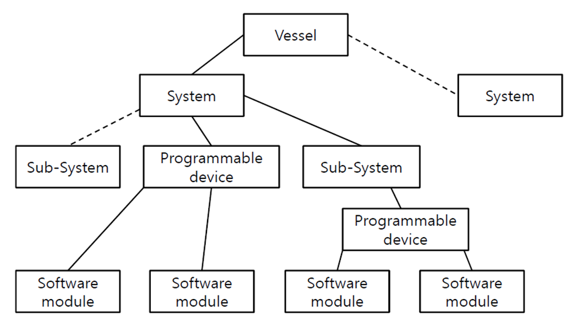

# PART 6 Electrical Equipment and Control Systems

> RULES FOR CLASSIFICATION OF STEEL SHIPS / RA-06-E / 2025 / EN / Rules

## CHAPTER 2 CONTROL SYSTEMS

### Section 1 General

#### 101. General

- **1.** **Application 【See Guidance】**
  - **(1)** The requirements in this Chapter apply to the systems of control, alarm and safety which are used to control all machinery and equipment which are subject to Rule requirements.
  - **(2)** Where considered necessary by the Society, the requirements in this Chapter are correspondingly applied to the systems of control, alarm and safety which are used for controlling machinery and equipment.
- **2.** **Terminology** ***(2017)***
  Terms used in this Chapter are defined as follows:
  - **(1)** **Monitoring station** (excluding control station) is a position where measuring instruments, indicators, alarms, etc. for the machinery and equipment are centralized and necessary information to grasp the operating condition of them can be obtained. Where, however, a monitoring station is provided with the ship in addition to a control station mentioned in (2) below, the requirements of the Rules relating to a monitoring station do not apply to the monitoring station concerned.
  - **(2)** **Control station** is a position which has a function as a monitoring station and from which the machinery and equipment can be controlled.
  - **(3)** **Main control station** is a control station provided with equipment necessary and sufficient to control the main propulsion machinery (this equipment will be referred to as "main control equipment" in this (3) and (4) and from which the main propulsion machinery is normally controlled, of the ship which provides the main control equipment at the outside of the navigation bridge.
  - **(4)** **Main control station on bridge** is a navigation bridge of the ship which provides main control equipment at the navigation bridge and that the main propulsion machinery is normally controlled there.
  - **(5)** **Sub-control station** is such a control station at which the main propulsion machinery is capable of being controlled, except for local control station for the main propulsion machinery, that is provided in the machinery room of the ship provided with a main control station on bridge.
  - **(6)** **Bridge control devices** are remote control devices for the main propulsion machinery or controllable pitch propellers provided on a navigation bridge or a main control station on bridge.
  - **(7)** **Sequential control** is a pattern of control that can be carried out automatically in the redetermined sequence.
  - **(8)** **Program control** is a pattern of control that desired values can be changed in the predetermined schedule.
  - **(9)** **Local control** is direct manual control of the machinery and equipment performed at or near their locations, receiving the necessary information from the measuring instruments, indicators and so on.
  - **(10)** **Remote control systems** comprise all equipment necessary to operate units from a control position where the operator cannot directly observe the effect of his actions.
  - **(11)** **Safety system** is a system which operates automatically, in order to prevent damages to the machinery and equipment in case where serious impediments to functioning should occur on them during operation so that one of the following actions will take place.
    - **(A)** Starting of standby machinery or equipment.
    - **(B)** Reduction of outputs of the machinery or equipment.
    - **(C)** Shutting off the fuel or power supplies thereby stopping the machinery or equipment.
  - **(12)** **Computer-based system** is a system of one or more computers(including programmable electronic device), associated software, peripherals and interfaces, and the computer network with its protocol.
  - **(13)** **Integrated system** is a system consisting of two or more subsystem having independent functions connected by a data transmission network and operated from one or more workstations.
  - **(14)** **Expert system** is an intelligent knowledge-based system that is designed to solve a problem with information that has been compiled using some form of human expertise.
  - **(15)** **Software** is the program, procedures and associated documentation pertaining to the operation of the computer system.
  - **(16)** **Basic software** is the minimum software, which includes firmware and middleware, required to support the application software.
  - **(17)** **Application software** is a software performing tasks specific to the actual configuration of the computer-based system and supported by the basic software.
  - **(18)** **Interface** is a transfer point at which information is exchanged. (examples : interfaces including input/output interface; communications interface)
  - **(19)** **Peripheral** is a device performing an auxiliary function in the system(examples : printer, data storage device)
  - **(20)** **Failure mode and effect analysis(FMEA)** is a failure analysis methodology used during design to postulate every failure mode and the corresponding effect or consequences.
  - **(21)** Combinator curve is the relationship between the propeller pitch setting and the propeller speed. *(2025)*
- **3.** **Drawings and data** ***(2017)***
  - **(1)** Drawings and data concerning automation
    - **(A)** List of measuring points
    - **(B)** List of alarm points
    - **(C)** Control devices and safety devices
      - **(a)** List of controlled objects and controlled variables
      - **(b)** Kinds of sources of control energy (self-actuated, pneumatic, electric, etc.)
      - **(c)** List of conditions for emergency stopping, speed reduction (automatic or demand for reduction), etc.
  - **(2)** Following drawings and data for the automatic control devices and remote control devices for main propulsion machinery or controllable pitch propellers:
    - **(A)** Operating instructions of main propulsion machinery such as starting and stopping, changeover of direction of revolution, increase and decrease of output, etc.
    - **(B)** Arrangements of safety devices (including those attached to the engines) and pilot lamps
    - **(C)** Controlling diagrams
  - **(3)** Following drawings and data for the automatic control devices and remote control devices for boilers:
    - **(A)** Operating instructions of sequential control, feed water control, pressure control, combustion control and safety devices
    - **(B)** Diagrams for automatic combustion control devices and automatic feed water control devices
  - **(4)** Diagrams and operating instructions for automatic control devices for electric generating sets (automatic load sharing devices, preference tripping devices, automatic starting devices, automatic synchronous making devices, sequential starting devices, etc.)
  - **(5)** Drawings of control panel in bridge
  - **(6)** Drawings of control panel in engine room
  - **(7)** Drawings of remote control system (for main propulsion machinery, generator and boiler)
  - **(8)** Manufacturing drawings for alarm and control system (including list of alarm points)
  - **(9)** Panel arrangements of monitoring panels, alarming panels and control stands at respective control stations
  - **(10)** Schedules of on-board tests and sea trials

### Section 2 System and Control

#### 201. System design (2017)

- **1.** **System design requirements**
  - **(1)** Control systems, alarm systems and safety systems are to be so designed that one fault does not result in other faults as far as practicable and the extent of the damage could be kept to a minimum.
  - **(2)** Control systems, alarm systems and safety systems are to be designed on the fail-to-safe principle. The characteristics of fail-to-safe is to be evaluated on the basis not only of the respective systems themselves and associated machinery and equipment, but also the total safety of the ship.
  - **(3)** Systems of automatic or remote control are to be sufficiently reliable under service conditions.
  - **(4)** Cables for signals are to be installed in such a manner that harmful induced interference can be avoided.
- **2.** **Supply of power**
  - **(1)** Supply of electric power
    The supply of electric power is to be in accordance with the following:
    - **(A)** Electric supply circuits to control systems, alarm systems and safety systems are not to branch off from the power circuits and lighting circuits, except that the electric power to the control systems, alarm systems and safety systems may be supplied from the power circuits to the machinery and equipment they serve.
    - **(B)** The electric power to alarm systems and safety systems for electric generating sets is also to be supplied from an accumulator battery.
  - **(2)** Supply of oil pressure
    The supply of control oil pressure is to be in accordance with the following:
    - **(A)** Sources of oil pressure are to be capable of supplying stably necessary pressure and quantity of purified oil.
    - **(B)** Overpressure preventive devices are to be provided on the delivery side of oil pressure pumps.
    - **(C)** Two or more sets of oil pressure pumps for the control of main propulsion machinery and main shaftings are to be provided and they are to be so arranged that in case one of the pumps in operation becomes out of action, standby pump(s) may start automatically or may be readily remotely started. In this case, the oil pressure pumps are not to be used for the control of other machinery and equipment other than main propulsion machinery and main shaftings.
  - **(3)** Supply of pneumatic pressure
    The supply of control air is to be in accordance with the following:
    - **(A)** Control systems are to be provided with an air reservoir having a capacity capable of supplying air to control devices at least for 5 minutes in the event of failure of the control air compressor.
    - **(B)** Where starting air reservoirs for main propulsion diesel engines are used as control air reservoirs, pressure reducing valves are to be duplicated.
    - **(C)** There are to be two or more sets of air compressors which may be used as a source of control air. Each air compressor is to have redundant capacity even in the event of failure of either one of them.
    - **(D)** Control air is to pass through a filter and, if necessary, a drier so that solid, oil and water may be removed to a minimum.
    - **(E)** Control air pipes are to be independent of general service air pipes and starting air pipes.
- **3.** **Environmental conditions**
  Systems of automatic or remote control are to be capable of withstanding the environmental conditions of the places where they are installed.
- **4.** **Control systems**
  - **(1)** Independence of control systems
    Control systems for main propulsion machinery or controllable pitch propellers, boilers, electric generating sets and auxiliaries for main propulsion of the ship(hereinafter referred to as "essential auxiliary machinery") are to be independent of each other or designed such that failure of one system does not degrade the performance of another system. *(2025)*
  - **(2)** Interconnection devices *(2025)*
    In case of plural main propulsion machinery or controllable pitch propellers, electric generating sets or important auxiliaries which are designed to be operated simultaneously in multiple under the same condition, interconnection devices may be provided between the control devices of these installations.
  - **(3)** Control characteristics
    Remote control devices and automatic control devices are to have control characteristics in conformity with the dynamic properties of the machinery and equipment they serve and to be considered not to invite malfunction and hunting due to disturbance.
  - **(4)** Interlock
    Control devices are to be provided with suitable interlocking arrangements in order to prevent damages to the machinery and equipment due to anticipated malfunction and maloperation of the machinery and equipment.
  - **(5)** Change-over to manual operating
    Change-over to manual operating is to comply with the following requirements:
    - **(A)** Main propulsion machinery or controllable pitch propellers, boilers, electric generating sets and auxiliaries for main propulsion of the ship are to be so arranged as to be manually started, operated and controlled even in the event where automatic control devices become out of action. *(2025)*
    - **(B)** Automatic control devices are generally to be provided with provisions to stop manually the automatic function of these devices.
    - **(C)** The provisions specified in (B) are to be capable of stopping the automatic function of the automatic control devices, even where any part of the automatic control devices become out of action.
  - **(6)** Cancellation of remote control function
    For remote control devices, the function of remote control is to be capable of being manually cancelled.
  - **(7)** Indication of control locations **【See Guidance】**
    In case where the machinery and equipment are capable of being operated from more than one station, the following requirements in (A) and (B) are to be complied with. However, this requirement need not be complied with in case the safety of the machinery and equipment and the safety at the time of maintenance work can be obtained by means of other measures considered appropriate by the Society.
    - **(A)** At each control station there is to be an indicator showing which station is in control of the machinery and equipment.
    - **(B)** Control of the machinery and equipment is to be possible only from one station at a time.
- **5.** **Alarm systems**
  - **(1)** Function of alarm systems is to comply with the following requirements:
    - **(A)** In case where an abnormal condition is detected devices to issue visual and audible alarms (hereinafter referred to as "alarm devices" in this Chapter) are to operate.
    - **(B)** In case where arrangements are made to silence audible alarms they are not to extinguish visual alarms.
    - **(C)** Two or more faults are to be indicated at the same time.
    - **(D)** Audible alarms for machinery and equipment are to be clearly distinguishable from other audible alarms such as general alarm, fire alarm, CO_2 flooding alarm, etc.
  - **(2)** Function of the alarm systems provided in the monitoring station for main propulsion machinery or controllable pitch propellers is to comply with the following requirements, in addition to the requirements in (1).
    - **(A)** The visual indications of visual alarms are to remain until the fault has been corrected.
    - **(B)** The acceptance of any alarm is not to inhibit another alarm.
    - **(C)** If an alarm has been acknowledged and a second fault occurs prior to the first being rectified, alarm devices are again to operate.
    - **(D)** Manual stopping of each alarm system is to be clearly indicated.
  - **(3)** Visual alarms are to be such that each abnormal condition of the machinery and equipment is readily distinguishable and so arranged that acknowledgement is clearly noticeable.
- **6.** **Safety systems**
  - **(1)** Constitution of systems
    Constitution of safety systems is to comply with the following requirements:
    - **(A)** The safety systems are to be, as far as practicable, provided independently of the control systems and alarm systems.
    - **(B)** The safety systems for the main propulsion machinery, boilers, electric generating sets and auxiliaries for main propulsion of the ship are to be independent each other. *(2025)*
  - **(2)** Function of safety systems
    Function of the safety systems is to comply with the following requirements:
    - **(A)** The alarm systems which have functions prescribed in **Par 5** are to operate when the safety system is put into action.
    - **(B)** In case where the safety system is put into action and the operation of the machinery or equipment is stopped, they are not to automatically restart before manual reset is made.
  - **(3)** Override arrangements
    Where arrangements for stopping temporarily the functions of safety system in part or in whole(hereinafter referred to as "override arrangements") are provided, the following requirements in (A) and (B) are to be complied with:
    - **(A)** Visual indication is to be given at the relevant control stations of the machinery and equipment when an override is operated.
    - **(B)** The override arrangements are to be such that inadvertent operation is prevented.

#### 202. Automatic and remote control of main propulsion machinery or controllable pitch propellers (2025) 【 See Guidance 】

- **1.** **General**
  Remote control devices for main propulsion machinery or controllable pitch propellers are to be complied with the requirements of this **202**.
- **2.** **Remote control devices for main propulsion machinery or controllable pitch propellers** ***(2025)***
  - **(1)** General
    Remote control devices for main propulsion machinery or controllable pitch propellers are to comply with the following requirements: *(2025)*
    - **(A)** The remote control devices for main propulsion machinery or controllable pitch propellers are to be capable of controlling the propeller speed and the direction of thrust (the blade angle of propellers in the case of controllable pitch propellers) by means of a simple operation.
    - **(B)** The remote control devices for main propulsion machinery or controllable pitch propellers are to be provided for each propeller. Where multiple propellers are designed to operate simultaneously, they may be controlled by one control device. *(2025)*
    - **(C)** In case where the speed of the main diesel engines is controlled by governors, the governors are to be adjusted so that main engine may not exceed 103 % of the maximum continuous revolutions. The governors are to be capable of maintaining the safe minimum speed.
    - **(D)** In case where the program control is adopted, the program for increase and decrease of output is to be so designed that undue mechanical stresses and thermal stresses do not occur in any parts of machinery.
    - **(E)** In the remote control stations and monitoring stations for the main propulsion machinery, the following instruments are to be provided:
      - **(a)** Indicators for propeller speed and direction of rotation in the case of solid propellers.
      - **(b)** Indicators for propeller speed and pitch position in the case of controllable pitch propeller.
    - **(F)** In the remote control stations for main propulsion machinery or controllable pitch propellers, alarm devices necessary for the control of main propulsion machinery are to be provided.
  - **(2)** Transfer of control
    The remote control devices for main propulsion machinery or controllable pitch propellers are to comply with the following requirements with respect to transfer of control:
    - **(A)** Each control station for main propulsion machinery or controllable pitch propellers is to be provided with means to indicate which of them is in control.
    - **(B)** Remote control of the main propulsion machinery or controllable pitch propellers is to be possible only from one location at a time. *(2025)*
    - **(C)** Transfer of control is to be possible only with order by the serving station and acknowledgement by the receiving station except for the following cases.
      - **(a)** Transfer of control between local control station for main propulsion machinery or controllable pitch propellers and main control station or sub-control station. *(2025)*
      - **(b)** Transfer of control during the stopping condition of the main propulsion machinery.
    - **(D)** When main propulsion machinery or controllable pitch propellers are controlled from the navigating bridge or navigation control station on bridge, the control shall be transferable to the local or main control station without requiring a transfer command from the navigating bridge or navigation control station on bridge. *(2025)*
    - **(E)** Means are to be provided to prevent the propelling thrust from altering significantly when transferring control from one location to another except for the transfer of control described in (C) (a) and (D).
  - **(3)** Failure of remote control systems of main propulsion machinery or controllable pitch propellers
    The following requirements are to be complied with in case of failure of remote control devices for main propulsion machinery or controllable pitch propellers:
    - **(A)** In the remote control stations for main propulsion machinery or controllable pitch propellers alarm devices which operate in the event of failure of the remote control devices for main propulsion machinery or controllable pitch propellers are to be provided.
    - **(B)** In the event of failure of the remote control devices for main propulsion machinery or controllable pitch propellers, the main propulsion machinery or controllable pitch propellers are to be possible to control locally. *(2025)*
    - **(C)** In the event of failure of the remote control devices for main propulsion machinery or controllable pitch propellers, the preset speed and direction of the propeller thrust are to be maintained until the control is in operation at the main control station or the local control station, unless this is considered impracticable by the Society. In particular, lack of power (electric, pneumatic, hydraulic) is not to lead to major and sudden change in propulsion power or direction of propeller rotation.
    - **(D)** In the event of failure of the remote control devices for main propulsion machinery or controllable pitch propellers, the transfer of control to the main control station or the local control station is to be possible by a simple operation.
    - **(E)** Remote control stations for main propulsion machinery or controllable pitch propellers are to be provided with independent emergency stopping devices for the main propulsion machinery, which are effective in the event of failure of the remote control devices for main propulsion machinery or controllable pitch propellers.
  - **(4)** Remote starting of main propulsion machinery
    Starting by means of remote control devices for main propulsion machinery or controllable pitch propellers is to comply with the following:
    - **(A)** The number of starting of main propulsion machinery is to satisfy the number specified in Pt 5, Ch 6, 1101.
    - **(B)** The remote control devices for main propulsion machinery arranged to automatically start are to be so designed that the number of automatic consecutive attempts which fail to produce a start is limited to three times. In the event of failure of starting, a visual and audible alarm is to be issued at the relevant control station and the main control station or monitoring station for the main propulsion machinery.
    - **(C)** Where compressed air is used for starting of the main propulsion machinery, alarm devices to indicate the low starting air pressure are to be provided at the remote control station and the monitoring station for the main propulsion machinery.
    - **(D)** The low starting air pressure mentioned in (C) for the operation of alarm devices is to be set at a level to permit further main propulsion machinery starting operations.
- **3.** **Bridge control devices** ***(2025)***
  Bridge control devices are to comply with the following requirements as well as those in **202. 2.**
  - **(1)** Even when the main propulsion machinery is controlled from the navigating bridge, the telegraph orders at the navigating bridge are to be indicated in the main control station.
  - **(2)** The remote control for propulsion machinery is to be provided with means of preventing overload and prolonged running in critical speed ranges of the propelling machinery.
  - **(3)** The bridge control system is to be independent from the other transmission system; however, one control lever for both system may be accepted.
  - **(4)** Operations following any setting of the bridge control device including reversing from the maximum ahead service speed in case of emergency are to take place in an automatic sequence and with time intervals acceptable to the machinery.
  - **(5)** Automation system is to be designed in a manner which ensures that threshold warning of impending or imminent slowdown or shutdown of the propulsion system is given to the officer in
    charge of the navigational watch in time to assess navigational circumstances in an emergency.
    In particular, the systems shall control, monitor, report, alert and take safety action to slow down or stop propulsion which providing the officer in charge of the navigational watch an opportunity to manually intervene, except for those cases where manual intervention will result in total failure of the engine and/or propulsion equipment within a short time, for example in the case of overspeed.
- **4.** **Safety measures**
  - **(1)** Safety measures for main propulsion machinery or controllable pitch propellers
    Safety measures for main propulsion machinery or controllable pitch propellers are to comply with the following requirements:
    - **(A)** The following safety measures are to be taken to the remote control devices for the main propulsion machinery or controllable pitch propellers: *(2025)*
      - **(a)** Necessary interlocking devices are to be provided to prevent serious damage due tomis-operation.
      - **(b)** Where the auxiliaries for propulsion of the ship are driven by electric motors, the main propulsion machinery is to be so designed as to stop automatically in the event of failure of the main source of electric power or to be capable of being stopped
      - **(c)** The main propulsion machinery is to be so arranged as not to re-start automatically when electric power is restored after the failure of the main source of electric power whereas the main propulsion machinery was stopped.
      - **(d)** The remote control devices for main propulsion machinery or controllable pitch propellers are to be so designed that the main propulsion machinery may not be abnormally overloaded in the event of failure of them.
    - **(B)** Stopping devices for main propulsion machinery or controllable pitch propellers are to be provided at the monitoring station for main propulsion machinery or controllable pitch propellers.
  - **(2)** Safety systems for main propulsion machinery or controllable pitch propellers *(2025)*
    Safety systems for main propulsion machinery or controllable pitch propellers are to comply with the following requirements:
    - **(A)** A device to shut off the fuel or steam supply to the main propulsion machinery (this device hereinafter being referred to as "safety device") is not to be automatically activated except in cases which could lead to complete breakdown, serious damage or explosion.
    - **(B)** The safety systems for main propulsion machinery or controllable pitch propellers are to be so designed as not to lose their function or as to fail-to-safe, even in the event of failure of main electric source or air source.
  - **(3)** Self-reversing diesel engines
    As least the following safety measures are to be taken to the remote control devices for self-reversing diesel engines:
    - **(A)** Starting operation is to be possible only when the camshaft is surely at the position of "Ahead" or "Astern".
    - **(B)** During reversing operation, fuel is not to be injected.
    - **(C)** Reversing operation is to be conducted after "Ahead" revolution is reduced to a predetermined value.
  - **(4)** Multiple sets of propulsion machinery coupled to a single shaft
    At least the following safety measures are to be taken to the remote control devices for multiple sets of propulsion machinery coupled to a single shaft:
    - **(A)** Each propulsion machinery is to be provided with an overload preventive device.
    - **(B)** Each propulsion machinery is not to be subjected to an abnormally unbalanced load.
  - **(5)** Main propulsion machinery with clutch
    At least the following safety measures are to be taken to the remote control devices for main propulsion machinery with clutch:
    - **(A)** The clutch equipped with multiple sets of main propulsion machinery coupled to a single shaft is to be disengaged when the main propulsion machinery is stopped in an emergency. While the main propulsion machinery is operating in different directions of rotation their clutches are not to be engaged simultaneously.
    - **(B)** Engaging and disengaging of clutches are to be carried out below a predetermined value of the number of revolutions of the main propulsion machinery.
    - **(C)** A overspeed protective device specified in **Pt 5, Ch 2, 203. 1.** or **304. 1.**
    - **(D)** In case where there is fear that the speed of the propulsion motor would exceed 125 % of the rated revolutions when the clutch is disengaged, an overspeed protective device as deemed appropriate by the Society is to be approved.
  - **(6)** Main propulsion machinery driving controllable pitch propellers
    At least the following safety measures are to be taken to the remote control devices for main propulsion machinery driving controllable pitch propellers:
    - **(A)** Overload preventive devices are to be provided.
    - **(B)** Starting of engines or engaging of clutches is to be performed while the propeller blades are in a neutral position.
    - **(C)** An overspeed protective device as specified in **Pt 5, Ch 2, 203. 1.** or **304. 1.**
    - **(D)** In case where there is fear that the speed of the propulsion motor would exceed 125 % of the rated revolutions when the propeller pitch is altered, an overspeed protective device as deemed appropriate by the Society is to be provided.
  - **(7)** Remote starting of the propulsion machinery is to be automatically inhibited if conditions exist which may hazard the machinery, e.g. shaft turning gear engaged, drop of lubricating oil pressure. *(2025)*
  - **(8)** For steam turbines a slow-turning device is to be provided which operates automatically if the turbine is stopped longer than admissible. Discontinuation of this automatic turning from the bridge must be possible. For attended machinery spaces, the slow turning device may be arranged to be operated manually. *(2025)*

#### 203. Automatic and remote control of boilers

- **1.** **General**
  - **(1)** The systems of automatic control for both combustion and feed water of oil-fired boilers are to comply with the requirements in **Pars 2** to **4** respectively.
  - **(2)** The systems of automatic control for either combustion or feed water of oil-fired boilers are to comply with the relevant requirements in **Par 2** or **3** as well as the requirements in **Par 4.**
  - **(3)** Automatic control of boilers other than oil-fired boilers or having a special feature will be considered in each case. **【See Guidance】**
  - **(4)** Remote water level indicators are to comply with the requirements in **Pt 5, Ch 5, 129.**
- **2.** **Automatic combustion control systems**
  - **(1)** General
    Automatic combustion control systems are to comply with the following requirements:
    - **(A)** The automatic combustion control systems are to be able to control so as to obtain planned steam amount, steam pressure and steam temperature and to secure stable combustion.
    - **(B)** The devices to control the fuel supply to meet the load imposed are to be capable of ensuring stable combustion in the controllable range of fuel supply.
    - **(C)** Where combustion control is carried out according to the pressure of the boiler, the upper limit of this pressure is to be lower than the set pressure of the safety valves.
  - **(2)** Combustion control devices for intermittent operation
    The combustion control devices for intermittent operation are to comply with the following requirements and they are to operate according to the planned sequence:
    - **(A)** Before ignition on the pilot burner or before ignition on the main burner if the pilot burner is not fitted, the combustion chamber and flue are to be prepurged by air of not less than four times the volume of combustion chamber and flue up to the boiler uptake. For small boilers with only one burner, prepurge for not less than 30 seconds will be accepted.
    - **(B)** In case of direct ignition which is the method of ignition that the main burner is fired by ignition spark, opening of the fuel valve is not to precede the ignition spark.
    - **(C)** In case of indirect ignition which is a method of ignition that the main burner is fired by pilot burner, opening of the fuel valve for pilot burner (hereinafter referred to as "ignition fuel valve") is not to precede the ignition spark, and opening of the fuel valve for main burner (hereinafter referred to as "main fuel valve") is not to precede the opening of ignition fuel valve.
    - **(D)** Firing is to be surely carried out within the planned period. Main fuel valve is to be so designed as to close after opening of the valve not exceeding 10 seconds in the case of direct ignition and 15 seconds in the case of indirect ignition if the firing on the main burner has failed.
    - **(E)** Firing on main burners is to be carried out at their low firing position.
    - **(F)** After closure of the main fuel valve, postpurge is to be carried out for not less than 20 seconds to ensure adequate combustion air to completely burn all fuel oil remaining between the fuel oil valve and the burner nozzle. This requirement need not be complied with in the case of auxiliary boilers where approved by the Society. **【See Guidance】**
  - **(3)** Combustion control devices for the control of the number of firing burners
    The combustion control devices for the control of the number of firing burners are to comply with the following requirements:
    - **(A)** Each burner is to be fired and extinguished according to the planned sequence. However, the base burner may be fired by manual operation and other burners may be fired by flame of a burner(s) already fired.
    - **(B)** The remaining fuel in the extinguished burner is to be automatically burnt up in order not to interfere the restarting. However, while the pilot burner is not fired, the remaining fuel in the base burner is not to be removed by steam or air when it is in place.
    - **(C)** The burners for main boilers are to be capable of being fired and extinguished from the main control station, except for the firing of base burner.
  - **(4)** Other combustion control devices **【See Guidance】**
    Other combustion control devices will be considered in each case by the Society, as well as they are to comply with the relevant requirements in (2) and (3).
- **3.** **Automatic feed water control devices**
  - **(1)** The automatic feed water control devices are to be capable of controlling automatically the feed water in order to maintain the water level in the boilers in a predetermined range.
  - **(2)** Main boilers are to be provided with not less than three water level detectors used for feed water control device, remote water level indicator, low water level safety device and low-water level alarm device.
- **4.** **Safety measures**
  - **(1)** Safety devices
    Safety devices are to comply with the requirements in **Pt 5, Ch 5, 133. 1.**
  - **(2)** Heating of fuel oil
    In case where heated fuel oil is used, an automatic temperature control device is to be provided to the heater and the boiler is to be provided with a device to shut off automatically the fuel supply to the burners or an alarm device which operates when the temperature of fuel oil falls below a predetermined value.
- **5.** **Alarms**
  Alarm devices are to comply with the requirements in **Pt 5, Ch 5, 133. 2.**

#### 204. Control system of electric generating sets

- **1.** **General**
  - **(1)** Electric generating set arranged to be automatically or remotely started is to be provided with interlocking devices necessary for safe operation.
  - **(2)** Electric generating set arranged to be automatically started is to be so designed that the number of automatic consecutive attempts which fail to produce a start is limited to two times and to be provided with an alarm device which operate at the time of the failure of starting.
  - **(3)** In case where a diesel engine to drive a propulsion generator is remote started the number of starting is to conform to the required number specified in **Pt 5, Ch 2, 202. 5.**
  - **(4)** Where automatic start of the standby generating set with automatic connection to the switchboard busbars is provided, automatic closure on to the busbars is to be limited to one attempt, in the event of the original power failure being caused by short circuit.
  - **(5)** Automatic control and remote control systems for the electric generating set, whose generator is driven by the main propulsion machinery and supplies electrical power to the electrical installations necessary for normal operating and living conditions and is operated while the main propulsion machinery is controlled by the bridge control devices, are to comply with the requirements in **Pt 6, Ch 1, 202.** in addition to those in this Article.
- **2.** **Alarms and safeguards for emergency reciprocating I.C. engines** ***(2024)***
  These requirements apply to reciprocating I.C. engines, which use distillate marine fuels covered by ISO 8217:2017, required to be immediately available in an emergency and capable of being controlled remotely or automatically operated.
  - **(1)** Alarms and safeguards are to be fitted in accordance with Table 6.2.1.
  - **(2)** Devices referred to in (1) are to provide alarms at both local and control positions. The visual alarms at control positions may be of group indication.
  - **(3)** Each diesel engine with a maximum continuous output of 220 $\mathrm{kW}$ or over is to be provided with an overspeed protective device specified in **Pt 5, Ch 2, 203. 1** (2).
  - **(4)** When devices to shutdown the diesel engines are provided other than those referred to in **Table 6.2.1**, means are to be provided to override those devices automatically during navigation.
  - **(5)** In addition to the fuel oil control from outside the space, a local means of engine shutdown is to be provided.
  - **(6)** The silencing of the audible alarms from the control positions is not to cause the silencing of the audible alarm at local position.

    | Parameter |   |   | Alarm activation | Auto Shutdown |
    | --- | --- | --- | --- | --- |
    | Fuel oil leakage from high pressure pipes (fuel injection pipes and common rails) |   |   | O |   |
    | Lubricating oil temperature(1) | High |   | O |   |
    | Lubricating oil pressure | Low |   | O |   |
    | Activation of oil mist detection arrangements (or activation of the temperature monitoring systems or equivalent devices of: - the engine main and crank bearing oil outlet; or - the engine main and crank bearing)(2)(3) |   |   | O |   |
    | Pressure or flow of cooling water(1) |   | Low | O |   |
    | Temperature of cooling water (or cooling air) |   | High | O |   |
    | Overspeed activated(1) |   |   | O | O |
    | (NOTE) (1) For engines having a power of or more than 220 kW. (2) For engines having a power of more than 2250 kW or a cylinder bore of more than 300 mm. (3) Oil mist detection system is to be of the approved type by the Society, tested by **Ch 3, Sec. 10** of **the Guidance for Approval of Manufacturing Process and Type Approval, Etc.** and applied to **Pt.5 Ch 2, 203.** |   |   |   |   |

#### 205. Automatic and remote control of auxiliary machinery

- **1.** **Automatic operation of air compressors**
  In case where air compressors for starting and air compressors for controlling are automatically operated, alarm devices are to be provided to indicate pressure drop in air reservoirs.
- **2.** **Automatic starting and stopping of bilge pumping arrangements**
  In case where the bilge pumps are capable of being started and stopped automatically, alarm devices are to be provided to indicate high level of bilge in the relevant bilge wells and running of pumps for a long time.
- **3.** **Thermal oil installations**
  Thermal oil installations arranged to be automatically controlled are to comply with the following:
  - **(1)** Standby pumps
    Pumps listed in the following of the thermal oil installations for important use are to be provided in two sets or more. The standby pumps are to be so arranged that they can start automatically or are capable of being started without delay from the relevant monitoring station when the discharge pressure or flow rate from the working pump falls below a predetermined value or when the pump stops.
    - **(A)** Thermal oil circulating pumps
    - **(B)** Fuel oil supply pumps
  - **(2)** Control devices
    Control devices are to comply with **203. 2** (1) and (2), and also with **Pt 5, Ch 5, 202. 1** and **2.**
  - **(3)** Safety devices
    Safety devices are to comply with **Pt 5, Ch 5, 201.** and **202. 5.**
  - **(4)** Alarm devices
    Thermal oil installations are to be provided with alarm devices which operate in the following cases:
    - **(A)** When the safety devices required in (3) have operated.
    - **(B)** When the temperature of fuel at the inlet of burner has fallen.
- **4.** **High temperature alarm for oil heaters**
  In case where temperature for fuel oil and lubricating oil is automatically controlled, high temperature alarm devices are to be provided, except where oils are not heated above the flashpoint.
- **5.** **Opening and closing devices for sea valves**
  In case where sea valves to be fitted on the shell plating below the load water line are remotely or automatically controlled, other opening and closing devices which can be easily operated even in the event of failure of the automatic or remote control devices are to be provided.
- **6.** **Liquid level alarm systems for fuel oil tanks**
  In case where fuel transfer to fuel oil tanks is automatically controlled, the receiving tanks are to be provided with high and low level alarm systems.
- **7.** **Mooring arrangements**
  In case where mooring arrangements are provided with remote control devices, the mooring arrangements are to be capable of being locally operated.
- **8.** **Fuel oil filling arrangements**
  In case where arrangements for filling fuel oil into respective fuel oil tanks from the outside of the ships (hereinafter referred to as "fuel oil filling arrangements" in this Chapter) are provided with remote control devices, the fuel oil filling arrangements are to be such as not to interfere with filling of fuel even in the event of failure of the remote control devices.
- **9.** **Emergency Diesel Engines**
  The requirements in **204. 2** apply correspondingly to the automatic or remote control devices for emergency diesel engines used for non-emergency purposes other than those mentioned in **204. 2**.

#### 206. Control system of electric propulsion unit

It is to comply with the requirements in **Ch 1, Sec 16** in addition to the relevant requirements of this Chapter.

### Section 3 Tests (2017)

#### 301. Shop tests 【See Guidance】

- **1.** **Type approval**
  Devices, units and sensors (hereinafter referred to as "automatic devices" in the Rules) and automatic equipment composed of automatic devices and basic software (if applicable) are to be type approved, in principle, according to the test methods approved by the Society before being taken into use.
- **2.** **Shop tests of automation system**
  The automatic devices which have passed through the type approval tests specified in **Par 1.** are to be subjected to the following tests after completion of assembly as automation system.
  - **(1)** Hardware
    - **(A)** External examination
    - **(B)** Operation tests and performance tests
    - **(C)** Insulation resistance tests and high voltage tests (to be applied to electric devices, electronic devices and so on)
    - **(D)** Pressure tests (to be applied to hydraulic devices, pneumatic devices and so on)
    - **(E)** Other tests considered necessary by the Society
  - **(2)** Software *(2017)*
    Software acceptance tests of computer-based systems are to comply with **Sec 4**.

#### 302. On-board tests 【See Guidance】

After installed on board the systems of automatic or remote control of the machinery and equipment are to be confirmed that they operate effectively, under as far practical condition as possible. However, part of these tests may be carried out during sea trials. The proper documents, in which test procedures, set value for alarms and for operation of safety systems and so on are recorded, are to be kept on board.

#### 303. Sea trials 【See Guidance】

- **1.** **Main propulsion machinery** ***(2025)***
  The control systems for propulsion machinery is to be subjected to the following tests. After completion of the test on transfer of control specified in (3), it is to be shown that the main propulsion machinery can be smoothly operated from the respective control stations.
  - **(1)** The main propulsion machinery is to be subjected to starting tests, ahead-astern tests and running tests in the whole range of output, by means of the remote control devices from the main control station.
  - **(2)** In addition to output increase and decrease tests, the operation tests of the main propulsion machinery using the bridge control devices are to be carried out at the discretion of the Society.
  - **(3)** In case where there are other control stations for propulsion machinery such as navigating bridge, the test on transfer of control for the main propulsion machinery is to be carried out during ahead and astern operations of the main propulsion machinery. In case where, however, considered appropriate by the Society, the test on transfer of control to the local control stations may be carried out during stoppage of the main propulsion machinery.
- **2.** **Controllable pitch propellers** ***(2025)***
  - **(1)** Scope of the tests
    A test of the fail-to-safe characteristics of the propeller pitch control system is to be carried out to demonstrate that failures in the pitch command and control or feedback signals are alarmed and do not cause any change of thrust. Such failures are to be clearly identified and included in the test procedure.
    Test procedure is to be prepared and proposed by the pitch control system manufacturer or integrator and agreed with Classification Society.
    - **(A)** Pitch response test
      - **(a)** A full range of tests is to be carried out to get the pitch response and verify that it coincides with the combinator curve of the propeller. The tests are to be carried out for at least three positions of the control lever in ahead and astern directions (e.g., dead slow ahead / astern, half ahead / astern, full ahead / astern).
      - **(b)** The tests are to be carried out in normal and emergency operating conditions.
      - **(c)** Tests that are not affected by the control position may be carried out from one control position only.
    - **(B)** Test of the fail-to-safe characteristics
    - **(C)** Test procedure
  - **(2)** Parameters to be recorded
    - **(A)** The list of the parameters to be recorded during the pitch response test within this UR is to be established by the pitch control system manufacturer or integrator and agreed with the Society. This should include at least the following parameters:
      - **(a)** Position of the control handle
      - **(b)** Actual pitch indication (local indication, remote indications)
      - **(c)** Rotational speed of the propeller
      - **(d)** Response time between the pitch change order (modification of the lever position) and the instant when the pitch and propeller speed have reached their final position
      - **(e)** Propelling thrust variation during the transfer of the control from one location to another one
  - **(3)** Tests results
    Tests are to demonstrate:
    - **(A)** that the propelling thrust is not significantly altered when transferring control from one location to another and in case of failures in the pitch command and control or feedback signals.
    - **(B)** that the pitch response times measured during the test do not exceed the maximum value to be defined by the pitch control system manufacturer or integrator.
- **3.** **Boilers**
  The control systems for boilers are to be subjected to the following tests.
  - **(1)** With respect to the main boilers, it is to be confirmed that the feed water control devices, combustion control devices and so on can operate stably in response to load variation of the main boilers, and the main boilers can supply steam stably to the main propulsion machinery, electric generating sets and auxiliaries for propulsion of the ship, without local manual operation.
  - **(2)** With respect to auxiliary boilers used for important use, it is to be confirmed that they can supply steam stably to the auxiliaries for propulsion of the ship without manual operation.
  - **(3)** In case where an exhaust gas economizer is used as a source of steam supply to a turbine for driving a generator and steam supply from a boiler is carried out automatically in the case of low power condition of the main propulsion machinery, operation tests of automatic control devices for this system are to be carried out.
- **4.** **Electric generating sets**
  In case where generators which supply electric power to the loads necessary for propulsion of ships and whose motive power is relying upon the propulsion systems, the systems of automatic or remote control of electric generating sets are to be subjected to operation tests.
- **5.** **Electric propulsion plants**
  After electric propulsion plants are installed on board ship, sea trial is to be carried out in accordance with the test procedure.

### Section 4 Computer Based Systems (2024)

#### 401. Introduction

- **1.** **Scope**
  - **(1)** The requirements of this Section apply to design, construction, commissioning and maintenance of computer based systems where they depend on software for the proper achievement of their functions.
  - **(2)** The requirements of this Section apply to systems which provide control, alarm, monitoring, safety, or internal vessel communication functions that are subject to classification requirements.
- **2.** **Exclusion**
  - **(1)** Computer based systems that are covered by statutory regulations are excluded from the requirements of this Section. Examples of such systems are navigation systems and radio communication system required by SOLAS chapter V and IV, and vessel loading instrument/stability computer.
  - **(2)** For loading instrument/stability computer, IACS recommendation no. 48 may be considered.
- **3.** **References**
  - **(1)** Normative standards
    For the purposes of this Section, the following standards are normative:
    - **(A)** Ch 3, Sec 23 of the Guidance for Approval of Manufacturing Process and Type Approval, Etc.
    - **(B)** IACS UR E26, Cyber resilience of ships
    - **(C)** IACS UR E27, Cyber resilience of on-board systems and equipment
  - **(2)** Informative standards
    For the purposes of this Section, the following standards are listed for information and may be used for the development of hardware/software of computer based systems:
    Other industry standards may also be considered.
    - **(A)** IEC 61508:2010, Functional safety of electrical/electronic/programmable electronic safety-related systems
    - **(B)** SO/IEC 12207:2017, Systems and software engineering - Software life cycle processes
    - **(C)** ISO 9001:2015, Quality Management Systems - Requirements
    - **(D)** ISO/IEC 90003:2018, Software engineering - Guidelines for the application of ISO 9001:2008 to computer software
    - **(E)** IEC 60092-504:2016, Electrical installations in ships - Part 504: Special features - Control and instrumentation
    - **(F)** ISO/IEC 25000:2014, Systems and software engineering - Systems and software Quality Requirements and Evaluation (SQuaRE) - Guide to SQuaRE
    - **(G)** ISO/IEC 25041:2012, Systems and software engineering - Systems and software Quality Requirements and Evaluation (SQuaRE) - Evaluation guide for developers, acquirers and independent evaluators
    - **(H)** IEC 61511:2016, Functional safety - Safety instrumented systems for the process industry sector
    - **(I)** ISO/IEC 15288:2015, Systems and software engineering - system life cycle process
    - **(J)** ISO 90007:2017 Quality management – Guidelines for configuration management
    - **(K)** ISO 24060:2021 Ships and marine technology - Ship software logging system for operational technology
- **4.** **Structure**
  - **(1)** The general certification requirements for computer based systems and the relation to type approval is described in 402. The requirements and extent of verification of a computer based system depends on its categorization into one of three categories. The categories are described in 403.
  - **(2)** The requirements of this section cover the lifecycle of computer based system from design through operations. The requirements are split into groups representing the different phases of the life cycle and the roles responsible for fulfilling the requirements. The activities related to the development and delivery of a computer based system is described in 404., while the activities related to the maintenance in the operational phase are described in 405.
  - **(3)** Management of changes to software and systems is given special attention in this Section, and the main aspects of a management of change process are described in 406.
  - **(4)** Most requirements in this Section are related to the way of working, and thus focus on activities to be performed, but it also contains some technical requirements. The technical requirements on computer based systems have been gathered in 407.
  - **(5)** Each activity contains a requirement part which describes the minimum requirements on the role in question, and a part which describes the Society’s verification of the activity in question.
- **5.** **Definition of abbreviations and terminology**
  - **(1)** Abbreviations

    | Abbreviation: | Expansion: |
    | --- | --- |
    | Cat I | Category one systems as defined in 403. 1 |
    | Cat II | Category two systems as defined in 403. 1 |
    | Cat III | Category three systems as defined in 403. 1 |
    | COTS | Commercial off-the-shelf |
    | FAT | Factory acceptance test |
    | FMEA | Failure mode and effect analysis |
    | IT | Information technology |
    | OT | Operational technology |
    | PMS | Planned maintenance system |
    | SAT | System acceptance test |
    | SOST | System of systems test |
    | SSLS | Ship software logging system |
    | UR | Unified requirement |
  - **(2)** Terminology

    | Term: | Definition: |
    | --- | --- |
    | Black-box description | A description of a system’s functionality and behaviour and performance as observed from outside the system in question |
    | Black-box test methods | Verification of the functionality, performance, and robustness of a system, sub-system or component by only manipulating the inputs and observing the outputs. This does not require any knowledge of the system’s inner workings and focuses only on the observable behaviour of the system/component under test in order to achieve the desired level of verification. |
    | Computer based system (CBS) | A programmable electronic device, or interoperable set of programmable electronic devices, organized to achieve one or more specified purposes such as collection, processing, maintenance, use, sharing, dissemination, or disposition of information. CBSs onboard include IT and OT systems. A CBS may be a combination of subsystems connected via network. Onboard CBSs may be connected directly or via public means of communications (e.g. Internet) to ashore CBSs, other vessels’ CBSs and/or other facilities. |
    | Failure mode description | A document describing the effects due to failures in the system, not failures in the equipment supported by the system, and includes the following along with a list of failures to be evaluated. - list of failures which are subject to assessment, with - description of the system response to each of the above failures - comments to the consequence of each of these failures |
    | Owner | The organization or person which orders the vessel in the construction phase or the organization which owns or manages the vessel in service. In the context of this UR this is a defined role with specific responsibilities. |
    | Parameterization | To configure and tune system and software functionality by changing parameters. It does not usually require-computer programming and is normally done by the system supplier or a service provider, not the operator or end-user. |

    | Term: | Definition: |
    | --- | --- |
    | Programmable device | Physical component where software is installed |
    | Robustness | The ability to respond to abnormal inputs and conditions |
    | Service supplier | A person or company, not employed by an IACS Member, who at the request of an equipment manufacturer, shipyard, vessel’s owner or other client acts in connection with inspection work and provides services for a ship or a mobile offshore unit such as measurements, tests or maintenance of safety systems and equipment, the results of which are used by surveyors in making decisions affecting classification or statutory certification and services |
    | Simulation test | Monitoring, control, or safety system testing where the equipment under control is partly or fully replaced with simulation tools, or where parts of the communication network and lines are replaced with simulation tools. |
    | Society Certificate | Compliance document issued by the Society certifies the following: - conformity with applicable Classification Technical Rules and requirements. - the tests and inspections have been carried out on the finished certified component itself or, when applicable, on samples taken from earlier stages in the production of the component. - the inspection and tests were performed in the presence of the Surveyor or in accordance with special agreements. |
    | Software component | A standalone piece of code that provides specific and closely coupled functionality. |
    | Software master files | The computer-files that constitutes the original source of the software. For custom made software this may be readable source- code files, and for COTS software it may be different forms of binary files. |
    | Software-structure | Overview of how the different software components interact and is commonly referred to as the Software Architecture, or Software Hierarchy |
    | Sub-system | Identifiable part of a system, which may perform a specific function or set of functions. |
    | Supplier | A generic term used for any organisation or person that is a contracted or a subcontracted provider of services, system components, or software. |
    | System | A combination of components, equipment and logic which has a defined purpose, functionality, and performance. In the context of this section, a specific system is delivered by one system supplier. |
    | System of systems | A system which is made up of several systems. In the context of this section, the system of systems encompasses all monitoring, control and safety systems delivered from the Shipyard as a part of a vessel. |
    | System supplier | An organisation or person that is contracted or a subcontracted provider of system components or software under the coordination of the Systems integrator. In the context of this UR this is a defined role with specific responsibilities. |
    | Systems integrator | Single organization or a person coordinating interaction between suppliers of systems and sub-systems on all stages of life cycle of computer based systems in order to integrate them into a verified vessel-wide system of systems and to provide proper operation and maintenance of the computer based systems. In the context of this UR this is a defined role with specific responsibilities. During the design and delivery phase the Shipyard is the default Systems integrator, during operations phase the Owner is the default. |
    | Type approval Certificate | Compliance document issued by the Society by which the Society declares that a product design meets a minimum set of technical requirements. |
    | Vessel | Ship or offshore unit where the computer based system is to be installed. |

    
    Note : dashed lines show non-developed branches of diagram**Fig 6.2.1 llustrative System Hierarchy**

#### 402. Approval of systems and components

- **1.** **System certification**
  - **(1)** Computer based systems that are necessary to accomplish vessel-functions of category II or category III (as defined in 403. 1 below) shall be delivered with a vessel-specific Society certificate. The objective of the vessel-specific system certification is to confirm that design and manufacturing of the system has been completed and that the system complies with applicable rules of the Society.
  - **(2)** Vessel-specific system certification consist of two main verification activities:
    - **(A)** Assessment of vessel-specific documentation (see 404. 2 and 406.)
    - **(B)** Survey and testing of the system to be delivered to the vessel (see 404. 2 (7))
  - **(3)** The Society may accept Alternative Certification Scheme (ACS) provided that the requirements are met, and that the system is provided with a vessel-specific certificate.
- **2.** **Type approval of computer based systems**
  - **(1)** Computer based systems that are routinely manufactured and include standardized software functions may be type approved in accordance with specified rules of the Society. Hardware shall be documented according to the requirement in 404. 2 (4).
  - **(2)** The type approval consist of two main verification activities:
    - **(A)** Assessment of type-specific documentation
    - **(B)** Survey and testing of the standardized functions
  - **(3)** Type approval will normally not yield exemption from vessel-specific system certification since vessel-specific functions, parameter configurations and installation elements demand vessel-specific verification.

#### 403. System categories

- **1.** **System category definitions**
  - **(1)** The categorization of a system in this section is based on the potential severity of the consequences if the system serving the function fails. Table 6.2.2 provides the definitions of the categories.

    | Category | Effects | Typical System functionality |   |
    | --- | --- | --- | --- |
    | I | Those systems, failure of which will not lead to dangerous situations for human safety, safety of the vessel and/or threat to the environment. | - | Monitoring, informational and administrative functions |
    | II | Those systems, failure of which could eventually lead to dangerous situations for human safety, safety of the vessel and/or threat to the environment. | - | Vessel alarm, monitoring and control functions which are necessary to maintain the vessel in its normal operational and habitable conditions |
    | III | Those systems, failure of which could immediately lead to dangerous or catastrophic for human safety, safety of the vessel and/or threat to the environment. | - - | Control functions for maintaining the vessel’s propulsion and steering Vessel safety functions |
- **2.** **Class Societies’ scope**
  - **(1)** Category I systems are normally not subject to verification by the Society, as failure of these systems shall not lead to dangerous situations. However, information pertinent to category I systems shall be required upon request to determine the correct category or ensure that they do not influence the operation of systems in category II and category III.
- **3.** **System category examples**
  - **(1)** The category of a system shall always be evaluated in the context of the specific vessel in question; thus, the categorization of a system may vary from one vessel to the next. This means that the examples of categories below are given as guidance only. For determining the categorization of systems for a specific vessel, see 404. 3 (3).
  - **(2)** Examples of category I systems: Fuel monitoring system, maintenance support system, diagnostics and troubleshooting system, closed circuit television, cabin security, entertainment system, fish detection system.
  - **(3)** Examples of category II systems: Fuel oil treatment system, alarm monitoring and safety systems for propulsion and auxiliary machinery, Inert gas system, control, monitoring and safety system for cargo containment system.
  - **(4)** Examples of category III systems: Propulsion control system, steering gear control system, electric power system (including power management system), dynamic positioning system (IMO classes 2 and 3).
  - **(5)** The list of example systems is not exhaustive.

#### 404. Requirements on development and certification of computer based systems

- **1.** **General requirements**
  - **(1)** Life cycle approach with appropriate standards
    A global top-down approach shall be undertaken in the design and development of both hardware and software and the integration in sub-systems, systems, and system of systems, spanning the complete system lifecycle. This approach shall be based on the standards as listed herein or other standards recognized by the Society.
    It is verified by the Society as a part of the quality management system verification described in (2).
    - **(A)** Requirement:
    - **(B)** Class Society’s verification:
  - **(2)** Quality management system

    | Area |   | Role |   |
    | --- | --- | --- | --- |
    | # | Topic | System supplier | Systems integrator |
    | 1 | Responsibilities and competency of the staff | O | O |
    | 2 | The complete lifecycle of delivered software and of associated hardware | O | O |
    | 3 | Specific procedure for unique identification of a computer based system, it’s components and versions | O |   |
    | 4 | Creation and update of the vessel’s system architecture |   | O |
    | 5 | Organization set in place for acquisition of software and related hardware from suppliers | O | O |
    | 6 | Organization set in place for software code writing and verification | O |   |
    | 7 | Organization set in place for system validation before integration in the vessel | O |   |
    | 8 | Specific procedure for conducting and approving of systems at FAT and SAT | O | O |
    | 9 | Creation and update of system documentation | O |   |
    | 10 | Specific procedure for software modification and installation on board the vessel, including interactions with shipyard and owner | O | O |
    | 11 | Specific procedures for verification of software code | O |   |
    | 12 | Procedures for integrating systems with other systems and testing of the system of systems for the vessel | O | O |
    | 13 | Procedures for managing changes to software and configurations before FAT | O |   |
    | 14 | Procedures for managing and documenting changes to software and configurations after FAT | O | O |
    | 15 | Checkpoints for the organization’s own follow-up of adherence to the quality management system | O | O |

    The quality management system may be verified by two alternative means:
    - **(A)** Systems integrators and system suppliers shall, in the development of computer based systems for category II and category III, comply to a recognised quality standard such as ISO 9001; also incorporating principles of IEC/ISO 90003.
    - **(B)** The quality management system shall as a minimum include the Table 6.2.3, applicable for both category II and category III systems:
    - **(C)** Class Society’s verification:
      - **(a)** The Society confirming that the quality management system is certified as compliant to a recognized standard by an organisation with accreditation under a national accreditation scheme.
      - **(b)** The Society confirming compliance to a standard through a specific assessment of the quality management system. The documentation requirements will be defined per case.
- **2.** **Requirements on the system supplier**
  - **(1)** Define and follow a quality plan
    - **(A)** Requirement:
      - **(a)** The system supplier shall document that the quality management system is applied for the design, construction, delivery, and maintenance of the specific system to be delivered.
      - **(b)** All applicable items described in **1** (2) (for the system supplier role) shall be demonstrated to exist and being followed, as relevant.
    - **(B)** Class Society’s verification:
      - **(a)** Category I: No documentation required
      - **(b)** Category II and III: The quality plan shall be available during survey (FAT) or submitted for information upon request (FI).
  - **(2)** Unique identification of systems and software
    - **(A)** Requirement:
      - **(a)** A method for unique identification of a system, its different software components and different revisions of the same software component shall be applied. The method shall be applied throughout the lifecycle of the system and the software.
      - **(b)** See also 407. 1 for related technical requirements on the system in question. The documentation of the method is typically a part of the quality management system, see **1** (2).
    - **(B)** Class Society’s verification:
      - **(a)** Category I: Not required
      - **(b)** Category II and III: Application of the identification system is verified as a part of the FAT (**2** (7)) and SAT (**3** (6)).
  - **(3)** System description
    (ⅰ) Purpose and main functions, including any safety aspects
    (ⅱ) System category as defined
    (ⅲ) Key performance characteristics
    (ⅳ) Compliance with the technical requirements and the Society rules
    (ⅴ) User interfaces/mimics
    (ⅵ) Communication and Interface aspects
    Identification and description of interfaces to other vessel systems
    (ⅶ) Hardware-arrangement related aspects:
    Network-architecture/topology, including all network components like switches, routers, gateways, firewalls etc.
    Internal structure with regards to all interfaces and hardware nodes in the system (e.g. operator stations, displays, computers, programmable devices, sensors, actuators, I/O modules etc)
    I/O allocation (mapping of field devices to channel, communication link, hardware unit, logic function)
    Power supply arrangement
    Failure mode description
    - **(A)** Requirement:
      - **(a)** The system’s specification and design shall be determined and documented in a system description. In addition to serve as a specification for the detailed design and implementation, the purpose of the system description is to document that the entire system-delivery is according to the specifications and in compliance with applicable rules and regulations.
      - **(b)** The system description shall contain information of the following:
      - **(c)** The information listed above is in this section collectively referred to as the system description. It may however be divided into a number of different documents and models.
    - **(B)** Class Society’s verification:
      - **(a)** Category I: The system description documentation shall upon request be submitted for information (FI).
      - **(b)** Category II and III: The system description documentation shall be submitted for approval (AP).
  - **(4)** Environmental compliance of hardware components
    - **(A)** Requirement:
      - **(a)** Evidence of environmental type testing according to Ch 3, Sec 23 of the Guidance for Approval of Manufacturing Process and Type Approval, Etc. regarding hardware elements included in the system and sub-systems shall be submitted to the Society.
    - **(B)** Class Society’s verification:
      - **(a)** Category I: This requirement is not mandatory for category I systems. Reference to Type approval certificate or other evidence of type testing shall upon request be submitted for information (FI), see **403. 2**.
      - **(b)** Category II and III: Reference to Type approval certificate or other evidence of type testing shall be submitted for information (FI).
  - **(5)** Software code creation, parameterization, and testing
    (ⅰ) Correctness, completeness and consistency of any parameterization and configuration of software components
    (ⅱ) Intended functionality
    (ⅲ) Intended robustness
    - **(A)** Requirement:
      - **(a)** The software created, changed, or configured for the delivery project shall be developed and have the quality assurance activities assessed according to the selected standard(s) as described in the quality plan.
      - **(b)** The quality assurance activities may be performed on several levels of the software-structure and shall include both custom-made software and configured components (e.g. software libraries) as appropriate.
      - **(c)** The verification of the software shall as a minimum verify the following aspects based on black-box methods:
      - **(d)** For components in systems of Category II and III, the scope, purpose, and results of all performed reviews, analyses, tests, and other verification activities shall be documented in test reports.
      - **(e)** Some of the methods utilized in this activity are sometimes referred to as “software unit test” or “developer test” and may also include verification methods like code-reviews and static- or dynamic code analysis.
    - **(B)** Class Society’s verification:
      - **(a)** Category I: No documentation required
      - **(b)** Category II and III: Software test reports shall upon request be submitted for information (FI).
  - **(6)** Internal system testing before FAT
    (ⅰ) Functionality
    (ⅱ) Effect of faults and failures (including diagnostic functions, detection, alerts response)
    (ⅲ) Performance
    (ⅳ) Integration between software and hardware components
    (ⅴ) Human-machine interfaces
    (ⅵ) Interfaces to other systems
    - **(A)** Requirement:
      - **(a)** The system shall as far as practicable be tested before the FAT. The main purpose of the system test is for the system supplier to verify that the entire system delivery is according to the specifications, approved documentation and in compliance with applicable rules and regulations; and further, that the system is completed and ready for the FAT.
      - **(b)** The testing shall at least verify the following aspects of the system:
      - **(c)** Faults are to be simulated as realistically as possible to demonstrate appropriate system fault detection and system response.
      - **(d)** Some of the testing may be performed by utilizing simulators and replica hardware.
      - **(e)** The test-environment shall be documented, including a description of any simulators, emulators, test-stubs, test-management tools, or other tools affecting the test environment and its limitations.
      - **(f)** Test cases and test results shall be documented in test programs and test reports respectively.
    - **(B)** Class Society’s verification:
      - **(a)** Category I: No documentation required
      - **(b)** Category II and III: Internal system test report shall be made available during FAT or submitted upon request (FI).
  - **(7)** Factory acceptance testing (FAT) before installation on board
    (ⅰ) The FAT execution shall be witnessed by the Society.
    (ⅱ) The FAT report shall be submitted for information (FI).
    (ⅲ) Additional FAT documentation including e.g., user manuals and internal system test report shall be made available during FAT or submitted upon request for information (FI).
    - **(A)** Requirement:
      - **(a)** A factory acceptance test (FAT) shall be arranged for the system in question. The main purpose of the FAT is to demonstrate to the Society that the system is completed and compliant with applicable classification rules, thus enabling issuance of a Society Certificate for the system.
      - **(b)** The FAT test program shall cover a representative selection of the test items from the internal system test (described in (6)), including normal system functionality and response to failures.
      - **(c)** For category II and III systems, network testing to verify the network resilience requirements in 407. 2 (1) shall be performed. If agreed by all parties, the network testing may be performed as a part of the system test onboard the vessel.
      - **(d)** The FAT shall as a rule be performed with the project specific software operating on the actual hardware components to be installed on board, with necessary means for simulation of functions and failure responses, however other solutions such as replica hardware or simulated hardware (emulators) may be agreed with the Society.
      - **(e)** For each test-case it shall be noted if the test passed or failed, and the test-results shall be documented in a test report. The test report shall also contain a list of the software (including software versions) that were installed in the system when the test was executed.
      - **(f)** For complex systems there may be a large difference in scope between the “Internal system testing before FAT” activity and the FAT, while for some systems the scope may be identical.
    - **(B)** Class Society’s verification:
      - **(a)** Category I: FAT not required
      - **(b)** Category II and III: The FAT program shall be approved (AP) before the test is executed.
  - **(8)** Secure and controlled software installation on the vessel
    - **(A)** Requirement:
      - **(a)** The initial installation and subsequent updates of the software components of the system shall be done according to a management of change procedure which has been agreed between the system supplier and the systems integrator.
      - **(b)** The management of change procedure shall comply with the requirements in 406.
      - **(c)** Cyber security measures shall be observed as described in Guidance for Cyber Resilience of Ships and Systems.
    - **(B)** Class Society’s verification:
      - **(a)** Category I: Not required
      - **(b)** Category II and III: The management of change procedure shall upon request be submitted for information (FI).
- **3.** **Requirements on the systems integrator**
  - **(1)** Responsibilities
    For the purposes of this section, the Shipyard is considered as the systems integrator in the development and delivery phase unless another organization or person is explicitly appointed by the Shipyard.
  - **(2)** Define and follow a quality plan
    - **(A)** Requirement:
      - **(a)** The systems integrator shall document that the quality management system is applied for the installation, integration, completion, and maintenance of the systems to be installed on board. All applicable items described in 1 (2) (for the systems integrator role) shall be demonstrated to exist and being followed, as relevant.
    - **(B)** Class Society’s verification:
      - **(a)** Category I: No documentation required
      - **(b)** Category II and III: The quality plan shall be made available during survey (at SAT/SOST) or upon request submitted for information (FI).
  - **(3)** Determining the category of the system in question
    - **(A)** Requirement:
      - **(a)** For each system delivery to a particular vessel, it shall be decided which category the system falls under based on the failure effects of the system (as defined in 403.). The category for a specific system must be conveyed to the relevant system supplier. The Society may decide that a risk-assessment is needed to verify the proper system category.
    - **(B)** Class Society’s verification:
      - **(a)** Category I, II and III: The category for the different systems shall upon request be documented and submitted for approval (AP).
  - **(4)** Risk assessment of the system
    - **(A)** Requirement:
      - **(a)** If requested by the Society, a risk assessment of a specific system in context of the specific vessel in question shall be performed and documented in order to determine the applicable category for the system.
      - **(b)** IEC/ISO 31010 “Risk management - Risk assessment techniques” may be used as guidance in order to determine method of risk assessment.
    - **(B)** Class Society’s verification:
      - **(a)** Category I, II and III: The risk assessment report shall upon request be submitted for approval (AP).
  - **(5)** Define the vessel’s system-architecture
    (ⅰ) Overview of the total systems architecture (the system of systems)
    (ⅱ) Each system’s purpose and main functionality
    (ⅲ) Communication and interface aspects between different systems
    - **(A)** Requirement:
      - **(a)** The system of systems (SoS) shall be specified and documented. This architecture specification provides the basis for category determination and development of the different integrated systems by allocating functionality to individual systems and by identifying the main interfaces between the systems. It shall also serve as a basis for the testing of the integrated systems on the vessel level (see 3 (7)).
      - **(b)** The vessel’s system architecture shall at least contain description of:
      - **(c)** See also Ch.1 of Guidance for Cyber Resilience of Ships and Systems for diagram of security zones and conduits
    - **(B)** Class Society’s verification:
      - **(a)** Category I, II and III: The vessel’s system architecture shall upon request be submitted for information (FI).
  - **(6)** System acceptance test (SAT) onboard the vessel
    (ⅰ) The SAT execution shall be witnessed by the Society.
    (ⅱ) The SAT report shall be submitted for information (FI).
    - **(A)** Requirement:
      - **(a)** A system acceptance test shall be arranged onboard the vessel. The main purpose of the system acceptance test (SAT) is to verify the system functionality, after installation and integration with the applicable machinery/electrical/process systems on board including possible interfaces with other control and monitoring systems.
      - **(b)** For each test-case it shall be noted if the test passed or failed, and the test-results shall be documented in a test report. The test report shall also contain a list of the software (including software versions) that were installed in the system when the test was executed.
    - **(B)** Class Society’s verification:
      - **(a)** Category I: Not required
      - **(b)** Category II and III: The SAT program shall be submitted for approval (AP) before the test is executed.
  - **(7)** Testing of integrated systems on vessel-level (SOST)
    (ⅰ) The overall functionality of the interacting systems as a whole
    (ⅱ) Failure response between systems
    (ⅲ) Performance
    (ⅳ) Human-machine interfaces
    (ⅴ) Interfaces between the different systems
    (ⅰ) The SOST execution shall be witnessed by the Society.
    (ⅱ) The SOST report shall be submitted for information (FI).
    - **(A)** Requirement:
      - **(a)** Integration tests shall be conducted after installation and integration of the different systems in its final environment on board. The purpose of the tests is to verify the functionality of the complete installation (system of systems) including all interfaces and inter-dependencies in compliance with requirements and specifications.
      - **(b)** The testing shall at least verify the following aspects of the system of systems:
      - **(c)** For complex systems there may be a large difference in scope between the “System acceptance test (SAT) onboard the vessel” activity and the SOST, while for some systems the scope may be overlapping or identical. It is possible to combine the two activities into one when the test scope is similar.
    - **(B)** Class Society’s verification:
      - **(a)** Category I: Not required
      - **(b)** Category II and III: The SOST program shall submitted for approval (AP) before the test is executed.
  - **(8)** Change management
    - **(A)** Requirement:
      - **(a)** The systems integrator shall follow procedures for management of change to the system as described in 406.
    - **(B)** Class Society’s verification:
      - **(a)** Category I: No documentation requirements
      - **(b)** Category II and III: The management of change procedure shall upon request be submitted for information (FI).

#### 405. Requirements on maintenance of computer based systems

- **1.** **Requirements on the Vessel Owner**
  - **(1)** Responsibilities
    - **(A)** For the purposes of this section, the vessel owner is considered to be the systems integrator in the operations phase unless another organization or person is explicitly appointed by the owner.
    - **(B)** Accordingly, the Society shall in a timely manner be informed by the owner about the appointed systems integrator which is responsible for implementing any changes to the systems in conjunction with system supplier(s).
- **2.** **Requirements on the Systems integrator**
  - **(1)** Change management
    - **(A)** Requirement:
      - **(a)** The systems integrator shall ensure that necessary procedures for software and hardware change management exist on board, and that any software modification/upgrade are performed according to the procedure(s). For details about change management please see 406.
      - **(b)** Changes to computer based systems in the operational phase shall be recorded.
      - **(c)** The records shall contain information about the relevant software versions and other relevant information as described in 406. 11.
    - **(B)** Class Society’s verification:
      - **(a)** Category I: No documentation requirements
      - **(b)** Category II and III: See 406. 12.
- **3.** **Requirements on the System Supplier**
  - **(1)** Change management
    - **(A)** Requirement:
      - **(a)** The system supplier shall follow procedures for maintenance of the system including procedures for management of change as described in 406.
    - **(B)** Class Society’s verification:
      - **(a)** Category I: No documentation requirements
      - **(b)** Category II and III: See 406. 12.
  - **(2)** Testing of changes before installation onboard
    - **(A)** Requirement:
      - **(a)** The system supplier shall make sure that the planned changes to a system have passed relevant in-house tests before the change is made to systems on board.
    - **(B)** Class Society’s verification:
      - **(a)** Category I: No documentation requirements
      - **(b)** Category II and III: See 406. 12.

#### 406. Management of change

- **1.** **General**
  - **(1)** 406. provides requirements for the management of change throughout the lifecycle of a computer based system.
  - **(2)** Different procedures for the management of change may be defined for specific phases in a system’s lifecycle as the different phases typically involve different stakeholders.
  - **(3)** The Society’s verification is described in 12.
- **2.** **Documented change management procedures**
  - **(1)** Requirement:
    - **(A)** The organization in question shall have defined and documented change management procedures applicable for the computer based system in question covering both hardware and software.
    - **(B)** After FAT, the system supplier shall manage all changes to the system in accordance with the procedure. Examples could be qualification of new versions of acquired software, new hardware, modified control logic, changes to configurable parameters.
    - **(C)** The procedure(s) shall at least describe the activities listed in 3 through 11.
    - **(D)** The outcome of the impact analysis in 406. 8 will determine to what extent the activities in 3 to 12 shall be performed.
    - **(E)** Change records (described in 11) shall always be produced.
- **3.** **Agreement between relevant stakeholders**
  - **(1)** Requirement:
    - **(A)** The management of change process shall be coordinated and agreed between the relevant stakeholders along the different stages of the lifecycle of the computer based system.
    - **(B)** Typically, the management of change address at least three different stages:
      - **(a)** Development and internal verification before FAT; involving the system supplier and sub-suppliers
      - **(b)** From FAT to handover of the vessel to the owner; involving the system supplier, the systems integrator, the Society, and the owner
      - **(c)** In operation; involving the system supplier, service suppliers, the owner, and the Society
- **4.** **Approved software shall be under change management**
  - **(1)** Requirement: If changes are required to a system after it has been approved by applicable stakeholders (typically the systems integrator and the Society at FAT) the modifications shall follow defined change management procedures.
- **5.** **Unique identification of system and software versions**
  - **(1)** Requirement: The system supplier shall make sure that each system and software version is uniquely identifiable, see 404. 2 (2).
- **6.** **Handling of software master files**
  - **(1)** Requirement: There shall be defined mechanisms for handling of the files that constitutes the master-files for a software component. Personnel authorities shall be clearly defined along with the tools and mechanisms used to ensure the integrity of the master files.
- **7.** **Backup and restoration of onboard software**
  - **(1)** Requirement: It shall be clearly defined how to perform backup and restoration of the software components of a computer based system onboard the vessel.
- **8.** **Impact analysis before change is made**
  - **(1)** Requirement: Before a change to the system is made, an impact analysis shall be performed in order to:
    - **(A)** Determine the criticality of the change.
    - **(B)** Determine the impact on existing documentation.
    - **(C)** Determine the needed verification and test activities.
    - **(D)** Determine the need to inform other stakeholders about the change.
    - **(E)** Determine the need to obtain approval from other stakeholders (e.g. the Society and/or Owner) before the change is made.
- **9.** **Roll-back in case of failed software changes**
  - **(1)** Requirement:
    - **(A)** When maintenance includes installation of new versions of the software in the system, it shall be possible to perform a rollback of the software to the previous installed version with the purpose of returning the system to a known, stable state.
    - **(B)** Roll-backs shall be documented and analysed to find and eliminate the root cause.
- **10.** **Verification and validation of system changes**
  - **(1)** Requirement:
    - **(A)** To the largest degree practically possible, modifications shall be verified before being installed onboard.
    - **(B)** After installation, the modification(s) shall be verified onboard according to a documented verification program containing:
      - **(a)** Verification that the new functionalities and/or improvements have had the intended effect.
      - **(b)** Regression test to verify that the modification has not had any negative effects on functionality or capabilities that was not expected to be affected.
- **11.** **Change records**
  - **(1)** Changes to systems and software shall be documented in change records to allow for visibility and traceability of the changes. The change records shall contain at least the following items:
    - **(A)** The purpose for a change
    - **(B)** A description of the changes and modifications
    - **(C)** The main conclusions from the impact analysis (see 8)
    - **(D)** The identity and version of any new system or software version(s) (see 5)
    - **(E)** Test reports or tests summaries (see 10)
  - **(2)** Documentation of the changes to software may be recorded in the planned maintenance system (PMS), in a software registry or equivalent.
- **12.** **Verification of change management by the Society**
  - **(1)** In operation phase (existing ship)
    - **(A)** The verification by the Society regarding the management of change in operation is generally performed during the annual survey of the vessel. Procedures for management of change and relevant change records (see 11) shall be made available at the time of survey.
    - **(B)** In the cases where the change requires approval from the Society up front, the relevant procedures and documentation for the change in question may be verified at that time.
  - **(2)** During newbuilding (new building ship)
    - **(A)** The verification of management of change in the newbuilding phase is divided into two; Procedures are verified as a part of the verification of the quality management system (404. 1 (2)), while project specific implementation of the procedures are verified during FAT (404. 2 (7)) and after FAT (406. 12 (1)).

#### 407. Technical requirements on computer based systems

The paragraphs below contain technical requirements on computer based systems. The compliance to these requirements shall be documented in the design documentation (see 404. 2 (3)) and verified through the verification activities described in this section.

- **1.** **Reporting of system and software identification and version**
  - **(1)** System identification
    - **(A)** The system shall provide means to identify its name, version, identifier, and manufacturer. It is recommended that the system can automatically report the status of its software to a ship software logging system (SSLS) as specified in the international standard ISO 24060.
- **2.** **Data links**
  - **(1)** General requirements for category II and III systems
    Loss of a data link shall be specifically addressed in risk assessment analysis/FMEA. See 404. 2 (3).
    - **(A)** A single failure in data link shall not cause loss of vessel- functions of category III. Any effect of such failures shall meet the principle of fail-to-safe for the vessel-function(s) being served.
    - **(B)** For vessel-functions of category II and III, any loss of functionality in the remote control system shall be compensated for by local/manual means.
    - **(C)** The data link shall have means to prevent or cope with excessive communication rates.
    - **(D)** Data links shall be self-checking, detecting failures or performance issues on the link itself and data communication failures on nodes connected to the link.
    - **(E)** Detected failures shall initiate an alarm.
  - **(2)** Specific requirements for wireless data links
    (ⅰ) Message integrity. Fault prevention, detection, diagnosis, and correction so that the received message is not corrupted or altered when compared to the transmitted message.
    (ⅱ) Configuration and device authentication. Shall only permit connection of devices that are included in the system design.
    (ⅲ) Message encryption. Protection of the confidentiality and or criticality of the data content.
    (ⅳ) Security management. Protection of network assets, prevention of unauthorized access to network assets.
    - **(A)** Category III systems shall not use wireless data links unless specifically considered by the Society on the basis of an engineering analysis carried out in accordance with an international or national standard acceptable to the Society.
    - **(B)** Category I and II systems may use wireless data links with the following requirements.
      - **(a)** Recognised international wireless communication system protocols shall be employed, incorporating:
      - **(b)** The internal wireless system within the vessel shall comply with the radio frequency and power level requirements of International Telecommunication Union and flag state requirements.
      - **(c)** Consideration should be given to system operation in the event of port state and local regulations that pertain to the use of radio-frequency transmission prohibiting the operation of a wireless data communication link due to frequency and power level restrictions.
      - **(d)** For wireless data communication equipment, tests during harbour and sea trials are to be conducted to demonstrate that radio-frequency transmission does not cause failure of any equipment and does not self-fail as a result of electromagnetic interference during expected operating conditions.
- **3.** **Verification of technical requirements by the Society**
  - **(1)** The implementation of the technical requirements provided in this article is verified by the Society as part of the system description (**404. 2** (3)), FAT (**404. 2** (7)) and SAT (**404. 3** (6)) described above.

#### 408. Summary of documentation submittal

Table 6.2.4 and Table 6.2.5 below summarise the documentation to be submitted to the Society.

| Item |   | System category |   |   |
| --- | --- | --- | --- | --- |
| Paragraph reference | Document | Cat I | Cat II | Cat III |
| 404. 2 (1) | Quality plan | - | FI on req. | FI on req. |
| 404. 2 (3) | System description | FI on req. | AP | AP |
| 404. 2 (4) | Environmental compliance | FI on req. | FI | FI |
| 404. 2 (5) | Software test reports | - | FI on req. | FI on req. |
| 404. 2 (6) | System test report | - | FI on req. | FI on req. |
| 404. 2 (7) | FAT program | - | AP | AP |
| 404. 2 (7) | FAT report | - | FI | FI |
| 404. 2 (7) | Additional FAT docs. (e.g. user manual, etc) | - | FI on req. | FI on req. |
| 404. 2 (8) | Management of change procedure | - | FI on req. | FI on req. |
| (Legend) AP = Approval, FI = For Information, “-“ = No requirement, on req. = Upon request from the Society |   |   |   |   |

| Item |   | System category |   |   |
| --- | --- | --- | --- | --- |
| Paragraph reference | Document | Cat I | Cat II | Cat III |
| 404. 3 (2) | Quality plan | - | FI on req. | FI on req. |
| 404. 3 (3) | List of system categorizations | AP on req. | AP on req. | AP on req. |
| 404. 3 (4) | Risk assessment report | AP on req. | AP on req. | AP on req. |
| 404. 3 (5) | Vessel’s system architecture | FI on req. | FI on req. | FI on req. |
| 404. 3 (6) | SAT program | - | AP | AP |
| 404. 3 (6) | SAT report | - | FI | FI |
| 404. 3 (7) | SOST program | - | AP | AP |
| 404. 3 (7) | SOST report | - | FI | FI |
| 404. 3 (8) | Change management procedure for software | - | FI on req. | FI on req. |
| (Legend) AP = Approval, FI = For Information, “-“ = No requirement, on req. = Upon request from the Society |   |   |   |   |

#### 409. Summary of test witnessing and survey

Table 6.2.6 below summarises the activities that shall be witnessed or surveyed by the Society. The responsible role shall facilitate the activity of the Surveyor.

| Item |   | Responsible role | System category |   |   |
| --- | --- | --- | --- | --- | --- |
| Paragraph reference | Activity | Responsible role | Cat I | Cat II | Cat III |
| 404. 2 (7) | FAT witnessing | System supplier | - | X | X |
| 404. 3 (6) | SAT witnessing | System integrator | - | X | X |
| 404. 3 (7) | SOST witnessing | System integrator | - | X | X |
| 406. 12 | Verification of changes | System integrator | - | X | X |
| (Legend) “x” = Witnessing required, “-“ = Witnessing not required |   |   |   |   |   |

