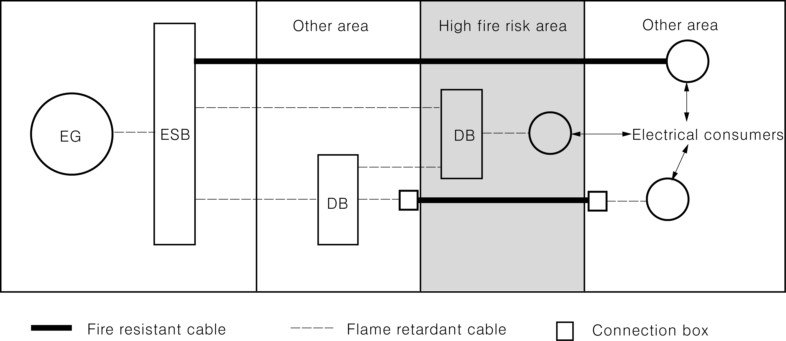
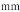
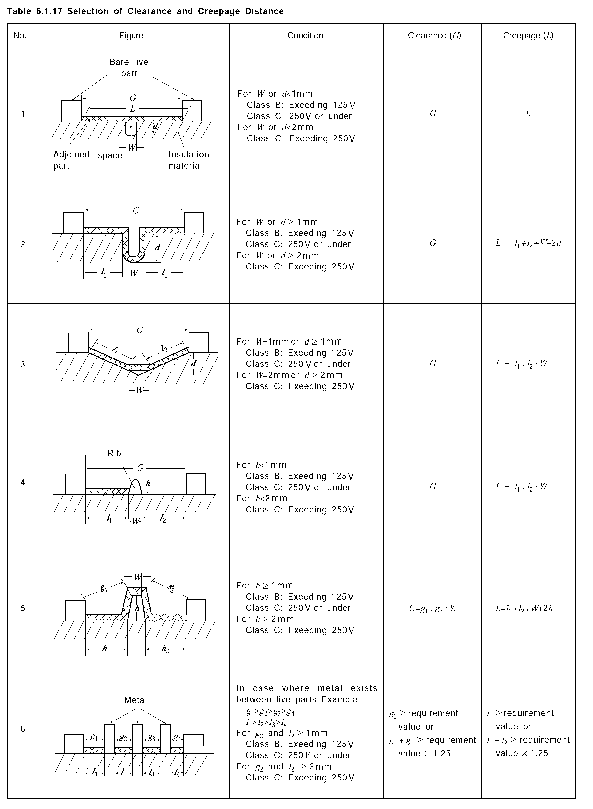
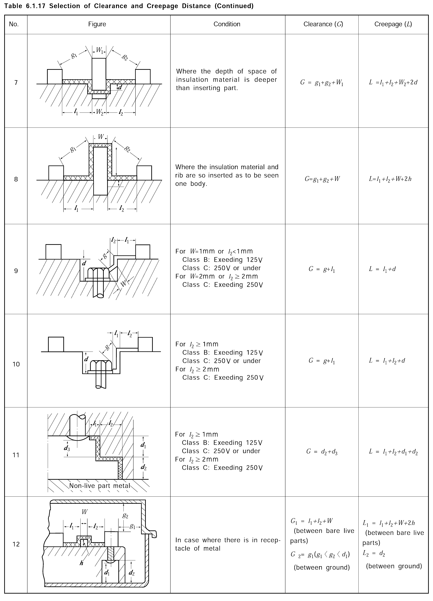

# PART 6 Electrical Equipment and Control Systems

> RULES FOR CLASSIFICATION OF STEEL SHIPS / RA-06-E / 2025 / EN / Guidance

## CHAPTER 1 ELECTRICAL EQUIPMENT

### Section 1 General

#### 101. General

- **1.** **Application 【See Rule】**
  - **(1)** The requirements in **Pt 6, Ch 1** of the Rules do not apply to the following electrical equipment except the case where the explosion-protected construction is necessary:
    - **(A)** Radiotelegraph or radiotelephone equipment installed in accordance with the international laws or law of the flag state.
    - **(B)** Navigation aids installed in accordance with the international laws or law of the flag state (those prescribed in regulation V/19 of Amendment 2009 to SOLAS Convention 1974)
  - **(2)** Electrical equipment for working and cargo handling, and home electrical appliances to be brought to ships such as television sets, radio sets, etc., are not applied to the requirements specified in **Pt 6, Ch 1** of the Rules excluding protection against electrical shock, firing and other casualties(including explosion). Electrical appliances not applied to the requirements of the Rules, as far as possible, are to comply with Korean Industrial Standards.
  - **(3)** Cables and protection devices (circuit breakers and fuses) connected to the electrical equipment or appliances stipulated in the requirements of (1) and (2) above, are to comply with the relevant requirements in **Pt 6, Ch 1** of the Rules.
  - **(4)** In application to **101. 1** (1) of the Rules, ships with special limitations for their service or small ships (less than 500 tons) mean the ships specified in the following:
    - **(A)** Ships having service restriction notations of machinery of KRM 0 as ships with gross tonnage less than 500 tons. *(2017)*
    - **(B)** Ships not having service restriction notations of equipment specified in (A) above as ships with gross tonnage less than 500 tons.
    - **(C)** Ships having service restriction notations of equipment specified in (A) above as ships with 500 tons gross tonnage or more, and ships complying with the requirements in **Pt 8 Annex 8-3, 1.** (1) and (2), **3.** (12) of the Guidance.
    - **(D)** Ships having class notations "$n \cdot f$" and service restriction notations of equipment specified in (A) above as ships with 500 tons gross tonnage or more and ships not complying with the requirements in **Pt 8 Annex 8-3, 1.** (1) and (2), **3.** (12) of the Guidance.
  - **(5)** Electrical equipment on board the ships specified in (4) above are to be in accordance with (1) through (3) above, and the following:

    |   | Relevant requirements^1) (mitigated requirements) |   | (A) | (B) | (C) | (D) |
    | --- | --- | --- | --- | --- | --- | --- |
    | (a) | Rule 201. 6 | Ambient conditions | O |   | O |   |
    | (b) | Rule 402. 1 (1) | Main switchboards' construction | O | O | O |   |
    | (b) | Rule 402. 1 (2) | Generator switchboard's construction | O | O | O |   |
    | (c) | Rule 404. 1 | *d.c*. ship's service generator panels | O |   | O |   |
    | (d) | Rule 404. 2 | *a.c*. ship's service generator panels | O |   | O |   |
    | (e) | Rule 701. 2 | Grouped starters | O | O |   |   |
    | (f) | Rule 504. 3 (2) | Precaution against fire protection of cables | O | O | O |   |
    | (g) | Rule 1203. | Protective devices, etc. | O | O | O |   |
    | (h) | Rule 202. and 1601. 3 | Main source of electrical power | O | O^2) | O |   |
    | (i) | Rule 601. | Transformers | O |   | O |   |
    | (j) | Rule 203. | Emergency source of electrical power | O | O | O |   |
    | (k) | Rule 204. 6 (3) | Feeder circuits of navigation lights indicator | O | O | O^3) |   |
    | (l) | Rule 1801. | Spare parts | O |   | O | O |
    | (m) | Rule 204. 1 (3) | Insulation monitoring system | O |   |   |   |
    | (n) | Rule 205. [3 (2)] | Protective devices [circuit breakers and fuses] | O |   | O^4) |   |
    | (o) | Rule 202. 5 | Where the main source of electrical power is necessary for propulsion and steering of the ship | O | O | O | O |
    | (p) | Rule 1106. | Public address systems | O | O | O | O |
    | (q) | Rule 401. 1 (2) | Installation of main switchboard | O |   | O | O |
    | NOTES) 1) : The detailed contents are to comply with the below (A) 2) : The detailed contents are to comply with the below (B) (b) 3) : The detailed contents are to comply with the below (C) (c) 4) : The detailed contents are to comply with the below (C) (b) |   |   |   |   |   |   |

    ① Embarkation station of life boats, life rafts, etc. and over the sides
    ② Accommodation alleyways, stairways and exits
    ③ Machinery spaces and spaces installed emergency source of electrical power
    ④ Control stations for main engine
    - **(A)** Ships specified in (4) (A) above
      - **(a)** In **201. 6** of the Rules, air temperature may apply 40${}^{\circ}\mathrm{C}$ instead of 45${}^{\circ}\mathrm{C}$, and sea water temperature may apply 27${}^{\circ}\mathrm{C}$ instead of 32${}^{\circ}\mathrm{C}$. However, ships engaged in tropical regions service are to be applied to the requirements in the Table. (refer to **Pt 5, Table 5.1.3** of the Rules)
      - **(b)** The requirements in **402. 1** (1) and (2) of the Rules do not apply.
      - **(c)** In **404. 1** of the Rules, where ships are provided with two or more *d.c*. generators engaged in single running only, ammeter and voltmeter are provided with each 1 set and are used in common for the generators. But, where the number of meters are made reduce, portable ammeter and voltmeter complied with the requirements in **1802.** of the Rules are to be equipped.
      - **(d)** In **404. 2** of the Rules, where the ships are provided with two or more *a.c*. generators engaged in single running only, ammeter, voltmeter and wattmeter are provided with each 1 set and are used in common for the generators. But, where the number of meters are made reduce, portable ammeter and voltmeter complied with the requirements in **1802.** of the Rules are to be equipped.
      - **(e)** The requirements in **701. 2** of the Rules do not apply.
      - **(f)** The requirements in **504. 3** (2) of the Rules do not apply.
      - **(g)** The requirements in **1203.** of the Rules do not apply.
      - **(h)** In application to **202.** and **1601. 3** of the Rules, a generator, transformer and converter may be provided with 1 set, except ships having class notation UMA and ships with coastal and the farther service. *(2024)*
      - **(i)** In **601.** of the Rules, where a accumulator battery with sufficient capacity necessary for electrical services of lightings, signal devices, radio equipment, etc. is provided, a reserved transformer may be omitted.
      - **(j)** The requirements in **203.** of the Rules do not apply. However emergency source of electrical power capable of supplying simultaneously the following services at least for 6 hours (for a period of 30 minutes with continuous operation for the below (iv) & (v) system), is to be provided. *(2024)*
      - **(i)** All communication equipment required in an emergency
        - **(ii)** Navigation lights and signal lights (not under command lights, anchor lights)
        - **(iii)** Emergency lights installed in the following station
        - **(iv)** Intermittent operation of the daylight signalling lamp, the ship's whistle, and all internal signals that are required in an emergency.
      - **(v)** The fire detection system and manually operated call point.
      - **(k)** In **204. 6** (3) of the Rules, navigation light indicators may be served by one circuit fed from the emergency source. The following may be considered the emergency source.
      - **(i)** Either of the two generators which come into immediately operation in the event of loss of the normal power
        - **(ii)** Charging devices for electric batteries
      - **(l)** In case of ships provided with efficient manual auxiliary steering gear, the requirements in **1801.** of the Rules do not apply.
      - **(m)** In **204. 1** (3) of the Rules, a earth indicator may be installed instead of the device capable of continuously monitoring the insulation level to earth. in case of lamp type earth indicator, the indicator is to be of 2 lamp type or 3 lamp type having metal filament of capacity of 30$\mathrm{W}$ or less, and distance between lamps less than 150 $\mathrm{mm}$.
      - **(n)** The requirements in **205. 3** (2) of the Rules do not apply. But, for the passenger ships, tankers and ships carrying dangerous chemicals in bulk, the plug-in type is to be applied only for the main switchboard and group start panels.
      - **(o)** The requirements in **202. 1** (3) of the Rules do not apply, except ships having class notation UMA and passenger ships engaged on international voyages.
      - **(p)** The requirements in **1106.** of the Rules do not apply.
      - **(q)** The requirements in **401. 1** (2) of the Rules do not apply. *(2019)*
    - **(B)** Ships specified in (4) (B) above
      - **(a)** The requirements in (A) (b), (e), (f), (g), (j), (k), (o) and (p) above apply.
      - **(b)** In **202. 1** (2) of the Rules, the capacity of generator is to be possible to supply services necessary to provide normal operational conditions of propulsion and safety in spite of the event of any one generating set being stopped. And the requirements in **202. 1** (3) and (5) of the Rules do not apply. *(2025)*
    - **(C)** Ships specified in (4) (C) above
      - **(a)** The requirements in (A) (a), (b), (c), (d), (f), (g), (i), (j), (l), (o), (p) and (q) above apply. *(2020)*
      - **(b)** The requirements in **205.** of the Rules do not apply. Group stater panels separated No.1 group and No.2 group are to be provided. But, for the passenger ships, tankers and ships carrying dangerous chemicals in bulk, the plug-in type is to be applied only for the main switchboard and group start panels. *(2018)*
      - **(c)** In **204. 6** (3) of the Rules, The navigation light indicator may be fed from the main switchboard and emergency switchboard or a lighting distribution board installed in the wheel house.
      - **(d)** In application to **202.** and **1601. 3** of the Rules, a generator driven by independent auxiliary engine may be provided with 1 set, except ships having class notation UMA and ships with coastal and the farther service. *(2019)*
    - **(D)** Ships specified in (4) (D) above
      - **(a)** The requirements in (A) (l), (o), (p) and (q) above apply. *(2020)*
  - **(6)** Where a ship applied to the requirements of (4) and (5) above makes an alteration of service area, purpose, etc., electrical equipment are to be installed in accordance with the Rules.
  - **(7)** The requirements for the emergency power on board passenger ships employed to domestic voyage are to apply as follows;
    - **(A)** The passenger ships employed to domestic voyage shall be equipped with the independent emergency power which satisfies following requirement of (a). However, for the passenger ships, of which navigation area is below the level of smooth water area, provided with the batteries for main power, if these batteries satisfy the item (7) with the following requirements of (a), the independent emergency power requirement is exempted.
      - **(a)** The batteries (equipped with electric discharge indicator) shall be charged with needed power always and be able to be charged imminently without radical drop of voltage
      - **(b)** For the case of the generator driven by the independent oil suppliers and the effective motors with the starter recognized to be proper by the Society.(limited to the ones of which fuel oil’s flash point of not less than 43 ℃). Emergency switchboard is to be installed as near as possible to emergency power.
    - **(B)** Emergency power according to the above (A) shall be charged imminently and automatically in the event of failure of the main source of electrical power due to malfunction, etc.
    - **(C)** Emergency source of electric power installed according to the above requirement (A) is to be supplied at least for 12 hours for the following services. However, in case of the ships expected voyage period with less than 6 hour, electric power may be supplied for 6 hours.
      - **(a)** Navigation lights
      - **(b)** Signal lights supplied from main source of electric power
      - **(c)** Emergency lights installed in the following stations.
      - **(i)** Corridors, stairways, ladders and exits
        - **(ii)** Main engine room, main generating room and engine control room
        - **(iii)** Navigation bridge, chart rooms and radio rooms
        - **(iv)** Places installed life boats, life rafts or life buoys and embarkation places.
      - **(v)** Other places where considered necessary by the Society
      - **(d)** Electric alarm system and indicators
      - **(e)** Fire detection system and manually operated call point.
      - **(f)** Other communication system, etc.
    - **(D)** Emergency source of electric power installed according to the above (A) is to be installed in accordance with the requirements of the followings.
      - **(a)** It is to be located above the uppermost continuous deck
      - **(b)** It is to be located outside the boundaries of engine spaces.
      - **(c)** It is to be located afterward of the collision bulkhead
      - **(d)** Supply of emergency electrical power is not to be interfered due to a fire or other casualty in spaces of engine rooms
      - **(e)** It is to be separated and ventilated from a fire or electrical sparks.
  - **(8)** In application to **402. 1** (2) of the Rules, The separation of the main switchboard busbars do not apply to fishing vessels.
  - **(9)** The requirements for the emergency power of fishing vessels are to apply as follows;
    - **(A)** A self-contained emergency source of electrical power located outside the machinery spaces is to be provided and so arranged as to ensure its functioning in the event of fire or other causes of failure of the main electrical installations.
    - **(B)** The independent emergency power which applies to any one of the following requirements is to be equipped in the fishing vessels;
      - **(a)** The accumulator battery which is always charged as required power and is to be sufficient to supply those services
      - **(b)** The emergency generator which is driven by a suitable prime mover with an independent supply of fuel, having a flashpoint of not less than 43°C
      - **(i)** Emergency generating sets are to be capable of being readily started in their cold condition at a temperature of 0${}^{\circ}\mathrm{C}$. If this is impracticable, or if lower temperatures are likely to be encountered, provision acceptable to the Society is to be made for maintenance of heating arrangements, to ensure ready starting of the generating sets.
        - **(ii)** Each emergency generating set arranged to be automatically started is to be equipped with approved starting devices approved by the Society with a storage energy capability of at least three consecutive starts. In addition, a second source of energy is to be provided for an additional three starts within 30 minutes unless manual starting can be demonstrated to be effective.
        - **(iii)** Electrical and hydraulic starting systems are to be maintained from the emergency switchboard.
      - **(c)** Electrical and hydraulic starting systems are to be maintained from the emergency switchboard.
      - **(d)** Compressed air starting systems may be maintained by the main or auxiliary compressed air receivers through a suitable non-return valve or by an emergency air compressor which, if electrically driven, is supplied from the emergency switchboard.
      - **(e)** All of these starting, charging and energy storing devices are to be located in the emergency generator space. These devices are not to be used for any purpose other than the operation of the emergency generating set. This does not preclude the supply to the air receiver of the emergency generating set from the main or auxiliary compressed air system through the non-return valve fitted in the emergency generator space.
    - **(C)** The emergency source of electrical power installed according to above (A) is to be capable of supplying simultaneously at least the following services for the period of 3 hours (6 hours for the equipment of (a) to (c)) : *(2020)*
      - **(a)** Radiocommunication equipment
      - **(b)** All internal communication equipment and signals, the fire detection and fire alarm system as required in an emergency
      - **(c)** Navigation lights
      - **(d)** Signal lights supplied from main source of electric power
      - **(e)** Emergency lights installed in the following station
      - **(i)** Embarkation station of life boats, life rafts, etc. and over the sides
        - **(ii)** Accommodation alleyways, stairways and exits
        - **(iii)** Machinery spaces and spaces installed emergency source of electrical power
        - **(iv)** Control stations for main engine
      - **(v)** Fish handling and process stations
        - **(vi)** An each installation location of emergency fire pump, sprinkler pump and emergency bilge pump and at the starting position of their motors
    - **(D)** The emergency switchboard which supply emergency power to the fishing vessels is to comply with the following :
      - **(a)** The emergency switchboard is to be installed as near as is practicable to the emergency source of electrical power.
      - **(b)** Where the emergency source of electrical power is a generator, the emergency switchboard is to be located in the same space unless the operation of the emergency switchboard would thereby be impaired.
      - **(c)** Automatically connecting to the emergency switchboard in the event of failure of the main source of electrical power.
      - **(d)** Where the emergency source of electrical power is an accumulator battery, an indicator is to be mounted to indicate when the battery is being discharged.
      - **(e)** The emergency switchboard is to be supplied during normal operation from the main switchboard by an interconnector feeder which is to be adequately protected at the main switchboard against overload and short circuit and which is to be disconnected automatically at the emergency switchboard upon failure of the main source of electrical power. Where the system is arranged for feedback operation the interconnector feeder is also to be protected at the emergency switchboard at least against short circuit.
  - **(10)** In application to **202. 1** (3) of the Rules, for fishing vessels, the requirements apply to ships assigned the class notations of UMA.
- **2.** In application to **101. 2** of the Rules, the term "as deemed appropriate by the Society" means the acceptance in accordance with **Pt 1, Ch 1, 104.** of the Rules. *(2020)* **【See Rule】**
- **3.** In application to **101. 4** (1) of the Rules, a gas explosive atmosphere is the condition in which the gas that combustion can be continuous because it is not ignited and consumed in atmospheric condition and combustible materials in vapour condition are compounded. Where concentration of mixture exceeds the upper explosive limit, because it is easy to be explosible spaces, although it is not a gas explosive atmosphere, this condition is considered as a gas explosive atmosphere. **【See Rule】**

#### 102. Drawings and data 【See Rule】

- **1.** In application to **102. 1** (14) of the Rules, the term "Drawings and data as deemed necessary by the Society" means the acceptance in accordance with **Pt 1, Ch 1, 104.** of the Rules. *(2020)*

#### 103. Testing and inspection

- **1.** The generators, switchboards and transformers used for cargo refrigerating installations and cargo handling arrangements specified in **Pt 9** of the Rules, are to be tested and inspected in accordance with the requirements in **103.** of the Rules.
- **2.** The cables to be type approved by the requirements in **103. 1** (2) of the Rules are in accordance with the followings. **【See Rule】**
  - **(1)** Cables used for supply and distribution circuits for power, lighting and internal communications
  - **(2)** Sheathed portable cords used for supplying and distribution circuits for power
  - **(3)** Polyvinylchloride insulated multi-core cables for 150 $\mathrm{V}$ electronic equipment
  - **(4)** Cables used for control circuit(insulation cables used for distribution boards and control gears)
  - **(5)** Cables used for communication such as optical fiber cables, coaxial cables and etc.
- **3.** Type approval test for sheathed portable cords and Polyvinylchloride sheath cords other than cables specified in above, may be carried out according to manufacturer's request.
- **4.** Tests and inspections on type approved products **【See Rule】**
  In application to **103. 6** of the Rules, it is to be in accordance with the followings.
  - **(1)** The inspections and tests in the presence of the Surveyor for individual product of followings among type-approved electrical equipment may be wholly omitted.
    - **(A)** Fuse
    - **(B)** Circuit breaker
    - **(C)** Magnetic contactor
    - **(D)** Cable trays/protective casings made of plastic materials
    - **(E)** Protection relay
  - **(2)** The individual products of followings among type-approved electrical equipment are to be tested in the presence of the Surveyor as follows: *(2025)*
    Tests and inspections of explosion-proof type rotating machinery is carried out according to **309.** of the Rules. *(2018)*
    - **(A)** Explosion-proof type electrical equipment (rotating machinery only)
- **5.** "Where deemed appropriate by the Society" required in notes (5) and (8) in **103. 1 Table 6.1.1** of the Rules means "the cases approved by QA or others." **【See Rule】**
- **6.** In application to **103. 4** of the Rules, the term “when it deems necessary" means the acceptance in accordance with **Pt 1, Ch 1, 104.** of the Rules. *(2020)* **【See Rule】**
- **7.** In application to No.13 in **103. 1 Table 6.1.1** of the Rules, if there is IECEx, ATEX, KC or equivalent explosion-proof certificate, type approval may be exempted. *(2023)* **【See Rule】**

### Section 2 System design

#### 201. General

- **1.** **Construction and installation**
  - **(1)** Protection devices **【See Rule】**
    In application to **201. 2** (3) of the Rules, power source switch of electrical equipment is to be so arranged that the equipment is not charged through control circuit or pilot lamp when the switch is in "off" position.
  - **(2)** Installation and protective enclosure **【See Rule】**
    The degree of protection of enclosures is to be as given in **Table 6.1.1** of the Guidance. Protection type is to be expressed by the combination of symbol IP, first characteristic numeral which shows the degree of protection against access to hazardous parts and ingress of solid foreign objects, second characteristic numeral which shows degree of protection against ingress of water with harmful effects and additional letter which shows the protection against access to hazardous parts. And protection type is to be carved on the surface of product or to be marked with other appropriate means.
    Construction and test methods of degree of protection are in accordance with **Table 6.1.2, Table 6.1.3, Table 6.1.4** and **Table 6.1.5** of the Guidance. The manufacturer is to carry out the relevant test for initial product at least, and is to identify effectiveness of protection type marked on the product. An individual test for the products may be carried out according to the discretion of the Surveyor.
    As a guide for the selection of degree of protection for the electrical equipment on the basis of the circumstances of the place of installation, the requirements given in **Table 6.1.6** of the Guidance are to be taken into consideration.

    **Table 6.1.1 Degree of Protection and Expression**

    | Code letters | First characteristic numeral | Second characteristic numeral | Additional letter(optional) | Supplementary letter(optional) |
    | --- | --- | --- | --- | --- |
    | Code letters | Against access to hazardous parts and ingress of solid foreign objects | Against ingress of water with harmful effects | Against access to hazardous parts | Supplementary information |
    | IP | 0 1 2 3 4 5 6 | 0 1 2 3 4 5 6 7 8 | A B C D | H M S W |
    | (NOTES) Out of expression, when either one of the first characteristic numeral or the second characteristic numeral is to be expressed, the degree of protection unnecessary is to be represented by X Examples : IPX8 - Degree of protection only against ingress of water with harmful effects IP5X - Degree of protection only against access to hazardous parts and ingress of solid foreign objects |   |   |   |   |

    | First characteristic numeral | Construction of protection | Testing methods and criteria |
    | --- | --- | --- |
    | 0 | Non protected | - |
    | 1 | Protected against access to hazardous parts with the back of a hand and protected against solid foreign objectsof 50$\mathrm{mm} \phi$ and greater | The sphere of 50(+0.05, -0) $\mathrm{mm}$ is not to fully penetrate with 50 $\mathrm{N}$ ±10 $\%$ of test force and adequate clearance form hazardous parts is to be kept. |
    | 2 | Protected against access to hazardous parts with a finger and protected against solid foreign objects of 12.5 $\mathrm{mm} \phi$ and greater | The jointed test finger of 12 $\mathrm{mm} \phi$, 80 $\mathrm{mm}$ length, may penetrate up to its 80 $\mathrm{mm}$ length with test force of 10 $\mathrm{N}$±10 $\%$, but adequate clearance form hazardous parts is to be kept. In addition, the sphere of 12.5(+0.05, -0) $\mathrm{mm}$ is not to fully penetrate with 30 $\mathrm{N}$± 10 $\%$ of test force. |
    | 3 | Protected against access to hazardous parts with a tool and protected against solid foreign objects of 2.5 $\mathrm{mm} \phi$ and greater | The test rod of 2.5(+0.05, -0) $\mathrm{mm}$ is not to penetrate with 3$\mathrm{N}$± 10 $\%$ of test force and adequate clearance form hazardous parts is to be kept. |
    | 4 | Protected against access to hazardous parts with a wire and protected against solid foreign objects of 1.0 $\mathrm{mm} \phi$ and greater | The test rod of 1.0(+0.05, -0) $\mathrm{mm}$ is not to penetrate with 1$\mathrm{N}$± 10 $\%$ of test force and adequate clearance form hazardous parts is to be kept. |
    | 5 | Protected against access to hazardous parts with a wire and dust-protected | (1) Testing methods and criteria against the first characteristic numeral 4 are to be complied with. (2) The enclosure where the normal working cycle of the equipment causes reductions in air pressure within the enclosure below that of the surrounding air, e.g., due to thermal cycling effects (hereinafter referred to as Category 1 enclosure) is to comply with the following (a) and (b). At the end of the test, talcum powder is not to be accumulated in a quantity or location such that it could interfere with the correct operation of the equipment or impair safety. (a) The test is to be made using a dust chamber. The powder circulation pump circulates and floats the talcum powdercontinuously in the test chamber. The talcum powder used is to be capable of passing through a square meshed sieve the nominal wire diameter of which is 50 $\mathrm{\mu} m$ and the nominal width between wires 75 $\mathrm{\mu} m$. The amount of talcum powder is to be 2 $\mathrm{kg}/m ^{2}$ of the testchamber. It is not to be used for more than 20 tests. The enclosure under test is to be supported inside the chamber by fixing or hanging. The pressure inside the enclosure is to be maintained below the surrounding atmospheric by a vacuum pump. The depression of the pressure is not to exceed 2 $\mathrm{kPa}$. (b) If an extraction rate of 40 to 60 vol/hour is obtained the duration of the test is to be 2 hours. If, with a maximum depression of 2 $\mathrm{kPa}$, the extraction rate is less than 40 vol/hour, the test is to be continued until 80 vol. have been drawn through, or a period of 8 *hours* has elapsed |

    | First characteristic numeral | Construction of protection | Testing methods and criteria |
    | --- | --- | --- |
    |   |   | (3) Enclosures where no pressure difference relative to the surrounding air is present (hereinafter referred to as Category 2 enclosures) are to comply with the above (2) tests in condition that the enclosure under the test is supported in its normal operating position, but is not connected to a vacuum pump. The test is to be continued for a period of 8 *hours*. At the end of the test, talcum powder is not to be accumulated in a quantity or location such that it could interfere with the correct operation of the equipment or impair safety. |
    | 6 | Protected against access to hazardous parts with a wire and dust-tight | (1) Testing methods and criteria against the first characteristic numeral 4 are to be complied with. (2) The above (2) tests against the first characteristic numeral 5 are to be carried out and deposit of dust is not to be observed inside the enclosure at the end of the test. |
    | (NOTES) The detailed test methods and criteria are referred to IEC 60529. |   |   |

    **Table 6.1.3 Degree of protection against ingress of water with harmful effects shown by the second characteristic numeral**

    | Second characteristic numeral | Construction of protection | Testing methods and criteria |
    | --- | --- | --- |
    | 0 | Non protected | - |
    | 1 | Protected against vertically falling water drops | The enclosure under test is to be placed in its normal operating position and 200 $\mathrm{mm}$ below the drip box. A flow of water drops, of which flow rate is 1(+0.5, -0) $\mathrm{mm}/\min$ are to be produced for 10 $it \mathrm{\min}$. At the end of the test, water is not to have accumulated in a quantity or location such that it could interfere with the correct operation of the equipment or impair safety |
    | 2 | Protected against vertically falling water drops when enclosure tilted up to 15 degrees | The enclosure under test is to be placed in its normal operating position and 200 $\mathrm{mm}$ below the drip box. A flow of water drops, of which flow rate is 3(+0.5, -0) $\mathrm{mm}/\min$, are to be produced for 2.5 $it \mathrm{\min}$ in each of four fixed positions. These positions are to be 15 degrees on either side of the vertical. At the end of the test, water is not to have accumulated in a quantity or location such that it could interfere with the correct operation of the equipment or impair safety |
    | 3 | Protected against spraying water | The enclosure under test is to be placed in its normal operating position. A uniform flow of water drops are to be produced over the whole area between vertical and 60 degrees on either side of the vertical at the distance of 300 $\mathrm{mm}$ to 500 $\mathrm{mm}$ from the enclosure. The delivery rate of water flow is to be 10(+0.5, -0.5) $\mathrm{mm}/\min$. The pressure to achieve this delivery rate is to be the range of 50 $\mathrm{kPa}$ to 150 $\mathrm{kPa}$. The test duration is to be 1 $it \mathrm{\min}/m ^{2}$ of the calculated surface area of the enclosure(excluding any mounting surface), with a minimum of 5 $it \mathrm{\min}$. At the end of the test, water is not to have accumulated in a quantity or location such that it could interfere with the correct operation of the equipment or impair safety |
    | 4 | Protected against splashing water | The enclosure under test is to be placed in its normal operating position. A uniform flow of water drops are to be produced over the whole area between vertical and 180 degrees on either side of the vertical at the distance of 300 $\mathrm{mm}$ to 500 $\mathrm{mm}$ from the enclosure. The delivery rate of water flow is 10(+0.5, -0.5) $\mathrm{l}/ \min$. The pressure to achieve this delivery rate is to be the range of 50 $\mathrm{kPa}$ to 150 $\mathrm{kPa}$. The test duration is to be 1 $it \mathrm{\min}/m ^{2}$ of the calculated surface area of the enclosure(excluding any mounting surface), with a minimum of 5 $it \mathrm{\min}$. At the end of the test, water is not to have accumulated in a quantity or location such that it could interfere with the correct operation of the equipment or impair safety |
    | 5 | Protected against water jet | The enclosure under test is to be placed in its normal operating position. A stream of water from a standard nozzle of which internal diameter is 6.3 $\mathrm{mm}$ is to be sprayed to the enclosure from all directions. The distance between the nozzle and the enclosure is to be 2.5 $\mathrm{m}$ to 3.0 $\mathrm{m}$. The delivery rate is (12.5 $l$ ± 0.5 *%*) /$it \mathrm{\min}$. Core of the substantial stream is to be a circle of approximately 40$\mathrm{mm}$ diameter at 2.5 $\mathrm{m}$ distance from nozzle. Test duration per square metre of enclosure surface area likely to be sprayed is to be 1 $it \mathrm{\min}$. Minimum test duration is to be 3 $it \mathrm{\min}$. At the end of the test, water is not to have accumulated in a quantity or location such that it could interfere with the correct operation of the equipment or impair safety |
    | 6 | Protected against powerful jet | The enclosure under test is to be placed in its normal operating position. A stream of water from a standard nozzle, of which internal diameter is 12.5 $\mathrm{mm}$, is to be sprayed on the enclosure from all directions. The distance between the nozzle and the enclosure is to be 2.5 $\mathrm{m}$ to 3.0 $\mathrm{m}$. The delivery rate is (100 $l$ ± 0.5 $\%$)*/*$it \mathrm{\min}$. Core of the substantial stream is to be a circle of approximately 120 $\mathrm{mm}$ diameter at 2.5 $\mathrm{m}$ distance from nozzle. Test duration per square metre of enclosure surface area likely to be sprayed is to be 1 $it \mathrm{\min}$. Minimum test duration is to be 3 $it \mathrm{\min}$. At the end of the test, no water is to have entered into the enclosure. |

    **Table 6.1.3 Degree of protection against ingress of water with harmful effects shown by the second characteristic numeral (continued)**

    | Second characteristic numeral | Construction of protection | Testing methods and criteria |
    | --- | --- | --- |
    | 7 | Protected against the effects of temporary immersion in water | The highest point of enclosures is to be located deeper than 150 $\mathrm{mm}$ below the surface of water, and also the lowest point of the enclosures is to be located deeper than 1000 $\mathrm{mm}$ below the surface of water. The duration of the test is to be 30 $it \mathrm{\min}$. The water temperature is not to differ from that of the equipment by more than 5$\mathrm{K}$. However, it may be waived where the equipment is energized and/or its parts in motion. At the end of the test, no water is to have entered into the enclosure. |
    | 8 | Protected against the effects of continuous immersion in water | The test conditions are to be subject to agreement between manufacturer and user, but they are to be more severe than the conditions for the second characteristic numeral 7 and they are to take account of the condition that the enclosure will be continuously immersed in actual use. At the end of the test, no water is to have entered into the enclosure. |
    | (NOTES) The detailed test methods and criteria are referred to IEC 60529. |   |   |

    **Table 6.1.4 Degree of protection against access to hazardous parts shown by the additional letters**

    | Additional letter | Construction of enclosure | Test methods and criteria |
    | --- | --- | --- |
    | A | Protected against access with the back of the hand | The access probe, sphere of 50 $\mathrm{mm} \phi$, is to have adequate clearance form hazardous parts with 50 $\mathrm{N}$ ± 10 $\%$ of test force. |
    | B | Protected against access with a finger | The jointed test finger of 12 $\mathrm{mm} \phi$, 80 $\mathrm{mm}$ length, is to have adequate clearance form hazardous parts with 10 $\mathrm{N}$ ± 10 $\%$ of test force. |
    | C | Protected against access with a tool | The access probe of 2.5 $\mathrm{mm} \phi$, 100 $\mathrm{mm}$ length, is to have adequate clearance form hazardous parts with 3 $\mathrm{N}$ ± 10 $\%$ of test force. |
    | D | Protected against access with a wire | The access probe of 1.0 $\mathrm{mm} \phi$, 100 $\mathrm{mm}$ length, is to have adequate clearance form hazardous parts with 1 $\mathrm{N}$ ± 10 $\%$ of test force. |
    | (NOTES) The detailed test methods and criteria are referred to IEC 60529. |   |   |

    **Table 6.1.5 Supplementary information shown by the supplementary letters**

    | Supplementary letter | Significance |
    | --- | --- |
    | H | High voltage apparatus |
    | M | Tested for harmful effects due to the ingress of water when the movable parts of the equipment, e.g., the rotor of the rotating machine, are in motion |
    | S | Tested for harmful effects due to the ingress of water when the movable parts of the equipment, e.g., the rotor of the rotating machine, are stationary |
    | W | Suitable for use under specified weather conditions and provided with additional protective features or process |

    **Table 6.1.6 Application of Degree of Protection** ***(2024)***

    | Example of location | Condition of location | Switchboard, etc(1) | Gener- ators | Motors | Transformers(7), Converters | Lighting fixtures | Heating appli- ances | Accessories(2) |
    | --- | --- | --- | --- | --- | --- | --- | --- | --- |
    | Dry accommodation space | Danger of touching live parts only | IP 20 | - | IP 20 | IP 20 | IP 20 | IP 20 | IP 20 |
    | Dry control rooms(4) | Danger of touching live parts only | IP 20 | - | IP 20 | IP 20 | IP 20 | IP 20 | IP 20 |
    | Control rooms | Danger of dripping water and(or) moderate mechanical damage | IP 22 | - | IP 22 | IP 22 | IP 22 | IP 22 | IP 22 |
    | Engine rooms and boiler rooms above floor plates(5) | Danger of dripping water and(or) moderate mechanical damage | IP 22 | IP 22 | IP 22 | IP 22 | IP 22 | IP 22 | IP 44 |
    | Steering gear rooms | Danger of dripping water and(or) moderate mechanical damage | IP 22 | IP 22 | IP 22 | IP 22 | IP 22 | IP 22 | IP 44 |
    | Refrigerating machinery rooms | Danger of dripping water and(or) moderate mechanical damage | IP 22 | - | IP 22 | IP 22 | IP 22 | IP 22 | IP 44 |
    | Emergency machinery rooms | Danger of dripping water and(or) moderate mechanical damage | IP 22 | IP 22 | IP 22 | IP 22 | IP 22 | IP 22 | IP 44 |
    | General store rooms | Danger of dripping water and(or) moderate mechanical damage | IP 22 | - | IP 22 | IP 22 | IP 22 | IP 22 | IP 22 |
    | Pantries | Danger of dripping water and(or) moderate mechanical damage | IP 22 | - | IP 22 | IP 22 | IP 22 | IP 22 | IP 44 |
    | Provision rooms | Danger of dripping water and(or) moderate mechanical damage | IP 22 | - | IP 22 | IP 22 | IP 22 | IP 22 | IP 22 |
    | Bathrooms and showers | Danger of spraying water and(or) increased danger of mechanical damage | - | - | - | - | IP 34 | IP 44 | IP 55 |
    | Engine rooms and boiler rooms below floor plates | Danger of spraying water and(or) increased danger of mechanical damage | - | - | IP 44 | - | IP 34 | IP 44 | IP 55(3) |
    | Closed fuel oil or lubricating oil separator rooms | Danger of spraying water and(or) increased danger of mechanical damage | IP 44 | - | IP 44 | - | IP 34 | IP 44 | IP 55(3) |
    | Ballast pump rooms, bow thruster rooms and similar spaces below load line | Danger of spraying water and(or) increased danger of mechanical damage | IP 44 | - | IP 44(6) | IP 44 | IP 34 | IP 44 | IP 55 |
    | Refrigerated rooms | Danger of spraying water and(or) increased danger of mechanical damage | - | - | IP 44 | - | IP 34 | IP 44 | IP 55 |
    | Galleys and laundries | Danger of spraying water and(or) increased danger of mechanical damage | IP 44 | - | IP 44 | IP 44 | IP 34 | IP 44 | IP 44 |
    | Shaft or pipe tunnels in double bottom | Danger of jet water, existence of cargo dust particle, serious mechanical damage and(or) aggressive fumes | IP 55 | - | IP 55 | IP 55 | IP 55 | IP 55 | IP 56 |
    | Holds for general cargo | Danger of jet water, existence of cargo dust particle, serious mechanical damage and(or) aggressive fumes | - | - | - | - | IP 55 | - | IP 55 |
    | Open decks | Exposure to heavy seas | IP 56 | - | IP 56 | - | IP 56 | IP 56 | IP 56 |
    | Bilge wells | Exposure to submersion | - | - | - | - | IP X8 | - | IP X8 |
    | (NOTES) (1) It contains distribution boards, motor control centers and controllers. (2) Accessories include switches, detectors, junction boxes, etc. (3) Socket outlets are not to be installed in engine rooms, boiler rooms below floor plates, enclosed fuel and lubricating oil separator rooms or spaces requiring certified safe equipment. (4) Navigation bridge may be categorized as a "dry control room" and consequently, the installation of IP 20 equipment would suffice therein provided that : (a) the equipment is located at to preclude being exposed to stream, or dripping/spraying water emanating from pipe flanges, valves, ventilation ducts and outlets, etc., installed in its vicinity, and (b) the equipment is placed to preclude the possibility of being exposed to sea or rain. (5) Where the equipment is located within areas protected by local fixed pressure water spraying or water-mist fire extinguishing system and its adjacent areas, it is to be complied with Pt 8 Ch 8 406. 3 of the Guidance. (6) Electric motors and starting transformers for thrusters shall be equipped with heating elements (space heater, etc) for standstill heating. Provided the space will not be used as pump room for ballast, fuel oil, etc., the thrusters motor may be accepted with IP 22 enclosure type. (7) When applied to an electric propulsion unit, it is to be in accordance with **Ch 1, 1605.** of the Rules. * “-” marks indicate installation of electrical equipment is not recommended., selection for explosion-protected construction is to be in accordance with the relevant requirements of **Pt 6, Ch 1** of the Rules. |   |   |   |   |   |   |   |   |
    - **(A)** In a case where the characteristic letter IP showing the protection type of enclosures in accordance with the IEC 60529 is used for the protective enclosures of electrical equipment, the following requirements are to be complied with.
      - **(a)** Degree and expression of protection of enclosures
      - **(b)** Construction and test method of degree of protection
      - **(c)** Application of degree of protection
    - **(B)** Paint stores, battery rooms, acetylene stores and relevant ventilation ducts are classified as "zone 1". Explosion protecting classes are not to be less than the followings in accordance with IEC 60079.
      - **(a)** Paint store : Gas vapour group IIB, temperature class T3
      - **(b)** Battery room : Gas vapour group IIC, temperature class T1
      - **(c)** Acetylene store : Gas vapour group IIC, temperature class T2
    - **(C)** The areas on open deck within 1 m from ventilation openings of paint stores, battery rooms, acetylene stores or 3 m from outlets of mechanical ventilation equipments is classified as "zone 2".
    - **(D)** Electrical equipment installed in paint stores, battery rooms, acetylene stores and enclosed spaces giving access to the paint store, battery room and acetylene store are to be in accordance with the followings.
      - **(a)** Electrical equipment installed in paint stores, battery rooms, acetylene stores and ventilating ducts for the paint store, battery room and acetylene store are to be of explosion-protected type and cables of armoured type or installed in metallic conduits are to be used.
      - **(b)** In the areas on open deck within 1 $\mathrm{m}$ of inlet and exhaust ventilation openings or within 3 $\mathrm{m}$ of exhaust mechanical ventilation outlets, the following electrical equipment is to be installed:
      - **(i)** Electrical equipment with the same explosion-protected structure as permitted in relevant enclosed spaces(zone 1) ; *(2022)*
        - **(ii)** Equipment of protection class Exn ; *(2022)*
        - **(iii)** Appliances which do not generate arcs in service and whose surface does not reach unacceptably high temperature ; or *(2022)*
        - **(iv)** Appliances with simplified pressurized enclosures or vapour-proof enclosures (minimum class of protection IP55) whose surface does not reach unacceptably high temperature
      - **(c)** The enclosed spaces giving access to the paint store, battery room and acetylene store may be considered as non-hazardous spaces, provided that :
      - **(i)** The door to the paint store, battery room and acetylene store is to be a gastight or watertight door with self-closing devices without holding back arrangements ;
        - **(ii)** The paint store, battery room and acetylene store are provided with an acceptable, independent, natural ventilation system ventilated from a safe area ; and *(2022)*
        - **(iii)** Warning notices are fitted adjacent to the paint store, battery room and acetylene store entrance stating that the store contains flammable liquids.
      - **(d)** Switches, protective devices, and motor control gear of electrical equipment installed in the paint store, battery room and acetylene store are to interrupt all poles or phases and are to be located in non-hazardous space.
  - **(3)** In application to **201. 2** (9) of the Rules, when current not more than rated values of electrical equipment and cables flows, deviation of magnetic compass needle not more than ±0.5° is not considered as a bad effect. And the excessive effect happened at the time of circuit on and off may not be considered, but the circuits switched on and off frequently are to be considered. **【See Rule】**
- **2.** **Earthing of electrical equipment 【See Rule】**
  - **(1)** In application to **201. 3** (2) of the Rules, the following exposed metal parts may not be earthen:
    - **(A)** Non-current-carrying metal parts of electrical equipment which are unlikely to be touched by persons during their service
    - **(B)** Lamp caps
    - **(C)** Shades, reflectors and guards, supported on lampholders or lighting fittings constructed of, or shrouded in non-conducting material
    - **(D)** Metal parts or screw separated by insulators from the current-carrying parts or from earthen non-current-carrying parts which are not charged or earthen under normal service condition
    - **(E)** Bearing housing insulated to prevent circulation of current in the bearing
    - **(F)** Clips of fluorescent lighting tube
    - **(G)** Equipment supplied at safety voltage
    - **(H)** Cable clips
  - **(2)** Earthing may be made under the requirements as specified below:
    - **(A)** All earthing connections are to be made through copper or other corrosion resistance material and to be securely installed to hull structure. All earthing conductors are to be protected, where necessary, against mechanical damage and electrolytic corrosion.
    - **(B)** Where the metal frame or enclosure of electrical equipment is directly fitted to hull structure, and the surface in contact are clean and free from rust, scales and paints, and bolted firmly, no earthing conductors may be provided.
    - **(C)** Under any circumstances, a lead cable sheath is not to be used as a sole earthing means.
    - **(D)** Nominal cross-sectional areas of all copper earthing conductors are to be as given in **Table 6.1.7** of the Guidance, In a case where earthing conductors other than copper are used, their conductances are to be of more than that of copper conductors given in **Table 6.1.7** of the Guidance.
    - **(E)** Connections between earthing conductors and hull structure are to be made in an accessible position, and to be secured by a screw of brass or other corrosion resistance material of diameter not less than 4 $\mathrm{mm}$ which is to be used for this purpose only. In any case, the contact faces are to have glossy metal surface when screws are tightened.
  - **(3)** **In a power distribution system where one line of the system is earthen and normally of non-current** carrying line, the earthing connection is to be as specified in (2) above. However, the upper limit value 64 $\mathrm{mm} ^{2}$ of the cross-sectional area of the earthing conductor given in **Table 6.1.7** of the Guidance does not apply.

    **Table 6.1.7 Sizes of Earthing Conductor**

    | Kind of earthing conductor |   | Conductor's sectional area of current-carrying parts | Minimum sectional area of copper earthing conductor |
    | --- | --- | --- | --- |
    | 1. Earthing conductor in flexible cables and flexible cords |   | 16 $\mathrm{mm} ^{2}$ or less | 100 $\%$ of conductor's sectional area of current-carrying parts |
    | 1. Earthing conductor in flexible cables and flexible cords |   | Over 16 $\mathrm{mm} ^{2}$ | 50 $\%$ of conductor's sectional area of current-carrying parts, but minimum 16 $\mathrm{mm} ^{2}$ |
    | 2. Earthing conductor in cable runs secured | Insulated earthing conductor | 16 $\mathrm{mm} ^{2}$ or less | 100 $\%$ of conductor's sectional area of current-carrying parts, but minimum 1.5 $\mathrm{mm} ^{2}$ |
    | 2. Earthing conductor in cable runs secured | Insulated earthing conductor | Over 16 $\mathrm{mm} ^{2}$ | 50 $\%$ of conductor's sectional area of current-carrying parts, but minimum 16 $\mathrm{mm} ^{2}$ |
    | 2. Earthing conductor in cable runs secured | Bared earthing conductor connected directly with lead sheath | 2.5 $\mathrm{mm} ^{2}$ or less | 1 $\mathrm{mm} ^{2}$ |
    | 2. Earthing conductor in cable runs secured | Bared earthing conductor connected directly with lead sheath | Over 2.5 $\mathrm{mm} ^{2}$ ~ 6 $\mathrm{mm} ^{2}$ | 1.5 $\mathrm{mm} ^{2}$ |
    | 3. Single earthing conductor |   | (a) 3 $\mathrm{mm} ^{2}$ or less | 100 $\%$ of conductor's sectional area of current-carrying parts, but minimum 1.5 $\mathrm{mm} ^{2}$ in case of lead wire, and minimum 3 $\mathrm{mm} ^{2}$ in case of the others |
    | 3. Single earthing conductor |   | (b) Over 3 $\mathrm{mm} ^{2}$ ~ 125 $\mathrm{mm} ^{2}$ | 50 $\%$ of conductor's sectional area of current-carrying parts, but minimum 3 $\mathrm{mm} ^{2}$ |
    | 3. Single earthing conductor |   | (c) over 125 $\mathrm{mm} ^{2}$ | 64 $\mathrm{mm} ^{2}$ |
  - **(4)** In application to **201. 3** (3) of the Rules, portable electrical appliances are to be in accordance with the followings.
    - **(A)** The non-current-carrying metal parts of portable electrical appliances are to be earthed through plugs and receptacles by mean of earthing conductors provided in flexible cables or cords.
    - **(B)** Portable electrical appliances insulated doubly may not be earthed.
  - **(5)** Aluminium superstructures
    Methods of securing aluminium superstructures to the steel hull of a ship often include insulation to prevent electrolytic corrosion between these materials. In such case, a separate bonding connection is to be provided between superstructure and the hull which should be made in such a manner that electrolytic corrosion is avoided and the points of connection may readily be inspected.
- **3.** **Ambient conditions 【See Rule】**
  - **(1)** In application to **201. 6** (1) of the Rules, "Ambient temperatures for electrical equipment installed in environmentally controlled spaces" are in accordance with the followings.
    - **(A)** Where electrical equipment is installed within environmentally controlled spaces the ambient temperature for which the equipment is to be suitable may be reduced from 45 °C and maintained at a value not less than 35 °C provided:
      - **(a)** The equipment is not for use for emergency services.
      - **(b)** Temperature control is achieved by at least two cooling units so arranged that in the event of loss of one cooling unit, for any reason, the remaining unit(s) is capable of satisfactorily maintaining the design temperature.
      - **(c)** The equipment is able to be initially set to work safely within a 45 °C ambient temperature until such a time that the lesser ambient temperature may be achieved; the cooling equipment is to be rated for a 45 °C ambient temperature.
      - **(d)** Audible and visual alarms are provided, at a continually manned control station, to indicate any malfunction of the cooling units.
    - **(B)** In accepting a lesser ambient temperature than 45 °C, it is to be ensured that electrical cables for their entire length are adequately rated for the maximum ambient temperature to which they are exposed along their length.
    - **(C)** The equipment used for cooling and maintaining the lesser ambient temperature is to be classified as a secondary essential service.
- **4.** **Clearance and creepage 【See Rule】**
  - **(1)** Clearance and creepage are in accordance with **706. 2** of the Guidance.

#### 202. Main source of electrical power (2019)

- **1.** **Capacity and arrangement of generating sets**
  - **(1)** In application to **202. 1** of the Rules, the diversity factor can be taken into account when calculating the generator capacity.
  - **(2)** In application to **202. 1** (4) of the Rules, the shaft driven generator systems are to comply with following requirements. **【See Rule】**
    Generators and generator systems, having the ship's propulsion machinery as their prime mover but not forming part of the ship's main source of electrical power may be used whilst the ship is at sea to supply electrical services required for normal operational and habitable conditions provided that:
    - **(A)** Forming part of the ship's main source of electrical power
      - **(a)** They are to be capable of operating under all weather conditions during sailing and during maneuvering, also when the vessel is stopped, within the specified limits for the voltage variation in **305. 4** and **306. 2** of the Rules and the frequency variation in **201. 5** (3) **Table 6.1.2** of the Rules.
      - **(b)** Their rated capacity is safeguarded during all operations given (A) above and is such that in the event of any other one of the generators failing, the essential services and services for habitability can be maintained.
      - **(c)** The short circuit current of the generator/generator system is sufficient to trip the generator/generator system circuit-breaker taking into account the selectivity of the protective devices for the distribution system. Protection is to be arranged in order to safeguard the generator/generator system in case of a short circuit in the main bus bar. The generator/generator system is to be suitable for further use after fault clearance.
      - **(d)** Standby generators are automatically started.
    - **(B)** Not forming part of the ship's main source of electrical power
      - **(a)** There are sufficient and adequately rated additional generators fitted, which constitute the main source of electrical power required by **202. 1** (1), (2) and (3) of the Rules.
      - **(b)** Arrangements are fitted to automatically start one or more of the generators, constituting the main source of electrical power required by **202. 1** (1), (2) and (3) of the Rules and also upon the frequency variations exceeding ±10% of the limits specified in (c) below. *(2025)*
      - **(c)** The specified limits for the voltage variations in **305. 4** and **306. 2** of the Rules and the frequency variation in **201. 5** (3) **Table 6.1.2** of the Rules can be met within the declared operating range of the generators and/or generator systems.
      - **(d)** The short circuit current of the generator and/or generator system is sufficient to trip the generator/generator system circuit-breaker taking into account the selectivity of the protective devices for the distribution system.
      - **(e)** Where considered appropriate, load shedding arrangements are fitted.
      - **(f)** On ships having remote control of the ship's propulsion machinery from the navigating bridge means are provided, or procedures be in place, so as to ensure that supplies to essential services are maintained during maneuvering conditions in order to avoid a blackout situation.
  - **(3)** Provisions for maintaining or immediately restoring the electrical supply to equipment propulsion and steering specified in **202. 1** (3) of the Rules are to comply with followings: **【See Rule】**
    - **(A)** Where the electrical power is normally supplied by more than one generator set simultaneously in parallel operation, provision of protection, including automatic disconnection of sufficient non-essential services and if necessary secondary essential services and those provided for habitability, is to be made to ensure that, in case of loss of any of these generating sets, the remaining ones are kept in operation to permit propulsion and steering and to ensure safety.
    - **(B)** Where the electrical power is normally be supplied by one generator, the following requirements are to be complied with.
      - **(a)** provision is to be made, upon loss of power, for automatic starting and connecting to the main switchboard of stand-by generator(s) of sufficient capacity with automatic restarting of the essential auxiliaries, in sequential operation if required.
      - **(b)** The time for automatic starting and connecting to the main switchboard of a standby generator specified in (A) above is to be preferably within 30 seconds, but in any case not more than 45 seconds, after loss of power.
  - **(4)** In application to **202. 1** (3) of the Rules, preference tripping may be carried out in two or more stages and the following services do not apply preference tripping:
    - **(A)** Emergency services in accordance with **203.**
    - **(B)** Primary essential services
    - **(C)** Secondary essential services that, when disconnected, will:
      - **(a)** cause immediate disruption of systems required for safety and navigation of the vessel, such as navigation lights, aids and signals, internal safety communication equipment, lighting system.
      - **(b)** prevent services necessary for safety from being immediately reconnected when the power supply is restored to its normal operating conditions, such as fire pumps and other fire extinguishing medium pumps, bilge pumps, ventilation fans for engine and boiler rooms.
- **2.** **Transformers and Convertors**
  - **(1)** Capacity and number of transformer **【See Rule】**
    
    **Fig 6.1.1 Arrangement of Transformers**
    - **(A)** In application to **202. 2** (1) of the Rules, where 3 sets of single phase transformer are arranged with *D* circuit connection at each first and second stage, and sufficient capacity necessary for essential services can be supplied in spite of arranging $V$ circuit connection due to failure of 1 set among them, a reserved transformer does not need to be installed specially. But, where 3 phase transformer of *Y*-*D* circuit connection is used, a reserved 3 phase transformer is to be installed.
    - **(B)** Arrangement of transformers are to be as follows. (see **Fig 6.1.1** of the Guidance)
      - **(a)** Each transformer is to be located as a separate unit with separate enclosure or equivalent thereto.
      - **(b)** Each transformer is to be served by separate circuits on the primary and secondary side.
      - **(c)** Each primary circuit is to be provided with switch-gear and protection devices in each phase.
      - **(d)** Each of the secondary circuits is to be provided with a multipole isolating switch.
      - **(e)** Transformers supplying bow thruster are excluded.

#### 203. Emergency source of electrical power

- **1.** **Application 【See Rule】**
  - **(1)** In application to **203. 1** (4) of the Rules, "exceptionally" whilst the vessel is at sea, means the following:
    - **(A)** Blackout situation
    - **(B)** Dead-ship situation
    - **(C)** Routine use for testing
    - **(D)** Short-term parallel operation with the main source of electrical power for the purpose of load transfer
  - **(2)** The emergency generator may be used during lay time in port for the supply of the ship mains, provided the requirements as per items (A) and (B) below are complied with.
    - **(A)** Requirements
      - **(a)** To prevent the generator or its prime mover from becoming overloaded when used in port, arrangements are to be provided to shed sufficient non-emergency loads to ensure its continued safe operation.
      - **(b)** The prime mover is to be arranged with fuel oil filters and lubrication oil filters, monitoring equipment and protection devices as required for the prime mover for main power generation and for unattended operation.
      - **(c)** The fuel oil supply tank to the prime mover is to be provided with a low level alarm, arranged at a level ensuring sufficient fuel oil capacity for the emergency services for the period of time as required by SOLAS.
      - **(d)** The prime mover is to be designed and built for continuous operation and should be subjected to a planned maintenance scheme ensuring that it is always available and capable of fulfilling its role in the event of an emergency at sea.
      - **(e)** Fire detectors are to be installed in the location where the emergency generator set and emergency switchboard are installed.
      - **(f)** Means are to be provided to readily change over to emergency operation.
      - **(g)** Control, monitoring and supply circuits, for the purpose of the use of the emergency generator in port are to be so arranged and protected that any electrical fault will not influence the operation of the main and emergency services. When necessary for the safe operation, the emergency switchboard is to be fitted with switches to isolate the circuits.
    - **(B)** Instructions are to be provided on board to ensure that when the vessel is under way all control devices(e.g. valves, switches) are in a correct position for the independent emergency operation of the emergency generator set and emergency switchboard. These instructions are also to contain information on required fuel oil tank level, position of harbour/sea mode switch if fitted, ventilation openings, etc.
- **2.** **Capacity of emergency source of power 【See Rule】**
  - **(1)** The power supply period for the navigation lights (masthead lights, side lights and stern lights) specified in **203. 2** (2) (C) of the Rules, may be reduces to 3 hours under the acceptance of the domestic regulations of flag state of the ship.
  - **(2)** In application to **203. 2** (2) (E) (a) of the Rules, "Internal communication equipment" means the following:
    - **(A)** Engine telegraph
    - **(B)** Communication equipment between the navigation bridge and the main engine control stations other than main control station
    - **(C)** Engineers′ alarm
    - **(D)** Communication other than general telephone between the navigation bridge and the steering gear compartment
    - **(E)** Other internal communication equipment as deemed necessary by the Society
      - **(a)** In case of passenger ships, the following requirements are to be complied with.
      - **(i)** The means of communication which is provided between the officer of the watch and the person responsible for closing any watertight door which is not capable of being closed from a central control station.
        - **(ii)** The public address system or other effective means of communication which is provided throughout the accommodation, public and service spaces.
        - **(iii)** The means of communication which is provided between the navigating bridge and the main fire control station.
  - **(3)** In application to **203. 2** (2) (E) (b) of the Rules, in case where domestic regulations of flag of the ship accept, the capacity of emergency source of power may be in accordance with the following:
    - **(A)** Ships having gross tonnage 5000 tons or more may be reduced to the service period of rudder angle indicator specified in **Pt 5, Ch 7, 206.** (2) of the Rules.
    - **(B)** Ships having gross tonnage less than 5000 tons are to be in accordance with the followings:
      - **(a)** It is not required to supply emergency source the following navigation equipment.
      - **(i)** Gyro-compass
        - **(ii)** Echo-sounding device
        - **(iii)** Device to indicate speed and distance through the water
        - **(iv)** Rudder angle indicator, revolution meter of each propeller, propellers and the pitch and operational mode of controllable pitch propellers
      - **(b)** Service period for navigation radar may be reduced to the period by domestic regulations of flag of the ship (until 3 hours in case of having Korean flag ship).
  - **(4)** In case where domestic rules of flag of ship are accepted, the service period of the load in **203. 2** (2) (E) (d) and fire alarm system in **203. 2** (2) (E) (c) of the Rules may be reduced until 30 minutes.
- **3.** **Kind and performance of emergency source of electrical power**
  - **(1)** In application to **203. 3** (2) (A) of the Rules, where the inverter or converter is connected to the output circuit of the batteries (consumer side), the maximum permitted voltage fluctuations may be taken as those specified in **Table 6.1.2** (a) or (b) in **201. 5** of the Rules respectively, notwithstanding the voltage drop on the battery. **【See Rule】**
  - **(2)** Starting from dead ship condition **【See Rule】**
    In application to **203. 3** (4) of the Rules, the followings are to be complied with.
    - **(A)** The emergency generator and other means needed to restore the propulsion are to have a capacity such that the necessary propulsion starting energy is available within 30 minutes of blackout/dead ship condition. Emergency generator stored starting energy is not to be directly used for starting the propulsion plant, the main source of electrical power and/or other essential auxiliaries(emergency generator excluded).
    - **(B)** For steam ships, the 30 minute time limit can be interpreted as time from blackout/dead ship condition defined above to light-off of the first boiler.
- **4.** **Transitional source of emergency electrical power 【See Rule】**
  In application to **203. 4** (1) of the Rules, where the inverter or converter is connected to the output circuit of the batteries(consumer side), the requirements specified in **203. 3** (1) may be applied.
- **5.** **Starting arrangements for emergency generating sets 【See Rule】**
  - **(1)** The starting devices specified in **203. 6** (2) of the Rules are to be comply with the following requirements:
    - **(A)** The source of stored energy is to be capable of starting the prime mover at least six times.
    - **(B)** In case where the automatic starting system is of the consecutive starts, the number of starts is to be three or less.
    - **(C)** For the automatic starting system, means are to be provided to hold such an allowance of source of energy capable of starting the prime mover three times further after making the initial consecutive starts.
  - **(2)** If the charging devices specified in 203. 6 (2) of the Rules uses an electrical method, it is to be comply with the following requirements: *(2025)*
    - **(A)** The charging facilities are to incorporate independent means such as overvoltage protection to prevent gas evolution in excess of the manufacturer's design quantity. If necessary, temperature compensated chargers are to be provided in accordance with manufacturer’s recommendations.
    - **(B)** Spacing for proper airflow is be provided in accordance with manufacturer's recommendations, in absence of such recommendation then adequate spacing for proper airflow is to be provided between batteries.
    - **(C)** For float charging of starting batteries utilizing VRLA type batteries, the charger voltage is to be specified in the batteries maintenance schedule based on manufacturer’s recommendations.
    - **(D)** Boost charge facilities (where provided) is to be arranged such that they are automatically disconnected when the battery enclosure or each battery temperature rises above manufacturer’s recommendations. A visible and audible alarm is be provided in a continually manned space, such as the navigation bridge, the engine control room, etc. to indicate the activation of the automatic disconnection. Automatic return to float charging mode is not acceptable.
    - **(E)** For preferred values for float/boost charge current, reference can be made to Table 1 of IEC 62485-2: 2010.

#### 204. Distribution

- **1.** **Methods of distribution**
  - **(1)** Insulation monitoring system **【See Rule】**
    - **(A)** Distribution system is the circuit such as the followings.
      - **(a)** First stage distribution circuit connected with circuit of electric generator
      - **(c)** Second stage distribution circuit connected by way of insulation transformer from the first stage distribution circuit in (a) above. But, as far as not specifying specially, second stage distribution circuit of specific equipment (for example, Suez canal search light, heater and lighting circuit for specific crane, etc.) is to be excluded.
      - **(c)** Lighting circuit using accumulator batteries as electrical source or main busbar of distribution boards connected to the circuit
    - **(B)** Alarm setting value of insulation monitoring device may be set to international standards(e.g. IEC 61439-1) recognized by the Society. *(2025)*
    - **(C)** Where insulation monitoring device is used with earth lighting, interlocking device between them is to be provided.
  - **(2)** Hull return distribution **【See Rule】**
    - **(A)** The term "Electrical circuit subjected to the approval of the Society in **204. 1** (4) (A) (d) of the Rules" is the intrinsically safe circuit.
    - **(B)** The term "special precautions taken to the satisfaction of the Society in **204. 1** (4) (B) of the Rules" is the followings.
      - **(a)** All final sub-circuit is to consist of two insulated wires, and the hull return circuit is to be achieved by connecting directly to the hull one of the busbars of the distribution board from which they originate
      - **(a)** Earth wires are to be installed in readily accessible locations to permit their examination and disconnection for testing of insulation.
- **2.** **Shore connections 【See Rule】**
  - **(1)** Protector of connection box
    In application to **204. 3** (2) of the Rules, in case where portable means checking the phase sequence or polarity is provided on-board, means checking the phase sequence or polarity for shore connection may be omitted.
- **3.** **Navigation light circuits 【See Rule】**
  - **(1)** Installation of navigation light indicator
    In application to **204. 6** (5) of the Rules, navigation light indicator is to be placed in both an accessible position on the navigation bridge and an easily accessible position for operating, and alarm is to be provided for power failure of navigation lights and in case that navigation lights are turned out due to short circuit, etc.
- **4.** **Feeder circuits for communication and signalling system, other lights 【See Rule】**
  - **(1)** Daylight signalling lamp
    In application to **204. 8** (3) of the Rules, the power supply of the daylight signalling lamps is to comply with following requirements.
    - **(A)** Daylight signalling lamps are not to be solely dependent upon the ship's main or emergency sources of electrical energy.
    - **(B)** Daylight signalling lamps are to be provided with a portable battery with a complete weight of not more than 7.5 $\mathrm{kg}$.
    - **(C)** The portable battery is to have sufficient capacity to operate the daylight signalling lamp for a period of not less than 2 hours.
    - **(D)** The portable battery is to be charged from the ship's main or emergency sources of electrical energy.

#### 205. Protective devices

- **1.** **Protection against short-circuit 【See Rule】**
  - **(1)** In application to **205. 5** of the Rules, the circuit-breakers approved by the Society are recognized as the circuit-breaker having the following making capacity, but the case specified in **205. 5** (3) of the Rules is excluded.
    - **(A)** *d.c*. circuit-breaker: value same as the rated short-circuit current
    - **(B)** *a.c*. circuit breaker: value specified in **Table 6.1.8** of the Guidance
  - **(2)** In *a.c*. circuit breaker, short-circuit test is to be carried out by test circuit having power factor different from the value specified in **Table 6.1.8** of the Guidance, the value calculated by the formula is to be used as a standard value for the making capacity of circuit-breaker passed the test.
    $I _{making } =I _{sy} \times n(A)$, $n= \sqrt {2} \left\{ 1+\sin \phi \times e ^{- \frac{\frac{\pi}{2} + \phi}{\tan \phi}} \right\}$
    $I _{making}$ : Making current
    $I _{sy}$ : Rated short-circuit current (effective value of short-circuit current in contrast to 1/2 cycle after shorting the circuit)

    **Table 6.1.8 Making Current of** ***a.c*****. Circuit Breaker**

    | Kind | Rated short-circuit current $I _{sy}$ (*A*) | Making current $I _{making}$ (*A*) | $n I _{making}$ */*$I _{sy}$ | Power factor of circuit for short-circuit test $it \cos \phi$ |
    | --- | --- | --- | --- | --- |
    | Moduled-case circuit- breaker | 2,500 5,000 7,500 10,000 14,000 18,000 | 4,250 8,500 12,750 17,000 23,800 30,600 | 1.7 | 0.5 |
    | Moduled-case circuit- breaker | 22,000 25,000 30,000 35,000 42,000 50,000 65,000 85,000 100,000 | 48,400 55,000 66,000 77,000 92,400 110,000 143,000 187,000 220,000 | 2.2 | 0.2 |
    | Air circuit- breaker | 10,000 20,000 40,000 70,000 90,000 | 20,000 44,000 92,000 161,000 207,000 | 2.0 2.2 2.3 2.3 2.3 | 0.3 0.2 0.15 0.15 0.15 |
  - **(3)** In case where determination of cascade breaking capacity of breakers necessary for employing for short-circuit protection is intended in accordance with **205. 5** (2) of the Rules, the test method and criteria are to be as specified the followings.
    Back-up circuit breakers and fuses are to be connected in series with the circuit breakers on load side, and short-circuit tests under an operating duty of O - 2 minutes* - CO 1 time for one circuit breaker on load side are to be carried out.
    Note: In case where the thermal trip reset time and fuse replacement time exceed 2 minutes, the time asterisked is the one deemed appropriate by the Society.
    The circuit breakers on load side are to satisfy the following requirements.
    - **(A)** Test method
    - **(B)** Criteria after tests
      - **(a)** No short-circuit is to be caused if the back-up circuit breaker is reclosed with the power supply being connected, and no voltage is to be applied on the terminals of the circuit breaker on load side.
      - **(b)** Circuit breaker can be safely and easily replaced with a spare.
      - **(c)** No damage is to be caused on the case body and cover.
      - **(d)** Maker and break of circuit is to be possible.
      - **(e)** High voltage test is to be carried out at a voltage 2 times the rated voltage, and to prove that it resists the voltage.
      - **(f)** Insulation resistance is to be 0.5 $\mathrm{M} \Omega$ or over.
- **2.** **Protection of generator 【See Rule】**
  In application to **205. 6** of the Rules, protection of generator is to be in accordance with the following.
  - **(1)** The trip current scale adjusting value of over-current trip device, with time delay, for generator is to be selected as value protected at safety over-current according to heat capacity of generator and characteristics of over-current trip device, with time delay. And where kind and adjusting value of over-current trip device, with time delay (long delay and short delay), for short-circuit protection device are selected, cooperation between protection devices is to be considered.
  - **(2)** When parallel running of two sets or more of generators is capable, and selection trip device is provided, the adjusting value and characteristics of over-current trip device, with time delay, are so selected that over-current trip device of generator is not to operate with preference trip device at the same time. And when essential service motors are in danger of operating selection trip device at starting, the device may be interlocked during operating the motors.
  - **(3)** The following adjusting values for reverse power protection device are standard value.
    - **(A)** Generator driven by turbine : 2 ~ 6 $\%$
    - **(B)** Generator driven by diesel engine : 6 ~ 15 $\%$
- **3.** **Protection of feeder circuits 【See Rule】**
  In application to **205. 9** of the Rules, rated current or trip current value of protection device used in single motor circuit excluding circuit for steering gear motors and small motors of rated current value 6$\mathrm{A}$ or less is, as possible as, to be not more than value specified in **Table 6.1.9** of the Guidance.

  **Table 6.1.9 Protection of feeder circuits**

  | Kind of motor (starting method) |   | Rated current of fuse or moduled-case circuit-breaker |
  | --- | --- | --- |
  | *d.c*. motor |   | 150 |
  | Winding type induction motor |   | 150 |
  | Single phase, squirrel cage type, and synchronous motor (full voltage, reactor and resistor starting) |   | 300 |
  | Squirrel cage type and synchronous motor (single winding transformer starting), special squirrel cage type motor | less than 30 $\mathrm{A}$ | 250 |
  | Squirrel cage type and synchronous motor (single winding transformer starting), special squirrel cage type motor | 30 $\mathrm{A}$ or over | 200 |
- **4.** **Protection of circuits 【See Rule】**
  - **(1)** In application to **205. 2** (2) of the Rules, “where the Society may exceptionally permit” means the followings.
    - **(A)** When it is impracticable, for example engine starting battery circuit
    - **(B)** For essential motors which are duplicated and thruster motor, the overload protection may be replaced by an overload alarm
    - **(C)** For exceptional permission according to **Pt 5, Ch 7, 207. 5** and **301. 2** (5) of the Rules.

### Section 3 Rotating Machinery

#### 302. Prime movers for generators (2020) 【See Rule】

In application to **302. 2** (2) of the Rules Application of electrical load in more than 2 load steps can only be permitted, if the conditions within the ship’s mains permit the use of such prime movers which can only be loaded in more than 2 load steps (see **Fig. 6.1.2** for guidance on 4-stroke diesel engines expected maximum possible sudden power increase) and provided that this is already allowed for in the designing stage. This is to be verified in the form of system specifications to be approved and to be demonstrated at ship’s trials. In this case, due consideration is to be given to the power required for the electrical equipment to be automatically switched on after black-out and to the sequence in which it is connected. This applies analogously also for generators to be operated in parallel and where the power has to be transferred from one generator to another in the event of any one generator has to be switched off.

**Fig 6.1.2 Reference values for maximum possible sudden power increases as a function of brake mean effective pressure, P _me , at declared power (four-stroke diesel engines)**Note)P_me : declared power mean effective pressureP : power increase referred to declared power at site conditions
However, in case where the above throwing-on method applies, the manufacturers or shipyards are requested to submit a throw-on power calculation sheet demonstrating that the thrown load and base load at each step of operation do not exceed the value determined by the formulae above under any circumstances, to the Society for approval.

#### 303. Rotating machinery shaft

- **1.** **Rotating machinery shaft 【See Rule】**
  - **(1)** In application to **303. 1** of the Rules, The fillet radius on edge part is to be 0.08 times the shaft's actual diameter to prevent the stress concentration. In a case where the filet radius is less than 0.08 times the shaft's actual diameter, the shaft diameter is to be increased proportionally according to the coefficient of stress concentration.
  - **(2)** “Where it is apprehended that the torque is remarkably greater than normal torque” means where the auto synchronizing device is not installed. In this case the value of F is to be 120 *%* of the value given in accordance with **Table 6.1.4** of the Rules.

#### 304. Temperature rise 【See Rule】

- **1.** In application to **304. 1** of the Rules, temperature rising of bearing is to be in accordance with the followings.
  - **(1)** Temperature rising limit of bearing (self-cooling type) is 35${}^{\circ}\mathrm{C}$ when it measures at the surface, and is 40${}^{\circ}\mathrm{C}$ when it measures by keeping temperature sensor under the metal. However, where heat-proof lubricating oil is used, it is 50${}^{\circ}\mathrm{C}$ when it measures at the surface.
  - **(2)** Where rotating machinery used heat-proof insulation material of up-grade than F-Grade is difficult to apply to (1) above, data for heat-proof temperature rising limit is to be submitted to the Society, and is to be approved by the Society.
- **2.** Temperature measuring method for winding of rotating of machinery forced cooling type by air cooler is to be the method of keeping temperature sensor under the winding or bridge method.
- **3.** When cooling water temperature of rotating machinery of forced cooling type by air cooler is over 32${}^{\circ}\mathrm{C}$, the temperature limit is to be in accordance with the discretion of the Society.

#### 308. Welding 【See Rule】

- **1.** The manufacturers are to submit the detailed data in connection with the welding work for examination of the Society if they plan to make coupling of generator shaft welded with flange for the first time. And fatigue test is to be included in the welding process qualification test.
- **2.** The manufacturers are to submit the following data in connection with the welding work for examination of the Society if they plan to make generator shaft welded with rib, etc.
  - **(1)** Standard design stress and strength calculation data for rib, etc. attached to the shaft by welding
  - **(2)** Standard for welding workmanship and details for control standard
  - **(3)** Welding process qualification test record. The test results carried out by means of the test specimen manufactured according to the standard for welding workmanship specified in above (2), are to be included to the record, and macro test, micro test and hardness distribution measurement for welding parts are to be carried out.
- **3.** The torque transmission parts such as spider(center of rotor), etc. with welded construction are to be in accordance with 2 above.
- **4.** Welding for electric motor shaft is to be in accordance with the followings.
  - **(1)** The essential auxiliary driving motors having output of 100 $\mathrm{kW}$ or over are to be in accordance with **1** and **2** above.
  - **(2)** The motors having output less than 100 $\mathrm{kW}$ are to be in accordance with the followings.
    - **(A)** Shaft coupling flanges with welded construction are to be applied with appropriate modification of (1) above.
    - **(B)** For rib, etc. with welded construction, standard for welding workmanship only instead of (A) above may be submitted.

#### 309. Testing and inspection

- **1.** **Temperature test 【See Rule】**
  In application to **309. 3** of the Rules, temperature test of rotating machinery, as a general rule, is carried out at actual load. But, in an unavoidable case, the zero power factor method or the temperature deduction method may apply to synchronous machines, and the equivalent load method may apply to induction machinery, such as the followings.
  - **(1)** Synchronous machines
    The rotating machinery is to be over-excited at unload condition by generator or motor, and is to be tested by flowing current close to rated current of zero power factor at rated voltage and frequency. The zero power factor method is capable of applying to synchronous machines for compensating of power factor, but where the method applies to synchronous generator or motor, sufficient field current to get value close to rated output providing for the case a hard to get the rated output by short of field current, is to flow at the test, and the test result is to be corrected according to the followings.
    $t'$ = rising temperature of windings at voltage $V '$, current $I '$
    $t ' _c$ = rising temperature of iron cores at voltage $V '$, current $I '$
    $t ' _f$ = rising temperature of field windings at field current $I ' _{f}$
    Armature windings : $T=t _{0} +(t ' -t _{0} ) \times \left( \frac{I}{T} \right)^2$
    Iron core of armature : $T=t _{c 0} +(t ' -t _{c 0} ) \times \left( \frac{I}{T} \right)^2$
    Field windings : $I _{f} =t ' _{f} \times \left( \frac{I _{f}}{T _{f}} \right) ^{2}$
    The test voltage $V '$, as far as possible, is to be rated voltage, but voltage over than 90 $\%$ of rated voltage.
    Whichever is available among the followings.
    - **(A)** Zero power factor method
      - **(a)** Temperature test is to be carried out for each rated voltage and no-load (armature open circuit), and rising temperature $t _{0}$ of armature winding and rising temperature $t _{c0}$ of iron core of armature are to be get from the test.
      - **(b)** In zero power factor method
      - **(c)** when rated voltage is $V$, Rising temperature can be calculated by the following formula.
    - **(B)** Temperature deduction
      - **(a)** The rising temperature of iron core at rated output is the rising temperature of iron core when rotating machinery is operated at unload condition of terminal voltage equivalent to 110 $\%$ of rated voltage, and the rising temperature of armature windings at rated output is the rising temperature of armature windings when rotating machinery is operated at short condition of all terminals carrying armature current equivalent to 125 $\%$ of rated output.
      - **(b)** Total rising temperature of iron cores and armature windings, in each case, measured final temperature of iron core and armature windings when rotating machinery is operated at unload condition of rated voltage or at short condition of all terminals carrying rated current, is each rising temperature for rated output.
      - **(c)** The circulation current equivalent to rated current armature at *d.c.* or single phase source is to be transmitted at the condition of that windings are connected by ring shape(triangle) line connection type, and opened one side, the terminal voltage equivalent to rated voltage, rising temperature of armature iron cores and windings are almost same as rated output when rotating machinery operates at rated speed through exciting to generate voltage of terminals equivalent to rated voltage. The current of field is to be corrected by zero power factor method.
  - **(2)** Inductors
    This method is test method carried out by increasing and decreasing the voltage and frequency after synthesizing the voltage of main source and low voltage having frequency different from the voltage of main source when the inductor for testing connected such as **Fig 6.1.3** of the Guidance operates at no-load condition, and in general, the method synthesizing first stage current and total load current (current standard method), is used. The method (loss standard method) that input is equalized with loss at rated load calculated from the circle diagram method for inductors of special squirrel cage, 2 pole machinery and large output.
    This method is test method transmitted full load current to first stage by increasing and decreasing the voltage and frequency after synthesizing the second stage voltage and low voltage having low frequency when the inductor for testing connected as **Fig 6.1.4** of the Guidance operates at no-load condition.
    
    **Fig 6.1.3****First stage synthesizing equivalency load method** 
    **Fig 6.1.4****Second stage synthesizing load method**
    - **(A)** First stage synthesizing equivalency load method
    - **(B)** Second stage synthesizing load method
- **2.** **Over-current or excess torque test 【See Rule】**
  In application to **309. 4** of the Rules, excess torque test of special type motor may be carried out as the following unless otherwise designated.
  Single phase motor : excess torque of 33 $\%$ during 15 seconds
  Motor used for deck machinery : excess torque of 50 $\%$ during 15 seconds
  Synchronous induction motor : excess torque of 35 $\%$ during 15 seconds
- **3.** **Over speed test 【See Rule】**
  In application to **309. 5** of the Rules, over speed test for 2 pole induction motor having 500 $\mathrm{kW}$ or over, is to be carried out at 120 $\%$ of synchronizing speed.
- **4.** **High voltage test 【See Rule】**
  In application to **309. 7** of the Rules, the term "as deemed appropriate by the Society" of notes 3 in the **Table 6.1.9** means agreement between the manufacturer and purchaser.
- **5.** **Voltage regulation test 【See Rule】**
  - **(1)** In application to **309. 8** of the Rules, voltage regulation test for generator, as a general rule, is to be carried out at the condition that the generator is connected directly with prime mover. Where the test is carried out by generator only, it is supposed that speed between no load and full load is changed in a straight line, and the voltage regulation rate is 3.5 $\%$ in the case of that there is no data about speed variation of prime mover.
  - **(2)** In application to **309. 8** (2) of the Rules, In the absence of precise information concerning the maximum values of the sudden loads, the following conditions may be assumed: 60 $\%$ of the rated current with a power factor of between 0.4 lagging and zero to be suddenly switched on with the generator running at no load, and then switched off after steady-state conditions have been reached. Subject to Classification Society's approval, such voltage regulation during transient conditions may be calculated values based on the previous type test records, and need not to be tested during factory testing of a generator. *(2017)*
- **6.** **Commutation test 【See Rule】**
  - **(1)** In application to **309. 10** of the Rules, grade of spark between commutator and brush of *d.c.* machinery is divided into 8 kinds specified in **Fig 6.1.5** of the Guidance, the sparks of No.5 through No.8 are considered as harmful spark.
  - **(2)** Nevertheless (1) above, when surface of commutator after the temperature test and over-load test becomes black or gets damaged depending on spark, or the brush wears down or gets damaged, the spark is considered harmful spark.
  - **(3)** The spark of No.2 or No.1 are recommended as spark at load of rated output or less.
    
    **Fig 6.1.5 spark on surface of commutator**
- **7.** In application to **309. 11** of the Rules, in order to provide sufficient information to the party responsible for determining the discrimination settings in the distribution system where the generator is going to be used, the generator manufacturer is to provide documentation showing the transient behaviour of the short circuit current upon a sudden short-circuit occurring when excited, and running at nominal speed. The influence of the automatic voltage regulator is to be taken into account, and the setting parameters for the voltage regulator are to be noted together with the decrement curve. Such a decrement curve is to be available when the setting of the distribution system’s short-circuit protection is calculated. The decrement curve need not be based on physical testing. The manufacturer’s simulation model for the generator and the voltage regulator may be used where this has been validated through the previous type test on the same model. *(2017)* **【See Rule】**
- **8.** In application to **309. 16** of the Rules, “the Society's permission" of notes (9) in Table 6.1.10 of the Guidance means type approval means type approval, test report's confirmation, etc. **【See Rule】**
- **9.** In application to **309. 16** of the Rules, “the Society's permission" of notes (10) in Table 6.1.10 of the Guidance means type approval, design approval's confirmation, etc. **【See Rule】**

### Section 4 Switchboards, Section Boards and Distribution Boards

#### 401. General 【See Rule】

- **1.** **Locations**
  In application to **401. 1** (1) of the Rules, in a case where steam pipes, water pipes, oil pipes, etc. are inevitably laid in the proximity of switchboards, flanges of these pipes are to be of welded joints or means are to be so provided that no detrimental effects would be exerted on switchboards if a leakage occurs.
- **2.** In application **401. 1** (2) of the Rules, the followings are to be complied with.
  - **(1)** The main generating station is to be situated within the machinery space, i.e. within the extreme main transverse watertight bulkheads.
  - **(2)** Any bulkhead between the extreme main transverse watertight bulkheads is not regarded as separating the equipment in the main generating station provided that there is access between the spaces.
  - **(3)** The main switchboard is to be located as close as practicable to the main generating station, within the same machinery space and the same vertical and horizontal A-60 fire boundaries.
  - **(4)** Where essential services for steering and propulsion are supplied from section boards, these and any transformers, converters and similar appliances constituting an essential part of electrical supply system are also to satisfy the foregoing.
- **3.** **Safety spaces of operators**
  In application to **401. 2** of the Rules, where switchboards are constructed so that necessary operation and maintenance can be done from their front, the passageway at the rear side of switchboards may be omitted. *(2018)*
- **4.** **Safety precautions to operators**
  In application to **401. 3** of the Rules, insulating matting is to be in accordance with the dielectric tests according to IEC 61111 or equivalent. *(2020)*

#### 402. Construction 【See Rule】

- **1.** Flame retardant test of insulation material is to be carried out at the normal temperature and the condition of that there is no wind, and round bar or thin steel plate having minimum length 120 $\mathrm{mm}$, breadth 10 $\mathrm{mm}$ and thickness 3 $\mathrm{mm}$ is to be used as a standard for test specimen. The specimen is to be so tied up with a fine wire that breadth becomes an angle of about 45° vertically and length becomes horizontally. The test is to be used liquefied natural gas, and the flame is to be so adjusted vertically in air that the height of flame becomes about 125 $\mathrm{mm}$ and blue area of the flame becomes about 35 $\mathrm{mm}$. The centerline of the flame is to become vertically, and the front of blue area of the flame is to be attached 5 times every 15 seconds intervals during 15 seconds at bottom of the specimen. It may be recognized that the specimen burns out after testing. Where the damaged length of the specimen is 60 $\mathrm{mm}$ or less, it is recognized as flame retardant material.
- **2.** Flame retardant test of sealing compound for penetration of cables through fire-proof bulkheads and decks is to be applied with appropriate modifications of the requirements of 1 above. Where the damaged length of the specimen is 60 $\mathrm{mm}$ or less, the material is recognized as flame retardant compound (material equivalent to compound of non-combustible material).
- **3.** The following devices which busbars can be split easily and safely may be regarded as the "other approved means" specified in **402. 1** (2) of the Rules. However, bolted links, for example bolted busbar sections, are not to be accepted. *(2018)*
  - **(1)** Circuit breaker without tripping mechanism
  - **(2)** Disconnecting link *(2018)*
  - **(3)** Switch *(2018)*

#### 403. Busbars and equalizer connections 【See Rule】

- **1.** Busbars and the contact faces of busbars and linking conductors are to be protected against corrosion or oxidization by means of silver plating, tin plating or dipping in solder bath, etc.
- **2.** Current rating of busbars may generally be determined by **Table 6.1.10** of the Guidance.

  **Table 6.1.10 Current Rating of Busbars**

  | Type |   |   | Current rating |
  | --- | --- | --- | --- |
  | For Generator | In case where only one generator is feeding power to the busbars |   | 100 $\%$ or more of the rated current of the generator |
  | For Generator | In case where two or more generators are feeding power at their full capacities to the busbars | Subdivided busbar arrangement (distribution systems consisting of multiple busbars) | For each busbar (including spare circuits), {(100 $\%$ of the large capacity rated currents (e.g. bow thruster, etc.)) + (75 $\%$ of sum of the rated currents of the rest of feeding circuits)} or more |
  | For Generator | In case where two or more generators are feeding power at their full capacities to the busbars | Single busbar arrangement (distribution system consisting of single busbar) | {(100 $\%$ of the rated current of one generator of the largest capacity) + (80 $\%$ of sum of the rated currents of the rest of generators)} or more |
  | For Power Feeding | In case of general power feeding circuit |   | 75 $\%$ of sum of the rated currents of the feeding circuits (including spare circuits) or more, but need be not more than the capacity of generator busbar |
  | For Power Feeding | In case where the feeding circuit has only one load circuit, or where power is fed to a group of motors under continuous service |   | The total rated current or more |

#### 404. Measuring instruments for switchboards 【See Rule】

- **1.** **Instrument scales**
  In application to **404. 3** of the Rules, instrument scales mean effective measuring range. And where the scale of current meter for electrical motor needs to be extended for starting current, the extended scales do not apply with this requirement.

#### 406. Testing and inspection

- **1.** Switchboards of same type are those manufactured by same method at the same factory, and are to comply with the following. **【See Rule】**
  - **(1)** External dimension, internal capacity and ventilating method of generator panel having synchronizer panel are to be about the same.
  - **(2)** Type and rated values of generator circuit-breaker are to be same, and dimension, and arrangement of busbar and construction of terminal for connection are to be about the same.
  - **(3)** Load currents of busbar are to be about the same or less than the current.
  - **(4)** The arrangements of attached components in panels adjoined with heat source such as relay, fuse, resistor, etc. are to be about the same, and their total consumption power is to be about the same or less than the power.
  - **(5)** Construction and arrangement of terminals excluding maneuvering circuit, circuit for instrument, etc. are to be about the same.
- **2.** **Temperature test 【See Rule】**
  In application to **406. 2** of the Rules, where coil is used with Class F insulation or Class H insulation, temperature rising limit of the coil is in accordance with the **Table 6.1.11** of the Guidance.

  **Table 6.1.11 Temperature Rising Limit of the Coil (°C) (Based on ambient temperature of 45°C)**

  | Test method Kind of insulation | Thermometer method | Resistance method |
  | --- | --- | --- |
  | Class F insulation Class H insulation | 95 120 | 115 140 |
- **3.** **High voltage test 【See Rule】**
  - **(1)** In **406. 4** of the Rules, auxiliary apparatus means connected indicating lamp, small transformer, relay, etc. between different poles or each phase
  - **(2)** When high voltage test for distribution boards is carried out according to **406. 4** of the Rules, instrument and auxiliary apparatus are to be removed. But the high voltage test for a unit of each apparatus is to be carried out for a unit of each apparatus and to comply with **406. 4** of the Rules.
  - **(3)** Electronic equipment or installations which is assembled within distribution boards, but are not connected directly with essential circuits of distribution boards or main circuits of supply and distribution on board, excluding special cases, do not apply to the Rules.

### Section 5 Cables (2025)

#### 501. General 【See Rule】

- **1.** IIn application to **501.** of the Rules, the term “consideration” means following IEC 60092 series or standards considered as equivalent thereto. *(2022)*
  - **(1)** IEC 60092-350:2020
  - **(2)** IEC 60092-352:2005
  - **(3)** IEC 60092-353:2016
  - **(4)** IEC 60092-354:2020
  - **(5)** IEC 60092-360:2014
  - **(6)** IEC 60092-370:2019
  - **(7)** IEC 60092-376:2017
- **2.** Cables manufactured and tested to standards other than those specified in **Par 1** above or **501.** of the Rules will be accepted provided they are in accordance with an acceptable and relevant international or national standard and are of an equivalent or higher safety level than those listed in **Par 1** above. However, cables such as flexible cable, fibre-optic cable, etc. used for special purposes may be accepted provided they are manufactured and tested in accordance with the relevant standards accepted by the Society. *(2017)*

#### 502. Application of cables

- **1.** In application to **502. 2** (2) of the Rules, "except where specially approved by the Society regarding mechanical damages" means that it is able to use un-armoured cables as long as the following tests are satisfied. **【See Rule】**
  - **(1)** **Tensile testing** is to be either of the followings.
    - **(A)** Tensile strength of inner sheath is to be 20 $\mathrm{N}/mm ^{ 2}$ and above, tensile strength of outer sheath is to be 13 $\mathrm{N}/mm ^{ 2}$ and above. Fracture elongation of inner or outer sheath is to be 250 % and above.
    - **(B)** Tensile strength of inner & outer sheath is to be 17 $\mathrm{N}/mm ^{ 2}$ and above. Fracture elongation of inner or outer sheath is to be 400 % and above.
  - **(2)** **Impact testing and wear resistant testing**
    Testing method and contents are to be approved by the Society.
  - **(3)** **Compression testing**
    Insulation is not to be destructed by force of 1ton.
- **2.** In application to **502. 3** of the Rules, flame retardant and fire resisting cables are to satisfy the followings; **【See Rule】**
  - **(1)** Flame retardant cable : IEC 60332 series
  - **(2)** Fire resistant cable : IEC 60331 series

#### 503. Current rating of cable 【See Rule】

- **1.** **Voltage drop** In application to **503. 2** of the Rules, calculation of voltage drop is to complying with the following formulae as the standard :
  - **(1)** In the case of *d.c.* circuit
    Voltage drop($\%$) = $\frac{R _{20} \times K \times 2L \times I \times 100}{V}$
  - **(2)** In the case of *a.c.* circuit
    · Single phase *a.c.* circuit
    Voltage drop($\%$) = $\left( \frac{R _{20} \times K \times 2L \times I \times 100}{V} \right) \times \delta (\%)$
    · Three phase *a.c.* circuit
    Voltage drop($\%$) = $\left( \frac{R _{20} \times K \times 2L \times I \times 100}{V} \right) \times \frac{1.73}{2} \times \delta (\%)$
    $L$ : Length of cable for single passage ($\mathrm{m}$)
    $I$ : Maximum load current ($\mathrm{A}$)
    $V$ : Circuit voltage ($\mathrm{V}$)
    $R _{20}$ : *d.c.* resistance at 20${}^{\circ}\mathrm{C}$ ($\mathrm{\Omega } /m$)
    $K$ : Temperature factor at the maximum allowable temperature of conductor
    (60${}^{\circ}\mathrm{C}$ : 1.16, 75${}^{\circ}\mathrm{C}$ : 1.22, 80${}^{\circ}\mathrm{C}$ : 1.24, 85${}^{\circ}\mathrm{C}$ : 1.26)
    $\delta$ : Factor of voltage drop (Refer to **Table 6.1.12** and **Table 6.1.13** of the Guidance)
- **2.** In circuits of electric motors, voltage drop is to be calculated by taking into account the starting current of an electric motor with the largest capacity. Further, in circuits of generators, approximately 115 $\%$ of the rated current is to be regarded as the maximum load thereby it is recommended that voltage drop is to be controlled to 1 $\%$ or less as far as practicable. Also, voltage drop in circuits of accumulator batteries, shore connection, etc. is to be controlled to 2 $\%$ or less as far as practicable.

  **Table 6.1.12 Factor of** ***a.c*****. Voltage Drop in Rubber Insulated Cables (***d* **)**

  | Nominal sectional area of conductor ($\mathrm{mm} ^{2}$) | Power factor ($\%$) |   |   |   |   |   |   | Inductance ($\mathrm{mH}/km$) |   |
  | --- | --- | --- | --- | --- | --- | --- | --- | --- | --- |
  | Nominal sectional area of conductor ($\mathrm{mm} ^{2}$) | 100 | 95 | 90 | 85 | 80 | 75 | 70 | 660 $\mathrm{V}$ | 250 $\mathrm{V}$ |
  | 325 250 200 150 125 | 1.15 1.10 1.06 1.04 1.03 | 1.51 1.37 1.26 1.19 1.13 | 1.61 1.45 1.31 1.22 1.14 | 1.68 1.49 1.34 1.22 1.14 | 1.72 1.51 1.34 1.22 1.12 | 1.74 1.52 1.34 1.21 1.10 | 1.75 1.52 1.33 1.18 1.07 | 0.244 0.246 0.248 0.249 0.254 |   |
  | 100 80 60 50 38 | 1.02 1.01 1.01 1.00 1.00 | 1.10 1.06 1.04 1.02 1.00 | 1.09 1.05 1.02 1.00 0.98 | 1.08 1.03 1.00 0.96 0.94 | 1.06 1.00 0.97 0.93 0.90 | 1.03 0.99 0.93 0.89 0.87 | 1.00 0.94 0.90 0.86 0.82 | 0.254 0.258 0.262 0.268 0.272 | 0.217 |
  | 30 22 | 1.00 1.00 | 0.99 0.98 | 0.96 0.94 | 0.92 0.90 | 0.88 0.86 | 0.84 0.82 | 0.80 0.77 | 0.276 0.280 | 0.221 0.227 |
  | 14 8 5.5 3.5 2.0 1.25 | 1.00 1.00 1.00 1.00 1.00 1.00 | 0.97 0.96 0.96 0.96 0.95 0.95 | 0.93 0.92 0.91 0.91 0.91 0.90 | 0.89 0.87 0.87 0.86 0.86 0.85 | 0.84 0.83 0.82 0.81 0.81 0.81 | 0.80 0.78 0.77 0.76 0.76 0.76 | 0.75 0.73 0.72 0.72 0.71 0.71 | 0.294 0.312 0.330 0.354 0.388 0.428 | 0.239 0.255 0.265 0.279 0.309 0.343 |

  **Table 6.1.13 Factor of** ***a.c*****. Voltage Drop in Mineral Insulated Cables (**$\delta$**)**

  | Nominal sectional area of conductor ($\mathrm{mm} ^{2}$) | Power factor ($\%$) |   |   |   |   |   |   | Inductance ($\mathrm{mH}/km$) |
  | --- | --- | --- | --- | --- | --- | --- | --- | --- |
  | Nominal sectional area of conductor ($\mathrm{mm} ^{2}$) | 100 | 95 | 90 | 85 | 80 | 75 | 70 | Inductance ($\mathrm{mH}/km$) |
  | 1.0 1.5 2.5 4 6 10 16 25 35 50 70 95 120 150 | 1.000 1.000 1.000 1.000 1.000 1.001 1.001 1.002 1.005 1.009 1.016 1.026 1.040 1.046 | 0.953 0.954 0.956 0.959 0.962 0.969 0.980 0.994 1.011 1.034 1.071 1.106 1.150 1.204 | 0.904 0.905 0.908 0.912 0.917 0.927 0.941 0.961 0.983 1.016 1.059 1.110 1.168 1.237 | 0.855 0.857 0.860 0.865 0.871 0.882 0.899 0.923 0.950 0.988 1.040 1.101 1.168 1.248 | 0.805 0.807 0.811 0.817 0.821 0.837 0.856 0.883 0.913 0.956 1.014 1.088 1.157 1.246 | 0.756 0.758 0.763 0.769 0.776 0.791 0.811 0.841 0.874 0.922 0.984 1.060 1.140 1.150 | 0.706 0.709 0.714 0.720 0.728 0.744 0.766 0.799 0.834 0.885 0.952 1.033 1.119 1.221 | 0.428 0.401 0.368 0.344 0.321 0.298 0.279 0.265 0.254 0.245 0.237 0.231 0.226 0.223 |

#### 504. Installation of cables 【 See Rule】

- **1.** **Precaution against fire protection**
  - **(1)** In application to **504. 3** (1) of the Rules, "special precautions" means the installation work of cables in the enclosed space or semi-enclosed space in ships meets either of the following requirements. However, the works (B) (iii) below are to be approved by the Society in accordance with the requirements in **Pt 3, Sec 22** of the「**Guidance for Approval of Manufacturing Process and Type Approval, etc.**」
    ㆍcable entries at the main and emergency switchboard,
    ㆍwhere cables enter engine control rooms,
    ㆍcable entries at centralized control panels for propulsion machinery and essential auxiliaries,
    ㆍat each end of totally enclosed cable trunks (additional fire stops do not need to be installed inside totally enclosed cable trunks); and
    ㆍto have fire protection coating applied to at least 1m in every 14$\mathrm{m}$ and to entire length of vertical runs, or
    ㆍto be fitted with fire stops having at least B-0 penetrations every second deck or approximately 6 $\mathrm{m}$ for vertical runs and at every 14 $\mathrm{m}$ for horizontal runs.
    - **(A)** One cable is installed independently. Where the distance between those cables is to be of 5 times or more the diameter of the larger cable, the distance between one cable and bunched cables is to be of 5 times or more the diameter of the largest (the minimum value: the width of bunched cables or more), or an adequate fire stop is to be provided between one independently installed cable and others, they may be installed independently.
    - **(B)** In a case where bunched cables are installed, the following requirements are to be complied with:
      - **(a)** Flame retardant cables in a bunched condition which have passed the test of Category A, IEC 60332-3-22:2018 in accordance with the requirements in **Pt 3, Sec 21 2108** of the 「**Guidance for Approval of Manufacturing Process and Type Approval, etc.**」are to be used. *(2022)*
      - **(b)** In case where cables other than those specified in (a) above are used, the following means are to be taken (Refer to **Fig 6.1.6** of the Guidance).
      - **(i)** Fire stops having at least B-0 penetrations fitted as follows:
        - **(ii)** Cable runs in non-totally-enclosed trunks and open cable runs are to comply with the following:
        - **(iii)** The cable penetrations are to be installed in steel plates of at least 3 $\mathrm{mm}$ thickness(see **Fig 6.1.6** (3) of the Guidance), but need not extend through ceilings, decks, bulkheads or solid sides of trunk. In cargo area, fire stops need only be fitted at the boundaries of the spaces.
      - **(c)** In case where the effect of the proposed means for preventing flame propagation are considered to be compatible with or better than that available with those specified in (b) above, such method may be used.
  - **(2)** In (1) above, in case where cables are taken additional measures, the additional measures are not to have a bad effect on the cables, and be of heat-resistance materials considered as equivalent to the cables.
    
    **Fig 6.1.6 Flame propagation prevention measures**
  - **(3)** In application to **504. 3** (3) of the Rules, the followings are to be complied with.
    Systems that are self monitoring, fail safe or duplicated with cable runs as widely separated as is practicable may be exempted.
    
    **Fig 6.1.7 Example for Application of Fire Resistant Cables**
    - **(A)** Electrical services required to be operable under fire conditions are as follows:
      - **(a)** Control and power systems to power-operated fire doors and status indication for all fire doors
      - **(b)** Control and power systems to power-operated watertight doors and their status indication
      - **(c)** Emergency fire pump
      - **(d)** Emergency lighting
      - **(e)** Fire and general alarms
      - **(f)** Fire detection systems
      - **(g)** Fire-extinguishing systems and fire-extinguishing media release alarms
      - **(h)** Low location lighting
      - **(i)** Public address systems
      - **(j)** Remote emergency stop/shutdown arrangements for systems which may support the propagation of fire and/or explosion
    - **(B)** In application to **504. 3** (3) of the Rules, the followings are to be complied with.
      - **(a)** Cables being of a fire resistant type complying with IEC 60331-1:2018 for cables of greater than 20 overall diameter, otherwise IEC 60331-21:1999+AMD1:2009 or IEC 60331-2:2018 for cables with an overall diameter not exceeding 20 mm, are installed and run continuous to keep the fire integrity within the high fire risk area. (see **Fig 6.1.7** of the Guidance) *(2022)*
      - **(b)** At least two-loops/radial distributions run as widely apart as is practicable and so arranged that in the event of damage by fire at least one of the loops/radial distributions remains operational.
    - **(C)** The electrical cables to the emergency fire pump are not to pass through the machinery spaces containing the main fire pumps and their source(s) of power and prime mover(s). They are to be of a fire resistant type, in accordance with above (B) (a), where they pass through other high fire risk areas.
    - **(D)** The definition for “high fire risk areas” is the following:
      - **(a)** Machinery spaces as defined by **Pt 8, Ch 1, 103. 30** of the Rules, except spaces having little or no fire risk as defined by **Pt 8, Ch 7, 102. 3** (2) (B) ⑩ of the Rules.
      - **(b)** Spaces containing fuel treatment equipment and other highly flammable substances
      - **(c)** Galley and Pantries containing cooking appliances
      - **(d)** Laundry containing drying equipment
      - **(e)** Spaces as defined by **Pt 8, Ch 7, 102. 3** (2) (B) ⑧, ⑫, ⑭ of the Rules for ships carrying more than 36 passengers
    - **(E)** Fire resistant type cables are to be easily distinguishable.
    - **(F)** For special cables, requirements in the following standards may be used:
      - **(a)** Electric data cables : IEC 60331-23:1999 *(2022)*
      - **(b)** Optical fibre cables : IEC 60331-25:1999 *(2022)*
  - **(4)** The interconnecting cable between a generator and the main switchboard is to be routed clear fuel oil purifier spaces, above the other generator engines and fuel oil purifiers except the cables are;
    - **(A)** subdivided into at least two groups separated throughout their length as widely as practicable,
    - **(B)** fire resisting cables which have passed the test specified in IEC 60331, or
    - **(C)** protected by means deemed appropriate by the Society.
- **2.** The wording "a fire in an adjacent space" in **504. 3** (2) of the Rules generally means the fire from which standard time-temperature curves are obtainable in the standard fire test defined in regulation II-2/3.47 of Annex to SOLAS Convention.
- **3.** Cables in refrigerated spaces In application to **504. 7** of the Rules, in case where non-metallic sheaths such as PVC or polychloroprene are used for cables installed in refrigerated spaces, materials which are not affected at the lowest temperature of refrigerated spaces are to be selected and the cables are to be installed in such a manner that they are not subjected to mechanical damage.
- **4.** In case where installation of cables specified in **501. 1** of the Guidance in the space specified in **504. 3** of the Rules is unavoidable, these cables are to be installed in insulated steel pipes or steel ducts equivalent to A-60 or more, or fire resisting cables which have passed the test specified in IEC 60331 are to be used.
- **5.** **Cables in dangerous spaces**
  Where cables are installed in dangerous spaces worried over fire or explosion due to electrical accident, the cable are to be protected properly.
  - **(1)** Dangerous spaces generally mean the following areas:
    - **(A)** Dangerous spaces specified in **Pt 7, Ch 1, Sec 11** of the Rules, Rules for Ships Carrying Liquefied Gases in Bulk (**Pt 7, Ch 5** of the Rules), and Rules for Ships Carrying Dangerous Chemical in Bulk (**Pt 7, Ch 6** of the Rules).
    - **(B)** Cargo holds specified in **Pt 7, Ch 3, Sec 9** of the Rules
    - **(C)** Battery rooms, paint store and flammable gas bottle room such as acetylene gas bottle storage room
  - **(2)** Protections for cables to be installed in the dangerous spaces specified in (1) above are to comply with the following requirements:
    - **(A)** Cables to be installed in dangerous spaces specified in (1) (A) above may be regarded to have the protection by this requirement if the relevant requirements in **Pt 7, Ch 1, Sec 11** of the Rules, Rules for Ships Carrying Liquefied Gases in Bulk (**Pt 7, Ch 5** of the Rules), and Rules for Ships Carrying Dangerous Chemical in Bulk (**Pt 7, Ch 6** of the Rules) are complied with.
    - **(B)** Cables to be installed in cargo holds specified in (1) (B) above may be respectively regarded to have the protection by this requirement if the relevant requirements in **Pt 7, Ch 3, Sec 9** of the Rules are complied with.
    - **(C)** The protections for cables to be installed in each compartment specified in (1) (C) above are to comply with the following requirements:
      - **(i)** Cables are, in principle, to be of the metal armoured ones.
        - **(ii)** Protections for preventing mechanical damage to cables are to be provided as necessary.

#### 506. Earthing 【See Rule】

- **1.** **Earthing of Metallic Coverings**
  In application to **506. 1** of the Rules, earthing of metallic coverings of cables may comply with the requirements as specified below:
  - **(1)** Cable sheaths and armours may be earthen with earthing glands so designed as to allow effective earthing. Glands are to be installed in such a manner that they are securely fixed to the earthen metal structure with good electrical contact.
  - **(2)** Conduits may be earthen by being screwed into a metal enclosure, or by nuts on both sides of the wall of a metallic enclosure, provided the surfaces in contact are clean and free from rust, scale or paint and that the enclosure is securely earthen. The connection is to be painted immediately after assembly in order to inhibit corrosion.
  - **(3)** Cable sheaths and armour, and conduits may be earthen by means of clamps or clips of corrosion resistant materials making effective contact with sheath or armour and earth metal in lieu of the procedures specified in (1) and (2) above.
  - **(4)** All contacts of metal conduits, ducts and metal sheaths of cables used for earth continuity are to be soundly made and, where necessary, to be protected against corrosion.

#### 507. Securing of cables 【See Rule】

- **1.** **Clips, support and accessories**
  - **(1)** In application to **507. 3** of the Rules, in case where non-metal cable bands and supports are used, their specification of material, dimension, property and manner is to be submitted to the society for obtaining approval. However, that those used for the interior of switchboards, etc. may be excluded from this requirement.
  - **(2)** In application to **507. 3** (4) of the Rules, the wording 'special considerations are to be given in order to prevent the release of the cable means the reinforcement by metal cable bands. Metal cable bands are to be arranged at intervals of 1 to 2 $\mathrm{m}$ considering the outside diameter of the cable.

#### 508. Penetration of bulkheads and decks

- **1.** **Maintenance of the water-tightness and gas-tightness 【See Rule】**
  In application to **508. 1** of the Rules, in maintenance of the water-tightness and gas-tightness at the cable penetrations, the construction and characteristics of materials of the cables are to be considered.
- **2.** **Penetration through fireproof bulkheads and decks 【See Rule】**
  In application to **508. 2** of the Rules, penetration of bulkheads and decks is to be in accordance with the followings:
  - **(1)** The cable penetrations through A class bulkheads or decks are to be approved by the Society in accordance with the requirements of **Ch 3** of the「**Guidance for Approval of Manufacturing Process and Type Approval, etc.**」
  - **(2)** In case where cable glands are used those in the cable penetration through A class bulkheads or decks are to be filled with the non-combustible compound approved by the Society at least to a thickness of 25 $\mathrm{mm}$ or more may be accepted notwithstanding the requirements specified above. In this case, except A-0 class divisions, thermal insulation material is to be fitted additionally according to the class of fire protection as in other cases.
  - **(3)** The compound used in the cable penetrations through B class bulkheads or decks is to be of the non-combustible compound approved by the Society. In case where the compound is used to fill the sealing box or coaming, the length of the filled part is to be at least 50 $\mathrm{mm}$ or more.
  - **(4)** The compound approved to be used at the cable penetrations through A class bulkheads or decks under the requirements specified in (1) above may be regarded as the non-combustible compound meeting the requirements in (2) and (3) above.

#### 510. Cables for alternating current

- **1.** In application to **510.** (5) of the Rules, distance between cable and steel bulkhead, as far as possible, is to be 50 $\mathrm{mm}$ or over. **【See Rule】**
- **2.** "Large cross section" in **510.** (6) of the Rules means conductor having section area 185 $\mathrm{mm} ^{2}$ or over. **【See Rule】**

#### 511. Joints and branch circuits 【See Rule】

- **1.** In application to **511. 2** of the Rules, "propulsion cable" means the cable of entire length between generators and electric motors for propulsion in electric propulsion ships.

### Section 6 Transformers for Power and Lighting

#### 602. Construction 【See Rule】

- **1.** **Transformer for accommodation**
  In application to **602. 1** of the Rules, the box and cover of dry type transformer are to be of metal and be of drip-proof type excluding where transformers are installed in switchboard or control panel having enclosure of appropriate construction. And the opening is to be of gab not more than 12 $\mathrm{mm}$ or to have grating not entered rounding bar of diameter 12 $\mathrm{mm}$ or over, and is to be of construction which a mouth, etc. cannot enter into the opening.

#### 605. Testing and inspection

- **1.** **General 【See Rule】**
  In application to **605. 1** of the Rules, "transformer which is produced in series having identical type" is a transformer of identical capacity, voltage, current, major dimensions, cooling method and insulation grade, and manufactured by same manufacturing method at same factory.
- **2.** **Voltage variation test 【See Rule】**
  In application to **605. 3** of the Rules, rate of voltage variation by calculation formula in is accordance with the following.
  Rate of voltage variation = $q _{r } + \frac{q _{z} ^{2}}{200} (\%)$
  $q _{r}$ : Voltage drop by resistance (*%*)
  ․ In case of single phase : $q _{r} = \frac{P _{75}}{EI} \times 100$ or $q _{r} = \frac{P _{115}}{EI} \times 100$
  ․ In case of 3 phase : $q _{r} = \frac{P _{75}}{\sqrt { 3} EI} \times 100$ or $q _{r} = \frac{P _{115}}{\sqrt { 3} EI} \times 100$
  $q _{x}$ : Voltage drop by reactance $= \frac{E _{x}}{E} \times 100(\%)$
  $P _{t}$ : Loss against rated capacity at t°C ($\mathrm{W}$)
  $P _{75}$ : Loss against rated capacity calculated in terms of 75°C ($\mathrm{W}$)
  $P _{115}$: Loss against rated capacity calculated in terms of 115°C ($\mathrm{W}$)
  $E _{z}$ : impedance voltage ($\mathrm{V}$), i.e. voltage between first stage terminals when $P _{t}$ is measured.
  $E _{x}$ : Reactance voltage ($\mathrm{V}$)
  ․ In case of single phase : $E _{x} = \sqrt {E _{z} ^{2} - \left( \frac{P _{t}}{I} \right) ^{2}}$
  ․ In case of 3 phase : $E _{x} = \sqrt {E _{z} ^{2} - \left( \frac{P _{t}}{\sqrt { 3} I} \right) ^{2}}$
  $E$ : Rated first stage voltage ($\mathrm{V}$)
  $I$ : Rated first stage current ($\mathrm{A}$)
  And *P*_75 in calculation formula above apply to $A$, $E$ and $B$ grade insulation, $P _{115}$ apply to $F$ and $H$ grade insulation.

### Section 7 Control-gears for Motors and Magnetic Brakes

#### 701. Construction 【See Rule】

- **1.** **Magnetic contactor and over-current relay for electric motor**
  In application to **701. 5** of the Rules, thermal relays or magnetic over-current relays for electric motor are to comply with the following at environmental temperature of 45${}^{\circ}\mathrm{C}$.
  - **(1)** To be operated within 2~30 seconds under the condition of flowing the current of 600 $\%$ of the full load.
  - **(2)** To be operated within 4 minutes under the condition of flowing the current of 200 $\%$ of the current value after passing the current corresponding to the full load of electric motor until saturated temperature.
  - **(3)** To be not operated under the condition of flowing the current of 100 $\%$ of the full load, and to be operated within 2 hours under the condition of flowing the current of 125 $\%$ of the current value after saturated temperature.

#### 703. Emergency stopping apparatus 【See Rule】

In application to **703.** of the Rules, emergency stopping apparatus of equipments installed in machinery spaces are to be installed at the outside of machinery spaces.

#### 706. Clearance and creepage distance of control appliances 【See Rule】

- **1.** The rated insulating voltage means the voltage having no difficulty in use as standard insulating voltage for design of control-gear, and the rated insulating voltage is the rated voltage or over.
- **2.** Minimum creepage distances in **706.** (2) of the Rules are to be in accordance with **Table 6.1.15** and **Table 6.1.16** of the Guidance according to the grades specified in **Table 6.1.14** of the Guidance.
- **3.** Clearance and creepage distance of control-gear is to be in accordance with the following (refer to **Table 6.1.17** of the Guidance). Grade C in the following means degree of protection and ambient condition specified in **706.** (1) of the Rules.
  - **(1)** Clearance is to be decided on the minimum distance between bare live parts, minimum value of Grade C is the value specified in **Table 6.1.22** of the Rules, and minimum value of Grade A and B is the value specified in **Table 6.1.15** and **6.1.16** of the Guidance.
  - **(2)** Creepage is to be decided on the minimum distance adjoining the surface of insulating material inserted between bare live parts, minimum value of Grade C is the value specified in **Table 6.1.22** of the Rules, and minimum value of Grade A and B is the value specified in **Table 6.1.15** and **6.1.16** of the Guidance. But the space such as the following existing in the surface of insulating material is to be decided to be no space.
    - **(A)** Breadth or depth of space less than 1 $\mathrm{mm}$ in Grade B rated insulating voltage 125 $\mathrm{V}$ over and Grade C rated insulating voltage 250 $\mathrm{V}$ or less
    - **(B)** Breadth or depth of space less than 2 $\mathrm{mm}$ in Grade C rated insulating voltage 250 $\mathrm{V}$ over
  - **(3)** In (1) and (2) above, where insulating material is divided by metal between bare live parts, creepage distance of control-gear is to comprise one of the followings.

    **Table 6.1.14 Class for Protection Condition and Environmental Condition**

    | Class | Minimum value | Protection condition | Environmental condition |
    | --- | --- | --- | --- |
    | A | **Table 6.1.15** | Inside of control-gear protected enough to be not affected with environmental condition such as moisture, dust, etc. Example: Inside of dust-protection type relay, plated printing distribution board. | Control gear using at excellent environmental condition which has nothing to worry about pollution Example: Air-conditioning clean room |
    | B | **Table 6.1.16** | Control-gear protected enough to be not affected with environmental condition such as moisture, dust, etc. Example: Small relay for control device, exclusive use socket, not plated printing distribution board. | Control gear using at good environmental condition Example: Clean electrical equipment room |

    **Table 6.1.15 Minimum Clearance and Creepage Distance for Class A Control Appliances**

    | Rated insulating voltage $\mathrm{V}$ | Class A |   |   |   |
    | --- | --- | --- | --- | --- |
    | Rated insulating voltage $\mathrm{V}$ | Clearance $\mathrm{mm}$ |   | Creepage ${} ^{(3)(4)}$ $\mathrm{mm}$ |   |
    | (*d.c., a.c.*) | $L-L$${} ^{(1)}$ | $L-A$${} ^{(2)}$ | $a$ | $b$ |
    | Not exceeding 12 Exceeding 12 to 30 Exceeding 30 to 60 Exceeding 60 to 125 Exceeding 125 to 250 Exceeding 250 to 380 Exceeding 380 to 500 | 0.2 0.4 0.5 0.5 1 1.5 2 | 0.2 0.4 0.5 0.5 1 1.5 2 | 0.2 0.4 0.5 0.5 1 1.5 2 | 0.2 0.4 0.5 1 1.5 2 3 |

    **Table 6.1.16 Minimum Clearance and Creepage Distance for Class B Control Appliances**

    | Rated insulating voltage $\mathrm{V}$ | Class B |   |   |   |
    | --- | --- | --- | --- | --- |
    | Rated insulating voltage $\mathrm{V}$ | Clearance $\mathrm{mm}$ |   | Creepage ${} ^{(3)(4)}$ $\mathrm{mm}$ |   |
    | (*d.c., a.c*.) | $L-L ^{(1)}$ | $L-A ^{(2)}$ | $a$ | $b$ |
    | Not exceeding 12 Exceeding 12 to 30 Exceeding 30 to 60 Exceeding 60 to 125 Exceeding 125 to 250 Exceeding 250 to 380 Exceeding 380 to 500 | 0.4 1 1 1.5 2 3 4 | 0.4 1 1 1.5 3 3 4 | 0.4 1 1 1.5 2 3 4 | 0.4 1.5 2 2.5 3 4 6 |
    | (NOTES) (1) "$L-L$" applies to clearance between bare live parts, and between live part and earthen metal part. (2) "$L-A$" applies to clearance between live part and metal part which accidently becomes dangerous. (3) Creepage distance is to be determined by type and shape of insulation. a applies to ceramic insulator (steatite and porcelain), and comparable other insulator which is particularly safe against leaked electricity provided with ribbed construction or vertical partitions proved to be equally effective as ceramic insulator through experiments having a tracking index greater than 140 e.g., phenol resins formed items. "$b$" applies to other insulation materials. (4) In case where "$L-A$" is greater than the corresponding creepage "$a$" or "$b$", the creepage distance between bare live parts and insulated metals which operator may readily touch and which becomes live parts by the deterioration of insulation are to be "$L-A$" or more. (5) Current value is to be expressed by the rated current-carrying value. |   |   |   |   |

    
    
    - **(A)** The maximum value among the divided insulation material is to be decided on, in case of Grade C, the value specified in **Table 6.1.22** of the Rules or more, and in case of Grade A and B, the each value specified in **Table 6.1.15** and **6.1.16** of the Guidance or more.
    - **(B)** The sum of two higher values among the divided insulation material is to be, in case of Grade C, the value specified in **Table 6.1.22** of the Rules or more, and in case of Grade A and B, the each value specified in **Table 6.1.15** and **6.1.16** of the Guidance or more. But the divided insulation materials less than 1mm in Grade B rated insulating voltage 125 $\mathrm{V}$ over and Grade C rated insulating voltage 250 $\mathrm{V}$ or less, and those less than 2 $\mathrm{mm}$ in Grade C rated insulating voltage 250 $\mathrm{V}$ or less are excluded.
  - **(4)** In (1) and (2) above, where rib exists in the surface of insulating material inserted between bare live parts, the creepage and clearance are to be decided on the values excluded the height such as the followings.
    - **(A)** Height of rib less than 1 $\mathrm{mm}$ in Grade B rated insulating voltage 125 $\mathrm{V}$ over and Grade C rated insulating voltage 250 $\mathrm{V}$ or less
    - **(B)** Hight of rib less than 2 $\mathrm{mm}$ in Grade C rated insulating voltage 250 $\mathrm{V}$ over
  - **(5)** In (1) and (2) above, where the other rib inserted in insulating material between bare live parts, and the inserted distance is less than the depth of space of insulation material, creepage is to be decided on minimum distance along the line of the inserted rib.
  - **(6)** In (5) above, where the rib of material able to see as same insulating material is inserted, creepage and clearance are to be decided on minimum distance along the line of surface of the rib.
  - **(7)** Creepage to earth and clearance to earth are to be decided on minimum distance according to (1) and (2) above.
  - **(8)** The insulation distance of those having insulating metal which becomes bare live part by deterioration is to be decided according to (3) above.

#### 707. Testing and inspection

- **1.** **General [ See Rule ]**
  In application to **707. 1** of the Rules, the term “subject to the Society's permission” means type approval, test report's confirmation, etc. and the term “control-gear which is produced in series having identical type” is a control-gear manufactured by same manufacturing method at same factory and complying with the followings.
  - **(1)** External dimension of panel, box, etc., internal capacity and ventilating method are to be about the same.
  - **(2)** Type and rated values of circuit-breaker, magnetic contactor of main circuit are same, and dimension and arrangement of main circuit conductor and construction of terminal for connection are to be about the same.
  - **(3)** Load currents of main circuit are to be about the same or less than the current.
  - **(4)** The arrangement of attached components in panel adjoined with heat source such as relay, fuse, resistor, etc. are to be about the same, and their total consumption power is to be about the same or less than the power.
- **2.** **High voltage test 【See Rule】**
  In **707. 4** of the Rules, the high voltage test is to be in accordance with **406. 4** of the Rules.

### Section 8 Fuses, Circuit-breakers and Electromagnetic Contactors

#### 801. General 【See Rule】

- **1.** Korean Industrial Standards or equivalent are the followings. And where products made by manufacturer other than Korean flag, the standard established by the nation may apply according to the discretion of the Society. However, the standards are to be updated. And where these standards are not standard for ship's store, the products are to be considered with ship's environmental condition (to comply with **Pt 6, Ch 1, Sec 2** of the Rules).
  - **(1)** Fuse : IEC 60269
  - **(2)** Circuit breaker : IEC 60947-2
  - **(3)** Electromagnetic contactor : IEC 60947-4-1

### Section 9 Explosion-protected Electrical Equipment

#### 901. General

- **1.** **Material 【See Rule】**
  "Material which minimizes the risk of spark by friction" in **901. 5** (2) of the Rules means material which does not occur explosion owing to spark caused by friction or impact between metals. That means material identified anti-ignition tested by using the drop tester specified in KS E 3903.
- **2.** **Construction 【See Rule】**
  Pressurized protected and intrinsically safe electrical equipment are to be indicated the followings in addition to requirements specified in **901. 6** (5) of the Rules.
  - **(1)** Pressurized protected electrical equipment
    Ventilating type and sealing type are to be indicated the followings.
    - **(A)** Internal capacity of equipment
    - **(B)** Required wind pressure and wind capacity at the protection gas inlet of equipment
    - **(C)** Required wind pressure at the protection gas outlet of equipment (ventilating type only)
    - **(D)** Permissible maximum wind pressure of container
  - **(2)** Intrinsically safe electrical equipment
    - **(A)** The followings are to be indicated. But for detector, etc. the requirements (a) through (c) may be omitted.
      - **(a)** Rated value of intrinsically safe circuit
      - **(b)** Rated value of non-intrinsically safe circuit
      - **(c)** Useful condition
    - **(B)** Where a non-intrinsically safe circuit in incorporated equipment is not explosion- protected type, the followings are to be indicated in addition to (A) above.
      - **(a)** Caution for prohibition from installing in dangerous spaces
      - **(b)** Caution for prohibition from alteration, modification for component of equipment, wiring, etc.
    - **(C)** A intrinsically safe circuit in incorporated equipment is to be indicated clearly with the purport at terminals. Wiring diagram of equipment is to be attached and seen inside cover of equipment.
- **3.** **Simple apparatus 【See Rule】**
  In application to **901. 7** of the Rules, simple apparatus is to comply with the following.
  - **(1)** Passive components, for example switches, junction boxes, resistors and simple semiconductor devices
  - **(2)** sources of generated energy which do not generate more than 1.5 V, 100 mA and 25 mW.

#### 902. Special requirements 【 See Rule】

The wording “as deemed appropriate by the Society” in **902.** of the Rules means the followings.

- **1.** **Flameproof type electrical equipment**
  - **(1)** Where flameproof lighting fittings are fitted with bulkheads penetrated through, they are to be so installed as not to impair the integrity of the bulkheads.
  - **(2)** In case where a drain discharging devices is provided to the enclosure of flameproof construction, it is to be so constructed as not to impair the flameproof characteristics even with the device in the open position.
  - **(3)** In case where a waterproof packing is provided to the flameproof construction, it is to be so constructed as not to impair the flameproof joints, such as length of flame path and gaps etc., caused by the water intrusion.
  - **(4)** In case where a cable is connected to a terminal box by the cable pipe connecting method, sealing fittings are to be provided near the terminal box.
  - **(5)** When installing equipment, its flameproof joints are not to be installed within the distance specified in Table 6.1.8 of the Guidance with respect to a bulkhead or solid object.

    | Gas group | Minimum distance mm |
    | --- | --- |
    | llA | 10 |
    | llB | 30 |
    | llC | 40 |
  - **(6)** Flameproof joints are to be protected against corrosion with suitable non-hardening grease.
- **2.** **Intrinsically safe type electrical equipment**
  - **(1)** Intrinsically safe electrical equipment is to be installed independently against general electrical equipment. Where the combined installation with general equipment is necessary, earthed metallic partitions are to be provided between these equipment.
  - **(2)** The wires for intrinsically safe circuits are to be measured to discriminate easily against those for other circuits. And the wires are also to be screens or separated 50$\mathrm{mm}$ or more from those for other circuits to avoid adverse effects by external electric or magnetic fields. *(2018)*
  - **(3)** Connection terminal for intrinsically safe circuit and non-intrinsically safe circuit under the combined installation are to comply with either of the followings.
    - **(A)** Connection terminals for the both circuits are to be installed in individually circuit boards separated from 50$\mathrm{mm}$ each other.
    - **(B)** Earthed metallic partitions having efficient mechanical strength and insulation are to be provided between the connection terminals for the both circuits.
  - **(4)** Even if an electrical fault for general circuit other than intrinsically safe circuits is happened, the function of a safety barrier is to be kept operating.
  - **(5)** Safety barriers are to be located in non-hazardous areas.
  - **(6)** Safety barriers are to be structured by at least two same components unless one component specified below is used. In case where one of the components is broken, an explosion protecting performance is to be maintained.
    The insulation between first and second field windings is to be ensured by earthed partitions made by copper. And each field winding is to have an efficient insulation performance.
    The surface of the resistors is to be covered by a synthetic resin or the resistors are to be embedded in a formed resin.
    The condenser is to be structured by two solid dielectric type capacitors connected with each other in series which have high reliability. Electrolytic capacitors including tantalum type are not to be used.
    - **(A)** Power Transformers
    - **(B)** Current Limitation Resistors
    - **(C)** Blocking Condensers
  - **(7)** Each unused core in a multi-core cable is to be adequately insulated from earth and from each other at both ends by the use of suitable terminations.
- **3.** **Increased safety type electrical equipment**
  - **(1)** Enclosures of increased safety lighting fittings are to be of a robust construction made of non-hygroscopic flame-retardant or incombustible material, and also they are to be of watertight construction or equivalent thereto.
  - **(2)** In case where an increased safety type motor or transformer is used, the efficient protection for overload and overheat is to be provided. Especially for a squirrel cage induction motor, the additional protection is to be provided not so as to use it over an allowable restraint time and abnormal temperature rise is not to be occurred under the restraint condition of the rotor.
  - **(3)** In case where there is a limitation for use in order to maintain an explosion protecting performance, the approval for use by the Society is to be necessary.
  - **(4)** To avoid the risk of short-circuits between adjacent conductors in terminal blocks, the insulation of each conductor is to be maintained up to the metal of the terminal.
- **4.** **Pressurized protected type electrical equipment**
  - **(1)** When air is used as the pressurized medium, the air inlet is to be located in a safe space.
  - **(2)** Where air or inert gas is used as the pressurized medium, an interlock device is to be provided to ensure a displacement of air within the apparatus of at least 10 times the free volume of its enclosure and thus to obtain the required pressure before it can be energized.
  - **(3)** Pressurized protected electrical equipment is to be automatically disconnected from the source of electrical power in the event of the loss of pressure within its enclosure. However, if this arrangement increases the hazard to the ship, it may be permitted for loss of pressure to operate an alarm device only.
- **5.** **Powder filling type electrical equipment**
  - **(1)** The enclosure is to be at least IP54 or higher. If it is IP55 or higher grade, a breathing device is to be provided.
  - **(2)** A powder material filled in the enclosure is to be quartz or solid glass particles and have an efficient insulation performance.
  - **(3)** The total stored energy of all capacitors in an enclosure is not to exceed 20$\mathrm{J}$ in normal operation.
  - **(4)** In case where there is a limitation for use in order to maintain an explosion protecting performance, the approval for use by the Society is to be necessary.
- **6.** **Oil immersion type electrical equipment**
  - **(1)** The oil level indicating device is to be provided so that the liquid level can easily checked in service.
  - **(2)** Live parts of the electrical equipment are to be immersed to a depth of not less than 25$\mathrm{mm}$ below the surface of protective liquid.
  - **(3)** Where connecting cables are dipped into protective liquid, they are to be of oil resistant type.
  - **(4)** In case where there is a limitation for use in order to maintain an explosion protecting performance, the approval for use by the Society is to be necessary.
- **7.** **Encapsulation type electrical equipment**
  - **(1)** Where some protection components are installed in order to limit a temperature rise, the setting value is not to be changed.
  - **(2)** In case where there is a limitation for use in order to maintain an explosion protecting performance, the approval for use by the Society is to be necessary.
- **8.** **Non-sparking type electrical equipment**
  - **(1)** Non-sparking type electrical equipment applied to electrical equipment such that, in normal operation and in certain specified regular expected occurrences, it is not capable of igniting a surrounding explosive gas atmosphere.
  - **(2)** It shall not produce an operational arc or spark unless that arc or spark is prevented from causing ignition of a surrounding explosive gas atmosphere separately.
  - **(3)** Degree of protection is to be more than either of the followings
    - **(A)** IP 54 where there are bare live parts, or IP 44 where there are insulated live parts
    - **(B)** IP 4X where there are bare live parts, or IP 2X where there are insulated live parts where the equipment is intended for installation only in locations providing adequate protection against the entry of solid foreign objects or water capable of impairing safety.

### Section 10 Lighting Fittings, Heating Appliances, Wiring Accessories and Miscellaneous Equipment

#### 1001. General 【See Rule】

Lighting fitting, heating appliances, etc., as a rule, are to comply with Korean Industrial Standard or equivalent thereto.

#### 1002. Lighting fittings

- **1.** **Construction and location 【See Rule】**
  In application to **1002. 1** (3) of the Rules, a guard for globes made by materials other than glass materials may be omitted according to the discretion of the Society.
- **2.** In application to **1002. 2** (4) and **3** of the Rules, the following requirements shall be complied with. However type approval may be omitted subject to the Society's permission, in this case, they are to comply with KS or equivalent thereto. **【See Rule】**
  - **(1)** Application standard
    - **(A)** IEC 60092-306
    - **(B)** KS C 8100
    - **(C)** KS standard or equivalent thereto for safety and function requirements of LED lighting in ships.
    - **(D)** In application to the above (A) and (B), in case that there are different contents about the same requirements, IEC 60092-306 shall be complied with.
    - **(E)** Other equivalent KS or IEC standard
  - **(2)** Test *(2019)*
    Test is to be carried out in accordance with **Sec 31** of **Guidance for Approval of Manufacturing Process and Type Approval, etc**. However, test may be partly exempted when the Society considers necessary.

#### 1003. Heating appliances 【See Rule】

- **1.** Protection guard for heating elements is to be fixed firmly and to be prevented from touching the live parts, and an opening parts of protection guard are to be minimized for preventing standard test finger from touching the heating elements.
- **2.** Live parts of cooking heater are to be prevented cooking appliances from touching cooking appliances.
- **3.** Where the heating element is employed in liquid, it is to be protected by anti-corrosive metal sheath.
- **4.** In case of heating appliance used for a bath, heating elements are to be arranged to avoid electrical shock in bath, and operating switches are to be of multi pole connection type and to be provided with indicating lamp and name plate.
- **5.** Portable cooking heaters are to be of construction not falling over sideways.

### Section 11 Internal Communications

#### 1102. Essential internal communication systems 【See Rule】

- **1.** Essential internal communication and signal systems are to be inclusive of the followings.
  - **(1)** Navigation lights, signalling lamps and signal alarms required in International Convention
  - **(2)** Internal communications
    - **(A)** Communications between the following
      - **(a)** Between navigation bridge and main engine control station
      - **(b)** Between navigation bridge and steering gear room
      - **(c)** Engineer's alarm
      - **(d)** Available communications between navigation bridge, centralized control room, engine control station and engineer's accommodation at failure of main power.
  - **(3)** Internal signal alarms
    - **(A)** General emergency alarm
    - **(B)** Fire alarm
    - **(C)** CO_2 release alarm
  - **(4)** Steering gear control system and rudder angle indicator
  - **(5)** Navigation equipment required in International Convention as deemed necessary by the Society
  - **(6)** Other internal communications, signal alarms and navigation equipment

#### 1105. General emergency alarm system 【See Rule】

Where circuit breakers for overcurrent protection are provided for feeder circuits of general emergency alarm system, the notice of "To be always kept 'ON'" is to be posted. It is, however, not necessary to post the notice if protected by fuses.

#### 1106. Public address system 【See Rule】

- **1.** A public address system is not be required in the spaces such as under deck passage way, bosun's locker, hospital and pump room.
- **2.** Where an individual loudspeaker has a device for local silencing, an override arrangement from the control stations, including the navigating bridge, shall be in place
- **3.** In application to **1106. 6** (1) of the Rules, the sound pressure levels for cabin and state rooms shall be attained as required, during sea trials.
- **4.** In application to **1106. 7** of the Rules, the method to minimize the effect of a single failure is as follows :
  - **(1)** The use of multiple amplifiers
  - **(2)** The use of segregated cable routes from each amplifier to public rooms, alleyways, stairways and control stations
  - **(3)** The use of more than one device for generating electronic sound signals
  - **(4)** The use of electrical protection for individual loudspeakers against short circuits.

### Section 12 Semi-Conductor Converters (2021)

#### 1204. Rectifiers

- **1.** **General 【See Rule】**
  In application to **1204. 7** (1) of the Rules, the term “subject to the Society's permission” means type approval, test report's confirmation, etc.
- **2.** **Temperature test 【See Rule】**
  In application to **1204. 7** (2) of the Rules, the appropriateness for requirements in **1204. 4** of the Rules may be identified by temperature measuring of cooling pin, case, refrigerant, etc. But, where the temperature rising limit for cooling pin, case, refrigerant, etc. is in the limit, it is presumed the temperature of joining parts as the designated case not exceeded the allowable maximum temperature.
- **3.** **Operation test 【See Rule】**
  In application to **1204. 7** (3) of the Rules, operation test for protection devices means interlocking test between cooling fan and switch, and destructive test such as protection fuse test for rectifier elements may be omitted.

### Section 13 Accumulator Batteries

#### 1301. General 【See Rule】

- **1.** In case where accumulator batteries are made by foreign manufacturer, the accumulator batteries are to comply with the standards recognized by the nation and to comply with ship's stores.
- **2.** Accumulator batteries of an adequate discharge rate are to be selected according to their application.
- **3.** In case where alkali batteries are used, the specification including the construction, performance, method of installation, etc. is to be submitted at each time to the Society for obtaining approval.

#### 1303. Location 【See Rule】

- **1.** In application to **1303. 4** of the Rules, the followings are to be complied with.
  - **(1)** The term "large batteries" means the accumulator batteries connected to battery charging facilities with an output of 2 $\mathrm{kW}$ or more. The output of battery charging facilities is to be the product of the rated current of the rectifier and nominal voltage of battery group.
  - **(2)** Accumulator batteries connected to battery charging facilities with a capacity in a range from 0.2 $\mathrm{kW}$ to 2 $\mathrm{kW}$ are to be placed in a battery box installed within a battery compartment or on the upper deck or upward. Where the accumulator batteries are unable to be placed in such areas, one of the following requirements is to be complied with;
    - **(A)** To be placed in a storage box or locker installed at an adequate area.
    - **(B)** To be placed in an open state within the machinery space.
    - **(C)** To be placed in a compartment with good air ventilation.
  - **(3)** Accumulator batteries connected to battery charging facilities with a capacity in a range 0.2 $\mathrm{kW}$ or less may be installed in open states at adequate areas or may be installed in battery boxes.
  - **(4)** The output of the battery charging facility is to be of the value obtained by the following formula or more. *(2019)*
    *P* = U × $I$ *(W)*
    *P (W)* : Calculated battery charging power
    *U (V)* : Rated battery voltage
    *I (A)* : Charging current
- **2.** In application to **1303. 4** of the Rules, valve-regulated sealed batteries may be located in compartments with standard marine or industrial electrical equipment provided that the following ventilation requirements are complied with.
  - **(1)** Equipment that may produce arcs, sparks or high temperatures in normal operation is not to be in close proximity to battery vent plugs or pressure relief valve outlets.
  - **(2)** Where valve-regulated sealed batteries are installed, the charging facilities are to incorporate independent means such as overvoltage protection to prevent gas emission in excess of the manufacturer's design quantity.
  - **(3)** Boost charge facilities, where provided, are to be arranged such that they are automatically disconnected when the battery compartment ventilation system fail.

#### 1304. Electrical installation in battery compartment 【See Rule】

Explosion protecting classes of the explosion-protected electrical equipment installed in the battery rooms for lead acid and alkaline batteries are to be higher than at least the classes specified in **201. 1** (2) (B) (b) of the Guidance.

#### 1305. Protection against corrosion 【See Rule】

In application to **1305.** (3) of the Rules, it may be exempted in case the entire floor and all walls up to 150 $\mathrm{mm}$ high of battery rooms are to be lined with lead-sheet and the linings are to be watertight.

#### 1306. Ventilation 【See Rule】

- **1.** The capacity of exhaust ventilation of a battery compartment with vented type batteries is to be of the value obtained by the following formula or more. However, the ventilation rate for compartments containing valve-regulated sealed batteries may be reduced to 25 % of that given by the following formula. *(2018)*
  *Q* = 110 × $I$ × $n$ ($\mathrm{l}/h$)
  *Q* : Exhaust capacity
  $I$ *(A)* : Maximum current delivered by the charging equipment during gas formation, but not less than 25 % of the maximum obtainable charging current in amperes
  $n$ : Number of cells in series
- **2.** The minimum cross-sectional area of ventilation ducts is to be of the value obtained by the following formula or more. *(2019)*
  *A* = 5.6/1000 × $Q$ ($\mathrm{Cm} ^{2}$)
  *Air velocity* : Assuming 0.5(m/s)
- **3.** It is recommended that the ventilation system for a compartment containing accumulator batteries connected to battery charging facilities with an output of 2 $\mathrm{kW}$ or more is to be of the mechanical exhaust-ventilation.

### Section 15 High Voltage Electrical Installations

#### 1501. General 【See Rule】

- **1.** The supply voltages and frequency specified in Table 6.1.19 of the Guidance are recognized as a standard.

  | System nominal voltage (kV) | Commercial frequency (Hz) |
  | --- | --- |
  | 3(3.3) | 50 or 60 |
  | 6(6.6) | 50 or 60 |
  | 10(11) | 50 or 60 |
  | 15 | 50 or 60 |

#### 1502. System design 【See Rule】

- **1.** **Standards applied to high voltage equipment**
  The following equipment is to comply with the relevant IEC Pub. or equivalent and above.
- **2.** In application to **1502. 2** (2), (3) of the Rules, equipment located in machinery spaces are to be considered as being accessible to qualified personnel only. The equipment located in other compartments are to be considered as being accessible to qualified personnel only when the equipment are to be kept locked under the responsibility of the ship's officers.
- **3.** In application to **1502. 3** (1) of the Rules, the term "subject to the Society's permission" means that sufficient insulating performance is confirmed according to clause 4.2 of IEC 62271-1.

#### 1505. Cables 【See Rule】

- **1.** **Application**
  In application to **1505.** of the Rules, IEC 60183 may apply.

#### 1506. Switchgear and controlgear assemblies 【See Rule】

- **1.** In application to **1506. 4** of the Rules, the high voltage test procedure is to be in accordance with the IEC 62271-200:2011, or equivalent and higher standards, data proving that the assembly will withstand temperature rise(e.g testing in accordance with 6.5 of IEC62271-200:2011) and an internal arc(e.g. testing in accordance with Appendix AA of IEC 62271-200:2011) is to be submitted to the Society for information service. *(2024)*

#### 1507. Installation 【See Rule】

In application to **1507. 1** (3) of the Rules, “safe and effective measures” means the followings.

### Section 16 Electric Propulsion Unit

#### 1604. Control gear 【See Rule】

- **1.** In application to **1604. 4** (7) of the Rules, “machines" mean transformers directly used to electric propulsion unit.
- **2.** **Remote control devices for electric propulsion unit**
  - **(1)** For the remote control station for propulsion motors, alarm devices activating on the following cases are to be provided in addition to those specified in **Ch 2, 202. 2** (1) of the Guidance:
    - **(A)** Insulation resistance drop of supply circuits
    - **(B)** An abnormal stopping of cooling fan for semi-conductor electric power converter
    - **(C)** Pressure drop of cooling water for semi-conductor electric power converter (temperature rising or stopping of cooling water pump)
    - **(D)** Starting of semi-conductor safety devices for semi-conductor electric power converter
  - **(2)** Visual alarm specified in (1) above is to be capable of identifying kind of abnormal conditions and the related equipment. However, in case of ships remote-controlled in bridge and the other space, visual alarm installed in bridge does not apply this requirement. And visual alarms discriminated easily by the other gauges and meters in engine room do not apply this requirement.

### Section 18 Spare Parts, Tools and Instruments

#### 1801. Spare parts 【See Rule】

- **1.** For the kind and quantity of spare parts, the requirements of this section are for general guidance purpose and in general are not mandatory for classification. Kind and quantity of spare parts specified in this section may be added or reduced when deemed appropriate by the Society in consideration of the design, recommendations of the manufacturer, the discussion with owner, production records and maintenance method. *(2017)*
- **2.** For the electric or electro-hydraulic steering gears equipped with two or more steering gear motors or motor generators, the spare armature or stator specified in **1801. 1** (4) of the Rules may be omitted.
- **3.** The requirements in **1801. 1** (4) of the Rules do not apply to electric motors for steering control systems. 
