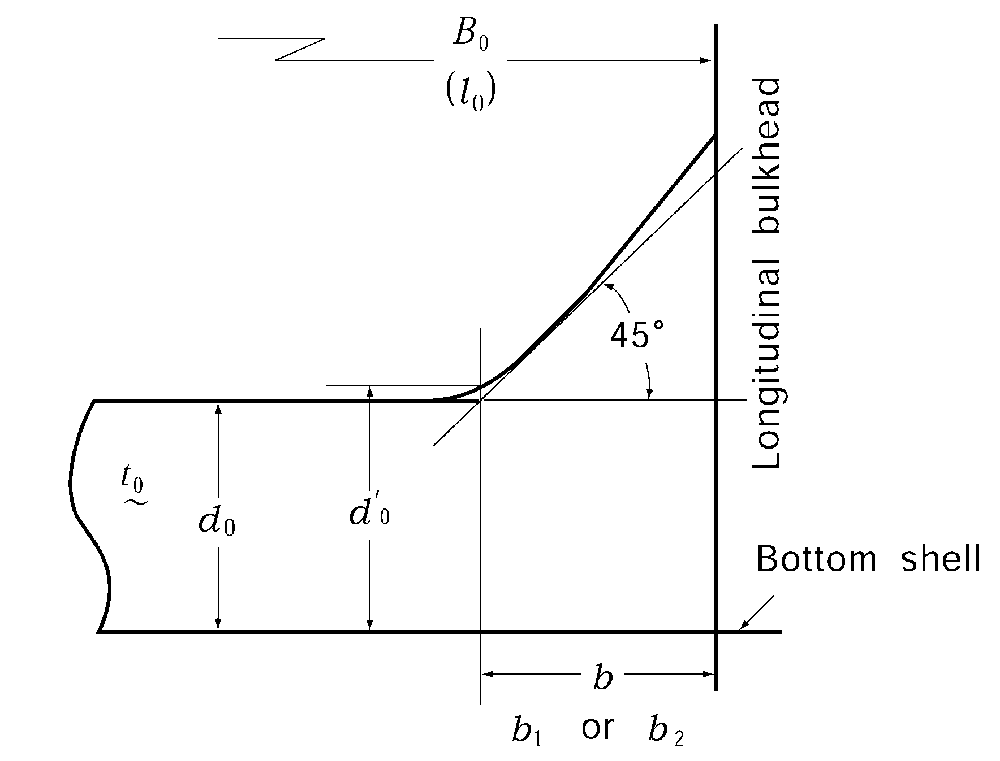
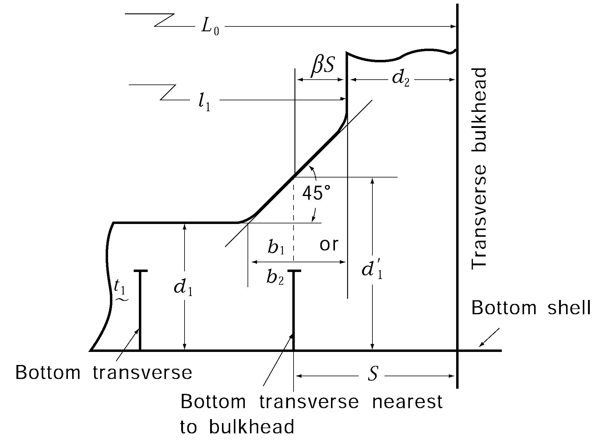
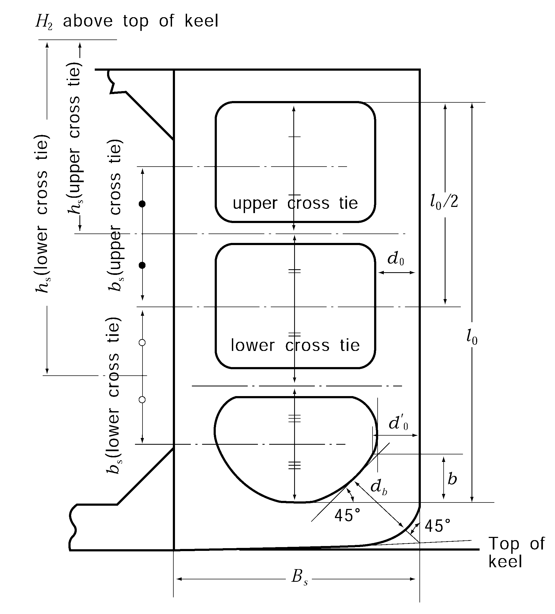
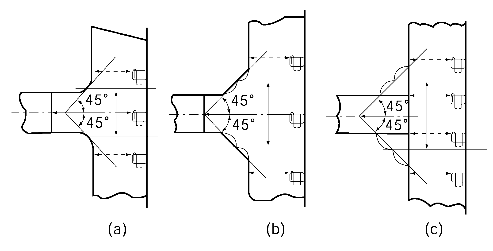
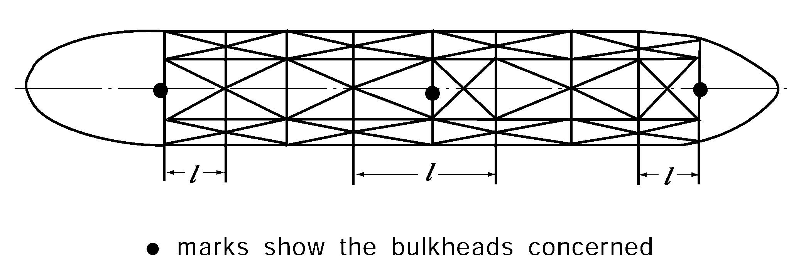
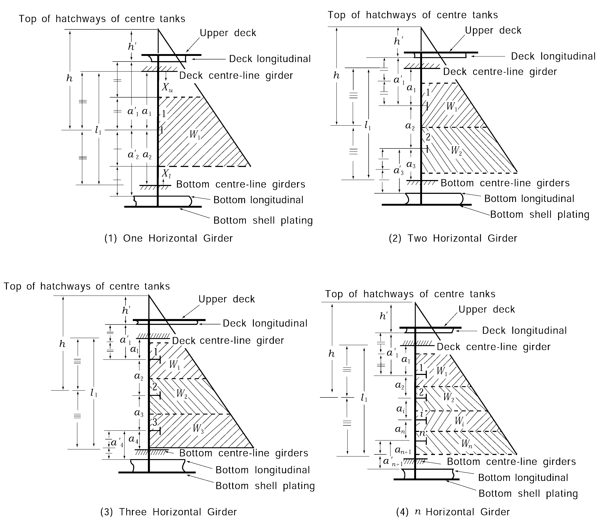
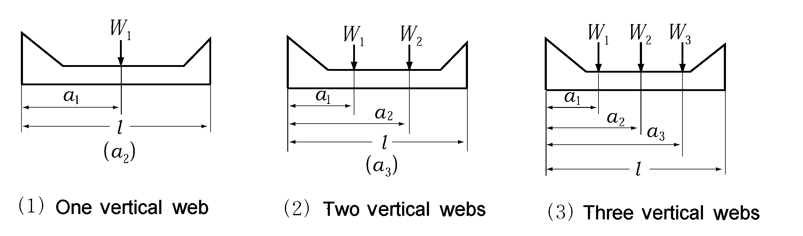
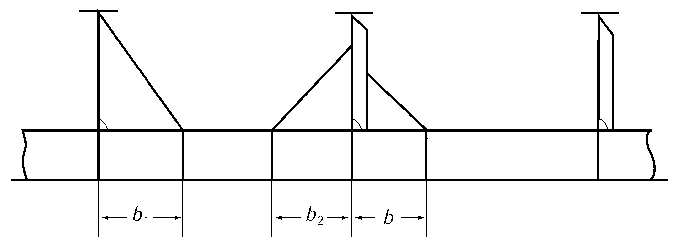
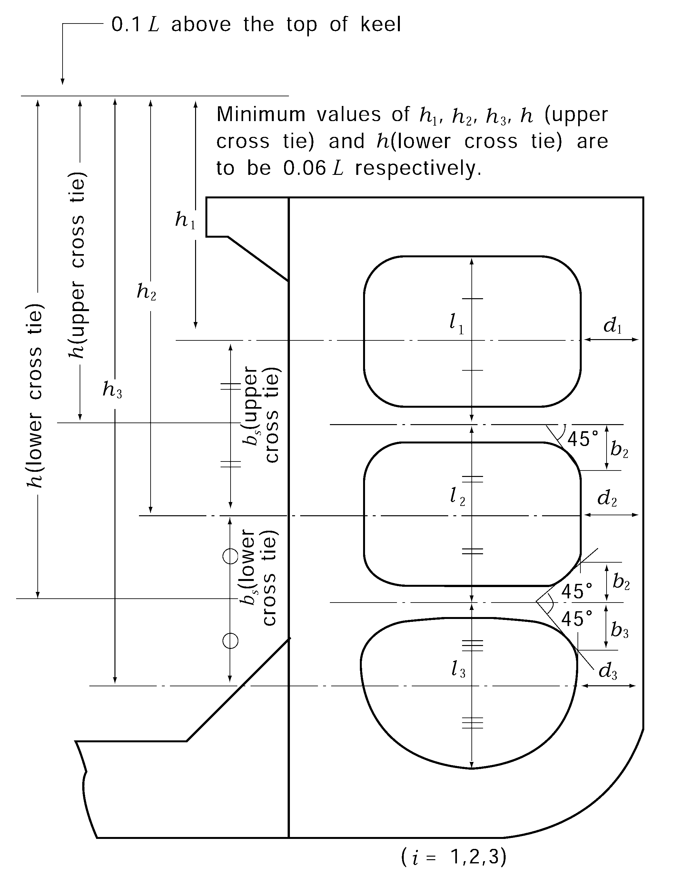

# PART 7 Ships of Special Service (Ch1-4, 7-10)

> RULES FOR CLASSIFICATION OF STEEL SHIPS / RA-07A-E / 2025 / EN / Rules

## CHAPTER 1 OIL TANKERS

### Section 1 General

#### 101. Application 【See Guidance】

- **1.** The requirements in this Chapter apply to oil tankers which were contracted for construction on or after 1 April 2006, excluding the vessels which should be applied **Pt 13** (Common Structural Rules for Bulk Carriers and Oil Tankers) and **Ch 10** (Double Hull Tanker). However, **Sec 10** (Piping Systems and Venting Systems for Oil Tankers) and **Sec 11** (Electrical Equipment) apply to oil tankers including the vessels which should be applied **Pt 13** (Common Structural Rules for Bulk Carriers and Oil Tankers) and **Ch 10** (Double Hull Tanker).
- **2.** The construction and equipment of ships intended to be registered and classed as tanker are to be in accordance with the requirements in this Chapter, where a tanker means a ship intended to carry crude oil, petroleum products having a vapour pressure (absolute pressure) less than 0.28 $\mathrm{MPa}$ at 37.8℃ or other similar liquid cargoes in bulk.
- **3.** Except where specifically required in this Chapter, the general requirements for steel ships are to be applied.
- **4.** The requirements in this Chapter are framed for tankers with machinery aft, having one or more rows of longitudinal bulkheads, single decks, single bottoms and longitudinal framing.
- **5.** In tankers intended to carry liquid cargoes other than crude oil and petroleum products, having a vapour pressure (absolute pressure) less than 0.28 $\mathrm{MPa}$ at 37.8 ℃ and having no hazard as poisonous, corrosive, etc. and moreover less inflammability than that of crude oil and petroleum products, the structural arrangements and scantlings are to be to the satisfaction of the Society, having regard to the properties of the cargoes to be carried.
- **6.** Notwithstanding the each requirement, the application of below requirements may be exempted in accordance with the requirement of flag state.
  - **(1)** **103. 5.**
  - **(2)** **107.**
  - **(3)** **204.**

#### 102. Arrangement of bulkheads 【See Guidance】

In cargo oil tanks, longitudinal and transverse oiltight bulkheads and wash bulkheads are to be arranged suitably.

#### 103. Cofferdams 【See Guidance】

- **1.** Cofferdams of airtight construction and having sufficient width as required for ready access are to be provided at the forward and after ends of cargo oil spaces and between cargo oil spaces and accommodation spaces. In tankers intended to carry oils having a flash point exceeding 60${}^{\circ}\mathrm{C}$, however, the preceding requirements may be modified.
- **2.** The cofferdams described in the preceding Paragraph may be used as pump rooms.
- **3.** Ullage plugs, sighting ports and tank cleaning openings are not to be arranged in enclosed spaces.
- **4.** Fuel oil or ballast water tanks may be concurrently used as the cofferdams to be provided between cargo oil tanks and fuel oil or ballast water tanks, subject to the approval by the Society.
- **5.** Location and separation of spaces in tankers of 500 $\mathrm{t} ons$ gross and above carrying oils having a flash point not exceeding 60${}^{\circ}\mathrm{C}$ are to be in accordance with the requirements in **Pt 8, Ch 2, 401.**

#### 104. Airtight bulkheads 【See Guidance】

Airtight bulkheads are to be provided for the isolation of all cargo oil pumps and pipings from spaces containing stoves, boilers, propelling machinery, electric installations other than those of explosion-proof type specified in **Pt 6, Ch 1, Sec 9** or machinery space where source of ignition is normally present. In tankers carrying oils having a flash point exceeding 60${}^{\circ}\mathrm{C}$, however, the preceding requirements may be modified.

#### 105. Ventilation

- **1.** Efficient ventilation is to be provided in spaces adjacent to cargo oil tanks. Air holes are to be cut in every part of the structure where there might be a chance of gases being pocketed.
- **2.** Efficient means are to be provided for clearing oil tanks and pump rooms of dangerous vapours by means of mechanical ventilation or by steam.
- **3.** In tankers carrying oils having a flash point exceeding 60${}^{\circ}\mathrm{C}$ the capacity of ventilation in the pump rooms specified in **1004.** may be modified.
- **4.** The requirements in **1004.** are applied to the ventilation fans and wire mesh screens for the spaces adjacent to the cargo oil tank specified in **Par 1**.

#### 106. Openings for ventilation

Ventilation inlets and outlets are to be arranged so as to minimize the possibilities of vapours of cargoes being admitted to an enclosed space containing a source of ignition, or collecting in the vicinity of deck machinery and equipment which may constitute an ignition hazard. Especially, openings of ventilation for machinery spaces are to be situated as far afterwards apart from the cargo spaces as practicable.

#### 107. Openings of superstructure and deckhouse

The arrangement of openings on the boundaries of superstructure and deckhouse are to be such as to minimize the possibility of accumulation of vapours of cargoes. Due consideration in this regard is to be given when the ship is equipped to load or unload at the stern. Side scuttles to the poop front or other similar walls are to be of fixed type. Such openings of tankers of 500 $\mathrm{t} ons$ gross and above carrying oils having a flash point not exceeding 60${}^{\circ}\mathrm{C}$ are to be in accordance with the requirements in **Pt 8, Ch 2, 402.**

#### 108. Thickness of structural members in cargo oil spaces

The thickness of structural members in cargo oil spaces is to be in accordance with the following:
$t = 0.015k _{0}d _{0} +2.5 \mathrm{mm}$
where:
$d_0$ = depth of web plates ($\mathrm{mm}$)
$k_0$ = as given in the following formulae. However, value of $f_B$ and $f_D$ is not to be less than 1.0.
Longitudinals located not more than 0.25$D$ above top of keel : $k_0 = \sqrt {\frac{1}{4} \left( { 3 f_B + \frac{1}{K}} \right)$
Longitudinals located not less than 0.25$D$ below deck : $k_0 = \sqrt {\frac{1}{4} \left( { 3 f_D + \frac{1}{K}} \right)$
Other members : $k_0 = \sqrt {\frac{1}{4} \left( { 3 + \frac{1}{K}} \right)$

**Table 7.1.1 Minimum Thickness**

| Length of ship ($\mathrm{m}$) | Thickness ($\mathrm{mm}$) |
| --- | --- |
| $L < 105$ | 8.0 |
| $105 \leq L < 120$ | 8.5 |
| $120 \leq L < 135$ | 9.0 |
| $135 \leq L < 150$ | 9.5 |
| $150 \leq L < 165$ | 10.0 |
| $165 \leq L < 180$ | 10.5 |
| $180 \leq L < 195$ | 11.0 |
| $195 \leq L < 225$ | 11.5 |
| $225 \leq L < 275$ | 12.0 |
| $275 \leq L < 325$ | 12.5 |
| $325 \leq L < 375$ | 13.0 |
| $375 \leq L$ | 13.5 |

$t = 0.5 \sqrt { L} +2.5 \mathrm{mm}$

#### 109. Direct strength calculation 【See Guidance】

Where approved by the Society, the scantlings of structural members may be determined basing upon direct strength calculation defined in **Pt 3, Ch 1, 206.**

#### 110. Stability Instrument 【See Guidance】

- **1.** All ships, subject to the requirements of the **MARPOL** Annex I shall be fitted with a stability instrument, capable of verifying compliance with intact and damage stability requirements, approved by the Society having regard to the performance standards recommended by the Organization:
  - **(1)** ships constructed before 1 January 2016 shall comply with this requirement at the first scheduled renewal survey of the ship on or after 1 January 2016 but not later than 1 January 2021.
  - **(2)** notwithstanding the requirements of (1), a stability instrument fitted on a ship constructed before 1 January 2016 need not be replaced provided it is capable of verifying compliance with intact and damage stability, to the satisfaction of the Society.
  - **(3)** However where deemed appropriate by the Society, the requirements of this article **110.** may be exempted, and this exemption shall be specified in **IOPP** form B.
- **2.** In case ships not applied to **1.**, the ships are to be compliance with the relevant regulations of the flag states.

### Section 2 Hatchways, Gangways and Freeing Arrangements

#### 201. Ships having unusually large freeboard 【See Guidance】

Relaxation from the requirements specified hereunder will be considered to ships having an extraordinarily large freeboard.

#### 202. Hatchways to cargo oil tanks (2018) 【See Guidance】

- **1.** The thickness of coaming plates is not to be less than 10 $\mathrm{mm}$. Where the length and coaming height of a hatchway exceed 1.25 $\mathrm{m}$ and 760 $\mathrm{mm}$ respectively, vertical stiffeners are to be provided to the side or end coamings and the upper edge of coamings is to be suitably stiffened.
- **2.** Hatchway covers are to be of steel or other approved materials. The construction of steel hatchway covers is to comply with the following requirements. The construction of hatchway covers of materials other than steel is to be in accordance with the discretion of the Society.
  - **(1)** The thickness of cover plates is not to be less than 12 $\mathrm{mm}$.
  - **(2)** Where the area of a hatchway exceeds 1 $\mathrm{m}^2$ but does not exceed 2.5 $\mathrm{m}^2$, cover plates are to be stiffened by flat bars of 100 $\mathrm{mm}$ in depth spaced not more than 610 $\mathrm{mm}$ apart. Where, however, the cover plates are 15 $\mathrm{mm}$ or more in thickness, the stiffeners may be dispensed with.
  - **(3)** Where the area of a hatchway exceeds 2.5 $\mathrm{m}^2$, cover plates are to be stiffened by flat bars of 125 $\mathrm{mm}$ in depth spaced not more than 610 $\mathrm{mm}$ apart.
  - **(4)** Covers are to be secured oiltight by fastenings spaced not more than 457 $\mathrm{mm}$ apart in circular hatchways or 380 $\mathrm{mm}$ apart and not more than 230 $\mathrm{mm}$ far from the corners in rectangular hatchways.

#### 203. Hatchways to spaces other than for cargo oil tanks (2021)

In exposed positions on the freeboard and forecastle decks or on the tops of expansion trunks, hatchways serving spaces other than cargo oil tanks, ballast tank, fuel oil tank and other tanks are to be provided with steel weathertight covers having scantlings complying with the requirements in **Pt 4, Ch 2, Sec 3.**

#### 204. Permanent gangway and passage 【See Guidance】

- **1.** A fore and aft permanent gangway complying with the requirements of **Pt 4, Ch 4, 503.** is to be provided at the level of the superstructure deck between the midship bridge or deck house and the poop or aft deck house, or equivalent means of access is to be provided to carry out the purpose of the gangway, such as passage below deck. Elsewhere and in ships without midship bridge or deck house, arrangements to the satisfaction of the Society are to be provided to safeguard the crew in reaching all parts used in the necessary work of the ship.
- **2.** Safe and satisfactory access from the gangway level is to be available between crew accommodations and machinery space or between separated crew accommodations.

#### 205. Freeing arrangements

- **1.** Ships with bulwarks are to have open rails fitted for at least a half of the length of the exposed part of the freeboard deck or other effective freeing arrangements. The upper edge of sheer strake is to be kept as low as practicable. **【See Guidance】**
- **2.** Where superstructures are connected by trunks, open rails are to be provided for the whole length of the exposed parts of the freeboard deck.

### Section 3 Longitudinal Frames and Beams in Cargo Oil Spaces

#### 301. General

Longitudinal frames and beams provided in permanent ballast water tanks and cargo oil spaces including void spaces and pump rooms are to be in accordance with the requirements stated hereunder.

#### 302. Scantlings 【See Guidance】

- **1.** The section modulus of bottom longitudinals and side longitudinals including bilge frames is not to be less than that obtained from the formulae given in **Table 7.1.2.**
- **2.** The section modulus of longitudinal beams is not to be less than 1.1 times that obtained from the formula in **Pt 3, Ch 10, 303.**
- **3.** Notwithstanding the provisions in **Pars 1** and **2,** the section modulus of longitudinal frames and beams is not to be less than that obtained assuming them as stiffeners on deep tank bulkhead and taking the distance up to the top of hatchway as $h$.
- **4.** Longitudinal beams and side longitudinals attached to sheer strake are to be of such dimensions as to have slenderness ratio not exceeding 60 at the midship part as far as practicable. This requirement, however, may be suitably modified for small vessels.
- **5.** As for flat bars used for longitudinal beams and frames, the ratio of depth to thickness is not to exceed 15.
- **6.** The extreme width of face plates of longitudinal beams and frames is not to be less than that obtained from the following formula:
  $b = 2.2 \sqrt{d_0 l} \mathrm{mm}$
  where:
  $d_0$ = depth of web of longitudinal beams or frames ($\mathrm{mm}$).
  $l$ = spacing of transverses ($\mathrm{m}$).

#### 303. Attachment 【See Guidance】

Longitudinal frames and beams are to be continuous or to be attached at their ends in such a manner as to effectively develop the sectional area and the resistance to bending.

**Table 7.1.2 Section modulus of bottom and side longitudinals**

| Position | Section modulus ($\mathrm{cm}^3$) |   |   |
| --- | --- | --- | --- |
| Position | Bottom longitudinals | Side longitudinals including bilge frames |   |
| Midship part and between a point 0.15$L$ from the fore end and the collision bulkhead | $Z=110C _{1} C _{2} KS h l ^{2}$ | $Z = 110C_1 C_2 K S h l^2 \# Z_\min = 3.2 K \sqrt {L}S l^2$ |   |
| Forward and afterward end parts | $Z = 93.5C_1 C_2 K S h l^2$ | $Z = 93.5C_1 C_2 K S h l^2 \# Z_\min = 2.72 K \sqrt {L}S l^2$ |   |
| $l$ = spacing of bottom transverses ($\mathrm{m}$). $S$ = spacing of longitudinals ($\mathrm{m}$). $h$ = distance from the bottom longitudinal under consideration to the point $h'$ above the top of keel given in the following table ($\mathrm{m}$). $C_1$, $h'$, $C_2$ = as given by the following table. **Table 7.1.3 Scantlings of bottom transverses and bottom girders** Depth ($\mathrm{m}$) ; Web thickness ($\mathrm{mm}$) ; Section modulus ($\mathrm{cm}^3$) Bottom transverses ; $d = C_0 l_0$ ; Thickness at the inner edge of bracket attached to longitudinal bulkhead $t = \left( { C_1 - 87 \frac{b}{l_0}} \right) \frac{K Q}{d_0 ' - a} + 2.5$ ; $Z = C_2 K k^2 Q l_0$ Bottom girders ; - ; $t = C_3 \frac{\eta K Q}{d_1} + 2.5$ ; $Z = C_4 K k Q l_1$ $Q$ = $\alpha S h_1 l_0$ $\alpha$ = 1.0 where $L$ is 230 $\mathrm{m}$ and under 1.2 where $L$ exceeds 400 $\mathrm{m}$. For the intermediate values of $L$, a is to be obtained by linear interpolation. $h_1$ = as given by the following formula: $d + 0.026L' \mathrm{m}$. $L'$ = length of ship ($\mathrm{m}$). Where, however, $L$ exceeds 230 $\mathrm{m}$, $L$ is to be taken as 230 $\mathrm{m}$. $S$ = spacing of transverses ($\mathrm{m}$), (see **Fig 7.1.2**) $l_0$ = overall length of transverses ($\mathrm{m}$). Which is equal to $B_0$ or ($B_0 -d_3$) where $d_3$ depth of vertical web attached to the centre line bulkhead ($\mathrm{m}$). $b$ = length of horizontal arm of bracket connecting transverse to longitudinal bulkhead ($\mathrm{m}$). (see **Fig** **7.1.1**) $d_0 '$ = depth of transverse at the inner edge of the above mentioned bracket ($\mathrm{mm}$). (see **Fig** **7.1.1**) $a$ = depth of slot ($\mathrm{mm}$). Where, however, the slots near the inner edge of brackets are provided with collar plates, $a$ may be taken as zero. $d _{1} '$ = depth of girder including bracket at the transverse nearest to the bulkhead ($\mathrm{mm}$). (see **Fig** **7.1.2**) $l _{1}$ = overall length of girder, which is equal to $(L_0 - d_2 ) \mathrm{m}$, where $d_2$ is depth of vertical web on transverse bulkhead ($\mathrm{m}$). (see **Fig** **7.12**) $k$ = correction factor due to bracket given by the following formula: $k = 1 - \frac{0.65 (b_1 + b_2 )}{l}$ $b _{1}$, $b _ 2$ = arm length of brackets at both ends of girders and transverses respectively ($\mathrm{m}$). $l$ = overall length of girders and transverses ($\mathrm{m}$), which is equal to $l_0$ or $l _{1}$. $\eta$ = as given by the following table. Number of transverses ; $\beta = \frac{S - d_2}{S}$ ; $\eta$ Two rows ; $0 \leq \beta < \frac{2}{3}$ (See **Fig** **7.1.2**) ; $\eta = 2-1.5 \beta$ $\frac{2}{3} \leq \beta$ ; $\eta = 1.0$ Three to five rows ; $0 \leq \beta < 0.5$ ; $\eta = 1.6 - 1.2 \beta$ $0.5 \leq \beta$ ; $\eta = 1.0$ Number of transverses $\beta = \frac{S - d_2}{S}$ $\eta$ Two rows $0 \leq \beta < \frac{2}{3}$ (See **Fig** **7.1.2**) $\eta = 2-1.5 \beta$ $\frac{2}{3} \leq \beta$ $\eta = 1.0$ Three to five rows $0 \leq \beta < 0.5$ $\eta = 1.6 - 1.2 \beta$ $0.5 \leq \beta$ $\eta = 1.0$ $d_0$, $t_0$ = depth ($\mathrm{mm}$) and web thickness ($\mathrm{mm}$) of transverses respectively. $d_1$, $t_1$ = depth ($\mathrm{mm}$) and web thickness ($\mathrm{mm}$) of girders respectively. $B_0$ = distance between longitudinal bulkheads ($\mathrm{m}$). $L_0$ = distance between transverse bulkheads ($\mathrm{m}$). $C_0, C_1, C_2, C_3$, $C_4$ = as obtained from the following table according to $K_0$ respectively. Number of transverses ; $\beta = \frac{S - d_2}{S}$ ; $\eta$ Two rows ; $0 \leq \beta < \frac{2}{3}$ (See **Fig** **7.1.2**) ; $\eta = 2-1.5 \beta$ $\frac{2}{3} \leq \beta$ ; $\eta = 1.0$ Three to five rows ; $0 \leq \beta < 0.5$ ; $\eta = 1.6 - 1.2 \beta$ $0.5 \leq \beta$ ; $\eta = 1.0$ $C_1$ $h' \mathrm{m}$ $C_2$ Bottom longitudinals $\frac{1}{24 - 15.0 f_B K}$ $h' = d+ 0.026L'$ 1.0 : Where $L$ is 230 $\mathrm{m}$ and under. 1.07 : Where $L$ exceeds 400 $\mathrm{m}$. For the intermediate values of $L$, $C_2$ is to be obtained by linear interpolation. Side longitudinals including bilge frames $\frac{1}{24 - \alpha K}$ $h' = d+ 0.038L'$ $L'$ = length of ship ($\mathrm{m}$). Where, however, $L$ exceeds 230 $\mathrm{m}$. $L'$ is to be taken as 230 $\mathrm{m}$. $\alpha$ = either $\alpha_1$ or $\alpha_2$ according to value of $y$. However, value of $\alpha$ is not to be less than $\beta$. $\alpha _{1} =15.0 f _{D} \left( \frac{y-y _{B}}{Y '} \right) for y \geq y _{B}$ $\alpha_2 = 15.0 f_B \left( { \frac{y_B - y}{y_B} \right) for y < y_B$ $\beta$ = coefficient determined according to values of $L$ as specified below : $\beta = 6/a$ when $L$ is 230 $\mathrm{m}$ and under $\beta = 10.5/a$ when $L$ is 400 $\mathrm{m}$ and above For intermediate values of $L$, $\beta$ is to be obtained by linear interpolation. $y$ = vertical distance ($\mathrm{m}$) from the top of keel to the lower edge of plating when the platings under consideration are under $y_B$ and to the upper edge of plating when the platings under consideration are above $y_B$, respectively. $Y '$ = the greater of the value specified in **Pt 3, Ch 3, 203.,** (5) (a) or (b). $a$ = $\sqrt {K}$, when high tensile steels are used for not less than 80 $\%$ of side shell plating at the transverse section amidship and 1.0 for other parts. |   |   |   |
| **Table 7.1.3 Scantlings of bottom transverses and bottom girders** |   |   |   |
|   | Depth ($\mathrm{m}$) | Web thickness ($\mathrm{mm}$) | Section modulus ($\mathrm{cm}^3$) |
| Bottom transverses | $d = C_0 l_0$ | Thickness at the inner edge of bracket attached to longitudinal bulkhead $t = \left( { C_1 - 87 \frac{b}{l_0}} \right) \frac{K Q}{d_0 ' - a} + 2.5$ | $Z = C_2 K k^2 Q l_0$ |
| Bottom girders | - | $t = C_3 \frac{\eta K Q}{d_1} + 2.5$ | $Z = C_4 K k Q l_1$ |
| $Q$ = $\alpha S h_1 l_0$ $\alpha$ = 1.0 where $L$ is 230 $\mathrm{m}$ and under 1.2 where $L$ exceeds 400 $\mathrm{m}$. For the intermediate values of $L$, a is to be obtained by linear interpolation. $h_1$ = as given by the following formula: $d + 0.026L' \mathrm{m}$. $L'$ = length of ship ($\mathrm{m}$). Where, however, $L$ exceeds 230 $\mathrm{m}$, $L$ is to be taken as 230 $\mathrm{m}$. $S$ = spacing of transverses ($\mathrm{m}$), (see **Fig 7.1.2**) $l_0$ = overall length of transverses ($\mathrm{m}$). Which is equal to $B_0$ or ($B_0 -d_3$) where $d_3$ depth of vertical web attached to the centre line bulkhead ($\mathrm{m}$). $b$ = length of horizontal arm of bracket connecting transverse to longitudinal bulkhead ($\mathrm{m}$). (see **Fig** **7.1.1**) $d_0 '$ = depth of transverse at the inner edge of the above mentioned bracket ($\mathrm{mm}$). (see **Fig** **7.1.1**) $a$ = depth of slot ($\mathrm{mm}$). Where, however, the slots near the inner edge of brackets are provided with collar plates, $a$ may be taken as zero. $d _{1} '$ = depth of girder including bracket at the transverse nearest to the bulkhead ($\mathrm{mm}$). (see **Fig** **7.1.2**) $l _{1}$ = overall length of girder, which is equal to $(L_0 - d_2 ) \mathrm{m}$, where $d_2$ is depth of vertical web on transverse bulkhead ($\mathrm{m}$). (see **Fig** **7.12**) $k$ = correction factor due to bracket given by the following formula: $k = 1 - \frac{0.65 (b_1 + b_2 )}{l}$ $b _{1}$, $b _ 2$ = arm length of brackets at both ends of girders and transverses respectively ($\mathrm{m}$). $l$ = overall length of girders and transverses ($\mathrm{m}$), which is equal to $l_0$ or $l _{1}$. $\eta$ = as given by the following table. Number of transverses ; $\beta = \frac{S - d_2}{S}$ ; $\eta$ Two rows ; $0 \leq \beta < \frac{2}{3}$ (See **Fig** **7.1.2**) ; $\eta = 2-1.5 \beta$ $\frac{2}{3} \leq \beta$ ; $\eta = 1.0$ Three to five rows ; $0 \leq \beta < 0.5$ ; $\eta = 1.6 - 1.2 \beta$ $0.5 \leq \beta$ ; $\eta = 1.0$ Number of transverses $\beta = \frac{S - d_2}{S}$ $\eta$ Two rows $0 \leq \beta < \frac{2}{3}$ (See **Fig** **7.1.2**) $\eta = 2-1.5 \beta$ $\frac{2}{3} \leq \beta$ $\eta = 1.0$ Three to five rows $0 \leq \beta < 0.5$ $\eta = 1.6 - 1.2 \beta$ $0.5 \leq \beta$ $\eta = 1.0$ $d_0$, $t_0$ = depth ($\mathrm{mm}$) and web thickness ($\mathrm{mm}$) of transverses respectively. $d_1$, $t_1$ = depth ($\mathrm{mm}$) and web thickness ($\mathrm{mm}$) of girders respectively. $B_0$ = distance between longitudinal bulkheads ($\mathrm{m}$). $L_0$ = distance between transverse bulkheads ($\mathrm{m}$). $C_0, C_1, C_2, C_3$, $C_4$ = as obtained from the following table according to $K_0$ respectively. |   |   |   |
| Number of transverses | $\beta = \frac{S - d_2}{S}$ | $\eta$ |   |
| Two rows | $0 \leq \beta < \frac{2}{3}$ (See **Fig** **7.1.2**) | $\eta = 2-1.5 \beta$ |   |
| Two rows | $\frac{2}{3} \leq \beta$ | $\eta = 1.0$ |   |
| Three to five rows | $0 \leq \beta < 0.5$ | $\eta = 1.6 - 1.2 \beta$ |   |
| Three to five rows | $0.5 \leq \beta$ | $\eta = 1.0$ |   |

### Section 4 Girders, Transverses and Cross Ties in Cargo Oil Spaces

#### 401. General 【See Guidance】

- **1.** The requirements specified hereunder are intended to be applied to structures consisting of two to five transverses arranged at approximately equal intervals between transverse bulkheads or between the transverse bulkhead and the wash bulkhead.
- **2.** Girders or transverses in the same plane are to be so arranged that abrupt change in the strength and rigidity is avoided; they are to have brackets of sufficient scantling and with properly rounded corners at their ends.
- **3.** The depth of girders or transverses is not to be less than 2.5 times that of slots for frames, beams and stiffeners.
- **4.** As for the face plates composing girders, the thickness is not to be less than that of web plates and the width of the face plates is not to be less than that obtained from the following formula:
  $b= 2.7 \sqrt {d_0 l} \mathrm{mm}$
  where:
  $d_0$ = depth of girder ($\mathrm{mm}$). In case where it is a balanced girder, $d_0$ is the depth from the surface of plate to the face plate ($\mathrm{mm}$).
  $l$ = distance between supports of girder ($\mathrm{m}$). Where, however, effective tripping brackets are provided, they may be taken as supports.
- **5.** The requirements of **401.** to **406.** are also to be applied to pump rooms, ballast water tanks or void spaces in the midship part so far as practicable.

#### 402. Transverses and girders provided in centre or side tanks in ships having two or more longitudinal bulkheads 【See Guidance】

- **1.** **Bottom transverses and bottom girders:**
  - **(1)** The depth, web thickness and section modulus of bottom transverses and the web thickness and section modulus of bottom girders provided in the middle between longitudinal bulkheads are not to be less than those obtained from the given in **Table 7.1.3** respectively.
  - **(2)** Where one or two intercostal side girders are provided between longitudinal bulkhead and bottom girders provided at mid-distance of longitudinal bulkheads, and the bottom transverses are of the reduced scantlings in accordance with (3) below, the sectional area of web plates and moment of inertia of side girders are not to be less than those obtained from the following formulae:
    Sectional area of web plates : $A = \alpha_1 \frac{L_0}{B_0} d_0 t_0 \mathrm{cm^2 }$
    Moment of inertia : $I = \alpha_2 \left( { \frac{L_0}{B_0}} \right)^3 I_0 \mathrm{cm^4 }$
    where:
    $\alpha_1$, $\alpha_2$ = coefficients given in **Table 7.1.4.**
    $I_0$ = moment of inertia of bottom transverses ($\mathrm{cm}^4$).
    $L_0$, $B_0$, $d_0$, $t_0$ = as specified in **Table 7.1.3.**
  - **(3)** Where intercostal side girders are provided in accordance with (2), the bottom transverses and girders may be of the scantlings obtained from the formulae in (1), using coefficients $C_0$, $C_1$, $C_2$, $C_3$ and $C_4$ reduced by 10 $\%$ where two transverses are provided and 5 $\%$ where three transverses are provided.
  - **(4)** In ships without longitudinal centre line bulk heads, a centre girder with brackets at proper intervals is to be provided so as to maintain sufficient strength where the ship is drydocked on keel blocks.

    **Table 7.1.3 Scantlings of bottom transverses and bottom girders**

    |   | Depth ($\mathrm{m}$) | Web thickness ($\mathrm{mm}$) | Section modulus ($\mathrm{cm}^3$) |   |   |   |   |   |   |   |   |
    | --- | --- | --- | --- | --- | --- | --- | --- | --- | --- | --- | --- |
    | Bottom transverses | $d = C_0 l_0$ | Thickness at the inner edge of bracket attached to longitudinal bulkhead $t = \left( { C_1 - 87 \frac{b}{l_0}} \right) \frac{K Q}{d_0 ' - a} + 2.5$ | $Z = C_2 K k^2 Q l_0$ |   |   |   |   |   |   |   |   |
    | Bottom girders | - | $t = C_3 \frac{\eta K Q}{d_1} + 2.5$ | $Z = C_4 K k Q l_1$ |   |   |   |   |   |   |   |   |
    | $Q$ = $\alpha S h_1 l_0$ $\alpha$ = 1.0 where $L$ is 230 $\mathrm{m}$ and under 1.2 where $L$ exceeds 400 $\mathrm{m}$. For the intermediate values of $L$, a is to be obtained by linear interpolation. $h_1$ = as given by the following formula: $d + 0.026L' \mathrm{m}$. $L'$ = length of ship ($\mathrm{m}$). Where, however, $L$ exceeds 230 $\mathrm{m}$, $L$ is to be taken as 230 $\mathrm{m}$. $S$ = spacing of transverses ($\mathrm{m}$), (see **Fig 7.1.2**) $l_0$ = overall length of transverses ($\mathrm{m}$). Which is equal to $B_0$ or ($B_0 -d_3$) where $d_3$ depth of vertical web attached to the centre line bulkhead ($\mathrm{m}$). $b$ = length of horizontal arm of bracket connecting transverse to longitudinal bulkhead ($\mathrm{m}$). (see **Fig 7.1.1**) $d_0 '$ = depth of transverse at the inner edge of the above mentioned bracket ($\mathrm{mm}$). (see **Fig 7.1.1**) $a$ = depth of slot ($\mathrm{mm}$). Where, however, the slots near the inner edge of brackets are provided with collar plates, $a$ may be taken as zero. $d _{1} '$ = depth of girder including bracket at the transverse nearest to the bulkhead ($\mathrm{mm}$). (see **Fig 7.1.2**) $l _{1}$ = overall length of girder, which is equal to $(L_0 - d_2 ) \mathrm{m}$, where $d_2$ is depth of vertical web on transverse bulkhead ($\mathrm{m}$). (see **Fig 7.12**) $k$ = correction factor due to bracket given by the following formula: $k = 1 - \frac{0.65 (b_1 + b_2 )}{l}$ $b _{1}$, $b _ 2$ = arm length of brackets at both ends of girders and transverses respectively ($\mathrm{m}$). $l$ = overall length of girders and transverses ($\mathrm{m}$), which is equal to $l_0$ or $l _{1}$. $\eta$ = as given by the following table. Number of transverses ; Coef- ficient ; $K_0 = \frac{d_0 t_0}{d_1 t_1} \times \frac{L_0}{B_0}$ $K_0 \leq 0.2$ ; $0.2 < \# K_0 \# \leq 0.3$ ; $0.3 < \# K_0 \# \leq 0.4$ ; $0.4 < \# K_0 \# \leq 0.5$ ; $0.5 < \# K_0 \# \leq 0.6$ ; $0.6 < \# K_0 \# \leq 0.7$ ; $0.7 < \# K_0 \# \leq 0.8$ ; $0.8 < \# K_0 \# \leq 1.0$ ; $1.0 < \# K_0 \# \leq 1.2$ ; Where no girder is provided Two rows ; $C_0$ $C_1$ $C_2$ $C_3$ $C_4$ ; 0.090 23.6 1.44 36.8 8.08 ; 0.095 24.3 1.47 34.5 7.65 ; 0.100 25.5 1.54 32.3 7.04 ; 0.105 26.7 1.63 30.5 6.51 ; 0.115 27.8 1.77 28.5 6.25 ; 0.115 29.0 1.94 26.6 5.73 ; 0.120 30.1 2.12 24.8 5.21 ; 0.125 31.8 2.43 22.2 4.09 ; 0.135 34.0 2.87 18.8 4.17 ; 0.160 43.7 5.69 - - Three rows ; $C_0$ $C_1$ $C_2$ $C_3$ $C_4$ ; 0.090 24.0 1.47 57.2 10.42 ; 0.095 25.5 1.54 54.0 9.65 ; 0.100 26.7 1.63 50.9 8.97 ; 0.105 27.8 1.79 47.5 8.34 ; 0.110 29.4 1.96 44.6 7.67 ; 0.115 30.5 2.19 42.3 7.06 ; 0.120 31.7 2.43 39.9 6.51 ; 0.125 33.6 2.84 36.0 5.73 ; 0.135 36.3 3.41 31.3 4.69 ; 0.160 43.7 5.69 - - Four rows ; $C_0$ $C_1$ $C_2$ $C_3$ $C_4$ ; 0.090 24.4 1.47 76.0 10.69 ; 0.095 25.9 1.54 68.1 9.65 ; 0.100 27.1 1.70 64.2 88.6 ; 0.105 28.6 1.87 60.3 8.08 ; 0.110 30.0 2.03 56.4 7.34 ; 0.115 31.3 2.28 52.5 6.80 ; 0.120 32.7 2.52 48.5 5.99 ; 0.125 34.8 3.01 43.5 5.27 ; 0.135 37.5 3.73 36.8 4.17 ; 0.160 43.7 5.69 - - Five rows ; $C_0$ $C_1$ $C_2$ $C_3$ $C_4$ ; 0.095 24.7 1.54 94.0 15.64 ; 0.100 26.3 1.63 83.8 13.56 ; 0.105 27.4 1.79 78.3 12.50 ; 0.110 29.4 2.03 72.8 11.46 ; 0.115 30.9 2.28 67.5 10.16 ; 0.120 32.5 2.52 62.6 9.12 ; 0.125 34.0 2.83 57.2 8.08 ; 0.135 36.7 3.50 49.5 6.78 ; 0.145 40.2 4.46 39.2 4.69 ; 0.160 43.7 5.69 - - NOTES : 1. Where strong vertical girders are provided on transverse bulkheads at one side only in case of four or five transverses, coefficient $C_4$ is to be increased appropriately. 2. Where the depth of centre line bottom girder is of extremely large depth, coefficient, coefficient $C_4$ may be suitably modified. Number of transverses $\beta = \frac{S - d_2}{S}$ $\eta$ Two rows $0 \leq \beta < \frac{2}{3}$ (See **Fig 7.1.2**) $\eta = 2-1.5 \beta$ $\frac{2}{3} \leq \beta$ $\eta = 1.0$ Three to five rows $0 \leq \beta < 0.5$ $\eta = 1.6 - 1.2 \beta$ $0.5 \leq \beta$ $\eta = 1.0$ $d_0$, $t_0$ = depth ($\mathrm{mm}$) and web thickness ($\mathrm{mm}$) of transverses respectively. $d_1$, $t_1$ = depth ($\mathrm{mm}$) and web thickness ($\mathrm{mm}$) of girders respectively. $B_0$ = distance between longitudinal bulkheads ($\mathrm{m}$). $L_0$ = distance between transverse bulkheads ($\mathrm{m}$). $C_0, C_1, C_2, C_3$, $C_4$ = as obtained from the following table according to $K_0$ respectively. |   |   |   |   |   |   |   |   |   |   |   |
    | Number of transverses | Coef- ficient | $K_0 = \frac{d_0 t_0}{d_1 t_1} \times \frac{L_0}{B_0}$ |   |   |   |   |   |   |   |   |   |
    | Number of transverses | Coef- ficient | $K_0 \leq 0.2$ | $0.2 < \# K_0 \# \leq 0.3$ | $0.3 < \# K_0 \# \leq 0.4$ | $0.4 < \# K_0 \# \leq 0.5$ | $0.5 < \# K_0 \# \leq 0.6$ | $0.6 < \# K_0 \# \leq 0.7$ | $0.7 < \# K_0 \# \leq 0.8$ | $0.8 < \# K_0 \# \leq 1.0$ | $1.0 < \# K_0 \# \leq 1.2$ | Where no girder is provided |
    | Two rows | $C_0$ $C_1$ $C_2$ $C_3$ $C_4$ | 0.090 23.6 1.44 36.8 8.08 | 0.095 24.3 1.47 34.5 7.65 | 0.100 25.5 1.54 32.3 7.04 | 0.105 26.7 1.63 30.5 6.51 | 0.115 27.8 1.77 28.5 6.25 | 0.115 29.0 1.94 26.6 5.73 | 0.120 30.1 2.12 24.8 5.21 | 0.125 31.8 2.43 22.2 4.09 | 0.135 34.0 2.87 18.8 4.17 | 0.160 43.7 5.69 - - |
    | Three rows | $C_0$ $C_1$ $C_2$ $C_3$ $C_4$ | 0.090 24.0 1.47 57.2 10.42 | 0.095 25.5 1.54 54.0 9.65 | 0.100 26.7 1.63 50.9 8.97 | 0.105 27.8 1.79 47.5 8.34 | 0.110 29.4 1.96 44.6 7.67 | 0.115 30.5 2.19 42.3 7.06 | 0.120 31.7 2.43 39.9 6.51 | 0.125 33.6 2.84 36.0 5.73 | 0.135 36.3 3.41 31.3 4.69 | 0.160 43.7 5.69 - - |
    | Four rows | $C_0$ $C_1$ $C_2$ $C_3$ $C_4$ | 0.090 24.4 1.47 76.0 10.69 | 0.095 25.9 1.54 68.1 9.65 | 0.100 27.1 1.70 64.2 88.6 | 0.105 28.6 1.87 60.3 8.08 | 0.110 30.0 2.03 56.4 7.34 | 0.115 31.3 2.28 52.5 6.80 | 0.120 32.7 2.52 48.5 5.99 | 0.125 34.8 3.01 43.5 5.27 | 0.135 37.5 3.73 36.8 4.17 | 0.160 43.7 5.69 - - |
    | Five rows | $C_0$ $C_1$ $C_2$ $C_3$ $C_4$ | 0.095 24.7 1.54 94.0 15.64 | 0.100 26.3 1.63 83.8 13.56 | 0.105 27.4 1.79 78.3 12.50 | 0.110 29.4 2.03 72.8 11.46 | 0.115 30.9 2.28 67.5 10.16 | 0.120 32.5 2.52 62.6 9.12 | 0.125 34.0 2.83 57.2 8.08 | 0.135 36.7 3.50 49.5 6.78 | 0.145 40.2 4.46 39.2 4.69 | 0.160 43.7 5.69 - - |
    | NOTES : 1. Where strong vertical girders are provided on transverse bulkheads at one side only in case of four or five transverses, coefficient $C_4$ is to be increased appropriately. 2. Where the depth of centre line bottom girder is of extremely large depth, coefficient, coefficient $C_4$ may be suitably modified. |   |   |   |   |   |   |   |   |   |   |   |

    | Number of transverses | Coef- ficient | $K_0 = \frac{d_0 t_0}{d_1 t_1} \times \frac{L_0}{B_0}$ |   |   |   |   |   |   |   |   |   |
    | --- | --- | --- | --- | --- | --- | --- | --- | --- | --- | --- | --- |
    | Number of transverses | Coef- ficient | $K_0 \leq 0.2$ | $0.2 < \# K_0 \# \leq 0.3$ | $0.3 < \# K_0 \# \leq 0.4$ | $0.4 < \# K_0 \# \leq 0.5$ | $0.5 < \# K_0 \# \leq 0.6$ | $0.6 < \# K_0 \# \leq 0.7$ | $0.7 < \# K_0 \# \leq 0.8$ | $0.8 < \# K_0 \# \leq 1.0$ | $1.0 < \# K_0 \# \leq 1.2$ | Where no girder is provided |
    | Two rows | $C_0$ $C_1$ $C_2$ $C_3$ $C_4$ | 0.090 23.6 1.44 36.8 8.08 | 0.095 24.3 1.47 34.5 7.65 | 0.100 25.5 1.54 32.3 7.04 | 0.105 26.7 1.63 30.5 6.51 | 0.115 27.8 1.77 28.5 6.25 | 0.115 29.0 1.94 26.6 5.73 | 0.120 30.1 2.12 24.8 5.21 | 0.125 31.8 2.43 22.2 4.09 | 0.135 34.0 2.87 18.8 4.17 | 0.160 43.7 5.69 - - |
    | Three rows | $C_0$ $C_1$ $C_2$ $C_3$ $C_4$ | 0.090 24.0 1.47 57.2 10.42 | 0.095 25.5 1.54 54.0 9.65 | 0.100 26.7 1.63 50.9 8.97 | 0.105 27.8 1.79 47.5 8.34 | 0.110 29.4 1.96 44.6 7.67 | 0.115 30.5 2.19 42.3 7.06 | 0.120 31.7 2.43 39.9 6.51 | 0.125 33.6 2.84 36.0 5.73 | 0.135 36.3 3.41 31.3 4.69 | 0.160 43.7 5.69 - - |
    | Four rows | $C_0$ $C_1$ $C_2$ $C_3$ $C_4$ | 0.090 24.4 1.47 76.0 10.69 | 0.095 25.9 1.54 68.1 9.65 | 0.100 27.1 1.70 64.2 88.6 | 0.105 28.6 1.87 60.3 8.08 | 0.110 30.0 2.03 56.4 7.34 | 0.115 31.3 2.28 52.5 6.80 | 0.120 32.7 2.52 48.5 5.99 | 0.125 34.8 3.01 43.5 5.27 | 0.135 37.5 3.73 36.8 4.17 | 0.160 43.7 5.69 - - |
    | Five rows | $C_0$ $C_1$ $C_2$ $C_3$ $C_4$ | 0.095 24.7 1.54 94.0 15.64 | 0.100 26.3 1.63 83.8 13.56 | 0.105 27.4 1.79 78.3 12.50 | 0.110 29.4 2.03 72.8 11.46 | 0.115 30.9 2.28 67.5 10.16 | 0.120 32.5 2.52 62.6 9.12 | 0.125 34.0 2.83 57.2 8.08 | 0.135 36.7 3.50 49.5 6.78 | 0.145 40.2 4.46 39.2 4.69 | 0.160 43.7 5.69 - - |
    | NOTES : 1. Where strong vertical girders are provided on transverse bulkheads at one side only in case of four or five transverses, coefficient $C_4$ is to be increased appropriately. 2. Where the depth of centre line bottom girder is of extremely large depth, coefficient, coefficient $C_4$ may be suitably modified. |   |   |   |   |   |   |   |   |   |   |   |

    
    **Fig 7.1.1 Measurement of** #eqnID-278 **etc.**
    **Fig 7.1.2 Measurement of** #eqnID-279 **etc.**

    **Table.7.1.4 Coefficients** $\alpha_1$ **and** $\alpha_2$

    | Number of side girders | Coefficient |   |
    | --- | --- | --- |
    | Number of side girders | $\alpha_1$ | $\alpha_2$ |
    | 1 | 0.0085 | 0.67 |
    | 2 | 0.0045 | 0.42 |
- **2.** **Deck transverses and girders**
  - **(1)** The depth and section modulus of deck transverses are not to be less than those obtained from the following formulae:
    Depth of transverses : $d=C _{0} l _{0} \mathrm{m}$
    Section modulus of transverses : $Z=C K k ^{2} \sqrt {L} S l_0 ^{2} \mathrm{cm ^{3} }$
    where :
    $C_0$, $C$ = coefficients given in **Table 7.1.5** respectively.
    $d_0$, $t_0$ = depth ($\mathrm{mm}$) and web thickness ($\mathrm{mm}$) of transverses respectively.
    $d_1$, $t_1$ = depth ($\mathrm{mm}$) and web thickness ($\mathrm{mm}$) of girders respectively.
    $L_0$, $B_0$, $S$, $k$ = as specified in **Table 7.1.3.**
    $l_0$ = overall length of transverses ($\mathrm{m}$), which is equal to $B_0$ or ($B_0 -d_3$), where $d_3$ is depth of vertical web on centre line bulkhead ($\mathrm{m}$).

    **Table 7.1.5 Coefficients** $C_0$ **and** $C$

    | Number of transverses | $K _{0} = {\frac{d _{0 } t _{0}}{d_1 t_1} \times \frac{L_0}{B_0}$ | $C_0$ | $C$ |
    | --- | --- | --- | --- |
    | Two and three | $K_0 \leq 0.5$ | 0.07 | 0.79 |
    | Two and three | $K_0 \geq 1.5$ | 0.10 | 1.82 |
    | Four | $K_0 \leq 0.4$ | 0.07 | 0.79 |
    | Four | $K_0 \geq 1.4$ | 0.10 | 1.82 |
    | Five | $K_0 \leq 0.3$ | 0.07 | 0.79 |
    | Five | $K_0 \geq 1.3$ | 0.10 | 1.82 |
    | NOTE: For intermediate values of $K_0$, $C_0$ and $C$ are to be obtained by linear interpolation. |   |   |   |
  - **(2)** Deck girders provided at the mid-distance of longitudinal bulkheads may be of scantlings determined in relation to those of deck transverse specified in (1). Where deck girders from a ring system together with strong vertical webs on transverse bulkheads as specified in **505.,** the depth of girders is not to be less than that obtained from the following formula.
    $d = \frac{L_0 D}{9B_0} \mathrm{m}$
    where:
    $B_0$, $L_0$ = as specified in **Table 7.1.3.**
- **3.** Transverses provided on longitudinal centre line bulkheads are not to be of less scantling than determined in accordance with **403. 2**(2) for transverses on longitudinal bulkheads in wing tanks.

#### 403. Transverses and girders provided in wing tanks in ships having two or more longitudinal bulkheads 【See Guidance】

- **1.** **Side transverses**
  - **(1)** Symbols used in this Paragraph are defined as follows:
    $Q = \alpha S h l_0$
    $\alpha$ = 1.0 where $L$ is 230 $\mathrm{m}$ and under,
- **1.** 2 where $L$ exceeds 400 $\mathrm{m}$
  For intermediate values of $L$, $\alpha$ is to be obtained by linear interpolation.
  $h$ = distance from the mid-point of $l_0$ to the point $H_2$ above the top of keel ($\mathrm{m}$).
  $h_s$ = distance from the mid-point of $b_s$ to the point $H_2$ above the top of keel ($\mathrm{m}$).
  $H_2 = d+0.038L' \mathrm{m}$
  $L'$ = length of ship ($\mathrm{m}$). Where $L'$ exceeds 230 $\mathrm{m}$, $L'$ is to be taken as 230 $\mathrm{m}$.
  $l_0$ = overall length of side transverses ($\mathrm{m}$), which is equal to the distance between the inner surfaces of face plates of bottom transverses and deck transverses. (See **Fig 7.1.3**)
  $S$ = spacing of transverses ($\mathrm{m}$).
  $S '$ = spacing of stiffeners provided depthwise on the web plates of transverses at the portion where cross ties are connected ($\mathrm{m}$).
  $k$ = as specified in **Table 7.1.3.**
  $b$ = length of arm of the lowest bracket ($\mathrm{m}$). (See **Fig 7.1.3**)
  $b_s$ = width of the area supported by cross ties ($\mathrm{m}$). (See **Fig 7.1.3**)
  $d_0 '$ = depth of side transverses at the inner edge of the lowest bracket ($\mathrm{mm}$). (See **Fig 7.1.3**)
  $a$ = depth of slot in the vicinity of inner edge of the lowest bracket. Where, however, the slots are provided with collar plates, $a$ may be taken as zero.
  $A$ = section area effective to support the axial force from cross tie ($\mathrm{cm}^2$), which is to be taken as follows:
  
  **Fig 7.1.3 Measurement of** #eqnID-365 **etc.** 
  **Fig 7.1.4 Extent for total sectional area**
  $C_0$, $C_1$, $C_2$ = coefficients given in **Table 7.1.6** according to the number of cross ties respectively.

  **Table 7.1.6 Coefficients** $C_0$**,** $C_1$**,** $C_2$ **and** $C _{2} '$

  | Number of cross ties | $C_0$ | $C_1$ | $C_2$ | $C _{2} '$ |
  | --- | --- | --- | --- | --- |
  | 0 | 0.150 | 55.7 | 5.07 | 7.14 |
  | 1 | 0.110 | 44.8 | 2.70 | 4.42 |
  | 2 | 0.100 | 39.4 | 2.28 | 3.74 |
  | 3 | 0.095 | 36.2 | 2.12 | 3.49 |
  - **(2)** The depth of transverses is not to be less than $C_0 l_0 \mathrm{m}$ at the mid-point of $l_0$. Where the transverses are of tapered form, the reduction in depth at the upper end is not to exceed 10 $\%$ of the depth at the mid-point of $l_0$, and the rate of increase in depth at the lower end is not to be less than that of reduction at the upper end.
  - **(3)** The web thickness of transverses at the inner edge of brackets at the lower ends is not to be less than that obtained from the following formula. Where, however, bottom transverses and longitudinal bulkheads in centre tanks or inner tanks are connected with large brackets extending to the lowest cross ties, the web thickness of side transverses may be properly reduced.
    $t = \left( { C_1 - 148 \frac{b}{l_0}} \right) \frac{KQ}{d_0 ' - a} + 2.5 \mathrm{mm}$
  - **(4)** The web thickness of transverses at the portion where cross ties are connected is not to be less than that obtained from the following formula. Where slots are provided in the web at the portion where cross ties are connected, the slots are to be effectively covered with collar plates.
    $t = 16 \sqrt { \frac{alphaSb_s h_s}{A}} \times S ' \mathrm{mm}$
  - **(5)** The section modulus of transverses at the span is not to be less than that obtained from the following formula :
    $Z = C_2 K k^2 Q l_0 \mathrm{cm^3 }$
- **2.** **Vertical webs on longitudinal bulkheads**
  - **(1)** Vertical webs on longitudinal bulkheads connected to side transverses with effective cross ties are to be of the scantlings required in **Par 1** for side transverses with cross ties.
  - **(2)** Vertical webs on longitudinal bulkheads without cross ties are generally to be of the scantlings required in **Par 1** for side transverses without cross ties. However, $h$ is to be the distance from the mid-point of $l_0$ to the top of hatches of inner tanks or centre tanks ($\mathrm{m}$).
- **3.** **Bottom transverses**
  - **(1)** The rigidity of bottom transverses is to be well balanced with that of side transverses.
  - **(2)** The section modulus of bottom transverses at the span is not to be less than that obtained from the following formula:
    $Z = 9.3 K \alpha k^2 S h_1 l_1^2 \mathrm{cm^3 }$
    where :
    $\alpha$, $k$*,* $S$ = as specified in **Par 1** (1).
    $h_1$ = as specified in **Table 7.1.3.**
    $l_1$ = overall length of bottom transverses ($\mathrm{m}$), which is equal to the distance between the inner surface of face plates of bottom transverses and that of vertical webs on longitudinal bulkheads.
  - **(3)** The section modulus of transverses at bilge and at the lower end of longitudinal bulkheads is not to be less than that obtained from the following formula. Where, however, bottom transverses and vertical webs on longitudinal bulkheads in centre tanks or inner tanks are connected with large brackets extending to the lowest cross ties, the section modulus of transverses specified above may be properly reduced. In calculating the section modulus, the neutral axis of section is to be taken as located at the middle of the depth $d_b$ (See **Fig 7.1.3**) of transverses.
    $Z = C_2 ' K Q l_0 \mathrm{cm^3 }$
    where:
    $Q$, $l_0$ = as specified in **Par 1** (1) respectively.
    $C_2 '$ = coefficient given in **Table 7.1.6** according to the number of cross ties.
- **4.** **Deck transverses**
  - **(1)** The rigidity of deck transverses is to be well balanced with that of side transverses.
  - **(2)** The section modulus of deck transverses is not to be less than that obtained from the following formula:
    $Z = 3Kk ^{2} S \sqrt {L} l _{2} ^{2} \mathrm{cm^3 }$
    where:
    $k$, $S$ = as specified in **Par** 1(1) respectively.
    $l_2$ = overall length of deck transverses ($\mathrm{m}$), which is equal to the distance between the inner edges of face plates of side transverses and that of vertical webs on longitudinal bulkheads.
- **5.** **Transverses and girders where longitudinal girders are provided on ship’s side and on longitudinal bulkheads**
  The requirements in this paragraph are intended to be applied to the structures consisting of one, two or three side stringers or horizontal girders and three transverses in association with cross ties provided only at the crossing point of middle transverses and side stringers to connect ships sides to longitudinal bulkheads.
  - **(1)** The scantlings of side transverses and the section modulus of transverses at bilge are not to be less than those obtained from the formulae given in **Pars 1** and **3** respectively, using $C_0$, $C_1$, $C_2$, and $C_2 '$ as given in **Table 7.1.7** according to the value of $K$ given by the following formula :
    $K = \frac{d_0}{d_1} \left( { \frac{l_1}{l_0}} \right)^2$
    where:
    $d_0$ = mean depth of side transverses ($\mathrm{mm}$).
    $l_0$ = as specified in **Par 1**(1).
    $d_1$ = mean depth of side stringers ($\mathrm{mm}$).
    $l_1$ = overall length of side stringers ($\mathrm{m}$), which is equal to the distance between transverse bulkheads minus the depth of horizontal girders on transverse bulkheads.
  - **(2)** The section modulus of side stringers and the web thickness of side stringers in the span from the end of side stringer to the crossing point of side stringer and side transverse at the end are not to be less than those obtained from the following formulae respectively. Where three side stringers are provided, the web thickness of the uppermost stringers may be properly reduced.
    Web thickness : $t=C _{3} K \frac{Q}{d _{1}} +2.5 \mathrm{mm}$
    Section modulus of side stringer : $Z=C _{4} K kQ l _{1} \mathrm{cm ^{3} }$
    where :
    $Q$, $k$ = as specified in **Par 1** (1) respectively.
    $d_1$, $l_1$ = as specified in (1) respectively.
    $C_3$, $C_4$ = coefficients given in **Table 7.1.7** according to the value of $K$.

    **Table 7.1.7 Coefficients** $C_0$**,** $C_1$**,** $C_2$**,** $C_2 '$**,** $C_3$ **and** $C_4$

    | Number of girders | Coeffic-ient | $K =\frac{d_0}{d_1} \left( { \frac{l_1}{l_0}} \right)^2$ |   |   |   |   |   |   |   |   |   |   |   |
    | --- | --- | --- | --- | --- | --- | --- | --- | --- | --- | --- | --- | --- | --- |
    | Number of girders | Coeffic-ient | $K \leq 0.2$ | $0.2 < \# K\# \leq 0.3$ | $0.3 < \# K\# \leq 0.4$ | $0.4 < \# K\# \leq 0.5$ | $0.5 < \# K\# \leq 0.6$ | $0.6 < \# K\# \leq 0.7$ | $0.7 < \# K\# \leq 0.8$ | $0.8 < \# K\# \leq 0.9$ | $0.9 < \# K\# \leq 1.0$ | $1.0 < \# K\# \leq 1.2$ | $1.2 < \# K\# \leq 1.4$ | $1.4 < \# K\# \leq 1.6$ |
    | one | $C_0$ $C_1$ $C_2$ $C_2 '$ $C_3$ $C_4$ | 0.070 36.9 1.44 2.89 45.0 4.06 | 0.080 37.8 1.60 3.06 39.6 3.55 | 0.085 39.0 1.77 3.23 36.9 3.26 | 0.090 40.0 1.89 3.40 34.5 3.03 | 0.095 41.1 2.03 3.55 32.4 2.81 | 0.095 41.8 2.11 3.69 30.6 2.61 | 0.100 42.5 2.22 3.81 28.9 2.44 | 0.100 42.9 2.29 3.91 27.4 2.30 | 0.100 43.2 2.37 4.00 26.1 2.16 | 0.105 43.6 2.45 4.08 24.3 2.00 | 0.105 43.9 2.53 4.18 22.0 1.85 | 0.110 44.3 2.63 4.24 19.8 1.70 |
    | Two | $C_0$ $C_1$ $C_2$ $C_2 '$ $C_3$ $C_4$ | 0.060 27.2 0.76 1.62 30.6 2.96 | 0.072 29.1 0.93 1.87 27.9 2.66 | 0.075 30.8 1.10 2.13 26.0 2.48 | 0.080 32.4 1.25 2.34 24.3 2.30 | 0.085 33.4 1.40 2.55 23.0 2.14 | 0.085 34.3 1.51 2.72 21.8 1.98 | 0.090 35.1 1.61 2.89 20.7 1.85 | 0.090 35.7 1.70 30.4 19.7 1.72 | 0.090 36.3 1.81 3.13 18.7 1.62 | 0.095 37.1 1.94 3.31 17.3 1.48 | 0.095 38.0 2.11 3.46 15.3 1.33 | 0.100 38.9 2.19 3.57 13.5 1.18 |
    | Three | $C_0$ $C_1$ $C_2$ $C_2 '$ $C_3$ $C_4$ | 1.050 23.2 0.050 1.19 26.1 2.52 | 0.060 25.1 0.68 1.45 24.3 2.22 | 0.065 26.8 0.84 1.70 23.4 2.07 | 0.070 28.1 0.98 1.87 22.5 1.92 | 0.075 29.2 1.11 2.10 21.6 1.78 | 0.080 30.2 1.24 2.30 20.7 1.66 | 0.080 31.1 1.35 2.47 19.8 1.56 | 0.085 32.0 1.44 2.64 18.9 1.47 | 0.085 32.9 1.53 2.78 18.0 1.39 | 0.090 33.9 1.69 2.98 16.7 1.26 | 0.090 34.8 1.86 3.15 15.0 1.11 | 0.095 35.7 2.03 3.32 13.2 0.96 |
    | NOTE: 1. Where two side stringers are provided, 1.2$C_3$ and 1.2$C_4$ are to be used for the lower stringer, and 0.8$C_3$ and 0.8 $C_4$ for the upper stringer, in place of $C_3$ and $C_4$ respectively. 2. Where three side stringers are provided, 1.3$C_4$ is to be used for the lowest stringer, and 0.7*C*_4 for the uppermost stringer, in place of $C_4$ respectively. |   |   |   |   |   |   |   |   |   |   |   |   |   |
  - **(3)** The web thickness of transverses and side stringers at the portion where cross ties are connected is not to be less than that determined in accordance with **Par 1** (4). However, in the formula therein:
    $S$ = a half of $l_1$ specified in (1).
    $S '$ = spacing of stiffeners provided in depthwise on webs of side transverses and vertical webs on longitudinal bulkheads, or on side stringers and stringers on longitudinal bulkheads respectively at the portion where the cross ties are connected ($\mathrm{m}$).
    $A$ = effective sectional area to support the axial force from cross ties ($\mathrm{cm}^2$). Where cross ties consist of the members provided both on web plate of transverses and stringers, the area is equal to the total sectional area of these members which are to be determined in general as required in **Par 1** (1).
  - **(4)** Vertical webs and horizontal girders on longitudinal bulkheads are not to be of less scantlings than determined in accordance with (1) and (2).
  - **(5)** Where $n$ tiers of horizontal girders are provided, the distances between the girders, the girder and the deck, and the girder and the top of keel are not to be less than 0.85 $D/(n+1 )$ nor more than 1.15 $D/(n+1 )$ as far as practicable.
  - **(6)** Where two or more horizontal girders are provided, the uppermost girder may, if properly arranged, be of the depth reduced by not more than 10$\%$ from the mean depth of the girders.

#### 404. Cross ties 【See Guidance】

- **1.** In ships having two or more longitudinal bulkheads where side transverses and vertical webs on longitudinal bulkheads in wing tanks are connected with cross ties and where the structural arrangements are as given in **403. 5,** the cross ties are to be in accordance with the following requirements.
- **2.** As regards the spacing of cross ties, the requirements in **403. 5** (5) are to be applied in general.
- **3.** The sectional area of cross ties connecting side transverses to vertical webs on longitudinal bulkheads in wing tanks is not to be of less than section area obtained from the formula given in **Table 7.1.8.**
- **4.** (1) Brackets are to be provided at the ends of cross ties to connect to transverses or girders.
  - **(2)** Transverses are to be provided with tripping brackets at the junction with cross ties.
  - **(3)** Where the breadth of face plates forming cross ties exceeds 150 $\mathrm{mm}$ on one side of the web, stiffeners connected to web and face plates are to be fitted at proper intervals.

    **Table 7.1.8 Section area of cross tie and thickness of web**

    | Section area ($\mathrm{cm}^2$) | Thickness of web ($\mathrm{mm}$) |
    | --- | --- |
    | Whichever is the greater : $A = {0.77K \alpha S b_s h_s} over {1- 0.5 {\frac{l}{k \sqrt { K}}$, $A = 1.1 K \alpha S b_s h_s$ | $t = 16 \sqrt { \frac{\alpha S b_s h_s}{A}} \times d_0$ |
    | $\alpha$ = as specified in **403. 1** (1). $S$ = spacing of transverses ($\mathrm{m}$). Where, however, constructed as specified in **403. 5,** *S* is to be taken as a half of *l*_1 specified in **403. 5** (1) ($\mathrm{m}$). $b_s$ = width of the area supported by cross ties ($\mathrm{m}$). (See **Fig 7.1.3**). $h_s$ = distance from the mid-point of $b_s$ to the point $H_2$ specified in **403. 1** (1) above the top of keel ($\mathrm{m}$). $l$ = length of cross ties measured between the inner edges of the side transverses (or stringers) and the vertical webs (or horizontal girders) on longitudinal bulkheads ($\mathrm{m}$). $k = \sqrt {I/A} \mathrm{cm}$ $I$ = the least moment of inertia of cross ties ($\mathrm{cm}^4$). $A$ = sectional area of cross ties ($\mathrm{cm}^2$). $d_0$ = depth of web plates ($\mathrm{mm}$). Where, however, stiffeners are provided lengthwise on the web plates, the depth may be considered to be divided by the stiffeners. |   |

#### 405. Minimum thickness of web plates, scantling of stiffeners

- **1.** (1) The web thickness of girders situated below the position of approximately 0.25$D$ above the top of keel is not to be less than that required by **108.** (4) or that obtained from the following formula, whichever is the greater.
  $t = 13.2 \frac{C d_0}{\sqrt} { K} +2.5 \mathrm{mm}$
  where :
  $d_0$ = depth of web plates ($\mathrm{m}$). Where stiffeners are provided horizontally on the midpart of web plates, distance between the stiffener and shell plating or face plate ($\mathrm{m}$), or between the stiffeners ($\mathrm{m}$).
  $C$ = coefficient which is determined from **Table 7.1.9** according to the ratio of $S$ to $d_0$ where $S$ is the spacing of stiffeners provided on web plates in the depthwise ($\mathrm{m}$).

  **Table 7.1.9 Coefficient** $C$

  | $S /d_0$ | $C$ |
  | --- | --- |
  | $\frac{S}{d_0} \geq 1.0$ | 1.0 |
  | $\frac{S}{d_0} < 1.0$ | $\sqrt {\frac{S}{d_0} }$ |
  - **(2)** The web thickness of girders situated above the position of approximately 0.25$D$ below the lower edge of deck at ships sides is not to be less than that required by **108.** (4) or that obtained from the following formula, whichever is the greater:
    $t = 11.0 \frac{C d_0}{\sqrt { K}} + 2.5 \mathrm{mm}$
    where :
    $d_0$, $C$ = as specified in (1).
  - **(3)** The web thickness of transverse girders and longitudinal girders other than those specified in the above (1) and (2) is not to be less than that required by **108.** (4) or that obtained from the following formula, whichever is the greater. The girders situated higher than $D / 3$ above the top of keel or the lower edge of face plate at the lower side of the second cross ties from deck, whichever is the lower, may have the web thickness as obtained from the formula with its first term multiplied by 0.85, subject to the requirements of (i) and (ii) in this Sub-paragraph (b).
    $t = \frac{Cd_0}{\sqrt { K}} + 2.5 \mathrm{mm}$
    where:
    $d_0$ = as specified in (1).
    $C$ = coefficient determined from **Table 7.1.10,** according to the ratio of $S$ to $d_0$ and the stiffened panel arrangement, where $S$ is the spacing of stiffeners provided on web plates in the depthwise ($\mathrm{m}$). For the intermediate value of $S/d_0$, $C$ is to be obtained by linear interpolation.

    **Table 7.1.10 Coefficients** $C_1$**,** $C_2$ **and** $C_3$

    | S/d_0 | $C_1$ | $C_2$ | $C_3$ |
    | --- | --- | --- | --- |
    | 0.2 or less | 2.6 | 2.1 | 3.7 |
    | 0.4 | 4.5 | 3.7 | 6.7 |
    | 0.6 | 5.6 | 4.9 | 8.6 |
    | 0.8 | 6.4 | 5.8 | 9.6 |
    | 1.0 | 7.1 | 6.6 | 9.9 |
    | 1.5 | 7.8 | 7.4 | 10.3 |
    | 2.0 | 8.2 | 7.8 | 10.4 |
    | 2.5 or more | 8.4 | 8.0 | 10.4 |

    Where, however, slots are provided, $C_2$ is to be used and the web thickness is not to be less than that obtained by applying the requirements of (i) in this sub-paragraph.
    For panel between face plate and stiffener or between stiffeners $…… C_3$
    However, the thickness need not exceed the value obtained by using coefficient $C_1$, Subject to no stiffener in parallel to face plate and no slot being provided. For panel between stiffener and shell plating $…… C_2$
    $\sqrt { 4.0 \frac{d_1}{S} - 1.0}$
    where ${d _1 /S$ is 0.5 or less, the multiplier is to be taken as 1.0.
    where :
    $d_1$ = depth of slots ($\mathrm{m}$).
    $1+ 0.5 \frac{\phi}{a}$
    where:
    $a$ = length at the longer side of the panel surrounded by the web stiffeners ($\mathrm{m}$).
    $\phi$ = diameter of openings ($\mathrm{m}$). Where openings are of oblong, $\phi$ is to be the length of the longer diameter ($\mathrm{m}$).
  - **(4)** The depth of flat bar stiffeners provided on girders and transverses is not to be less than 0.08 $d_0$. Where, however, the stiffeners are fitted to the full depth of girders, $d_0$ is to be taken as the depth of girders, and where the stiffeners are fitted to the length from the top of longitudinal frames which penetrate girders to the face plate of girders, $d_0$ is to be taken as the depth of girders minus the height of longitudinal frames, and where the stiffeners are fitted in parallel with face plates, $d_0$ is to be taken as the spacing of tripping brackets.
  - **(5)** Tripping brackets are to be provided on the web plate of transverses at the inner edge of end brackets and at the connecting part of crossties, etc. and also at the proper intervals in order to support transverses effectively. Where the breadth of face plates exceeds 180 $\mathrm{mm}$ on one side of the web, the tripping brackets are to be connected to face plates as well.
- **2.** Where horizontal flat bar stiffeners are provided on bottom and deck girders, the stiffeners are not to be of less depth than 0.06 $l$, notwithstanding the requirements in **Par 1** (4). For strong bottom girders supporting bottom transverses, however, the horizontal stiffeners are not to be of less depth than 0.08 $l$, where $l$ is the spacing of transverses ($\mathrm{m}$), except that where brackets extending for the full depth of girders are provided at the midpoint of $l$, $l$ may be taken as a half of the spacing of transverses.
- **3.** Where flat bar stiffeners are connected at their ends to face plates, tripping brackets, etc., the depth of stiffeners as specified in **Par 1** (4) and **Par 2** may be properly reduced.

#### 406. Special consideration on stiffening girders, webs and end connection brackets

Connecting brackets of bottom transverses to web plates on longitudinal bulkheads and the web plates in the vicinity of the inner edge of connecting brackets, and connecting brackets of bottom girders to web plates on transverse bulkheads (oiltight, watertight and wash) and the web plates in the vicinity of the inner edge of connecting brackets which are respectively situated in centre tanks or inner tanks, and side transverses and connecting brackets at the lower end of vertical webs on longitudinal bulkheads and the web plates in the vicinity of the inner edge of connecting brackets, and connecting brackets of side stringers to web plates on transverse bulkheads and the web plates in the vicinity of the inner edge of connecting brackets which are respectively situated in wing tanks, are to be specially provided with stiffeners in a close spacing. Further, on the web plates at the portions specified above is to be given a special consideration to prevent buckling, where the plates are unavoidably lap jointed.

### Section 5 Bulkheads in Cargo Oil Spaces

#### 501. Sectional area of transverse bulkhead plating in centre tanks

The sectional area of transverse bulkhead plating in the depthwise direction of ship in centre tanks is not to be less than that obtained from the following formula :
$A = 0.95KS(h-0.32d) (l-S) \left( { C+ \frac{Y}{l-S}} \right) \mathrm{cm^2 }$
where :
$S$ = spacing of bottom transverses ($\mathrm{m}$).
$h$ = distance from the top of keel to the top of hatches in centre tanks ($\mathrm{m}$).
$l$ = distance between two bulkheads of watertight, oiltight or wash, which are situated respectively forward and afterward of the bulkhead concerned ($\mathrm{m}$). Where the bulkhead concerned, however, is situated at the fore or after end of cargo oil spaces, $l$ is to be the distance from such end bulkhead to the bulkhead of watertight, oiltight or wash, which is situated forward or afterward of the bulkhead respectively ($\mathrm{m}$). (See **Fig 7.1.5**)

**Fig 7.1.5 Measurement of** #eqnID-580
$Y$ = distance measured athwartship from ship‘s centre line ($\mathrm{m}$).
$C$ = coefficient which is to be taken as zero where no centre line girder is provided in the bottom structure of centre tanks, and to be obtained from the following formula where centre line girder is provided :
$C = \frac{0.175}{1+ 131.0 {\frac{a}{D}} \left( { \frac{1.5K_b^3}{1+ 15.6K_b^2} + \frac{K_d^3}{1+ 15.6K_d^2}} \right)} \times \frac{a}{S}$
where:
$a$ = half-breadth of centre tanks ($\mathrm{m}$).
$K_b$, $K_d$ = ratio of $h_b /l$ and $h_d /l$, respectively, where $h_b$ is the height of centre line bottom girder ($\mathrm{m}$) and $h_d$ is the height of centre line deck girder ($\mathrm{m}$).

#### 502. Thickness of bulkhead plating

- **1.** The thickness of bulkhead plating is not to be less than that obtained from the formula in **Pt 3, Ch 15, 202.** for deep tank bulkhead plating, using $h$ measured from the lower edge of plating to the top of hatches ($\mathrm{m}$) or 0.3$\sqrt { L} \mathrm{m}$, whichever is the greater.
- **2.** The breadth of the uppermost and lowest strakes of longitudinal bulkhead plating is not to be less than 0.1$D$ and the thickness of these is not to be less than that obtained from the following formulae : **【See Guidance】**
  For lowest strakes : $t = 1.1S \sqrt { KL} +2.5 \mathrm{mm}$
  For uppermost strakes : $t = 0.85S \sqrt { KL} + 2.5 \mathrm{mm}$
  where:
  $S$ = spacing of stiffeners ($\mathrm{m}$).
- **3.** The thickness of longitudinal bulkhead plating is to comply with the requirements of **Pt 3, Ch 3, Secs 3** and **4.**

#### 503. Stiffeners

- **1.** The section modulus of stiffeners is not to be less than that obtained from the formula in **Pt 3, Ch 15, 203.** and **207.** for deep tank bulkhead stiffeners, using $h$ measured from the midpoint of $l$ in case of vertical stiffeners or from the centre of the width of plating supported by the stiffener in case of horizontal stiffeners to the top of hatches ($\mathrm{m}$) or 0.3$\sqrt{L} \mathrm{m}$, whichever is the greater.
- **2.** Horizontal stiffeners provided on upper and lower parts of longitudinal bulkhead plating are to be of increased scantling above those specified in the preceding Paragraph.
- **3.** The full width of face plates of horizontal stiffeners on longitudinal bulkhead is not to be less than that required in **302. 6.**

#### 504. Strong vertical webs 【See Guidance】

Where strong vertical webs are provided in support of horizontal girders on transverse bulkheads at the mid-distance of longitudinal bulkheads, the vertical webs are to be in accordance with the following requirements, according to the case where transverse bulkhead is of vertical stiffener system or horizontal stiffener system.
Depth of webs : $d = 3 \left( { \frac{l_1}{B_0}} \right)^2 d_0 \mathrm{mm}$
Web thickness :
Web thickness of vertical webs in the portion between the top of face plate of bottom girder and the horizontal girder just above the bottom girder, and web thickness of vertical webs in the portion between the said horizontal girder and the horizontal girder just above it in case where the said horizontal girder is provided within 1/3 length of vertical arm of bracket at the lower end of vertical webs above the face plate of bottom girder:
In case of one horizontal girder :
$t _1 = \frac{87}{d_l} KW_1 \left( { \frac{a_1}{l_1}} \right)^2 \left( { 1+ \frac{2a_2}{l_1}} \right)+2.5 \mathrm{mm}$
In case of two horizontal girders :
$t _{2} = \frac{87}{d _{l}} K \left[ W _{1} \left( \frac{a _{1}}{l _{1}} \right) ^{2} \left\{ 1+ \frac{2(a _{2} +a _{3} )}{l _{1}} \right\} \right]$
In case of three horizontal girders :
$t _{3} = \frac{87}{d _{l}} K \left[ W _{1} \left( \frac{a _{1}}{l _{1}} \right) ^{2} \left\{ 1+ \frac{2(a _{2} +a _{3} +a _{4} )}{l _{1}} \right\} +W _{2} \left( \frac{a _{1} +a _{2}}{l _{1}} \right) ^{2} \left\{ 1+ \frac{2(a _{3} +a _{4})}{l _{1}} \right\}$
$+ W _{3} \left( \frac{a_1 + a_2 + a_3}{l_1} } \right)^2 \left( { 1+ \frac{2a_4}{l_1}} \right) \right] +2.5 \mathrm{mm}$
In case of *n* horizontal girders : $t _{n} = \frac{87}{d _{l}} K \left[ \sum _{i=1} ^{n} W _{i} \left( \sum _{j=1} ^{i} \frac{a _{j}}{l _{1}} \right) ^{2} \left( 1+2 \sum _{k=i+1} ^{n+1} {a _\frac{k}{l_1} \right) \right]+ 2.5 \mathrm{mm}$
Thickness of vertical webs in the portion between the lower surface of face plate of deck girders and the horizontal girder just below the said face plate.
In case of one horizontal girder : $t_1 =\frac{87}{d_u} KW \left( { \frac{a_2}{l_1}} \right)^2 \left( { 1+ \frac{2a_1}{l_1} } \right) + 2.5 \mathrm{mm}$
In case of two horizontal girders :
$t _{2} = \frac{87}{d _{u}} K \left[ W _{1} \left( \frac{a _{1} +a _{2}}{l _{1}} \right) ^{2} \left( 1+ \frac{2a _{1}}{l _{1}} \right) +W _{2} \left( \frac{a _{3}}{l _{1}} \right) ^{2} \left\{ 1+ \frac{2(a _{1} +a _{2} )}{l _{1}} \right\} \right] +2.5 \mathrm{mm}$
In case of three horizontal girders :
$t _{3} = \frac{87}{d _{u}} K \left[ W _{1} \left( \frac{a _{2} +a _{3} +a _{4}}{l _{1}} \right) ^{2} \left( 1+ \frac{2a _{1}}{l _{1}} \right) +W _{2} \left( \frac{a _{3} +a _{4}}{l _{1}} \right) ^{2} \left\{ 1+ \frac{2(a _{1} +a _{2} )}{l _{1}} \right\}$
$+W _{3} \left( \frac{a _{4}}{l _{1}} \right) ^{2} \left\{ 1+ \frac{2(a _{1} +a _{2} +a _{3} )}{l _{1}} \right\}\right]+2.5 \mathrm{mm}$
In case of *n* horizontal girders : $t _{n} = \frac{87}{d _{u}} K \left[ \sum _{i=1} ^{n}W_i \left( \sum _{j=i+1} ^{n+1} \frac{a _{j}}{l _{1}} \right) ^{2} \left( 1+2 \sum _{k=1} ^{i} \frac{a _{k}}{l _{1}}\right) \right] +2.5 \mathrm{mm}$
Section modulus of webs : $Z = 4 K k^2 B_0 h l_1^2 \mathrm{cm^3 }$
where:
$l_1$ = overall length of vertical webs ($\mathrm{m}$), which is equal to the distance between the inner surface of face plates of bottom and deck girders. In case where horizontal girder is provided within 1/3 of the length of vertical arm of bracket at the lower end of vertical webs above the top of bottom girders, $l_1$ is to be the distance between the said horizontal girder and the inner surface of face plate of deck girders ($\mathrm{m}$).
$B_0$ = distance between longitudinal bulkheads ($\mathrm{m}$)
$d_0$ = mean depth of horizontal girders ($\mathrm{m}$).
$d_l$ = depth of webs at the lower portion of vertical webs considered ($\mathrm{mm}$).
$d_u$ = depth of webs at the upper portion of vertical webs considered ($\mathrm{mm}$).
$n$ = number of horizontal girders provided within the length of $l_1$.
$W_i$ ($i$ = 1, 2,...$n$) = load which vertical webs receive from the number $n$ horizontal girder counting from the top of $l_1$ and which is obtained from the following formulae :
In case of one horizontal girder : $W_1 = \frac{B_0}{4} (a'_1 + a'_2 ) \left( { h' + \frac{3}{4}a'_1 }+ \frac{1}{4}a'_2 \right) \mathrm{t}$
In case of two horizontal girders :
$W _{1} = \frac{B _{0}}{4} \left( a ' _{1} +a _{2} \right) \left( h ' + \frac{3}{4} a ' _{1} + \frac{1}{4} a _{2} \right) \mathrm{t}$
$W _{2} = \frac{B _{0}}{4} (a _{2} +a' _{3} ) \left( h' +a' _{1} + \frac{3}{4} a _{2} + \frac{1}{4} a' _{3} \right) \mathrm{t}$
In the case of three horizontal girders :
$W _1 = \frac{B_0}{4} (a'_1 + a_2 ) \left( { h' + \frac{3}{4}a'_1 + \frac{1}{4} a_2 \right) \mathrm{t}$
$W_2 = \frac{B_0}{4} (a_2 + a_3 ) \left( { h' + a'_1 + \frac{3}{4} a_2 + \frac{1}{4} a_3} \right) \mathrm{t}$
$W _{3} = \frac{B _{0}}{4} (a _{3} +a' _{4}) \left( h' + a ' _{1} + a_2 + \frac{3}{4} a_3 + \frac{1}{4} a'_4 \right) \mathrm{t}$
In case of $n$ horizontal girders :
$W_1 = \frac{B_0}{4} (a'_1 + a_2 ) \left( { h' + \frac{3}{4} a'_1 + \frac{1}{4} a_2} \right) \mathrm{t}$
$W _{i} = \frac{B _{0}}{4} (a _{i} +a _{i+1} ) \left( h ' + \sum _{j=1} ^{i-1} a _{j} + \frac{3}{4} a_i + \frac{1}{4} a_i+1\right) \mathrm{t}$ ($i$ = 2, 3......, $n$-1)
$W _{n} = \frac{B _{0}}{4} (a _{n} +a ' _{n+1} ) \left( h ' + \sum _{j=1} ^{n-1} a _{j} + \frac{3}{4}a_n + \frac{1}{4} a'_n+1 \right) \mathrm{t}$
Where
$j$ = 1 in the above formulae for $W_i$ and $W_n$, $a_i$ is to be taken as $a' _1$.
where :
$a_i$ ($i$ = 1, 2,..., $n$) = distance between the top of $l_1$ and the horizontal girder just below the top, distance between the adjacent horizontal girders or distance between the bottom of $l_1$ and the horizontal girder just above the bottom ($\mathrm{m}$). ($i$ is to be counted from the top.)
$a' _1$ = distance between the lower surface of deck longitudinals and the uppermost horizontal girder ($\mathrm{m}$).
$a' _n+1$ = distance from the lowest horizontal girder within the length of $l_1$ to the horizontal girder just below it or to the upper surface of bottom longitudinals ($\mathrm{m}$).
$h$ = distance from the mid-point of $l_1$ to the top of hatchways in centre tanks ($\mathrm{m}$).
$h'$ = distance from the lower surface of deck longitudinals to the top of hatchways in centre tanks ($\mathrm{m}$).
$k$ = correspondingly as specified in **Table 7.1.3.**

**Fig 7.1.6 Measurement of each dimension and load**
Depth of webs : $d= 3 \left( {\frac{l_1}{B_0} } \right)^2 d_0 \mathrm{mm}$
Web thickness :
Web thickness of vertical webs in the portion between the top of face plates of bottom girders and the horizontal girders :
$t _{1} = \frac{87}{d _{l} -a} K \left[ \frac{1}{4} B _{0} h l _{1} \left\{ \frac{1}{2} - \frac{X _{l}}{l _{1}} + \frac{l _{1}}{2h} \left( \frac{1}{5} - \frac{X _{l}}{l _{1}} + \frac{X _{l} ^{2}}{l _{1} ^{2}} \right) \right\} +W _{1} \left( \frac{a _{1}}{l _{1}} \right) ^{2} \left( 1+ \frac{2a _{2}}{l _{1}} \right) \right] +2.5 \mathrm{mm}$
Web thickness of vertical webs in the portion between the lower surface of face plates of deck girders and the horizontal girders :
$t _{2} = \frac{87}{d _{u} -a} K \left[ \frac{1}{4} B _{0} h l _{1} \left\{ \frac{1}{2} - \frac{X _{u}}{l _{1}} - \frac{l _{1}}{2h} \left( \frac{1}{5} - \frac{X _{u}}{l _{1}} + \frac{X _{u} ^{2}}{l _{1} ^{2}} \right) \right\} +W _{1} \left( \frac{a _{2}}{l _{1}} \right) ^{2} \left( 1+ \frac{2a _{1}}{l _{1}} \right) \right] +2.5 \mathrm{mm}$
Section modulus of webs : $Z = 5.2K k ^{2}B_0 h l_1^2 \mathrm{cm^3 }$
where :
$X_l$ = distance measured upward from the top of face plates of bottom girders ($\mathrm{m}$).
$X_u$ = distance measured downward from the lower surface of face plates of deck girders ($\mathrm{m}$).
$W_1 = \frac{B_0}{8} (a'_1 + a'_2 ) \left( { h' + \frac{3}{4} a'_1 + \frac{1}{4} a'_2 \right) \mathrm{t}$
$l_1$, $B_0$, $d_0$, $d_l$, $d_u$, $a_1$, $a_2$, $a_1 '$, $a'_2$, $h$, $h'$, $k$ = as specified in (1) respectively.
$a$ = depth of slot ($\mathrm{m}$). Where, however, the slots are effectively covered by collar plates, $a$ may be taken as zero.

#### 505. Vertical webs supported by horizontal girders

Where vertical webs provided on transverse bulkhead are supported by the horizontal girders specified in **506.,** the depth, web thickness and section modulus of vertical webs are not to be less than those obtained from the following formulae respectively.
Depth of webs : $d = 143 l \mathrm{mm}$ or $2.5 a \mathrm{mm}$, whichever is the greater.
Web thickness : $t = C_1 K \frac{S hl}{d_0 - a} + 2.5 \mathrm{mm}$
Section modulus of webs : $Z = C_2 K k^2 S hl^2 \mathrm{cm^3 }$
where :
$a$ = depth of slots ($\mathrm{mm}$).
$l$ = overall length between the points of support of vertical webs ($\mathrm{m}$), which is equal to the distance from the inner surface of face plates of bottom girders to the horizontal girder just above it, that between the horizontal girders, or that from the inner surface of face plates of deck girders to the horizontal girders just below it.
$S$ = spacing of vertical webs ($\mathrm{m}$).
$h$ = distance from the mid-point of $l$ to the top of hatchways of the tanks concerned ($\mathrm{m}$) or $0.3 \sqrt{L} \mathrm{m}$, whichever is the greater.
$d_0$ = depth of webs at the point under consideration ($\mathrm{mm}$).
$k$ = correspondingly as specified in **Table 7.1.3.**
$C_1$, $C_2$ = coefficients given by the following formulae respectively:
$C _{1} =87 \left\{ \frac{1}{2} - \frac{X}{l} + \frac{1}{2} \frac{l}{h} \left( \frac{1}{5} - \frac{X}{l} + \frac{X ^{2}}{l ^{2}} \right) \right\}$,
$C_2 = 8 left ( 1+ \frac{l}{10h} right)$
$X$ = distance measured upward from the lower end of $l$ ($\mathrm{m}$).

#### 506. Horizontal girders supporting vertical webs 【See Guidance】

Where vertical webs are supported by horizontal girders provided on transverse bulkheads, the depth, web thickness and section modulus of horizontal girders are not to be less than those obtained from the following formulae respectively. The section modulus, however, is not to be less than that obtained from the formulae taking the starting point of $a_i$ each end of the girders, whichever is the greater. (See **Fig 7.1.7**)

**Fig 7.1.7 Measurement of** #eqnID-722**,** #eqnID-723**,** #eqnID-724**, etc.**
Depth of girders : $d = 143 l \mathrm{mm}$
Web thickness in the portion between the ends of horizontal girders and the vertical webs at ends :
In case of one vertical web : $t_1 = \frac{87}{d_0} KW_1 \left( { 1- \frac{a_1}{l}} \right)^2 \left( { 1+ \frac{2a_1}{l}} \right) + 2.5 \mathrm{mm}$
In case of two vertical webs :
$t _{2} = \frac{87}{d _{0}} K \left[ W _{1} \left( 1- \frac{a _{1}}{l} \right) ^{2} \left( 1+ \frac{2a _{1}}{l} \right) +W _{2} \left( 1- \frac{a _{2}}{l} \right) ^{2} \left( 1+ \frac{2a_2}{l}} \right) \right] + 2.5 \mathrm{mm}$
In case of three vertical webs :
$t _{3} = \frac{87}{d _{0}} K \left\{ W _{1} \left( 1- \frac{a _{1}}{l} \right) ^{2} \left( 1+ \frac{2a _{1}}{l} \right) +W _{2} \left( 1- \frac{a _{2}}{l} \right) ^{2} \left( 1+ \frac{2a _{2}}{l} \right) +W _{3} \left( 1- \frac{a _{3}}{l} \right) ^{2} \left( { 1+ \frac{2a_3}{l}} \right) \right\} + 2.5 \mathrm{mm}$
Section modulus of girders :
In case of one vertical web : $Z_1 = 85.5Kk W_1 a_1 \left( { 1- \frac{a_1}{l}} \right)^2 \mathrm{cm^3 }$
In case of two vertical webs : $Z_2 = 85.5Kk \left\{ { W_1 a_1} \left( { 1- \frac{a_1}{l}} \right)^2 + W_2 a_2 \left( { 1- \frac{a_2}{l}} \right)^2 \right\} \mathrm{cm^3 }$
In case of three vertical webs :
$Z_3 = 85.5Kk \left\{ { W_1 a_1 \left( { 1- \frac{a_1}{l}} \right)^2 }+ W_2 a_2 \left( { 1- \frac{a_2}{l}} \right)^2 + W_3 a_3 \left( { 1 - \frac{a_3}{l}} \right)^2 \right\} \mathrm{cm^3 }$
where:
$l$ = overall length between the points of support of horizontal girders ($\mathrm{m}$), which is equal to the distance between side shell plating and longitudinal bulkhead or that between the longitudinal bulkheads ($\mathrm{m}$). Where, however, side stringers and longitudinal girders on longitudinal bulkheads are provided, the distance between the face plates of longitudinal girders is to be taken as $l$ and where the strong vertical webs specified in **504.** are provided in the middle between the longitudinal bulkheads, a half of the distance between the longitudinal bulkheads is to be taken as $l$*.*
$W_i$ ($i$ = 1,2,3) = load which horizontal girders receive from the vertical web of number $i$ counting from the end of $l$, which is given by the following formulae :
$W_1 = \frac{1}{2} a_2 b h \mathrm{t} \#
W_2 = \frac{1}{2} (a_3 - a_1 ) b h \mathrm{t}\#
W_3 = \frac{1}{2} (l-a_2) bh \mathrm{t}$
$b$ = width of the area to be supported by horizontal girders ($\mathrm{m}$).
$h$ = distance from the mid-point of $b$ to the top of hatchways of the tanks concerned ($\mathrm{m}$) or 0.3$\sqrt {L} \mathrm{m}$, whichever is the greater.
$a_i$ ($i$ = 1,2,3) = distance from the end of $l$ to the vertical web of number $i$ counting from the end of $l$ ($\mathrm{m}$).
$k$ = correspondingly as specified in **Table 7.1.3.**

#### 507. Horizontal girders supporting vertical stiffeners

Where vertical stiffeners are supported by horizontal girders provided on transverse bulkheads, the depth, web thickness and section modulus of horizontal girders are not to be less than those obtained from the following formulae respectively :
Depth of girders : $d= 143 l \mathrm{mm}$ or $2.5 a \mathrm{mm}$, whichever is the greater.
Web thickness : $t = C K \frac{S h l}{d_1 - a} + 2.5 \mathrm{mm}$
Section modulus of girders : $Z = C 'K k^2 S h l^2$
where :
$a$ = depth of slots ($\mathrm{mm}$).
$l$ = overall length between points of support of horizontal girders ($\mathrm{m}$), which is equal to the distance between side shell plating and longitudinal bulkhead or that between longitudinal bulkheads. Where, however, side stringers and longitudinal girders on longitudinal bulkhead are provided, the distance between the face plates of longitudinal girders is to be taken as $l$.
$S$ = width of area to be supported by girders ($\mathrm{m}$).
$h$ = distance from the mid-point of $S$ to the top of hatchways of the tanks concerned ($\mathrm{m}$) or 0.3$\sqrt {L} \mathrm{m}$, whichever is the greater.
$d _{1}$ = depth of girders at the point under consideration ($\mathrm{mm}$).
$k$ = correspondingly as specified in **Table 7.1.3.**
$C$ = coefficient given by the following formula:
$C= \left| { 87 \left( { \frac{1}{2} - \frac{X}{l}} \right) } \right|$
$X$ = distance measured from the end of $l$ ($\mathrm{m}$).
$C '$ = coefficient given in **Table 7.1.11.**

**Table 7.1.11 Coefficient** $C '$

|   | Where side stringers and vertical webs on longitudinal bulkheads are provided | Others |
| --- | --- | --- |
| Wing tank | 7 | 10 |
| Centre tank | 7 | $10 \frac{B_S}{B_C}$ |
| NOTES: $B_S$ = width of wing tanks ($\mathrm{m}$), Which is equal to the distance between side shell plating and longitudinal bulkhead. $B_C$ = width of centre tanks ($\mathrm{m}$), which is equal to the distance between longitudinal bulkheads. Where, however, $B_S /B_C$ exceed 1.0, $B_S /B_C$ is to be taken as 1.0 and where less than 0.7, to be taken as 0.7. |   |   |

#### 508. Web plates, face plates and stiffeners of girders

- **1.** The thickness of vertical webs and horizontal girders provided on transverse bulkheads is not to be less than that required by the following:
  - **(1)** The web thickness of strong vertical webs specified in **504.** is to be as required in **405. 1** (1) in general. However, for the upper 2/3 of $l_1$, excluding the portion nearby the top of vertical arm of lower bracket of vertical webs, the formula may have its first term multiplied by 0.85.
  - **(2)** The web thickness of those webs and girders specified in **505.** to **507.** is to be as required in **405. 1** (3) in general.
- **2.** The thickness and breadth of face plates forming vertical webs and horizontal girders specified in **Par 1** is not to be of less scantlings than required in **401. 4.** However, the depth of girders of corrugated bulkheads is to be measured from the middle of the depth of corrugation.
- **3.** The girders specified in **Par 1** are to be provided with flat bar stiffeners, applying the requirements of **405.**

#### 509. Special stiffening of web plates and end connection brackets

As regards the strong vertical webs specified in **504.** the lower brackets and the web plates between the top of face plate of bottom girders and the horizontal girders situated directly above the bottom girders, including the web plates up to the horizontal girder situated directly above the said horizontal girder in case where the said girder is situated within 1/3 the length of vertical arm of brackets above face plate of bottom girders, are to be provided with stiffeners specially in close spacing. Regarding the horizontal girders specified in **506.** and **507.,** the end brackets and the web plates in the vicinity of the inner edge of brackets are also to be provided with stiffeners in close spacing. Further, a special consideration is to be given to the web plates at the portion specified above to be protected from buckling, in case where the said plates are unavoidably lap jointed.

#### 510. Additional strengthening of bulkhead in large tanks

As for large tank boundaries, the scantlings of bulkhead plates, stiffeners, vertical and horizontal girders are not to be less than those obtained from relevant formulae in **501.** to **507.,** where the value of $h$ or $h'$ is the one specified in each requirement or that given by the following formula, whichever is the greater.
$H = 0.85 (h+ \Delta h) \mathrm{m}$
where:
$h$ = $h$ or $h'$ as specified in each requirement.
$\Delta h$ = as specified in **Pt 3, Ch 15,105.**

#### 511. Swash bulkheads 【See Guidance】

- **1.** Stiffeners and girders are to be of adequate strength in conformity with the size and opening ratio of tanks.
- **2.** The sectional area of wash bulkhead plating to the depthwise direction of the ship in centre tanks is not to be less than that required in **501.** as far as practicable.
- **3.** The thickness of bulkhead plating is not to be less than that required by **108.** (4) or that obtained from the following formula, whichever is the greater. The thickness of the lowest strake of transverse wash bulkheads is to be properly increased.
  $t = 0.3 S \sqrt { (L + 150 ) K} + 2.5 \mathrm{mm}$
  where:
  $S$ = spacing of stiffeners ($\mathrm{m}$).
- **4.** The breadth and thickness of the uppermost and the lowest strakes in centre line wash bulkheads are to be as required in **502. 2** as far as practicable.
- **5.** It is recommended that a special consideration be given to the thickness of wash bulkhead plating to prevent the plating from shear buckling.

### Section 6 Relative Deformation of Wing Tanks

#### 601. Relative deformation of wing tanks 【See Guidance】

As regards wing tanks, where the value obtained from the following formula exceeds 0.15, a special consideration is to be given to the structure of wing tanks.
$\delta = \frac{h -0.32 d}{n_b K_b + n_s \eta_s K _S + n_t \eta_t K_t} \times \frac{a}{b} l$
where:
$a$ = half-breadth of centre tanks ($\mathrm{m}$).
$b$ = breadth of wing tanks ($\mathrm{m}$).
$h$ = distance from the top of keel to the top of hatches of centre tanks ($\mathrm{m}$).
$l$ = length of one tank situated between oil-and/or water-tight bulkheads in centre tanks ($\mathrm{m}$).
$n_b$, $n_s$, $n_t$ = number of transverse bulkheads, wash bulkheads and transverse rings in wing tanks located within $l$, respectively. The bulkheads at the fore and aft ends of $l$ are to be counted 1/2, respectively.
$\eta _s$, $\eta_t$ = values given in **Table 7.1.12** in accordance with the opening ratio. For intermediate value of opening ratio, $\eta _s$ and $\eta_t$ are to be obtained by linear interpolation.

**Table 7.1.12 Coefficients** $\eta _s$ **and** $\eta_t$

| Opening ratio (%) | $\eta _s$ and $\eta_t$ |
| --- | --- |
| 0 5 10 20 30 40 50 60 70 | 1.00 0.95 0.80 0.55 0.35 0.23 0.15 0.10 0.06 |

$K_b$, $K_s$, $K_t$ = values obtained from the following formula : $81.0 \frac{D t}{\alpha b} \mathrm{t/cm}$
where:
$t$ = mean thickness of transverse bulkhead plating in wing tanks ($\mathrm{mm}$), in obtaining $K_b$ value.
mean thickness of wash bulkhead plating in wing tanks ($\mathrm{mm}$), in obtaining $K_s$ value.
mean thickness of transverse rings in wing tanks ($\mathrm{mm}$), in obtaining $K_t$ value.
$\alpha$ = value obtained from the following formulae, in case where transverse bulkheads or wash bulkheads in wing tanks are of corrugated form, in accordance with the case where the corrugation is vertical or horizontal:
For vertical corrugation : $\frac{"Girth" "length" "of" "ship" "in" "athwartships" \mathrm{m} it}{b}$
For horizontal corrugation : $\frac{"Girth" "length" "of" "ship" "in" "depthwise" \mathrm{m} it}{D}$
For the case other than above, the value is to be 1.0.

### Section 7 Welding

#### 701. Welding

- **1.** The welding in tankers is to be in accordance with the requirements given in **Pt 3, Ch 1, Table 3.1.11** except where specially prescribed in this Article for cargo oil tanks.
- **2.** The application of the fillet welding is to be as given in **Table 7.1.13.**

  **Table 7.1.13 Fillet welding**

  | Column | Item |   | Where applied | Kind of weld |
  | --- | --- | --- | --- | --- |
  | 1 | Transverse girders and webs | Web plates | Shell, deck or longitudinal bulkhead plating | *F*1 |
  | 2 | Transverse girders and webs | Web plates | Web plates | *F*1 |
  | 3 | Transverse girders and webs | Web plates | Face plates | *F*2 |
  | 4 | Transverse girders and webs | Slots in web plates | Web plates longitudinal frames, beams and horizontal stiffeners on longitudinal bulkheads | *F*2 |
  | 5 | Transverse girders and webs | Tripping brackets and stiffeners provided on web plates | Web plates | *F*3 |
  | 6 | Transverse girders and webs | Tripping brackets and stiffeners provided on web plates | Web plates of longitudinal frames, beams and horizontal stiffeners on longitudinal bulkheads | *F*1 |
  | 7 | Longitudinal frames, beams and horizontal stiffeners on longitudinal bulkheads |   | Shell, deck or longitudinal bulkhead plating | *F*3 |
  | 8 | Cross ties |   | Members forming cross ties (web plates to face plates) | *F*3 |
  | 9 | Cross ties |   | Face plates of transverses, side stringers or longitudinal girders | *F*1 |
  | NOTE: Where the radius at the toe of end brackets is small, it is recommended that *F*1 be used for appropriate length at the toe of bracket. |   |   |   |   |

### Section 8 Supplementary Provisions for Tankers Having Longitudinal Bulkhead at Centre Line Only

#### 801. Application

The requirements specified hereunder apply to tankers not exceeding 120 $\mathrm{m}$ in length having longitudinal bulkhead at the centre line only. As regards the matters not specially provided in these requirements, the requirements in each previous Articles concerned are to be applied. Application of **406.** and **509.,** however, may be dispensed with.

#### 802. Trunks

- **1.** The thickness of trunk top and side plating is not to be less than that obtained from the following formula :
  $t = 6.5 \frac{S}{\sqrt { K}} +2.0 \mathrm{mm}$
  where:
  $S$ = spacing of longitudinal stiffeners ($\mathrm{m}$).
- **2.** The section modulus of longitudinal stiffeners provided on trunks is not to be less than that obtained from the following formula :
  $Z = 2K \sqrt { L}S l^2 \mathrm{cm^3 }$
  where:
  $l$ = spacing of transverses ($\mathrm{m}$).
  $S$ = spacing of longitudinal stiffeners ($\mathrm{m}$).

#### 803. Transverses in cargo oil spaces

- **1.** Transverses in cargo oil spaces are to be in accordance with the requirements of **401.** to **406.** except those specially specified in this Article. In small ships, however, the brackets at ends of transverses may be dispensed with, subject to the approval by the Society.
- **2.** The depth and section modulus of bottom transverses are not to be less than those obtained from the following formulae respectively :
  Depth of transverses : $d= 0.16 l_0 \mathrm{m}$
  Section modulus of transverses : $Z = 9.7K k^2 (d+0.026L')S l_0^2 \mathrm{cm^3 }$
  where:
  $l_0$ = overall length of transverses ($\mathrm{m}$), which is equal to the distance from the inner surface of face plates of side transverses to the inner surface of face plates of vertical webs on centre line bulkhead.
  $S$ = spacing of transverses ($\mathrm{m}$).
  $k$ = correspondingly as specified in **Table 7.1.3.**
- **3.** The depth and section modulus of side transverses are not to be less than those obtained from the following formulae respectively. Where the transverses are of tapered from, the requirements in **403. 1** (2) are to be applied.
  Depth of transverses : $d= 0.15 l_0 \mathrm{m}$
  Section modulus of transverses : $Z = 8.7K k^2 S h l_0^2 \mathrm{cm^3 }$
  where:
  $l_0$ = overall length of side transverses ($\mathrm{m}$), which is equal to the distance between the inner surfaces of face plates of bottom transverses and deck transverses. (See **Fig 7.1.3**)
  $S$ = spacing of transverses ($\mathrm{m}$).
  $h$ = distance from the mid-point of l0 to the point high as given by the following formula above the top of keel ($\mathrm{m}$):
  $h = d + 0.038L \mathrm{m}$
  $k$ = correspondingly as specified in **Table 7.1.3.**
- **4.** The section modulus of transverses at bilge is not to be less than that obtained from the following formula. However, in calculating the section modulus of transverses, the neutral axis of section is to be assumed as to situate at the mid-point of the depth of transverses $d_b$. (See **Fig 7.1.3**)
  $Z = 7.8 K S h l_0^2 \mathrm{cm^3 }$
  where:
  $S$, $h$, $l_0$ = as specified in **Par 3** respectively.
- **5.** **Deck transverses**
  - **(1)** The depth and section modulus of deck transverses in ships having no trunk are not to be less than those determined correspondingly in accordance with the requirements in **402. 2** (1).
  - **(2)** In trunk ships, it is a standard arrangement that transverses extending from side to side of the ship across the trunk are provided In this case, the depth of deck transverses regarded as being supported by trunks may be 0.03$B$.
- **6.** As for vertical webs provided on the centre line bulkhead, the requirements in **Par 3** for side transverses are to be correspondingly applied, but the depth and section modulus of deck transverses are not to be less than those obtained from the formulae with each coefficient multiplied by 0.8 respectively.

#### 804. Stiffening transverse

Trunks are to be provided with stiffening transverses in line with the deck transverses. The section modulus of stiffening transverses is not to be less than that obtained from the following formula :
$Z = 1.4K \sqrt { L}S l^2 \mathrm{cm^3 }$
where:
$l$ = half-breadth of trunks ($\mathrm{m}$)
$S$ = spacing of stiffening transverses ($\mathrm{m}$)

### Section 9 Special Requirements for Wing Tanks at Fore Parts

#### 901. Application

In case of oil tankers of 200 $\mathrm{m}$ and over in length, the members provided in wing tanks not being ballasted at full load condition which are located between 0.15$L$ from the bow and the collision bulkhead are to comply with the requirements specified hereunder as well as the requirements in each previous Articles concerned.

#### 902. Side longitudinal frames

- **1.** The section modulus of side longitudinal frames is not to be less than that obtained from the following formula :
  $Z= 9KS h l^2 \mathrm{cm^3 }$
  where:
  $l$ = spacing of transverses ($\mathrm{m}$).
  $S$ = spacing of longitudinal frames ($\mathrm{m}$).
  $h$ = distance measured from the frame concerned to the point of the height which is to be obtained from the following formula above the top of keel : $h' = 0.7d + 0.05 L \mathrm{m}$
  In any case, however, the distance is not to be less than that obtained from the following formula : $h = 0.2 \sqrt { L} +0.03L \mathrm{m}$
- **2.** Where side longitudinal frames are connected to transverse by brackets, the section modulus may be taken as the value obtained from the formula in the preceding Paragraph multiplied by the following factor :
  Where $C$ is obtained from the following formulae : $(1 - C ) ^2$
  In case where brackets are provided at both ends : $C = \frac{b_1 + b_2 - 0.3}{l}$
  In case where a bracket is provided at one end : $C = \frac{b-0.15}{l}$
  $b$, $b_1$, $b_2$ = arm length of brackets on longitudinal frames respectively ($\mathrm{m}$). In case, $C$ is negative, $C$ is to be taken as zero. (See **Fig 7.1.8**)
  
  **Fig 7.1.8 Measurement of** #eqnID-891 **and** #eqnID-892

#### 903. Side transverses

- **1.** The section modulus of side transverses is to be in accordance with the requirement in **403. 1** (5). In applying the formula, however, $h$ is the distance from the mid-point of $l_0$ to 0.1$L$ above the top of keel ($\mathrm{m}$).
- **2.** The thickness of webs of side transverses at inner edge of brackets at lower ends is to be in accordance with the requirements in **403. 1** (3). In applying the formula, however, $h$ is the distance from the midpoint of $l_0$ to 0.1$L$ above the top of keel ($\mathrm{m}$).
- **3.** The thickness of webs between cross ties is not to be less than that obtained from the following formula :
  $t = 43.5 C K \frac{S h_i l_i}{d_i - a_i} + 2.5 \mathrm{mm}$
  where:
  $S$ = spacing of transverses ($\mathrm{m}$).
  $d_i$ = depth of web at the mid-point of each span ($\mathrm{mm}$).
  $a_i$ = maximum depth of slots in each span ($\mathrm{mm}$). The depth, however, may be taken as zero where the slots are provided with collar plates.
  $l_i$ = span of each transverse ($\mathrm{m}$). However, for the part between cross ties and bottom or deck transverses. $l_i$ is the distance between the centre of cross ties and the face plate of bottom or deck transverses; for the part between cross ties, the distance between centres of cross ties. (See **Fig 7.1.9**)
  $h_i$ = distance from the mid-point of each $l_i$ to the point 0.1$L$ above the top of keel. Where, however, the distance is less than 0.06$L \mathrm{m}$, $h_i$ is to be taken as 0.06$L \mathrm{m}$.
  $C$ = coefficient given by the following formula :
  $C = 1.2 - \frac{2b_i - 0.3}{l_i}$
  $b_i$ = arm length of brackets at both ends of span, whichever is the smaller ($\mathrm{m}$). (See **Fig 7.1.9**)
  
  **Fig 7.1.9 Measurement of** #eqnID-921 **etc.**
- **4.** The thickness of web at the portion where cross ties are connected is to be as required in **403. 1** (4). In applying the formula, however, $h$ is the distance from the mid-point of $b_s$ to the point 0.1 $L$ above the top of keel ($\mathrm{m}$), except that $h$ is to be taken as 0.06$L \mathrm{m}$ where the distance is less than 0.06$L \mathrm{m}$.

#### 904. Special stiffening of web plates at ends of transverses

The upper and lower end brackets connected to side transverses and vertical webs on longitudinal bulkheads, and the web plates of transverses at the inner edge of the brackets and in the vicinity of the portion where cross ties are connected, are to be provided with stiffeners in specially close spacing.

#### 905. Cross ties

The cross sectional area of cross ties and web thickness are to be in accordance with the requirements in **404.** In applying the formula, however, $h$ is the distance from the mid-point of $b_s$ to the point 0.1$L$ above the top of keel ($\mathrm{m}$), except that $h$ is to be taken as 0.06 $L \mathrm{m}$, where the distance is less than 0.06$L (\mathrm{m})$.

#### 906. Vertical webs on longitudinal bulkheads

The scantlings of vertical webs on longitudinal bulkheads are not to be less than generally those determined in accordance with the requirements for side transverses.

### Section 10 Piping Systems and Venting Systems for Oil Tankers

#### 1001. General 【See Guidance】

- **1.** **Application**
  - **(1)** The requirements in this Section apply to the piping systems and venting systems for ships intended to be registered as oil tankers.
  - **(2)** The requirements in this Section apply to oil tankers which have all the following features. The piping systems and venting systems for other types of oil tankers will be considered by the Society in each case.
  - **(3)** In addition to the requirements in this section, the requirements in **Pt 8, Ch 2, Sec 4.** and **Pt 8, Ch 9, Sec 5.** are to be complied with.
- **2.** **Drawings and Data**
  Drawings and data to be submitted are generally as follows.
  - **(1)** Drawings and data for approval (with materials, dimensions, design pressures, etc. of pipes, valves, etc. and the arrangement of devices to prevent the passage of flame)
  - **(2)** Drawings and data for reference
- **3.** **Special type**
  Where ships are equipped with new types of pumps and/or piping systems, specifications and detailed drawings are to be submitted to the Society for approval. The Society may require additional detailed investigations or tests of their own, where deemed necessary by the Society.
- **4.** In application of the **1001. 3,** "Requirements concerning use of crude oil or slops as fuel for tanker boilers" are to comply with **Annex 7-1「Additional Requirements for Oil Tankers Using Crude Oil as a Fuel for Boilers」.** *(2021)* **【See Guidance】**

#### 1002. Cargo oil pumps and piping systems

- **1.** **Cargo oil pumps**
  - **(1)** Cargo oil pumps are to comply with the following (a) to (e).
  - **(2)** Where prime movers, other than steam engines or hydraulic motors, for driving the cargo oil pumps are installed in the cargo oil pump room, descriptions and construction of the prime movers and the driving system are to be submitted for the approval by the Society.
  - **(3)** Where deep well pumps, submerged pumps, etc. are installed, construction of the pumps and driving systems are to be submitted for approval by the Society.
  - **(4)** In general, cargo oil pumps are not to be used for other purposes than transferring cargo oil or ballast in cargo oil tanks, transferring tank cleaning water for cargo oil tanks, discharging bilge as specified in **1003. 1**(2), or discharging ballast as specified in **1003. 2** (2).
- **2.** **Arrangement of cargo oil piping systems**
  - **(1)** Cargo oil pipes are classified into Class **Ⅲ**, except where considered necessary by the Society.
  - **(2)** Each cargo oil tank is to be provided with a cargo oil suction pipe(s) so arranged that cargo unloading can be carried out with one of the cargo oil pumps out of use.
  - **(3)** Cargo oil pipes are to be so arranged as to be capable of loading cargo oil to cargo oil tanks without passing through cargo oil pumps. Where loading pipes are led directly to the tanks from above the deck, the opening ends of these pipe are to be led to the lower part of the tanks as far as practicable to prevent the accident caused by the generation of static electricity.
  - **(4)** Where sea suction pipes for ballasting purpose are connected to cargo oil pipes, stop valves are to be provided between the sea suction valves and the cargo piping.
  - **(5)** Slip joints used in the cargo oil pipes are to be in compliance with **Pt 5, Ch 6, 104. 5.**
  - **(6)** Sea suction pipes and discharge pipes for permanent ballast tanks are not to be connected to the sea suction pipes and discharge pipes for cargo oil tanks.
- **3.** **Alternative use of tanks**
  Where cargo oil tanks are so designed that they can also be used as ballast tanks, the tanks are to be provided with devices which the Society requires, and approved drawings or documents having descriptions on a detailed operating manual for the alternative use are to be provided on board the ship. **【See Guidance】**
- **4.** **Separation of cargo oil pumps and cargo oil pipes** ***(2024)*** **【See Guidance】**
  - **(1)** Cargo oil pipes are to be entirely separated from other pipes, except where permitted in **1002. 2** (2) and **1003. 1** and **2.**
  - **(2)** Cargo oil pipes are not to be led through fuel oil tanks nor engine room and accommodation spaces where sources of vapour ignition are normally present. In addition, these pipes are not to be led to spaces forward the collision bulkhead or after the front bulkhead of the engine room.
  - **(3)** Cargo oil pipes on the weather deck are to be arranged sufficiently apart from the accommodation spaces.
  - **(4)** Where a ship is equipped with bow and/or stern loading and unloading of cargo oil outside the cargo area, the connections of the cargo lines leading to the cargo hose connection therein are to be of welded joints except valve connections and the cargo lines are to be clearly identified and segregated by following means of (A) or (B) situated in the cargo area. The open ends of the cargo lines are to be provided with a blank flange at the bow and/or stern end connections.
    - **(A)** Two valves which can be secured in the closed position and provided that the efficiency of the segregation can be checked
    - **(B)** One valve together with another closing appliances providing an equivalent standard of segregation such as a removable spool piece or spectacle flange
  - **(5)** Cargo oil pipes and similar pipes to cargo oil tanks are not to pass through ballast tanks. However, these pipes may pass through the ballast tanks provided that these pipes in ballast tanks are of short length with sufficient thickness in accordance with **Table 5.6.2** of **Pt 5, Ch 6** and the connections of these pipes are of welded joints or flanged joints which have no risk of leakage. Expansion bends only are permitted in these lines within ballast tanks. “Flanged joints which have no risk of leakage“ means welded flange joints rated at least PN10 or one pressure rating higher than required design pressure, whichever is greater. “Expansion bends“ means expansion loops such as an omega bend (’Ω’) in piping system to counteract excessive stresses or displacement caused by thermal expansion or hull deformation which could be fabricated from straight lengths of pipe.
  - **(6)** Connection between cargo piping and ballast piping referred to above is not permitted except for emergency discharge as specified in the Unified Interpretation to Regulation 1.18 of MARPOL Annex I.
  - **(7)** In spite of the (7), provision may be made for emergency discharge of the segregated ballast by means of a connection to a cargo pump through a portable spool piece. In this case nonreturn valves should be fitted on the segregated ballast connections to prevent the passage of oil to the ballast tanks. The portable spool piece should be mounted in a conspicuous position in the pump room and a permanent notice restricting its use should be prominently displayed adjacent to it. Shut-off valves shall be provided to shut off the cargo and ballast lines before the spool piece is removed.
- **5.** **Bulkhead valves of cargo oil piping systems 【See Guidance】**
  - **(1)** Cargo oil pipes passing through oiltight bulkheads between cargo oil tanks and pump rooms are to be provided with stop valves as close to the bulkhead as practicable.
  - **(2)** Where the valves prescribed in (1) are located inside the pump room, they are to be made of steel or cast iron products with an elongation of 12 $\%$ and above. These values are to be capable of being closed at the position of the valves and from a readily accessible position outside the compartment in which they are located. However, if the valves operated at a position above the deck are fitted on each cargo oil branch pipe, the valves located inside the pump room may be of cast iron products with an elongation of less than 12 $\%$ without remote control device.
  - **(3)** Where the valves prescribed in (1) are located inside the tank, the valves may be of cast iron and need not be capable of being closed at the position of the valves, but they are to be provided with remote control devices, and the pipes are to be provided with another valve in the pump room.
  - **(4)** Where the valves are required to be remote controlled according to the requirements in (2) and (3), means are to be provided to show whether they are open or closed.
- **6.** **Valve operation rod penetrating through decks**
  Stuffing boxes are to be provided at positions at which operating rods from cargo valves pass through gastight or oiltight decks.
- **7.** **Piping in cargo oil tanks** ***(2024)*** **【See Guidance】**
  - **(1)** Pipes other than cargo oil pipes, cargo oil heating pipes, ballast pipes of cargo tanks and pipes permitted in (2) to (4) are not to pass through cargo oil tanks nor to have any connection to these spaces.
  - **(2)** Pipes for remote control of cargo oil piping systems, and vapour discharge pipes, tank cleaning pipes and sounding devices of cargo oil tanks may be led to cargo oil tanks.
  - **(3)** Scupper pipes, sanitary pipes, etc. may be led through cargo oil tanks subject to the approval by the Society.
  - **(4)** Ballast pipes are not to pass through cargo oil tanks. However, these pipes may pass through the cargo oil tanks provided that these pipes in cargo oil tanks are of short length with sufficient thickness in accordance with **Table 5.6.2** of **Pt 5**, **Ch 6** and the connections of these pipes are of welded joints or flanged joints which have no risk of leakage. Expansion bends only are permitted in these lines within ballast tanks. “Flanged joints which have no risk of leakage“ means welded flange joints rated at least PN10 or one pressure rating higher than required design pressure, whichever is greater. “Expansion bends“ means expansion loops such as an omega bend (’Ω’) in piping system to counteract excessive stresses or displacement caused by thermal expansion or hull deformation which could be fabricated from straight lengths of pipe. Ballast overboard discharge pipes passing through cargo oil tanks are to comply with **Pt 7, Ch 1, Sec 10, 1002. 6.** (3) of the **Guidance.**
- **8.** **Sounding devices of cargo oil tanks 【See Guidance】**
  A suitable sounding device approved by the Society is to be fitted onto any cargo oil tank. The sounding device is to be designed or arranged to prevent any outflow of flammable gases into spaces such as engine room, accommodation spaces, etc. where sources of vapour ignition are normally present.
- **9.** **Steam pipes**
  - **(1)** The cargo oil heating steam supply and return pipes are not to penetrate the cargo oil tank plating, other than at the top of the tank, and the main supply pipes are to be run above the weather deck.
  - **(2)** Isolating shut-off valves or cocks are to be provided at the inlet and outlet connections to the heating circuit(s) of each tank.
  - **(3)** The cargo oil heating steam return pipes are to be led to an observation tank or other oil detectors in a position well-ventilated and well-lighted part of the space as apart as possible from hot surfaces such as boilers and ignition sources for the detection of contaminated oil in steam drain.
  - **(4)** The steam temperature in steam pipes arranged in cargo oil pump rooms and cargo oil heating steam pipes is not to exceed 220${}^{\circ}\mathrm{C}$.
  - **(5)** In the cargo oil pump rooms, drain pipes from steam or exhaust pipes or from the steam cylinders of the pumps are to terminate well above the bilge wells.
  - **(6)** Each branch connection of cleaning steam pipes of cargo oil tanks or other tanks to which a cargo oil pipe is led is to be provided with a screw-down non-return valve or two stop valves.
- **10.** **Thermal oil pipes**
  - **(1)** The thermal oil piping arrangement for the cargo oil tanks is to comply with following requirements:
    - **(A)** All joints in the cargo oil tanks are to be of welded type. *(2018)*
    - **(B)** Isolating shut-off valves or cocks are to be provided at the inlet and outlet connections to the cargo oil tanks. Where the thermal oil pipe penetrates the oiltight bulkhead between a cargo oil tank and the pump room, shut-off valves or cocks may be installed as close to the bulkhead as practicable.
    - **(C)** The system is to be so arranged that the pressure in the coil is at least 3 $\mathrm{m}$ water head above the static head of the cargo when the circulating pump is not operating.
    - **(D)** For the ships only carrying oils having a flash point not exceeding 60 ℃, the requirement in **Pt 5, Ch 6, 1004.** is to be applied.
  - **(2)** The thermal oil temperature in the cargo area is not to exceed 220 ℃.
- **11.** **Heating plants for asphalts cargo**
  - **(1)** Heating plants for asphalt tanks are to be arranged.
  - **(2)** Heating coils in asphalt tanks are to be sufficient thickness with fully welded joint.
  - **(3)** Pumps and valve systems are to be suitable for the type of cargo to be transported.
  - **(4)** Heating system for cargo pumps and cargo lines is to be arranged.
  - **(5)** Temperature gauges are to be arranged in each cargo tanks enabling the recording of temperatures at bottom, midway between bottom and deck and at deck level in order to prevent overheating of cargo.
- **12.** **Integrated cargo oil and ballast driving systems**
  Emergency stopping devices and control systems of integrated hydraulic and/or electric system used to drive both cargo oil and ballast pumps including active control and safety systems(hereinafter referred to as「integrated cargo oil and ballast driving system」) are to comply with following requirements.
  - **(1)** Emergency stopping devices of integrated cargo oil and ballast driving system are to be independent from control systems. A single failure in the emergency stopping devices or the control systems is not to render the integrated cargo oil and ballast driving system inoperative.
  - **(2)** Manual emergency stops of cargo oil pumps are to be arranged in a way that they are not to cause the stop of the hydraulic power source.
  - **(3)** The control systems are to be provided with backup power supply, which may be satisfied by a duplicate power supply from the main switch board.
    The failure of any power supply is to provide audible and visible alarm activation at each location where the control panel is fitted.
  - **(4)** Manual overriding or redundant arrangements are to be provided within the control systems to be made available for the operation of the integrated cargo oil and ballast driving system in the event of failure of the automatic or remote control systems.

#### 1003. Piping systems for cargo oil pump rooms, cofferdams and tanks adjacent to cargo oil tanks

- **1.** **Bilge piping systems, etc. for cargo oil pump rooms and cofferdams adjacent to cargo oil tanks**
  - **(1)** Bilge piping system consisting of a power driven pump or eductor is to be provided to discharge bilge in the cargo oil pump room and cofferdams adjacent to a cargo oil tank. The bilge in these spaces is not to be led to the engine room.
  - **(2)** Cargo oil pumps may be used for bilge drainage purpose specified in (1), provided that each bilge suction is provided with a screw-down non-return valve, and a stop valve or cock is fitted on the suction side of the pump and, in addition, a stop valve is fitted between the cargo oil pipe and the overboard discharge valve.
  - **(3)** Bilge pipes for a cofferdam adjacent to a cargo oil tank are to be entirely separate from those for spaces not adjacent to a cargo oil tank. However, a common bilge pump (except cargo oil pump) may be used for bilge drainage purpose of these spaces subject to the approval by the Society, provided that the bilge pipe for spaces not adjacent to a cargo oil tank has a non-return valve.
  - **(4)** Sounding pipes of cofferdams adjacent to a cargo oil tank is not to be less than 38 $\mathrm{mm}$ in internal diameter and unless otherwise approved by the Society to be led to above the weather deck. **【See Guidance】**
  - **(5)** The bilge system serving the cargo oil pump room is to be operable from outside the cargo oil pump room.
  - **(6)** Intrinsically safe type bilge level alarm devices are to be provided in the bilge well of the cargo oil pump room so as to activate an audible and visible alarm in the cargo control room and on the navigation bridge.
  - **(7)** The cargo oil pump room is to comply with the requirements in **Pt 8, Ch 2, 410. 3**.
- **2.** **Ballast tanks adjacent to cargo oil tanks**
  - **(1)** The requirements in this Paragraph are also applied to ballast tanks used as cofferdams at the fore and after ends of cargo oil tanks in accordance with the requirements in **103. 4.**
  - **(2)** Ballast pipes of ballast tanks adjacent to a cargo oil tank are to be separated from other pipes and are not to be led to the engine room. For this purpose, an exclusive pump for ballasting and deballasting these tanks is, generally, to be provided in the pump room. However, where specially approved by the Society, the cargo pumps may be used for the purpose of only de-ballasting in an emergency. In case ballast tanks are not adjacent to cargo oil tank and qualified as being safe, other requirements by the Society will be applied. **【See Guidance】**
  - **(3)** Each air pipe to ballast tanks adjacent to a cargo oil tank is to be provided with an easily renewable flame screen at their outlets. In case where approved by the Society, the requirement in **Pt 5, Ch 6, 201. 4** (1) for the dimension of the air pipes will be properly modified. **【See Guidance】**
  - **(4)** Sounding pipes of ballast tanks adjacent to a cargo oil tank are to be led to above the weather deck, unless otherwise approved by the Society. **【See Guidance】**
- **3.** **Fore peak ballast tank**
  The fore peak ballast tank ballasted with the system serving other ballast tanks within the cargo area are to be meet the following requirements:
  - **(1)** The vent pipe openings are to be located on open deck at the suitable distance regarding following from sources of ignition.
    - **(A)** Areas on open deck or semi-enclosed spaces on open deck, within a sphere of 1.5 m radius from the vent pipe openings of fore peak ballast tank : zone 1
    - **(B)** Areas on open deck or semi-enclosed spaces on open deck, within 1.5 m surrounding the areas specified in the above (A) : zone 2
  - **(2)** Means are to be provided on the open deck to allow measurement of flammable gas concentrations within the fore peak tank by a suitable portable instrument.
  - **(3)** The sounding arrangement to the fore peak tank is to be direct from open deck.
  - **(4)** The access to the fore peak tank is to be direct from open deck. Alternatively, indirect access from the open deck to the fore peak tank through an enclosed space may be accepted provided that :
    - **(A)** In case the enclosed space is separated from cargo tanks by cofferdams, the access is to be through a gas tight bolted manhole located in the enclosed space and a warning sign is to be provided at the manhole stating that the fore peak tank may only be opened after;
      - **(a)** it has been proven to be gas free; or
      - **(b)** any electrical equipment which is not certified safe in the enclosed space is isolated.
    - **(B)** In case the enclosed space has a common boundary with the cargo tanks and is therefore hazardous, the enclosed space is to be well ventilated.
- **4.** **Fuel oil tanks adjacent to cargo oil tanks**
  Sounding pipes of fuel oil tanks adjacent to a cargo oil tank are to be led to above the weather deck, unless otherwise approved by the Society. **【See Guidance】**
- **5.** **Pump arrangement for forward compartment**
  A pump used for bilge drainage or transfer of ballast water or fuel oil in a compartment forward of the cargo oil tanks is to be exclusive and unless otherwise approved by the Society to be installed in the forward part of the ship. However, where approved by the Society, other suitable pumps than specified above may be used for the bilge drainage or transfer of ballast water in a compartment forward of the cargo oil tanks.

#### 1004. Ventilation systems in cargo oil pump rooms

- **1.** The capacity, structure and etc. of ventilation systems are to comply with the requirements in **Pt 8, Ch 2, 404. 1**.
- **2.** The ducts are to be arranged, to permit ventilation from the vicinity of the pump room bilge, above the transverse floor plate or bottom longitudinals. An emergency intake located nearly 2 $\mathrm{m}$ above the pump room lower grating is to be arranged to the ducts, and this emergency intake is to have a damper which is capable of being opened or closed from the weather deck and lower grating level.
- **3.** The foregoing exhaust system is to be in association with open grating floor plates to allow the free flow of air.

#### 1005. Venting systems of cofferdams adjacent to cargo oil tanks 【See Guidance】

Effective venting systems are to be provided to cofferdams adjacent to a cargo oil tank. Where air pipes are provided for this purpose, each air pipe is to be provided with an easily renewable flame screen at their outlets, and they are not to be less than 50 $\mathrm{mm}$ in internal diameter. Where ventilation system is provided, the construction of the ventilation fan and the wire mesh screens fitted on the exhaust ducts are to comply with the requirements in **1004.** Air holes are to be cut in every part of the structure where there might be a change of gases being pocketed.

#### 1006. Positions of openings of machinery spaces, deck houses, etc. and electrical equipment, etc. 【See Guidance】

The arrangement of ventilation inlets and outlets and other deckhouse and superstructure boundary space openings is to be such as to complement the requirements in **Pt 8, Ch 2, 403.** Such vents especially for machinery spaces are to be situated as far aft as practicable. Due consideration in this regard is to be given when the ship is equipped to load or discharge at the stern. Sources of ignition such as electrical equipment are to be so arranged as to avoid an explosion hazard.

#### 1007. Tankers carrying only oils having a flash point exceeding 60 °C

For tankers intended only for the carriage of oils having a flash point exceeding 60 ${}^{\circ}\mathrm{C}$ the requirements in this Section applies as follows;

- **1.** The requirements in **1001. 2** to **1002. 9, 1003. 1** (3) to (7), **1003. 2** (1), **1003. 3** & **5, 1005.** to **1006.** may be properly modified.
- **2.** The requirements in **1002. 11, 12** & **1003. 1** (2) are to be satisfied.
- **3.** Bilges of the cargo oil pump room and cofferdams adjacent to a cargo oil tank may be led to the engine room (See **1003. 2** (1)).
- **4.** Ballast pipes of ballast tanks adjacent to a cargo oil tank may be led to the engine room (See **1003. 2** (2)). The wire gauze to prevent the passage of flame required for the outlets of the air pipes to the ballast tanks may be omitted (See **1003. 2** (3)). The sounding pipes of these tanks may be arranged to have openings below the weather deck (See **1003. 2** (4)).
- **5.** The sounding pipes of fuel oil tanks adjacent to a cargo oil tank may not be led to above the weather deck (See **1003. 4**).
- **6.** The requirements in **1004.** are to be satisfied. However, The capacity and structure of fan are to be in accordance with the guidance considered by the Society. **【See Guidance】**

#### 1008. Testing and inspection

After the manufacture of piping systems and ventilating systems of oil carriers, the following tests are to be conducted in addition to the requirements in **Pt 5, Ch 6, Sec 14.**

- **1.** **Tests on board**
  - **(1)** Cargo oil pipes, after the completion of their piping, are to be subjected to a leak test at a pressure of 1.5 times the design pressure or greater.
  - **(2)** Heating pipes inside cargo oil tanks are to be subjected to a leak test at a pressure of 1.5 times the design pressure or greater.
- **2.** **After installation inboard, auxiliaries and piping systems are to be subjected to the following tests :**
  - **(1)** A test on the functioning of cargo oil pumps.
  - **(2)** A test on the functioning of ventilating systems.
  - **(3)** A test on the functioning of various systems concerning safety measures specified in this Section.

#### 1009. Installation location of ballast pump

The ballast pump is to be located in the cargo pump room, or a similar space within the cargo area not containing any source of ignition.

### Section 11 Electrical Equipment

#### 1101. General 【See Guidance】

- **1.** **Application**
  Electrical equipment for ships carrying crude oil, petroleum products or other similar liquid cargoes is to comply with the requirements in this Section, (KS C) IEC 60092-502 and all applicable requirements in **Pt 6, Ch 1.**
- **2.** **Dangerous spaces**
  - **(1)** In tankers carrying flammable liquids having a flash point not exceeding 60°C(closed cup test), the following spaces and zones are to be considered as dangerous spaces.
    - **(A)** Zone 0
      - **(a)** Cargo tanks
      - **(b)** Slop tanks
      - **(c)** Interior of pipes for pressure-relief or venting systems for cargo and slop tanks
      - **(d)** Interior of cargo pipes
    - **(B)** Zone 1
      - **(a)** Void spaces adjacent to integral cargo tanks
      - **(b)** Hold spaces containing independent cargo tanks
      - **(c)** Cofferdams and segregated ballast tanks adjacent to cargo tanks
      - **(d)** Cargo pump rooms
      - **(e)** Enclosed or semi-enclosed spaces, immediately above cargo tanks (for example, between decks) or having bulkheads above and in line with cargo tank bulkheads
      - **(f)** Spaces, other than cofferdam, adjacent to and below the top of a cargo tank(for example, trunks, passageways and hold)
      - **(g)** Areas on open deck or semi-enclosed spaces on open deck, within a sphere of 3m radius from cargo tank openings, gas or vapour outlets(for example, cargo tank hatches, sight ports, tank cleaning openings, sounding pipe openings, etc., the same being referred hereinafter), cargo manifold valve, cargo valve, cargo pipe flange and cargo pump-room ventilation outlets and any cargo tank vent outlets for pressure release which permits the flow of small volumes of gas or vapour caused by thermal variation
      - **(h)** Areas on open deck or semi-enclosed spaces on open deck, within a vertical cylinder of unlimited height and 6m radius from the cargo tank vent outlet centre, and within a hemisphere of 6m radius below the outlet which permits the flow of large volumes of gas or vapour during loading, discharging or ballasting
      - **(i)** Areas on open deck or semi-enclosed spaces on open deck, within 1.5 m from cargo pump room entrances, within a sphere of 1.5 m radius from of cargo pump room ventilation inlet and openings into cofferdams or openings specified (B) Zone 1
      - **(j)** Areas on open deck within spillage coamings surrounding cargo manifold valves and 3m beyond these, up to a height of 2.4m above the deck
      - **(k)** Areas on open deck over all cargo tanks(including all ballast tanks within the cargo tank block) where structures are restricting the natural ventilation and to the full breadth of the ship plus 3m fore and aft on open deck, up to a height of 2.4m above the deck
      - **(l)** Compartments for cargo hoses
      - **(m)** Enclosed or semi-enclosed spaces in which pipes containing cargoes are located
    - **(C)** Zone 2
      - **(a)** Areas on open deck or semi-enclosed spaces on open deck, within 1.5m surrounding the areas specified in (B). But, within 2.0m for "any cargo tank vent outlets for pressure release which permits the flow of small volumes of gas or vapour caused by thermal variation" in (B) (g)
      - **(b)** Spaces within 4m surrounding the areas specified in (B) (h)
      - **(c)** Spaces forming an air-lock between the areas specified in (B) and non-hazardous areas
      - **(d)** Areas on open deck within spillage coamings intended to keep spillages clear of accommodation and service spaces and 3m beyond these, up to a height of 2.4m above the deck
      - **(e)** Areas on open deck over all cargo tanks where unrestricted natural ventilation is guaranteed and to the full breadth of the ship plus 3m fore and aft on open deck, up to a height of 2.4m above the deck surrounding open or semi-enclosed spaces of (B)
      - **(f)** Spaces forward of the open deck specified in (e) and (B) (k), below the level of the main deck, and having an opening on to the main deck or at a level less than 0.5m above the main deck, unless ;
      - **(i)** the entrances to such spaces do not face the cargo tank area and, together with all other openings to the spaces, including ventilating system inlets and exhausts, are situated at least 5m from the foremost cargo tank and at least 10m measured horizontally from any cargo tank outlet or gas or vapour outlet ; and
        - **(ii)** the spaces are mechanically ventilated
      - **(g)** Ballast pump room adjacent to cargo tanks
  - **(2)** In tankers carrying flammable liquids having a flash point exceeding 60°C(closed cup test), the following spaces and zones are to be considered as dangerous spaces.
    - **(A)** In tankers carrying cargoes that are heated more than temperature which is 15°C lower than the flash point, the classification of hazardous areas and spaces are the same as the requirements specified in (1)
    - **(B)** In tankers carrying cargoes that are heated less than temperature which is 15°C lower than the flash point or cargoes that are not heated, the hazardous areas are classified in Zone 2 as follows
      - **(a)** Cargo tanks
      - **(b)** Slop tanks
      - **(c)** Interior of pipes for pressure-relief or venting systems for cargo and slop tanks
      - **(d)** Interior of cargo pipes
- **3.** **System of supply**
  - **(1)** The system of power supply is to be one of the following systems:
    Two-wire insulated for $d.c.$
    Two-wire insulated for single-phase $a.c.,$
    Three-wire insulated for three-phase $a.c.,$
  - **(2)** Generator circuits, power supply and distribution circuits are not to be earthed, nor to depend on hull return system except the following:
- **4.** **Isolating means**
  Distribution circuits for the electrical equipments installed in dangerous spaces are to be provided on each circuit with multipole linked isolation switches in a safe space. In addition, the isolation switches are to be clearly labelled to identify the electrical equipment to be connected with, and further effective means are to be provided to avoid danger due to unauthorized operation of the isolation switches.
- **5.** **Earth detection**
  Excluding intrinsically safe circuits, the feeders and distribution circuits to be connected to the electrical equipments in the dangerous spaces or to run through the dangerous spaces are to be provided with such devices that keep monitoring the insulation levels and will give an alarm in case of abnormally low level.

#### 1102. Wirings in dangerous spaces

- **1.** **General**
  Cables are generally not to be installed in the dangerous spaces specified in **1101. 2.** Where installation of cables in such spaces is unavoidable, it is to comply with the following requirements.
- **2.** **Selection of cables**
  Cables are to be one of the following. Where corrosion may be expected, a non-metallic impervious sheath is to be applied over metallic sheath or armour of cables for corrosion protection.
  - **(1)** Mineral insulated and metallic sheathed.
  - **(2)** Lead sheathed and armoured.
  - **(3)** Non-metallic impervious sheathed and armoured.
- **3.** **Installation of cables**
  - **(1)** Cables are to be installed as close to the hull center line as practicable.
  - **(2)** Cables are to be installed sufficiently distant from decks, bulkheads, tanks and various kinds of pipes.
  - **(3)** Cables which are installed on the fore and aft gangways and the decks are to be protected against mechanical damage. Further, the cables and their supports are to be fitted in such a manner as to withstand expansion and contraction and other effects of the hull structure.
  - **(4)** The penetration part of the cables or cable pipes through decks and bulkheads of the dangerous spaces is to be constructed so as to maintain gastightness and liquid-tightness as the case may require.
  - **(5)** When mineral insulated cables are used, special precautions are to be taken to ensure sound terminations.
- **4.** **Earthing of cables**
  All metallic protective coverings of power and lighting cables passing through dangerous spaces, or connected to equipment in such spaces, are to be earthed at least at each end.
- **5.** **Intrinsically safe circuits**
  - **(1)** The cables for intrinsically safe circuits associated with intrinsically safe type electrical equipment are to be of exclusive use, being installed separately from cables for general circuits.
  - **(2)** Intrinsically safe circuits associated with different kinds of intrinsically safe type electrical equipment are generally to be wired individually using different cables. Where it is necessary to use a multi-core cable in common, a cable which has shields by each core or each pair of cores is to be used, having such shields earthed effectively.

#### 1103. Electrical equipment in dangerous spaces 【See Guidance】

- **1.** **General**
  - **(1)** Electrical equipment is generally not to be installed in the dangerous spaces specified in **1101. 2.** Where installation of electrical equipment is unavoidable, it is to comply with the following requirements.
  - **(2)** Explosion-protected electrical equipment is to comply with the requirements in **Pt 6, Ch 1, Sec 9.**
  - **(3)** Electrical measuring, monitoring, control and communication apparatus are to be of intrinsically safe type.
  - **(4)** Portable lamps are to be of intrinsically safe or flameproof type with self-contained battery or of air-driven type with pressurized enclosure.
- **2.** **All dangerous spaces specified in 1101. 2**
  Intrinsically safe type electrical equipment may be installed.
- **3.** **Cathodic protection**
  - **(1)** Impressed current systems are not to be permitted in oil cargo tanks.
  - **(2)** Magnesium or magnesium alloy anodes are not to be permitted in oil tanks.
  - **(3)** Aluminium anodes are only permitted in cargo tanks of tankers in locations where the potential energy does not exceed 275 $\mathrm{N}­m$. Aluminium anodes are not to be located under tank hatches or Butterworth openings in order to avoid any metal parts falling on the fitted anodes, unless protected by adjacent structure.
  - **(4)** There is no restriction on the position of zinc anodes.
  - **(5)** The anodes are to have steel cores and these are to be sufficiently rigid to avoid resonance in the anode support and be designed so that they retain the anode even when it is wasted.
  - **(6)** The steel inserts are to be attached to the structure by means of a continuous weld of adequate section. Alternatively they may be attached to separate supports by bolting, provided a minimum of two bolts with locknuts are used. However, approved mechanical means of clamping will be accepted.
  - **(7)** The supports at each end of an anode are not to be attached to separate items which are likely to move independently.
  - **(8)** When anode inserts or supports are welded to the structure, they are to be arranged so that the welds are clear of stress raisers.
- **4.** **Cofferdams, double bottoms and duct-keels adjoining cargo tanks**
  - **(1)** The transducers of navigation instruments such as electric depth sounding devices may be installed. The transducers are to be of totally-enclosed type and to be housed in a gastight enclosure clear of the cargo tank. The cables to the transducers are to be installed in heavy gauge galvanized steel pipes with gastight joints up to the main deck.
  - **(2)** Where the anodes or electrodes and the cables of an impressed current cathodic protection system for outer hull protection are installed in such spaces, the requirements in the preceding (1) are to be applied.
  - **(3)** Lighting fittings of flameproof type or of air-driven type with pressurized enclosure may be installed in double bottoms and ductkeels equipped with machinery which is to be manned for operation and watch. The lighting fittings are to be arranged on at least two independent circuits.
- **5.** **Dangerous spaces specified in 1101. 2 (1) (B) (e)**
  - **(1)** Lighting fittings of flameproof type or of air-driven type with pressurized enclosure may be installed. Lighting fittings in the spaces which are normally attended by the personnel are to be supplied by at least two independent circuits.
  - **(2)** Cables may be run through in these spaces.
- **6.** **Dangerous spaces specified in 1101. 2 (1) (B) (f) and ballast tanks adjoining cargo tanks**
  - **(1)** Electrical equipment specified in **Par 3** may be installed.
  - **(2)** Lighting fittings of flameproof type or air-driven type with pressurized enclosure may be installed in the spaces equipped with machinery which is to be manned for operation and watch.
  - **(3)** Through-runs of cables are to be subjected to the approval of the Society.
- **7.** **Dangerous spaces specified in 1101. 2 (1) (B) (d)**
  - **(1)** Electrical equipment specified in **Par 3** may be installed.
  - **(2)** Lighting fittings of flameproof type of air-driven type with pressurized enclosure may be installed. Lighting fittings are to be arranged on at least two independent circuits.
  - **(3)** Where cables are run through cargo pump room entrances, they are to be installed in heavy gauge steel pipes or steel ducts with gastight joints.
- **8.** **Dangerous spaces specified in 1101. 2 (1) (B) (m), (l)**
  - **(1)** Lighting fittings of flameproof type or air-driven type with pressurized enclosure may be installed.
  - **(2)** Where cables are run through these spaces, they are to be installed in heavy gauge steel pipes or steel ducts with gastight joints.
- **9.** **Dangerous spaces specified in 1101. 2 (1) (B) (g), (h), (k) and (1) (C) (b), (e)**
  - **(1)** Electrical equipment of flameproof type, pressurized protected type and increased safety type may be installed.
  - **(2)** Cables may be run through the spaces. However, no cable expansion bends are to be provided in the spaces specified in **1101. 2** (8) as far as practicable.
- **10.** **Enclosed and semi-enclosed spaces having a direct opening in 1101. 2**
  These spaces are to be taken as equivalent to the adjacent dangerous spaces having direct openings, and the electrical installations are to be in compliance with the corresponding requirements in the preceding **Pars 1** to **8.**
- **11.** **Electric motors driving equipment in cargo pump room** ***(2019)***
  Electric motors driving pumps located in cargo pump room spaces are to be installed in the space partitioned from these spaces by a gastight bulkhead and deck. In addition, suitable stuffing boxes are to be fitted where shafts pass through gastight bulkheads and decks. However, when the electric motor is explosion-protected type suitable for the area, the electric motor can be installed in the cargo pump room.
- **12.** **Lighting in dangerous spaces**
  - **(1)** To discourage personnel from entering the cargo pump room when the ventilation is not in operation, one of the following means is to be applied.
    - **(A)** Lightings in cargo pump room are to be interlocked with ventilation system such that ventilation systems are to be in operation to energize the lighting. Failure of the ventilation systems should not cause the lighting to go out. Emergency lighting, if fitted, is not to be interlocked.
    - **(B)** Audible and visible alarms located at the door to the cargo pump room are to provide a warning if the door is opened when the cargo pump room ventilation is not in operation. A notice is to be prominently displayed on or adjacent to the pump room door to the effect that the alarms indicate that the pump room ventilation is not in operation, that the pump room atmosphere may therefore be hazardous, and that the pump room is not to be entered until verified safe. The audible alarm is also to sound on the navigation bridge. Reset of the alarm is to be provided from the navigation bridge only.
- **13.** **Electric motors driving ventilators for dangerous spaces**
  Electric motors driving the ventilators for cargo pump rooms and the exhaust ventilators for other dangerous spaces are not to be installed in the ventilation ducts.

#### 1104. Earthing and bonding of cargo tanks, process plant and piping systems for the control of static electricity 【See Guidance】

- **1.** Bonding straps are required for cargo tanks and process plant, piping systems which are not permanently connected to the hull of the ship as the followings.
  - **(1)** Independent cargo tanks
  - **(2)** Cargo tanks and piping systems which are electrically separated from the hull of the ship
  - **(3)** Pipe connections arranged for the removal of spool pieces
  - **(4)** Wafer-style valves with non-conductive (e.g PTFE) gaskets or seals
- **2.** Where bonding straps are required, they are to comply with the followings.
  - **(1)** The bonding straps are to be clearly visible so that any shortcomings can be clearly detected.
  - **(2)** The bonding straps are to be designed and sited so that they are protected against mechanical damage and, as far as possible, they are not affected by high resistivity contamination(corrosive products or paint).
  - **(3)** The bonding straps are to be easy to install and replace. 
