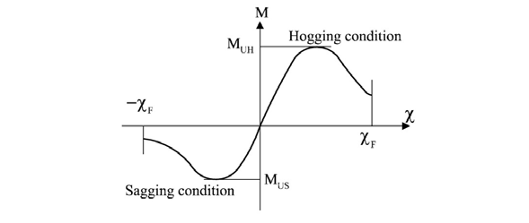
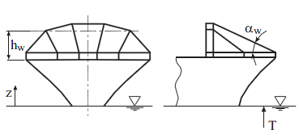

# PART 7 Ships of Special Service (Ch1-4, 7-10)

> RULES FOR CLASSIFICATION OF STEEL SHIPS / RA-07A-E / 2025 / EN / Rules

## CHAPTER 4 CONTAINER SHIPS

### Section 1 General

#### 101. Application 【See Guidance】

- **1.** The construction and equipment of ships intended to be registered and classed as "Container Ship" are to be in accordance with the requirements in this Chapter, where, "Container Ship" means a ship designed exclusively for the carriage of containers in holds and on deck.
- **2.** Except where specially required in this Chapter, the general requirements for the construction and equipment of steel ships are to be applied.
- **3.** The requirements in this Chapter apply to ships which are single deckers having double bottoms in cargo holds and having decks and bottoms framed longitudinally.
- **4.** The container ships with different type from that specified in **Par 3** to which the requirements in this Chapter are not applicable, are to be at the discretion of the Society.
- **5.** In case of the container ships with "SeaTrust(FSA3)" notation of direct fatigue analysis method for the fatigue strength assessment of ship structures in **Pt 3, Annex 3-3**, 0.66 value of material factor, K on YP40 steel may be taken. However, in addition to **Table 9** in **Pt 3, Annex 3-3**, butt welds in the hatch side coaming and fillet welded joints for fixing outfitting items and etc. may be included in the locations for the fatigue strength assessment.
- **6.** The requirements in this Chapter apply to container ships which were contracted for construction on or after 1 July 2018, excluding the vessels which should be applied **Pt 14 Structural Rules for Container Ships**. *(2022)*

#### 102. Direct Strength Calculation

- **1.** This regulation applies to container ships and ships dedicated primarily to carry their cargo in containers.
- **2.** The procedure for yielding and buckling assessment are to be in accordance with the requirements in **Pt 3, Annex 3-2.**
- **3.** **Definitions**
  - **(1)** A Global Analysis is a finite element analysis, using a full ship model, for assessing the structural strength of global hull girder structure, cross deck structures and hatch corner radii.
  - **(2)** A Cargo Hold Analysis is a finite element analysis for assessing the structural strength of the cargo hold primary structural members(PSM) in the midship region. Primary structural members are members of girder or stringer type which provide the overall structural integrity of the hull envelope and cargo hold boundaries, such as:
- **4.** **Analysis**
  - **(1)** A Global Analysis is to be carried out for ships of length 290 m or above. Hull girder loads(including torsional effects) are to be considered in accordance with the requirements in **Pt 3, Annex 3-2 II.**
  - **(2)** Cargo Hold Analysis is to be carried out for ships of length 150 m or above. Local loads such as sea pressure and container loads as well as hull girder loads are to be considered in accordance with the requirements in **Pt 3, Annex 3-2 III. 5.**
  - **(3)** In case of ships other than those specified in (1) or (2), where deemed necessary by the Society, a Global Analysis and/or Cargo Hold Analysis may be performed.

#### 103. Application of extremely thick steel plates with high yield strength (2021)

- **1.** Where extremely thick plates with high yield strength are used for hull construction, the application is to be in accordance with the **Annex 7-8 「Instruction for Use of Extremely Thick Steel Plates」. 【 See Guidance】**

### Section 2 Longitudinal Strength

#### 201. General

- **1.** **Application**
  - **(1)** Application
    This regulation applies to the following types of steel ships with a length L of 90 m and greater and operated in unrestricted service:
  - **(2)** Load limitations
    The wave induced load requirements apply to monohull displacement ships in unrestricted service and are limited to ships meeting the following criteria:
    For ships that do not meet all of the aforementioned criteria, direct calculations of wave induced loads may be considered in accordance with the requirements in **Pt 3, Annex 3-2.**
  - **(3)** Longitudinal extent of strength assessment
    The stiffness, yield strength, buckling strength and hull girder ultimate strength assessment are to be carried out in way of 0.2L to 0.75L with due consideration given to locations where there are significant changes in hull cross section, e.g. changing of framing system and the fore and aft end of the forward bridge block in case of two-island designs. In addition, strength assessments are to be carried out outside this area. As a minimum assessments are to be carried out at forward end of the foremost cargo hold and the aft end of the aft most cargo hold. Evaluation criteria used for these assessments are determined by the Society.
- **2.** **Symbols and definitions**
  - **(1)** symbols
    $L$ : Rule length ($\mathrm{m}$), as defined in **Pt 3, Ch 1, 102.**
    $B$ : Moulded breadth ($\mathrm{m}$), as defined in **Pt 3, Ch 1, 104.**
    $C$ : Wave parameter, see **202. 3.** (1)
    $T$ : Scantling draught ($\mathrm{m}$)
    $C _{B}$ : Block coefficient at scantling draught
    $C _{W}$ : Waterplane coefficient at scantling draught, to be taken as: $C _{W} =A _{W } /(LB)$
    $A _{W}$ : Waterplane area at scantling draught ($\mathrm{m}^2$)
    $R_eH$ : Specified minimum yield stress of the material ($\mathrm{N}/mm^2$)
    $k$ : Material factor as defined in **Pt 3, Ch 1, 403.** for higher tensile steels, k=1.0 for mild steel having a minimum yield strength equal to 235 $\mathrm{N}/mm^2$
    $E _{}$ : Young’s modulus ($\mathrm{N}/mm^2$), to be taken as E = 2.06#eqnID-2927105_s1 for steel
    $M _{S}$ : Vertical still water bending moment in seagoing condition (kNm), at the cross section under consideration
    $M _{S \max ,} M _{S \min}$ : Permissible maximum and minimum vertical still water bending moments in seagoing condition ($\mathrm{kNm}$), at the cross section under consideration, see **202. 2.** (2)
    $M _{W}$ : Vertical wave induced bending moment ($\mathrm{kNm}$), at the cross section under consideration
    $F _{S}$ : Vertical still water shear force in seagoing condition ($\mathrm{kN}$), at the cross section under consideration
    $F _{S \max ,} F _{S \min}$ : Permissible maximum and minimum still water vertical shear force in seagoing condition ($\mathrm{kN}$), at the cross section under consideration, see **202. 2.** (2)
    $F _{W}$ : Vertical wave induced shear force ($\mathrm{kN}$), at the cross section under consideration
    $q _{V}$ : Shear flow along the cross section under consideration, to be determined according to **Appendix 1 of Annex 7-9. 【 See Guidance】**
    $f _{NL-Hog}$ : Non-linear correction factor for hogging, see **202. 3.** (2)
    $f _{NL-Sag}$ : Non-linear correction factor for sagging, see **202. 3.** (2)
    $f _{R}$ : Factor related to the operational profile, see **202. 3.** (2)
    $t _{n e t}$ : Net thickness ($\mathrm{mm}$), see **3.** (1)
    $t _{r es}$ : Reserve thickness, to be taken as 0.5mm
    $I _{n e t}$ : Net vertical hull girder moment of inertia at the cross section under consideration, to be determined using net scantlings (m^4), as defined in **3.**
    $\sigma _{HG}$ : Hull girder bending stress ($\mathrm{N}/mm^2$), as defined in **202. 5.**
    $\tau_HG$ : Hull girder shear stress ($\mathrm{N}/mm^2$), as defined in **202. 5.**
    $x$ : Longitudinal co-ordinate of a location under consideration ($\mathrm{m}$)
    $z$ : Vertical co-ordinate of a location under consideration ($\mathrm{m}$)
    $z _{n}$ : Distance from the baseline to the horizontal neutral axis ($\mathrm{m}$)
  - **(2)** Fore end and aft end
    The fore end (FE) of the rule length L, see **Fig 7.4.1**, is the perpendicular to the scantling draught waterline at the forward side of the stem.
    The aft end (AE) of the rule length L, see **Fig 7.4.1**, is the perpendicular to the scantling draught waterline at a distance L aft of the fore end (FE).
    
    **Fig 7.4.1 Ends of length L**
  - **(3)** Reference coordinate system
    The ships geometry, loads and load effects are defined with respect to the following right-hand coordinate system (see **Fig 7.4.2**):
    Origin : At the intersection of the longitudinal plane of symmetry of ship, the aft end of L and
    the baseline
    X axis : Longitudinal axis, positive forwards
    Y axis : Transverse axis, positive towards portside
    Z axis : Vertical axis, positive upwards
    
    **Fig 7.4.2 Reference coordinate system**
- **3.** **Corrosion margin and net thickness**
  - **(1)** Net scantling definitions
    The strength is to be assessed using the net thickness approach on all scantlings. The net thickness, $t_"net"$ for the plates, webs and flanges is obtained by subtracting the voluntary addition, $t_{vol"_" add}$ and the factored corrosion addition, $t_c$ (mm) from the as built thickness, $t_{as"_" built$, as follows:
    $t _{n e t} = t _{as _{-} built} - t _{vol _{-} add} - \alpha t _{c}$
    where $\alpha$ is a corrosion addition factor whose values are defined in **Table 7.4.1**. The voluntary addition, if being used, is to be clearly indicated on the drawings.

    | Structural requirement | Property / analysis type | $\alpha$ |
    | --- | --- | --- |
    | Strength ssessment (203.) | Section properties | 0.5 |
    | Buckling strength (204.) | Section properties (stress determination) | 0.5 |
    | Buckling strength (204.) | Buckling capacity | 1.0 |
    | Hull girder ultimate strength (206.) | Section properties | 0.5 |
    | Hull girder ultimate strength (206.) | Buckling / collapse capacity | 0.5 |
  - **(2)** Determination of corrosion addition
    The corrosion addition for each of the two sides of a structural member, $t _{c1}$ or $t _{c2}$ is specified in **Table 7.4.2**. The total corrosion addition, $t _{c}$ for both sides of the structural member is obtained by the following formula:
    $t _{c} = \left( t _{c 1} + t _{c 2 } \right) + t _{re s}$
    For an internal member within a given compartment, the total corrosion addition, $t _{c}$ is obtained from the following formula:
    $t _{c} = \left( 2 t _{c 1} \right) + t _{re s}$
    The corrosion addition of a stiffener is to be determined according to the location of its connection to the attached plating.
  - **(3)** Determination of net section properties
    The net section modulus, moment of inertia and shear area properties of a supporting member are to be calculated using the net dimensions of the attached plate, web and flange, as defined in **Fig 7.4.3**. The net cross-sectional area, the moment of inertia about the axis parallel to the attached plate and the associated neutral axis position are to be determined through applying a corrosion magnitude of 0.5 $\alpha t_c$ deducted from the surface of the profile cross-section.

    | Compartment type | One side corrosion addition $t _{c1}$ or $t _{c2}$ [mm] |
    | --- | --- |
    | Exposed to sea water | 1.0 |
    | Exposed to atmosphere | 1.0 |
    | Ballast water tank | 1.0 |
    | Void and dry spaces | 0.5 |
    | Fresh water, fuel oil and lube oil tank | 0.5 |
    | Accommodation spaces | 0.0 |
    | Container holds | 1.0 |
    | Compartment types not mentioned above | 0.5 |

#### 202. Loads

- **1.** **Sign convention for hull girder loads**
  The sign conventions of vertical bending moments and vertical shear forces at any ship transverse section are as shown in **Fig 7.4.4**, namely:
  • The vertical bending moments M_S and M_W are positive when they induce tensile stresses in the strength deck (hogging bending moment) and negative when they induce tensile stresses in the bottom (sagging bending moment).
  • The vertical shear forces F_S, F_W are positive in the case of downward resulting forces acting aft of the transverse section and upward resulting forces acting forward of the transverse section under consideration. The shear forces in the directions opposite to above are negative.

  |   |  |
  | --- | --- |
  | Shear forces : |   |

  Bending Moments :

  |  |
  | --- |
  |  |
  |  |
  |  |
- **2.** **Still water bending moments and shear forces**
  - **(1)** General
    Still water bending moments, $M _{S}$ (kNm) and still water shear forces, $F_S$ (kN) are to be calculated at each section along the ship length for design loading conditions as specified in **202. 2.** (2).
  - **(2)** Design loading conditions
    In general, the design cargo and ballast loading conditions, based on amount of bunker, fresh water and stores at departure and arrival, are to be considered for the $M _{S}$ and $F_S$ calculations. Where the amount and disposition of consumables at any intermediate stage of the voyage are considered more severe, calculations for such intermediate conditions are to be submitted in addition to those for departure and arrival conditions. Also, where any ballasting and/or de-ballasting is intended during voyage, calculations of the intermediate condition just before and just after ballasting and/or de-ballasting any ballast tank are to be submitted and where approved included in the loading manual for guidance. The permissible vertical still water bending moments $M_{S \max}$, $M_{S \min}$ and the permissible vertical still water shear forces $F_{S \max}$, $F_{S \min}$ in seagoing conditions at any longitudinal position are to envelop:
    • The maximum and minimum still water bending moments and shear forces for the seagoing loading conditions defined in the Loading Manual.
    • The maximum and minimum still water bending moments and shear forces specified by the designer. The Loading Manual should include the relevant loading conditions, which envelop the still water hull girder loads for seagoing conditions, including those specified in **Pt 3, Annex 3-2.**
- **3.** **Wave loads**
  - **(1)** Wave parameter
    The wave parameter is defined as follows:
    $C = 1 - 1.50 \left( 1 - \sqrt {\frac{L}{L _{ref}}} \right) ^{2.2}$ for $L$ ≤ $L_ref$
    $C = 1 - 0.45 \left( \sqrt {\frac{L}{L _{ref}}} - 1 \right) ^{1.7}$ for $L$ > $L_ref$
    where:
    $L _{ref}$ Reference length (m), taken as:
    $L _{ref} = 315 C _{W} ^{ -1.3}$ for the determination of vertical wave bending moments according to **202. 3.** (2).
    $L _{ref} = 330 C _{W} ^{ -1.3}$ for the determination of vertical wave shear forces according to **202. 3.** (3).
  - **(2)** Vertical wave bending moments
    The distribution of the vertical wave induced bending moments, $M _{W} _{}$ (kNm) along the ship length is given in **Fig 7.4.6**, where:
    $M _{W-Hog} = +1.5 f _{R} L ^{3} C C _{W} \left( \frac{B}{L} \right) ^{0.8} f _{NL-Hog}$
    $M _{W-Sag} = -1.5 f _{R} L ^{3} C C _{W} \left( \frac{B}{L} \right) ^{0.8} f _{NL-Sag}$
    where:
    $f _{R}$ : Factor related to the operational profile, to be taken as:
    $f _{R} = 0.85$
    $f _{NL-Hog}$ : Non-linear correction for hogging, to be taken as:
    $f _{NL-Hog} = 0.3 \frac{C _{B}}{C _{W}} \sqrt {T}$ not to be taken greater than 1.1
    $f _{NL-Sag}$ : Non-linear correction for sagging, to be taken as:
    $f _{NL-Sag} = 4.5 \frac{1 + 0.2 f _{Bow}}{C _{W} \sqrt {C _{B}} L ^{0.3}}$ not to be taken less than 1.0
    $f _{Bow}$ : Bow flare shape coefficient, to be taken as:
    $f _{Bow} = \frac{A _{D K} -A _{WL}}{0.2 L Z _{f}}$
    $A _{D K}$ : Projected area in horizontal plane of uppermost deck ($\mathrm{m}^2$) including the forecastle deck, if any, extending from 0.8$L$ forward (see **Fig 7.4.5**). Any other structures, e.g. plated bulwark, are to be excluded.
    $A _{WL}$ : Waterplane area (m^2), at draught T, extending from 0.8$L$ forward
    $Z _{f}$ : Vertical distance (m), from the waterline at draught T to the uppermost deck (or forecastle deck), measured at FE (see **Fig 7.4.5**). Any other structures, e.g. plated bulwark, are to be excluded.

    |  |
    | --- |
    |  |

    
    **Fig 7.4.6 Distribution of vertical wave bending moment MW along the ship length**
  - **(3)** Vertical wave shear force
    The distribution of the vertical wave induced shear forces, $F_W$ (kN), along the ship length is given in **Fig 7.4.7**, where,
    $F _{W} _{Hog} ^{ Aft} = +5.2 f _{R} L ^{2} C C _{W} \left( \frac{B}{L} \right) ^{0.8} (0.3 + 0.7 f _{NL-Hog} )$
    $F _{W} _{Hog} ^{ Fore} = -5.7 f _{R} L ^{2} C C _{W} \left( \frac{B}{L} \right) ^{0.8} f _{NL-Hog}$
    $F _{W} _{Sag} ^{ Aft} = -5.2 f _{R} L ^{2} C C _{W} \left( \frac{B}{L} \right) ^{0.8} (0.3 + 0.7 f _{NL-Sag} )$
    $F _{W} _{Sag} ^{ Fore} = +5.7 f _{R} L ^{2} C C _{W} \left( \frac{B}{L} \right) ^{0.8} (0.25 + 0.75 f _{NL-Sag} )$
    $F _{W} _{} ^{ Mid} = +4.0 f _{R} L ^{2} C C _{W} \left( \frac{B}{L} \right) ^{0.8}$
    
    **Fig 7.4.7 Distribution of vertical wave shear force FW along the ship length**
- **4.** **Load cases**
  For the strength assessment, the maximum hogging and sagging load cases given in **Table 7.4.3** are to be checked. For each load case the still water condition at each section as defined in **2.** is to be combined with the wave condition as defined in **3.** refer also to **Fig 7.4.8.**

  | Load case | Bending moment |   | Shear force |   |
  | --- | --- | --- | --- | --- |
  | Load case | $M _{S}$ | $M _{W}$ | $F _{S}$ | $F _{W}$ |
  | Hogging | $M _{S \max }$ | $M _{W H}$ | $F _{S \max }$ for x ≤ 0.5L | $F _{W \max }$ for x ≤ 0.5L |
  | Hogging | $M _{S \max }$ | $M _{W H}$ | $F _{S \min}$ for x > 0.5L | $F _{W \min}$ for x > 0.5L |
  | Sagging | $M _{S \min}$ | $M _{W S}$ | $F _{S \min}$ for x ≤ 0.5L | $F _{W \min}$ for x ≤ 0.5L |
  | Sagging | $M _{S \min}$ | $M _{W S}$ | $F _{S \max }$ for x > 0.5L | $F _{W \max }$ for x > 0.5L |
  | $M _{W H}$ : Wave bending moment in hogging at the cross section under consideration, to be taken as the positive value of M_W as defined in **Fig 7.4.6.** $M _{W S}$ : Wave bending moment in sagging at the cross section under consideration, to be taken as the negative value of M_W as defined **Fig 7.4.6.** $F _{W \max }$ : Maximum value of the wave shear force at the cross section under consideration, to be taken as the positive value of F_W as defined **Fig 7.4.7.** $F _{W \min}$ : Minimum value of the wave shear force at the cross section under consideration, to be taken as the negative value of F_W as defined **Fig 7.4.7.** |   |   |   |   |

  
  **Fig 7.4.8 Load combination to determine the maximum hogging and sagging load cases as given in Table 7.4.3**
- **5.** **Hull girder stress**
  The hull girder stresses (N/mm^2) are to be determined at the load calculation point under consideration, for the “hogging” and “sagging” load cases defined in **4.** as follows:
  Bending stress : $\sigma _{HG} = \frac{\gamma _{S} M _{S} + \gamma _{W} M _{W}}{I _{ n et}} \left( z - z _{n} \right) 10 ^{-3}$
  Shear stress : $\tau _{HG} = \frac{\gamma _{S} F _{S} + \gamma _{W} F _{W}}{t _{ n et} /q _{v}} 10 ^{3}$
  where:
  $\gamma _{S} , \gamma _{ W}$ : Partial safety factors, to be taken as:
  $\gamma _{S} = 1.0$
  $\gamma _{W} = 1.0$

#### 203. Strength assessment

- **1.** **General**
  Continuity of structure is to be maintained throughout the length of the ship. Where significant changes in structural arrangement occur adequate transitional structure is to be provided.
- **2.** **Stiffness criteria**
  The two load cases “hogging” and “sagging” as listed in **202. 4.** are to be checked. The net moment of inertia (m^4), is not to be less than:
  $I _{"net"} \geq 1.55 L \left| M _{S } + M _{W} \right| 10 ^{-7}$
- **3.** **Yield strength assessment**
  - **(1)** General acceptance criteria
    The yield strength assessment is to check, for each of the load cases “hogging” and “sagging” as defined in **202. 4.** that the equivalent hull girder stress, $\sigma_eq$ (N/mm^2) is less than the permissible stress, $\sigma_perm$ (N/mm^2), as follows:
    $\sigma _{eq} < \sigma _{p erm}$
    where:
    $\sigma _{eq} = \sqrt {\sigma _{x} ^{ 2} +3 \tau ^{ 2}}$
    $\sigma _{p erm \mathrm{rm} } = \frac{R _{eH}}{\gamma _{ 1} \gamma _{ 2}}$
    $\gamma _{ 1}$ : Partial safety factor for material, to be taken as: $\gamma _{ 1} = k \frac{R _{eH}}{235}$
    $\gamma _{ 2}$ : Partial safety factor for load combinations and permissible stress, to be taken as:
    $\gamma _{ 2} = 1.24$, for bending strength assessment according to **3.3.2.**
    $\gamma _{ 2} = 1.13$, for shear stress assessment according to **3.3.3.**
  - **(2)** Bending strength assessment
    The assessment of the bending stresses is to be carried out according to (1) at the following locations of the cross section:
    • At bottom
    • At deck
    • At top of hatch coaming
    • At any point where there is a change of steel yield strength
    The following combination of hull girder stress as defined in **202. 5** is to be considered:
    $\sigma _{x} = \sigma _{H G}$
    $\tau = 0$
  - **(3)** Shear strength assessment
    The assessment of shear stress is to be carried out according to (1) for all structural elements that contribute to the shear strength capability. The following combination of hull girder stress as defined in **202. 5** is to be considered:
    $\sigma _{x} = 0$
    $\tau = \tau _{H G}$

#### 204. Buckling strength 【See Guidance】

- **1.** **Application**
  These requirements apply to plate panels and longitudinal stiffeners subject to hull girder bending and shear stresses. Definitions of symbols used in the present article are given in **Annex 7-9, Appendix 2.**
- **2.** **Buckling criteria**
  The acceptance criterion for the buckling assessment is defined as follows:
  $\eta _{a ct} \leq 1$
  where:
  $\eta _{a ct}$: Maximum utilisation factor as defined in **3.**
- **3.** **Buckling utilisation factor**
  The utilisation factor, $\eta _{a ct}$ is defined as the inverse of the stress multiplication factor at failure, $\gamma _{ c}$, see **Fig 7.4.9**.
  $\eta _{a ct} = \frac{1}{\gamma _{c}}$
  Failure limit states are defined in:
  • **Annex 7-9, Appendix 2. 2** for elementary plate panels
  • **Annex 7-9, Appendix 2. 3** for overall stiffened panels
  • **Annex 7-9, Appendix 2. 4** for longitudinal stiffeners
  Each failure limit state is defined by an equation, and $\gamma _{ c}$ is to be determined such that it satisfies the equation. **Fig 7.4.9** illustrates how the stress multiplication factor at failure, $\gamma _{ c}$ of a structural member is determined for any combination of longitudinal and shear stress.
  Where:
  $\sigma _{x} , \tau$ : Applied stress combination for buckling given in **4.**
  $\sigma _{c} , \tau _{c}$ : Critical buckling stresses to be obtained according to **Annex 7-9, Appendix 2** for the stress combination for buckling $\sigma _{x}$ and $\tau$.
  
  **Fig 7.4.9 Example of failure limit state curve and stress multiplication factor at failure**
- **4.** **Stress determination**
  - **(1)** Stress combinations for buckling assessment
    The following two stress combinations are to be considered for each of the load cases “hogging” and “sagging” as defined in **202. 4**. The stresses are to be derived at the load calculation points defined in (2)
    Stress combination 1 with:
    $\sigma _{x} = \sigma _{H G}$
    $\sigma _{y} = 0$
    $\tau = 0.7 \tau _{H G}$
    Stress combination 2 with:
    $\sigma _{x} = 0.7 \sigma _{H G}$
    $\sigma _{y} = 0$
    $\tau = \tau _{H G}$
    Stress combination 1 with:
    $\sigma _{x} = 0$
    $\sigma _{y} = \sigma _{H G}$
    $\tau = 0.7 \tau _{H G}$
    Stress combination 2 with:
    $\sigma _{x} = 0$
    $\sigma _{y} = 0.7 \sigma _{H G}$
    $\tau = \tau _{H G}$
  - **(2)** Load calculation point
    The hull girder stresses for elementary plate panels (EPP) are to be calculated at the load calculation points defined in **Table 7.4.4.**

    | LCP coordinates | Hull girder bending stress |   | Hull girder shear stress |
    | --- | --- | --- | --- |
    | LCP coordinates | Non horizontal plating | Horizontal plating | Hull girder shear stress |
    | x coordinate | Mid-length of the EPP |   |   |
    | y coordinate | Both upper and lower ends of the EPP(points A1 and A2 in **Fig 7.4.10**) | Outboard and inboard ends of the EPP(points A1 and A2 in **Fig 7.4.10**) | Mid-point of EPP (point B in **Fig 7.4.10**) |
    | z coordinate | Corresponding to x and y values |   |   |

    
    **Fig 7.4.10 LCP for plate buckling – assessment, PSM stands for primary supporting members**
    The hull girder stresses for longitudinal stiffeners are to be calculated at the following load calculation point:
    • at the mid length of the considered stiffener.
    • at the intersection point between the stiffener and its attached plate.

#### 205. Torsional strength 【See Guidance】

Where the width of hatchway at midship exceeds 0.7$B$, special considerations are to be paid to the additional stress and the deformation of hatchway openings due to torsion. Where, however, the ship has two or more rows of hatchways, the distance between the outermost lines of hatchway openings is to be taken as the width of hatchway.

#### 206. Hull girder ultimate strength

- **1.** **Application**
  The hull girder ultimate strength is to be assessed for ships with length, $L$ equal or greater than 150m. The acceptance criteria, given in **4.** are applicable to intact ship structures. The hull girder ultimate bending capacity is to be checked for the load cases “hogging” and “sagging” as defined in **202. 4**.
- **2.** **Hull girder ultimate bending moments**
  The vertical hull girder bending moment, M in hogging and sagging conditions, to be considered in the ultimate strength check is to be taken as:
  $M= \gamma _{S} M _{S} + \gamma _{W} M _{W}$
  where:
  $M _{S}$ = Permissible still water bending moment (kNm), defined in **202. 4**
  $M _{W}$ = Vertical wave bending moment (kNm), defined in **202. 4**
  $\gamma _{S}$ = Partial safety factor for the still water bending moment, to be taken as 1.0
  $\gamma_{W}$ = Partial safety factor for the vertical wave bending moment, to be taken as 1.2
- **3.** **Hull girder ultimate bending capacity**
  - **(1)** General The hull girder ultimate bending moment capacity, $M _{U}$ is defined as the maximum bending moment capacity of the hull girder beyond which the hull structure collapses.
  - **(2)** Determination of hull girder ultimate bending moment capacity The ultimate bending moment capacities of a hull girder transverse section, in hogging and sagging conditions, are defined as the maximum values of the curve of bending moment $M$ versus the curvature $\chi$ of the transverse section considered ($M _{UH}$ for hogging condition and $M _{US}$ for sagging condition, see **Fig 7.4.11**). The curvature $\chi$ is positive for hogging condition and negative for sagging condition.
    
    **Fig 7.4.11 Bending moment M versus curvature χ**
    The hull girder ultimate bending moment capacity $M_{U}$ is to be calculated using the incremental-iterative method as given in **Annex 7-9, Appendix 3. 2** or using an alternative method as indicated in **Annex 7-9, Appendix 3. 3.**
- **4.** **Acceptance criteria**
  The hull girder ultimate bending capacity at any hull transverse section is to satisfy the following criteria:
  $M _{} \leq \frac{M _{U}}{\gamma _{M} \gamma _{DB}}$
  where:
  $M _{}$ = Vertical bending moment (kNm), to be obtained as specified in **2**
  $M _{U}$ = Hull girder ultimate bending moment capacity (kNm), to be obtained as specified in **3**
  $\gamma _{M}$ = Partial safety factor for the hull girder ultimate bending capacity, covering material, geometric and strength prediction uncertainties, to be taken as 1.05
  $\gamma _{ DB}$ = Partial safety factor for the hull girder ultimate bending moment capacity, covering the effect of double bottom bending, to be taken as:
  • For hogging condition: $\gamma _{ DB} = 1.15$
  • For sagging condition: $\gamma _{ DB} = 1.0$
  For cross sections where the double bottom breadth of the inner bottom is less than that at amidships or where the double bottom structure differs from that at amidships (e.g. engine room sections), the factor, $\gamma _{ DB}$ for hogging condition may be reduced based upon agreement with the Society.

#### 207. Additional requirements for large container ships

- **1.** **General**
  The requirements in **2.** and **3.** are applicable to container ships with a breadth, B greater than 32.26 $\mathrm{m}$.
- **2.** **Yielding and buckling assessment**
  Yielding and buckling assessments are to be carried out in accordance with the Rules of the Society, taking into consideration additional hull girder loads (wave torsion, wave horizontal bending and static cargo torque), as well as local loads. All in-plane stress components (i.e. bi-axial and shear stresses) induced by hull girder loads and local loads are to be considered.
- **3.** **Whipping**
  Hull girder ultimate strength assessment is to take into consideration the whipping contribution to the vertical bending moment according to the Society's procedures.

### Section 3 Double Bottoms

#### 301. General (2018)

- **1.** The construction of double bottoms in holds which are exclusively loaded with containers is to be in accordance with the requirements of this Section. Except where required in this section, the requirements in **Pt.3 Ch.7** are to be applied. *(2019)*
- **2.** Side girders or solid floors are to be arranged in the double bottoms under corner fittings. Otherwise, double bottoms are to be effectively strengthened so as to support container loads.
- **3.** Where cargo hold is exclusively used for the stowage of containers, the requirements for ceiling and the increment of inner bottom plating under hatchways specified in **Pt 3, Ch 7, 501.** may not be applied.
- **4.** The thickness of bottom shell plating and inner bottom plating in the double bottom spaces for void spaces, fuel oil tanks, etc. which do not contain sea water in service conditions may be reduced by 0.5$\mathrm{mm}$ from the thickness prescribed in this section.
- **5.** **5**. For bottom longitudinals, sufficient consideration is to be given for fatigue strength.

#### 302. Longitudinals 【See Guidance】

The section modulus of bottom or inner bottom longitudinals is not to be less than that obtained from the formula given in **Table 7.4.5,** respectively.

**Table 7.4.5 Section modulus of longitudinals**

| Item | Section modulus ($\mathrm{cm}^3$) |   |   |
| --- | --- | --- | --- |
| Bottom longitudinals | $Z _{b=} \frac{0.9 CKSl ^{2}}{24-15.0 f _{B} K} \left\{ d + 0.013 L ' ( \frac{2}{B} y + 1) + h _{1} \right\}$ |   |   |
| Inner bottom longitudinals | $Z _{i} = 100 C _{1} C _{2} S h l ^{2}$ ($\geq 0.75 Z_b$) |   |   |
| $C$ = coefficient given in the following table. **Table 7.4.7 Coefficient** $C _{2}$ One end of stiffener The other end of stiffener ; Connection with hard bracket ; Connection with soft bracket ; Supported by rule girder or lug connection Connection with hard bracket ; 0.70 ; 1.15 ; 0.85 Connection with soft bracket ; 1.15 ; 0.85 ; 1.30 Supported by rule girder or lug connection ; 0.85 ; 1.30 ; 1.00 1. Connection with hard bracket is a connection by bracket to the double bottoms or to the adjacent members, such as longitudinals or stiffeners in line, of the same or larger sections, or a connection by bracket to the equivalent members mentioned above. (See **Fig 3.14.2** (a)) 2. Connection with soft brackets is a connection by bracket to the transverse members such as beams or equivalent thereto. (See **Fig 3.14.2** (b)) Case $C$ In case where no strut specified in **303.** is provided midway between floors 100 In case where a strut specified in **303.** is provided midway between floors 62.5 NOTE: Where, however, the width of vertical stiffeners provided on floors and that of struts are large enough, the coefficient may be properly reduced. $h_1$ : as given in (1) or (2) (1) for 0.3$L$ from the fore end ---- $\frac{3}{2} (17 - 20 C _{b} ' )(1 - x)$ $C_b '$ : block coefficient (where $C_b$ exceeds 0.85, ${C_b}'$ is to be taken as 0.85) (2) for eleswhere -------------- 0 $x = \frac{X}{0.3 L}$ ($X$ : distance($\mathrm{m}$) from the fore end for side shell plating. However, where X is less than that 0.1L, X is to be taken as 0.1L and where X exceeds 0.3L, X is to be taken as 0.3) $f_B$ : refer to Pt 3, Ch 1 $L'$ : length of ship ($\mathrm{m}$). Where, however, $L$ exceeds 230 $\mathrm{m}$, $L'$ is to be taken as 230 $\mathrm{m}$. $y$ : horizontal distance ($\mathrm{m}$) from the centre line of the ship to the longitudinals under consideration. $l$ : spacing of solid floors ($\mathrm{m}$). $S$ : spacing of longitudinals ($\mathrm{m}$). $C_1 = \frac{K}{24 - \alpha K}$ ($\geq \frac{K}{18}$. for $h_2$, $h_3$, $\frac{K}{18}$) $\alpha = 15.0 f _{B} \left( 1 - \frac{z}{z _{B}} \right)$ $z$ : vertical distance ($\mathrm{m}$) from the top of the keel to the bottom of inner bottom plating $z_B$ : vertical distance ($\mathrm{m}$) from the top of the keel midships to the horizontal neutral axis of the transverse section $C_2$ : as determined from **Table 7.4.7** $h$ : the following $h_$, $h_2$, $h_3$. however, where the double bottom space is void, $h$ is to be taken as $h_1$ $h_1$ : vertical distance ($\mathrm{m}$) from the mid point between the bottom of inner bottom plating and the upper end of the overflow pipe $h_2$ : as obtained from the following formula $h_2 = 0.85 (h_1 + \Delta h)$ ($\mathrm{m}$) $\Delta h = \frac{16}{L} (l_t - 10 ) + 0.25(b_t - 10)$ ($\mathrm{m}$) $l_t$ : tank length ($\mathrm{m}$) ($\geq 10 \mathrm{m}$) $b_t$ : tank breadth ($\mathrm{m}$) ($\geq 10 \mathrm{m}$) $h_3$ : value obtained by multiplying 0.7 by the vertical distance from the tank top plating to the point 2.0$\mathrm{m}$ above the top of the overflow pipe |   |   |   |
| **Table 7.4.7 Coefficient** $C _{2}$ |   |   |   |
| One end of stiffener The other end of stiffener | Connection with hard bracket | Connection with soft bracket | Supported by rule girder or lug connection |
| Connection with hard bracket | 0.70 | 1.15 | 0.85 |
| Connection with soft bracket | 1.15 | 0.85 | 1.30 |
| Supported by rule girder or lug connection | 0.85 | 1.30 | 1.00 |
| 1. Connection with hard bracket is a connection by bracket to the double bottoms or to the adjacent members, such as longitudinals or stiffeners in line, of the same or larger sections, or a connection by bracket to the equivalent members mentioned above. (See **Fig 3.14.2** (a)) 2. Connection with soft brackets is a connection by bracket to the transverse members such as beams or equivalent thereto. (See **Fig 3.14.2** (b)) |   |   |   |

#### 303. Vertical struts

- **1.** Vertical struts are to be of rolled sections other than flat bars or bulb plates and to be overlapped with the webs of bottom and inner bottom longitudinals.
- **2.** The sectional area of the vertical struts is not to be less than that obtained from the following formula :
  $A = 1.8 C K S b h \mathrm{cm^2 }$
  where:
  $S$ : spacing of longitudinals ($\mathrm{m}$).
  $b$ : breadth of the area supported by the strut ($\mathrm{m}$).
  $h$ : as obtained from the following formula ($\mathrm{m}$).
  $h = \frac{d+0.026L'}{2}$
  $L'$ : as specified in **Table 7.4.5.**
  $C$ : coefficient obtained from the following formula. In no case is the value of coefficient to be less than 1.43.
  $C = {1} OVER {1- 0.5 \frac{l_s}{k \sqrt { K}}$
  $l_s$ : length of struts ($\mathrm{m}$).
  $k$ : minimum radius of gyration of struts obtained from the following formula ($\mathrm{cm}$).
  $k = \sqrt { \frac{I}{A}}$
  $I$ : the least moment of inertia of the struts ($\mathrm{cm}^4$).
  $A$ : sectional area of struts ($\mathrm{cm}^2$).

#### 304. Thickness of inner bottom plating

- **1.** The thickness of inner bottom plating is not to be less than that obtained from the following formulae, whichever is the greater :
  $t_1 = \frac{C K B^2 d}{d_0} + 1.5 \mathrm{mm}$
  $t_2 = C 'S \sqrt { hK} +1.5 \mathrm{mm}$
  where :
  $d_0$ : height of centre girder ($\mathrm{mm}$).
  $S$ : spacing of inner bottom longitudinals for longitudinal framing or frame spacing for transverse framing ($\mathrm{m}$).
  $h$ : as given by the following formula.
  $h = 1.13 (d - 0.001 d_0 )$
  $C$ : coefficient obtained from **Table 3.7.7**. of **Pt 3**
  $C '$ : coefficient obtained from **Table 3.7.8.** of **Pt 3**
- **2.** Notwithstanding the requirement 1., the thickness $t$ of inner bottom plating is to be not less than obtained from the following formula.
  $t = 3.6 C S \sqrt { hK} +2.0 \mathrm{mm}$
  $S$ : spacing of stiffeners ($\mathrm{m}$)
  $h$ : as specified in **Table 7.4.5**
  $C$ : coefficient given in the following formula according to the stiffening system fo inner bottom plating used, however, for $h_2$ and $h_3$, $C$ is to be taken as 1
  $C = \frac{27.7}{\sqrt{767 - \alpha^2 K}}$
  $\alpha$ : as specified in **Table 7.4.5**
  $C = \frac{3.72}{\sqrt{27.7 - \alpha K}}$ (>1.0)
  $\alpha$ : as specified in **Table 7.4.5**
- **3.** The inner bottom plating with which the lower ends of corner fittings of containers are in contact is to be strengthened by means of doubling or by other appropriate means.

#### 305. Thickness of bottom shell plating

- **1.** The thickness $t$ of bottom shell plating is not to be less than that obtained from the following formulae (1) and (2) or from the requirements in **Pt 3, Ch 7, sec 5, 505.**, whichever is the greater. However, in the application of the requirements in **Pt 3, Ch 7, sec 5, 505.,** the thickness need not apply to the requirement of **Pt 3, Ch 4, sec 3, 304.**
  - **(1)** In ships with transverse framing, the thickness is not to be less than that obtained from the following formula:
    $t = C_1 C_2 S \sqrt{d + 0.0175 L' ( \frac{2}{B} y +1 ) + h_1 }+1.5$ ($\mathrm{mm}$)
    where,
    $S$ : spacing ($\mathrm{m}$) of transverse frames
    $L'$, $y$, $h_1$ : as specified in 302.
    $C_1$ : coefficient given below
    where $L \leq 230 \mathrm{m}$, 1.0
    where $L \leq 230 \mathrm{m}$, 1.07
    for intermediate value of $L$, $C_1$ is to be obtained by linear interpolation.
    $C_2$ : coefficient given below
    $C_2 = \frac{91}{\sqrt{576 - (15.0 f_B x )^2 }}$ $x = \frac{X}{0.3 L}$
    ($X$ : distance ($\mathrm{m}$) from the fore end for side shell plating afore the midship, or from the after end for side shell plating after the midships. However, where $X$ is less than that $0.1L$, $X$ is to be taken as $0.1L$ and where $X$ is exceeds $0.3 L$, $X$ is to be taken as $0.3 L$.
  - **(2)** In ships with longitudinal framing, the thickness of side shell plating is not to be less than that obtained from the following formula:
    $t = C_1 C_2 S \sqrt{d + 0.0175 L' ( \frac{2}{B} y +1 ) + h_1 }+1.5$ ($\mathrm{mm}$)
    where,
    $S$ : spacing ($\mathrm{m}$) of longitudinal frames
    $C_2$ : coefficient given below ($\geq 3.78 sqrtK$)
    $C_2 = 13 \sqrt{ \frac{K}{24 - 15.0 f_B K x}}$
- **2.** **2**. Notwithstanding the requirement in -1, the thickness $t$ of bottom shell plating is to be not less than obtained from the following formula.
  $t = \sqrt{KL'}$ ($\mathrm{mm}$)
  $L'$ : length ($\mathrm{m}$) of ship ($\leq 330 \mathrm{m}$)
- **3.** The breadth of plate keels is to be not less than obtained from the following formula.
  $b = 2L + 1000$ ($\mathrm{mm}$)
  The thickness of plate keel over whole length of the ship is not to be less than the thickness of the bottom shell for the midship part obtained from the requirements in 305.1 increased by 2.0 mm. This thickness, however, is not to be less than that of the adjacent bottom shell plating.

### Section 4 Double Side Construction

#### 401. General 【See Guidance】

- **1.** Side construction in holds is to be double hull construction as far as practicable and is to be thoroughly stiffened by providing side transverse girders and side stringers within double hull.
- **2.** The construction of double side in holds which are exclusively loaded with containers is to be in accordance with the requirements in the requirements of this Section. Except where required in this section, such construction is to be in accordance with the requirements in **Pt 3, Ch 14**. *(2019)*
- **3.** Double side shell structures which are used as deep tanks are to be in accordance with the requirements in **Pt 3, Ch 15** unless otherwise specified in this Section. *(2018)*
- **4.** In the application of the requirement in Pt 3, Ch 15, 104., the thickness of inner hull plating, interior of which are used as deep tank may be reduced by 1.0$\mathrm{mm}$ from the thickness prescribed in Table 3.15.1.
- **5.** The thickness of side shell plating and inner hull plating in double side space for void space, fuel oil tanks, etc. which do not contain sea water I service conditions may be reduced by 0.5$\mathrm{mm}$ from the thickness prescribed in this section.
- **6.** Side stringers are to be provided in a proper spacing considering the depth of holds. And, side transverse girders are to be provided at the location of solid floors in double bottoms.
- **7.** The scantlings in case where the width of double side shell structures changes in bilge parts, are to be at the discretion of the Society.
- **8.** The scantlings in case where the height from the load line to the strength deck is specially large, are to be at the discretion of the Society.
- **9.** Where structures effectively supporting deck structures and side shell structures are provided in the midway of holds, the requirements in this section may be appropriately modified.
- **10.** At the location where the longitudinal bulkheads and the inner bottom plating are combined, considerations are to be paid with regard to their structural arrangement so as not to cause stress concentration.
- **11.** At the fore and aft ends of double side construction, sufficient considerations are to be paid to the continuity of construction and strength.
- **12.** For side longitudinal, sufficient consideration is to be given for fatigue strength.

#### 402. Side transverse and side stringers 【See Guidance】

The thickness of side transverse and side stringers is not to be less than that obtained from the following formula. However, where deemed necessary by the Society, the thickness of these members is to be determined in consideration of bending and shear strength.
$t = 8.5 \frac{S_2}{\sqrt { K}} +1.5 \mathrm{mm}$
where:
$S_2$ : $S_1$ or $d_1$, whichever is the smaller.
$S_1$ : spacing of the stiffeners provided in the direction of the depth of transverse on the web of transverse for side transverse or spacing of the stiffeners provided in the direction of the depth of stringer on the web of stringer for side stringer ($\mathrm{m}$), respectively.
$d_1$ : depth of side transverse or side stringers ($\mathrm{m}$). Where, however, the depth of webs is divided by providing stiffeners in the direction of the length of side transverse on the webs or of side stringer on the webs, $d_1$ may be taken as the divided depth, respectively.

#### 403. Longitudinal bulkheads

The thickness of longitudinal bulkheads and the section modulus of longitudinal stiffeners in case where the double side structure is used as deep tanks, are not to be less than those obtained from the following formulae, respectively.

- **1.** The thickness of longitudinal bulkheads is not to be less than that obtained from the following formula. However, the thickness of longitudinal bulkheads which are not in contact with sea water in service conditions may be reduced from the following requirements by 0.5 $mm$.
  $t=3.6 C _{1} S \sqrt {Kh} +2.0 \mathrm{mm}$
  where:
  $S$ : spacing of longitudinal stiffeners ($\mathrm{m}$).
  $h$ : the following $h_$, $h_2$, $h_3$. however, where the double bottom space is void, $h$ is to be taken as $h_1$
  $h_1$ : vertical distance ($\mathrm{m}$) from the low edge of bulkhead plating under consideration to the mid-point between the point on the tank top and upper end of the overflow pipe
  $h_2$ : as obtained from the following formula
  $h_2 = 0.85 (h_1 + \Delta h)$ ($\mathrm{m}$)
  $\Delta h = \frac{16}{L} (l_t - 10 ) + 0.25(b_t - 10)$ ($\mathrm{m}$) $l_t$ : tank length ($\mathrm{m}$) ($\geq 10 \mathrm{m}$) $b_t$ : tank breadth ($\mathrm{m}$) ($\geq 10 \mathrm{m}$)
  $h_3$ : value obtained by multiplying 0.7 by the vertical distance from low edge of bulkhead plating under consideration to the point 2.0$\mathrm{m}$ above the top of the overflow pipe
  $C_1$ : coefficient obtained from **Table 7.4.6.** However, for $h_2$ and $h_3$, $C_1$ is to be taken as 1.
- **2.** The section modulus of longitudinal stiffeners on longitudinal bulkheads is not to be less than that obtained from the following formula.
  $Z=100 C _{1} C _{2} S h l ^{2} \mathrm{cm ^{3} }$
  $C _{1}$ : $K/18$, the value $C_1$ for $h _{1}$, however, is to be as obtained from the following formula.
  $C _{1} = \frac{K}{24- \alpha K}$ (≥$K/18$)
  $\alpha$ : coefficient determined according to **Table 7.4.6.**
  $C _{2}$ : coefficient given in **Table 7.4.7.**
  $S$ : spacing of longitudinal stiffeners ($\mathrm{m}$).
  $h$ : as specified in **1.** where "the lower edge of the bulkhead plating under consideration" is to be construed as "the stiffener under consideration"
  $l$ : span of girders ($\mathrm{m}$).

#### 404. Brackets

Brackets are to be provided on the upper and lower corners inside the double side structure, at every frame in case where transversely stiffened and at an appropriate spacing between side transverse girders in case where longitudinally stiffened.

**Table 7.4.7 Coefficient** $C _{2}$

| One end of stiffener The other end of stiffener | Connection with hard bracket | Connection with soft bracket | Supported by rule girder or lug connection |
| --- | --- | --- | --- |
| Connection with hard bracket | 0.70 | 1.15 | 0.85 |
| Connection with soft bracket | 1.15 | 0.85 | 1.30 |
| Supported by rule girder or lug connection | 0.85 | 1.30 | 1.00 |
| 1. Connection with hard bracket is a connection by bracket to the double bottoms or to the adjacent members, such as longitudinals or stiffeners in line, of the same or larger sections, or a connection by bracket to the equivalent members mentioned above. (See **Fig 3.14.2** (a)) 2. Connection with soft brackets is a connection by bracket to the transverse members such as beams or equivalent thereto. (See **Fig 3.14.2** (b)) |   |   |   |

**Table 7.4.6 Coefficients** $C_1$

| Framing | $C_1$ |   |   |
| --- | --- | --- | --- |
| Transverse system | $\frac{27.7}{\sqrt} { 767 - \alpha^2 K^2 }}$ |   |   |
| Longitudinal system | $\frac{3.72}{\sqrt} { {27.7 - \alpha K}}$ but $C_1$ is not to be less than 1.0 |   |   |
| $\alpha$ = as obtained from the following formulae, whichever is greater: However the value of $\alpha_1$ or $\alpha _2$ is not to be less than $\alpha _3$ $\alpha _{1} =15.0 f _{D} \left( \frac{y-y _{B}}{Y ^{' }} \right)$where $z \geq z _{B}$ $\alpha _{2} =15.0 f _{B} \left( \frac{y _{B} -y}{y _{B}} \right)$where $z\(\alpha_3 = \frac{1}{9.81} M_\frac{H}{I_H} y_H \times 10^5$ $z$ : distance ($\mathrm{m}$) from the top of keel to the lower edge of plating when the platings under consideration are under $z_B$ and to the upper edge of plating when the platings under consideration are above $z_B$, respectively. $z_B$ : vertical distance from the top of keel to the horizontal neutral axis of transverse section ($\mathrm{m}$). $f_B$ , $f_D$ : as specified in **Pt 3, Ch 1** $Z'$ : the greater of the values specified in **Pt 3, Ch 3, 203.** (5) (A) or (B), whichever is the greater $M_H$ : as given by te following formula $M_H = 0.45 C_1 L^2 d (C_b + 0.05) C_H$ ($\mathrm{kN} m$) $C_1$ : As given by following formula $10.75 - \left(\frac{300 - L_1}{100} \right)^1.5$ $L_1 \leq 300 \mathrm{m}$ $10.75$ $300 < L_1 \leq 350 \mathrm{m}$ $10.75 - \left(\frac{L_1 - 300}{150} \right)^1.5$ $350 \mathrm{m} < L_1$ $L_1$ : Length($\mathrm{m}$) specified in **Pt 3, Ch 1, 102.** or 0.97 times the length of ship on the designed maximum load line, whichever smaller $C_H$ : Coefficient, as given in following table, based on the ration of $L$ to x, where x is the distance ($\mathrm{m}$) from the aft end of $L$ to the section under consideration. Intermediate values are to be determined by interpolation. **Table 7.8.1 Thickness of plating and section modulus of bulkhead stiffeners etc.** Position ; Thickness of plating $t$ ($\mathrm{mm}$) ; Modulus of stiffeners $Z$ ($\mathrm{cm}^3$) ; Depth of stiffeners $d$ ($\mathrm{mm}$) Fronts ; The greater of $t$ = 0.012$S$ or 8.0 ; $Z = 0.034 S l^2$ ; $d \geq 100$ Sides ; The greater of $t$ = 0.01$S$ or 6.5 ; $Z = 0.027 S l^2$ ; $d \geq 75$ Aft ends ; The greater of $t$ = 0.008$S$ or 6.5 ; $Z = 0.021 S l^2$ ; $d \geq 65$ $S$ = stiffener spacing ($\mathrm{mm}$) $l$ = effective length of stiffeners ($\mathrm{m}$) NOTE : The ends of stiffeners are to be connected on all tiers. $x/L$ 0.0 0.4 0.7 1.0 $C_H$ 0.0 1.0 1.0 0.0 $I_H$ : Moment of inertia($\mathrm{cm}^4$) of the cross section about the vertical neutral axis of the transverse section under consideration $y_H$ : Horizontal distance($\mathrm{m}$) from the vertical neutral axis to the evaluation point |   |   |   |
| **Table 7.8.1 Thickness of plating and section modulus of bulkhead stiffeners etc.** |   |   |   |
| Position | Thickness of plating $t$ ($\mathrm{mm}$) | Modulus of stiffeners $Z$ ($\mathrm{cm}^3$) | Depth of stiffeners $d$ ($\mathrm{mm}$) |
| Fronts | The greater of $t$ = 0.012$S$ or 8.0 | $Z = 0.034 S l^2$ | $d \geq 100$ |
| Sides | The greater of $t$ = 0.01$S$ or 6.5 | $Z = 0.027 S l^2$ | $d \geq 75$ |
| Aft ends | The greater of $t$ = 0.008$S$ or 6.5 | $Z = 0.021 S l^2$ | $d \geq 65$ |
| $S$ = stiffener spacing ($\mathrm{mm}$) $l$ = effective length of stiffeners ($\mathrm{m}$) |   |   |   |
| NOTE : The ends of stiffeners are to be connected on all tiers. |   |   |   |

#### 405. Side Shell Plating

- **1.** The side shell plating below the strength deck is to be in accordance with the requirements in **405.** Unless otherwise specified in **405,** such plating is also to be in accordance with **Pt 3, Ch 4.**
- **2.** The thickness $t$ of side shell plating other than the sheer strake specified **Pt 3, Ch 4, 303.** is to be as required in the following (1) and (2) in addition to the requirements in **Pt 3, Ch 4, 301.** and **302.**
  - **(1)** In ships with transverse framing, the thickness of side shell plating is not to be less than that obtained from the following formula:
    $t = C _{1} C _{2} S \sqrt {d - z' + 0.05 L ' +h _{1}} +1.5$ ($\mathrm{mm}$)
    where,
    $S$ : spacing($\mathrm{m}$) of transverse frame
    $L'$, $C_1$ and $h_1$ : as specified in **305. 1**
    $z'$ : vertical distance($\mathrm{m}$) from the top of the keel to the lower edge of side shell plating under consideration. (However, in case of $z > d$, #eqnID-3360_s1is to be taken as $d$.)
    $C_2$ : Coefficient given below:
    $C_2 = 91 \sqrt {\frac{K}{576 - \alpha^2 K^2 x^2}}$
    $\alpha$ : As given in following formula, whichever is greater
    $\alpha_1 = 15.0 f_B \left( 1 - \frac{z}{z_B} \right)$ $\alpha_2 = \frac{1}{9.81} M_\frac{H}{I_H} y_H \times 10^5$
    $z$ : Vertical distance ($\mathrm{m}$) from the top of the keel to the lower edge of the side shell plating under consideration.
    $z_B$, $f_B$ : As specified in **Table 7.4.5**
    $M_H$, $I_H$, $y_H$ : As specified in **Table 7.4.6**
    $x$ : As specified in **305. 1** (1)
  - **(2)** In ships with longitudinal framing, the thickness of side shell plating is not to be less than that obtained from the following formula:
    $t = C _{1} C _{2} S \sqrt {d - z' + 0.05 L ' +h _{1}} +1.5$ ($\mathrm{mm}$)
    where,
    $S$ : Spacing($\mathrm{m}$) of longitudinal frame
    $z'$, $L'$, $C_1$ and $h_1$ : as specified in (1)
    $C_2$ : Coefficient given below:
    $C_2 = 13 \sqrt {\frac{K}{24 - \alpha K x}}$ ($GE 3.78 sqrtK$)
    $\alpha$ and $x$ : as specified in (1)
- **3.** The t Notwithstanding the requirement in **Par 2**, the thickness of $t$ of the side shell plating below the strength deck is to be not less than obtained from the formula in **305. 2.**

#### 406. Side Longitudinals

- **1.** The section modulus $Z$ of the side longitudinals below the freeboard is not to be less than that obtained from the following formula (1) and (2), whichever is greater.
  - **(1)** $Z = 90 C S h l^2$
    where,
    $S$ : Spacing($\mathrm{m}$) of longitudinal frame
    $l$ : Spacing($\mathrm{m}$) of girders
    $h$ : Vertical distance ($\mathrm{m}$) from the side longitudinal concerned to a point $d + 0.038 L' + 0.75 h_1$ above the top of keel
    $h_1$, $L'$ : as specified in 202.1
    $C_2$ : Coefficient given below:
    $C = \frac{K}{24 - \alpha K}$ ($\geq \frac{K}{18}$)
    $\alpha$ = As obtained from the following formulae, whichever is greater:
    #eqnID-3404_s1where $z _{B} \(\alpha _{2} =15.0 f _{B} \left( 1 - \frac{z}{z _{B}} \right)$ where $z \leq z _{B}$
    $\alpha_3 = \frac{1}{9.81} M_\frac{H}{I_H} y_H \times 10^5$
    $z$ : Vertical distance ($\mathrm{m}$) from the top of keel to the longitudinal under consideration
    $z_B$ : As specified in **Table 7.4.5**
    $f_B$, $f_D$, $Z'$, $M_H$, $I_H$ and $y_H$ : As specified in **Table 7.4.6**
  - **(2)** $Z = 2.9 K \sqrt{L'}S l^2$ ($\mathrm{cm}^3$)
    $S$, $l$, $L'$ : As specified in (1)
- **2.** **2**. The section modulus $Z$ of side longitudinal where the interior of double side structure is used as deep tank are to be in accordance with the requirements in **403. 2**.

### Section 5 Transverse Bulkheads

#### 501. Construction

- **1.** Transverse bulkheads are to be constructed so as to be sufficiently supported at the location of deck. In case where the width of bulkhead is specially large, the upper parts of transverse bulkheads are to be appropriately strengthened by providing box-shaped structures or by other means.
- **2.** The scantlings of bulkheads and stiffeners are to comply with the requirements in **Pt 3, Ch 14, Sec 3.**

#### 502. Partial bulkheads

Where non-watertight partial bulkheads are provided in cargo holds, the construction and scantlings are to be made to have sufficient strength and rigidity, considering the size of cargo hold, the depth of bulkheads, etc.

### Section 6 Deck Construction

#### 601. Construction 【See Guidance】

- **1.** The thickness of deck plating is to comply with the requirement in **Pt 3, Ch 5, Sec 3.**
- **2.** The scantlings of decks inside the line of deck openings are to be appropriately strengthened in consideration of bending in the plane of deck.

#### 602. Cross ties

- **1.** Where the length of hatchway is large in comparison with the width of hatchway, cross ties are to be provided in the hatchway opening with suitable spacing.
- **2.** Where structures effectively supporting the loads from the side and deck of ship are not provided at the location of cross ties in the holds, special considerations are to be paid to the scantlings of cross ties.

#### 603. Continuity of thickness of deck plating

Consideration is to be paid to the continuity in the thickness of deck plating. Especially, the abrupt change between the thickness inside and outside the line of deck openings is to be avoided.

### Section 7 Breakwater

#### 701. Breakwater

- **1.** **Arrangement**
  - **(1)** If cargo is intended to be carried on deck forward of 0,85L, a breakwater or an equivalent protecting structure (e.g. whaleback or turtle deck) is to be installed.
- **2.** **Dimensions of the breakwater**
  - **(1)** The recommended height of the breakwater is as following.
    $h _{w} = 0.8 (b c _{1} - z)$ (m) ($h_{w"_"\min} = 0.6(b c_1 - z)$)
    where
    z : the vertical distance ($\mathrm{m}$) between the summer load line and the bottom line of the breakwater.
    $b = 1.0 + 2.75 \left( \frac{\frac{x}{L} - 0.45}{C_B + 0.2} \right)^2$ (0.6 $<=$$C_B$$<=$ 0.8)
    $x$ : distance ($\mathrm{m}$) from aft end of L to breakwater
    $c_1$ : Wave coefficient
    $10.75 - \left( \frac{300 - L}{100} \right) ^{1.5}$ where $L \leq 300$ $\mathrm{m}$
    $10.75$ where $300 < L \leq 350$ $\mathrm{m}$
    $10.75 - \left( \frac{L - 300}{150} \right) ^{1.5}$ where $350 < L \leq 500$ $\mathrm{m}$
    The average height of whalebacks or turtle decks has to be determined analogously according to **Fig 7.4.12**.
  - **(2)** The breakwater has to be at least as broad as the width of the area behind the breakwater, intended for carrying deck cargo.
    
    **Fig 7.4.12 Whaleback**
- **3.** **Cutouts**
  Cutouts in the webs of primary supporting members of the breakwater are to be reduced to their necessary minimum. Free edges of the cutouts are to be reinforced by stiffeners. If cutouts in the plating are provided to reduce the load on the breakwater, the area of single cutouts should not exceed 0.2$\mathrm{m}^2$ and the sum of the cutout areas not 3 % of the overall area of the breakwater plating.
- **4.** **Loads** ***(2017)***
  - **(1)** The loads for dimensioning are to be determined according to following formula.
    $p _{A} = n (b c _{1} - z)$ ($\mathrm{kN}/m^2$)
    $p_A$ is not to be less than following values
    $25 + \frac{L}{10}$ where $L \leq 250$ $\mathrm{m}$
    $50$ where $L>250$ $\mathrm{m}$
    $n = 10 + L/20$ where $L$ ≤300 $\mathrm{m}$, if $L$ is greater than 300 $\mathrm{m}$, $L$ is to be taken as 300 $\mathrm{m}$
    $c = sinalpha_w$ ($\alpha_w$ is to be determined on centre line)
- **5.** **Plate thickness and stiffeners**
  - **(1)** The plate thickness has to be determined according to following formula.
    $t = t' +t_k$ ($\mathrm{mm}$)
    $t' = 0.9 s \sqrt {p _{A} K}$
    $t_k = 1.5$ where $t' <=$ 10 $\mathrm{mm}$
    $t_k = 0.1 t'/\sqrt{K} + 0.5$ where $t' >$ 10 $\mathrm{mm}$
    $t _{\min} = (5.0 + \frac{L}{100} ) \sqrt {K}$ ($\mathrm{mm}$) (where $L$ ≤300 $\mathrm{m}$, if $L$ is greater than 300 $\mathrm{m}$, $L$ is to be taken as 300 $\mathrm{m}$)
  - **(2)** The section modulus of stiffeners are to be calculated according to following formula. Stiffeners are to be connected on both ends to the structural members supporting them.
    $Z = 0.35 s l^2 p_A K$ ($\mathrm{cm}^3$)
    $l$ : span ($\mathrm{m}$) of stiffeners
    $s$ : spacing ($\mathrm{m}$) of stiffeners
  - **(3)** For whalebacks with an inclining angle w of less than 20° the scantlings of plates and stiffeners are to be in accordance with the dicsretion of the Society.
- **6.** **6**. Primary supporting members
  For primary supporting members of the structure, a stress analysis has to be carried out. The permissible equivalent stress, #eqnID-3485_s1is $230/K$ ($\mathrm{kN}/m^2$).
- **7.** Proof of buckling strength
  Structural members' buckling strength has to be proved according to **Pt 14, Ch 8, sec 5.**

### Section 8 Tug Pushing Area

#### 801. Strengthenings for harbour and tug manoeuvres

- **1.** In those zones of the side shell which may be exposed to concentrated loads due to harbour manoeuvres the plate thickness is not to be less than required by **Par 2.** These zones are mainly the plates in way of the ship's fore and aft shoulder and in addition amidships. The exact locations where the tugs shall push are to be defined in the building specification. They are to be identified in the shell expansion plan. The length of the strengthened areas shall not be less than approximately 5 m. The height of the strengthened areas shall extend from about 0,5 m above ballast draught to about 4,0 m above scantling draught. (Where the side shell thickness so determined exceeds the thickness required by this section, it is recommended to specially mark these areas.)
- **2.** The plate thickness in the strengthened areas is to be determined by the following formula:
  $t = 0.65 \sqrt{P_fl K} + 1.5$ ($\mathrm{mm}$)
  $P_fl$ : local design impact force ($\mathrm{kN}$)
  = $D/100$ (200 $\mathrm{kN}$ ≤ $P_fl$ ≦700 $\mathrm{kN}$)
  $D$ : displacement of the ship ($t$)
- **3.** In the strengthened areas the section modulus of side longitudinals is not to be less than: 3
  $Z = 0.35 P_fl l K$ ($\mathrm{cm}^3$)
  $l$ : unsupported span ($\mathrm{m}$) of longitudinal
- **4.** Tween decks, transverse bulkheads, stringer and transverse walls are to be investigated for sufficient buckling strength against loads acting in the ship's transverse direction.

### Section 9 Strength at Large Flare Location

#### 901. Shell plating 【See Guidance】

With regard to the shell plating at a location where flare is specially large, sufficient consideration is to be paid to the reinforcement against panting impact, etc. at bow.

#### 902. Frames 【See Guidance】

The frames fitted in the bow flare position considered to endure large wave impact pressure, are to be properly strengthened taking care of the effectiveness of their end connections.

#### 903. Girders 【See Guidance】

The girders fitted in the bow flare position considered to endure large wave impact pressure, are to be properly strengthened taking care of the effectiveness of their end connections.

### Section 10 Freight Container Securing Arrangements

#### 1001. Cell guide

- **1.** The cell guides supporting containers are to be constructed so as to effectively transmit the loads to double bottom structure, side construction and transverse bulkheads.
- **2.** The strength of cell guide is to be sufficient for the loads from the bottom and side of ship and the loads due to container loads.

#### 1002. Container Securing Systems (2025) 【See Guidance】

- **1.** **General**
  - **(1)** It is important for the safety of the ship and the protection of the cargo and personnel that the cargo is secured properly especially accounting for strength of the supporting structures and securing fittings. Hereto, a scope containing the following for approval and/or certification of container securing systems is defined:
    - fixed and portable container securing fittings;
    - arrangement plan of fixed container securing fittings;
    - drawings of container supporting structures(container stanchions, hatch covers, lashing bridges, and cell guides, if any);
    - cargo safe access plan;
    - container stowage and securing plan;
    - lashing software
- **2.** **Container Securing Systems 【See Guidance】**
  - **(1)** Fixed and Portable Container Fittings
    - **(A)** Fixed container securing fittings are used to secure and support containers and are permanently welded to the ship structure.
    - **(B)** Portable(loose) container securing fittings are used to secure containers and are not categorized as fixed container securing fittings.
    - **(C)** Minimum Breaking Load corresponds to the minimum load at which the first cracks appears in the tested representative samples. (refer to **Ch 3 Sec 25 Table 1** of the **Guidance for Approval of Manufacturing Process and Type Approval, Etc**)
    - **(D)** Minimum Proof Load corresponds to the test load specified by the Rules of the Society below which visible permanent deformation is not allowed. (refer to **Ch 3 Sec 25 Table 1** of the **Guidance for Approval of Manufacturing Process and Type Approval, Etc**)
  - **(2)** Drawings of fixed and portable container securing fittings showing dimensions, materials, design loads, and manufacturer’s markings are to be approved in accordance with the Rules of the Society. Where container securing fittings are applied for part container only, this requirements may be suitably applied.
  - **(3)** Securing devices specified in (2) are to be approved in accordance with **Annex 7-2 「Guidance for the Container Securing Arrangements」** prior to installation on board the ship. *(2021)* **【See Guidance】**
  - **(4)** Container supporting structures are to be of rolled steel for hull structural specified in **Pt 2, Ch 1, 301.** However, other materials may be used if approved by the Society. *(2020)*
  - **(5)** Test and Survey
    - **(A)** Type Testing
      - **(a)** Each fixed and portable container securing fitting type is subject to type testing in accordance with **Ch 3, Sec 25** of the **Guidelines for Manufacturing Process and Type Approval, Etc.**
      - **(b)** Type tests to determine the breaking or proof loads are to be carried out on at least two samples of each item used in the securing system. The minimum breaking load and proof load follow in **Ch 3, Sec 25 Table 3.25.1** of the **Guidelines for Manufacturing Method and Type Approval, Etc.**
    - **(B)** Function Testing
      - **(a)** For fully automatic twistlocks, in addition to the prototype and production test, an function test of **Ch 3 Sec 25 2503**. in the **Guidance for Approval of Manufacturing Process and Type Approval, Etc** is to be carried out.
    - **(C)** Production Testing **【See Guidance】**
      - **(a)** Fixed and portable container securing fittings are subject to production testing prior to delivery or installation.
      - **(b)** A number of samples from a batch of the container securing fittings is to be loaded to minimum proof load of the fittings, as per the Rules of the Society.
      - **(c)** The production testing approval documents of delivered container securing securing fittings are to be kept on board and may be included in the approved Cargo Securing Manual.
  - **(6)** Arrangement Plan of Fixed Container Securing Fittings
    - the type of fixed container securing fittings such as containers foundation (1) and lashing eye plates
    - unambiguous location of installed fittings such as their location relative to clearly described locations of the ship structures.
- **3.** **Drawings of Container Supporting Structure**
  - **(1)** The drawings of the structures necessary for conducting container stowage and securing are subject to approval.
  - **(2)** The drawings are to be detailed enough to allow their model generation for structural analyses.
  - **(3)** A plan is to be provided showing all relevant design loads for structural assessment of the container supporting structures and their foundations(container foundation, twistlock foundation, socket).
  - **(4)** Structures involved in container stowage and securing include:
    - hatch covers
    - container stanchions(container stool, container pedestal)
    - lashing bridges
    - cell guides
- **4.** **Cargo Safe Access Plan**
- **5.** **Container Stowage and Securing Plan**
  - The plan is subject to approval in accordance with (A) and (B).
  - longitudinal and athwartship views of under deck and on deck stowage locations of containers including reefers as appropriate
  - alternative stowage patterns for containers of different dimensions
  - maximum stack masses(weight)
  - maximum stack heights with respect to approved sight lines and
  - maximum nominal container capacity
  - summary of ship particulars such as IMO No., length and breadth
  - summary of loading conditions showing relevant input parameters such as draught and GM
  - longitudinal views of under deck and on deck stowage locations of containers as appropriate showing nominal capacity
  - maximum stack masses
  - relevant properties of securing fittings, including permissible loads
  - graphical presentation of container and lashing arrangements in each bay on deck and in holds for sample loading conditions in accordance with the Rules of the Society for each container type the ship is allowed to carry
  - stack total mass and the sequence of masses in a stack
  - minimum quantity of fittings required to secure containers for the presented sample loading conditions
- **6.** **Lashing Software**
  - **(1)** The lashing software installed on board is to be approved in accordance with the requirements of **Annex 7-2 Guidance for the Container Securing Arrangements 9.** (IACS UR C6).

### Section 11 Welding

#### 1101. Application

- **1.** Fillet welding is to be applied to longitudinals with a web plate thickness over 40 mm and up to 80 mm, which are used for the strength deck or for side shell plating and longitudinal bulkheads that extend upwards from a position 0.25 D below the strength deck.
- **2.** Where longitudinals with a web plate thickness over 80 mm are used, the kind and size of the weldings are to be at the discretion of the Society.

#### 1102. Fillet Welding

- **1.** Fillet welding is to be continuous.
- **2.** The size of fillet is to be not less than 8 mm. 
