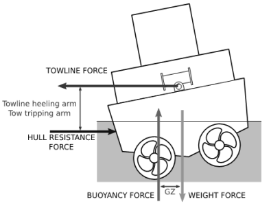

# PART 7 Ships of Special Service (Ch1-4, 7-10)

> RULES FOR CLASSIFICATION OF STEEL SHIPS / RA-07A-E / 2025 / EN / Rules

## CHAPTER 9 TUG BOATS

### Section 1 General

#### 101. Application

- **1.** The construction and equipment of ships intended to be registered as "Tug boat" are to be in accordance with the requirements in this Chapter. The construction and equipment of ships intended to be registered as "Offshore Tug/Supply Ships" are to be in accordance with the requirements of **Ch 8.**
- **2.** The scantlings and arrangements are to be as required by **Pt 3** except as otherwise specifiedin this Chapter. The draught $d$ used for the determination of scantlings is to be not less than 0.85$D$.

### Section 2 Longitudinal Strength

#### 201. General

Longitudinal strength calculations are to be made in accordance with the requirements given in **Pt 3, Ch 3.**

### Section 3 Single Bottoms

#### 301. Floors

Single bottom floors are to be in accordance with the requirements of **Pt 3, Ch 6.**

### Section 4 Panting and Strengthening of Bottom Forward

#### 401. Panting region reinforcement

The arrangements to resist panting required by **Pt 3, Ch 9** do not apply to tug boats less than 46 $\mathrm{m}$ in length. In tug boats 46 $\mathrm{m}$ or more in length, addition stiffening is also to be fitted in the tween decks throughout the panting region.

#### 402. Strengthening of bottom forward

The requirements for strengthening of bottom forward detailed in **Pt 3, Ch 7, Sec 8** do not apply to tug boats.

### Section 5 Machinery Casings

#### 501. Escape hatches

Any emergency exit from the machinery room to the deck is to be capable of being used at extreme angles of heel, and should be positioned as high as possible above the waterline and on or near the ship's centerline. Covers to escape hatches are to have hinges arranged athwartships. Coaming heights are to be at least 600 $\mathrm{mm}$ above the upper surface of the deck.

#### 502. Exposed casings

Exposed machinery casings are to be not less in height than 900 $\mathrm{mm}$ above the upper surface of the deck. Stiffeners to exposed casings are to be connected to the deck or carried through.

### Section 6 Towing Arrangements

#### 601. Towing hooks

- **1.** Towing hooks or equivalent should normally be 5 to 10 percent of the ship's length abaft amidships, but in no circumstances should they be sited forward of the longitudinal center of gravity of the tug boat in any anticipated condition of loading. In addition, the towing hook should be located as low as practicable in order to minimize heeling moments arising in normal working conditions.
- **2.** Towing hooks are to have reliable release slip arrangement which facilitate towline release regardless of the angle of heel. It is recommended that release units should also be operable from the bridge. The arrangements should be tested to the surveyor　s satisfaction. The breaking strength of the hook or its equivalent should generally be 50 percent in excess of that of the towline.

### Section 7 Fenders

#### 701. Ship’s side fenders

An efficient fender is to be fitted to the ship's side at deck level extending all fore and aft.

### Section 8 Towing Winch Emergency Release Systems (2021)

#### 801. General

- **1.** **Scope**
  - **(1)** This Section defines minimum safety standards for winch emergency release systems provided on towing winches that are used on towing ships within close quarters, ports or terminals, including those ships normally not intended for towing operation in transverse direction.
  - **(2)** This Section is not intended to cover towing winches on board ships used solely for long distance ocean towage, anchor handling or similar offshore activities.
- **2.** **Purpose**
  The purpose of this section is to provide requirements to prevent the capsize of a tug boat when in the act of towage as a result of the towline force acting transversely to the tug boat (in beam direction) as a consequence of an unexpected event (could be loss of propulsion/steering or otherwise), whereby the resulting couple generated by offset and opposing transverse forces (towline force is opposed by thrust or hull resistance force) causes the tug boat to heel and, ultimately, to capsize. This capsize may be referred to as “girting”, “girthing”, “girding” or “tripping”. See **Fig 1** which shows the forces acting during towage operations.

  |  |
  | --- |
  | **Fig 1 Force during towing** |
- **3.** **Definitions**
  - **(1)** Emergency release system refers to the mechanism and associated control arrangements that are used to release the load on the towline in a controlled manner under both normal and black out conditions.
  - **(2)** Maximum design load is the maximum load that can be held by the winch as defined by the manufacturer (the manufacturer’s rating).
  - **(3)** Fleet angle is the angle between the applied load (towline force) and the towline as it is wound onto the winch drum, see **Fig 2**.

    |  |
    | --- |
    | **Fig 2 Towline ’fleet angle’** |

#### 802. General requirements

- **1.** The in-board end of the towline is to be attached to the winch drum with a weak link or similar arrangement that is designed to release the towline at low load.
- **2.** All towing winches are to be fitted with an emergency release system.

#### 803. Emergency release system requirements

- **1.** **Performance requirements**
  - **(1)** The emergency release system is to operate across the full range of towline load, fleet angle and ship heel angle under all normal and reasonably foreseeable abnormal conditions (these may include, but are not limited to, the following: vessel electrical failure, variable towline load (for example due to heavy weather), etc.).
  - **(2)** The emergency release system shall be capable of operating with towline loads up to at least 100 % of the maximum design load.
  - **(3)** The emergency release system is to function as quickly as is reasonably practicable and within a maximum of three seconds after activation.
  - **(4)** The emergency release system is to allow the winch drum to rotate and the towline to pay out in a controlled manner such that, when the emergency release system is activated, there is sufficient resistance to rotation to avoid uncontrolled unwinding of the towline from the drum. Spinning (free, uncontrolled rotation) of the winch drum is to be avoided, as this could cause the towline to get stuck and disable the release function of the winch.
  - **(5)** Once the emergency release is activated, the towline load required to rotate the winch drum is to be no greater than:
    - **(A)** the lesser of 5 tonnes or 5 % of the maximum design load when two layers of towline are on the drum, or
    - **(B)** 15 % of the maximum design load where it is demonstrated that this resistance to rotation does not exceed 25 % of the force that will result in listing sufficient for the immersion of the lowest unprotected opening.
  - **(6)** Emergency release of the towline is to be possible in the event of a blackout. For this purpose, where additional sources of energy are required, such sources are to comply with (7).
  - **(7)** The sources of energy required by (6) are to be sufficient to achieve the most onerous of the following conditions (as applicable):
    - **(A)** sufficient for at least three attempts to release the towline (i.e. three activations of the emergency release system). Where the system provides energy for more than one winch it is to be sufficient for three activations of the most demanding winch connected to it.
    - **(B)** Where the winch design is such that the drum release mechanism requires continuous application of power (e.g. where the brake is applied by spring tension and released using hydraulic or pneumatic power) sufficient power is to be provided to operate the emergency release system (e.g. hold the brake open and allow release of the towline) in the event of a blackout for a minimum of five minutes. This may be reduced to the time required for the full length of the towline to feed off the winch drum at the load specified in (5) if this is less than five minutes.
- **2.** **Operational requirements**
  - **(1)** Emergency release operation must be possible from the bridge and from the winch control station on deck. The winch control station on deck is to be in a safe location. A position in close proximity to the winch is not regarded as “safe location”, unless it is documented that the position is at least protected against towline break or winch failure.
  - **(2)** The emergency release control is to be located close to an emergency stop button for winch operation, if provided, and shall be clearly identifiable, clearly visible, easily accessible and positioned to allow safe operability.
  - **(3)** The emergency release function is to take priority over any emergency stop function. Activation of the winch emergency stop from any location is not to inhibit operation of the emergency release system from any location.
  - **(4)** Emergency release system control buttons are to require positive action to cancel, the positive action may be made at a different control position from the one where the emergency release was activated. It must always be possible to cancel the emergency release from the bridge regardless of the activation location and without manual intervention on the working deck.
  - **(5)** Controls for emergency use are to be protected against accidental use.
  - **(6)** Indications are to be provided on the bridge for all power supply and/or pressure levels related to the normal operation of the emergency release system. Alarms are to activate automatically if any level falls outside of the limits within which the emergency release system is fully operational.
  - **(7)** Wherever practicable, control of the emergency release system is to be provided by a hard-wired system, fully independent of programmable electronic systems.
  - **(8)** Computer based systems that operate or may affect the control of emergency release systems are to meet the requirements for Category III systems of **KR Rules Pt 6, Sec 4.**
  - **(9)** Components critical for the safe operation of the emergency release system are to be identified by the manufacturer.

#### 804. Test requirements

- **1.** **General**
  - **(1)** All testing defined within this paragraph is to be witnessed by a Classification Society surveyor.
  - **(2)** For each emergency release system or type thereof, the performance requirements of **803. 1** are to be verified either at the manufacturer’s works or as part of the commissioning of the towing winch when it is installed on board. Where verification solely through testing is impracticable (e.g. due to health and safety), testing may be combined with inspection, analysis or demonstration in agreement with the Society.
  - **(3)** The performance capabilities, as well as instructions for operation, of the emergency release system are to be documented by the manufacturer and made available on board the ship on which the winch has been installed.
  - **(4)** Instructions for surveys of the emergency release system are to be documented by the manufacturer, agreed by the Society and made available on board the ship on which the winch has been installed.
  - **(5)** Where necessary for conducting the annual and special surveys of the winch, adequately sized strong points are to be provided on deck.
- **2.** **Installation trials**
  - **(1)** The full functionality of the emergency release system is to be tested as part of the shipboard commissioning trials to the satisfaction of the surveyor. Testing may be conducted either during a bollard pull test or by applying the towline load against a strong point on the deck of the tug boat that is certified to the appropriate load.
  - **(2)** Where the performance of the winch in accordance with **803. 1** has previously been verified, the load applied for the installation trials is to be at least the lesser of 30 % of the maximum design load or 80 % of vessel bollard pull. 
