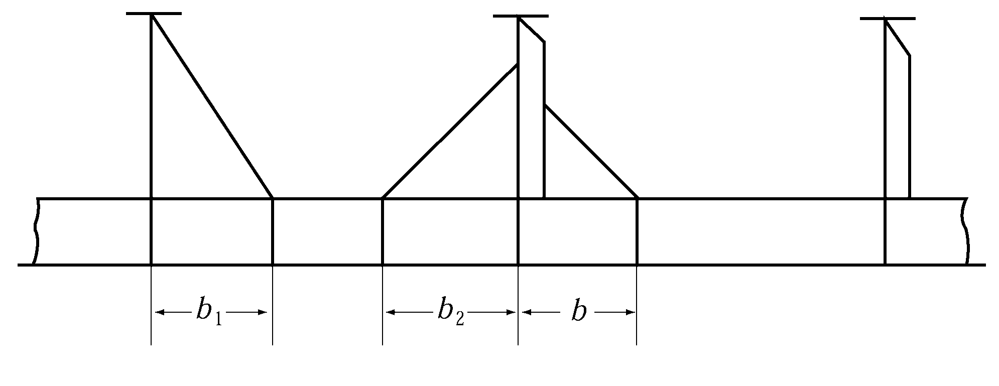

# PART 7 Ships of Special Service (Ch1-4, 7-10)

> RULES FOR CLASSIFICATION OF STEEL SHIPS / RA-07A-E / 2025 / EN / Rules

## CHAPTER 10 DOUBLE HULL TANKER

### Section 1 General

#### 101. Application 【See Guidance】

- **1.** The requirements in this Chapter apply to double hull oil tankers which were contracted for construction on or after 1 April 2006, excluding the vessels which should be applied **Pt 13** (Common Structural Rules for Bulk Carriers and Oil Tankers).
- **2.** The constructions and equipments of ships of 90 $\mathrm{m}$ and above in length which are framed for tankers with machinery aft having one or more longitudinal bulkheads and single decks with double bottom or with double hull structures, intended to be registered and classed as "tanker" and intended to carry crude oil, petroleum products having a vapour pressure (absolute pressure) less than 0.28 $\mathrm{MPa}$ at 37.8 ${}^{\circ}\mathrm{C}$ or other similar liquid cargoes in bulk are to be in accordance with the requirements in this Chapter.
- **3.** In tankers intended to carry liquid cargoes other than crude oil and petroleum products, having the vapour pressure (absolute pressure) less than 0.28 $\mathrm{MPa}$ at 37.8 ${}^{\circ}\mathrm{C}$ and having no hazard as poisonous, corrosive, etc. and moreover less inflammablity than that of crude oil and petroleum products, the structural arrangements and scantlings are to be to the satisfaction of the Society, having regarded to the properties of the cargoes to be carried.
- **4.** In case where the construction differs from that specified in **Par 1** and the requirements in this Chapter are considered to be not applicable, matters are to be determined as deemed appropriate by the Society.
- **5.** As regards matters not specifically provided for in this Chapter, the general requirements for the construction and equipment of steel ships given in the relevant **Pts** are to be applied.
- **6.** In addition to the requirements specified in **Par 5,** the relevant requirements in **Ch 1, Secs l0** to **11** and **Pt 8, Ch 2, Sec 4.** are to be applied to ships specified in **Par 2.**
- **7.** Notwithstanding the each requirement, the application of below requirements may be exempted in accordance with the requirement of flag state.
  - **(1)** **102. 2.** and **7.**
  - **(2)** **904.**

#### 102. Location and separation of spaces 【See Guidance】

- **1.** In cargo oil spaces, the standard arrangement of bulkheads is to be such that the interval between longitudinal bulkheads or transverse bulkheads does not exceed $1.2\sqrt{L} \mathrm{m}$.
- **2.** Cofferdams are to be provided in accordance with the following (1) to (3) :
  - **(1)** Cofferdams of air-tight construction and not to be less than 600 $\mathrm{mm}$ in width access are to be provided at fore and aft terminations of cargo oil spaces and the space between cargo space and accommodation space. Where, however, for oil tankers intended to carry cargo oil having a flash point above 60 ${}^{\circ}\mathrm{C}$ this requirements may be suitably modified.
  - **(2)** Cofferdams specified in (1) may be used as pump rooms.
  - **(3)** Fuel oil or ballast water tanks may be concurrently used as the cofferdams to be provided between cargo oil tanks and fuel oil or ballast tanks, subject to the approval by the Society.
- **3.** Passageways leading to cargo areas are to be provided in accordance with the following (1) to (4):
  - **(1)** Access to cofferdams, ballast tanks, cargo oil tanks and any other spaces in the cargo area are to be direct from the open deck and such as to ensure their complete inspection. Access to double bottom spaces may be through a cargo pump room, pump room, deep cofferdam, pipe tunnel or similar compartments, subject to consideration of ventilation aspects.
  - **(2)** For access through horizontal openings, hatches or manholes, the dimensions are to be sufficient to allow a person wearing a selfcontained air breathing apparatus and protective equipment to ascend or descend any ladder without obstruction and also to provide a clear opening to facilitate the hoisting of an injured person from the bottom of the spaces. The minimum clear opening is not to be less than 600 $\mathrm{mm}$ × 600 $\mathrm{mm}$.
  - **(3)** For Access through vertical openings, or manholes providing passage through the length and breadth of the space, the minimum clear opening should be not less than 600 $\mathrm{mm}$ × 800 $\mathrm{mm}$ at a height of not more than 600 $\mathrm{mm}$ from the bottom shell plating unless grating or other footholds are provided.
  - **(4)** For tankers with a deadweight tonnage of less than 5000 tons, smaller dimension of minimum clear opening specified in (2) and (3) may be approved by the Society in special circumstances, if the ability to traverse such openings or to remove an injured person can be proved to the satisfaction of the Society.
- **4.** **Air-tight bulkheads**
  All areas, where cargo oil pumps and cargo oil piping are provided, are to be segregated by an air-tight bulkhead from areas where stoves, boilers, propelling machinery, electric installations other than those of explosion-proof type in accordance with the requirements in **Pt 6, Ch 1, Sec 9** where source of ignition is normally present. Where, however, for oil tankers carrying cargo oil having a flash point above 60${}^{\circ}\mathrm{C}$, the requirements may be suitably modified.
- **5.** **Ventilations**
  Ventilation inlets and outlets are to be arranged so as to minimize the possibilities of vapours of cargoes being admitted to an enclosed space containing a source of ignition, or collecting in the vicinity of deck machinery and equipment which may constitute an ignition hazard. Especially, opening of ventilation for machinery spaces are to be situated as far afterwards apart from the cargo spaces as practicable.
- **6.** Ullage openings, sighting ports and tank cleaning opening are not to be arranged in enclosed spaces.
- **7.** **Openings in superstructure and deckhouse**
  The arrangement of openings on the boundaries of superstructures and deckhouse are to be such as to minimize the possibility of accumulation of vapours of cargoes. Due consideration in this regard is to be given for the openings in superstructures and deckhouse when the ship is equipped with cargo piping to load or unload at the stern. The scuttles to the poop front or other similar walls are to be of fixed type.
- **8.** **Pipe duct in double bottom**
  Pipe ducts in the double bottom shall comply with the following requirements :
  - **(1)** They should not communicate with the engine room.
  - **(2)** Provision shall be made for at least two exits to the open deck arranged at a maximum distance from each other. One of these exits fitted with a watertight closure may lead to the cargo pump room.
  - **(3)** In the duct, provision shall be made for adequate mechanical ventilation.
  - **(4)** For ships to which the convention applies, refer to **SOLAS 1974(as amended) Regulation II-2/4.5.2.4.**

#### 103. Minimum thickness

- **1.** The thickness of structural members in cargo oil tanks and deep tanks such as bulkhead plating, floors, transverse girders including struts and their end brackets is not to be less than the value determined from **Table 7.10.1** according to the Length of Ship. **【See Guidance】**
- **2.** The thickness of structural members other than **Par 1** in cargo oil tanks and deep tanks is not to be less than 7 $\mathrm{mm}$.

  **Table 7.10.1 Minimum thickness**

  | $L \mathrm{m}$ | and over |   | 105 | 120 | 135 | 150 | 165 | 180 | 195 | 225 | 275 | 325 | 375 |
  | --- | --- | --- | --- | --- | --- | --- | --- | --- | --- | --- | --- | --- | --- |
  | $L \mathrm{m}$ | and under | 105 | 120 | 135 | 150 | 165 | 180 | 195 | 225 | 275 | 325 | 375 |   |
  | Thickness($\mathrm{mm}$) |   | 8.0 | 8.5 | 9.0 | 9.5 | 10.0 | 10.5 | 11.0 | 11.5 | 12.0 | 12.5 | 13.0 | 13.5 |

#### 104. Direct strength calculation

Where approved by the Society, the scantlings of structural members may be determined basing upon direct strength calculation defined in **Pt 3, Ch 1, 206.** Notwithstanding the results of direct strength calculation, where, however, this is not to be applied to the minimum thickness specified in **103.** and the special requirements for corrosion specified in **605.** to **607.**

#### 105. Symbols

The definition of symbols used in this Chapter otherwise specified, are to be in accordance with following :
$L'$ = length of ship ($\mathrm{m}$). Where, however, $L$ exceeds 230 m, $L'$ is to be taken as 230 $\mathrm{m}$.
$l$ = span of stiffeners, longitudinals, frames, transverses or girders ($\mathrm{m}$).
$S$ = spacing of stiffeners, longitudinals, frames, transverses or girders ($\mathrm{m}$).
$C_1$ = coefficients determined according to values of $L$ as specified below :
$C_1$ = 1.0 where $L$ is 230 $\mathrm{m}$ and under,

- **1.** 07 where $L$ is 400 $\mathrm{m}$ and above.
  For intermediate values of $L$, $C_1$ are to be obtained by linear interpolation.
  $C_1 '$ = coefficients determined according to values of $L$ as specified below :
  $C_1 '$ = 1.0 where $L$ is 230 $\mathrm{m}$ and under,
- **1.** 2 where $L$ is 400 $\mathrm{m}$ and above.
  For intermediate values of $L$*,* $C_1 '$ are to be obtained by linear interpolation.
  $f_D$ and $f_B$ = section modulus ratios are as following formulae, $f_B$, however, is not to be less than 0.85 or 0.0015$L$ + 0.5, whichever is the lesser.
  $f_D = \frac{Z_DM _req}{Z_D _act} f_B = \frac{Z_BM _req}{Z_B _act}$
  $Z _DM _req$ and $Z _BM _req$ = section modulus at the deck and bottom of transverse sections of the hull determined to the requirements in **Ch 3, 201.** respectively, when mild steel material symbol A, B, D and E specified in **Pt 2, Ch 1, 301. Par 1** is used ($\mathrm{cm}^3$).
  $Z _D _act$ and $Z _B _act$ = actual section modulus at the deck and bottom of transverse sections of the hull respectively. ($\mathrm{cm}^3$)
  $\alpha$ = either $\alpha_1$ or $\alpha_2$ according to value of $y$. However, value of $\alpha$ is not to be less than $\alpha_3$.
  $\alpha_1 = 15.0 f_D \left( { \frac{y-y_B}{Y '} \right) for y \geq y_B$
  $\alpha_2 = 15.0 f_B \left( { \frac{y_B - y}{y_B}} \right) for y < y_B$
  $\alpha_3 = \beta \left( { \frac{B - 2b}{B}} \right)$
  $y$ = distance from the top of keel to the lower edge of plating when the platings under consideration are under $y_B$, to the upper edge of plating when the platings under consideration are above $y_B$ and to the longitudinals stiffener under consideration for longitudinal stiffener, respectively ($\mathrm{m}$).
  $y_B$ = distance from the top of keel to the horizontal neutral axis of transverse section amidship ($\mathrm{m}$).
  $Y '$ = the greater of the value specified in **Pt 3, Ch 3, 203.,** (5), (a) or (b).
  $\beta$ = coefficient determined according to the values of $L$ as specified below: For intermediate values of $L$, the value of b is to be determined by linear interpolation:
  $\beta$ = 6.0 when $L$ is 230 $\mathrm{m}$ and under,
- **10.** 5 when $L$ is 400 $\mathrm{m}$ and above.
  $a$ = $\sqrt { K}$ when high tensile steels are used for not less than 80 $\%$ of side shell platings at the transverse section amidship and 1.0 for other parts.
  $b$ = horizontal distance from the side shell plating to the longitudinal bulkhead plating under consideration ($\mathrm{m}$).

#### 106. Stability Instrument

The requirements of stability Instrument comply with **Ch 1, Sec. 1, 110.**

### Section 2 Bulkhead Plating

#### 201. Bulkhead plating in cargo oil tanks and deep tanks (2020) 【See Guidance】

- **1.** The thickness of bulkhead plating is not to be less than the greatest of the values obtained from the following formula.
  $t_1 = C_1 C_2 S \sqrt { h} +2.5 \mathrm{mm}$
  where:
  $h$ = water head of $h_1$, $h_2$ or $h_3$ is obtained from **Table 7.10.2.** When the tank use the flow-through ballast water exchange operations method, $h_4$ and $h_5$ are to be additionally considered. *(2020)*
  $C_2$ = coefficients is obtained from **Table 7.10.3.**
  $C_1$ and $S$ = as specified in **105.**
- **2.** In determining the thickness of longitudinal bulkhead plating, coefficient $C_2$ for $h_1$ may be gradually reduced for the parts forward and aftward the midship part, and it may be taken as 3.6$\sqrt K$ in calculations at 0.1$L$ from fore end and aft end.

#### 202. Swash Bulkheads 【See Guidance】

- **1.** Stiffeners and girders of swash bulkhead are to be of sufficient strength considering the size of tanks and opening ratios.
- **2.** The thickness of swash bulkhead plating is not to be less than that obtained from the following formula :
  $t = 0.3 S \sqrt { K(L+150 )　} + 2.5 \mathrm{mm}$
  where:
  $S$ = as specified in **105.**
- **3.** In determining the thickness of swash bulkhead plating, sufficient consideration is to be given for buckling.

#### 203. Trunks

The thickness of trunk top and side plating are to be determined applying the requirements in **201.** in addition to the requirements in **Pt 3, Ch 5.**

**Table 7.10.2 Water head** $h$ ***(2020)***

|   | Cargo oil tanks |   | Deep tanks |
| --- | --- | --- | --- |
| $h_1$ | Vertical distance from the lower edge of the bulkhead plating under consideration to the top of hatchway. For side shell plating, a water head corresponding to the minimum draught amidship $d_\min$ ($\mathrm{m}$*)* under all operating conditions of the ship may be deducted therefrom. The deductible water head at the top of keel is to be $d_\min$, value at point $d_\min$ above the top of keel, 0, and value at an intermediate point is to be obtained by linear interpolation. |   | Vertical distance from the lower edge of the bulkhead plating under consideration to the mid-point between the point on tank top and the upper end of the overflow pipe. For side shell plating, a water head corresponding to the minimum draught amidship $d_\min$ ($\mathrm{m}$*)* under all operating conditions of the ship may be deducted therefrom. The deductible water head at the top of keel is to be $d_\min$, value at point $d_\min$ above the top of keel, 0, and value at an intermediate point is to be obtained by linear interpolation |
| $h_2$ | As obtained from the following formula $h_2 = 0.85(h_1 + \Delta h)$ where: $\Delta h$ = additional water head given by the following formula; For $L$-type, $U$-type etc. of tanks, $\Delta h$ is to be determined as deemed appropriate by the Society $\Delta h = \frac{16}{L} (l_t - 10) + 0.25 (b_t - 10 )$ $l_t$ = tank length ($\mathrm{m}$), 10, when less than 10 $\mathrm{m}$*.* $b_t$ = tank breadth ($\mathrm{m}$), 10, when less than 10 $\mathrm{m}$ |   |   |
| $h_3$ | $h_3 = 0.3 \sqrt { L} \mathrm{m}$ | Value ($\mathrm{m}$) obtained by multiplying 0.7 by vertical distance from the lower edge of the bulkhead plating under consideration to the point 2.0 $\mathrm{m}$ above the top of overflow pipe.. |   |
| $h_4$ | - | Vertical distance from the lower edge of the bulkhead plating under consideration to the top of the overflow pipe (or air pipe) to the point where the overpressure is added ($\mathrm{m}$). (Overpressure : due to sustained liquid flow through overflow pipe in case of overfilling or filling during flow through ballast water exchange. It is to be defined by the designer, but not to be less than 2.5.) |   |
| $h_5$ | - | $0.85 (h_4 + \Delta h)$ $\Delta h$ : as specified in $h_2$ |   |

**Table 7.10.3 Coefficient** $C_2$ ***(2024)***

| For $h_1$ | longitudinal bulkhead of longitudinal framing | longitudinal bulkhead of transverse framing |
| --- | --- | --- |
| For $h_1$ | $C_2 = 13.4 \sqrt { \frac{K}{27.7 - \alpha K}}$ | $C_2 = 100 \sqrt { \frac{K}{767 - \alpha^2 K^2}}$ |
| For $h_1$ | minimum : $3.2 \sqrt {K}$ |   |
| For $h_2$ or $h_3$ and for transverse bulkhead | $C_2 = 3.6 sqrtK$ |   |

### Section 3 Longitudinals and Stiffeners

#### 301. Longitudinals

- **1.** The section modulus of bottom longitudinals is not to be less than the value obtained from the formula in **Table 7.10.4.**
- **2.** The section modulus of side longitudinals including bilge longitudinals is not to be less than the value obtained from the formula in **Table 7.10.4.** The section modulus, however, need not exceed that of bottom longitudinals specified in **Table 7.10.4,** but is not to be less than that obtained from the following formula :
  $Z = 2.9K \sqrt{L}S l^2 \mathrm{cm^3 }$
  where:
  $S$ and $l$ = as specified in **105.**

  **Table 7.10.4 Section modulus of bottom and side longitudinal**

  | longitudinals | section modulus ($\mathrm{cm}^3$) |
  | --- | --- |
  | Bottom longitudinals | $Z = 100C_1 C_2 S h l^2$ |
  | Side longitudinals including bilge longitudinals | $Z = 100C_1 C_2 S h l^2$ |
  | $h$ = distance from the longitudinals under consideration to the $h'$ ($\mathrm{m}$). $C_2$ and $h'$ = as given in following table **Table 7.10.5 Coefficient** $C_2$ Bulkhead and framing systems ; $C_2$ Longitudinal bulkhead of longitudinal framing system ; $C_2 = \frac{K}{24 - \alpha K}$ minimum $C_2 = \frac{K}{18}$ Longitudinal bulkhead of transverse framing system, transverse bulkhead ; $C_2 = \frac{K}{18}$ $\alpha$ = as specified in **105.** $h'$ $C_2$ Bottom longitudinals $h' = d+ 0.026L'$ $C_2 = \frac{K}{24 - 15.0 f_B K}$ Side longitudinals including bilge longitudinals $h' = d+ 0.038L'$ $C_2 = \frac{K}{24 - \alpha K}$ $C_1$, $S$, $l$, $L'$, $\alpha$ and $f_B$ = as specified in **105.** |   |
  | **Table 7.10.5 Coefficient** $C_2$ |   |
  | Bulkhead and framing systems | $C_2$ |
  | Longitudinal bulkhead of longitudinal framing system | $C_2 = \frac{K}{24 - \alpha K}$ minimum $C_2 = \frac{K}{18}$ |
  | Longitudinal bulkhead of transverse framing system, transverse bulkhead | $C_2 = \frac{K}{18}$ |
  | $\alpha$ = as specified in **105.** |   |
- **3.** For the parts forward and aftward of midship part, the scantlings of longitudinals may be gradually reduced and at 0.1$L$ from fore end and aft end they may be reduced by 15 $\%$ of the value obtained from the requirements in **Pars 1** and **2.** In no case, however, are the scantlings of longitudinals to be less than those required in **Pars 1** and **2** for the part between a point 0.15$L$ from the fore end and the collision bulkhead.
- **4.** For side longitudinals, sufficient consideration is to be given for fatigue strength. **【See Guidance】**
- **5.** In addition to the requirements in **Pars 1** to **4,** the beams or longitudinals on deck or side shell consisting of deep tanks should comply with the requirements in **302.**

#### 302. Bulkhead stiffeners in cargo oil tanks and deep tanks (2020)

- **1.** Section modulus of stiffeners is not to be less than that obtained from the following formula :
  $Z = 125C_1 C_2 C_3 S h l^2 \mathrm{cm^3 }$
  Where:
  $h$ = water head $h_1$, $h_2$ or $h_3$ as specified in **Table 7.10.2.** Where, however, "the lower edge of the bulkhead plating under consideration" is to be construed as "the mid-point of the stiffener under consideration" for vertical stiffeners and as "the stiffener under consideration" for horizontal stiffeners. And "side shell plating" is to be construed as "stiffener attached to side shell plating". When the tank use the flow-through ballast water exchange operations method, $h_4$ and $h_5$ as specified in **201.** are to be additionally considered. ***(2020)***
  $C_2$ = value obtained from following formula. The value $C_2$ for $h_1$, however, is to be as obtained from the formula in **Table 7.10.5.**
  $C_2 = \frac{K}{18}$
  $C_3$ = as determined from **Table 7.10.6** according to the fixity condition of stiffener ends;
  $C_1$, $S$ and $l$ = as specified in **105.**

  **Table 7.10.5 Coefficient** $C_2$

  | Bulkhead and framing systems | $C_2$ |
  | --- | --- |
  | Longitudinal bulkhead of longitudinal framing system | $C_2 = \frac{K}{24 - \alpha K}$ minimum $C_2 = \frac{K}{18}$ |
  | Longitudinal bulkhead of transverse framing system, transverse bulkhead | $C_2 = \frac{K}{18}$ |
  | $\alpha$ = as specified in **105.** |   |

  **Table 7.10.6 Coefficient** $C_3$

  | One end of stiffener The other end of stiffener | Connection be hard bracket | Connection be soft bracket | Supported by rule girder or lug connection | Snip |
  | --- | --- | --- | --- | --- |
  | Connection be hard bracket | 0.70 | 1.15 | 0.85 | 1.30 |
  | Connection be soft bracket | 1.15 | 0.85 | 1.30 | 1.15 |
  | Supported by rule girder or lug connection | 0.85 | 1.30 | 1.00 | 1.50 |
  | Snip | 1.30 | 1.15 | 1.50 | 1.50 |
  | 1. Connection by hard bracket is a connection by bracket to the double bottoms or to the adjacent members, such as longitudinals or stiffeners in line, of the same or larger sections, or a connection by bracket to the equivalent members mentioned above. (See **Fig 3.14.2** (a)) 2. Connection by soft brackets is a connection by bracket to the transverse members such as beams or equivalent thereto. (See **Fig 3.14.2** (b)) |   |   |   |   |
- **2.** For the parts forward and aftward of midship part in determining the section modulus of stiffeners attached to longitudinal bulkhead of longitudinal framing systems, coefficient $C_2$ for $h_1$ may be gradually reduced, and at the end parts $C_2$ may be as $K$/18.

#### 303. Buckling strength

- **1.** Buckling strength of longitudinal frames, beams and stiffeners is to be in accordance with the requirements (1) to (3) below. In case where the Society specially considers necessary according to the materials, scantling, geometries and the point of arrangement of these structural members, detailed assessment may be required.
  - **(1)** Longitudinals beams, side longitudinals attached to sheer strakes and longitudinal stiffeners attached to the longitudinal bulkhead within 0.1$D$ from the strength deck are to have a slenderness ratio not exceeding 60 at the midship part as far as practicable.
  - **(2)** As for flat bars used for longitudinal beams, frames and stiffeners, the ratio of depth to thickness is not to exceed 15.
  - **(3)** The full width of face plate of longitudinal beams, frames and stiffeners is not to be less than that obtained from the following formula:
    $b = 2.2 \sqrt {d_0 l} \mathrm{mm}$
    where :
    $d_0$ = depth of web of longitudinal beam, frame or stiffener ($\mathrm{mm}$).
    $l$ = as specified in **105.**
- **2.** In case where assembled members, special shape steels or flanged plates are used for frames, beams or stiffeners in cargo oil tanks and deep tanks whose scantlings are specified only in terms of section modulus, the thickness of web is intended to be greater than the required level due to reasons other than strength, it may be suitably modified.
  $t = 0.015 k_0 d_0 + 2.5 \mathrm{mm}$
  where:
  $d_0$ = depth of web ($\mathrm{mm}$).
  $k_0$ = coefficient according to the location of stiffeners as given **Table 7.10.7.**

  **Table 7.10.7 Coefficient** $k_0$

  | Locations | $k_0$ |
  | --- | --- |
  | Bottom longitudinals located not more tha n 0.25$D$ above top of keel | $k_0 = \sqrt { 0.25 \left( { 3f_B +\frac{1}{K}} \right) }$ |
  | Deck longitudinals located not less than 0.25$D$ below deck | $k_0 = \sqrt { 0.25 \left( { 3f_D +\frac{1}{K}} \right) }$ |
  | Other structural members | $k_0 = \sqrt { 0.25 \left( { 3 + \frac{1}{K}} \right) }$ |

### Section 4 Girders

#### 401. General

- **1.** The double bottom and double side hull structures and arrangements and scantlings of girders in cargo oil spaces are to be determined based upon direct strength calculations.
- **2.** Notwithstanding the requirement in **Par 1,** when approved by the Society, the scantlings of these girders may be determined in accordance with the requirements in **403.** to **407.** provided that the arrangements of girders in the double bottom, double side hull and cargo oil tank at cargo oil spaces are determined referring to the structural types shown in following (1) to (5) as the standard: **【See Guidance】**
  - **(1)** The height of double bottom at cargo oil spaces is not to be less than $B/20 \mathrm{m}$.
  - **(2)** The width of double side hull is not to be less than $D/9 \mathrm{m}$.
  - **(3)** In double bottoms at cargo oil spaces, girders are to be provided at a spacing not exceeding 0.9$\sqrt {l_t } \mathrm{m}$ and floors are to be provided at a spacing not exceeding 0.55$\sqrt {B} \mathrm{m}$ or 0.75$\sqrt {D} \mathrm{m}$, whichever is smaller. $l_t$ is the length of a cargo hold ($\mathrm{m}$).
  - **(4)** In double side hull, stringer are to be provided at a spacing not exceeding 1.1$\sqrt {l_t } \mathrm{m}$.
  - **(5)** Transverse in double side hull and girders in cargo oil tanks and deep tanks are to be provided at positions on floors in double bottoms.

#### 402. Direct strength calculation of girders 【See Guidance】

The structural models, loads, allowable stress levels, etc. for determining the arrangement of girders and scantling based upon direct strength calculation are to as deemed appropriate by the Society.

#### 403. Scantlings of girders and floors in double bottom 【See Guidance】

The scantling of girders and floors in double bottom are to be as deemed appropriate by the Society.

#### 404. Scantlings of stringers and transverse in double side hull 【See Guidance】

The scantling of stringers and transverse in double side hull are to be as deemed appropriate by the Society.

#### 405. Girders and transverse in cargo oil tanks and deep tanks (2020) 【See Guidance】

- **1.** The section modulus of girders is not to be less than that obtained from the following formula :
  $Z = 7.13 C_1 ' k^2 KS h l^2 \mathrm{cm^3 }$
  Where:
  $h$ = waterhead $h_1$, $h_2$ or $h_3$ as specified in **Table 7.10.2.** whichever is the greatest. Where, however, "from the lower edge of the bulkhead plating under consideration" is to be construed as "from the mid-point of $S$" for horizontal girders, and as "from the mid-point of $l$" for vertical girders in applying the value of $h$. When the ship use the flow-through ballast water exchange operations method, $h_4$ and $h_5$ as specified in **201.** are to be additionally considered. ***(2020)***
  $k$ = correction factor for brackets, and to as obtained from the following formula:
  $k = 1 - \frac{0.65 (b_1 + b_2 )}{l}$
  $b_1$ and $b_2$ = arm length of brackets at respective ends to be girders and transverses ($\mathrm{m}$).
  $C _{1}'$, $S$ and $l$ = as specified in **105.**
- **2.** The moment of inertia of girders is not to be less than that obtained from the following formula. However, in no case is the depth of girders to be less than 2.5 times the depth of slots.
  $I = 30 h l^4 \mathrm{cm^4 }$
  Where:
  $h$ and $l$ = as specified in **Par 1.**
- **3.** The thickness of girders is not to be less than the greatest of the following $t_1$, $t_2$ or $t_3$ :
  $t_1 = 41.7 \frac{C_1 ' C_2 K S h l}{d_1} + 2.5 \mathrm{mm}$
  $t _{2} =0.174 root {3} of {\frac{C_1 ' C_2 S h l S_1^2}{d_1}} +2.5 \mathrm{mm}$
  $t_3 = 0.01S_1 +2.5 \mathrm{mm}$
  Where:
  $h$ = as specified in **Par 1.**
  $S_1$ = spacing of stiffeners of girders or the depth of girders, whichever is the smaller ($\mathrm{mm}$).
  $d_1$ = depth of the girder under consideration ($\mathrm{mm}$) subtracting the depth of openings.
  $C_2$ = coefficient as obtained from the following formula. In no case is it to be less than 0.5 :
  Vertical girder : $C _{2} = \left| 1- \frac{2x}{l} \right|$
  Horizontal girder : $C _{2} = \left| 1+ \frac{0.2 l}{h} - \left( 2+ \frac{l}{h} \right) \frac{x}{l} + \frac{l}{h} \left( \frac{x}{l} \right) ^{2} \right|$
  Where:
  $x$ = distance from the end of $l$ to the sectional area under consideration($\mathrm{m}$), and from the lower end for vertical girders.
  $C_1 '$, $S$ and $l$ = as specified in **105.**
- **4.** Where, the stiffeners are provided within the effective width, they may be included in the effective steel plates for calculating actual moment of inertia of girders and section modulus.
- **5.** The thickness of webs at the root of struts for girders and transverse in case where struts are provided, is not to be less than that obtained from following formula. Where slots are provided in bs at the root of struts, they are to be covered effectively with collar plates.
  $t = 16S_1 \sqrt { \frac{C_1 ' S b_s h_s}{A}} \mathrm{mm}$
  Where:
  $b_s$ = width supported by struts ($\mathrm{m}$).
  $h_s$ = distance from mid-point of $b_s$ to the point of $d + 0.038L'$ above top of keel ($\mathrm{m}$).
  $S_1$ = spacing of stiffeners provided depthwise on the web plates of transverses at the portion where cross ties are connected ($\mathrm{m}$).
  $C_1 '$ and $S$ = as specified in **105.**
  $A$ = as specified in **Ch 1, 403.** (1).
- **6.** The thickness of face plates forming a girder is to be greater than the thickness of web, and the total width is not to be less than that obtained from the following formula :
  $b = 2.7 \sqrt { d_0 l '}$
  where:
  $d_0$ = depth of girder ($\mathrm{mm}$)
  $l '$ = distance between supporting points of girders ($\mathrm{m}$). Where, however, if effective tripping brackets are provided, they may be regarded as supporting points.

#### 406. Girders of ships without double side hull

- **1.** In addition to the requirements in **405.,** depth of side transverse $d_0$ and section modulus of transverse $Z$ are not to be less than those obtained from the following formula :
  $d _{0} =150 l \mathrm{mm}$
  $Z=8.7k ^{2} K S h l ^{2} \mathrm{cm ^{3} }$
  Where:
  $h$ = distance from mid-point of l to the point $d + 0.038L'$ above top of keel ($\mathrm{m}$)
  $k$, $l$ and $S$ = as specified in **405. 1.**
- **2.** The scantlings of deck transverses are to as given in (1) and (2) below :
  - **(1)** Section modulus of deck transverse of a ship without trunks is not to be less than that obtained from the following formula :
    $Z = 3k^2 K S \sqrt { L}l^2 \mathrm{cm^3 }$
    Where:
    $k$, $l$ and $S$ = as specified in **405. 1.**
  - **(2)** For ships with trunks, the construction of providing continuous deck transverses across the trunk is to be considered as the standard. In this case, the depth of deck transverses that can be regarded as those supported by trunks may be 0.03$B$.
- **3.** For transverses provided on the centreline bulkhead, the section modulus $Z$ and depth $d_0$ of deck transverses are to be less than those obtained from the following formula :
  $d 0 =120 l \mathrm{mm}\#
  \#
  Z=7.0k 2 K S h l 2 \mathrm{cm 3 }$
  Where:
  $k$, $l$, $S$ and $h$ = as specified in **Par 1.**

#### 407. Stiffeners attached to girders in cargo oil tanks and deep tanks

The thickness of flat bar stiffeners and tripping brackets provided on girders and transverses is not to be less than that obtained from the following formula. However, it needs not exceed the thickness of webs of the girder to which they are provided.
$t = 0.5 \sqrt { L} + 2.5 \mathrm{mm}$

#### 408. Cross ties

- **1.** Cross ties in ships having two or more rows of longitudinal bulkheads, where they are effectively connected with longitudinal bulkhead transverses in cargo oil tanks are to be in accordance with this requirements.
- **2.** The sectional area of cross ties interconnecting longitudinal bulkhead transverses in cargo oil tanks is not to be less than that obtained from the following formula :
  $A = C_1 ' C_2 K S b_s h \mathrm{cm^2 }$
  Where:
  $b_s$ = as specified in **405. 5.**
  $h$ = $h_s$ where cross ties are provided in wing cargo oil tanks, vertical distance from mid-point of $b_s$ to top of hatchways of adjacent cargo oil tanks where struts are provided in centre cargo oil tanks ($\mathrm{m}$).
  $C_2$ = coefficient obtained from the following formula, in no case, however, is to be less than 1.1
  $C_2 = { 0.77 } OVER { 1 - 0.5 \frac{l}{k}$
  $l$ = length of cross ties between the inner surface of longitudinal bulkhead transverses ($\mathrm{m}$).
  $k$ = as given below : $k = \sqrt { \frac{I}{A}}$
  $I$ = moment of inertia of cross ties ($\mathrm{cm}^4$).
  $A$ = sectional area of cross ties ($\mathrm{cm}^2$)
  $C_1 '$ and $S$ = as specified in **105.**

### Section 5 Structural Details

#### 501. General 【See Guidance】

- **1.** The principal structural members are to be arranged so that continuity of strength can be secured throughout the cargo area. In forward and afterward parts of the cargo area, the structures are to be effectively strengthened so that continuity of strength is not impaired sharply.
- **2.** For the principal structural members, sufficient consideration is to be given for fixity at ends, supporting and stiffening systems against out-of-plane deflections and the construction is to minimize local stress concentration.

#### 502. Frames and stiffeners

Longitudinal beams, frames and stiffeners are to be of continuous structures, or to be connected securely so that their sectional area at ends can be properly maintained providing sufficient resistance against bending moments.

#### 503. Girders and cross ties 【See Guidance】

- **1.** Girders provided within the same are to be arranged to avoid sharp changes in strength and rigidity, and brackets in suitable size are to be provided at the ends of girders, and bracket toes are to be sufficiently rounded.
- **2.** In case where the depth of longitudinal girders is large, stiffeners are to be arranged in parallel with face plates.
- **3.** Brackets are to be provided at the ends of cross ties to connect to transverses or girders.
- **4.** Transverses and vertical webs are to be provided with tripping at the junctions with cross ties.
- **5.** Where breadth of face plates forming cross ties exceeds 150 $\mathrm{mm}$ on one side of the web, stiffeners are to be provided at proper interval to support the face plates as well.
- **6.** Tripping brackets are to be provided on the web plate transverses at the inner edge of end brackets and at the connecting part of cross ties, etc. and also at the proper interval in order to support transverses effectively. In case where the width of face plates of each girder exceeds 180 $\mathrm{mm}$ on one side, the tripping brackets shown above are to support face plates as well.
- **7.** Webs for the upper and lower end brackets of side transverses and longitudinal bulkhead transverses and areas in the vicinity of their inner ends and those in the vicinity of the roots of cross ties are to be stiffened specially with closer spacing.

### Section 6 Special Requirements for Corrosion

#### 601. Thickness of shell plating

- **1.** The thickness of shell plating forming casing cargo oil tanks planned to carry ballast water in ships without double side hull is not to be less than a thickness added with 0.5 $\mathrm{mm}$ to that obtained from the formula given in **Pt 3, Ch 4.**
- **2.** The thickness of shell plating when applying the requirements of this Chapter may be reduced with 0.5 $\mathrm{mm}$ from the thickness obtained from the formula given in **201.**

#### 602. Thickness of deck plating

- **1.** The thickness of freeboard deck plating when applying the requirements of this Chapter may be reduced with 0.5 $\mathrm{mm}$ from the thickness obtained from the formula given in **201.**
- **2.** The thickness of the freeboard deck plating in spaces carrying cargo oil when applying the requirements in **Pt 3, Ch 5,** is not to be less than a thickness added with 0.5 $\mathrm{mm}$ to that obtained from the formula given in **Pt 3, Ch 5.**

#### 603. Thickness of tank top plating

The thickness of tank top plating in cargo oil tanks and deep tanks is not to be less than the thickness corresponding to that obtained from the formula given in **201.** added by 1.0 $\mathrm{mm}$. Such an addition, however, is not required for the thickness of inner bottom plating.

#### 604. Section moduli of longitudinal beams, frames and stiffeners

- **1.** The section modulus of longitudinal beams provided on deck plating forming casing cargo oil tanks is not to be less than 1.1 times that calculated according to the requirements of **Pt 3, Ch 10.**
- **2.** The section modulus of frames and stiffeners provided on shell plating and bulkheads forming cargo oil tanks planned to carry also ballast water, except the tank to carry ballast water only in heavy weather conditions, is not to be less than 1.1 times that calculated in accordance with the requirements **301.** and **302.**

#### 605. Thickness of plate members in ballast tanks adjacent to cargo oil tanks

- **1.** The thickness of bulkhead plating at the boundaries between ballast tanks and cargo oil tanks is not to be less than the thickness specified in **103.** added by 1.0 $\mathrm{mm}$.
- **2.** In case where the adjacent cargo oil tanks are equipped with heating systems, the thickness of bulkhead plating at the boundaries between ballast tanks and cargo oil tanks is not to be less than the thickness determined from **Par 1** added by 1.0 $\mathrm{mm}$.

#### 606. Thickness of deck plating in cargo oil tanks

The thickness of deck plating in cargo oil tanks is not to be less than the thickness specified in **103.** added by 1.0 $\mathrm{mm}$.

#### 607. Thickness of inner bottom plating in cargo oil tanks 【See Guidance】

- **1.** The thickness of inner bottom plating of cargo oil tanks is to be sufficient considering the effects of pitting corrosion.
- **2.** The thickness of inner bottom plating in the vicinity of suction bell mouths in cargo oil tanks, and the thickness of suction well, when provide, are not to be less than the thickness obtained by the requirements in **201.** for the appropriate area of application added by 2.0 $\mathrm{mm}$.

### Section 7 Special Requirements for Forward Wing Tanks

#### 701. Application

For tankers of not less than 200 $\mathrm{m}$, in length, the structural members in wing tanks which become empty in full loaded condition for spaces from a point 0.15$L$ from the fore end to the collision bulkhead are to comply with the requirements in this Section as well as the requirements in each previous Articles concerned.

#### 702. Side longitudinal

- **1.** The section modulus of side longitudinals is not to be less than that obtained from the following formula :
  $Z = 9C_1 K S h l^2 \mathrm{cm^3 }$
  Where :
  $h$ = distance ($\mathrm{m}$) from the longitudinals under consideration to the point $0.7 d + 0.05 L$ above top of keel. Where, however, in no case is $h$ to be less than obtained from the following formula ($\mathrm{m}$);
  $h_\min = 0.2 \sqrt{L} + 0.03 L$
  $C_1$, $S$ and $l$ = as specified in **105.**
- **2.** In case where side longitudinals are connected to transverses by brackets, the section modulus may be determined by multiplying the value obtained from the following formula by the value obtained from the formula specified in **Par 1 :**
  $(1-C ) ^2$
  Where:
  $C$ = as obtained from the following formulae:
  where brackets are provided at both ends $C = \frac{b_1 + b_2 - 0.3}{l}$
  where a bracket is provided at one end $C = \frac{b - 0.15}{l}$
  $b_1$, $b_2$ and $b$ = length of bracket arms along longitudinals ($\mathrm{m}$). Where, however, in case where the value of $C$ is negative, $C$ = 0 (See **Fig 7.10.1**)
  
  **Fig 7.10.1 Measurement of and** #eqnID-3887

#### 703. Reinforcement of bottom forward

The requirements of bottom forward are to comply with the requirements in **Pt 3, Ch 4, 404.** and **Pt 3, Ch 7, Sec 8.**

### Section 8 Special Requirements for Tankers with Mid-deck

#### 801. Application 【See Guidance】

- **1.** The structural members of tankers having mid-deck penetrating longitudinally through the cargo areas are to comply with the requirements in **Sec 1** to **Sec 7.**
- **2.** The scantling of structural members in cargo oil tanks below mid-deck are to be as deemed appropriate by the Society.

### Section 9 Special Requirements for Hatchways and Permanent Gangway

#### 901. Ships having unusually large freeboard

Relaxation from the requirements specified hereunder will be considered to ships having an unusally large freeboard.

#### 902. Hatchways to cargo oil tanks 【See Guidance】 (2018)

- **1.** The thickness of coaming plates is not to be less than 10 $\mathrm{mm}$. Where the length and coaming height of a hatchway exceed 1.25 $\mathrm{m}$ and 760 $\mathrm{mm}$ respectively, vertical stiffeners are to be provided to the side or end coamings and the upper edge of coamings is to be suitably stiffened.
- **2.** Hatchway covers are to be steel or other approved materials. The construction of steel hatchway covers is to comply with the following requirements. The construction of hatchway covers of materials other than steel is to be in accordance with the discretion of the Society.
  - **(1)** The thickness of cover plates is not to be less than 12 $\mathrm{mm}$.
  - **(2)** Where the area of a hatchway exceeds 1 $\mathrm{m}^2$ but dose not exceed 2.5 $\mathrm{m}^2$, cover plates are to be stiffened by flat bars of 100 $\mathrm{mm}$ in depth spaced not more than 610 $\mathrm{mm}$ apart. Where, however, the cover plates are 15 $\mathrm{mm}$ or more in thickness, the stiffeners may be dispensed with.
  - **(3)** Where the area of a hatchway exceeds 2.5 $\mathrm{m}^2$, cover plates are to be stiffened by flat bars of 125 $\mathrm{mm}$ in depth spaced not more than 610 $\mathrm{mm}$ apart.
  - **(4)** Covers are to be secured oiltight by fastenings spaced not more than 457 $\mathrm{mm}$ apart in circular hatchways or 380 $\mathrm{mm}$ apart and not more than 230 $\mathrm{mm}$ far from the corners in rectangular hatchways.

#### 903. Hatchway to spaces other than for cargo oil tanks (2021)

In exposed positions on the freeboard and forecastle decks or on the tops of expansion trunks, hatchways serving spaces other than cargo oil tanks, ballast tank, fuel oil tank and other tanks are to be provided with steel weathertight covers having scantlings complying with the requirements in **Pt 4, Ch 2, Sec 3.**

#### 904. Permanent gangway and passageway 【See Guidance】

- **1.** A fore and aft permanent gangway complying with the requirements of **Pt 4, Ch 5, 503.** is to be provided at the level of the superstructure deck between the midship bridge or deckhouse and poop or aft deckhouse, or equivalent means of access is to be provided to carry out the purpose of gangway, such as passage below deck. Elsewhere and in ships without midship bridge or deckhouse, arrangements to the satisfaction of the Society are to be provided to safeguard the crew in reaching all parts used in the necessary work of the ship.
- **2.** Safe and satisfactory access from the gangway level is to be available between crew accommodations and machinery space or between separated crew accommodations.
- **3.** Where superstructures are connected by trunks, open rails are to be provided for the whole length of the exposed parts of the freeboard deck.

### Section 10 Welding

#### 1001. Application

The welding in tankers is to be accordance with the requirements given in **1002.** in addition to **Pt 3, Ch 1, Sec 5.**

#### 1002. Fillet welding 【See Guidance】

- **1.** The application of fillet welding to structural members within the cargo area is to as given in **Table 7.10.9.**
- **2.** The leg length of fillet welds in areas given in (1) and (2) below is to be at least 0.7 times the plate thickness as specified in the requirements in this Chapter.
  - **(1)** Fillet welding at the connected parts between the outermost girders in the double bottom and floors.
  - **(2)** Fillet welding at the connected parts between the lowermost stringers in the double side hull and transverses.

    **Table 7.10.9 Application of Fillet Welding**

    | Column | Item |   | Application | kind of weld |
    | --- | --- | --- | --- | --- |
    | 1 | Girders and Transverses | Web plates | Shell, deck, longitudinal bulkhead or inner bottom plating | F1 |
    | 2 | Girders and Transverses | Web plates | Web plates | F1 |
    | 3 | Girders and Transverses | Web plates | Face plates | F2 |
    | 4 | Girders and Transverses | Slots in web plates | Web plates of longitudinal frames, beams and horizontal stiffeners on longitudinal bulkheads | F2 |
    | 5 | Girders and Transverses | Tripping brackets and stiffeners provided on web plates | Web plates | F3 |
    | 6 | Girders and Transverses | Tripping brackets and stiffeners provided on web plates | Longitudinal frames, beams and horizontal stiffeners on longitudinal bulkheads | F1 |
    | 7 | Longitudinal frames, beams and horizontal stiffeners on longitudinal bulkheads |   | Shell, deck or longitudinal bulkhead plating | F3 |
    | 8 | Cross ties |   | Members forming cross ties (web plates to face plates) | F3 |
    | 9 | Cross ties |   | Face plates of transverses or girders | F1 |
    | Note: Where the radius at the toe of end brackets is small, it is recommended that F1 be used for appropriate length at the toe of bracket. |   |   |   |   |

    
