# PART 7 Ships of Special Service (Ch1-4, 7-10)

> RULES FOR CLASSIFICATION OF STEEL SHIPS / RA-07A-E / 2025 / EN / Guidance

## CHAPTER 1 OIL TANKERS

### Section 1 General

#### 101. Application 【See Rule】

- **1.** The prescription in this Guidance principally apply to oil tankers having two longitudinal bulkheads and constructed on the longitudinal framing system, intended for carriage of oils of flash point not exceeding 60°C. Unless otherwise specially noted, the prescriptions in other parts apply for matters common to both cargo ships and tankers.
- **2.** **Proposal of novel construction type**
  In the event that a novel construction type is proposed, scantlings are to be determined by carrying out comparative calculations with the standard structural model conforming to the requirements of the Rules. Submission of data covering the results of model experiments or real ship experiments may be requested by the Society as necessary.
- **3.** **Ships carrying liquid cargoes other than crude oil and petroleum products**
  In application of **101. 5** of the Rules, ships intended to carry liquid cargoes having a vapour pressure (absolute pressure) less than 0.28 $\mathrm{MPa}$ at 37.8 ℃ other than crude oil and petroleum products, are to be in accordance with the followings.
  - **(1)** The scantlings of structural members of the cargo oil tank part of tankers carrying liquid cargoes of a specific gravity $\rho$ exceeding 1.0 are to be of the values obtained by the following two procedures, whichever is greater:
    
    **Fig 7.1.1 Measurement of** #eqnID-5

    **Table 7.1.1 Value of** $\rho$

    | Cargo | $\rho$ |
    | --- | --- |
    | Molasses | 1.4 |
    | Asphalt | 1.1 |
    | Concentrated sulphuric acid | 1.85 |
    - **(A)** To calculate for all of the structural members in accordance with the relevant requirements of the Rules
    - **(B)** To calculate for respective structural members in accordance with the following prescription:
      - **(a)** The scantlings of members attached to shell plating, cross ties and members attached to longitudinal bulkhead which are connected with members attached to shell plating through cross ties are to be determined by the formulae in the Rules, in which $h$ is to be replaced by $h_0$ shown in **Fig 7.1.1.**
      - **(b)** The scantlings of bulkhead plating, members attached to bulkheads and cross ties are to be determined on the assumption that the tank concerned is filled with liquid cargo of specific gravity $\rho$ up to the top of tank.
      - **(c)** The section modulus of deck transverses in centre tanks are to be multiplied by $\rho$.
      - **(d)** The values of $\rho$ are to be selected for respective cases except those contained in **Table 7.1.1.**
  - **(2)** For tankers carrying dangerous chemicals in bulk, the requirements in **Ships Carrying Dangerous Chemicals in Bulk** of the Rules are also to be applied.
- **4.** For dedicated asphalt carriers of which all cargo tanks are independent type, visual inspection should be possible of at least one side of the inner hull structure without the removal of any fixed structure or fitting. For the purpose of **4.** the following shall apply:
  - **(1)** where it is required to pass between the surface to be inspected, flat or curved, and structures such as deck beams, stiffeners, frames, girders, etc., the distance between that surface and the free edge of the structural elements shall be at least 380 $\mathrm{mm}$. The distance between the surface to be inspected and the surface to which the above structural elements are fitted, e.g. deck, bulkhead or shell, shall be at least 450 $\mathrm{mm}$ for a curved tank surface (e.g. for a type C tank), or 600 mm for a flat tank surface (e.g. for a type A tank) (see **Fig 7.1.2**);
  - **(2)** where it is not required to pass between the surface to be inspected and any part of the structure, for visibility reasons the distance between the free edge of that structural element and the surface to be inspected shall be at least 50 $\mathrm{mm}$ or half the breadth of the structure's face plate, whichever is the larger (see **Fig 7.1.3**);
  - **(3)** if for inspection of a curved surface where it is required to pass between that surface and another surface, flat or curved, to which no structural elements are fitted, the distance between both surfaces shall be at least 380 $\mathrm{mm}$ (see **Fig 7.1.4**). Where it is not required to pass between that curved surface and another surface, a smaller distance than 380 $\mathrm{mm}$ may be accepted taking into account the shape of the curved surface;
  - **(4)** if for inspection of an approximately flat surface where it is required to pass between two approximately flat and approximately parallel surfaces, to which no structural elements are fitted, the distance between those surfaces shall be at least 600 $\mathrm{mm}$. Where fixed access ladders are fitted, a clearance of at least 450 $\mathrm{mm}$ shall be provided for access (see **Fig 7.1.5**);
  - **(5)** the minimum distances between a cargo tank sump and adjacent double bottom structure in way of a suction well shall not be less than those shown in **Fig 7.1.6** (**Fig 7.1.6** shows that the distance between the plane surfaces of the sump and the well is a minimum of 150 $\mathrm{mm}$ and that the clearance between the edge between the inner bottom plate, and the vertical side of the well and the knuckle point between the spherical or circular surface and sump of the tank is at least 380 $\mathrm{mm}$). If there is no suction well, the distance between the cargo tank sump and the inner bottom shall not be less than 50 $\mathrm{mm}$;
  - **(6)** The distance between a cargo tank dome and deck structures shall not be less than 150 $\mathrm{mm}$ (see **Fig 7.1.7**);
  - **(7)** fixed or portable staging shall be installed as necessary for inspection of cargo tanks, cargo tank supports and restraints (e.g. anti-pitching, anti-rolling and anti-flotation chocks), cargo tank insulation etc. This staging shall not impair the clearances specified in (1) to (4).
  - **(8)** if fixed or portable ventilation ducting shall be fitted in, such ducting shall not impair the distances required under (1) to (4).

    | ship structure passage cargo tank **Fig 7.1.2** | passage cargo tank b/2 or 50 whichever is greater **Fig 7.1.3** |
    | --- | --- |

    | cargo tank inner bottom **Fig 7.1.6** | cargo tank upper deck **Fig 7.1.7** |
    | --- | --- |

#### 102. Arrangement of bulkheads in cargo tanks 【See Rule】

- **1.** The length of tanks in cargo oil spaces is less than the greater 10 $\mathrm{m}$ or the following value.
  - **(1)** Where the longitudinal bulkhead is not installed -------------------------------- 0.1$L_f$
  - **(2)** Where the longitudinal bulkhead is only installed at centreline -------------------- 0.15$L_f$
  - **(3)** Where two or more longitudinal bulkheads are installed
    $b_i$ = the minimum breadth at location on the load line of the wing tank.($\mathrm{m}$)
    - **(A)** Wing tank ------------------------------------------------------------ 0.2$L_f$
    - **(B)** Centre tank
      - **(a)** for ${b_\frac{i}{B_f} \geq \frac{1}{5}$ ------------------------------------------------------- 0.2$L_f$
      - **(b)** for ${b_\frac{i}{B_f} < \frac{1}{5}$
      - **(i)** Where the longitudinal bulkhead, which is not on the centreline : $left(0.5 {b_\frac{i}{B_f} + 0.1 right)L_f$
        - **(ii)** Where the longitudinal bulkhead, which is on the centreline : $left(0.25 {b_\frac{i}{B_f} + 0.15 right)L_f$
- **2.** In the centre tanks and inner tanks, transverse swash bulkheads are to be provided at an interval not exceeding 15 $\mathrm{m}$ or 0. 1$L$, whichever is greater.
- **3.** In wing tanks, rings and/or girders are to be so constructed as to avoid discontinuity of strength at the positions of longitudinal bulkheads in the centre tanks and inner tanks.

#### 103. Cofferdams 【See Rule】

- **1.** **Cofferdams and bulkheads bounding cargo oil tanks**
  - **(1)** Compartment destined to carriage of fuel oil or water ballast may be utilized as cofferdams needed for isolation from cargo tanks, if such compartments are of all welded construction except deck stringer angles. (See **1003. 2** and **3** of the Rules)
    It is recommended that tanks containing such liquid cargoes as will be heavily damaged by contamination of fuel oil-gasoline, molasses, etc. be isolated by cofferdams from fuel oil tanks.
  - **(2)** If the fore peak compartment (or tank) is continuous to cargo tanks, the collision bulkhead is not to have any opening except special cases. (See **1003. 2** and **3** of the Rules)
  - **(3)** Divisions between compartments defined as cofferdams and other compartments (except cargo oil tanks and fuel oil tanks) are not to have any openings with the exception of bolted watertight manholes provided in chain locker bulkheads, etc. (no watertight door is permitted).
- **2.** **Superstructures and deckhouses**
  The deckhouse protecting the entrance to pump rooms is to be as follows:
  - **(1)** The strength of front wall is to be equivalent to that of wall of the bridge.
  - **(2)** The strength of side and after walls are to be equivalent to that of front wall of the poop.
  - **(3)** The height of doorway coaming is not to be less than 600 $\mathrm{mm}$ above the freeboard deck.
- **3.** At the after end of cargo tank region, attention is to be given to keep continuity between the ends of longitudinal bulkheads and the longitudinal members of poop deck, etc. (See **Fig 7.1.8**)

  |  |
  | --- |
  | **Fig 7.1.8 Continuity of after end of longitudinal bulkhead** |
- **4.** **Tankers having double bottoms under cargo tanks**
  Access to the double bottoms is not to be provided in cargo tanks. It is to be made from cofferdams at the forward and after ends or through oiltight trunks led from the exposed main deck to the double bottom.

#### 104. Airtight bulkheads 【See Rule】

- **1.** Cofferdams which are not utilized as main or auxiliary pump rooms and compartments utilized as cofferdams under the freeboard deck are to meet the requirements for the strength of deep tanks. The bulkhead between the main pump room and engine room is to have structural scantlings of watertight bulkheads in ships of not less than 100 $\mathrm{m}$ in length and of airtight bulkheads in ships of less than 100 $\mathrm{m}$ in length.
- **2.** The scantlings of airtight bulkheads for which no hydrostatic tests are required are to comply with the following standards. Airtightness tests may be replaced by hose tests.
  - **(1)** Thickness : It is not to be less than 6 $\mathrm{mm}$, which may, however, be reduced to 4.5 $\mathrm{mm}$ in ships of less than 100 $\mathrm{m}$ in length.
  - **(2)** Section modulus of stiffeners and girders : It is to be 50 $\%$ of the rule requirements for watertight bulkheads. Where connected to shell and decks, however, these stiffening members are to be of such an effectiveness as is equivalent to frames and beams.

#### 109. Direct strength calculation 【See Rule】

When determining the scantlings of structural members of cargo hold for a tanker by direct strength calculations, the procedure is to comply with the **Pt 3, Annex 3-2** Guidance **for the Direct Strength Assessment** of the Guidance.

#### 110. Stability Instrument 【See Rule】

- **1.** In applying the requirements in **110.** of the Rules, the performance standards recommended by the Organization refer to following:
  - part B, chapter 4, of the International Code on Intact Stability, 2008 (2008 IS Code)
  - the Guidelines for the Approval of Stability Instruments (MSC. 1/Circ.1229), annex, section 4;
  - the technical standards defined in part 1 of the Guidelines for verification of damage stability requirements for tankers (MSC.1/Circ.1461)
- **2.** In applying the requirements in **110. 1** (3) of the Rules, "where deemed appropriate by the Society" means that the following ships provided the procedures employed for intact and damage stability verification maintain the same degree of safety, as being loaded in accordance with the approved conditions.
  - **(1)** ships which are on a dedicated service, with a limited number of permutations of loading such that all anticipated conditions have been approved in the stability information provided to the master;
  - **(2)** ships where stability verification is made remotely by a means approved by the Society;
  - **(3)** ships which are loaded within an approved range of loading conditions; or
  - **(4)** ships constructed before 1 January 2016 provided with approved limiting KG/GM curves covering all applicable intact and damage stability requirements.
- **3.** In applying the requirements in **2.**, “the approved conditions” refer to following:
  - operational guidance provided in part 2 of the Guidelines for verification of damage stability requirements for tankers (MSC.1/Circ.1461).

### Section 2 Hatchways, Gangways and Freeing Arrangement

#### 201. Ships having unusually large freeboard 【See Rule】

In application to **201.** of the Rules, the term "considered" means **203. 2** (2) (E) of the Guidance.

#### 202. Hatchways to cargo oil tanks (2018) 【See Rule】

- **1.** In case where hatchway covers of glass-fibre reinforced plastics are provided for cargo oil tanks, they are to comply with the following requirements:
  - **(1)** The basic materials is to be of fire-resistant nature.
  - **(2)** Model tests are to be carried out according to the standard fire test method specified in SOLAS 1974 (including amendments 1981/ 1983) through exposing the inside face to fire. This standard fire test is to be carried out for a time duration of not less than 20 minutes at a highest temperature of 790${}^{\circ}\mathrm{C}$ to confirm that there is no passage of flame until the end of the first 20 minutes of the test.
  - **(3)** Steaming tests are to be carried out to confirm that no deformations causing leakage occur.
  - **(4)** Each model of different dimensions is to be subject to hydraulic test with a pressure not less than 0.028 $\mathrm{MPa}$ to confirm its strength.
  - **(5)** The cover is to be designed to be set either at full-open position or full-close position only. A notice indicating this manner of handling is to be fitted to the upper surface of cover.
- **2.** Materials of tank cleaning hatch covers are to comply with the following requirement.
  - **(1)** Covers may be of brass, bronze or steel, but are not to be of aluminium.
  - **(2)** Synthetic materials such as glass-fibre reinforced plastics materials may be used only when all the requirements under **Par 1** above can be met.
- **3.** The tightening devices of covers of tank-cleaning hatches are to be capable of keeping an ample tightness under pressure corresponding to water head of 2.45 m above the tank top. If the devices are constructed in any of the types mentioned below or in their equivalent type, the height of hatch coamings may be reduced in accordance with the provisions of **Pt 4, Ch 2, 103. 1** of the Rules.
  - **(1)** In such a type of construction that a liner is placed on the tank top and the cover is tightened by means of bolts, the pitch between these bolts is not to exceed 150 $\mathrm{mm}$*,* and the number of bolts is not to be less than 10. Any constructions using butterfly-nuts, etc., which can be opened by simple manipulations, is not permitted. The liners are to be of a same material as the upper deck.
  - **(2)** The hatch of a type having hinged cover with arm is to have a coaming. The construction is to be such that the hatch cannot be opened simply by hand. (See Fig **7.1.9**)
    
    **Fig 7.1.9 Cover of tank cleaning hatch**

#### 204. Permanent gangway and passage 【See Rule】

In application to **204. 1** of the Rules, the term "the satisfaction of the Society" means **Pt 4, Ch 4, 501** of the Guidance.

#### 205. Freeing arrangement 【See Rule】

In application to **205. 1** of the Rules, Open guardrails for a length not less than half of the length of the exposed parts of the freeboard deck may be replaced by freeing ports, in the lower parts of bulwark, of a total area not less than 33 % of the total area of bulwarks.

### Section 3 Longitudinal Frames and Beams in Cargo Oil Spaces

#### 302. Scantlings 【See Rule】

- **1.** **Slenderness ratio**
  In 0.4 $L$ amidships, the slenderness ratios of longitudinal beams and longitudinal frames attached to sheer strakes are not to exceed 60 for the large ships and 80 for the small ships. In the calculation of slenderness of ratio, the dimensions of attached plate to be included into calculation are to be (actual spacing of beams or frames) × (actual plate thickness).
- **2.** **Side longitudinal**
  In calculating the side longitudinals as bulkhead stiffeners of deep tanks, $h$ in the formula in the Rules is to be that in **510.** of the Rules, if the length or breadth of side tanks exceeds 10 $\mathrm{m}$.

#### 303. Attachment 【See Rule】

- **1.** At the intersection of transverse bulkheads, longitudinal frames and beams marked with ○ in **Table 7.1.2** are to be connected by means of through-brackets or they are to penetrate.

  **Table 7.1.2 Where through-brackets are needed**

  | $L$ ($\mathrm{m}$) | 90 ≤$L$ ≤ 120 | 120 ≤ $L$ |
  | --- | --- | --- |
  | Longitudinal beams and side longitudinals attached to sheer strakes | ○ | ○ |
  | Side longitudinals and longitudinals on longitudinal bulkhead (except those specified above) | ─ | ○^1) |
  | Bottom longitudinals and longitudinals on bilge strake | ○ | ○ |
  | Note: (1) The manner of penetration of longitudinals may be as shown in **Fig 7.1.10**, except side longitudinals within 0.2$D$ from top and bottom and longitudinals on longitudinal bulkhead within 0.1$D$ from top and bottom |   |   |

  
  **Fig 7.1.10** 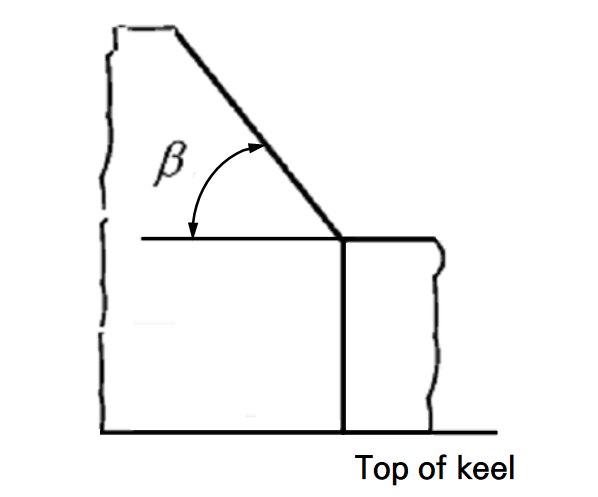
  **Fig 7.1.11**
- **2.** The calculation of sectional area of end bracket is to be as shown in **Fig 7.1.11** so that the area may not be less than the sectional area of the longitudinal beam, frame or stiffener concerned.
- **3.** The connection of end brackets and longitudinal frames or beams is to be as follows.
  - **(1)** In ships of 120 $\mathrm{m}$ and above in length, the end brackets and longitudinal beams or frames are to overlap each other for an ample length as shown in **Fig 7.1.12.**
  - **(2)** In cases other than those under (1) above, the arrangements may be as shown in **Fig 7.1.13.** The bracket is to be brought as close to the plane of web of longitudinal as possible. Where the longitudinals are of flanged plate, the bracket is to be placed on the line of end of curvature and, further, ribs are to be fitted at a point about 10 $\mathrm{mm}$ inward of the toe of bracket.
    
    **Fig 7.1.12** 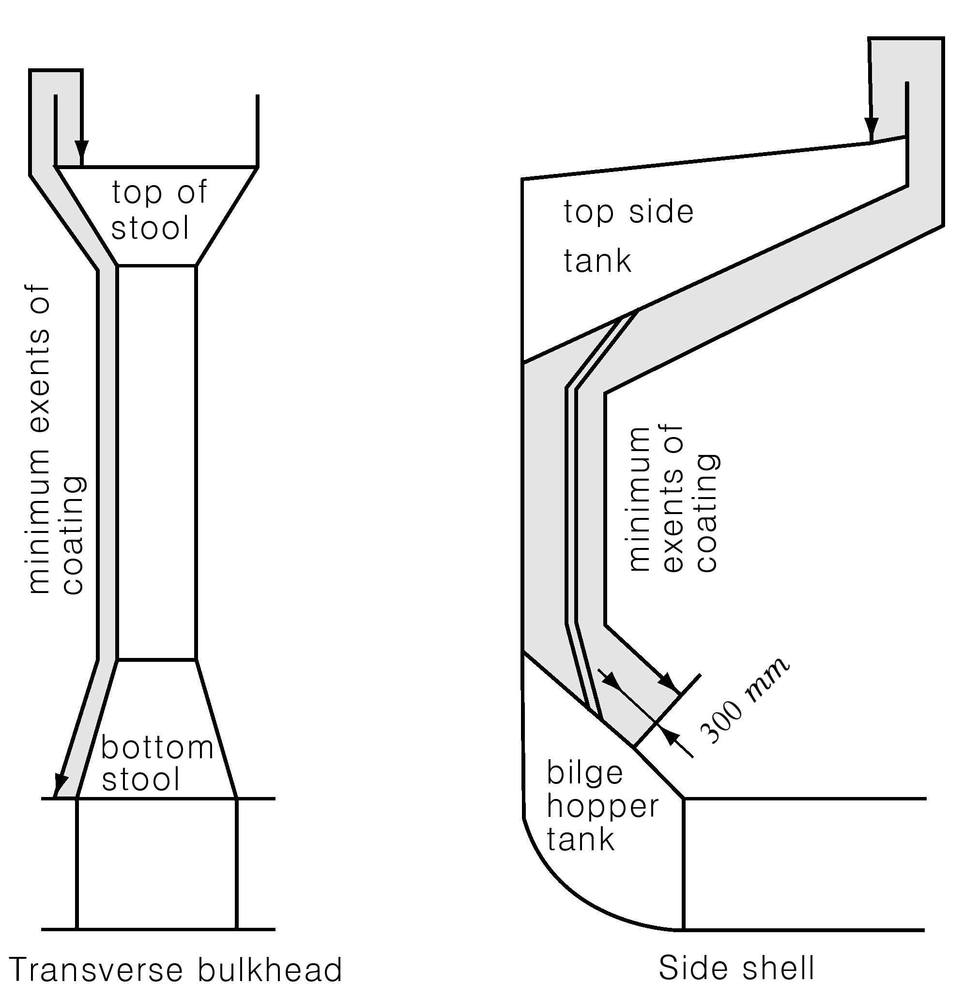
    **Fig 7.1.13**
- **4.** The connection of transverse bulkheads and brackets are to be rounded or levelled, as shown in **Fig 7.1.14.**
  - **(1)** The penetrating parts of end brackets are to be rounded or bevelled, as shown in **Fig 7.1.14.**
  - **(2)** The connection of end brackets and bulkhead plating is to be reinforced to avoid hot spots, as shown in **Fig 7.1.15.**
    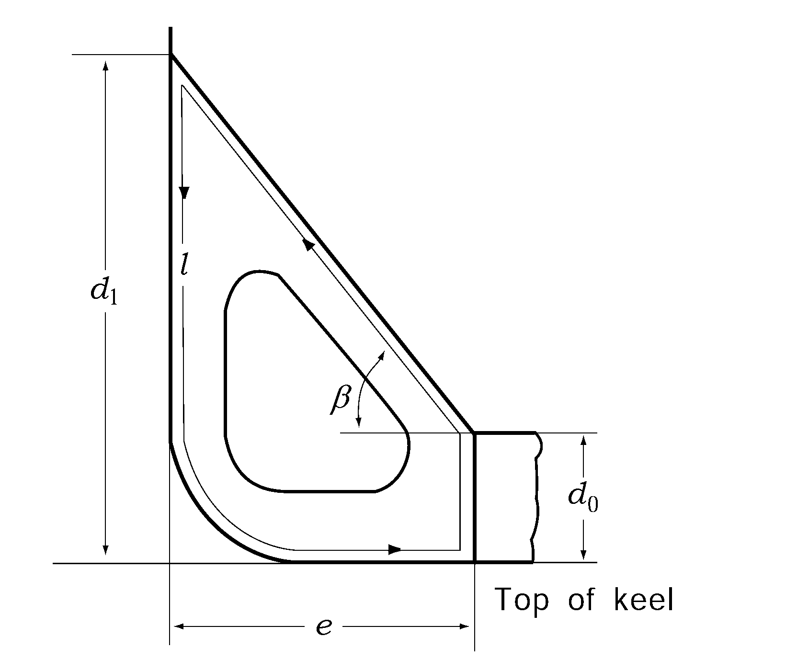
    **Fig 7.1.14** 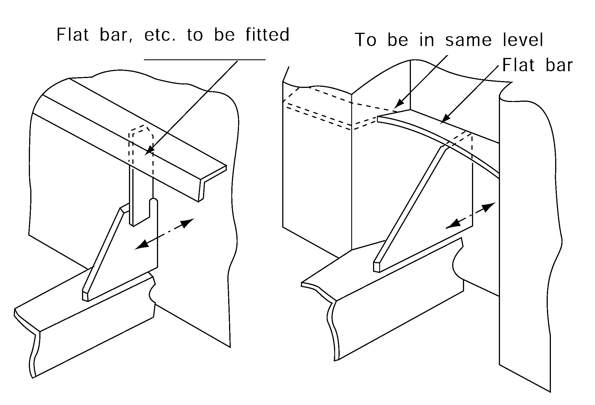
    **Fig 7.1.15**

### Section 4 Girders, Transverses and Cross Ties in Cargo Oil Spaces

#### 401. General 【See Rule】

- **1.** The dimension and locations of lightening holes, if any, are to be as shown in **Fig 7.1.16.**
- **2.** Slots are to be reinforced with collars where flanges of longitudinals are facing each other or where slots are provided at small intervals as is often the case with bilge part.
- **3.** Where the depth of a girder is smaller than the required depth, its section modulus is to be obtained through multiplying the required section modulus by the ratio of required depth to the actual depth.
- **4.** In pump rooms or void spaces, the web thickness may be 1 $\mathrm{mm}$ smaller than the required thickness for webs in cargo oil tanks.
- **5.** The scantlings of members in segregated ballast tanks in the midship part are to be same as those of members in cargo oil tanks (**401. 5** of the Rules)
- **6.** Connection of web plates is to be of butt-welding. If lap-welding is adopted, stiffeners are to be provided across the connection lines.
  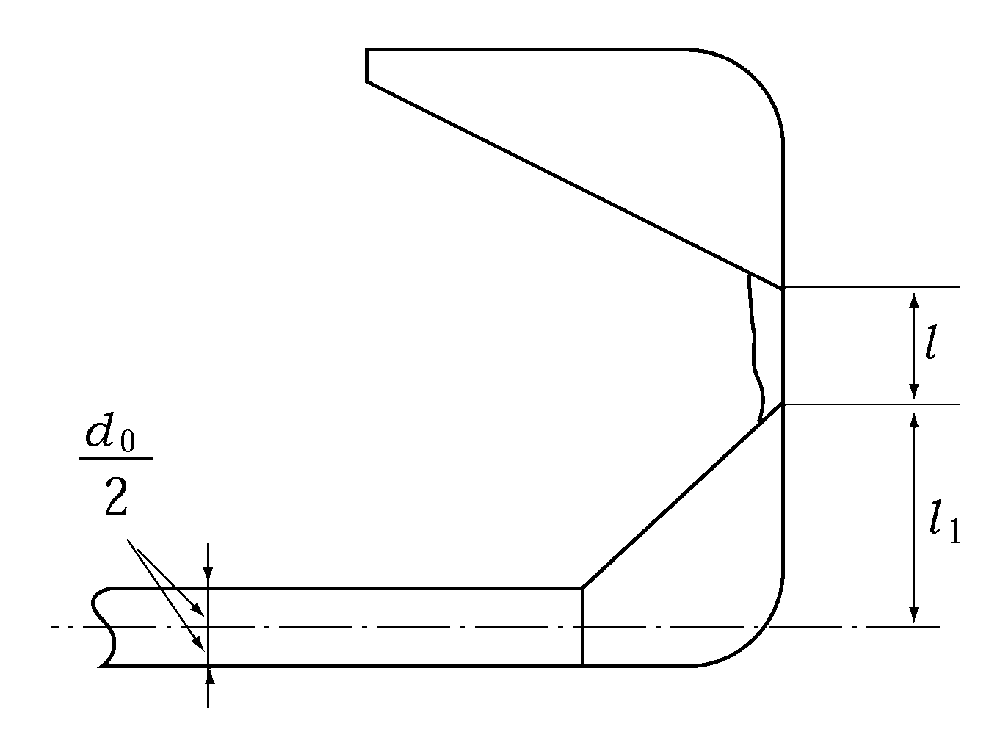
  **Fig 7.1.16 Locations and dimensions of lightening holes**
- **7.** In end bracket parts, at connections with cross ties, etc. of transverses where sharing stress and/or compressive stress are expected to be high, additional stiffeners are to be fitted. These parts are not to have lightening holes. If considered necessary, slots for penetration of longitudinals in these parts are to be reinforced with collars.
- **8.** No scallop is to be permitted in the web plate at the connections of face plates or webs. Inevitable scallops for work are to be filled up by welding. For face plates adjacent to the scallop, abrupt change of dimensions is to be avoided carefully. (See **Fig 7.1.17**)
  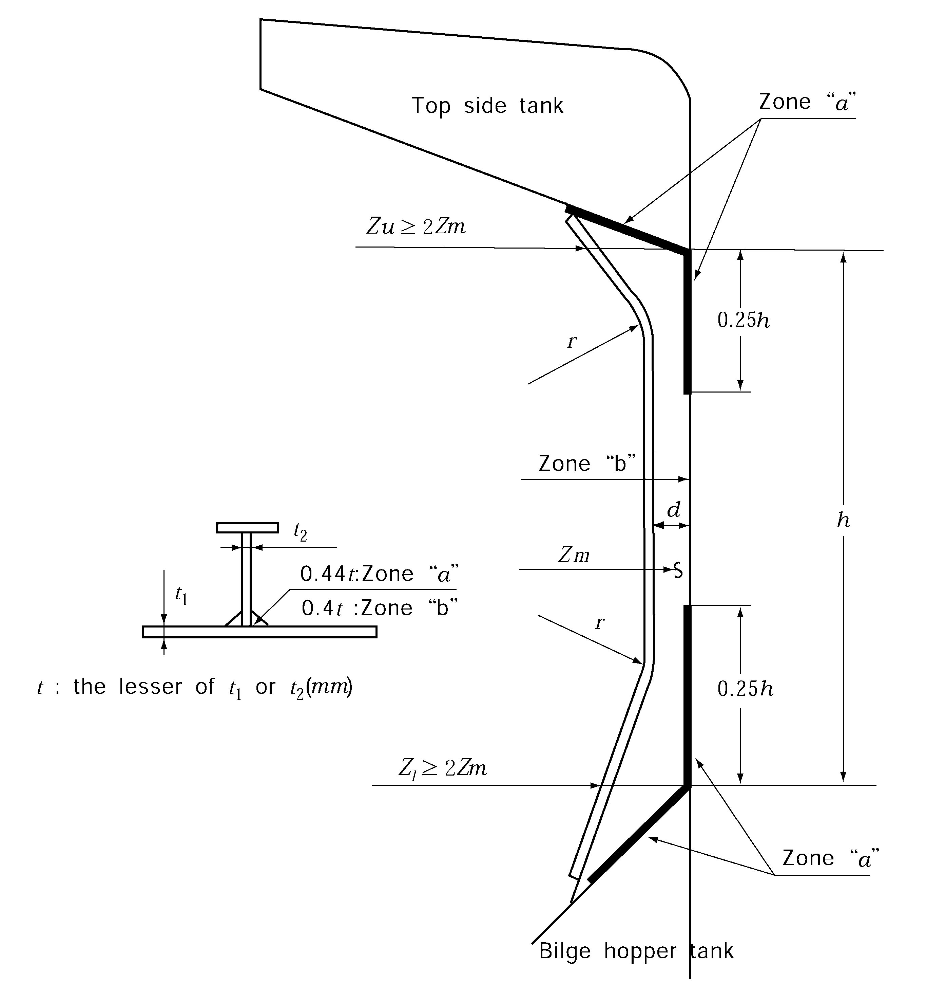
  **Fig 7.1.17**
- **9.** Where angle bars are used instead of flat bars as stiffeners of transverses, etc., their section modulus with effective plates is to be approximately equivalent to the required ones.
- **10.** Where longitudinal frames or stiffeners penetrate bottom transverses, side transverses and vertical webs on longitudinal bulkhead, proper reinforcement is to be made in the extents stipulated in **Table 7.1.3** by fitting brackets on the opposite side of stiffeners on webs of transverse, for connecting longitudinals to transverse, by fitting collars at slots, or by other suitable means. In ships not exceeding 230 $\mathrm{m}$ in length, however, the extent of application of such reinforcement may be properly reduced. This reinforcement is to apply to the slots under conditions similar to those in the above-mentioned girders or transverses(for example, slots in transverse swash bulkheads, etc.)

  **Table 7.1.3 Extents of reinforcement**

  | Member | Extent of reinforcement |
  | --- | --- |
  | Bottom transverse | All connections |
  | Side transverse | All connections below the upper end of curvature of upper cross tie, or the load waterline, whichever is the higher. In ships of 300 $\mathrm{m}$ and above in length, it is recommended that similar reinforcement be applied in wider extent upward beyond the limit stipulated above. |
  | Vertical webs on longitudinal bulkhead | All connections below the upper end of curvature of upper cross tie. |

#### 402. Transverses and girders provided in centre or inner tanks in ships having two or more rows longitudinal bulkheads 【See Rule】

- **1.** Where transverse swash bulkheads complying with rule requirements are provided in tanks, $L_0$ may be the distance between the transverse bulkhead and the swash bulkhead.
- **2.** As for the treatment of Note 1 to **Table 7.1.3** of the Rules, the value of $C_4$ is to be equal to 1.2 times the value of $C_4$ in **Table 7.1.3** of the Rules.
- **3.** As for the treatment of Note 2 to **Table 7.1.3** of the Rules, the value of $C_4$ in **Table 7.1.3** of the Rules, may be multiplied by 0.25$D/d_1$, if the depth of the centreline bottom longitudinal girder $d_1$ exceeds 25 $\%$ of the ship's depth $D$.
- **4.** The centreline bottom longitudinal girder is to have docking brackets at the middle of span between bottom transverses and between the bottom transverse and transverse bulkhead. If these brackets are of large dimensions, their free edges are to be reinforced against buckling.
- **5.** Where the depth $d_2$ of centreline vertical web on transverse bulkhead is greater than the spacing $S$ of transverses, the web thickness of bottom girders is to be obtained form the formula in Rules, where $d_1$ is to be used in place of $d_1 '$ and the coefficient $\eta$ is to be derived form **Table 7.1.4.** (See **Fig 7.1.18**)

  **Table 7.1.4 Coefficient** $bold \eta$

  | Number of transverse | $\eta$ |
  | --- | --- |
  | 2 | 0.55 |
  | 3 | 0.67 |
  | 4 | 0.75 |
  | 5 | 0.80 |

   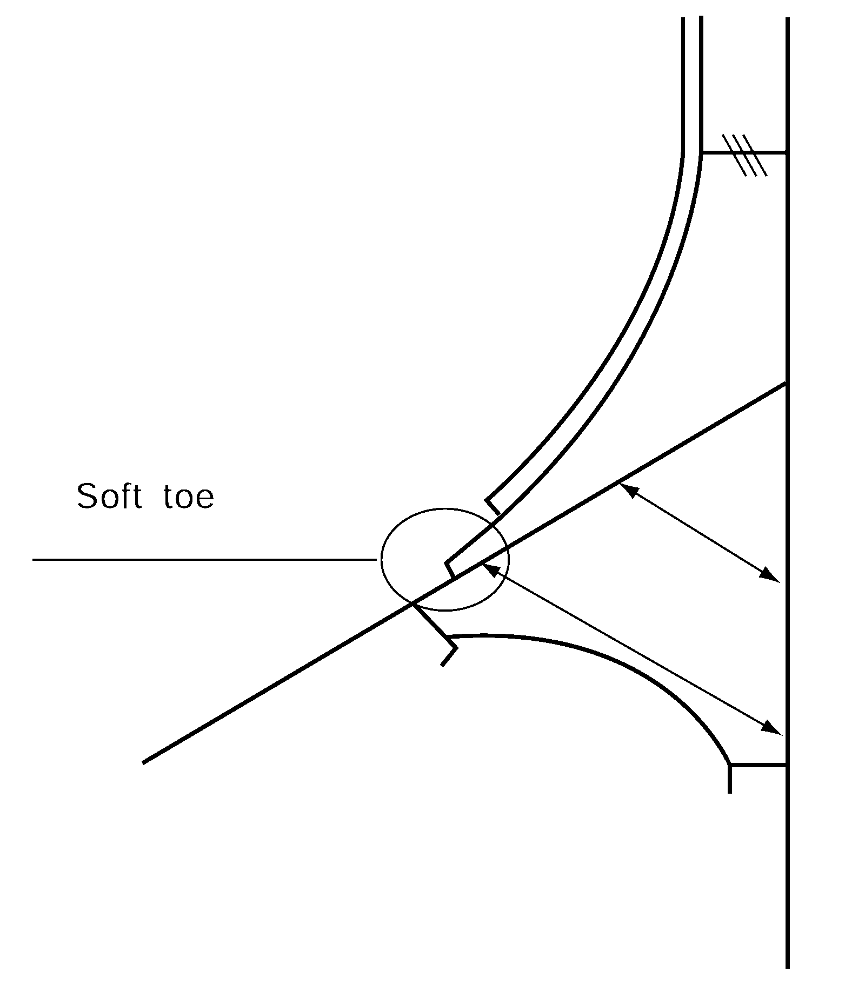
  **Fig 7.1.18**

#### 403. Transverses and girders in wing tanks in ships having two or more rows of longitudinal bulkheads 【See Rule】

- **1.** **Side transverse**
  The span $l_0$ of side transverses is to be measured as shown in **Fig 7.1.19.** The lower end is to be determined in a similar manner.
- **2.** **Vertical webs on longitudinal bulkheads**
  - **(1)** Even when large brackets are provided on the opposite side of longitudinal bulkhead, the span $l_0$ and radius of transverses are to be measured on the wing tank side in a same manner as (1) above. The size of bracket $b$ may be $(b' + b'')/2$, except when *b* is to be taken as equal to $b'$ if $b''$ is smaller than $b'$.(See **Fig 7.1.20**)
    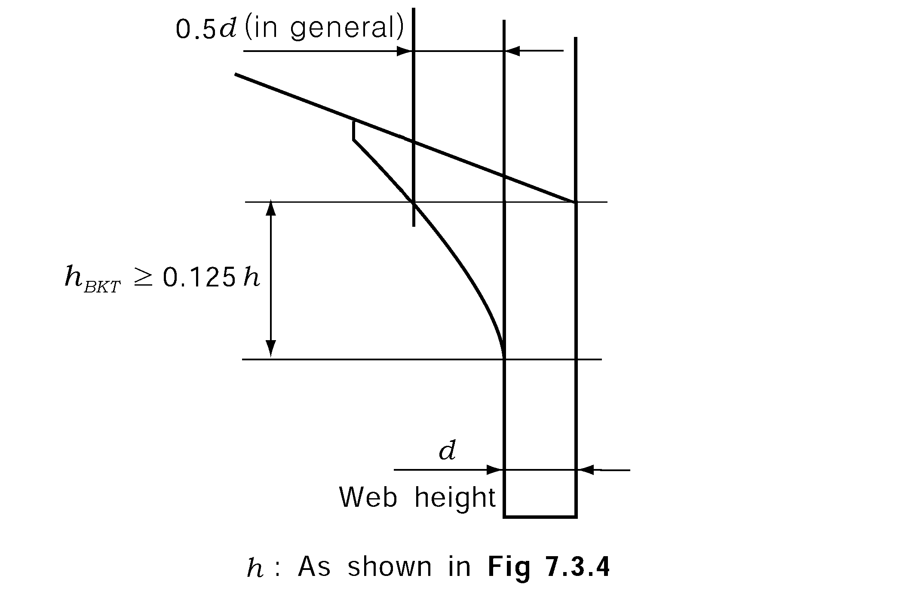
    **Fig 7.1.19 Measurement of** #eqnID-81 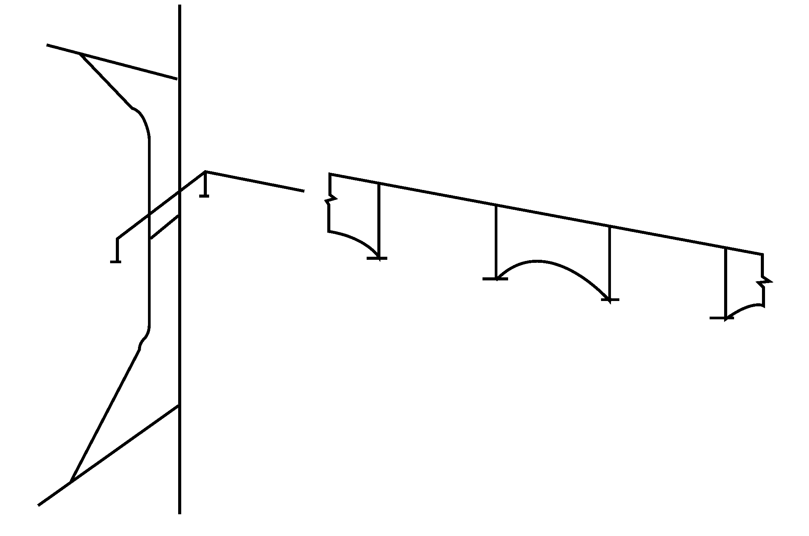
    **Fig 7.1.20 Measurement of** #eqnID-82**and** #eqnID-83
  - **(2)** In calculating the web thickness in regard to the shearing force, the brackets on the opposite side of longitudinal bulkhead may be taken into account.
  - **(3)** Collars are to be fitted to close slots in the vicinity of the toe of bracket of bottom transverse, which is connected to longitudinal bulkhead, in the centre tank or inner tank.
  - **(4)** Girders on corrugated bulkheads are to be balanced girders. Where balanced girders are not adoptable, the neutral axis is to be brought as close to bulkhead plating as possible.
- **3.** **Moment of inertia of bottom and deck transverses**
  The standard values of moment of inertia of bottom and deck transverses are to be obtained from the following formulae :
  Bottom transverses : $I = 160 C_0 C_2 Q l_0^2 \frac{B_S}{D} \mathrm{cm^4 }$
  Deck transverses : $I = 58 C_0 C_2 Q l_0^2 \frac{B_S}{D} \mathrm{cm^4 }$
  where:
  $C_0$ and $C_2$ = as specified in **Table 7.1.3** of the Rules
  $Q$ and $l_0$ = as specified in **403. 1** of the Rules
  $B_S$ = breadth of wing tank
- **4.** **Transverses at bilge part and lower end of longitudinal bulkhead**
  If the lowest cross tie is located as shown in **Fig 7.1.21** the section modulus of transverse at the bilge part and the lower end of longitudinal bulkhead may be reduced to 90 $\%$ of the values obtained from the formula. Further, the web thickness of side transverse at "A" may be 0.5 $\mathrm{mm}$ thinner than that obtained from the formula, but is not to be less than the thickness according to **405.** of the Rules.
- **5.** **Where side stringers are provided**
  - **(1)** If a swash bulkhead is provided in the centre tank, $l_1$ is to be measured as shown in **Fig 7.1.22.**
  - **(2)** In addition to the prescriptions in **403. 5** (1) of the Rules, the side stringers and cross ties are to meet the following condition.
    $l_1 > l_2 > l_3$ ------------- (See **Fig 7.1.23**)
    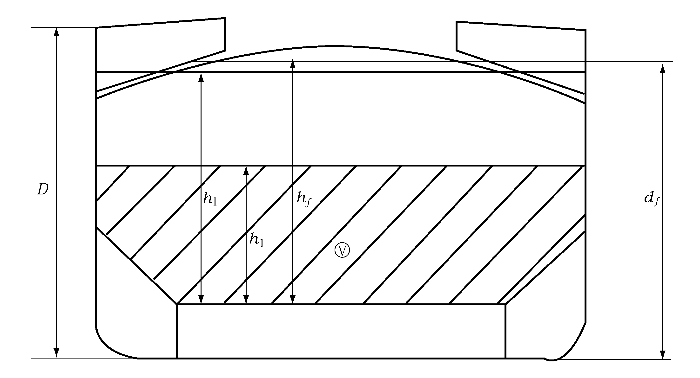
    **Fig 7.1.21**
    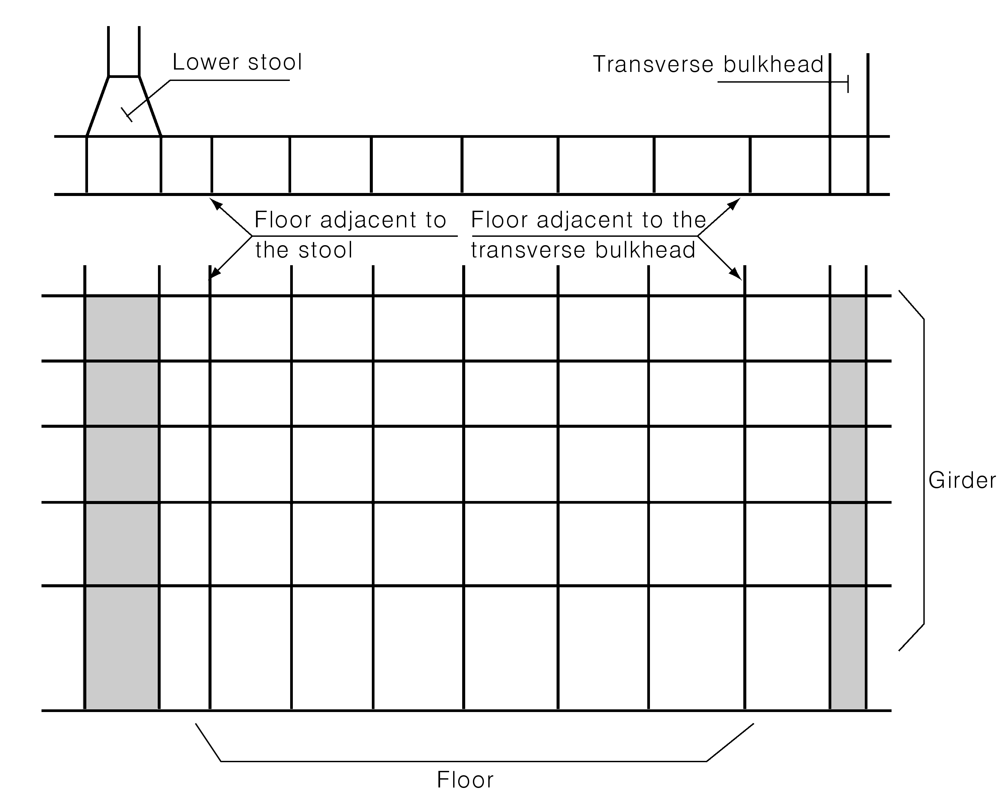
    **Fig 7.1.22 Measurement of** #eqnID-95 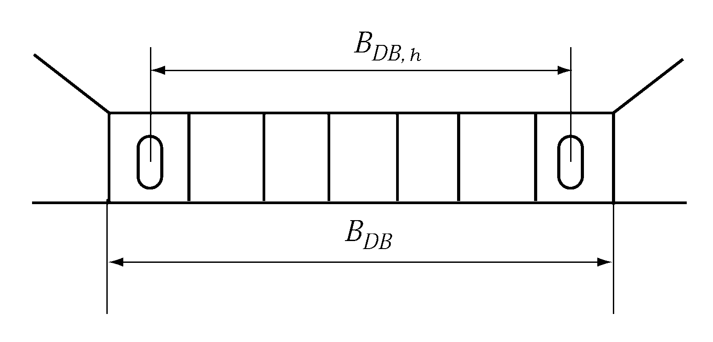
    **Fig 7.1.23**
  - **(3)** Where four transverse rings and one horizontal ring are connected by one cross tie, the coefficients $C_3$ and $C_4$ for calculation of the scantlings of horizontal ring are to be obtained from **Table 7.1.5. 404. 2** is to apply to the cross tie.
  - **(4)** If stringers are arranged asymmetrically or two cross ties are provided, the scantlings of these members are to be decided on the basis of equivalent effectiveness.

    **Table 7.1.5.** $C_3$ **and** $C_4$ **of coefficient**

    | Coefficient |   | $C_3$ | $C_4$ |
    | --- | --- | --- | --- |
    | $K= d_\frac{0}{d_1} left( l_\frac{1}{l_0} right)^2$ | $K$ ≤ 0.2 0.2 ＜ $K$ ≤ 0.3 0.3 ＜ $K$ ≤ 0.4 | 62 54 50 | 5.32 4.51 4.22 |
    | $K= d_\frac{0}{d_1} left( l_\frac{1}{l_0} right)^2$ | 0.4 ＜ $K$ ≤ 0.5 0.5 ＜ $K$ ≤ 0.6 0.6 ＜ $K$ ≤ 0.7 | 48 45 43 | 3.92 3.62 3.40 |
    | $K= d_\frac{0}{d_1} left( l_\frac{1}{l_0} right)^2$ | 0.7 ＜ $K$ ≤ 0.8 0.8 ＜ $K$ ≤ 0.9 0.9 ＜ $K$ ≤ 1.0 | 41 40 38 | 3.18 3.03 2.88 |
    | $K= d_\frac{0}{d_1} left( l_\frac{1}{l_0} right)^2$ | 1.0 ＜ $K$ ≤ 1.2 1.2 ＜ $K$ ≤ 1.4 1.4 ＜ $K$ ≤ 1.6 | 36 33 32 | 2.66 2.44 2.30 |
- **6.** **Side stringers in bow part(longitudinal bulkhead in centreline only)**
  - **(1)** Where strong stringers support transverse rings(without cross tie) (See **Fig 7.1.24**)
    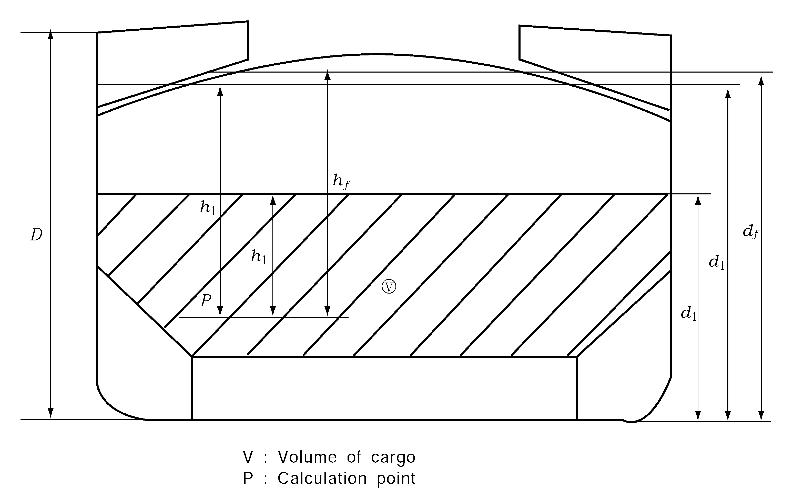
    **Fig 7.1.24**
    Transverse ring:
    Average depth of girder : $d = C_0 l_0 \mathrm{m}$
    Section modulus of girder :
    average over span : $Z = C_2 K^2 Q l_0 \mathrm{cm^3 }$
    bilge part : $Z = C_2 'Q l_0 \mathrm{cm^3 }$
    Longitudinal girder :
    Web thickness : $t = C_3 \frac{Q}{d_1} + 2.5 \mathrm{mm}$
    Section modulus of girder : $Z = C_4 K Q l_1 \mathrm{cm^3 }$
    $C_0$, $C_2$, $C_2 '$, $C_3$ and $C_4$ are to be obtained from **Table 7.1.6.** These formulae apply to the type of construction comprising three or four transverse rings supported by one or two strong stringers, where $K$ does not exceed 0.5. Symbols are to be as per **403.** of the Rules.
  - **(2)** Where the side transverse is connected by cross ties to the vertical webs on the centreline bulkhead (without longitudinal girders), the principal scantlings are to be determined according to **403. 1** (1) to (4), **2** (1) and **3** (3) of the Rules, in which the coefficient in formulae may be those in **Table 7.1.7.** The prescriptions in **404.** of the Rule are to apply to cross ties.

#### 404. Cross ties 【See Rule】

- **1.** In the construction of 4 transverses ring/1 cross ties or 4 transverses ring/ 2 cross ties type as per **403. 5** (3), the value of $S$ in the formula is to be obtained from the following formulae.(See **Fig 7.1.25**)
- **2.** In such a construction as shown in **Fig 7.1.26,** brackets asterisked are to be fitted.

  **Table 7.1.6 Coefficient** $C_0$**,** $C_2$**,** $C_2 '$**,** $C_3$ **and** $C_4$

  | No. of longitudinal girders | No. of transverses | Coefficient | $K = d_\frac{0}{d_1} \times left( l_\frac{1}{l_0} right)^2$ |   |
  | --- | --- | --- | --- | --- |
  | No. of longitudinal girders | No. of transverses | Coefficient | 0 | 0.5 |
  | 1 | 3 or 4 | $C_0$ $C_2$ $C_2 '$ | 0.080 1.46 2.89 | 0.125 3.88 5.10 |
  | 1 | 3 | $C_3$ $C_4$ | 54 10.20 | 36 5.60 |
  | 1 | 4 | $C_3$ $C_4$ | 72 10.60 | 45 6.40 |
  | 2 | 3 or 4 | $C_0$ $C_2$ $C_2 '$ | 0.065 0.68 1.36 | 0.115 3.40 4.76 |
  | 2 | 3 | $C_3$ $C_4$ | 41 7.20 | 23 3.80 |
  | 2 | 4 | $C_3$ $C_4$ | 50 7.7 | 32 4.3 |
  | Note: Where only two transverse rings are provided, $C_3$ and $C_4$ are to be replaced by 1.2$C_3$ and 1.2$C_4$, respectively, for the lower longitudinal girder and 0.8$C_4$, respectively, for the upper longitudinal girder. |   |   |   |   |

  **Table 7.1.7 Coefficient** $C_0$**,** $C_2$ **and** $C_2 '$

  | No. of cross tie Coefficient | 1 | 2 |
  | --- | --- | --- |
  | $C_0$ | 0.10 | 0.09 |
  | $C_2$ | 2.52 | 1.94 |
  | $C_2 '$ | 3.83 | 2.89 |

  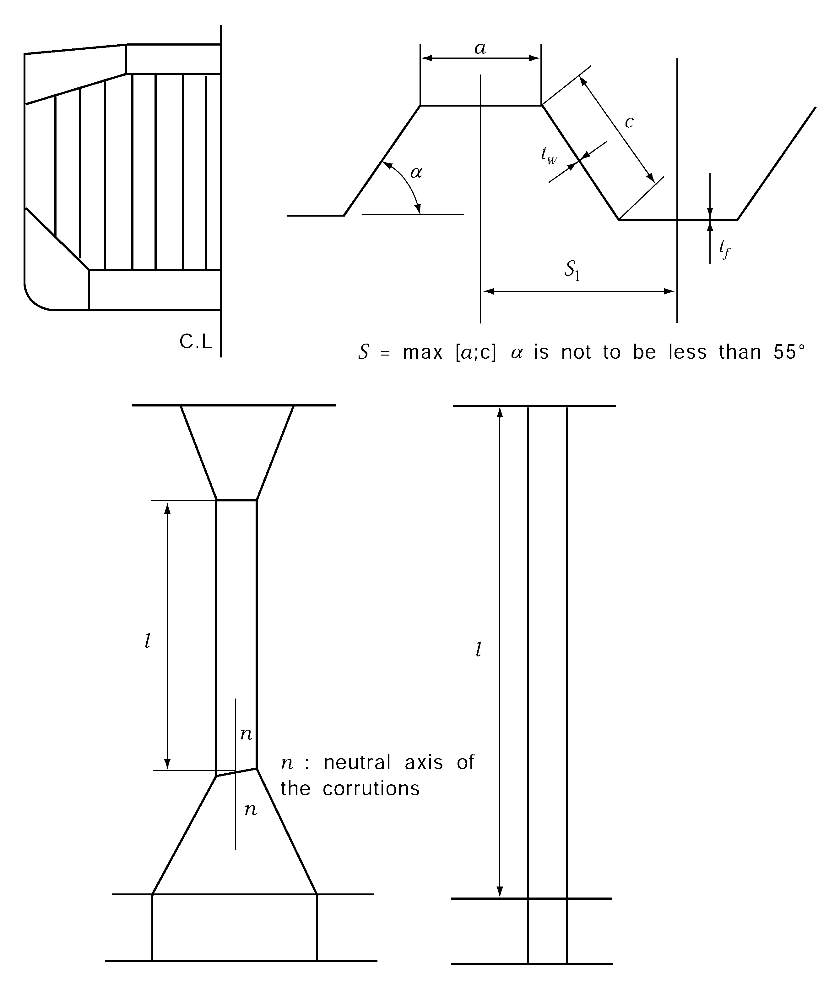
  **Fig 7.1.25 Value of** #eqnID-158 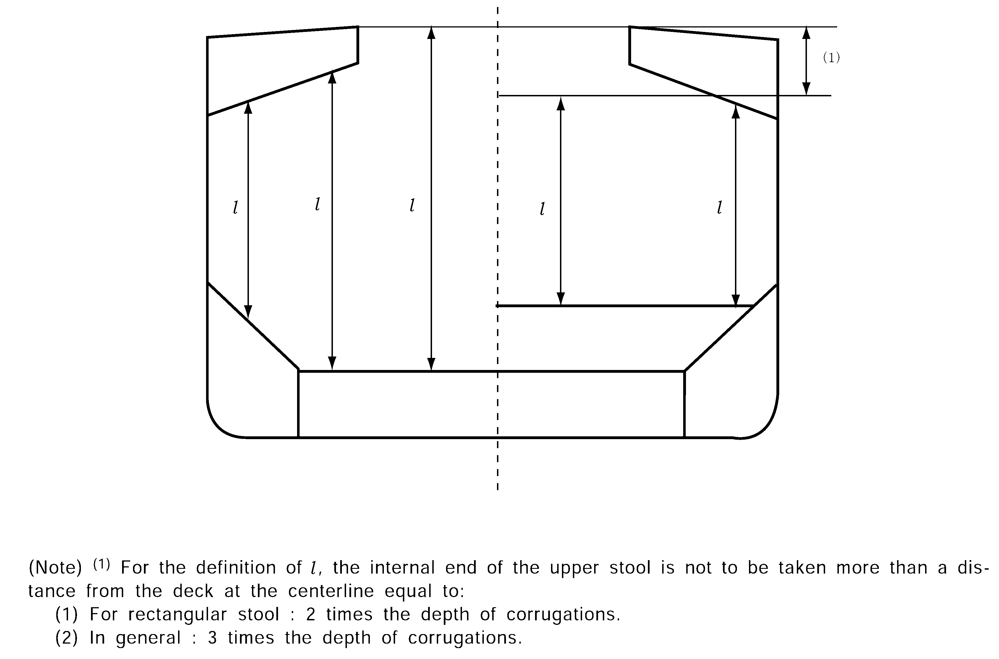
  **Fig 7.1.26**

### Section 5 Bulkheads in Cargo Oil Spaces

#### 502. Thickness of bulkhead plating

The thickness of the uppermost and the lowest strake of longitudinal bulkheads stipulated in **502. 2** may be tapered down as shown in **Fig 7.1.27,** provided that their thickness is not less than obtained according to **502. 1** and **3** of the Rules. **【See Rule】**
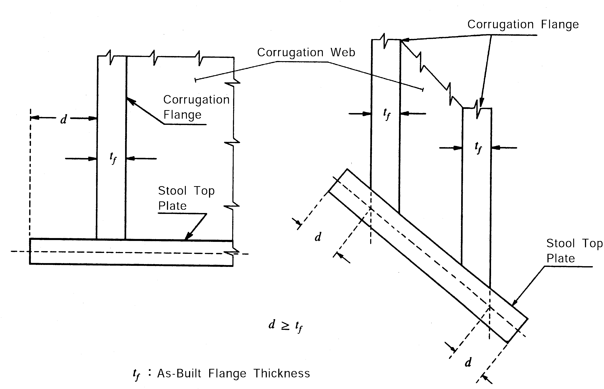
**Fig 7.1.27 Tapering of thickness of uppermost and lowest strakes of longitudinal bulkhead**

#### 504. Strong vertical webs 【See Rule】

- **1.** **Centreline vertical webs on transverse bulkhead**
  $d_l$ and $d_u$ in the prescriptions in **504.** of the Rules are to include the depth of brackets, if there are brackets on the opposite side of the bulkhead.
- **2.** **End connection of webs attached to bulkheads**
  The connection of a member having a large moment of inertia, such as longitudinal girder on bulkhead, and a member having a small moment of inertia, such as longitudinal frames, is to be arranged as shown in **Fig 7.1.28.**
  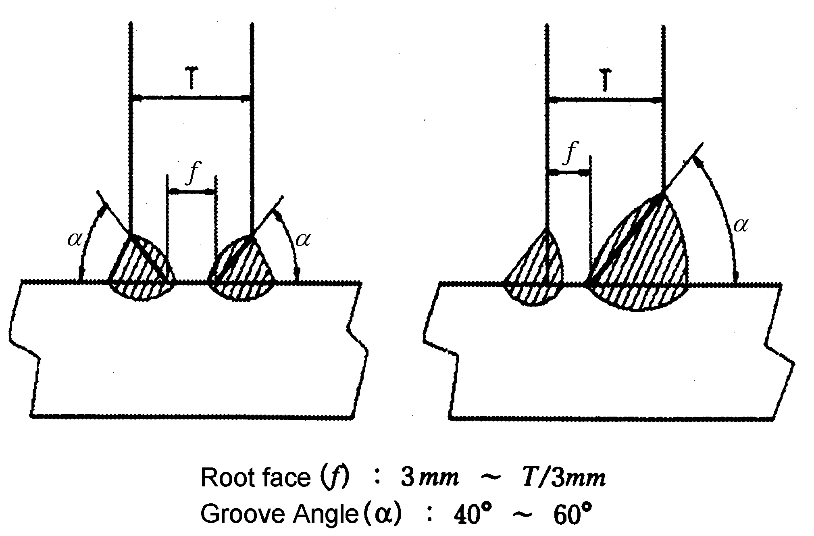
  **Fig 7.1.28**

#### 506. Horizontal girders supporting vertical webs 【See Rule】

Connection of webs and longitudinal frames, etc. is to be as specified in **504. 2.**

#### 511. Swash bulkheads 【See Rule】

- **1.** The breadth and thickness of the uppermost and lowest strakes of the centreline swash bulkhead may be 90 % of those required by the Rules for the uppermost and lowest strakes, respectively, of the longitudinal oiltight bulkhead.
- **2.** The "opening ratio" means the ratio of the sum of areas of openings, except slots and scallops, to the area of the bulkhead.
- **3.** The section modulus of stiffeners is to be obtained from the following formula;
  $Z = C S h_s l^2 \mathrm{cm^3 }$
  where:
  $S$ = spacing of stiffeners ($\mathrm{m}$)
  $l$ = span of stiffener between supports ($\mathrm{m}$)
  $C$ = coefficients stipulated below
  both ends effectively bracketed ------------------------------------ 7.1
  one end effectively bracketed and the other end supported by girder ---- 8.4
  both ends effectively bracketed ------------------------------------ 10.0
  $h_s$ = value obtained from the following formula. In no case is it to be less than 2.0
  $h_s = left( 0.176 - \frac{0.025}{100} L right) (1 - a ) l_t$
  where :
  $L$ = length of ship ($\mathrm{m}$)
  $a$ = opening ratio of bulkhead plating
  $l_t$ = length of tank ($\mathrm{m}$)
- **4.** Where a vertical web at the middle of two longitudinal bulkheads serves as a strong web supporting horizontal girders, the scantlings of the vertical web are to be obtained from the following formulae:
  - **(1)** Depth of web
    $d = 3 left(l_\frac{1}{B_0} right)^2 d_0 \mathrm{m}$
    where:
    $l_1$, $B_0$ and $d_0$ = as specified in **504.** of the Rules
  - **(2)** Sectional area of web at the upper end of lower bracket
    $A = 1.74 \frac{(D- h_1 )}{D} S(h - 0.32d)(l-S)C \mathrm{cm^2 }$
    where:
    $S$, $h$, $l$ and $C$ = as specified in **501.** of the Rules.
    $h_1$ = vertical distance from the top of keel to the inner toe of lower bracket of the web ($\mathrm{m}$)
    But, the sectional area of web is to include the bulkhead plating of the part within the distance form the web to the nearest opening or the distance equal twice the deck longitudinal spaces on each side of the web, whichever is the smaller.
  - **(3)** Thickness of web at the upper end of lower bracket
    $t = 12 K b + 2.5 \mathrm{mm}$
    where:
    $b$ = spacing of vertical stiffeners fitted to web ($\mathrm{mm}$)
    $K$ = as specified in following formula
    $K = \sqrt {\frac{A}{A_0}}$
    $A$ = sectional area as specified in (2) ($\mathrm{cm}^2$)
    $A_0$ = sectional area of the vertical web ($\mathrm{cm}^2$)
  - **(4)** Section modulus of vertical web
    $Z = 4 k^2 B_0 h_s l_1^2 \mathrm{cm^3 }$
    where:
    $k$, $B_0$ and $l_1$ = as specified in **504.** (1) of the Rules.
    $h_s$ = as specified in **Par 3.** above.
- **5.** The scantlings of waves supporting vertical webs or horizontal girders are not to be less than obtained from the formula in **506.** of the Rules. In applying the formula for $W_i$, $h$ is to be replaced by $h_s$ prescribed in **Par 3.**
- **6.** The scantlings of webs supporting stiffeners are to be obtained according to **507.** of the Rules in which $h$ is to be replaced by $h_s$ prescribed in **Par 3** and $X$ is to be taken as zero.
- **7.** Where a swash bulkhead consists of bottom transverses, deck transverses, side transverse, vertical webs on longitudinal bulkhead and struts, the scantlings of these webs and struts are to be obtained by applying **402., 403.** and **405.** of the Rules correspondingly. In this case, the section modulus of strut about vertical axis is not to be less than obtained from the following formula.
  $Z = 7.13 d_0 h_s l^2 \mathrm{cm^3 }$
  where:
  $d_0$ = depth of strut ($\mathrm{m}$)
  $l$ = span ($\mathrm{m}$) between supports, to be equal to the breadth of side tank in case of side tanks, or to the distance between longitudinal bulkheads or between centreline vertical web and longitudinal bulkhead. If tripping brackets for the webs and transverses are provided at the ends of the face plates, $l$ may be the distance between the face plates of transverse.
  $h_s$ = as specified in **Par 3** above.

### Section 6 Relative Deformation of Wing Tanks

#### 601. Relative deformation of wing tanks 【See Rule】

- **1.** **Special considerations for the case of exceeding limit values**
  It is required to submit data enough to prove that the proposed construction has an equivalent effectiveness.
- **2.** **Mean thickness in formulae**
  The mean thickness of plating in the formulae in **601.** of the Rules is to be obtained from the following formula.
  $t = \frac{smallsuml_i t_i}{smallsuml_i}$
  where :
  $l_i$ and $t_i$ are to be taken as follows;
  - **(1)** Transverse bulkheads and perforated swash bulkheads : The thickness and breadth of each strake of the bulkhead are to be taken at the middle of the breadth of the tank as shown in **Fig 7.1.29.**
  - **(2)** Transverse rings and swash bulkheads of transverse ring type: The thickness and vertical extent of the deck transverse, transverse on longitudinal bulkhead between face bar of deck transverse and upper face bar of the uppermost strut and so on, and parts from the uppermost strut to the bottom transverse are to be taken at the middle of the breadth of the tank (at the bulkhead side if no plating is present at the middle of the breadth of the tank) as shown in **Fig 7.1.30.**
    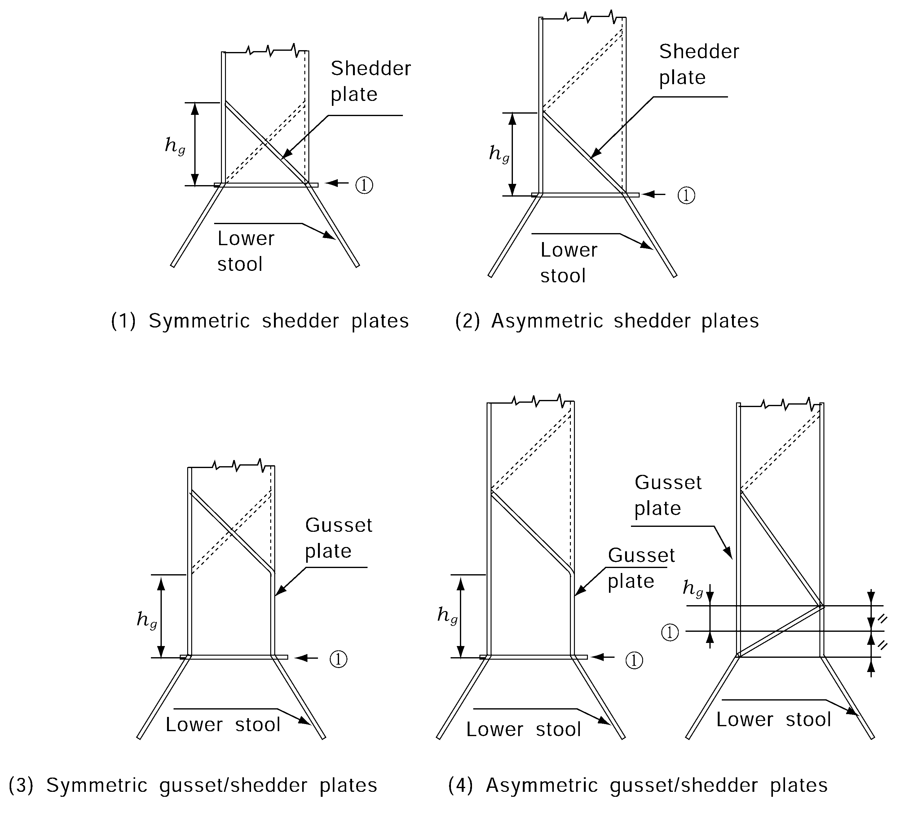
    **Fig 7.1.29 Fig 7.1.30**

### Section 10 Piping Systems and Venting Systems for Oil Tankers

#### 1001. General 【See Rule】

- **1.** In case where double bottom used as other than cargo oil tank is provided below cargo oil tank, the requirements specified in **Sec 10** of the Rules and additionally the requirements specified in the following are to be complied with ;
  - **(1)** The air pipes and sounding pipes provided in double bottom may pass through cargo oil tanks. In this case, all pipe joints in the cargo oil tanks are to be of welded joints with a sufficient thickness according to the requirements of **Table 7.1.8.** Further, consideration is to be given to the piping arrangement for expansion and contraction of the pipes.
  - **(2)** Valve operating rods are not to pass through any part subjected to liquid head at all time, such as the inner bottom plate of the cargo tank.
  - **(3)** Pipes conveying liquid and bilge suction pipes for tank or void space at the forward position of the ship are to comply with the following requirements:

    **Table 7.1.8 The sounding pipes and air pipes passing through cargo oil tanks**

    | Nominal diameter($\mathrm{mm}$) | Thickness of pipe | Reference(1) |
    | --- | --- | --- |
    | $A$ ＜ 100 | 8.7 | Sch. 160 |
    | 100 ≤ $A$ ＜ 200 | 11.1 | Sch. 120 |
    | 200 ≤ $A$ ＜ 250 | 12.7 | Sch. 80 |
    | 250 ≤ $A$ | 15.1 | Sch. 80 |
    | Note: (1) Standard specified in *KSD* 3562 and *KSD* 3570 |   |   |
    - **(A)** Pipes for tank or void space adjacent to the forward end of cargo oil tank may be led to the aft pump room. Fuel oil transfer pipes may be led to the pump provided in the engine room.
    - **(B)** Pipes for forepeak tank or void space not adjacent to cargo oil tank may be led to the pump provided in the engine room or the pump to provided in the aft pump room. Where this tank used ballast tank, ballast pipe may be led to the pipes for ballast tank adjacent to the cargo oil tank
    - **(C)** Where ballast pipes are arranged without passing through cargo oil tanks, piping for fore peak ballast tanks not located adjacent to cargo oil tanks may be led to the pipe lines for ballast tanks located adjacent to cargo oil.(As for bilge pipes, the requirements of **1003. 1.** (3) of the Rules are to apply) To the contrary, however, ballast pipes for ballast tanks located adjacent to cargo oil tanks are not to be led to the pumps which are installed in the engine room for the use of the ballast tanks not located adjacent to cargo oil tanks.

#### 1002. Cargo oil pumps and cargo oil piping systems, pipings in cargo oil tank, etc.

- **1.** In case of maintaining the gastight using by the oil lubricated device specified in **1002. 1** (1) (b) of the Rules, apply to **Ch. 6, 303. 6. 【See Rule】**
- **2.** In the provision **1002. 3** of the Rules, the changable device which the Society requires means the following device. **【See Rule】**
  - **(1)** Cargo oil tanks also used as ballast tanks
    In case where a tank is used both as a cargo oil tank and a ballast tank alternatively, the cargo oil pipes, ballast pipes and vent pipes are to be arranged changeable so as to serve respective cases by giving reference to the example shown in **Fig 7.1.31.** Further, for other piping systems, the requirements for the piping systems in cargo oil tanks are to be complied with.
    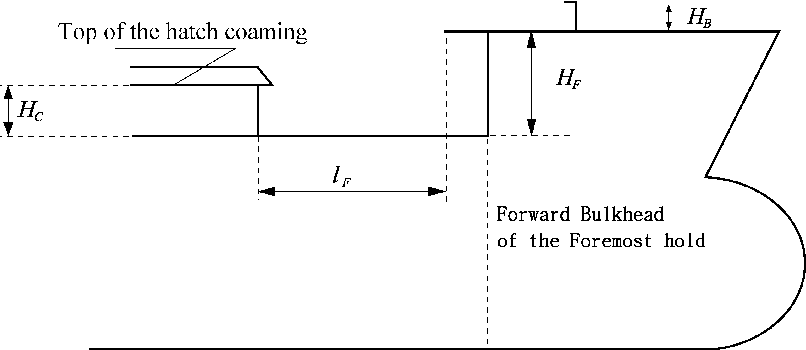
    **Fig 7.1.31 Example of piping arrangement for a tank used as cargo oil tank and****ballast tank in alternative use**
- **3.** In application to **1002. 4** of the Rules, Piping systems to be connected to cargo oil piping are to be dealt with under the following requirements; **【See Rule】**
  - **(1)** Pumps and pipes in any piping system connected to cargo oil pipes are to be dealt with as those in the cargo oil piping system. However, for piping systems specified in **1002. 2** (4), **9** (6), **1003. 1** (2), **2** (2), Guidance **Pt 8. Appendix 8-5. 2** (10) (g) and item (2) below, this requirement may be dispensed with. The piping systems connected to cargo oil piping mean those connected to cargo oil pipes having openings thereto. Hence, for example, hydraulic oil pipes for the control of cargo oil piping system are not regarded as the piping system connected to the cargo oil piping.
  - **(2)** In case where the cargo oil piping system is connected to;
    a) The air supply piping from the ventilator is to have automatically actuated shut-off valve and non-return valve in series.
    b) The valves of a) above are to be located at the bulkhead where the air supply piping leaves the non-hazardous area, with at least the non-return valve on the outside.
    c) Shut-off valve is to be opened after the ventilator has started, and automatically closed after the ventilator has stopped. Procedures for the operation of ventilators and valves are to be posted near the place of operation.
    d) The intake of the ventilator is to be derived from a safe place (eg open deck) outside the ventilated space.
    e) Ventilators is to be of non-sparking type.
    The pressure gauge to which cargo oil is directly led is to be installed in the pump room or on the weather deck. However, when a stop valve is provided at the joint between the pressure gauge piping system and the cargo oil piping system, and a bulkhead valve is provided at the penetration between the engine room and the pump room, the pressure gauge may be installed in the engine room.
    The sampling pipe for measuring oil content may be led to the spaces other than the dangerous spaces, when the pipe is of nominal diameter of 25 $A$ or less, and two or more stop valves are provided between cargo oil piping and the penetration of the casing of the non-dangerous spaces.
    - **(A)** Tank vent pipes : The requirements in Guidance **Pt 8. Appendix 8-5 2** (10)(g) & (h) are to be complied with. Ventilating fans except inert gas blowers, are to be installed within the dangerous spaces. Where the ventilators are located in a enclosded non-hazardous area, it is to comply with the following requirements.
    - **(B)** Pressure gauge pipes for cargo oil piping system (including pumps) :
    - **(C)** Pipes for measuring oil content :
- **4.** In application to **1002. 4.** (5) of the Rules, where at the request of the owner, cargo piping and the valve control piping are located above the double bottom, the vessel will be assigned with the notation **PCP**(Protected Cargo Piping). This applies also to cargo piping and valve control piping installed in pipe tunnel or duct keel. *(2024)*
- **5.** **Bulkhead valves of cargo oil piping systems**
  In application of **1002. 5** of the Rules, bulkhead valves in cargo oil tanks is to be comply with the following requirements. **【See Rule】**
  - **(1)** The arrangement and type of bulkhead valves are to be as given in **Table 7.1.9.**
    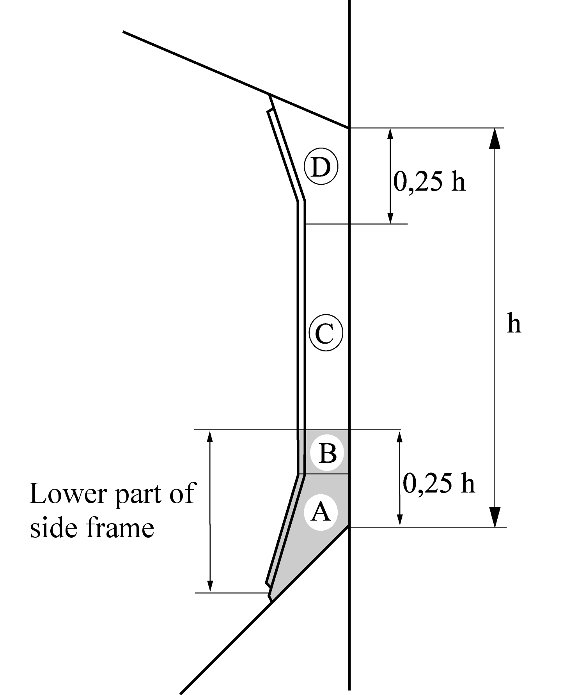
    **Table 7.1.9 Arrangement and type of bulkhead valves**
- **6.** In application of **1002. 7** of the Rules, piping in cargo oil tanks is to be comply with the following requirements. **【See Rule】**
  - **(1)** Pipes for measuring instruments and remote control equipment.
    Steel pipes for measuring instruments and remote control equipment provided in cargo oil tanks are to have minimum thickness of **Sch. 80.**, except when they have openings in cargo oil tanks.
  - **(2)** Scupper pipes and sanitary pipes
    Scuppers draining weather decks may pass through cargo oil tanks. In this case, all of their pipe joints within cargo oil tanks are to be of welded type and wall thickness of the pipes is to be not less than 16 $\mathrm{mm}$. As for the pipes of small diameter, however, consideration may be given reasonably. Scuppers or sanitary pipes from the spaces where ignition source exists such as accommodation space and others, are not to pass through cargo oil tanks. When the pipes of diameter is less than 100$A$, pipes of Sch. 160 specified in KSD 3570.
  - **(3)** Overboard discharge pipes (bilge or ballast pipes)
    Overboard discharge pipes passing through cargo oil tanks are to be dealt with under the following requirements;
    - **(A)** Overboard discharge pipes are not to pass through the cargo oil tanks other than those having relatively small capacity (e.g., slop tanks, etc.).
    - **(B)** Such pipes thickness in cargo oil tanks are to be 16 $\mathrm{mm}$ and all pipe joints in cargo oil tanks are to be of welded joints. In case where cast steel pipes are used, the pipe thickness may be 15 $\mathrm{mm}$ or more.
    - **(C)** Bent pipes are to be provided adequately to absorb the expansion and contraction of the pipe line.
    - **(D)** Internal surface of the pipe is to be coated with paints of good corrosion resistance, except where cast steel pipes specified in (b) above or steel pipes of adequate thickness considering corrosion allowance are used.
    - **(E)** The pipes are to be supported firmly enough to withstand vibration of ship, and to be so arranged as to enable maintenance and inspection to be carried out satisfactorily after ships are in service. As to the construction and workmanships of the penetration part of shell platings and bulkheads, special care is to be given.
    - **(F)** No valves are to be provided in cargo oil tanks.
- **7.** The sounding device of cargo oil tanks is to be of the construction capable of measuring the ullage without opening the tank hatch cover and installed separately from the opening provided in accordance with the requirements of **1002. 8** of the Rules. **【See Rule】**
  - **(1)** Means for ullage measurement of cargo oil tanks are to be such as can make the measurement without opening the tanks.
  - **(2)** When sounding pipe is provided, the open end is to be led to the weather deck and to be provided with the pipe heads having a sluice valve or cock fitted with an automatic closing device.
  - **(3)** In case where level indicating device is provided, the device is to be of the one approved in accordance with the requirements of the 「**Guidance for the Approval of Manufacturing Process and Type approval. etc**」.
  - **(4)** Level indicating device fitting to cargo oil tank of tanker, which is fitted with fixed inert gas system, are to be fixed and closed type.

#### 1003. Piping systems for cargo oil pump rooms, cofferdams and tanks adjacent to cargo oil tanks

- **1.** The open ends of sounding pipes specified in **1003. 1** (4) of the Rules may be provided in pump room. However, that when the open end is lower than the bulkhead deck, the requirements in **Pt 5, Ch 6, 203. 2** (2) of the Rules are to be complied with. **【See Rule】**
- **2.** In application of the **1003. 2** (2) of the Rules, ballast piping system for ballast tanks is to be dealt with under the following requirements: **【See Rule】**
  - **(1)** Ballast tanks which are not adjacent to cargo oil tanks and defined as being safe are to be ballasted and deballasted by pumps which are located in gas safe area. However, they may be deballasted by pumps which are located in dangerous area, provided that a check valve fitted on the line for only deballast.
  - **(2)** In case where ballast tanks adjacent to cargo oil tanks are intended to be deballasted by cargo oil pumps in an emergency, a spool piece(or blank flange) and a screw-down non-return valve are to be provided on each ballast pipe at the joint with the cargo oil pipe. Further, a warning notice is to be posted stating that spool pieces are to be removed except for emergencies.
- **3.** In the apply to the **1003. 2** (3) of the Rules, Air vent pipes of ballast tanks adjacent to cargo oil tanks is to be dealt with under the following requirements; **【See Rule】**
  - **(1)** The wording "flame screen" specified in **1003. 2** (3) of the Rules means the screen meeting the following requirements:
    - **(A)** To be made of corrosion resisting material.
    - **(B)** To comprise two fitted screens of at least 20 × 20 mesh spaced 25.4 ± 12.7 $\mathrm{mm}$ apart or single fitted screen of at least 30 × 30 mesh, or to have a performance equivalent thereto
  - **(2)** The total sectional area of air vent pipes in case where high level alarm or hatchway specified in **202.** of the Rules is provided in ballast tanks adjacent to cargo oil tanks may be larger than the sectional area under the requirements of **Pt 5, Ch 6, 201. 4** (1) of the Rules or 1,000 $\mathrm{cm}^2$ whichever is the smaller.
- **4.** In application of **1003. 2** (4) of the Rules, the open ends of sounding pipes for ballast tanks adjacent to cargo oil tanks is to be comply with **1003. 1. 【See Rule】**
- **5.** In application of **1003. 4** of the Rules, the open ends of sounding pipes for fuel oil tanks adjacent to cargo oil tanks is to be comply with **1003. 1. 【See Rule】**

#### 1005. Venting systems of cofferdams adjacent to cargo oil tanks 【See Rule】

The wording "flame screen" specified in **1005.** of the Rules means the one specified in **1003. 4** (1).

#### 1006. Positions of openings of machinery spaces, deck house, etc. and electrical equipment, etc. 【See Rule】

Where cargo pipe is provided to stern regard as dangerous spaces within 3 $\mathrm{m}$ from opening.

#### 1007. Tankers carrying only oils having flash point exceeding 60°C

Ventilation system specified in **1007. 6** of the Rules may be deduct 6 times from ventilation frequency and may not non-sparking construction. **【See Rule】**

### Section 11 Electrical Equipment of Oil Tankers

#### 1101. General 【See Rule】

- **1.** The term "semi-enclosed spaces" specified in **1101. 2** of the Rules means the spaces separated by decks and bulkheads where the condition of ventilation is significantly different from that of exposed part of ship.
- **2.** In the case of small ships where part of the forecastle deck corresponds to the dangerous space under the requirements of **1101. 2** (1) (B) (k) & (C) (e) of the Rules and when electrical equipment other than explosion-protected ones are installed under an inevitable reason, the following requirements are to be complied with:
  - **(1)** A steel gas barrier is to be provided on the forecastle deck.
  - **(2)** The height of the steel gas barrier is to be 2.4 $\mathrm{m}$ or more above the upper deck with the full width of the forecastle deck where the steel gas barrier is installed.
  - **(3)** The steel gas barrier is not to be provided with any opening.
  - **(4)** Electrical equipment is to be at least of the totally enclosed water-proof type.
- **3.** The requirement of **Pt 1101. 3** (2) (D) apply to the following circuit.
  - **(1)** Condenser circuit for filter
  - **(2)** Earthing circuit for composing intrinsic safety circuit
  - **(3)** Neutral circuit of 3000 $V$ and above high voltage 3 phase distribute cabling in main machinery, special safety area. etc.
- **4.** Examples of dangerous spaces for **1101. 2** of the Rules are classified as follows.
  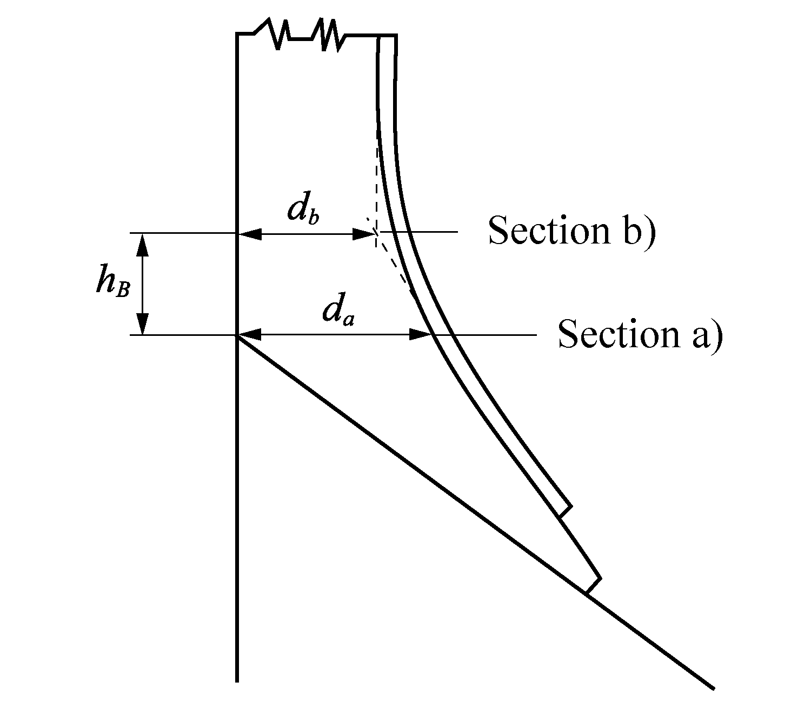
  **Fig 7.1.33 Classification symbols of dangerous spaces** 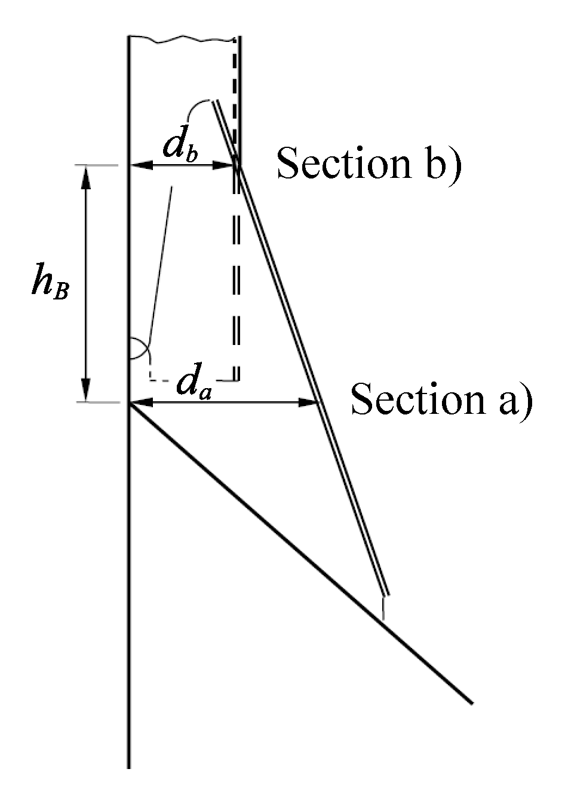
  **Fig 7.1.34 Example of (1) (A) zone 0**
  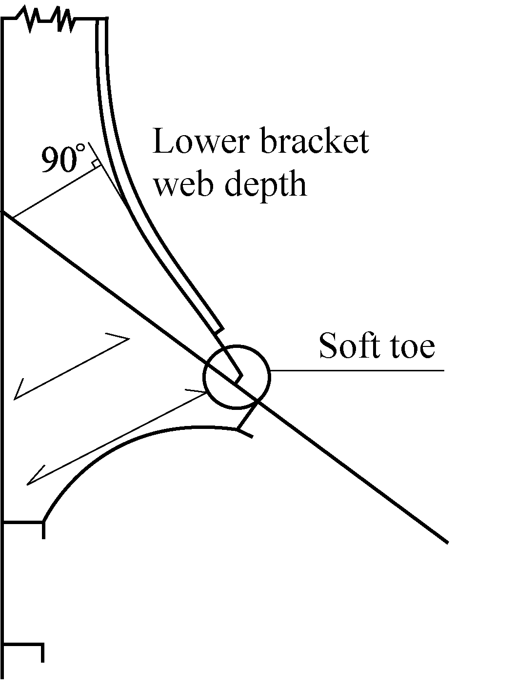
  **Fig 7.1.35 Example of (1) (B) zone 1 (a)** 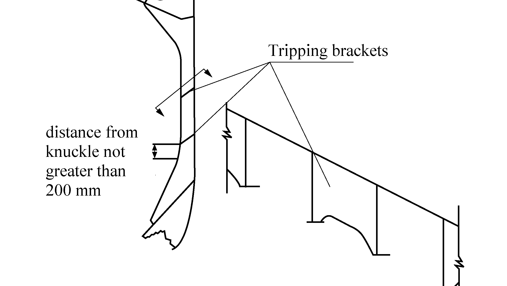
  **Fig 7.1.36 Example of (1) (B) zone 1 (b)**
  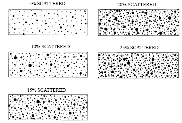
  **Fig 7.1.37 Example of (1) (B) zone 1 (c) ∼ (f)** 
  **Fig 7.1.38 Example of (1) (B) zone 1 (g)**
  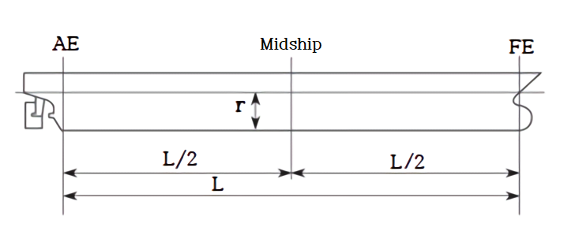
  **Fig 7.1.39 Example of (1) (B) zone 1 (h) ∼ (j)** 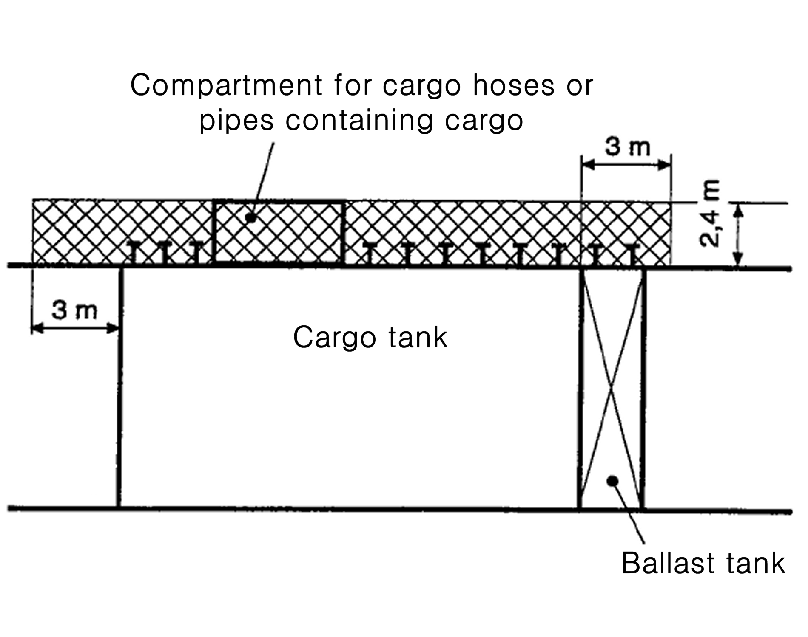
  **Fig 7.1.40 Example of (1) (B) zone 1 (k) ∼ (m)**
  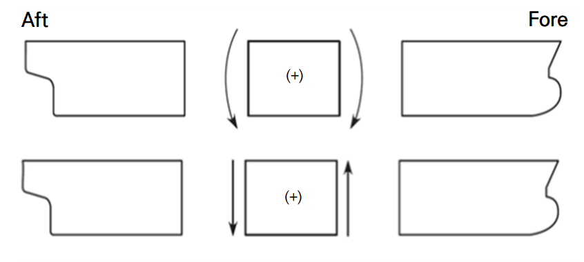
  **Fig 7.1.42 Example of (1) (C) zone 2 (b),(d),(e)**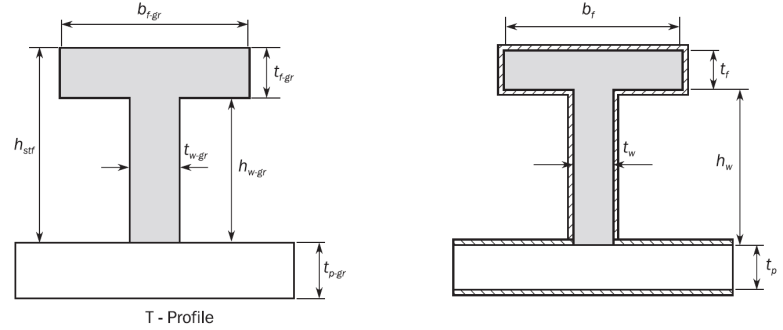
  **Fig 7.1.41 Example of (1) (C) zone 2 (a)**
  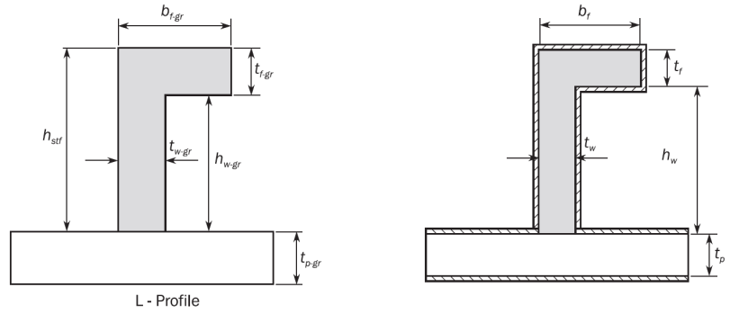
  **Fig 7.1.43 Example of (1) (C) zone 2 (f)** 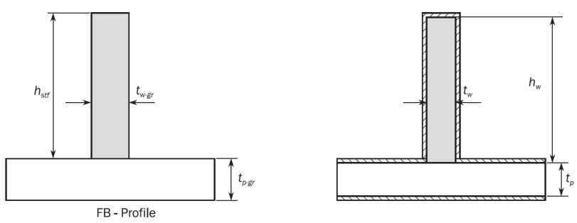
  **Fig 7.1.44 Example of (2) (B) zone 2 (a) ∼ (d)**

#### 1103. Electrical equipment in dangerous spaces 【See Rule】

- **1.** Explosion-protected electrical equipment in dangerous spaces is to be suitable for use in the explosion gas atmosphere classified into gases and vapours group IIB and temperature class T3 as specified in (KS C) IEC 60079, or equivalent thereto.
- **2.** In addition to the requirements of **1103. 3** of the Rules following requirements are to be satisfied.
  - **(1)** In application of (2) and (3), cargo tank includes tanks adjacent to cargo tanks.
  - **(2)** The height of the anode is to be measured from the bottom of the tank to the center of the anode, and its weight is to be taken as the weight of the anode as fitted, including the fitting devices and inserts. However, where aluminum anodes are located on horizontal surfaces such as bulkhead girders and stringers not less than 1 $\mathrm{m}$ wide fitted with an upstanding flange or face flat projecting not less than 75 $\mathrm{mm}$ above the horizontal surface, the height of the anode may be measured from this surface.

#### 1104. Earthing and bonding of cargo tanks, process plant and piping systems for the control of static electricity 【See Rule】

- **1.** In application to **1104. 1, 2** of the Rules, where bonding straps are not provided, resistance tests are to be carried out and confirmed that each resistance for the related places is not greater than 1 MΩ. 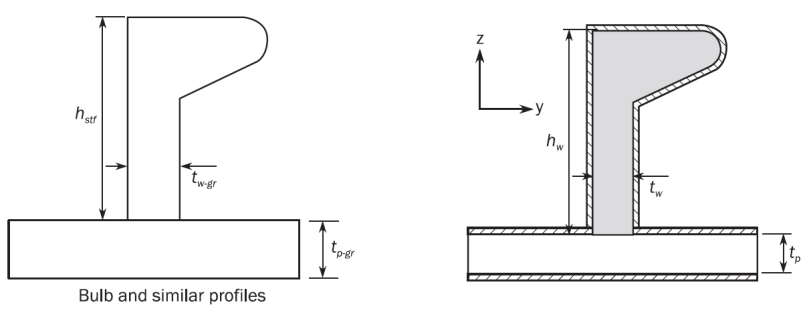
