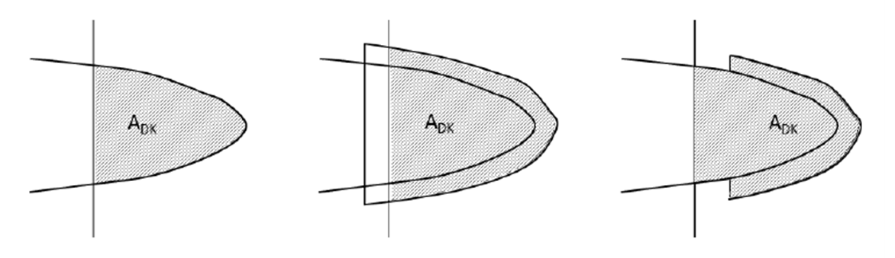
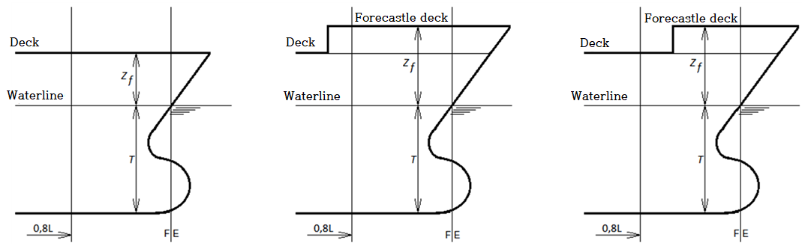
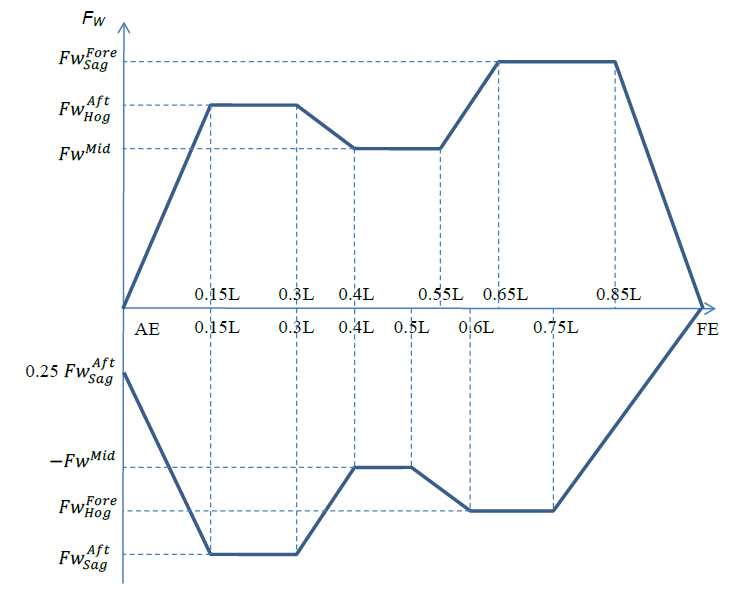
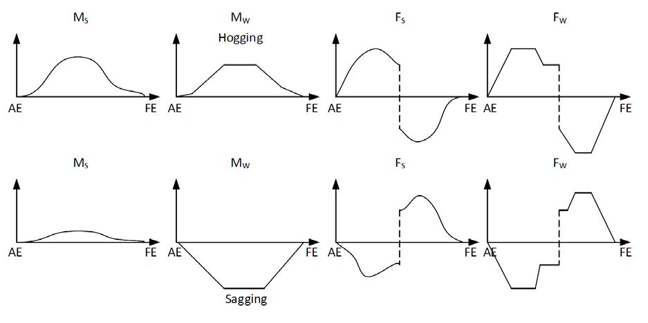
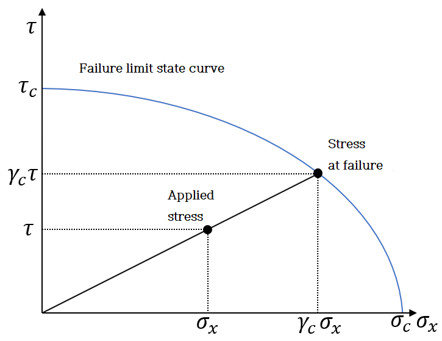
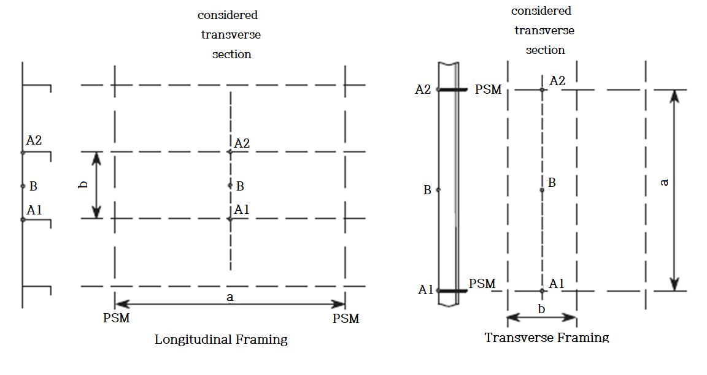

# PART 7 Ships of Special Service (Ch1-4, 7-10)

> RULES FOR CLASSIFICATION OF STEEL SHIPS / RA-07A-E / 2025 / EN / Guidance

## CHAPTER 2 ORE CARRIERS

### Section 1 General

#### 101. Application 【See Rule】

- **1.** **1**. In case of the ships have no experience the structural analysis of fore/aft body is in accordance with **103.** and **104.**
- **2.** **2**. The special feature notation GRAB [X] is assigned, in accordance with maximum specific weight up to [X] tons of grab which is used during strength review of **Ch 2**.
- **3.** In application to **101. 4** of the Rules, the term "deemed appropriate by the Society" means to comply with the direct strength calculation specified in **Pt 3, Ch 1, 206.** of the Rules, or to accept in accordance with **Pt 1, Ch 1, 105.** of the Rules.

### Section 3 Wing Tanks or Void Spaces

#### 304. Girder 【See Rule】

- **1.** In tanks and spaces other than water ballast tanks, the thickness of transverses and swash bulkheads may be reduced by 1.0 $\mathrm{mm}$, except where the provisions of **301.** of the Rules, are to be applied.
- **2.** Measurement of span $l$ ($l _{0}$, $l _{1}$ and $l _{2}$) of transverses in wing tanks and void spaces
  Where the web under consideration and the adjacent web do not cross at a right angle to each other, $l$ is to be as specified in **Fig 7.2.13.**
  
  **Fig 7.2.13 Measurement of** #eqnID-238
- **3.** The structural details of transverses and struts are to be in accordance with the following (1) to (3):
  - **(1)** General

    |  |
    | --- |
    | **Fig 7.2.14 Locations and Dimensions of Lightening Holes** |

    
    **Fig 7.2.15**

    **Table 7.2.9 Extents of reinforcement**

    | Member | Extent of reinforcement |
    | --- | --- |
    | Bottom transverse | All connections |
    | Side transverse | All connections below the upper end of curvature of upper cross tie, or the load waterline, whichever is the higher. In ships of 300 $\mathrm{m}$ and above in length, it is recommended that similar reinforcement be applied in wider extent upward beyond the limit stipulated above. |
    | Vertical webs on longitudinal bulkhead | All connections below the upper end of curvature of upper cross tie. |
    - **(A)** The dimensions and locations of lightening holes, where provided, are to be as shown in Fig **7.2.14**.
    - **(B)** Slots are to be reinforced with collars where flanges of longitudinals are facing each other or where slots are provided at small intervals as is often the case with bilge part.
    - **(C)** Where the depth of a girder is smaller than the required depth, its section modulus is to be obtained through multiplying the required section modulus by the ratio of required depth to the actual depth.
    - **(D)** In pump rooms or void spaces, the web thickness may be 1 $\mathrm{mm}$ smaller than the required thickness for webs in cargo oil tanks.
    - **(E)** Connection of web plates is to be of butt-welding. If lap-welding is adopted, stiffeners are to be provided across the connection lines.
    - **(F)** In end bracket parts, at connections with cross ties, etc. of transverses where sharing stress and/or compressive stress are expected to be high, additional stiffeners are to be fitted. These parts are not to have lightening holes. If considered necessary, slots for penetration of longitudinals in these parts are to be reinforced with collars. Sufficient consideration is to be taken for continuity of strength at the connection between struts and longitudinal (for example, soft brackets are to be provided on the both sides of transverse). *(2019)*
    - **(G)** No scallop is to be permitted in the web plate at the connections of face plates or webs. Inevitable scallops for work are to be filled up by welding. For face plates adjacent to the scallop, abrupt change of dimensions is to be avoided carefully. (See **Fig 7.2.15**)
    - **(H)** The radius of the rounded corner of longitudinals and transverses is to be as large as practicable.
    - **(I)** Where angle bars are used instead of flat bars as stiffeners of transverses, etc., their section modulus with effective plates is to be approximately equivalent to the required ones.
    - **(J)** Where longitudinal frames or stiffeners penetrate bottom transverses, side transverses and vertical webs on longitudinal bulkhead, proper reinforcement is to be made in the extents stipulated in **Table 7.2.9** by fitting brackets on the opposite side of stiffeners on webs of transverse, for connecting longitudinals to transverse, by fitting collars at slots, or by other suitable means. In ships not exceeding 230 $\mathrm{m}$ in length, however, the extent of application of such reinforcement may be properly reduced. This reinforcement is to apply to the slots under conditions similar to those in the above-mentioned girders or transverses(for example, slots in transverse swash bulkheads, etc.)
  - **(2)** The construction at the position of floors within the intersection of the inner bottom plating and longitudinal bulkhead is to comply with the following (A) and (B):
    
    **Fig 7.2.16**
    - **(A)** Scallops at the above-mentioned intersections in transverses of wing tanks are to be filled up by welding or closed with collar plates. (See **Fig 7.2.16**)
    - **(B)** Transverses of wing tanks on the extended line of the inner bottom plating are to be fitted with gusset plates. (See **Fig 7.2.16**)

### Section 5 Relative Deformation of Wing Tanks

#### 501. Relative deformation of wing tanks 【See Rule】

- **1.** Where the longitudinal bulkheads are inclined, $a$ and $b$ are to be so taken that the hatched areas may be same as shown in **Fig 7.2.17**.
  
  **Fig 7.2.17**
- **2.** Special considerations for the case of exceeding limit values and how to measure mean thickness of transverse bulkhead plating are given in the following (1) and (2):
  - **(1)** Special considerations for the case of exceeding limit values
    It is required to submit data enough to prove that the proposed construction has an equivalent effectiveness.
  - **(2)** Mean thickness in formulae
    The mean thickness of plating in the formulae in **501.** of the Rules is to be obtained from the following formula.
    $t = \frac{smallsuml_i t_i}{smallsuml_i}$
    where :
    $l_i$ and $t_i$ are to be taken as follows;
    
    **Fig 7.2.18**
    **Fig 7.2.19**
    - **(A)** Transverse bulkheads and perforated swash bulkheads : The thickness and breadth of each strake of the bulkhead are to be taken at the middle of the breadth of the tank as shown in **Fig 7.2.18.**
    - **(B)** Transverse rings and swash bulkheads of transverse ring type: The thickness and vertical extent of the deck transverse, transverse on longitudinal bulkhead between face bar of deck transverse and upper face bar of the uppermost strut and so on, and parts from the uppermost strut to the bottom transverse are to be taken at the middle of the breadth of the tank (at the bulkhead side if no plating is present at the middle of the breadth of the tank) as shown in **Fig 7.2.19.**

### Section 7 Ore/Oil Carriers

#### 701. General 【See Rule】

- **1.** **General**
  The construction, arrangement and equipment of ore/oil carriers are to be in accordance with the following, in addition to the provisions in **701. 2** of the Rules.
  - **(1)** The piping arrangement is to comply with **Par 3.**
  - **(2)** The length of combined ore holds/cargo oil tanks is to comply with **Pt 3, Ch 15, 103. 1.**
  - **(3)** Any openings which may be used for cargo operations are not to be fitted to bulkheads and decks separating the cargo oil tanks (including combined ore holds/cargo oil tanks) designed and equipped for the carriage of oil having a flash point below 60°C from other spaces not designed and equipped for the carriage of oil having a flash point below 60°C.
  - **(4)** When used as ore carrier, all compartments except slop tanks are to be gas-freed.
  - **(5)** As for the equipment, required time, etc. for cleaning and gas-freeing of cargo oil tanks, design documents are to be submitted to the Society for reference.
  - **(6)** At the time of approval of plans of ore/oil carriers, manuals containing precautions needed in the process of works for converting from oil tanker into ore carrier and vice versa are to be submitted to the owner and their copies submitted to the Society.
- **2.** **Construction of pump rooms**
  - **(1)** The bottom of pump room of ore/oil carrier is to be constructed with particular care for the continuity of structural members.
    Height : same as double bottom in the hold space
    Thickness : same as centre girder in the hold space
    Number : if $b$≤15 $\mathrm{m}$------ 2 lines each side,
    if $b$＞15 $\mathrm{m}$------ 3 lines each side,
    Thickness : same as centre girder
    Height : greater than double bottom height in engine room
    It is recommended that the side girders be as high as possible.
    The total sectional area of face plates of girders (including total sectional areas of horizontal girders on longitudinal bulkheads, if any) is not to be less than 35 $\%$ of the sectional area of inner bottom in the hold space.
    The section modulus of bottom longitudinals $Z$ is to be 10 $\%$ times of that obtained from the formula in **Ch 1, 302** of the Rules. However, it is not to be less than that obtained from the following formula:
    $Z = 290 d S \mathrm{cm^3 }$
    where :
    $d$ = draft ($\mathrm{m}$)
    $S$ = space of longitudinal ($\mathrm{m}$)
    One of side girders as per (C) above may be omitted, provided that the thickness of bottom shell plating under the pump room is increased by 2 $\mathrm{mm}$ in excess of the required thickness (including tapering).
    - **(A)** The longitudinal bulkheads in the hold space are to be extended aft as far as practicable. Deep horizontal girders are to be provided on the longitudinal bulkheads at the level of the inner bottom in the hold space. The webs of these girders are to be of approximately same thickness as the inner bottom.
    - **(B)** Centre girder
    - **(C)** Side girders
    - **(D)** Sectional area of face plates of girders
    - **(E)** Bottom longitudinals
    - **(F)** Omission of side girders
    - **(G)** If high tensile steel is used for deck plating over the pump room, the sectional area of deck in this part is to be suitably increased in excess of the required area.
- **3.** **Piping systems**
  - **(1)** Application
    This requirements apply to piping systems and venting systems of ships designed to carry oil or alternatively solid cargoes in bulk.
  - **(2)** Terminology
    - **(A)** Combination carrier is a ore/oil carrier specified in **701. 1** of the Rule and a B/O carrier specified in **Ch 3, 801. 1** of the Rules.
    - **(B)** Slop tank is a tank which is provided mainly for the carriage of tank washings and cargo oil and which is designed to be capable of loading oil whose flash point does not exceed 60${}^{\circ}\mathrm{C}$ when the ship is in the dry cargo mode.
    - **(C)** Solid cargo/oil hold is a compartment which is used as a solid cargo stowing hold when the ship is in the dry cargo mode and which is used as a cargo oil tank when the ship is not in the dry cargo mode.
    - **(D)** Ballast/solid cargo hold is a compartment which is used as an exclusive tank for ballast adjacent to a cargo oil tank when the ship is not in the dry cargo mode and which is used as a solid cargo stowing hold when the ship is in the dry cargo mode.
    - **(E)** Exclusive solid cargo hold is a compartment which is used as a void space adjacent to a cargo oil tank when the ship is not in the dry cargo mode and which is used as a solid cargo stowing hold when the ship is in the dry cargo mode.
    - **(F)** Oil/ballast tank is a tank which is used as a cargo oil tank when the ship is not in the dry cargo mode and which is used as a ballast tank or void space when the ship is in the dry cargo mode.
    - **(G)** Exclusive ballast tank is a compartment which is adjacent to a cargo oil tank when the ship is not in the dry cargo mode and which is used as an exclusive tank for ballast even when the ship is in or not in the dry cargo mode.
    - **(H)** Cargo hold is a general term for solid cargo/oil hold, ballast/solid cargo hold and exclusive solid cargo hold.
    - **(I)** Cargo oil tank is a general term for solid cargo/oil hold, oil/ballast tank and slop tank.
  - **(3)** Bilge Piping Systems
    For exclusive bilge suction pipes, branch bilge suction pipes are to comply with the requirements in **Pt 5, Ch 6, Sec 4** in addition to the requirements in (C). In calculating the inside diameter of the branch bilge suction pipes for draining cargo hold bilge of ore/oil carriers, the mean width of cargo hold may be used in lieu of $B$. Bilge suction pipes which are also used as a cargo oil pipe or which are connected to eductors are to be as specified in **Table 7.2.10** in addition to comply with the requirements in (b) and ©.

    **Table 7.2.10 Bilge suction arrangement in cargo hold (common service piping or using eductor)**

    | Type of cargo hold | Bilge suction main | Bilge suction branch | Bilge well | Provisions of valve, blind flange, etc.(3) |
    | --- | --- | --- | --- | --- |
    | Solid cargo/oil hold | common service with cargo oil main | Exclusive | Exclusive | Screw-down non-return valve for branch line; blind flange for open end(1) |
    | Solid cargo/oil hold | common service with cargo oil main | Partial common service(2) | Exclusive(2) | Screw-down non-return valve and blind flange for bilge suction branch line |
    | Solid cargo/oil hold | common service with cargo oil main | Common service with cargo oil suction branch line | Common service with cargo oil suction well | Screw-down non-return valve for branch line |
    | Solid cargo/oil hold | use of eductor | ─ | Exclusive | Screw-down non-return valve for branch line; blind flange for open end |
    | Ballast/solid cargo hold | common service with cargo oil main | Exclusive | Exclusive | Screw-down non-return valve for branch line; blind flange for open end |
    | Ballast/solid cargo hold | use of eductor | ─ | ─ | Screw-down non-return valve for Suction side; blind flange for open end |
    | Segregated solid cargo hold | common service with cargo oil main | Exclusive | Exclusive | Screw-down non-return valve for suction side; blind flange for open end |
    | Segregated solid cargo hold | use of eductor | ─ | Exclusive | Screw-down non-return valve for branch line |
    | (Remark) (1) Wells are to be closed with blind plates or open ends are to be closed with blind flange (2) As specified in the example of **Fig 7.2.20.** (3) Valves, in each case, are to be capable of being operated at control position above the bulkhead deck |   |   |   |   |
    - **(A)** Bilge piping systems for the cargo holds are not to be led to the engine room. The cargo oil pump may be used for the purpose of bilge suction on condition that the cargo oil piping systems in the cargo oil pump room used for the bilge suction comply with the requirements in **Pt 5, Ch 6, 404.** and **405.** of the Rules.
    - **(B)** Bilge suction pipes for the cargo holds
      - **(a)** Where two or more cargo oil piping systems (e.g. main and stripping lines) are provided or cargo oil piping systems are provided independently for the oil/ballast tanks and cargo holds and where these cargo oil piping systems are so arranged that liquid in all or selected oil/ballast tanks and cargo holds can be discharged (for the oil/ballast tanks, include the filling of ballasting water) simultaneously when the ship is in the dry cargo mode, these cargo oil pipes may be used as the bilge suction pipes for cargo holds. The diameter of these cargo oil pipes used as bilge suction pipes is not to be less than that specified for the bilge suction pipes.
      - **(b)** Where bilge suction pipes are provided for the exclusive use, an exclusive pump for bilge suction is to be provided in the cargo oil pump room or the bilge suctions are to be connected to the cargo oil pump in the cargo oil pump room. Where cargo oil pumps are used as a bilge pump, a stop valve and a screw-down non-return valve are to be provided at the connection between the bilge pipe and cargo oil pump.
    - **(C)** Bilge suctions in cargo holds
      - **(a)** In general, one bilge suction is to be arranged on each side of the after end of the cargo hold. Where the length of cargo hold in ships having only one cargo hold exceeds 66 $m$, an additional bilge suction is to be arranged in a suitable position in the forward half-length of the hold.
      - **(b)** Bilge wells are to be arranged at suitable positions so as to protect the cover plates from the direct strike of solid cargoes, and to be provided with rose boxes or other suitable means so that the suction may not be choked by ore dust, etc.
      - **(c)** Bilge wells in solid cargo/oil holds and ballast/solid cargo holds, except where these bilge wells are also used as cargo oil suction wells, are to be provided with cover plates to blank off these wells or to be provided with blind flanges to blank off the open ends of the bilge suction pipes when the ship is not in the dry cargo mode.
    - **(D)** Bilge suction pipes
  - **(4)** Cargo Oil Piping Systems
    
    **Fig 7.2.20 Examples of bilge suction arrangement in solid cargo/oil hold** 
    **Fig 7.2.21 Examples of piping system of slop tank**
    - **(A)** Cargo oil piping systems, except for cargo oil pipes connected to the slop tanks specified in (5), are to be completely gas-freed when the ship is in the dry cargo mode.
    - **(B)** Cargo oil suctions in solid cargo/oil hold, except where these suctions are also used as bilge suctions, are to be provided with blank flanges to blank off the open end of the cargo oil suction pipes or to be provided with cover plates to blank off the cargo oil suction wells when the ship is in the dry cargo mode.
    - **(C)** Means are to be provided for isolating the piping connecting to the cargo oil pump room with the slop tanks where slop may be carried on dry cargo mode. The means of isolation are to consist of a valve followed by a spectacle flange or a spool piece with appropriate blank flanges. This arrangement is to be located adjacent to the slop tanks, but where this is unreasonable or impracticable it may be located within the pump room directly after the piping penetrates the bulkhead.(See **Fig 7.2.21**)
    - **(D)** A separate pumping and piping arrangement is to be provided for discharging the contents of the slop tanks directly over the open deck when the ship is in the dry cargo mode.
    - **(E)** Cargo oil lines below deck are to be installed inside the cargo wing tanks or to be placed in special ducts which are to be capable of being adequately cleaned and ventilated.
  - **(5)** Ventilating systems
    - **(A)** Combination carriers which are not provided with slop tanks are to comply with the requirements in **Ch 1, 1004.** of the Rules for the ventilating systems for cargo oil tanks of oil tankers.
    - **(B)** Vent pipes for slop tanks are to be led to a suitable position in the open air so as to preclude any danger in case where oil having a flash point not exceeding 60°C is carried therein when the ship is in the dry cargo mode. Where vent pipes for slop tanks are connected to the vent pipes for the cargo oil tanks, a change-over device is to be provided to prevent the vapour in the slop tanks from entering into other compartments when the ship is in the dry cargo mode. This change-over device is in general to consist of a valve followed by a blank flange.
    - **(C)** All cargo spaces and any enclosed spaces adjacent to cargo spaces are to be capable of mechanically ventilated. The mechanical ventilation may be provided by portable fans. 
