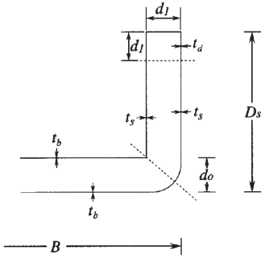
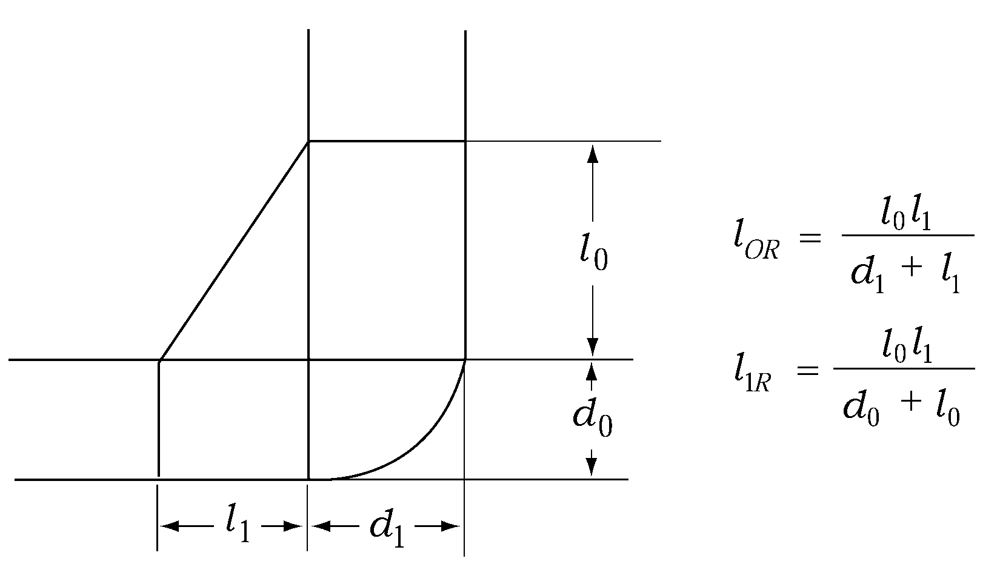
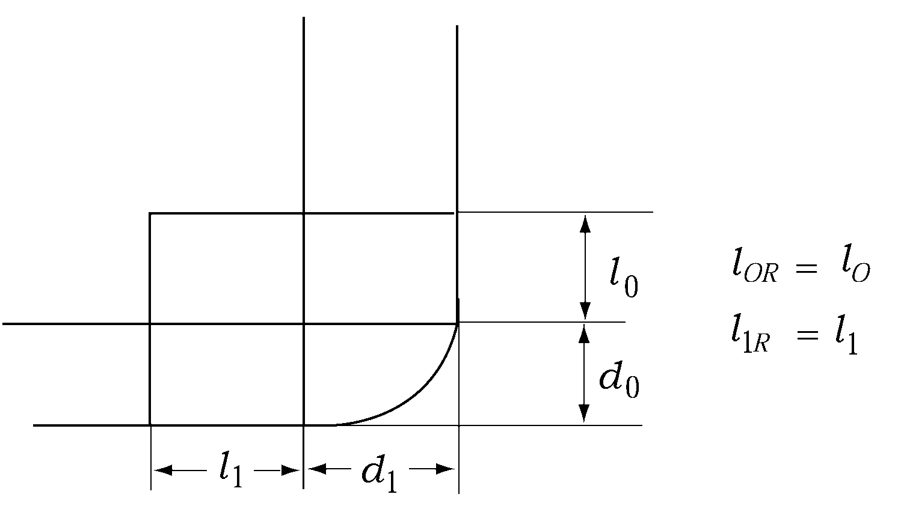

# PART 7 Ships of Special Service (Ch1-4, 7-10)

> RULES FOR CLASSIFICATION OF STEEL SHIPS / RA-07A-E / 2025 / EN / Guidance

## CHAPTER 4 CONTAINER SHIPS

### Section 1 General

#### 101. Application 【See Rule】

- **1.** **1**. In application to **101. 4** of the Rules, the term "discretion of the Society" means to comply with the direct strength calculation specified in **Pt 3, Ch 1, 206.** of the Rules, or to accept in accordance with **Pt 1, Ch 1, 105.** of the Rules.
- **2.** **2**. In application to **101. 6** of the Rules, the requirements in this Chapter may be applied to a vessel recognized as a sister-ship or where the Society specifically recognizes them. *(2022)*

### Section 2 Longitudinal Strength

#### 205. Torsional strength 【See Rule】

The torsional strength of hull at each sectional position from the collision bulkhead to the watertight bulkhead at the fore end of the machinery space is to be such that the following relationship is satisfied.
$\sqrt {(0.75 \sigma _{V} ) ^{2} + \sigma _{H} ^{2} + \sigma _{W} ^{2}} + \left| \sigma _{S} \right| \leq 175/K \right.$
where:
$\sigma_S$ = the longitudinal bending stress by the longitudinal bending moment in still water as obtained from the following formula
$\sigma_S = M_S /Z_V \times 1000 \mathrm{N/mm^2 }$
$\sigma_V$ = the longitudinal bending stress by the longitudinal bending moment in wave as obtained from the following formula
$\sigma_V = M_W /Z_V \times 1000 \mathrm{N/mm^2 }$
$\sigma_H$ = the horizontal bending stress by the horizontal bending moment in wave as obtained from the following formula
$\sigma_H = M_H /Z_H \times 1000 \mathrm{N/mm^2 }$
$M_S$, $M_W$ = as specified in **202.** of the Rules
$M_H$ = the horizontal bending moment as obtained from the following formula:
$M_H = 0.45C_1 L^2 d (C_b + 0.05) C_H \mathrm{kN ­ m}$
$C_H$ = coefficient as given in **Table 7.4.1** whose value depends on the ratio of the distance $X$ ($\mathrm{m}$) from the aft end of $L$ to the position of the section under consideration, where intermediate values are to be determined by interpolation.

**Table 7.4.1 Coefficient** $C_H$

| $X/L$ | 0.0 | 0.4 | 0.7 | 1.0 |
| --- | --- | --- | --- | --- |
| $C_H$ | 0.0 | 1.0 | 1.0 | 0.0 |

$Z_V$ = section modulus of strength deck with respect to longitudinal bending of hull at the position of the section under consideration ($\mathrm{cm}^3$).
$Z_H$ = section modulus of hatch side with respect to horizontal bending of hull at the position of the section under consideration ($\mathrm{cm}^3$).
$C_1$ = as specified in **Pt 3, Ch 3, Table 3.3.1** of the Rules
$\sigma _{W}$ = warping stress due to bending torsion of hull, which is to be in accordance with the discretion of the Society. But, the value of bending torsion of hull is calculated according to the following formula
$M_T = M_\frac{0}{2} left(1 - \cos \frac{2\pi}{L} X right) \mathrm{kN ­ m}$
$M_0 = 7.0 K_2 C_W^2 B^3 left(1.75 +1.5 \frac{e}{D_S} right) \mathrm{kN ­ m}$
$C_W$ = water plane area coefficient.
$e$ = the distance from the top of keel to the shear centre ($\mathrm{m}$). For which is in the below of top of keel, $e$ is taken as positive and it may given by the following formula.
$e= e _{1} - \frac{d _{0}}{2}$
$e _{1}$ : as given by the following formula.
$e _{1} = \frac{\left( 3D _{1} - d _{1} \right) d _{1} t _{d} + \left( D _{1} -d _{1} \right) ^{2} t _{s}}{3 d _{1 } t _{d} + 2 \left( D _{1} -d _{1} \right) t _{s} +B _{1} t _{b} / 3}$
$d _{0}$ : height of double bottom($\mathrm{m}$)
$d _{1}$ : breadth of double hull side($\mathrm{m}$)
$D _{ 1}$ : as given by the following formula.
$D _{1} = D _{ S} - \frac{d _{0}}{2}$
$B _{ 1}$ : as given by the following formula.
$B _{1} = B - d _{1}$
$t _{d} , t _{s} , t _{b}$ : mean thickness($\mathrm{m}$) of deck, ship's side, and bottom specified in **Fig 7.4.1.**
Mean thickness may be determined including all the longitudinal strength members
within this range.

**Fig 7.4.1**
$K_2$ = as given by the following formula:
$L < 300 m$ : $K_2 = \sqrt{1- left(300-\frac{L}{300} right)^2$
$L \geq 300 m$ : $K_2 = 1.0$
$X$ = distance from the aft end to considering section ($\mathrm{m}$)

### Section 3 Double Bottom Construction

#### 302. Longitudinals 【See Rule】

Where the widths of vertical stiffeners on floor plates and vertical struts are specially large, the coefficient $C$ prescribed in **Table 7.4.1** of the Rules may be modified as prescribed in **Pt 3, Ch 7, 403. 2.**

### Section 4 Double Side Construction

#### 401. General 【See Rule】

- **1.** Where the breadth of double side construction varies in the bilge part, *t*_1 in **Table 7.4.2** of the Rules is to be determined as follows:
  - **(1)** $\beta_T$ and $\beta_L$ are to be obtained from the following formulae:
    $\beta _{T} =1+ \frac{0.42 \left( \frac{B}{D _{S}} \right) ^{2} -0.5}{0.59 \frac{D _{S} - \frac{d _{0}}{2} -l _{OR}}{B-d _{1} -2 l _{1R}} \left( \frac{d _{0}}{d _{1}} \right) ^{2} +1.0}$, $\beta _{L} =1+ \frac{0.18 \left( \frac{B}{D _{S}} \right) ^{2} -0.5}{0.59 \frac{D _{S} - \frac{d _{0}}{2} -l _{OR}}{B-d _{1} -2 l _{1R}} \left( \frac{d _{0}}{d _{1}} \right) ^{2} +1.0}$
    $l_OR$ and $l _{1R}$ are to be obtained as follows:
    
    **Fig 7.4.2** 
    **Fig 7.4.3**
  - **(2)** The lower end of $h$ is to be a point at a height of $l_OR$ above the inner bottom.
  - **(3)** $(d - l_OR +0.038 L')$ is to be substituted for $(d+ 0.038 L')$.
- **2.** Where the height from the designed maximum load line to the strength deck is usually large, *t*_1 as per **Table 7.4.2** is to be calculated as follows
  - **(1)** $\beta_T$ and $\beta_L$ are to be obtained from the following formulae:
    $\beta _{T} =1+ \frac{0.42 \frac{B ^{2}}{D _{S} D '} -0.5}{0.59 \frac{D _{S} - \frac{d _{0}}{2}}{B-d _{1}} \left( \frac{d _{0}}{d _{1}} \right) ^{2} +1.0}$, $\beta_L = 1+ {0.18 B^\frac{2}{D_S D'} - 0.5} over {0.59 \frac{D_S - d_\frac{0}{2}}{B}-d_1 left(d_\frac{0}{d_1} right)^2 + 1.0$
    where :
    $D'$ = depth of the ship ($\mathrm{m}$), where the imaginary freeboard deck is provided according to **Pt 3, Ch 1, 203. 2.** (1). $D'$ may be the height from the top of keel to this assumed deck ($\mathrm{m}$).
  - **(2)** The value obtained from the following formula is to be substituted for $(d + 0.038L')$
    $(d + 0.038L' ) \sqrt{D' over D_S}$
    where :
    $D'$ = as specified in (1).
- **3.** If there is a combination of a cross-tie having an ample sectional area and non-watertight partial bulkhead or any similar construction is provided midway in the hold, the $l_h$ in provisions in **Table 7.4.2** may be measured from the bulkhead to such a construction.
- **4.** In case where the breadth of angles or flat bars supporting stiffeners in double hull of side construction is unusually large, scantlings of stiffeners may be determined in accordance with the provision of **Pt 3, Ch 7, 403. 2.**

#### 402. Side transverse and side stringer 【See Rule】

The thickness of side transverse girders for shear force and shear buckling strength is not to be less than that obtained from the **Table 7.4.2** in addition to the requirement of Rules, whichever is greatest.

**Table 7.4.2 The thickness of side transverse and side stringer**

| Division | Thickness ($\mathrm{mm}$) |   |   |   |   |   |   |   |   |   |
| --- | --- | --- | --- | --- | --- | --- | --- | --- | --- | --- |
| Side transverse and Side stringer | $t_1 = 0.083 \frac{CS l_h}{d_1 - a} (d + 0.038L') + 1.5$, $t _{2} =8.6 root {3} of {\frac{d _{1} ^{2} (t _{1} -1.5)}{k}} +1.5$ |   |   |   |   |   |   |   |   |   |
| C : as specified in the following Table. |   |   |   |   |   |   |   |   |   |   |
| Side transverse |   | Side stringer |   |   |   |   |   |   |   |   |
| $C = (C_1 + \beta_T C_2 )C_3$ $\beta _{T} =1+ \frac{0.42 \left( \frac{B}{D _{S}} \right)^2 -0.5}{0.59 \frac{left(D _{S} - \frac{d _{0}}{2}right)}{(B-d _{1})} \left( \frac{d _{0}}{d _{1}} \right) ^{2} +1.0}$ $C_1$, $C_2$ = as obtained from the following table, in accordance with the value of $h/l_h$. For intermediate values of $h/l_h$, the values of $C_1$ and $C_2$ are to be determined by linear interpolation. **Table 7.4.2 The thickness of side transverse and side stringer** Division ; Thickness ($\mathrm{mm}$) Side transverse and Side stringer ; $t_1 = 0.083 \frac{CS l_h}{d_1 - a} (d + 0.038L') + 1.5$, $t _{2} =8.6 root {3} of {\frac{d _{1} ^{2} (t _{1} -1.5)}{k}} +1.5$ C : as specified in the following Table. Side transverse ; Side stringer $C = (C_1 + \beta_T C_2 )C_3$ $\beta _{T} =1+ \frac{0.42 \left( \frac{B}{D _{S}} \right)^2 -0.5}{0.59 \frac{left(D _{S} - \frac{d _{0}}{2}right)}{(B-d _{1})} \left( \frac{d _{0}}{d _{1}} \right) ^{2} +1.0}$ $C_1$, $C_2$ = as obtained from the following table, in accordance with the value of $h/l_h$. For intermediate values of $h/l_h$, the values of $C_1$ and $C_2$ are to be determined by linear interpolation. $h/l_h$ ; $C_1$ ; $C_2$ 0.5 and under ; 0.18 ; 0.05 0.75 ; 0.21 ; 0.08 1.00 ; 0.24 ; 0.09 1.25 ; 0.25 ; 0.10 1.50 ; 0.26 ; 0.11 1.75 and above ; 0.27 ; 0.12 $h/l_h$ $C_1$ $C_2$ 0.5 and under 0.18 0.05 0.75 0.21 0.08 1.00 0.24 0.09 1.25 0.25 0.10 1.50 0.26 0.11 1.75 and above 0.27 0.12 $C_3$ = as obtained from the following formula, but not to be less than 0.2. $C_3 = 1 - 1.8 \frac{y}{h}$ ; $C=(C _{1} - \beta _{L} C _{2} )C _{3}$ $\beta _{L} =1+ \frac{0.42 \left( \frac{B}{D _{S}} \right)^2 -0.5}{0.59 \frac{left(D _{S} - \frac{d _{0}}{2}right)}{(B-d _{1})} \left( \frac{d _{0}}{d _{1}} \right) ^{2} +1.0}$ $C_1$, $C_2$ = as obtained from the following table, in accordance with the value of $h/l_h$. For intermediate values of $h/l_h$, the values of $C_1$ and $C_2$ are to be determined by linear interpolation. $h/l_h$ ; $C_1$ ; $C_2$ 0.5 and under ; 0.20 ; 0.07 0.75 ; 0.24 ; 0.05 1.00 ; 0.26 ; 0.03 1.25 ; 0.01 1.50 and above ; 0.00 $h/l_h$ $C_1$ $C_2$ 0.5 and under 0.20 0.07 0.75 0.24 0.05 1.00 0.26 0.03 1.25 0.01 1.50 and above 0.00 $C_3$ = as obtained from the following formula $C _{3} = \left\| 1- \frac{2x}{l _{h}} \right\|$ $h/l_h$ ; $C_1$ ; $C_2$ 0.5 and under ; 0.18 ; 0.05 0.75 ; 0.21 ; 0.08 1.00 ; 0.24 ; 0.09 1.25 ; 0.25 ; 0.10 1.50 ; 0.26 ; 0.11 1.75 and above ; 0.27 ; 0.12 $h/l_h$ ; $C_1$ ; $C_2$ 0.5 and under ; 0.20 ; 0.07 0.75 ; 0.24 ; 0.05 1.00 ; 0.26 ; 0.03 1.25 ; 0.01 1.50 and above ; 0.00 $h$ = vertical distance from the top of inner bottom to the strength deck at side($\mathrm{m}$) $l_h$ = length of hold($\mathrm{m}$) $d_0$ = height of centre girder($\mathrm{m}$) $L'$ = length of ship($\mathrm{m}$). Where, however, $L$ exceeds 230 m, $L'$ is to be taken as 230 $\mathrm{m}$. $d_1$ = depth of side transverse or side stringer($\mathrm{m}$). where, the depth of webs is divided by providing stiffeners in the direction of the length of girder on the webs, $d_1$ in the formulae for $t_2$ may be taken as the divided depth. $S$ = width of the area supported by the side transverse girders($\mathrm{m}$) $a$ = depth of the openings at the location under consideration($\mathrm{m}$) $S_2$ = $S_1$ or $d_1$, whichever is smaller $y$ = distance from the lower end of $h$ to the location under consideration($\mathrm{m}$) $x$ = distance from the end of $l_h$ to the location under consideration($\mathrm{m}$) $k$ = coefficient obtained from table in accordance with the ratio of the spacing $S_1$ ($\mathrm{m}$) of the stiffeners provided in the direction of the depth of girder on the web of side transverse girder and $d_1$. For intermediate values of $S_1 /d_1$, the value of $k$ is to be determined by linear interpolation. $S_1 /d_1$ ; 0.3 and under ; 0.4 ; 0.5 ; 0.6 ; 0.7 ; 0.8 ; 0.9 ; 1.0 ; 1.5 ; 2.0 and above $k$ ; 60 ; 40 ; 26.8 ; 20 ; 16.4 ; 14.4 ; 13.0 ; 12.3 ; 11.1 ; 10.2 $S_1 /d_1$ 0.3 and under 0.4 0.5 0.6 0.7 0.8 0.9 1.0 1.5 2.0 and above $k$ 60 40 26.8 20 16.4 14.4 13.0 12.3 11.1 10.2 $S_1 /d_1$ ; 0.3 and under ; 0.4 ; 0.5 ; 0.6 ; 0.7 ; 0.8 ; 0.9 ; 1.0 ; 1.5 ; 2.0 and above $k$ ; 60 ; 40 ; 26.8 ; 20 ; 16.4 ; 14.4 ; 13.0 ; 12.3 ; 11.1 ; 10.2 $h/l_h$ $C_1$ $C_2$ 0.5 and under 0.18 0.05 0.75 0.21 0.08 1.00 0.24 0.09 1.25 0.25 0.10 1.50 0.26 0.11 1.75 and above 0.27 0.12 $C_3$ = as obtained from the following formula, but not to be less than 0.2. $C_3 = 1 - 1.8 \frac{y}{h}$ |   | $C=(C _{1} - \beta _{L} C _{2} )C _{3}$ $\beta _{L} =1+ \frac{0.42 \left( \frac{B}{D _{S}} \right)^2 -0.5}{0.59 \frac{left(D _{S} - \frac{d _{0}}{2}right)}{(B-d _{1})} \left( \frac{d _{0}}{d _{1}} \right) ^{2} +1.0}$ $C_1$, $C_2$ = as obtained from the following table, in accordance with the value of $h/l_h$. For intermediate values of $h/l_h$, the values of $C_1$ and $C_2$ are to be determined by linear interpolation. $h/l_h$ ; $C_1$ ; $C_2$ 0.5 and under ; 0.18 ; 0.05 0.75 ; 0.21 ; 0.08 1.00 ; 0.24 ; 0.09 1.25 ; 0.25 ; 0.10 1.50 ; 0.26 ; 0.11 1.75 and above ; 0.27 ; 0.12 $h/l_h$ $C_1$ $C_2$ 0.5 and under 0.20 0.07 0.75 0.24 0.05 1.00 0.26 0.03 1.25 0.01 1.50 and above 0.00 $C_3$ = as obtained from the following formula $C _{3} = \left\| 1- \frac{2x}{l _{h}} \right\|$ |   |   |   |   |   |   |   |   |
| **Table 7.4.2 The thickness of side transverse and side stringer** |   |   |   |   |   |   |   |   |   |   |
| Division | Thickness ($\mathrm{mm}$) |   |   |   |   |   |   |   |   |   |
| Side transverse and Side stringer | $t_1 = 0.083 \frac{CS l_h}{d_1 - a} (d + 0.038L') + 1.5$, $t _{2} =8.6 root {3} of {\frac{d _{1} ^{2} (t _{1} -1.5)}{k}} +1.5$ |   |   |   |   |   |   |   |   |   |
| C : as specified in the following Table. |   |   |   |   |   |   |   |   |   |   |
| Side transverse |   | Side stringer |   |   |   |   |   |   |   |   |
| $C = (C_1 + \beta_T C_2 )C_3$ $\beta _{T} =1+ \frac{0.42 \left( \frac{B}{D _{S}} \right)^2 -0.5}{0.59 \frac{left(D _{S} - \frac{d _{0}}{2}right)}{(B-d _{1})} \left( \frac{d _{0}}{d _{1}} \right) ^{2} +1.0}$ $C_1$, $C_2$ = as obtained from the following table, in accordance with the value of $h/l_h$. For intermediate values of $h/l_h$, the values of $C_1$ and $C_2$ are to be determined by linear interpolation. $h/l_h$ ; $C_1$ ; $C_2$ 0.5 and under ; 0.18 ; 0.05 0.75 ; 0.21 ; 0.08 1.00 ; 0.24 ; 0.09 1.25 ; 0.25 ; 0.10 1.50 ; 0.26 ; 0.11 1.75 and above ; 0.27 ; 0.12 $h/l_h$ $C_1$ $C_2$ 0.5 and under 0.18 0.05 0.75 0.21 0.08 1.00 0.24 0.09 1.25 0.25 0.10 1.50 0.26 0.11 1.75 and above 0.27 0.12 $C_3$ = as obtained from the following formula, but not to be less than 0.2. $C_3 = 1 - 1.8 \frac{y}{h}$ |   | $C=(C _{1} - \beta _{L} C _{2} )C _{3}$ $\beta _{L} =1+ \frac{0.42 \left( \frac{B}{D _{S}} \right)^2 -0.5}{0.59 \frac{left(D _{S} - \frac{d _{0}}{2}right)}{(B-d _{1})} \left( \frac{d _{0}}{d _{1}} \right) ^{2} +1.0}$ $C_1$, $C_2$ = as obtained from the following table, in accordance with the value of $h/l_h$. For intermediate values of $h/l_h$, the values of $C_1$ and $C_2$ are to be determined by linear interpolation. $h/l_h$ ; $C_1$ ; $C_2$ 0.5 and under ; 0.20 ; 0.07 0.75 ; 0.24 ; 0.05 1.00 ; 0.26 ; 0.03 1.25 ; 0.01 1.50 and above ; 0.00 $h/l_h$ $C_1$ $C_2$ 0.5 and under 0.20 0.07 0.75 0.24 0.05 1.00 0.26 0.03 1.25 0.01 1.50 and above 0.00 $C_3$ = as obtained from the following formula $C _{3} = \left\| 1- \frac{2x}{l _{h}} \right\|$ |   |   |   |   |   |   |   |   |
| $h/l_h$ | $C_1$ | $C_2$ |   |   |   |   |   |   |   |   |
| 0.5 and under | 0.18 | 0.05 |   |   |   |   |   |   |   |   |
| 0.75 | 0.21 | 0.08 |   |   |   |   |   |   |   |   |
| 1.00 | 0.24 | 0.09 |   |   |   |   |   |   |   |   |
| 1.25 | 0.25 | 0.10 |   |   |   |   |   |   |   |   |
| 1.50 | 0.26 | 0.11 |   |   |   |   |   |   |   |   |
| 1.75 and above | 0.27 | 0.12 |   |   |   |   |   |   |   |   |
| $h/l_h$ | $C_1$ | $C_2$ |   |   |   |   |   |   |   |   |
| 0.5 and under | 0.20 | 0.07 |   |   |   |   |   |   |   |   |
| 0.75 | 0.24 | 0.05 |   |   |   |   |   |   |   |   |
| 1.00 | 0.26 | 0.03 |   |   |   |   |   |   |   |   |
| 1.25 | 0.26 | 0.01 |   |   |   |   |   |   |   |   |
| 1.50 and above | 0.26 | 0.00 |   |   |   |   |   |   |   |   |
| $h$ = vertical distance from the top of inner bottom to the strength deck at side($\mathrm{m}$) $l_h$ = length of hold($\mathrm{m}$) $d_0$ = height of centre girder($\mathrm{m}$) $L'$ = length of ship($\mathrm{m}$). Where, however, $L$ exceeds 230 m, $L'$ is to be taken as 230 $\mathrm{m}$. $d_1$ = depth of side transverse or side stringer($\mathrm{m}$). where, the depth of webs is divided by providing stiffeners in the direction of the length of girder on the webs, $d_1$ in the formulae for $t_2$ may be taken as the divided depth. $S$ = width of the area supported by the side transverse girders($\mathrm{m}$) $a$ = depth of the openings at the location under consideration($\mathrm{m}$) $S_2$ = $S_1$ or $d_1$, whichever is smaller $y$ = distance from the lower end of $h$ to the location under consideration($\mathrm{m}$) $x$ = distance from the end of $l_h$ to the location under consideration($\mathrm{m}$) $k$ = coefficient obtained from table in accordance with the ratio of the spacing $S_1$ ($\mathrm{m}$) of the stiffeners provided in the direction of the depth of girder on the web of side transverse girder and $d_1$. For intermediate values of $S_1 /d_1$, the value of $k$ is to be determined by linear interpolation. $S_1 /d_1$ ; 0.3 and under ; 0.4 ; 0.5 ; 0.6 ; 0.7 ; 0.8 ; 0.9 ; 1.0 ; 1.5 ; 2.0 and above $k$ ; 60 ; 40 ; 26.8 ; 20 ; 16.4 ; 14.4 ; 13.0 ; 12.3 ; 11.1 ; 10.2 $S_1 /d_1$ 0.3 and under 0.4 0.5 0.6 0.7 0.8 0.9 1.0 1.5 2.0 and above $k$ 60 40 26.8 20 16.4 14.4 13.0 12.3 11.1 10.2 |   |   |   |   |   |   |   |   |   |   |
| $S_1 /d_1$ | 0.3 and under | 0.4 | 0.5 | 0.6 | 0.7 | 0.8 | 0.9 | 1.0 | 1.5 | 2.0 and above |
| $k$ | 60 | 40 | 26.8 | 20 | 16.4 | 14.4 | 13.0 | 12.3 | 11.1 | 10.2 |
| $h/l_h$ | $C_1$ | $C_2$ |   |   |   |   |   |   |   |   |
| 0.5 and under | 0.18 | 0.05 |   |   |   |   |   |   |   |   |
| 0.75 | 0.21 | 0.08 |   |   |   |   |   |   |   |   |
| 1.00 | 0.24 | 0.09 |   |   |   |   |   |   |   |   |
| 1.25 | 0.25 | 0.10 |   |   |   |   |   |   |   |   |
| 1.50 | 0.26 | 0.11 |   |   |   |   |   |   |   |   |
| 1.75 and above | 0.27 | 0.12 |   |   |   |   |   |   |   |   |
| $h$ = vertical distance from the top of inner bottom to the strength deck at side($\mathrm{m}$) $l_h$ = length of hold($\mathrm{m}$) $d_0$ = height of centre girder($\mathrm{m}$) $L'$ = length of ship($\mathrm{m}$). Where, however, $L$ exceeds 230 m, $L'$ is to be taken as 230 $\mathrm{m}$. $d_1$ = depth of side transverse or side stringer($\mathrm{m}$). where, the depth of webs is divided by providing stiffeners in the direction of the length of girder on the webs, $d_1$ in the formulae for $t_2$ may be taken as the divided depth. $S$ = width of the area supported by the side transverse girders($\mathrm{m}$) $a$ = depth of the openings at the location under consideration($\mathrm{m}$) $S_2$ = $S_1$ or $d_1$, whichever is smaller $y$ = distance from the lower end of $h$ to the location under consideration($\mathrm{m}$) $x$ = distance from the end of $l_h$ to the location under consideration($\mathrm{m}$) $k$ = coefficient obtained from table in accordance with the ratio of the spacing $S_1$ ($\mathrm{m}$) of the stiffeners provided in the direction of the depth of girder on the web of side transverse girder and $d_1$. For intermediate values of $S_1 /d_1$, the value of $k$ is to be determined by linear interpolation. $h/l_h$ ; $C_1$ ; $C_2$ 0.5 and under ; 0.20 ; 0.07 0.75 ; 0.24 ; 0.05 1.00 ; 0.26 ; 0.03 1.25 ; 0.01 1.50 and above ; 0.00 $S_1 /d_1$ 0.3 and under 0.4 0.5 0.6 0.7 0.8 0.9 1.0 1.5 2.0 and above $k$ 60 40 26.8 20 16.4 14.4 13.0 12.3 11.1 10.2 |   |   |   |   |   |   |   |   |   |   |
| $h/l_h$ | $C_1$ | $C_2$ |   |   |   |   |   |   |   |   |
| 0.5 and under | 0.20 | 0.07 |   |   |   |   |   |   |   |   |
| 0.75 | 0.24 | 0.05 |   |   |   |   |   |   |   |   |
| 1.00 | 0.26 | 0.03 |   |   |   |   |   |   |   |   |
| 1.25 | 0.26 | 0.01 |   |   |   |   |   |   |   |   |
| 1.50 and above | 0.26 | 0.00 |   |   |   |   |   |   |   |   |

### Section 6 Deck Construction

#### 601. Construction 【See Rule】

The requirements of decks inside the line of deck openings in connection with bending in the plane of deck are not to be less than that obtained from the **Table 7.4.3.** In the calculations of section modulus and moment of inertia, the deck inside the line of deck openings is to be regarded as a web and the hatch end coaming as a flange.

**Table 7.4.3 Decks inside the line of deck opening**

| Item | Framing | Scantling |
| --- | --- | --- |
| Thickness of deck | Boxshaped construction | $t=0.00417C _{1} K \left( \frac{l _{V} ^{2} l _{C}}{\omega _{C}} \right) +4.0 \mathrm{mm}$ But, it is to be included the thickness of bottom plating. |
| Thickness of deck | Others | $t=0.00417C _{1} K \left( \frac{l _{V} ^{2} l _{C}}{\omega _{C}} \right) +1.5 \mathrm{mm}$ |
| Section modulus | $Z=1.43C _{2}K l _{V} ^{2} l _{C} ^{2} \mathrm{cm ^{3} }$ |   |
| Moment of inertial | $I = 0.38 \frac{l_{C}^4}{S l_V^3} I_V \mathrm{cm^4 }$ |   |
| $l_V$ = distance from the top of inner bottom plating to the bulkhead deck at the centre line of ship ($\mathrm{m}$) $l_C$ = width of hatchway($\mathrm{m}$). where two or more rows of hatchway are provided, the width of the widest hatchway is to be taken. $\omega_C$ = width of deck inside the line of deck openings($\mathrm{m}$) $C_1$, $C_2$ = as obtained form Table in accordance with the value of $\alpha$. For intermediate values of $\alpha$, the value of C1, C2 are to be determined by linear interpolation. **Table 7.4.3 Decks inside the line of deck opening** Item ; Framing ; Scantling Thickness of deck ; Boxshaped construction ; $t=0.00417C _{1} K \left( \frac{l _{V} ^{2} l _{C}}{\omega _{C}} \right) +4.0 \mathrm{mm}$ But, it is to be included the thickness of bottom plating. Others ; $t=0.00417C _{1} K \left( \frac{l _{V} ^{2} l _{C}}{\omega _{C}} \right) +1.5 \mathrm{mm}$ Section modulus ; $Z=1.43C _{2}K l _{V} ^{2} l _{C} ^{2} \mathrm{cm ^{3} }$ Moment of inertial ; $I = 0.38 \frac{l_{C}^4}{S l_V^3} I_V \mathrm{cm^4 }$ $l_V$ = distance from the top of inner bottom plating to the bulkhead deck at the centre line of ship ($\mathrm{m}$) $l_C$ = width of hatchway($\mathrm{m}$). where two or more rows of hatchway are provided, the width of the widest hatchway is to be taken. $\omega_C$ = width of deck inside the line of deck openings($\mathrm{m}$) $C_1$, $C_2$ = as obtained form Table in accordance with the value of $\alpha$. For intermediate values of $\alpha$, the value of C1, C2 are to be determined by linear interpolation. $\alpha$ ; $C_1$ ; $C_2$ 0.5 and under ; 1.00 ; 0.50 1.5 and above ; 0.37 ; 0.10 $\alpha$ $C_1$ $C_2$ 0.5 and under 1.00 0.50 1.5 and above 0.37 0.10 $\alpha$ = as obtained form the following formula $\alpha =0.5l _{C} root {4} of {\frac{3}{4S l _{V} ^{3}} \times \frac{I _{V}}{I _{C}}}$ $S$ = spacing of vertical webs provided on transverse bulkhead ($\mathrm{m}$) $I_V$ = moment of inertia vertical webs provided on transverse bulkhead ($\mathrm{cm}^4$) $I_C$ = moment of inertia of decks inside the line of deck openings ($\mathrm{cm}^4$) $\alpha$ ; $C_1$ ; $C_2$ 0.5 and under ; 1.00 ; 0.50 1.5 and above ; 0.37 ; 0.10 $\alpha$ $C_1$ $C_2$ 0.5 and under 1.00 0.50 1.5 and above 0.37 0.10 $\alpha$ = as obtained form the following formula $\alpha =0.5l _{C} root {4} of {\frac{3}{4S l _{V} ^{3}} \times \frac{I _{V}}{I _{C}}}$ $S$ = spacing of vertical webs provided on transverse bulkhead ($\mathrm{m}$) $I_V$ = moment of inertia vertical webs provided on transverse bulkhead ($\mathrm{cm}^4$) $I_C$ = moment of inertia of decks inside the line of deck openings ($\mathrm{cm}^4$) |   |   |
| **Table 7.4.3 Decks inside the line of deck opening** |   |   |
| Item | Framing | Scantling |
| Thickness of deck | Boxshaped construction | $t=0.00417C _{1} K \left( \frac{l _{V} ^{2} l _{C}}{\omega _{C}} \right) +4.0 \mathrm{mm}$ But, it is to be included the thickness of bottom plating. |
| Thickness of deck | Others | $t=0.00417C _{1} K \left( \frac{l _{V} ^{2} l _{C}}{\omega _{C}} \right) +1.5 \mathrm{mm}$ |
| Section modulus | $Z=1.43C _{2}K l _{V} ^{2} l _{C} ^{2} \mathrm{cm ^{3} }$ |   |
| Moment of inertial | $I = 0.38 \frac{l_{C}^4}{S l_V^3} I_V \mathrm{cm^4 }$ |   |
| $l_V$ = distance from the top of inner bottom plating to the bulkhead deck at the centre line of ship ($\mathrm{m}$) $l_C$ = width of hatchway($\mathrm{m}$). where two or more rows of hatchway are provided, the width of the widest hatchway is to be taken. $\omega_C$ = width of deck inside the line of deck openings($\mathrm{m}$) $C_1$, $C_2$ = as obtained form Table in accordance with the value of $\alpha$. For intermediate values of $\alpha$, the value of C1, C2 are to be determined by linear interpolation. $\alpha$ ; $C_1$ ; $C_2$ 0.5 and under ; 1.00 ; 0.50 1.5 and above ; 0.37 ; 0.10 $\alpha$ $C_1$ $C_2$ 0.5 and under 1.00 0.50 1.5 and above 0.37 0.10 $\alpha$ = as obtained form the following formula $\alpha =0.5l _{C} root {4} of {\frac{3}{4S l _{V} ^{3}} \times \frac{I _{V}}{I _{C}}}$ $S$ = spacing of vertical webs provided on transverse bulkhead ($\mathrm{m}$) $I_V$ = moment of inertia vertical webs provided on transverse bulkhead ($\mathrm{cm}^4$) $I_C$ = moment of inertia of decks inside the line of deck openings ($\mathrm{cm}^4$) |   |   |
| $\alpha$ | $C_1$ | $C_2$ |
| 0.5 and under | 1.00 | 0.50 |
| 1.5 and above | 0.37 | 0.10 |

### Section 9 Strength at Large Flare Location (2019)

#### 901. Shell plating 【See Rule】

The thickness of shell plating is to be in accordance with **Pt 3, Ch 4, 401.1.**

#### 902. Frames 【See Rule】

The scantlings of frames are to be in accordance with **Pt 3, Ch 8, 108.1.**

#### 903. Girders 【See Rule】

- **1.** The scantlings of girders are to be in accordance with **Pt 3, Ch 9, 104.1.**
- **2.** Buckling strength of girders webs are to be examined by the requirements in **Pt 3, Ch 9, 104.2., 3.**

### Section 10 Freight Container Securing Arrangement

#### 1002. Freight container securing systems 【See Rule】

- **1.** In case of intending to be approved by the Society for freight container securing arrangement as specified in **1002.** of the Rules, it is to be satisfied with the requirement of **Annex 7-2 Guidance for the Container Securing Arrangements.**
- **2.** For approval of manufacturing process and type approval of securing arrangement are to comply with the requirements in **Ch 3, Sec 25.** of **「Guidance for Approval of Manufacturing Process and Type Approval, etc.」**
- **3.** Inspection procedure of Freight container securing arrangement
  - **(1)** Inspection procedure of type approved freight container securing arrangement in accordance with the requirements of **Ch 3, Sec 25** of **「Guidance for Approval of Manufacturing Process and Type Approval, etc.」** is as follows.
  - **(2)** The nature and extent of production testing will be considered but the arrangements are to be at least equivalent to one of the following schemes:
    One sample from every fifty pieces, or from each batch if less than fifty piece, is to be proof loaded to 1.5 times the safe working load for which the item is intended.
    One sample from every fifty pieces, or from each batch if less than fifty piece, is to be to breaking.
    - **(A)** (a) For rod lashings, fittings and securing devices
      - **(b)** For chain or wire rope lashings
    - **(B)** Alternatively, every piece of fittings, securing devices and lashings is to be proof loaded to the safe working load of the item and in addition, one sample from every batch of chain or wire rope lashings is to be tested to breaking.
  - **(3)** For fixed securing devices such as items **12.** to **15.** in **Table 3.25.2** of 「**Guidance for Approval of Manufacturing Process and Type Approval, etc.」** consideration will be given to a reduced frequency of mechanical production testing provided the following (A) and (B). Where manufacturer for the fixed securing devices has the certificates of this Class' quality assurance system, inspection procedure is to comply with **Ch 5, 305.** of 「**Guidance for Approval of Manufacturing Process and Type Approval, etc.」**
    - **(A)** Prototype test results indicate a breaking strength at least 50 $\%$ greater than that required by the **Table 3.25.1** of **「Guidance for Approval of Manufacturing Process and Type Approval, etc.」**
    - **(B)** A suitable non-destructive inspection procedure is agreed.
  - **(4)** For production tests carried out in accordance with (2)(A) permanent deformation(other than that due to initial embedding of component parts) will not be accepted within the range of loading up to :
    Consideration may be given to acceptance of permanent deformation in the load range between that given in (2) and the proof load provided that satisfactory manual operation can be achieved after completion of tests.
    - **(A)** where SWL is less than 25 *tones* : 1.5 × SWL (*ton*)
    - **(B)** where SWL is 25 *tones* or greater : SWL + 12.5 (*ton*)
  - **(5)** In the event of premature failure or serious plastic deformation occurring in a test sample a further sample should be selected for testing. In the event that this sample is found to be unsatisfactory, the associated batch will be rejected.
  - **(6)** For production tests carried out in accordance with (2)(B) permanent deformation will not be accepted. 
