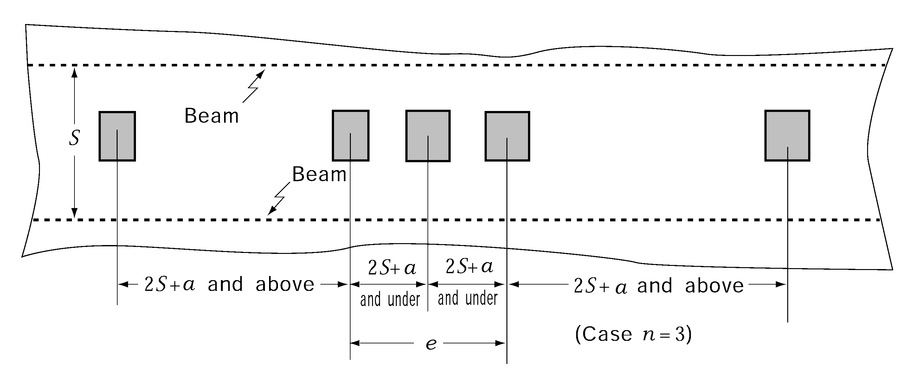
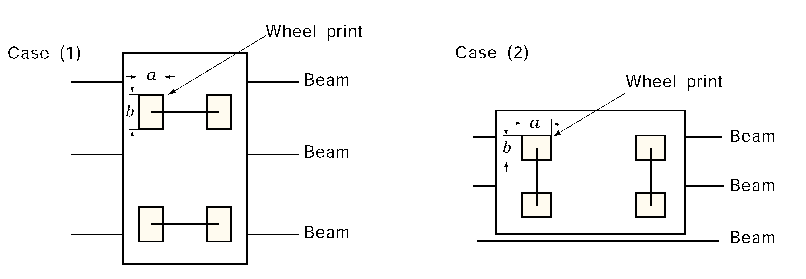
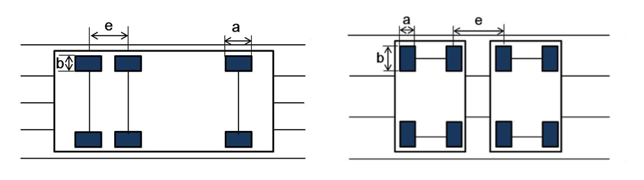
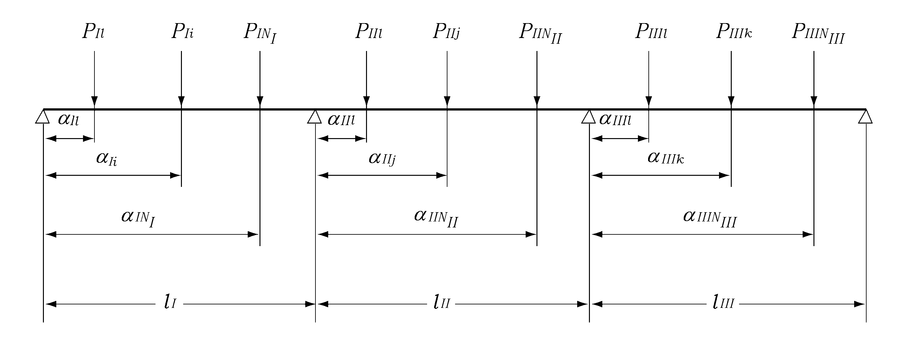
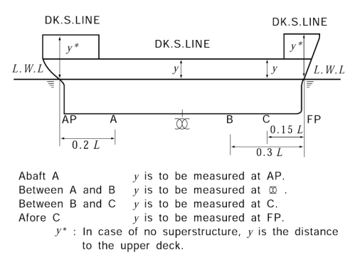

# PART 7 Ships of Special Service (Ch1-4, 7-10)

> RULES FOR CLASSIFICATION OF STEEL SHIPS / RA-07A-E / 2025 / EN / Guidance

## CHAPTER 7 CAR FERRIES AND ROLL-ON/ROLL-OFF SHIPS

### Section 3 Deck Structure

#### 301. Application 【See Rule】

- **1.** **Thickness of vehicle deck** ***(2022)***
  The thickness of vehicle deck is not to be less than that obtained from the following (1) and (2). *(2017)*
  However, the thickness of plating of weather decks is to be 1 $\mathrm{mm}$ thicker than obtained from those formulae.
  - **(1)** Where the distance between centres of wheel prints in a panel is not less than 2$S + a$ (See **Fig 7.7.1**)
    
    **Fig 7.7.1 Measurement of** #eqnID-556
    $t=C \sqrt {\frac{(2S-b ' )}{(2S+a)} \times \frac{P}{9.81}} +0.5 \mathrm{mm}$, $t _{\min} =5.0 ( \mathrm{mm})$
    $C$ = coefficient determined as specified in **Table 7.7.1.**
    $S$ = beam spacing ($\mathrm{m}$)
    $P$ = maximum design wheel load ($\mathrm{kN}$). if $b > S$, a value equal to the maximum designed wheel load multiplied by the value of $S/b$
    $b'$ = $b$ or $S$, whichever is the smaller ($\mathrm{m}$)
    $a$ and $b$ = length of wheel print measured in parallel and perpendicular to beam (See **Fig 7.7.2**). For vehicles with ordinary pneumatic tires, however, values of $a$ and $b$ in **Table 7.7.2** may be used.

    **Table 7.7.1 Coefficient** $C$

    | Vehicles Frames |   |   | Vehicles used for cargo handling | Other vehicles |
    | --- | --- | --- | --- | --- |
    | Longitudinal strength member | Midship part of strength deck (0.4L)* | Longitudinal framing | $4.6 \sqrt {K}$ | . $\frac{17.83 \sqrt {K}}{\sqrt {24-K \alpha }}$ but, in no case is it to be less than 5.2 |
    | Longitudinal strength member | Midship part of strength deck (0.4L)* | Transverse framing | $4.9sqrtK$ | $\frac{123.6 \sqrt {K}}{\sqrt {576-K ^{2} \alpha ^{2}}}$ but, in no case is it to be less than 5.2 |
    | Longitudinal strength member | Fore and aft end part* |   | $4.6 \sqrt {K}$ | $5.2 \sqrt {K}$ |
    | Elsewhere |   |   | $4.6 \sqrt {K}$ | $5.2 \sqrt {K}$ |
    | $\alpha$ : either $\alpha _{1}$ or $\alpha _{2}$ according to value of $y$. However, value of $\alpha$ is not to be less than $\beta$ $\alpha _{1} =15.36 f _{D} \left( \frac{y-y _{B}}{Y'} \right)$ $y _{B} \leq y$ $\alpha _{2} =15.36 f _{B} \left( \frac{y _{B} -y}{y _{B}} \right)$ $y _{B} >y$ $\beta$ : coefficient determined according to values of $L$ as specified below: $\beta=6/a$ when $L$ is 230 m and under $\beta =10.5/a$ when $L$ is 400 m and above $y$ : distance(m) from the top of keel to the lower edge of plating when the platings under consideration are under $y _{B}$and to the upper edge of plating when the platings under consideration are above $y _{B}$ , respectively. $Y'$: the greater of the value specified in **Pt 3, Ch 3, 203.**, (5) (a) or (b) $a$ : $\sqrt {K}$ when high tensile steels are used for not less than 80 % of side shell plating at the transverse section amidship and 1.0 for other parts. $y _{B}$: vertical distance from the top of keel at midship to the horizontal neutral axis of the athwartship section of hull (m). $f _{D}$, $f _{B}$ : as specified in **Pt 3, Ch 1, 124** of the Rules. In longitudinal framing system of Midship part of strength deck, it is to be $0.79/K$ or more. * : In deck plating having intermediate value of distance from fore end, $C$ is to be determined by linear interpolation. |   |   |   |   |

    **Table 7.7.2 Wheel print length** $a$ **and** $b$

    | Direction Wheel | Wheel print length parallel to axle In **Fig 7.7.2,** $a$ in Case (I), $b$ in Case (II) (*) | Wheel print length right angle to axle In **Fig 7.7.2,** $a$ in Case (I), $b$ in Case (II) (*) |
    | --- | --- | --- |
    | Single tire | $\frac{20 \sqrt {P}}{P _{0}}$ | $\frac{1}{20} sqrtP$ |
    | Double tire | $\frac{250 \sqrt {P}}{9P _{0}}$ | $\frac{9}{250} \sqrt P$ |
    | $P$ = as specified in **Par 301. 1 (1)** $P _{0}$ = maximum tire pressure in kN/m^2. Where the maximum tire pressure is not defined, it is as given by the following formula. $P _{0} =C _{P} \sqrt {P}$ (kN/m2) $C _{P} =120$, ($P<10$ kN) $C _{P} =250P ^{-0.3}$, ($P \geq 10$ kN) For special vehicle, actual wheel print lengths are to be applied. |   |   |

    
    **Fig 7.7.2 Measurement of** #eqnID-627
  - **(2)** Where the distance between centres of wheel prints in a panel is less than 2 *S* + *a* (See **Fig 7.7.1**)
    $t=C \sqrt {\frac{2S-b ' )}{(2S+a+e)} \times \frac{nP}{9.81}} +0.5$, $t _{\min} =5.0 ( \mathrm{mm})$
    $e$ = sum of distances between centres of wheel prints in case where wheels are placed side by side at a spacing less than $2S + a$ ($\mathrm{m}$) (See **Fig 7.7.1**). Where distance between centres of wheel prints is not defined, it is as given by the following formula.
    1) Wheel loads are applied as **Fig 7.7.3**
    For vehicles with two axles adjacent to each other, such as an extra-long axle cargo truck or dump truck, distance between centres of wheel prints is as given by the following formula.
    $e=1.0$ (m)
    2) Wheel loads are applied as **Fig 7.7.4**
    Distance between centres of wheel prints is as given by the following formula.
    $e=$ wheel print length + distance between vehicles (m)
    $n$ = number of wheel loads in the range of $e$
    $C$, $S$, $a$, $b'$ and $P$ = as specified in (1)
    
    **Fig 7.7.3 Fig 7.7.4**
- **2.** **Section modulus of vehicle deck beams** ***(2022)***
  The section modulus of beams of decks loaded with wheeled vehicles is not to be less than that obtained from the following formula:
  $Z=C _{1} C _{2} M \mathrm{cm ^{3} }$
  $C_1$ = coefficient determined as follows.
  for $b/S$ ≤ 0.8 : $C_1$ = 1.0
  for $b/S$ ＞ 0.8 : $C_1$ = 1.25 - 0.31$b/S$
  $C_2$ = coefficient determined from **Table 7.7.3**

  **Table 7.7.3 Coefficient** $C_2$

  | Vehicles Members |   | Vehicles exclusively used for cargo handling | Other vehicles |
  | --- | --- | --- | --- |
  | Longitudinal beam | Midship part of strength deck (0.4L)* | $\frac{86.4K}{24-0.544K \alpha}$ but, in no case is it to be less than 3.6 | $\frac{110.4K}{24-K \alpha}$ but, in no case is it to be less than 4.6 |
  | Longitudinal beam | Fore and aft end part* | 3.6$K$ | 4.6$K$ |
  | Elsewhere |   | 3.6$K$ | 4.6$K$ |
  | $\alpha$ : either $\alpha _{1}$ or $\alpha _{2}$ according to value of $y$. However, value of $\alpha$ is not to be less than $\beta$ $\alpha _{1} =15.36 f _{D} \left( \frac{y-y _{B}}{Y'} \right)$ $y _{B} \leq y$ $\alpha _{2} =15.36 f _{B} \left( \frac{y _{B} -y}{y _{B}} \right)$ $y _{B} >y$ $\beta$ : coefficient determined according to values of $L$ as specified below: $\beta=6/a$ when $L$ is 230 m and under $\beta =10.5/a$ when $L$ is 400 m and above $y$ : distance(m) from the top of keel to the lower edge of plating when the platings under consideration are under $y _{B}$and to the upper edge of plating when the platings under consideration are above $y _{B}$ , respectively. $Y'$: the greater of the value specified in **Pt 3, Ch 3, 203.**, (5) (a) or (b) $a$ : $\sqrt {K}$ when high tensile steels are used for not less than 80 % of side shell plating at the transverse section amidship and 1.0 for other parts. $y _{B}$ : vertical distance from the top of keel at midship to the horizontal neutral axis of the athwartship section of hull (m). $f _{D}$, $f _{B}$ : as specified in **Pt 3, Ch 1, 124** of the Rules. In longitudinal framing system of Midship part of strength deck, it is to be $0.79/K$ or more. * : In deck plating having intermediate value of distance from fore end, $C$ is to be determined by linear interpolation. |   |   |   |

  $b$, $P$ and $S$ = as specified in **Par 1** (1)
  $M$ = $M_1$ or $M_2$ obtained from the following formulae, whichever is greater.
  $M _{1} = \frac{1}{9.81} \left( \sum _{i=1} ^{N _{I}} 4P _{I} _{i} \alpha _{I} _{i} \left\{ 1- \left( \frac{\alpha _{I} _{i}}{l _{I}} \right) ^{2} \right\} + \sum _{j=1} ^{N _{II}} P _{II} _{j} \alpha _{II} _{j} \left( 1- \frac{\alpha _{II} _{j}}{l _{II}} \right) \left( 7-5 \frac{\alpha _{IIj}}{l _{II}} \right) \right.$$-\sum _{ k = 1} ^{N_III }P_III _k (l_III -\alpha_III _k ) left{1-left(\frac{l_III - \alpha_III _k}{l_I}II right)^2right}right)$
  $M _{2} = \frac{1}{9.81} \left( -\sum _{i=1} ^{N _{I}} P _{I} _{i} \alpha _{I} _{i} \left\{ 1- \left( \frac{\alpha _{I} _{i}}{l _{I}} \right) ^{2} \right\} + \sum _{j=1} ^{N _{II}} P _{II} _{j} \alpha _{II} _{j} \left( 1- \frac{\alpha _{II} _{j}}{l _{II}} \right) \left( 2+5 \frac{\alpha _{IIj}}{l _{II}} \right) \right.$$+\sum _{ k = 1} ^{N_III }4P_III _k (l_III -\alpha_III _k ) left{1-left(\frac{l_III - \alpha_III _k}{l_I}II right)^2right}right)$
  $I_I$, $I_II$, $I_III$ = span of beam between support points($\mathrm{m}$)
  $P_I _i$, $P_II _j$, $P_III _k$ = maximum design wheel load between support points (*kN*)
  $\alpha_I _i$, $\alpha_II _j$, $\alpha_III _k$ = distance from each support point to the point of action of wheel load (See **Fig 7.7.5**)
  $N_I$, $N_II$, $N_III$ = number of wheel loads between each span
  
  **Fig 7.7.5 Measurement of** #eqnID-707
- **3.** **Scantlings of vehicle deck beams** ***(2017)***
  Scantlings of beams of car decks may be determined by direct strength calculations using the following standards.
  - **(1)** The model of structures and the method of calculation are to be those approved by the Society.
  - **(2)** Loads are to be assumed as follows;
  - **(3)** The allowable stressed for calculation of section moduli are to be as shown in **Table 7.7.4.**
  - **(4)** Considering corrosion, etc, the section moduli obtained on the basis of conditions (1) to (3) above are to be multiplied by 1.2 to determine the actual section moduli.

    **Table 7.7.4 Permissible stress (**$\mathrm{N}/mm^2$**)**

    | Members | Vehicles used for cargo handling only | Other vehicle |
    | --- | --- | --- |
    | Longitudinal beams of strength decks in midship region | $\frac{235}{K} - 80f_D$ | $\frac{235}{K} - 150f_D$ |
    | Elsewhere | $\frac{235}{K}$ | $\frac{235}{K}$ |
- **4.** **Movable vehicle deck girder**
  - **(1)** General
    Deck girders of movable vehicle decks and similar constructions are to be in accordance with the requirements in this Section in addition to **Pt 3, Ch 11, 103.**
  - **(2)** Strength requirement
    The scantlings of movable vehicle deck girders are to be determined with the following requirements in (A) through (C).
    The value specified in Rule **Pt 3, Ch 1, 604.**
    $b _{eft} = \sum _{n} ^{} ( \frac{C _{et} \cdot a}{2} )$ ($\mathrm{mm}$)
    In case buckling stiffeners for deck plate are fitted properly, these may be taken into account for the determination of effective width. However, it is not to exceed the value specified in Rule **Pt 3, Ch 1, 604.**
    $C _{et}$: Coefficient as given by the following formula. Where, however, #eqnID-716_s2exceeds 1.0, #eqnID-717_s2is to be taken as 1.0.
    $C _{et} = ( \frac{3}{\beta} - \frac{1.75}{\beta ^{2}} ) \frac{b}{a} + ( \frac{0.075}{\beta} + \frac{0.75}{\beta ^{2}} ) (1 - \frac{b}{a} )$
    $n$ : 1 for girders located on the periphery of vehicle deck, and 2 for the others
    $a$ : Spacing of girders crossing at right angles with the stiffening direction ($\mathrm{mm}$)
    $b$ : Spacing of stiffeners ($\mathrm{mm}$)
    $\beta$ : Coefficient as given by the following formula
    $\beta = \frac{b}{t} \sqrt {\frac{\sigma _{F}}{E}}$
    $t$ : Thickness of vehicle deck plating ($\mathrm{mm}$)
    $\sigma _{F}$ : Minimum upper yield stress or proof stress of the vehicle deck material ($\mathrm{N}/mm^2$)
    $E$ : Modulus of elasticity of the material to be assumed equal to 2.06 $\times 10 ^{5}$($\mathrm{N}/mm^2$) for steel.
    - For loaded condition with vehicles on vehicle decks
    $P = 1.5 (p + w _{deck} )$
    $p$ : Design load on vehicle deck ($\mathrm{kN}/mm ^{2}$)
    $w _{deck}$ : Tare of vehicle deck per unit area ($\mathrm{kN}/mm ^{2}$)
    - For vehicles used for cargo handling only (fork lifts or similar vehicles used for handling cargo in ports only)
    $P = 1.2 (p + w _{deck} )$
    As specified in **Table 7.7.5**. Where, $\sigma _{F}$($\mathrm{N}/mm ^{2}$) is minimum upper yield stress or proof stress of the material.

    | Normal stress | $0.8 \sigma _{F}$ |
    | --- | --- |
    | Shear stress | $0.46 \sigma _{F}$ |
    - **(A)** The effective width of compressive plate flange for each girder is to be determined by the following (a) and (b) corresponding to the stiffening direction of panel.
      - **(a)** Effective width for girders parallel to the stiffening direction
      - **(b)** Effective width for girders crossing at right angles with the stiffening direction
    - **(B)** Design load and allowable stresses are to be in accordance with the requirements of following (a), (b).
      - **(a)** Design load $P$ ($\mathrm{kN}/mm ^{2}$)
      - **(b)** Allowable stresses ($\mathrm{N}/mm ^{2}$)
    - **(C)** In case the scantlings of girders are determined based upon direct calculations, the method of assessments is to be a grillage model analysis or that can take account of the elastic buckling effects of compression panels of vehicle deck. Otherwise, it may be acceptable that elastic FEM analysis by using shell elements model is carried out and, in addition, buckling strength of compression panels is checked complying with the requirements of **Pt 3, Annex 3-2, III.2.**
  - **(3)** Structural details
    $\frac{d}{C} + 1.0$
    $d$ : Depth of girders ($\mathrm{mm}$)
    $C$ : Coefficients are given by the followings.
    65 for symmetrically flanged girders
    55 for asymmetrically flanged girders

    |   | Panel on which vehicular traffic is frequent (1) | Panels other than the specified in the left column |
    | --- | --- | --- |
    | 1) Girders on the deck panel periphery | F2 (Both sides) | F2 (Both sides) |
    | 2) Within $0.3 l$ midspan of girders other than mentioned in (2) | F2 (Both sides) | F2 (Both sides) |
    | 3) Within $0.1 l$ end part of girders other than mentioned (2) | F2 (Both sides) | F2 (Both sides) |
    | 4) Intersection for $0.2 l '$of girders other than mentioned in (3) | F2 (Both sides) | F2 (Both sides) |
    | 5) Other than those mentioned above | F2 (Both sides) | F2 (One side, at least) |

    ^(1) Deck panels which are subject to the dynamic load in the vicinity of ramp way and are on the route between a ramp way and another ramp way to reach another deck
    ^(2) $l$ : The total length of each girder
    ^(3) $l '$ : The span of each girder, and #eqnID-755_s2on either side of the inter section of girders is to be welded
    ^(4) $F2$ : As specified in Rule **Pt 3, Ch 1, Table 3.1.11**
    - **(A)** Fillet weld of the connection of girder webs to the vehicle deck is to be in accordance with **Table 7.7.6.**
    - **(B)** The thickness of web plates is not to be less than that obtained by the following formula, except where buckling strength of web plate is examined precisely.
- **5.** **Supporting structures of movable vehicle deck**
  - **(1)** The requirements in this section apply to structures supporting movable vehicle decks.
  - **(2)** Considering the shape, designed load, etc., of deck panels, supporting structures of movable vehicle decks are to be arranged appropriately.
  - **(3)** The connection of supporting members to hull structural members is to be suitably constructed so as to avoid stress concentration. If necessary, suitable reinforcement is to be provided by means of stiffeners, brackets, etc.
  - **(4)** In case deck panels are suspended by wire ropes, the ropes are to comply with the requirements of **Pt 4** of the Rules or the requirements of the standards as deemed appropriate by the Society, and subjected to suitable corrosion prevention treatment.
    The safety factor of the wire ropes is not to be less than the following value, but may not exceed 4.
    $\frac{10 ^{4}}{8.85W + 1910}$
    Where,
    $W$ : Safe working load ($rm"ton"$)
  - **(5)** Scantlings of supporting structural members are to be determined to withstand the design loads defined in **4** (B) (a) using the following allowable stresses.
    shear stress : $\tau = 0.34 \sigma _{F}$
    bending stress : $\sigma = 0.50 \sigma _{F}$
    equivalent stress : $\sigma _{e} = \sqrt {\sigma ^{2} +3 \tau ^{2}} = 0.64 \sigma _{F}$
    Where,
    $\sigma _{F}$ : Minimum upper yield stress or proof stress of the material ($\mathrm{N}/mm ^{2}$)

#### 303. Deck loads 【See Guidance】 (2020)

- **1.** Deck load $h$(kN/m^2) for the weather deck is not to be less than that obtained from the following formula.
  $h = a(bf-y)$(kN/m^2)
  where:
  $a$, $b$= as given by **Table 7.7.7** according to the position of decks.
  $C_b1$ = block coefficient, however, where $C_b$ is less than 0.6, $C_b1$ is to be taken as 0.6, and where $C_b$ is 0.8 and over, $C_b1$ is to be taken as 0.8.
  $f$ = as given in **Table 7.7.8.** (see **Fig 7.7.4**):
  $y$ = vertical distance from the load line to weather deck at side (m), and $y$ is to be measured at fore end for deck forward of 0.15$L$ abaft the fore end; at 0.15$L$ abaft the fore end for deck between 0.3$L$ and 0.15$L$ abaft the fore end; at midship for deck between 0.3$L$ abaft the fore end and 0.2$L$ afore the aft end; and at aft end for deck aftward of 0.2$L$ afore the aft end (see **Fig 7.7.6**)
  
  **Fig 7.7.6 Position of measuring** #eqnID-784

  **Table 7.7.7 Values of** $a$ **and** $b$

  | Line | Position of deck | $a$ |   |   |   |
  | --- | --- | --- | --- | --- | --- |
  | Line | Position of deck | Beams(1), Deck plating | Pillars | Deck girders | $b$ |
  | I | Forward of 0.15$L$ abaft the fore end | 14.7 | 4.90 | 7.35 | $1 + \frac{0.338}{(C_b1 + 0.2 )^2}$ |
  | II | Forward of 0.15$L$ and 0.3$L$ abaft the fore end | 11.8 | 3.90 | 5.90 | $1 + \frac{0.158}{(C_b1 + 0.2 )^2}$ |
  | III | Between 0.3$L$ abaft the fore end and 0.2$L$ afore the aft end | 6.90 | 2.25 | 2.25(2) 3.45(3) | 1.0 |
  | IV | Afterward of 0.2$L$ afore the aft end | 9.80 | 3.25 | 4.90 | $1 + \frac{0.123}{(C_b1 + 0.2 )^2}$ |
  | NOTE: (1) Where $L$ is 150 m or less, value $a$ may be multiplied by the value of following formula: $C = 0.0055L + 0.175$ (2) In case of longitudinal deck girders outside the line of hatchway opening of the strength deck for midship part. (3) In case of deck girders other than (2). |   |   |   |   |   |
- **2.** $h$ for deck in Line II in **Table 7.7.7,** need not exceed that in Line I.
- **3.** $h$ is not to be less than that obtained from the formulae in **Table 7.7.3,** irrespective of the provisions in **1.** and **2.**
- **4.** Where multi-tier decks of more than 3 are fitted, however, the load applied to the weather deck is to be greater than the value obtained by multiplying the load obtained in **1., 2.** and **3.** by the values in **Table 7.7.4**.
- **5.** In the provision of "$h$" specified in **303.,** a weather deck may be regarded as follows in accordance with the vertical distance, $H_D$ from an imaginary freeboard deck to the weatherdeck at side.
  $h _{s}$ ≤ $H _{D}$ < $2h _{s}$ : Superstructure deck of first tier above an imaginary freeboard deck
  $2h _{s}$ ≤ $H _{D}$ < $3h_s$ : Superstructure deck of second tier above an imaginary freeboard deck
  $nh_s$ ≤ $H _{D}$ < $(n+1)h_s$ : Superstructure deck of #eqnID-814_s2th tier above an imaginary freeboard deck

  **Table 7.7.8 Coefficient** $f$

  | Length of ship | $f$ |
  | --- | --- |
  | $L<$ 150 m | ${\frac{L}{10}e}^{-\frac{L}{300}}+ \left( { \frac{L}{150}} \right)^2 - 1.0$ |
  | 150 m #eqnID-819300 m | ${\frac{L}{10}e}^{-\frac{L}{300}}$ |
  | 300 m $\leq L$ | 11.03 |

  **Table 7.7.9 Minimum Values of** $h$

  | Line | Position of deck | $h ^ (1)$ | C |   |
  | --- | --- | --- | --- | --- |
  | Line | Position of deck | $h ^ (1)$ | Beams(2), Deck plating | Pillars, Deck girders |
  | I and II | Forward of 0.3$L$ abaft the fore end | $C \sqrt {L' + 50 }$ | 4.20 | 1.37 |
  | III | Between 0.3$L$ abaft the fore end and 0.2$L$ afore the aft end | $C \sqrt {L' + 50 }$ | 2.05 | 1.18 |
  | IV | Afterward of 0.2$L$ afore the aft end | $C \sqrt {L'}$ | 2.95 | 1.47 |
  | Second tier superstructure deck above the freeboard deck 1.95 0.69 |   | $C \sqrt {L'}$ | 1.95 | 0.69 |
  | NOTES: (1) $L'$ = length of ship (m). Where, however, $L$ exceeds 230 m, $L'$ is to be taken as 230 m. (2) Where $L$ is 150 m or less, value $C$ may be multiplied by the value of following formula:. $0.0055L + 0.175$ |   |   |   |   |

  **Position of exposed deck**

  | Freeboard deck | 1.0 |
  | --- | --- |
  | 3rd tier deck | 0.32 |
  | 4th tier deck | 0.25 |
  | 5th tier deck | 0.20 |
  | 6th tier deck | 0.15 |
  | 7th tier deck and above | 0.10 |

### Section 5 Pure Car Carrier (2023)

#### 501. Application 【See Rule】

This section provides the requirements for evaluation of plating and stiffeners for **PCC**. The offered scantling is to be greater than or equal to the required scantling based on requirements provided in **502.** ~ **507.** of this section.

#### 502. Minimum thickness of shell plating above freeboard deck

The thickness of shell plating above freeboard deck is not to be less than:
$t=1.0+0.5 \sqrt {KL'}$ (mm)
$L '$ : length of ship (m), but need not be taken greater than 230 m.

#### 503. Thickness of side shell plating above freeboard deck

The thickness of side shell plating from the freeboard deck to the level at 4.6 m above is not to be less than:
$t=C _{1} C _{2} S \sqrt {\left( 0.05L ' +h _{1} \right) \frac{D}{D+4.6}} +1.5$ (mm)
$C _{1}$ : coefficient defined in **Pt 3, Ch 4, Table 3.4.1** of the Rules.
$C _{2}$ : coefficient defined in **Pt 3, Ch 4, Table 3.4.1** of the Rules.
$S$ : spacing of frames (m)
$L '$ : length defined in **502.**
$h _{1}$ : height defined in **Pt 3, Ch 4, 302** of the Rules.

#### 504. Side longitudinals above freeboard deck

The section modulus of side longitudinals above the freeboard deck is not to be less than that obtained from the following formula, whichever is the greater:
$Z _{1} =100C S h l ^{2}$ (cm^3)
$Z _{2} =C 'K \sqrt {L '} S l ^{2}$ (cm^3)
$S$ : spacing of longitudinals (m).
$l$ : distance between the web frames or between the transverse bulkhead and the web frame including the length of connection (m).
$L '$ : length defined in **502.**
$h$ : vertical distance from the side longitudinal concerned to a point $d+0.038L '$ above baseline (m).
$C$ : coefficient as defined in **Pt 3, Ch 8, 401** of the Rules.
$C '$ : coefficient given by the following:
$C ' =0.8$ for longitudinals from the freeboard deck to the level at 4.6 m above
$C ' =0.5$ elsewhere

#### 505. Bulkhead stiffeners of deep tank

The scantlings are to be in accordance with the requirements in **Pt 3, Ch 15, 203** of the Rules. The section modulus for $h _{3}$, however, is not to be less than:
$Z=125C _{1} C _{2} C _{3} C _{4} S h l ^{2}$ (cm^3)
$C _{1}$ : coefficient defined in **Pt 3, Ch 15, 202** of the Rules.
$C _{2}$ : coefficient taken equal to:
$C _{2} = \frac{K}{22.5}$
$C _{3}$ : coefficient defined in **Pt 3, Ch 15, 203** of the Rules.
$C _{4}$ : coefficient taken equal to:
$C _{4} =1.2$ for vertical stiffeners
$C _{4} =1.0$ for horizontal stiffeners
$S$ : spacing of stiffeners (m)
$l$ : span of stiffeners, as defined in **Pt 3, Ch 14, 303** of the Rules (m).

#### 506. Thickness of vehicle deck

The thickness of vehicle deck is to be in accordance with the requirements in **301. 1**. The value of $C$, however, is to be substituted by the value defined in following **Table 7.7.11**.

**Table 7.7.11 Coefficient** ${\mathbf{ C}}$

| Vehicles Frames |   |   | Vehicles used for cargo handling | Other vehicles |
| --- | --- | --- | --- | --- |
| Longitudinal strength member | Midship part of strength deck (0.4L) | Longitudinal framing | $4.6 \sqrt {K}$ | $\frac{17.83 \sqrt {K}}{\sqrt {24-K \alpha }}$ but, in no case is it to be less than $5 \sqrt {K}$ |
| Longitudinal strength member | Midship part of strength deck (0.4L) | Transverse framing | $4.9sqrtK$ | $\frac{123.6 \sqrt {K}}{\sqrt {576-K ^{2} \alpha ^{2}}}$ but, in no case is it to be less than $5 \sqrt {K}$ |
| Longitudinal strength member | Fore and aft end part |   | $4.6 \sqrt {K}$ | $5.2 \sqrt {K}$ |
| Elsewhere |   |   | $4.6 \sqrt {K}$ | $5.2 \sqrt {K}$ |
| $\alpha$ : either $\alpha _{1}$ or $\alpha _{2}$ according to value of $y$. However, value of $\alpha$ is not to be less than $\beta$. $\alpha _{1} =15.36 f _{D} \left( \frac{y-y _{B}}{Y'} \right)$ for $y _{B} \leq y$ $\alpha _{2} =15.36 f _{B} \left( \frac{y _{B} -y}{y _{B}} \right)$ for $y _{B} >y$ $\beta$ : coefficient determined according to values of $L$ as specified below: $\beta=6/a$ when $L$ is not greater than 230 m $\beta =10.5/a$ when $L$ is not less than 400 m For intermediate value of $L$, $\beta$ is to be obtained by linear interpolation. $y$ : distance (m) from the baseline to the lower edge of plating when the plating under consideration is under $y _{B}$ or to the upper edge of plating when the plating under consideration is above $y _{B}$. $Y'$ : the greater of the values defined in **Pt 3, Ch 3, 203.**, (5) (a) and (b) $a$ : $\sqrt {K}$ when high tensile steels are used for not less than 80 % of side shell plating at the transverse section amidship and 1.0 for other parts. $y _{B}$ : vertical distance from the baseline to the horizontal neutral axis of the hull transverse section (m). $f _{D}$, $f _{B}$ : factors defined in **Pt 3, Ch 1, 124.** of the Rules, but not less than 0.5 in longitudinal framing system of midship part of strength deck Note : For the intermediate parts between midship part and fore/aft end part, $C$ is to be determined by linear interpolation. |   |   |   |   |

#### 507. Scantlings of vehicle deck beams

The section modulus for vehicle deck beams is not to be less than;
$Z=0.92C _{1} C _{2} M$ (cm^3)
$C _{1}$ : coefficient defined in **301. 2.**
$C _{2}$ : coefficient defined in **Table 7.7.12**.
$M$ : moment defined in **301. 2.**

**Table 7.7.12 Coefficient** ${\mathbf{ C}}_2$

| Vehicles Frames |   | Vehicles used for cargo handling | Other vehicles |
| --- | --- | --- | --- |
| Longitudinal beam | Midship part of strength deck (0.4L) | $\frac{86.4K}{24-0.544K \alpha}$ but, in no case is it to be less than $4.8K$ | $\frac{110.4K}{24-K \alpha}$ but, in no case is it to be less than $5.52K$ |
| Longitudinal beam | Fore and aft end part | 3.6$K$ | $4.6K$ |
| Elsewhere |   | 3.6$K$ | $4.6K$ |
| $\alpha$ : either $\alpha _{1}$ or $\alpha _{2}$ according to value of $y$. However, value of $\alpha$ is not to be less than $\beta$. $\alpha _{1} =15.36 f _{D} \left( \frac{y-y _{B}}{Y'} \right)$ for $y _{B} \leq y$ $\alpha _{2} =15.36 f _{B} \left( \frac{y _{B} -y}{y _{B}} \right)$ for $y _{B} >y$ $\beta$ : coefficient determined according to values of $L$ as specified below: $\beta=6/a$ when $L$ is not greater than 230 m $\beta =10.5/a$ when $L$ is not less than 400 m For intermediate value of $L$, $\beta$ is to be obtained by linear interpolation. $y$ : Vertical distance (m) from the baseline to the beam under consideration $Y '$ : the greater of the values defined in **Pt 3, Ch 3, 203.**, (5) (a) and (b) $a$ : $\sqrt {K}$ when high tensile steels are used for not less than 80 % of side shell plating at the transverse section amidship and 1.0 for other parts. $y _{B}$ : vertical distance from the baseline to the horizontal neutral axis of the hull transverse section (m). $f _{D}$, $f _{B}$ : factors defined in **Pt 3, Ch 1, 124** of the Rules, but not less than 0.5 in longitudinal framing system of midship part of strength deck Note : For the intermediate parts between midship part and fore/aft end part, $C$ is to be determined by linear interpolation. |   |   |   |

