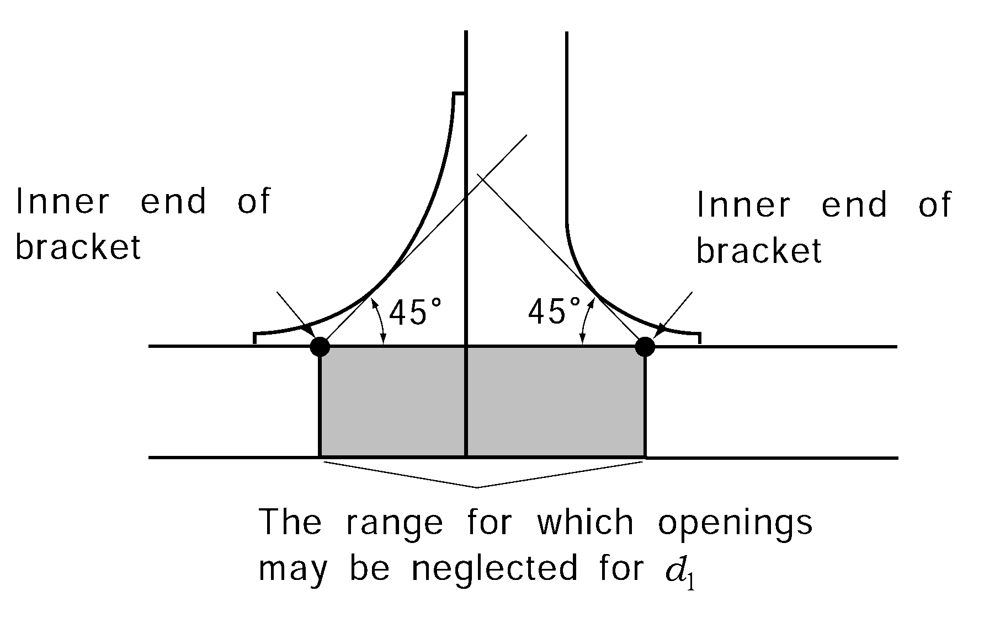
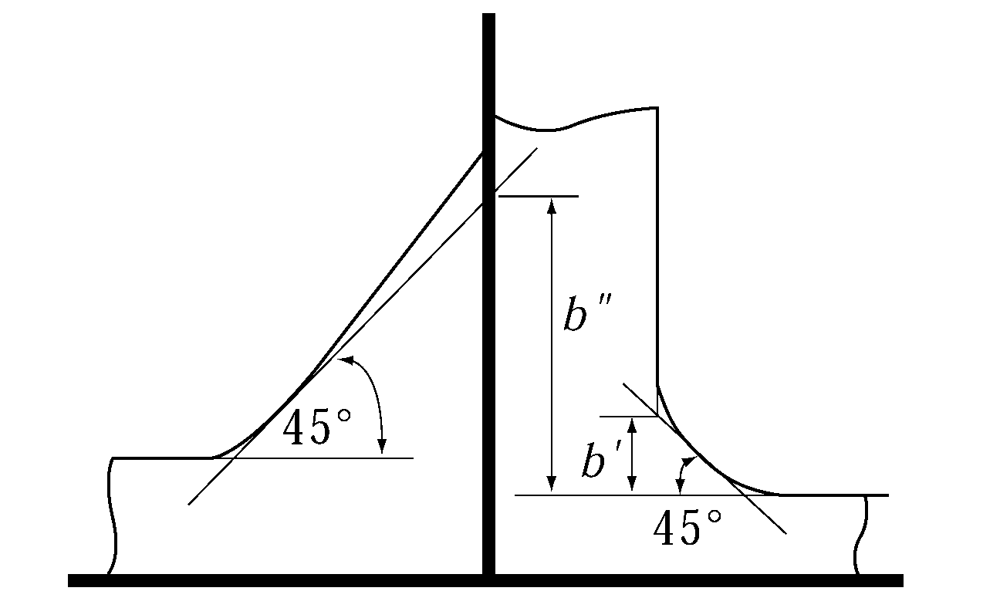
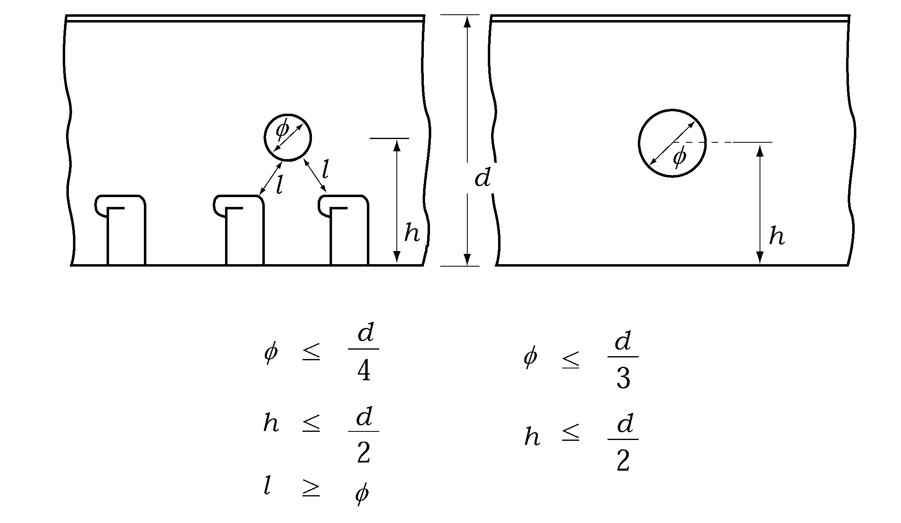
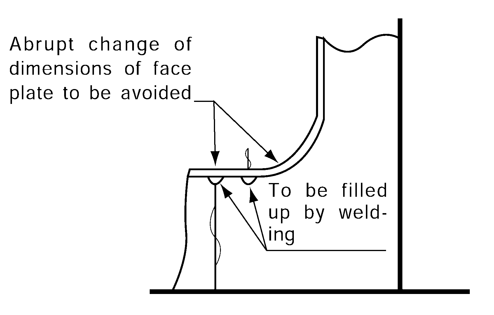
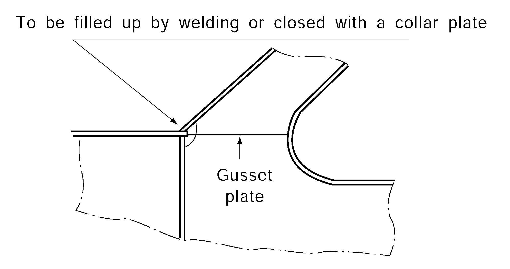
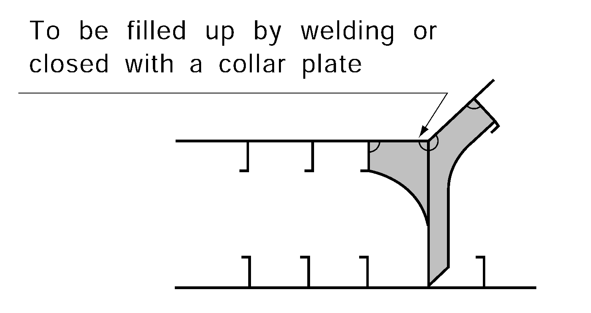
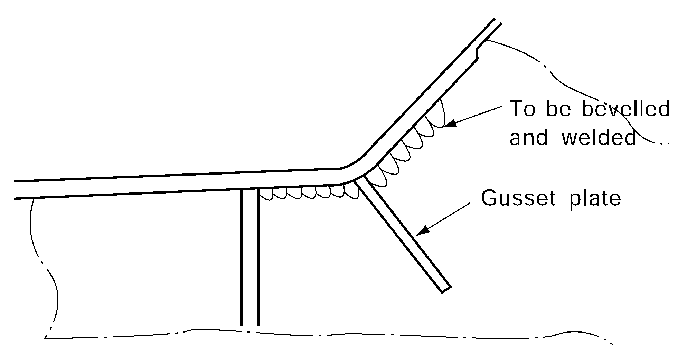

# PART 7 Ships of Special Service (Ch1-4, 7-10)

> RULES FOR CLASSIFICATION OF STEEL SHIPS / RA-07A-E / 2025 / EN / Guidance

## CHAPTER 10 DOUBLE HULL TANKER

### Section 1 General

#### 101. Application 【See Rule】

- **1.** **Application**
  - **(1)** For ships having the structural features similar to double hull tankers, the requirements in this Chapter of the Rules are to be applied.
  - **(2)** Unless otherwise specially noted, the prescriptions in other Parts apply for matters common to both cargo ships and tankers.
- **2.** **Proposal of novel construction type**
  In the event that a novel construction type is proposed, scantlings are to be determined by carrying out comparative calculations with the standard structural model conforming to the requirements of the Rules. Submission of data covering the results of model experiments or real ship experiments may be requested by the Society as necessary.
- **3.** **Ships carrying liquid cargoes other than petroleum**
  - **(1)** The scantlings of structural members of the cargo oil tank part of tankers carrying liquid cargoes of a specific gravity $\rho$ exceeding 1.0 are to be of the values obtained by the following two procedures, whichever is greater:
  - **(2)** For tankers carrying dangerous chemicals in bulk, the requirements in **Ch 6** of the Rules are also to be applied.

    **Table 7.10.1 Value of** $\rho$

    | Cargo | $\rho$ |
    | --- | --- |
    | Molasses | 1.4 |
    | Asphalt | 1.1 |
    | Concentrated sulphuric acid | 1.85 |
- **4.** **Minimum distance between asphalt cargo tank and the adjacent members**
  For asphalt carrier which all cargo tanks are independent tank, the requirements of **Ch 1 Sec 1 101. 4** are applicable to these ships.

#### 102. Location and separation of spaces 【See Rule】

- **1.** *(2022)*
  - **(1)** The size and arrangement of cargo oil tanks and segregated ballast tanks are to comply with the requirements of **MARPOL 1973/78 Annex 1 Reg. 18, 23, 24, 25, 26, 29, 31, 32.**
  - **(2)** The arrangements of double sides hulls and double bottoms are to comply with the requirements of **MARPOL 1973/78 Annex 1 Reg. 19.**
- **2.** **Cofferdams and bulkheads bounding cargo oil tanks**
  - **(1)** In case where a cargo oil tank is adjacent to the fore peak (fore peak tank), the collision bulkhead is to be free from openings.
  - **(2)** Divisions between compartments defined as cofferdams and other compartments (except cargo oil tanks and fuel oil tanks) are not to have any openings with the exception of bolted watertight manholes provided in chain locker bulkheads, etc. (no watertight door is permitted).
- **3.** **Airtight bulkheads**
  - **(1)** Cofferdams which are not utilized as main or auxiliary pump rooms and compartments utilized as cofferdams under the freeboard deck are to meet the requirements for the strength of deep tanks. The bulkhead between the main pump room and engine room is to have structural scantlings of watertight bulkheads in ships of not less than 100 $\mathrm{m}$ in length and of airtight bulkheads in ships of less than 100 $\mathrm{m}$ in length.
  - **(2)** The scantlings of airtight bulkheads for which no hydrostatic tests are required are to comply with the following standards. Airtightness tests may be replaced by hose tests.
    - **(A)** The plate thickness is not to be less than 6 $\mathrm{mm}$, which may, however, be reduced to 4.5 $\mathrm{mm}$ in ships of less than 100 $\mathrm{m}$ in length.
    - **(B)** The section modulus of stiffeners and girders is to be 50 $\%$ of the Rule requirements for watertight bulkheads. Where connected to shell and decks, however, these stiffening members are to be of such an effectiveness as is equivalent to frames and beams.
- **4.** **Superstructures and deckhouses**
  The deckhouse protecting the entrance to pump rooms is to be in accordance with the following requirements:
  - **(1)** The strength of front wall is to be equivalent to that of wall of the bridge.
  - **(2)** The strength of side walls and after wall are to be equivalent to that of front wall of the poop.
- **5.** **Pipe duct in double bottom**
  "Adequate mechanical ventilation" defined in **102. 8** (3) of the Rules is to be in accordance with the requirements in **Ch 6, 1203.** of the Rules.
- **6.** When applying the requirements in **102. 3** (4) of the Rules, **Ch 6, 304. 4 Table 7.6.1 of the Guidance** may be applied to the minimum dimension of clear opening, where deemed appropriate by the Society. Where differently deliberated by the competent Flag Administrations, shall be in accordance with the relevant requirements.

#### 103. Minimum thickness 【See Rule】

With respect to the requirements of **103. 1** of the Rules, this requirements are applicable to cargo oil tank and deep tank with larger length or width than $0.1 L + 5.0$($\mathrm{m}$).

### Section 2 Bulkhead Plating

#### 201. Bulkhead plating in cargo oil tanks and deep tanks 【See Rule】

- **1.** "Bulkhead plating" referred to in this Chapter of the Rules means those plate members used in the boundaries of cargo oil tanks and deep tanks where longitudinal bulkheads, transverse bulkheads, decks plates, side shell and inner bottom plates are included.

### 1. Arrangements of swash bulkheads

In case where the length or breadth of a cargo oil tank exceeds, 15 $m$ or 0.1$L \mathrm{m}$, whichever is greater, swash bulkheads are to be provided in cargo oil tanks. Where, however, this requirement may be dispensed with if special consideration is given to sloshing.

#### (1) The breadth and thickness of the uppermost and lowest strakes of the centreline swash bulkhead may be 90 _s2 of those required by the Rules for the uppermost and lowest strakes, respectively, of the longitudinal oiltight bulkhead.

#### (2) The "opening ratio" means the ratio of the sum of areas of openings, except slots and scallops, to the area of the bulkhead.

#### (3) The section modulus of stiffeners is to be obtained from the following formula.

$Z = C S h_2 l^2 \mathrm{cm^3 }$
where:
$C$ = coefficients given below;
both ends effectively bracketed : $C$ = 7.1
one end effectively bracketed and the other end supported by girder : $C$ = 8.4
both ends supported by girders : $C$ = 10.0
$h_s$ = value obtained from the following formula. In no case is it to be less than 2.0.
$h_s = (0.176 - 0.00025L)(1 - \alpha)l_T$
$\alpha$ = opening ratio of bulkhead plating.
$l_T$ = length of tank ($\mathrm{m}$).
$S$ and $l$ = spacing of stiffeners and span of stiffener between supports ($\mathrm{m}$).

#### (4) In applying the requirements of 405. 1 to 3 of the Rules, the scantlings of girders supporting stiffeners are to be obtained in such a way that values of _s2 specified in the requirements under consideration referred to are not less than that obtained by substituting _s2 with _s2 specified in (3).

Section 3 Longitudinals and Stiffeners
301. Longitudinals 【See Rule】
For the assessment fatigue strength of ship structure according to **301. 4** of the Rules is to comply with **Pt 3, Annex 3-3** of the Guidance.
Section 4 Girders
401. General 【See Rule】

### 1. In application of 401. 2 of the Rules, "when approved by the Society" means any of the following (1) to (3) among ships of 200 _s2 or less.

#### (1) Tankers with double bottom structures having longitudinal bulkhead only on the centreline, (hereinafter referred to as "Type A tankers") (See Fig 3.3.7 of the Rules)

#### (2) Tankers with double hull structures having no longitudinal bulkhead on the centreline (hereinafter referred to as "Type C tankers") (See Fig 3.3.7 of the Rules)

#### (3) Tankers with double hull structures having longitudinal bulkhead only on the centreline (hereinafter referred to as "Type D tankers") (See Fig 3.3.7 of the Rules)

### 2. In tankers without partial loading conditions such as half-loading or alternate loading, if the spacing of girders and floors in double bottom and stringers and transverses in double side hull according to type A, C, D tankers of Par 1 are smaller than the values shown in (1) and (2), the spacing may be increased to the values given in (1) and (2) :

#### (1) Girders in double bottom and stringers in double side hull..... 4.1 (_s2)

#### (2) Floors in double bottom and transverses in double side hull..... 2.8 (_s2)

402. Direct strength calculations for girders 【See Rule】
When determining the scantlings of girders for double hull tankers by direct strength calculations, the procedure is to comply with the **Pt 3, Annex 3-2** of the Guidance.
403. Scantlings of girders and floors in double bottom 【See Rule】

### 1. The thickness of centre girders and side girders in double bottom is not to be less than the greatest of either of the value _s2 specified in the following (1), _s2 or _s2 specified in the following (2). Where, however, the thickness of centre girders of tankers having the longitudinal bulkhead on the centreline may be determined using only _s2.

#### (1) The thickness obtained from the following formula according to the each location in the cargo oil tank

$t_1 = C_1 K \frac{S h_B x}{d_0 - d_1} + 1.5 \mathrm{mm}$
where :
$S$ = distance between the centres of two adjacent spaces from side girder under consideration to the adjacent girders or the inner end of tank side brackets ($\mathrm{m}$).
$h_B$ = the values obtained from the following formulae, whichever is the greater :
$h_B1 = 0.6d + 0.026L \mathrm{m}$
$h_B2 = h' - (d - 0.026L) \mathrm{m}$
$h'$ = vertical distance from the top of the inner bottom plating to the top of hatches ($\mathrm{m}$).
$d_0$ = depth of side girder under consideration ($\mathrm{m}$).
$d_1$ = depth of opening at the point under consideration ($\mathrm{m}$). Where, however, if vertical webs attached the transverse bulkhead are provided in the cargo oil tank, openings in girders provided within the range between the transverse bulkhead and the inner end of bracket of the lower vertical webs under consideration may be omitted except when the Society considers it to be necessary. (See **Fig 7.10.2**)
$x$ = longitudinal distance between the centre of $l_T$ of each cargo oil tank and the point under consideration ($\mathrm{m}$). Where vertical webs attached the transverse bulkhead are provided in the cargo oil tank, $x$ may be calculated as the distance up to the inner end of the bracket attached the lower vertical webs. And where $x$ is under 0.25$l_T$, $x$ is to be taken as 0.25$l_T$.(see Fig **7.10.2**)

**Fig 7.10.2 Based point of and**
$C_1$ = coefficient obtained from **Table 7.10.2** and **Table 7.10.3** depending on $b/l_T$. For intermediate values of $C_1$ is to be obtained by linear interpolation.
$b$ = distance between the side shell plating and the longitudinal bulkhead on the centreline of the hull at the top of the inner bottom plating at the midship part ($\mathrm{m}$).
$l_T$ = length of the cargo oil tank under consideration ($\mathrm{m}$).

**T a ble 7.10.2 Coefficient of type A and D tanker**

| $b/l_T$ |   | 0.5 and under | 0.6 | 0.7 | 0.8 | 0.9 | 1.0 | 1.1 | 1.2 | 1.3 and under |
| --- | --- | --- | --- | --- | --- | --- | --- | --- | --- | --- |
| $C_1$ | Type A | 0.045 | 0.054 | 0.061 | 0.068 | 0.073 | 0.076 | 0.079 | 0.081 | 0.082 |
| $C_1$ | Type D | 0.037 | 0.044 | 0.051 | 0.059 | 0.065 | 0.070 | 0.074 | 0.076 | 0.079 |

**Table 7.10.3 Coefficient** $C_1$ **of type C tanker**

| $b/l_T$ | 1.0 and under | 1.2 | 1.4 | 1.6 and over |
| --- | --- | --- | --- | --- |
| $C_1$ | 0.073 | 0.079 | 0.082 | 0.083 |

#### (2) The thickness obtained from the following formula according to the each location in cargo oil tank :

$t _{2} =8.6 root {3} of {\frac{H^2 a^2}{C_3 K} (t_1 - 1.5)}+1.5 \mathrm{mm}$, $t_3= \frac{C_4 a}{sqrtK} + 1.5 \mathrm{mm}$
where :
$a$ = depth of girders at the point under consideration ($\mathrm{m}$)
Where, however, if horizontal stiffeners are provided at the half way of the depth of girders, $a$ is the distance from the horizontal stiffener under consideration to the bottom shell plating or inner bottom plating, or the distance form the horizontal stiffener under consideration to the bottom shell plating or inner bottom plating, or the distance between the horizontal stiffeners under consideration ($\mathrm{m}$)
$t_1$ = thickness of girders calculated under the requirements of (1) according to the type of tankers ($\mathrm{mm}$)
$C_3$ = coefficient obtained from **Table 7.10.4** according to the ratio of spacing $S_1$ ($\mathrm{m}$) of stiffeners provided in the direction of the depth of girders and $a$. For intermediate values of $S_1 /a$, $C_3$ is to be determined by linear interpolation.
$S_1$ = spacing of stiffeners provided depthwise on the girder ($\mathrm{m}$)
$H$ = value obtained from the following formulae:
$H = 1+ 0.5 \phi/a$
where :
$\phi$ = major diameter of the openings ($\mathrm{m}$)
$\alpha$ = the greater of $a$ or $S_1$ ($\mathrm{m}$)
$C_4$ = coefficient obtained from **Table 7.10.4** depending on $S_1 /a$. For intermediate values of $S_1 /a$, $C_4$ is to be obtained by linear interpolation.

**Table 7.10.4 Coefficient** $C_3$ **and** $C_4$

| $S_1 /a$ |   | 0.3 and under | 0.4 | 0.5 | 0.6 | 0.7 | 0.8 | 0.9 | 1.0 | 1.2 | 1.4 | 1.6 and over |
| --- | --- | --- | --- | --- | --- | --- | --- | --- | --- | --- | --- | --- |
| $C_3$ |   | 64 | 38 | 25 | 19 | 15 | 12 | 10 | 9 | 8 | 7 | 7 |
| $C_4$ | center girder | 4.4 | 5.4 | 6.3 | 7.1 | 7.7 | 8.2 | 8.6 | 8.9 | 9.3 | 9.6 | 9.7 |
| $C_4$ | side girder | 3.6 | 4.4 | 5.1 | 5.8 | 6.3 | 6.7 | 7.0 | 7.3 | 7.6 | 7.9 | 8.0 |

### 2. The thickness of floors in double bottom is not to be less than the greatest of either of the value _s2 specified in the following (1), _s2 or _s2 specified in the following (2).

#### (1) The thickness _s2 obtained from Table 7.10.5 according to the type of oil tank

**Table 7.10.5 Thickness of floor** $t_1$

| Type of tankers | Type A tankers | Type C and D tankers |
| --- | --- | --- |
| $t_1$ | $t_1 = C_2 K \frac{S b h_B}{d_0 - d_1} left(1 - \frac{4y}{3b}' right) +1.5 \mathrm{mm}$ | $t_1 = C_2 K \frac{S b h_B}{d_0 - d_1} \times \frac{2y}{b}' +1.5 \mathrm{mm}$ |
| $S$ = spacing of floors ($\mathrm{m}$) $h_B$ = the values obtained from the following formula, whichever is the greater. Where, however, for tankers without abnormal loading conditions such as half-loading or alternate loading, specified in **Par 1 (1)** may be used $h_B1 = d + 0.026L \mathrm{m}$ $h_B2 = h' - (0.6d -0.026L) \mathrm{m}$ $d_0$ = height of floors at the point under consideration ($\mathrm{m}$). $d_1$ = depth of opening at the point under consideration ($\mathrm{m}$). Where, however, if transverses attached the longitudinal bulkhead or side transverses attached the side shell plating are provided in the cargo oil tank, openings in floors provided within the range between the longitudinal bulkhead or side shell plating and the inner end of the brackets of the lower transverses under consideration may be omitted except when the Society considers it to be necessary. (See **Fig 7.10.2**) $b'$ = $b (\mathrm{m})$ of **Par 1 (1)** measuring at the floors under consideration. $y$ is to comply with type of tankers (A) Type A of tankers : Athwartship distance at the floors under consideration from centreline of the hull to the point under consideration ($\mathrm{m}$). However, if transverses attached the longitudinal bulkhead are provided in the cargo oil tank, for space between the longitudinal bulkhead and the inner end of the bracket of lower transverses under consideration, y may be calculated as the distance up to the inner end of the bracket under consideration. If $y$ exceeds 0.3$b'$, $y$ is to be taken as 0.3$b'$. (B) Type C of tankers : Athwartship distance at the floors under consideration from the centreline of the hull to the point under consideration ($\mathrm{m}$). However, if brackets attached the lower transverses of double side hull are provided, $y$ may be calculated as the distance up to the inner end of the bracket under consideration. If $y$ is under 0.25 $b'$, $y$ is to be taken as 0.25 $b'$. (C) Type D of tankers : Athwartship distance at the floors under consideration from centre of $b'$to the point under consideration ($\mathrm{m}$). However, if brackets attached the lower transverses of double side hull or the lower transverses of the longitudinal bulkhead on the centreline of the hull in the cargo oil tank are provided, $y$ may be calculated respectively as the distance up to the inner end of the bracket attached the lower transverses of double side hull or up to the inner end of the bracket attached the lower transverses of longitudinal bulkhead on the centreline of the hull. If $y$ is under 0.25$b'$, $y$ is to be taken as 0.25$b'$. $C_2$ = coefficient obtained from **Table 7.10.6** to **Table 7.10.8** depending on $b/l_T$. For intermediate values of $C_2$ is to be obtained by linear interpolation. $b$, $l_T$ and $h'$ are to be in accordance with the requirements of **Par 1** (1). |   |   |

#### (2) The thickness _s2 or _s2 obtained from the following formula

$t _{2} =8.6 root {3} of {\frac{H ^{2} a ^{2}}{C _{3} K} (t _{1} -1.5)}+1.5 \mathrm{mm}}$, $t_3 = 8.5S_\frac{2}{\sqrt} K + 1.5 \mathrm{mm}$
where :
$a$ = depth of floors at the point under consideration($\mathrm{m}$)
Where, however, if horizontal stiffeners are provided at the half way of the depth of floors, $a$ is the distance from the horizontal stiffener under consideration to the bottom shell plating or inner bottom plating, or the distance form the horizontal stiffener under consideration to the bottom shell plating or inner bottom plating, or the distance between the horizontal stiffeners under consideration($\mathrm{m}$)
$t_1$ = thickness of floors calculated under the requirements of (1) according to the type of tankers($\mathrm{mm}$)
$C_3$ = coefficient obtained from **Table 7.10.9** according to the ratio of spacing $S_1$ ($\mathrm{m}$) of stiffeners provided in the direction of the depth of floors and $a$. For intermediate values of $S_1 /a$, $C_3$ is to be determined by linear interpolation.
$S_1$ = spacing of stiffeners provided depthwise on the floor($\mathrm{m}$)
$H$ = value obtained from the following formulae **Par 1.** (1)
$S_2$ = $S_1$ or $a$, whichever is the smaller($\mathrm{m}$)

### 1. The thickness of stringers in double side hull is not to be less than the greatest of either of the value _s2 specified in the following (1), _s2 or _s2 specified in the following (2) :

#### (1) The thickness obtained by the following (1) or (2) according to the type of tankers :

$t_1 = C_5 K \frac{Sh_s x}{d_0 - d_1} +1.5 \mathrm{mm}$
where :
$S$ = breadth of part supported by stringers ($\mathrm{m}$).
$h_s$ = the values obtained from the following formulae, whichever is the greater :
$h_s1 = (0.6d - d_3 ) + 0.038L \mathrm{m}$
$h_s2 = h' \mathrm{m}$
*h'* = vertical distance from the upper end of bilge hopper, if provided, or top of inner bottom plating to top of hatches ($\mathrm{m}$).
*d*_3 = height of double bottom at ship's sides ($\mathrm{m}$). Where, however, vertical distance up to the upper end of bilge hopper, if provided.
$d_0$ = depth of stringers ($\mathrm{m}$).
$d_1$ = depth of opening at the point under consideration ($\mathrm{m}$). Where, however, if horizontal girders attached the transverse bulkhead are provided in the cargo oil tank, openings in stringers provided within the range between the transverse bulkhead and the inner end of bracket at the end of horizontal girders under consideration may be omitted except when the Society considers it to be necessary. (See **Fig 7.10.2**)
$x$ = longitudinal distance between the centre of $l_T$ of each cargo oil tank and the point under consideration ($\mathrm{m}$). However, if horizontal girders attached the transverse bulkhead are provided in the cargo oil tank, $x$ may be calculated as the distance up to the inner end of bracket attached the end of horizontal girders under consideration. If $x$ is under 0.25$l_T$, $x$ is to be taken as 0.25$l_T$. (See **Fig 7.10.2**)
$C_5$ = coefficient obtained from **Table 7.10.10** depending on $D '/l_T$. For intermediate values of $D '/l_T$, it is to be obtained by linear interpolation.
$D '$ = value obtained from the following formula :
$D ' = D - d_3 \mathrm{m}$
$l_T$ = length of the cargo oil tank under consideration ($\mathrm{m}$).

**Table 7.10.10 Coefficient** $C_5$

| $D '/l_T$ |   | 0.5 and under | 0.6 | 0.7 | 0.8 | 0.9 | 1.0 | 1.1 | 1.2 | 1.3 and over |
| --- | --- | --- | --- | --- | --- | --- | --- | --- | --- | --- |
| $C_5$ | Type C | 0.013 | 0.019 | 0.025 | 0.030 | 0.034 | 0.037 | 0.039 | 0.042 | 0.045 |
| $C_5$ | Type D | 0.020 | 0.024 | 0.028 | 0.032 | 0.035 | 0.038 | 0.040 | 0.042 | 0.045 |

#### (2) The thickness _s2 or _s2 obtained from the following formulae according to the location in the cargo oil tank.

$t _{2} =8.6 root {3} of {\frac{H^2 a^2}{C_6 K} (t_1 - 1.5)} + 1.5 \mathrm{mm}$, $t_3 = 8.5S_\frac{2}{sqrtK} +1.5 \mathrm{mm}$
where :
$a$ = depth of stringers at the point under consideration ($\mathrm{m}$). Where, however, if horizontal stiffeners are provided at the half way of the depth of stringers in the direction of the length of stringers, $a$ is the distance from the horizontal stiffener under consideration to the side shell plating or the longitudinal bulkhead of double side hull or the distance between the horizontal stiffeners under consideration ($\mathrm{m}$).
$t_1$ = thickness of stringers calculated under the requirements of (1) ($\mathrm{mm}$).
$C_6$ = coefficient obtained from **Table 7.10.11** according to the ratio of spacing $S_1$ of stiffeners provided in the direction of the depth of stringers and $a$. For intermediate values of $S_1 /a$, $C_6 '$ is to be obtained by linear interpolation.
$S_1$ = spacing of stiffeners provided depthwise on the stringer($\mathrm{m}$)
*H* = as specified in **403. 1.** (2)
*S*_2 = $S_1$ or $a$, whichever is the smaller

**Table 7.10.11 Coefficient** $C_6$

| $S_1 /a$ | 0.3 and under | 0.4 | 0.5 | 0.6 | 0.7 | 0.8 | 0.9 | 1.0 | 1.2 | 1.4 and over |
| --- | --- | --- | --- | --- | --- | --- | --- | --- | --- | --- |
| $C_6$ | 64 | 38 | 25 | 19 | 15 | 12 | 10 | 9 | 8 | 7 |

### 2. The thickness of transverses in double side hull is not to be less than the greatest of either of the value _s2 specified in the following (1), _s2 or _s2 specified in the following (2).

#### (1) The thickness obtained by the following (a) or (b) according to the type of tankers.

$t_1 = C_7 K \frac{SD 'h_s}{d_0 - d_1} left(1-1.75 \frac{z}{D '} right) +1.5 \mathrm{mm}$
where :
$S$ = breadth of part supported by transverses ($\mathrm{m}$).
$h_s$ = the value obtained from the following formulae, whichever is the greater. Where, however, for tankers without abnormal loading conditions such as half-loading or alternate loading, specified in **Par 1.** (1) may be used.
$h_s1 = (d - d_3 ) + 0.038L \mathrm{m}$
$h_s2 = h' \mathrm{m}$
$d_0$ = depth of transverses ($\mathrm{m}$).
$d_1$ = depth of opening at the point under consideration ($\mathrm{m}$). Where, however, if brackets attached the lower transverses of double side hull are provided, the openings in transverses provided within the range between the top of the inner bottom plating and the inner end of the bracket under consideration may be omitted except when the Society considers it to be necessary.(See **Fig 7.10.2**)
$z$ = distance in the direction of ship's depth between the top of the inner bottom plating or the top of the bilge hopper, if provided, and the point under consideration ($\mathrm{m}$). However, if brackets attached the lower transverses of double side hull are provided, for space between the top of the inner bottom plating and the inner end of the bracket under consideration, $z$ may be calculated as the distance at the inner end of the bracket under consideration. If $z$ exceeds 0.4$D '$, $z$ is to be taken as 0.4$D '$.(See **Fig 7.10.2**)
$C_7$ = coefficient obtained from **Table 7.10.12** depending on $D '/l_T$. For intermediate values of $D '/l_T$, $C_7$ is to be obtained by linear interpolation.
$D '$, $h '$, $l_T$ and $d_3$ are to be in accordance with the requirements of **Par 1** (1).

**Table 7.10.12 Coefficient** $C_7$ **of the Type C and D tankers**

| $D '/l_T$ |   | 0.5 and under | 0.6 | 0.7 | 0.8 | 0.9 | 1.0 | 1.1 | 1.2 | 1.3 and over |
| --- | --- | --- | --- | --- | --- | --- | --- | --- | --- | --- |
| $C_7$ | Type C | 0.052 | 0.051 | 0.049 | 0.046 | 0.043 | 0.041 | 0.038 | 0.036 | 0.034 |
| $C_7$ | Type D | 0.034 | 0.034 | 0.034 | 0.034 | 0.033 | 0.033 | 0.032 | 0.031 | 0.030 |

#### (2) The thickness _s2 or _s2 obtained from the following formulae.

$t _{2} =8.6 root {3} of {\frac{H ^{2} a ^{2}}{C _{6} K} (t _{1} -1.5)} +1.5 \mathrm{mm}$, $t _{3} = 8.5S_\frac{2}{sqrtK} + 1.5 \mathrm{mm}$
where :
$a$ = depth of transverses at the point under consideration ($\mathrm{m}$). Where, vertical stiffeners are provided at the half way of the depth of transverses in the direction of the length of transverses, distance from the vertical stiffener under consideration to the side shell plating or the longitudinal bulkhead of double side hull or the distance between the vertical stiffeners under consideration ($\mathrm{m}$).
$t_1$ = thickness of transverse calculated under the requirements of (1) ($\mathrm{mm}$).
$C_6$ and $S_2$ = as specified in **1.** (2)
$H$ = as specified in **403. 1.** (2)

### 2. Transverses on longitudinal bulkhead

#### (1) Even when large brackets are provided on the opposite side of a longitudinal bulkhead, span _s2 and radius _s2 of transverses are to be measured on the wing tank side in the same manner as in Par 1. But, the size of bracket _s2 may be 0.5_s2, except when _s2 is to be taken as _s2 if _s2 is smaller than _s2. (See Fig 7.10.6)

**Fig 7.10.6 Measured method of** #eqnID-1278

#### (2) In calculating the thickness of web plates in regard to shearing force, the brackets on the opposite side of longitudinal bulkheads may be taken into account.

#### (3) Girders on corrugated bulkheads are to be of balanced girders. Where balanced girders are not adaptable, the neutral axis is to be brought as close to the bulkhead plating as possible.

Section 5 Structural Details
501. General 【See Rule】
Areas represented by mark "○" in **Table 7.10.13** are required to penetrate longitudinal beams and longitudinals.

**Table 7.10.13 Required areas of longitudinal beam and longitudinals**

| Length of Ship ($\mathrm{m}$) | 90 ≤ $L$ < 120 | $L$ ≥ 120 |
| --- | --- | --- |
| Longitudinal beams and side longitudinals attached to sheer strake | ○ | ○ |
| Side longitudinals and longitudinals on longitudinal bulkhead (except those specified above) | ─ | ○ |
| Bottom longitudinals, inner bottom longitudinals and longitudinals on bilge strake | ○ | ○ |

503. Girders and cross ties 【See Rule】

### 1. General

#### (1) The dimensions and locations of lightening holes, where provided, are to be as shown in Fig 7.10.7.

#### (2) Slots are to be reinforced with collars where flanges of longitudinals are facing each other or where slots are provided at small intervals as is often the case with bilge part.

#### (3) In case where the depth of girders is smaller than the required depth, the section modulus of girders is to be obtained by multiplying the Rule-required section modulus by a ratio of the required depth of girder to actual depth.

#### (4) In pump rooms or void spaces, the thickness of webs may be reduced by 1 _s2 from the required thickness of webs in cargo oil tanks.

#### (5) The scantlings of members in segregated ballast tanks in the midship part are to be same as those of members in cargo oil tanks.

#### (6) In end bracket parts, at connections with cross ties, etc. of transverses where shearing stress and/or compressive stress are expected to be high, additional stiffeners are to be fitted. These parts are not to have lightening holes. If considered necessary, slots for penetration of longitudinals in these parts are to be reinforced with collars.

**Fig 7.10.7 Locations and dimensions of lightening holes**

#### (7) The radius of the rounded corner of girder is to be as large as practicable.

#### (8) Where angle bars are used instead of flat bars as stiffeners of transverses, etc., their section modulus with effective plates is to be approximately equivalent to the required ones.

#### (9) No scallops are to be permitted in web plates at the connection of face plates on transverses and those of girder plates. Scallops cut out for work convenience are to be filled up by welding. Abrupt change of dimensions is to be avoided carefully. (See Fig 7.10.8)

#### (10) Where longitudinal frames or stiffeners penetrate bottom transverses, side transverses and vertical webs on longitudinal bulkhead, proper reinforcement is to be made in the extents stipulated in Table 7.10.14, by fitting brackets on the opposite side of stiffeners on webs of transverse, for connecting longitudinals to transverse, by fitting collars at slots, or by other suitable means. In ships not exceeding 230 _s2 in length, however, the extents of application of such reinforcement may be properly reduced.

**Table 7.10.14 Reinforcing range**

| Member | Reinforcing range |
| --- | --- |
| Bottom transverse | All connections |
| Side transverses | All connections below the upper end of curvature of upper cross tie, or the designed maximum load line, whichever is higher. In ships of 300 $\mathrm{m}$ and above in length, it is recommended that similar reinforcement be applied in wider extent upward beyond the limit stipulated above. |
| Transverses on longitudinal bulkhead | All connections below the upper end $R$ of longitudinal bulkhead curvature of upper cross tie. |

#### (11) Connection of web plates is to be of butt-welding or other type of connection as deemed appropriate by the Society.

### 2. The intersections of inner bottom plating and bilge hopper

The construction at the intersections of the inner bottom plating and hopper plates is to be as follows:

#### (1) Where the constructions at the intersection of the inner bottom plating and hopper plates forms a built up construction as specified in Fig 7.10.9. It is to comply with following:

- **(A)** Scallops at the above-mentioned intersections in bilge hopper transverses are to be filled up by welding or closed with collar plates. (See **Fig 7.10.9**)
- **(B)** Bilge hopper transverses on the extended line of the inner bottom plating are to be fitted with gusset plates. (See **Fig 7.10.9**)
  
  **Fig 7.10.8**
  **Fig 7.10.9**
- **(C)** Where the spacing of floor plates is 2 $\mathrm{m}$ or more, a bracket is to be provided at the mid-length between floor plates. This bracket is to reach the inner bottom longitudinal and the hopper plate longitudinal next to the ㄴside girder located at the intersection. (See **Fig 7.10.10**)

#### (2) Where the constructions at the intersection of the inner bottom plating and hopper plates forms a knuckle construction as specified in Fig 7.10.11. The construction at the above mentioned intersection is to be comply with following (A) and/or (B), and (C) in addition to prescribed (1)(C) :

**Fig 7.10.10** 
**Fig 7.10.11**

- **(A)** Knuckled part is to be bevelled and welded as far as possible.
- **(B)** In areas where brackets are provided, gusset plates are to be attached transverses of bilge hoppers on the extended line of the inner bottom plating. In case where the radius of curvature at the knuckle is large, the number of gusset plates is to be suitably increased.
- **(C)** Stiffeners as shown in Fig **7.10.10** are to be fitted within 300 $\mathrm{mm}$ afore and abaft the bracket.
