# PART 7 Ships of Special Service (Ch1-4, 7-10)

> RULES FOR CLASSIFICATION OF STEEL SHIPS / RA-07A-E / 2025 / EN / Guidance

## Annex 7-2 Guidance for the Container Securing Arrangements 【See Rule】

### 1. General

#### (1) Application

- **(A)** This Annex is to be applied to securing system of 20 $\mathrm{ft}$ and 40 $\mathrm{ft}$ container in accordance with the requirements of **ISO 668**. And this annex are also to be applied to special type of containers at **Appendix 1** in principle.
- **(B)** Where the securing system is designed and arranged by other than the requirements of this Annex, it is to be in accordance with those defined in **Rules Pt 1 Ch 1. 105.**
- **(C)** Fixed fittings which are part of the container lashing equipment or which may affect the strength of the ship's hull are subject to approval on the basis of the requirements of this Annex. Details of the connection and the supporting ship structure require approval to satisfy the design loads determined in accordance with **Sec 8** or the safe working load of the fixed fitting, as applicable. Drawings are to be submitted showing details of the fittings, the attachment, the local foundations and information about the intended materials and welding.
- **(D)** Containers are to be loaded so as not to exceed the weights and distribution within the stack according to the Cargo Securing Manual. The permissible loading patterns are to be clearly indicated on the Container Securing Arrangement Plan carried on board the ship.
- **(E)** Where it is intended and specified that loose or fixed parts of the container securing system are used for lifting appliance purposes, e,g., pedestal sockets and fittings used for lifting of hatch cover, or twistlocks used for vertical tandem lifting, **Rules & Guidances Pt 9 Ch 2** are applicable. If no approval from lifting aspects is sought, the devices will be considered as part of a container securing arrangement only.
- **(F)** For ships having the class notation Container Ship, an effective breakwater is to be fitted to protect the containers against green sea impact loads. For other ships which are equipped for the carriage containers on deck, protection of the cargo is recommended by the provision of a breakwater. From Fore End to 0.25$L _{BP}$, it is recommended that all door ends face aft in order to improve the performance of the container walls to withstand green sea loads.
- **(G)** Improper ship handling related to course and speed or threshold phenomena like parametric rolling can create adverse forces acting on the ship and the cargo which are in excess of the forces determined on the basis of **Sec 8** It is the responsibility of the Master to apply good seamanship in order to mitigate excessive ship motions to reduce forces acting on the cargo stowage arrangements.
- **(H)** Sample calculation based on equations are referred to **Appendix 3**.

#### (2) Special Features Notation

- **(A)** Where container securing arrangements are fitted, and the design and construction of the system are in accordance with this Annex, the ship will be eligible to be assigned the special features notation **LS**. The container securing arrangements in the Cargo Securing Manual are submitted to the Society for formal approval.
- **(B)** In addition to (A), if the program for lashing calculations is approved by the Society and installed and maintained, the ship will be eligible to be assigned the special features notation **LS(CL)**. The approval procedure of lashing calculation instrument are to be in accordance with **Par 9.**
- **(C)** Where apply the specific route reduction factors, the contents related to the application of the specific route reduction factors to be included in Cargo Securing Manual and the specific route reduction factors are applicable to onboard lashing program, the ship to be assigned the special features notation **LS(CL, RS).**
- **(D)** In relation to (C), if a program capable of calculating the reduction coefficient for an arbitrary route is installed in addition to the above, a special features notation **LS(CL, RS+)** should be assigned to the ship concerned. *(2019)*
- **(E)** The ships using container securing arrangements designed and manufactured in accordance with **Ch.3, Sec.25, 2504.** or **2505.** of the **Guidance for Approval of Manufacturing Process and Type Approval**, etc. will be eligible to be assigned the special feature notation **LS (HHS** or **HHT)** *(2023)*
- **(F)** For the existing ship has not the above Special Feature Notation, this Annex can be applied if owner requests.

#### (3) Type of Securing systems

- **(A)** Containers are to be secured by one, or a combination, of the following systems. Containers secured by the other method are to be in accordance with the requirements as deemed appropriate by the Society.
  - **(a)** Container locking devices
  - **(b)** Rod, wire and chain lashing
  - **(c)** Buttresses, shores or equivalent structural restraint.
  - **(d)** Cell guides
- **(B)** Dunnage is not to be used in associated with approved container securing systems except where forming part of an approved line load stowage specified in **Par 4.** (5)

#### (4) Plans and information required

The following plans and documents are to be submitted for the approval of the Society.

- **(A)** General arrangement plan showing the disposition and design weights of the containers *(2025)*
  - **(a)** 20FT container arrangement for under deck stowage(including 20FT single arrangement and 40FT top arrangement)
  - **(b)** 40FT container arrangements for under deck stowage
  - **(c)** 20FT container arrangement for stowage on exposed decks
  - **(d)** 40FT container arrangement for stowage on exposed decks
  - **(e)** 40FT High Cubic container arrangement for stowage on exposed decks
  - **(f)** Special stowage arrangement of containers(example: Russian stow arrangements on deck, 45FT, 48FT, 53FT stowage arrangement, etc.)
- **(B)** Arrangement and detail plans of container securing arrangements
- **(C)** Calculations on the strength of container securing arrangement including the following ship parameters
  - **(a)** Moulded draught $d _{c}$, vertical centre of gravity (VCG), longitudinal centre of flotation (LCF) and transverse metacentric height(GM)
  - **(b)** Design wind speed
  - **(c)** Container lashing strength calculations shall be based on the maximum expected GM value during operation and shall be taken as 0.075B. However, it may be calculated by selecting an lower GM value when necessary for the operation of the ship. *(2017)*
- **(D)** Where containers of types other than ISO containers are to be incorporated in the stowage arrangement, the cargo securing manual is to indicate clearly the locations where these containers are stowed. In the case of non-ISO containers, the value of the criteria of strength evaluation should be specified in the he cargo securing manual. The manual is also to indicate the container weights and required securing arrangements for stacks composed entirely of ISO standard containers. *(2019)*


### 2. Materials and testing for fixed container securing fittings

#### (1) General

- **(A)** Fixed cargo securing fittings are to be Type approved in accordance with **Guidance for Approval of Manufacturing Process and Type Approval, Etc Ch 3 Sec 25.**
- **(B)** According to Guidance **Ch 4 Sec 10**, production test are to be carried out.

#### (2) Materials and design

- **(A)** Steel used for the construction of the fixed cargo securing fittings is to comply with the requirements of **Pt. 2 Ch. 1** of the Rules. Where deemed appropriate by the Society, the suitable materials in accordance with the International Standard(ISO), National Standard or equivalent standards may be used. Due account is to be taken of the grade and tensile strength of the hull material in way of the attachment. The chemical composition of the steel is to be such as to ensure acceptable qualities of weldability. Where necessary, tests are to be carried out to establish specific welding procedures.
- **(B)** Where securing arrangements are intended to operate at low ambient temperatures, special consideration is to be given to the specification of the steel.
- **(C)** Proposals for the use of materials other than steel will be specially considered.
- **(D)** Attention is drawn to the need for measures to be taken to prevent water accumulation in pockets or recesses that could lead to excessive corrosion.


### 3. Materials and testing for Loose container securing fittings

#### (1) General

- **(A)** Loose container cargo securing fittings are to be Type approved in accordance with **Guidance for Approval of Manufacturing Process and Type Approval, Etc. Ch 3 Sec 25.**
- **(B)** According to Guidance **Ch 4 Sec 10**, production test are to be carried out.
- **(C)** In the following, the term ‘Fully automatic fitting’ is used to describe fittings which do not require manual operation during unloading of the containers. It should be noted that usually these fittings do not mechanically secure the container in the vertical direction (perpendicular to the hatch cover) in the upright condition when subject to pure vertical motions. Other modes of operation and novel design will be specially considered.

#### (2) Materials and design

- **(A)** Steel used for loose container securing fittings is to comply with the requirements of **Pt. 2, Ch. 1** of the Rules. Where deemed appropriate by the Society, the suitable materials in accordance with the International Standard(ISO), National Standard or equivalent standards may be used.
- **(B)** Where loose container securing fittings are intended to operate at low ambient temperatures, special consideration is to be given to the specification of the steel.
- **(C)** Proposals for the use of materials other than steel will be specially considered.
- **(D)** Locking devices and other fittings which are inserted into the container castings on the quayside before lifting on board are to be such as to minimise the risk of working loose under the effects of vibration and the risk of falling out.
- **(E)** For twistlocks, bottom twistlocks, midlocks, stackers with intermediate plates and fully automatic fittings the contact areas, for both tension and compression between the fitting and the corner castings of the containers, are to be such as not to exceed a bearing stress of 300 $\mathrm{N}/mm^2$ under the safe working load of the fitting. No increase in the permissible stress level will be given due to higher strength material of the fittings. In case the design is such that the contact area is sloped or inclined and not parallel to the container corner casting, the effective contact area will be specially considered.


### 4. Arrangements for stowage on exposed decks without cell guides

#### (1) General

- **(A)** Containers stowed on deck or on hatch covers are generally to be aligned in the longitudinal direction. In case of stowing the transverse direction it is to be in accordance with the requirements as deemed appropriate by the Society.
- **(B)** Containers are to be stowed so that they do not extend beyond the ship’s side. Adequate support is to be provided where they overhang hatch coamings or other deck structures. The stowage arrangements are to be such as to permit safe access for personnel in the necessary working of the ship, and to provide sufficient access for operation and inspection of the securing devices.
- **(C)** Where containers are stowed on hatch covers, the covers are to be effectively restrained against sliding by approved type stoppers or equivalent. Details of the locations of stoppers relative to the supporting structure are to be submitted at as early a stage as possible.
- **(D)** Stanchions and similar structure supporting containers and securing devices such as D-rings for lashings, are to be of adequate strength for the imposed loads and of sufficient stiffness to minimise any deflection which could lead to a reduction in the effectiveness of the securing device.
- **(E)** In general, stowage of heavy containers on top of lighter containers is to be avoided, unless validated as being satisfactory by an approved on-board lashing program or covered by the approved container securing arrangement.
- **(F)** When semi automatic/fully automatic fitting is used for external or vertical lashing, approved fittings for the lashing shall be used. *(2017)*
  - **(a)** For fittings where the locking method requires defined clearances between the corner castings and the fixed foundations, such fittings are not to be used at the lowest tier of a stack which is resting with one side on a hatch cover panel and bridging to a container stanchion. The same applies if the stack is resting on different hatch cover panels or foundations where relative deflection during ship operation can occur.

#### (2) Containers in one tier

The containers are to be secured by one of the following (A) to (B);

- **(A)** Containers are to be secured at their lower corner castings by approved locking devices.
- **(B)** Alternatively, containers may be secured by lashings fitted diagonally or vertically at both ends of each containers, in association with corner fittings at each container corner.

#### (3) Containers in two tiers

The containers are to be secured by one of the following (A) to (C);

- **(A)** Containers are to be secured at their lower corners at each tier by approved locking devices.
- **(B)** Where the calculations indicate that separation forces will not occur at any point in the stack, double stacking cones may be fitted at all internal corners of the stack and bridge fittings used to connect the tops of the rows in the transverse direction. Locking devices are to be fitted at all external corners.
- **(C)** Alternatively, containers may be secured by lashings in association with stacking cones or, where the calculations indicate that separation forces may occur, with locking device.

#### (4) Containers in more than three tiers

- **(A)** Containers are to be secured at their lower corners at each tier by approved locking devices.
- **(B)** Alternately containers may be secured by lashings. One or two tiers of lashings may be fitted in association with stacking cones or, where the calculations indicate that separation forces may occur, with locking devices.
- **(C)** When lashings are employed, they are to be fitted to the bottom corner casting of the upper container and not to the top casting of the container below.
- **(D)** Proposals to use lashings in pairs (para-lashing arrangements) will be considered. Lashings in pairs are to be attached one to the bottom corner fitting of the upper tier and the other to the top corner fitting of the lower tier container. Suitable connections are to be provided at the lower ends. External para-lash arrangements are not recommended. If external para-lash arrangements are used, special care should be taken with regard to the interference and tension force of the upper lashing. *(2017)*
- **(E)** Where tiers are fitted at higher levels, they are to be secured by locking devices at each corner and each tier.
- **(F)** Proposals to use horizontal lashings connected to lashing bridges will be specially considered. The forces in such securing systems are to be determined by direct calculations taking into account the following effects:
  ․ stiffness of the container side/end walls, the lashings and the lashing bridge; and
  ․ the possible horizontal displacements of the containers relative to the lashing bridge due to the clearances of the hatch cover stoppers and the container securing fittings.
- **(G)** When vertical lashings are used in combination with container securing fittings, consideration is to be given to the vertical clearances between the fittings and the container corner castings.
  - **(a)** The lashing assembly is to remain elastic when subject to an elongation equating to the number of interface fittings fitted below the point where the vertical lashing is applied to the stack. In order to avoid overstressing of the rod and the turnbuckle, provision of spring or elastic elements incorporated into the turnbuckle may be advantageous. When lashing from lashing bridge level, the number of interfaces is to be counted down to the level where the lowest container is resting. The lashing rod is to be fitted to the bottom casting of the container. For container securing fittings having design clearances in accordance with ISO 3874, a nominal clearance per fitting of 10 $\mathrm{mm}$ is to be taken to determine the total elongation of the lashing system. For fittings having clearances in excess of 10 $\mathrm{mm}$, the total elongation is to be calculated taking into consideration the higher clearances.
  - **(b)** To take into account the load bearing effect of the vertical lashing arrangement when performing lashing calculations, the permissible calculated lifting force can be increased by 150 kN in addition to the safe working load of the container securing fitting. The nominal lifting force is not to exceed 400 kN at the securing fittings below the fitting position of the vertical lashing.
- **(H)** For stowage arrangements incorporating fully automatic fittings which do not mechanically secure the container in pure vertical direction when subject to vertical motions, it is to be ensured that no separation occurs under the load cases specified in **8**.(2)(C) In addition, where exposed stacks are secured with fully automatic fittings without internal cross lashings, provision is to be made to prevent buoyancy forces acting on the container which could disengage the containers. In this case the use of effective side screens is required. Otherwise, the first tier of containers is to be secured by manual or semi-automatic twistlocks.
- **(I)** If the carriage of one or more tiers of 20 ft containers being overstowed with at least one tier of 40 ft containers, so called ‘Russian Stow Arrangement’ is desired, the following requirements apply.
  - **(a)** At the 20 ft gap the containers are to be secured by means of midlocks or full automatic twistlocks, whereas the fore and aft ends are to be secured by twistlocks and if necessary supplemented by lashing rods. *(2018)*
  - **(b)** The 40 ft overstow container is to be secured by twistlocks or if necessary with a combination of twistlocks and lashing rods. The stack is to be assessed in a two step procedure as follows:
  - **(i)** For location at the 40 ft ends the entire mixed stack is to be considered as a 40 ft stack. The weights of the 40 ft containers are to be considered in the calculations. For the tiers of 20 ft containers, the weight of one 20 ft container is to be taken as the basis for the calculation at each tier.

    | 40‘ 20ton<br>40‘ 25ton<br>40‘ 25ton<br>20‘ 36ton<br>20‘ 25ton<br>20‘ 36ton<br>20‘ 25ton<br>20‘ 36ton<br>20‘ 25ton<br>A<br>B<br>C<br>D<br>Stack weight A = 36 x 3 + 25 x 2 + 20 = 178 t<br>B = 36 x 3 = 108 t<br>C = 25 x 3 = 75 t<br>D = 25 x 3 + 25 x 2 + 20 = 145 t<br>A+C or D+B stack weight does not exceed design weight.<br>**Example of Russian Stow Arrangement** ***(2025)*** |
    | --- |
    - **(ii)** For the location of the 20 ft tiers at the mid bay position the assessment is to be carried out as for an unlashed stack. The number of stacks should be determined taking into account the deformation of the hatch cover. The 40 ft overstow container does not need to be taken into consideration. *(2019)*

#### (5) Line load stowage

- **(A)** Where the containers are supported on bearers placed to distribute the stackweight as uniform line loads, the following requirements are to be complied with;
  - **(a)** The stack is, in general, to comprise a maximum of two tiers of loaded containers.
  - **(b)** The load from the upper tier is to be transferred through the container corners. Line loading is not to be used between tiers.
  - **(c)** The load on each vertical corner post of the bottom tier, calculated in accordance with **Par 8**, is not to exceed one half of the rated load of the container.
  - **(d)** Where the calculations indicate that lifting forces may occur, locking devices are to be fitted at the container corners.
  - **(e)** The clearance below the bottom container corner casting is to be such that the stacking cone or equivalent cannot be dislodged under shear loading.

#### (6) Systems incorporating structural restraint

- **(A)** Containers may be secured by the use of a fixed structure providing permanent buttresses in association with portable frameworks. Proposals to adopt such systems will be considered on the basis of the loads developed in the structure and the corresponding stresses.
- **(B)** The framework or other devices securing the containers are to be aligned with the container corner fittings and any clearance gap is to be kept to the minimum to reduce shifting.


### 6. Container securing arrangements for stowage using cell guides

#### (1) General

- **(A)** Cell guide systems may be fitted to support containers stowed in holds or on exposed decks.
- **(B)** The cell guides are not to form an integral part of the ship's structure. The guide system is generally to be so designed as to keep it free of the main hull stresses.
- **(C)** Cell guides are to be designed to resist loads caused by loading and unloading of the containers, to prevent shifting of the containers and to transmit the loads caused by motions of the ship into the main hull structure.

#### (2) Arrangement and construction

- **(A)** Cell guides are to have sufficient vertical extent and continuity to provide efficient support to containers. Guide bars are to be effectively attached to the supporting structure to prevent tripping or distortion resulting from container loading.
- **(B)** The intersection between cell guide and cross ties is to provide adequate torsional stability.(See **Fig 1**)
- **(C)** Intermediate brackets are to be fitted to vertical cell guides at suitable intervals.(See **Fig 1**)
- **(D)** The cell guides are to give a total clearance between the container and guide bars not exceeding 25 $\mathrm{mm}$ in the transverse direction and 40 $\mathrm{mm}$ in the longitudinal direction. When building tolerance of cell guides is taken into consideration, the clearance above may be increased by 6 mm in transverse and longitudinal directions. *(2023)*
- **(E)** Athwartship cross ties are to be fitted between cell guides at a spacing determined from the loading on the guides but, generally, not more than 3.0 $\mathrm{m}$ part, wherever possible, cross ties are to be arranged in line with the corners of the containers as stowed and are to be supported against fore and aft movement at a minimum of two points across the breadth of the hold. Where, however, the maximum fore and aft deflection in the cross tie can be shown not to exceed 20 $\mathrm{mm}$, then one support point may be accepted.
- **(F)** Longitudinal tie bars may be required to be fitted where shown necessary by the force calculations for the structure. Where fitted, they are to be specified in (E) above.
- **(G)** Where, at the sides or ends of holds, the guide rails are fitted to transverse or longitudinal bulkheads, the bulkhead is to be locally reinforced to resist the additional loads.
  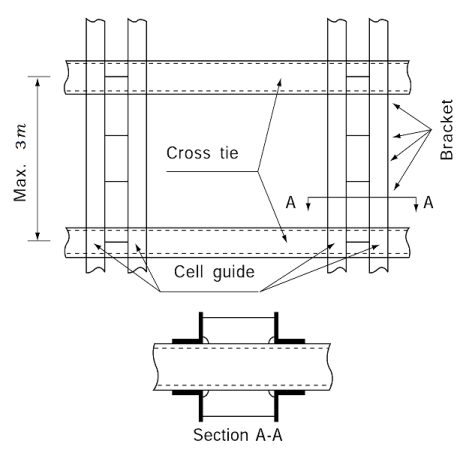
  **Fig 1 Typical arrangement of cell guides**

#### (3) Cell guide systems on exposed decks

- **(A)** Analysis methods for the strength of the cell guide structure are to take due account of the interactive effects between guide structure and supporting deck structure and also of the deformation of the hull girder.
- **(B)** At its lower end the guide structure is to be efficiently connected to the deck structure. Cross ties are to be arranged between guides in a transverse direction at a spacing determined by the loading on the guides but in general not more than 3 $\mathrm{m}$ apart. Cross bracing members of adequate strength and sufficient number are to be fitted in the transverse and longitudinal directions to prevent excessive deflection of the guide structure.
- **(C)** The height of guide bars above the deck is to be sufficient to ensure adequate restraint to container tiers.
- **(D)** Where the cell guide structure is attached to highly stressed hull or deck elements, such as sheer strake, special attention is to be given to the design of the connection and the grade and quality of steel utilized.

#### (4) Carriage of 20 ft containers in 40 ft cell guides in holds

- **(A)** Where the cell guides are arranged for the carriage of 40 ft containers, provision should be made for the installation of temporary intermediate cell guides for 20 ft containers. The permanent structure is to be designed such that it is suitable for either loading pattern.
- **(B)** Alternatively, permanent means for the support of 20 ft containers at the mid-length of a cell arranged for 40 ft containers should be considered. Such means may include the following:
  - **(a)** A pillar (inboard) and vertical rest bar (on the longitudinal bulkhead) against which the container stack may rest. The pillar is to be supported laterally by the deck structure over and is to be sufficiently stiff to control lateral deflection of the container stacks.
  - **(b)** Guide bars supported transversely by slim structure within the gap between containers and with longitudinal ties as necessary.
    Details of proposals will be individually considered, taking into account the loads on the support structure and the resulting deflections.
- **(C)** Where it is desired to stow 20 ft containers without external support at the mid-bay location with or without 40 ft overstow, so called ‘mixed stowage’, arrangements meeting the following requirements are applicable:
  - **(a)** In case that 20 ft containers are stowed in cell guides with no 40 ft container overstowed, it can be assumed that 65% of transvers accelration will be applied on cell guide side and 35% will be applied on midbay.
  - **(b)** In case that transverse acceleration for 20 ft containers stowed in cell guides with at least one 40 ft container overstowed, it can be assumed that 75% of transvers accelration will be applied on cell guide side and 25% will be applied on midbay. In this case, racking and compression of stack except 40 ft container overstowed are to be verified in accordance with **8.**(4), this Annex.
  - **(c)** Means are to be provided to prevent transverse sliding of the bottom of the stacks of 20 ft containers at the mid bay position. This is to be in the form of permanently attached chocks at the inner bottom or equivalent. The design clearance is to be the same as for the cell guides and in accordance with **2.**(D)
  - **(d)** Stacking cones are to be fitted at each corner between tiers of the 20 ft containers to prevent transverse and longitudinal sliding. But where stacking cones without flanges are used, the stacking cones should be placed in one or more corners on each cross section of the 20 ft containers. In addition, where a 40 ft container is required to be stowed above 20 ft containers, two stacking cones on each cross section are to be fitted at the ends of the 40 ft container between the 40 ft container and the 20 ft containers. *(2019)*
  - **(e)** The 20 ft containers are to have closed steel walls and top (no open frame containers, e.g. tank or bulk containers)
  - **(f)** Cones are to be fitted on the inner bottom in way of the cell guides to restrain container movement in the longitudinal direction.
  - **(g)** The orientation of the containers is to be such that all front ends or door ends are facing in one direction.
  - **(h)** The containers are to be stowed in the hold in block stowage. In general, free standing stacks due to adjacent empty stacks are to be avoided.
    Proposals for stowage arrangements other than the above will be individually considered and are to be accompanied by supporting calculations.

#### (5) Entry guide device

- **(A)** A device to pre-centre the container and direct it into the cell guides is normally to be fitted at the top of the guide bars. Such devices include:
  • fixed even peaks;
  • fixed high and low peaks;
  • ‘flip-flop’ systems;
  but other devices will be considered. The device is to be of robust construction.


### 7. Container support structure (2019)

#### (1) General

- **(A)** Drawings for lashing bridges, cell guides, container supports and other container support structures are to be submitted to the Society for approval.
- **(B)** The lower part of fixed container securing system of hatch covers and hull structures should be suitably reinforced
- **(C)** FE(Finite Element) method or Grillage analysis can be used for the strength evaluation. The modeling and evaluation should be of a gross scantling, and the element size should be such that the behavior of the structure can be faithfully reproduced.
- **(D)** The evaluation of the hatch cover strength is to be in accordance with the requirements in **Pt 4, Ch 2** of the Rules.
- **(E)** If a lashing bridge of the Mickey Mouse type is applied, special considerations should be taken to constrain the lateral displacement of the structure.
- **(F)** If requested by the owner or deemed necessary by the Society, vibration evaluation on the lashing bridge can be performed. *(2021)*

#### (2) Structural strength evaluation

- **(A)** Structure modelling
  - **(a)** Model extent
  - **(i)** The model for strength evaluation should include at least hull structure until first stringer in vertical direction and one web frame in longitudinal direction from container support structure. Generally both port and starboard of the lashing bridge structure should be modelled.
    - **(ii)** Alternatively, the strength evaluation may be performed using only the lashing bridge model. However, strength evaluation for the hull structure in contact with the lashing bridge should be additionally performed by using the reaction force derived from the analysis of the lashing bridge model.
    - **(iii)** The strength evaluation of the lashing bridges on fore part, midship and after part should be carried out. And addition strength evaluations may be required when deemed necessary by the Society.
  - **(b)** FE model
  - **(i)** The FE model follows the right-handed coordinate system as shown in **Table 1.**

    | **Coordinate** | **Direction** | **Note** |
    | --- | --- | --- |
    | x | longitudinal | positive forwards |
    | y | transverse | positive to port from centerline |
    | z | vertical | positive to upward from base line |

    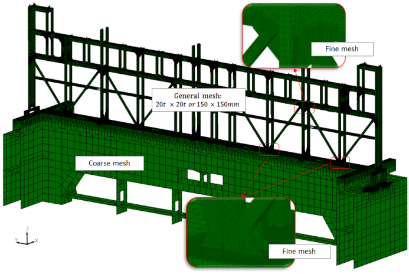
    **Fig 2 Example of element splitting of lashing bridge** ***(2019)***
    - **(ii)** In general, plate elements should be used. *(2020)*
    - **(iii)** The element size should be sufficiently small to be able to represent the shape of the structure and to limit stress concentration. In general, the members which have a stress variation in the depth direction should be meshed into 3 sub depths. The minimum required element size of fine mesh area need not be less than the thickness of the plate. *(2020)*
- **(B)** Boundary conditions
  A suitable boundary condition that can express the behavior of an actual structure should be applied to the structural model.
- **(C)** Loads
  - **(a)** Design loads
  - **(i)** For the supporting structure of the container securing system, the safe working load(SWL) of the container securing system can be used as the design loads.
    - **(ii)** The design loads can be calculated according to **8.** by applying the container arrangement layout of the container arrangement plan.
    - **(iii)** When considering the load, all predictable operating directions should be considered.
  - **(b)** Combination of design loads
  - **(i)** Lashing bridge
    The following combinations of design loads shall be considered:
    - containers loaded in both forward and aft bays of lashing bridge(transverse load maximum condition)
    - containers loaded in the forward bay of the lashing bridge(forward direction maximum load condition)
    - containers loaded in the aft bay of the lashing bridge(aft direction maximum load condition)
    The design loads should be the value calculated according to the container stowage arrangement. Where SWLs are used as design loads, the values shown in **Fig 3** can be used.
    The design load combination shown in **Table 2** below should be considered and the conditions for loading the high cubic container should be considered. For cell guides installed on the deck, wind loads should be taken into account.
    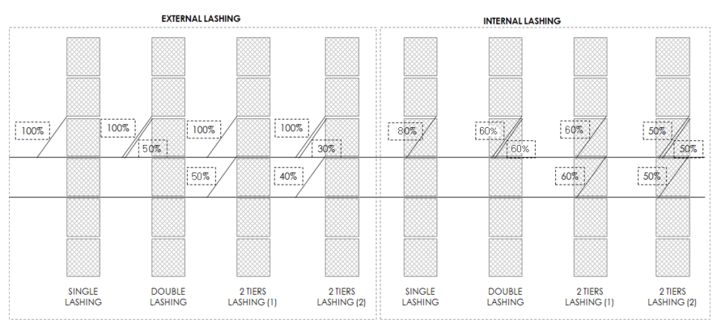
    **Fig 3 Examples for load distribution of SWLs as design loads** ***(2021)***

    | **Load condition** | **Transverse load** | **Longitudinal load** | **Vertical load** |
    | --- | --- | --- | --- |
    | Load combination 1 | apply | not apply | not apply |
    | Load combination 2 | not apply | apply | not apply |

    The design load combinations in **Table 3** below should be considered. For container stanchion in the outermost stack, the wind loads should be considered.

    | **Load condition** | **Transverse load** | **Longitudinal load** | **Vertical load** |
    | --- | --- | --- | --- |
    | Load combination 1 | apply(inside) | not apply | apply(tension) |
    | Load combination 2 | apply(outside) | not apply | apply(compression) |

    It shall be deemed appropriate by the Society.
    - **(ii)** Cell guide
    - **(iii)** Container stanchion
    - **(iv)** Other container support structures
- **(D)** Permissible stress
  - **(a)** Stresses of container support structures are not to exceed the permissible values given in **Table 4**.

    | **Stress** | **Permissible stress (**$\mathrm{N}/m^2$**)** |
    | --- | --- |
    | Normal stress<br>(bending, tension, compression) | 0.8 $\sigma_0$ |
    | Shear stress | 0.46 $\sigma_0$ |
    | Combined stress | 0.9 $\sigma_0$<sup>(1)</sup> |
    | $\sigma_0$ : specified minimum yield stress ($\mathrm{N}/m^2$)<br><sup>(1)</sup> : The permissible stress may be alleviated up to 1.2 $\sigma_0$ for stress concentration part of fine mesh area. |   |
- **(E)** Buckling strength
  - **(a)** The buckling strength evaluation should be performed for the members with stress derived from the FE analysis according to **Pt 14**, **Ch 8** of the Rule.
    $\eta _{act} < \eta _{a }$
    $\eta _{act}$ : Buckling usage factor obtained from **Pt 14 Ch 8 Sec 5 2.2.1** and **3.1** of the Rule
    $\eta _{a }$ : allowable buckling usage factor plate of platform : 0.9 strut and piller : 0.67
- **(F)** Stiffness of lashing bridge
  - **(a)** The maximum transverse displacement of the lashing bridge load operating point should not exceed the following values;
    - 1 tier lashing bridge : 10 mm
    - 2 tier lashing bridge : 25 mm
    - more than 3 tier lashing bridge : 35 mm

#### (3) Vibration analysis

- **(A)** FE model
  - **(a)** The lashing bridge should be properly designed so that the natural frequencies of the structure avoid resonance with the excitation frequencies of the engine and the propeller.
  - **(b)** Where the ship is expected to operate with no containers secured to the lashing bridges, such as during sea trials, ballast voyages or empty on deck bays, the vibration evaluation of the lashing bridge should be considered.
  - **(c)** In general, FE model used for the strength assessment may be used. The vibration response of the lashing bridge should be assessed at several locations, among the vessel. In particular, the lashing bridge of the aftermost part is more likely to vibrate because it is close to the propeller and main engine compartment, so the vibration response should be evaluated.
  - **(d)** The structure modelling and boundary conditions for vibration evaluation are described in (2) (A) and (B). Where a global hull structure FE model is available and a global hull modal analysis is to be carried out, it is recommended that the lashing bridge models are incorporated in the global hull structure model prior to vibration analysis.
- **(B)** Natural frequency assessment
  - **(a)** The calculated natural frequencies of the global behaviour of the lashing bridge are to satisfy the following requirements:
  - **(i)** For lashing bridge structures located aft of the main machinery space, the calculated natural frequencies of the lashing bridge should not be in the range of the propeller blade frequencies associated with:
    - lower limit : 80% of NCR minus 10% of MCR
    - higher limit : MCR plus 10% of MCR
    where,
    NCR : the Normal Continuous Rating. In the event that the ship is expected to operate for a prolonged period at a speed lower than that provided by operating at the NCR, then the shaft speed consistent with that speed should be used instead of the NCR.
    MCR : the Maximum Continuous Rating
    - **(ii)** For lashing bridge structures adjacent to the engine room of ships with slow speed diesel engines, the calculated natural frequencies should not be in the above range for frequencies associated with large engine forces.
  - **(b)** A Campbell diagram may be used to assess the potential resonant frequencies. An example Campbell diagram is shown in **Fig 4**. At the intersection between the first order propeller blade frequency line and the line of natural frequencies of a mode, a possible resonant condition can be found.
  - **(c)** In order to reduce excessive vibration response due to resonance, it may be considered to apply measures such as additional structural damper system, temporary messes or the equivalent. Such measures should be discussed with the Society.
    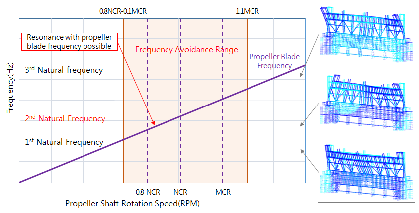
    **Fig 4 Campbell diagram for Lashing Bridge vibration frequency****assessment** ***(2019)***


### 8. Determination and application of forces

#### (1) Symbols and definitions (2019)

- **(A)** Definitions and symbols of terms are as follows.
  $a _{0}$ : acceleration coefficient, is as following formula $a _{0} =(1.58-0.47C _{B} ) \left( \frac{2.4}{\sqrt {L_BP}} + \frac{100}{L_BP} - \frac{600}{L _BP ^{2}} \right)$
  $a _{heave}$ : acceleration of ship heave motion. is as following formula
  $a _{heave} =0.5 f_h a _{0} g$ ($\mathrm{m}/\sec^2$)
  $a _{sway}$ : acceleration of ship sway motion, is as following formula
  $a _{sway} =0.29 a _{0} g$ ($\mathrm{m}/\sec^2$)
  $a _{surge}$ : acceleration of ship surge motion, is as following formula
  $a _{surge} =0.18a _{0} g$ ($\mathrm{m}/\sec^2$)
  $a _{roll}$ : acceleration of ship roll motion, is as following formula
  $a _{roll} = \theta \left( \frac{2 \pi}{T _{\theta }} \right) ^{2} \frac{\pi}{180}$ ($\mathrm{rad}/\sec ^{2}$)
  $a _{"pitch"}$ : acceleration of ship pitch motion, is as following formula
  $a _{"pitch"} = \left( \frac{3.1}{\sqrt {gL}} +1.4 \right) \phi \left( \frac{2 \pi}{T _{\phi }} \right) ^{2} \frac{\pi}{180}$ ($\mathrm{rad}/\sec ^{2}$)
  $a _{i}$ : distance between the center of one corner casting and the end of the container on the other side.($\mathrm{m}$), *(2024)* (see **Fig 5**)
  $a _{x}$, $a _{y}$, $a _{z}$ : acceleration of x, y, z -direction ($\mathrm{m}/\sec^2$)
  $b _{i}$, $c _{i}$ : length and height of the i-th container ($\mathrm{m}$), (see **Fig 5**)
  $d _{i}$ : height of the i-th container fitting between containers in way of vertical direction ($\mathrm{m}$), (see **Fig 5**)
  $e_i$ : The horizontal gap between the container and the lashing bridge ($\mathrm{mm}$)$e_i$ = 0 : without lashing bridge,
  $e_i$ = 700 ~ 1,300 : with lashing bridge
  $f _{h}$, $f _{p}$, $f _{r}$ : route specific reduction factor for heave, pitch, roll motion, (see **Table 8**)
  $g$ : acceleration due to gravity and is to be taken as 9.81 $\mathrm{m}/s ^{2}$
  $h _{i}$ : $c _{i} + d _{i}$, (see **Fig 5**)
  $i$ : index of i-th container in way of vertical direction
  $k _{r}$ : radius of roll gyration(m), generally 0.35*B*
  $\ell _{i}$ : length of lashing device at the bottom of $i$-th container ($\mathrm{mm}$)
  $l _{i} = \sqrt {{a _i^2} + {c_i^2} + {e_i^2}}$
  $n$ : number of total tiers in a row
  $x$ : longitudinal horizontal distance from afterward perpendicular to the centre of the container (positive forwards) ($\mathrm{m}$), center of local container is 1/2 of container's length.
  $y$ : transverse horizontal distance from the centre line of the ship to the centre of the container (positive to portside) ($\mathrm{m}$), center of local container is 1/2 of container's breadth.
  $z$ : vertical distance from base line to the centre of gravity of the container (positive upwards) ($\mathrm{m}$), center of local container is 0.45 of container's height.
  $A _{i}$ : area of lashing device at the bottom of $i$-th container ($\mathrm{mm}^2$)
  $C _{XS}$,$C _{YS}$,$C _{ZH}$,$C _{YR}$,$C _{ZR}$,$C _{XP}$,,$C _{ZP}$ : dynamic motion combination factor of each ships' motion, (see **Table 5**)
  $C _{c}$ : height ratio of container weight, generally, 0.45
  $C _{YG}$, $C _{XG}$: dynamic motion combination factor for roll, pitch motion, (see **Table 5**)
  $C _{yf}$, $C _{zf}$ : dynamic coefficient for at the location of x-direction, (see **Table 7**)
  $E _{i}$ : elongation of lashing rod at the bottom of $i$-th container ($\mathrm{kN}/mm^2$)(see **Table 10**)
  $GM$ : metacentric height ($\mathrm{m}$).
  $K _{i}$ : a transverse stiffness of lashing rod at the bottom of $i$-th container, is as following formulae
  $K _{i} = \frac{E _{i} A _{i} \cos ^{2} \theta _{i}}{\ell _{i}}$
  $K _{c}$ : spring constant of container’s wall (see **Table 9**)
  $L _{BP}$ : length between fore and after perpendiculars of the ship ($\mathrm{m}$)
  $R$ : centre of motion, to be taken on the centreline at the longitudinal centre of flotation of the ship above the keel, $R= \frac{1}{2} (0.35B + 1.4T _{LC} )$
  $CR$ : the rating, or maximum operating gross weight for which the container is certified, and is equal to the tare weight plus payload of the container (ton)
  $T _{LC}$ : moulded draught in the container load condition ($\mathrm{m}$)
  $T _{i}$ : tensile load of lashing device at the bottom of $i$-th container
  $T _{\theta}$, $T _{\phi$ : full period of roll and pitch of the ship (sec)
  $V_w$ : wind speed ($\mathrm{m}/\sec$). For ships with an unrestricted worldwide service area notation a wind speed of 36 $\mathrm{m}/\sec$ is to be applied at least.
  $W _{i}$ : design weight of the $i$-th container and contents (ton). In general $W _{i}$ is to be taken as R (rating weight) unless reduced maximum weights are specified. The following minimum weights W are to be used:
  20 ft container : 2.5 ton
  40 ft container : 3.5 ton
  45 ft container : 4.0 ton
  $\alpha$ : coefficient of wind force, (see **Table 5)**
  $\theta _{i}$ : lashing angle of lashing device at the bottom of $i$-th container, (see **Fig 9)**
  $\theta$, $\phi$ : Angle of roll (degree), angle of pitch (degree)
  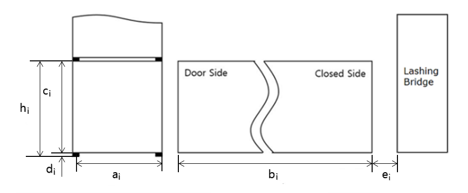

  **Fig 5 Dimension of container**

#### (2) Acceleration of ship motion (2023)

- **(A)** The following six dynamic motion cases are to be considered;
  BSRL : Roll motion in beam sea
  BSHA : Heave acceleration in beam sea
  OSPH : Pitch motion in oblique sea
  For each dynamic motion case, combination factors, shown in **Table 5**, are used for to calculate the acceleration.
- **(B)** The ship motion angle and period for roll and pitch motions are given in **Table 6.** The accelerations, as below, are to be used to derive the forces for the container securing arrangements. Alternatively, the ship motion values may be derived by direct calculation methods using the same principles as those used to derive the Rule equations. The dynamic coefficients, $C _{yf}$ and $C _{zf}$, are shown in **Table 7** considering influence of location in x-direction.
  $a _{x} =-C _{XG} g \sin \phi +C _{XS} a _{surge} +C _{XP} a _{"pitch"} (z-R)$
  $a _{y} =C _{YG} g \sin \theta + C _{yf} C _{YS} a _{sway} - C _{yf} C _{YR} a _{roll} (z-R)$
  $a _{z} = -g + C _{zf} C _{ZH} a _{heave} + C _{zf} C _{ZR} a _{roll} \left| y \right| - C _{zf} C _{ZP} a _{"pitch"} (x-0.45L)$
- **(C)** The sea route specific reduction factors for each dynamic component are shown in **Table 8.** The route specific reduction factor is derived from the long-term response analysis with design life 20 years for the various container ship hull form considering environmental conditions on the route. If route pattern is extraordinary, the factor may be determined in consultation with the Society. Specific route examples refer to **Appendix 2.**
- **(D)** Wind forces are generally to be based on a maximum wind speed of 36 $\mathrm{m}/\sec$. Wind forces are to be applied increasing ways of transverse force.
- **(E)** If a 40ft container is loaded on the outermost stack and 40ft / 45ft / 48ft / 53ft container is loaded on the inner stack, the wind forces on the longitudinal protrusion is not applied. If only one 20ft container is loaded on the outermost side and the 40ft / 45ft / 48ft / 53ft container is loaded on the rear, 40ft / 45ft / 48ft / 53ft containers will have 50% wind load.
- **(F)** If the height difference between the top of the container to which the wind forces are applied and the center of the container of the inner stack is less than 1.9 $\mathrm{m}$, wind forces are not applied. For the top container on the inner stack, a wind forces of 80% is to be considered. (refer **Fig 6)**

  **Table 5 Dynamic motion combination factor** ***(2019)***

  |   |   | Acceleration |   |   |   |   | Angle |   | Wind |
  | --- | --- | --- | --- | --- | --- | --- | --- | --- | --- |
  |   |   | Surge | Sway | Heave | Roll | Pitch | Roll | Pitch | Wind |
  |   |   | $C_XS$ | $C_YS$ | $C_ZH$ | $C_ZR$,$C _{YR}$ | $C_XP$, $C _{ZP}$ | $C _{YG}$ | $C _{XG}$ | $\alpha$ |
  | BSRL | 1 | 0 | 0.1 | -0.1 | -1.0 | 0 | 1.0 | 0 | 1.0 |
  | BSRL | 2 | 0 | -0.1 | 0.1 | 1.0 | 0 | -1.0 | 0 | -1.0 |
  | BSHA | 1 | -0.1 | -0.6 | -1.0 | 0.15 | -0.1 | -0.1 | 0 | -1.0 |
  | BSHA | 2 | 0.1 | 0.6 | -1.0 | -0.15 | 0.1 | 0.1 | 0 | 1.0 |
  | OSPH | 1 | -0.6 | 0.4 | -0.4 | -0.1 | -1.0 | 0.1 | 1.0 | 0.5 |
  | OSPH | 2 | 0.6 | -0.4 | -0.4 | 0.1 | 1.0 | -0.1 | -1.0 | -0.5 |

  **Table 6 Ship motions** ***(2023)***

  | Motion | Angle of radian | Periods (sec) |
  | --- | --- | --- |
  | Roll | $\theta = f _{r} \frac{9000(1.25-0.025T _{\theta } )}{(B+75) \pi}$<br>but need not exceed 30°(0.524 rad)<br>- if $B < 32.26 \mathrm{m}$, not to be taken less than $f _{r} \times 22 {}^{\circ}$$(fr \times 0.384 rad)$<br>- if $B >= 60 \mathrm{m}$, not to be taken less than $f _{r} \times 17 {}^{\circ}$$(fr \times 0.297 rad)$<br>(If the $B$ is a intermediate value,<br>$\theta$ is determined by linear interpolation) | $T _{\theta } = \frac{2.3 \pi k _{r}}{\sqrt {g GM}}$ |
  | Pitch | $\phi = f _{"p"} 1350 L ^{-0.94} \left\{ 1.0+ \left( \frac{15}{\sqrt {gL}} \right) ^{1.6} \right\}$ | $T _{\phi } = \sqrt {\frac{2 \pi L}{g}}$ |

  **Table 7 Dynamic coefficient at the location of x-direction** ***(2019)***

  | x-location ($x/L _{BP}$) | $C _{yf}$ | $C _{zf}$ |
  | --- | --- | --- |
  | 0.0 | 1.63 | 1.11 |
  | 0.1 | 1.46 | 1.11 |
  | 0.2 | 1.32 | 1.05 |
  | 0.3 | 1.24 | 1.04 |
  | 0.4 | 1.20 | 1.02 |
  | 0.5 | 1.20 | 1.06 |
  | 0.6 | 1.23 | 1.18 |
  | 0.7 | 1.30 | 1.29 |
  | 0.8 | 1.39 | 1.40 |
  | 0.9 | 1.52 | 1.40 |
  | 1.0 | 1.68 | 1.40 |
  | The interpolation is to be applied considering x-coordinate belong to each range. |   |   |

  | **Route** | $f _{r}$ | $f _{p}$ | $f _{h}$ |
  | --- | --- | --- | --- |
  | Asia-Europe service | -0.00041$B$+0.8907 | 0.866 | 0.902 |
  | Pacific service | -0.00146$B$+0.9709 | 0.862 | 0.996 |
  | Pacific-Atlantic service | -0.00074$B$+0.9641 | 0.915 | 0.981 |
  | North Sea-Mediterranean Short Sea service | -0.00025$B$+0.9446 | 0.928 | 0.954 |
  | North Atlantic service | 1 | 1 | 1 |
  | Asia-South America(West Coast) | -0.00090$B$+0.9452 | 0.873 | 0.970 |
  | South America(East Coast)-Africa | 0.00094$B$+0.8475 | 0.831 | 0.873 |
  | Africa-East Asia | 0.00087$B$+0.9034 | 0.875 | 0.885 |
  | Europe(Rotterdam)-Africa | -0.00009$B$+0.9118 | 0.905 | 0.914 |
  | Europe(Rotterdam)_South America(Brazil) | -0.00020$B$+0.9265 | 0.916 | 0.932 |
  | US(NYC)-South America(Brazil) | -0.00062$B$+0.8084 | 0.760 | 0.826 |
  | Asia-Middle East Asia | -0.0026$B$+0.8418 | 0.628 | 0.851 |
  | Intra Asia | -0.0024$B$+0.8508 | 0.649 | 0.865 |
  | $f _{r}$ is not to be less than –0.0045B+0.9735 in any route. |   |   |   |

  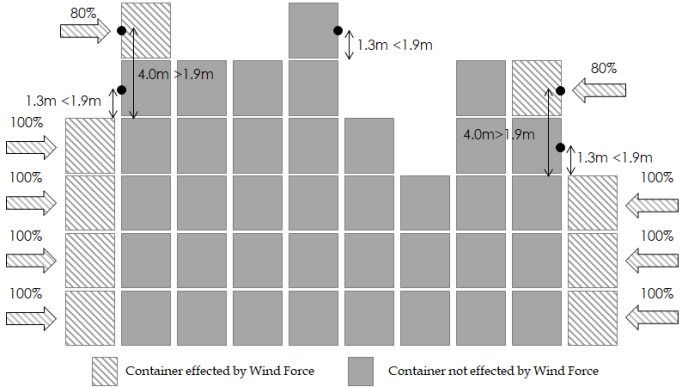
  **Fig 6 Wind forces applied area** ***(2019)***

#### (3) Resultant applied forces for unlashed stack

- **(A)** The resultant forces derived for each container in the stack are assumed to be divided equally between the walls of the container as follows:
  $H _{i}$ : sliding force in one transverse end
  $H _{i} =a _{y } \frac{W _{i}}{2}$ (kN)
  $J _{i}$ = sliding force in one longitudinal side
  $J _{i} =a _{x} \frac{W _{i}}{2}$(kN)
  $P _{i}$ = vertical force in each corner post
  $P _{i} =a _{z} \frac{W _{i}}{4}$(kN)
  $Q _{i}$ = wind force in one transverse end
  $Q _{i} = \frac{\alpha 7.33 c b V _{w}^{2} \cos \left( C _{YG} \theta \right) \times 10 ^{-4}}{2}$
  (kN) *(2019)*
- **(B)** The transverse force at the top of each tier is follows. The subscript $i$ refers to any particular container, see **Fig 7** for example.
  $F _{ i} =C _{c} H _{ i} +(1-C _{c} )H _{ i+1} + \frac{Q _{ i}}{2} + \frac{Q _{ i+1}}{2}$ for $i\(F _{ i} =C _{c} H _{ i} + \frac{Q _{ i}}{2}$ for $i=n$
  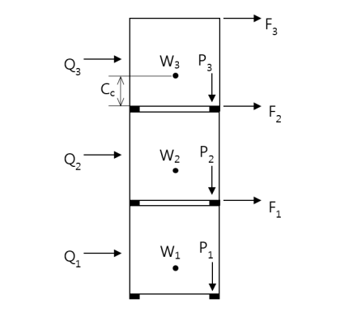
  **Fig 7 Example of transverse forces for unlashed stack**
- **(C)** The equations for the resultant forces in an unlashed stack are listed below;
  - **(a)** Racking force, per end wall ($\mathrm{kN}$). see **Appendix 3** for example.
    $Ru _{ i} = \sum _{j=i} ^{n} F _{ j}$
  - **(b)** Shear force, per corner ($\mathrm{kN}$), as follows. The same approach applied to the racking force is used to calculate the shear force except of addition of longitudinal sliding force.
    $Su _{ i } = \sqrt {\left( 0.55 \sum _{j=i} ^{n} \left( H _{ j} +Q _{ j} \right) \right) ^{2} + \left( 0.55 \sum _{j=i} ^{n} J _{ j} \right) ^{2}}$
  - **(c)** Compressive force per top and bottom corner ($\mathrm{kN}$) as below. Negative value means compressed force so that absolute value of this force is to be compared with criteria described in **Fig 12** (c). *(2017)*
    Top : $Cu _{ i"_top"} = \sum _{j=i+1} ^{n} P _{j} - \frac{1}{a _{i+1}} \sum _{j=i+1} ^{n} \left( F _{j} \sum _{k=i+1} ^{i} h _{k} \right)$
    Bottom : $Cu _{ i"_btm"} = \sum _{j=i} ^{n} P _{j} - \frac{1}{a _{i}} \sum _{j=i} ^{n} \left( F _{j} \sum _{k=i} ^{j} h _{k} \right)$
  - **(d)** Lifting force per bottom corner ($\mathrm{kN}$) as below. Positive value means lifting force and only positive value is to be compared with criteria described in **Fig 12.**
    $Lu _{i} = \sum _{j=i} ^{n} P _{j} + \frac{1}{a _{i}} \sum _{j=i} ^{n} \left( F _{ j} \sum _{k=i} ^{j} h _{k} \right)$
- **(D)** Where the stack is in an unlashed stack condition without any lashing device, the resultant forces calculated from (C) are not to exceed the allowable loads for which the container is suitable, see (6). The lashing devices are to be arranged if the resultant forces are exceeded the allowable criteria. The resultant forces in the securing devices and supports are not to exceed the allowable working loads for which the device has been approved, see **2** and **3.**

#### (4) Arrangements incorporating lashings

- **(A)** Where the securing arrangements incorporate lashings, proper allowance is to be made for flexibility of the system. For this purpose, the following values may be adopted:
  - **(a)** Racking deformation of the container. Full scale testing of containers indicates that values of the spring constant may be taken as in **Table 9**. The application of only smallest constant is recommended in case of stacking with various size of containers in a bay.

    **Table 9 Spring constants** $K _{c}$ **for containers**

    | Height ($\mathrm{m}$) | Door end ($\mathrm{kN}/mm$) | Closed end ($\mathrm{kN}/mm$) | Side Wall<br>($\mathrm{kN}/mm$) |
    | --- | --- | --- | --- |
    | 2.438 | 3.7 | 16.7 | 6.1 |
    | 2.591 | 3.5 | 15.4 | 5.7 |
    | 2.743 | 3.3 | 14.3 | 5.4 |
    | 2.896 | 3.2 | 13.3 | 5.1 |
  - **(b)** Horizontal movement of the containers:
    Initial displacement of containers due to tolerances in container fittings will be considered in conjunction with the stowage arrangement proposed. Generally, initial displacement may be neglected in calculation procedures for conventional stowages.
  - **(c)** Elongation of lashings:
    Elongation is to be determined by reference to the effective modulus of elasticity of the lashing which, in the absence of actual test values, may be taken as shown in **Table 10**.

    **Table 10 Elongation of lashing** $E _{i} ( \mathrm{kN}/mm ^{2} )$

    | Type of lashing device | Elastic modulus |
    | --- | --- |
    | Steel rod lashings of hook type turnbuckle | 98 |
    | Short (one tier) steel rod lashings (knob type), incl. turnbuckle and lashing eyes | 140 |
    | Long (two tier) steel rod lashings (knob type), incl. turnbuckle and lashing eyes | 175 |
    | Steel wire rope lashings | 90 |
    | Steel chain lashings (based on the nominal diameter of the chain) | 80 |
    | Adjustable tension compression buttress | 120 |
- **(B)** Any other element introducing flexibility into the structure between the lashing point and the base of the container stack is to be evaluated and taken into account, if necessary. Examples of this could be flexibility of a lashing bridge, sliding of a hatch cover, or torsional deformations of the hull.
- **(C)** In the case of a para-lashing arrangement, total cross-section area is set to the sum of each rod section area. In the case of para-lashing arrangement in which one turnbuckle and two lashing rods are used in combination, shown on (**Fig 8**), the same section area is used. *(2024)*
  
  **Fig 8**
- **(D)** The calculations are to be made for each end of the container stack, that is with all door ends together and with all closed ends together.
- **(E)** For conventional arrangements, the spring constant $K _{i}$ for the lashing rod at the bottom of $i$-th container may be determined as shown in **Fig 9**:
  $T <sub>i</sub> = \frac{E <sub>i</sub> A <sub>i</sub>}{\ell <sub>i</sub>} \Delta \ell <sub>i</sub> = \frac{E <sub>i</sub> A <sub>i</sub>}{\ell <sub>i</sub>} \left( \delta <sub>i</sub> \cos \theta <sub>i</sub> \right)\#
   \#
  T <sub>i</sub> \cos \theta <sub>i</sub> = \frac{E <sub>i</sub> A <sub>i</sub>}{\ell <sub>i</sub>} \left( \delta <sub>i</sub> \cos \theta <sub>i</sub> \right) \cos \theta <sub>i</sub> = \frac{E <sub>i</sub> A <sub>i</sub> \cos <sup>2</sup> \theta <sub>i</sub>}{\ell <sub>i</sub>} \cdot \delta <sub>i</sub>$
  $K _{i} = \frac{E _{i} A _{i} \cos ^{2} \theta _{i}}{\ell _{i}}$
  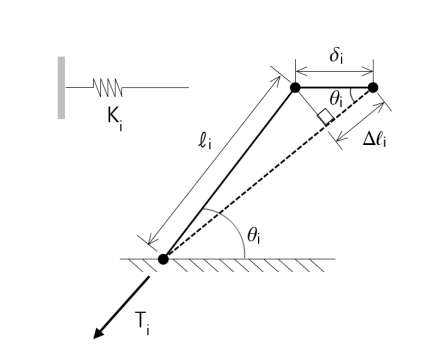
  **Fig 9 Horizontal stiffness of lashing rod**
  In case of the aforementioned configuration, attention is to be paid to the fact that the arrangement of the fixed lashing plates is to be suitable to accommodate the inclined lashing rods. In addition, attention should be paid to the design of the heads of the lashing rods being suitable to secure the container under the angle of inclination.
- **(F)** A buttress or shore may be modeled in a similar way to a lashing. Where, however, more than one stack is supported by the use of linkages between adjacent containers in line with the buttress or shore, the model is to take this into account.
- **(G)** The resultant applied forces in the lashed condition are determined in accordance with (5). The distribution of forces in the stack is obtained by equating the total movement of the containers with the corresponding component of elongation of the associated support element under the influence of the imposed forces. The transverse forces due to the tensions in the lashing rods is shown in **Fig 10**. These forces are considered the installation of lashing bridge which extend to several tiers height.
- **(H)** Having established the tension in the lashings, the residual forces in the containers are transmitted through the stack in accordance with the method given in (5). The model assumes that the securing devices between tiers of containers are capable of resisting negative (separation) forces. That is, where separation forces are found, suitable locking devices are assumed to be fitted and transmitting load.

  | 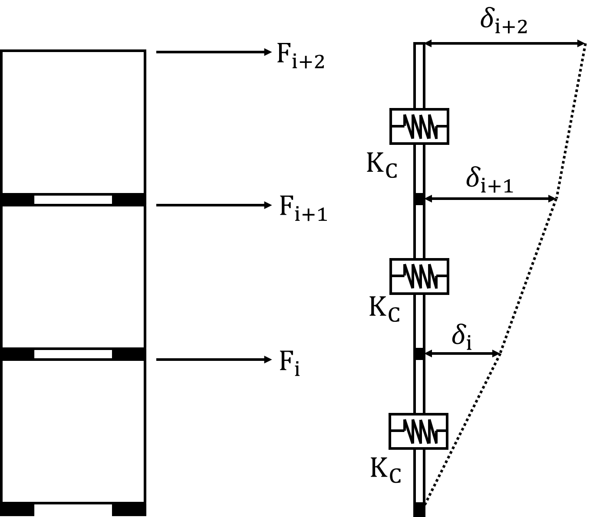<br>Unlashed stack | ${cases{eqalign{delta <sub>i</sub> = {Ru <sub>i</sub>} over {K <sub>c</sub>}# }eqalign{delta <sub>i+1</sub> = {Ru <sub>i</sub> +Ru <sub>i+1</sub>} over {K <sub>c</sub>}# # delta <sub>i+2</sub> = {Ru <sub>i</sub> +Ru <sub>i+1</sub> +Ru <sub>i+2</sub>} over {K <sub>c</sub>}}&}}$ |
  | --- | --- |
  | 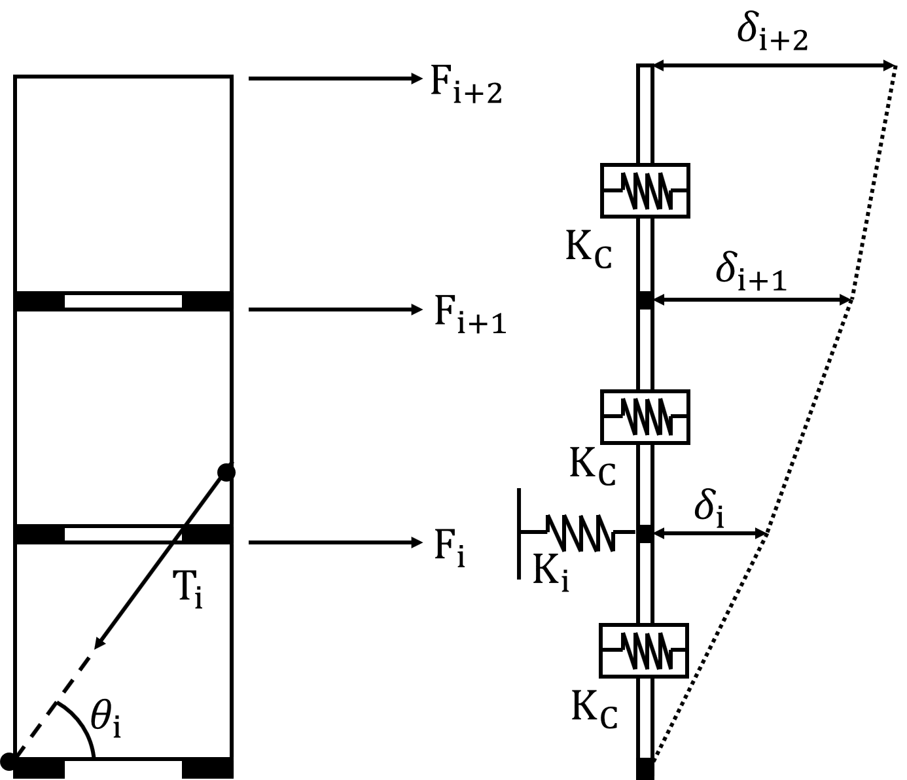<br>Single lashed stack | ${cases{eqalign{delta <sub>i</sub> = {Ru <sub>i</sub> -T <sub>i</sub> cos theta <sub>i</sub>} over {K <sub>c</sub>} = {T <sub>i</sub> cos theta <sub>i</sub>} over {K <sub>i</sub>}# }eqalign{delta <sub>i+1</sub> = {Ru <sub>i</sub> -T <sub>i</sub> cos theta <sub>i</sub> +Ru <sub>i+1</sub>} over {K <sub>c</sub>}# # delta <sub>i+2</sub> = {Ru <sub>i</sub> -T <sub>i</sub> cos theta <sub>i</sub> +Ru <sub>i+1</sub> +Ru <sub>i+2</sub>} over {K <sub>c</sub>}}&}}$<br>$T _{i } \cos \theta _{i} = \frac{K _{i} \sum _{k=1} ^{i} Ru _{k}}{K _{c} + \left( i K _{i} \right)}$ |
  | 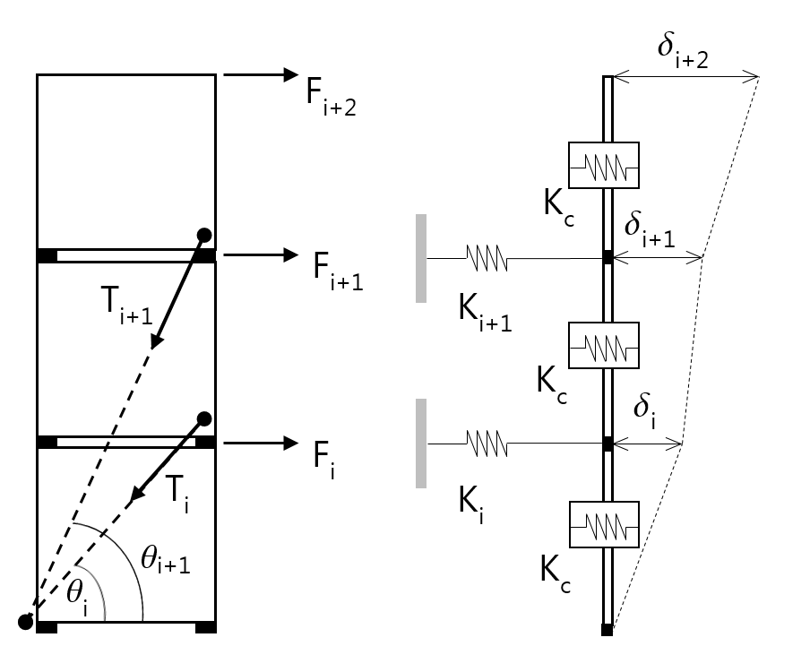<br>Double lashed stack | ${cases{eqalign{delta <sub>i</sub> = {Ru <sub>i</sub> -T <sub>i</sub> cos theta <sub>i</sub> -T <sub>i+1</sub> cos theta <sub>i+1</sub>} over {K <sub>c</sub>} = {T <sub>i</sub> cos theta <sub>i</sub>} over {K <sub>i</sub>}# }eqalign{delta <sub>i+1</sub> = {LEFT ( Ru <sub>i</sub> -T <sub>i</sub> cos theta <sub>i</sub> -T <sub>i+1</sub> cos theta <sub>i+1</sub> RIGHT ) + LEFT ( Ru <sub>i+1</sub> -T <sub>i+1</sub> cos theta <sub>i+1</sub> RIGHT )} over {K <sub>c</sub>}# ```````````````= {T <sub>i+1</sub> cos theta <sub>i+1</sub>} over {K <sub>i+1</sub>}# `# delta <sub>i+2</sub> = {LEFT ( Ru <sub>i</sub> -T <sub>i</sub> cos theta <sub>i</sub> -T <sub>i+1</sub> cos theta <sub>i+1</sub> RIGHT ) + LEFT ( Ru <sub>i+1</sub> -T <sub>i+1</sub> cos theta <sub>i+1</sub> RIGHT ) +Ru <sub>i+2</sub>} over {K <sub>c</sub>}# `````````````````}&}}$<br>$T _{i } \cos \theta _{i} = \frac{K _{i} K _{i+1} \left[ \left( \sum _{k=1} ^{i} Ru _{k} \right) -iRu _{i+1} \right] +K _{i} K _{c} \sum _{k=1} ^{i} Ru _{k}}{i K _{i} (K _{i+1} +K _{c} ) + K _{c} \left[ (i+1)K _{i+1} +K _{c} \right]}$<br>$T _{i+1 } \cos \theta _{i+1} = \frac{K _{i+1} \left( K _{c} \sum _{k=1} ^{i+1} Ru _{k} \right) + iK _{i} K _{i+1} Ru _{i+1}}{i K _{i} (K _{i+1} +K _{c} ) + K _{c} \left[ (i+1)K _{i+1} +K _{c} \right]}$ |
- **(I)** Generally, internal lashings shall be used in case that containers are stowed with lashings. After appropriate verification with Classification, the external lashing as shown in **Fig 11** may be applied for only individual case that the internal lashing can not withstand the greater forces due to heavier stacks. *(2017)*
  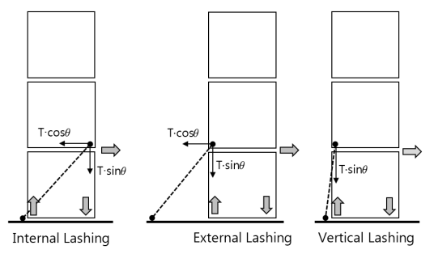
  **Fig 11 Types of lashing**

#### (5) Resultant forces in an lashed condition

- **(A)** The transverse forces in the containers at the level of the lashing can be calculated similarly in accordance with (3) as below. In case that i-th tier is not lashed condition, tension ($T _{i}$) of lashing shall be zero in the calculations.
  $F t _{i} ^{ } =F _{ i} -T _{i } \cos \theta _{i}$
  $P t _{i} ^{ } =P _{ i} -T _{i } \sin \theta _{i}$
  - **(a)** Racking force, per end wall ($\mathrm{kN}$).
    $Rt _{ i} ^{} = \sum _{j=i} ^{n} Ft _{j} ^{}$
  - **(b)** Shear force, per corner ($\mathrm{kN}$), as follows. The same approach applied to the racking force is used to calculate the shear force except of addition of longitudinal sliding force.
    $St _{i} ^{} = \sqrt {\left( 0.55 \sum _{j=i} ^{n} \left( H _{j} +Q _{ j} -T _{ j } \cos \theta _{ j} \right) \right) ^{2} + \left( 0.55 \sum _{j=i} ^{n} J _{ j} \right) ^{2}}$
  - **(c)** Compressive force per top corner ($\mathrm{kN}$). Negative value means compressed force so that absolute value of this force is to be compared with criteria described in **Fig 12.** *(2017)*
    Internal lashing
    : $Ct _{ "i_top"} = \sum _{j=i+1} ^{n} P t _{j} - \frac{1}{a _{i+1}} \sum _{j=i+1} ^{n} \left( F t _{j} \sum _{k=i+1} ^{j} h _{k} \right) - T_i \sin \theta_i$
    External lashing
    : $Ct _{" i_top"} = \sum _{j=i+1} ^{n} P _{j} - \frac{1}{a _{i+1}} \sum _{j=i+1} ^{n} \left( Ft _{j} \sum _{k=i+1} ^{j} h _{k} \right)$
  - **(d)** Compressive force per bottom corner ($\mathrm{kN}$). Negative value means compressed force so that absolute value of this force is to be compared with criteria described in **Fig 12.** *(2017)*
    Internal lashing
    : $Ct _{ "i_btm"} = \sum _{j=i} ^{n} Pt _{j} - \frac{1}{a _{i}} \sum _{j=i} ^{n} \left( Ft _{j} \sum _{k=i} ^{j} h _{k} \right)$
    External lashing
    : $Ct _{ "i_btm"} = \sum _{j=i} ^{n} P _{j} - \frac{1}{a _{i}} \sum _{j=i} ^{n} \left( Ft _{j} \sum _{k=i} ^{j} h _{k} \right)$
  - **(e)** Lifting force per bottom corner ($\mathrm{kN}$). Positive value means lifting force and only positive value is to be compared with criteria described in **Fig 12**. *(2017)*
    Internal lashing : $Lt _{ i} = \sum _{j=i} ^{n} P _{j} + \frac{1}{a _{i}} \sum _{j=i} ^{n} \left( Ft _{j} \sum _{k=i} ^{j} h _{k} \right)$
    External lashing : $Lt _{ i} = \sum _{j=i} ^{n} Pt _{j} + \frac{1}{a _{i}} \sum _{j=i} ^{n} \left( Ft _{j} \sum _{k=i} ^{j} h _{k} \right)$
- **(B)** The resultant forces in the containers are not to exceed the allowable values given in (6). The lashing tensions are not to exceed the allowable working loads. The effect of the additional tension by tilting should be taken into account in the top-layer external lashing of the closed ends without doors. However, additional tension may not be taken into consideration when a securing arrangement is used that does not cause additional tension due to application of a spring or the like. *(2019)*
  $\delta v_act = F_"NL_Trigger" / K_"v_upper_eff"$
  $F_"NL_Trigger" = Lt_"i+1" - T_i \sin \theta_i$
  $K_"v_upper_eff"= C_k \frac{E_i A_i \sin^2 \theta_i}{l_i}$
  $C_k$ : nonlinear correction coefficient, is to be as specified by the Society
  $\delta v_\max$ : vertical clearance between the twistlock intermediate plate and the end of corner casting of container, generally 20 $\mathrm{mm}$. For a ship with **HHS**(High Holding Securing) or **HHT**(High Holding Twistlock) of additional special feature notation, it should be satisfied with the requirements($\delta v_\max$ =15$\mathrm{mm}$) of **Ch 3, 2504** or **2505** of **⌜ Guidance for Approval of Manufacturing Process and Type Approval, etc.⌟** Also this can be applied to calculation. *(2023)*
  Note 1 In case of fully automatic twistlocks, a functional test report should be submitted to the Society. Where the vertical clearance on the test report exceeds 20 mm, the actual value should be applied.
  Note 2 If smaller value is to be used, the value may be used in consultation with the Society based on the functional test report.
  $\delta v_final = \max(0, \min(\delta v_\max , \delta v_act ))$
  $T_"i-final" = T_i + \frac{K_"v_upper_eff" \delta v_final}{\sin \theta_i}$
  After calculating the tension of the uppermost external lashing using the above equation, the tension of the lower external lashing should be recalculated. At this time, the horizontal tension component of the uppermost external lashing is subtracted from the load model, and the horizontal stiffness of the uppermost external lashing is excluded from the stiffness model. Container loads should be recalculated after calculating the tension of all lashing rod. *(2019)*
- **(C)** Where external support is provided by a buttress or shore the load is to be transmitted between adjacent stacks by linkages in line with the support. The force in the transverse end frame members of the containers adjacent to the support is given by:
  $F _{b} ( \frac{2N-1}{2N} )$ ($\mathrm{kN}$) and
  the force in the linkage to the adjacent container is
  $F _{b} ( \frac{N-1}{N} )$ ($\mathrm{kN}$)
  where,
  $F _{b}$ : calculated force in the buttress or shore ($\mathrm{kN}$)
  N : number of rows of containers supported by the buttress or shore.

#### (6) Allowable forces on containers

- **(A)** For ISO containers, the securing arrangements are to be designed so that the forces on the containers do not exceed the values shown in **Table 11**. The maximum forces for ISO 1496-1 including Amendment Nos. 1, 2 and 3 containers are illustrated in **Fig 12**. Proposals to carry out the lashing calculations for containers manufactured in accordance with ISO 1496-1 will be specially considered.
- **(B)** Where 45 ft containers in accordance with ISO 1496-1 are stowed on top of a 40 ft container, the corner post load of the top castings of the 45 ft container are not to exceed a compression force of 404 $\mathrm{kN}$. Consideration should be given to the strength of the container bottom structure to withstand the forces transmitted. No lashings are to be applied to the ends of the 45 ft container if stowed on top of a 40 ft unit.
  **Table 11 Allowable Load on ISO containers** ***(2018)***

  |   | **Allowable Load** |   |
  | --- | --- | --- |
  |   | 20 ft ($\mathrm{kN}$) | 40 ft ($\mathrm{kN}$) |
  | Horizontal force from a container fitting acting parallel to the side face (See **Fig 12** (b)) | 150 | 150 |
  | Horizontal force from lashing on container fitting acting parallel to the end face, see Note 1 (See **Fig 12** (a)) | 225 | 225 |
  | Vertical force from lashing on container fitting acting parallel to the end or side face, see Note 1 (See **Fig 12** (a)) | 250 | 250 |
  | Racking force on container end (See **Fig 12** (b)) | 150 | 150 |
  | Racking force on container side (See **Fig 12** (b)) | 150 | 150 |
  | Vertical forces at each top corner, tension (See **Fig 12** (c)) | 250 | 250 |
  | Vertical forces at each bottom corner, tension (See **Fig 12** (c)) | 250 | 250 |
  | Vertical forces at each top corner post, compression (See **Fig 12** (c)) | 848<br>see Note 4 | 848<br>see Note 4 |
  | Vertical force at each bottom corner casting of the lowest container in a stack, compression (See **Fig 12** (c)) | 848 + (1.8$R$)/4<br>see Note 3 & 4 | 848 + (1.8$R$)/4<br>see Note 3 & 4 |
  | Transverse forces acting at the level of and parallel to the top face, tension or compression, see Note 2 (See **Fig 12** (d)) | 340 | 340 |
  | Transverse forces acting at the level of and parallel to the bottom face, tension or compression, see Note 2 (See **Fig 12** (d)) | 500 | 500 |
  | (Notes)<br>1. In no case is the resultant of the horizontal and the vertical forces to exceed the limiting value derived from **Fig 12** (a). The horizontal and vertical forces are the maximum components of a diagonal force and are not to be used as the maximum load if horizontal or vertical lashings are employed.<br>2. Where a buttress supports the stack at an intermediate level, the total transverse force in the containers at the level is not to exceed the sum of the appropriate top and bottom forces.<br>3. The vertical compression force on the lower corner casting on the closed end of the lowest container may exceed 848 + (1,8$R$)/4 $\mathrm{kN}$, provided the following conditions are complied with:<br>(a) The vertical compression force acting on the lowest container from the container above does not exceed 848 $\mathrm{kN}$<br>(b) The horizontal racking force acting on the lowest container from the container above does not exceed 150 $\mathrm{kN}$.<br>(c) The vertical compressive force acting on the lower corner casting is not exceed the safe working load on the approved certificate for pedestal socket and bottom twistlocks(midlocks). *(2018)*<br>4. When the container is approved by ISO 1496-1 (including amendments up to 2014) or higher, 942 $\mathrm{kN}$ may be used instead of 848 $\mathrm{kN}$. |   |   |

  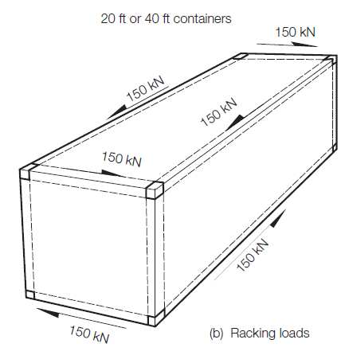
  - **(a)** Corner casting lashing loads (b) 20 ft (40 ft) container, tension or compression
     

    | (c) Vertical corner pull-out and compressive forces<br>(When the container is approved by ISO 1496-1 including amendments up to 2014, 942 $\mathrm{kN}$ of load limit may be used instead of 848 $\mathrm{kN}$.) | (d) Transverse compressive forces |
    | --- | --- |

    **Fig 12 Allowable forces for 20 ft or 40 ft containers construced to ISO 1496-1:**
    **1990 including Amendment up to 2014**


### 9. Container Lashing calculation program and instrument (2025)

#### (1) General

- **(A)** The requirements of this Section apply to container lashing calculation system fitted on board for each ships in accordance with the requirements of **Par 1.** (2) of this Annex.
- **(B)** The container lashing calculation system consist of container lashing calculation program(software) and instrument(hardware).
- **(C)** Container lashing calculation instrument
  - **(a)** If requested type approval of lashing calculation instrument, the approval procedure are to be accordance with **Ch 3, Sec 5** of **Guidance for Approval of Manufacturing Process and Type Approval, Etc**.
  - **(b)** Where type approved hardware is installed, one instrument may install, and otherwise two instruments are to be installed.
  - **(c)** The onboard lashing calculation program is recommended to be integrated into the loading instrument.
- **(D)** Container lashing calculation program
  - **(a)** Application
    - If requested design approval of lashing calculation program, the approval procedure are to be accordance with **Ch 4, Sec 3** of **Guidance for Approval of Manufacturing Process and Type Approval, Etc**.
    - Regardless of the design approval, the lashing calculation program installed on all seagoing dedicated container ships contracted for construction on or after 1 July 2025 are to comply with these minimum requirements.
  - **(b)** Definition
    - Lashing software is an electronic data processing tool for on board analysis of forces in container stacks and thereby reflects the parameters of the lashing system as described in the Cargo Securing Manual prepared in accordance with the Administration requirements.
    - An approved lashing software is not a substitute for the approved Cargo Securing Manual. It is considered as a supplement to the approved Cargo Securing Manual.
    - The lashing software is a ship specific tool, and the results of the calculations are only applicable to the ship for which it has been approved.

#### (2) Documentation to submit

- **(A)** For the approval of lashing calculation program, 3 copies of following documentation are to be submitted to the Society.
  - **(a)** Operation manual
  - **(b)** Program description
  - **(c)** Test report
  - **(d)** Stored ship's characteristic data
- **(B)** All submitted documentation shall be identified with the following;
  - **(a)** Name of vessel, name of builder, building number and identification number of the ship
  - **(b)** Program name, version number and version date
  - **(c)** Program manufacturer and address
  - **(d)** List of contents

#### (3) The documentation are submitted by (2)(A) containing with the following;

- **(A)** Operation Manual
  - **(a)** An operation manual is to be provided for the lashing software and be kept on board.
  - **(b)** The language of the operation manual is to be the same as the language of the approved Cargo Securing Manual. A translation into another language considered appropriate may be required.
  - **(c)** The operation manual should contain descriptions and instructions, as appropriate, as per the following list
    - a general description of the lashing software
    - a copy of the design approval certificate(if requested design approval)
    - installation
    - function keys
    - menu displays
    - input and output data
    - required minimum hardware to operate the software
    - allowable strength limits with respect to the container, lashing equipment and ship
    - instruction on testing the lashing software with the test loading condition
    - a list of all terms, definitions, error messages and warnings likely to be encountered by the user and
    - in the case of error messages and warnings, there are to be unambiguous user instructions for subsequent action to be taken in each case.
- **(B)** Program description
  - **(a)** Description of functionality, including flowcharts
  - **(b)** Descriptions of calculation methods and principles
  - **(c)** Functional Requirements
    - The lashing software is to be capable of calculating forces on containers and container securing equipment for any loading conditions for each container stack.
    - It is also to be capable of indicating the respective permissible values in order to assist the master in his/her judgement on whether the ship is loaded within the approved limits. The following parameters are to be presented
    summary of ship particulars such as IMO No., length, and breadth
    summary of loading conditions showing relevant input parameters such as draught and GM
    stack and container positions
    actual stack weights verified against permissible stack weights
    relevant properties of securing devices, including permissible loads
    accelerations and other external forces such as wind containers are exposed to
    listing of all calculated forces on containers and container securing equipment, and evaluation of compliance of the calculated forces with the corresponding allowable values.
    Strength limitation(according to internal forces in containers, forces in securing equipment and forces in supports)
    - The container and lashing arrangements in each bay on deck and in holds are to be shown graphically.
    - The data are to be presented on screen and in hard copy printout in a clear and unambiguous manner.
    - A clear warning is to be given on screen and in hard copy printout if any of the allowable forces are exceeded.
    - In addition to the printout content, each page of the printout is to contain ship's identification, lashing software name and version number, date and time of the printout, and the title of the loading condition. The printout is to be paginated sequentially, and the total number of printout pages are to be shown.
    - Units of measurement are to be clearly identified and used consistently.
    - Incorrect data input by the users, such as negative draught values, are to be prohibited. An error message is to be prompted on screen and in hard copy printout in a clear and unambiguous manner.
    - The program and the stored characteristic data are to be protected against erroneous use by the user.
  - **(d)** Test Loading Conditions
    - The lashing software is to be delivered with test loading conditions for selected stacks and bays covering applicable stowage patterns for containers of different dimensions contained in the Cargo Securing Manual, as per the Rules of the Society.
    - The test loading conditions and their results are to be permanently stored in the computer where the lashing software is installed and be protected against unintentional or unauthorized modifications and access.
- **(C)** The test report should include at least the following calculations
  - **(a)** Typical container stowage in hold
  - **(b)** Mixed stowage, if applicable
  - **(c)** Typical stowage on deck
  - **(d)** Deck stowage with twistlocks only
  - **(e)** Case with exceeded stack weight
  - **(f)** Case with exceeded lashing force
  - **(g)** Case with exceeded lifting force
  - **(h)** An example where outboard stack exceeded allowable limits
  - **(i)** the summary of the maximum load case(racking, shear, compression load, lifting force, lashing tension)
  - **(j)** example of calculation for bay of fore, midship, stern part
  - **(k)** example of calculation for route reduction factor where apply the route reduction factors.
- **(D)** Stored ship's characteristic data
  - **(a)** Main dimensions of the ship
  - **(b)** The position of each bay from the aft perpendicular
  - **(c)** Strength limitations for containers, lashing equipment and the ship
  - **(d)** General loading limitations.

#### (4) On-board installation test and approval of Lashing Software

- **(A)** The lashing software is subject to approval by the Society and is to include:
  - **(a)** verification of type approval, if any
  - **(b)** verification that the latest ship data has been used
  - **(c)** verification and approval of the test loading conditions and their results
  - **(d)** verification if requirements of (3)(B)(c) are satisfied
  - **(e)** checking of proper installation, and verification of the instrument on board in accordance with the approved test loading conditions
  - **(f)** checking the availability of the operation manual on board.
- **(B)** In case of modifications implying changes in the ship’s design or container securing arrangement, the software is to be modified accordingly and re-approved by the Society.
- **(C)** Any changes in software version related to the container securing calculations are to be reported to and be approved by the Society.
- **(D)** Upon installation, the lashing software is to be verified with the approved test loading conditions in the presence of Society surveyor. It is to be checked that the operation manual for the lashing software is available on board.
- **(E)** Verification by the Society does not absolve the shipowner of responsibility for ensuring that the information supplied into the lashing software is consistent with the current condition of the ship and approved Cargo Securing Manual.
- **(F)** During the on-board installation test, the output calculated on the installed lashing calculation instrument are to be verified to be identical to the approved Test report and If numerical output is at variance with the approved Test report, a program cannot be approved.
- **(G)** The on-board installation test to be carried out according to all loading condition of approved Test report, at least one of the test conditions is to be built up from the start of calculating procedure, to ensure that the calculating methods function properly.
- **(H)** Where the hardware is not type approved, the test is to be carried out on both the first and the second hardware. Both of the hardwares are to be identified on the certificate.
- **(I)** After completion of satisfactory tests, the lashing calculation system approval certificate is to be issued. The following is to be listed in the certificate :
  - **(a)** Name of vessel, name of builder, identification number of the ship and date of built for the ship
  - **(b)** Software name, software version
  - **(c)** Software manufacturer name and address
  - **(d)** Type approval certificate number and design approval certificate number, if relevant
  - **(e)** Hardware name, serial number and manufacturer
  - **(f)** Identification number of the approved Test report and approval date
- **(J)** The lashing calculation program approval certificate and approved test report are to be retained on board along with the operational manual.

#### (5) Acceptable Tolerances

- **(A)** The accuracy of the computational results from the lashing software for the particular ship, on which the lashing software will be installed, is to be determined by using reference computation results deemed appropriate by the Society.
- **(B)** The tolerance of the accuracy of the results from the lashing software is to be below 1.0% of the allowable values. However, deviations may be accepted subject to review by the Society provided that there is a satisfactory explanation for the deviation and that there will be no adverse effects on the safety of the ship.

#### (6) Annual and Special Survey

- **(A)** At each annual and special survey, it is to be checked that the operation manual is available on board.
- **(B)** The lashing software is to be checked for accuracy annually by the ship's Master by applying the test loading conditions. If Society surveyor is not present for lashing software check, a copy of the test loading condition results obtained by this check is to be retained on board as documentation of satisfactory testing for the surveyor's verification at the next scheduled survey.
- **(C)** At each special survey this checking is to be done in the presence of surveyor.

#### (7) Other Requirements

- **(A)** The lashing software and its data are to be protected against unintentional or unauthorized modifications and access.
- **(B)** All changes to the program are to be made by the designer and the Society informed immediately, since such changes invalidate any certificate issued and the certificates shall be re-issued for the changes by the Society.
  **Appendix 1 Container Dimensions of each types** ***(2025)***

  | Size | External Dimension |   |   |   |   |   | Rating<br>(kg) |
  | --- | --- | --- | --- | --- | --- | --- | --- |
  | Size | Length |   | Width |   | Height |   | Rating<br>(kg) |
  | Size | ($\mathrm{mm}$) | Tolerance<br>($\mathrm{mm}$) | ($\mathrm{mm}$) | Tolerance<br>($\mathrm{mm}$) | ($\mathrm{mm}$) | Tolerance<br>($\mathrm{mm}$) | Rating<br>(kg) |
  | 10ft<br>(ISO) | 2,991 | +0/-5 | 2,438 | +0/-5 | 2,438 | +0/-5 | 10,160 |
  | 20ft<br>(ISO) | 6,058 | +0/-6 | 2,438 | +0/-5 | 2,438 | +0/-5 | 36,000 |
  | 20ft<br>(ISO) | 6,058 | +0/-6 | 2,438 | +0/-5 | 2,591 | +0/-5 | 36,000 |
  | 30ft<br>(ISO) | 9,125 | +0/-10 | 2,438 | +0/-5 | 2,438 | +0/-5 | 36,000 |
  | 30ft<br>(ISO) | 9,125 | +0/-10 | 2,438 | +0/-5 | 2,591 | +0/-5 | 36,000 |
  | 30ft<br>(ISO) | 9,125 | +0/-10 | 2,438 | +0/-5 | 2,896 | +0/-5 | 36,000 |
  | 40ft<br>(ISO) | 12,192 | +0/-10 | 2,438 | +0/-5 | 2,438 | +0/-5 | 36,000 |
  | 40ft<br>(ISO) | 12,192 | +0/-10 | 2,438 | +0/-5 | 2,591 | +0/-5 | 36,000 |
  | 40ft<br>(ISO) | 12,192 | +0/-10 | 2,438 | +0/-5 | 2,896 | +0/-5 | 36,000 |
  | 45ft<br>(ISO) | 13,716 | +0/-10 | 2,438 | +0/-5 | 2,591 | +0/-5 | 36,000 |
  | 45ft<br>(ISO) | 13,716 | +0/-10 | 2,438 | +0/-5 | 2,896 | +0/-5 | 36,000 |
  | 48ft | 14,630 | +0/-10 | 2,591 | +0/-5 | 2,908 | +0/-5 | 36,000 |
  | 53ft | 16,154 | +0/-10 | 2,591 | +0/-5 | 2,908 | +0/-5 | 36,000 |

  **Appendix 2 Examples of Specific Route** ***(2018)***
  1. Asia - Europe
  
  2. Pacific
  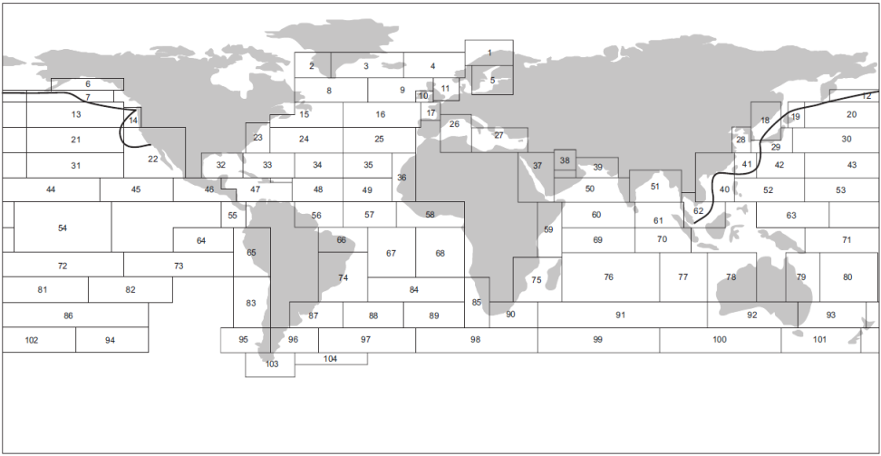
  3. Pacific - Atlantic
  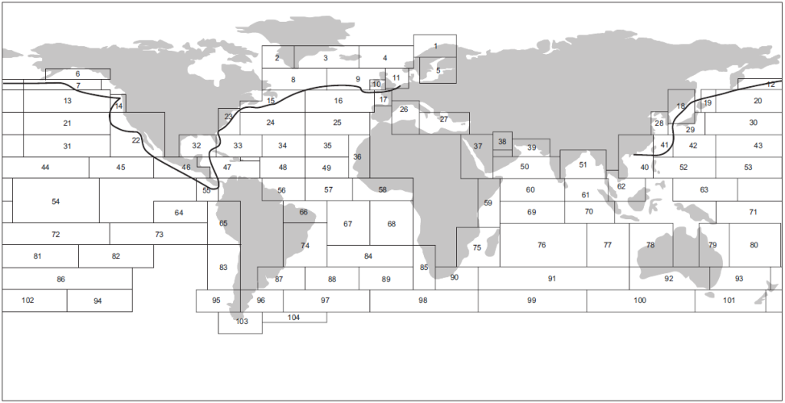
  4. North Sea - Mediterranean Short Sea service
  
  5. North Atlantic
  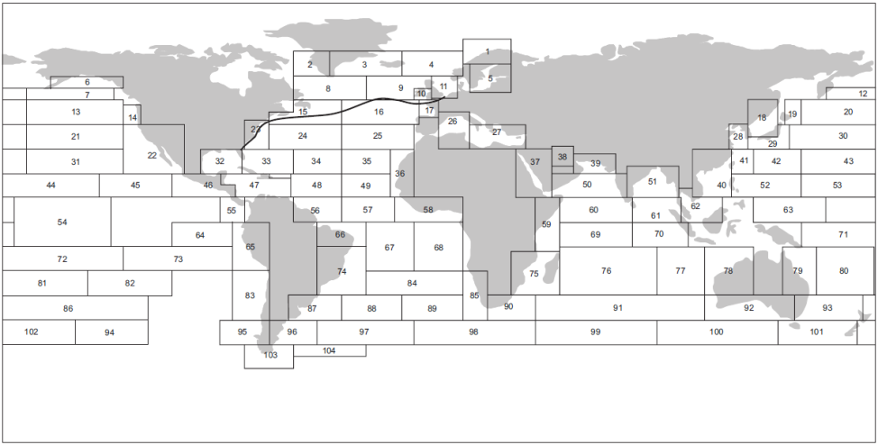
  6. Asia - South America (West Coast)
  7. South America (East Coast) - Africa
  8. Africa - East Asia
  9. Europe (Rotterdam) - Africa
  10. Europe (Rotterdam) - South America (Brazil)
  11. US (NYC) - South America (Brazil)
  
  12. Asia – Middle East Asia
  
  13. Intra Asia
