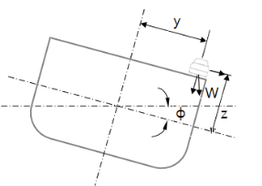
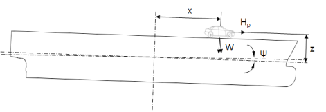
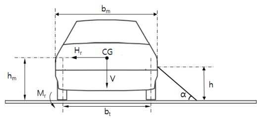
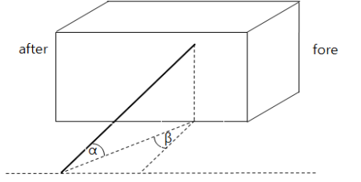

# PART 7 Ships of Special Service (Ch1-4, 7-10)

> RULES FOR CLASSIFICATION OF STEEL SHIPS / RA-07A-E / 2025 / EN / Guidance

## Annex 7-3 Guidance for Car Ferries 【See Rule】

### 1. Application

#### (1) This Annex is applied to the car ferries which are subject to Korean Ship Safety Act and Notification having a restricted to domestic service. And this annex with respect to may apply to car ferries constructed with material other than steel. However, car ferries constructed in compliance with the related International Conventions are regarded as complying with this Annex. Where the ships are not subject to Korean Ship Safety Act, provided that the ships have undergone survey according to relevant governmental regulation and allowed to operate within costal area, the application of this Annex may to be dispensed with.

#### (2) This Annex is not applied to Pure Car Carries and General Cargo Ship which is designed and constructed for the carriage of vehicles in the cargo holds.

#### (3) For the requirements not mentioned in this Annex, they are to be comply with related requirements on Rules and Guidance.

#### (4) In addition to the requirements in (3), for the requirements not mentioned in this Annex are to be comply with related requirements on Korean Ship Safety Act.

### 2. Definition

#### (1) "Car ferry" means that a ship is provided with a vehicle deck loading and carrying vehicles.

#### (2) "Passenger ferry" means that the car ferry is carrying passengers not less than 13 persons in addition to vehicles.

#### (3) "Vehicle area" means the cargo area for transporting automobiles with fuel tanks for driving.(2018)

#### (4) "Vehicle deck" means the deck providing passageway of vehicles or vehicle loading deck providing in vehicle area.

#### (5) "Open space" means an area with an open area of 10% or more of the side shell plating, deck plating, or permanent openings above the total area of the side of the space and with both open ends or one open end. This area should be provided with adequate natural ventilation over the entire length.(2018)

#### (6) "Closed space" means vehicle area other than open space mentioned (5) and exposed deck. (2018)

#### (7) "Bow door, etc" means bow door, stern door, inner door, side door and ramp(excluding the ramp which is installed on board for the moving of cargo between decks).

### 4. Arrangement of hull

#### (1) Forecastle

Forecastle is to be provided to the car ferries engaged in coastal service and it's over (For the ship having a port of call in middle of operation, operating time as regarded as between port of call.) However, when the operating time is not greater than one hour with their maximum speed in coastal area over fresh water area, forecastle may not be provided.

#### (2) Fore peak bulkhead

For the ship which is able to take a both ahead and stern direction with proceeding direction, bulkheads having equivalent ability to fore peak bulkhead described in **Pt 3, Ch 14** are to be provided to both fore and after peak.

### 5. Vehicle deck

#### (1) Strength

Strength of vehicle deck is to be in accordance with **Ch 7, Sec 3.**

#### (2) Exposed vehicle deck

- **(A)** Bulwarks complying with **Pt 4, Ch 4, Sec 1** of the Rules are to be provided to exposed vehicle deck. At the fore end part, height of bulwarks is to be appropriately increased.
- **(B)** Freeing ports complying with **Pt 4, Ch 4, Sec 2.** of the Rules are to be provided in bulwark and overboard discharges complying with **Pt 5, Ch 6, Sec 3** of the Rules are to be provided on deck.

#### (3) Closed vehicle deck

Discharging equipments complying with **Pt 5, Ch 6, Sec 3** of the Rules are to be provided and they are not to be directly crossed through the engine room.

### 6. Vehicle area

#### (1) Construction

- **(A)** Vehicle area for the car ferries engaged in coastal service and it's over is to be constructed with weather tightness. However, for the car ferries which are navigate to be less than one hour with their maximum speed in coastal area over fresh water area, (For the ship having a port of call in middle of operation, operating time as regarded as between port of call, operating time as regarded as between port of call.) or for the car ferries having vehicle deck, which is located in upper deck upward to freeboard deck, is located in backward to fore peak bulkhead and the vertical height between load line and considered vehicle area is of 2 times or greater than that of standard superstructure specified in the "Ship's Load Line" of Korean Ship Safety Act, they may not be constructed with weather tightness.
- **(B)** In closed vehicle area, for the fore castle having a length over than 0.25$L_f$, the watertight bulkhead which is to extend up to the forecastle deck or inside door constructed with weather tightness at the position of collision bulkhead is to be provided.

#### (2) Doors provided in closed vehicle area

- **(A)** All doors passing to vehicle area may be automatically closed type and those may be opened from inside and outside. These doors are to be complied with the relevant requirements of weather tightness and fire protection.
- **(B)** The height of doorsill for access door and coaming of access hatch which may be access through the under of freeboard deck from vehicle area is to be not less than 230 $\mathrm{mm}$ and access door and coaming of access hatch which may be access through machinery room is to be not less than 380 $\mathrm{mm}$.
- **(C)** Above (A) and (B) are not to be applied to the ferries engaging in smooth sea area.

#### (3) The heights of doorsill for access door and coaming of access hatch which may be access through the under of freeboard deck from vehicle area and access door and coaming of access hatch which may be access through machinery room are to comply with Guidance Pt 3, Ch 1, Table 3.1.2. These heights are to be complied with the relevant requirements of weather tightness and fire protection.

#### (4) Passenger's room

- **(A)** Passenger's room is not to be provided under the vehicle area.
- **(B)** When the passenger's room is provided on the same deck, they are to be divided with steel bulkhead or heat protection bulkhead complying with the requirements of "Regulations for ship's fire protection" of Korean Ship Safety Act.

#### (5) Evacuation equipment

For the car ferries, evacuation equipment is to comply with **Ch 2** of "Regulations for Ship's Equipment" in Korean Ship Safety Act.

#### (6) Ventilation

- **(A)** For the closed vehicle area, sufficient ventilation system is to be provided and it is to be exhausting type except when the prevention of inflow the gases from vehicle area is provided to machinery space, accommodation and service space, it is to be complied with the followings.
  - **(a)** It is to be independent from the other ventilation systems.
  - **(b)** It is able to ventilate the air of 10 times amount of closed vehicle area capacity (for the cargo ferries, 6 times when deemed appropriate by the Society).
  - **(c)** It is to be controlled in external space
  - **(d)** In addition to (a) to (c), it is also complied with **Pt 8, Ch 13, 201.** 2 (3), 3, **202** to **204.**
- **(B)** The machinery and service spaces located under the vehicle deck are to be ventilated sufficiently and this ventilation system is to be of suction type. (suction of fresh air from atmosphere and supply to the spaces)

#### (7) Either one of the following equipment is to be provided to the car ferries having a closed space.

- **(A)** CCTV which is capable of monitoring the whole vehicle area on the navigation bridge
- **(B)** Light indicator and audible alarm which is capable of confirming the state of opening/closing of vehicle area entrance door on the navigation bridge

#### (8) Indication in vehicle area

- **(A)** In the vehicle area, the passageway for the using of access door, stairway, life saving appliances or fire extinguishing appliances is to be provided. This passageway is to be discriminated boundary line with easily visible color.
- **(B)** For the ferries, when the lamp or inside door is not provided in location of fore peak bulkhead the warning mark "Vehicles may not be loaded forward the fore peak bulkhead" is to be provided.
- **(C)** Vehicle area is to be marked clearly and vehicle load plan including following items is to be posted in the location where they are easily recognized.
  - **(a)** Maximum load of ship
  - **(b)** Maximum number of vehicles
  - **(c)** Notice items in loading vehicle
- **(D)** "Notice items in loading vehicle" in (C) (c) is as follows and is to be included in vehicle and cargo load plan.
  - **(a)** Axle loads are not to exceed 00 ton(axle load is reviewed based on the maximum load 00 ton truck.
  - **(b)** The total weight of vehicles(including loaded on the vehicle) which is loaded on ship are not to exceed 00 ton(the total weight of vehicles is reviewed based on the number(00 vehicles) of maximum load 00 ton truck.)
  - **(c)** When the loaded vehicles are increased according to the loading of similar vehicles, proper type and number of movable securing devices which has sufficient strength is to be provided additionally.
  - **(d)** When similar vehicles are loaded, the loading and arrangement of the vehicles are to be properly to ensure the stability.

### 7. Vehicle load method and securing device

#### (1) Vehicle load method

- **(A)** Vehicles are to be loaded toward the direction of bow and stern. However, when the sufficient additional treatments for transverse sliding such as wedges etc. are provided, it may not be needed.
- **(B)** Vehicles are not to be loaded forward the fore peak bulkhead.
- **(C)** The space between loaded vehicles is not to be less than 600 mm.
- **(D)** In the vehicle area, boundary line with easily visible color or the protection is to be provided for the access prohibition within 1 m near the access door, stairway and fire extinguishing arrangements.
- **(E)** Vehicles are to be arranged to allow sufficient space for the passageway leading to assembly stations and embarkation stations etc. in an emergency.

#### (2) Vehicle securing method

- **(A)** Vehicles are to be secured to the ship by fixed securing devices(e.g.: D-ring, Clover socket and Deck eye plate etc.) and movable securing devices(e.g.: Web lashing, Turn buckle and Chain etc.) which are comply with the requirements in (4).
- **(B)** Securing devices(fixed and movable securing devices) fixing vehicles and general cargos are to be approved by the Society. However, when securing devices are manufactured by approved manufacturer which is approved by the Society according to international standard such as ISO etc., the approval may be replaced by the manufacturer's certificate.
- **(C)** Sufficient number of fixed securing devices are to be provided to consider the loading of vehicles which are not marked in vehicle and cargo loading plan.
- **(D)** movable securing devices for the car ferries(1,000 tons gross tonnage and above) engaged in coastal service and it's over are to be provided to more than 1.2 times of approved amount.
- **(E)** The securing of vehicle is to be loaded in accordance with vehicle and cargo loading plan. Before and during the voyage, it is to be checked by crews.
- **(F)** The securing of vehicle is to be secured by more than 4 wheels or 2 parts of front and rear of vehicle using provided securing devices in vehicle and more than 4 fixed securing devices.
- **(G)** For the car ferries which is only engaged in smooth water and having not more than 30 min. of navigating time, the car ferries which has less than 1 hour of navigating time in smooth water and coastal area service and loaded with cars, less than 12-seater's passenger vans and 1.5 ton truck (For the ship having a port of call in middle of operation, a port of call as regarded as departure port and arrival port), if they have a sufficient treatments for non-slip as keys etc. with smooth sea condition(wave height is to be less than 1.5 $\mathrm{m}$ and wind speed is to be less than 7 $\mathrm{m}/\sec$), vehicles may not be secured.

#### (3) Vehicle cargo loading

- **(A)** The capacity of cargo being loaded on the vehicle is to comply with following requirements.
  - **(a)** The length of loaded cargo is to be less than the length of vehicle plus one tenth of the length of vehicle
  - **(b)** The width of loaded cargo is to be less than the range which can be checked by rear view mirror.
  - **(c)** The height of loaded cargo is to be less than 4 m from the ground. Where the truck such as a van etc. having cargo space with roof cover, the height is from the ground to the top of the cover.
- **(B)** Cargo being loaded on the vehicle is to be secured to ensure the load by the movements of ship which is described in the (4).

#### (4) Strength of securing device

- **(A)** The definitions of terms that are used to assess the strength of the securing devices are as follows.
  $W$ = total weight of vehicle(load + vehicle weight) (ton)
  $x, y, z _{}$ = longitudinal, transverse and vertical distance from the center of rolling and pitching to the center of under consideration vehicle, respectively
  $\phi , \psi$ = rolling and pitching angle of ship as specified in **Table 1** respectively (deg) (see **Fig 1)**
  $T _{r} , T _{p}$= rolling and pitching cycle of ship as specified in **Table 1** respectively (sec)
  $V$ = vertical force to deck during rolling and pitching of ship (ton) (see **Fig 1)**
  $H _{r}$ = force acting to transverse direction which is parallel to deck during rolling of ship (ton) (see **Fig 1)**
  $H _{p}$ = force acting to longitudinal direction which is parallel to deck during pitching of ship (ton) (see **Fig 1)**
  $M _{r}$ = overturing moments during rolling of ship (ton-m) (see **Fig 2)**
  $SF _{r} , SF _{p}$ = forces acting on vehicle which is parallel to longitudinal and transverse deck respectively (ton)
  $b _{m}$ = full width of vehicle (m) (see **Fig 2)**
  $b _{t}$ = spacing of wheels (m) (see **Fig 2)**
  $h _{m}$ = height from deck to the center of gravity of the vehicle ($\mathrm{m}$) (see **Fig 2)**
  $L _{r} , L _{p}$ = sum of the transverse and longitudinal horizontal component which movable securing devices can withstand (ton)
  $M _{l}$ = sum of the force to resist for vehicle overturning moment by movable securing devices (ton)
  $n$ = number of movable securing devices used for one vehicle
  $\alpha , \beta$ = transverse and longitudinal angle between movable securing devices and deck respectively (deg) (see **Fig 2)**
  $h$ = height from deck to the point of vehicle securing ($\mathrm{m}$) (see **Fig 2)**
  $T$ = safety working load of movable securing devices which is divided breaking load with safety factor of **Table 1** (ton)
  $\mu$ = friction coefficients between vehicle and deck, as shown below
  tire(rubber) / non-slipped paint: 0.7 ^1)
  tire(rubber) / steel deck: 0.3
  steel / steel deck: 0.1(when dry)
  steel / steel deck: 0.0(when wet)
  timber / steel deck: 0.3
  1): The coefficient of friction of paints approved in accordance with the Guidance for Approval of Manufacturing Process and Type Approval or coefficient of friction of test report acceptable to the Society may be used. *(2018)*
- **(B)** The loads acting on the securing device is to be determined in consideration of the movements of ship which is described in the **Table 1.**
- **(C)** Each component of the loads caused by motions of the ship is shown in **Fig 1** and **Table 2**.

  |  |  |
  | --- | --- |

  **Table 1 Ship motion**

  | Item Classification | Rolling |   | Pitching |   | Safety factor |
  | --- | --- | --- | --- | --- | --- |
  | Item Classification | degree | cycle 3) | degree | cycle | Safety factor |
  | Ferries engaging over coastal area | 25° | cycle of ship | 5° | 5 sec | 4 over |
  | Ferries that voyaged time is less one hour or smooth water area | 10° | cycle of ship | 5° | 5 sec | 4 over |
  | (Note) 1. $KG '$ is the value obtained from the following formula. $KG ' = 0.5 (KG + KB)$ $KG$ = the vertical position of the centric of the ship $KB$ = the vertical position of the buoyancy centric of the ship 2. The centric of pitching is to be longitudinal position of the centric of the ship. 3. The rolling cycle of the ship may be taken from the following formula. $T _{r} = \frac{0.7B}{\sqrt {GM}}$ |   |   |   |   |   |

  | Type |   | Load components (ton) |   |   |
  | --- | --- | --- | --- | --- |
  | Type |   | Vertical force | Horizontal force |   |
  | Type |   | Vertical force | transverse | longitudinal |
  | Static load | Rolling | $W \cos \phi$ | $Wsin \phi$ | - |
  | Static load | Pitching | $W \cos \psi$ | - | $Wsin \psi$ |
  | Static load | Combination | $W \cos (0.71 \phi ) \cos (0.71 \psi )$ | $Wsin (0.71 \phi)$ | $Wsin (0.71 \psi )$ |
  | Dynamic load | Rolling | $0.07024W \frac{\phi}{T _{r} ^{2}} y$ | $0.070247W \frac{\phi}{T _{r} ^{2}} z _{}$ | - |
  | Dynamic load | Pitching | $0.07024W \frac{\psi}{T _{p} ^{2}} x$ | - | $0.07024W \frac{\psi}{T _{p} ^{2}} z _{}$ |

  |  |
  | --- |
  |  |
  | **Fig 2 Various dimensions during vehicle securing** |
- **(D)** The forces caused by motions of the ship are as follows.
  - **(a)** Vertical force: the smallest among $V _{1} , V _{2}$ and $V _{{} _{3}}$
    $V _{1} =W \left[ \cos(0.71 \phi )\cos(0.71 \psi )-0.07024 \frac{\phi}{T _{r} ^{2}} y-0.07024 \frac{\psi}{T _{p} ^{2}} x \right]$
    $V _{2} =W \left[ \cos \phi -0.07024 \frac{\phi}{T _{r} ^{2}} y \right]$
    $V _{3} =W \left[ \cos \psi -0.07024 \frac{\psi}{T _{p} ^{2}} x \right]$
  - **(b)** Transverse horizontal force:
    $H _{r} =W \left[ \sin \phi + \frac{0.07024 \phi}{T _{r} ^{2}} z \right]$
  - **(c)** Longitudinal horizontal force:
    $H _{p} =W \left[ \sin \psi + \frac{0.07024 \psi}{T _{p} ^{2}} z \right]$
- **(E)** The loads to be considered as acting on the vehicle are to be determined according to following formula.
  - **(a)** Transverse horizontal force
    $SF _{r} =H _{r} - \mu V$
  - **(b)** Longitudinal horizontal force
    $SF _{p} =H _{p} - \mu V$
  - **(c)** Rolling overturing moments
    $M _{r} =H _{r} \times h _{m} -0.5V \times b _{m}$
- **(F)** The forces caused by motions of the ship are as follows.
  - **(a)** Transverse horizontal component:
    $L _{r} = \sum _{i=1} ^{n/2} T _{i} \cdot (\cos \alpha _{i} \cdot \cos \beta _{i} + \mu \sin \alpha _{i} )$
  - **(b)** Longitudinal horizontal component:
    $L _{p} = \sum _{i=1} ^{n/2} T _{i} \cdot (\cos \alpha _{i} \cdot \sin \beta _{i} + \mu \sin \alpha _{i} )$
  - **(c)** overturing moments horizontal component:
    $M _{l} = \sum _{i=1} ^{n/2} T _{i} \cdot (0.5(b _{m} +b _{t} )\sin \alpha _{i} +h _{} \cdot \cos \alpha _{i} \cos \beta _{i} )$
- **(G)** Movable securing devices are to be complied with following formula.
  - **(a)** Transverse horizontal component : $SF _{r} \leq L _{r}$
  - **(b)** Longitudinal horizontal component : $SF _{p} \leq L _{p}$
  - **(c)** overturing moments horizontal component : $M _{r} \leq M _{l}$

#### (5) Drawing guidance for vehicle and cargo loading plan

- **(A)** The arrangement and loading method of vehicles intended to load among the vehicles as specified in "Enforcement Regulations of the Automobile Management Act Appendix Table 1" is to be indicated in the loading plan. In this case, where the total weight of the vehicle is within the range of the total weight of the approved vehicle and fixation method and securing strength is suitable, other vehicles, construction machinery as specified in "Presidential Decree for the Construction Machinery Management Act Appendix Table 1" and agricultural machinery as specified in "Enforcement Regulations of the Agricultural Mechanization Promotion Act Appendix Table 1" etc. are to be loaded in accordance with the loading plan.
- **(B)** Notwithstanding the (A) above, where the vehicle type intended to load is decided by the owner of car ferry especially, the vehicle loading plan reflected the arrangement and loading method of the vehicle is to be approved.
- **(C)** Where intended to load the vehicle other than (A) above, the vehicle loading plan reflected the arrangement and loading method of the vehicle is to be approved additionally.
- **(D)** Vehicle and cargo loading plan is to be included following items.
  - **(a)** arrangement and detail of fixed securing devices(types, material, breaking strength etc.)
  - **(b)** detail of movable securing devices(material, breaking strength, instructions etc.)
  - **(c)** arrangement and securing details for the vehicles intended to load(position of securing point of vehicle and ship, type of movable securing devices)
  - **(d)** specification of the vehicles intended to load(length and width of vehicle, vehicle weight including cargo weight)
  - **(e)** fire-extinguishing appliances, drainage facilities and passageway
  - **(f)** notice in **Par 6** (8) (D)
  - **(g)** when cargoes other than vehicles are loaded, the description of loading and securing method

#### (6) Cargo loading other than vehicles

- **(A)** In the vehicle area, unless it is approved by the Society, no cargoes other than vehicles may be loaded. For the cargoes loading other than vehicles, the documents for the closure and loading arrangements by the kinds of cargoes are to be submitted and approved by this Society.
- **(B)** For freight container in one tier, the container is to be secured at their lower 4 corners by fixed securing devices(socket, D-ring, sliding base, lashing plate etc.) which is secured to the ship. For freight container in more than two tiers, the container is to be secured at their lower 4 corners to the upper 4 corners of below container by movable securing devices(twist lock, stacker etc.) or the container is to be secured directly to ship by lashing rod or turnbuckle. These fixed and movable securing devices are to comply with the requirement in **Guidance** Annex 7-2.
- **(C)** General cargoes(excluding passenger's personal belongings) except cargoes approved in vehicle and cargo loading plan it's arrangement ∙ loading ∙ securing method is to be loaded in storage facilities to made available for securing and is to be secured to comply with the requirement in (4).

### 8. Bow door, etc

#### (1) General

- **(A)** Bow and stern door, inner door, side door and ramp of all ferries are to be provided in the upper freeboard deck.
- **(B)** For the ferries engaged in coastal area and over, bow and stern door and side door is to be weather tightness. However, when the inner door or ramp with weather tightness is provided inside of bow door, closure of bow door may be properly considered.
- **(C)** For the ferries having bow door, the structure and arrangement of lamp and inner door is to be in accordance with **Pt 3, Ch 14, 201** and **205** of the Rules.
- **(D)** The strength of bow and stern door, inner door, side door and ramp are to be comply with **Pt 4, Ch 3.** and have a strength larger than that of near members. Near parts of side door is to be properly compensated.

#### (2) Strength of lamp (2018)

The strength of ramp is to be complied with the followings. When the stern and inner door are used for ramp, the followings are to be satisfied.

- **(A)** The thickness of deck to ramp $t$ is to be in accordance with the requirements in **Ch 7, 301. 1.**
- **(B)** The section modulus $Z$ of tripping brackets is to be in accordance with the requirements in **Ch 7, 301. 2.**
- **(C)** The dimensions of longitudinal and transverse girders of the lamp deck can be calculated by assuming that the girder is a simple support beam or continuous beam. In this case, the load should be the designed maximum vehicle load and the allowable deflection should be less than 1/800 of the span. Alternatively the dimensions may be determined by direct strength calculation method. In this case, the load is not less than the value calculated by using 1.3 times of designed maximum vehicle load(ton) and permissible stress 177/K $\mathrm{N}/mm ^{2}$.
- **(D)** The strength of ramp which is considered as one of shell for navigating is not less than that of side shell or upper structure.

#### (3) Remotely controlled opening/closing systems

- **(A)** Where the remotely controlled opening/closing systems devices, the followings are to be complied with.
  - **(a)** Control panel is so to be placed that controller may easily observe excepting that the controller may observe opening/closing of the door at the position where the control panel is placed.
  - **(b)** The indicating system for opening/closing systems of door is to be provided at the navigation bridge.
  - **(c)** Locking device which is able to be stopped at each step is to be provided.
- **(B)** Where the remote control panel is provided at the bow side of exposed deck, the door is to be closed when the lever is pulled to the direction of stern side. The hinged steel cover is to be provided for preventing damage due to the waves and so on.

#### (4) Closing devices (2018)

- **(A)** For the car ferries, opening / closing systems and securing device (hereinafter as referred to closing devices) are to be provided for bow door's perfectly securing. These are able to prevent for easy opening of bow door due to vibration and ship's movement.
- **(B)** In the above (A), closing device is provided with secondary means. If one device is damaged, closing of door is to be maintained by the other one.
- **(C)** Closing devices of bow door are to be easily confirmed the condition of closing at the bridge or control station. They does not cause any inconvenience for passing of passengers during navigation.
- **(D)** Design load and permissible stress of securing devices are to be in accordance with **Pt 4, Ch 3.**

#### (5) Notice

The approved operation method and any attention for vehicle door are to be noticed near to the door or control panel.

### 9. Air pipe and sounding pipe

#### (1) Fuel tanks

- **(A)** End of opening of air pipe in all fuel tanks is to be provided on safe area of exposed deck which has not a capability of overflow or gas emitting and it is to be opened in closed vehicle area.
- **(B)** The upper parts of sounding pipe of fuel tanks are to be provided on safe area of exposed deck. However, if it is not available, it may be provided at the space from a distance with electrical equipments and other parts having high temperature. But in this case, cock or sluice valve which is a automatically closed type are to be provided.
- **(C)** For the wire gauze to prevent the passage of flame provided on the end of openings or inside of air pipe, it is to be complied with **Pt 5, Ch 6, 201.** of the Rules.

### 10. Electric equipment

#### (1) The electric equipment in closed vehicle area are to be complied with Ch 7, 402. of the Rules.

#### (2) Emergency electric equipment

Requirements and application of emergency power of passenger ferries are in accordance with "Special Regulations for Car Ferries" in Korean Ship Safety Law.

#### (3) Installation and utilization of electricity supply cables to loaded vehicle

- **(A)** A car ferry with enclosed vehicle loading space which carries live-fish transporting trucks must be installed with reel lead electricity supply cables which satisfies the below requirements, readily available to supply electricity for every each vehicle it carries.
  - **(a)** Must have a circuit breaker for overload
  - **(b)** Cables must be fire resistant
- **(B)** A live-fish transporting truck on board the ferry must have it's engine turned off during the voyage and acquire the electricity necessary for oxygen supplier from the ferry.

### 13. Subdivision of passenger ferry and damage stability requirements

#### (1) Arrangement

- **(A)** For the passenger ferries, compartments are to be so arranged that limit line is not to be submerged under water, even though one compartment is flooded.
- **(B)** For the passenger ferries having not less than 45 $\mathrm{m}$ in length, in addition to (A), compartments are to be so arranged that limit line is not to be submerged under water, even though two compartment, one compartment by the side of the other compartment are flooded.
- **(C)** For the passenger ferries having not less than 79 $\mathrm{m}$ in length, in addition to (A), compartments are to be so arranged that limit line is not to be submerged under water, even though any two compartments are flooded.

#### (2) Damage stability requirements

- **(A)** Damage stability
  - **(a)** When the passenger ferries are damaged and any compartments described in (2) are flooded and are treated for equilibrium, the followings are to be complied with.
  - **(i)** When compartments are symmetrically flooded, $GM$ is greater than 0.05 $\mathrm{m}$.
    - **(ii)** When compartments are unsymmetrically flooded, angle of inclination is not greater than 7°, However, where any two adjacent compartments are flooded simultaneously, it may be 15°
    - **(iii)** Limit line is not be under water.
  - **(b)** For all passenger ferries has a necessary stability for the compliance with the above (a) for the all conditions.
  - **(c)** For the limit line is submerged under water during the flooding condition (a), ship has to be accomplished proper treatments deemed necessary by this Society.
  - **(d)** When the equilibrium is accomplished, maximum angle of inclination is to be approved by this Society.
- **(B)** Damage stability calculation
  - **(a)** In damage stability calculation arrangement of flooding compartment, ship's ratio of dimension and property are to be considered in addition to (2) and the following (C), (D).
  - **(b)** For the ships having water-tightness deck, longitudinal bulkheads, inside shell, those are to be considered for ship's safety due to heeling when the compartments the parts surrounded by those are flooding.
- **(C)** Flooding ratio of flooding compartment
  Flooding ratio is 60 for the area of cargo, ore or stowage loaded, 90 for accommodation area, 85 for machinery space, 0 or 95 for the area where the liquid cargo is loaded whichever is worse. However, when the ships are damaged, more critical calculation is to be conducted for the area where the accommodation equipment or machinery equipment are not provided in due to located in near the water line and cargoes or packages are not stowed.
- **(D)** Damage assumption
  - **(a)** The assumed extent of damage should be:
  - **(i)** Longitudinal extent : $l=0.03L+3 \mathrm{m}$ or 11 $\mathrm{m}$, whichever is smaller.
    - **(ii)** Transverse extent : 0.2$B \mathrm{m}$ from the ship's side at right angles to the centerline at the level of the summer load line.
    - **(iii)** Vertical extent : top of the keel
  - **(b)** If any damage of smaller extent than the maximum damage specified in (a) would result in severer condition, such damage should be considered.
- **(E)** Distance between transverse bulkhead
  - **(a)** When the distance between two neighbouring compartments, transverse bulkhead is less than the smaller of the $l$ in the following formula or 11 $\mathrm{m}$, (1) is applied by regarding that one of them is not provided.
    $l=0.03L+3 \mathrm{m}$
  - **(b)** For the bended area is provided in transverse bulkhead, it is to be in accordance with Article 16(5) Par 2 of the "Standard for Construction and Appliances for Car Ferry" in Korean Ship Safety Law.
- **(F)** Unsymmetrical flooding
  - **(a)** Unsymmetrical flooding is to be avoided as possible.
  - **(b)** The equipments for correction of large angle of inclination due to unsymmetrical flooding is to be automatical as possible, and it is approved by the Society.
  - **(c)** When the equipments specified in above (b) is cross flooding equipment, they are to be complied with the followings.
  - **(i)** When the control devices are provided, they may be controlled upper of bulkhead deck.
    - **(ii)** Equilibrium is to be completed in 15 min. and scantlings are to be complied with **Res. MSC362(92)**.
- **(G)** Equipment for pipe damage
  In this case, where any part of the bilge pipe is close to ship's side than a distance of one fifth of the width of the ship which is measured at right angles to the centerline at the level of the summer load line, it is to be provided a non-return valve to the pipe inside the compartment having the open end of the pipe. 
