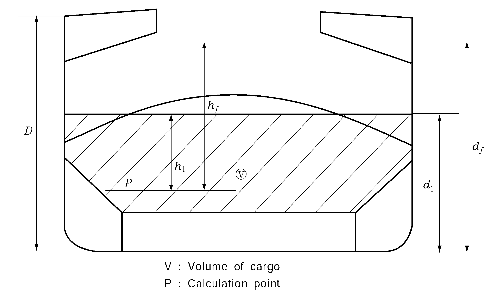
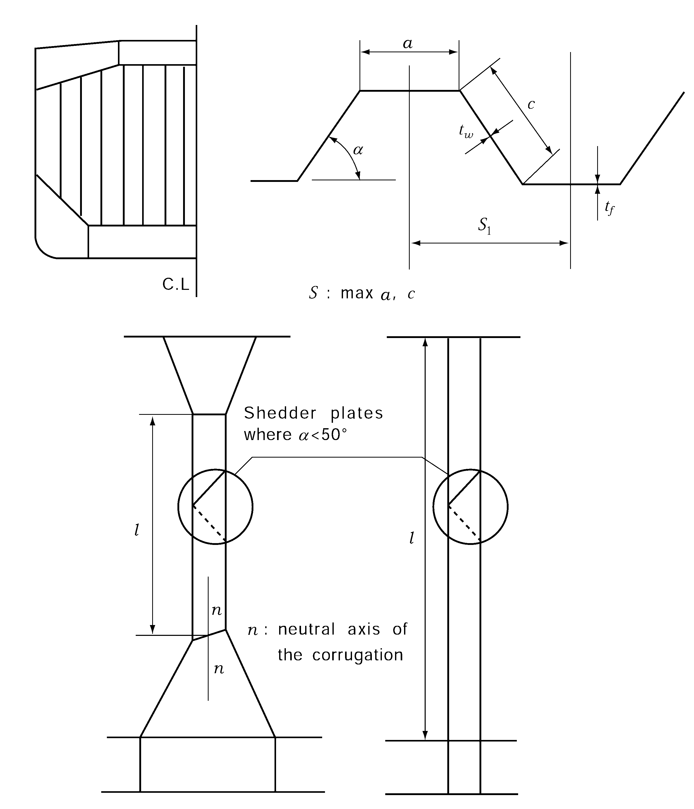
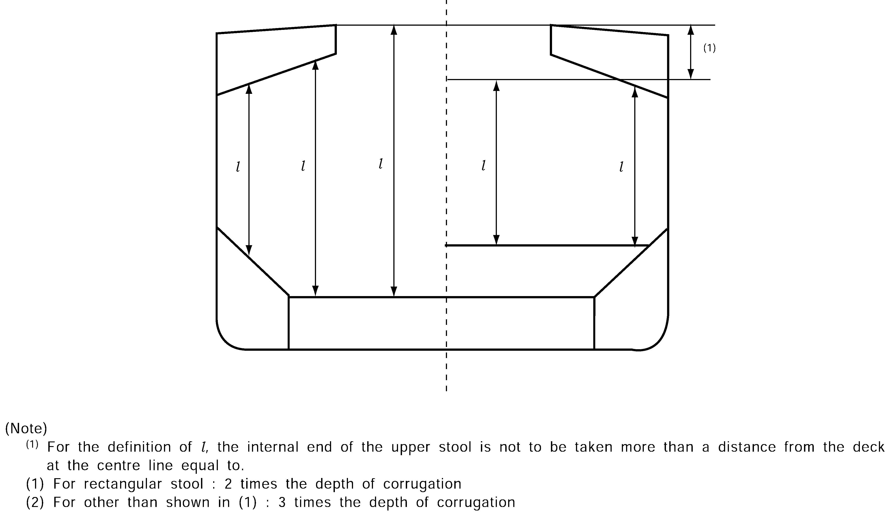
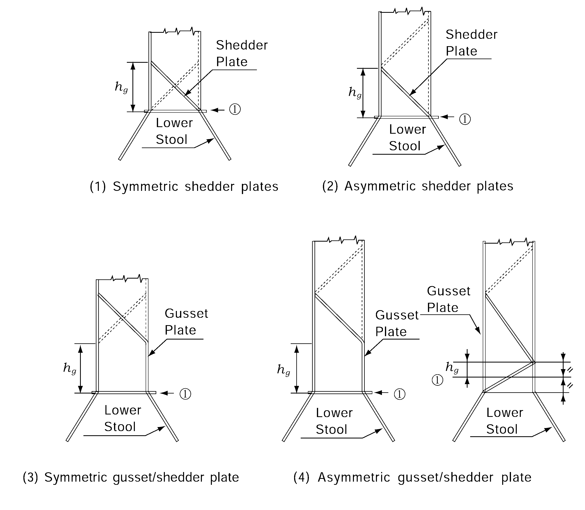
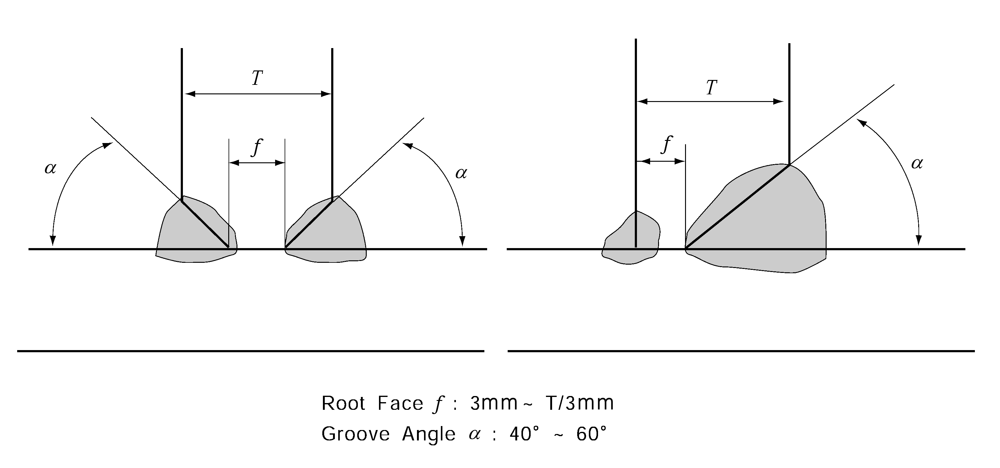
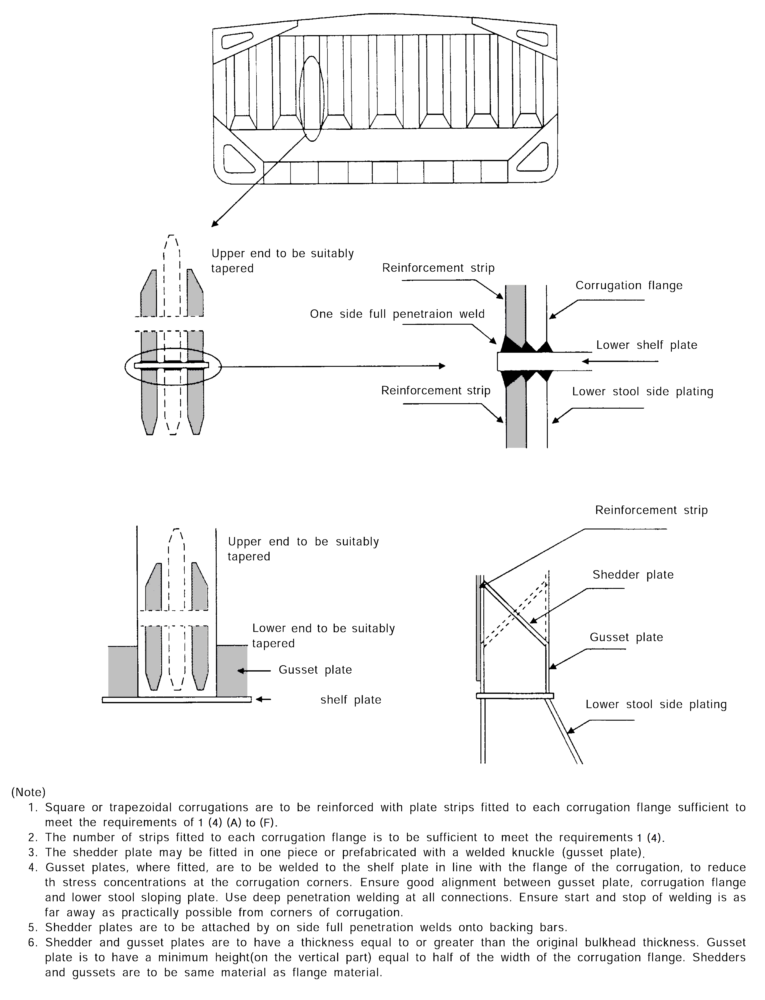
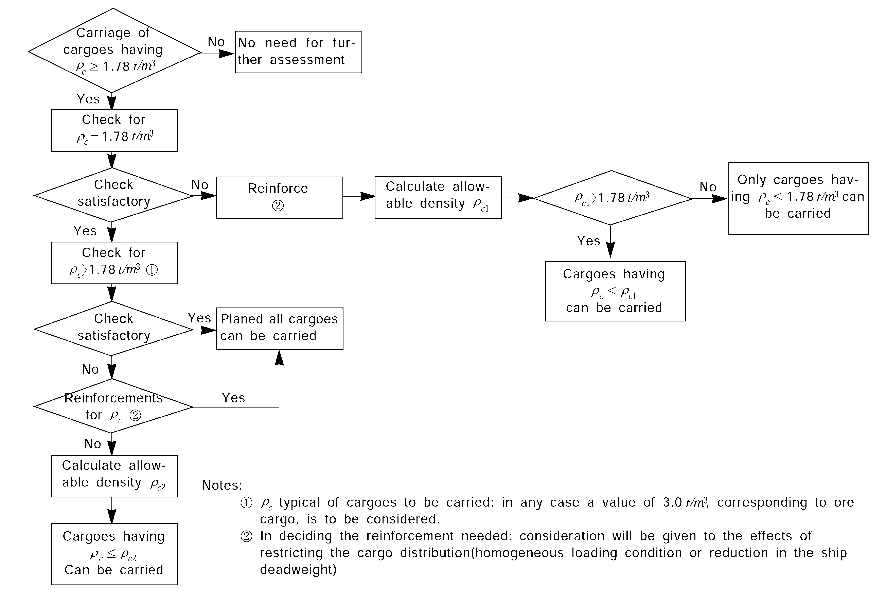
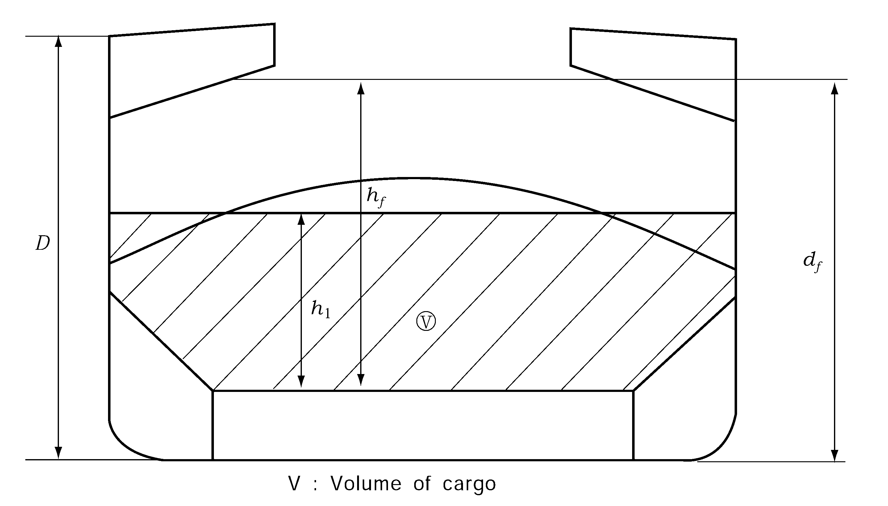
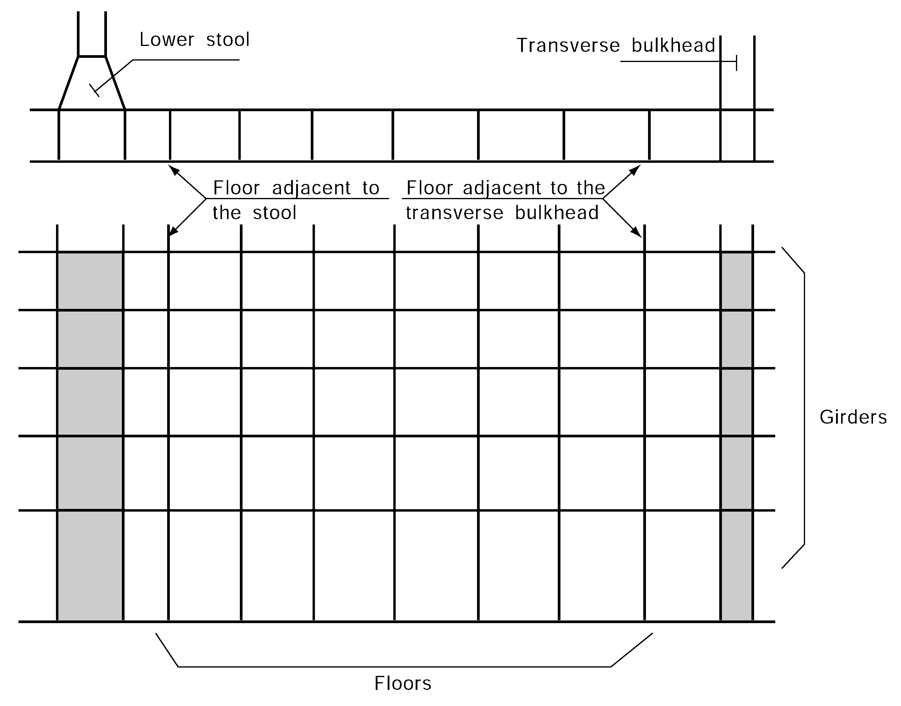
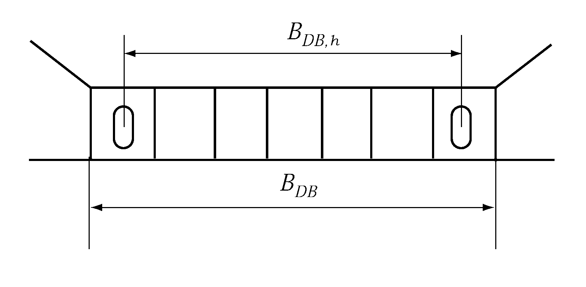

# PART 7 Ships of Special Service (Ch1-4, 7-10)

> RULES FOR CLASSIFICATION OF STEEL SHIPS / RA-07A-E / 2025 / EN / Guidance

## Annex 7-5 Additional Requirements for Existing Bulk Carriers 【See Rule】

### 1. Scantling of the transverse watertight corrugated bulkhead between cargo holds No.1 and 2, with cargo hold No.1 flooded, for existing bulk carriers

#### (1) Application and definitions

- **(A)** These requirements apply to all bulk carriers of 150 $\mathrm{m}$ in length($L_f$) and above, in the foremost hold, intending to carry solid bulk cargoes having a density of 1.78 $\mathrm{t}/m^3$, or above, with single deck, topside tanks and hopper tanks, fitted with vertically corrugated transverse watertight bulkheads between cargo holds No. 1 and 2 where:
  - **(a)** the foremost hold is bounded by the side shell only for ships which were contracted for construction prior to 1 July 1998 and have not been constructed in compliance with **Ch 3, Sec 12** of the Rules.
  - **(b)** the foremost hold is double side skin construction of less than 760 $\mathrm{mm}$ breadth measured perpendicular to the side shell in ships, the keels of which were laid, or which were at a similar stage of construction, before 1 July 1999 and have not been constructed in compliance with **Ch 3, Sec 12** of the Rules.
- **(B)** The net scantlings of the transverse bulkhead between cargo holds Nos. 1 and 2 are to be calculated using the loads given in (2), the bending moment and shear force given in (3) and the strength criteria given in (4).
- **(C)** Steel renewal and/or reinforcements are required as per (6).
- **(D)** In these requirements, homogeneous loading condition means a loading condition in which the ratio between the highest and the lowest filling ratio, evaluated for the two foremost cargo holds, does not exceed 1.2 to be corrected for different cargo densities.

#### (2) Load model

- **(A)** General
  - **(a)** The loads to be considered as acting on the bulkhead are those given by the combination of the cargo loads with those induced by the flooding of cargo hold No.1.
  - **(b)** The most severe combinations of cargo induced loads and flooding loads are to be used for the check of the scantlings of the bulkhead, depending on the loading conditions included in the loading manual:
  - **(i)** homogeneous loading conditions;
    - **(ii)** non homogeneous loading conditions.
  - **(c)** Non homogeneous part loading conditions associated with multiport loading and unloading operations for homogeneous loading conditions need not to be considered according to these requirements.
- **(B)** Bulkhead corrugation flooding head
  The flooding head $h_f$ (See **Fig 1**) is the distance ($\mathrm{m}$) measured vertically with the ship in the upright position, from the calculation point to a level located at a distance $d_f$ ($\mathrm{m}$) from the baseline equal to:
  - **(a)** For ships less than 50,000 *tonnes* deadweight with Type B freeboard : $d_f = 0.95D$
  - **(b)** For ships other than shown in (a) :
    $d_f = D$
  - **(c)** For ships to be operated at an assigned load line draught $T_r$ less than the permissible load line draught $T$, the flooding head defined in (a) and (b) above may be reduced by $T -T_r$.
- **(C)** Pressure in the flooded hold
  - **(a)** Bulk cargo loaded hold
    Two cases are to be considered, depending on the values of $d_1$ and $d_f$, but, $d_1$ (See Fig **1**) being a distance from the baseline given, in $\mathrm{m}$, by:
    $d_1 = M_\frac{c}{\rho_c l_c B} + V_\frac{LS}{l_c B} + (h_HT - h_DB ) b_\frac{HT}{B} + h_DB \mathrm{m}$
    where :
    $M_c$ = mass of cargo, in hold No.1(ton)
    $\rho_c$ = bulk cargo density ($\mathrm{t}/m^3$)
    $l_c$ = length of hold No. 1($\mathrm{m}$)
    $B$ = ship's breadth amidship ($\mathrm{m}$)
    $V_LS$ = volume of the bottom stool above the inner bottom ($\mathrm{m}^3$)
    $h_HT$ = height of the hopper tanks amidship from the baseline ($\mathrm{m}$)
    $h_DB$ = height of the double bottom ($\mathrm{m}$)
    $b_HT$ = breadth of the hopper tanks amidship ($\mathrm{m}$)
    
    **Fig 1 Measurement of** #eqnID-1973**,** #eqnID-1974 **and** #eqnID-1975
  - **(i)** for $d_f \geq d_1$
    ① At each point of the bulkhead located at a distance between $d_1$ and $d_f$ from the baseline, the pressure $P_c,f$ is given by:
    $P_c,f = \rho g h_f \mathrm{kN/m^2 }$
    where :
    $\rho$ = 1.025 $\mathrm{t}/m^3$, sea water density ($\mathrm{t}/m^3$)
    $g$ = 9.81 $\mathrm{m}/s^2$, gravity acceleration
    $h_f$ = flooding head as defined in (B)
    ② At each point of the bulkhead located at a distance lower than $d_1$ from the baseline, the pressure $P_c,f$ is given by:
    $P_c,f = \rho g h_f + [\rho_c - \rho(1-perm)]g h_1 \tan^2 \gamma \mathrm{kN/m^2 }$
    $\rho$, $g$, $h_f$ = as given above ①
    $\rho_c$ = bulk cargo density ($\mathrm{t}/m^3$)
    $perm$ = permeability of cargo, to be taken as 0.3 for ore (corresponding bulk cargo density for iron ore may generally be taken as 3.0 $\mathrm{t}/m^3$),
    $h_1$ = vertical distance ($\mathrm{m}$) from the calculation point to a level located at a distance $d_1$, as defined above, from the base line (See **Fig 1**)
    $\gamma$ = 45° - ($\phi$/2)
    $\phi$ = angle of repose of the cargo, in degrees, and may generally be taken as 35° for iron ore and be taken as 25° for cement
    ③ The force $F_c,f$ acting on a corrugation is given by:
    $F_c,f = S_1 left[\frac{rhog(d_f -d_1 )^2}{2} +\frac{rhog(d_f - d_1 )+(P_c,f )_l _e}{2} (d_1 -h_DB - h_LS ) right] \mathrm{kN}$
    where :
    $S_1$ = spacing of corrugations($\mathrm{m}$) (See **Fig 2**)
    $\rho$ and $g$ = as specified ② above
    $d_f$ = as specified in (B)
    $(P_c,f )_l _e$= pressure at the lower end of the corrugation ($\mathrm{kN}/mm^2$)
    $d_1$ and $h_DB$ = as specified in (a)
    $h_LS$ = height of the lower stool ($\mathrm{m}$) from the inner bottom.($\mathrm{m}$)
    ① At each point of the bulkhead located at a distance between $d_f$ and $d_1$ from the baseline, the pressure $P_c,f$ is given by:
    $P_c,f = \rho_c g h_1 \tan^2 \gamma \mathrm{kN/m^2 }$
    where :
    $\rho_c$, $g$, $h_1$ and $\gamma$ = as specified in (i)
    ② At each point of the bulkhead located at a distance lower than $d_f$ from the baseline, the pressure $P_c,f$ is given by:
    $P_c,f = \rho g h_f + [\rho_c h_1 - \rho(1-perm)h_f ]g \tan^2 \gamma \mathrm{kN/m^2 }$
    where :
    $\rho$, $g$, $h_f$, $\rho_c$, $h_1$, $perm$ and $\gamma$ = as specified in (i) above
    ③ The force $F_c,f$ acting on a corrugation is given by:
    $F _{c,f} =S _{1} \left[ \frac{\rho _{c} g(d _{1} -d _{f} ) ^{2}}{2} \tan ^{2} \gamma + \frac{\rho _{c} g(d _{1} -d _{f} )\tan ^{2} \gamma +(P _{c,f} ) _{l} _{e}}{2} (d _{1} -h _{DB} -h _{LS} ) \right] \mathrm{kN}$
    where :
    $S_1$, $\rho_c$, $g$, $\gamma$, $(P_c,f )_l _e$ and $h_LS$ = as specified in (i) above
    $d_1$ and $h_DB$ = as specified in (a)
    $d_f$ = as specified in (B)
    - **(ii)** for $d_f < d_1$
  - **(b)** Pressure in the flooded empty hold
    At each point of the bulkhead, the hydrostatic pressure $P_f$ induced by the flooding head $h_f$ is to be considered.
    $P_f = rhogh_f \mathrm{kN/m^2 }$
    The force $F_f$ acting on a corrugation is given by the following formulae:
    $F_f = S_1 rhog \frac{(d_f -d_DB - h_LS )^2}{2} \mathrm{kN}$
    where :
    $S_1$, $g$, $\rho$ and $h_LS$ = as specified in (i) above
    $d_1$ and $h_DB$ = as specified in (a)
    $d_f$ = as specified in (B)
- **(D)** Pressure in the non-flooded bulk cargo loaded hold
  - **(a)** At each point of the bulkhead, the pressure $P_c$ is given by:
    $P_c = \rho_c g h_1 \tan^2 \gamma \mathrm{kN/m^2 }$
    where :
    $\rho_c$, $g$, $h_1$ and $\gamma$ = as specified in (C), (a) (i) above
  - **(b)** The force $F_c$ acting on a corrugation is given by the following formula:
    $F_c = S_1 \rho_c g \frac{(d_1 - h_DB - h_LS )^2}{2} \tan^2 \gamma \mathrm{kN}$
    where :
    $\rho_c$, $g$, $S_1$, $h_LS$ and $\gamma$ = as specified in (C), (a) (i) above
    $d_1$ and $h_DB$ = as specified in (C), (a) above
- **(E)** Resultant pressure and load
  - **(a)** Homogeneous loading conditions
  - **(i)** At each point of the bulkhead structures, the resultant pressure $P$, to be considered for the scantlings of the bulkhead is given by:
    $P = P_c,f - 0.8P_c \mathrm{kN/m^2 }$
    $F = F_c,f - 0.8F_c \mathrm{kN}$
    - **(ii)** The resultant force $F$ acting on a corrugation is given by:
  - **(b)** Non homogeneous loading conditions
  - **(i)** At each point of the bulkhead structures, the resultant pressure $P$ to be considered for the scantlings of the bulkhead is given by:
    $P = P_c,f \mathrm{kN/m^2 }$
    $F = F_c,f \mathrm{kN}$
    $P = P_f \mathrm{kN/m^2 }$
    $F = F_f \mathrm{kN}$
    - **(ii)** The resultant force $F$ acting on a corrugation is given by:
    - **(iii)** In case hold No.1, in non homogeneous loading conditions, is not allowed to be loaded, the resultant pressure $P$ to be considered for the scantlings of the bulkhead and the resultant force $F$ acting on a corrugation is given by:

#### (3) Bending moment and shear force in the bulkhead corrugations

The bending moment $M$ and the shear force $Q$ in the bulkhead corrugations are obtained using the formulae given in (A) and (B). The $M$ and $Q$ values are to be used for the checks in (4).

- **(A)** Bending moment
  The design bending moment $M$ for the bulkhead corrugations is given by:
  $M = \frac{F l}{8} \mathrm{kN ­ m}$
  where :
  $F$ = resultant force as specified in (2) (E)
  $l$ = span of the corrugation ($\mathrm{m}$) (See **Fig 2** and **3**)
- **(B)** Shear force
  The shear force $Q$ at the lower end of the bulkhead corrugations is given by:
  $Q = 0.8F \mathrm{kN}$
  where :
  $F$ and $l$ = as specified in (A) above
  
  **Fig 2 Measurement of** #eqnID-2099 **and** #eqnID-2100
  
  **Fig 3 Measurement of corrugated span** #eqnID-2101

#### (4) Strength criteria

- **(A)** General
  The following criteria are applicable to transverse bulkheads with vertical corrugations (See **Fig 2**).
  - **(a)** Requirements for local net plate thickness are given in (B), (E), (F) and (G).
  - **(b)** Where the corrugation angle $\alpha$ shown in **Fig 2** is less than 50°, horizontal row of staggered shedder plates is to be fitted at approximately mid depth of the corrugations to help preserve dimensional stability of the bulkhead under flooding loads. The shedder plates are to be welded to the corrugations by double continuous welding, but they are not to be welded to the side shell.
  - **(c)** The thicknesses of the lower part of corrugations considered in the application of (B) and (C) are to be maintained for a distance from the inner bottom (if no lower stool is fitted) or the top of the lower stool not less than 0.15$l$.
  - **(d)** The thicknesses of the middle part of corrugations considered in the application of (B) and (D) are to be maintained to a distance from the deck (if no upper stool is fitted) or the bottom of the upper stool not greater than 0.3$l$.
- **(B)** Bending capacity and shear stress
  - **(a)** The bending capacity is to comply with the following relationship:
    $\frac{M}{0.5Z_l _e \sigma_a,l _e + Z_m \sigma_a,m} \times 10^3 \leq 1.0$
    where :
    $M$ = bending moment($\mathrm{kN}­m$), as specified in (3) (A) above.
    $Z_l _e$ = section modulus of one half pitch corrugation at the lower end of corrugations, as specified in (C) ($\mathrm{cm}^3$)
    $Z_m$ = section modulus of one half pitch corrugation at the mid-span of corrugations as specified in (D) ($\mathrm{cm}^3$)
    $\sigma_a,l _e$ = allowable stress at the lower end of corrugations as specified in (E)
    $\sigma_a,m$ = allowable stress at the mid-span of corrugations as specified in (E).
  - **(i)** In no case $Z_m$ is to be taken greater than the lesser of 1.15$Z_l _e$ and 1.15$Z '_l _e$ for calculation of the bending capacity, $Z '_l _e$ being defined below.
    ① In case effective shedder plates are fitted:
    ⓐ Shedder plates are not knuckled;
    ⓑ Shedder plates are welded to the corrugations and the top of the lower stool by one side penetration welds or equivalent;
    ⓒ Shedder plates are fitted with a minimum slope of 45° and their lower edge is in line with the stool side plating;
    ② In case effective gusset plates are fitted:
    ⓐ Gusset plates are fitted in line with the stool side plating;
    ⓑ Gusset plates have material properties at least equal to those provided for the flanges,
    $Z '_l _e = Z_g + \frac{Qh_g -0.5 h_g^2 S_1 P_g}{\sigma_a} \times 10^3 \mathrm{cm^2 }$
    where:
    $Z_g$ = section modulus of one half pitch corrugation, according to (D), in way of the upper end of shedder or gusset plates, as applicable
    $Q$ = shear force as given in (3) (B)
    $h_g$ = height of shedder or gusset plates ($\mathrm{m}$), as applicable (See **Fig 4** (1), (2), (3) and (4))
    $S_1$ = as specified in (2) (C) (a)
    $P_g$ = resultant pressure ($\mathrm{kN}/m^2$) as defined in (2) (E), calculated in way of the middle of the shedder or gusset plates, as applicable
    $\sigma_a$ = allowable stress ($\mathrm{N}/mm^2$) as specified in (E).
    - **(ii)** the section modulus $Z_l _e$, is to be taken not larger than the value $Z '_l _e$ given by :
  - **(b)** Stresses $\tau$ are obtained by dividing the shear force $Q$ by the shear area. The shear area is to be reduced in order to account for possible non-perpendicularity between the corrugation webs and flanges. In general, the reduced shear area may be obtained by multiplying the web sectional area by $\sin \alpha$, where $\alpha$ being the angle between the web and the flange. (See **Fig 2**)
  - **(c)** When calculating the section moduli and the shear area, the net plate thicknesses are to be used.
  - **(d)** The section moduli of corrugations are to be calculated on the basis of the requirements given in (C) and (D).
- **(C)** Section modulus at the lower end of corrugations
  The section modulus is to be calculated with the compression flange having an effective flange width $b_ef$, not larger than as given (F) (a).
  If the corrugation webs are not supported by local brackets below the stool top (or below the inner bottom) in the lower part, the section modulus of the corrugations is to be calculated considering the corrugation webs 30 $\%$ effective.
  - **(a)** Provided that effective shedder plates, as defined in (B) are fitted (See **Fig 4** (1) and (2)), when calculating the section modulus of corrugations at the lower end (cross-section in **Fig 4** (1) and (2) ①), the area of flange plates ($\mathrm{cm}^2$), may be increased by not to be taken greater than
    $2.5a \sqrt{t_f t_sh} \sqrt{ \sigma_\frac{Fsh}{\sigma_F}fl}$
    but, it is to be less than 2.5$at_f$.
    $a$ = width (m) of the corrugation flange (See **Fig 2**)
    $t_sh$ = net shedder plate thickness ($\mathrm{mm}$)
    $t_f$ = net flange thickness ($\mathrm{mm}$)
    $\sigma_Fsh$= minimum upper yield stress ($\mathrm{N}/mm^2$) of the material used for the shedder plates
    $\sigma_Ffl$ = minimum upper yield stress ($\mathrm{N}/mm^2$) of the material used for the corrugation flanges.
  - **(b)** Provided that effective gusset plates, as defined in (B), are fitted (See **Fig 4** (3) and (4)), when calculating the section modulus of corrugations at the lower end (cross-section in **Fig 4** (3) and (4) ①), the area of flange plates($\mathrm{cm}^2$), may be increased by 7$h_g t_gu$.
    $h_g$ = height of gusset plate (m) (See **Fig 4** (3) and (4)), not to be taken greater than $\frac{10}{7} S_gu$
    $S_gu$ = width of the gusset plates($\mathrm{m}$)
    $t_gu$ = net gusset plate thickness($\mathrm{mm}$), not to be taken greater than $t_f$
    $t_f$ = net flange thickness based on the as built condition.($\mathrm{m}$)
    
    **Fig 4 Shedder plates and Gusset plates**
  - **(c)** If the corrugation webs are welded to a sloping stool top plate, which is at an angle not less than 45° with the horizontal plane, the section modulus of the corrugations may be calculated considering the corrugation webs fully effective. In case effective gusset plates are fitted, when calculating the section modulus of corrugations the area of flange plates may be increased as specified in (b) above. No credit can be given to shedder plates only. For angles less than 45° the effectiveness of the web may be obtained by linear interpolation between 30 $\%$ for 0° and 100 $\%$ for 45°
- **(D)** Section modulus of corrugations at cross-sections other than the lower end. The section modulus is to be calculated with the corrugation webs considered effective and the compression flange having an effective flange width, $b_ef$, not larger than as given in (F) (a).
- **(E)** Allowable stress check
  The normal and shear stresses $\sigma$ and $\tau$ are not to exceed the allowable values $\sigma_a$ and $\tau_a$_, given by:
  $\sigma_a = \sigma_y \mathrm{N/mm^2 }$
  $\tau_a = 0.50 \sigma_y \mathrm{N/mm^2 }$
  where :
  $\sigma_y$ = minimum upper yield stress of the material.($\mathrm{N}/mm^2$)
- **(F)** Effective compression flange width and shear buckling check
  - **(a)** Effective width of the compression flange of corrugations
    The effective width $b_ef$ of the corrugation flange is given by:
    $b_ef = C_e a \mathrm{m}$
    where :
    for $\beta > 1.25$ : $C_e = \frac{2.25}{\beta} - \frac{1.25}{\beta^2}$
    for $\beta \leq 1.25$ : $C_e = 1.0$
    $\beta = \frac{a}{t_f} \sqrt{\sigma_\frac{y}{E}} \times 10^3$
    $t_f$ = net flange thickness ($\mathrm{mm}$)
    $a$ = width of the corrugation flange ($\mathrm{m}$) (See **Fig 2**)
    $\sigma_y$ = minimum upper yield stress of the material ($\mathrm{N}/mm^2$)
    $E$ = modulus of elasticity ($\mathrm{N}/mm^2$), to be assumed equal to 2.06 × 10^5 #eqnID-2185_s2for steel
  - **(b)** Shear
    The buckling check is to be performed for the web plates at the corrugation ends. The shear stress $\tau$ is not to exceed the critical value $\tau_c$ obtained by the following:
    $\tau_c = \tau_E$ when : $\tau_E \leq 0.5\tau_y$
    $\tau_c =\tau_y left(1- \tau_\frac{y}{4\tau_E} right)$ when : $\tau_E > 0.5\tau_y$
    where :
    $\tau_y$ = shear stress of the material ($\mathrm{N}/mm^2$)
    $\sigma_y / \sqrt3$
    $\tau_E$ = elastic buckling stress ($\mathrm{N}/mm^2$)
    $\tau_E = 0.9k_t E left(\frac{t}{1000c} right)^2 \mathrm{N/mm^2 }$
    where :
    $k_t$ = 6.34
    $t$ = net thickness ($\mathrm{mm}$) of corrugation web ($\mathrm{mm}$)
    $c$ = breadth of corrugation web (See **Fig 2**)
    $\sigma_y$, $E$ = as specified in (a) above.
- **(G)** Local net plate thickness
  - **(a)** The bulkhead local net plate thickness, $t_"net"$ ($\mathrm{mm}$) is given by:
    $t_"net" = 14.9 S_w \sqrt{\frac{P}{\sigma_y}} \mathrm{mm}$
    where :
    $S_w$ = plate width ($\mathrm{m}$) to be taken equal to the width of the corrugation flange or web, whichever is the greater (See **Fig 2**)
    $P$ = resultant pressure ($\mathrm{kN}/m^2$), as defined in (2) (E), at the bottom of each strake of plating; in all cases, the net thickness of the lowest strake is to be determined using the resultant pressure at the top of the lower stool, or at the inner bottom, if no lower stool is fitted or at the top of shedders, if shedder or gusset/shedder plates are fitted.
    $\sigma_y$ = minimum upper yield stress of the material($\mathrm{N}/mm^2$)
  - **(b)** When the thicknesses of the flange and web are different :
  - **(i)** The net thickness of the narrower plating is not to be taken less than the following values:
    $t_n = 14.9 S_n \sqrt{\frac{P}{\sigma_y}} \mathrm{mm}$
    where :
    $S_n$ = the width of the narrower plating.($\mathrm{m}$)
    $P$ and $\sigma_y$ = as specified in (a) above.
    $t_w1 = 14.9S_w \sqrt{\frac{P}{\sigma_y}} \mathrm{mm}$, $t_w2 = \sqrt{\frac{440S_w^2 P}{\sigma_y} - t_np^2 } \mathrm{mm}$
    where :
    $t_np$ = the lesser value of the between actual net thickness of the narrower plating and $t_w1$_.
    - **(ii)** The net thickness of the wider plating is not to be taken less than the maximum of the following values:

#### (5) Local details

- **(A)** As applicable, the design of local details is to comply with the Society's requirements for the purpose of transferring the corrugated bulkhead forces and moments to the boundary structures, in particular to the double bottom and cross-deck structures.
- **(B)** In particular, the thickness and stiffening of gusset and shedder plates, installed for Strengthening purposes, is to comply with the Society's requirements, on the basis of the load model in (2). Unless otherwise stated, weld connections and materials are to be dimensioned and selected in accordance with the Society's requirements.

#### (6) Corrosion addition and steel renewal

- **(A)** Steel renewal is required where the gauged thickness is less than $t$_net$+0.5 \mathrm{mm}$, $t$_net being the thickness used for the calculation of bending capacity and shear stresses as given in (4)(B) or the local net plate thickness as given in (4) (G). Alternatively, reinforcing doubling strips may be used providing the net thickness is not dictated by shear strength requirements for web plates (See (4) (E) and (4) (F) (b)) or by local pressure requirements for web and flange plates (See (4) (G)).
- **(B)** Where the gauged thickness is within the range $t$_net$+0.5 \mathrm{mm}$, $t$_net$+1.0 \mathrm{mm}$, coating (applied in accordance with the coating manufacturer's requirements) or annual gauging may be adopted as an alternative to steel renewal.
- **(C)** Where steel renewal or reinforcement is required, a minimum thickness of $t$_net$+2.5 \mathrm{mm}$ is to be replenished for the renewed or reinforced parts.
- **(D)** For $0.8(\sigma_Ffl t_fl ) \geq \sigma_Fs t_st$
  $\sigma_Ffl$= minimum upper yield stress($\mathrm{N}/mm^2$) of the material used for the corrugation flanges
  $\sigma_Fs$ = minimum upper yield stress($\mathrm{N}/mm^2$) of the material used for the lower stool side plating or floors (if no stool is fitted)
  $t_fl$ = flange thickness, in $\mathrm{mm}$, which is found to be acceptable on the basis of the criteria specified in (A) above or, when steel renewal is required, the replenished thickness according to the criteria specified in (C) above. The above flange thickness dictated by local pressure requirements (See (4) (G)) need not be considered for this purpose
  $t_st$ = as built thickness of the lower stool side plating or floors (if no stool is fitted) ($\mathrm{mm}$)
  - **(a)** Gussets with shedder plates, extending from the lower end of corrugations up to 0.1*l* or reinforcing doubling strips (on bulkhead corrugations and stool side plating) are to be fitted.
  - **(b)** If gusset plates are fitted, the material of such gusset plates is to be the same as that of the corrugation flanges. The gusset plates are to be connected to the lower stool shelf plate or inner bottom (if no lower stool is fitted) by deep penetration welds. (See **Fig 5**).
- **(E)** Where steel renewal is required, the bulkhead connections to the lower stool shelf plate or inner bottom (if no stool is fitted) are to be at least made by deep penetration welds.
- **(F)** Where gusset plates are to be fitted or renewed, their connections with the corrugations and the lower stool shelf plate or inner bottom (if no stool is fitted) are to be at least made by deep-penetration welds (See **Fig 5**).
  
  **Fig 5 Deep penetration weld**
- **(G)** Guidance on renewal/reinforcement of vertically corrugated transverse watertight bulkhead between cargo holds Nos. 1 and 2
  - **(a)** The need for renewal or reinforcement of the vertically corrugated transverse watertight bulkhead between cargo holds Nos. 1 and 2 will be determined by the classification society on a case by case basis using the criteria given in association with the most recent gaugings and findings from survey.
  - **(b)** It will take into account the following:
  - **(i)** Scantlings of individual vertical corrugations will be assessed for reinforcement / renewal based on thickness measurements obtained in accordance with **Pt 1, Annex 1-5, Table 9** at their lower end, at mid-depth and in way of plate thickness changes in the lower 70 $\%$. These considerations will take into account the provision of gussets and shedder plates and the benefits they offer, provided that they comply with (4) (B) and (A) to (F).
    - **(ii)** Permissible levels of diminution will be determined and appropriate measures taken in accordance with (A) and (B).
  - **(c)** Where renewal is required, the extent of renewal is to be shown clearly in plans. The vertical distance of each renewal zone is to be not less than 15 $\%$ of the vertical distance between the upper and lower end of the corrugation measured at the ship's centreline.
  - **(d)** Where the reinforcement is accepted by adding strips, the length of the reinforcing strips is to be sufficient to allow it to extend over the whole depth of the diminished plating. In general, the width and thickness of strips should be sufficient to comply with the (A) to (F) requirements. The material of the strips is to be the same as that of the corrugation plating. The strips are to be attached to the existing bulkhead plating by continuous fillet welds. The strips are to be suitably tapered or connected at ends in accordance with Class Society practice. (See **Fig 6**)
  - **(e)** Where reinforcing strips are connected to the inner bottom or lower stool shelf plates, one side full penetration welding is to be used. When reinforcing strips are fitted to the corrugation flange and are connected to the lower stool shelf plate, they are normally to be aligned with strips of the same scantlings welded to the stool side plating and having a minimum length equal to the breadth of the corrugation flange.
  - **(f)** A general arrangement of structural reinforcement is given by **Fig 6.**

#### (7) The flow chart to asses capability of carriage of high density cargoes on existing bulk carriers according to the strength of transverse bulkhead between cargo holds Nos. 1 and 2 may refer to the Fig 7. However, where the resultant pressure specified in above (2) (E) has the highest value for cargo density(_s2) being 1.78 _s2, this flow chart may not be applied.

**Fig 6 Example of general arrangement of structural reinforcement**

**Fig 7 Flow chart to assess capability of carriage of high density cargoes on existing bulk carriers****according to the strength of transverse bulkhead**

### 2. Evaluation of Allowable Hold Loading of Cargo Hold No. 1 with Cargo Hold No. 1 Flooded, for Existing Bulk Carrier

#### (1) Application and definitions

- **(A)** These requirements apply to all bulk carriers of 150 $\mathrm{m}$ in length and above, in the for most hold, intending to carry solid bulk cargoes having a density of 1.78 $\mathrm{t}/m^3$, or above, with single deck, topside tanks and hopper tanks, where:
  - **(a)** the foremost hold is bounded by the side shell only for ships which were contracted for construction prior to 1 July 1998 and have not been constructed in compliance with **Ch 3, Sec 11** of the Rules.
  - **(b)** the foremost hold is double side skin construction of less than 760 $\mathrm{mm}$ breadth measured perpendicular to the side shell in ships, the keels of which were laid, or which were at a similar stage of construction, before 1 July 1999 and have not been constructed in compliance with **Ch 3, Sec 11** of the Rules.
- **(B)** Early completion of a special survey coming due after 1 July 1998 to postpone compliance is not allowed.
- **(C)** The loading in cargo hold No. 1 is not to exceed the allowable hold loading in flooded condition, calculated as per (4), using the shear capacity of the double bottom given in (3).
- **(D)** In no case, the allowable hold loading in flooding condition is to be taken greater than the design hold loading in intact condition.

#### (2) Loading model

- **(A)** General
  - **(a)** The loads to be considered as acting on the double bottom are considered by following
  - **(i)** the load by the external sea pressures
    - **(ii)** the combination of the cargo loads with those induced by the flooding of the hold.
  - **(b)** The most severe combinations of cargo induced loads and flooding loads are to be used, depending on the loading conditions included in the loading manual:
  - **(i)** homogeneous loading conditions;
    - **(ii)** non homogeneous loading conditions;
    - **(iii)** packed cargo conditions (such as steel mill products).
  - **(c)** For each loading condition, the maximum bulk cargo density to be carried is to be considered in calculating the allowable hold loading limit.
- **(B)** Inner bottom flooding head
  The flooding head $h_f$ (See **Fig 8**) is the distance, in $m$, measured vertically with the ship in the upright position, from the inner bottom to a level located at a distance $d_f$, in $\mathrm{m}$, from the baseline equal to:
  - **(a)** for ships less than 50,000 tonnes deadweight with Type B freeboard : 0.95$D$
  - **(b)** for ships except for (a) above : $D$
    
    **Fig 8 Measurement of** #eqnID-2254**,** #eqnID-2255 **and** #eqnID-2256

#### (3) Shear capacity of the double bottom of hold No. 1

- **(A)** The shear capacity $C$ of the double bottom of hold No. 1 is defined as the sum of the shear strength at each end of:
  - **(a)** all floors adjacent to both hoppers, less one half of the strength of the two floors adjacent to each stool, or transverse bulkhead if no stool is fitted (See **Fig 9**).
  - **(b)** all double bottom girders adjacent to both stools, or transverse bulkheads if no stool is fitted.
- **(B)** The strength of girders or floors which run out and are not directly attached to the boundary stool or hopper girder is to be evaluated for the one end only.
- **(C)** Note that the floors and girders to be considered are those inside the hold boundaries formed by the hoppers and stools (or transverse bulkheads if no stool is fitted). The hopper side girders and the floors directly below the connection of the bulkhead stools (or transverse bulkheads if no stool is fitted) to the inner bottom are not to be included.
- **(D)** When the geometry and/or the structural arrangement of the double bottom are such to make the above (A) to (C) inadequate, to the Society's discretion, the shear capacity C of double bottom is to be calculated according to the Society's criteria.
  
  **Fig 9 Considering floor and girder**
- **(E)** In calculating the shear strength, the net thickness of floors and girders is to be used. The net thickness $t_"net"$, in $\mathrm{mm}$, is given by:
  $t_"net" = t - t_c \mathrm{mm}$
  where :
  $t$ = as built thickness of floors and girders.($\mathrm{mm}$)
  $t_c$ = corrosion diminution, equal to 2 $\mathrm{mm}$, in general ; a lower value of $t_c$ may be adopted, provided that measures are taken, to the Society's satisfaction, to justify the assumption made.
- **(F)** Floor shear strength
  The floor shear strength in way of the floor panel adjacent to hoppers $S_f1$ and the floor shear strength in way of the openings in the outmost bay (i.e. that bay which is closer to hopper) $S_f2$ are given by the following expressions:
  $S_f1 = A_f \tau_\frac{a}{\eta_1} \times 10^-3 \mathrm{kN}$, $S_f2 = A_f,h \tau_\frac{a}{\eta_2} \times 10^-3 \mathrm{kN}$
  where:
  $A_f$ = sectional area of the floor panel adjacent to hoppers ($\mathrm{mm}^2$)
  $A_f,h$= net sectional area of the floor panels in way of the openings in the outmost bay(i.e. that bay which is closer to hopper)($\mathrm{mm}^2$)
  $\tau_a$ = allowable shear stress ($\mathrm{N}/mm^2$), to be taken equal to $\sigma_y / \sqrt3$
  $\sigma_y$ = minimum upper yield stress of the material ($\mathrm{N}/mm^2$)
  $\eta_1$ = 1.1
  $\eta_2$ = 1.2, $\eta_2$ may be reduced, as the Society's discretion, down to 1.10 where appropriate reinforcements are fitted to the Society's satisfaction
- **(G)** Girder shear strength
  The girder shear strength in way of the girder panel adjacent to stools (or transverse bulkheads, if no stool is fitted) $S_g1$ and the girder shear strength in way of the largest opening in the outmost bay (i.e. that bay which is closer to stool, or transverse bulkhead, if no stool is fitted) $S_g2$ are given by the following expressions:
  $S_g1 = A_g \tau_\frac{a}{\eta_1} \times 10^-3 \mathrm{kN}$, $S_g2 = A_g,h \tau_\frac{a}{\eta_2} \times 10^-3 \mathrm{kN}$
  where :
  $A_g$ = minimum sectional area of the girder panel adjacent to stools(or transverse bulkheads, if no stool is fitted) ($\mathrm{mm}^2$)
  $A_g,h$= net sectional area of the girder panels in way of the largest opening in the outmost bay (i.e. that bay which is closest to stool, or transverse bulkhead, if no stool is fitted)($\mathrm{mm}^2$)
  $\tau_a$ = allowable shear stress ($\mathrm{N}/mm^2$), as given in (F) above.
  $\eta_1$ = 1.10
  $\eta_2$ = 1.15, $\eta_2$ may be reduced, at the Society's discretion, down to 1.10 where appropriate reinforcements are fitted to the Society's satisfaction

#### (4) Allowable hold loading

The allowable hold loading $W$ is given by:
$W = \rho_c V 1overF$ (ton)
where :
$F$ = 1.05, however, 1.0 for steel mill products
$\rho_c$ = cargo density for bulk cargoes, for steel products, $\rho_c$ is to be taken as the density of steel ($\mathrm{t}/m^3$)
$V$ = volume occupied by cargo at a level $h_1$ ($\mathrm{m}^3$)
$h_1 = \frac{X}{\rho_c g}$
$X$ is as follows.

- **(A)** for bulk cargoes the lesser of $X_1$ and $X_2$ given by:
  $X_1 = {Z + rhog (E - h_f )} over {1+ \frac{\rho}{\rho_c} (perm -1 )$, $X_2 = Z + rhog (E - h_f perm)$
  $\rho$ = sea water density ($\mathrm{t}/m^3$)
  $g$ = 9.81 $\mathrm{m}/s^2$, gravity acceleration
  $E$ = ship immersion for flooded hold condition, $d_f - 0.1D$
  $d_f$ = as specified in (2) (B)
  $h_f$ = flooding head as defined in (2) (B)
  $perm$ = cargo permeability, to be taken as 0.3 for ore
  $Z$ = the lesser of $Z_1$ and $Z_2$ given by
  $Z_1 = C_\frac{h}{A_D}B,h$, $Z_2 = C_\frac{e}{A_D}B,e$
  $C_h$ = shear capacity of the double bottom as defined in (3), considering, for each floor, the lesser of the shear strengths $S_f1$ and $S_f2$ (See (3) (F)) and, for each girder, the lesser of the shear strengths $S_f1$ and $S_f2$ (See (3) (G))
  $C_e$ = shear capacity of the double bottom as defined in (3), considering, for each floor, the shear strength $S_f1$ (See (3) (F)) and, for each girder, the lesser of the shear strengths $S_f1$ and $S_f2$ (See (3) (G))
  $A_DB,h = \sum _{ i=1} ^{ i = n} S_i B_DB,i$
  $A_DB,e = \sum _{ i=1} ^{i=n } S_i (B_DB -S)$
  $n$ = number of floors between stools (or transverse bulkheads, if no stool is fitted)
  $S_i$ = space of ith-floor($\mathrm{m}$)
  $B_DB,i$ = $B_DB -S$ for floors whose shear strength is given by $S_f1$ (See (3) (F)) $B_DB,h$ for floors whose shear strength is given by $S_f2$ (See (3) (F))
  $B_DB$ = breadth of double bottom between hoppers ($\mathrm{m}$) (See **Fig 10**)
  $B_DB,h$ = distance between the two considered opening ($\mathrm{m}$) (See **Fig 10**)
  $S$ = spacing of double bottom longitudinals adjacent to hoppers ($\mathrm{m}$)
- **(B)** for steel products, $X$ may be taken as $X_1$, using $perm$ = 0
  
  **Fig 10 Measurement of** #eqnID-2352 **and** #eqnID-2353

### 3. Damage Stability

#### (1) Bulk carriers which are subject to compliance with Pars 1 and 2 shall, when loaded to the summer loadline, be able to withstand flooding of the foremost cargo hold in all loading conditions and remain afloat in a satisfactory condition of equilibrium, as specified in SOLAS regulation XII 4.3 to 4.7.

#### (2) A ship having been built with an insufficient number of transverse watertight bulkheads to satisfy this requirement may be exempted form the application of Pars 1 and 2 and this requirement provided the ship fulfills the requirement in SOLAS XII Reg. 9. #imgID-127_s2
