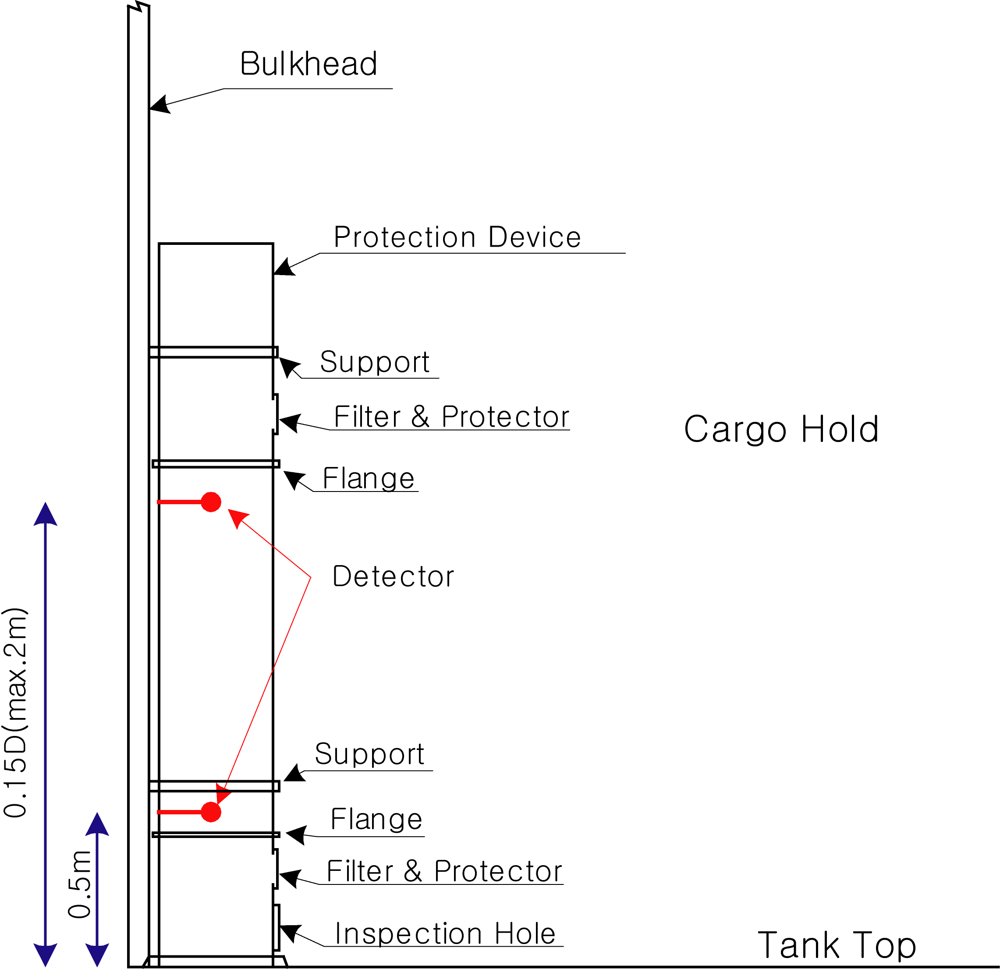

# PART 7 Ships of Special Service (Ch1-4, 7-10)

> RULES FOR CLASSIFICATION OF STEEL SHIPS / RA-07A-E / 2025 / EN / Guidance

## Annex 7-6 Water Level Detection & Alarms and Drainage & Pumping Systems for Bulk Carriers and Single Hold Cargo Ships 【See Rule】

### I. Water level detection & alarms

#### 1. General

- **(1)** The plans containing details on installation, welding and electrical equipment of the water ingress alarm system specified in this Annex to be submitted to the Society for approval.
  After installation on board, this system is to be tested and inspected by the attending Surveyor.
- **(2)** Any water level detection & alarm is to be approved by the Society in accordance with the requirements of the relevant regulations.
- **(3)** In order to avoid the inappropriate application of provisions of chapters II-1, III, IX, XI-1 and XII to certain dedicated ship types, the following cargoes are excluded from the scope of cargoes deemed, for the purpose of determining ship type, to be dry cargoes carried in bulk;
  - **(A)** woodchips; and
  - **(B)** cement, fly ash and sugar,
    provided that loading and unloading is not carried out by grabs heavier than 10 tonnes, power shovels and other means which frequently damage cargo hold structures. *(2019)*

#### 2. Definitions

- **(1)** Water level detector means a system comprising sensors and indication devices that detect and warn of water ingress in cargo holds and other spaces as required in Ch 3, 1403. 1 and 3 of the Rule.
- **(2)** Sensor means a unit fitted at the location being monitored that activates a signal to identify the presence of water at the location in Ch 3, 1403. 1 and 3 of the Rule
- **(3)** Pre-alarm level means the lower level(0.5 $\mathrm{m}$, single hold cargo ships : not less than 0.3 $\mathrm{m}$) at which the sensor(s) in the cargo hold space will operate.
- **(4)** Main alarm level means the higher level(0.15$D$ and above, however not exceed the maximum 2 $\mathrm{m}$, single hold cargo ships : not more than 0.15$D$) at which the sensor(s) in the cargo hold space will operate or the sole level in spaces other than cargo holds
- **(5)** Overriding device means a device to make keeping the current function of an equipment, though a set alarm signal in it would be taken place.
- **(6)** Visual indication means indication by activation of a light or other device that is visible to the human eye in all levels of light or dark at the location where it is situated.
- **(7)** Audible indication means an audible signal that is detectable at the location where it is signalled.
- **(8)** Depth of ship means the distance from bottom of cargo hold to hatch coaming. (See Fig 1)
  
  **Fig 1 Depth of ship(**#eqnID-2359 **)**

#### 3. Installation requirements

- **(1)** Bulk Carriers
  - **(A)** For cargo holds
    - **(a)** In each cargo hold, giving audible and visual alarms, one when the water level above the inner bottom in any hold reaches a height of 0.5 $\mathrm{m}$ and another at a height not less than 15$\%$ of the depth of the cargo hold but not more than 2 $\mathrm{m}$. On bulk carriers to which **SOLAS Reg.XII/9.2** applies, detectors with only the latter alarm need be installed.
    - **(b)** The water level detectors are to be fitted in the aft end of the cargo hold. For cargo holds which are used for water ballast, an alarm overriding device may be installed. The visual alarms are to clearly discriminate between the two different water levels detected in each hold. The illustrations for application and location of installation are showing in **Fig 2** to **Fig 5.**
    - **(c)** The sensors may be installed inside of stools, where the ship has stools in cargo hold. In this case, the character of each sensor is to be considered in conjunction with installation.
    - **(d)** In case where the direct contact type detectors will be used, the inspection holes or the equivalent means are to be provided to remove the cargo/water mixture. The mesh size of filter element on inspection holes is to be decided by considering of the diameter of cargo particles and provided a spare filter element for each detector. Any filter element fitted to detectors is to be capable of being cleaned before new loading.
  - **(B)** In any ballast tank forward of the collision bulkhead required, giving an audible and visual alarm when the liquid in the tank reaches a level not exceeding 10$\%$ of the tank capacity. An alarm overriding device may be installed to be activated when the tank is in use.
  - **(C)** In any dry or void space other than a chain cable locker, any part of which extends forward of the foremost cargo hold, giving an audible and visual alarm at a water level of 0.1 $\mathrm{m}$ above the deck. Such alarms need not be provided in enclosed spaces the volume of which does not exceed 0.1$\%$ of the ship's maximum displacement volume.
    
    **Fig 2 Installation position of water level detector**
    
    **Fig 4 (Detail A)**
- **(2)** Single Hold Cargo Ships
  - **(A)** Those are to be fitted in such space with water level detectors which give an audible and visual alarm at the navigation bridge when the water level above the inner bottom in the cargo hold reaches a height of not less than 0.3 $\mathrm{m}$, and another when such level reaches not more than 15 % of the mean depth of the cargo hold.
  - **(B)** Those are to be fitted at the aft end of the hold(above its lowest part where the inner bottom is not parallel to the designed waterline). Where webs or partial watertight bulkheads are fitted above the inner bottom, additional detectors are to be fitted.

#### 4. Detector system requirements

- **(1)** General
  - **(A)** This detecting system is to provide a reliable indication of water reaching a preset level. The audible and visual alarms are to be suitable for location on the navigation bridge. Here, one sensor capable of detecting both preset levels (pre-alarm level and main alarm level) is allowed.
  - **(B)** Protection of the enclosures of electrical components installed in cargo holds, ballast tanks and dry spaces are to be satisfied the requirements of **IP68** in accordance with **(KS C) IEC 60529.**
  - **(C)** Protection of the enclosures of electrical components installed above ballast and cargo spaces are to be satisfied the requirements of **IP56** in accordance with **(KS C) IEC 60529.**
  - **(D)** The water level detector system is to be capable of being supplied with electrical power from two independent electrical supplies as follows. Failure of the primary electrical power supply of them is to activate an alarm, both visual and audible.
    - **(a)** The electrical power supply is to be from two separate sources, one is to be the main source of electrical power and the other is to be the emergency source, unless a continuously charged dedicated accumulator battery is fitted, having arrangement, location and endurance equivalent to that of the emergency source (18h). The battery supply may be an internal battery in the water level detector system.
    - **(b)** The changeover arrangement of supply from one electrical source to another need not be integrated into the water level detector system.
    - **(c)** Where batteries are used for the secondary power supply, failure alarms for both power supplies are to be provided.
  - **(E)** Equipment which is to be used in refrigerated cargo spaces should satisfy the requirements of a suitable industry standard covering the relevant service temperatures. *(2024)*
- **(2)** For cargo holds
  An alarm, both visual and audible, is to be activated each when the level of water reaches the pre-alarm level or main alarm level in the cargo hold being monitored. The visual alarm is to identify the cargo hold and the audible main alarm is not to be the same as that for the pre-alarm level.
- **(3)** For compartments other than cargo holds
  An alarm, both visual and audible, is to be activated when the level of water in the space being monitored is detected on sensor. The characteristics of the visual and audible alarm is to be the same as those for the main alarm level in a cargo hold.

#### 5. Functional requirements

- **(1)** Means of detecting water level
  The method of detecting water level may be by direct or indirect means. A direct means determines the presence of water by physical contact of the water with detection device and indirect means of detection include devices such as the air purge or ultrasonic type sensor.
- **(2)** Functional requirements
  - **(A)** The sensors should be capable of being located in the aft part of the hold or above its lowest point in such ships having an inner bottom not parallel to the designed waterline, or, in the case of bulk carriers complying with SOLAS regulation XII/12, in the aft part of each cargo hold or in the lowest part of the spaces other than cargo holds to which that regulation applies. *(2024)*
  - **(B)** The system of detecting water level is to be capable of continuous operation while the ship is at sea.
  - **(C)** Detection equipment is to be suitably corrosion resistant for all intended cargoes. Detection equipment includes the sensor, any filter and protection arrangements for the detector installed in cargo holds and other spaces as required by **Ch 3, 1403. 1** and **3** of the Rule.
  - **(D)** The detector indicating the water level is to be capable of activating to an accuracy of ±100 $\mathrm{mm}$.
  - **(E)** In general, the equipment in cargo area should be suitable for installation in hazardous area comparable with Zone 1) as defined in IEC 60092-506, Clause 3.1. The equipment should be suitable for the explosive gas atmosphere and/or combustible dust that can be present, depending on the cargo carried. The equipment should be manufactured, tested, marked and installed in accordance with IEC 60079-series or other equivalent recognized international standard. Where certified safe type equipment is installed, the equipment should be adequately protected against mechanical damage from the cargo so as to maintain its EX-properties. Where a ship is designed only for the carriage of cargoes that cannot create a combustible or explosive atmosphere then the requirement for certified safe type equipment is not to be insisted upon, provided the operational instructions included in the Manual specifically exclude the carriage of cargoes that could produce a potential explosive atmosphere. Any exclusion of cargoes is to be consistent with the ship's cargo book and any certification relating to the carriage of specifically identified cargoes.
    Where the characteristics of the dust and/or gases are unknown, temperature class T6, gas group IIC and/or either dust group IIIC or IP5X, are to be used as appropriate.
    Where detector systems include certified safe type equipment, plans of the arrangements are to be submitted and approved. *(2024)*
  - **(F)** Detectors serving a cargo hold is to be capable of being functionally tested in situation when the hold is empty using either direct or indirect methods.
- **(3)** Installation of sensors
  - **(A)** The sensors are to be located in a protected position that is communication with the aft part of the cargo hold such that position of the sensor detects the level that is representative of the levels in the actual hold space. These sensors are to be located either as close to the centerline as practicable, or at both the port and starboard sides of the cargo hold.
  - **(B)** The detector installation should not inhibit the use of any sounding pipe or other water level gauging device for cargo holds or other spaces and detectors and equipment are to be installed where they are accessible for survey, maintenance and repair.
  - **(C)** Electrical cables and any associated equipment installed in cargo holds are to be protected from damage by cargoes or mechanical handling equipment associated with bulk carrier operations, such as in tubes of robust construction or in similar protected locations.
  - **(D)** The sensors should be located at the height specified in the regulations. These heights are to be measured from the upper surface of the inner bottom. For bilge level sensors in SOLAS regulation II-1/25-1.3, if the bottom of the bilge well is below the upper surface of the inner bottom, the heights of those sensors are to be measured from the bottom of the bilge well. *(2024)*
  - **(F)** When a lining or insulation is fitted, if the lining or insulation is not constructed to a watertight standard, then the height is to be measured from the upper surface of the inner bottom. If the lining or insulation is tested as watertight, then the heights may be measured from the upper surface of the lining/insulation. *(2024)*

#### 6. Alarm system requirements

- **(1)** The visual and audible alarms are to be suitable for location on the navigation bridge. These alarms are to be complied with the requirements of primary alarm in the Code on Alerts and Indicators, 2009. The pre-alarm, as a primary alarm, is to indicate a condition that requires prompt attention to prevent an emergency condition and the main alarm, as an emergency alarm, is to indicate that immediate actions are to be taken to prevent danger to human life or to the ship.
- **(2)** Visual indication using a light of a distinct colour, or digital display that is clearly visible in all expected light levels, which does not seriously interfere with other activities necessary for the safe operation of the ship. The visual indication is to be capable of remaining visible until the condition activating it has returned below the level of the relevant sensor. The visual indication is not to be capable of being extinguished by the operator. In case of the system with a flickering function, that flicker is to be capable of being muted by the operator, but, at that time, the visual indication is not to be extinguished.
- **(3)** In conjunction with the visual indication for the same sensor, the system is to be capable of providing audible indication and alarms in the space in which the indicator is situated. The audible indication is to be capable of being muted by the operator.
- **(4)** Time delays may be incorporated into the alarm system to prevent spurious alarms due to sloshing effects associated with ship motions.
- **(5)** The system may be provided with a capability of overriding indication and alarms for the detection systems installed only in tanks and holds that have been designed for carriage of water ballast. An override visual indication capability should be provided throughout deactivation of the water level detector for the holds or tanks. However, where such an override capability is provided, cancellation of the override condition and reactivation of the alarm should automatically occur after the hold or tank has been de-ballasted to a level below the lowest alarm indicator level.
- **(6)** Notwithstanding the provisions of (5) above, The water ingress alarm system is not to be capable of overriding the alarm of the spaces (e.g., dry spaces, cargo holds, etc.), that are neither designed nor intended to carry water ballast.
  - **(A)** Enabling the facility to override alarms is to be customized for each specific ship prior to the commissioning tests witnessed by the Surveyor. In this case, the related drawings are to be submitted and approved before the work is commenced.
  - **(B)** A "Caution Plate", which prohibits personnel from overriding an alarm to any hold, is not an acceptable alternative to the above provisions.
- **(7)** Alarms are to continuously monitor the system and activate a visual and audible alarm on detecting a fault. The audible alarm is to be capable of being muted by manual operation but the visual indication should remain active until the malfunction is cleared. The alarm for malfunction is distinguishable from the alarm for water level detecting, but it may be substituted the system fail alarm. Here, faults associated with the system means faults such as open circuit, short circuit, loss of power supplies and CPU failure, etc.
- **(8)** Alarm systems are to be complied with the requirements of (KS C) IEC 60092-504. A test switch for visual indication and audible alarm is to be fitted on alarm panel and the switch is to be returned to the off position automatically after any use.

#### 7. System test requirements

- **(1)** Alarm system
  - **(A)** The visual indication is not to be extinguished by the operator.
  - **(B)** It is to be set at a level that alerts operators and tested, but does not interfere with the safe operation of the ship.
  - **(C)** That they are distinguishable from other alarms.
- **(2)** Water level detectors
  - **(A)** After installation on board, a functionality test for detectors is to be carried out. The test is to be represented the presence of water at the detectors for every level monitored, but simulation methods may be used where the direct use of eater is impracticable.
  - **(B)** Each detector alarm should be tested to verify that the pre-alarm(0.5 $\mathrm{m}$, single hold cargo ships : not less than 0.3 $\mathrm{m}$) and main alarm levels[0.15 $D$ (max. 2 $\mathrm{m}$), single hold cargo ships : not more than 0.15 $D$] operate for every space where they are installed and indicate correctly. Also, the fault monitoring arrangements should be tested as far as practicable.
  - **(C)** Records of testing of alarm systems should be retained on board.

#### 8. Manuals

- **(1)** Documented operating and maintenance procedures for water level detection containing the following informations are to be kept on board and readily accessible and the procedures are to be written in working language of the master and officers:
  - A description of the equipment for detection and alarm arrangements
  - Evidence that the equipment has been type tested
  - Line diagrams of the detection and alarm system showing the positions of equipment.
  - Installation instructions for setting, securing, protecting and testing.
  - List of cargoes for which the detector is suitable for operating in a 50$\%$ seawater slurry mixture
  - Procedures to be followed in the event of equipment not functioning correctly.
  - Maintenance requirements for equipment and system.
- **(2)** Manuals for bilge alarm systems used as water level detection systems are to contain the following information in addition to (1) above : (see 2.(3) of Annex 7-6-1) : *(2024)*
  - **(A)** Procedure for switching to the alternative arrangements provided for occasions when the bilge alarm system cannot be used as a water level detection system; and
  - **(B)** List of cargoes for which alternative provisions are to be used.

### II. Drainage and pumping system

#### 1. General

The plans containing piping diagram of drainage and pumping systems specified in this Annex are to be submitted for approval by the Society and after installation on board, a functionality test for the pumping system is to be carried out.

#### 2. Position for installation

- **(1)** Ballast tanks forward of the collision bulkhead
- **(2)** Dry spaces other than chain lockers, any part of which extends forward of the foremost cargo hold and the volume of which exceeds 0.1% of the ship's maximum displacement volume.

#### 3. Requirements for installation

- **(1)** The means for draining and pumping ballast tanks forward of the collision bulkhead and bilges of dry spaces any part of which extends forward of the foremost cargo hold shall be capable of being brought into operation from a readily accessible enclosed space, the location of which accessible from the navigation bridge or propulsion machinery control position without traversing exposed freeboard or superstructure decks.
  
  **Fig 6 Application example**
- **(2)** Where the piping arrangements for dewatering closed dry spaces are connected to the piping arrangements for the drainage of water ballast tanks, two non-return valves are to be provided to prevent the ingress of water into dry spaces from those intended for the carriage of water ballast. One of these non-return valves is to be fitted with shut-off isolation arrangement. The non-return valves are to be located in readily accessible positions. The shut-off isolation arrangement are to be capable of being controlled from the navigation bridge, the propulsion machinery control position or enclosed space which is readily accessible from the navigation bridge or the propulsion machinery control position without travelling exposed freeboard or superstructure decks. In this context, a position which is accessible via an under deck passage, a pipe trunk or other similar means of access is not to be taken as being in the "readily accessible enclosed space".
- **(3)** Where pipes serving such tanks or bilges pierce the collision bulkhead, valve operation by means of remotely operated actuators may be accepted provided that the location of such valve controls complies with this regulation 3 (1).
- **(4)** The remote control valve is not to move from the demanded position in the case of failure of the control system power or actuator power.
- **(5)** Positive indication is to be provided at the remote control station to show that the valve is fully open or closed.
- **(6)** The dewatering arrangements are to be such that when they are in operation, other systems essential for the safety of the ship including fire-fighting and bilge systems remain available and ready for immediate use. The systems for normal operation of electric power supplies, propulsion and steering are not to be affected by the operation of the dewatering systems.
- **(7)** Bilge wells in dry space are to be provided with gratings or strainers that will prevent blockage of the dewatering system with debris.
- **(8)** The enclosures of electrical equipment for the dewatering system installed in any of the forward dry spaces are to provide protection to IPX8 standard as defined in Pt 6, Ch 1, 201. 1 (2) (A) (b) of the Guidance, Table 6.1.3 and IEC 60529:1989/AMD2:2013/CORI:2019 for a water head equal to the height of the space in which the electrical equipment is installed for a time duration of at least 24 hours. *(2022)*
- **(9)** The dewatering system for ballast tanks located forward of the collision bulkhead and for bilges of dry spaces any part of which extends forward of the foremost cargo hold is to be such that any accumulated water can be drained directly by a pump or eductor and to be designed to remove water from the forward spaces at a rate of not less than the following formula.
  $Q = 320 \times A$
  where :
  $Q$ : Capacity of the dewatering system ($\mathrm{m} ^{3} /h$)
  $A$ : Cross-sectional area of the largest air pipe or ventilator pipe connected from the exposed deck to a closed forward space that is required to be dewatered by these arrangements ($\mathrm{m} ^{2}$) 
