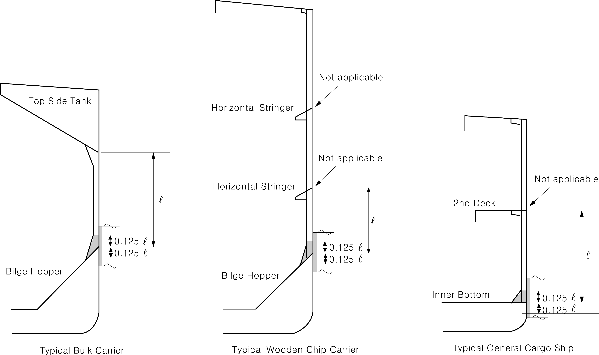

# PART 7 Ships of Special Service (Ch1-4, 7-10)

> RULES FOR CLASSIFICATION OF STEEL SHIPS / RA-07A-E / 2025 / EN / Guidance

## Annex 7-7 Unified Interpretation of Convention 【See Rule】

### 1. UI SC 207 (Structural Strength of Bulk Carriers in case of Accidental Hold Flooding) (2020)

#### (1) This is to clarify the implementation between SOLAS XII/5.2 and IACS UR S17, S18 and S20, these structural requirements are to be complied with in respect of the flooding of any cargo hold of bulk carriers of 150 _s2 in length and above, intending to carry solid bulk cargoes 1.0 _s2 density or above.

#### (2) Unified Interpretation

Regardless of the date of contract for construction, or the cargo hold cross section configuration, of ships which shall comply with SOLAS XII/5.2, such ships are to comply with IACS Unified Requirements(UR) S17, S18 for corrugated transverse bulkheads, where fitted, and S20, if they do not comply with the IACS CSR for Bulk Carriers and Oil Tankers.

#### (3) This UI is to be applied to ships contracted for construction on or after 1 July 2015.

### 2. UI SC 208 (Protection of Cargo Holds Loading/Unloading Equipment) (2020)

#### (1) This is to clarify the implementation between SOLAS XII/6.4.1 (SLS. 14 / Circ. 250) and IACS CSR for Bulk Carriers and Oil Tankers, in terms of protection of cargo holds from loading/discharge equipment of bulk carriers of 150 _s2 in length and above, intending to carry solid bulk cargoes 1.0 _s2 density or above.

#### (2) Unified Interpretation

Bulk carriers which shall comply with SOLAS regulation XII/6.4.1 and which do not comply with the IACS CSR for Bulk Carriers and Oil Tankers, are to comply with the following:

- **(A)** The grab requirements of **Pt 3,** of the Rules.
- **(B)** Wire rope grooving in way of cargo holds openings is to be prevented by fitting suitable protection such as half-round bar on the hatch side girders(i.e. upper portion of top side tank plates)/hatch end beams in cargo hold and upper portion of hatch coamings.

#### (3) The requirements of (A) and (B) are satisfied, "Grab" notation of our Society is to be imposed.

#### (4) This UI is to be applied to ships contracted for construction on or after 1 July 2015.

### 3. UI SC 209 (Failure of Cargo Hold Structural Members and Panels) (2020)

#### (1) This is to provide a standard for the transverse buckling of ordinary stiffeners for ships which shall comply with SOLAS XII/6.4.3, but are not designed according to CSR for Bulk Carriers and Oil Tankers.

#### (2) Unified Interpretation

Ships which shall comply with SOLAS XII/6.4.3 are to satisfy either (A) or (B) as given below.

- **(A)** For ships subjected to CSR : **Pt 13 Sub-part 1 Ch 3, Sec 1 “**Material“ and **Pt 13 Sub-part 1 Ch 8, Sec 5 Ch 6, Sec 3** “Buckling Capacity“.
- **(B)** For ships not designed according to CSR (**Pt 13 Sub-part 1 Ch 3, Sec 1** and **Ch 8, Sec 5**):
  - **(a)** For ships with single side structures the material grade shall not be less than grade D/DH for :
    - lower bracket of side frame
    - side shell plate between two points located to 0.125 $l$ above and 0.125 $l$ below the intersection of side shell and bilge hopper sloping plate or inner bottom plate. The span of the side frame, $l$, is defined as the distance between the supporting structures.
    In case of side frames built with multiple spans, the above requirements apply to the lower part only. (See **Fig 1**)
  - **(b)** The safety factor with respect to lateral buckling of longitudinal and transverse ordinary stiffeners is to be increased by a factor at least 1.15(allowable utilization factor to be reduced by at least 1/1.15=0.87) for the following areas.
    - hatchway coaming
    - inner bottom
    - sloped stiffened panel of topside tanks and hopper tanks (if any)
    - inner side (if any)
    - top stool and bottom stool of transverse bulkhead (if any)
    - stiffened transverse bulkhead (if any)
    - side shell (if directly bounding the cargo hold)
    The lateral buckling requirements of ordinary stiffeners shall be in accordance with the Rules of the Society.

#### (3) This UI is to be applied to ships contracted for construction on or after 1 July 2020. #imgID-134_s2

**Fig 1 Typical configuration**
