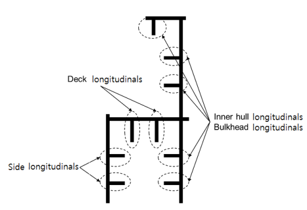
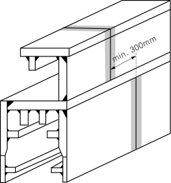
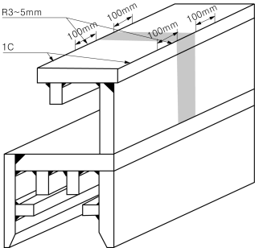

# PART 7 Ships of Special Service (Ch1-4, 7-10)

> RULES FOR CLASSIFICATION OF STEEL SHIPS / RA-07A-E / 2025 / EN / Guidance

## Annex 7-8 Instruction for Use of Extremely Thick Steel in Container Ships (2021) 【See Rule】

### 1. Application

#### (1) General

- **(A)** This instruction is to be complied with for container ships incorporating extremely thick steel plates having steel grade and thickness in accordance with (2) and (3) respectively.
- **(B)** This Instruction identifies when measures for prevention of brittle fracture of extremely thick steel plates are required for longitudinal structural menbers.
- **(C)** This instruction gives the basic concepts for application of extremely thick steel plates to longitudinal structural members in the upper deck.
- **(D)** This instruction defines the following methods to apply to the extremely thick plates of container ships for preventing the crack initiation and propagation:
  a) Non-Destructive Testing(NDT) during construction detailed in **2**
  b) Welding to increase toughness in **3**
  c) Brittle crack arrest design detailed in **4**
  The application of the measures specified in **2, 3** and **4** of this instruction is to be in accordance with **5**.
- **(E)** For the application of this instruction, the upper deck region means the upper deck plating, hatch side coaming plating, hatch coaming top plating and their attached longitudinals.

#### (2) Steel Grade

- **(A)** This instruction is to be applied to when any of YP36, YP40 and YP47 steel plates are used for the longitudinal structure members in the upper deck region.
- **(B)** YP36 YP40 and YP47 means the steel plates having the minimum specified yield points of 355, 390 and 460 $\mathrm{N}/mm^2$, respectively.
- **(C)** In case YP47 steel plates are used for longitudinal structural members in the upper deck region, the steel plates are to be EH47-H specified in **Pt 2, Ch 1, Sec 3.**

#### (3) Thickness

- **(A)** For steel plates with thickness of over 50 $\mathrm{mm}$ and not greater than 100mm, the measures for prevention of brittle crack initiation and propagation specified in **2, 3** and **4** are to be taken.
- **(B)** For steel plates with thickness exceeding 100 $\mathrm{mm}$, appropriate measures for prevention of brittle crack initiation and propagation are to be taken in accordance with the Society’s procedures.

### 2. Non-Destructive Testing (NDT) during construction (Measure No.1 of 5)

Where NDT during construction is required in **5**, the NDT is to be in accordance with (1) and (2). Enhanced NDT as specified in **4** (3) (E) is to be carried out in accordance with an appropriate standard.

#### (1) General

- **(A)** Ultrasonic testing (UT) is to be carried out on all block-to-block butt joints of all upper flange longitudinal structural members in the cargo hold region.
- **(B)** Upper flange longitudinal structural members include the topmost strakes of the inner hull/bulkhead, the sheer strake, main deck, coaming plate, coaming top plate, and all attached longitudinal stiffeners. These members are defined in **Fig 1**.
- **(C)** Testing procedure of UT not specified in this Instruction are to comply with the requirements in **Pt 2, Annex 2-7 of the Guidance.**
  - **(a)** Scanning has to be performed from at least one surfaces and both sides of the welded seam as shown in **Fig 2**. (Scanning from root face is recommended.)
  - **(b)** Testing has to be performed with two probes 70° and 45° or 70° and 60° depending on the bevel preparation.
  - **(c)** Any possible differences in attenuation and surface character between the calibration block and the welded seam to be tested are to be checked in accordance with KS B 0896 or equivalent.
  - **(d)** In case where the detected echo signal is suspicious as vertically oriented defect such as lack of fusion(LF) based on the calculation of sound path, the length of the detected echo signal is to be measured by 6 dB drop method and evaluated regardless of echo height.(acceptance criteria : ≤25 $\mathrm{mm}$)
    
    **Fig 1 Upper Flange Longitudinal Structural Members**
    **Fig 2 Scanning from root face and both sides**
  - **(e)** For the NDE personnel engaged in UT of extremely thick steel plates welds, the shipyard should give education and training related to the detecting and evaluation of vertically oriented defect.
  - **(f)** In order to detect transverse defects, scanning to be made with an angle probe angled about 15 degree from weld axis on at least one surface and both sides or with an angle probe along the centre line of the weld as shown in **Fig 3**.

    |  |  |
    | --- | --- |

#### (2) Acceptance criteria of UT

- **(A)** Acceptance criteria of UT not specified in this Instruction are to comply with the requirements in **Pt 2, Annex 2-7 of the Guidance.**
- **(B)** The acceptance criteria may be adjusted under consideration of the appertaining brittle crack initiation prevention procedure and where this is more severe than that found in **Pt 2, Annex 2-7 of the Guidance,** the UT procedure is to be amended accordingly to a more severe sensitivity.

### 4. Brittle crack arrest design (Measure No. 3, 4 and 5 of 5)

#### (1) General

- **(A)** The brittle crack arrest steel method detailed in **4** may be used when the measures No. 3, 4, and 5 of 5 are applied and the steel grade material of the upper deck is not higher than YP40. Otherwise other means for preventing the crack initiation and propagation shall be agreed with the Society.
- **(B)** Measures for prevention of brittle crack propagation are to be taken within the cargo hold region. A brittle crack arrest design means a design using these measures.
- **(C)** The measures given in this section generally apply to the block-to-block joints but it should be noted that cracks can initiate and propagate away from such joints. Therefore, appropriate measures should also be considered for the cases specified in (2)(B)(b).
- **(D)** Brittle crack arrest steels are defined in **Pt 2, Ch 1, Sec 3.**

#### (2) Functional requirements of brittle crack arrest design

The purpose of the brittle crack arrest design is aimed at arresting propagation of a crack at a proper position and to prevent large scale fracture of the hull girder.

- **(A)** The locations of most concern fro brittle crack initiation and propagation are the block-to-block butt weld joints either on hatch side coaming or on upper deck plating. Other locations in block fabrication where joints are aligned may also present higher opportunity for crack initiation and propagation along butt weld joints.
- **(B)** Both of the following cases are to be considered:
  - **(a)** where the brittle crack runs straight along the butt joint, and
  - **(b)** where the brittle crack initiates in the butt joint but deviates away from the weld and into the plate, or where the brittle crack initiates from any other weld and propagates into the plate.
  - **(c)** “Other weld” in (b) includes the following(refer to **Fig 4**):
    󰊱 Fillet weld between hatch side coaming plating, including top plating, and longitudinals;
    󰊲 Fillet weld between hatch side coaming plating, including top plating and longitudinals, and attachments. (e.g., Fillet welds between hatch side top plating and hatch cover pad plating.);
    󰊳 Fillet weld between hatch side coaming top plating and hatch side coaming plating;
    󰊴 Fillet weld between hatch side coaming plating and upper deck plating;
    󰊵 Fillet weld between upper deck plating and inner hull/bulkheads;
    󰊶 Fillet weld between upper deck plating and longitudinals; and
    󰊷 Fillet weld between sheer strakes and upper deck plating.
    
    **Fig 4 Other weld areas**

#### (3) Concept examples of brittle crack arrest design

The followings are considered to be acceptable examples of measures that can be used on a brittle crack arrest-design to prevent brittle crack propagations. The detail design arrangements are to be submitted to the Society for their approval. Other measures may be considered and accepted for review by the Society.

- **(A)** Brittle crack arrest design for (2) (B) (b):
  - **(a)** Brittle crack arresting steel is to be used for the upper deck along the cargo hold region in a way suitable to arrest a brittle crack initiating from the coaming and propagating into the structure below.
- **(B)** Brittle crack arrest design for (2) (B) (a):
  - **(a)** Where the block to block butt welds of the hatch side coaming and those of the upper deck are shifted, this shift is to be greater than or equal to 300 $\mathrm{mm}$. Brittle crack arrest steel is to be provided for the hatch side coaming.
    
    **Fig 5 An example of block to block butt-shift**
- **(C)** Where crack arrest holes are provided in way of the block-to-block butt welds at the region where hatch side coaming weld meets the deck weld, the fatigue strength of the lower end of the butt weld is to be assessed. Additional countermeasures are to be taken for the possibility that a running brittle crack may deviate from the weld line into upper deck or hatch side coaming. These countermeasures are to include the application of brittle crack arrest steel in hatch side coaming.

  |  |  |
  | --- | --- |
  | **(a) Arrest welding type** | **(b) Arrest hole type** |

  **Fig 6 An example of joint arrangement for arresting the brittle crack propagation**
- **(D)** Where Arrest Insert Plates of brittle crack arrest steel or Weld Metal Inserts with high crack arrest toughness properties are provided in way of the block-to-block butt welds at the region where hatch side coaming weld meets the deck weld, additional countermeasures are to be taken for the possibility that a running brittle crack may deviate from the weld line into upper deck or hatch side coaming. These countermeasures are to include the application of brittle crack arrest steel in hatch side coamings.
- **(E)** The application of enhanced NDT particularly time of flight diffraction (TOFD) technique using stricter defect acceptance in lieu of standard UT technique specified in **2** can be an alternative to (B), (C) and (D) above.

#### (4) Selection of brittle crack arrest steels

- **(A)** The brittle crack arrest steels fitted in the upper deck region of container ships are to comply with Table 1 where suffixes BCA1 and BCA2 are defined in **Rule Part 2**.
- **(B)** The brittle crack arrest steel property is to be selected for each individual structural member with thickness above 50mm according to Table 1.

  | Structural Members plating(1) | Thickness(mm) | Brittle crack arrest steel requirement |
  | --- | --- | --- |
  | Upper deck | \(50 Steel grade YP36 or 40 with suffix BCA1 |   |
  | Hatch coaming side | \(50 Steel grade YP40 or 47 with suffix BCA1 |   |
  | Hatch coaming side | \(80 Steel grade YP40 or 47 with suffix BCA2 |   |
  | Note (1)Excluding their attached longitudinals |   |   |
- **(C)** When brittle crack arrest steels as specified in Table 1 are used, the weld joints between the hatch coaming side and the upper deck are to be partial penetration weld details approved by the Society.
  In the vicinity of ship block joints, alternative weld details may be used for the deck and hatch coaming side connection provided additional means for preventing the crack propagation are implemented and agreed by the Society in this connection area.

### 6. Application of YP47 Steel Plates

These requirements apply to YP47 steel plates specified in **Pt 2, Ch 1, 311.**.

#### (1) Hull structures (design)

- **(A)** HT factor (Material factor of high tensile steel, K) for the assessment of hull girder strength is to be taken as 0.62.
- **(B)** Fatigue assessment on the longitudinal structural members is to be performed in accordance with **Pt 3, Annex 3-3**. In addition to the structural members of container carriers for the fatigue strength assessment specified in **Pt 3, Annex 3-3, Table 6**, butt welds in the hatch side coaming and fillet welded joints for fixing outfitting items, etc. are to be included in the locations for the fatigue strength assessment.
- **(C)** Butt welds in the hatch side coaming and fillet welded joints for fixing outfitting items are to be set at an adequate distance from the hatch corners so that effects of stress concentration are to be avoided.
- **(D)** The free edge including hatch corner of the hatch side coaming should not have any defects such as notch that could be harmful against fatigue strength. Appropriate edge treatment including treatment of corner edge (as an example, see **Fig 7**) is to be performed so that the edges should have adequate fatigue strength.
- **(E)** In case of fitting of outfitting items such as hatch cover pads and container pads, taper is to be provided on the edge of the outfitting item so that a very large difference in rigidity does not occur between outfitting items and the hull structure. Measures such as increasing the thickness of plating at the fitted location are also to be adopted.
- **(F)** Special consideration is to be paid to the construction details where extremely thick steel plates are applied as structural members such as connections between outfitting and hull structures.

  | **Yield Strength** **(kgf/mm ^2 )** | **Thickness** **(mm)** | **Option** | **Measures** |   |   |   |
  | --- | --- | --- | --- | --- | --- | --- |
  | **Yield Strength** **(kgf/mm ^2 )** | **Thickness** **(mm)** | **Option** | 1 | 2 | 3+4 | 5 |
  | 36 | 50 - N.A. N.A. N.A. N.A. |   |   |   |   |   |
  | 36 | 85 - O N.A. N.A. N.A. |   |   |   |   |   |
  | 40 | 50 - O N.A. N.A. N.A. |   |   |   |   |   |
  | 40 | 85 A O N.A. O O |   |   |   |   |   |
  | 40 | 85 A O N.A. O O | B | O* | O** | N.A. | O |
  | 47 (FCAW) | 50 A O N.A. O O |   |   |   |   |   |
  | 47 (FCAW) | 50 A O N.A. O O | B | O* | O** | N.A. | O |
  | 47 (EGW) | 50 - O N.A. O O |   |   |   |   |   |
  | Measures: No. ; Measures 1 ; NDT other than visual inspection on all target block joints (during construction) **2**. 2 ; Welding to increase toughness(during construction) See **3**. 3 ; Brittle crack arrest design against straight propagation of brittle crack along weld line to be taken (during construction) See **4** (3) (B), (C) or (D) of this Instruction. 4 ; Brittle crack arrest design against deviation of brittle crack from weldline (during construction) See **4** (3) (A). 5 ; Brittle crack arrest design against propagation of cracks from other weld such as fillets and attachment welds. (during construction) See **4** (3) (A). No. Measures 1 NDT other than visual inspection on all target block joints (during construction) **2**. 2 Welding to increase toughness(during construction) See **3**. 3 Brittle crack arrest design against straight propagation of brittle crack along weld line to be taken (during construction) See **4** (3) (B), (C) or (D) of this Instruction. 4 Brittle crack arrest design against deviation of brittle crack from weldline (during construction) See **4** (3) (A). 5 Brittle crack arrest design against propagation of cracks from other weld such as fillets and attachment welds. (during construction) See **4** (3) (A). Symbols: (a) “O” means “To be applied”. (b) “N.A.” means “Need not to be applied”. (c) Selectable from option “A” and “B”. Note: * : See 4 (3) (E) ** : See 3. |   |   |   |   |   |   |
  | No. | Measures |   |   |   |   |   |
  | 1 | NDT other than visual inspection on all target block joints (during construction) **2**. |   |   |   |   |   |
  | 2 | Welding to increase toughness(during construction) See **3**. |   |   |   |   |   |
  | 3 | Brittle crack arrest design against straight propagation of brittle crack along weld line to be taken (during construction) See **4** (3) (B), (C) or (D) of this Instruction. |   |   |   |   |   |
  | 4 | Brittle crack arrest design against deviation of brittle crack from weldline (during construction) See **4** (3) (A). |   |   |   |   |   |
  | 5 | Brittle crack arrest design against propagation of cracks from other weld such as fillets and attachment welds. (during construction) See **4** (3) (A). |   |   |   |   |   |

  |  |
  | --- |
  | **Fig 7 An example of appropriate edge treatment including corner edge** |

  
