# PART 7 Ships of Special Service (Ch1-4, 7-10)

> RULES FOR CLASSIFICATION OF STEEL SHIPS / RA-07A-E / 2025 / EN / Guidance

## Annex 7-9 Guidance for the Longitudinal Strength of Container Ships 【See Rule】

### Appendix 1 - Calculation of shear flow

#### 1. General

- **(1)** This annex describes the procedures of direct calculation of shear flow around a ship’s cross section due to hull girder vertical shear force.
- **(2)** The shear flow $q _{V}$ at each location in the cross section, is calculated by considering the cross section is subjected to a unit vertical shear force of 1$\mathrm{N}$.
- **(3)** The unit shear flow per $\mathrm{mm}$, $q _{V}$ ($\mathrm{N}/mm$) is to be taken as:
  $q _{V} =q _{D} +q _{1}$
  where:
  $q_{D}$ : Determinate shear flow, as defined in **2.**
  $q_{1}$ : Indeterminate shear flow which circulates around the closed cells, as defined in **3.**
- **(4)** In the calculation of the unit shear flow, $q _{V}$, the longitudinal stiffeners are to be taken into account.

#### 2. Determinate shear flow

- **(1)** The determinate shear flow, $q_D$ ($\mathrm{N}/mm$) at each location in the cross section is to be obtained from the following line integration
  $q _{D} (S)=- \frac{1}{10 ^{6} I _{y-"net"}} \int _{0} ^{s} {(z-z _{n}} )t _{"net"} ds$
  where:
  $s$ : Coordinate value of running coordinate along the cross section ($\mathrm{m}$)
  $I_{y-"net"}$ : Net moment of inertia of the cross section ($\mathrm{m}^4$)
  $t_{"net"}$ : Net thickness of plating ($\mathrm{mm}$)
  $z _{n}$ : Z coordinate of horizontal neutral axis from baseline ($\mathrm{m}$)=
- **(2)** It is assumed that the cross section is composed of line segments as shown in Fig A1.1: where each line segment has a constant plate net thickness. The determinate shear flow is obtained by the following equation.
  $q _{Dk} =- \frac{t \ell }{2 \times 10 ^{6} I _{y-"net"}} (z _{k} +z _{i} -2z _{n} )+q _{Di}$
  where:
  $q_{Dk}$, $q_{Di}$ : Determinate shear flow at node $k$ and node $i$ respectively ($\mathrm{N}/mm$)
  $\ell$ : Length of line segments ($\mathrm{m}$)
  $y _{k}$, $y _{i}$ : Y coordinate of the end points $k$ and $i$ of line segment ($\mathrm{m}$), as defined in **Fig A1.1**
  $z_{k}$, $z_{i}$ : Z coordinate of the end points $k$ and $i$ of line segment ($\mathrm{m}$), as defined in **Fig A1.1**
- **(3)** Where the cross section includes closed cells, the closed cells are to be cut with virtual slits, as shown in Fig A1.2: in order to obtain the determinate shear flow. These virtual slits must not be located in walls which form part of another closed cell.
- **(4)** Determinate shear flow at bifurcation points is to be calculated by water flow calculations, or similar, as shown in Fig A1.2.
  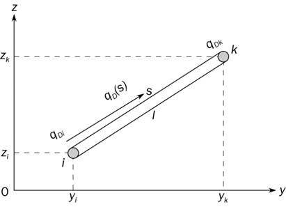
  **Fig A1.1 Definition of line segment**
  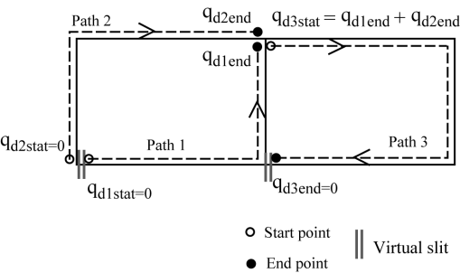
  **Fig A1.2 Placement of virtual slits and calculation of**
  **determinate shear flow at bifurcation points**

#### 3. Indeterminate shear flow

- **(1)** The indeterminate shear flow around closed cells of a cross section is considered as a constant value within the same closed cell. The following system of equation for determination of indeterminate shear flows can be developed. In the equations, contour integrations of several parameters around all closed cells are performed.
  $q _{Ic} oint _{c} ^{} {\frac{1}{t _{"net"}}} ds - \sum _{m=1} ^{Nw} (q _{Im } oint _{c & m} ^{} {\frac{1}{t _{"net"}} ds)=- oint _{c} ^{} {\frac{q _{D}}{t _{"net"}} ds}}$
  where:
  $Nw$ : Number of common walls shared by cell $c$ and all other cells
  $c","m$ : Common wall shared by cells $c$ and $m$
  $q _{Ic}$, $q _{Im}$ : Indeterminate shear flow around the closed cell $c$ and $m$ respectively ($\mathrm{N}/mm$)
- **(2)** Under the assumption of the assembly of line segments shown in Fig A1.1 and constant plate thickness of each line segment, the above equation can be expressed as follows:
  $q _{Ic} \sum _{j=1} ^{Nc} ( \frac{\ell }{t _{"net"}} ) _{j} - \sum _{m=1} ^{Nw} \left\{ q _{Im} \left[ \sum _{j=1} ^{Nm} \left( \frac{l}{t _{"net"}} \right) _{j} \right] _{m} \right\} =- \sum _{j=1} ^{Nc} \phi$
  $\phi = \left[ - \frac{\ell ^{2}}{6 \times 10 ^{3} l _{y-"net"}} \left( Z _{k} +2Z _{i} -3Z _{n} \right) + \frac{\ell }{t _{"net"}} q _{Di} \right] _{j}$
  where:
  $Nc$ : Number of line segments in cell $c$
  $Nm$ : Number of line segments on the common wall shared by cells $c$ and $m$
  $q_{Di}$ : Determinate shear flow ($\mathrm{N}/mm$) calculated according to **Appendix 1, 2**
- **(3)** The difference in the directions of running coordinates specified in Appendix 1, 2 and in this section has to be considered
  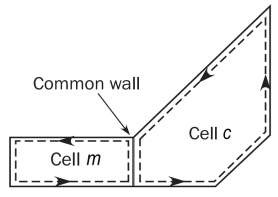
  **Fig A1. 3 Closed cells and common wall**

#### 4. Computation of sectional properties

- **(1)** Properties of the cross section are to be obtained by the following formulae where the cross section is assumed as the assembly of line segments.
  $\ell = \sqrt {(y _{k} -y _{i} ) ^{2} +(z _{k} -z _{i} ) ^{2}}$

  | $a _{"net"}= 10 ^{-3} \ell t_{"net"}$ | $A _{n50} = \sum {a_"net"}$ |
  | --- | --- |
  | $s _{y-"net"} = \frac{a _{"net"}}{2} (z _{k} +z _{i} )$ | $s _{y-"net"} = \sum _{} ^{} s _{y-"net"}$ |
  | $i_{y0-"net"}=\frac{a_{"net"}}{3} (z_{k}^2 + z_{k}z_{i}+z_{i}^{2})$ | $I _{y0-"net"} = \sum i_{y0-"net"$ |

  where:
  $a_{"net"}$, $A_{"net"}$ : Area of the line segment and the cross section respectively ($\mathrm{m}^2$)
  $s_{y-"net"}$, $S_{y-"net"}$ : First moment of the line segment and the cross section about the baseline ($\mathrm{m}^3$)
  $i_{y0-"net"}$, $I_{y0-"net"}$ : Moment of inertia of the line segment and the cross section about the baseline ($\mathrm{m}^4$)
- **(2)** The height of horizontal neutral axis $z _{m}$ is to be obtained as follows:
  $z _{m} = \frac{s _{y-"net"}}{A _{"net"}}$ ($\mathrm{m}$)
- **(3)** Inertia moment about the horizontal neutral axis $I_{y-"net"}$ is to be obtained as follows:
  $I _{y-"net"} =I _{y0-"net"} -z _{n} ^{2} A _{"net"}$ ($\mathrm{m}^4$)

### Appendix 2 - Buckling Capacity

**Symbols**
$x _\mathrm{axis}$ : Local axis of a rectangular buckling panel parallel to its long edge
$y _\mathrm{axis}$ : Local axis of a rectangular buckling panel perpendicular to its long edge
$\sigma _{x}$ : Membrane stress applied in x direction ($\mathrm{N}/mm ^{2}$)
$\sigma _{y}$ : Membrane stress applied in y direction ($\mathrm{N}/mm ^{2}$)
$\tau$ : Membrane shear stress applied in xy plane ($\mathrm{N}/mm ^{2}$)
$\sigma _{a}$ : Axial stress in the stiffener ($\mathrm{N}/mm ^{2}$)
$\sigma _{b}$ : Bending stress in the stiffener ($\mathrm{N}/mm ^{2}$)
$\sigma _{w}$ : Warping stress in the stiffener ($\mathrm{N}/mm ^{2}$)
$\sigma _{1}$, $\sigma _{2}$, $\tau _{c}$ : Critical stress defined in **2.1.1** ($\mathrm{N}/mm ^{2}$)
$R _{eH _{-} S}$ : Specified minimum yield stress of the stiffener ($\mathrm{N}/mm ^{2}$)
$R _{eH _{-} P}$ : Specified minimum yield stress of the plate ($\mathrm{N}/mm ^{2}$)
$a$ : Length of the longer side of the plate panel as shown in **Table 2** ($\mathrm{mm}$)
$b$ : Length of the shorter side of the plate panel as shown in **Table 2** ($\mathrm{mm}$)
$d$ : Length of the side parallel to the axis of the cylinder corresponding to the curved plate panel as shown in **Table 3** ($\mathrm{mm}$)
$\sigma _{E}$ : Elastic buckling reference stress ($\mathrm{N}/mm ^{2}$)
• For the application of plate limit state according to **2.1.2** :
$\sigma _{E} = \frac{\pi ^{2} E}{12 (1-v ^{2} )} \left( \frac{t _{p}}{b} \right) ^{2}$
• For the application of curved plate panels according to **2.2** :
$\sigma _{E} = \frac{\pi ^{2} E}{12 (1-v ^{2} )} \left( \frac{t _{p}}{d} \right) ^{2}$
$\nu$ : Poisson’s ratio to be taken equal to 0.3
$t _{p}$ : Net thickness of plate panel ($\mathrm{mm}$)
$t _{w}$ : Net stiffener web thickness ($\mathrm{mm}$)
$t _{f}$ : Net flange thickness ($\mathrm{mm}$)
$b _{f}$ : Breadth of the stiffener flange ($\mathrm{mm}$)
$h _{w}$ : Stiffener web height ($\mathrm{mm}$)
$e _{f}$ : Distance ($\mathrm{mm}$) from attached plating to centre of flange to be taken as
$e _{f} = h _{w}$, for flat bar profile.
$e _{f} = h _{w} - 0.5 t _{f}$, for bulb profile
$e _{f} = h _{w} + 0.5 t _{f}$, for angle and Tee profiles
$\alpha$ : Aspect ratio of the plate panel, to be taken as $\alpha = a/b$
$\beta$ : Coefficient taken as $\beta = \frac{1- \psi}{\alpha}$
$\psi$ : Edge stress ratio to be taken as $\psi = \frac{\sigma _{2}}{\sigma _{1}}$
$\sigma _{1}$ : Maximum stress ($\mathrm{N}/mm ^{2}$)
$\sigma _{2}$ : Minimum stress ($\mathrm{N}/mm ^{2}$)
$R$ : Radius of curved plate panel ($\mathrm{mm}$)
$\ell$ : Span of stiffener equal to the spacing between primary supporting members ($\mathrm{mm}$)
$s$ : Spacing of stiffener to be taken as the mean spacing between the stiffeners of the considered stiffened panel ($\mathrm{mm}$)

#### 1. Elementary Plate Panel (EPP)

- **1.1** Definition
  An Elementary Plate Panel (EPP) is the unstiffened part of the plating between stiffeners and/or primary supporting members. All the edges of the elementary plate panel are forced to remain straight (but free to move in the in-plane directions) due to the surrounding structure/neighbouring plates (usually longitudinal stiffened panels in deck, bottom and inner-bottom plating, shell and longitudinal bulkheads).
- **1.2** EPP with different thicknesses
  - **1.2.1** Longitudinally stiffened EPP with different thicknesses
    In longitudinal stiffening arrangement, when the plate thickness varies over the width, $b$ ($\mathrm{mm}$) of a plate panel, the buckling capacity is calculated on an equivalent plate panel width, having a thickness equal to the smaller plate thickness, $t _{1}$. The width of this equivalent plate panel, $b _{eq}$ is defined by the following formula:
    $b _{eq} = \ell _{1} + \ell _{2} \left( \frac{t _{1}}{t _{2}} \right) ^{1.5}$ ($\mathrm{mm}$)
    where:
    $\ell _{1}$ : Width of the part of the plate panel with the smaller plate thickness, $t_1$ ($\mathrm{mm}$) as defined in **Fig A2.1**
    $\ell _{2}$ : Width of the part of the plate panel with the greater plate thickness, $t_2$, ($\mathrm{mm}$) as defined in **Fig A2.1**
    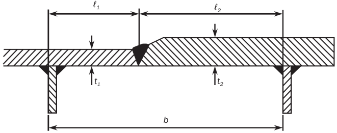
    **Fig A2.1 Plate thickness change over the width**
  - **1.2.2** Transversally stiffened EPP with different thicknesses
    In transverse stiffening arrangement, when an EPP is made of different thicknesses, the buckling check of the plate and stiffeners is to be made for each thickness considered constant on the EPP.

#### 2. Buckling capacity of plates

- **2.1** Plate panel
  - **2.1.1** Plate limit state
    The plate limit state is based on the following interaction formulae:
    a) Longitudinal stiffening arrangement:
    $\left( \frac{\gamma _{c} \sigma _{x}}{\sigma _{cx} ^{ }} \right) ^{2/ \beta _{p} ^{ 0.25}} + \left( \frac{\gamma _{c} \left| \tau \right|}{\tau _{c} ^{ }} \right) ^{2/ \beta _{p} ^{ 0.25}} =1$
    b) Transverse stiffening arrangement
    $\left( \frac{\gamma _{c} \sigma _{y}}{\sigma _{cy} ^{ }} \right) ^{2/ \beta _{p} ^{ 0.25}} + \left( \frac{\gamma _{c} \left| \tau \right|}{\tau _{c} ^{ }} \right) ^{2/ \beta _{p} ^{ 0.25}} =1$
    where:
    $\sigma _{x ,} \sigma _{y}$ : Applied normal stress to the plate panel ($\mathrm{N}/mm ^{2}$) as defined in **4.4** at load calculation points of the considered elementary plate panel
    $\tau$ : Applied shear stress to the plate panel ($\mathrm{N}/mm ^{2}$) as defined in **4.4** at load calculation points of the considered elementary plate panel
    $\sigma _{cx} ^{ }$ : Ultimate buckling stress ($\mathrm{N}/mm^2$) in direction parallel to the longer edge of the buckling panel as defined in **2.1.3**
    $\sigma _{cy} ^{ }$ : Ultimate buckling stress ($\mathrm{N}/mm^2$) in direction parallel to the shorter edge of the buckling panel as defined in **2.1.3**
    $\tau _{c} ^{ }$ : Ultimate buckling shear stress ($\mathrm{N}/mm^2$) as defined in **2.1.3**
    $\beta _{p}$ : Plate slenderness parameter taken as:
    $\beta _{p} = \frac{b}{t _{p}} \sqrt {\frac{R _{eH _{-} P}}{E}}$
  - **2.1.2** Reference degree of slenderness
    The reference degree of slenderness is to be taken as:
    $\lambda = \sqrt {\frac{R _{eH _{-} P}}{K \sigma _{E}}}$
    where:
    $K$ : Buckling factor, as defined in **Table 2** and **Table 3**.
  - **2.1.3** Ultimate buckling stresses
    The ultimate buckling stress of plate panels ($\mathrm{N}/mm ^{2}$) is to be taken as:
    $\sigma _{cx} ^{ } = C _{x} R _{eH _{-} P}$
    $\sigma _{cy} ^{ } = C _{y} R _{eH _{-} P}$
    The ultimate buckling stress of plate panels subject to shear ($\mathrm{N}/mm ^{2}$) is to be taken as:
    $\tau _{c} ^{ } = C _{\tau } \frac{R _{eH₋P}}{\sqrt {3}}$
    where:
    $C _{x} , C _{y} , C _{\tau }$ : Reduction factors, as defined in **Table 2**
    The boundary conditions for plates are to be considered as simply supported (see cases 1, 2 and 15 of **Table 2**). If the boundary conditions differ significantly from simple support, a more appropriate boundary condition can be applied according to the different cases of **Table 2** subject to the agreement of the Society
  - **2.1.4** Correction Factor, $F _{long}$
    The correction factor, $F _{long}$ depending on the edge stiffener types on the longer side of the buckling panel is defined in **Table 1**. An average value of $F _{long}$ is to be used for plate panels having different edge stiffeners. For stiffener types other than those mentioned in **Table 1**, the value of $c$ is to be agreed by the Society. In such a case, value of $c$ higher than those mentioned in **Table 1** can be used, provided it is verified by buckling strength check of panel using non-linear FE analysis and deemed appropriate by the Society

    | **Structural element types** |   |   | $F_long$ | $c$ |
    | --- | --- | --- | --- | --- |
    | Unstiffened Panel |   |   | 1.0 | N/A |
    | Stiffened Panel | Stiffener not fixed at both ends |   | 1.0 | N/A |
    | Stiffened Panel | Stiffener fixed at both ends | Flat bar (1) | $F_{long}=c+1$ for $\frac{t_{w}}{t_{p}} \succ 1$ $F_{long}=c( \frac{t_{w}}{t_{p}})^{3}+1$ for $\frac{t_{w}}{t_{p}} \leq 1$ | 0.10 |
    | Stiffened Panel | Stiffener fixed at both ends | Bulb profile | $F_{long}=c+1$ for $\frac{t_{w}}{t_{p}} \succ 1$ $F_{long}=c( \frac{t_{w}}{t_{p}})^{3}+1$ for $\frac{t_{w}}{t_{p}} \leq 1$ | 0.30 |
    | Stiffened Panel | Stiffener fixed at both ends | Angle profile | $F_{long}=c+1$ for $\frac{t_{w}}{t_{p}} \succ 1$ $F_{long}=c( \frac{t_{w}}{t_{p}})^{3}+1$ for $\frac{t_{w}}{t_{p}} \leq 1$ | 0.40 |
    | Stiffened Panel | Stiffener fixed at both ends | T profile | $F_{long}=c+1$ for $\frac{t_{w}}{t_{p}} \succ 1$ $F_{long}=c( \frac{t_{w}}{t_{p}})^{3}+1$ for $\frac{t_{w}}{t_{p}} \leq 1$ | 0.30 |
    | Stiffened Panel | Stiffener fixed at both ends | Girder of high rigidity (e.g. bottom transverse) | 1.4 | N/A |
    | (1) $t _{w}$ is the net web thickness ($\mathrm{mm}$) without the correction defined in **4.3.5** |   |   |   |   |

    | Case | Stress ratio ($\psi$) | Aspect ratio ($\alpha$) |   | Buckling factor ($K$) | Reduction factor ($C$) |
    | --- | --- | --- | --- | --- | --- |
    | 1  | $1 \geq \psi \geq 0$ | $K _{x} = F _{long} \frac{8.4}{\psi +1.1}$ |   |   | $C _{x} = 1$, for $\lambda$ ≤ $\lambda _{c}$ $C _{x} = c \left( \frac{1}{\lambda} - \frac{0.22}{\lambda ^{2}} \right)$, for $\lambda$ > $\lambda _{c}$ where: $c = \left( 1.25-0.12 \psi \right)$ ≤ 1.25 $\lambda _{c} = \frac{c}{2} \left( 1+ \sqrt {1- \frac{0.88}{c}} \right)$ |
    |   | $0> \psi >-1$ | $K _{x} = F _{long} [7.63- \psi \left( 6.26-10 \psi \right) ]$ |   |   | $C _{x} = 1$, for $\lambda$ ≤ $\lambda _{c}$ $C _{x} = c \left( \frac{1}{\lambda} - \frac{0.22}{\lambda ^{2}} \right)$, for $\lambda$ > $\lambda _{c}$ where: $c = \left( 1.25-0.12 \psi \right)$ ≤ 1.25 $\lambda _{c} = \frac{c}{2} \left( 1+ \sqrt {1- \frac{0.88}{c}} \right)$ |
    |   | $\psi \leq -1$ | $K _{x} = F _{long} [5.975 \left( 1- \psi \right) ^{2} ]$ |   |   | $C _{x} = 1$, for $\lambda$ ≤ $\lambda _{c}$ $C _{x} = c \left( \frac{1}{\lambda} - \frac{0.22}{\lambda ^{2}} \right)$, for $\lambda$ > $\lambda _{c}$ where: $c = \left( 1.25-0.12 \psi \right)$ ≤ 1.25 $\lambda _{c} = \frac{c}{2} \left( 1+ \sqrt {1- \frac{0.88}{c}} \right)$ |
    | 2  (continued) | $1 \geq \psi \geq 0$ | $K _{y} = \frac{2 \left( 1 + \frac{1}{\alpha ^{2}} \right) ^{2}}{1+ \psi + \frac{(1- \psi )}{100} \left( \frac{2.4}{\alpha ^{2}} + 6.9 f _{1} \right)}$ |   |   |   |
    |   | $1 \geq \psi \geq 0$ | $\alpha$ ≤ 6 | $f _{1} = (1- \psi ) ( \alpha - 1)$ |   |   |
    |   | $1 \geq \psi \geq 0$ | $\alpha$ > 6 | $f _{1} = 0.6 \left( 1- \frac{6 \psi}{\alpha} \right) \left( \alpha + \frac{14}{\alpha} \right)$, But not greater than $14.5 - \frac{0.35}{\alpha ^{2}}$ |   |   |

    | Case | Stress ratio ($\psi$) | Aspect ratio ($\alpha$) | Buckling factor ($K$) | Reduction factor ($C$) |
    | --- | --- | --- | --- | --- |
    | 2. 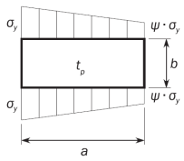 | $0> \psi \geq 1- \frac{4 \alpha}{3}$ | $K _{y} = \frac{200 (1+ \beta ^{2} ) ^{2}}{(1-f _{3} ) (100+2.4 \beta ^{2} +6.9 f _{1} +23f _{2} )}$ |   | $C _{y} = c \left( \frac{1}{\lambda} - \frac{R+F ^{2} \left( H-R \right)}{\lambda ^{2}} \right)$ where: $c = \left( 1.25-0.12 \psi \right)$ ≤ 1.25 $R = \lambda (1- \lambda /c)$, for $\lambda$ < $\lambda _{c}$ $R = 0.22$, for $\lambda$ ≥ $\lambda _{c}$ $\lambda _{c} = 0.5c \left( 1+ \sqrt {1-0.88/c} \right)$ $F = \left[ 1- \left( \frac{K}{0.91} -1 \right) / \lambda _{p} ^{2} \right] c _{1}$ ≥ 0 $\lambda _{p} ^{2} = \lambda ^{2} -0.5$ , 1 ≤ $\lambda _{p} ^{2}$ ≤ 3 $c _{1} = \left( 1 - \frac{1}{\alpha} \right) \geq 0$ $H = \lambda - \frac{2 \lambda}{c \left( T+ \sqrt {T ^{2} -4} \right)}$ ≥ $R$ $T = \lambda + \frac{14}{15 \lambda} + \frac{1}{3}$ |
    |   | $0> \psi \geq 1- \frac{4 \alpha}{3}$ | $\alpha$ > $6(1- \psi )$ | $f _{1} = 0.6 \left( \frac{1}{\beta} + 14 \beta \right)$, But not greater than $14.5 - 0.35 \beta ^{2}$ $f _{2} = f _{3} =0$ | $C _{y} = c \left( \frac{1}{\lambda} - \frac{R+F ^{2} \left( H-R \right)}{\lambda ^{2}} \right)$ where: $c = \left( 1.25-0.12 \psi \right)$ ≤ 1.25 $R = \lambda (1- \lambda /c)$, for $\lambda$ < $\lambda _{c}$ $R = 0.22$, for $\lambda$ ≥ $\lambda _{c}$ $\lambda _{c} = 0.5c \left( 1+ \sqrt {1-0.88/c} \right)$ $F = \left[ 1- \left( \frac{K}{0.91} -1 \right) / \lambda _{p} ^{2} \right] c _{1}$ ≥ 0 $\lambda _{p} ^{2} = \lambda ^{2} -0.5$ , 1 ≤ $\lambda _{p} ^{2}$ ≤ 3 $c _{1} = \left( 1 - \frac{1}{\alpha} \right) \geq 0$ $H = \lambda - \frac{2 \lambda}{c \left( T+ \sqrt {T ^{2} -4} \right)}$ ≥ $R$ $T = \lambda + \frac{14}{15 \lambda} + \frac{1}{3}$ |
    |   | $0> \psi \geq 1- \frac{4 \alpha}{3}$ | $3(1- \psi ) \leq \alpha \leq 6(1- \psi )$ | $f _{1} = \frac{1}{\beta} - 1$ $f _{2} = f _{3} =0$ | $C _{y} = c \left( \frac{1}{\lambda} - \frac{R+F ^{2} \left( H-R \right)}{\lambda ^{2}} \right)$ where: $c = \left( 1.25-0.12 \psi \right)$ ≤ 1.25 $R = \lambda (1- \lambda /c)$, for $\lambda$ < $\lambda _{c}$ $R = 0.22$, for $\lambda$ ≥ $\lambda _{c}$ $\lambda _{c} = 0.5c \left( 1+ \sqrt {1-0.88/c} \right)$ $F = \left[ 1- \left( \frac{K}{0.91} -1 \right) / \lambda _{p} ^{2} \right] c _{1}$ ≥ 0 $\lambda _{p} ^{2} = \lambda ^{2} -0.5$ , 1 ≤ $\lambda _{p} ^{2}$ ≤ 3 $c _{1} = \left( 1 - \frac{1}{\alpha} \right) \geq 0$ $H = \lambda - \frac{2 \lambda}{c \left( T+ \sqrt {T ^{2} -4} \right)}$ ≥ $R$ $T = \lambda + \frac{14}{15 \lambda} + \frac{1}{3}$ |
    |   | $0> \psi \geq 1- \frac{4 \alpha}{3}$ | $1.5(1- \psi ) \leq \alpha < 3(1- \psi )$ | $f _{1} = \frac{1}{\beta} - \left( 2 - w \beta \right) ^{4} - 9 \left( w \beta -1 \right) \left( \frac{2}{3} - \beta \right)$ $f _{2} = f _{3} =0$ | $C _{y} = c \left( \frac{1}{\lambda} - \frac{R+F ^{2} \left( H-R \right)}{\lambda ^{2}} \right)$ where: $c = \left( 1.25-0.12 \psi \right)$ ≤ 1.25 $R = \lambda (1- \lambda /c)$, for $\lambda$ < $\lambda _{c}$ $R = 0.22$, for $\lambda$ ≥ $\lambda _{c}$ $\lambda _{c} = 0.5c \left( 1+ \sqrt {1-0.88/c} \right)$ $F = \left[ 1- \left( \frac{K}{0.91} -1 \right) / \lambda _{p} ^{2} \right] c _{1}$ ≥ 0 $\lambda _{p} ^{2} = \lambda ^{2} -0.5$ , 1 ≤ $\lambda _{p} ^{2}$ ≤ 3 $c _{1} = \left( 1 - \frac{1}{\alpha} \right) \geq 0$ $H = \lambda - \frac{2 \lambda}{c \left( T+ \sqrt {T ^{2} -4} \right)}$ ≥ $R$ $T = \lambda + \frac{14}{15 \lambda} + \frac{1}{3}$ |
    |   | $0> \psi \geq 1- \frac{4 \alpha}{3}$ | $1- \psi \leq \alpha < 1.5(1- \psi )$ | • For $\alpha > 1.5$: $f _{1} = 2 \left( \frac{1}{\beta} - 16 \left( 1 - \frac{\omega}{3} \right) ^{4} \right) \left( \frac{1}{\beta} - 1 \right)$ $f _{2} = 3 \beta - 2$ $f _{3} = 0$ • For $\alpha \leq 1.5$: $f _{1} = 2 \left( \frac{1.5}{1 - \psi} - 1 \right) \left( \frac{1}{\beta} - 1 \right)$ $f _{2} = \frac{\psi (1- 16f _{4} ^{2} )}{1 - \alpha}$ $f _{3} = 0$ $f _{4} = (1.5 - RMMin(1.5; \alpha )) ^{2}$ | $C _{y} = c \left( \frac{1}{\lambda} - \frac{R+F ^{2} \left( H-R \right)}{\lambda ^{2}} \right)$ where: $c = \left( 1.25-0.12 \psi \right)$ ≤ 1.25 $R = \lambda (1- \lambda /c)$, for $\lambda$ < $\lambda _{c}$ $R = 0.22$, for $\lambda$ ≥ $\lambda _{c}$ $\lambda _{c} = 0.5c \left( 1+ \sqrt {1-0.88/c} \right)$ $F = \left[ 1- \left( \frac{K}{0.91} -1 \right) / \lambda _{p} ^{2} \right] c _{1}$ ≥ 0 $\lambda _{p} ^{2} = \lambda ^{2} -0.5$ , 1 ≤ $\lambda _{p} ^{2}$ ≤ 3 $c _{1} = \left( 1 - \frac{1}{\alpha} \right) \geq 0$ $H = \lambda - \frac{2 \lambda}{c \left( T+ \sqrt {T ^{2} -4} \right)}$ ≥ $R$ $T = \lambda + \frac{14}{15 \lambda} + \frac{1}{3}$ |

    | Case | Stress ratio ($\psi$) | Aspect ratio ($\alpha$) | Buckling factor ($K$) | Reduction factor ($C$) |
    | --- | --- | --- | --- | --- |
    | 2.  | $0> \psi \geq 1- \frac{4 \alpha}{3}$ | $0.75(1- \psi ) \leq \alpha <1- \psi$ | $f _{1} =0$ $f _{2} =1+2.31( \beta -1)-48(4/3- \beta )f _{4} ^{2}$ $f _{3} =3f _{4} ( \beta -1) \left( \frac{f _{4}}{1.81} - \frac{\alpha -1}{1.31} \right)$ $f _{4} = (1.5 - RMMin(1.5; \alpha )) ^{2}$ |   |
    |   | $\psi <1- \frac{4 \alpha}{3}$ | $K _{y} =5.972 \frac{\beta ^{2}}{1-f _{3}}$ where: $f _{3} =f _{5} \left( \frac{f _{5}}{1.81} + \frac{1+3 \psi}{5.24} \right)$ $f _{5} = \frac{9}{16} (1+\mathrm{Max} (-1 ; \psi )) ^{2}$ |   |   |
    | 3  | 1 ≥ $\psi$ ≥ 0 | $K _{x} = \frac{4 \left( 0.425+1/ \alpha ^{2} \right)}{3 \psi +1}$ |   | $C _{x} = 1$, for $\lambda$ ≤ 0.7 $C _{x} = \frac{1}{\lambda ^{2} +0.51}$, for $\lambda$ > 0.7 |
    |   | 0 > $\psi$ ≥ -1 | $K _{x} = 4 \left( 0.425+1/ \alpha ^{2} \right) \left( 1+ \psi \right) -5 \psi (1-3.42 \psi )$ |   | $C _{x} = 1$, for $\lambda$ ≤ 0.7 $C _{x} = \frac{1}{\lambda ^{2} +0.51}$, for $\lambda$ > 0.7 |
    | 4 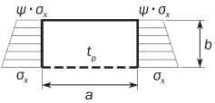 | 1 ≥ $\psi$ ≥-1 | $K _{x} = \left( 0.425+ \frac{1}{\alpha ^{2}} \right) \frac{3- \psi}{2}$ |   | $C _{x} = 1$, for $\lambda$ ≤ 0.7 $C _{x} = \frac{1}{\lambda ^{2} +0.51}$, for $\lambda$ > 0.7 |
    | 5 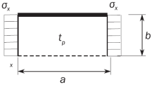 | - | $\alpha$ ≥ 1.64 | $K _{x} = 1.28$ | $C _{x} = 1$, for $\lambda$ ≤ 0.7 $C _{x} = \frac{1}{\lambda ^{2} +0.51}$, for $\lambda$ > 0.7 |
    |   | - | $0< \alpha <1.64$ | $K _{x} = \frac{1}{\alpha ^{2}} + 0.56 + 0.13 \alpha ^{2}$ | $C _{x} = 1$, for $\lambda$ ≤ 0.7 $C _{x} = \frac{1}{\lambda ^{2} +0.51}$, for $\lambda$ > 0.7 |

    **Table 2 Buckling Factor and reduction factor for plane plate panels (continued)**

    | Case | Stress ratio ($\psi$) | Aspect ratio ($\alpha$) | Buckling factor ($K$) | Reduction factor ($C$) |
    | --- | --- | --- | --- | --- |
    | #imgID-1566. | $1 \geq \psi \geq 0$ | $K _{y} = \frac{4(0.425+ \alpha ^{2} )}{(3 \psi +1) \alpha ^{2}}$ |   | $C _{y} =1$ for $\lambda \leq 0.7$ $C _{y} = \frac{1}{\lambda ^{2} +0.51}$ for $\lambda >0.7$ |
    | #imgID-1566. | $0> \psi \geq -1$ | $K _{y} =4(0.425+ \alpha ^{2} )(1+ \psi ) \frac{1}{\alpha ^{2}} -5 \psi (1-3.42 \psi ) \frac{1}{\alpha ^{2}}$ |   | $C _{y} =1$ for $\lambda \leq 0.7$ $C _{y} = \frac{1}{\lambda ^{2} +0.51}$ for $\lambda >0.7$ |
    | #imgID-1577. | $1 \geq \psi \geq -1$ | $K _{y} =(0.425+ \alpha ^{2} ) \frac{(3- \psi )}{2 \alpha ^{2}}$ |   | $C _{y} =1$ for $\lambda \leq 0.7$ $C _{y} = \frac{1}{\lambda ^{2} +0.51}$ for $\lambda >0.7$ |
    | #imgID-1588. | - | $K _{y} =1+ \frac{0.56}{\alpha ^{2}} + \frac{0.13}{\alpha ^{4}}$ |   | $C _{y} =1$ for $\lambda \leq 0.7$ $C _{y} = \frac{1}{\lambda ^{2} +0.51}$ for $\lambda >0.7$ |
    | #imgID-1599 | - | $K _{x} = 6.97$ |   | $C _{x} = 1$ for $\lambda$ ≤ 0.83 $C _{x} =1. 13 \left( \frac{1}{\lambda} - \frac{0.22}{\lambda ^{2}} \right)$ for $\lambda$ > 0.83 |
    | #imgID-16010. | - | $K _{y} = 4 + \frac{2.07}{\alpha ^{2}} + \frac{0.67}{\alpha ^{4}}$ |   | $C _{x} = 1$ for $\lambda$ ≤ 0.83 $C _{x} =1. 13 \left( \frac{1}{\lambda} - \frac{0.22}{\lambda ^{2}} \right)$ for $\lambda$ > 0.83 |

    | Case | Stress ratio ($\psi$) | Aspect ratio ($\alpha$) | Buckling factor ($K$) | Reduction factor ($C$) |
    | --- | --- | --- | --- | --- |
    | 11 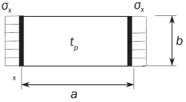 | - | $\alpha \geq 4$ | $K _{x} =4$ | $C _{x} = 1$ for $\lambda$ ≤ 0.83 $C _{x} =1. 13 \left( \frac{1}{\lambda} - \frac{0.22}{\lambda ^{2}} \right)$ for $\lambda$ > 0.83 |
    |   | - | $\alpha < 4$ | $K _{x} = 4 + 2.74 \left[ \frac{4 - \alpha}{3} \right] ^{4}$ | $C _{x} = 1$ for $\lambda$ ≤ 0.83 $C _{x} =1. 13 \left( \frac{1}{\lambda} - \frac{0.22}{\lambda ^{2}} \right)$ for $\lambda$ > 0.83 |
    | 12.  | - | $K _{y} = K _{y}$ determined as per case 2 |   | $C _{y} = C _{y2}$ for $\alpha < 2$ $C _{y} = \left( 1.06 + \frac{1}{10 \alpha} \right) C _{y2}$ for $\alpha \geq 2$ $C _{y2}$ = $C _{y}$ determined as per case 2 |
    | 13. 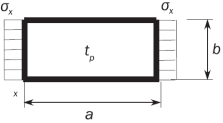 | - | $\alpha \geq 4$ | $K _{x} =6.97$ | $C _{x} = 1$ for $\lambda$ ≤ 0.83 $C _{x} =1. 13 \left( \frac{1}{\lambda} - \frac{0.22}{\lambda ^{2}} \right)$ for $\lambda$ > 0.83 |
    |   | - | $\alpha < 4$ | $K _{x} = 6.97 +3.1 \left[ \frac{4 - \alpha}{3} \right] ^{4}$ | $C _{x} = 1$ for $\lambda$ ≤ 0.83 $C _{x} =1. 13 \left( \frac{1}{\lambda} - \frac{0.22}{\lambda ^{2}} \right)$ for $\lambda$ > 0.83 |
    | 14.  | - | $K _{y} = \frac{6.97}{\alpha ^{2}} + \frac{3.1}{\alpha ^{2}} \left( \frac{4-1/ \alpha}{3} \right) ^{4}$ |   | $C _{y} = 1$ for $\lambda$ ≤ 0.83 $C _{y} =1. 13 \left( \frac{1}{\lambda} - \frac{0.22}{\lambda ^{2}} \right)$ for $\lambda$ > 0.83 |

    | Case | Stress ratio ($\psi$) | Aspect ratio ($\alpha$) | Buckling factor ($K$) | Reduction factor ($C$) |
    | --- | --- | --- | --- | --- |
    | 15 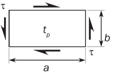 | - | $K _{\tau } = \sqrt {3} \left[ 5.34 + \frac{4}{\alpha ^{2}} \right]$ |   | $C _{\tau } =1$, for $\lambda \leq 0.84$ $C _{\tau } = \frac{0.84}{\lambda}$, for $\lambda >0.84$ |
    | 16 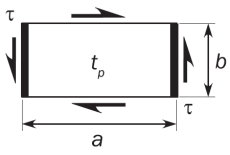 | - | $K _{\tau } = \sqrt {3} \left\{ 5.34 + Max \left[ \frac{4}{\alpha ^{2}} ; \frac{7.15}{\alpha ^{2.5}} \right] \right\}$ |   | $C _{\tau } =1$, for $\lambda \leq 0.84$ $C _{\tau } = \frac{0.84}{\lambda}$, for $\lambda >0.84$ |
    | 17  | - | $K _{\tau } = K ^{'} r$ $K ^{'}$=$K$ according to case 15 $r$: opening reduction factor taken as $r = \left( 1 - \frac{d _{a}}{a} \right) \left( 1 - \frac{d _{b}}{b} \right)$ with $\frac{d _{a}}{a} \leq 0.7$ and $\frac{d _{b}}{b} \leq 0.7$ |   | $C _{\tau } =1$, for $\lambda \leq 0.84$ $C _{\tau } = \frac{0.84}{\lambda}$, for $\lambda >0.84$ |
    | 18. 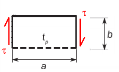 | - | $K _{\tau } =3 ^{0.5} \left( 0.6+4/ \alpha ^{2} \right)$ |   | $C _{\tau } =1$, for $\lambda \leq 0.84$ $C _{\tau } = \frac{0.84}{\lambda}$, for $\lambda >0.84$ |

    | Case | Stress ratio ($\psi$) | Aspect ratio ($\alpha$) | Buckling factor ($K$) | Reduction factor ($C$) |
    | --- | --- | --- | --- | --- |
    | 19.  | - | $K _{\tau } =8$ |   |   |
    | Edge boundary conditions: ------ Plate edge free. Plate edge simply supported. Plate edge clamped. |   |   |   |   |
    | Notes: 1) Cases listed are general cases. Each stress component($\sigma _{x , } \sigma _{y}$) is to be understood in local coordinates. |   |   |   |   |
- **2.2** Curved plate panels
  This requirement for curved plate limit state is applicable when $R/t _{p} \leq 2500$. Otherwise, the requirement for plate limit state given in **2.1.1** is applicable.
  $\left( \frac{\gamma _{c} \sigma _{ax}}{C _{ax} R _{eH _{-} p}} \right) ^{1.25} + \left( \frac{\gamma _{c} \tau \sqrt {3}}{C _{\tau } R _{eH _{-} p}} \right) ^{2} =1.0$
  where,
  $\sigma _{ax}$ : Applied axial stress($\mathrm{N}/mm ^{2}$) to the cylinder corresponding to the curved plate panel, In case of tensile axial stresses, $\sigma _{ax}$= 0.
  $C _{ax} , C _{\tau }$ : Reduction factor of the curved plate panel, as defined in **Table 3.**
  The stress multiplier factor, $\gamma_c$ of the curved plate panel needs not be taken less than the stress multiplier factor, $\gamma_c$ for the expanded plane panel according to **2.1.1.**

  | Case | Aspect ratio | Buckling factor ($K$) | Reduction factor ($C$) |
  | --- | --- | --- | --- |
  | 1  | $\frac{d}{R} \leq 0.5 \sqrt {\frac{R}{t _{p}}}$ | $K=1+ \frac{2}{3} \frac{d ^{2}}{R t _{p}}$ | For general application: $K=1+ \frac{2}{3} \frac{d ^{2}}{R t _{p}}$, ; for $C _{ax} =1$ $\lambda \leq 0.25$ ; for $C _{ax} =1.233-0.933 \lambda$ $0.25 \prec \lambda \leq 1$, ; for $C _{ax} =0.3/ \lambda ^{3}$ $1\prec \lambda \leq 1.5$, ; for $C _{ax} =0.2/ \lambda ^{2}$ $C _{ax} =1$, for $\lambda \leq 0.25$ $C _{ax} =1.233-0.933 \lambda$ for $0.25 \prec \lambda \leq 1$ $C _{ax} =0.3/ \lambda ^{3}$, for $1\prec \lambda \leq 1.5$ $C _{ax} =0.2/ \lambda ^{2}$, for $\lambda \succ 1.5$ For curved single fields, e.g. bilge strake, which are bounded by plane panels: $C _{ax} = \frac{0.65}{\lambda ^{2}} \leq 1.0$ |
  |   | $K=1+ \frac{2}{3} \frac{d ^{2}}{R t _{p}}$, | for $C _{ax} =1$ | For general application: $K=1+ \frac{2}{3} \frac{d ^{2}}{R t _{p}}$, ; for $C _{ax} =1$ $\lambda \leq 0.25$ ; for $C _{ax} =1.233-0.933 \lambda$ $0.25 \prec \lambda \leq 1$, ; for $C _{ax} =0.3/ \lambda ^{3}$ $1\prec \lambda \leq 1.5$, ; for $C _{ax} =0.2/ \lambda ^{2}$ $C _{ax} =1$, for $\lambda \leq 0.25$ $C _{ax} =1.233-0.933 \lambda$ for $0.25 \prec \lambda \leq 1$ $C _{ax} =0.3/ \lambda ^{3}$, for $1\prec \lambda \leq 1.5$ $C _{ax} =0.2/ \lambda ^{2}$, for $\lambda \succ 1.5$ For curved single fields, e.g. bilge strake, which are bounded by plane panels: $C _{ax} = \frac{0.65}{\lambda ^{2}} \leq 1.0$ |
  | $\lambda \leq 0.25$ | for $C _{ax} =1.233-0.933 \lambda$ |   |   |
  | $0.25 \prec \lambda \leq 1$, | for $C _{ax} =0.3/ \lambda ^{3}$ |   |   |
  | $1\prec \lambda \leq 1.5$, | for $C _{ax} =0.2/ \lambda ^{2}$ |   |   |
  | $\frac{d}{R} >0.5 \sqrt {\frac{R}{t _{p}}}$ | $K=0.267 \frac{d ^{2}}{R t _{p}} [3- \frac{d}{R} \sqrt {\frac{t _{p}}{R}} ]$ $\geq 0.4 \frac{d ^{2}}{R t _{p}}$ |   |   |
  | 2  | $\frac{d}{R} \leq 8.7 \sqrt {\frac{R}{t _{p}}}$ | $K= \sqrt {3} \sqrt {28.3 + \frac{0.67 d ^{3}}{R ^{1.5} t _{p} ^{1.5}}}$ | $K= \sqrt {3} \sqrt {28.3 + \frac{0.67 d ^{3}}{R ^{1.5} t _{p} ^{1.5}}}$, ; for $C _{\tau } =1$ $\lambda \leq 0.4$, ; for $C _{\tau } =1.274-0.686 \lambda$ $0.4 \prec \lambda \leq 1.2$, ; for $C _{\tau} = \frac{0.65}{\lambda ^{2}}$ $C _{\tau } =1$, for $\lambda \leq 0.4$ $C _{\tau } =1.274-0.686 \lambda$, for $0.4 \prec \lambda \leq 1.2$ $C _{\tau} = \frac{0.65}{\lambda ^{2}}$, for $\lambda \succ 1.2$ |
  |   | $K= \sqrt {3} \sqrt {28.3 + \frac{0.67 d ^{3}}{R ^{1.5} t _{p} ^{1.5}}}$, | for $C _{\tau } =1$ | $K= \sqrt {3} \sqrt {28.3 + \frac{0.67 d ^{3}}{R ^{1.5} t _{p} ^{1.5}}}$, ; for $C _{\tau } =1$ $\lambda \leq 0.4$, ; for $C _{\tau } =1.274-0.686 \lambda$ $0.4 \prec \lambda \leq 1.2$, ; for $C _{\tau} = \frac{0.65}{\lambda ^{2}}$ $C _{\tau } =1$, for $\lambda \leq 0.4$ $C _{\tau } =1.274-0.686 \lambda$, for $0.4 \prec \lambda \leq 1.2$ $C _{\tau} = \frac{0.65}{\lambda ^{2}}$, for $\lambda \succ 1.2$ |
  | $\lambda \leq 0.4$, | for $C _{\tau } =1.274-0.686 \lambda$ |   |   |
  | $0.4 \prec \lambda \leq 1.2$, | for $C _{\tau} = \frac{0.65}{\lambda ^{2}}$ |   |   |
  | $\frac{d}{R} \succ 8.7 \sqrt {\frac{R}{t _{p}}}$ | $K _{} = \sqrt {3} \frac{0.28 d ^{2}}{R \sqrt {R t _{p}}}$ |   |   |
  | Explanations for boundary conditions: Plate edge simply supported |   |   |   |

#### 3. Buckling capacity of overall stiffened panel

The elastic stiffened panel limit state is based on the following interaction formula:
$\frac{P _{z}}{c _{f}} = 1$
where:
$P _{z}$ and $c _{f}$ are defined in 4.4.3.

#### 4. Buckling capacity of longitudinal stiffeners

- **4.1** Stiffeners limit states
  The buckling capacity of longitudinal stiffeners is to be checked for the following limit states:
  • Stiffener induced failure (SI)
  • Associated plate induced failure (PI)
- **4.2** Lateral pressure
  The lateral pressure is to be considered as constant in the buckling strength assessment of longitudinal stiffeners.
- **4.3** Stiffener idealization
  - **4.3.1** Effective length of the stiffener
    The effective length of the stiffener, $\ell _{eff}$($\mathrm{mm}$)is to be taken equal to:
    • $\ell _{eff} = \frac{\ell }{\sqrt {3}}$ for stiffener fixed at both ends.
    • $\ell _{eff} =0.75 \ell$ for stiffener simply supported at one end and fixed at the other
    • $\ell _{eff} = \ell$ for stiffener simply supported at both ends.
  - **4.3.2** Effective width of the attached plating, $b _{eff1}$
    The effective width of the attached plating of a stiffener, $b _{eff1}$($\mathrm{mm}$) without the shear lag effect is to be taken equal to:
    $b _{eff1} = \frac{C _{\chi 1} b _{1} +C _{\chi 2} b _{2}}{2}$
    where:
    $C _{\chi 1} , C _{\chi 2}$ : Reduction factor defined in **Table 2** calculated for the EPP1 and EPP2 on each side of the considered stiffener according to case 1.
    $b _{1} , b _{2}$ : Width ($\mathrm{mm}$) of plate panel on each side of the considered stiffener
  - **4.3.3** Effective width of attached plating, $b _{eff}$
    The effective width of attached plating of stiffeners, $b _{eff}$ ($\mathrm{mm}$) is to be taken as:
    $b _{eff} =\mathrm{Min}(b _{eff1} , \chi _{s} s)$
    where:
    $\chi _{s}$ : Effective width coefficient to be taken as:
    $\chi _{s} = \mathrm{Min} \left[ \frac{1.12}{1 + \frac{1.75}{\left( \frac{\ell _{eff}}{s} \right) ^{1.6}}} ; 1.0 \right]$ for $\frac{\ell _{eff}}{s} \geq 1$
    $\chi _{s} = 0.407 \frac{\ell _{eff}}{s}$ for $\frac{\ell _{eff}}{s} < 1$
  - **4.3.4** Net thickness of attached plating
    The net thickness of plate, $t _{p}$($\mathrm{mm}$) is to be taken as the mean thickness of the two attached plating panels.
  - **4.3.5** Effective web thickness of flat bar
    For accounting the decrease of stiffness due to local lateral deformation, the effective web thickness ($\mathrm{mm}$) of flat bar stiffener is to be used for the calculation of the net sectional area, $A _{s}$ the net section modulus, $Z$ and the moment of inertia, I of the stiffener and is taken as:
    $t _{w-red} =t _{w} \left[ 1- \frac{2 \pi ^{2}}{3} \left( \frac{h _{w}}{s} \right) ^{2} \left( 1- \frac{b _{eff1}}{s} \right) \right]$ (mm)
  - **4.3.6** Net section modulus Z of a stiffener
    Net section modulus, Z of a stiffener including effective width of plating, $b _{eff}$ is to be taken equal to:
    • the section modulus calculated at the top of stiffener flange for stiffener induced failure (SI).
    • the section modulus calculated at the attached plating for plate induced failure (PI).
  - **4.3.7** Net moment of inertia, I of a stiffener
    The net moment of inertia, I ($\mathrm{cm} ^{4}$) of a stiffener including effective width of attached plating, $b _{eff}$ to comply with the following requirement:
    $I \geq \frac{s t _{p} ^{3}}{12 \times 10 ^{4}}$
  - **4.3.8** Idealization of bulb profile
    Bulb profiles may be considered as equivalent angle profiles. The net dimensions of the equivalent built-up section are to be obtained from the following formulae.
    $h _{w} =h ' _{w} - \frac{h ' _{w}}{9.2} +2$ ($\mathrm{mm}$)
    $b _{f} = \alpha \left( t ' _{w} + \frac{h ' _{w}}{6.7} -2 \right)$ ($\mathrm{mm}$)
    $t _{f} = \frac{h ' _{w}}{9.2} -2$ ($\mathrm{mm}$)
    $t _{w} =t' _{w}$ ($\mathrm{mm}$)
    where:
    $h' _{w} , t ' _{w}$ : Net height and thickness ($\mathrm{mm}$) of a bulb section as shown in **Fig A2.2**.
    $\alpha$ : Coefficient equal to:
    $\alpha =1.1+ \frac{(120-h' _{w} ) ^{2}}{3000}$ for #eqnID-2854120_s2
    $\alpha =1.0$ for $h ' _{w}$ >120
    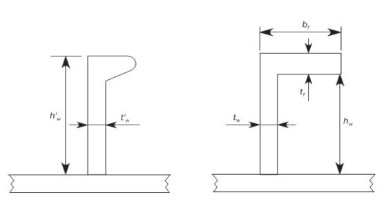
    **Fig A2.2 Idealization of bulb stiffener**
- **4.4** Ultimate buckling capacity
  - **4.4.1** Longitudinal stiffener limit state
    When $\sigma _{a} + \sigma _{b} + \sigma _{w} >0$ the ultimate buckling capacity for stiffeners is to be checked according to the following interaction formula:
    $\frac{\gamma _{c} \sigma _{a} + \sigma _{b} + \sigma _{w}}{R _{eH}} = 1$
    where:
    $\sigma _{a}$ : Effective axial stress ($\mathrm{N}/mm ^{2}$) at mid-span of the stiffener, defined in **4.4.2**
    $\sigma_b$ : Bending stress ($\mathrm{N}/mm ^{2}$) in the stiffener, defined in **4.4.3**
    $\sigma _{w}$ : Stress ($\mathrm{N}/mm ^{2}$) due to torsional deformation, defined in **4.4.4**
    $R _{eH}$ : Specified minimum yield stress ($\mathrm{N}/mm ^{2}$) of the material
    • $R _{eH } =R _{eH-S}$ for stiffener induced failure (SI)
    • $R _{eH } =R _{eH-P}$ for plate induced failure (PI)
  - **4.4.2** Effective axial stress, $\sigma _{a}$
    The effective axial stress ($\mathrm{N}/mm ^{2}$) at mid-span of the stiffener, acting on the stiffener with its attached plating is to be taken equal to:
    $\sigma _{a} = \sigma _{x} \frac{s t _{p} +A _{s}}{b _{eff 1} t _{p} +A _{s}}$
    where:
    $\sigma _{x}$ : Nominal axial stress ($\mathrm{N}/mm ^{2}$) acting on the stiffener with its attached plating, calculated according to **4.4.1** at load calculation point of the stiffener
    $A _{S}$ : Net sectional area ($\mathrm{mm}^2$) of the considered stiffener
  - **4.4.3** Bending stress, $\sigma _{b}$
    The bending stress in the stiffener ($\mathrm{N}/mm ^{2}$) is to be taken equal to:
    $\sigma _{b} = \frac{M _{0} +M _{1}}{Z \times 10 ^{3}}$
    where:
    $M_{1}$ : Bending moment ($\mathrm{N}/mm$) due to the lateral load, $P$
    $M _{1} =C _{i} \frac{P  s \ell ^{2}}{24 \times 10 ^{3}}$ for continuous stiffener
    $M _{1} =C _{i} \frac{P  s \ell ^{2}}{8 \times 10 ^{3}}$ for sniped stiffener
    $P$ : Lateral load ($\mathrm{kN}/m ^{2}$) to be taken equal to the static pressure at the load calculation point of the stiffener.
    $C_{i}$ : Pressure coefficient
    $C_{i}$ = $C_{SI}$ for stiffener induced failure (SI)
    $C_{i}$ = $C_{P I}$ for plate induced failure (PI)
    $C_{P I}$ : Plate induced failure pressure coefficient
    $C_{P I}$ = 1 if the lateral pressure is applied on the side opposite to the stiffener
    $C_{P I}$ = -1 if the lateral pressure is applied on the same side as the stiffener
    $C_{SI}$ : Stiffener induced failure pressure coefficient
    $C_{SI}$ = -1 if the lateral pressure is applied on the side opposite to the stiffener
    $C_{SI}$ = 1 if the lateral pressure is applied on the same side as the stiffener
    $M_0$ : Bending moment ($\mathrm{N}/mm$) due to the lateral deformation, $w$ of stiffener
    $M _{0} =F _{E} ( \frac{P _{z} w}{c _{f} -P _{z}} )$ with $c _{f} -P _{z} >0$
    $F_E$ : Ideal elastic buckling force ($\mathrm{N}$) of the stiffener
    $F _{E} =( \frac{\pi}{\ell } ) ^{2} E I 10 ^{4}$
    $P _{z}$ : Nominal lateral load ($\mathrm{N}/mm ^{2}$) acting on the stiffener due to stresses $\sigma _{x}$ and $\tau$, in the attached plating in way of the stiffener mid span:
    $P _{z} = \frac{t _{p}}{s} \left( \sigma _{xI} \left( \frac{\pi s}{\ell } \right) ^{2} + \sqrt {2} \tau _{1} \right)$
    $\sigma _{x \ell } = \gamma _{c} \sigma _{x} \left( 1+ \frac{A _{s}}{s t _{p}} \right)$ but not less than 0
    $\tau _{1} = \gamma _{c}  \tau -t _{p} \sqrt {R _{eH _{-} p} E \left( \frac{m _{1}}{a ^{2}} + \frac{m _{2}}{s ^{2}} \right)}$ but not less than 0
    $m _{1}$, $m _{2}$ : Coefficients taken equal to:
    $m _{1} =1.47$, $m _{2} =0.49$ for $\alpha \geq 2$
    $m _{1} =1.96$, $m _{2} =0.37$ for $\alpha <2$
    $w$ : Deformation of stiffener ($\mathrm{mm}$) taken equal to:
    $w=w _{0} +w _{1}$
    $w _{0}$ : Assumed imperfection (mm), taken equal to:
    $w _{0} =\ell/1000$ in general
    $w _{0} =-w _{na}$ for stiffeners sniped at both ends, considering stiffener induced failure (SI)
    $w _{0} =w _{na}$ for stiffeners sniped at both ends, considering plate induced failure (PI)
    $w _{na }$ : Distance ($\mathrm{mm}$) from the mid-point of attached plating to the neutral axis of the stiffener calculated with the effective width of the attached plating, $b _{eff}$
    $w _{1}$ : Deformation ($\mathrm{mm}$) of stiffener at midpoint of stiffener span due to lateral load, $P$. In case of uniformly distributed load, $w _{1}$ is to be taken as:

    | $w _{1} =C _{i} \frac{P s \ell ^{4}}{384 \times 10 ^{7} E I}$, | in general |
    | --- | --- |
    | $w _{1} =C _{i} \frac{5PsI ^{4}}{384.10 ^{7} EI}$, | for stiffener sniped at both ends |

    $c_f$ : Elastic support provided by the stiffener ($\mathrm{N}/mm ^{2}$) to be taken equal to:
    $c _{f} =F _{E} \left( \frac{\pi}{\ell } \right) ^{2} (1+c _{p} )$
    $c _{p}$ : Coefficient to be taken as:
    $c _{p} = \frac{1}{1+ \frac{0.91}{c _{xa}} \left( \frac{12 I 10 ^{4}}{s t _{p} ^{3}} -1 \right)}$
    $c _{xa}$ :
    $c _{xa} = \left( \frac{\ell }{2s} + \frac{2s}{\ell } \right) ^{2}$ for $literGEQ 2s$
    $c _{xa} = \left( 1+ \left( \frac{\ell }{2s} \right) ^{2} \right) ^{2}$ for $\ell <2s$
  - **4.4.4** Stress due to torsional deformation, $\sigma _{w}$
    The stress due to torsional deformation, $\sigma _{w}$($\mathrm{N}/mm ^{2}$) is to be taken equal to:

    | $\sigma _{w} =E y _{w} \left( \frac{t _{f}}{2} +h _{w} \right) \Phi _{0} \left( \frac{\pi}{\ell } \right) ^{2} \left( \frac{1}{1- \frac{0.4 R _{eH _{-} S}}{\sigma _{ET}}} -1 \right)$ | for stiffener induced failure (SI) |
    | --- | --- |
    | $\sigma _{w} =0$ | for plate induced failure (PI) |

    where:
    $y _{w}$ : Distance ($\mathrm{mm}$) from centroid of stiffener cross-section to the free edge of stiffener flange, to be taken as:

    | $y _{w} = \frac{t _{w}}{2}$, | for flat bar |
    | --- | --- |
    | $y _{w} =b _{f} - \frac{h _{w} t _{w} ^{2} +t _{f} b _{f} ^{2}}{2A _{s}}$, | for angle and bulb profiles |
    | $y _{w} = \frac{b _{f}}{2}$ | for Tee profile |

    $\Phi _{0} = \frac{\ell}{h _{w}} 10 ^{-3}$
    $\sigma _{ET}$ : Reference stress for torsional buckling ($\mathrm{N}/mm ^{2}$)
    $\sigma _{ET} = \frac{E}{I _{p}} \left( \frac{\epsilon \pi ^{2 } I _{w} 10 ^{2}}{\ell ^{2}} +0.385I _{T} \right)$
    $I _{P}$ : Net polar moment of inertia ($\mathrm{cm} ^{4}$) of the stiffener about point C as shown in **Fig A2.3**, as defined in **Table 4**
    $I _{T}$ : Net St. Venant’s moment of inertia ($\mathrm{cm} ^{4}$) of the stiffener, as defined in **Table 4**
    $I _{w}$ : Net sectional moment of inertia ($\mathrm{cm} ^{6}$) of the stiffener about point C as shown in **Fig A2.3,** as defined in **Table 4**
    $\epsilon$ : Degree of fixation
    $\epsilon =1+ \frac{\left( \frac{\ell }{\pi} \right) ^{2} 10 ^{-3}}{\sqrt {I _{w} \left( \frac{0.75s}{t _{p} ^{3}} + \frac{e _{f} -0.5t _{f}}{t _{w} ^{3}} \right)}}$

    |   | **Flat bars** | **Bulb, angle and Tee profiles** |
    | --- | --- | --- |
    | $I _{p}$ | $\frac{h _{w} ^{3} t _{w}}{3 \times 10 ^{4}}$ | $\left( \frac{A _{w} (e _{f} -0.5t _{f} ) ^{2}}{3} +A _{f} e _{f} ^{2} \right) 10 ^{-4}$ |
    | $I _{T}$ | $\frac{h _{w} ^{3} t _{w}}{3 \times 10 ^{4}} \left( 1-0.63 \frac{t _{w}}{h _{w}} \right)$ | $\frac{(e _{f} -0.5t _{f} )t _{w} ^{3}}{3 \times 10 ^{4}} \left( 1-0.63 \frac{t _{w}}{e _{f} -0.5 t _{f}} \right) + \frac{b _{f} t _{f} ^{3}}{3 \times 10 ^{4}} \left( 1-0.63 \frac{t _{f}}{b _{f}} \right)$ |
    | $I _{w}$ | $\frac{h _{w} ^{3} t _{w} ^{3}}{36 \times 10 ^{6}}$ | $\frac{A _{f} e _{f} ^{2} b _{f} ^{2}}{12 \times 10 ^{6}} \left( \frac{A _{f} +2.6A _{W}}{A _{f} +A _{W}} \right)$ : for bulb and angle profiles $\frac{b _{f} ^{3} t _{f} e _{f} ^{2}}{12 \times 10 ^{6}}$, : for Tee profiles |
    | $A _{w}$ : Net web area ($\mathrm{mm} ^{2}$) $A_f$ : Net flange area ($\mathrm{mm} ^{2}$) |   |   |

    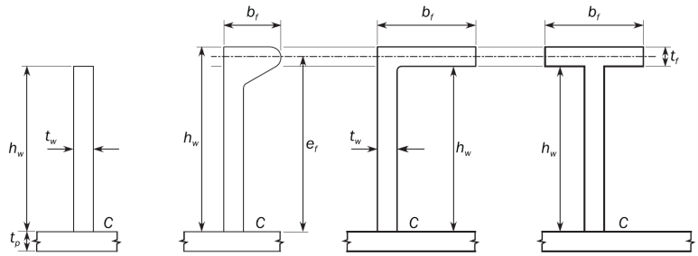
    **Fig A2.3 Stiffener cross sections**

### Appendix 3 - Hull girder ultimate bending capacity

**Symbols**
$I_{y-"net"}$ : Net moment of inertia ($\mathrm{m}^4$) of the hull transverse section around its horizontal neutral axis
$Z_{B-"net"}$, $Z_{D-"net"}$ : Section moduli. ($\mathrm{m}^3$) at bottom and deck, respectively
$R _{e _{-} Hs}$ : Minimum yield stress ($\mathrm{N}/mm ^{2}$) of the material of the considered stiffener
$R _{e _{-} Hp}$ : Minimum yield stress ($\mathrm{N}/mm ^{2}$) of the material of the considered plate
$A _{s-"net"}$ : Minimum yield stress ($\mathrm{cm}^2$) of the material of the considered plate
$A_{p-"net"}$ : Net sectional area ($\mathrm{cm}^2$) of attached plating

#### 1. General Assumptions

- **1.1** The method for calculating the ultimate hull girder capacity is to identify the critical failure modes of all main longitudinal structural elements.
- **1.2** Structures compressed beyond their buckling limit have reduced load carrying capacity. All relevant failure modes for individual structural elements, such as plate buckling, torsional stiffener buckling, stiffener web buckling, lateral or global stiffener buckling and their interactions, are to be considered in order to identify the weakest inter-frame failure mode.

#### 2. Incremental-iterative method

- **2.1** Assumptions
  In applying the incremental-iterative method, the following assumptions are generally to be made:
  • The ultimate strength is calculated at hull transverse sections between two adjacent transverse webs
  • The hull girder transverse section remains plane during each curvature increment.
  • The hull material has an elasto-plastic behaviour.
  • The hull girder transverse section is divided into a set of elements, see **2.2.2**, which are considered to act independently.
  According to the iterative procedure, the bending moment, $M _{i}$ acting on the transverse section at each curvature value, $\chi _{i}$ is obtained by summing the contribution given by the stress, $\sigma$ acting on each element. The stress, $\sigma$ corresponding to the element strain, $\varepsilon$ is to be obtained for each curvature increment from the non-linear load-end shortening curves, $\sigma - \varepsilon$ of the element.
  These curves are to be calculated, for the failure mechanisms of the element, from the formulae specified in **2.3.** The stress, $\sigma$ is selected as the lowest among the values obtained from each of the considered load-end shortening curves, $\sigma - \varepsilon$.
  The procedure is to be repeated until the value of the imposed curvature reaches the value $\chi _{F} (\mathrm{m} ^{-1} )$ in hogging and sagging condition, obtained from the following formula:
  $\chi _{F} =±0.003 \frac{M _{y}}{EI _{y-"net"}}$
  where:
  $M _{y}$ : Lesser of the values $M _{Y1}$ and $M_{Y2}$ ($\mathrm{kNm}$)
  $M_{Y1}=10^{3}R_{eH}Z_{B-"net"}$
  $M_{Y2}=10^{3}R_{eH}Z_{D-"net"}$
  If the value $\chi _{F}$ is not sufficient to evaluate the peaks of the curve, $M _{- \chi }$ the procedure is to be repeated until the value of the imposed curvature permits the calculation of the maximum bending moments of the curve
- **2.2** Procedure
  - **2.2.1** General
    The curve $M_-x$ is to be obtained by means of an incremental-iterative approach, summarized in the flow chart in **Fig A3.1.**
    In this procedure, the ultimate hull girder bending moment capacity, $M_{U}$ is defined as the peak value of the curve with vertical bending moment, $M$ versus the curvature, $\chi$ of the ship cross section as shown in **Fig A3.1**. The curve is to be obtained through an incremental-iterative approach.
    Each step of the incremental procedure is represented by the calculation of the bending moment, $M _{i}$ which acts on the hull transverse section as the effect of an imposed curvature, $\chi _{i}$.
    For each step, the value, $\chi _{i}$ is to be obtained by summing an increment of curvature, $\Delta \chi$ to the value relevant to the previous step $\chi _{i-1}$. This increment of curvature corresponds to an increment of the rotation angle of the hull girder transverse section around its horizontal neutral axis.
    This rotation increment induces axial strains, $\varepsilon$ in each hull structural element, whose value depends on the position of the element. In hogging condition, the structural elements above the neutral axis are lengthened, while the elements below the neutral axis are shortened, and vice-versa in sagging condition.
    The stress, $\sigma$ induced in each structural element by the strain, $\varepsilon$ is to be obtained from the load-end shortening curve, $\sigma- \varepsilon$ of the element, which takes into account the behaviour of the element in the non-linear elasto-plastic domain.
    The distribution of the stresses induced in all the elements composing the hull transverse section determines, for each step, a variation of the neutral axis position due to the nonlinear $\sigma- \varepsilon$, relationship. The new position of the neutral axis relevant to the step considered is to be obtained by means of an iterative process, imposing the equilibrium among the stresses acting in all the hull elements on the transverse section.
    Once the position of the neutral axis is known and the relevant element stress distribution in the section is obtained, the bending moment of the section, $M _{i}$ round the new position of the neutral axis, which corresponds to the curvature, $\chi _{i}$ imposed in the step considered, is to be obtained by summing the contribution given by each element stress.
    The main steps of the incremental-iterative approach described above are summarized as follows (see also **Fig A3.1**):
    a) Step 1 : Divide the transverse section of hull into stiffened plate elements
    b) Step 2 : Define stress-strain relationships for all elements as shown in **Table 1**
    c) Step 3 : Initialize curvature, $\chi _{1}$ and neutral axis for the first incremental step with the value of incremental curvature (i.e. curvature that induces a stress equal to 1% of yield strength in strength deck) as:
    $\chi _{1} = \Delta \chi = {0.01 \frac{R _{eH}}{E}}\frac{1}{z _{D} -z_n}$
    where:
    $z_{D}$ : Z coordinate ($\mathrm{m}$) of strength deck at side
    $z _{n}$ : Z coordinate ($\mathrm{m}$) of horizontal neutral axis of the hull transverse section with respect to the reference coordinate system defined in **1.2.3**
    d) Step 4 : Calculate for each element the corresponding strain, $\varepsilon _{i} = \chi (z _{i} -z _{n} )$ and the corresponding stress, $\sigma _{i}$
    e) Step 5 : Determine the neutral axis, $z_{NA-cur}$ at each incremental step by establishing force equilibrium over the whole transverse section as:
    $\Sigma A _{i-"net" } \sigma _{i} = \Sigma A _{j-"net"} \sigma _{j}$
    (i-th element is under compression, j-th element under tension)
    f) Step 6 : Calculate the corresponding moment by summing the contributions of all elements as:
    $M_{u}=\Sigma \sigma_{Ui}A_{i-"net"} |(z_{i}-z_{NA-cur} )|$
    g) Step 7 : Compare the moment in the current incremental step with the moment in the previous incremental step. If the slope in $M_-x$ relationship is less than a negative fixed value, terminate the process and define the peak value, $M_{U}$. Otherwise, increase the curvature by the amount of, $\Delta \chi$ and go to Step **4**.
  - **2.2.2** Modelling of the hull girder cross section
    Hull girder transverse sections are to be considered as being constituted by the members contributing to the hull girder ultimate strength. Sniped stiffeners are also to be modelled, taking account that they do not contribute to the hull girder strength. The structural members are categorized into a stiffener element, a stiffened plate element or a hard corner element. The plate panel including web plate of girder or side stringer is idealized into a stiffened plate element, an attached plate of a stiffener element or a hard corner element.
    The plate panel is categorized into the following two kinds:
    • Longitudinally stiffened panel of which the longer side is in ship’s longitudinal direction, and
    • Transversely stiffened panel of which the longer side is in the perpendicular direction to ship’s longitudinal direction.
    a) Hard corner element
    Hard corner elements are sturdier elements composing the hull girder transverse section, which collapse mainly according to an elasto-plastic mode of failure (material yielding); they are generally constituted by two plates not lying in the same plane.
    The extent of a hard corner element from the point of intersection of the plates is taken equal to $20t _{"net"}$ on a transversely stiffened panel and to $0.5s$ on a longitudinally stiffened panel, see **Fig A3.2.**
    $t_{"net"}$ : thickness of the plate ($\mathrm{mm}$)
    $s$ : Spacing of the adjacent longitudinal stiffener ($\mathrm{m}$)
    Bilge, sheer strake-deck stringer elements, girder-deck connections and face plate-web connections on large girders are typical hard corners.
    b) Stiffener element
    The stiffener constitutes a stiffener element together with the attached plate.
    The attached plate width is in principle:
    
    **Fig A3.1 Flow chart of the procedure for the evaluation of the curve**
    • Equal to the mean spacing of the stiffener when the panels on both sides of the stiffener are longitudinally stiffened, or
    • Equal to the width of the longitudinally stiffened panel when the panel on one side of the stiffener is longitudinally stiffened and the other panel is of the transversely stiffened, see **Fig A3.2.**
    c) Stiffened plate element
    The plate between stiffener elements, between a stiffener element and a hard corner element or between hard corner elements is to be treated as a stiffened plate element, see **Fig A3.2**.
    The typical examples of modelling of hull girder section are illustrated in **Fig A3.3.**
    Notwithstanding the foregoing principle, these figures are to be applied to the modelling in the vicinity of upper deck, sheer strake and hatch coaming.
    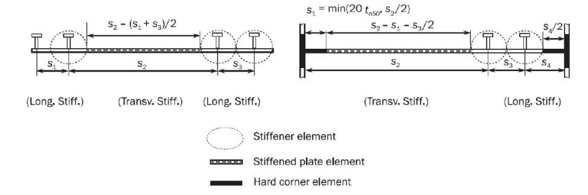
    **Fig A3.2 Extension of the breadth of the attached plating and hard corner element**#imgID-176**Fig A3.3 Examples of the configuration of stiffened plate elements, stiffener elements and****hard corner elements on a hull section**
    • In case of the knuckle point as shown in **Fig A3.4,** the plating area adjacent to knuckles in the plating with an angle greater than 30 degrees is defined as a hard corner. The extent of one side of the corner is taken equal to 20 $t _{"net"}$ on transversely framed panels and to 0.5 $\mathrm{s}$ on longitudinally framed panels from the knuckle point.
    • Where the plate members are stiffened by non-continuous longitudinal stiffeners, the non- continuous stiffeners are considered only as dividing a plate into various elementary plate panels.
    • Where the opening is provided in the stiffened plate element, the openings are to be considered in accordance with the requirements of the Society.
    • Where attached plating is made of steels having different thicknesses and/or yield stresses, an average thickness and/or average yield stress obtained from the following formula are to be used for the calculation
    $t _{"net"} = \frac{t _{1-"net"} s _{1} +t _{2-"net"} s _{2}}{s}$ $R _{e _{-} Hp} = \frac{R _{e _{-} Hp1} t _{1-"net"} s _{1} +R _{eH _{-} p2} t _{2-"net"} s _{2}}{t _{"net"} S}$
    where, $R _{eH _{-} P1}$, $R _{eH _{-} P2}$, $t _{1-"net"}$, $t _{2-"net"}$, $s _{1}$, $s _{2}$ and $s$ are shown in **Fig A3.5**.
    
    **Fig A3.4 Plating with knuckle point**
    
    **F**
    **ig A3.5 Element with different thickness and yield strength**
- **2.3** Load-end shortening curves
  - **2.3.1** Stiffened plate element and stiffener element
    Stiffened plate element and stiffener element composing the hull girder transverse sections may collapse following one of the modes of failure specified in **Table 1.**
    • Where the plate members are stiffened by non-continuous longitudinal stiffeners, the stress of the element is to be obtained in accordance with **2.3.2** to **2.3.7**, taking into account the non-continuous longitudinal stiffener
    • Where the opening is provided in the stiffened plate element, the considered area of the stiffened plate element is to be obtained by deducting the opening area from the plating in calculating the total forces for checking the hull girder ultimate strength.
    • For stiffened plate element, the effective width of plate for the load shortening portion of the stress-strain curve is to be taken as full plate width, i.e. to the intersection of other plate or longitudinal stiffener – neither from the end of the hard corner element nor from the attached plating of stiffener element, if any. In calculating the total forces for checking the hull girder ultimate strength, the area of the stiffened plate element is to be taken between the hard corner element and the stiffener element or between the hard corner elements, as applicable.

    | **Element** | **Mode of failure** | **Curve** $\sigma - \varepsilon$ **defined in** |
    | --- | --- | --- |
    | Lengthened stiffened plate element or stiffener element | Elasto-plastic collapse | **2.3.2** |
    | Shortened stiffener element | Beam column buckling Torsional buckling Web local buckling of flanged profiles Web local buckling of flat bars | **2.3.3** **2.3.4** **2.3.5** **2.3.6** |
    | Shortened stiffened plate element | Plate buckling | **2.3.7** |
  - **2.3.2** Elasto-plastic collapse of structural elements (Hard corner element)
    The equation describing the load-end shortening curve, $\sigma - \varepsilon$ for the elasto-plastic collapse of structural elements composing the hull girder transverse section is to be obtained from the following formula
    $\sigma = \Phi R _{eHA}$
    where:
    $R _{eHA}$ : Equivalent minimum yield stress ($\mathrm{N}/mm ^{2}$) of the considered element, obtained by the following formula:
    $R _{eHA} = \frac{R _{eH _{-} P} A _{p-"net"} +R _{eH _{-} s} A _{s-"net"}}{A _{p-"net"} +A _{s-"net"}}$
    $\Phi$ : Edge function, equal to:
    $\Phi$ = -1 for $\varepsilon$ < -1
    $\Phi$ = $\varepsilon$ for -1 ≤ $\varepsilon$ ≤ 1
    $\Phi$ = 1 for $\varepsilon$ > 1
    $\varepsilon$ : Relative strain, equal to:
    $\varepsilon = \frac{\varepsilon _{E}}{\varepsilon _{Y}}$
    $\varepsilon _{E}$ : Element strain
    $\varepsilon _{Y}$ : Strain at yield stress in the element, equal to:
    $\varepsilon _{Y} = \frac{R _{eHA}}{E}$
  - **2.3.3** Beam column buckling
    The positive strain portion of the average stress–average strain curve, $\sigma _{CR1} - \varepsilon$ based on beam column buckling of plate-stiffener combinations is described according to the following:
    $\sigma_{CR1}=\Phi \sigma_{C1}\frac{A_{s-"net"}+A_{pE-"net"}}{A_{s-"net"}+A_{p-"net"}}$
    where:
    $\Phi$ : Edge function, as defined in **2.3.2**
    $\sigma _{C1}$ : Critical stress ($\mathrm{N}/mm ^{2}$) equal to:
    $\sigma _{C1} = \frac{\sigma _{E1}}{\varepsilon}$ for $\sigma _{E1} \leq \frac{R _{eHB}}{2} \varepsilon$
    $\sigma _{C1} = R _{eHB} \left( 1- \frac{R _{eHB} \varepsilon}{4 \sigma _{E1}} \right)$ for $\sigma _{E1} > \frac{R _{eHB}}{2} \varepsilon$
    $R _{eHB}$ : Equivalent minimum yield stress ($\mathrm{N}/mm ^{2}$) of the considered element, obtained by the following formula:
    $R _{eHB} = \frac{R _{eH _{-} P} A _{pEI-n50} \ell _{pE} +R _{eH _{-} S} A _{s-"net"} \ell _{sE}}{A _{pEI-"net"} \ell _{pE} +A _{s-"net"} \ell _{sE}}$
    $A _{pEI-"net"}$ : Effective area ($\mathrm{cm} ^{2}$) equal to:
    $A _{pEI-"net"} =10b _{E 1} t _{"net"}$
    $\ell _{pE}$ : Distance ($\mathrm{mm}$) measured from the neutral axis of the stiffener with attached plate of width, $b _{E 1}$ to the bottom of the attached plate
    $\ell _{sE}$ : Distance ($\mathrm{mm}$) measured from the neutral axis of the stiffener with attached plate of width, $b _{E 1}$ to the top of the stiffener
    $\varepsilon$ : Relative strain, as defined in **2.3**
    $\sigma _{E 1}$ : Euler column buckling stress ($\mathrm{N}/mm ^{2}$) equal to:
    $\sigma _{E1} = \pi ^{2} E \frac{I _{E-"net"}}{A _{E-"net"} \ell ^{2}} 10 ^{-4}$
    $I _{E-"net"}$ : Net moment of inertia of stiffeners ($\mathrm{cm} ^{4}$) with attached plate of width, $b _{E 1}$
    $A _{E-"net"}$ : Net area ($\mathrm{cm} ^{2}$) of stiffeners with attached plating of width, $b _{E}$
    $b _{E 1}$ : Effective width corrected for relative strain ($\mathrm{m}$) of the attached plating, equal to:
    $b _{E 1} = \frac{s}{\beta _{E}}$ for $\beta _{E} > 1.0$
    $b _{E 1} = s$ for $\beta _{E} \leq 1.0$
    $\beta _{E} = 10 ^{3} \frac{s}{t _{"net"}} \sqrt {\frac{\varepsilon R _{eH _{-} P}}{E}}$
    $A _{pE-"net"}$ : Net area ($\mathrm{cm} ^{2}$) of attached plating of width, $b _{E}$, equal to:
    $A _{pE-"net"} =10 b _{E} t _{"net"}$
    $b _{E}$ : Effective width ($\mathrm{m}$) of the attached plating, equal to:
    $b _{E} = \left( \frac{2.25}{\beta _{E}} - \frac{1.25}{\beta _{E} ^{2}} \right) s$ for $\beta _{E} > 1.25$
    $b _{E} = s$ for $\beta _{E} \leq 1.25$
  - **2.3.4** Torsional buckling
    The load-end shortening curve, $\sigma _{CR2} - \varepsilon$ for the flexural-torsional buckling of stiffeners composing the hull girder transverse section is to be obtained according to the following formula:
    $\sigma_{CR2}=\Phi \frac{A_{s-"net"}\sigma_{C2}+A_{p-"net"}\sigma_{CP}}{A_{s-"net"}+A_{p-"net"}}$
    where:
    $\Phi$ : Edge function, as defined in **2.3.2**
    $\sigma _{C2}$ : Critical stress ($\mathrm{N}/mm ^{2}$) equal to:
    $\sigma _{C2} = \frac{\sigma _{E2}}{\varepsilon}$ for $\sigma _{E 2} \leq \frac{R _{eH _{-} s}}{2} \varepsilon$
    $\sigma _{C2} = R _{eH _{-} s} \left( 1- \frac{R _{eH _{-} s} \varepsilon}{4 \sigma _{E2}} \right)$ for $\sigma _{E 2} > \frac{R _{eH _{-} s}}{2} \varepsilon$
    $\varepsilon$ : Relative strain, as defined in **2.3.2**
    $\sigma _{E2}$ : Column buckling stress ($\mathrm{N}/mm ^{2}$) taken as $\sigma _{ET}$ defined in **Appendix 2 4.4.4**
    $\sigma _{CP}$ : Buckling stress of the attached plating ($\mathrm{N}/mm ^{2}$) equal to:
    $\sigma _{CP} = \left( \frac{2.25}{\beta _{E}} - \frac{1.25}{\beta _{E} ^{2}} \right) R _{eH _{-} P}$ for $\beta _{E} > 1.25$
    $\sigma _{CP} = R _{eH _{-} P}$ for $\beta _{E} \leq 1.25$
    $\beta _{E}$ : Coefficient, as defined in **2.3.3**
  - **2.3.5** Web local buckling of stiffeners made of flanged profiles
    The load-end shortening curve, $\sigma _{CR3} - \varepsilon$ for the web local buckling of flanged stiffeners composing the hull girder transverse section is to be obtained from the following formula:
    $\sigma _{CR3} = \Phi \frac{10 ^{3} b _{E} t _{"net"} R _{eH _{-} p} +(h _{we} t _{w-"net"} +b _{f} t _{f-"net"} )R _{eH _{-} s}}{10 ^{3} st _{"net"} +h _{w} t _{w-"net"} +b _{f} t _{f-"net"}}$
    where:
    $\Phi$ : Edge function, as defined in **2.3.2**
    $b _{E}$ : Effective width ($\mathrm{m}$) of the attached plating, as defined in **2.3.3**
    $h _{we}$ : Effective height ($\mathrm{mm}$) of the web, equal to:
    $h _{we} = \left( \frac{2.25}{\beta _{w}} - \frac{1.25}{\beta _{w} ^{2}} \right) h _{w}$ for $\beta _{w} > 1.25$
    $h _{we} = h _{w}$ for $\beta _{w} \leq 1.25$
    $\beta _{w} = \frac{h _{w}}{t _{w-"net"}} \sqrt {\frac{\varepsilon R _{eH _{-} s}}{E}}$
    $\varepsilon$ : Relative strain, as defined in **2.3.2**
  - **2.3.6** Web local buckling of stiffeners made of flat bars
    The load-end shortening curve, $\sigma _{CR4} - \varepsilon$ for the web local buckling of flat bar stiffeners composing the hull girder transverse section is to be obtained from the following formula:
    $\sigma _{CR4} = \Phi \frac{A _{P-"net"} \sigma _{CP} +A _{s-"net"} \sigma _{C 4}}{A _{p-"net"} +A _{s-"net"}}$
    where:
    $\Phi$ : Edge function, as defined in **2.3.2**
    $\sigma _{CP}$ : Buckling stress of the attached plating ($\mathrm{N}/mm ^{2}$) as defined in **2.3.4**
    $\sigma _{C 4}$ : Critical stress ($\mathrm{N}/mm ^{2}$) equal to:
    $\sigma _{C 4} = \frac{\sigma _{E 4}}{\varepsilon}$ for $\sigma _{E 4} \leq \frac{R _{eH _{-} s}}{2} \varepsilon$
    $\sigma _{C 4} = R _{eH _{-} s} \left( 1- \frac{R _{eH _{-} s} \varepsilon}{4 \sigma _{E 4}} \right)$ for $\sigma _{E 4} > \frac{R _{eH _{-} s}}{2} \varepsilon$
    $\sigma _{E 4}$ : Local Euler buckling stress ($\mathrm{N}/mm ^{2}$) equal to
    $\sigma _{E 4} = 160,000 \left( \frac{t _{w-"net"}}{h _{w}} \right) ^{2}$
    $\varepsilon$ : Relative strain, as defined in **2.3.2**
  - **2.3.7** Plate buckling
    The load-end shortening curve, $\sigma _{CR5} - \varepsilon$ for the buckling of transversely stiffened panels composing the hull girder transverse section is to be obtained from the following formula:
    $\sigma CR 5 = \mathrm{Min} \left\{ eqalign{R eH _{- p} \Phi \#
    \#
    \Phi R eH _{- p} \left[ \frac{s}{\ell } \left( \frac{2.25}{\beta E} - \frac{1.25}{\beta E 2} \right) R eH _{- p \Phi } +0.1 \left( 1- \frac{s}{\ell } \right) \left( 1+ \frac{1}{\beta E 2} \right) 2 \right]} \right\}$
    where:
    $\Phi$ : Edge function, as defined in **2.3.2**
    $\beta _{ E}$ : Coefficient as defined in **2.3.3**
    $s$ : Plate breadth ($\mathrm{m}$) taken as the spacing between the stiffeners
    $\ell$ : Longer side of the plate ($\mathrm{m}$)

#### 3. Alternative methods

- **3.1** General
  - **3.1.1** Application of alternative methods is to be agreed by the Society prior to commencement. Documentation of the analysis methodology and detailed comparison of its results are to be submitted for review and acceptance. The use of such methods may require the partial safety factors to be recalibrated.
  - **3.1.2** The bending moment-curvature relationship ($M- \chi$) may be established by alternative methods. Such models are to consider all the relevant effects important to the non-linear response with due considerations of:
    a) Non-linear geometrical behaviour
    b) Inelastic material behaviour
    c) Geometrical imperfections and residual stresses (geometrical out-of-flatness of plate and stiffeners
    d) Simultaneously acting loads:
    • Bi-axial compression.
    • Bi-axial tension.
    • Shear and lateral pressure
    e) Boundary conditions
    f) Interactions between buckling modes
    g) Interactions between structural elements such as plates, stiffeners, girders, etc.
    h) Post-buckling capacity
    i) Overstressed elements on the compression side of hull girder cross section possibly leading to local permanent sets/buckle damages in plating, stiffeners etc. (double bottom effects or similar)
- **3.2** Non-linear finite element analysis
  - **3.2.1** Advanced non-linear finite element analyses models may be used for the assessment of the hull girder ultimate capacity. Such models are to consider the relevant effects important to the non-linear responses with due consideration of the items listed in **3.1.2.**
  - **3.2.2** Particular attention is to be given to modelling the shape and size of geometrical imperfections. It is to be ensured that the shape and size of geometrical imperfections trigger the most critical failure modes. 
