# PART 7 Ships of Special Service (Ch1-4, 7-10)

> RULES FOR CLASSIFICATION OF STEEL SHIPS / RA-07A-E / 2025 / EN / Guidance

## Annex 7-10 Guidance for Direct Strength Assessment for Ore Carriers (2020) 【See Rule】

### (2) Modelling

The procedure of structural modelling for mid cargo hold(or tank)is to be as follows:

#### (A) Range of analysis

- **(a)** The analysis of the mid-cargo hold structure should be carried out to reflect the structural strength assessment from the No. 2 cargo hold to the No. n-1 cargo hold. In addition, the bow structure analysis should be carried out to reflect the structural strength evaluation of No.1 cargo hold, and the stern structure analysis should be carried out to reflect the structural strength evaluation of the No. n cargo hold.
- **(b)** The longitudinal extent of the finite element model of the mid-hold is to include three cargo holds and four transverse bulkheads as shown in **Fig 2**. The transverse bulkheads at both ends of the model range should be included with the connected stool. Both ends of the model shall form a vertical plane and, if applicable, shall include all transverse web frames on the plane. The model should be made in both port and starboard.
- **(c)** The Fwd and Aft models should be extend to the fore peak for the Fwd part and after end transverse bulkhead for Aft part including the full length of the cargo hold, as shown in **Fig 3** to **Fig 5**. The range of analysis should be determined taking into consideration the cargo/ the ballast conditions and the longitudinal/lateral symmetry of the bulkhead/the girders attached to the bulkheads. In the Fwd model, from the center of the collision bulkhead and fore peak to the fore peak, the forward hull form and cross section can be modeled with a simplified geometry. In the Aft model, from middle of machinery space to the after end transverse bulkhead can be modelled with a simplified geometry.
  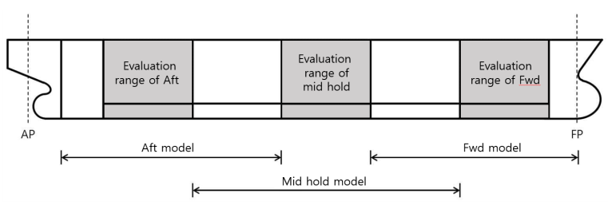
  **Fig 2 Model and evaluation range**
  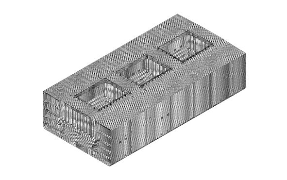
  **Fig 3 Example of structural modelling**
  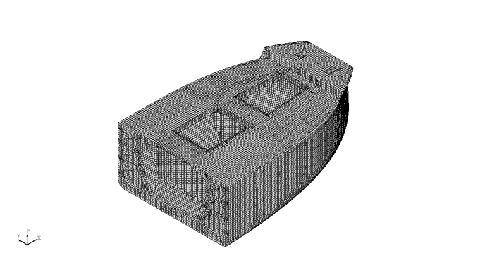
  **Fig 4 Example of Fwd modelling**
  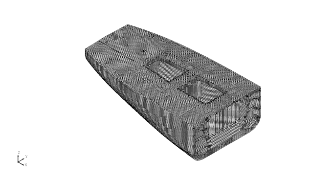
  **Fig 5 Example of Aft model**

#### (B) Structural modelling

The following (a) to (g) apply to element meshing of structural model.

- **(a)** In meshing, proper sizes of meshes are to be selected by predicting the stress distribution in the model, and the aspect ratio should not exceed 3.
- **(b)** Girders and similar members having stress gradients along their depth are to be so meshed as to enable their discrimination.
- **(c)** The length of the short side of each mesh is to be restricted to longitudinal spacing or thereabouts.
- **(d)** All stiffeners are to be modeled as beam elements with axial, torsional, shear, bending stiffness. Also, an offset beam considering the eccentricity of the stiffener should be used.
- **(e)** The flanges of primary support members and brackets are to be modeled using rods or beam elements.
- **(f)** The coordinate system of the model is used as shown in **Table 1**.
- **(g)** The method of indicating openings in the web of primary supporting members is to be in accordance with **Table 2**. If the openings are not modeled, the shear stresses near the openings shall be modified in accordance with the reduction of the shear area along the actual openings. And the modified shear stress should be used to calculate the equivalent stress of the element for verification of the yield criterion.

  |   | Direction | Direction Remark |
  | --- | --- | --- |
  | X | Longitudinal | Positive forward |
  | Y | Transverse | Positive to port |
  | Z | Vertical | Positive upwards from the baseline |

  | $h _{0} /h<0.5$ and $g _{0} <2.0$ | No need to model the openings |
  | --- | --- |
  | $h _{0} /h \geq 0.5$ and $g _{0} \geq 2.0$ | Need to model the openings |
  | Where : $g _{0} =(1+ \frac{l _{0} ^{2}}{2.6(h-h _{0} ) ^{2}} )$ $l _{0}$ : The length of the opening parallel to the longitudinal direction of the primary support member web. ($\mathrm{m}$, see **Fig 6**) For continuous openings where the distance $d _{0}$ between openings is less than $0.25h$, the length $l _{0}$ should be the length across the opening as shown in **Fig 7** $h _{0}$ : Height of opening parallel to the depth direction of the web ($\mathrm{m}$, see **Fig 6** and **Fig 7**) $h$ : Height of primary support member web where opening is located ($\mathrm{m}$, see **Fig 6** and **Fig 7**) |   |

  | 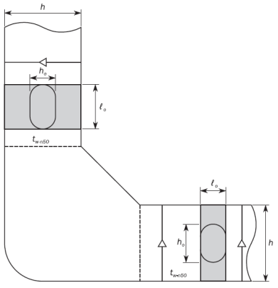 **Fig 6 Opening in the web** **Fig 6 Opening in the web** | 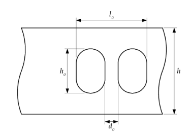 **Fig 7 Opening in the web** **Fig 7 Opening in the web** |
  | --- | --- |

### (3) Boundary condition

#### (A) The boundary conditions and supporting conditions of the structural model should be able to reasonably implement the behavior of the structural model according to the range of the model. Both ends of the model are simply supported in accordance with Table 3 and 4. The joints on the longitudinal strength members at both ends should be rigidly connected to the independent joints on the neutral axis on the ship's centerline as shown in Table 3. The independent nodes at both ends should be fixed as shown in Table 4.

| **Rigid - connection** | **Displacement** |   |   | **Rotation** |   |   |
| --- | --- | --- | --- | --- | --- | --- |
| **Rigid - connection** | $U _{x}$ | $U _{y}$ | $U _{z}$ | $\theta _{x}$ | $\theta _{y}$ | $\theta _{z}$ |
| Longitudinal strength member nodes of front end of model | - | $RL$ | $RL$ | $RL$ | - | - |
| Longitudinal strength member nodes of after end of model | - | $RL$ | $RL$ | $RL$ | - | - |
| $RL$ means that the related degrees of freedom of independent nodes are rigidly connected. |   |   |   |   |   |   |

| **Location of independent nodes** | **Displacement** |   |   | **Rotation** |   |   |
| --- | --- | --- | --- | --- | --- | --- |
| **Location of independent nodes** | $U _{x}$ | $U _{y}$ | $U _{z}$ | $\theta _{x}$ | $\theta _{y}$ | $\theta _{z}$ |
| Independent nodes of front end of model | - | Fix | Fix | Fix | - | - |
| Independent nodes of after end of model | - | Fix | Fix | Fix | - | - |
| Intersection of centerline and inner bottom plate | Fix |   |   |   |   |   |

### (4) Applied loads

#### (A) Internal loads

- **(a)** Loads due to ore cargo, grain cargo, etc. are as follows;
- **(i)** The height and surface of the cargo are to be determined in accordance with below (see **Fig 8, 9** and **10**)
  - The shape of cargo surface is assumed to be horizontal longitudinally and transversely and sloped down straight to the ship's sides with the half angle of repose($\psi$). (If the hold is not uniformed in longitudinally and transversely by hopper sloped angle, it is assumed that the middle section of the cargo hold is uniformed in longitudinally.)
  - The width of the horizontal part $b_iB$ is assumed to be equal to 1/4 of the breadth of the hold.
  - The loading height $h_c$ is determined in accordance with the mass, angle of repose and density of the cargo to be loaded. The shape of cargo surface may be assumed to be unchanged for the whole breadth above.
  - The density and repose angel of cargo should be considered as follows.

  |   | **Density of cargo** $\gamma$ **(**$rm"ton"/m^3$**)** | **Repose angle** $\psi$**(**${}^{\circ}$**)** |
  | --- | --- | --- |
  | Low density cargo | $M ' /V _{H}$ (≥1.0) | 35 |
  | High density cargo | 3.0 | 35^1) |
  | ^1) If there is a repose angle other than 35°, this angle should be additionally considered. |   |   |

  $M '$ : Cargo weight of the cargo hold. The following formula is applied.
  $M ' =M+ \frac{1}{n} Min(3000, 0.1M)$ ($t$)
  $M$ : Maximum permissible bulk cargo weight of the cargo hold ($t$)
  $n$ : Minimum number of loading in one cargo hold
  $V _{H}$ : Volume, in $m ^{3}$, of cargo hold up to level of the intersection of the main deck with the hatch coaming excluding the volume enclosed by hatch coaming.
  
  **Fig 8 Assumed cargo surface (low density)**
  - **(ii)** The loads on the vertical walls of the hold are to be determined by the following formula.
    $w = 9.81 \gamma h K _{C}$ ($\mathrm{kN}/m ^{2}$)
    where;
    $\gamma$ : Density of cargo($\mathrm{kg}/m^3$)
    $h$ : Vertical distance from the panel in consideration to the surface of the cargo right above the panel ($\mathrm{m}$)
    $K _{C}$ : $\cos^2 \beta + (1-\sin \psi ) \sin^2 \beta$
    $\beta$ : Angle between slant plating of the bilge hopper and inner bottom plating(see **Fig 8**)
    $\psi$ : Repose angle (see **Fig 9**)
    - The load of low density cargo on the inner wall of the cargo hold is given by the following formula.
    $h _{c} = h _{HPU} + h _{0}$
    where;
    $h _{0} = S_\frac{A}{B_H}$
    $S_A = S_o + V_\frac{HC}{l_H}$
    $h_HPU$ : Vertical distance ($\mathrm{m}$) between inner bottom and lower intersection of top side tank and side shell or inner side
    $S_o$ : Shaded area ($\mathrm{m}^2$) above the lower intersection of top side tank and side shell or inner side and up to the upper deck level
    $V_HC$ : Volume ($\mathrm{m}^3$) enclosed by the hatch coaming
    - The load of high density cargo on the inner wall of the cargo hold is given by the following formula.
    if $h _{1} \geq 0$ (see **Fig 9**)
    
    **Fig 9 Assumed cargo surface (high density,** #eqnID-3253**)**
    $h _{C} = h _{HPL} + h _{1} + h _{2}$
    Where;
    $h_HPL$ : Vertical distance between inner bottom plate and top intersection of hopper tank and inner plate($\mathrm{m}$)
    $h_1$ : Vertical distance(m) is as follows;
    $h _{1} = \frac{M '}{\rho B _{H} l _{H}} - \frac{B _{H} + b _{IB}}{2 B _{H}} h _{HPL} - \frac{3}{16} B _{H} \tan \frac{\psi}{2} + \frac{V _{TS}}{B _{H} l _{H}}$
    Where;
    $B_H$ : Breadth of cargo hold($\mathrm{m}$)
    $l_H$ : Length of cargo hold($\mathrm{m}$)
    $b_IB$ : Breadth of double bottom($\mathrm{m}$)
    $V_TS$ : The total volume($\mathrm{m}^3$) of the transverse stool at the bottom of the transverse bulkhead within the cargo hold length, $l_H$ considered. In this volume, the volume of the portion of the hopper tank passing through the transverse bulkhead is excluded.
    $h_2$ : The height($\mathrm{m}$) of the upper surface of the bulk cargo along the width, as follows;
    $h_2 = B_\frac{H}{4} \tan \frac{\psi}{2}$, if $0 <= \left| y \right| <= B_\frac{H}{4}$
    $h_2 = \left( \frac{B_H}{2} - \left| y \right| \right) \tan \frac{\psi}{2}$, if $B_\frac{H}{4} <= \left| y \right| <= B_\frac{H}{2}$
    if $h _{1} < 0$ (see **Fig 10**)
    
    **Fig 10 Assumed cargo surface(high density,** #eqnID-3275**)**
    $h _{C} = h _{11} + h _{22}$
    Where;
    $h _{11}$ : Vertical distance(m) is as follows;
    $h _{11} =h _{HPL} \left( \frac{B _{2} -b _{IB}}{B _{H} -b _{IB}} \right)$
    $h _{22}$ : Vertical distance(m) is as follows;
    $h _{22} = \left( \frac{B _{2}}{2} - \frac{B _{H}}{4} \right) \tan \frac{\psi}{2}$
    $B _{2} = \sqrt {\frac{\frac{1}{l _{H}} \left( \frac{M '}{\rho _{c}} +V _{TS} \right) + \frac{1}{2} \left( \frac{h _{HPL} \cdot b _{IB} ^{2}}{B _{H} -b _{IB}} \right) + \frac{B _{H} ^{2}}{16} \tan \frac{\psi}{2}}{\frac{1}{2} \left[ \left( \frac{h _{HPL}}{B _{H} -b _{IB}} \right) + \frac{1}{2} \tan \frac{\psi}{2} \right]}}$
    - In order to evaluate the total force in the vertical direction, shear loads acting on the slope plate of the bilge hopper tank and lower stool by bulk dry bulk cargo are to be taken into account. The shear load acting on the sloped members by the ore cargo in the still water is given by the following formula.
    $w _{sh} =9.81 \gamma \frac{(1-K _{C} )(h _{C} +h _{DB} -z)}{\tan \beta}$($\mathrm{kN}/m ^{2}$)
    where;
    $z$ : vertical distance from inner bottom plate to considered point
- **(b)** Loads due to ballast water
  The water head of the each location in ballast hold is to be determined by the following formula.
  $h_W = \mathrm{Max}(0.85(h + \Delta h) , h)$ ($\mathrm{m}$)
  where;
  $h$ : Vertical distance measured from the position under consideration to 1/2 of overflow pipes($\mathrm{m}$)
  $\Delta h$: The value is to be obtained from following formula;
  $\Delta h = 16/L (l_t - 10) + 0.25(b_t - 10)$
  $l_t$ : tank length ($\mathrm{m}$). however, where it is less than 10 ($\mathrm{m}$), it is to be taken as 10.
  $b_t$ : tank breadth ($\mathrm{m}$). however, where it is less than 10 ($\mathrm{m}$), it is to be taken as 10.
- **(c)** Load under hydrostatic test
  The water head of the tank to be subjected to the hydrostatic test should be the tank top + 2.4 $\mathrm{m}$

#### (B) Hydrostatic pressure

The hydrostatic pressure is to be in accordance with **Pt. 3 Annex 3-2, III 1** (8).

#### (C) Wave loads

The wave loads are to be in accordance with **Pt. 3 Annex 3-2, III 1** (9).

#### (D) Hull weight

Consider the self weight of the hull considering gravitational acceleration.

#### (E) Load due to upper structure

If the upper structure is included in structural model, the load considered with acceleration of gravity are to be considered. If the upper structure is not included in structural model, loads on upper structure are to be distributed on relevant deck nodes.
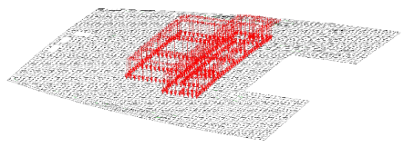
**Fig 11 Loads due to upper structure**

#### (F) Load due to the main engine

The loads due to the main engine are to be distributed on relevant nodes of M/E foundation.
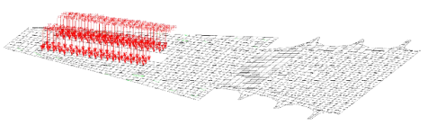
**Fig 12 Loads due to main engine**

#### (G) Consideration of hull girder shear force

- **(a)** The hull girder shear force is to be calculated at the position of the transverse bulkhead of the mid hold, and the target value is determined as follows. In addition, the sign in each transverse bulkhead is applied in the same way as the loading conditions in **Table 5, 6** and **7**.
  $Q _{targ} =F _{s} +F _{w}$
  where:
  $F _{s}$ : shear force in still water ($\mathrm{kN}$)
  $F _{w}$ : wave shear force according to **Pt 3, Ch. 3, 301.**
- **(b)** For mid hold, shear force is to comply with **Pt 13, Sub-Pt. 1, Ch. 7 Sec. 2.** For Fwd and Aft hold, shear force is to comply with **Pt 13, Sub-Pt. 1, Ch. 7 Sec. 2.**
- **(c)** The direct calculation of the shear flow is to comply with **Pt 13, Sub-Pt. 1, Ch. 5, Annex 1.**

#### (H) Considering of hull girder vertical bending moment

- **(a)** The hull girder vertical bending moment is adjusted after adjusting the shear force.
- **(b)** In the analysis of the vertical bending moment, the target hull girder vertical bending moment is the maximum vertical bending moment that can occur at the center of the mid hold in the finite element model. The target value of the hull girder vertical bending moment is obtained as follows.
  $M _{v-targ} =M _{s} +M _{w}$
  where;
  $M _{s}$ : vertical bending moment in still water ($\mathrm{kNm}$)
  $M _{w}$ : wave vertical bending moment according to **Pt 3, Ch. 3 Table 3.3.1**
- **(c)** The distribution of hull girder vertical bending moments caused by local loads applied to the model is calculated using simple beam theory in accordance with **Pt. 13, Sub-Pt. 1, Ch. 7, Sec. 2.**
- **(d)** If the target vertical bending moment has to be reached, an additional vertical bending moment should be applied to both ends of the hold model to generate this target value in the center hold of the model. These end vertical bending moments are as follows.
  $M _{Y-aft} =M _{v-targ} -M _{"V_FEM"} (x _{v-"\max"} )$
  $M _{Y-fwd} =-M _{Y-aft}$
  where
  $x _{v-"\max"}$ : Longitudinal position where maximum bending moment occurs due to local load in mid hold($\mathrm{m}$)
  $M _{Y-fwd}$ : additional vertical bending moments applied to the forward end of the finite element model ($\mathrm{kNm}$)
  $M _{Y-aft}$ : additional vertical bending moments applied to the after end of the finite element model ($\mathrm{kNm}$)
  $M _{V-peak}$ : maximum or minimum bending moments in the mid hold by local load and shear force adjustment ($\mathrm{kNm}$)
- **(e)** The vertical bending moment adjustment procedure for the fore and aft part structural analysis is to comply with the requirements in **Pt. 13, Sub-Pt. 1, Ch. 7 Sec. 2. and 4.4.9.**

#### (I) Load case

The loading conditions to be considered are based on loading (high / low density), ballast loading, multi port loading and port loading. If special load cases are to be expected, such loading conditions are also included in the calculation. The load case for mid hold, aft hold and fwd hold are shown in **Table 5, 6** and **7**. Load cases may be changed according to loading manual, loading sequence and compartment layout. If there is no multi port cases in the loading manual, the multi port cases in **Table 5, 6** and **7** can be omitted and is given the **no MP** notation.

| **Condition** | **No** | **Description** | **Draft** | **Wave** **load** | **Internal load** | **Loading pattern** | **Target bending moment and shear force** |   |   |   |
| --- | --- | --- | --- | --- | --- | --- | --- | --- | --- | --- |
| **Condition** | **No** | **Description** | **Draft** | **Wave** **load** | **Internal load** | **Loading pattern** | **% of M_s** | **% of M_w** | **% of F_s** | **% of F_w** |
| at sea | 1 | Full load (1) | T_s | Trough | High/Low density | 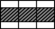 | 100% (Sag) | 100% (Sag) | - | - |
| at sea | 2 | Full load (2) | T_s | Crest | High/Low density |  | 0%^11) | 100% (Hog) | - | - |
| at sea | 3 | Ballast (Normal) | T*_bal* | Crest | - |  | 100% (Hog) | 100% (Hog) | - | - |
| at sea | 4 | Ballast (Heavy) | T_bar-H | Crest | - | 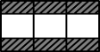 | 100% (Hog) | 100% (Hog) | - | - |
| at sea | 5 | Multi port (1) | T_multi-min^1) | Trough | High/Low density | 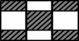 | 100% (Sag) | 100% (Sag) | - | - |
| at sea | 6 | Multi port (2) | T_multi-min^1) | Crest | High/Low density |  | 0%^11) | 100% (Hog) | - | - |
| at sea | 7 | Multi port (3) | T_multi-max^2) | Trough | High/Low density | 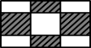 | 0%^11) | 100% (Sag) | - | - |
| at sea | 8 | Multi port (4) | T_multi-max^2) | Crest | High/Low density |  | 100% (Hog) | 100% (Hog) | - | - |
| at sea | 9 | Multi port (5)^7) | T_multi-min^1) | Trough | High/Low density | 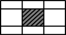 | 100% (Sag) | 100% (Sag) | Fore^5) : +100% | Fore^5) : +100% |
| at sea | 9 | Multi port (5)^7) | T_multi-min^1) | Trough | High/Low density |   | 100% (Sag) | 100% (Sag) | Aft^6) : -100% | Aft^6) : -100% |
| at sea | 10 | Multi port (6)^8) | T_multi-max^2) | Crest | High/Low density | 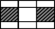 | 100% (Hog) | 100% (Hog) | Fore^5) : -100% | Fore^5) : -100% |
| at sea | 10 | Multi port (6)^8) | T_multi-max^2) | Crest | High/Low density |   | 100% (Hog) | 100% (Hog) | Aft^6) : +100% | Aft^6) : +100% |
| at sea | 11 | Multi port (7) | T_multi-min^1) | Trough | High/Low density | 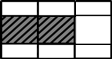 | 100% (Sag) | 100% (Sag) | - | - |
| at sea | 12 | Multi port (8) | T_multi-min^1) | Crest | High/Low density |  | 0%^11) | 100% (Hog) | - | - |
| at sea | 13 | Multi port (9) | T_multi-min^1) | Trough | High/Low density | 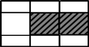 | 100% (Sag) | 100% (Sag) | - | - |
| at sea | 14 | Multi port (10) | T_multi-min^1) | Crest | High/Low density |  | 0%^11) | 100% (Hog) | - | - |
| at sea | 15 | Multi port (11) | T_multi-max^2) | Trough | High/Low density |  | 0%^11) | 100% (Sag) | - | - |
| at sea | 16 | Multi port (12) | T_multi-max^2) | Crest | High/Low density | 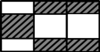 | 100% (Hog) | 100% (Hog) | - | - |
| at sea | 17 | Multi port (13) | T_multi-max^2) | Trough | High/Low density | 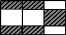 | 0%^11) | 100% (Sag) | - | - |

| **Condition** | **No** | **Description** | **Draft** | **Wave load** | **Internal load** | **Loading pattern** | **Target bending moment and shear force** |   |   |   |
| --- | --- | --- | --- | --- | --- | --- | --- | --- | --- | --- |
| **Condition** | **No** | **Description** | **Draft** | **Wave load** | **Internal load** | **Loading pattern** | **% of M_s** | **% of M_w** | **% of F_s** | **% of F_w** |
| at sea | 18 | Multi port (14)^7) | T_multi-max^2) | Crest | High/Low density |  | 100% (Hog) | 100% (Hog) | - | - |
| port | 19 | Port (1) | T_harbour-min^3) | Hydrostatic pressure | High/Low density |  | 100% (Sag) | - | - | - |
| port | 20 | Port (2) | T_harbour-max^4) | Hydrostatic pressure | High/Low density |  | 100% (Hog) | - | - | - |
| port | 21 | Port (3)^9) | T_harbour-min^3) | Hydrostatic pressure | High/Low density | 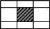 | 100% (Sag) | - | Fore^5) : +100% | - |
| port | 21 | Port (3)^9) | T_harbour-min^3) | Hydrostatic pressure | High/Low density |   | 100% (Sag) | - | Aft^6) : -100% | - |
| port | 22 | Port (4)^10) | T_harbour-max^4) | Hydrostatic pressure | High/Low density | 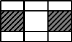 | 100% (Hog) | - | Fore^5) : -100% | - |
| port | 22 | Port (4)^10) | T_harbour-max^4) | Hydrostatic pressure | High/Low density |   | 100% (Hog) | - | Aft^6) : +100% | - |
| port | 23 | Port (5) | T_harbour-min^3) | Hydrostatic pressure | High/Low density | 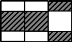 | 100% (Sag) | - |   |   |
| port | 24 | Port (6) | T_harbour-min^3) | Hydrostatic pressure | High/Low density | 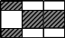 | 100% (Sag) | - | - | - |
| port | 25 | Port (7) | T_harbour-max^4) | Hydrostatic pressure | High/Low density | 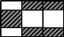 | 100% (Hog) | - | - | - |
| port | 26 | Port (8) | T_harbour-max^4) | Hydrostatic pressure | High/Low density | 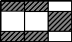 | 100% (Hog) | - | - | - |
| tank | 27 | Tank test (1) | T_sc/3 | Hydrostatic pressure | - | 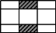 | - | - | - | - |
| tank | 28 | Tank test (2) | T_sc/3 | Hydrostatic pressure | - | 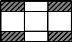 | - | - | - | - |
| (Note) The load cases can be changed / added in accordance with the loading manual. If there is no multi port cases in the loading manual, the multi port cases in **Table 5** can be omitted and is given the **no MP** notation. 1) $T _{"multi-\min"}$ : meet the maximum allowable cargo mass (see(9)) 2) $T _{"multi-\max"}$ : meet the minimum required cargo mass (see(9)) 3) $T _{"harbour-\min"}$ : meet the maximum allowable cargo mass (see(9)) 4) $T _{"harbour-\max"}$ : meet the minimum allowable cargo mass (see(9)) 5) Fore : The sign of the target shear force of forward transverse bulkhead of the center hold 6) Aft : The sign of the target shear force of aftward transverse bulkhead of the center hold 7) If this loading condition is not taken into account, it should be evaluated in the loading condition of the Multi port (1) condition. 8) If this loading condition is not taken into account, it should be evaluated in the loading condition of the Multi port (4) condition. 9) If this loading condition is not taken into account, it should be evaluated in the loading condition of the Port (1) condition. 10) If this loading condition is not taken into account, it should be evaluated in the loading condition of the Port (2) condition. 11) 0%* : Refer to loading manual. |   |   |   |   |   |   |   |   |   |   |

| **Condition** | **No** | **Description** | **Draft** | **Wave load** | **Internal load** | **Loading pattern** | **Target bending moment and shear force** |   |   |   |
| --- | --- | --- | --- | --- | --- | --- | --- | --- | --- | --- |
| **Condition** | **No** | **Description** | **Draft** | **Wave load** | **Internal load** | **Loading pattern** | **% of M_s** | **% of M_w** | **% of F_s** | **% of F_w** |
| at sea | 1 | Full load (1) | T_s | Trough | High/Low density | 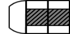 | 100% (Sag) | 100% (Sag) | - | - |
| at sea | 2 | Full load (2) | T_s | Crest | High/Low density |  | 0%^9) | 100% (Hog) | - | - |
| at sea | 3 | Ballast (Normal) | T_bal | Crest | - | 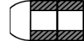 | 100% (Hog) | 100% (Hog) | - | - |
| at sea | 4 | Ballast (Heavy) | T_bal-H | Crest | - |  | 100% (Hog) | 100% (Hog) | - | - |
| at sea | 5 | Multi port (1) | T_multi-min^1) | Trough | High/Low density | 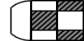 | 100% (Sag) | 100% (Sag) | - | - |
| at sea | 6 | Multi port (2) | T_multi-min^1) | Crest | High/Low density |  | 0%^9) | 100% (Hog) | - | - |
| at sea | 7 | Multi port (3) | T_multi-max^2) | Trough | High/Low density |  | 0%^9) | 100% (Sag) | - | - |
| at sea | 8 | Multi port (4) | T_multi-max^2) | Crest | High/Low density |  | 100% (Hog) | 100% (Hog) | - | - |
| at sea | 9 | Multi port (5)^7) | T_multi-min^1) | Crest | High/Low density | 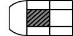 | 100% (Sag) | 100% (Sag) | Fore^5): +100% | Fore^5): +100% |
| at sea | 9 | Multi port (5)^7) | T_multi-min^1) | Crest | High/Low density |   | 100% (Sag) | 100% (Sag) | Aft^6) : -100% | Aft^6) : -100% |
| at sea | 10 | Multi port (6) | T_multi-max^2) | Crest | High/Low density | 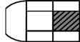 | 100% (Hog) | 100% (Hog) | - | - |
| port | 11 | Port (1) | T_harbour-min^3) | Hydrostatic pressure | High/Low density |  | 100% (Sag) | - | - | - |
| port | 12 | Port (2) | T_harbour-max^4) | Hydrostatic pressure | High/Low density |  | 100% (Hog) | - | - | - |
| port | 13 | Port (3)^8) | T_harbour-min^3) | Hydrostatic pressure | High/Low density |  | 100% (Sag) | - | Fore^5): +100% | - |
| port | 13 | Port (3)^8) | T_harbour-min^3) | Hydrostatic pressure | High/Low density |   | 100% (Sag) | - | Aft^6): -100% | - |
| port | 14 | Port (4) | T_harbour-max^4) | Hydrostatic pressure | High/Low density |  | 100% (Hog) | - | - | - |

| **Condition** | **No** | **Description** | **Draft** | **Wave load** | **Internal load** | **Loading pattern** | **Target bending moment and shear force** |   |   |   |
| --- | --- | --- | --- | --- | --- | --- | --- | --- | --- | --- |
| **Condition** | **No** | **Description** | **Draft** | **Wave load** | **Internal load** | **Loading pattern** | **% of M_s** | **% of M_w** | **% of F_s** | **% of F_w** |
| tank | 15 | Tank test (1) | T_sc/3 | Hydrostatic pressure | - | 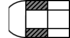 | - | - | - | - |
| tank | 16 | Tank test (2) | T_sc/3 | Hydrostatic pressure | - | 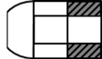 | - | - | - | - |
| (Note) The load cases can be changed / added in accordance with the loading manual. If there is no multi port cases in the loading manual, the multi port cases in **Table 6** can be omitted and is given the **no MP** notation. 1) $T _{"multi-\min"}$ : meet the maximum allowable cargo mass (see(9)) 2) $T _{"multi-\max"}$ : meet the minimum required cargo mass (see(9)) 3) $T _{"harbour-\min"}$ : meet the maximum allowable cargo mass (see(9)) 4) $T _{"harbour-\max"}$ : meet the minimum allowable cargo mass (see(9)) 5) Fore : The sign of the target shear force of forward transverse bulkhead of the center hold 6) Aft : The sign of the target shear force of aftward transverse bulkhead of the center hold 7) If this loading condition is not taken into account, it should be evaluated in the loading condition of the Multi port (1) condition. 8) If this loading condition is not taken into account, it should be evaluated in the loading condition of the Port (1) condition. 9) 0%* : Refer to loading manual. |   |   |   |   |   |   |   |   |   |   |

| **Condition** | **No** | **Description** | **Draft** | **Wave load** | **Internal load** | **Loading pattern** | **Target bending moment and shear force** |   |   |   |
| --- | --- | --- | --- | --- | --- | --- | --- | --- | --- | --- |
| **Condition** | **No** | **Description** | **Draft** | **Wave load** | **Internal load** | **Loading pattern** | **% of M_s** | **% of M_w** | **% of F_s** | **% of F_w** |
| at sea | 1 | Full load (1) | T_s | Trough | High/Low density | 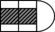 | 100% (Sag) | 100% (Sag) | - | - |
| at sea | 2 | Full load (2) | T_s | Crest | High/Low density |  | 0%^9) | 100% (Hog) | - | - |
| at sea | 3 | Ballast (Normal) | T_bal | Crest | - | 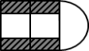 | 100% (Hog) | 100% (Hog) | - | - |
| at sea | 4 | Ballast (Heavy) | T_bal-H | Crest | - |  | 100% (Hog) | 100% (Hog) | - | - |
| at sea | 5 | Multi port (1) | T_multi-min^1) | Trough | High/Low density |  | 100% (Sag) | 100% (Sag) | - | - |
| at sea | 6 | Multi port (2) | T_multi-min^1) | Crest | High/Low density |  | 0%^9) | 100% (Hog) | - | - |
| at sea | 7 | Multi port (3) | T_multi-max^2) | Trough | High/Low density | 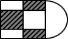 | 0%^9) | 100% (Sag) | - | - |
| at sea | 8 | Multi port (4) | T_multi-max^2) | Crest | High/Low density |  | 100% (Hog) | 100% (Hog) | - | - |
| at sea | 9 | Multi port (5)7) | T_multi-min^1) | Trough | High/Low density | 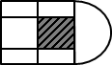 | 100% (Sag) | - | Fore^5) : +100% | - |
| at sea | 9 | Multi port (5)7) | T_multi-min^1) | Trough | High/Low density |   | 100% (Sag) | - | Aft^6) : -100% | - |
| at sea | 10 | Multi port (6) | T_multi-max^1) | Crest | High/Low density |  | 100% (Hog) | - | - | - |
| port | 11 | Port (1) | T_harbour-min^3) | Hydrostatic pressure | High/Low density | 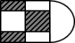 | 100% (Sag) | - | - | - |
| port | 12 | Port (2) | T_harbour-max^4) | Hydrostatic pressure | High/Low density |  | 100% (Hog) | - | - | - |
| port | 13 | Port (3)^8) | T_harbour-min^3) | Hydrostatic pressure | High/Low density | 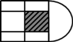 | 100% (Sag) | - | Fore^5) : +100% | - |
| port | 13 | Port (3)^8) | T_harbour-min^3) | Hydrostatic pressure | High/Low density |   | 100% (Sag) | - | Aft^6) : -100% | - |

| **Condition** | **No** | **Description** | **Draft** | **Wave load** | **Internal load** | **Loading pattern** | **Target bending moment and shear force** |   |   |   |
| --- | --- | --- | --- | --- | --- | --- | --- | --- | --- | --- |
| **Condition** | **No** | **Description** | **Draft** | **Wave load** | **Internal load** | **Loading pattern** | **% of M_s** | **% of M_w** | **% of F_s** | **% of F_w** |
| port | 14 | Port (4) | T_harbour-max^4) | Hydrostatic pressure | High/Low density |  | 100% (Hog) | - | - | - |
| tank | 15 | Tank test (1) | T_sc/3 | Hydrostatic pressure | - |  | - | - | - | - |
| tank | 16 | Tank test (2) | T_sc/3 | Hydrostatic pressure | - | 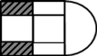 | - | - | - | - |
| (Note) The load cases can be changed / added in accordance with the loading manual. If there is no multi port cases in the loading manual, the multi port cases in **Table 7** can be omitted and is given the **no MP** notation. 1) $T _{"multi-\min"}$ : meet the maximum allowable cargo mass (see(9)) 2) $T _{"multi-\max"}$ : meet the minimum required cargo mass (see(9)) 3) $T _{"harbour-\min"}$ : meet the maximum allowable cargo mass (see(9)) 4) $T _{"harbour-\max"}$ : meet the minimum allowable cargo mass (see(9)) 5) Fore : The sign of the target shear force of forward transverse bulkhead of the center hold 6) Aft : The sign of the target shear force of aftward transverse bulkhead of the center hold 7) If this loading condition is not taken into account, it should be evaluated in the loading condition of the Multi port (1) condition. 8) If this loading condition is not taken into account, it should be evaluated in the loading condition of the Port (1) condition. 9) 0%* : Refer to loading manual. |   |   |   |   |   |   |   |   |   |   |

### (5) Consideration of dynamic shear loads in beam sea condition

#### (A) General

- **(a)** In order to verify the structural integrity of transverse members under dynamic shear load due to rolling motion and high GM in beam sea condition, BSR and BSP load cases are to be applied as shown in **Table 8** and **Table 9.** BSR and BSP load cases means as follows;
  - BSR-1P and BSR-2P : Beam sea EDWs that minimise and maximise the roll motion downward and upward on the port side respectively with waves from the port side.
  - BSR-1S and BSR-2S : Beam sea EDWs that maximise and minimise the roll motion downward and upward on the starboard side respectively with waves from the starboard side.
  - BSP-1P and BSP-2P : Beam sea EDWs that maximise and minimise the hydrodynamic pressure at the waterline amidships on the port side respectively.
  - BSP-1S and BSP-2S : Beam sea EDWs that maximise and minimise the hydrodynamic pressure at the waterline amidships on the starboard side respectively.
- **(b)** These BSR and BSP load cases are to be applied to homogeneous loading with $\gamma =3.0$ ($rm"ton"/m^3$) of high density cargo for mid hold model only. The loading pattern described in No. 1 condition of **Table 5.** should be applied.

#### (B) Applied loads

- **(a)** The symbol’s definitions in BSR and BSP load cases are following;
  $T_\theta$ : The roll period, in s, is to be taken as;
  $T _{\theta } = \frac{2.3 \pi k _{r}}{\sqrt {g GM}}$.
  where;
  $k _{r}$ : Roll radius of gyration, in $\mathrm{m}$, in the considered loading condition. 0.25B is to be adopted unless provided in the loading manual.
  $GM$ : Metacentric height, in $\mathrm{m}$, in the considered loading condition. 0.20B is to be adopted unless provided in the loading manual.
  $g : 9.81 \mathrm{m}/s ^{2}$
  $\theta$ : The roll angle, in deg, is to be taken as ;
  $\theta = \frac{9000(1.25-0.025 T _{\theta } )f _{BK}}{(B+75) \pi}$
  where;
  $f_BK$ : To be taken as:
  $f_BK =1.2$ for ships without bilge keel.
  $f _{BK} =1.0$ for ships with bilge keel.
  $T _{\phi}$ : The pitch period, in s, is to be taken as:
  $T _{\phi } = \sqrt {\frac{2.6 \pi L}{g}}$
  $\phi$ : The pitch angle, in deg, is to be taken as:
  $\phi =1350 L ^{-0.94 } \left\{ 1 + \frac{3.0}{\sqrt {gL}} \right\}$
  $a _{0}$ : Acceleration parameter, to be taken as:
  $a _{0} =(1.58-0.47C _{B} ) \left( \frac{2.4}{\sqrt {L}} + \frac{34}{L} - \frac{600}{L ^{2}} \right)$
  $x, y, z$ : $X$, $Y$ and $Z$ coordinates, in $\mathrm{m}$, of the considered point at the intersection among the longitudinal plane of symmetry of ship, the aft end of L and the baseline.
  $R$ : Vertical coordinate, in m, of the ship rotation centre, to be taken as:
  $R = \min \left( \frac{D}{4} + \frac{T _{SC}}{2} , \frac{D}{2} \right)$
  $T _{SC}$ : Scantling draught
  $f _{\beta }$ : Heading correction factor, to be taken as:
  $f _{\beta } =0.8$ for BSR and BSP load cases for the extreme sea loads design load scenario.

  | Loadcase | BSR-1P | BSR-2P | BSR-1S | BSR-2S | BSP-1P | BSP-2P | BSP-1S | BSP-2S |
  | --- | --- | --- | --- | --- | --- | --- | --- | --- |
  | EDW | BSR |   |   |   | BSP |   |   |   |
  | Heading | Beam |   |   |   | Beam |   |   |   |
  | Effect | Max. roll |   |   |   | Max. pressure at waterline |   |   |   |
  | VWBM | Sagging | Hogging | Sagging | Hogging | Sagging | Hogging | Sagging | Hogging |
  | VWSF | Negative-aft Positive-fore | Positive-aft Negative-fore | Negative-aft Positive-fore | Positive-aft Negative-fore | Negative-aft Positive-fore | Positive-aft Negative-fore | Negative-aft Positive-fore | Positive-aft Negative-fore |
  | HWBM | Stbd tensile | Port tensile | Port tensile | Stbd tensile | Stbd tensile | Port tensile | Port tensile | Stbd tensile |
  | Surge | - | - | - | - | To bow | To stern | To bow | To stern |
  | $a _{surge}$ | - | - | - | - |  |  |  |  |
  | Sway | To starboard | To Portside | To Portside | To starboard | To Portside | To starboard | To starboard | To Portside |
  | $a_{sway }$ | 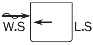 |  |  |  | 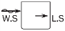 |  | 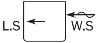 |  |
  | Heave | Down | Up | Down | Up | Down | Up | Down | Up |
  | $a _{heave}$ | 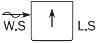 |  |  |  |  | 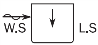 |  |  |
  | Roll | Portside down | Portside up | Starboard down | Starboard up | Portside up | Portside down | Starboard up | Starboard down |
  | $a _{roll}$ |  |  |  |  |  |  |  | 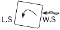 |
  | Pitch | Bow up | Bow down | Bow up | Bow down | Bow up | Bow down | Bow up | Bow down |
  | $a _{p i tch}$ |  |  |  |  |  |  |  |  |
  | Note) VWBM & VWSF : Vertical bending moment and shear force are to be taken as defined in **Pt. 3, Ch 3.** HWBM : Horizontal bending moment is to be taken as defined in **(B)** $WS$ : Weather side, side of the ship exposed to the incoming waves. $LS$ : Lee side, sheltered side of the ship away from the incoming waves. |   |   |   |   |   |   |   |   |
- **(b)** The accelerations due to ship motion are follows;
  Surge acceleration due to surge, in $\mathrm{m}/s^2$, is to be taken as:
  $a _{surge} =0.25 a _{0} g$
  Sway acceleration due to sway, in $\mathrm{m}/s^2$, is to be taken as:
  $a _{sway} =0.55 a _{0} g$
  Heave (vertical) acceleration due to heave, in $\mathrm{m}/s^2$, is to be taken as:
  $a _{heave} = a _{0} g$

  | Load component |   | LCF | BSR-1P | BSR-2P | BSR-1S | BSR-2S | BSP-1P | BSP-2P | BSP-1S | BSP-2S |
  | --- | --- | --- | --- | --- | --- | --- | --- | --- | --- | --- |
  | Hull girder loads C_WH값 하향 Fitting하여 0.4로 수정. | $M _{wv}$ | $C _{WV}$ | -0.1 | 0.1 | -0.1 | 0.1 | -0.4 | 0.4 | -0.4 | 0.4 |
  | Hull girder loads C_WH값 하향 Fitting하여 0.4로 수정. | $Q _{wv}$ | $C _{QW}$ | 0.1 | -0.1 | 0.1 | -0.1 | 0.3 | -0.3 | 0.3 | -0.3 |
  | Hull girder loads C_WH값 하향 Fitting하여 0.4로 수정. | $M _{wh}$ | $C _{WH}$ | 0.4 | -0.4 | -0.4 | 0.4 | 0.4 | -0.4 | -0.4 | 0.4 |
  | Longitudinal accelerations | $a _{surge}$ | $C _{XS}$ | 0.0 | 0.0 | 0.0 | 0.0 | -0.15 | 0.15 | -0.15 | 0.15 |
  | Longitudinal accelerations | $a _{"pitch-x"}$ | $C _{XP}$ | 0.4 | -0.4 | 0.4 | -0.4 | 0.45 | -0.45 | 0.45 | -0.45 |
  | Longitudinal accelerations | $gsin \phi$ | $C _{XG}$ | -0.3 | 0.3 | -0.3 | 0.3 | -0.25 | 0.25 | -0.25 | 0.25 |
  | Transverse accelerations | $a _{sway}$ | $C _{YS}$ | 0.5 | -0.5 | -0.5 | 0.5 | 0.4 | -0.4 | -0.4 | 0.4 |
  | Transverse accelerations | $a _{roll-y}$ | $C _{YR}$ | 1.0 | -1.0 | -1.0 | 1.0 | 1.0 | -1.0 | -1.0 | 1.0 |
  | Transverse accelerations | $gsin \theta$ | $C _{YG}$ | -1.0 | 1.0 | 1.0 | -1.0 | -0.9 | 0.9 | 0.9 | -0.9 |
  | Vertical accelerations | $a _{heave}$ | $C _{ZH}$ | -0.25 | 0.25 | -0.25 | 0.25 | 0.5 | -0.5 | 0.5 | -0.5 |
  | Vertical accelerations | $a _{roll-z}$ | $C _{ZR}$ | 1.0 | -1.0 | 1.0 | -1.0 | 1.0 | -1.0 | -1.0 | 1.0 |
  | Vertical accelerations | $a _{"pitch-z"}$ | $C _{ZP}$ | 0.4 | -0.4 | 0.4 | -0.4 | 0.45 | -0.45 | 0.45 | -0.45 |

  Roll acceleration, $a _{roll}$, in $\mathrm{rad}/s ^{2}$, is to be taken as:
  $a _{roll} = \theta \frac{\pi}{180} \left( \frac{2 \pi}{T _{\theta }} \right) ^{2}$.
  Pitch acceleration, $a _{"pitch"}$, in $\mathrm{rad}/s ^{2}$, is to be taken as:
  $a _{"pitch"} =1.5 \phi \frac{\pi}{180} \left( \frac{2 \pi}{T _{\phi }} \right) ^{2}$
  The accelerations used to derive the inertial loads at any position are defined with respect to the ship fixed coordinate system. Hence the acceleration values include the gravitational acceleration components due to the instantaneous roll angles.
  The longitudinal acceleration at any position for each dynamic load case, in $\mathrm{m}/s ^{2}$, is to be taken as:
  $a _{X} =-C _{XG} g \sin \phi +C _{XS} a _{surge } +C _{XP} a _{"pitch"} (z-R)$
  The transverse acceleration at any position for each dynamic load case, in $\mathrm{m}/s ^{2}$, is to be taken as:
  $a _{Y} =C _{YG} g \sin \theta +C _{YS} a _{sway} -C _{YR} a _{roll} (z-R)$
  The vertical acceleration at any position for each dynamic load case, in $\mathrm{m}/s ^{2}$, is to be taken as:
  $a _{Z} =C _{ZH} a _{heave} +C _{ZR} a _{roll} y -C _{ZP} a _{"pitch"} (x-0.45L)$
- **(c)** Hull girder loads
  The wave induced vertical bending moment and shear force are to be taken as defined in (G) and (H) in (4). The horizontal wave bending moment at any longitudinal position, in kNm, is to be taken as:
  $M _{wh} = f _{nlh} \left( 0.31+ \frac{L}{2800} \right) f _{m} C _{"w"} L ^{2} T _{SC} C _{B}$
  where:
  $f _{nlh}$ : Coefficient considering nonlinear effect to be taken as: $f _{nlh} =0.9$
  $f _{m}$ : Distribution factor is to be taken as;
  
  $C _{w}$ : Wave coefficient, in $\mathrm{m}$, to be taken as:
  $C _{w} =10.75-left( \frac{300-L}{100} right) ^{1.5}$ for $90 \leq L \leq 300$
  $C _{w} =10.75$ for $300\(C _{w} =10.75- \left( \frac{L-350}{150} \right) ^{1.5}$ for \(350
- **(d)** Hydrodynamic pressure for BSR load cases
  The wave pressures, $P _{W}$, for BSR-1 and BSR-2 load cases, at any load point, in $\mathrm{kN}/m ^{2}$, are to be obtained from **Table 10**, Fig 13 and 14. Total external pressure is to be calculated by $P _{S} +P _{W}$,, $P _{S}$ means still water hydrostatic pressure for considered loading condition.

  |   | Wave pressure, in $\mathrm{kN}/m ^{2}$ |   |   |
  | --- | --- | --- | --- |
  | Load case | $z \leq T _{SC}$ | $T _{SC} \(z >h _{W} +T _{SC}$ |   |
  | BSR-1P | $P _{W} =\max (P _{BSR} , \rho g (z-T _{SC} ))$ | $P _{W} =P _{W,WL} - \rho g(z-T _{SC} )$ | $P _{W} = 0.0$ |
  | BSR-2P | $P _{W} =\max (-P _{BSR} , \rho g (z-T _{SC} ))$ | $P _{W} =P _{W,WL} - \rho g(z-T _{SC} )$ | $P _{W} = 0.0$ |
  | BSR-1S | $P _{W} =\max (P _{BSR} , \rho g (z-T _{SC} ))$ | $P _{W} =P _{W,WL} - \rho g(z-T _{SC} )$ | $P _{W} = 0.0$ |
  | BSR-2S | $P _{W} =\max (-P _{BSR} , \rho g (z-T _{SC} ))$ | $P _{W} =P _{W,WL} - \rho g(z-T _{SC} )$ | $P _{W} = 0.0$ |

  where;
  For BSR-1P and BSR-2P load cases:
  $P _{BSR} =f _{\beta } f _{R} f _{nl} k _{a} k _{p} \left[ 9 y \sin \theta + \left( -0.95 f _{yB} - 2f _{zT } -0.2 \right) C _{W} \sqrt {\frac{L+ \lambda -125}{L}} \right]$
  For BSR-1S and BSR-2S load cases:
  $P _{BSR} =f _{\beta } f _{R} f _{nl} k _{a} k _{p} \left[ -9 y \sin \theta + \left( -0.95 f _{yB} - 2f _{zT } -0.2 \right) C _{W} \sqrt {\frac{L+ \lambda -125}{L}} \right]$
  $f _{R}$ : Factor related to the operational profile, to be taken as : $f _{R} =0.85$
  $f _{nl}$ : Coefficient considering non-linear effect, to be taken as :
  $f _{nl} =1.0$
  $k _{a } =k _{a-WL} f _{yB} + k _{a-CL} \left( 1-f _{yB} \right)$
  $k _{p } =k _{p-WL} f _{yB} + k _{p-CL} \left( 1-f _{yB} \right)$
  Phase coefficient, $k _{a-WL}$, $k _{a-CL}$, $k _{p-WL}$ and $k _{p-CL}$ are to be taken as following; Intermediate values are to be interpolated.
  - Port side of BSR-1P and BSR-2P or starboard side BSR-1S and BSR-2S

  | $f _{xL}$ | 0.0 | 0.2 | 0.35 | 0.5 | 0.7 | 1.0 |
  | --- | --- | --- | --- | --- | --- | --- |
  | $k _{a-WL}$ | 0.4 | 0.9 | 1.05 | 1.0 | 0.9 | 0.6 |

  | $f _{xL}$ | 0.0 | 0.15 | 0.3 | 0.6 | 0.85 | 1.0 |
  | --- | --- | --- | --- | --- | --- | --- |
  | $k _{p-WL}$ | 2.0 | 2.0 | 1.6 | 1.0 | 1.0 | -1.0 |

  - Port side of BSR-1S and BSR-2S or starboard side BSR-1P and BSR-2P

  | $f _{xL}$ | 0 | 0.3 | 0.5 | 0.65 | 0.8 | 1.0 |
  | --- | --- | --- | --- | --- | --- | --- |
  | $k _{a-WL}$ | 0.2 | 0.75 | 1. | 1.1 | 1.0 | 0.8 |

  | $f _{xL}$ | 0.0 | 0.1 | 0.2 | 0.4 | 0.6 | 0.8 | 1.0 |
  | --- | --- | --- | --- | --- | --- | --- | --- |
  | $k _{p-WL}$ | 0.95 | 0.9 | 0.7 | 1.0 | 1.0 | 0.9 | 1.0 |

  - Center line

  | $f _{xL}$ | 0.0 | 0.2 | 0.4 | 0.6 | 0.85 | 1.0 |
  | --- | --- | --- | --- | --- | --- | --- |
  | $k _{a-CL}$ | 1.5 | 1.5 | 1.0 | 1.0 | 2.0 | 2.0 |

  | $f _{xL}$ | 0.0 | 0.2 | 0.5 | 0.7 | 1.0 |
  | --- | --- | --- | --- | --- | --- |
  | $k _{p-CL}$ | -0.5 | -0.5 | 1.0 | 1.0 | 1.0 |

  $f _{xL}$ : Ratio between X-coordinate of the load point and L, to be taken as:
  $f _{xL} = \frac{x}{L}$, but not to be taken less than 0.0 or greater than 1.0.
  $f _{zT}$ : Ratio between $Z$-coordinate of the load point and $T _{SC}$, to be taken as:
  $f _{zT} = \frac{z}{T _{SC}}$, but not greater than 1.0.
  $f _{yB}$ : Ratio between $Y$-coordinate of the load point and $B$, to be taken as:
  $f _{yB} = \frac{\left| 2y \right|}{B _{x}}$, but not greater than 1.0.
  $f _{yB} =0$, when $B _{x} =0$
  $B _{x}$ : Moulded breadth at the waterline, in $\mathrm{m}$, at the considered cross section.
  $\lambda$ : Wave length of the BSR load case, in $\mathrm{m}$, to be taken as:
  $\lambda = \frac{g}{2 \pi} T _{\theta }^{2}$
  $P _{W,WL}$ : Wave pressure at the waterline, $\mathrm{kN}/m ^{2}$, for the considered dynamic load case. $P _{W,WL} =P _{BSR}$ for $y=B _{x} /2$ and $z=T _{SC}$
  $h _{W}$ : Water head equivalent to the pressure at waterline, in $\mathrm{m}$, to be taken as:
  $h _{w} = \frac{P _{W,WL}}{rhog}$
  
  **Fig 13 Transverse distribution of dynamic pressure for BSR-1S(left)와 BSR-1P(right)****load cases**
  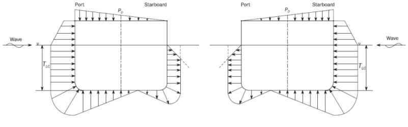
  **Fig 14 Transverse distribution of dynamic pressure for BSR-2S(left)와 BSR-2P(right)****load cases**
- **(e)** Hydrodynamic pressure for BSP load cases
  The wave pressures, $P _{W}$, for BSP-1 and BSP-2 load cases, at any load point, in $\mathrm{kN}/m ^{2}$, are to be obtained from **Table 11, Fig 16** and **17.** Total external pressure is to be calculated by $P _{S} +P _{W}$, $P _{S}$ means still water hydrostatic pressure for considered loading condition.

  |   | Wave pressure, in $\mathrm{kN}/m ^{2}$ |   |   |
  | --- | --- | --- | --- |
  | Load case | $z \leq T _{SC}$ | $T _{SC} \(z >h _{W} +T _{SC}$ |   |
  | BSP-1P | $P _{W} =\max (P _{BSP} , \rho g (z-T _{SC} ))$ | $P _{W} =P _{W,WL} - \rho g(z-T _{SC} )$ | $P _{W} = 0.0$ |
  | BSP-2P | $P _{W} =\max (-P _{BSP} , \rho g (z-T _{SC} ))$ | $P _{W} =P _{W,WL} - \rho g(z-T _{SC} )$ | $P _{W} = 0.0$ |
  | BSP-1S | $P _{W} =\max (P _{BSP} , \rho g (z-T _{SC} ))$ | $P _{W} =P _{W,WL} - \rho g(z-T _{SC} )$ | $P _{W} = 0.0$ |
  | BSP-2S | $P _{W} =\max (-P _{BSP} , \rho g (z-T _{SC} ))$ | $P _{W} =P _{W,WL} - \rho g(z-T _{SC} )$ | $P _{W} = 0.0$ |

  where;
  $P _{BSP} = 1.25 f _{\beta } f _{R} f _{nl} k _{a} k _{p} f _{yz} C _{W} \sqrt {\frac{L+ \lambda -125}{L}}$
  $f _{R}$ : Factor related to the operational profile, is defined in (d)
  $f _{nl}$ : Coefficient considering non-linear effect, to be taken as :
  - For extreme sea loads design load scenario :
  $f _{nl} =0.6$ at $f _{xL} =0$
  $f _{nl} =0.8$ at $f _{xL} =0.3$
  $f _{nl} =0.8$ at $f _{xL} =0.7$
  $f _{nl} =0.6$ at $f _{xL} =1$

  | Transverse Position | BSP-1P and BSP-2P | BSP-1S and BSP-2S |
  | --- | --- | --- |
  | $y \geq 0$ | $f _{yz} = 10 \frac{z}{T _{SC}} +8.5f _{yB} +0.1$ | $f _{yz} = -1.3 \frac{z}{T _{SC}} -4f _{yB} +0.1$ |
  | $y < 0$ | $f _{yz} = -1.3 \frac{z}{T _{SC}} -4f _{yB} +0.1$ | $f _{yz} = 10 \frac{z}{T _{SC}} +8.5f _{yB} +0.1$ |

  $\lambda$ : Wave length of the BSP load case, in $\mathrm{m}$, to be taken as:
  $\lambda =0.5L$
  $k _{a } =k _{a-WL} f _{yB} + k _{a-CL} \left( 1-f _{yB} \right)$
  $k _{p } =k _{p-WL} f _{yB} + k _{p-CL} \left( 1-f _{yB} \right)$
  Phase coefficient, $k _{a-WL}$, $k _{a-CL}$, $k _{p-WL}$ and $k _{p-CL}$ are to be taken as following; Intermediate values are to be interpolated.
  - Port side of BSP-1P and BSP-2P or starboard side BSP-1S and BSP-2S

  | $f _{xL}$ | 0.0 | 0.2 | 0.35 | 0.5 | 0.6 | 0.8 | 0.9 | 1 |
  | --- | --- | --- | --- | --- | --- | --- | --- | --- |
  | $k _{a-WL}$ | 0.3 | 0.9 | 1.1 | 1.0 | 0.9 | 0.9 | 0.7 | 0.5 |

  | $f _{xL}$ | 0.0 | 0.2 | 0.4 | 0.9 | 1.0 |
  | --- | --- | --- | --- | --- | --- |
  | $k _{p-WL}$ | 1.0 | 0.9 | 1.0 | 1.0 | 0.5 |

  - Port side of BSP-1S and BSP-2S or starboard side BSP-1P and BSP-2P

  | $f _{xL}$ | 0 | 0.1 | 0.2 | 0.3 | 0.5 | 0.7 | 0.8 | 1.0 |
  | --- | --- | --- | --- | --- | --- | --- | --- | --- |
  | $k _{a-WL}$ | 0.2 | 0.3 | 0.5 | 0.8 | 1.0 | 1.15 | 1.1 | 0.9 |

  | $f _{xL}$ | 0.0 | 0.05 | 0.2 | 0.3 | 0.4 | 0.5 | 0.6 | 0.8 | 0.9 | 1.0 |
  | --- | --- | --- | --- | --- | --- | --- | --- | --- | --- | --- |
  | $k _{p-WL}$ | 0.5 | 1.2 | -0.4 | -0.1 | 0.6 | 1.0 | 0.9 | 0.3 | 0.8 | 1.0 |

  - Center line

  | $f _{xL}$ | 0.0 | 0.2 | 0.4 | 0.6 | 0.85 | 1.0 |
  | --- | --- | --- | --- | --- | --- | --- |
  | $k _{a-CL}$ | 1.0 | 1.0 | 1.0 | 1.0 | 2.0 | 2.0 |

  | $f _{xL}$ | 0.0 | 0.35 | 0.5 | 0.8 | 1.0 |
  | --- | --- | --- | --- | --- | --- |
  | $k _{p-CL}$ | 1.6 | 1.6 | 1.0 | 1.5 | 1.0 |

  $P _{W,WL}$ : Wave pressure at the waterline, $\mathrm{kN}/m ^{2}$, for the considered dynamic load case. $P _{W,WL} =P _{BSP}$ for $y=B _{x} /2$ and $z=T _{SC}$
  Other parametric symbols are defined in **(d)**.
  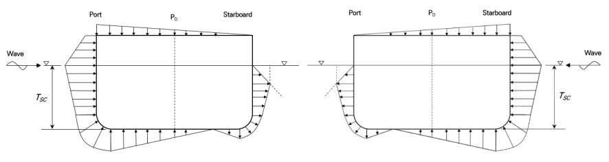
  **Fig 15 Transverse distribution of dynamic pressure for BSP-1P(left)와 BSP-1S(right)****load cases**
  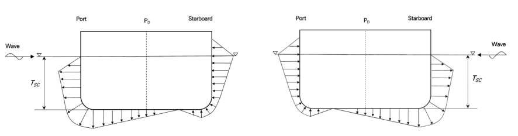
  **Fig 16 Transverse distribution of dynamic pressure for BSP-2P(left)와 BSP-2S(right)****load cases**
- **(f)** Internal cargo loads
  The cargo pressure due to ore cargo acting on any load point of a cargo hold boundary, in kN/m^2, is to be taken as:
  $P _{i n} = w +P _{bd}$
  Static pressure, $w$ in kN/m^2, due to ore cargo is defined in **(4), (A), (a) (ii)**. Dynamic pressure, $P _{bd}$ in kN/m^2, due to ore cargo for BSR load cases is to be taken as:
  $P _{bd} =f _{\beta } \gamma [0.25a _{x} (x _{G} -x ) +0.25 a _{y} (y _{G} -y) +K _{C} a _{z} (z _{C} -z )] (kN/m ^{2} )$ for $z\(P _{bd} = 0 (kNm ^{2})$ for$z>z _{C}$
  where;
  $a _{x} , a _{y} , a _{z}$ : Longitudinal, transverse and vertical accelerations, in m/s^2, at $x _{G} , y _{G} , z _{G}$.
  $x _{G} , y _{G} , z _{G}$: X, Y and Z coordinates, in m, of the volumetric centre of gravity of fully filled cargo hold, i.e. $V _{Full}$, considered with respect to the reference coordinate system. In case of partially filled cargo hold, $x _{G} , y _{G} , z _{G}$ to be taken as follows;
  $x _{G} , y _{G}$ : Volumetric centre of gravity of the cargo hold.
  $z _{G} = h _{DB} +h _{C} /2$, $h _{DB}$ and $h _{c}$ are defined in (4), (A), (a).
  $V _{Full}$ : Volume, in $m ^{3}$, of cargo hold up to top of the hatch coaming, taken as:
  $V _{Full} = V _{H} +V _{HC}$, $V _{H}$ and $V _{HC}$ are defined in (4), (A), (a).
  $z _{c}$ : Height of the upper surface of the cargo above the baseline in way of the load point, in m, to be taken as:
  $z _{c} =h _{DB} +h _{c}$
  $K _{C}$ : Coefficient is defined in (4), (A), (a) (ii).
  The shear load pressures, $P _{bs-s} + P _{bs-d}$, are to be considered for the hopper tank and the lower stool plating in addition to the ore cargo pressures when the load point elevation, $z$, is lower or equal to $z _{c}$. Static shear load, $P _{bs-s}$, due to gravitational forces acting on hopper tanks and lower stools plating, is defined as $w _{sh}$ of (4), (A), (a) (ii).
  The dynamic shear load pressure, $P _{bs-d}$(positive downward to the plating) due to ore cargo forces on the hopper tank and lower stool plating, in kN/m^2, is to be taken as:
  $P _{bs-d} =f _{\beta } \gamma a _{z} \frac{(1-K _{C} ) (z _{C} -z)}{\tan \beta}$
  Additionally, the dynamic shear load pressures, $P _{bs-dx}$ and $P _{bs-dy}$, due to ore cargo forces acting along the inner bottom plating, in kN/m^2, are to be taken as:
  $P _{bs-dx} = -0.75 f _{\beta } \gamma a _{x} h _{C}$, in the longitudinal direction (positive to bow)
  $P _{bs-dy} = -0.75 f _{\beta } \gamma a _{y} h _{C}$, in the transverse direction (positive to port)

### (8) Local fine mesh analysis

#### (A) Application

- **(a)** The list of structural details of the fine mesh analysis are as follows.
  - hopper knuckle
  - openings
  - connection between transverse bulkhead and longitudinal stiffener of deck and double bottom
  - connection of corrugated bulkhead and the adjacent structure
  - hatch corner
- **(b)** For other high stress areas in which the stress ($\sigma _{"act"}$) calculated by direct strength analysis is greater than 95% of the allowable stress ($\sigma _{"a"llow}$), additional analysis should be performed at the discretion of the Society.

#### (B) Fine mesh of the structure

- **(a)** The range of the local fine mesh analysis should be at least 10 elements in all directions from the area under consideration.
- **(b)** All plates and stiffeners within the local fine mesh analysis range should be represented by shell elements.
- **(c)** For element corners, crooked elements less than 45 degrees or greater than 135 degrees should be avoided.
- **(d)** The aspect ratio of the element should be kept as close as possible to 1, and should be less than 3.
- **(e)** Mesh size of local fine mesh analysis should be such that it is capable of expressing the structure well and is less than the longitudinal spacing.
- **(f)** When performing local fine mesh analysis for openings, the elements of the first two layers of the perimeter elements of the opening should be modeled to a size of 50 x 50 $\mathrm{mm}$ or less. End stiffeners directly welded to the opening end should be modeled as shell elements. The web stiffener near the opening is located at least 50 $\mathrm{mm}$ from the end of the opening and can be modeled using a rod or beam element.

#### (C) Allowable stress for local fine mesh analysis

- **(a)** Allowable stresses for local fine mesh analysis should meet the following criteria.
  $\sigma _{"act_l"} \prec \sigma _{"allow_l"}$
  $\sigma _{act"_l"} = \sqrt {\sigma _{"x_l"} ^{ 2}+ \sigma _{ "y_l"} ^{ 2}- \sigma _{ "x_l"} \sigma _{ "y_l"}+3 \tau _{ l} ^{ 2} }$
  $\sigma _{"allow_l"} = \eta \eta _{local} \sigma _{"yield_l"}$
  $\sigma _{"yield_l"} = 235/K$ ($\mathrm{N}/mm ^{2}$)
  where;
  $\eta$ : Yield strength correction factor as defined in (6)
  $\eta _{allow}$ : Local fine mesh analysis correction factor
  $\eta _{allow}=1.00$, element size ≤ longitudinal spacing ($\mathrm{mm}$)
  $\eta _{allow}=1.15$, element size ≤ 200 x 200 ($\mathrm{mm}$)
  $\eta _{allow}=1.25$, element size ≤ 100 x 100 ($\mathrm{mm}$)
  $\eta _{allow}=1.50$, element size ≤ 50 x 50 ($\mathrm{mm}$)
  $K$ : Material factor (see **Pt 3, Annex 3-2, Table 5**)
  $\sigma _{ "x_l"}$ : Normal stress in x-direction of element coordinate system ($\mathrm{N}/mm ^{ 2}$)
  $\sigma _{ "y_l"}$ : Normal stress in y-direction of element coordinate system ($\mathrm{N}/mm ^{ 2}$)
  $\tau _{ "l"}$ : Shear stress on the face in x-y direction of element coordinate system ($\mathrm{N}/mm ^{ 2}$)
- **(b)** When evaluating the corner of the opening, the average stress can be evaluated as follows.(see **Fig 21**)
  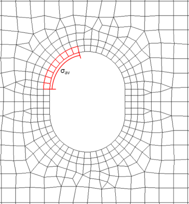
  **Fig 21 Opening**
  $\sigma _{ act} \prec \sigma _{ allow}$
  where;
  $\sigma _{act} = \frac{\sum _{1} ^{n} A _{l} \sigma _{l}}{\sum _{1} ^{n} A _{l}}$
  $\sigma _{allow}$ : Allowable stresses in direct strength analysis ($\mathrm{N}/mm ^{ 2}$)
  $\sigma _{act}$ : Mean stress in the considered range ($\mathrm{N}/mm ^{ 2}$)
  $\sigma _{l}$ : Each element stress in the considered range($\mathrm{N}/mm ^{ 2}$)
  $A _{l}$ : Each element area in the considered range ($\mathrm{mm} ^{ 2}$)
  $n$ : Number of elements in the considered range

### (9) Cargo Mass Curves

#### (A) The maximum and minimum drafts which are satisfied with maximum allowable cargo mass and the minimum required cargo mass for the each cargo hold are to be given by the following equations. In finite element analysis of middle cargo hold, holds No. 2 to n-1 are to be satisfied. The draft of fore end part is to be satisfied with maximum allowable cargo mass and the minimum required cargo mass of No. 1 cargo hold and the draft of aft end part is to be satisfied with maximum allowable cargo mass and the minimum required cargo mass of No. n cargo hold. (see Fig 22)

Maximum allowable cargo mass
Curve 1 : $W _{"\max ,SEA"} (T _{LC} )=M-1.025LB(T _{\min ,SEA} -T _{LC} ) ( \leq M)$ (ton)
Curve 2 : $W _{"\max ,"HAR} (T _{LC} )=M-1.025LB(T _{\min ,HAR} -T _{LC} ) ( \leq M)$(ton)
Minimum required cargo mass
Curve 3 : $W _{\min } (T _{LC} )=M-1.025LB(T _{LC} -T _{"multi"-"\max"} )$ (ton)
Curve 4 : $W _{\min ,HAR} (T _{LC} )=1.025LB(T _{LC} -T _{\max , HAR} ) ( \geq 0)$ (ton)
$W _{\max ,SEA} (T _{LC} )$ : Maximum allowable mass with draft, $\mathrm{T} _{LC }$ at sea going condition (ton)
$W _{\max ,HAR} (T _{LC} )$: Maximum allowable mass with draft, $\mathrm{T} _{LC }$ at harbour (ton)
$W _{\min ,SEA} (T _{LC} )$ : Minimum required mass with draft, $\mathrm{T} _{LC }$ at sea going condition (ton)
$W _{\min ,HAR} (T _{LC} )$ : Minimum required mass with draft, $\mathrm{T} _{LC }$ at harbour (ton)
$M$ : Maximum allowable mass of considered cargo hold (ton)
$T _{\min ,SEA}$ : Minimum draft ($\mathrm{m}$) at sea going condition which the maximum allowable cargo weight of the cargo hold is applied. But minimum draft at multi port condition subtracting 0.2$\mathrm{m}$ (considering the trim)
$T _{\max ,SEA}$ : Maximum draft ($\mathrm{m}$) at sea going condition which the minimum allowable cargo weight of the cargo hold is applied. But maximum draft at multi port condition including 0.2$\mathrm{m}$ (considering the trim)
$T _{\min ,HAR}$ : Minimum draft ($\mathrm{m}$) at the port state to which the maximum allowable cargo weight($M$) of the cargo hold is applied. If the minimum draft in the port condition is not ascertained, an evaluation of the strength should be made by the following formula
$T _{\min , HAR} =T _{\min , SEA} -(1.15M-W _{\max ,SEA} (T _{LC} ))/(1.025LB)$
$L$ : length of the considered cargo hold ($\mathrm{m}$)
$B$ : mean breadth of the considered cargo hold ($\mathrm{m}$)
$T _{\max ,HAR}$: Maximum draft ($\mathrm{m}$) at port condition to which the minimum allowable cargo weight ($M _{AD}$) of cargo holds is applied

#### (B) The maximum and minimum drafts which are satisfied with maximum allowable cargo mass and the minimum required cargo mass for adjacent 2 cargo hold are to be given by the following equations. In finite element analysis of middle cargo hold, holds No. 2 and 3 to n-2 and n-1 are to be satisfied. The draft of fore end part is to be satisfied with maximum allowable cargo mass and the minimum required cargo mass of No. 1 and 2 cargo holds and the draft of aft end part are to be satisfied with maximum allowable cargo mass and the minimum required cargo mass of No. n-2 and n-1 cargo holds. (see Fig 19)

Maximum allowable cargo mass
Curve 1:$W _{"\max ,SEA_AD"} (T _{LC} )=M _{"AD"} -1.025L _{AD} B _{AD} (T _{"\min ,SEA_AD"} -T _{"LC"} ) ( \leq M _{AD} )$ (ton)
Curve 2:$W _{"\max ,"HAR"_AD"} (T _{LC} )=M _{"AD"} -1.025L _{AD} B _{AD} (T _{"\min ,HAR_AD"} -T _{"LC"} ) ( \leq M _{AD} )$ (ton)
Minimum required cargo mass
Curve 3: $W _{\min ,SEA"_AD"} (T _{"LC"} )=1.025L _{AD} B _{AD} (T _{"LC"} -T _{\max ","SEA"_AD"} ) ( \geq 0)$ (ton)
Curve 4: $W _{\min ,HAR"_AD"} (T _{LC} )=1.025L _{AD} B _{AD} (T _{LC} -T _{"\max ,HAR_AD"} ) ( \geq 0)$ (ton)
$W _{"\max ,SEA_AD"} (T _{LC} )$ : Maximum allowable mass of adjacent 2 cargo holds with draft, $\mathrm{T} _{LC }$ at sea going condition (ton)
$W _{"\max ,"HAR"_AD"} (T _{LC} )$ : Maximum allowable mass of adjacent 2 cargo holds with draft, $\mathrm{T} _{LC }$ at port (ton)
$W _{\min ,SEA"_AD"} (T _{LC} )$ : Required cargo mass of adjacent 2 cargo holds with draft, $\mathrm{T} _{LC }$ at sea going condition (ton)
$W _{\min ,HAR"_AD"} (T _{LC} )$ : Required cargo mass of adjacent 2 cargo holds with draft, $\mathrm{T} _{LC }$ at port (ton)
$T _{"\min ,SEA_AD"}$ : Minimum draft ($\mathrm{m}$) in the sea going condition to which the maximum allowable cargo weight ($M _{AD}$) of adjacent 2 cargo holds is applied
$T _{"\max ,SEA_AD"}$ : Maximum draft ($\mathrm{m}$) in the sea going condition to which the minimum allowable cargo weight ($M _{AD}$) of adjacent 2 cargo holds is applied
$T _{"\min ,HAR_AD"}$ : Minimum draft ($\mathrm{m}$) at the port state to which the maximum allowable cargo weight($M_AD$) of the cargo hold is applied. If the minimum draft in the port condition is not ascertained, an evaluation of the strength should be made by the following formula.
$T _{"\min ","HAR_AD"} =T _{"\min ,SEA_AD"} -(1.15M _{AD} -W _{\max ,"SEA_AD"} (T _{LC} ))/(1.025L _{AD} B _{AD} )$
$M _{"AD"}$ : Maximum allowable mass of adjacent 2 cargo holds (ton)
$L _{AD}$ : length of the considered cargo holds ($\mathrm{m}$)
$B _{AD}$ : mean breadth of the considered cargo holds ($\mathrm{m}$)
$T _{"\max ,HAR_AD"}$ : Maximum draft ($\mathrm{m}$) at port condition to which the minimum allowable cargo weight ($M _{AD}$) of adjacent 2 cargo holds is applied 

**Fig 22 Cargo mass curves**
