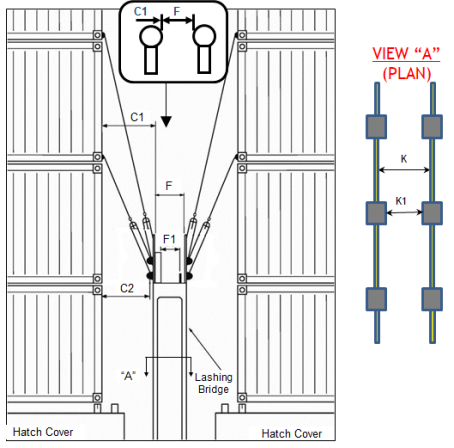
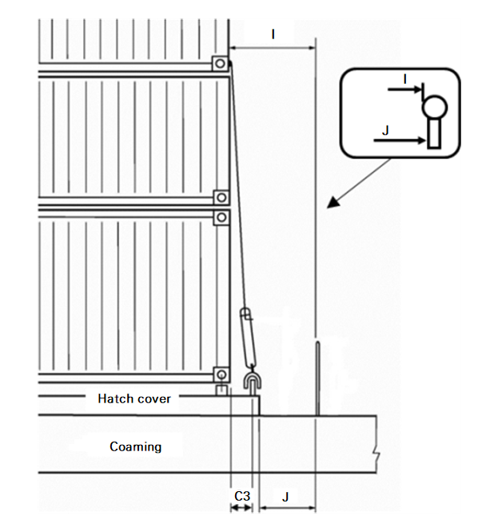

# PART 7 Ships of Special Service (Ch1-4, 7-10)

> RULES FOR CLASSIFICATION OF STEEL SHIPS / RA-07A-E / 2025 / EN / Guidance

## Annex 7-11 Guidance on Providing Safe Working Conditions for Securing of Containers on Open Deck (2019) 【See Rule】

### 1. General

#### (1) Objective

The objective of the additional special feature notation CSAP should provide safe working conditions in safe access and safe places of work, when they are worked in container securing operations on open deck.

#### (2) Scope

The scope of the additional special feature notation CSAP should ensure safer working conditions in container securing operations. This guidelines describe requirements covering design and arrangement of working areas, container top working, fencing and fall protection, marking of obstacles and openings, design of walkways, ladders, steps and other means of access, design and arrangement of power supplies for reefer containers and lightings of working and transit areas.

#### (3) Application

Ships complying with this guidelines will be assigned the additional special feature notation CSAP. The additional special feature notation CSAP is applicable to ships designed for carrying containers on open deck. The additional special feature notation CSAP can be applied to other ships upon request.

#### (4) Definitions

- **(A)** Definitions used in this guidelines are given as following.
  - working area : any positions or spaces used for operating container securing devices, e.g. in between container stows on hatch covers; lashing bridges and platforms
  - transit area : passage ways, stairs, decks and other areas used for moving about the ship
  - fencing : a generic term for guardrails, safety rails, safety barriers and similar structures that provide protection against the falls of people
  - stringers : the uprights or sides of a ladder
  - rungs : the bars that form the steps of a ladder

### 2. Documentation

#### (1) CSAP should be submitted for approval and includes following.

- Arrangement and detail of working area and transit area
- Lighting arrangement and illumination in working and transit area
- Location and detail of reefer container power outlet and adjacent working area

### 3. Design requirements

#### (1) General

- **(A)** The cargo safe access plan should be developed at the design stage to ensure that securing operations can be carried out safely for all intended container stowage configurations.
- **(B)** Typically the cargo safe access plan should be developed based on a risk assessment including following hazards:
  - slips, trips,
  - falls from height,
  - injuries whilst manually handling lashing gear,
  - being struck by lashing gear or other objects,
  - potential damage due to container operations(High-risk areas should be identified in order to develop appropriate protection or other methods of preventing significant damage),
  - adjacent electrical risks (temperature controlled unit cable connections etc.),
  - adequate access to all areas that is necessary to safely perform container securing operations
  - ergonomics (e.g., size and weight of equipment) of lashing equipment,
  - implications of lashing high cube (9’6”) containers and mixed stows of 40’ and 45’ containers.

#### (2) Transit area

- **(A)** The minimum clearance for transit areas should be at least 2.0 m high and 600 mm wide. (**Table 1** B, J and F1)
- **(B)** Transit area should have non-slip surfaces.
- **(C)** Where necessary for safety, walkways on deck should be delineated by painted lines or otherwise marked by pictorial signs.
- **(D)** All protrusions in access ways in transit area, such as cleats, ribs and brackets that may give rise to a trip hazard, should be highlighted in a contrasting colour.
- **(E)** As far as practicable, access ladders and walkways should be free of permanent obstructions and designed so that workers do not have to climb over piping.

#### (3) Working area

- **(A)** Working areas should be designed to eliminate the use of three high lashing bars and be positioned in close proximity to lashing equipment stowage areas.
- **(B)** Working areas should be designed to provide a clear work area which is unencumbered by obstructions such as deck piping, storage bins and guides to reposition hatch covers.
- **(C)** The horizontal distance from the lashing securing points to the containers should not exceed 1,100 mm, and not less than 220 mm for lashing bridges and 130 mm for other positions. (**Table 1**, C1, C2 and C3.) For container bays with foundations designed for 40’ and 45’ container stowage, the dimension C1 may be increased to 1,300 mm when measured to 40’ containers depending on the approval of Flag state.
- **(D)** The width of working areas should not be less than 750 mm. In addition, the width of permanent lashing bridges should not be less than 750 mm between top rails of fencing and should provide a minimum clear distance of 600 mm between stowage racks, lashing cleats and other obstructions. (**Table 1**, A, GL, GT, I, F and F1.)
- **(E)** Platforms should be provided on the end of hatches and outboard lashing positions. Platforms on the end of hatches and outboard lashing positions should preferably be at the same level as the top of the hatch covers. *(2022)*
- **(F)** Working areas which contain removable sections should be capable of being temporarily secured.
- **(G)** Working on the top of containers should be avoided, e.g. through use of semi-automatic or fully automatic twistlocks.
- **(H)** Toe boards of 150 mm in height should be provided around the sides of elevated working areas, to prevent securing equipment from falling and injuring people. In cases where toe board obstructs the stowage of containers, the height of toe board may be reduced to 100 mm.

#### (4) Fencing design

- **(A)** Lashing bridges, platforms and other working area from which persons may fall should be provided with fencing satisfying the requirements given in (D). *(2020)*
- **(B)** If necessary, a mobile fencing may be allowed.
- **(C)** Athwartships cargo securing walkways should be protected by fencing satisfying the requirements given in (D), if the edges of walkways are not protected when the hatch cover is removed.
- **(D)** Fencing should have a minimum of three courses. The height of the uppermost course should be at least 1.0 m, measured from the base. The opening below the lowest course of the guardrails should not exceed 230 mm. The other courses should not be more than 380 mm apart. A horizontal unfenced gap of fencing should not be greater than 300 mm.
- **(E)** An alternative arrangement of the lower two courses may be accepted by the Society, as necessary, taking position of container securing device into consideration. *(2022)*

#### (5) Access openings

- **(A)** Access openings in working area with a potential should be either protected by fencing in accordance with (4)(D) or possible to be closed by access covers. *(2020)*
- **(B)** Openings that are necessary for the operation of the ship, which are not protected by fencing, should be closed during cargo securing work. Any necessarily unprotected openings in work platforms (i.e. those with a potential fall of less than 2m), and gaps and apertures on deck should be properly highlighted. *(2022)*
- **(C)** Access openings in working area and transit area should be highlighted in contrasting colour around the rim of the openings.
- **(D)** Access openings at different levels of lashing bridges should not be located directly below one another.

#### (6) Ladders

- **(A)** Where a fixed ladder gives access to the outside boundary of a working area, the stringers should be connected at their extremities to the guardrails of the working area, irrespective of whether the ladder is sloping or vertical. The stringers of shell also be opened above the working area level to give a clear width of 700 ~ 750 $\mathrm{mm}$ to enable a person to pass through the stringers. *(2022)*
- **(B)** Where a fixed ladder gives access to a working area through an opening in the working area, handholds extending at least 1.0 m above the working area should be provided, to ensure safe access through the opening.
- **(C)** A fixed ladders should not slope at angle greater than 25° from vertical. Where the slope of a ladder exceeds 15° from vertical, the ladder should be provided with suitable handrails positioned not less than 540 mm from the stringers, measured horizontally.
- **(D)** A fixed ladders should provide a foothold at least 150 mm deep.
- **(E)** A fixed ladders with a vertical height exceeding 3.0 m, and any fixed ladders, from which a person may fall into a hold, should be fitted with a guard hoops satisfying the requirements given in (F) to (G).
- **(F)** The distance between the rungs and the back of the safety cage should be min. 750 mm. Safety cage hoops should be uniformly spaced at intervals not exceeding 900 mm and be connected by vertical bars inside the hoop uniformly spaced around the circumference of the hoops.
- **(G)** The stringers should be extended at least 1.0 m above the working area, and the ends of the stringers should be given lateral support. The top step or rung should be at the same level of the working area.

#### (7) Container securing equipment arrangement

- **(A)** The lashing rod’s length in conjunction with the length and design of the turnbuckle should be such that the need of extension is eliminated when lashing high cube (9’6”) containers. In the container securing arrangement document, typical lashing patterns for 9’6” containers should be shown, if such containers are stowed on board.
- **(B)** During tightening or loosening motions on turnbuckles, the risk for hand injury should be minimised, e.g., by keeping sufficient distance between turnbuckles. During tightening or loosening motions, the distance between turnbuckles is typically not less than 70mm. *(2020)*
- **(C)** Storage bins should be provided for container securing equipment

#### (8) Power supply

- **(A)** Reefer power outlets should provide a safe, watertight electrical connection.
- **(B)** Reefers should feature a heavy-duty, interlocked and circuit-breaker protected electrical power outlets. This should ensure the outlet can not be switched on until a plug is fully engaged and the actuator rod is pushed to the “ON” position. Pulling the actuator rod to the “OFF” position should manually de-energize the circuit.
- **(C)** Reefer power outlets should de-energize automatically if the plug is accidentally withdrawn while in the “On” position. Also, the interlock mechanism should break the circuit while the pin and sleeve contacts are still engaged.
- **(D)** Reefer power outlets should be positioned and designed so as not to require the operator to stand directly in front of the socket when switching takes place.
- **(E)** The positioning of reefer power outlets should not be such that the flexible cabling needs to be laid out in such a way as to cause a tripping hazard.

#### (9) Lighting

- **(A)** Working areas and transit areas should be provided with lighting.
- **(B)** The lighting should be designed as a permanent installation adequately guarded against breakage. Temporary lighting may be accepted by the Society, as necessary, basis at locations where permanent lighting is not practical.
- **(C)** Light intensity levels should not be less than 10 lux for transit area and 50lux for working area.

  | **Dimension** **(see Fig**) | **Description** | **Requirement (mm)** |
  | --- | --- | --- |
  | A | Width of work area between container stacks (**Fig 1**) | min. 750 |
  | B | Distance between lashing plates on deck or on hatch covers (**Fig 1**) | min. 600 |
  | C1 | Distance from lashing bridge fencing to container stack (**Fig 2**) | max 1,100* |
  | C2 | Distance from lashing plate to container stack (lashing bridge) (**Fig 2**) | min. 220 |
  | C3 | Distance from lashing plate to container stack (elsewhere) (**Fig 1**) | min. 130 |
  | F | Width of lashing bridge between top rails of fencing (**Fig 2**) | min. 750 |
  | F1 | Width of lashing bridge between storage racks, lashing cleats and any other obstruction (**Fig 2**) | min. 600 |
  | GL | Width of working platform for outboard lashing – fore/aft (**Fig 3**) | min. 750 |
  | GT | Width of working platform for outboard lashing – transverse (**Fig 3**) | min. 750 |
  | I | Width of work platform at end of hatch cover or adjacent to superstructure (**Fig 4**) | min. 750 |
  | J | Distance from edge of hatch cover to fencing (**Fig 4**) | min. 600 |
  | K | Width of lashing bridge between top rails of fencing (**Fig 2**) | min. 750 |
  | K1 | Width of lashing bridge between the pillars of the lashing bridge (**Fig 2**) | min. 600 |
  | (Notes) B C1 C2, C3 F, K GL GT I J * | Measured between the centers of the lashing plates. Measured from inside of fencing. Measured from center of lashing plate to end of container. Measured to inside of fencing. Measured from end of container to inside of fencing. Measured to inside of fencing. Measured to inside of fencing. Measured to inside of fencing. may be increased to 1,300$RM mm$ depending on the approval of Flag state. |   |

  |  **Fig 1 Work area between container stacks** **Fig 1 Work area between container stacks** |  **Fig 2 Lashing bridge** **Fig 2 Lashing bridge** |
  | --- | --- |
  |  **Fig 3 Lashing platforms on outboard stanchions** |  **Fig 4 Work area between hatch covers** |
  |  **Fig 5 Toe boards** **Fig 5 Toe boards** |  |
