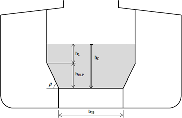
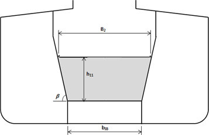
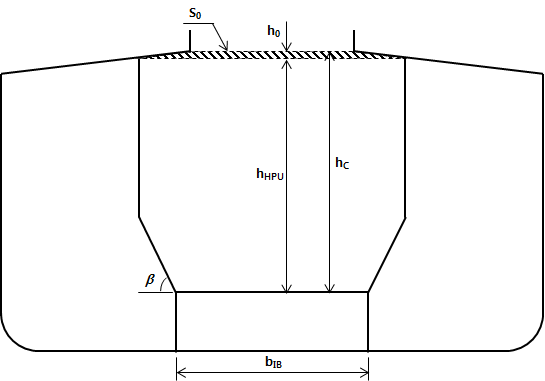
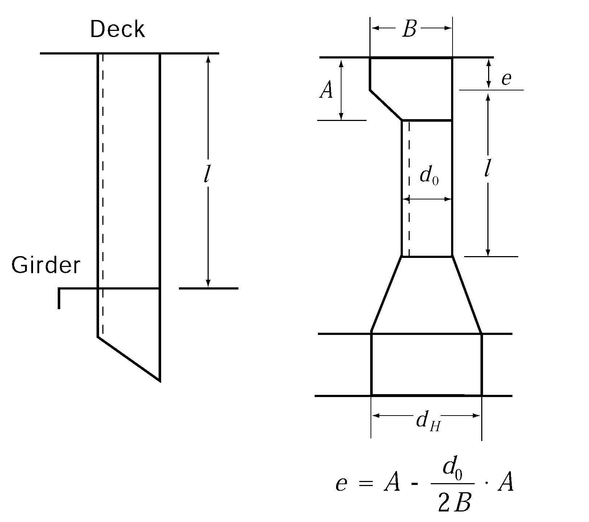

# PART 7 Ships of Special Service (Ch1-4, 7-10)

> RULES FOR CLASSIFICATION OF STEEL SHIPS / RA-07A-E / 2025 / EN / Guidance

## Annex 7-12 Liquefaction of Ore Bulk Cargoes (2023)

### 1. General

#### (1) Application

This Annex applies to Ore carriers specially constructed to transport solid bulk cargoes that may liquefy during voyage when transporting cargoes whose moisture content(MC) exceeds thetransportable moisture limit (TML). Ships that meet the requirements of this Annex are assigned additional special feature notations LIQBC-1 or LIQBC-2. It is subject to the Flag Administration's decision for compliance with the requirements to specially constructed ore cargo ships according to the IMSBC Code. The Society will issue a certificate accordingly, if authorised by the Administration.

#### (2) Cargo liquefaction types are divided into two types:

- **(A)** Cargoes resettled in stable condition after cargo liquefaction: It occurs in cargoes with a mixture of fine and large particles, and liquefaction occurs most often immediately after departure. The liquefaction state is a transient state that usually lasts for a limited time. After a cargo is stable, it is unlikely to re-liquefy. (e.g. iron ore fines)
- **(B)** Cargoes that are not re-established in a stable condition after cargo liquefaction: It occurs on very fine clay-like cargoes, and liquefaction can occur days or weeks after departure. After the cargo is liquefied, it is not well stabilized (e.g. bauxite fines)

#### (3) Ships designed for cargo liquefaction are to comply with the requirements of this Annex in addition to the relevant requirements in Pt 3 and Pt 7, Ch 2.

#### (4) Definitions used in this Annex are;

- **(A)** solid bulk cargo : Cargo other than liquid or gas, which generally means a material composed of a combination of particles, granules, or slightly larger pieces of uniform composition which is loaded directly into the cargo space of a ship without any intermediate form of containment.
- **(B)** IMSBC-A cargo : any solid bulk cargo which may liquefy if shipped at a moisture content in excess of their transportable moisture limit (TML)
- **(C)** moisture content (MC) : the portion of water, ice or other liquid in the cargo sample. Percentage of total moisture content to the total mass of the sample
- **(D)** transportable moisture limit (TML): the maximum moisture content of the cargo which is considered safe for carriage in ships

#### (5) In order to transport cargoes exceeding the permitted water limit, the following data must be submitted to the Society for approval:

- **(A)** Longitudinal / transverse sections and other plans indicating the weight, density, etc. of the cargo to be considered.
- **(B)** Distribution and stability calculations of cargo handling equipment, cargo and liquids in tanks;
- **(C)** Other materials deemed necessary by the Society

### 2. Stability

#### (1) Loading manual

In the loading manual, the cargo characteristics including the design cargo density are to be stated. And in the loading manual, the following is to be included: “When loading cargoes other than design cargoes, compliance with regulations shall be verified through an approved loading computer.”

#### (2) Loading conditions:

- **(A)** For liquefied cargo designs, loading conditions according to the design scenario is to be included in the loading manual. Where applicable, the requirements of (3) and (4) are tol be complied with.
  - **(a)** Design scenarios
    - liquefaction : the cargo acts as a dense, viscous fluid
    - shifting : the cargo slides during heavy rolling
- **(B)** Loading computer
  The ships are to be equipped with a loading computer capable of verifying the design scenarios and additional requirements as given in (3) and (4) as applicable.

#### (3) Intact stability

- **(A)** Liquefaction scenario : the cargo is assumed to be a liquid and full free surface of the cargo is to be considered. The requirements of stability for this scenario are to be in compliance with the **Part A Ch 2 of IMO IS Code.**
- **(B)** Shift scenario : the cargo is assumed to shift at an angle of 25 degrees. The requirements of stability for this scenario are to be in compliance with **IMO Resolution MSC.23(59)(** International Code for the Safe Carriage of Grain in Bulk).

#### (4) Damage stability

- **(A)** For ships assigned LIQBC-2 notation, all stowed holds are assumed to be liquid with a free surface. Where applicable, it shall be calculated according to the GM limit curve based on the damage stability requirements of **SOLAS Reg II-1/6** to **7-3, Reg. II-1/9.8** and **Reg. XII/4.**
- **(B)** In addition to (A) above, for ships with reduced freeboard, the GM limit curve is to take into account the above requirements of **SOLAS** with the assumed deepest subdivision draft at the assigned reduced freeboard.
- **(C)** In addition to (A) and (B) above, the GM used to demonstrate compliance with the damage stability requirements of **Reg. 27 of ICLL** is to be equal to or less than that applied at the deepest subdivision draft in the GM limit curve calculation.

### 3. Hull Strength

#### (1) Cargo loads

- **(A)** For hull strength evaluation, the cargo loads due to the liquefied design cargo are to be calculated in accordance with (B). The design density ($\gamma$) of cargo in the liquefied state of each cargo hold is to be given in the Classification Certificate. The design cargo density is to be considered more than the value given below. and The angle of repose is taken as 0 degrees.

  |   | Density of cargo $\gamma$ ($rm"ton"/m^3$) |
  | --- | --- |
  | LIQBC-1 | $\gamma _{design}$ |
  | LIQBC-2 | $M ' /V _{H}$ |

  $M '$ : Cargo weight of the cargo hold. The following formula is applied.
  $M ' =M+ \frac{1}{n} Min(3000, 0.1M)$ ($t$)
  $M$ : Maximum permissible bulk cargo weight of the cargo hold ($t$)
  $n$ : Minimum number of loading in one cargo hold
  $V _{H}$ : Volume, in $m ^{3}$, of cargo hold up to level of the intersection of the main deck with the hatch coaming excluding the volume enclosed by hatch coaming.
  $\gamma _{design}$ : for LIQBC-1, the cargo density is to be presented by the designer. When the cargo density is not constant, the minimum and maximum value are to be determined by considering the range of cargo density.
- **(B)** LIQBC-1
  The load of cargo on the inner wall of the cargo hold is given by the following formula.
  ∙ For **Fig 2**
  
  **Fig 2 Assumed cargo surface**
  $h _{C} = h _{HPL} + h _{1}$
  Where;
  $h_HPL$ : Vertical distance between inner bottom plate and top intersection of hopper tank and inner plate($\mathrm{m}$)
  $h_1$ : Vertical distance(m) is as follows;
  $h _{1} = \frac{M '}{\gamma B _{H} l _{H}} - \frac{B _{H} + b _{IB}}{2 B _{H}} h _{HPL} + \frac{V _{TS}}{B _{H} l _{H}}$
  $B_H$ : Breadth of cargo hold($\mathrm{m}$)
  $l_H$ : Length of cargo hold($\mathrm{m}$)
  $b_IB$ : Breadth of double bottom($\mathrm{m}$)
  $V_TS$ : The total volume($\mathrm{m}^3$) of the transverse stool at the bottom of the transverse bulkhead within the cargo hold length, $l_H$ considered. In this volume, the volume of the portion of the hopper tank passing through the transverse bulkhead is excluded.
  ∙ For **Fig 3**
  
  **Fig 3 Assumed cargo surface**
  $h _{C} = h _{11}$
  Where;
  $h _{11}$ : Vertical distance(m) is as follows;
  $h _{11} =h _{HPL} \left( \frac{B _{2} -b _{IB}}{B _{H} -b _{IB}} \right)$
  $B _{2} = \sqrt {\frac{\frac{1}{l _{H}} \left( \frac{M '}{\rho _{c}} +V _{TS} \right) + \frac{1}{2} \left( \frac{h _{HPL} b _{IB}^{2}}{B _{H} -b _{IB}} \right)}{\frac{1}{2} \left[ \left( \frac{h _{HPL}}{B _{H} -b _{IB}} \right) \right]}}$
- **(C)** LIQBC-2
  The load of cargo on the inner wall of the cargo hold is given by the following formula.
  
  **Fig 4 Assumed cargo surface**
  $h _{c} = h _{HPU} + h _{0}$
  where;
  $h _{0} = S_\frac{A}{B_H}$
  $S_A = S_o + V_\frac{HC}{l_H}$
  $h_HPU$ : Vertical distance ($\mathrm{m}$) between inner bottom and lower intersection of top side tank and side shell or inner side
  $S_o$ : Shaded area ($\mathrm{m}^2$) above the lower intersection of top side tank and side shell or inner side and up to the upper deck level
  $V_HC$ : Volume ($\mathrm{m}^3$) enclosed by the hatch coaming

#### (2) Longitudinal bulkhead platings

- **(A)** The thickness of longitudinal bulkhead plating and hopper plating are not to be less than the value obtained from following;
  $t=C S \sqrt {Kh_c} + 1.5 \mathrm{mm}$
  where:
  $S$ : length of the shorter side of the panel enclosed by stiffeners, etc. ($\mathrm{m}$)
  $h_c$ : When considering cargo liquefaction, the vertical distance from the bottom of the panel to the top of the cargo at the center line ($\mathrm{m}$).
  $C$ : coefficient obtained from the following formula. However, in no case is it to be less than 3.2.
  $C=4.25 C _{1} \sqrt {\gamma }$
  $C_1$ : coefficient obtained from the following formula
  where $1 \leq \frac{l}{S} < 3.5$ $C_1$ = $\left( { 0.11 \frac{l}{S} + 0.615} \right)$
  where $3.5 \leq \frac{l}{S}$ $C_1$ = 1
  $l$ : length of the longer side of the panel enclosed by stiffeners, etc. ($\mathrm{m}$)

#### (3) Stiffeners

The section modulus of stiffeners attached to longitudinal bulkheads is to be in accordance with the requirements in the following (A) and (B).

- **(A)** The section modulus of longitudinal stiffeners is not to be less than the value obtained from the following formula:
  $Z=104 \gamma C S h _{c} l ^{2} \mathrm{cm ^{3} }$
  where:
  *S* : spacing of longitudinal stiffeners ($\mathrm{m}$).
  $h_c$ : when considering cargo liquefaction, vertical distance from the center of the stiffener under consideration to the top of the cargo at the center line ($\mathrm{m}$).
  $l$ : length of longitudinal stiffener between transverse webs ($\mathrm{m}$).
  $C = \frac{K}{24 - \alpha K}$
  $\alpha$ : $\alpha_1$ or $\alpha_2$ as given below
  $\alpha _{1} =15.0 f _{D} \left( \frac{y-y _{B}}{Y '} \right) for y>y _{B}$
  $\alpha_2 =15.0 f _{B} \left( \frac{y _{B} -y}{y _{B}} \right) for y \leq y _{B}$
  $f_B$, $y$ : specified in **Ch. 2, 303. 2.** of the Rule
  $y_B$, $Y '$ and $f _{D}$ : specified in **Ch. 2, 303. 2.** of the Rules
- **(B)** The section modulus of transverse stiffeners is not to be less than that obtained from the following formula :
  $Z=7.5 \gamma K S h _{c} l ^{2} \mathrm{cm ^{3} }$
  where:
  $S$ : spacing of transverse stiffeners ($\mathrm{m}$).
  $h_c$ : when considering cargo liquefaction, vertical distance from the center of the stiffener under consideration to the top of the cargo at the center line ($\mathrm{m}$).
  $l$ : distance between the supports of stiffeners ($\mathrm{m}$).

#### (4) Transverse bulkhead and stool in ore cargo hold

- **(A)** The thickness of bulkhead plating is not to be less than the value obtained from the following formula;
  $t=3.6 C S \sqrt {K \gamma h_c} + 2.5 \mathrm{mm}$
  where:
  $S$ : spacing of stiffeners. (m).
  $h_c$ : when considering cargo liquefaction, the vertical distance from the bottom of the panel to the top of the cargo at the center line ($\mathrm{m}$).
  $C$ : coefficients determined according to values of $L$ as specified below :
  $C$ = 1.0 where $L$ is 230 $\mathrm{m}$ and under,
  $C$ = 1.07 where $L$ is 400 $\mathrm{m}$ and above.
  For intermediate values of $L$, $C$ are to be obtained by linear interpolation.
- **(B)** Section modulus of bulkhead stiffeners is not to be less than that obtained from the following formula :
  $Z=5.6 C _{1} C _{2} C _{3} \gamma K S h _{c} l ^{2} \mathrm{cm ^{3} }$
  where:
  $h_c$ : when considering cargo liquefaction, the vertical distance from the center of the stiffener under consideration to the top of the cargo at the center line ($\mathrm{m}$).
  $C_1$ : in accordance with $C$ of (A)
  $C_2$ : as determined from **Table 1** according to the fixity condition of stiffener ends
  $C _{3}$ = 1.0 for longitudinal stiffener
  = 1.2 for vertical stiffener
  $S$ and $l$ : as specified in **Pt 3, Ch 14, 303.**

  **Table 1 Coefficient** $C_2$

  | One end of stiffener The other end of stiffener | Connection be hard bracket | Connection be soft bracket | Supported by rule girder or lug connection | Snip |
  | --- | --- | --- | --- | --- |
  | Connection be hard bracket | 0.70 | 1.15 | 0.85 | 1.30 |
  | Connection be soft bracket | 1.15 | 0.85 | 1.30 | 1.15 |
  | Supported by rule girder or lug connection | 0.85 | 1.30 | 1.00 | 1.50 |
  | Snip | 1.30 | 1.15 | 1.50 | 1.50 |
  | 1. Connection by hard bracket is a connection by bracket to the double bottoms or to the adjacent members, such as longitudinals or stiffeners in line, of the same or larger sections, or a connection by bracket to the equivalent members mentioned above. (See **Fig 5** (a)) 2. Connection by soft brackets is a connection by bracket to the transverse members such as beams or equivalent thereto. (See **Fig 5** (b)) |   |   |   |   |

  
  **Fig 5 Types of end connection**

#### (5) Corrugated bulkheads

- **(A)** The thickness of plates of corrugated bulkheads is not to be less than that obtained from the following formula:
  $t = 0.0036CS_1 \sqrt { \gamma h_c K} + 2.5$(mm)
  where:
  $S_1$ : breadth of face part and web part, respectively (mm), indicated as $a$ and $b$ in **Fig 6.**
  $C$ : coefficient given below:
  Face part : $C= \frac{1.4}{\sqrt {1+ \left( \frac{t _{w}}{t _{f}} \right) ^{2}}}$
  Web part : $C = 1.0$
  $t_f$, $t_w$ : thickness of plates of face part and web part, respectively (mm).
  $h_c$ : when considering cargo liquefaction, vertical distance from the bottom of the panel to the top of the cargo at the center line ($\mathrm{m}$).
  
  **Fig 6 Measurement of** #eqnID-3799
- **(B)** The section modulus per half pitch of corrugated bulkheads is not to be less than that obtained from the following formula:
  $Z=7CKS \gamma h_c l^2$(cm^3)
  where:
  $S$ : half pitch length of the corrugation (m). (See **Fig 6**)
  $l$ : length between the supports (m), as indicated in **Fig 7.**
  $h_c$ : when considering cargo liquefaction, the vertical distance from the center of the stiffener under consideration to the top of the cargo at the center line ($\mathrm{m}$).
  $C$ : coefficient given in **Table 2,** according to the type of end connection. As for bulkheads with lower stools of which the width in longitudinal direction at the lower end, $d_H$ is less than 2.5 times of web depth of the bulkhead, $d_0$ (See **Fig 7**), the measurement of #eqnID-3808_s2and the values of $C$ are to be at the discretion of the Society.

  **Table 2 Values of** $C$

  | Col. | Upper end Lower end | Supported by Girders | Welded directly to deck | Welded to stool efficiently supported by ship structure |
  | --- | --- | --- | --- | --- |
  | (1) | Supported by girders or welded directly to deck or inner bottoms | 1.00 | 1.50 | 1.35 |
  | (2) | Welded to stool efficiently supported by ship structure | 1.50 | 1.20 | 1.00 |

  
  **Fig 7 Measurement of** #eqnID-3811
  As an alternative evaluation method for determining the required section modulus of corrugated bulkheads, strength evaluation through cargo hold structure analysis presented in Annex 7-10 is possible. At this time, in order to evaluate the strength of the corrugated bulkhead, a dummy beam element with a cross-sectional area of 1 $\mathrm{mm}^2$ should be modeled at the location where the web and face plate of the corrugated bulkhead meet.
- **(C)** The thickness of plates at end parts for 0.2 $l$ in line with $l$ is not to be less than that obtained from the following formulae :
  Thickness of web part : $t = 41.7 \frac{CKS \gamma h_c l}{d_0} + 2.5$(mm)
  It is not to be less than that obtained from the following formula :
  $t _{\min} =0.174 root {3} of {\frac{C S \gamma h_c l b^2}{d _{0}}} +2.5$(mm)
  Thickness of the face part except the upper end part of vertically corrugated bulkheads:
  $t_f = \frac{0.012 a}{\sqrt { K}} +2.5$(mm)
  where:
  S, $h$, $C$ and $l$ : as specified in (B)
  $d_0$ : depth of corrugation ($\mathrm{mm}$).
  $a$ and $b$ : breadth of face part and web part respectively ($\mathrm{mm}$)

### 4. Finite element analysis

#### (1) Strength assessment

The finite element analysis is to be performed in accordance with **Annex 7-10** Guidance for Direct Strength Assessment of Ore Carriers, including additional load combinations for cargo liquefaction. This additional load combination includes all cargo loading combinations in which liquefaction cargoes are loaded in lieu of solid bulk cargoes.

#### (2) Buckling strength

for plating, stiffeners and overall stiffened panels. it is to be calculated in accordance with **Annex 7-10** Guidance for Direct Strength Assessment of Ore Carriers, taking into account the additional design loads. 

| **Rules for the Classification of Steel Ships** **Guidance Relating to the Rules for the Classification of Steel Ships** |
| --- |
| **PART 7 SHIPS OF SPECIAL SERVICE** Published by **KR** 36, Myeongji ocean city 9-ro, Gangseo-gu, BUSAN, KOREA TEL : +82 70 8799 7114 FAX : +82 70 8799 8999 |
|   |
| CopyrightⒸ 2025, **KR** Reproduction of this Rules and Guidance in whole or in parts is prohibited without permission of the publisher. |
