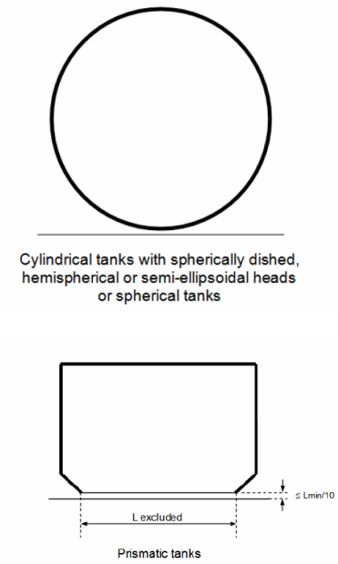

# PART 7 Ships of Special Service (CH5, 6)

> RULES FOR CLASSIFICATION OF STEEL SHIPS / RA-07B-E / 2025 / EN / Rules

## CHAPTER 5 SHIPS CARRYING LIQUEFIED GASES IN BULK

### Section 1 General

#### 101. Application (IGC Code 1.1)

- **1.** The requirements in this Chapter apply to ships regardless of their size, including those of less than 500 gross tonnage, engaged in the carriage of liquefied gases having a vapour pressure exceeding 0.28 $\mathrm{MPa}$ absolute at a temperature of 37.8°C and other products, as shown in **Sec 19**, when carried in bulk.
- **2.** (1) Unless expressly provided otherwise, this Chapter apply to ships whose keels are laid, or which are at a similar stage of construction where:
  on or after 1 July 2016.
  - **(2)** For the purpose of this Chapter, the expression "ships constructed" means ships the keels of which are laid or which are at a similar stage of construction.
  - **(3)** For ships constructed on or after 1 July 1986 and before 1 July 2016, the Society is to ensure that the requirements which are applicable under this Chapter, as adopted by resolution MSC.5(48) as amended by resolutions MSC.17(58), MSC.30(61), MSC.32(63), MSC.59(67), MSC.103(73), MSC.177(79) and MSC.220(82), are complied with.
  - **(4)** The requirements for ships constructed before 1 July 1986 and not having the International Certificate of Fitness for the Carriage of Liquefied Gases in Bulk shall be complied with **Annex 7A-1 「Requirements for Ships not having the International Certificate of Fitness for the Carriage of Liquefied Gases in Bulk」.** *(2021)* **【See Guidance】**
- **3.** Ships depending on type are to be in accordance with the following:
  - **(1)** When cargo tanks contain products for which this Chapter requires a type 1G ship, neither flammable liquids having a flash point of 60 °C (closed cup test) or less, nor flammable products listed in **Sec 19**, are to be carried in tanks located within the protective zones described in **204. 1 (1)**.
  - **(2)** Similarly, when cargo tanks contain products for which this Chapter requires a type 2G/2PG ship, the flammable liquids as described in (1), are not to be carried in tanks located within the protective zones described in **204. 1 (2)**.
  - **(3)** In each case, for cargo tanks loaded with products for which this Chapter requires a type 1G or 2G/2PG ship, the restriction applies to the protective zones within the longitudinal extent of the hold spaces for those tanks.
  - **(4)** The flammable liquids and products described in (1) may be carried within these protective zones when the quantity of products retained in the cargo tanks, for which this Chapter requires a type 1G or 2G/2PG ship is solely used for cooling, circulation or fuelling purposes.
- **4.** When it is intended to carry products covered by this Chapter and products covered by **Ch 6,** the ship is to comply with the requirements of both Chapters appropriate to the products carried.
  - **(1)** The requirements of this Chapter are to take precedence when a ship is designed and constructed for the carriage of the following products:
    - **(A)** those listed exclusively in **Sec 19** of this Chapter; and
    - **(B)** one or more of the products that are listed both in this Chapter and in **Ch 6.** These products are marked with an asterisk in column "a" in the table contained within **Sec 19**.
  - **(2)** When a ship is intended to exclusively carry one or more of the products referred to in (1) (B), the requirements of **Ch 6**, as amended, are to apply.
- **5.** Where reference is made in this Chapter to a paragraph, all the provisions of the subparagraph of that designation are to apply.
- **6.** When a ship is intended to operate for periods at a fixed location in a re-gasification and gas discharge mode or a gas receiving, processing, liquefaction and storage mode, the Society involved in the operation are to take appropriate steps to ensure implementation of the provisions of this Chapter as are applicable to the proposed arrangements. Furthermore, additional requirements are to be established based on the principles of this Chapter as well as recognized standards that address specific risks not envisaged by it. Such risks may include, but not be limited to:
  - **(1)** fire and explosion;
  - **(2)** evacuation;
  - **(3)** extension of hazardous areas;
  - **(4)** pressurized gas discharge to shore;
  - **(5)** high-pressure gas venting;
  - **(6)** process upset conditions;
  - **(7)** storage and handling of flammable refrigerants;
  - **(8)** continuous presence of liquid and vapour cargo outside the cargo containment system;
  - **(9)** tank over-pressure and under-pressure;
  - **(10)** ship-to-ship transfer of liquid cargo; and
  - **(11)** collision risk during berthing manoeuvres.
- **7.** Where a risk assessment or study of similar intent is utilized within this Chapter, the results are also to include, but not be limited to, the following as evidence of effectiveness:
  - **(1)** description of methodology and standards applied;
  - **(2)** potential variation in scenario interpretation or sources of error in the study;
  - **(3)** validation of the risk assessment process by an independent and suitable third party;
  - **(4)** quality system under which the risk assessment was developed;
  - **(5)** the source, suitability and validity of data used within the assessment;
  - **(6)** the knowledge base of persons involved within the assessment;
  - **(7)** system of distribution of results to relevant parties; and
  - **(8)** validation of results by an independent and suitable third party.
- **8.** The ship's hull, machinery and equipment not specified in this Chapter are generally to comply with the requirements in the relevant Parts of the **Rules and Guidance for the Classification of Steel Rules.** *(2021)*
- **9.** As ships with a length of 150$\mathrm{m}$ or more and with membrane-type LNG cargo containment systems contracted for construction after January 1 2021, **Pt 15** of **the Classification and Steel Ship Rules** should be complied. *(2021)*

#### 102. Approval for plans

For classification survey during construction, the following plans and documents as may be required depending upon the products intended to be loaded, condition of cargo storage, construction of cargo containment system and other design conditions are to be submitted in triplicate before the work is commenced.

- **1.** **Plans and data for approval**
  - **(1)** Manufacturing specifications for cargo tanks, insulations and secondary barriers (including welding procedures, inspection and testing procedures for weld and cargo tanks, properties of insulation materials and secondary barriers and their processing manual and working standards)
  - **(2)** Details of cargo tank construction and cargo containment system *(2019)*
  - **(3)** Arrangement of cargo tank accessories including details of fittings inside the tanks
  - **(4)** Details of cargo tank supports, deck portions through which cargo tanks penetrate, and their sealing devices
  - **(5)** Details of secondary barriers
  - **(6)** Specifications and standards of materials (including insulations) used for cargo piping system in connection with design pressure and/or temperature
  - **(7)** Specifications and standards of materials of cargo tanks, insulations, secondary barriers and cargo tank supports
  - **(8)** Layout and details of attachment for insulations
  - **(9)** Constructions of cargo pumps, cargo compressors and their prime movers
  - **(10)** Constructions of main parts of refrigeration systems
  - **(11)** Piping diagrams of cargo and instrument
  - **(12)** Piping diagrams of refrigerant for refrigeration systems
  - **(13)** Bilge arrangements and ventilation systems in hold spaces or interbarrier spaces, cargo pump room, cargo compressor room and cargo control room
  - **(14)** Arrangement of sensors for gas detectors, temperature indicators, and pressure gauges
  - **(15)** Following plans of inert gas systems where hold spaces or interbarrier spaces are filled by inert gases; *(2019)*
    - **(A)** piping diagrams
    - **(B)** arrangement showing the followings;
      - **(a)** inert gas generator
      - **(b)** non-return device
    - **(C)** details of pressure adjusting devices
  - **(16)** Details of pressure relief devices and drainage systems for leakage of liquefied cargo in hold spaces or interbarrier spaces
  - **(17)** Sectional assembly, details of nozzles, fitting arrangement and details of fittings for various pressure vessels
  - **(18)** Details of valves for special purpose, cargo hoses, expansion joints, filters, etc., for cargo piping system
  - **(19)** Following plans of fuel system where cargo is used as fuel; *(2019)*
    - **(A)** piping diagram
    - **(B)** constructions and particulars of gas consumer
    - **(C)** arrangement showing related equipment and fuel line routing
  - **(20)** Electric wiring plans and a table of electrical equipment in dangerous spaces
  - **(21)** Arrangement of earth connections for cargo tanks, pipe lines, machinery, equipment, etc.
  - **(22)** Plans showing dangerous spaces
  - **(23)** Fire extinguishing system stipulated in **Sec 11**.
  - **(24)** Cargo system operation manuals
  - **(25)** Calculation sheets of relieving capacity for pressure relief valves of cargo tank (including calculation of the back pressure in cargo vent system) *(2019)*
  - **(26)** Calculation sheets of relieving capacity for pressure relief valves of cargo piping where required by **505.7** *(2019)*
  - **(27)** Emergency shutdown systems *(2019)*
- **2.** **Plans and data for reference 【See Guidance】**
  - **(1)** Principal basic design and technical reports of cargo containment systems
  - **(2)** Data of test method and its result, where model test is carried out in compliance with the requirements of **Sec 4**.
  - **(3)** Data for notch toughness, corrosiveness, physical and mechanical properties of materials and welded parts at the minimum design temperature and room temperature, where new materials or welding methods are adopted for constructing the cargo tanks, secondary barriers, insulations and others
  - **(4)** Data of design loads stipulated in **403.**
  - **(5)** Calculation sheets of cargo tanks and supports stipulated in **404.** to **406.**
  - **(6)** Data of the test method and the results, where model tests were carried out to demonstrate the strength and performance of cargo tanks, insulations, secondary barriers, cargo tank supports
  - **(7)** Calculation sheets of heat transfer on the main parts of cargo tank under various condition of loading, where considered necessary by the Society.
  - **(8)** Calculation sheets of the thermal stress on the main parts of cargo tank at the condition of the temperature distribution stipulated in (7), where considered necessary by the Society
  - **(9)** Calculation sheets of temperature distribution on hull structure, where considered necessary by the Society
  - **(10)** Specifications of cargo handling systems
  - **(11)** Composition and physical properties of cargoes (including a saturated vapour pressure diagram within the necessary temperature range)
  - **(12)** Calculation sheets for capacity of refrigeration systems
  - **(13)** Cargo piping arrangement and results of stress analysis where design temperature is below -110 ℃
  - **(14)** Calculation sheets of filling limits for cargo tanks
  - **(15)** Arrangement of access manholes stipulated in **305.** in cargo tank area and the guide for access through these manholes.
  - **(16)** Calculation for ship survival capability stipulated in **Sec 2.**
  - **(17)** Equipment for personnel protection stipulated in **Sec 14.**
  - **(18)** Capacity calculation of re-liquefaction system and gas combustion unit, if installed *(2019)*

#### 103. Equivalents

The construction and equipment, etc. which do not fall under the provisions of this Chapter but are considered to be equivalent to those required in this Chapter will be accepted by the Society.

#### 104. National regulations

For the construction and equipment of the ship, attention is to be paid to the requirements of the national regulations of the country in which the ship is registered and/or of the port which the ship intended to visit.

#### 105. Definitions (IGC Code 1.3)

The definitions of terms are to be as specified in the following and **Sec 4,** unless otherwise specified elsewhere.

- **1.** **Accommodation spaces** are those spaces used for public spaces, corridors, lavatories, cabins, offices, hospitals, cinemas, games and hobbies rooms, barber shops, pantries containing no cooking appliances and similar spaces.
- **2.** **A class divisions** are those divisions formed by bulkheads and decks which comply with the following criteria:
  - **(1)** they are constructed of steel or other equivalent material;
  - **(2)** they are suitably stiffened;
  - **(3)** they are insulated with approved non-combustible materials such that the average temperature of the unexposed side will not rise more than 140 ℃ above the original temperature, nor will the temperature, at any one point, including any joint, rise more than 180 ℃ above the original temperature, within the time listed below:
    class "A-60" 60 min
    class "A-30" 30 min
    class "A-15" 15 min
    class "A-0" 0 min
  - **(4)** they are constructed as to be capable of preventing the passage of smoke and flame to the end of the one-hour standard fire test; and
  - **(5)** the Society has required a test of a prototype bulkhead or deck in accordance with the Fire Test Procedures Code to ensure that it meets the requirements above for integrity and temperature rise.
- **3.** **Administration** means the Government of the State whose flag the ship is entitled to fly.
- **4.** **Boiling point** is the temperature at which a product exhibits a vapour pressure equal to the atmospheric pressure.
- **5.** **Breadth (**$B$**)** means the maximum breadth of the ship, measured amidships to the moulded line of the frame in a ship with a metal shell and to the outer surface of the hull in a ship with a shell of any other material. The breadth ($B$) should be measured in metres.
- **6.** **Cargo area** is that part of the ship which contains the cargo containment system and cargo pump and compressor rooms and includes deck areas over the full length and breadth of the part of the ship over these spaces. Where fitted, the cofferdams, ballast or void spaces at the after end of the aftermost hold space or at the forward end of the foremost hold space are excluded from the cargo area. **【See Guidance】**
- **7.** **Cargo containment system** is the arrangement for containment of cargo including, where fitted, a primary and secondary barrier, associated insulation and any intervening spaces, and adjacent structure, if necessary, for the support of these elements. If the secondary barrier is part of the hull structure, it may be a boundary of the hold space.
- **8.** **Cargo control room** is a space used in the control of cargo handling operations.
- **9.** **Cargo machinery spaces** are the spaces where cargo compressors or pumps, cargo processing units, are located, including those supplying gas fuel to the engine-room.
- **10.** **Cargo pumps** are pumps used for the transfer of liquid cargo including main pumps, booster pumps, spray pumps, etc.
- **11.** **Cargoes** are products listed in **Sec 19** carried in bulk by ships subject to this Chapter.
- **12.** **Cargo service spaces** are spaces within the cargo area used for workshops, lockers and store-rooms of more than 2 $\mathrm{m} ^{2}$ in area.
- **13.** **Cargo tank** is the liquid-tight shell designed to be the primary container of the cargo and includes all such containers containment systems whether or not they are associated with insulation or secondary barriers or both.
- **14.** **Closed loop sampling** is a cargo sampling system that minimizes the escape of cargo vapour to the atmosphere by returning product to the cargo tank during sampling.
- **15.** **Cofferdam** is the isolating space between two adjacent steel bulkheads or decks. This space may be a void space or a ballast space.
- **16.** **Control stations** are those spaces in which ship's radio or main navigating equipment or the emergency source of power is located or where the fire-recording or fire-control equipment is centralized. This does not include special fire-control equipment which can be most practically located in the cargo area.
- **17.** **Flammable products** are those identified by an "F" in column "f" in the table of **Sec 19**.
- **18.** **Flammability limits** are the conditions defining the state of fuel-oxidant mixture at which application of an adequately strong external ignition source is only just capable of producing flammability in a given test apparatus.
- **19.** **FSS Code** is the Fire Safety Systems Code meaning the International Code for Fire Safety Systems, adopted by the Maritime Safety Committee of the Organization by resolution MSC.98(73), as amended.
- **20.** **Gas carrier** is a cargo ship constructed or adapted and used for the carriage in bulk of any liquefied gas or other products listed in the table of **Sec 19**.
- **21.** **Gas combustion unit(GCU)** is a means of disposing excess cargo vapour by thermal oxidation.
- **22.** **Gas consumer** is any unit within the ship using cargo vapour as a fuel.
- **23.** **Hazardous area** is an area in which an explosive gas atmosphere is, or may be expected to be present, in quantities that require special precautions for the construction, installation and use of electrical equipment. When a gas atmosphere is present, the following hazards may also be present: toxicity, asphyxiation, corrosivity, reactivity and low temperature. These hazards are also to be taken into account and additional precautions for the ventilation of spaces and protection of the crew will need to be considered. Examples of hazardous areas include, but are not limited to, the following: **【See Guidance】**
  (Refer to **Sec 10** for a separate list of examples and classification of hazardous areas for the purpose of selection and design of electrical installations.)
  - **(1)** the interiors of cargo containment systems and any pipework of pressure-relief or other venting systems for cargo tanks, pipes and equipment containing the cargo;
  - **(2)** interbarrier spaces;
  - **(3)** hold spaces where the cargo containment system requires a secondary barrier;
  - **(4)** hold spaces where the cargo containment system does not require a secondary barrier;
  - **(5)** a space separated from a hold space by a single gastight steel boundary where the cargo containment system requires a secondary barrier;
  - **(6)** cargo machinery spaces;
  - **(7)** areas on open deck, or semi-enclosed spaces on open deck, within 3 m of possible sources of gas release, such as cargo valve, cargo pipe flange, cargo machinery space ventilation outlet, etc.;
  - **(8)** areas on open deck, or semi-enclosed spaces on open deck within 1.5 m of cargo machinery space entrances, cargo machinery space ventilation inlets;
  - **(9)** areas on open deck over the cargo area and 3 m forward and aft of the cargo area on the open deck up to a height of 2.4 m above the weather deck;
  - **(10)** an area within 2.4 m of the outer surface of a cargo containment system where such surface is exposed to the weather;
  - **(11)** enclosed or semi-enclosed spaces in which pipes containing cargoes are located, except those where pipes containing cargo products for boil-off gas fuel burning systems are located;
  - **(12)** an enclosed or semi-enclosed space having a direct opening into any hazardous area;
  - **(13)** void spaces, cofferdams, trunks, passageways and enclosed or semi-enclosed spaces, adjacent to, or immediately above or below, the cargo containment system;
  - **(14)** areas on open deck or semi-enclosed spaces on open deck above and in the vicinity of any vent riser outlet, within a vertical cylinder of unlimited height and 6 m radius centred upon the centre of the outlet and within a hemisphere of 6 m radius below the outlet; and
  - **(15)** areas on open deck within spillage containment surrounding cargo manifold valves and 3 m beyond these up to a height of 2.4 m above deck.
- **24.** **Non-hazardous area** is an area other than a hazardous area.
- **25.** **Hold space** is the space enclosed by the ship's structure in which a cargo containment system is situated. **【See Guidance】**
- **26.** **Independent** means that a piping or venting system, for example, is in no way connected to another system and there are no provisions available for the potential connection to other systems. **【See Guidance】**
- **27.** **Insulation space** is the space, which may or may not be an interbarrier space, occupied wholly or in part by insulation.
- **28.** **Interbarrier space** is the space between a primary and a secondary barrier, whether or not completely or partially occupied by insulation or other material. **【See Guidance】**
- **29.** **Length (**$L$**)** is the length as defined in the International Convention on Load Lines in force.
- **30.** **Machinery spaces of category A** are those spaces, and trunks to such spaces, which contain:
  - **(1)** internal combustion machinery used for main propulsion; or
  - **(2)** internal combustion machinery used for purposes other than main propulsion where such machinery has, in the aggregate, a total power output of not less than 375 $\mathrm{kW}$; or
  - **(3)** any oil-fired boiler or oil fuel unit or any oil-fired equipment other than boilers, such as inert gas generators, incinerators, etc.
- **31.** **Machinery spaces** are all machinery spaces of category A and all other spaces containing propelling machinery, boilers, oil fuel units, steam and internal combustion engines, generators and major electrical machinery, oil filling stations, refrigerating, stabilizing, ventilation and air-conditioning machinery, and similar spaces and trunks to such spaces.
- **32.** **MARVS** is the maximum allowable relief valve setting of a cargo tank.
- **33.** **Nominated surveyor** is a surveyor nominated/appointed by an Administration to enforce the provisions of the SOLAS Convention regulations with regard to inspections and surveys and the granting of exemptions therefrom.
- **34.** **Oil fuel unit** is the equipment used for the preparation of oil fuel for delivery to an oil-fired boiler, or equipment used for the preparation for delivery of heated oil to an internal combustion engine, and includes any oil pressure pumps, filters and heaters dealing with oil at a pressure of more than 0.18 $\mathrm{MPa}$ gauge.
- **35.** **Organization** is the International Maritime Organization (IMO).
- **36.** **Permeability** of a space means the ratio of the volume within that space which is assumed to be occupied by water to the total volume of that space.
- **37.** **Port Administration** means the appropriate authority of the country for the Port where the ship is loading or unloading.
- **38.** **Primary barrier** is the inner element designed to contain the cargo when the cargo containment system includes two boundaries.
- **39.** **Products** is the collective term used to cover the list of gases indicated in **Sec 19** of this Chapter.
- **40.** **Public spaces** are those portions of the accommodation that are used for halls, dining rooms, lounges and similar permanently enclosed spaces.
- **41.** **Recognized organization** is an organization authorized by an Administration in accordance with SOLAS regulation XI-1/1.
- **42.** **Recognized standards** are applicable international or national standards acceptable to the Society or standards laid down and maintained by the recognized organization.
- **43.** **Relative density** is the ratio of the mass of a volume of a product to the mass of an equal volume of fresh water.
- **44.** **Secondary barrier** is the liquid-resisting outer element of a cargo containment system, designed to afford temporary containment of any envisaged leakage of liquid cargo through the primary barrier and to prevent the lowering of the temperature of the ship's structure to an unsafe level. Types of secondary barrier are more fully defined in **Sec 4**.
- **45.** **Separate systems** are those cargo piping and vent systems that are not permanently connected to each other.
- **46.** **Service spaces** are those spaces used for galleys, pantries containing cooking appliances, lockers, mail and specie rooms, store-rooms, workshops other than those forming part of the machinery spaces, and similar spaces and trunks to such spaces.
- **47.** **SOLAS Convention** means the International Convention for the Safety of Life at Sea, 1974, as amended.
- **48.** **Tank cover** is the protective structure intended to either protect the cargo containment system against damage where it protrudes through the weather deck or to ensure the continuity and integrity of the deck structure.
- **49.** **Tank dome** is the upward extension of a portion of a cargo tank. In the case of below-deck cargo containment systems, the tank dome protrudes through the weather deck or through a tank cover.
- **50.** **Thermal oxidation method** means a system where the boil-off vapours are utilized as fuel for shipboard use or as a waste heat system subject to the provisions of **Sec 16** or a system not using the gas as fuel complying with this Chapter.
- **51.** **Toxic products** are those identified by a "T" in column "f" in the table of **Sec 19**.
- **52.** **Turret compartments** are those spaces and trunks that contain equipment and machinery for retrieval and release of the disconnectable turret mooring system, high-pressure hydraulic operating systems, fire protection arrangements and cargo transfer valves.
- **53.** **Vapour pressure** is the equilibrium pressure of the saturated vapour above the liquid, expressed in bar Pascals (Pa) absolute at a specified temperature.
- **54.** **Void space** is an enclosed space in the cargo area external to a cargo containment system, other than a hold space, ballast space, fuel oil tank, cargo pump or compressor room, or any space in normal use by personnel.

### Section 2 Ship Survival Capability and Location of Cargo Tanks

#### 201. General (IGC Code 2.1)

- **1.** Ships subject to this Chapter shall survive the hydrostatic effects of flooding following assumed hull damage caused by some external force. In addition, to safeguard the ship and the environment, the cargo tanks shall be protected from penetration in the case of minor damage to the ship resulting, for example, from contact with a jetty or tug boat, and also given a measure of protection from damage in the case of collision or grounding, by locating them at specified minimum distances inboard from the ship's shell plating. Both the damage to be assumed and the proximity of the tanks to the ship's shell shall be dependent upon the degree of hazard presented by the product to be carried. In addition, the proximity of the cargo tanks to the ship's shell shall be dependent upon the volume of the cargo tank.
- **2.** Ships subject to the Chapter shall be designed to one of the following standards:
  - **(1)** A type 1G ship is a gas carrier intended to transport the products indicated in **Sec 19** that require maximum preventive measures to preclude their escape.
  - **(2)** A type 2G ship is a gas carrier intended to transport the products indicated in **Sec 19**, that require significant preventive measures to preclude their escape.
  - **(3)** A type 2PG ship is a gas carrier of 150 m in length or less intended to transport the products indicated in **Sec 19** that require significant preventive measures to preclude their escape, and where the products are carried in type C independent tanks designed (see **423.**) for a MARVS of at least 0.7 MPa gauge and a cargo containment system design temperature of -55°C or above. A ship of this description that is over 150 m in length is to be considered a type 2G ship.
  - **(4)** A type 3G ship is a gas carrier intended to carry the products indicated in **Sec 19** that require moderate preventive measures to preclude their escape.
    Therefore, a type 1G ship is a gas carrier intended for the transportation of products considered to present the greatest overall hazard and types 2G/2PG and type 3G for products of progressively lesser hazards. Accordingly, a type 1G ship shall survive the most severe standard of damage and its cargo tanks shall be located at the maximum prescribed distance inboard from the shell plating.
- **3.** The ship type required for individual products is indicated in column "c" in the table of **Sec 19**.
- **4.** If a ship is intended to carry more than one of the products listed in **Sec 19**, the standard of damage shall correspond to the product having the most stringent ship type requirements. The requirements for the location of individual cargo tanks, however, are those for ship types related to the respective products intended to be carried.
- **5.** **5**. For the purpose of this Chapter, the position of the moulded line for different containment systems is shown in **Fig 7.5.1** (a) to (e).

  |  |
  | --- |
  | **Fig 7.5.1 (a) Protective distance (Independent prismatic tank)** |
  |  |
  | **Fig 7.5.1 (b) Protective distance (Semi-membrane tank)** |

  |  |
  | --- |
  | **Fig 7.5.1 (c) Protective distance (Membrane tank)** |
  |  |
  | **Fig 7.5.1 (d) Protective distance (Spherical tank)** |

  
  **Fig 7.5.1 (e) Protective distance (Pressure type tank)**

#### 202. Freeboard and stability (IGC Code 2.2)

- **1.** Ships subject to the Chapter may be assigned the minimum freeboard permitted by the International Convention on Load Lines in force. However, the draught associated with the assignment shall not be greater than the maximum draught otherwise permitted by this Chapter.
- **2.** The stability of the ship, in all seagoing conditions and during loading and unloading cargo, shall comply with the requirements of this Society. This includes partial filling and loading and unloading at sea, when applicable. Stability during ballast water operations shall fulfil stability criteria.
- **3.** When calculating the effect of free surfaces of consumable liquids for loading conditions, it shall be assumed that, for each type of liquid, at least one transverse pair or a single centre tank has a free surface. The tank or combination of tanks to be taken into account shall be those where the effect of free surfaces is the greatest. The free surface effect in undamaged compartments shall be calculated by a method acceptable to the Society.
- **4.** Solid ballast shall not normally be used in double bottom spaces in the cargo area. Where, however, because of stability considerations, the fitting of solid ballast in such spaces becomes unavoidable, its disposition shall be governed by the need to enable access for inspection and to ensure that the impact loads resulting from bottom damage are not directly transmitted to the cargo tank structure. **【See Guidance】**
- **5.** The master of the ship shall be supplied with a loading and stability information booklet. This booklet shall contain details of typical service conditions, loading, unloading and ballasting operations, provisions for evaluating other conditions of loading and a summary of the ship's survival capabilities. The booklet shall also contain sufficient information to enable the master to load and operate the ship in a safe and seaworthy manner.
- **6.** All ships, subject to the **IGC Code** shall be fitted with a stability instrument, capable of verifying compliance with intact and damage stability requirements, approved by this Society having regard to the performance standards recommended by the Organization. **【See Guidance】**
  - **(1)** ships constructed before 1 July 2016 shall comply with this paragraph at the first scheduled renewal survey of the ship after 1 July 2016 but not later than 1 July 2021;
  - **(2)** notwithstanding the requirements of (1) a stability instrument installed on a ship constructed before 1 July 2016 need not be replaced provided it is capable of verifying compliance with intact and damage stability, to the satisfaction of this Society.
  - **(3)** However where deemed appropriate by the Society, the requirements of **6.** may be exempted, and this exemption shall be specified in **IGC Certificate.**
- **7.** The ships not subjected to **6.** are to be compliance with the requirements of flag states.
- **8.** **Conditions of loading**
  Damage survival capability shall be investigated on the basis of loading information submitted to the Society for all anticipated conditions of loading and variations in draught and trim. This shall include ballast and, where applicable, cargo heel.

#### 203. Damage assumptions (IGC Code 2.3)

- **1.** The assumed maximum extent of damage shall be:

  **(1) Side damage:**

  | (A) Longitudinal extent: | 1/3 $L ^{2/3}$ or 14.5 $\mathrm{m}$, whichever is less |   |
  | --- | --- | --- |
  | (B) Transverse extent: | $B$/5 or 11.5 $\mathrm{m}$, whichever is less, measured inboard from the moulded line of the outer shell at right angles to the centreline at the level of the summer waterline |   |
  | (C) Vertical extent: | Upwards, without limit, from the moulded line of the outer shell |   |
  | (2) Bottom damage: |   |   |
  |   | For 0.3 $L$ from the forward perpendicular of the ship | Any other part of the ship |
  | (A) Longitudinal extent: | 1/3$L ^{2/3}$ or 14.5 $\mathrm{m}$, whichever is less | 1/3$L ^{2/3}$ or 14.5 $\mathrm{m}$, whichever is less |
  | (B) Transverse extent: | $B$/6 or 10 $\mathrm{m}$, whichever is less | $B$/6 or 5 $\mathrm{m}$, whichever is less |
  | (C) Vertical extent: | $B$/15 or 2 $\mathrm{m}$, whichever is less, measured from the moulded line of the bottom shell plating at centreline (see **204. 3**) | $B$/15 or 2 $\mathrm{m}$, whichever is less measured from the moulded line of the bottom shell plating at centreline (see **204. 3**) |
- **2.** **Other damage:**
  - **(1)** If any damage of a lesser extent than the maximum damage specified in **1.** would result in a more severe condition, such damage should be assumed.
  - **(2)** Local damage anywhere in the cargo area extending inboard distance $d$ as defined in **204. 1**, measured normal to the moulded line of the outer shell shall be considered. Bulkheads shall be assumed damaged when the relevant subparagraphs of **206. 1** apply. If a damage of a lesser extent than $d$ would result in a more severe condition, such damage shall be assumed. **【See Guidance】**

#### 204. Location of cargo tanks (IGC Code 2.4)

- **1.** Cargo tanks shall be located at the following distances inboard:
  - **(1)** Type 1G ships: from the moulded line of the outer shell, not less than the transverse extent of damage specified in **203. 1** (1) (B) and, from the moulded line of the bottom shell at centreline, not less than the vertical extent of damage specified in **203. 1** (2) (C) and nowhere less than $d$ where $d$ is as follows:
    where:
    - $V _{c}$ corresponds to 100% of the gross design volume of the individual cargo tank at 20°C, including domes and appendages (see **Fig 7.5.2** and **Fig 7.5.3**). For the purpose of cargo tank protective distances, the cargo tank volume is the aggregate volume of all the parts of tank that have a common bulkhead(s); and
    - $d$ is measured at any cross section at a right angle from the moulded line of outer shell.
    Tank size limitations may apply to type 1G ship cargoes in accordance with **Sec 17**.
    - **(A)** for $V _{c}$ below or equal $1,000 \mathrm{m} ^{3}$, $d=0.8\mathrm{m}$;
    - **(B)** for $1,000 {\mathrm{m}} ^{3} \prec V _{c} \prec 5,000\mathrm{m} ^{3}$, $d=0.75 + V _{c} \times 0.2/4,000 \mathrm{m}$;
    - **(C)** for $5,000 {\mathrm{m}} ^{3} \leq V _{c} \prec 30,000\mathrm{m} ^{3}$, $d=0.8 + V _{c} /25,000 \mathrm{m}$; and
    - **(D)** for $V _{c} \geq 30,000 \mathrm{m} ^{3}$, $d=2 \mathrm{m}$,
  - **(2)** Types 2G/2PG: from the moulded line of the bottom shell at centreline not less than the vertical extent of damage specified in **203. 1** (2) (C) and nowhere less than $d$ as indicated in **204. 1** (1) (see **Fig 7.5.2** and **Fig 7.5.4**).
  - **(3)** Type 3G ships: from the moulded line of the bottom shell at centreline not less than the vertical extent of damage specified in **203. 1** (2) (C) and nowhere less than $d$, where $d=0.8m$ from the moulded line of outer shell (see **Fig 7.5.2** and **Fig 7.5.5**).
- **2.** For the purpose of tank location, the vertical extent of bottom damage shall be measured to the inner bottom when membrane or semi-membrane tanks are used, otherwise to the bottom of the cargo tanks. The transverse extent of side damage shall be measured to the longitudinal bulkhead when membrane or semi-membrane tanks are used, otherwise to the side of the cargo tanks. The distances indicated in **203.** and **204.** shall be applied as in **Fig 7.5.1** (a) to (e). These distances shall be measured plate to plate, from the moulded line to the moulded line, excluding insulation.
- **3.** Except for type 1G ships, suction wells installed in cargo tanks may protrude into the vertical extent of bottom damage specified in **203. 1** (2) (C) provided that such wells are as small as practicable and the protrusion below the inner bottom plating does not exceed 25% of the depth of the double bottom or 350 $\mathrm{mm}$, whichever is less. Where there is no double bottom, the protrusion below the upper limit of bottom damage shall not exceed 350 $\mathrm{mm}$. Suction wells installed in accordance with this paragraph may be ignored when determining the compartments affected by damage. **【See Guidance】**
- **4.** Cargo tanks shall not be located forward of the collision bulkhead.

  |  |
  | --- |
  | **Fig 7.5.2 Cargo tank location requirements (Centerline Profile - Type 1G, 2G, 2PG and 3G Ship)** |
  |  |
  | **Fig 7.5.3 Cargo tank location requirements (Transverse Sections - Type 1G Ship)** |

  |  |
  | --- |
  | **Fig 7.5.4 Cargo tank location requirements (Transverse Sections - Type 2G and 2PG Ship)** |
  |  |
  | **Fig 7.5.5 Cargo tank location requirements (Transverse Sections - Type 3G Ship)** |

#### 205. Flood assumptions (IGC Code 2.5) 【See Guidance】

- **1.** The requirements of **207.** shall be confirmed by calculations that take into consideration the design characteristics of the ship, the arrangements, configuration and contents of the damaged compartments, the distribution, relative densities and the free surface effects of liquids and the draught and trim for all conditions of loading.
- **2.** The permeabilities of spaces assumed to be damaged shall be as follows:

  | Spaces | Permeabilities |
  | --- | --- |
  | Stores Accommodation Machinery Voids Hold spaces Consumable liquids Other liquids | 0.6 0.95 0.85 0.95 0.95(1) 0 to 0.95(2) 0 to 0.95(2) |
  | Note (1) Other values of permeability can be considered based on the detailed calculations. Interpretations of regulation of part B-1 of SOLAS chapter II-1 (MSC/Circ.651) are referred. (2) The permeability of partially filled compartments shall be consistent with the amount of liquid carried in the compartment. |   |
- **3.** Wherever damage penetrates a tank containing liquids, it should be assumed that the contents are completely lost from that compartment and replaced by salt water up to the level of the final plane of equilibrium.
- **4.** Where the damage between transverse watertight bulkheads is envisaged, as specified in **206. 1** (4), (5), and (6), transverse bulkheads shall be spaced at least at a distance equal to the longitudinal extent of damage specified in **203. 1** (1) (A) in order to be considered effective. Where transverse bulkheads are spaced at a lesser distance, one or more of these bulkheads within such extent of damage shall be assumed as non-existent for the purpose of determining flooded compartments. Further, any portion of a transverse bulkhead bounding side compartments or double bottom compartments shall be assumed damaged if the watertight bulkhead boundaries are within the extent of vertical or horizontal penetration required by **203.** Also, any transverse bulkhead shall be assumed damaged if it contains a step or recess of more than 3 m in length located within the extent of penetration of assumed damage. The step formed by the after peak bulkhead and the after peak tank top shall not be regarded as a step for the purpose of this paragraph.
- **5.** The ship should be so designed as to keep unsymmetrical flooding to the minimum consistent with efficient arrangements.
- **6.** Equalization arrangements requiring mechanical aids such as valves or cross-levelling pipes, if fitted, shall not be considered for the purpose of reducing an angle of heel or attaining the minimum range of residual stability to meet the requirements of **207. 1**, and sufficient residual stability shall be maintained during all stages where equalization is used. Spaces linked by ducts of large cross-sectional area may be considered to be common.
- **7.** If pipes, ducts, trunks or tunnels are situated within the assumed extent of damage penetration, as defined in **203.**, arrangements shall be such that progressive flooding cannot thereby extend to compartments other than those assumed to be flooded for each case of damage.
- **8.** The buoyancy of any superstructure directly above the side damage shall be disregarded. However, the unflooded parts of superstructures beyond the extent of damage may be taken into consideration, provided that:
  - **(1)** they are separated from the damaged space by watertight divisions and the requirements of **207. 1** (1) in respect of these intact spaces are complied with; and
  - **(2)** openings in such divisions are capable of being closed by remotely operated sliding watertight doors and unprotected openings are not immersed within the minimum range of residual stability required in **207. 2** (1). However, the immersion of any other openings capable of being closed weathertight may be permitted.

#### 206. Standard of damage (IGC Code 2.6) 【See Guidance】

- **1.** Ships shall be capable of surviving the damage indicated in **203.** with the flood assumptions in **205.**, to the extent determined by the ship's type, according to the following standards:
  - **(1)** A type 1G ship shall be assumed to sustain damage anywhere in its length;
  - **(2)** A type 2G ship of more than 150 m in length shall be assumed to sustain damage anywhere in its length;
  - **(3)** A type 2G ship of 150 m in length or less shall be assumed to sustain damage anywhere in its length, except involving either of the bulkheads bounding a machinery space located aft;
  - **(4)** A type 2PG ship shall be assumed to sustain damage anywhere in its length except involving transverse bulkheads spaced further apart than the longitudinal extent of damage as specified in **203. 1** (1) (A);
  - **(5)** A type 3G ship of 80 m in length or more shall be assumed to sustain damage anywhere in its length, except involving transverse bulkheads spaced further apart than the longitudinal extent of damage specified in **203. 1** (1) (A); and
  - **(6)** A type 3G ship less than 80 m in length shall be assumed to sustain damage anywhere in its length, except involving transverse bulkheads spaced further apart than the longitudinal extent of damage specified in **203. 1** (1) (A) and except damage involving the machinery space when located after.
- **2.** In the case of small type 2G/2PG and 3G ships that do not comply in all respects with the appropriate requirements of **1** (3), (4) and (6), special dispensations may only be considered by the Society provided that alternative measures can be taken which maintain the same degree of safety. The nature of the alternative measures shall be approved and clearly stated and be available to the Port Administration. Any such dispensation shall be duly noted on the **IGC Certificate** referred to in **104. 4**.

#### 207. Survival requirements (IGC Code 2.7) 【See Guidance】

Ships subject to this Chapter shall be capable of surviving the assumed damage specified in **203.**, to the standard provided in **206.**, in a condition of stable equilibrium and shall satisfy the following criteria.

- **1.** **In any stage of flooding:** ***(2024)***
  - **(1)** the waterline, taking into account sinkage, heel and trim, should be below the lower edge of any opening through which progressive flooding or downflooding may take place. Such openings should include air pipes and openings that are closed by means of weathertight doors or hatch covers. But the opening that are closed by the following means may be excluded.
    - **(A)** watertight manhole covers and watertight flush scuttles,
    - **(B)** small watertight cargo tank hatch covers that maintain the high integrity of the deck,
    - **(B)** remotely operated sliding watertight doors,
    - **(D)** hinged watertight access doors with open/closed indication locally and at the navigation bridge of the quick-acting or single-action type that are normally closed at sea,
    - **(E)** hinged watertight doors that are permanently closed at sea, and
    - **(F)** sidescuttles of the non-opening type;
  - **(2)** the maximum angle of heel due to unsymmetrical flooding shall not exceed 30°; and
  - **(3)** the residual stability during intermediate stages of flooding shall not be less than that required by **2** (1).
- **2.** **At final equilibrium after flooding:**
  - **(1)** the righting lever curve shall have a minimum range of 20° beyond the position of equilibrium in association with a maximum residual righting lever of at least 0.1 $\mathrm{m}$ within the 20° range; the area under the curve within this range shall not be less than 0.0175 $\mathrm{m}.rad$. The 20° range may be measured from any angle commencing between the position of equilibrium and the angle of 25° (or 30° if no deck immersion occurs). Unprotected openings shall not be immersed within this range unless the space concerned is assumed to be flooded. Within this range, the immersion of any of the openings listed in **1** (1) and other openings capable of being closed weathertight may be permitted; and
  - **(2)** the emergency source of power shall be capable of operating.
    
    **Fig 7.5.6**

### Section 3 Ship Arrangements

#### 301. Segregation of the cargo area (IGC Code 3.1) 【See Guidance】

- **1.** Hold spaces shall be segregated from machinery and boiler spaces, accommodation spaces, service spaces, control stations, chain lockers, domestic water tanks and from stores. Hold spaces shall be located forward of machinery spaces of category A. Alternative arrangements, including locating machinery spaces of category A forward, may be accepted, based on SOLAS regulation II-2/17, after further consideration of involved risks, including that of cargo release and the means of mitigation.
- **2.** Where cargo is carried in a cargo containment system not requiring a complete or partial secondary barrier, segregation of hold spaces from spaces referred to in **1.** or spaces either below or outboard of the hold spaces may be effected by cofferdams, oil fuel tanks or a single gastight bulkhead of all-welded construction forming an "A-60" class division. A gastight "A-0" class division is acceptable if there is no source of ignition or fire hazard in the adjoining spaces.
- **3.** Where cargo is carried in a cargo containment system requiring a complete or partial secondary barrier, segregation of hold spaces from spaces referred to in **1**, or spaces either below or outboard of the hold spaces that contain a source of ignition or fire hazard, shall be effected by cofferdams or oil fuel tanks. A gastight "A-0" class division is acceptable if there is no source of ignition or fire hazard in the adjoining spaces.
- **4.** Turret compartments segregation from spaces referred to in **1**, or spaces either below or outboard of the turret compartment that contain a source of ignition or fire hazard, shall be effected by cofferdams or an A-60 class division. A gastight "A-0" class division is acceptable if there is no source of ignition or fire hazard in the adjoining spaces.
- **5.** In addition, the risk of fire propagation from turret compartments to adjacent spaces shall be evaluated by a risk analysis (see **101. 7**) and further preventive measures, such as the arrangement of a cofferdam around the turret compartment, shall be provided if needed.
- **6.** When cargo is carried in a cargo containment system requiring a complete or partial secondary barrier:
  - **(1)** at temperatures below -10°C, hold spaces shall be segregated from the sea by a double bottom; and
  - **(2)** at temperatures below -55°C, the ship shall also have a longitudinal bulkhead forming side tanks.
- **7.** Arrangements shall be made for sealing the weather decks in way of openings for cargo containment systems.

#### 302. Accommodation, service and machinery spaces and control stations (IGC Code 3.2) 【See Guidance】

- **1.** No accommodation space, service space or control station shall be located within the cargo area. The bulkhead of accommodation spaces, service spaces or control stations that face the cargo area shall be so located as to avoid the entry of gas from the hold space to such spaces through a single failure of a deck or bulkhead on a ship having a containment system requiring a secondary barrier.
- **2.** To guard against the danger of hazardous vapours, due consideration shall be given to the location of air intakes/outlets and openings into accommodation, service and machinery spaces and control stations in relation to cargo piping, cargo vent systems and machinery space exhausts from gas burning arrangements.
- **3.** Access through doors, gastight or otherwise, shall not be permitted from a non-hazardous area to a hazardous area except for access to service spaces forward of the cargo area through airlocks, as permitted by **306. 1**, when accommodation spaces are aft.
- **4.** (1) Entrances, air inlets and openings to accommodation spaces, service spaces, machinery spaces and control stations shall not face the cargo area. They shall be located on the end bulkhead not facing the cargo area or on the outboard side of the superstructure or deckhouse or on both at a distance of at least 4 % of the length ($L$) of the ship but not less than 3 $\mathrm{m}$ from the end of the superstructure or deckhouse facing the cargo area. This distance, however, need not exceed 5 $\mathrm{m}$.
  - **(2)** Windows and sidescuttles facing the cargo area and on the sides of the superstructures or deckhouses within the distance mentioned above shall be of the fixed (non-opening) type. Wheelhouse windows may be non-fixed and wheelhouse doors may be located within the above limits so long as they are designed in a manner that a rapid and efficient gas and vapour tightening of the wheelhouse can be ensured.
  - **(3)** For ships dedicated to the carriage of cargoes that have neither flammable nor toxic hazards, the Society may approve relaxations from the above requirements.
  - **(4)** Accesses to forecastle spaces containing sources of ignition may be permitted through a single door facing the cargo area, provided the doors are located outside hazardous areas as defined in **Sec 10**.
- **5.** Windows and sidescuttles facing the cargo area and on the sides of the superstructures and deckhouses within the limits specified in **4** (1), except wheelhouse windows, shall be constructed to "A-60" class. Sidescuttles in the shell below the uppermost continuous deck and in the first tier of the superstructure or deckhouse shall be of fixed (non-opening) type. *(2019)*
- **6.** All air intakes, outlets and other openings into the accommodation spaces, service spaces and control stations shall be fitted with closing devices. When carrying toxic products, they shall be capable of being operated from inside the space. The requirement for fitting air intakes and openings with closing devices operated from inside the space for toxic products need not apply to spaces not normally manned, such as deck stores, forecastle stores, workshops. In addition, the requirement does not apply to cargo control rooms located within the cargo area.
- **7.** Control rooms and machinery spaces of turret systems may be located in the cargo area forward or aft of cargo tanks in ships with such installations. Access to such spaces containing sources of ignition may be permitted through doors facing the cargo area, provided the doors are located outside hazardous areas or access is through airlocks.

#### 303. Cargo machinery spaces and turret compartments (IGC Code 3.3) 【See Guidance】

- **1.** Cargo machinery spaces shall be situated above the weather deck and located within the cargo area. Cargo machinery spaces and turret compartments shall be treated as cargo pump-rooms for the purpose of fire protection according to SOLAS regulation II-2/9.2.4, and for the purpose of prevention of potential explosion according to SOLAS regulation ll-2/4.5.10.
- **2.** When cargo machinery spaces are located at the after end of the aftermost hold space or at the forward end of the foremost hold space, the limits of the cargo area, as defined in **105. 6**, shall be extended to include the cargo machinery spaces for the full breadth and depth of the ship and the deck areas above those spaces.
- **3.** Where the limits of the cargo area are extended by **2**, the bulkhead that separates the cargo machinery spaces from accommodation and service spaces, control stations and machinery spaces of category A shall be located so as to avoid the entry of gas to these spaces through a single failure of a deck or bulkhead.
- **4.** Cargo compressors and cargo pumps may be driven by electric motors in an adjacent non-hazardous space separated by a bulkhead or deck, if the seal around the bulkhead penetration ensures effective gastight segregation of the two spaces. Alternatively, such equipment may be driven by certified safe electric motors adjacent to them if the electrical installation complies with the requirements of **Sec 10.**
- **5.** Arrangements of cargo machinery spaces and turret compartments shall ensure safe unrestricted access for personnel wearing protective clothing and breathing apparatus, and in the event of injury to allow unconscious personnel to be removed. At least two widely separated escape routes and doors shall be provided in cargo machinery spaces, except that a single escape route may be accepted where the maximum travel distance to the door is 5 m or less.
- **6.** All valves necessary for cargo handling shall be readily accessible to personnel wearing protective clothing. Suitable arrangements shall be made to deal with drainage of pump and compressor rooms.
- **7.** Turret compartments shall be designed to retain their structural integrity in case of explosion or uncontrolled high-pressure gas release (overpressure and/or brittle fracture), the characteristics of which shall be substantiated on the basis of a risk analysis with due consideration of the capabilities of the pressure relieving devices.

#### 304. Cargo control rooms (IGC Code 3.4) 【See Guidance】

- **1.** Any cargo control room shall be above the weather deck and may be located in the cargo area. The cargo control room may be located within the accommodation spaces, service spaces or control stations, provided the following conditions are complied with:
  - **(1)** the cargo control room is a non-hazardous area;
  - **(2)** if the entrance complies with **302. 4** (1), the control room may have access to the spaces described above; and
  - **(3)** if the entrance does not comply with **302. 4** (1), the cargo control room shall have no access to the spaces described above and the boundaries for such spaces shall be insulated to "A-60" class.
- **2.** If the cargo control room is designed to be a non-hazardous area, instrumentation shall, as far as possible, be by indirect reading systems and shall, in any case, be designed to prevent any escape of gas into the atmosphere of that space. Location of the gas detection system within the cargo control room will not cause the room to be classified as a hazardous area, if installed in accordance with **1306. 11**
- **3.** If the cargo control room for ships carrying flammable cargoes is classified as a hazardous area, sources of ignition shall be excluded and any electrical equipment shall be installed in accordance with **Sec 10**.

#### 305. Access to spaces in the cargo area (IGC Code 3.5) 【See Guidance】

- **1.** Visual inspection of at least one side of the inner hull structure shall be possible without the removal of any fixed structure or fitting. If such a visual inspection, whether combined with those inspections required in **2**, **406. 2** (4) or **420. 3** (7) or not, is only possible at the outer face of the inner hull, the inner hull shall not be a fuel-oil tank boundary wall.
- **2.** Inspection of one side of any insulation in hold spaces shall be possible. If the integrity of the insulation system can be verified by inspection of the outside of the hold space boundary when tanks are at service temperature, inspection of one side of the insulation in the hold space need not be required.
- **3.** Arrangements for hold spaces, void spaces, cargo tanks and other spaces classified as hazardous areas, shall be such as to allow entry and inspection of any such space by personnel wearing protective clothing and breathing apparatus and shall also allow for the evacuation of injured and/or unconscious personnel. Such arrangements shall comply with the following:
  - **(1)** Access shall be provided as follows:
    - **(A)** access to all cargo tanks. Access shall be direct from the weather deck;
    - **(B)** access through horizontal openings¸ hatches or manholes. The dimensions shall be sufficient to allow a person wearing a breathing apparatus to ascend or descend any ladder without obstruction, and also to provide a clear opening to facilitate the hoisting of an injured person from the bottom of the space. The minimum clear opening shall be not less than 600 $\mathrm{mm}$ x 600 $\mathrm{mm}$;
    - **(C)** access through vertical openings or manholes providing passage through the length and breadth of the space. The minimum clear opening shall be not less than 600 $\mathrm{mm}$ x 800 $\mathrm{mm}$ at a height of not more than 600 $\mathrm{mm}$ from the bottom plating unless gratings or other footholds are provided; and
    - **(D)** circular access openings to type C tanks shall have a diameter of not less than 600 $\mathrm{mm}$.
  - **(2)** The dimensions referred to in (1) (B) and (C) may be decreased, if the requirements of **305. 3** can be met to the satisfaction of the Society.
  - **(3)** Where cargo is carried in a containment system requiring a secondary barrier, the requirements of (1) (B) and (C) do not apply to spaces separated from a hold space by a single gastight steel boundary. Such spaces shall be provided only with direct or indirect access from the weather deck, not including any enclosed non-hazardous area.
  - **(4)** Access required for inspection shall be a designated access through structures below and above cargo tanks, which shall have at least the cross-sections as required by (1) (C)
  - **(5)** For the purpose of **1** or **2**, the following shall apply:
    - **(A)** where it is required to pass between the surface to be inspected, flat or curved, and structures such as deck beams, stiffeners, frames, girders, etc., the distance between that surface and the free edge of the structural elements shall be at least 380 $\mathrm{mm}$. The distance between the surface to be inspected and the surface to which the above structural elements are fitted, e.g. deck, bulkhead or shell, shall be at least 450 $\mathrm{mm}$ for a curved tank surface (e.g. for a type C tank), or 600 $\mathrm{mm}$ for a flat tank surface (e.g. for a type A tank) (see **Fig 7.5.7**);
    - **(B)** where it is not required to pass between the surface to be inspected and any part of the structure, for visibility reasons the distance between the free edge of that structural element and the surface to be inspected shall be at least 50 $\mathrm{mm}$ or half the breadth of the structure's face plate, whichever is the larger (see **Fig 7.5.8**);
    - **(C)** if for inspection of a curved surface where it is required to pass between that surface and another surface, flat or curved, to which no structural elements are fitted, the distance between both surfaces shall be at least 380 $\mathrm{mm}$ (see **Fig 7.5.9**). Where it is not required to pass between that curved surface and another surface, a smaller distance than 380 $\mathrm{mm}$ may be accepted taking into account the shape of the curved surface;
    - **(D)** if for inspection of an approximately flat surface where it is required to pass between two approximately flat and approximately parallel surfaces, to which no structural elements are fitted, the distance between those surfaces shall be at least 600 $\mathrm{mm}$. Where fixed access ladders are fitted, a clearance of at least 450 $\mathrm{mm}$ shall be provided for access (see **Fig 7.5.10**);
    - **(E)** the minimum distances between a cargo tank sump and adjacent double bottom structure in way of a suction well shall not be less than those shown in **Fig 7.5.11** (**Fig 7.5.11** shows that the distance between the plane surfaces of the sump and the well is a minimum of 150 $\mathrm{mm}$ and that the clearance between the edge between the inner bottom plate, and the vertical side of the well and the knuckle point between the spherical or circular surface and sump of the tank is at least 380 $\mathrm{mm}$). If there is no suction well, the distance between the cargo tank sump and the inner bottom shall not be less than 50 $\mathrm{mm}$;
    - **(F)** the distance between a cargo tank dome and deck structures shall not be less than 150 $\mathrm{mm}$ (see **Fig 7.5.12**);
    - **(G)** fixed or portable staging shall be installed as necessary for inspection of cargo tanks, cargo tank supports and restraints (e.g. anti-pitching, anti-rolling and anti-flotation chocks), cargo tank insulation etc. This staging shall not impair the clearances specified in (A) to (D); and
    - **(H)** if fixed or portable ventilation ducting shall be fitted in compliance with **1201. 2**, such ducting shall not impair the distances required under (A) to (D).
- **4.** Access from the open weather deck to non-hazardous areas shall be located outside the hazardous areas as defined in **Sec 10**, unless the access is by means of an airlock in accordance with **306.**
- **5.** Turret compartments shall be arranged with two independent means of access/egress.
- **6.** Access from a hazardous area below the weather deck to a non-hazardous area is not permitted.

  |  **Fig 7.5.7** |  **Fig 7.5.8** |
  | --- | --- |
  |  **Fig 7.5.9** |   |
  |  **Fig 7.5.10** **Fig 7.5.10** |   |
  |  **Fig 7.5.11** **Fig 7.5.11** |  **Fig 7.5.12** **Fig 7.5.12** |

#### 306. Air locks (IGC Code 3.6) 【See Guidance】

- **1.** Access between hazardous area on the open weather deck and non-hazardous spaces shall be by means of an airlock. This shall consist of two self-closing, substantially gastight, steel doors without any holding back arrangements, capable of maintaining the overpressure, at least 1.5 $\mathrm{m}$ but no more than 2.5 $\mathrm{m}$ apart. The airlock space shall be artificially ventilated from a non-hazardous area and maintained at an overpressure to the hazardous area on the weather deck.
- **2.** Where spaces are protected by pressurization, the ventilation shall be designed and installed in accordance with the Society's guidances.
- **3.** An audible and visible alarm system to give a warning on both sides of the airlock shall be provided. The visible alarm shall indicate if one door is open. The audible alarm shall sound if doors on both sides of the air lock are moved from the closed positions.
- **4.** In ships carrying flammable products, electrical equipment that is located in spaces protected by airlocks and not of the certified safe type, shall be de-energized in case of loss of overpressure in the space.
- **5.** Electrical equipment for manoeuvring, anchoring and mooring, as well as emergency fire pumps that are located in spaces protected by airlocks, shall be of a certified safe type.
- **6.** The airlock space shall be monitored for cargo vapours (see **1306. 2**).
- **7.** Subject to the requirements of the International Convention on Load Lines in force, the door sill shall not be less than 300 mm in height.

#### 307. Bilge, ballast and fuel oil arrangements (IGC Code 3.7) 【See Guidance】

- **1.** Where cargo is carried in a cargo containment system not requiring a secondary barrier, suitable drainage arrangements for the hold spaces that are not connected with the machinery space shall be provided. Means of detecting any leakage shall be provided.
- **2.** Where there is a secondary barrier, suitable drainage arrangements for dealing with any leakage into the hold or insulation spaces through the adjacent ship structure shall be provided. The suction shall not lead to pumps inside the machinery space. Means of detecting such leakage shall be provided.
- **3.** The hold or interbarrier spaces of type A independent tank ships shall be provided with a drainage system suitable for handling liquid cargo in the event of cargo tank leakage or rupture. Such arrangements shall provide for the return of any cargo leakage to the liquid cargo piping.
- **4.** Arrangements referred to in **3** shall be provided with a removable spool piece.
- **5.** Ballast spaces, including wet duct keels used as ballast piping, oil fuel tanks and non-hazardous spaces, may be connected to pumps in the machinery spaces. Dry duct keels with ballast piping passing through may be connected to pumps in the machinery spaces, provided the connections are led directly to the pumps, and the discharge from the pumps is led directly overboard with no valves or manifolds in either line that could connect the line from the duct keel to lines serving non-hazardous spaces. Pump vents shall not be open to machinery spaces.

#### 308. Bow and stern loading and unloading arrangements (IGC Code 3.8)

- **1.** Subject to the requirements in **308.** and **Sec.5**, cargo piping may be arranged to permit bow or stern loading and unloading.
- **2.** Bow or stern loading and unloading lines that are led past accommodation spaces, service spaces or control stations shall not be used for the transfer of products requiring a type 1G ship. Bow or stern loading and unloading lines shall not be used for the transfer of toxic products as specified in **102. 51**, where the design pressure is above 2.5 $\mathrm{MPa}$.
- **3.** Portable arrangements shall not be permitted.
- **4.** (1) Entrances, air inlets and openings to accommodation spaces, service spaces, machinery spaces and controls stations, shall not face the cargo shore connection location of bow or stern loading and unloading arrangements. They shall be located on the outboard side of the superstructure or deckhouse at a distance of at least 4% of the length of the ship, but not less than 3 $\mathrm{m}$ from the end of the superstructure or deckhouse facing the cargo shore connection location of the bow or stern loading and unloading arrangements. This distance need not exceed 5 $\mathrm{m}$.
  - **(2)** Windows and sidescuttles facing the shore connection location and on the sides of the superstructure or deckhouse within the distance mentioned above shall be of the fixed (non-opening) type. **【See Guidance】**
  - **(3)** In addition, during the use of the bow or stern loading and unloading arrangements, all doors, ports and other openings on the corresponding superstructure or deckhouse side shall be kept closed.
  - **(4)** Where, in the case of small ships, compliance with **302. 4** (1) to **302. 4** (4) and **308. 4** (1) to **308. 4** (3) is not possible, the Society may approve relaxations from the above requirements.
- **5.** Deck openings and air inlets to spaces within distances of 10 $\mathrm{m}$ from the cargo shore connection location shall be kept closed during the use of bow or stern loading or unloading arrangements.
- **6.** Firefighting arrangements for the bow or stern loading and unloading areas shall be in accordance with **1103. 1** (4) and **1104. 6**.
- **7.** Means of communication between the cargo control station and the shore connection location shall be provided and, where applicable, certified for use in hazardous areas.

### Section 4 Cargo Containment

#### 401. Definitions (IGC Code 4.1)

- **1.** A cold spot is a part of the hull or thermal insulation surface where a localized temperature decrease occurs with respect to the allowable minimum temperature of the hull or of its adjacent hull structure, or to design capabilities of cargo pressure/temperature control systems required in **Sec 7**.
- **2.** Design vapour pressure $P _{0}$ is the maximum gauge pressure, at the top of the tank, to be used in the design of the tank.
- **3.** Design temperature for selection of materials is the minimum temperature at which cargo may be loaded or transported in the cargo tanks.
- **4.** Independent tanks are self-supporting tanks. They do not form part of the ship's hull and are not essential to the hull strength. There are three categories of independent tank, which are referred to in **421, 422** and **423.**
- **5.** Membrane tanks are non-self-supporting tanks that consist of a thin liquid and gastight layer (membrane) supported through insulation by the adjacent hull structure. Membrane tanks are covered in **424.**
- **6.** Integral tanks are tanks that form a structural part of the hull and are influenced in the same manner by the loads that stress the adjacent hull structure. Integral tanks are covered in **425.**
- **7.** Semi-membrane tanks are non-self-supporting tanks in the loaded condition and consist of a layer, parts of which are supported through insulation by the adjacent hull structure. Semi-membrane tanks are covered in **426.**
- **8.** In addition to the definitions in **102.**, the definitions given in this Section shall apply throughout the Chapter.

#### 402. Application (IGC Code 4.2)

Unless otherwise specified in **421.** to **426**, the requirements of **403.** to **420.** shall apply to all types of tanks, including those covered in **427.**

#### 403. Functional requirements (IGC Code 4.3) 【See Guidance】

- **1.** The design life of the cargo containment system shall not be less than the design life of the ship.
- **2.** Cargo containment systems shall be designed for North Atlantic environmental conditions and relevant long-term sea state scatter diagrams for unrestricted navigation. Lesser environmental conditions, consistent with the expected usage, may be accepted by the Society for cargo containment systems used exclusively for restricted navigation. Greater environmental conditions may be required for cargo containment systems operated in conditions more severe than the North Atlantic environment.
- **3.** Cargo containment systems shall be designed with suitable safety margins: (For safety margins, please refer to **Annex 7A-8 「Guidelines for Safety Containment of Cargo Containment Facilities」**) *(2021)* **【See Guidance】**
  - **(1)** to withstand, in the intact condition, the environmental conditions anticipated for the cargo containment system's design life and the loading conditions appropriate for them, which include full homogeneous and partial load conditions, partial filling within defined limits and ballast voyage loads; and
  - **(2)** being appropriate for uncertainties in loads, structural modelling, fatigue, corrosion, thermal effects, material variability, ageing and construction tolerances.
- **4.** The cargo containment system structural strength shall be assessed against failure modes, including but not limited to plastic deformation, buckling and fatigue. The specific design conditions which shall be considered for the design of each cargo containment system are given in **421.** to **426.** There are three main categories of design conditions:
  - **(1)** Ultimate design conditions – the cargo containment system structure and its structural components shall withstand loads liable to occur during its construction, testing and anticipated use in service, without loss of structural integrity. The design shall take into account proper combinations of the following loads:
    - **(A)** internal pressure;
    - **(B)** external pressure;
    - **(C)** dynamic loads due to the motion of the ship;
    - **(D)** thermal loads;
    - **(E)** sloshing loads;
    - **(F)** loads corresponding to ship deflections;
    - **(G)** tank and cargo weight with the corresponding reaction in way of supports;
    - **(H)** insulation weight;
    - **(I)** loads in way of towers and other attachments; and
    - **(J)** test loads.
  - **(2)** Fatigue design conditions – the cargo containment system structure and its structural components shall not fail under accumulated cyclic loading.
  - **(3)** The cargo containment system shall meet the following criteria:
    - **(A)** Collision – the cargo containment system shall be protectively located in accordance with **204. 1** and withstand the collision loads specified in **415. 1** without deformation of the supports, or the tank structure in way of the supports, likely to endanger the tank structure.
    - **(B)** Fire – the cargo containment systems shall sustain, without rupture, the rise in internal pressure specified in **804. 1** under the fire scenarios envisaged therein.
    - **(C)** Flooded compartment causing buoyancy on tank – the anti-flotation arrangements shall sustain the upward force, specified in **415. 2**, and there shall be no endangering plastic deformation to the hull.
- **5.** Measures shall be applied to ensure that scantlings required meet the structural strength provisions and be maintained throughout the design life. Measures may include, but are not limited to, material selection, coatings, corrosion additions, cathodic protection and inerting. Corrosion allowance need not be required in addition to the thickness resulting from the structural analysis. However, where there is no environmental control, such as inerting around the cargo tank, or where the cargo is of a corrosive nature, the Society may require a suitable corrosion allowance.
- **6.** An inspection/survey plan for the cargo containment system shall be developed and approved by the Society. The inspection/survey plan shall identify areas that need inspection during surveys throughout the cargo containment system's life and, in particular, all necessary in-service survey and maintenance that was assumed when selecting cargo containment system design parameters. Cargo containment systems shall be designed, constructed and equipped to provide adequate means of access to areas that need inspection as specified in the inspection/survey plan. Cargo containment systems, including all associated internal equipment, shall be designed and built to ensure safety during operations, inspection and maintenance (see **305.**).

#### 404. Cargo containment safety principles (IGC Code 4.4)

- **1.** The containment systems shall be provided with a full secondary liquid-tight barrier capable of safely containing all potential leakages through the primary barrier and, in conjunction with the thermal insulation system, of preventing lowering of the temperature of the ship structure to an unsafe level.
- **2.** However, the size and configuration or arrangement of the secondary barrier may be reduced where an equivalent level of safety is demonstrated in accordance with the requirements of **3** to **5**, as applicable.
- **3.** Cargo containment systems for which the probability for structural failures to develop into a critical state has been determined to be extremely low, but where the possibility of leakages through the primary barrier cannot be excluded, shall be equipped with a partial secondary barrier and small leak protection system capable of safely handling and disposing of the leakages. The arrangements shall comply with the following requirements:
  - **(1)** failure developments that can be reliably detected before reaching a critical state (e.g. by gas detection or inspection) shall have a sufficiently long development time for remedial actions to be taken; and
  - **(2)** failure developments that cannot be safely detected before reaching a critical state shall have a predicted development time that is much longer than the expected lifetime of the tank.
- **4.** No secondary barrier is required for cargo containment systems, e.g. type C independent tanks, where the probability for structural failures and leakages through the primary barrier is extremely low and can be neglected.
- **5.** No secondary barrier is required where the cargo temperature at atmospheric pressure is at or above -10°C.

#### 405. Secondary barriers in relation to tank types (IGC Code 4.5) 【See Guidance】

Secondary barriers in relation to the tank types defined in **421.** to **426.** shall be provided in accordance with the following **Table 7.5.1**.

| Cargo temperature at atmospheric pressure | -10°C and above | Below -10°C down to -55°C | Below -55°C |
| --- | --- | --- | --- |
| Basic tank type | No secondary barrier required | Hull may act as secondary barrier | Separate secondary barrier where required |
| Integral Membrane Semi-membrane Independent: Type A Type B Type C |   | Tank type not normally allowed${} ^{(1)}$ Complete secondary barrier Complete secondary barrier${} ^{(2)}$ Complete secondary barrier Partial secondary barrier No secondary barrier required |   |
| Notes: (1) A complete secondary barrier shall normally be required if cargoes with a temperature at atmospheric pressure below -10°C are permitted in accordance with **425. 1**. (2) In the case of semi-membrane tanks that comply in all respects with the requirements applicable to type B independent tanks, except for the manner of support, the Society may, after special consideration, accept a partial secondary barrier. |   |   |   |

#### 406. Design of secondary barriers (IGC Code 4.6) 【See Guidance】

- **1.** Where the cargo temperature at atmospheric pressure is not below -55°C, the hull structure may act as a secondary barrier based on the following:
  - **(1)** the hull material shall be suitable for the cargo temperature at atmospheric pressure as required by **419. 1** (4); and
  - **(2)** the design shall be such that this temperature will not result in unacceptable hull stresses.
- **2.** The design of the secondary barrier shall be such that:
  - **(1)** it is capable of containing any envisaged leakage of liquid cargo for a period of 15 days, unless different criteria apply for particular voyages, taking into account the load spectrum referred to in **418. 2** (6);
  - **(2)** physical, mechanical, or operational events within the cargo tank that could cause failure of the primary barrier shall not impair the due function of the secondary barrier, or vice versa;
  - **(3)** failure of a support or an attachment to the hull structure will not lead to loss of liquid tightness of both the primary and secondary barriers;
  - **(4)** it is capable of being periodically checked for its effectiveness by means acceptable to the Society. This may be by means of a visual inspection or a pressure/vacuum test or other suitable means carried out according to a documented procedure agreed with the Society;
  - **(5)** the methods required in (4) above shall be approved by this Society and shall include, where applicable to the test procedure:
    - **(A)** details on the size of defect acceptable and the location within the secondary barrier, before its liquid-tight effectiveness is compromised;
    - **(B)** accuracy and range of values of the proposed method for detecting defects in (A) above;
    - **(C)** scaling factors to be used in determining the acceptance criteria, if full scale model testing is not undertaken; and
    - **(D)** effects of thermal and mechanical cyclic loading on the effectiveness of the proposed test; and *(2018)*
  - **(6)** the secondary barrier shall fulfil its functional requirements at a static angle of heel of 30°. *(2018)*

#### 407. Partial secondary barriers and primary barrier small leak protection system (IGC Code 4.7) 【See Guidance】

- **1.** Partial secondary barriers as permitted in **404. 3** shall be used with a small leak protection system and meet all the requirements in **406. 2** The small leak protection system shall include means to detect a leak in the primary barrier, provision such as a spray shield to deflect any liquid cargo down into the partial secondary barrier, and means to dispose of the liquid, which may be by natural evaporation.
- **2.** The capacity of the partial secondary barrier shall be determined, based on the cargo leakage corresponding to the extent of failure resulting from the load spectrum referred to in **418. 2** (6), after the initial detection of a primary leak. Due account may be taken of liquid evaporation, rate of leakage, pumping capacity and other relevant factors.
- **3.** The required liquid leakage detection may be by means of liquid sensors, or by an effective use of pressure, temperature or gas detection systems, or any combination thereof.

#### 408. Supporting arrangements (IGC Code 4.8)

- **1.** The cargo tanks shall be supported by the hull in a manner that prevents bodily movement of the tank under the static and dynamic loads defined in **412.** to **415.**, where applicable, while allowing contraction and expansion of the tank under temperature variations and hull deflections without undue stressing of the tank and the hull.
- **2.** Anti-flotation arrangements shall be provided for independent tanks and capable of withstanding the loads defined in **415. 2** without plastic deformation likely to endanger the hull structure.
- **3.** Supports and supporting arrangements shall withstand the loads defined in **413. 9** and **415.**, but these loads need not be combined with each other or with wave-induced loads.

#### 409. Associated structure and equipment (IGC Code 4.9)

Cargo containment systems shall be designed for the loads imposed by associated structure and equipment. This includes pump towers, cargo domes, cargo pumps and piping, stripping pumps and piping, nitrogen piping, access hatches, ladders, piping penetrations, liquid level gauges, independent level alarm gauges, spray nozzles, and instrumentation systems (such as pressure, temperature and strain gauges).

#### 410. Thermal insulation (IGC Code 4.10) 【See Guidance】

- **1.** Thermal insulation shall be provided, as required, to protect the hull from temperatures below those allowable (see **419. 1**) and limit the heat flux into the tank to the levels that can be maintained by the pressure and temperature control system applied in **Sec 7**.
- **2.** In determining the insulation performance, due regard shall be given to the amount of the acceptable boil-off in association with the reliquefaction plant on board, main propulsion machinery or other temperature control system.

#### 411. Design load - General (IGC Code 4.11)

This section defines the design loads to be considered with regard to the requirements in **416.**, **417.** and **418.**. This includes:

- **1.** load categories (permanent, functional, environmental and accidental) and the description of the loads;
- **2.** the extent to which these loads shall be considered depending on the type of tank, and is more fully detailed in the following Articles **412.**, to **415.** and
- **3.** tanks, together with their supporting structure and other fixtures, that shall be designed taking into account relevant combinations of the loads described below.

#### 412. Permanent loads (IGC Code 4.12)

- **1.** Gravity loads
  The weight of tank, thermal insulation, loads caused by towers and other attachments shall be considered.
- **2.** Permanent external loads
  Gravity loads of structures and equipment acting externally on the tank shall be considered.

#### 413. Functional loads (IGC Code 4.13)

- **1.** Loads arising from the operational use of the tank system shall be classified as functional loads. All functional loads that are essential for ensuring the integrity of the tank system, during all design conditions, shall be considered. As a minimum, the effects from the following criteria, as applicable, shall be considered when establishing functional loads:
  - **(1)** internal pressure;
  - **(2)** external pressure;
  - **(3)** thermally induced loads;
  - **(4)** vibration;
  - **(5)** interaction loads;
  - **(6)** loads associated with construction and installation;
  - **(7)** test loads;
  - **(8)** static heel loads; and
  - **(9)** weight of cargo.
- **2.** **Internal pressure**
  - **(1)** In all cases, including (2), $P _{0}$ shall not be less than MARVS.
  - **(2)** For cargo tanks, where there is no temperature control and where the pressure of the cargo is dictated only by the ambient temperature, $P _{0}$ shall not be less than the gauge vapour pressure of the cargo at a temperature of 45°C except as follows:
    - **(A)** lower values of ambient temperature may be accepted by the Society for ships operating in restricted areas. Conversely, higher values of ambient temperature may be required; and
    - **(B)** for ships on voyages of restricted duration, $P _{0}$ may be calculated based on the actual pressure rise during the voyage, and account may be taken of any thermal insulation of the tank.
  - **(3)** Subject to special consideration by this Society and to the limitations given in **421.** to **426.**, for the various tank types, a vapour pressure $P _{h}$ higher than $P _{0}$ may be accepted for site specific conditions (harbour or other locations), where dynamic loads are reduced. Any relief valve setting resulting from this paragraph shall be recorded in the **IGC Certificate**.
  - **(4)** The internal pressure $P _{e q}$ results from the vapour pressure $P _{0}$ or $P _{h}$ plus the maximum associated dynamic liquid pressure $P _{gd}$, but not including the effects of liquid sloshing loads. Guidance formulae for associated dynamic liquid pressure $P _{gd}$ are given in **428. 1**.
- **3.** **External pressure**
  External design pressure loads shall be based on the difference between the minimum internal pressure and the maximum external pressure to which any portion of the tank may be simultaneously subjected.
- **4.** **Thermally induced loads 【See Guidance】**
  - **(1)** Transient thermally induced loads during cooling down periods shall be considered for tanks intended for cargo temperatures below -55°C.
  - **(2)** Stationary thermally induced loads shall be considered for cargo containment systems where the design supporting arrangements or attachments and operating temperature may give rise to significant thermal stresses (see **702.**).
- **5.** **Vibration**
  The potentially damaging effects of vibration on the cargo containment system shall be considered.
- **6.** **Interaction loads**
  The static component of loads resulting from interaction between cargo containment system and the hull structure, as well as loads from associated structure and equipment, shall be considered.
- **7.** **Loads associated with construction and installation**
  Loads or conditions associated with construction and installation, e.g. lifting, shall be considered.
- **8.** **Test loads**
  Account shall be taken of the loads corresponding to the testing of the cargo containment system referred to in **421.** to **426.**
- **9.** **Static heel loads 【See Guidance】**
  Loads corresponding to the most unfavourable static heel angle within the range 0° to 30° shall be considered.
- **10.** **Other loads**
  Any other loads not specifically addressed, which could have an effect on the cargo containment system, shall be taken into account.

#### 414. Environmental loads (IGC Code 4.14)

Environmental loads are defined as those loads on the cargo containment system that are caused by the surrounding environment and that are not otherwise classified as a permanent, functional or accidental load.

- **1.** **Loads due to ship motion**
  - **(1)** The determination of dynamic loads shall take into account the long-term distribution of ship motion in irregular seas, which the ship will experience during its operating life. Account may be taken of the reduction in dynamic loads due to necessa ry speed reduction and variation of heading.
  - **(2)** The ship's motion shall include surge, sway, heave, roll, pitch and yaw. The accelerations acting on tanks shall be estimated at their centre of gravity and include the following components:
    - **(A)** vertical acceleration: motion accelerations of heave, pitch and, possibly, roll (normal to the ship base);
    - **(B)** transverse acceleration: motion accelerations of sway, yaw and roll and gravity component of roll; and
    - **(C)** longitudinal acceleration: motion accelerations of surge and pitch and gravity component of pitch.
  - **(3)** Methods to predict accelerations due to ship motion shall be proposed and approved by this Society.
  - **(4)** Guidance formulae for acceleration components are given in **428. 2**.
  - **(5)** Ships for restricted service may be given special consideration.
- **2.** **Dynamic interaction loads**
  Account shall be taken of the dynamic component of loads resulting from interaction between cargo containment systems and the hull structure, including loads from associated structures and equipment.
- **3.** **Sloshing loads 【See Guidance】**
  - **(1)** The sloshing loads on a cargo containment system and internal components shall be evaluated based on allowable filling levels.
  - **(2)** When significant sloshing-induced loads are expected to be present, special tests and calculations shall be required covering the full range of intended filling levels.
- **4.** **Snow and ice loads**
  Snow and icing shall be considered, if relevant.
- **5.** **Loads due to navigation in ice**
  Loads due to navigation in ice shall be considered for vessels intended for such service.

#### 415. Accidental loads (IGC Code 4.15)

Accidental loads are defined as loads that are imposed on a cargo containment system and its supporting arrangements under abnormal and unplanned conditions.

- **1.** **Collision loads**
  The collision load shall be determined based on the cargo containment system under fully loaded condition with an inertial force corresponding to 0.5 $\mathrm{g}$ in the forward direction and 0.25 $\mathrm{g}$ in the aft direction, where "$\mathrm{g}$" is gravitational acceleration.
- **2.** **Loads due to flooding on ship**
  For independent tanks, loads caused by the buoyancy of an empty tank in a hold space flooded to the summer load draught shall be considered in the design of the anti-flotation chocks and the supporting hull structure.

#### 416. Structural integrity-General (IGC Code 4.16)

- **1.** The structural design shall ensure that tanks have an adequate capacity to sustain all relevant loads with an adequate margin of safety. This shall take into account the possibility of plastic deformation, buckling, fatigue and loss of liquid and gas tightness.
- **2.** The structural integrity of cargo containment systems shall be demonstrated by compliance with **421.** to **426.**, as appropriate, for the cargo containment system type.
- **3.** The structural integrity of cargo containment system types that are of novel design and differ significantly from those covered by **421.** to **426.** shall be demonstrated by compliance with **427.** to ensure that the overall level of safety provided in this chapter is maintained.

#### 417. Structural analyses (IGC Code 4.17)

- **1.** **Analysis**
  - **(1)** The design analyses shall be based on accepted principles of statics, dynamics and strength of materials.
  - **(2)** Simplified methods or simplified analyses may be used to calculate the load effects, provided that they are conservative. Model tests may be used in combination with, or instead of, theoretical calculations. In cases where theoretical methods are inadequate, model or full-scale tests may be required.
  - **(3)** When determining responses to dynamic loads, the dynamic effect shall be taken into account where it may affect structural integrity.
- **2.** **Load scenarios**
  - **(1)** For each location or part of the cargo containment system to be considered and for each possible mode of failure to be analysed, all relevant combinations of loads that may act simultaneously shall be considered.
  - **(2)** The most unfavourable scenarios for all relevant phases during construction, handling, testing and in service, and conditions shall be considered.
- **3.** When the static and dynamic stresses are calculated separately, and unless other methods of calculation are justified, the total stresses shall be calculated according to:
  $\sigma _{x} = \sigma _{x,st} ± \sqrt {\sum _{} ^{} ( \sigma _{x,dyn} ) ^{2}}$
  $\sigma _{y} = \sigma _{y,st} ± \sqrt {\sum _{} ^{} ( \sigma _{y,dyn} ) ^{2}}$
  $\sigma _{z} = \sigma _{z,st} ± \sqrt {\sum _{} ^{} ( \sigma _{z,dyn} ) ^{2}}$
  $\tau _{xy} = \tau _{xy,st} ± \sqrt {\sum _{} ^{} ( \tau _{xy,dyn} ) ^{2}}$
  $\tau _{xz} = \tau _{xz,st} ± \sqrt {\sum _{} ^{} ( \tau _{xz,dyn} ) ^{2}}$
  $\tau _{yz} = \tau _{yz,st} ± \sqrt {\sum _{} ^{} ( \tau _{yz,dyn} ) ^{2}}$
  where:
  $\sigma _{x,st}$, $\sigma _{y,st}$, $\sigma _{z,st}$, $\tau _{xy,st}$, $\tau _{xz,st}$, and $\tau _{yz,st}$ = static stresses
  $\sigma _{x,dyn}$, $\sigma _{y,dyn}$, $\sigma _{z,dyn}$, $\tau _{xy,dyn}$, $\tau _{xz,dyn}$, and $\tau _{yz,dyn}$ = dynamic stresses
  each shall be determined separately from acceleration components and hull strain components due to deflection and torsion.

#### 418. Design conditions (IGC Code 4.18)

All relevant failure modes shall be considered in the design for all relevant load scenarios and design conditions. The design conditions are given in the earlier part of this chapter, and the load scenarios are covered by **417. 2**.

- **1.** **Ultimate design condition**
  Structural capacity may be determined by testing, or by analysis, taking into account both the elastic and plastic material properties, by simplified linear elastic analysis or by this section.
  - **(1)** Plastic deformation and buckling shall be considered.
  - **(2)** Analysis shall be based on characteristic load values as follows:
    Permanent loads: Expected values
    Functional loads: Specified values
    Environmental loads: For wave loads: most probable largest load encountered during $10 ^{8}$ wave encounters.
  - **(3)** For the purpose of ultimate strength assessment, the following material parameters apply:
    - **(A)** $R _{e}$ = specified minimum yield stress at room temperature ($\mathrm{N}/mm ^{2}$). If the stress-strain curve does not show a defined yield stress, the 0.2% proof stress applies.
    - **(B)** $R _{m}$ = specified minimum tensile strength at room temperature ($\mathrm{N}/mm ^{2}$). For welded connections where under-matched welds, i.e. where the weld metal has lower tensile strength than the parent metal, are unavoidable, such as in some aluminium alloys, the respective $R _{e}$ and $R _{m}$ of the welds, after any applied heat treatment, shall be used. In such cases, the transverse weld tensile strength shall not be less than the actual yield strength of the parent metal. If this cannot be achieved, welded structures made from such materials shall not be incorporated in cargo containment systems.
    - **(C)** The above properties shall correspond to the minimum specified mechanical properties of the material, including the weld metal in the as-fabricated condition. Subject to special consideration by the Society, account may be taken of the enhanced yield stress and tensile strength at low temperature. The temperature on which the material properties are based shall be shown on the **IGC Certificate** required in **104**.
  - **(4)** The equivalent stress $\sigma _{c}$ (von Mises, Huber) shall be determined by:
    $\sigma _{c} = \sqrt {\sigma _{x} ^{2} + \sigma _{y} ^{2} + \sigma _{z} ^{2} - \sigma _{x} \sigma _{y} - \sigma _{x} \sigma _{z} - \sigma _{y} \sigma _{z} +3( \tau _{xy} ^{2} + \tau _{xz} ^{2} + \tau _{yz} ^{2} )}$
    where:
    $\sigma _{x}$, $\sigma _{y}$, $\sigma _{z}$ = total normal stress in x, y, z -direction;
    $\tau _{xy}$, $\tau _{xz}$, $\tau _{yz}$ = total shear stress in x-y, x-z, y-z plane;
  - **(5)** Allowable stresses for materials other than those covered by **Sec 6** shall be subject to approval by the Society in each case.
  - **(6)** Stresses may be further limited by fatigue analysis, crack propagation analysis and buckling criteria.
- **2.** **Fatigue design condition 【See Guidance】**
  - **(1)** The fatigue design condition is the design condition with respect to accumulated cyclic loading.
  - **(2)** Where a fatigue analysis is required, the cumulative effect of the fatigue load shall comply with:
    $\sum _{} ^{} \frac{n _{i}}{N _{i}} + \frac{n _{Loading}}{N _{Loading}} \leq C _{W}$
    where:
    $n _{i}$ : number of stress cycles at each stress level during the life of the tank;
    $N _{i}$ : number of cycles to fracture for the respective stress level according to the Wohler (S-N) curve;
    $n _{Loading}$ : number of loading and unloading cycles during the life of the tank, not to be less than 1000^(6). Loading and unloading cycles include a complete pressure and thermal cycle; ^(6)cycles normally corresponds to 20 years of operation.
    $N _{Loading}$ : number of cycles to fracture for the fatigue loads due to loading and unloading; and
    $C _{W}$ : maximum allowable cumulative fatigue damage ratio.
    The fatigue damage shall be based on the design life of the tank but not less than $10 ^{8}$ wave encounters.
  - **(3)** Where required, the cargo containment system shall be subject to fatigue analysis, considering all fatigue loads and their appropriate combinations for the expected life of the cargo containment system. Consideration shall be given to various filling conditions.
  - **(4)** (A) Design S-N curves used in the analysis shall be applicable to the materials and weldments, construction details, fabrication procedures and applicable state of the stress envisioned.
    - **(B)** The S-N curves shall be based on a 97.6% probability of survival corresponding to the mean-minus-two-standard-deviation curves of relevant experimental data up to final failure. Use of S-N curves derived in a different way requires adjustments to the acceptable $C _{W}$ values specified in (7) to (9).
  - **(5)** Analysis shall be based on characteristic load values as follows:
    Permanent loads : Expected values
    Functional loads : Specified values or specified history
    Environmental loads : Expected load history, but not less than $10 ^{8}$ cycles
    If simplified dynamic loading spectra are used for the estimation of the fatigue life, they shall be specially considered by the Society.
  - **(6)** (A) Where the size of the secondary barrier is reduced, as is provided for in **404. 3**, fracture mechanics analyses of fatigue crack growth shall be carried out to determine:
    The fracture mechanics are, in general, based on crack growth data taken as a mean value plus two standard deviations of the test data.
    - **(B)** In analysing crack propagation, the largest initial crack not detectable by the inspection method applied shall be assumed, taking into account the allowable non-destructive testing and visual inspection criterion, as applicable.
    - **(C)** Crack propagation analysis under the condition specified in (7): the simplified load distribution and sequence over a period of 15 days may be used. Such distributions may be obtained as indicated in **Fig 7.5.13**. Load distribution and sequence for longer periods, such as in (8) and (9) shall be approved by the Society.
    - **(D)** The arrangements shall comply with (7) to (9), as applicable.
  - **(7)** For failures that can be reliably detected by means of leakage detection:
    $C _{W}$ shall be less than or equal to 0.5.
    Predicted remaining failure development time, from the point of detection of leakage till reaching a critical state, shall not be less than 15 days, unless different requirements apply for ships engaged in particular voyages.
  - **(8)** For failures that cannot be detected by leakage but that can be reliably detected at the time of in-service inspections:
    $C _{W}$ shall be less than or equal to 0.5.
    Predicted remaining failure development time, from the largest crack not detectable by in-service inspection methods until reaching a critical state, shall not be less than three times the inspection interval.
  - **(9)** In particular locations of the tank, where effective defect or crack development detection cannot be assured, the following, more stringent, fatigue acceptance criteria shall be applied as a minimum:
    $C _{W}$ shall be less than or equal to 0.1.
    Predicted failure development time, from the assumed initial defect until reaching a critical state, shall not be less than three times the lifetime of the tank.
    
    **Fig 7.5.13 Simplified Load Distribution**
- **3.** **Accident design condition**
  - **(1)** The accident design condition is a design condition for accidental loads with extremely low probability of occurrence.
  - **(2)** Analysis shall be based on the characteristic values as follows:
    Permanent loads : Expected values
    Functional loads : Specified values
    Environmental loads : Specified values
    Accidental loads : Specified values or expected values
  - **(3)** Loads mentioned in **413. 9** and **415.** need not be combined with each other or with wave-induced loads.

#### 419. Materials (IGC Code 4.19) 【See Guidance】

- **1.** **Materials forming ship structure**
  - **(1)** To determine the grade of plate and sections used in the hull structure, a temperature calculation shall be performed for all tank types when the cargo temperature is below -10°C. The following assumptions shall be made in this calculation:
    - **(A)** the primary barrier of all tanks shall be assumed to be at the cargo temperature;
    - **(B)** in addition to (A), where a complete or partial secondary barrier is required, it shall be assumed to be at the cargo temperature at atmospheric pressure for any one tank only;
    - **(C)** for worldwide service, ambient temperatures shall be taken as 5°C for air and 0ºC for seawater. Higher values may be accepted for ships operating in restricted areas and, conversely, lower values may be fixed by the Society for ships trading to areas where lower temperatures are expected during the winter months;
    - **(D)** still air and seawater conditions shall be assumed, i.e. no adjustment for forced convection;
    - **(E)** degradation of the thermal insulation properties over the life of the ship due to factors such as thermal and mechanical ageing, compaction, ship motions and tank vibrations, as defined in **3** (6) and **3** (7), shall be assumed;
    - **(F)** the cooling effect of the rising boil-off vapour from the leaked cargo shall be taken into account, where applicable;
    - **(G)** credit for hull heating may be taken in accordance with **1** (5), provided the heating arrangements are in compliance with **1** (6);
    - **(H)** no credit shall be given for any means of heating, except as described in **1** (5); and
    - **(I)** for members connecting inner and outer hulls, the mean temperature may be taken for determining the steel grade. The ambient temperatures used in the design, described in this paragraph, shall be shown on the **IGC Certificate**.
  - **(2)** The shell and deck plating of the ship and all stiffeners attached thereto shall be in accordance the requirements of **Pt 3** of the Rules, If the calculated temperature of the material in the design condition is below -5°C due to the influence of the cargo temperature, the material shall be in accordance with **Table 7.5.8**.
  - **(3)** The materials of all other hull structures for which the calculated temperature in the design condition is below 0°C, due to the influence of cargo temperature and that do not form the secondary barrier, shall also be in accordance with **Table 7.5.8**. This includes hull structure supporting the cargo tanks, inner bottom plating, longitudinal bulkhead plating, transverse bulkhead plating, floors, webs, stringers and all attached stiffening members.
  - **(4)** The hull material forming the secondary barrier shall be in accordance with **Table 7.5.5a** and **7.5.5b**. Where the secondary barrier is formed by the deck or side shell plating, the material grade required by **Table 7.5.5a** and **7.5.5b** shall be carried into the adjacent deck or side shell plating, where applicable, to a suitable extent. *(2022)*
  - **(5)** Means of heating structural materials may be used to ensure that the material temperature does not fall below the minimum allowed for the grade of material specified in **Table 7.5.8.** In the calculations required in (1), credit for such heating may be taken in accordance with the following:
    In this case, the ship's longitudinal strength shall comply with **Pt 3, Ch 3** of the Rules for both when those bulkhead(s) are considered effective and not.
    - **(A)** for any transverse hull structure;
    - **(B)** for longitudinal hull structure referred to in (2) and (3) where colder ambient temperatures are specified, provided the material remains suitable for the ambient temperature conditions of +5°C for air and 0°C for seawater with no credit taken in the calculations for heating; and
    - **(C)** as an alternative to (B), for longitudinal bulkhead between cargo tanks, credit may be taken for heating, provided the material remain suitable for a minimum design temperature of -30°C, or a temperature 30°C lower than that determined by (1) with the heating considered, whichever is less.
  - **(6)** The means of heating referred to in (5) shall comply with the following requirements:
    - **(A)** the heating system shall be arranged so that, in the event of failure in any part of the system, standby heating can be maintained equal to not less than 100% of the theoretical heat requirement;
    - **(B)** the heating system shall be considered as an essential auxiliary. All electrical components of at least one of the systems provided in accordance with (5) (A) shall be supplied from the emergency source of electrical power; and
    - **(C)** the design and construction of the heating system shall be included in the approval of the containment system by the Society.
- **2.** **Materials of primary and secondary barriers**
  - **(1)** Metallic materials used in the construction of primary and secondary barriers not forming the hull, shall be suitable for the design loads that they may be subjected to, and be in accordance with, **Table 7.5.4, 7.5.5a, 7.5.5b.** or **7.5.6**. *(2022)*
  - **(2)** Materials, either non-metallic or metallic but not covered by **Table 7.5.4, 7.5.5a, 7.5.5b** and **7.5.6**, used in the primary and secondary barriers may be approved by the Society, considering the design loads that they may be subjected to, their properties and their intended use. *(2022)*
  - **(3)** Where non-metallic materials, including composites, are used for, or incorporated in the primary or secondary barriers, they shall be tested for the following properties, as applicable, to ensure that they are adequate for the intended service:
    - **(A)** compatibility with the cargoes
    - **(B)** ageing
    - **(C)** mechanical properties
    - **(D)** thermal expansion and contraction
    - **(E)** abrasion
    - **(F)** cohesion
    - **(G)** resistance to vibrations
    - **(H)** resistance to fire and flame spread and
    - **(I)** resistance to fatigue failure and crack propagation.
  - **(4)** The above properties, where applicable, shall be tested for the range between the expected maximum temperature in service and +5°C below the minimum design temperature, but not lower than -196°C.
  - **(5)** (A) Where non-metallic materials, including composites, are used for the primary and secondary barriers, the joining processes shall also be tested as described above.
    - **(B)** Guidance on the use of non-metallic materials in the construction of primary and secondary barriers is provided in **Annex 「 7A-6 Non-Metallic Materials 」 of the Guidance.** *(2021)* **【See Guidance】**
  - **(6)** Consideration may be given to the use of materials in the primary and secondary barrier, which are not resistant to fire and flame spread, provided they are protected by a suitable system such as a permanent inert gas environment, or are provided with a fire-retardant barrier.
- **3.** **Thermal insulation and other materials used in cargo containment systems**
  - **(1)** Load-bearing thermal insulation and other materials used in cargo containment systems shall be suitable for the design loads.
  - **(2)** Thermal insulation and other materials used in cargo containment systems shall have the following properties, as applicable, to ensure that they are adequate for the intended service:
    - **(A)** compatibility with the cargoes
    - **(B)** solubility in the cargo
    - **(C)** absorption of the cargo
    - **(D)** shrinkage
    - **(E)** ageing
    - **(F)** closed cell content
    - **(G)** density
    - **(H)** mechanical properties, to the extent that they are subjected to cargo and other loading effects, thermal expansion and contraction
    - **(I)** abrasion
    - **(J)** cohesion
    - **(K)** thermal conductivity
    - **(L)** resistance to vibrations
    - **(M)** resistance to fire and flame spread
    - **(N)** resistance to fatigue failure and crack propagation
  - **(3)** The above properties, where applicable, shall be tested for the range between the expected maximum temperature in service and 5°C below the minimum design temperature, but not lower than -196°C.
  - **(4)** Due to location or environmental conditions, thermal insulation materials shall have suitable properties of resistance to fire and flame spread and shall be adequately protected against penetration of water vapour and mechanical damage. Where the thermal insulation is located on or above the exposed deck, and in way of tank cover penetrations, it shall have suitable fire resistance properties in accordance with recognized standards or be covered with a material having low flame-spread characteristics and forming an efficient approved vapour seal.
  - **(5)** Thermal insulation that does not meet recognized standards for fire resistance may be used in hold spaces that are not kept permanently inerted, provided its surfaces are covered with material with low flame-spread characteristics and that forms an efficient approved vapour seal.
  - **(6)** Testing for thermal conductivity of thermal insulation shall be carried out on suitably aged samples.
  - **(7)** Where powder or granulated thermal insulation is used, measures shall be taken to reduce compaction in service and to maintain the required thermal conductivity and also prevent any undue increase of pressure on the cargo containment system.

#### 420. Construction processes (IGC Code 4.20) 【See Guidance】

- **1.** **Weld joint design**
  - **(1)** All welded joints of the shells of independent tanks shall be of the in-plane butt weld full penetration type. For dome-to-shell connections only, tee welds of the full penetration type may be used depending on the results of the tests carried out at the approval of the welding procedure. Except for small penetrations on domes, nozzle welds shall also be designed with full penetration.
  - **(2)** Welding joint details for type C independent tanks, and for the liquid-tight primary barriers of type B independent tanks primarily constructed of curved surfaces, shall be as follows:
    - **(A)** all longitudinal and circumferential joints shall be of butt welded, full penetration, double vee or single vee type. Full penetration butt welds shall be obtained by double welding or by the use of backing rings. If used, backing rings shall be removed except from very small process pressure vessels. Other edge preparations may be permitted, depending on the results of the tests carried out at the approval of the welding procedure; and
    - **(B)** the bevel preparation of the joints between the tank body and domes and between domes and relevant fittings shall be designed according to **Pt 5, Ch 5** of the Rules. All welds connecting nozzles, domes or other penetrations of the vessel and all welds connecting flanges to the vessel or nozzles shall be full penetration welds.
  - **(3)** Where applicable, all the construction processes and testing, except that specified in **3**, shall be done in accordance with the applicable provisions of **Sec 6**.
- **2.** **Design for gluing and other joining processes**
  The design of the joint to be glued (or joined by some other process except welding) shall take account of the strength characteristics of the joining process.
- **3.** **Testing**
  - **(1)** All cargo tanks and process pressure vessels shall be subjected to hydrostatic or hydropneumatic pressure testing in accordance with **421.** to **426.**, as applicable for the tank type.
  - **(2)** All tanks shall be subject to a tightness test which may be performed in combination with the pressure test referred to in (1).
  - **(3)** Requirements with respect to inspection of secondary barriers shall be decided by the Society in each case, taking into account the accessibility of the barrier (see **406. 2**).
  - **(4)** The Society may require that for ships fitted with novel type B independent tanks, or tanks designed according to **427.** at least one prototype tank and its supporting structures shall be instrumented with strain gauges or other suitable equipment to confirm stress levels. Similar instrumentation may be required for type C independent tanks, depending on their configuration and on the arrangement of their supports and attachments.
  - **(5)** The overall performance of the cargo containment system shall be verified for compliance with the design parameters during the first full loading and discharging of the cargo, in accordance with the survey procedure and requirements in **104.** and the requirements of the Society. Records of the performance of the components and equipment essential to verify the design parameters, shall be maintained and be available to the Society.
  - **(6)** Heating arrangements, if fitted in accordance with **419. 1** (5) and **419. 1** (6), shall be tested for required heat output and heat distribution.
  - **(7)** The cargo containment system shall be inspected for cold spots during, or immediately following, the first loaded voyage. Inspection of the integrity of thermal insulation surfaces that cannot be visually checked shall be carried out in accordance with recognized standards.

#### 421. Type A independent tanks (IGC Code 4.21) 【See Guidance】

- **1.** **Design basis**
  - **(1)** Type A independent tanks are tanks primarily designed using classical ship-structural analysis procedures in accordance with recognized standards. Where such tanks are primarily constructed of plane surfaces, the design vapour pressure $P _{0}$ shall be less than 0.07 $\mathrm{MPa}$.
  - **(2)** In case of the cargo temperature at atmospheric pressure is below -10°C, a complete secondary barrier shall be provided as required in **405.** The secondary barrier shall be designed in accordance with **406.**
- **2.** **Structural analysis**
  - **(1)** A structural analysis shall be performed taking into account the internal pressure as indicated in **413. 2**, and the interaction loads with the supporting and keying system as well as a reasonable part of the ship's hull.
  - **(2)** For parts, such as supporting structures, not otherwise covered by the requirements of **Pt 3, Ch 15** of the Rules, stresses shall be determined by direct calculations, taking into account the loads referred to in **412.** to **415.** as far as applicable, and the ship deflection in way of supporting structures.
  - **(3)** The tanks with supports shall be designed for the accidental loads specified in **415.** These loads need not be combined with each other or with environmental loads.
- **3.** **Ultimate design condition**
  - **(1)** For tanks primarily constructed of plane surfaces, the nominal membrane stresses for primary and secondary members (stiffeners, web frames, stringers, girders), when calculated by classical analysis procedures, shall not exceed the lower of $R _{m} /2.66$ or $R _{e} /1.33$ for nickel steels, carbon-manganese steels, austenitic steels and aluminium alloys, where $R _{m}$ and $R _{e}$ are defined in **418. 1** (3). However, if detailed calculations are carried out for the primary members, the equivalent stress $\sigma _{{} _{c}}$, as defined in **418. 1** (4), may be increased over that indicated above to a stress acceptable to the Society. Calculations shall take into account the effects of bending, shear, axial and torsional deformation as well as the hull/cargo tank interaction forces due to the deflection of the double bottom and cargo tank bottoms.
  - **(2)** Tank boundary scantlings shall meet at least the requirements of **Pt 3, Ch 15** of the Rules for deep tanks taking into account the internal pressure as indicated in **413. 2** and any corrosion allowance required by **403. 5**.
  - **(3)** The cargo tank structure shall be reviewed against potential buckling.
- **4.** **Accident design condition**
  - **(1)** The tanks and the tank supports shall be designed for the accidental loads and design conditions specified in **403. 4** (3) and **415.**, as relevant.
  - **(2)** When subjected to the accidental loads specified in **415.**, the stress shall comply with the acceptance criteria specified in **421. 3**, modified as appropriate, taking into account their lower probability of occurrence.
- **5.** **Testing**
  All type A independent tanks shall be subjected to a hydrostatic or hydropneumatic test. This test shall be performed such that the stresses approximate, as far as practicable, the design stresses, and that the pressure at the top of the tank corresponds at least to the MARVS. When a hydropneumatic test is performed, the conditions shall simulate, as far as practicable, the design loading of the tank and of its support structure, including dynamic components, while avoiding stress levels that could cause permanent deformation.

#### 422. Type B independent tanks (IGC Code 4.22) 【See Guidance】

- **1.** **Design basis**
  - **(1)** Type B independent tanks are tanks designed using model tests, refined analytical tools and analysis methods to determine stress levels, fatigue life and crack propagation characteristics. Where such tanks are primarily constructed of plane surfaces (prismatic tanks), the design vapour pressure $P _{0}$ shall be less than 0.07 $\mathrm{MPa}$.
  - **(2)** If the cargo temperature at atmospheric pressure is below -10°C, a partial secondary barrier with a small leak protection system shall be provided as required in **405.** The small leak protection system shall be designed according to **407.**
- **2.** **Structural analysis**
  - **(1)** The effects of all dynamic and static loads shall be used to determine the suitability of the structure with respect to:
    Finite element analysis or similar methods and fracture mechanics analysis, or an equivalent approach, shall be carried out.
    - **(A)** plastic deformation
    - **(B)** buckling
    - **(C)** fatigue failure and
    - **(D)** crack propagation.
  - **(2)** A three-dimensional analysis shall be carried out to evaluate the stress levels, including interaction with the ship's hull. The model for this analysis shall include the cargo tank with its supporting and keying system, as well as a reasonable part of the hull.
  - **(3)** A complete analysis of the particular ship accelerations and motions in irregular waves, and of the response of the ship and its cargo tanks to these forces and motions shall be performed, unless the data is available from similar ships.
- **3.** **Ultimate design condition**
  - **(1)** Plastic deformation
    $\sigma _{m} \leq f$
    $\sigma _{L} \leq 1.5 f$
    $\sigma _{b} \leq 1.5 F$
    $\sigma _{L} + \sigma _{b} \leq 1.5 F$
    $\sigma _{m} + \sigma _{b} \leq 1.5 F$
    $\sigma _{m} + \sigma _{b} + \sigma _{g} \leq 3.0 F$
    $\sigma _{L} + \sigma _{b} + \sigma _{g} \leq 3.0 F$
    where:
    $\sigma _{m}$ : equivalent primary general membrane stress
    $\sigma _{L}$ : equivalent primary local membrane stress
    $\sigma _{b}$ : equivalent primary bending stress
    $\sigma _{g}$ : equivalent secondary stress;
    $f$ : the lesser of $R _{m} /A$ or $R _{e} /B$; and
    $F$ : the lesser of $R _{m} /C$ or $R _{e} /D$
    with $R _{m}$ and $R _{e}$ as defined in **418. 1** (3). With regard to the stresses $\sigma _{m}$, $\sigma _{L}$, $\sigma _{b}$ and $\sigma _{g}$, the definition of stress categories in **428. 3** are referred.
    The values A, B, C and D shall be shown on the **IGC Certificate** and shall have at least the following minimum values of **Table 7.5.2.**:

    |   | Nickel steels and carbon-manganese steels | Austenitic steels | Aluminium alloys |
    | --- | --- | --- | --- |
    | A | 3 | 3.5 | 4 |
    | B | 2 | 1.6 | 1.5 |
    | C | 3 | 3 | 3 |
    | D | 1.5 | 1.5 | 1.5 |
    | The above figures may be altered, taking into account the design condition considered in acceptance with the Society. |   |   |   |

    The above figures may be amended, taking into account the locality of the stress, stress analysis methods and design condition considered in acceptance with the Society.
    - **(A)** For type B independent tanks, primarily constructed of bodies of revolution, the allowable stresses shall not exceed:
    - **(B)** For type B independent tanks, primarily constructed of plane surfaces, the allowable membrane equivalent stresses applied for finite element analysis shall not exceed:
      - **(a)** for nickel steels and carbon-manganese steels, the lesser of $R _{m}$/2 or $R _{e}$/1.2;
      - **(b)** for austenitic steels, the lesser of $R _{m}$/2.5 or $R _{e}$/1.2; and
      - **(c)** for aluminium alloys, the lesser of $R _{m}$/2.5 or $R _{m}$/1.2.
    - **(C)** The thickness of the skin plate and the size of the stiffener shall not be less than those required for type A independent tanks.
  - **(2)** Buckling
    Buckling strength analyses of cargo tanks subject to external pressure and other loads causing compressive stresses shall be carried out in accordance with recognized standards. The method shall adequately account for the difference in theoretical and actual buckling stress as a result of plate edge misalignment, lack of straightness or flatness, ovality and deviation from true circular form over a specified arc or chord length, as applicable.
- **4.** **Fatigue design condition**
  - **(1)** Fatigue and crack propagation assessment shall be performed in accordance with **418. 2**. The acceptance criteria shall comply with **418. 2** (7), **418. 2** (8) or **418. 2** (9), depending on the detectability of the defect.
  - **(2)** Fatigue analysis shall consider construction tolerances.
  - **(3)** Where deemed necessary by the Society, model tests may be required to determine stress concentration factors and fatigue life of structural elements.
- **5.** **Accident design condition**
  - **(1)** The tanks and the tank supports shall be designed for the accidental loads and design conditions specified in **403. 4** (3) and **415.**, as applicable.
  - **(2)** When subjected to the accidental loads specified in **415.**, the stress shall comply with the acceptance criteria specified in **3**, modified as appropriate, taking into account their lower probability of occurrence.
- **6.** **Testing**
  Type B independent tanks shall be subjected to a hydrostatic or hydropneumatic test as follows:
  - **(1)** the test shall be performed as required in **421. 5** for type A independent tanks; and
  - **(2)** in addition, the maximum primary membrane stress or maximum bending stress in primary members under test conditions shall not exceed 90% of the yield strength of the material (as fabricated) at the test temperature. To ensure that this condition is satisfied, when calculations indicate that this stress exceeds 75% of the yield strength, the prototype test shall be monitored by the use of strain gauges or other suitable equipment.
- **7.** **Marking**
  Any marking of the pressure vessel shall be achieved by a method that does not cause unacceptable local stress raisers.

#### 423. Type C independent tanks (IGC Code 4.23) 【See Guidance】

- **1.** **Design basis**
  - **(1)** The design basis for type C independent tanks is based on pressure vessel criteria modified to include fracture mechanics and crack propagation criteria. The minimum design pressure defined in **423. 1** (2) is intended to ensure that the dynamic stress is sufficiently low, so that an initial surface flaw will not propagate more than half the thickness of the shell during the lifetime of the tank.
  - **(2)** The design vapour pressure shall not be less than:
    $P _{o} =0.2+AC( \rho _{r} ) ^{1.5} (\mathrm{MPa})$
    where:
    $A=0.00185( \frac{\sigma _{m}}{\Delta \sigma _{A}} ) ^{2}$
    with:
    $\sigma _{m}$ : design primary membrane stress;
    $\Delta \sigma _{A}$ : allowable dynamic membrane stress (double amplitude at probability level $Q=10 ^{{} _{-8}}$) and equal to:
    - 55 $\mathrm{N}/mm ^{2}$ for ferritic-perlitic, martensitic and austenitic steel;
    - 25 $\mathrm{N}/mm ^{2}$ for aluminium alloy (5083-O);
    - When a specified design life of the tank is longer than $10 ^{8}$ wave encounters, $\Delta \sigma _{A}$ shall be modified to give equivalent crack propagation corresponding to the design life.
    C : a characteristic tank dimension to be taken as the greatest of the following:
    $h$, $0.75 b$ or $0.45 l$
    with:
    $h$ : height of tank (dimension in ship's vertical direction) ($\mathrm{m}$);
    $b$ : width of tank (dimension in ship's transverse direction) ($\mathrm{m}$);
    $l$ : length of tank (dimension in ship's longitudinal direction) ($\mathrm{m}$);
    $\rho _{r}$ : the relative density of the cargo ($\rho _{r}$ = 1 for fresh water) at the design temperature.
  - **(3)** The Society may allocate a tank complying with the criteria of type C tank minimum design pressure as in (2), to a type A or type B, dependent on the configuration of the tank and the arrangement of its supports and attachments.
- **2.** **Shell thickness**
  - **(1)** The shell thickness shall be as follows:
    - **(A)** For pressure vessels, the thickness calculated according to (4) shall be considered as a minimum thickness after forming, without any negative tolerance.
    - **(B)** For pressure vessels, the minimum thickness of shell and heads including corrosion allowance, after forming, shall not be less than 5 $\mathrm{mm}$ for carbon-manganese steels and nickel steels, 3 $\mathrm{mm}$ for austenitic steels or 7 $\mathrm{mm}$ for aluminium alloys.
    - **(C)** The welded joint efficiency factor to be used in the calculation according to (4) shall be 0.95 when the inspection and the non-destructive testing referred to in **605. 6** (5) are carried out. This figure may be increased up to 1 when account is taken of other considerations, such as the material used, type of joints, welding procedure and type of loading. For process pressure vessels, the Society may accept partial non-destructive tests, but not less than those of **605. 6** (5), depending on such factors as the material used, the design temperature, the nil-ductility transition temperature of the material, as fabricated, and the type of joint and welding procedure, but in this case an efficiency factor of not more than 0.85 shall be adopted. For special materials, the above-mentioned factors shall be reduced, depending on the specified mechanical properties of the welded joint.
  - **(2)** The design liquid pressure defined in **413. 2** shall be taken into account in the internal pressure calculations.
  - **(3)** The design external pressure $P _{e}$, used for verifying the buckling of the pressure vessels, shall not be less than that given by:
    $P _{e} =P _{1} +P _{2} +P _{3} +P _{4} (\mathrm{MPa})$
    where:
    $P _{1}$ : setting value of vacuum relief valves. For vessels not fitted with vacuum relief valves, $P _{1}$ shall be specially considered, but shall not, in general, be taken as less than 0.025 $\mathrm{MPa}$;
    $P _{2}$ : the set pressure of the pressure relief valves (PRVs) for completely closed spaces containing pressure vessels or parts of pressure vessels; elsewhere $P _{2}$=0 ;
    $P _{3}$ : compressive actions in or on the shell due to the weight and contraction of thermal insulation, weight of shell including corrosion allowance and other miscellaneous external pressure loads to which the pressure vessel may be subjected. These include, but are not limited to, weight of domes, weight of towers and piping, effect of product in the partially filled condition, accelerations and hull deflection. In addition, the local effect of external or internal pressures or both shall be taken into account; and
    $P _{4}$ : external pressure due to head of water for pressure vessels or part of pressure vessels on exposed decks; elsewhere $P _{4}$ = 0.
  - **(4)** Scantlings based on internal pressure shall be calculated as follows: the thickness and form of pressure-containing parts of pressure vessels, under internal pressure, as defined in **413. 2**, including flanges, shall be determined. These calculations shall in all cases be based on accepted pressure vessel design theory. Openings in pressure-containing parts of pressure vessels shall be reinforced in accordance with **Pt 4, Ch 2** of the Rules.
  - **(5)** Stress analysis in respect of static and dynamic loads shall be performed as follows:
- **3.** **Ultimate design condition**
  - **(1)** Plastic deformation
    For type C independent tanks, the allowable stresses shall not exceed:
    $\sigma _{m} \leq f$
    $\sigma _{L} \leq 1.5 f$
    $\sigma _{b} \leq 1.5 f$
    $\sigma _{L} + \sigma _{b} \leq 1.5 f$
    $\sigma _{m} + \sigma _{b} \leq 1.5 f$
    $\sigma _{m} + \sigma _{b} + \sigma _{g} \leq 3.0 f$
    $\sigma _{L} + \sigma _{b} + \sigma _{g} \leq 3.0 f$
    where:
    $\sigma _{m}$ : equivalent primary general membrane stress;
    $\sigma _{L}$ : equivalent primary local membrane stress;
    $\sigma _{b}$ : equivalent primary bending stress;
    $\sigma _{g}$ : equivalent secondary stress;
    $f$ : the lesser of ($R _{m} /A$) or ($R _{e} /B$); and
    with $R _{m}$ and $R _{e}$ as defined in **418. 1** (3). With regard to the stresses $\sigma _{m}$, $\sigma _{L}$, $\sigma _{b}$ and $\sigma _{g}$, the definition of stress categories in **428. 3** are referred. The values A and B shall be shown on the **IGC Certificate** and shall have at least the following minimum values indicated in the **Table 7.5.3**.:

    |   | Nickel steels and carbon-manganese steels | Austenitic steels | Aluminium alloys |
    | --- | --- | --- | --- |
    | A | 3 | 3.5 | 4 |
    | B | 1.5 | 1.5 | 1.5 |
  - **(2)** Buckling criteria shall be as follows:
    the thickness and form of pressure vessels subject to external pressure and other loads causing compressive stresses shall be based on calculations using accepted pressure vessel buckling theory and shall adequately account for the difference in theoretical and actual buckling stress as a result of plate edge misalignment, ovality and deviation from true circular form over a specified arc or chord length.
- **4.** **Fatigue design condition**
  For large type C independent tanks, where the cargo at atmospheric pressure is below -55°C, the Society may require additional verification to check their compliance with **1** (1) regarding static and dynamic stress.
- **5.** **Accident design condition**
  - **(1)** The tanks and the tank supporting structures shall be designed for the accidental loads and design conditions specified in **403. 4** (3) and **415.**, as applicable.
  - **(2)** When subjected to the accidental loads specified in **415.**, the stress shall comply with the acceptance criteria specified in **3** (1), modified as appropriate taking into account their lower probability of occurrence.
- **6.** **Testing**
  - **(1)** Each pressure vessel shall be subjected to a hydrostatic test at a pressure measured at the top of the tanks, of not less than 1.5 $P _{0}$. In no case during the pressure test shall the calculated primary membrane stress at any point exceed 90% of the yield stress of the material. To ensure that this condition is satisfied where calculations indicate that this stress will exceed 0.75 times the yield strength, the prototype test shall be monitored by the use of strain gauges or other suitable equipment in pressure vessels other than simple cylindrical and spherical pressure vessels.
  - **(2)** The temperature of the water used for the test shall be at least 30°C above the nil-ductility transition temperature of the material, as fabricated.
  - **(3)** The pressure shall be held for 2 $\mathrm{h}$ per 25 $\mathrm{mm}$ of thickness, but in no case less than 2 $\mathrm{h}$.
  - **(4)** Where necessary for cargo pressure vessels, a hydropneumatic test may be carried out under the conditions prescribed in (1) to (3).
  - **(5)** Special consideration may be given to the testing of tanks in which higher allowable stresses are used, depending on service temperature. However, the requirements of (1) shall be fully complied with.
  - **(6)** After completion and assembly, each pressure vessel and its related fittings shall be subjected to an adequate tightness test which may be performed in combination with the pressure testing referred to in (1).
  - **(7)** Pneumatic testing of pressure vessels other than cargo tanks shall only be considered on an individual case basis. Such testing shall only be permitted for those vessels designed or supported such that they cannot be safely filled with water, or for those vessels that cannot be dried and are to be used in a service where traces of the testing medium cannot be tolerated.
- **7.** **Marking**
  The required marking of the pressure vessel shall be achieved by a method that does not cause unacceptable local stress raisers.

#### 424. Membrane tanks (IGC Code 4.24) 【See Guidance】

- **1.** **Design basis**
  - **(1)** The design basis for membrane containment systems is that thermal and other expansion or contraction is compensated for without undue risk of losing the tightness of the membrane.
  - **(2)** A systematic approach based on analysis and testing shall be used to demonstrate that the system will provide its intended function in consideration of the events identified in service as specified in **2** (1).
  - **(3)** If the cargo temperature at atmospheric pressure is below -10°C, a complete secondary barrier shall be provided as required in **405.** The secondary barrier shall be designed according to **406.**
  - **(4)** The design vapour pressure $P _{0}$ shall not normally exceed 0.025 $\mathrm{MPa}$. If the hull scantlings are increased accordingly and consideration is given, where appropriate, to the strength of the supporting thermal insulation, $P _{0}$ may be increased to a higher value, but less than 0.07 $\mathrm{MPa}$.
  - **(5)** The definition of membrane tanks does not exclude designs such as those in which non-metallic membranes are used or where membranes are included or incorporated into the thermal insulation.
  - **(6)** The thickness of the membranes shall not normally exceed 10 $\mathrm{mm}$.
  - **(7)** The circulation of inert gas throughout the primary insulation space and the secondary insulation space, in accordance with **902. 1**, shall be sufficient to allow for effective means of gas detection.
- **2.** **Design considerations**
  - **(1)** Potential incidents that could lead to loss of fluid tightness over the life of the membranes shall be evaluated. These include, but are not limited to:
    Designs where a single internal event could cause simultaneous or cascading failure of both membranes are unacceptable.
    - **(A)** Ultimate design events:
      - **(a)** tensile failure of membranes;
      - **(b)** compressive collapse of thermal insulation;
      - **(c)** thermal ageing;
      - **(d)** loss of attachment between thermal insulation and hull structure;
      - **(e)** loss of attachment of membranes to thermal insulation system;
      - **(f)** structural integrity of internal structures and their supporting structures; and
      - **(g)** failure of the supporting hull structure.
    - **(B)** Fatigue design events:
      - **(a)** fatigue of membranes including joints and attachments to hull structure;
      - **(b)** fatigue cracking of thermal insulation;
      - **(c)** fatigue of internal structures and their supporting structures; and
      - **(d)** fatigue cracking of inner hull leading to ballast water ingress.
    - **(C)** Accident design events:
      - **(a)** accidental mechanical damage (such as dropped objects inside the tank while in service);
      - **(b)** accidental overpressurization of thermal insulation spaces;
      - **(c)** accidental vacuum in the tank; and
      - **(d)** water ingress through the inner hull structure.
  - **(2)** The necessary physical properties (mechanical, thermal, chemical, etc.) of the materials used in the construction of the cargo containment system shall be established during the design development in accordance with **1** (2).
- **3.** **Loads and load combinations**
  Particular consideration shall be given to the possible loss of tank integrity due to either an overpressure in the interbarrier space, a possible vacuum in the cargo tank, the sloshing effects, hull vibration effects, or any combination of these events.
- **4.** **Structural analyses**
  - **(1)** Structural analyses and/or testing for the purpose of determining the ultimate strength and fatigue assessments of the cargo containment and associated structures, e.g. structures as defined in **409.**, shall be performed. The structural analysis shall provide the data required to assess each failure mode that has been identified as critical for the cargo containment system.
  - **(2)** Structural analyses of the hull shall take into account the internal pressure as indicated in **413. 2**. Special attention shall be paid to deflections of the hull and their compatibility with the membrane and associated thermal insulation.
  - **(3)** The analyses referred to in (1) and (2) shall be based on the particular motions, accelerations and response of ships and cargo containment systems.
- **5.** **Ultimate design condition**
  - **(1)** The structural resistance of every critical component, subsystem or assembly shall be established, in accordance with **1** (2), for in-service conditions.
  - **(2)** The choice of strength acceptance criteria for the failure modes of the cargo containment system, its attachments to the hull structure and internal tank structures, shall reflect the consequences associated with the considered mode of failure.
  - **(3)** The inner hull scantlings shall meet the requirements for deep tanks taking into account the internal pressure as indicated in **413. 2** and the specified appropriate requirements for sloshing load as defined in **414. 3**.
- **6.** **Fatigue design condition**
  - **(1)** Fatigue analysis shall be carried out for structures inside the tank, i.e. pump towers, and for parts of membrane and pump tower attachments, where failure development cannot be reliably detected by continuous monitoring.
  - **(2)** The fatigue calculations shall be carried out in accordance with **418. 2**, with relevant requirements depending on:
    - **(A)** the significance of the structural components with respect to structural integrity; and
    - **(B)** availability for inspection.
  - **(3)** For structural elements for which it can be demonstrated by tests and/or analyses that a crack will not develop to cause simultaneous or cascading failure of both membranes, $C _{W}$ shall be less than or equal to 0.5.
  - **(4)** Structural elements subject to periodic inspection, and where an unattended fatigue crack can develop to cause simultaneous or cascading failure of both membranes, shall satisfy the fatigue and fracture mechanics requirements stated in **418. 2** (8).
  - **(5)** Structural element not accessible for in-service inspection, and where a fatigue crack can develop without warning to cause simultaneous or cascading failure of both membranes, shall satisfy the fatigue and fracture mechanics requirements stated in **418. 2** (9).
- **7.** **Accident design condition**
  - **(1)** The containment system and the supporting hull structure shall be designed for the accidental loads specified in **415.** These loads need not be combined with each other or with environmental loads.
  - **(2)** Additional relevant accident scenarios shall be determined based on a risk analysis. Particular attention shall be paid to securing devices inside tanks.
- **8.** **Design development testing**
  - **(1)** The design development testing required in **1** (2) shall include a series of analytical and physical models of both the primary and secondary barriers, including corners and joints, tested to verify that they will withstand the expected combined strains due to static, dynamic and thermal loads. This will culminate in the construction of a prototype-scaled model of the complete cargo containment system. Testing conditions considered in the analytical and physical models shall represent the most extreme service conditions the cargo containment system will be likely to encounter over its life. Proposed acceptance criteria for periodic testing of secondary barriers required in **406. 2** may be based on the results of testing carried out on the prototype-scaled model.
  - **(2)** The fatigue performance of the membrane materials and representative welded or bonded joints in the membranes shall be determined by tests. The ultimate strength and fatigue performance of arrangements for securing the thermal insulation system to the hull structure shall be determined by analyses or tests.
- **9.** **Testing**
  - **(1)** In ships fitted with membrane cargo containment systems, all tanks and other spaces that may normally contain liquid and are adjacent to the hull structure supporting the membrane, shall be hydrostatically tested.
  - **(2)** All hold structures supporting the membrane shall be tested for tightness before installation of the cargo containment system.
  - **(3)** Pipe tunnels and other compartments that do not normally contain liquid need not be hydrostatically tested.

#### 425. Integral tanks (IGC Code 4.25) 【See Guidance】

- **1.** **Design basis**
  Integral tanks that form a structural part of the hull and are affected by the loads that stress the adjacent hull structure shall comply with the following:
- **2.** **Structural analysis**
  The structural analysis of integral tanks shall be in accordance with the requirements of **Pt 3, Ch 15** of the Rules.
- **3.** **Ultimate design condition**
  - **(1)** The tank boundary scantlings shall meet the requirements for deep tanks, taking into account the internal pressure as indicated in **413. 2**.
  - **(2)** For integral tanks, allowable stresses shall normally be those given for hull structure in the requirements of the Society.
- **4.** **Accident design condition**
  - **(1)** The tanks and the tank supports shall be designed for the accidental loads specified in **403. 4** (3) and **415.**, as relevant.
  - **(2)** When subjected to the accidental loads specified in **415.**, the stress shall comply with the acceptance criteria specified in **3**, modified as appropriate, taking into account their lower probability of occurrence.
- **5.** **Testing**
  All integral tanks shall be hydrostatically or hydropneumatically tested. The test shall be performed so that the stresses approximate, as far as practicable, to the design stresses and that the pressure at the top of the tank corresponds at least to the MARVS.

#### 426. Semi-membrane tanks (IGC Code 4.26) 【See Guidance】

- **1.** **Design basis**
  - **(1)** Semi-membrane tanks are non-self-supporting tanks when in the loaded condition and consist of a layer, parts of which are supported through thermal insulation by the adjacent hull structure, whereas the rounded parts of this layer connecting the above-mentioned supported parts are designed also to accommodate the thermal and other expansion or contraction.
  - **(2)** The design vapour pressure $P _{0}$ shall not normally exceed 0.025 $\mathrm{MPa}$. If the hull scantlings are increased accordingly, and consideration is given, where appropriate, to the strength of the supporting thermal insulation, $P _{0}$ may be increased to a higher value, but less than 0.07 $\mathrm{MPa}$.
  - **(3)** For semi-membrane tanks the relevant requirements in this section for independent tanks or for membrane tanks shall be applied as appropriate.
  - **(4)** In the case of semi-membrane tanks that comply in all respects with the requirements applicable to type B independent tanks, except for the manner of support, the Society may, after special consideration, accept a partial secondary barrier.

#### 427. Limit state design for novel concepts (IGC Code 4.27)

- **1.** Cargo containment systems that are of a novel configuration that cannot be designed using Articles **421.** to **426.** shall be designed using this Article and **403.∼410.** and **411.∼415.** of this chapter, and also **416.∼418.** and **419.∼420.**, as applicable. Cargo containment system design according to this Article shall be based on the principles of limit state design which is an approach to structural design that can be applied to established design solutions as well as novel designs. This more generic approach maintains a level of safety similar to that achieved for known containment systems as designed using **421.** to **426.**
- **2.** The limit state design is a systematic approach where each structural element is evaluated with respect to possible failure modes related to the design conditions identified in **403. 4**. A limit state can be defined as a condition beyond which the structure, or part of a structure, no longer satisfies the requirements.
- **3.** For each failure mode, one or more limit states may be relevant. By consideration of all relevant limit states, the limit load for the structural element is found as the minimum limit load resulting from all the relevant limit states. The limit states are divided into the three following categories:
  - **(1)** Ultimate limit states (ULS), which correspond to the maximum load-carrying capacity or, in some cases, to the maximum applicable strain or deformation; under intact (undamaged) conditions.
  - **(2)** Fatigue limit states (FLS), which correspond to degradation due to the effect of time varying (cyclic) loading.
  - **(3)** Accident limit states (ALS), which concern the ability of the structure to resist accidental situations.
- **4.** The procedure and relevant design parameters of the limit state design shall comply with the ‘Standards for the Use of Limit State Methodologies in the Design of Cargo Containment Systems of Novel Configuration’ (LSD Standard) **Annex 7A-7 「 Standard for the Use of Limit State Methodologies in the Design of Cargo Containment Systems of Novel Configuration 」**. *(2021)* **【See Guidance】**

#### 428. Guidance notes for Sec 4 (IGC Code 4.28) 【See Guidance】

- **1.** **Guidance to detailed calculation of internal pressure for static design purpose**
  - **(1)** This Article provides guidance for the calculation of the associated dynamic liquid pressure for the purpose of static design calculations. This pressure may be used for determining the internal pressure referred to in **413. 2** (4), where:
    $P _{eq1} =P _{o} +(P _{gd} )\max ( \mathrm{MPa})$
    $P _{eq2} =P _{h} +(P _{gd} site)\max (\mathrm{MPa})$
    - **(A)** $(P _{gd} )\max$ is the associated liquid pressure determined using the maximum design accelerations.
    - **(B)** $(P _{gd} site)\max$ is the associated liquid pressure determined using site specific accelerations.
    - **(C)** $P _{eq}$ should be the greater of $P _{eq1}$ and $P _{eq2}$ calculated as follows:
  - **(2)** The internal liquid pressures are those created by the resulting acceleration of the centre of gravity of the cargo due to the motions of the ship referred to in **414. 1**. The value of internal liquid pressure $P _{gd}$ resulting from combined effects of gravity and dynamic accelerations should be calculated as follows:
    $P _{gd} = \alpha _{\beta } Z _{\beta } \frac{\rho}{1.02 \times 10 ^{5}} (\mathrm{MPa})$
    where:
    $\alpha _{\beta }$ : dimensionless acceleration (i.e. relative to the acceleration of gravity), resulting from gravitational and dynamic loads, in an arbitrary direction $\beta$(see **Fig 7.5.14**).
    $Z _{\beta }$ : largest liquid height ($\mathrm{m}$) above the point where the pressure is to be determined measured from the tank shell in the $\beta$ direction (see **Fig 7.5.15**).
    Tank domes considered to be part of the accepted total tank volume shall be taken into account when determining $Z_{ \beta }$, unless the total volume of tank domes $V_{ d}$ does not exceed the following value:
    $V _{d} =V _{t} \left( \frac{100-FL}{FL} \right)$
    $V_t$ : tank volume without any domes; and
    $FL$ : filling limit according to **Sec 15.**
    $\rho$ : maximum cargo density ($\mathrm{kg}/m ^{3}$) at the design temperature.
    The direction that gives the maximum value $(P _{gd} )\max$ or $(P _{gd} site)\max$ should be considered. The above formula applies only to full tanks.
  - **(3)** Equivalent calculation procedures may be applied.
- **2.** **Guidance formulae for acceleration components**
  - **(1)** The following formulae are given as guidance for the components of acceleration due to ship's motions corresponding to a probability level of $10 ^{-8}$ in the North Atlantic and apply to ships with a length exceeding 50 $\mathrm{m}$ and at or near their service speed:
    - vertical acceleration, as defined in **414. 1** :
    $a _{z} =±a _{0} \sqrt {1+ \left( 5.3- \frac{45}{L _{}} \right) ^{2} \left( \frac{x}{L _{}} +0.05 \right) ^{2} \left( \frac{0.6}{C _{B}} \right) ^{1.5} + \left( \frac{0.6yK ^{1.5}}{B} \right) ^{2}}$
    - transverse acceleration, as defined in **414. 1** :
    $a _{y} =±a _{0} \sqrt {0.6+2.5 \left( \frac{x}{L _{0}} +0.05 \right) ^{2} +K \left( 1+0.6K \frac{z}{B} \right) ^{2}}$
    - longitudinal acceleration, as defined in **414. 1** :
    $a _{x} =±a _{0} \sqrt {0.06+A ^{2} -0.25A}$
    where:
    $a _{0} =0.2 \frac{V}{\sqrt {L _{}}} + \frac{34- \frac{600}{L _{}}}{L _{}}$
    $L$ = length of the ship for determination of scantlings as defined in recognized standards ($\mathrm{m}$);
    $C _{B}$ = block coefficient;
    $B$ = greatest moulded breadth of the ship ($\mathrm{m}$);
    $V$ = service speed ($\mathrm{knots}$);
    $x$ = longitudinal distance ($\mathrm{m}$) from amidships to the centre of gravity of the tank with contents; $x$ is positive forward of amidships, negative aft of amidships;
    $y$ = transverse distance (m) from centreline to the centre of gravity of the tank with contents;
    $z$ = vertical distance ($\mathrm{m}$) from the ship's actual waterline to the centre of gravity of tank with contents; $z$ is positive above and negative below the waterline;
    $K$ = 1 in general. For particular loading conditions and hull forms, determination of $K$ according to the following formula may be necessary:
    $K$ = 13$GM/B$, where $K$ ≥ 1 and $GM$ = metacentric height ($\mathrm{m}$);
    $A= \left( 0.7- \frac{L _{}}{1200} +5 \frac{z}{L _{}} \right) \left( \frac{0.6}{C _{B}} \right)$ ; and
    $a _{x}$, $a _{y}$ and $a _{z}$ = maximum dimensionless accelerations (i.e. relative to the acceleration of gravity) in the respective directions. They are considered as acting separately for calculation purposes, and $a _{z}$ does not include the component due to the static weight, $a _{y}$ includes the component due to the static weight in the transverse direction due to rolling and $a _{x}$ includes the component due to the static weight in the longitudinal direction due to pitching. The accelerations derived from the above formulae are applicable only to ships at or near their service speed, not while at anchor or otherwise near stationary in exposed locations.
- **3.** **Stress categories**
  - **(1)** For the purpose of stress evaluation, stress categories are defined in this Article as follows.
  - **(2)** Normal stress is the component of stress normal to the plane of reference.
  - **(3)** Membrane stress is the component of normal stress that is uniformly distributed and equal to the average value of the stress across the thickness of the section under consideration.
  - **(4)** Bending stress is the variable stress across the thickness of the section under consideration, after the subtraction of the membrane stress.
  - **(5)** Shear stress is the component of the stress acting in the plane of reference.
  - **(6)** Primary stress is a stress produced by the imposed loading and which is necessary to balance the external forces and moments. The basic characteristic of a primary stress is that it is not self-limiting. Primary stresses which considerably exceed the yield strength will result in failure or at least in gross deformations.
  - **(7)** Primary general membrane stress is a primary membrane stress which is so distributed in the structure that no redistribution of load occurs as a result of yielding.
  - **(8)** Primary local membrane stress arises where a membrane stress produced by pressure or other mechanical loading and associated with a primary or a discontinuity effect produces excessive distortion in the transfer of loads for other portions of the structure. Such a stress is classified as a primary local membrane stress although it has some characteristics of a secondary stress. A stress region may be considered as local if :
    $S 1 \leq 0.5 \sqrt {Rt}\#
    \#
    S 2 \geq 2.5 \sqrt {Rt}$
    where:
    $S _{1}$ : distance in the meridional direction over which the equivalent stress exceeds 1.1 $f$
    $S _{2}$ : distance in the meridional direction to another region where the limits for primary general membrane stress are exceeded
    $R$ : mean radius of the vessel
    $t$ : wall thickness of the vessel at the location where the primary general membrane stress limit is exceeded
    $f$ : allowable primary general membrane stress.
  - **(9)** Secondary stress is a normal stress or shear stress developed by constraints of adjacent parts or by self constraint of a structure. The basic characteristic of a secondary stress is that it is self-limiting. Local yielding and minor distortions can satisfy the conditions which cause the stress to occur.
    
    **Fig 7.5.14 - Acceleration ellipsoid**
    
    #underline{**Fig 7.5.15 Determination of internal pressure heads**}
    
    **Fig 7.5.16 Determination of liquid height** #eqnID-309 **for points 1,2 and 3**

### Section 5 Process Pressure Vessels and Liquid, Vapour, and Pressure Piping Systems

#### 501. General (IGC Code 5.1) 【See Guidance】

- **1.** The requirements of this Section are to apply to products and process piping, including vapour piping, gas fuel piping and vent lines of safety valves or similar piping. Auxiliary piping systems not containing cargo are exempt from the general requirements of this chapter.
- **2.** The requirements for type C independent tanks provided in **Sec 4** may also apply to process pressure vessels. If so required, the term "pressure vessels" as used in **Sec 4,** covers both type C independent tanks and process pressure vessels.
- **3.** Process pressure vessels include surge tanks, heat exchangers and accumulators that store or treat liquid or vapour cargo.

#### 502. System requirements (IGC Code 5.2)

- **1.** The cargo handling and cargo control systems are to be designed taking into account the following:
  - **(1)** prevention of an abnormal condition escalating to a release of liquid or vapour cargo
  - **(2)** the safe collection and disposal of cargo fluids released
  - **(3)** prevention of the formation of flammable mixtures
  - **(4)** prevention of ignition of flammable liquids or gases and vapours released
  - **(5)** limiting the exposure of personnel to fire and other hazards.
- **2.** Arrangements: genera **【See Guidance】**
  - **(1)** Any piping system that may contain cargo liquid or vapour is to:
    - **(A)** be segregated from other piping systems, except where interconnections are required for cargo-related operations such as purging, gas-freeing or inerting. The requirements of **904. 4** are to be taken into account with regard to preventing back-flow of cargo. In such cases, precautions are to be taken to ensure that cargo or cargo vapour cannot enter other piping systems through the interconnections
    - **(B)** except as provided in **Sec 16**, not pass through any accommodation space, service space or control station or through a machinery space other than a cargo machinery space
    - **(C)** be connected to the cargo containment system directly from the weather decks except where pipes installed in a vertical trunkway or equivalent are used to traverse void spaces above a cargo containment system and except where pipes for drainage, venting or purging traverse cofferdams
    - **(D)** be located in the cargo area above the weather deck except for bow or stern loading and unloading arrangements in accordance with **308**, emergency cargo jettisoning piping systems in accordance with **503. 1**, turret compartment systems in accordance with **503. 3** and except in accordance with **Sec 16** and
    - **(E)** be located inboard of the transverse tank location requirements of **204. 1**, except for athwartship shore connection piping not subject to internal pressure at sea or emergency cargo jettisoning piping systems.
  - **(2)** Suitable means are to be provided to relieve the pressure and remove liquid cargo from loading and discharging crossover headers; likewise, any piping between the outermost manifold valves and loading arms or cargo hoses to the cargo tanks, or other suitable location, prior to disconnection.
  - **(3)** Piping systems carrying fluids for direct heating or cooling of cargo are not to be led outside the cargo area unless a suitable means is provided to prevent or detect the migration of cargo vapour outside the cargo area. (see **1306. 2.** (6))
  - **(4)** Relief valves discharging liquid cargo from the piping system are to discharge into the cargo tanks. Alternatively, they may discharge to the cargo vent mast, if means are provided to detect and dispose of any liquid cargo that may flow into the vent system. Where required to prevent overpressure in downstream piping, relief valves on cargo pumps are to discharge to the pump suction.

#### 503. Arrangements for cargo piping outside the cargo area (IGC Code 5.3)

- **1.** Emergency cargo jettisoning **【See Guidance】**
  If fitted, an emergency cargo jettisoning piping system is to comply with **502. 2**, as appropriate, and may be led aft, external to accommodation spaces, service spaces or control stations or machinery spaces, but is not to pass through them. If an emergency cargo jettisoning piping system is permanently installed, a suitable means of isolating the piping system from the cargo piping is to be provided within the cargo area.
- **2.** Bow and stern loading arrangements
  - **(1)** Subject to the requirements of **308**, **503.** and **510. 1**, cargo piping may be arranged to permit bow or stern loading and unloading.
  - **(2)** Arrangements are to be made to allow such piping to be purged and gas-freed after use. When not in use, the spool pieces are to be removed and the pipe ends blank-flanged. The vent pipes connected with the purge are to be located in the cargo area.
- **3.** Turret compartment transfer systems
  For the transfer of liquid or vapour cargo through an internal turret arrangement located outside the cargo area, the piping serving this purpose is to comply with **502. 2**, as applicable, **510. 2** and the following:
  - **(1)** piping is to be located above the weather deck, except for the connection to the turret
  - **(2)** portable arrangements are not to be permitted; and
  - **(3)** arrangements are to be made to allow such piping to be purged and gas-freed after use. When not in use, the spool pieces for isolation from the cargo piping are to be removed and the pipe ends blank-flanged. The vent pipes connected with the purge are to be located in the cargo area.
- **4.** Gas fuel piping systems
  Gas fuel piping in machinery spaces is to comply with all applicable sections of this chapter in addition to the requirements of **Sec 16**.

#### 504. Design pressure (IGC Code 5.4)

- **1.** The design pressure $P_{ o}$, used to determine minimum scantlings of piping and piping system components, is to be not less than the maximum gauge pressure to which the system may be subjected in service. The minimum design pressure used is not to be less than 1 MPa gauge, except for open-ended lines or pressure relief valve discharge lines, where it is to be not less than the lower of 0.5 MPa gauge, or 10 times the relief valve set pressure.
- **2.** The greater of the following design conditions is to be used for piping, piping systems and components, based on the cargoes being carried: **【See Guidance】**
  - **(1)** for vapour piping systems or components that may be separated from their relief valves and which may contain some liquid, the saturated vapour pressure at a design temperature of 45°C. Higher or lower values may be used (see **413. 2** (2))
  - **(2)** for systems or components that may be separated from their relief valves and which contain only vapour at all times, the superheated vapour pressure at 45°C. Higher or lower values may be used (see **413. 2** (2)), assuming an initial condition of saturated vapour in the system at the system operating pressure and temperature.
  - **(3)** the MARVS of the cargo tanks and cargo processing systems
  - **(4)** the pressure setting of the associated pump or compressor discharge relief valve
  - **(5)** the maximum total discharge or loading head of the cargo piping system considering all possible pumping arrangements or the relief valve setting on a pipeline system.
- **3.** Those parts of the liquid piping systems that may be subjected to surge pressures are to be designed to withstand this pressure.
- **4.** The design pressure of the outer pipe or duct of gas fuel systems is not to be less than the maximum working pressure of the inner gas pipe. Alternatively, for gas fuel piping systems with a working pressure greater than 1 $\mathrm{MPa}$, the design pressure of the outer duct is not to be less than the maximum built-up pressure arising in the annular space considering the local instantaneous peak pressure in way of any rupture and the ventilation arrangements.

#### 505. Cargo system valve requirements (IGC Code 5.5)

- **1.** **General**
  - **(1)** Every cargo tank and piping system are to be fitted with manually operated valves for isolation purposes as specified in this section.
  - **(2)** In addition, remotely operated valves are also to be fitted, as appropriate, as part of the emergency shutdown (ESD) system the purpose of which is to stop cargo flow or leakage in the event of an emergency when cargo liquid or vapour transfer is in progress. The ESD system is intended to return the cargo system to a safe static condition so that any remedial action can be taken. Due regard is to be given in the design of the ESD system to avoid the generation of surge pressures within the cargo transfer pipework. The equipment to be shut down on ESD activation includes manifold valves during loading or discharge, any pump or compressor, etc., transferring cargo internally or externally (e.g. to shore or another ship/barge) and cargo tank valves, if the MARVS exceeds 0.07 $\mathrm{MPa}$.
- **2.** **Cargo tank connections 【See Guidance】**
  - **(1)** All liquid and vapour connections, except for safety relief valves and liquid level gauging devices, are to have shutoff valves located as close to the tank as practicable. These valves are to provide full closure and are to be capable of local manual operation. They may also be capable of remote operation.
  - **(2)** For cargo tanks with a MARVS exceeding 0.07 $\mathrm{MPa}$ gauge, the above connections are also to be equipped with remotely controlled ESD valves. These valves are to be located as close to the tank as practicable. A single valve may be substituted for the two separate valves, provided the valve complies with the requirements of **1810. 2** and provides full closure of the line.
- **3.** **Cargo manifold connections 【See Guidance】**
  - **(1)** One remotely controlled ESD valve is to be provided at each cargo transfer connection in use to stop liquid and vapour transfer to or from the ship. Transfer connections not in use are to be isolated with suitable blank flanges.
  - **(2)** If the cargo tank MARVS exceeds 0.07 $\mathrm{MPa}$, an additional manual valve is to be provided for each transfer connection in use, and may be inboard or outboard of the ESD valve to suit the ship's design.
- **4.** Excess flow valves may be used in lieu of ESD valves, if the diameter of the protected pipe does not exceed 50 mm. Excess flow valves are to close automatically at the rated closing flow of vapour or liquid as specified by the manufacturer. The piping including fittings, valves and appurtenances protected by an excess flow valve is to have a capacity greater than the rated closing flow of the excess flow valve. Excess flow valves may be designed with a bypass not exceeding the area of a 1 mm diameter circular opening to allow equalization of pressure after a shutdown activation.
- **5.** Cargo tank connections for gauging or measuring devices need not be equipped with excess flow valves or ESD valves, provided that the devices are constructed so that the outward flow of tank contents cannot exceed that passed by a 1.5 mm diameter circular hole.
- **6.** All pipelines or components which may be isolated in a liquid full condition are to be protected with relief valves for thermal expansion and evaporation. **【See Guidance】**
- **7.** All pipelines or components which may be isolated automatically due to a fire with a liquid volume of more than 0.05 $\mathrm{m} ^{3}$ entrapped are to be provided with PRVs sized for a fire condition.

#### 506. Cargo transfer arrangements (IGC Code 5.6) 【See Guidance】

- **1.** Where cargo transfer is by means of cargo pumps that are not accessible for repair with the tanks in service, at least two separate means are to be provided to transfer cargo from each cargo tank, and the design is to be such that failure of one cargo pump or means of transfer will not prevent the cargo transfer by another pump or pumps, or other cargo transfer means.
- **2.** The procedure for transfer of cargo by gas pressurization is to preclude lifting of the relief valves during such transfer. Gas pressurization may be accepted as a means of transfer of cargo for those tanks where the design factor of safety is not reduced under the conditions prevailing during the cargo transfer operation. If the cargo tank relief valves or set pressure are changed for this purpose, as it is permitted in accordance with **802. 7 and 802. 8**, the new set pressure is not to exceed $\mathrm{P} _{ h}$ as is defined in **413. 2.**
- **3.** **Vapour return connections**
  Connections for vapour return to the shore installations are to be provided.
- **4.** **Cargo tank vent piping systems**
  The pressure relief system is to be connected to a vent piping system designed to minimize the possibility of cargo vapour accumulating on the decks, or entering accommodation spaces, service spaces, control stations and machinery spaces, or other spaces where it may create a dangerous condition.
- **5.** **Cargo sampling connections**
  - **(1)** Connections to cargo piping systems for taking cargo liquid samples are to be clearly marked and are to be designed to minimize the release of cargo vapours. For vessels permitted to carry toxic products, the sampling system is to be of a closed loop design to ensure that cargo liquid and vapour are not vented to atmosphere.
  - **(2)** Liquid sampling systems are to be provided with two valves on the sample inlet. One of these valves is to be of the multi-turn type to avoid accidental opening, and is to be spaced far enough apart to ensure that they can isolate the line if there is blockage, by ice or hydrates for example.
  - **(3)** On closed loop systems, the valves on the return pipe are also to comply with **(2)**.
  - **(4)** The connection to the sample container is to comply with recognized standards and be supported so as to be able to support the weight of a sample container. Threaded connections are to be tack-welded, or otherwise locked, to prevent them being unscrewed during the normal connection and disconnection of sample containers. The sample connection is to be fitted with a closure plug or flange to prevent any leakage when the connection is not in use.
  - **(5)** Sample connections used only for vapour samples may be fitted with a single valve in accordance with **505**, **508** and **513**, and are also to be fitted with a closure plug or flange.
  - **(6)** Sampling operations are to be undertaken as prescribed in **1809**.
- **6.** **Cargo filters**
  The cargo liquid and vapour systems are to be capable of being fitted with filters to protect against damage by extraneous objects. Such filters may be permanent or temporary, and the standards of filtration are to be appropriate to the risk of debris, etc., entering the cargo system. Means are to be provided to indicate that filters are becoming blocked, and to isolate, depressurize and clean the filters safely.
- **7.** Bunkering systems for delivering LNG bunker to ships using LNG as fuel is to be in accordance with **Annex 7A-3.** *(2021)* **【See Guidance】**

#### 507. Installation requirements (IGC Code 5.7)

- **1.** **Design for expansion and contraction**
  Provision are to be made to protect the piping, piping system and components and cargo tanks from excessive stresses due to thermal movement and from movements of the tank and hull structure. The preferred method outside the cargo tanks is by means of offsets, bends or loops, but multi-layer bellows may be used if offsets, bends or loops are not practicable.
- **2.** **Precautions against low temperature 【See Guidance】**
  Low temperature piping is to be thermally isolated from the adjacent hull structure, where necessary, to prevent the temperature of the hull from falling below the design temperature of the hull material. Where liquid piping is dismantled regularly, or where liquid leakage may be anticipated, such as at shore connections and at pump seals, protection for the hull beneath is to be provided.
- **3.** **Water curtain**
  For cargo temperatures below -110 °C, a water distribution system is to be fitted in way of the hull under the shore connections to provide a low-pressure water curtain for additional protection of the hull steel and the ship's side structure. This system is in addition to the requirements of **1103. 1** (4), and is to be operated when cargo transfer is in progress.
- **4.** **Bonding 【See Guidance】**
  Where tanks or cargo piping and piping equipment are separated from the ship's structure by thermal isolation, provision is to be made for electrically bonding both the piping and the tanks. All gasketed pipe joints and hose connections are to be electrically bonded. Except where bonding straps are used, it is to be demonstrated that the electrical resistance of each joint or connection is less than 1 MΩ.

#### 508. Piping fabrication and joining details (IGC Code 5.8)

- **1.** **General 【See Guidance】**
  The requirements of this Article apply to piping inside and outside the cargo tanks. Relaxation from these requirements may be accepted, in accordance with recognized standards for piping inside cargo tanks and open-ended piping.
- **2.** **Direct connections 【See Guidance】**
  The following direct connection of pipe lengths, without flanges, may be considered:
  - **(1)** butt-welded joints with complete penetration at the root may be used in all applications. For design temperatures colder than -10 °C, butt welds are to be either double welded or equivalent to a double welded butt joint. This may be accomplished by use of a backing ring, consumable insert or inert gas backup on the first pass. For design pressures in excess of 1.0 $\mathrm{MPa}$ and design temperatures of -10 °C or colder, backing rings are to be removed;
  - **(2)** slip-on welded joints with sleeves and related welding, having dimensions in accordance with recognized standards, are only to be used for instrument lines and open-ended lines with an external diameter of 50 mm or less and design temperatures not colder than -55 °C; and
  - **(3)** screwed couplings complying with recognized standards are only to be used for accessory lines and instrumentation lines with external diameters of 25 mm or less.
- **3.** **Flanged connections 【See Guidance】**
  - **(1)** Flanges in flanged connections are to be of the welded neck, slip-on or socket welded type.
  - **(2)** Flanges are to comply with recognized standards for their type, manufacture and test. For all piping, except open ended, the following restrictions apply:
    - **(A)** for design temperatures colder than -55 °C, only welded-neck flanges are to be used.
    - **(B)** for design temperatures colder than -10 °C, slip-on flanges are not to be used in nominal sizes above 100 mm and socket welded flanges are not to be used in nominal sizes above 50 mm.
- **4.** **Expansion joints**
  Where bellows and expansion joints are provided in accordance with **507. 1**, the following requirements apply:
  - **(1)** if necessary, bellows are to be protected against icing.
  - **(2)** slip joints are not to be used except within the cargo tanks.
- **5.** **Other connections 【See Guidance】**
  Piping connections are to be joined in accordance with **2** to **4**, but for other exceptional cases the Society may consider alternative arrangements.

#### 509. Welding, post-weld heat treatment and non-destructive testing (IGC Code 5.9)

- **1.** **General**
  Welding are to be carried out in accordance with **605**.
- **2.** **Post-weld heat treatment 【See Guidance】**
  Post-weld heat treatment id to be required for all butt welds of pipes made with carbon, carbon-manganese and low alloy steels. The Society may waive the requirements for thermal stress relieving of pipes with wall thickness less than 10 mm in relation to the design temperature and pressure of the piping system concerned.
- **3.** **Non-destructive testing 【See Guidance】**
  In addition to normal controls before and during the welding, and to the visual inspection of the finished welds, as necessary for proving that the welding has been carried out correctly and according to the requirements of this paragraph, the following tests are to be required:
  - **(1)** 100 % radiographic or ultrasonic inspection of butt-welded joints for piping systems with design temperatures colder than -10 °C, and with inside diameters of more than 75 mm, or wall thicknesses greater than 10 mm;
  - **(2)** when such butt-welded joints of piping sections are made by automatic welding procedures approved by the Society, then a progressive reduction in the extent of radiographic or ultrasonic inspection can be agreed, but in no case to less than 10% of each joint. If defects are revealed, the extent of examination is to be increased to 100 % and is to include inspection of previously accepted welds. This approval can only be granted if well-documented quality assurance procedures and records are available to assess the ability of the manufacturer to produce satisfactory welds consistently.
  - **(3)** for other butt-welded joints of pipes not covered by (1) and (2), spot radiographic or ultrasonic inspection or other non-destructive tests are to be carried out depending upon service, position and materials. In general, at least 10 % of butt-welded joints of pipes are to be subjected to radiographic or ultrasonic inspection. **【See Guidance】**

#### 510. Installation requirements for cargo piping outside the cargo area (IGC Code 5.10)

- **1.** **Bow and stern loading arrangements**
  The following requirements are to apply to cargo piping and related piping equipment located outside the cargo area:
  - **(1)** cargo piping and related piping equipment outside the cargo area are to have only welded connections. The piping outside the cargo area is to run on the weather decks and is to be at least 0.8 m inboard, except for athwartships shore connection piping. Such piping is to be clearly identified and fitted with a shutoff valve at its connection to the cargo piping system within the cargo area. At this location, it is also to be capable of being separated by means of a removable spool piece and blank flanges, when not in use.
  - **(2)** the piping is to be full penetration butt-welded and subjected to full radiographic or ultrasonic inspection, regardless of pipe diameter and design temperature. Flange connections in the piping are only to be permitted within the cargo area and at the shore connection.
- **2.** **Turret compartment transfer systems**
  The following requirements are to apply to liquid and vapour cargo piping where it is run outside the cargo area:
  - **(1)** cargo piping and related piping equipment outside the cargo area are to have only welded connections.
  - **(2)** the piping is to be full penetration butt-welded, and subjected to full radiographic or ultrasonic inspection, regardless of pipe diameter and design temperature. Flange connections in the piping are only to be permitted within the cargo area and at connections to cargo hoses and the turret connection.
- **3.** **Gas fuel piping**
  Gas fuel piping, as far as practicable, is to have welded joints. Those parts of the gas fuel piping that are not enclosed in a ventilated pipe or duct according to **1604. 3**, and are on the weather decks outside the cargo area, are to have full penetration butt-welded joints and are to be subjected to full radiographic or ultrasonic inspection.

#### 511. Piping system component requirements (IGC Code 5.11)

- **1.** **General**
  Piping scantlings. Piping systems are to be designed in accordance with recognized standards.
- **2.** **Wall thickness of pipes**
  - **(1)** The following criteria is to be used for determining pipe wall thickness. The wall thickness of pipes is not to be less than:
    $t= \frac{t _{0} +b+c}{1- \frac{a}{100}}$ ($\mathrm{mm}$)
    where:
    $t _{0}$ : theoretical thickness, determined by the following formula:
    $t _{0} = \frac{PD}{2Ke+P}$ ($\mathrm{mm}$)
    with:
    $P$ : design pressure ($\mathrm{MPa}$) referred to in **504.**
    $D$ : outside diameter ($\mathrm{mm}$)
    $K$ : allowable stress ($\mathrm{N}/mm ^{2}$) referred to in **3**
    $e$ : efficiency factor equal to 1.0 for seamless pipes and for longitudinally or spirally welded pipes, delivered by approved manufacturers of welded pipes, that are considered equivalent to seamless pipes when non-destructive testing on welds is carried out in accordance with Recognized Standards. In other cases an efficiency factor of less than 1.0, in accordance with recognized standards, may be required, depending on the manufacturing process.
    $b$ : allowance for bending ($\mathrm{mm}$). The value of $b$ is to be chosen so that the calculated stress in the bend, due to internal pressure only, does not exceed the allowable stress. Where such justification is not given, $b$ should be:
    $b= \frac{D t _{0}}{2.5r}$ ($\mathrm{mm}$)
    with :
    $r$ : mean radius of the bend ($\mathrm{mm}$)
    $c$ : corrosion allowance ($\mathrm{mm}$). If corrosion or erosion is expected, the wall thickness of the piping is to be increased over that required by other design requirements. The allowance is to be consistent with the expected life of the piping and
    $a$ : negative manufacturing tolerance of thickness (%).
  - **(2)** The minimum wall thickness is to be in accordance with recognized standards.
  - **(3)** Where necessary for mechanical strength to prevent damage, collapse, excessive sag or buckling of pipes due to superimposed loads, the wall thickness is to be increased over that required by (1) or, if this is impracticable or would cause excessive local stresses, these loads may be reduced, protected against or eliminated by other design methods. Such superimposed loads may be due to: supporting structures, ship deflections, liquid pressure surge during transfer operations, the weight of suspended valves, reaction to loading arm connections, or otherwise.
- **3.** **Allowable stress**
  - **(1)** For pipes, the allowable stress $K$ referred to in the formula in **Par 2** is the lower of the following values:
    $R _{m} /A$ or $R _{e} /B$
    where:
    $R _{m}$ *:* specified minimum tensile strength at room temperature ($\mathrm{N}/mm ^{2}$)
    $R _{e}$ : specified minimum yield stress at room temperature ($\mathrm{N}/mm ^{2}$)
    If the stress-strain curve does not show a defined yield stress, the 0.2 % proof stress applies.
    The values of $A$ and $B$ are to be shown on the International Certificate of Fitness for the Carriage of Liquefied Gases in Bulk and have values of at least $A$ = 2.7 and $B$ = 1.8.
- **4.** **High-pressure gas fuel outer pipes or ducting scantlings**
  In fuel gas piping systems of design pressure greater than the critical pressure, the tangential membrane stress of a straight section of pipe or ducting is not to exceed the tensile strength divided by 1.5 ($R_{ m}/1.5$) when subjected to the design pressure specified in **504**. The pressure ratings of all other piping components are to reflect the same level of strength as straight pipes.
- **5.** **Stress analysis 【See Guidance】**
  When the design temperature is -110 °C or lower, a complete stress analysis, taking into account all the stresses due to the weight of pipes, including acceleration loads if significant, internal pressure, thermal contraction and loads induced by hog and sag of the ship for each branch of the piping system are to be submitted to the Society. For temperatures above -110 °C, a stress analysis may be required by the Society in relation to such matters as the design or stiffness of the piping system and the choice of materials. In any case, consideration is to be given to thermal stresses even though calculations are not submitted. The analysis may be carried out according to a code of practice acceptable to the Society.
- **6.** **Flanges, valves and fittings 【See Guidance】**
  - **(1)** Flanges, valves and other fittings are to comply with recognized standards, taking into account the material selected and the design pressure defined in **504**. For bellows expansion joints used in vapour service, a lower minimum design pressure may be accepted.
  - **(2)** For flanges not complying with a recognized standard, the dimensions of flanges and related bolts are to be to the satisfaction of the Society.
  - **(3)** All emergency shutdown valves are to be of the "fail closed" type. (see **513. 1** (1) and **1810. 2**)
  - **(4)** The design and installation of expansion bellows are to be in accordance with recognized standards and be fitted with means to prevent damage due to over-extension or compression.
- **7.** **Ship's cargo hoses**
  - **(1)** Liquid and vapour hoses used for cargo transfer are to be compatible with the cargo and suitable for the cargo temperature.
  - **(2)** Hoses subject to tank pressure, or the discharge pressure of pumps or vapour compressors, are to be designed for a bursting pressure not less than five times the maximum pressure the hose will be subjected to during cargo transfer.
  - **(3)** Each new type of cargo hose, complete with end-fittings, is to be type approved in accordance with the procedure as deemed appropriate by the Society. *(2019)*
  - **(4)** Production test
    Hoses used for type testing are not to be used for cargo service. Thereafter, before being placed in service, each new length of cargo hose produced is to be hydrostatically tested at ambient temperature to a pressure not less than 1.5 times its specified maximum working pressure, but not more than two fifths of its bursting pressure. The hose is to be stencilled, or otherwise marked, with the date of testing, its specified maximum working pressure and, if used in services other than ambient temperature services, its maximum and minimum service temperature, as applicable. The specified maximum working pressure is not to be less than 1.0 $\mathrm{MPa}$ gauge.

#### 512. Materials (IGC Code 5.12) 【See Guidance】

- **1.** The choice and testing of materials used in piping systems are to comply with the requirements of **Sec. 6**, taking into account the minimum design temperature. However, some relaxation may be permitted in the quality of material of open-ended vent piping, provided that the temperature of the cargo at the pressure relief valve setting is not lower than -55 °C, and provided that no liquid discharge to the vent piping can occur. Similar relaxations may be permitted under the same temperature conditions to open-ended piping inside cargo tanks, excluding discharge piping and all piping inside membrane and semi-membrane tanks.
- **2.** Materials having a melting point below 925 °C are not to be used for piping outside the cargo tanks except for short lengths of pipes attached to the cargo tanks, in which case fire-resisting insulation is to be provided.
- **3.** For an outer pipe or duct equipped with mechanical exhaust ventilation having a capacity of at least 30 air changes per hour, the effects of both pressure and possible low temperature in the event of a high pressure line failure are to be taking into account.
- **4.** **Cargo piping insulation system**
  - **(1)** Cargo piping systems are to be provided with a thermal insulation system as required to minimize heat leak into the cargo during transfer operations and to protect personnel from direct contact with cold surfaces.
  - **(2)** Where applicable, due to location or environmental conditions, insulation materials are to have suitable properties of resistance to fire and flame spread and are to be adequately protected against penetration of water vapour and mechanical damage.
- **5.** Where the cargo piping system is of a material susceptible to stress corrosion cracking in the presence of a salt-laden atmosphere, adequate measures to avoid this occurring are to be taken by considering material selection, protection of exposure to salty water and/or readiness for inspection.

#### 513. Testing requirements (IGC Code 5.13)

- **1.** **Testing of piping components 【See Guidance】**
  - **(1)** Valves
    All valves are to be tested at the plant of manufacturer in the presence of the Surveyor including the following.
    - **(A)** Type test
      - **(a)** Valves intended to be used at a working temperature below -55°C are to be type approved in accordance with the procedure as deemed appropriate by the Society.
      - **(b)** For valves intended to be used at a working temperature above -55°C, type approval is not required.
    - **(B)** Production tests
      - **(a)** Hydrostatic test of the valve body at a pressure equal to 1.5 times the design pressure for all valves.
      - **(b)** Seat and stem leakage test at a pressure equal to 1.1 times the design pressure for valves other than safety valves. In addition, cryogenic testing consisting of valve operation and leakage verification at design temperature for a minimum of 10% of each type and size of valve for valves other than safety valves intended to be used at a working temperature below -55°C.
      - **(c)** The set pressure of safety valves is to be tested at ambient temperature.
    - **(C)** The manufacturer may request the Society to waive the tests required in above (B) subject to the following.
      - **(a)** The valve has been type approved as required by (A) for valves intended to be used at a working temperature below -55°C
      - **(b)** The manufacturer has a recognized quality system that has been assessed and certified by the Society subject to periodic audits
      - **(c)** The quality control plan contains a provision to subject the following and the manufacturer is to maintain records of such tests
      - **(i)** Each valve to a hydrostatic test of the valve body at a pressure equal to 1.5 times the design pressure for all valves.
        - **(ii)** Seat and stem leakage test at a pressure equal to 1.1 times the design pressure for valves other than safety valves.
        - **(iii)** The set pressure of safety valves is to be tested at ambient temperature.
      - **(d)** Cryogenic testing consisting of valve operation and leakage verification at the design temperature for a minimum of 10 % of each type and size of valve for valves other than safety valves intended to be used at a working temperature below -55 °C in the presence of the Society’ representative.
  - **(2)** Expansion bellows
    Expansion bellows intended for use on cargo piping outside the cargo tank and, where required, on those expansion bellows installed within the cargo tanks is to be type approved in accordance with the procedure as deemed appropriate by the Society.
  - **(3)** Cargo Pumps
    All pumps which have been type approved are subject to the tests of following (a) and (b) at the plant of manufacturer in the presence of the Surveyor.
    - **(A)** Pumps are to be type approved in accordance with the procedure as deemed appropriate by the Society.
    - **(B)** Production tests
      - **(a)** hydrostatic test of the pump body equal to 1.5 times the design pressure
      - **(b)** the capacity tests in compliance with the following
      - **(i)** For submerged pumps, the capacity test is to be carried out with the design medium or with a medium below the minimum working temperature.
        - **(ii)** For deep well pumps, the capacity test may be carried out with water.
    - **(C)** The manufacturer may request the Society to waive the tests required in above (B) subject to the following:
      - **(a)** The pump has been type approved as required by **513. 1** (3) (A)
      - **(b)** The manufacturer has a recognised quality system that has been assessed and certified by the Society subject to periodic audits
      - **(c)** The quality control plan contains a provision to subject each pump to a hydrostatic test of the pump body equal to 1.5 times the design pressure and a capacity test. The manufacturer is to maintain records of such tests.
  - **(4)** Gas Cargo and Reliquefication/Refrigeration Compressors
    Each compressor which has been type approved is to be tested at the plant of manufacture in the presence of the Surveyor including the following.
    - **(A)** Gas Cargo and Reliquefication/Refrigeration Compressors are to be type approved in accordance with the procedure as deemed appropriate by the Society.
    - **(B)** Production tests
      - **(a)** Testing is to include hydrostatic test of the compressor pressure boundary components.
      - **(b)** The hydrostatic test is to be carried out at a pressure equal to 1.5 times the design pressure (or 1.25 times the design pressure where the test fluid is compressible) and for, at least, 30 minutes.
    - **(C)** The manufacturer may request the Society to waive the tests required in above (B) subject to the following:
      - **(a)** The compressor has been type approved as required by **513. 1** (4) (A).
      - **(b)** The manufacturer has a recognised quality system that has been assessed and certified by the Society subject to periodic audits.
      - **(c)** The quality control plan contains a provision to subject each compressor to the hydrostatic test of the compressor body equal to 1.5 times the design pressure (or 1.25 times the design pressure where the test fluid is compressible) for, at least, 30 minutes, and a mechanical running and performance test. The manufacturer is to maintain records of such tests.
- **2.** **System testing requirements 【See Guidance】**
  - **(1)** The requirements of this Article are to apply to piping inside and outside the cargo tanks.
  - **(2)** After assembly, all cargo and process piping are to be subjected to a strength test with a suitable fluid. The test pressure is to be at least 1.5 times the design pressure (1.25 times the design pressure where the test fluid is compressible) for liquid lines and 1.5 times the maximum system working pressure (1.25 times the maximum system working pressure where the test fluid is compressible) for vapour lines. When piping systems or parts of systems are completely manufactured and equipped with all fittings, the test may be conducted prior to installation on board the ship. Joints welded on board are to be tested to at least 1.5 times the design pressure.
  - **(3)** After assembly on board, each cargo and process piping system are to be subjected to a leak test using air, or other suitable medium, to a pressure depending on the leak detection method applied.
  - **(4)** In double wall gas-fuel piping systems, the outer pipe or duct is also to be pressure tested to show that it can withstand the expected maximum pressure at gas pipe rupture.
  - **(5)** All piping systems, including valves, fittings and associated equipment for handling cargo or vapours, are to be tested under normal operating conditions not later than at the first loading operation, in accordance with recognized standards.
- **3.** **Emergency shutdown valves**
  The closing characteristics of emergency shutdown valves used in liquid cargo piping systems are to be tested to demonstrate compliance with **1810. 2** (1) (C). This testing may be carried out on board after installation.

### Section 6 Materials of Construction and Quality Control

#### 601. Definitions (IGC Code 6.1)

- **1.** Where reference is made in this Section to A, B, D, E, AH, DH, EH and FH hull structural steels, these steel grades are hull structural steels according to **Pt 2** of the Rules.
- **2.** A piece is the rolled product from a single slab or billet or from a single ingot, if this is rolled directly into plates, strips, sections or bars.
- **3.** A batch is the number of items or pieces to be accepted or rejected together, on the basis of the tests to be carried out on a sampling basis. The size of a batch is given in **Pt 2** of the Rules.
- **4.** Controlled rolling (CR) is a rolling procedure in which the final deformation is carried out in the normalizing temperature range, resulting in a material condition generally equivalent to that obtained by normalizing.
- **5.** Thermo-mechanical controlled processing (TMCP) is a procedure that involves strict control of both the steel temperature and the rolling reduction. Unlike CR, the properties conferred by TMCP cannot be reproduced by subsequent normalizing or other heat treatment. The use of accelerated cooling on completion of TMCP may also be accepted, subject to approval by the Society. The same applies for the use of tempering after completion of TMCP.
- **6.** Accelerated cooling (AcC) is a process that aims to improve mechanical properties by controlled cooling with rates higher than air cooling, immediately after the final TMCP operation. Direct quenching is excluded from accelerated cooling. The material properties conferred by TMCP and AcC cannot be reproduced by subsequent normalizing or other heat treatment.

#### 602. Scope and general requirements (IGC Code 6.2)

- **1.** This Section gives the requirements for metallic and non-metallic materials used in the construction of the cargo system. This includes requirements for joining processes, production process, personnel qualification, NDT and inspection and testing including production testing. The requirements for rolled materials, forgings and castings are given in **604.** and **Tables 7.5.4** to **7.5.8**. The requirements for weldments are given in **605.** and the requirements for non-metallic materials are given in **Annex 「 7A-6 Non-Metallic Materials 」.** A quality assurance/quality control programme shall be implemented to ensure that the requirements of **602.** are complied with.
- **2.** The manufacture, testing, inspection and documentation shall be in accordance with **Pt 2** of the Rules and the specific requirements given in this Chapter.
- **3.** Where post-weld heat treatment is specified or required, the properties of the base material shall be determined in the heat-treated condition, in accordance with the applicable table of this Section, and the weld properties shall be determined in the heat treated condition in accordance with **605**. In cases where a post-weld heat treatment is applied, the test requirements may be modified at the discretion of the Society.

#### 603. General test requirements and specifications (IGC Code 6.3) 【See Guidance】

- **1.** **Tensile test**
  - **(1)** Tensile testing shall be carried out in accordance with recognized standards.
  - **(2)** Tensile strength, yield stress and elongation shall be to the satisfaction of the Society. For carbon-manganese steel and other materials with definitive yield points, consideration shall be given to the limitation of the yield to tensile ratio.
- **2.** **Toughness test**
  - **(1)** Acceptance tests for metallic materials shall include Charpy V-notch toughness tests, unless otherwise specified by the Society. The specified Charpy V-notch requirements are minimum average energy values for three full size (10 mm × 10 mm) specimens and minimum single energy values for individual specimens. Dimensions and tolerances of Charpy V-notch specimens shall be in accordance with **Pt 2, Ch 1 Sec 2** of the Rules. The testing and requirements for specimens smaller than 5 $\mathrm{mm}$ in size shall be in accordance with recognized standards. Minimum average values for subsized specimens shall be:

    | Charpy V-notch specimen size | Minimum average energy of three specimens |
    | --- | --- |
    | 10 $\mathrm{mm}$ x 10 $\mathrm{mm}$ 10 $\mathrm{mm}$ x 7.5 $\mathrm{mm}$ 10 $\mathrm{mm}$ x 5.0 $\mathrm{mm}$ | $\mathrm{KV}$ 5/6 $\mathrm{KV}$ 2/3 $\mathrm{KV}$ |
    | where: $\mathrm{KV}$ = the energy values ($\mathrm{J}$) specified in **Tables 7.5.4** to **7.5.7** |   |

    Only one individual value may be below the specified average value, provided it is not less than 70 % of that value.
  - **(2)** For base metal, the largest size Charpy V-notch specimens possible for the material thickness shall be machined with the specimens located as near as practicable to a point midway between the surface and the centre of the thickness and the length of the notch perpendicular to the surface as shown in **Fig 7.5.17**.
    
    **Fig 7.5.17 Orientation of base metal test specimen**
  - **(3)** For a weld test specimen, the largest size Charpy V-notch specimens possible for the material thickness shall be machined, with the specimens located as near as practicable to a point midway between the surface and the centre of the thickness. In all cases, the distance from the surface of the material to the edge of the specimen shall be approximately 1 $\mathrm{mm}$ or greater. In addition, for double-V butt welds, specimens shall be machined closer to the surface of the second welded section. The specimens shall be taken generally at each of the following locations, as shown in **Fig 7.5.18**, on the centreline of the welds, the fusion line and 1 $\mathrm{mm}$, 3 $\mathrm{mm}$ and 5 $\mathrm{mm}$ from the fusion line.
  - **(4)** If the average value of the three initial Charpy V-notch specimens fails to meet the stated requirements, or the value for more than one specimen is below the required average value, or when the value for one specimen is below the minimum value permitted for a single specimen, three additional specimens from the same material may be tested and the results be combined with those previously obtained to form a new average. If this new average complies with the requirements and if no more than two individual results are lower than the required average and no more than one result is lower than the required value for a single specimen, the piece or batch may be accepted.
    
    **Fig 7.5.18 Orientation of Weld Test Specimen**
- **3.** **Bend test**
  - **(1)** The bend test may be omitted as a material acceptance test, but is required for weld tests. Where a bend test is performed, this shall be done in accordance with **Pt 2, Ch 2** of the Rule.
  - **(2)** The bend tests shall be transverse bend tests, which may be face, root or side bends at the discretion of the Society. However, longitudinal bend tests may be required in lieu of transverse bend tests in cases where the base material and weld metal have different strength levels.
- **4.** **Section observation and other testing**
  Macrosection, microsection observations and hardness tests may also be required by the Society, and they shall be carried out in accordance with Rule **Pt 2, Ch 2** of the Rule, where required.

#### 604. Requirements for metallic materials (IGC Code 6.4)

- **1.** **General requirements for metallic materials** ***(2022)***
  The requirements for materials of construction are shown in the tables as follows:
  **Table 7.5.4** : Plates, pipes (seamless and welded), sections and forgings for cargo tanks and process pressure vessels for design temperatures not lower than 0 °C.
  **Table 7.5.5a** : Plates, sections and forgings for cargo tanks, secondary barriers and process pressure vessels for design temperatures below 0 °C and down to –10 °C.
  **Table 7.5.5b** : Plates, sections and forgings for cargo tanks, secondary barriers and process pressure vessels for design temperatures below -10 °C and down to -55 °C.
  **Table 7.5.6** : Plates, sections and forgings for cargo tanks, secondary barriers and process pressure vessels for design temperatures below -55 °C and down to -165 °C.
  **Table 7.5.7** : Pipes (seamless and welded), forgings and castings for cargo and process piping for design temperatures below 0 °C and down to -165 °C.
  **Table 7.5.8** : Plates and sections for hull structures required by **419. 1** (2) and **419. 1** (3).
  For cargo tanks using high manganese austenitic steel for cryogenic service, **Annex 7A-4 「High manganese austenitic steel for Cryogenic Service」** should be applied. *(2021)* **【See Guidance】**

  **1. CHEMICAL COMPOSITION AND HEAT TREATMENT**

  | - Carbon-manganese steel - Fully killed fine grain steel - Small additions of alloying elements by agreement with the Society - Composition limits to be approved by the Society - Normalized, or quenched and tempered(4) |   |   |
  | --- | --- | --- |
  | **2. TENSILE AND TOUGHNESS (IMPACT) TEST REQUIREMENTS** |   |   |
  | **2.1 frequency** |   |   |
  | Plates | Each "piece" to be tested |   |
  | Sections and forgings | Each "batch" to be tested |   |
  | **2.2 Mechanical properties** |   |   |
  | Tensile properties | Specified minimum yield stress not to exceed 410 $\mathrm{N}/mm ^{2}$ (5) |   |
  | **2.3 Toughness (Charpy V-notch test)** |   |   |
  | Plates | Transverse test pieces. Minimum average energy value ($\mathrm{KV}$) 27$\mathrm{J}$ |   |
  | Sections and forgings | Longitudinal test pieces. Minimum average energy value ($\mathrm{KV}$) 41$\mathrm{J}$ |   |
  | Test temperature | Thickness $t$ ($\mathrm{mm}$*)* | Test temperature (°C) |
  | Test temperature | $t \leq 20$ | 0 |
  | Test temperature | $20 -20 |   |
  | Test temperature | \(40(6) | -20(7) |
  | Test temperature | \(40(6) | -30(8) |
  | Notes: (1) For seamless pipes and fittings normal practice applies. The use of longitudinally and spirally welded pipes shall be specially approved by the Society. (2) Charpy V-notch impact tests are not required for pipes. (3) This table is generally applicable for material thicknesses up to 50 mm. Proposals for greater thicknesses shall be approved by the Society. (4) A controlled rolling procedure or TMCP may be used as an alternative. (5) Materials with specified minimum yield stress exceeding 410 \(\mathrm{N}/mm ^{2}$ may be specially approved by the Society. For these materials, particular attention shall be given to the hardness of the welded and heat affected zone. (6) A further set of impact test at mid thickness for products with t>40mm is required except rolled steels for hull structural in Rules Part 2, Chapter 1, 301 or high strength steels for welded structures in Rules Part 2, Chapter 1, 308. (7) Applies to type C independent tanks and process pressure vessels. In addition, post-weld stress relief heat treatment shall be performed. Exemption to post-weld stress relief heat treatment based on alternative approach (e.g. Engineering Critical Assessment) shall be approved by the Classification Society or shall be to recognized standards. (8) Applies to cargo tank other than type C. |   |   |

  **1. CHEMICAL COMPOSITION AND HEAT TREATMENT**

  | - Carbon-manganese steel |   |   |   |   |   |   |   |   |   |   |
  | --- | --- | --- | --- | --- | --- | --- | --- | --- | --- | --- |
  | - Fully killed, aluminium treated fine grain steel |   |   |   |   |   |   |   |   |   |   |
  | - Chemical composition (ladle analysis) |   |   |   |   |   |   |   |   |   |   |
  | C |   | Mn |   |   | Si |   | S |   | P |   |
  | 0.16 % max.${} ^{(3)}$ |   | 0.70 ~ 1.60 % |   |   | 0.10-0.50 % |   | 0.025 % max. |   | 0.025 % max. |   |
  | - Optional additions: Alloys and grain refining elements may be generally in accordance with the following: |   |   |   |   |   |   |   |   |   |   |
  | Ni | Cr |   |   | Mo |   | Cu |   | Nb |   | V |
  | 0.80 % max. | 0.25 % max. |   |   | 0.08 % max. |   | 0.35 % max |   | 0.05 % max. |   | 0.10 % max. |
  | - Al content total 0.02% min (Acid soluble 0.015% min) |   |   |   |   |   |   |   |   |   |   |
  | - Normalized or quenched and tempered${} ^{(4)}$ |   |   |   |   |   |   |   |   |   |   |
  | **2. TENSILE AND TOUGHNESS (IMPACT) TEST REQUIREMENTS** |   |   |   |   |   |   |   |   |   |   |
  | **2.1 Sampling frequency** |   |   |   |   |   |   |   |   |   |   |
  | Plates |   |   | Each "piece" to be tested |   |   |   |   |   |   |   |
  | Sections and forgings |   |   | Each "batch" to be tested |   |   |   |   |   |   |   |
  | **2.2 Mechanical properties** |   |   |   |   |   |   |   |   |   |   |
  | Tensile properties |   |   | Specified minimum yield stress not to exceed 410 $\mathrm{N}/mm ^{2}$ ${} ^{(5)}$ |   |   |   |   |   |   |   |
  | **2.3 Toughness (Charpy V-notch test)** |   |   |   |   |   |   |   |   |   |   |
  | Plates |   |   | Transverse test pieces. Minimum average energy value ($\mathrm{KV}$) 27$\mathrm{J}$ |   |   |   |   |   |   |   |
  | Sections and forgings |   |   | Longitudinal test pieces. Minimum average energy value ($\mathrm{KV}$) 41$\mathrm{J}$ |   |   |   |   |   |   |   |
  | Test temperature |   |   | 5°C below the design temperature or -20°C whichever is lower |   |   |   |   |   |   |   |
  | Notes: (1) The Charpy V-notch and chemistry requirements for forgings may be specially considered by the Society. (2) For material thickness of more than 25 $\mathrm{mm}$, Charpy V-notch tests shall be conducted as follows: **1. CHEMICAL COMPOSITION AND HEAT TREATMENT** - Carbon-manganese steel - Fully killed, aluminium treated fine grain steel - Chemical composition (ladle analysis) C ; Mn ; Si ; S ; P 0.16 % max.${} ^{(3)}$ ; 0.70 ~ 1.60 % ; 0.10-0.50 % ; 0.025 % max. ; 0.025 % max. - Optional additions: Alloys and grain refining elements may be generally in accordance with the following: Ni ; Cr ; Mo ; Cu ; Nb ; V 0.80 % max. ; 0.25 % max. ; 0.08 % max. ; 0.35 % max ; 0.05 % max. ; 0.10 % max. - Al content total 0.02% min (Acid soluble 0.015% min) - Normalized or quenched and tempered${} ^{(4)}$ **2. TENSILE AND TOUGHNESS (IMPACT) TEST REQUIREMENTS** **2.1 Sampling frequency** Plates ; Each "piece" to be tested Sections and forgings ; Each "batch" to be tested **2.2 Mechanical properties** Tensile properties ; Specified minimum yield stress not to exceed 410 $\mathrm{N}/mm ^{2}$ ${} ^{(5)}$ **2.3 Toughness (Charpy V-notch test)** Plates ; Transverse test pieces. Minimum average energy value ($\mathrm{KV}$) 27$\mathrm{J}$ Sections and forgings ; Longitudinal test pieces. Minimum average energy value ($\mathrm{KV}$) 41$\mathrm{J}$ Test temperature ; 5°C below the design temperature or -20°C whichever is lower Notes: (1) The Charpy V-notch and chemistry requirements for forgings may be specially considered by the Society. (2) For material thickness of more than 25 $\mathrm{mm}$, Charpy V-notch tests shall be conducted as follows: Material thickness ($\mathrm{mm}$) ; Test temperature (°C) $25 10°C below design temperature or -20°C, whichever is lower \(30 15°C below design temperature or -20°C, whichever is lower \(35 20°C below design temperature \(40(6) ; 5°C below design temperature or –20°C, whichever is lower(7) \(40(6) ; 25°C below design temperature(8) \(45(6) ; 30°C below design temperature(8) Material thickness (\(\mathrm{mm}$) Test temperature (°C) $2510°C below design temperature or -20°C, whichever is lower \(3015°C below design temperature or -20°C, whichever is lower \(3520°C below design temperature \(40(6) 5°C below design temperature or –20°C, whichever is lower(7) \(40(6) 25°C below design temperature(8) \(45(6) 30°C below design temperature(8) The impact energy value shall be in accordance with the table for the applicable type of test specimen. Materials for tanks and parts of tanks which are completely thermally stress relieved after welding may be tested at a temperature 5°C below design temperature or -20°C, whichever is lower. For thermally stress relieved reinforcements and other fittings, the test temperature shall be the same as that required for the adjacent tank-shell thickness. Material thickness (\(\mathrm{mm}$) ; Test temperature (°C) $25 10°C below design temperature or -20°C, whichever is lower \(30 15°C below design temperature or -20°C, whichever is lower \(35 20°C below design temperature \(40(6) ; 5°C below design temperature or –20°C, whichever is lower(7) \(40(6) ; 25°C below design temperature(8) \(45(6) ; 30°C below design temperature(8) Material thickness (\(\mathrm{mm}$) Test temperature (°C) $2510°C below design temperature or -20°C, whichever is lower \(3015°C below design temperature or -20°C, whichever is lower \(3520°C below design temperature \(40(6) 5°C below design temperature or –20°C, whichever is lower(7) \(40(6) 25°C below design temperature(8) \(45(6) 30°C below design temperature(8) The impact energy value shall be in accordance with the table for the applicable type of test specimen. Materials for tanks and parts of tanks which are completely thermally stress relieved after welding may be tested at a temperature 5°C below design temperature or -20°C, whichever is lower. For thermally stress relieved reinforcements and other fittings, the test temperature shall be the same as that required for the adjacent tank-shell thickness. |   |   |   |   |   |   |   |   |   |   |
  | **1. CHEMICAL COMPOSITION AND HEAT TREATMENT** |   |   |   |   |   |   |   |   |   |   |
  | - Carbon-manganese steel |   |   |   |   |   |   |   |   |   |   |
  | - Fully killed, aluminium treated fine grain steel |   |   |   |   |   |   |   |   |   |   |
  | - Chemical composition (ladle analysis) |   |   |   |   |   |   |   |   |   |   |
  | C |   | Mn |   |   | Si |   | S |   | P |   |
  | 0.16 % max.\({} ^{(3)}$ |   | 0.70 ~ 1.60 % |   |   | 0.10-0.50 % |   | 0.025 % max. |   | 0.025 % max. |   |
  | - Optional additions: Alloys and grain refining elements may be generally in accordance with the following: |   |   |   |   |   |   |   |   |   |   |
  | Ni | Cr |   |   | Mo |   | Cu |   | Nb |   | V |
  | 0.80 % max. | 0.25 % max. |   |   | 0.08 % max. |   | 0.35 % max |   | 0.05 % max. |   | 0.10 % max. |
  | - Al content total 0.02% min (Acid soluble 0.015% min) |   |   |   |   |   |   |   |   |   |   |
  | - Normalized or quenched and tempered${} ^{(4)}$ |   |   |   |   |   |   |   |   |   |   |
  | **2. TENSILE AND TOUGHNESS (IMPACT) TEST REQUIREMENTS** |   |   |   |   |   |   |   |   |   |   |
  | **2.1 Sampling frequency** |   |   |   |   |   |   |   |   |   |   |
  | Plates |   |   | Each "piece" to be tested |   |   |   |   |   |   |   |
  | Sections and forgings |   |   | Each "batch" to be tested |   |   |   |   |   |   |   |
  | **2.2 Mechanical properties** |   |   |   |   |   |   |   |   |   |   |
  | Tensile properties |   |   | Specified minimum yield stress not to exceed 410 $\mathrm{N}/mm ^{2}$ ${} ^{(5)}$ |   |   |   |   |   |   |   |
  | **2.3 Toughness (Charpy V-notch test)** |   |   |   |   |   |   |   |   |   |   |
  | Plates |   |   | Transverse test pieces. Minimum average energy value ($\mathrm{KV}$) 27$\mathrm{J}$ |   |   |   |   |   |   |   |
  | Sections and forgings |   |   | Longitudinal test pieces. Minimum average energy value ($\mathrm{KV}$) 41$\mathrm{J}$ |   |   |   |   |   |   |   |
  | Test temperature |   |   | 5°C below the design temperature or -20°C whichever is lower |   |   |   |   |   |   |   |
  | Notes: (1) The Charpy V-notch and chemistry requirements for forgings may be specially considered by the Society. (2) For material thickness of more than 25 $\mathrm{mm}$, Charpy V-notch tests shall be conducted as follows: Material thickness ($\mathrm{mm}$) ; Test temperature (°C) $25 10°C below design temperature or -20°C, whichever is lower \(30 15°C below design temperature or -20°C, whichever is lower \(35 20°C below design temperature \(40(6) ; 5°C below design temperature or –20°C, whichever is lower(7) \(40(6) ; 25°C below design temperature(8) \(45(6) ; 30°C below design temperature(8) Material thickness (\(\mathrm{mm}$) Test temperature (°C) $2510°C below design temperature or -20°C, whichever is lower \(3015°C below design temperature or -20°C, whichever is lower \(3520°C below design temperature \(40(6) 5°C below design temperature or –20°C, whichever is lower(7) \(40(6) 25°C below design temperature(8) \(45(6) 30°C below design temperature(8) The impact energy value shall be in accordance with the table for the applicable type of test specimen. Materials for tanks and parts of tanks which are completely thermally stress relieved after welding may be tested at a temperature 5°C below design temperature or -20°C, whichever is lower. For thermally stress relieved reinforcements and other fittings, the test temperature shall be the same as that required for the adjacent tank-shell thickness. |   |   |   |   |   |   |   |   |   |   |
  | Material thickness (\(\mathrm{mm}$) | Test temperature (°C) |   |   |   |   |   |   |   |   |   |
  | $25 10°C below design temperature or -20°C, whichever is lower |   |   |   |   |   |   |   |   |   |   |
  | \(30 15°C below design temperature or -20°C, whichever is lower |   |   |   |   |   |   |   |   |   |   |
  | \(35 20°C below design temperature |   |   |   |   |   |   |   |   |   |   |
  | \(40(6) | 5°C below design temperature or –20°C, whichever is lower(7) |   |   |   |   |   |   |   |   |   |
  | \(40(6) | 25°C below design temperature(8) |   |   |   |   |   |   |   |   |   |
  | \(45(6) | 30°C below design temperature(8) |   |   |   |   |   |   |   |   |   |

  | (3) By special agreement with the Society, the carbon content may be increased to 0.18 % maximum, provided the design temperature is not lower than -40°C. (4) A controlled rolling procedure or TMCP may be used as an alternative. (5) Materials with specified minimum yield stress exceeding 410 \(\mathrm{N}/mm ^{2}$ may be approved by the Society. For these materials, particular attention shall be given to the welded and heat affected zones. **Guidance**: For materials exceeding 25 $\mathrm{mm}$ in thickness for which the test temperature is -60 °C or lower, the application of specially treated steels or steels in accordance with **Table 7.5.6** may be necessary. (6) A further set of impact test at mid thickness for products with t>40mm is required except rolled steels for hull structural in Rules Part 2, Chapter 1, 301 or high strength steels for welded structures in Rules Part 2, Chapter 1, 308. (7) Applies to type C independent tanks and process pressure vessels. In addition, post-weld stress relief heat treatment shall be performed. Exemption to post-weld stress relief heat treatment based on alternative approach (e.g. Engineering Critical Assessment) shall be approved by the Classification Society or shall be to recognized standards. (8) Applies to cargo tank other than type C. (9) This table is generally applicable for material thicknesses up to 50mm. Proposals for greater thicknesses shall be approved by the Society. |
  | --- |

  **1. CHEMICAL COMPOSITION AND HEAT TREATMENT**

  | - Carbon-manganese steel |   |   |   |   |   |   |   |   |   |   |
  | --- | --- | --- | --- | --- | --- | --- | --- | --- | --- | --- |
  | - Fully killed, aluminium treated fine grain steel |   |   |   |   |   |   |   |   |   |   |
  | - Chemical composition (ladle analysis) |   |   |   |   |   |   |   |   |   |   |
  | C |   | Mn |   |   | Si |   | S |   | P |   |
  | 0.16 % max.${} ^{(3)}$ |   | 0.70 ~ 1.60 % |   |   | 0.10-0.50 % |   | 0.025 % max. |   | 0.025 % max. |   |
  | - Optional additions: Alloys and grain refining elements may be generally in accordance with the following: |   |   |   |   |   |   |   |   |   |   |
  | Ni | Cr |   |   | Mo |   | Cu |   | Nb |   | V |
  | 0.80 % max. | 0.25 % max. |   |   | 0.08 % max. |   | 0.35 % max |   | 0.05 % max. |   | 0.10 % max. |
  | - Al content total 0.02% min (Acid soluble 0.015% min) |   |   |   |   |   |   |   |   |   |   |
  | - Normalized or quenched and tempered${} ^{(4)}$ |   |   |   |   |   |   |   |   |   |   |
  | **2. TENSILE AND TOUGHNESS (IMPACT) TEST REQUIREMENTS** |   |   |   |   |   |   |   |   |   |   |
  | **2.1 Sampling frequency** |   |   |   |   |   |   |   |   |   |   |
  | Plates |   |   | Each "piece" to be tested |   |   |   |   |   |   |   |
  | Sections and forgings |   |   | Each "batch" to be tested |   |   |   |   |   |   |   |
  | **2.2 Mechanical properties** |   |   |   |   |   |   |   |   |   |   |
  | Tensile properties |   |   | Specified minimum yield stress not to exceed 410 $\mathrm{N}/mm ^{2}$ ${} ^{(5)}$ |   |   |   |   |   |   |   |
  | **2.3 Toughness (Charpy V-notch test)** |   |   |   |   |   |   |   |   |   |   |
  | Plates |   |   | Transverse test pieces. Minimum average energy value ($\mathrm{KV}$) 27$\mathrm{J}$ |   |   |   |   |   |   |   |
  | Sections and forgings |   |   | Longitudinal test pieces. Minimum average energy value ($\mathrm{KV}$) 41$\mathrm{J}$ |   |   |   |   |   |   |   |
  | Test temperature |   |   | 5°C below the design temperature or -20°C whichever is lower |   |   |   |   |   |   |   |
  | Notes: (1) The Charpy V-notch and chemistry requirements for forgings may be specially considered by the Society. (2) For material thickness of more than 25 $\mathrm{mm}$, Charpy V-notch tests shall be conducted as follows: **1. CHEMICAL COMPOSITION AND HEAT TREATMENT** - Carbon-manganese steel - Fully killed, aluminium treated fine grain steel - Chemical composition (ladle analysis) C ; Mn ; Si ; S ; P 0.16 % max.${} ^{(3)}$ ; 0.70 ~ 1.60 % ; 0.10-0.50 % ; 0.025 % max. ; 0.025 % max. - Optional additions: Alloys and grain refining elements may be generally in accordance with the following: Ni ; Cr ; Mo ; Cu ; Nb ; V 0.80 % max. ; 0.25 % max. ; 0.08 % max. ; 0.35 % max ; 0.05 % max. ; 0.10 % max. - Al content total 0.02% min (Acid soluble 0.015% min) - Normalized or quenched and tempered${} ^{(4)}$ **2. TENSILE AND TOUGHNESS (IMPACT) TEST REQUIREMENTS** **2.1 Sampling frequency** Plates ; Each "piece" to be tested Sections and forgings ; Each "batch" to be tested **2.2 Mechanical properties** Tensile properties ; Specified minimum yield stress not to exceed 410 $\mathrm{N}/mm ^{2}$ ${} ^{(5)}$ **2.3 Toughness (Charpy V-notch test)** Plates ; Transverse test pieces. Minimum average energy value ($\mathrm{KV}$) 27$\mathrm{J}$ Sections and forgings ; Longitudinal test pieces. Minimum average energy value ($\mathrm{KV}$) 41$\mathrm{J}$ Test temperature ; 5°C below the design temperature or -20°C whichever is lower Notes: (1) The Charpy V-notch and chemistry requirements for forgings may be specially considered by the Society. (2) For material thickness of more than 25 $\mathrm{mm}$, Charpy V-notch tests shall be conducted as follows: Material thickness ($\mathrm{mm}$) ; Test temperature (°C) $25 10°C below design temperature or -20°C, whichever is lower \(30 15°C below design temperature or -20°C, whichever is lower \(35 20°C below design temperature \(40(6) ; 5°C below design temperature or –20°C, whichever is lower(7) \(40(6) ; 25°C below design temperature(8) \(45(6) ; 30°C below design temperature(8) Material thickness (\(\mathrm{mm}$) Test temperature (°C) $2510°C below design temperature or -20°C, whichever is lower \(3015°C below design temperature or -20°C, whichever is lower \(3520°C below design temperature \(40(6) 5°C below design temperature or –20°C, whichever is lower(7) \(40(6) 25°C below design temperature(8) \(45(6) 30°C below design temperature(8) The impact energy value shall be in accordance with the table for the applicable type of test specimen. Materials for tanks and parts of tanks which are completely thermally stress relieved after welding may be tested at a temperature 5°C below design temperature or -20°C, whichever is lower. For thermally stress relieved reinforcements and other fittings, the test temperature shall be the same as that required for the adjacent tank-shell thickness. Material thickness (\(\mathrm{mm}$) ; Test temperature (°C) $25 10°C below design temperature or -20°C, whichever is lower \(30 15°C below design temperature or -20°C, whichever is lower \(35 20°C below design temperature \(40(6) ; 5°C below design temperature or –20°C, whichever is lower(7) \(40(6) ; 25°C below design temperature(8) \(45(6) ; 30°C below design temperature(8) Material thickness (\(\mathrm{mm}$) Test temperature (°C) $2510°C below design temperature or -20°C, whichever is lower \(3015°C below design temperature or -20°C, whichever is lower \(3520°C below design temperature \(40(6) 5°C below design temperature or –20°C, whichever is lower(7) \(40(6) 25°C below design temperature(8) \(45(6) 30°C below design temperature(8) The impact energy value shall be in accordance with the table for the applicable type of test specimen. Materials for tanks and parts of tanks which are completely thermally stress relieved after welding may be tested at a temperature 5°C below design temperature or -20°C, whichever is lower. For thermally stress relieved reinforcements and other fittings, the test temperature shall be the same as that required for the adjacent tank-shell thickness. |   |   |   |   |   |   |   |   |   |   |
  | **1. CHEMICAL COMPOSITION AND HEAT TREATMENT** |   |   |   |   |   |   |   |   |   |   |
  | - Carbon-manganese steel |   |   |   |   |   |   |   |   |   |   |
  | - Fully killed, aluminium treated fine grain steel |   |   |   |   |   |   |   |   |   |   |
  | - Chemical composition (ladle analysis) |   |   |   |   |   |   |   |   |   |   |
  | C |   | Mn |   |   | Si |   | S |   | P |   |
  | 0.16 % max.\({} ^{(3)}$ |   | 0.70 ~ 1.60 % |   |   | 0.10-0.50 % |   | 0.025 % max. |   | 0.025 % max. |   |
  | - Optional additions: Alloys and grain refining elements may be generally in accordance with the following: |   |   |   |   |   |   |   |   |   |   |
  | Ni | Cr |   |   | Mo |   | Cu |   | Nb |   | V |
  | 0.80 % max. | 0.25 % max. |   |   | 0.08 % max. |   | 0.35 % max |   | 0.05 % max. |   | 0.10 % max. |
  | - Al content total 0.02% min (Acid soluble 0.015% min) |   |   |   |   |   |   |   |   |   |   |
  | - Normalized or quenched and tempered${} ^{(4)}$ |   |   |   |   |   |   |   |   |   |   |
  | **2. TENSILE AND TOUGHNESS (IMPACT) TEST REQUIREMENTS** |   |   |   |   |   |   |   |   |   |   |
  | **2.1 Sampling frequency** |   |   |   |   |   |   |   |   |   |   |
  | Plates |   |   | Each "piece" to be tested |   |   |   |   |   |   |   |
  | Sections and forgings |   |   | Each "batch" to be tested |   |   |   |   |   |   |   |
  | **2.2 Mechanical properties** |   |   |   |   |   |   |   |   |   |   |
  | Tensile properties |   |   | Specified minimum yield stress not to exceed 410 $\mathrm{N}/mm ^{2}$ ${} ^{(5)}$ |   |   |   |   |   |   |   |
  | **2.3 Toughness (Charpy V-notch test)** |   |   |   |   |   |   |   |   |   |   |
  | Plates |   |   | Transverse test pieces. Minimum average energy value ($\mathrm{KV}$) 27$\mathrm{J}$ |   |   |   |   |   |   |   |
  | Sections and forgings |   |   | Longitudinal test pieces. Minimum average energy value ($\mathrm{KV}$) 41$\mathrm{J}$ |   |   |   |   |   |   |   |
  | Test temperature |   |   | 5°C below the design temperature or -20°C whichever is lower |   |   |   |   |   |   |   |
  | Notes: (1) The Charpy V-notch and chemistry requirements for forgings may be specially considered by the Society. (2) For material thickness of more than 25 $\mathrm{mm}$, Charpy V-notch tests shall be conducted as follows: Material thickness ($\mathrm{mm}$) ; Test temperature (°C) $25 10°C below design temperature or -20°C, whichever is lower \(30 15°C below design temperature or -20°C, whichever is lower \(35 20°C below design temperature \(40(6) ; 5°C below design temperature or –20°C, whichever is lower(7) \(40(6) ; 25°C below design temperature(8) \(45(6) ; 30°C below design temperature(8) Material thickness (\(\mathrm{mm}$) Test temperature (°C) $2510°C below design temperature or -20°C, whichever is lower \(3015°C below design temperature or -20°C, whichever is lower \(3520°C below design temperature \(40(6) 5°C below design temperature or –20°C, whichever is lower(7) \(40(6) 25°C below design temperature(8) \(45(6) 30°C below design temperature(8) The impact energy value shall be in accordance with the table for the applicable type of test specimen. Materials for tanks and parts of tanks which are completely thermally stress relieved after welding may be tested at a temperature 5°C below design temperature or -20°C, whichever is lower. For thermally stress relieved reinforcements and other fittings, the test temperature shall be the same as that required for the adjacent tank-shell thickness. |   |   |   |   |   |   |   |   |   |   |
  | Material thickness (\(\mathrm{mm}$) | Test temperature (°C) |   |   |   |   |   |   |   |   |   |
  | $25 10°C below design temperature or -20°C, whichever is lower |   |   |   |   |   |   |   |   |   |   |
  | \(30 15°C below design temperature or -20°C, whichever is lower |   |   |   |   |   |   |   |   |   |   |
  | \(35 20°C below design temperature |   |   |   |   |   |   |   |   |   |   |
  | \(40(6) | 5°C below design temperature or –20°C, whichever is lower(7) |   |   |   |   |   |   |   |   |   |
  | \(40(6) | 25°C below design temperature(8) |   |   |   |   |   |   |   |   |   |
  | \(45(6) | 30°C below design temperature(8) |   |   |   |   |   |   |   |   |   |

  | (3) By special agreement with the Society, the carbon content may be increased to 0.18 % maximum, provided the design temperature is not lower than -40°C. (4) A controlled rolling procedure or TMCP may be used as an alternative. (5) Materials with specified minimum yield stress exceeding 410 \(\mathrm{N}/mm ^{2}$ may be approved by the Society. For these materials, particular attention shall be given to the welded and heat affected zones. **Guidance**: For materials exceeding 25 $\mathrm{mm}$ in thickness for which the test temperature is -60 °C or lower, the application of specially treated steels or steels in accordance with **Table 7.5.6** may be necessary. (6) A further set of impact test at mid thickness for products with t>40mm is required except rolled steels for hull structural in Rules Part 2, Chapter 1, 301 or high strength steels for welded structures in Rules Part 2, Chapter 1, 308. (7) 606. 2 (2) applies with regards to post-weld stress relief heat treatment. Exemption to post-weld stress relief heat treatment based on alternative approach(e.g. Engineering Critical Assessment) shall be approved by the Society or shall be to recognized standards. (8) Applies to cargo tank other than type C. (9) This table is generally applicable for material thicknesses up to 50mm. Proposals for greater thicknesses shall be approved by the Society. |
  | --- |

  | Minimum design temp. (°C) | Chemical composition(5) and heat treatment |   | Impact test temp.(°C) |
  | --- | --- | --- | --- |
  | -60 | 1.5 % nickel steel - normalized or normalized and tempered or quenched and tempered or TMCP(6) |   | -65 |
  | -65 | 2.25 % nickel steel - normalized or normalized and tempered or quenched and tempered or TMCP(6)(7) |   | -70 |
  | -90 | 3.5 % nickel steel - normalized or normalized and tempered or quenched and tempered or TMCP(6)(7) |   | -95 |
  | -105 | 5 % nickel steel - normalized or normalized and tempered or quenched and tempered or TMCP(6)(7) |   | -110 |
  | -165 | 9 % nickel steel - double normalized and tempered or quenched and tempered(6) |   | -196 |
  | -165 | Austenitic steels, such as types 304, 304 $L$, 316, 316 $L$, 321 and 347 solution treated(9) |   | -196 |
  | -165 | Aluminium alloys; such as type 5083 annealed |   | Not required |
  | -165 | Austenitic Fe-Ni alloy (36 % nickel). Heat treatment as agreed |   | Not required |
  | **1. TENSILE AND TOUGHNESS (IMPACT) TEST REQUIREMENTS** |   |   |   |
  | **1.1 Sampling frequency** |   |   |   |
  | Plates |   | Each "piece" to be tested |   |
  | Sections and forgings |   | Each "batch" to be tested |   |
  | **1.2 Toughness (Charpy V-notch test)** |   |   |   |
  | Plates |   | Transverse test pieces. Minimum average energy value ($\mathrm{KV}$) 27$\mathrm{J}$ |   |
  | Sections and forgings |   | Longitudinal test pieces. Minimum average energy value ($\mathrm{KV}$) 41$\mathrm{J}$ |   |
  | Notes: (1) The impact test required for forgings used in critical applications shall be subject to special consideration by the Society. (2) The requirements for design temperatures below -165°C shall be specially agreed with the Society. (3) For materials 1.5 % Ni, 2.25 % Ni, 3.5 % Ni and 5 % Ni, with thicknesses greater than 25 $\mathrm{mm}$, the impact tests shall be conducted as follows: Minimum design temp. (°C) ; Chemical composition(5) and heat treatment ; Impact test temp.(°C) -60 ; 1.5 % nickel steel - normalized or normalized and tempered or quenched and tempered or TMCP(6) ; -65 -65 ; 2.25 % nickel steel - normalized or normalized and tempered or quenched and tempered or TMCP(6)(7) ; -70 -90 ; 3.5 % nickel steel - normalized or normalized and tempered or quenched and tempered or TMCP(6)(7) ; -95 -105 ; 5 % nickel steel - normalized or normalized and tempered or quenched and tempered or TMCP(6)(7) ; -110 -165 ; 9 % nickel steel - double normalized and tempered or quenched and tempered(6) ; -196 -165 ; Austenitic steels, such as types 304, 304 $L$, 316, 316 $L$, 321 and 347 solution treated(9) ; -196 -165 ; Aluminium alloys; such as type 5083 annealed ; Not required -165 ; Austenitic Fe-Ni alloy (36 % nickel). Heat treatment as agreed ; Not required **1. TENSILE AND TOUGHNESS (IMPACT) TEST REQUIREMENTS** **1.1 Sampling frequency** Plates ; Each "piece" to be tested Sections and forgings ; Each "batch" to be tested **1.2 Toughness (Charpy V-notch test)** Plates ; Transverse test pieces. Minimum average energy value ($\mathrm{KV}$) 27$\mathrm{J}$ Sections and forgings ; Longitudinal test pieces. Minimum average energy value ($\mathrm{KV}$) 41$\mathrm{J}$ Notes: (1) The impact test required for forgings used in critical applications shall be subject to special consideration by the Society. (2) The requirements for design temperatures below -165°C shall be specially agreed with the Society. (3) For materials 1.5 % Ni, 2.25 % Ni, 3.5 % Ni and 5 % Ni, with thicknesses greater than 25 $\mathrm{mm}$, the impact tests shall be conducted as follows: Material thickness ($\mathrm{mm}$) ; Test temperature $25 10°C below design temperature \(30 15°C below design temperature \(35 20°C below design temperature \(40(10) ; 25°C below design temperature \(45(10) ; 30°C below design temperature Material thickness (\(\mathrm{mm}$) Test temperature $2510°C below design temperature \(3015°C below design temperature \(3520°C below design temperature \(40(10) 25°C below design temperature \(45(10) 30°C below design temperature The energy value shall be in accordance with the table for the applicable type of test specimen. For material thickness of more than 50 \(\mathrm{mm}$, the Charpy V-notch values shall be specially considered. Material thickness ($\mathrm{mm}$) ; Test temperature $25 10°C below design temperature \(30 15°C below design temperature \(35 20°C below design temperature \(40(10) ; 25°C below design temperature \(45(10) ; 30°C below design temperature Material thickness (\(\mathrm{mm}$) Test temperature $2510°C below design temperature \(3015°C below design temperature \(3520°C below design temperature \(40(10) 25°C below design temperature \(45(10) 30°C below design temperature The energy value shall be in accordance with the table for the applicable type of test specimen. For material thickness of more than 50 \(\mathrm{mm}$, the Charpy V-notch values shall be specially considered. |   |   |   |
  | Minimum design temp. (°C) | Chemical composition(5) and heat treatment |   | Impact test temp.(°C) |
  | -60 | 1.5 % nickel steel - normalized or normalized and tempered or quenched and tempered or TMCP(6) |   | -65 |
  | -65 | 2.25 % nickel steel - normalized or normalized and tempered or quenched and tempered or TMCP(6)(7) |   | -70 |
  | -90 | 3.5 % nickel steel - normalized or normalized and tempered or quenched and tempered or TMCP(6)(7) |   | -95 |
  | -105 | 5 % nickel steel - normalized or normalized and tempered or quenched and tempered or TMCP(6)(7) |   | -110 |
  | -165 | 9 % nickel steel - double normalized and tempered or quenched and tempered(6) |   | -196 |
  | -165 | Austenitic steels, such as types 304, 304 $L$, 316, 316 $L$, 321 and 347 solution treated(9) |   | -196 |
  | -165 | Aluminium alloys; such as type 5083 annealed |   | Not required |
  | -165 | Austenitic Fe-Ni alloy (36 % nickel). Heat treatment as agreed |   | Not required |
  | **1. TENSILE AND TOUGHNESS (IMPACT) TEST REQUIREMENTS** |   |   |   |
  | **1.1 Sampling frequency** |   |   |   |
  | Plates |   | Each "piece" to be tested |   |
  | Sections and forgings |   | Each "batch" to be tested |   |
  | **1.2 Toughness (Charpy V-notch test)** |   |   |   |
  | Plates |   | Transverse test pieces. Minimum average energy value ($\mathrm{KV}$) 27$\mathrm{J}$ |   |
  | Sections and forgings |   | Longitudinal test pieces. Minimum average energy value ($\mathrm{KV}$) 41$\mathrm{J}$ |   |
  | Notes: (1) The impact test required for forgings used in critical applications shall be subject to special consideration by the Society. (2) The requirements for design temperatures below -165°C shall be specially agreed with the Society. (3) For materials 1.5 % Ni, 2.25 % Ni, 3.5 % Ni and 5 % Ni, with thicknesses greater than 25 $\mathrm{mm}$, the impact tests shall be conducted as follows: Material thickness ($\mathrm{mm}$) ; Test temperature $25 10°C below design temperature \(30 15°C below design temperature \(35 20°C below design temperature \(40(10) ; 25°C below design temperature \(45(10) ; 30°C below design temperature Material thickness (\(\mathrm{mm}$) Test temperature $2510°C below design temperature \(3015°C below design temperature \(3520°C below design temperature \(40(10) 25°C below design temperature \(45(10) 30°C below design temperature The energy value shall be in accordance with the table for the applicable type of test specimen. For material thickness of more than 50 \(\mathrm{mm}$, the Charpy V-notch values shall be specially considered. |   |   |   |
  | Material thickness ($\mathrm{mm}$) | Test temperature |   |   |
  | $25 10°C below design temperature |   |   |   |
  | \(30 15°C below design temperature |   |   |   |
  | \(35 20°C below design temperature |   |   |   |
  | \(40(10) | 25°C below design temperature |   |   |
  | \(45(10) | 30°C below design temperature |   |   |

  | (4) For 9 % Ni, austenitic stainless steels and aluminium alloys, thicknesses greater than 25 \(\mathrm{mm}$ may be used. (5) The chemical composition limits shall be in accordance with **Pt 2 Ch 1** or standards deemed appropriate by the our Society. (6) TMCP nickel steels will be subject to acceptance by the Society. (7) A lower minimum design temperature for quenched and tempered steels may be specially agreed with the Society. (8) A specially heat treated 5 % nickel steel, for example triple heat treated 5 % nickel steel, may be used down to -165°C, provided that the impact tests are carried out at -196°C. (9) The impact test may be omitted, subject to agreement with the Society. (10) A further set of impact test at mid thickness for products with t>40mm is required except rolled steels for hull structural in Rules Part 2, Chapter 1, 301 or high strength steels for welded structures in Rules Part 2, Chapter 1, 308. (11) This table is generally applicable for material thicknesses up to 50mm. Proposals for greater thicknesses shall be approved by the Society. |
  | --- |

  | Minimum design temp. (°C) | Chemical composition${} ^{(5)}$ and heat treatment | Impact test |   |
  | --- | --- | --- | --- |
  | Minimum design temp. (°C) | Chemical composition${} ^{(5)}$ and heat treatment | Test temp.(°C) | Minimum average energy ($\mathrm{KV}$)($\mathrm{J}$) |
  | -55 | Carbon-manganese steel. Fully killed fine grain. Normalized or as agreed${} ^{(6)}$ | (4) | 27 |
  | -65 | 2.25 % nickel steel. Normalized or normalized and tempered or quenched and tempered${} ^{(6)}$ | -70 | 34 |
  | -90 | 3.5 % nickel steel. Normalized or normalized and tempered or quenched and tempered${} ^{(6)}$ | -95 | 34 |
  | -165 | 9 % nickel steel${} ^{(7)}$. Double normalized and tempered or quenched and tempered | -196 | 41 |
  | -165 | Austenitic steels, such as types 304, 304 $L$, 316, 316 $L$, 321 and 347. Solution treated${} ^{(8)}$ | -196 | 41 |
  | -165 | Aluminium alloys, such as type 5083 annealed | - | Not required |
  | **1. TENSILE AND TOUGHNESS (IMPACT) TEST REQUIREMENTS** |   |   |   |
  | **1.1 Sampling frequency** |   |   |   |
  | - Each batch to be tested |   |   |   |
  | **1.2 Toughness (Charpy V-notch test)** |   |   |   |
  | - Impact test: Longitudinal test pieces |   |   |   |
  | Notes: (1) The use of longitudinally or spirally welded pipes shall be specially approved by the Society. (2) The requirements for forgings and castings may be subject to special consideration by the Society. (3) The requirements for design temperatures below-165°C shall be specially agreed with the Society. (4) The test temperature shall be 5°C below the design temperature or -20°C, whichever is lower. (5) The composition limits shall be in accordance with **Pt 2 Ch 1** or standards deemed appropriate by the our Society. (6) A lower design temperature may be specially agreed with the Society for quenched and tempered materials. (7) This chemical composition is not suitable for castings. (8) Impact tests may be omitted, subject to agreement with the Society. |   |   |   |

  | Minimum design temperature of hull structure (°C) | Maximum thickness ($\mathrm{mm}$) for steel grades |   |   |   |   |   |   |   |
  | --- | --- | --- | --- | --- | --- | --- | --- | --- |
  | Minimum design temperature of hull structure (°C) | A | B | D | E | AH | DH | EH | FH |
  | 0 and above${} ^{(1)}$ -5 and above(2) | standards deemed appropriate by the our Society |   |   |   |   |   |   |   |
  | down to -5 | 15 | 25 | 30 | 50 | 25 | 45 | 50 | 50 |
  | down to -10 | × | 20 | 25 | 50 | 20 | 40 | 50 | 50 |
  | down to -20 | × | × | 20 | 50 | × | 30 | 50 | 50 |
  | down to -30 | × | × | × | 40 | × | 20 | 40 | 50 |
  | Below -30 | In accordance with **Table 7.5.5a** and **7.5.5b** except that the thickness limitation given in **Table 7.5.5a** and **7.5.5b** and in note (2) of that table does not apply. |   |   |   |   |   |   |   |
  | Notes: "x" means steel grade not to be used. (1) For the purpose of **419. 1** (3) (2) For the purpose of **419. 1** (2) |   |   |   |   |   |   |   |   |

#### 605. Welding of metallic materials and non-destructive testing (IGC Code 6.5) 【See Guidance】

- **1.** **General**
  This Article shall apply to primary and secondary barriers only, including the inner hull where this forms the secondary barrier. Acceptance testing is specified for carbon, carbon-manganese, nickel alloy and stainless steels, but these tests may be adapted for other materials. At the discretion of the Society, impact testing of stainless steel and aluminium alloy weldments may be omitted and other tests may be specially required for any material.
- **2.** **Welding consumables**
  Welding consumables intended for welding of cargo tanks should be in accordance with **Pt 2** of the Rules. Deposited weld metal tests and butt weld tests shall be required for all welding consumables. The results obtained from tensile and Charpy V-notch impact tests shall be in accordance with **Pt 2** of the Rules. The chemical composition of the deposited weld metal shall be recorded for information.
- **3.** **Welding procedure tests for cargo tanks and process pressure vessels**
  - **(1)** Welding procedure tests for cargo tanks and process pressure vessels are required for all butt welds.
  - **(2)** The test assemblies should be representative of:
    - **(A)** each base material
    - **(B)** each type of consumable and welding process
    - **(C)** each welding position.
  - **(3)** For butt welds in plates, the test assemblies shall be so prepared that the rolling direction is parallel to the direction of welding. The range of thickness qualified by each welding procedure test shall be in accordance with Recognized Standards. Radiographic or ultrasonic testing may be performed at the option of the fabricator.
  - **(4)** The following welding procedure tests for cargo tanks and process pressure vessels shall be carried out in accordance with **603.**, with specimens made from each test assembly:
    - **(A)** cross-weld tensile tests.
    - **(B)** longitudinal all-weld testing, where required by the recognized standards.
    - **(C)** transverse bend tests, which may be face, root or side bends. However, longitudinal bend test may be required in lieu of transverse bend tests in cases where the base material and weld metal have different strength levels.
    - **(D)** one set of three Charpy V-notch impacts, generally at each of the following locations, as shown in **Fig 7.5.18**:
      - **(a)** centreline of the weld
      - **(b)** fusion line (F.L.)
      - **(c)** 1 $\mathrm{mm}$ from the F.L.
      - **(d)** 3 $\mathrm{mm}$ from the F.L.
      - **(e)** 5 $\mathrm{mm}$ from the F.L
    - **(E)** macrosection, microsection and hardness survey may also be required.
  - **(5)** Each test shall satisfy the following requirements:
    - **(A)** tensile tests: cross-weld tensile strength shall not be less than the specified minimum tensile strength for the appropriate parent materials. For materials such as aluminium alloys, reference shall be made to **418. 1** (3) with regard to the requirements for weld metal strength of under-matched welds (where the weld metal has a lower tensile strength than the parent metal). In every case, the position of fracture shall be recorded for information.
    - **(B)** bend tests: no fracture is acceptable after a 180° bend over a former of a diameter 4 times the thickness of the test pieces.
    - **(C)** Charpy V-notch impact tests: Charpy V-notch tests shall be conducted at the temperature prescribed for the base material being joined. The results of weld metal impact tests, minimum average energy ($\mathrm{KV}$), shall be no less than 27 $\mathrm{J}$. The weld metal requirements for subsize specimens and single energy values shall be in accordance with **603. 2**. The results of fusion line and heat-affected zone impact tests shall show a minimum average energy ($\mathrm{KV}$) in accordance with the transverse or longitudinal requirements of the base material, whichever is applicable, and for subsize specimens, the minimum average energy ($\mathrm{KV}$) shall be in accordance with **603. 2**. If the material thickness does not permit machining either full-size or standard subsize specimens, the testing procedure and acceptance standards shall be in accordance with recognized standards.
  - **(6)** Procedure tests for fillet welding shall be in accordance with **Pt 2, Ch 2** of the Rules. In such cases, consumables shall be so selected that exhibit satisfactory impact properties.
- **4.** **Welding procedure tests for piping**
  Welding procedure tests for piping shall be carried out and shall be similar to those detailed for cargo tanks in **3**.
- **5.** **Production weld tests**
  - **(1)** For all cargo tanks and process pressure vessels, except integral and membrane tanks, production weld tests shall generally be performed for approximately each 50 $\mathrm{m}$ of butt-weld joints and shall be representative of each welding position. For secondary barriers, the same type production tests as required for primary tanks shall be performed, except that the number of tests may be reduced subject to agreement with the Society. Tests, other than those specified in (2) to (5) may be required for cargo tanks or secondary barriers.
  - **(2)** The production tests for type A and type B independent tanks and semi-membrane tanks shall include bend tests and, where required for procedure tests, one set of three Charpy V-notch tests. The tests shall be made for each 50 $\mathrm{m}$ of weld. The Charpy V-notch tests shall be made with specimens having the notch alternately located in the centre of the weld and in the heat-affected zone (most critical location based on procedure qualification results). For austenitic stainless steel, all notches shall be in the centre of the weld.
  - **(3)** For type C independent tanks and process pressure vessels, transverse weld tensile tests are required in addition to the tests listed in (2). Tensile tests shall meet the requirements of **3** (5).
  - **(4)** The quality assurance/quality control programme shall ensure the continued conformity of the production welds as defined in the material manufacturers quality manual.
  - **(5)** The test requirements for integral and membrane tanks are the same as the applicable test requirements listed in **3**.
- **6.** **Non-destructive testing**
  - **(1)** All test procedures and acceptance standards shall be in accordance with recognized standards, unless the designer specifies a higher standard in order to meet design assumptions. Radiographic testing shall be used, in principle, to detect internal defects. However, an approved ultrasonic test procedure in lieu of radiographic testing may be conducted, but, in addition, supplementary radiographic testing at selected locations shall be carried out to verify the results. Radiographic and ultrasonic testing records shall be retained.
  - **(2)** For type A independent tanks and semi-membrane tanks, where the design temperature is below -20 °C, and for type B independent tanks, regardless of temperature, all full penetration butt welds of the shell plating of cargo tanks shall be subjected to non-destructive testing suitable to detect internal defects over their full length. Ultrasonic testing in lieu of radiographic testing may be carried out under the same conditions as described in (1).
  - **(3)** Where the design temperature is higher than -20°C, all full penetration butt welds in way of intersections and at least 10% of the remaining full penetration welds of tank structures shall be subjected to radiographic testing or ultrasonic testing under the same conditions as described in (1).
  - **(4)** In each case, the remaining tank structure, including the welding of stiffeners and other fittings and attachments, shall be examined by magnetic particle or dye penetrant methods, as considered necessary.
  - **(5)** For type C independent tanks, the extent of non-destructive testing shall be total or partial according to recognized standards, but the controls to be carried out shall not be less than the following:
    As an alternative, ultrasonic testing as described in (1) may be accepted as a partial substitute for the radiographic testing. In addition, the Society may require total ultrasonic testing on welding of reinforcement rings around holes, nozzles, etc.
    - **(A)** Total non-destructive testing referred to in **423. 2** (1) (C):
      - **(a)** Radiographic testing:
      - **(i)** all butt welds over their full length;
      - **(b)** Non-destructive testing for surface crack detection:
      - **(i)** all welds over 10 % of their length;
        - **(ii)** reinforcement rings around holes, nozzles, etc., over their full length.
    - **(B)** Partial non-destructive testing referred to in **423. 2** (1) (C):
      - **(a)** Radiographic testing:
      - **(i)** all butt-welded crossing joints and at least 10% of the full length of butt welds at selected positions uniformly distributed;
      - **(b)** Non-destructive testing for surface crack detection:
      - **(i)** reinforcement rings around holes, nozzles, etc., over their full length;
      - **(c)** Ultrasonic testing:
      - **(i)** as may be required by the Society in each instance.
  - **(6)** The quality assurance/quality control programme shall ensure the continued conformity of the nondestructive testing of welds, as defined in the material manufacturer's quality manual.
  - **(7)** Inspection of piping should be carried out in accordance with the requirements of **Sec 5**.
  - **(8)** The secondary barrier shall be non-destructive tested for internal defects as considered necessary. Where the outer shell of the hull is part of the secondary barrier, all sheer strake butts and the intersections of all butts and seams in the side shell shall be tested by radiographic testing.

#### 606. Other requirements for construction in metallic materials (IGC Code 6.6) 【See Guidance】

- **1.** **General**
  Inspection and non-destructive testing of welds shall be in accordance with the requirements of **605. 5** and **605. 6**. Where higher standards or tolerances are assumed in the design, they shall also be satisfied.
- **2.** **Independent tank**
  - **(1)** For type C tanks and type B tanks primarily constructed of bodies of revolution, the tolerances relating to manufacture, such as out-of-roundness, local deviations from the true form, welded joints alignment and tapering of plates having different thicknesses, shall comply with recognized standards. The tolerances shall also be related to the buckling analysis referred to in **422. 3** (2) and **423. 3** (2).
  - **(2)** For type C tanks of carbon and carbon-manganese steel, post-weld heat treatment shall be performed after welding, if the design temperature is below -10 °C. Post-weld heat treatment in all other cases and for materials other than those mentioned above shall be to recognized standards. The soaking temperature and holding time shall be to the recognized standards.
  - **(3)** In the case of type C tanks and large cargo pressure vessels of carbon or carbon-manganese steel, for which it is difficult to perform the heat treatment, mechanical stress relieving by pressurizing may be carried out as an alternative to the heat treatment and subject to the following conditions:
    - **(A)** complicated welded pressure vessel parts such as sumps or domes with nozzles, with adjacent shell plates shall be heat treated before they are welded to larger parts of the pressure vessel.
    - **(B)** the mechanical stress relieving process shall preferably be carried out during the hydrostatic pressure test required by **423. 6**, by applying a higher pressure than the test pressure required by **423. 6** (1). The pressurizing medium shall be water;
    - **(C)** for the water temperature, **423. 6** (2) applies.
    - **(D)** stress relieving shall be performed while the tank is supported by its regular saddles or supporting structure or, when stress relieving cannot be carried out on board, in a manner which will give the same stresses and stress distribution as when supported by its regular saddles or supporting structure.
    - **(E)** the maximum stress relieving pressure shall be held for 2 hours per 25 $\mathrm{mm}$ of thickness, but in no case less than 2 hours.
    - **(F)** the upper limits placed on the calculated stress levels during stress relieving shall be the following:
      - **(a)** equivalent general primary membrane stress: 0.9 $R _{e}$
      - **(b)** equivalent stress composed of primary bending stress plus membrane stress: 1.35 $R _{e}$, where $R _{e}$ is the specific lower minimum yield stress or 0.2 % proof stress at test temperature of the steel used for the tank.
    - **(G)** strain measurements will normally be required to prove these limits for at least the first tank of a series of identical tanks built consecutively. The location of strain gauges shall be included in the mechanical stress relieving procedure to be submitted in accordance with (3).
    - **(H)** the test procedure shall demonstrate that a linear relationship between pressure and strain is achieved at the end of the stress relieving process when the pressure is raised again up to the design pressure.
    - **(I)** high-stress areas in way of geometrical discontinuities such as nozzles and other openings shall be checked for cracks by dye penetrant or magnetic particle inspection after mechanical stress relieving. Particular attention in this respect shall be paid to plates exceeding 30 $\mathrm{mm}$ in thickness.
    - **(J)** steels which have a ratio of yield stress to ultimate tensile strength greater than 0.8 shall generally not be mechanically stress relieved. If, however, the yield stress is raised by a method giving high ductility of the steel, slightly higher rates may be accepted upon consideration in each case.
    - **(K)** Mechanical stress relieving cannot be substituted for heat treatment of cold formed parts of tanks if the degree of cold forming exceeds the limit above which heat treatment is required.
    - **(L)** the thickness of the shell and heads of the tank shall not exceed 40 $\mathrm{mm}$. Higher thicknesses may be accepted for parts which are thermally stress relieved.
    - **(M)** local buckling shall be guarded against, particularly when tori-spherical heads are used for tanks and domes.
    - **(N)** the procedure for mechanical stress relieving shall be to a recognized standard.
- **3.** **Secondary barriers**
  During construction, the requirements for testing and inspection of secondary barriers shall be approved or accepted by the Society (see **406. 2** (5) and **406. 2** (6)).
- **4.** **Semi-membrane tanks**
  For semi-membrane tanks, the relevant requirements in **606.** for independent tanks or for membrane tanks shall be applied as appropriate.
- **5.** **Membrane tanks**
  The quality assurance/quality control programme shall ensure the continued conformity of the weld procedure qualification, design details, materials, construction, inspection and production testing of components. These standards and procedures shall be developed during the prototype testing programme.

#### 607. Non-metallic materials (IGC Code 6.7)

- **1.** **General**
  Guidance in the selection and use of these materials is given in **Annex 「 7A-6 Non-Metallic Materials 」.**

### Section 7 Cargo Pressure/Temperature Control

#### 701. General (IGC Code 7.1) 【See Guidance】

- **1.** With the exception of tanks designed to withstand full gauge vapour pressure of the cargo under conditions of the upper ambient design temperatures, cargo tank's pressure and temperature are to be maintained at all times within their design range by either one, or a combination of, the following methods:
  - **(1)** reliquefaction of cargo vapours
  - **(2)** thermal oxidation of vapours
  - **(3)** pressure accumulation
  - **(4)** liquid cargo cooling
- **2.** For certain cargoes, where required by **Sec 17**, the cargo containment system is to be capable of withstanding the full vapour pressure of the cargo under conditions of the upper ambient design temperatures, irrespective of any system provided for dealing with boil-off gas.
- **3.** Venting of the cargo to maintain cargo tank pressure and temperature is not to be acceptable except in emergency situations. The Society may permit certain cargoes to be controlled by venting cargo vapours to the atmosphere at sea. This may also be permitted in port with the authorization of the port Administration.

#### 702. Design of systems (IGC Code 7.2)

For normal service, the upper ambient design temperature is to be:
- sea: 32°C
- air: 45°C
For service in particularly hot or cold zones, these design temperatures are to be increased or decreased, to the satisfaction of the Society. The overall capacity of the system is to be such that it can control the pressure within the design conditions without venting to atmosphere.

#### 703. Reliquefaction of cargo vapours (IGC Code 7.3) 【See Guidance】

- **1.** **General**
  - **(1)** The reliquefaction system may be arranged in one of the following ways:
    - **(A)** a direct system, where evaporated cargo is compressed, condensed and returned to the cargo tanks;
    - **(B)** an indirect system, where cargo or evaporated cargo is cooled or condensed by refrigerant without being compressed;
    - **(C)** a combined system, where evaporated cargo is compressed and condensed in a cargo/refrigerant heat exchanger and returned to the cargo tanks; and
    - **(D)** if the reliquefaction system produces a waste stream containing methane during pressure control operations within the design conditions, these waste gases, as far as reasonably practicable, are disposed of without venting to atmosphere.
  - **(2)** The requirements of **Sec 17** and **19** may preclude the use of one or more of these systems or may specify the use of a particular system.
- **2.** **Compatibility**
  Refrigerants used for reliquefaction are to be compatible with the cargo they may come into contact with. In addition, when several refrigerants are used and may come into contact, they are to be compatible with each other.

#### 704. Thermal oxidation of vapours (IGC Code 7.4)

- **1.** **General**
  Maintaining the cargo tank pressure and temperature by means of thermal oxidation of cargo vapours, as defined in **105. 50** and **1602.** is to be permitted only for LNG cargoes. In general:
  - **(1)** thermal oxidation systems are to exhibit no externally visible flame and are to maintain the uptake exhaust temperature below 535 °C.
  - **(2)** arrangement of spaces where oxidation systems are located is to comply with **1603.** and supply systems are to comply with **1604**.
  - **(3)** if waste gases coming from any other system are to be burnt, the oxidation system is to be designed to accommodate all anticipated feed gas compositions.
- **2.** **Thermal oxidation systems**
  Thermal oxidation systems are to comply with the following:
  - **(1)** each thermal oxidation system is to have a separate uptake.
  - **(2)** each thermal oxidation system is to have a dedicated forced draught system.
  - **(3)** combustion chambers and uptakes of thermal oxidation systems are to be designed to prevent any accumulation of gas.
- **3.** **Burners**
  Burners are to be designed to maintain stable combustion under all design firing conditions.
- **4.** **Safety**
  - **(1)** Suitable devices are to be installed and arranged to ensure that gas flow to the burner is cut off unless satisfactory ignition has been established and maintained.
  - **(2)** Each oxidation system is to have provision to manually isolate its gas fuel supply from a safely accessible position.
  - **(3)** Provision is to be made for automatic purging the gas supply piping to the burners by means of an inert gas, after the extinguishing of these burners.
  - **(4)** In case of flame failure of all operating burners for gas or oil or for a combination thereof, the combustion chambers of the oxidation system are to be automatically purged before relighting.
  - **(5)** Arrangements are to be made to enable the combustion chamber to be manually purged.

#### 705. Pressure accumulation systems (IGC Code 7.5)

The containment system insulation, design pressure or both are to be adequate to provide for a suitable margin for the operating time and temperatures involved. No additional pressure and temperature control system is required. Conditions for acceptance are to be recorded in the International Certificate of Fitness for the Carriage of Liquefied Gases in Bulk.

#### 706. Liquid cargo cooling (IGC Code 7.6)

The bulk cargo liquid may be refrigerated by coolant circulated through coils fitted either inside the cargo tank or onto the external surface of the cargo tank.

#### 707. Segregation (IGC Code 7.7) 【See Guidance】

Where two or more cargoes that may react chemically in a dangerous manner are carried simultaneously, separate systems as defined in **105. 45**, each complying with availability criteria as specified in **708.**, are to be provided for each cargo. For simultaneous carriage of two or more cargoes that are not reactive to each other but where, due to properties of their vapour, separate systems are necessary, separation may be by means of isolation valves.

#### 708. Availability (IGC Code 7.8) 【See Guidance】

The availability of the system and its supporting auxiliary services are to be such that:

- **1.** in case of a single failure of a mechanical non-static component or a component of the control systems, the cargo tanks' pressure and temperature can be maintained within their design range without affecting other essential services.
- **2.** redundant piping systems are not required.
- **3.** heat exchangers that are solely necessary for maintaining the pressure and temperature of the cargo tanks within their design ranges are to have a standby heat exchanger, unless they have a capacity in excess of 25% of the largest required capacity for pressure control and they can be repaired on board without external resources. Where an additional and separate method of cargo tank pressure and temperature control is fitted that is not reliant on the sole heat exchanger, then a standby heat exchanger is not required.
- **4.** for any cargo heating or cooling medium, provisions are to be made to detect the leakage of toxic or flammable vapours into an otherwise non-hazardous area or overboard in accordance with **1306**. Any vent outlet from this leak detection arrangement is to be to a safe location and be fitted with a flame screen.

### Section 8 Vent Systems for Cargo Containment

#### 801. General (IGC Code 8.1) 【See Guidance】

All cargo tanks are to be provided with a pressure relief system appropriate to the design of the cargo containment system and the cargo being carried. Hold spaces and interbarrier spaces, which may be subject to pressures beyond their design capabilities, are also to be provided with a suitable pressure relief system. Pressure control systems specified in **Sec 7** are to be independent of the pressure relief systems.

#### 802. Pressure relief systems (IGC Code 8.2) 【See Guidance】

- **1.** Cargo tanks, including deck tanks, are to be fitted with a minimum of two pressure relief valves (PRVs), each being of equal size within manufacturer's tolerances and suitably designed and constructed for the prescribed service.
- **2.** Interbarrier spaces are to be provided with pressure relief devices. For membrane systems, the designer is to demonstrate adequate sizing of interbarrier space PRVs.
- **3.** The setting of the PRVs is not to be higher than the vapour pressure that has been used in the design of the tank. Where two or more PRVs are fitted, valves comprising not more than 50 % of the total relieving capacity may be set at a pressure up to 5 % above MARVS to allow sequential lifting, minimizing unnecessary release of vapour.
- **4.** The following temperature requirements apply to PRVs fitted to pressure relief systems:
  - **(1)** PRVs on cargo tanks with a design temperature below 0 °C are to be designed and arranged to prevent their becoming inoperative due to ice formation.
  - **(2)** the effects of ice formation due to ambient temperatures are to be considered in the construction and arrangement of PRVs.
  - **(3)** PRVs are to be constructed of materials with a melting point above 925 °C. Lower melting point materials for internal parts and seals may be accepted, provided that fail-safe operation of the PRV is not compromised.
  - **(4)** sensing and exhaust lines on pilot operated relief valves are to be of suitably robust construction to prevent damage.
- **5.** **Valve testing**
  - **(1)** PRVs are to be type approved in accordance with the procedure as deemed appropriate by the Society.
  - **(2)** Each PRV is to be tested to ensure that:
    - **(A)** it opens at the prescribed pressure setting, with an allowance not exceeding ± 10 % for 0 to 0.15 MPa, ± 6 % for 0.15 to 0.3 MPa, ± 3 % for 0.3 MPa and above.
    - **(B)** seat tightness is acceptable.
    - **(C)** pressure containing parts will withstand at least 1.5 times the design pressure.
- **6.** PRVs are to be set and sealed by the Society, and a record of this action, including the valves' set pressure, are to be retained on board the ship.
- **7.** Cargo tanks may be permitted to have more than one relief valve set pressure in the following cases:
  - **(1)** installing two or more properly set and sealed PRVs and providing means, as necessary, for isolating the valves not in use from the cargo tank; or
  - **(2)** installing relief valves whose settings may be changed by the use of a previously approved device not requiring pressure testing to verify the new set pressure. All other valve adjustments are to be sealed.
- **8.** Changing the set pressure under the provisions of **802. 7** and the corresponding resetting of the alarms referred to in **1304. 2** is to be carried out under the supervision of the master in accordance with approved procedures and as specified in the ship's operating manual. Changes in set pressure are to be recorded in the ship's log and a sign is to be posted in the cargo control room, if provided, and at each relief valve, stating the set pressure.
- **9.** In the event of a failure of a cargo tank-installed PRV, a safe means of emergency isolation is to be available:
  - **(1)** Procedures are to be provided and included in the cargo operations manual (see **1802.**).
  - **(2)** The procedures are to allow only one of the cargo tank installed PRVs to be isolated.
  - **(3)** Isolation of the PRV is to be carried out under the supervision of the master. This action is to be recorded in the ship's log and a sign posted in the cargo control room, if provided, and at the PRV.
  - **(4)** The tank is not to be loaded until the full relieving capacity is restored.
- **10.** Each PRV installed on a cargo tank is to be connected to a venting system, which is to be:
  - **(1)** so constructed that the discharge will be unimpeded and directed vertically upwards at the exit
  - **(2)** arranged to minimize the possibility of water or snow entering the vent system
  - **(3)** arranged such that the height of vent exits is not to be less than B/3 or 6 m, whichever is the greater, above the weather deck and
  - **(4)** 6 m above working areas and walkways.
- **11.** Cargo PRV vent exits are to be arranged at a distance at least equal to B or 25 m, whichever is less, from the nearest air intake, outlet or opening to accommodation spaces, service spaces and control stations, or other non-hazardous areas. For ships less than 90 m in length, smaller distances may be permitted. All other vent outlets connected to the cargo containment system are to be arranged at a distance of at least 10 m from the nearest air intake, outlet or opening to accommodation spaces, service spaces and control stations, or other non-hazardous areas.
- **12.** All other cargo vent outlets not dealt with in other sections are to be arranged in accordance with **Pars 10** and **11**. Means are to be provided to prevent liquid overflow from vent mast outlets, due to hydrostatic pressure from spaces to which they are connected.
- **13.** If cargoes that react in a dangerous manner with each other are carried simultaneously, a separate pressure relief system is to be fitted for each one.
- **14.** In the vent piping system, means for draining liquid from places where it may accumulate is to be provided. The PRVs and piping are to be arranged so that liquid can, under no circumstances, accumulate in or near the PRVs.
- **15.** Suitable protection screens of not more than 13 mm square mesh are to be fitted on vent outlets to prevent the ingress of extraneous objects without adversely affecting the flow. Other requirements for protection screens apply when carrying specific cargoes. (see **1709** and **1721**)
- **16.** All vent piping are to be designed and arranged not to be damaged by the temperature variations to which it may be exposed, forces due to flow or the ship's motions.
- **17.** PRVs are to be connected to the highest part of the cargo tank above deck level. PRVs are to be positioned on the cargo tank so that they will remain in the vapour phase at the filling limit (FL) as defined in **Sec 15**, under conditions of 15° list and 0.015 $L$ trim, where L is defined in **105. 29**.
- **18.** The adequacy of the vent system fitted on tanks loaded in accordance with **1505. 2** is to be demonstrated taking into account the requirements of **IMO Res. A. 829(19)**. A relevant certificate is to be permanently kept on board the ship. For the purposes of this paragraph, vent system means:
  - **(1)** the tank outlet and the piping to the PRV
  - **(2)** the PRV
  - **(3)** the piping from the PRVs to the location of discharge to the atmosphere, including any interconnections and piping that joins other tanks.

#### 803. Vacuum protection systems (IGC Code 8.3)

- **1.** Cargo tanks not designed to withstand a maximum external pressure differential 0.025 MPa, or tanks that cannot withstand the maximum external pressure differential that can be attained at maximum discharge rates with no vapour return into the cargo tanks, or by operation of a cargo refrigeration system, or by thermal oxidation, are to be fitted with: **【See Guidance】**
  - **(1)** two independent pressure switches to sequentially alarm and subsequently stop all suction of cargo liquid or vapour from the cargo tank and refrigeration equipment, if fitted, by suitable means at a pressure sufficiently below the maximum external designed pressure differential of the cargo tank
  - **(2)** vacuum relief valves with a gas flow capacity at least equal to the maximum cargo discharge rate per cargo tank, set to open at a pressure sufficiently below the external design differential pressure of the cargo tank.
- **2.** Subject to the requirements of **Sec 17**, the vacuum relief valves are to admit an inert gas, cargo vapour or air to the cargo tank and are to be arranged to minimize the possibility of the entrance of water or snow. If cargo vapour is admitted, it is to be from a source other than the cargo vapour lines. **【See Guidance】**
- **3.** The vacuum protection system is to be capable of being tested to ensure that it operates at the prescribed pressure.

#### 804. Sizing of pressure relieving system (IGC Code 8.4)

- **1.** **Sizing of pressure relief valves 【See Guidance】**
  PRVs are to have a combined relieving capacity for each cargo tank to discharge the greater of the following, with not more than a 20 % rise in cargo tank pressure above the MARVS:
  - **(1)** the maximum capacity of the cargo tank inerting system, if the maximum attainable working pressure of the cargo tank inerting system exceeds the MARVS of the cargo tanks; or
  - **(2)** vapours generated under fire exposure computed using the following formula:
    $Q=FGA ^{0.82} (\mathrm{m} ^{3} /s)$
    where:
    $Q$ : minimum required rate of discharge of air at standard conditions of 273$K$ and 0.1013 $\mathrm{MPa}$.
    $F$ : fire exposure factor for different cargo tank types as follows:
    $F$ : 1.0 for tanks without insulation located on deck
    $F$ : 0.5 for tanks above the deck, when insulation is approved by the Society. Approval will be based on the use of an approved fireproofing material, the thermal conductance of insulation, and its stability under fire exposure
    $F$ : 0.5 for uninsulated independent tanks installed in holds
    $F$ : 0.2 for insulated independent tanks in holds (or uninsulated independent tanks in insulated holds)
    $F$ : 0.1 for insulated independent tanks in inerted holds (or uninsulated independent tanks in inerted, insulated holds)
    $F$ : 0.1 for membrane and semi-membrane tanks.
    For independent tanks partly protruding through the weather deck, the fire exposure factor is to be determined on the basis of the surface areas above and below deck.
    $G$ : gas factor according to formula:
    $G= \frac{12.4}{LD} \sqrt {\frac{ZT}{M}}$
    with:
    $T$ : temperature in degrees kelvins ($\mathrm{K}$) at relieving conditions, i.e. 120 % of the pressure at which the pressure relief valve is set.
    $L$ : latent heat of the material being vaporized at relieving conditions, in $\mathrm{kJ}/kg$.
    $D$ : a constant based on relation of specific heats $k$ and is calculated as follows:
    $D= \sqrt {k \left( \frac{2}{k+1} \right) ^{\frac{k+1}{k-1}}}$
    where:
    $k$ : ratio of specific heats at relieving conditions, and the value of which is between 1 and 2.2. If $k$ is not known, D = 0.606 is to be used
    $Z$ : compressibility factor of the gas at relieving conditions. If not known, $Z$ = 1.0 is to be used and
    $M$ : molecular mass of the product.
    The gas factor of each cargo to be carried is to be determined and the highest value is to be used for PRV sizing.
    $A$ : external surface area of the tank ($\mathrm{m} ^{2}$), as defined in **105. 13**, for different tank types, as shown in **Fig 7.5.19**.
  - **(3)** The required mass flow of air at relieving conditions is given by the formula:
    $M _{air} =Q \rho _{AIR}$$\mathrm{kg/s}$
    where:
    density of air ($\rho _{ air}$*)* : 1.293 $\mathrm{kg}/m ^{3}$ *(air at 273.15* $\mathrm{K}$*, 0.1013* $\mathrm{MPa}$*)*
- **2.** **Sizing of vent pipe system**
  Pressure losses upstream and downstream of the PRVs is to be taken into account when determining their size to ensure the flow capacity required by **804. 1**.
- **3.** **Upstream pressure losses**
  - **(1)** The pressure drop in the vent line from the tank to the PRV inlet is not to exceed 3 % of the valve set pressure at the calculated flow rate, in accordance with **804. 1**.
  - **(2)** Pilot-operated PRVs are to be unaffected by inlet pipe pressure losses when the pilot senses directly from the tank dome.
  - **(3)** Pressure losses in remotely sensed pilot lines are to be considered for flowing type pilots.
- **4.** **Downstream pressure losses**
  - **(1)** Where common vent headers and vent masts are fitted, calculations are to include flow from all attached PRVs.
  - **(2)** The built-up back pressure in the vent piping from the PRV outlet to the location of discharge to the atmosphere, and including any vent pipe interconnections that join other tanks, is not to exceed the following values:
    Alternative values provided by the PRV manufacturer may be accepted.
    - **(A)** for unbalanced PRVs: 10 % of MARVS
    - **(B)** for balanced PRVs: 30 % of MARVS and
    - **(C)** for pilot operated PRVs: 50 % of MARVS.
- **5.** To ensure stable PRV operation, the blow-down is not to be less than the sum of the inlet pressure loss and 0.02 MARVS at the rated capacity.

  |  |
  | --- |
  |  **Fig 7.5.19** **Fig 7.5.19** |

### Section 9 Cargo Containment System Atmosphere Control

#### 901. Atmosphere control within the cargo containment system (IGC Code 9.1) 【See Guidance】

- **1.** A piping system is to be arranged to enable each cargo tank to be safely gas-freed, and to be safely filled with cargo vapour from a gas-free condition. The system is to be arranged to minimize the possibility of pockets of gas or air remaining after changing the atmosphere.
- **2.** For flammable cargoes, the system is to be designed to eliminate the possibility of a flammable mixture existing in the cargo tank during any part of the atmosphere change operation by utilizing an inerting medium as an intermediate step.
- **3.** Piping systems that may contain flammable cargoes are to comply with **Par 1** and **2**.
- **4.** A sufficient number of gas sampling points is to be provided for each cargo tank and cargo piping system to adequately monitor the progress of atmosphere change. Gas sampling connections are to be fitted with a single valve above the main deck, sealed with a suitable cap or blank (see **506. 5** (5)).
- **5.** Inert gas utilized in these procedures may be provided from the shore or from the ship.

#### 902. Atmosphere control within the hold spaces (cargo containment systems other than type C independent tanks) (IGC Code 9.2) 【See Guidance】

- **1.** Interbarrier and hold spaces associated with cargo containment systems for flammable gases requiring full or partial secondary barriers are to be inerted with a suitable dry inert gas and kept inerted with make-up gas provided by a shipboard inert gas generation system, or by shipboard storage, which is to be sufficient for normal consumption for at least 30 days.
- **2.** Alternatively, subject to the restrictions specified in **Sec 17**, the spaces referred to in **1** requiring only a partial secondary barrier may be filled with dry air provided that the ship maintains a stored charge of inert gas or is fitted with an inert gas generation system sufficient to inert the largest of these spaces, and provided that the configuration of the spaces and the relevant vapour detection systems, together with the capability of the inerting arrangements, ensures that any leakage from the cargo tanks will be rapidly detected and inerting effected before a dangerous condition can develop. Equipment for the provision of sufficient dry air of suitable quality to satisfy the expected demand is to be provided.
- **3.** For non-flammable gases, the spaces referred to in **Par 1** and **Par 2** may be maintained with a suitable dry air or inert atmosphere.

#### 903. Environmental control of spaces surrounding type C independent tanks (IGC Code 9.3) 【See Guidance】

Spaces surrounding cargo tanks that do not have secondary barriers are to be filled with suitable dry inert gas or dry air and be maintained in this condition with make-up inert gas provided by a shipboard inert gas generation system, shipboard storage of inert gas, or with dry air provided by suitable air drying equipment. If the cargo is carried at ambient temperature, the requirement for dry air or inert gas is not applicable.

#### 904. Inerting (IGC Code 9.4) 【See Guidance】

- **1.** Inerting refers to the process of providing a non-combustible environment. Inert gases are to be compatible chemically and operationally at all temperatures likely to occur within the spaces and the cargo. The dew points of the gases are to be taken into consideration.
- **2.** Where inert gas is also stored for fire-fighting purposes, it is to be carried in separate containers and is not to be used for cargo services.
- **3.** Where inert gas is stored at temperature below 0 °C, either as a liquid or as a vapour, the storage and supply system are to be designed so that the temperature of the ship's structure is not reduced below the limiting values imposed on it.
- **4.** Arrangements to prevent the backflow of cargo vapour into the inert gas system that are suitable for the cargo carried, are to be provided. If such plants are located in machinery spaces or other spaces outside the cargo area, two non-return valves or equivalent devices and, in addition, a removable spool piece is to be fitted in the inert gas main in the cargo area. When not in use, the inert gas system is to be made separate from the cargo system in the cargo area except for connections to the hold spaces or interbarrier spaces.
- **5.** The arrangements are to be such that each space being inerted can be isolated and the necessary controls and relief valves etc., are to be provided for controlling pressure in these spaces.
- **6.** Where insulation spaces are continually supplied with an inert gas as part of a leak detection system, means are to be provided to monitor the quantity of gas being supplied to individual spaces.

#### 905. Inert gas production on board (IGC Code 9.5)

- **1.** The equipment is to be capable of producing inert gas with an oxygen content at no time greater than 5 % by volume, subject to the special requirements of **Sec 17**. A continuous-reading oxygen content meter is to be fitted to the inert gas supply from the equipment and is to be fitted with an alarm set at a maximum of 5 % oxygen content by volume, subject to the requirements of **Sec 17**. **【See Guidance】**
- **2.** An inert gas system is to have pressure controls and monitoring arrangements appropriate to the cargo containment system.
- **3.** Spaces containing inert gas generation plants are to have no direct access to accommodation spaces, service spaces or control stations, but may be located in machinery spaces. Inert gas piping is not to pass through accommodation spaces, service spaces or control stations.
- **4.** Combustion equipment for generating inert gas is not to be located within the cargo area. Special consideration may be given to the location of inert gas generating equipment using a catalytic combustion process.

### Section 10 Electrical Installations

#### 1001. Definitions (IGC Code 10.1)

For the purpose of this section, unless expressly provided otherwise, the definitions below are to apply.

- **1.** **Hazardous area** is an area in which an explosive gas atmosphere is or may be expected to be present, in quantities such as to require special precautions for the construction, installation and use of electrical apparatus.(eg. IEC 60092-502:1999)
  - **(1)** Zone 0 hazardous area is an area in which an explosive gas atmosphere is present continuously or is present for long periods.
  - **(2)** Zone 1 hazardous area is an area in which an explosive gas atmosphere is likely to occur in normal operation.
  - **(3)** Zone 2 hazardous area is an area in which an explosive gas atmosphere is not likely to occur in normal operation and, if it does occur, is likely to do so infrequently and for a short period only.
- **2.** **Non-hazardous area** is an area in which an explosive gas atmosphere is not expected to be present in quantities such as to require special precautions for the construction, installation and use of electrical apparatus.

#### 1002. General requirements (IGC Code 10.2)

- **1.** Electrical installations are to be such as to minimize the risk of fire and explosion from flammable products.
- **2.** Electrical installations are to be in accordance with IEC 60092-502:1999.
- **3.** Electrical equipment or wiring is not to be installed in hazardous areas, unless essential for operational purposes or safety enhancement.
- **4.** Where electrical equipment is installed in hazardous areas as provided in **Par 3**, it is to be selected, installed and maintained in accordance with recognized standards by the Society or equivalent thereto. Equipment for hazardous areas is to be type approved by the Society. Automatic isolation of non-certified equipment on detection of a flammable gas is not to be accepted as an alternative to the use of certified equipment. **【See Guidance】**
- **5.** To facilitate the selection of appropriate electrical apparatus and the design of suitable electrical installations, hazardous areas are divided into zones in accordance with recognized standards.
- **6.** Electrical generation and distribution systems, and associated control systems are to be designed such that a single fault will not result in the loss of ability to maintain cargo tank pressures, as required by **708. 1**, and hull structure temperature, as required by **419. 1** (6), within normal operating limits. Failure modes and effects are to be analysed and documented to a standard not inferior to those acceptable to the Society.(eg. IEC 60812)
- **7.** The lighting system in hazardous areas is to be divided between at least two branch circuits. All switches and protective devices are to interrupt all poles or phases and are to be located in a non-hazardous area.
- **8.** Electrical depth sounding or log devices and impressed current cathodic protection system anodes or electrodes are to be housed in gastight enclosures.
- **9.** Submerged cargo pump motors and their supply cables may be fitted in cargo containment systems. Arrangements are to be made to automatically shut down the motors in the event of low-liquid level. This may be accomplished by sensing low pump discharge pressure, low motor current or low liquid level. This shutdown is to be alarmed at the cargo control station. Cargo pump motors are to be capable of being isolated from their electrical supply during gas-freeing operations.

### Section 11 Fire Protection and Fire Extinction

#### 1101. Fire safety requirements (IGC Code 11.1)

- **1.** The requirements for tankers in SOLAS chapter II-2 are to apply to ships covered by this Chapter, irrespective of tonnage including ships of less than 500 tons gross tonnage, except that:
  - **(1)** regulations 4.5.1.6 and 4.5.10 do not apply
  - **(2)** regulations 10.4 and 10.5 are to apply as they would apply to tankers of 2,000 gross tonnage and over
  - **(3)** regulation 10.5.6 is to apply to ships of 2,000 gross tonnage and over
  - **(4)** the following regulations of SOLAS chapter II-2 related to tankers do not apply and are replaced by Sections and articles of this Chapter as detailed below :

    | SOLAS Regulation | Replaced by |
    | --- | --- |
    | 10.10 4.5.1.1 and 4.5.1.2 4.5.5 10.8 10.9 10.2 | **1106.** **Sec 3** **Relevant section in this Chapter** **1103.** and **1104.** **1105.** **1102. 1 to 1102. 4** |
  - **(5)** regulation 13.3.4 and 13.4.3 should apply to ships of 500 gross tonnage and over
- **2.** All sources of ignition should be excluded from spaces where flammable vapour may be present except as otherwise provided in **Sec. 10** and **16**. **【See Guidance】**
- **3.** The provisions of this article apply in conjunction with **Sec 3**.
- **4.** For the purposes of fire fighting, any weather deck areas above cofferdams, ballast or void spaces at the after end of the aftermost hold space or at the forward end of the forwardmost hold space are to be included in the cargo area.

#### 1102. Fire mains and hydrants (IGC Code 11.2)

- **1.** Irrespective of size, ships carrying products that are subject to this Chapter are to comply with the requirements of regulation ll-2/10.2 of the SOLAS Convention, as applicable to cargo ships, except that the required fire pump capacity and fire main and water service pipe diameter are not to be limited by the provisions of regulations ll-2/10.2.2.4.1 and ll-2/10.2.1.3, when a fire pump is used to supply the water-spray system, as permitted by **1103. 3**. The capacity of this fire pump is to be such that these areas can be protected when simultaneously supplying two jets of water from fire hoses with 19 mm nozzles at a pressure of at least 0.5 MPa gauge. **【See Guidance】**
- **2.** The arrangements are to be such that at least two jets of water can reach any part of the deck in the cargo area and those portions of the cargo containment system and tank covers that are above the deck. The necessary number of fire hydrants is to be located to satisfy the above arrangements and to comply with the requirements of regulations ll-2/10.2.1.5.1 and ll-2/10.2.3.3 of the SOLAS Convention, with hose lengths as specified in regulation ll-2/10.2.3.1.1. In addition, the requirements of regulation ll-2/10.2.1.6 are to be met at a pressure of at least 0.5 MPa gauge.
- **3.** Stop valves are to be fitted in any crossover provided and in the fire main or mains in a protected location, before entering the cargo area and at intervals ensuring isolation of any damaged single section of the fire main, so that **2** can be complied with using not more than two lengths of hoses from the nearest fire hydrant. The water supply to the fire main serving the cargo area is to be a ring main supplied by the main fire pumps or a single main supplied by fire pumps positioned fore and aft of the cargo area, one of which is to be independently driven.
- **4.** Nozzles are to be of an approved dual-purpose type (i.e. spray/jet type) incorporating a shutoff. *(2019)* **【See Guidance】**
- **5.** After installation, the pipes, valves, fittings and assembled system are to be subject to a tightness and function test.

#### 1103. Water spray system (IGC Code 11.3)

- **1.** On ships carrying flammable or toxic products or both, a water spray system, for cooling, fire prevention and crew protection is to be installed to cover: **【See Guidance】**
  - **(1)** exposed cargo tank domes, any exposed parts of cargo tanks and any part of cargo tank covers that may be exposed to heat from fires in adjacent equipment containing cargo such as exposed booster pumps/heaters/re-gasification or re-liquefaction plants, hereafter addressed as gas process units, positioned on weather decks.
  - **(2)** exposed on-deck storage vessels for flammable or toxic products.
  - **(3)** gas process units positioned on deck.
  - **(4)** cargo liquid and vapour discharge and loading connections, including the presentation flange and the area where their control valves are situated, which are to be at least equal to the area of the drip trays provided.
  - **(5)** all exposed emergency shut-down (ESD) valves in the cargo liquid and vapour pipes, including the master valve for supply to gas consumers.
  - **(6)** exposed boundaries facing the cargo area, such as bulkheads of superstructures and deckhouses normally manned, cargo machinery spaces, store-rooms containing high fire-risk items and cargo control rooms. Exposed horizontal boundaries of these areas do not require protection unless detachable cargo piping connections are arranged above or below. Boundaries of unmanned forecastle structures not containing high fire-risk items or equipment do not require water-spray protection.
  - **(7)** exposed lifeboats, liferafts and muster stations facing the cargo area, regardless of distance to cargo area.
  - **(8)** any semi-enclosed cargo machinery spaces and semi-enclosed cargo motor room.
    Ships intended for operation as listed in **101. 6** are to be subject to special consideration (see **1103. 3** (2)).
- **2.** (1) The system is to be capable of covering all areas mentioned in **1**, with a uniformly distributed water application rate of at least 10 $\mathrm{L}/m ^{2} /\min$ for the largest projected horizontal surfaces and 4 $\mathrm{L}/m ^{2} /\min$ for vertical surfaces. For structures having no clearly defined horizontal or vertical surface, the capacity of the water-spray system is not to be less than the projected horizontal surface multiplied by 10 $\mathrm{L}/m ^{2} /\min$.
  - **(2)** On vertical surfaces, spacing of nozzles protecting lower areas may take account of anticipated rundown from higher areas. Stop valves are to be fitted in the main supply line(s) in the water-spray system, at intervals not exceeding 40 m, for the purpose of isolating damaged sections. Alternatively, the system may be divided into two or more sections that may be operated independently, provided the necessary controls are located together in a readily accessible position outside the cargo area. A section protecting any area included in **1** (1) and (2) is to cover at least the entire athwartship tank grouping in that area. Any gas process unit(s) included in **1** (3) may be served by an independent section. **【See Guidance】**
- **3.** The capacity of the water-spray pumps is to be capable of simultaneous protection of the greater of the following:
  - **(1)** any two complete athwartship tank groupings, including any gas process units within these areas; or
  - **(2)** for ships intended for operation as listed in **101. 6**, necessary protection subject to special consideration under **1** of any added fire hazard and the adjacent athwartship tank grouping.
    in addition to surfaces specified in **1** (4) to (8). Alternatively, the main fire pumps may be used for this service, provided that their total capacity is increased by the amount needed for the water-spray system. In either case, a connection, through a stop valve, is to be made between the fire main and water-spray system main supply line outside the cargo area.
- **4.** The boundaries of superstructures and deckhouses normally manned, and lifeboats, liferafts and muster areas facing the cargo area, are also to be capable of being served by one of the fire pumps or the emergency fire pump, if a fire in one compartment could disable both fire pumps.
- **5.** Water pumps normally used for other services may be arranged to supply the water-spray system main supply line. **【See Guidance】**
- **6.** All pipes, valves, nozzles and other fittings in the water-spray system are to be resistant to corrosion by seawater. Piping, fittings and related components within the cargo area (except gaskets) are to be designed to withstand 925 °C. The water-spray system is to be arranged with in-line filters to prevent blockage of pipes and nozzles. In addition, means is to be provided to back-flush the system with fresh water.
- **7.** Remote starting of pumps supplying the water-spray system and remote operation of any normally closed valves in the system is to be arranged in suitable locations outside the cargo area, adjacent to the accommodation spaces and readily accessible and operable in the event of fire in the protected areas.
- **8.** After installation, the pipes, valves, fittings and assembled system are to be subject to a tightness and function test.

#### 1104. Dry chemical powder fire-extinguishing systems (IGC Code 11.4) 【See Guidance】

- **1.** Ships in which the carriage of flammable products is intended is to be fitted with fixed dry chemical powder fire-extinguishing systems, approved by the Society based on **IMO MSC.1/Circ. 1315./Rev.1** for the purpose of firefighting on the deck in the cargo area, including any cargo liquid and vapour discharge and loading connections on deck and bow or stern cargo handling areas, as applicable. *(2023)*
- **2.** The system is to be capable of delivering powder from at least two hand hose lines, or a combination of monitor/hand hose lines, to any part of the exposed cargo liquid and vapour piping, load/unload connection and exposed gas process units.
- **3.** The dry chemical powder fire-extinguishing system is to be designed with not less than two independent units. Any part required to be protected by **2** is to be capable of being reached from not less than two independent units with associated controls, pressurizing medium fixed piping, monitors or hand hose lines. For ships with a cargo capacity of less than 1,000 $\mathrm{m} ^{3}$, only one such unit need be fitted. A monitor is to be arranged to protect any load/unload connection area and be capable of actuation and discharge both locally and remotely. The monitor is not required to be remotely aimed, if it can deliver the necessary powder to all required areas of coverage from a single position. One hose line is to be provided at both port- and starboard side at the end of the cargo area facing the accommodation and readily available from the accommodation.
- **4.** The capacity of a monitor is to be not less than 10 kg/s. Hand hose lines are to be non-kinkable and be fitted with a nozzle capable of on/off operation and discharge at a rate not less than 3.5 kg/s. The maximum discharge rate is to allow operation by one man. The length of a hand hose line is not to exceed 33 m. Where fixed piping is provided between the powder container and a hand hose line or monitor, the length of piping is not to exceed that length which is capable of maintaining the powder in a fluidized state during sustained or intermittent use, and which can be purged of powder when the system is shut down. Hand hose lines and nozzles are to be of weather-resistant construction or stored in weather resistant housing or covers and be readily accessible.
- **5.** Hand hose lines are to be considered to have a maximum effective distance of coverage equal to the length of hose. Special consideration is to be given where areas to be protected are substantially higher than the monitor or hand hose reel locations.
- **6.** Ships fitted with bow/stern load/unload connections are to be provided with independent dry powder unit protecting the cargo liquid and vapour piping, aft or forward of the cargo area, by hose lines and a monitor covering the bow/stern load/unload complying with the requirements of **Par 1** to **5**.
- **7.** Ships intended for operation as listed in **101. 6** are to be subject to special consideration.
- **8.** After installation, the pipes, valves, fittings and assembled systems are to be subjected to a tightness test and functional testing of the remote and local release stations. The initial testing is also to include a discharge of sufficient amounts of dry chemical powder to verify that the system is in proper working order. All distribution piping is to be blown through with dry air to ensure that the piping is free of obstructions.

#### 1105. Enclosed spaces containing cargo handling equipment (IGC Code 11.5)

- **1.** Enclosed spaces meeting the criteria of cargo machinery spaces in **105. 9**, and the cargo motor room within the cargo area of any ship, are to be provided with a fixed fire-extinguishing system complying with the provisions of the FSS Code and taking into account the necessary concentrations/application rate required for extinguishing gas fires. **【See Guidance】**
- **2.** Enclosed spaces meeting the criteria of cargo machinery spaces in **303.**, within the cargo area of ships that are dedicated to the carriage of a restricted number of cargoes, are to be protected by an appropriate fire-extinguishing system for the cargo carried.
- **3.** Turret compartments of any ship are to be protected by internal water spray, with an application rate of not less than 10 $rmℓ/m ^{2}/\min$ of the largest projected horizontal surface. If the pressure of the gas flow through the turret exceeds 4 $\mathrm{MPa}$, the application rate is to be increased to 20 $rmℓ/m ^{2}/\min$. The system is to be designed to protect all internal surfaces.

#### 1106. Fire-fighter's outfits (IGC Code 11.6)

- **1.** Every ship carrying flammable products is to carry fire-fighter's outfits complying with the requirements of regulation ll-2/10.10 of the SOLAS Convention, as follows:

  | Total cargo capacity | Number of outfits |
  | --- | --- |
  | 5,000 $\mathrm{m} ^{3}$ and below above 5,000 $\mathrm{m} ^{3}$ | 4 5 |
- **2.** Additional requirements for safety equipment are given in **Sec 14.**
- **3.** Any breathing apparatus required as part of a fire-fighter's outfit are to be a self-contained compressed air operated breathing apparatus having a capacity of at least 1,200 #eqnID-535_s1of free air.

### Section 12 Mechanical Ventilation in the Cargo Area

The requirements of this Section replace the requirements of SOLAS regulations II-2/4.5.2.6 and II-2/4.5.4.1.

#### 1201. Spaces required to be entered during normal cargo handling operations (IGC Code 12.1)

- **1.** Electric motor rooms, cargo compressor and pump-rooms, spaces containing cargo handling equipment and other enclosed spaces where cargo vapours may accumulate are to be fitted with fixed artificial ventilation systems capable of being controlled from outside such spaces. The ventilation is to be run continuously to prevent the accumulation of toxic and/or flammable vapours, with a means of monitoring acceptable to the Society to be provided. A warning notice requiring the use of such ventilation prior to entering is to be placed outside the compartment.
- **2.** Artificial ventilation inlets and outlets are to be arranged to ensure sufficient air movement through the space to avoid accumulation of flammable, toxic or asphyxiant vapours, and to ensure a safe working environment.
- **3.** The ventilation system is to have a capacity of not less than 30 changes of air per hour, based upon the total volume of the space. As an exception, non-hazardous cargo control rooms may have eight changes of air per hour.
- **4.** Where a space has an opening into an adjacent more hazardous space or area, it is to be maintained at an overpressure. It may be made into a less hazardous space or non-hazardous space by overpressure protection in accordance with recognized standards.
- **5.** Ventilation ducts, air intakes and exhaust outlets serving artificial ventilation systems are to be positioned in accordance with recognized standards.(eg., IEC 60092-502:1999)
- **6.** Ventilation ducts serving hazardous areas are not to be led through accommodation, service and machinery spaces or control stations, except as allowed in **Sec 16**.
- **7.** Electric motors' driving fans are to be placed outside the ventilation ducts that may contain flammable vapours. Ventilation fans are not to produce a source of ignition in either the ventilated space or the ventilation system associated with the space. For hazardous areas, ventilation fans and ducts, adjacent to the fans, are to be of non-sparking construction, as defined below: **【See Guidance】**
  - **(1)** impellers or housing of non-metallic construction, with due regard being paid to the elimination of static electricity
  - **(2)** impellers and housing of non-ferrous materials
  - **(3)** impellers and housing of austenitic stainless steel
  - **(4)** ferrous impellers and housing with design tip clearance of not less than 13 mm.
    Any combination of an aluminium or magnesium alloy fixed or rotating component and a ferrous fixed or rotating component, regardless of tip clearance, is considered a sparking hazard and is not to be used in these places.
- **8.** Where fans are required by this Section, full required ventilation capacity for each space are to be available after failure of any single fan, or spare parts are to be provided comprising a motor, starter spares and complete rotating element, including bearings of each type.
- **9.** Protection screens of not more than 13 mm square mesh are to be fitted to outside openings of ventilation ducts.
- **10.** Where spaces are protected by pressurization, the ventilation is to be designed and installed in accordance with recognized standards.(eg., IEC 60092-502:1999)

#### 1202. Spaces not normally entered (IGC Code 12.2) 【See Guidance】

- **1.** Enclosed spaces where cargo vapours may accumulate are to be capable of being ventilated to ensure a safe environment when entry into them is necessary. This is to be capable of being achieved without the need for prior entry.
- **2.** For permanent installations, the capacity of 8 air changes per hour is to be provided and for portable systems, the capacity of 16 air changes per hour.
- **3.** Fans or blowers are to be clear of personnel access openings, and are to comply with **1201. 7**.

### Section 13 Instrumentation and Automation Systems

#### 1301. General (IGC Code 13.1)

- **1.** Each cargo tank is to be provided with a means for indicating level, pressure and temperature of the cargo. Pressure gauges and temperature indicating devices are to be installed in the liquid and vapour piping systems, in cargo refrigeration installations.
- **2.** If loading and unloading of the ship is performed by means of remotely controlled valves and pumps, all controls and indicators associated with a given cargo tank are to be concentrated in one control position. **【See Guidance】**
- **3.** Instruments are to be tested to ensure reliability under the working conditions, and recalibrated at regular intervals. Test procedures for instruments and the intervals between recalibration are to be in accordance with manufacturer's recommendations. **【See Guidance】**

#### 1302. Level indicators for cargo tanks (IGC Code 13.2) 【See Guidance】

- **1.** Each cargo tank is to be fitted with liquid level gauging device(s), arranged to ensure that a level reading is always obtainable whenever the cargo tank is operational. The device(s) are to be designed to operate throughout the design pressure range of the cargo tank and at temperatures within the cargo operating temperature range.
- **2.** Where only one liquid level gauge is fitted, it is to be arranged so that it can be maintained in an operational condition without the need to empty or gas-free the tank.
- **3.** Cargo tank liquid level gauges may be of the following types, subject to special requirements for particular cargoes shown in column "g" in the table of **Sec 19**:
  - **(1)** indirect devices, which determine the amount of cargo by means such as weighing or in-line flow metering
  - **(2)** closed devices which do not penetrate the cargo tank, such as devices using radio-isotopes or ultrasonic devices
  - **(3)** closed devices which penetrate the cargo tank, but which form part of a closed system and keep the cargo from being released, such as float type systems, electronic probes, magnetic probes and bubble tube indicators. If closed gauging device is not mounted directly onto the tank, it is to be provided with a shutoff valve located as close as possible to the tank
  - **(4)** restricted devices which penetrate the tank and, when in use, permit a small quantity of cargo vapour or liquid to escape to the atmosphere, such as fixed tube and slip tube gauges. When not in use, the devices are to be kept completely closed. The design and installation are to ensure that no dangerous escape of cargo can take place when opening the device. Such gauging devices are to be so designed that the maximum opening does not exceed 1.5 mm diameter or equivalent area, unless the device is provided with an excess flow valve.

#### 1303. Overflow control (IGC Code 13.3) 【See Guidance】

- **1.** Except as provided in **Par 4**, each cargo tank is to be fitted with a high liquid level alarm operating independently of other liquid level indicators and giving an audible and visual warning when activated.
- **2.** An additional sensor operating independently of the high liquid level alarm is to automatically actuate a shutoff valve in a manner that will both avoid excessive liquid pressure in the loading line and prevent the tank from becoming liquid full.
- **3.** The emergency shutdown valve referred to in **505.** and **1810.** may be used for this purpose. If another valve is used for this purpose, the same information as referred to in **1810. 2** (1) (C) is to be available on board. During loading, whenever the use of these valves may possibly create a potential excess pressure surge in the loading system, alternative arrangements such as limiting the loading rate are to be used.
- **4.** A high liquid level alarm and automatic shut-off of cargo tank filling need not be required, when the cargo tank:
  - **(1)** is a pressure tank with a volume not more than 200 $\mathrm{m} ^{3}$ or
  - **(2)** is designed to withstand the maximum possible pressure during the loading operation, and such pressure is below that of the set pressure of the cargo tank relief valve.
- **5.** The position of the sensors in the tank is to be capable of being verified before commissioning. At the first occasion of full loading after delivery and after each dry-docking, testing of high-level alarms is to be conducted by raising the cargo liquid level in the cargo tank to the alarm point.
- **6.** All elements of the level alarms, including the electrical circuit and the sensor(s), of the high, and overfill alarms, are to be capable of being functionally tested. Systems are to be tested prior to cargo operation in accordance with **1806. 2**.
- **7.** Where arrangements are provided for overriding the overflow control system, they are to be such that inadvertent operation is prevented. When this override is operated, continuous visual indication is to be given at the relevant control station(s) and the navigation bridge.

#### 1304. Pressure monitoring (IGC Code 13.4)

- **1.** The vapour space of each cargo tank is to be provided with a direct reading gauge. Additionally, an indirect indication is to be provided at the control position required by **1301. 2**. Maximum and minimum allowable pressures are to be clearly indicated.
- **2.** A high-pressure alarm and, if vacuum protection is required, a low-pressure alarm is to be provided on the navigation bridge and at the control position required by **1301. 2**. Alarms are to be activated before the set pressures are reached. **【See Guidance】**
- **3.** For cargo tanks fitted with PRVs which can be set at more than one set pressure in accordance with **802. 7**, high-pressure alarms are to be provided for each set pressure. **【See Guidance】**
- **4.** Each cargo-pump discharge line and each liquid and vapour cargo manifold are to be provided with at least one pressure indicator.
- **5.** Local-reading manifold pressure indication is to be provided to indicate the pressure between ship's manifold valves and hose connections to the shore.
- **6.** Hold spaces and interbarrier spaces without open connection to the atmosphere are to be provided with pressure indication.
- **7.** All pressure indications provided are to be capable of indicating throughout the operating pressure range.

#### 1305. Temperature indicating devices (IGC Code 13.5)

- **1.** Each cargo tank is to be provided with at least two devices for indicating cargo temperatures, one placed at the bottom of the cargo tank and the second near the top of the tank, below the highest allowable liquid level. The lowest temperature for which the cargo tank has been designed, as shown on the International Certificate of Fitness for the Carriage of Liquefied Gases in Bulk, is to be clearly indicated by means of a sign on or near the temperature indicating devices.
- **2.** The temperature indicating devices are to be capable of providing temperature indication across the expected cargo operating temperature range of the cargo tanks.
- **3.** Where thermowells are fitted, they are to be designed to minimize failure due to fatigue in normal service.

#### 1306. Gas detection (IGC Code 13.6)

- **1.** Gas detection equipment is to be installed to monitor the integrity of the cargo containment, cargo handling and ancillary systems, in accordance with this Article.
- **2.** A permanently installed system of gas detection and audible and visual alarms are to be fitted in:
  - **(1)** all enclosed cargo and cargo machinery spaces (including turrets compartments) containing gas piping, gas equipment or gas consumers
  - **(2)** other enclosed or semi-enclosed spaces where cargo vapours may accumulate, including interbarrier spaces and hold spaces for independent tanks other than type C tanks
  - **(3)** airlocks
  - **(4)** spaces in gas-fired internal combustion engines, referred to in **1607. 3** (3)
  - **(5)** ventilation hoods and gas ducts required by **Sec 16**
  - **(6)** cooling/heating circuits, as required by **708. 4**
  - **(7)** inert gas generator supply headers
  - **(8)** motor rooms for cargo handling machinery.
- **3.** Gas detection equipment is to be designed, installed and tested in accordance with recognized standards(eg., IEC 60079-28-1) and is to be suitable for the cargoes to be carried in accordance with column "f" in table of **Sec 19**.
- **4.** Where indicated by an "A" in column "f" in the table of **Sec 19** ships certified for carriage of non-flammable products, oxygen deficiency monitoring is to be fitted in cargo machinery spaces and hold spaces for independent tanks other than type C tank. Furthermore, oxygen deficiency monitoring equipment is to be installed in enclosed or semi-enclosed spaces containing equipment that may cause an oxygen-deficient environment such as nitrogen generators, inert gas generators or nitrogen cycle refrigerant systems.
- **5.** In the case of toxic products or both toxic and flammable products, except when column "i" in the table of **Sec 19** refers to **1705. 3**, portable equipment can be used for the detection of toxic products as an alternative to a permanently installed system. This equipment is to be used prior to personnel entering the spaces listed in **Par 2** and at 30-minute intervals while they remain in the space. **【See Guidance】**
- **6.** In the case of gases classified as toxic products, hold spaces and interbarrier spaces are to be provided with a permanently installed piping system for obtaining gas samples from the spaces. Gas from these spaces is to be sampled and analysed from each sampling head location.
- **7.** Permanently installed gas detection is to be of the continuous detection type, capable of immediate response. Where not used to activate safety shutdown functions required by **9** and **Sec 16,** sampling type detection may be accepted.
- **8.** When sampling type gas detection equipment is used, the following requirements are to be met:
  - **(1)** the gas detection equipment is to be capable of sampling and analysing for each sampling head location sequentially at intervals not exceeding 30 min
  - **(2)** individual sampling lines from sampling heads to the detection equipment are to be fitted
  - **(3)** pipe runs from sampling heads is not to be led through non-hazardous spaces except as permitted by **9**.
- **9.** The gas detection equipment may be located in a non-hazardous space, provided that the detection equipment such as sample piping, sample pumps, solenoids and analysing units are located in a fully enclosed steel cabinet with the door sealed by a gasket. The atmosphere within the enclosure is to be continuously monitored. At gas concentrations above 30% lower flammable limit (LFL) inside the enclosure, the gas detection equipment is to be automatically shut down.
- **10.** Where the enclosure cannot be arranged directly on the forward bulkhead, sample pipes are to be of steel or equivalent material and be routed on their shortest way. Detachable connections, except for the connection points for isolating valves required in **11.** and analysing units, are not permitted.
- **11.** When gas sampling equipment is located in a non-hazardous space, a flame arrester and a manual isolating valve are to be fitted in each of the gas sampling lines. The isolating valve is to be fitted on the nonhazardous side. Bulkhead penetrations of sample pipes between hazardous and non-hazardous areas are to maintain the integrity of the division penetrated. The exhaust gas is to be discharged to the open air in a safe location.
- **12.** In every installation, the number and the positions of detection heads are to be determined with due regard to the size and layout of the compartment, the compositions and densities of the products intended to be carried and the dilution from compartment purging or ventilation and stagnant areas.
- **13.** Any alarms status within a gas detection system required by **1306.** are to initiate an audible and visible alarm:
  - **(1)** on the navigation bridge
  - **(2)** at the relevant control station(s) where continuous monitoring of the gas levels is recorded
  - **(3)** at the gas detector readout location.
- **14.** In the case of flammable products, the gas detection equipment provided for hold spaces and interbarrier spaces that are required to be inerted is to be capable of measuring gas concentrations of 0 % to 100 % by volume. **【See Guidance】**
- **15.** Alarms are to be activated when the vapour concentration by volume reaches the equivalent of 30 % LFL in air.
- **16.** For membrane containment systems, the primary and secondary insulation spaces are to be able to be inerted and their gas content analysed individually. The alarm in the secondary insulation space is to be set in accordance with **15**, that in the primary space is set at a value approved by the Society.(See "Gas concentrations in the insulation spaces of membraned LNGC" published by SIGTTO)
- **17.** For other spaces described by **2**, alarms are to be activated when the vapour concentration reaches 30 % LFL and safety functions required by **Sec 16** are to be activated before the vapour concentration reaches 60 % LFL. The crankcases of internal combustion engines that can run on gas are to be arranged to alarm before 100 % LFL.
- **18.** Gas detection equipment is to be so designed that it may readily be tested. Testing and calibration are to be carried out at regular intervals. Suitable equipment for this purpose is to be carried on board and be used in accordance with the manufacturer's recommendations. Permanent connections for such test equipment are to be fitted.
- **19.** Every ship is to be provided with at least two sets of portable gas detection equipment that meet the requirement of **3.** or an acceptable national or international standard.
- **20.** A suitable instrument for the measurement of oxygen levels in inert atmospheres is to be provided. **【See Guidance】**

#### 1307. Additional requirements for containment systems requiring a secondary barrier (IGC Code 13.7)

- **1.** **Integrity of barriers**
  Where a secondary barrier is required, permanently installed instrumentation is to be provided to detect when the primary barrier fails to be liquid-tight at any location or when liquid cargo is in contact with the secondary barrier at any location. This instrumentation is to consist of appropriate gas detecting devices according to **1306**. However, the instrumentation need not be capable of locating the area where liquid cargo leaks through the primary barrier or where liquid cargo is in contact with the secondary barrier.
- **2.** **Temperature indication devices 【See Guidance】**
  - **(1)** The number and position of temperature-indicating devices are to be appropriate to the design of the containment system and cargo operation requirements.
  - **(2)** When cargo is carried in a cargo containment system with a secondary barrier, at a temperature lower than -55 °C, temperature-indicating devices are to be provided within the insulation or on the hull structure adjacent to cargo containment systems. The devices are to give readings at regular intervals and, where applicable, alarm of temperatures approaching the lowest for which the hull steel is suitable.
  - **(3)** If cargo is to be carried at temperatures lower than -55 °C, the cargo tank boundaries, if appropriate for the design of the cargo containment system, are to be fitted with a sufficient number of temperature indicating devices to verify that unsatisfactory temperature gradients do not occur.
  - **(4)** For the purposes of design verification and determining the effectiveness of the initial cooldown procedure on a single or series of similar ships, one tank is to be fitted with devices in excess of those required in (1). These devices may be temporary or permanent and only need to be fitted to the first ship, when a series of similar ships is built.

#### 1308. Automation systems (IGC Code 13.8)

- **1.** The requirements of this Article are to apply where automation systems are used to provide instrumented control, monitoring/alarm or safety functions required by this Chapter.
- **2.** Automation systems are to be designed, installed and tested in accordance with recognized standards.(eg., IEC 60092-504)
- **3.** Hardware is to be capable of being demonstrated to be suitable for use in the marine environment by type approval or other means.
- **4.** Software is to be designed and documented for ease of use, including testing, operation and maintenance.
- **5.** The user interface is to be designed such that the equipment under control can be operated in a safe and effective manner at all times.
- **6.** Automation systems are to be arranged such that a hardware failure or an error by the operator does not lead to an unsafe condition. Adequate safeguards against incorrect operation are to be provided.
- **7.** Appropriate segregation is to be maintained between control, monitoring/alarm and safety functions to limit the effect of single failures. This is to be taken to include all parts of the automation systems that are required to provide specified functions, including connected devices and power supplies.
- **8.** Automation systems are to be arranged such that the software configuration and parameters are protected against unauthorized or unintended change.
- **9.** A management of change process is to be applied to safeguard against unexpected consequences of modification. Records of configuration changes and approvals are to be maintained on board.
- **10.** Processes for the development and maintenance of integrated systems are to be in accordance with recognized standards(eg., ISO/IEC 15288 and ISO 17894). These processes are to include appropriate risk identification and management.

#### 1309. System integration (IGC Code 13.9) 【See Guidance】

- **1.** Essential safety functions are to be designed such that risks of harm to personnel or damage to the installation or the environment are reduced to a level acceptable to the Society, both in normal operation and under fault conditions. Functions are to be designed to fail-safe. Roles and responsibilities for integration of systems are to be clearly defined and agreed by relevant parties.
- **2.** Functional requirements of each component subsystem are to be clearly defined to ensure that the integrated system meets the functional and specified safety requirements and takes account of any limitations of the equipment under control.
- **3.** Key hazards of the integrated system are to be identified using appropriate risk-based techniques.
- **4.** The integrated system is to have a suitable means of reversionary control.
- **5.** Failure of one part of the integrated system is not to affect the functionality of other parts, except for those functions directly dependent on the defective part.
- **6.** Operation with an integrated system is to be at least as effective as it would be with individual standalone equipment or systems.
- **7.** The integrity of essential machinery or systems, during normal operation and fault conditions, is to be demonstrated.

### Section 14 Personnel Protection

#### 1401. Protective equipment (IGC Code 14.1)

- **1.** Suitable protective equipment, including eye protection to a recognized national or international standard, is to be provided for protection of crew members engaged in normal cargo operations, taking into account the characteristics of the products being carried.
- **2.** Personal protective and safety equipment required in this Section are to be kept in suitable, clearly marked lockers located in readily accessible places.
- **3.** The compressed air equipment is to be inspected at least once a month by a responsible officer and the inspection logged in the ship's records. This equipment is also to be inspected and tested by a competent person at least once a year.

#### 1402. First-aid equipment (IGC Code 14.2)

- **1.** A stretcher that is suitable for hoisting an injured person from spaces below deck is to be kept in a readily accessible location.
- **2.** The ship is to have onboard medical first-aid equipment, including oxygen resuscitation equipment, based on the requirements of the Medical First Aid Guide (MFAG) for the cargoes listed on the International Certificate of Fitness for the Carriage of Liquefied Gases in Bulk.

#### 1403. Safety equipment (IGC Code 14.3)

- **1.** Sufficient, but not less than three complete sets of safety equipment are to be provided in addition to the firefighter's outfits required by **1106. 1**. Each set is to provide adequate personal protection to permit entry and work in a gas-filled space. This equipment is to take into account the nature of the cargoes, listed on the International Certificate of Fitness for the Carriage of Liquified Gases in Bulk.
- **2.** Each complete set of safety equipment is to consist of:
  - **(1)** one self-contained positive pressure air-breathing apparatus incorporating full face mask, not using stored oxygen and having a capacity of at least 1,200 $ℓ$ of free air. Each set is to be compatible with that required by **1106. 1**
  - **(2)** protective clothing, boots and gloves to a recognized standard
  - **(3)** steel-cored rescue line with belt
  - **(4)** explosion-proof lamp.
- **3.** An adequate supply of compressed air is to be provided and is to consist of:
  - **(1)** at least one fully charged spare air bottle for each breathing apparatus required by **1**
  - **(2)** an air compressor of adequate capacity capable of continuous operation, suitable for the supply of high pressure air of breathable quality
  - **(3)** a charging manifold capable of dealing with sufficient spare breathing apparatus air bottles for the breathing apparatus required by **1**.

#### 1404. Personnel protection requirements for individual products (IGC Code 14.4)

- **1.** Requirements of this Article are to apply to ships carrying products for which those paragraphs are listed in column "i" in the table of **Sec 19**.
- **2.** Suitable respiratory and eye protection for emergency escape purposes are to be provided for every person on board, subject to the following:
  - **(1)** filter-type respiratory protection is unacceptable
  - **(2)** self-contained breathing apparatus are to have at least a duration of service of 15 min
  - **(3)** emergency escape respiratory protection is not to be used for firefighting or cargo-handling purposes and is to be marked to that effect.
- **3.** One or more suitably marked decontamination showers and eyewash stations are to be available on deck, taking into account the size and layout of the ship. The showers and eyewashes are to be operable in all ambient conditions.
- **4.** The protective clothing required under **1403. 2** (2) is to be gastight.

### Section 15 Filling Limits for Cargo Tanks

#### 1501. Definitions (IGC Code 15.1)

- **1.** Filling limit (FL) means the maximum liquid volume in a cargo tank relative to the total tank volume when the liquid cargo has reached the reference temperature.
- **2.** Loading limit (LL) means the maximum allowable liquid volume relative to the tank volume to which the tank may be loaded.
- **3.** Reference temperature means (for the purposes of this Section only):
  - **(1)** when no cargo vapour pressure/temperature control, as referred to in **Sec 7**, is provided, the temperature corresponding to the vapour pressure of the cargo at the set pressure of the PRVs; and
  - **(2)** when a cargo vapour pressure/temperature control, as referred to in **Sec 7**, is provided, the temperature of the cargo upon termination of loading, during transport or at unloading, whichever is the greatest.
- **4.** Ambient design temperature for unrestricted service means sea temperature of 32 °C and air temperature of 45 °C. However, lesser values of these temperatures may be accepted by the Society for ships operating in restricted areas or on voyages of restricted duration, and account may be taken in such cases of any insulation of the tanks. Conversely, higher values of these temperatures may be required for ships permanently operating in areas of high-ambient temperature.

#### 1502. General requirements (IGC Code 15.2)

- **1.** The maximum filling limit of cargo tanks are to be so determined that the vapour space has a minimum volume at reference temperature allowing for:
  - **(1)** tolerance of instrumentation such as level and temperature gauges;
  - **(2)** volumetric expansion of the cargo between the PRV set pressure and the maximum allowable rise stated in **804**; and
  - **(3)** an operational margin to account for liquid drained back to cargo tanks after completion of loading, operator reaction time and closing time of valves, see **505.** and **1810. 2.** (1) (D).

#### 1503. Default filling limit (IGC Code 15.3)

The default value for the filling limit (FL) of cargo tanks is 98 % at the reference temperature. Exceptions to this value is to meet the requirements of **1504**.

#### 1504. Determination of increased filling limit (IGC Code 15.4) 【See Guidance】

- **1.** A filling limit greater than the limit of 98 % specified in **1503.** may be permitted under the trim and list conditions specified in **802. 17**, providing:
  - **(1)** no isolated vapour pockets are created within the cargo tank
  - **(2)** the PRV inlet arrangement is to remain in the vapour space and
  - **(3)** allowances need to be provided for:
    - **(A)** volumetric expansion of the liquid cargo due to the pressure increase from the MARVS to full flow relieving pressure in accordance with **804. 1**
    - **(B)** an operational margin of minimum 0.1 % of tank volume and
    - **(C)** tolerances of instrumentation such as level and temperature gauges.
- **2.** In no case is to a filling limit exceeding 99.5 % at reference temperature be permitted.

#### 1505. Maximum loading limit (IGC Code 15.5) 【See Guidance】

- **1.** The maximum loading limit($LL$) to which a cargo tank may be loaded is to be determined by the following formula:
  $LL=FL \frac{\rho _{R}}{\rho _{L}}$
  where:
  $LL$ : loading limit as defined in **1501. 2** (%)
  $FL$ : filling limit as specified in 1503 or 1504 (%)
  $\rho _{R}$ : relative density of cargo at the reference temperature
  $\rho _{L}$ : relative density of cargo at the loading temperature.
- **2.** The Society may allow type *C* tanks to be loaded according to the formula in **1** with the relative density $\rho _{R}$ as defined below, provided that the tank vent system has been approved in accordance with **802. 18**:
  $\rho _{R}$ : relative density of cargo at the highest temperature that the cargo may reach upon termination of loading, during transport, or at unloading, under the ambient design temperature conditions described in **1501. 4**.
  This paragraph does not apply to products requiring a type 1G ship.

#### 1506. Information to be provided to the master (IGC Code 15.6)

- **1.** A document is to be provided to the ship, specifying the maximum allowable loading limits for each cargo tank and product, at each applicable loading temperature and maximum reference temperature. The information in this document is to be approved by the Society.
- **2.** Pressures at which the PRVs have been set are also to be stated in the document.
- **3.** A copy of the above document is to be permanently kept on board by the master.

### Section 16 Use of Cargo as Fuel

#### 1601. General (IGC Code 16.1)

- **1.** Except as provided for in **1609**, methane (LNG) is the only cargo whose vapour or boil-off gas may be utilized in machinery spaces of category A, and, in these spaces, it may be utilized only in systems such as boilers, inert gas generators, internal combustion engines, gas combustion unit and gas turbines.

#### 1602. Use of cargo vapour as fuel (IGC Code 16.2)

- **1.** This Article addresses the use of cargo vapour as fuel in systems such as boilers, inert gas generators, internal combustion engines, gas combustion units and gas turbines.
  - **(1)** For vaporized LNG, the fuel supply system is to comply with the requirements of **1604. 1**, 2 and 3.
  - **(2)** For vaporized LNG, gas consumers are to exhibit no visible flame and are to maintain the uptake exhaust temperature below 535 °C.

#### 1603. Arrangement of spaces containing gas consumers (IGC Code 16.3)

- **1.** Spaces in which gas consumers are located are to be fitted with a mechanical ventilation system that is arranged to avoid areas where gas may accumulate, taking into account the density of the vapour and potential ignition sources. The ventilation system is to be separated from those serving other spaces.
- **2.** Gas detectors are to be fitted in these spaces, particularly where air circulation is reduced. The gas detection system is to comply with the requirements of **Sec 13**.
- **3.** Electrical equipment located in the double wall pipe or duct specified in **1604. 3** is to comply with the requirements of **Sec 10**.
- **4.** All vents and bleed lines that may contain or be contaminated by gas fuel are to be routed to a safe location external to the machinery space and be fitted with a flame screen.

#### 1604. Gas fuel supply (IGC Code 16.4)

- **1.** General
  - **(1)** The requirements of this Article are to apply to gas fuel supply piping outside of the cargo area. Fuel piping is not to pass through accommodation spaces, service spaces, electrical equipment rooms or control stations. The routeing of the pipeline is to take into account potential hazards, due to mechanical damage, in areas such as stores or machinery handling areas.
  - **(2)** Provision is to be made for inerting and gas-freeing that portion of the gas fuel piping systems located in the machinery space.
- **2.** **Leak detection**
  Continuous monitoring and alarms are to be provided to indicate a leak in the piping system in enclosed spaces and shut down the relevant gas fuel supply.
- **3.** **Routeing of fuel supply pipes**
  Fuel piping may pass through or extend into enclosed spaces other than those mentioned in **1**, provided it fulfils one of the following conditions:
  - **(1)** it is of a double-wall design with the space between the concentric pipes pressurized with inert gas at a pressure greater than the gas fuel pressure. The master gas fuel valve, as required by **6**, closes automatically upon loss of inert gas pressure; or
  - **(2)** it is installed in a pipe or duct equipped with mechanical exhaust ventilation having a capacity of at least 30 air changes per hour and is arranged to maintain a pressure less than the atmospheric pressure. The mechanical ventilation is in accordance with **Sec 12**, as applicable. The ventilation is always in operation when there is fuel in the piping and the master gas fuel valve, as required by **6**, closes automatically if the required air flow is not established and maintained by the exhaust ventilation system. The inlet or the duct may be from a non-hazardous machinery space, and the ventilation outlet is in a safe location.
- **4.** **Requirements for gas fuel with pressure greater than 1** $\mathrm{MPa}$
  - **(1)** Fuel delivery lines between the high-pressure fuel pumps/compressors and consumers are to be protected with a double-walled piping system capable of containing a high pressure line failure, taking into account the effects of both pressure and low temperature. A single-walled pipe in the cargo area up to the isolating valve(s) required by **6** is acceptable.
  - **(2)** The arrangement in **3** (2) may also be acceptable providing the pipe or trunk is capable of containing a high pressure line failure, according to the requirements of **7** and taking into account the effects of both pressure and possible low temperature and providing both inlet and exhaust of the outer pipe or trunk are in the cargo area.
- **5.** **Gas consumer isolation**
  The supply piping of each gas consumer unit is to be provided with gas fuel isolation by automatic double block and bleed, vented to a safe location, under both normal and emergency operation. The automatic valves are to be arranged to fail to the closed position on loss of actuating power. In a space containing multiple consumers, the shutdown of one is not to affect the gas supply to the others.
- **6.** **Spaces containing gas consumers** ***(2019)***
  - **(1)** It is to be possible to isolate the gas fuel supply to each individual space containing a gas consumer(s) or through which fuel gas supply piping is run, with an individual master valve, which is located within the cargo area. The isolation of gas fuel supply to a space is not to affect the gas supply to other spaces containing gas consumers if they are located in two or more spaces, and it is not to cause loss of propulsion or electrical power.
  - **(2)** If the double barrier around the gas supply system is not continuous due to air inlets or other openings, or if there is any point where single failure will cause leakage into the space, the individual master valve for the space is to operate under the following circumstances:
    - **(A)** automatically by:
      - **(a)** gas detection within the space
      - **(b)** leak detection in the annular space of a double-walled pipe
      - **(c)** leak detection in other compartments inside the space, containing single-walled gas piping
      - **(d)** loss of ventilation in the annular space of a double-walled pipe and
      - **(e)** loss of ventilation in other compartments inside the space, containing single-walled gas piping and
    - **(B)** manually from within the space, and at least one remote location.
  - **(3)** If the double barrier around the gas supply system is continuous, an individual master valve located in the cargo area may be provided for each gas consumer inside the space. The individual master valve is to operate under the following circumstances:
    - **(A)** automatically by:
      - **(a)** leak detection in the annular space of a double-walled pipe served by that individual master valve
      - **(b)** leak detection in other compartments containing single-walled gas piping that is part of the supply system served by the individual master valve and
      - **(c)** loss of ventilation or loss of pressure in the annular space of a double-walled pipe and
    - **(B)** manually from within the space, and at least one remote location.
- **7.** **Piping and ducting construction**Gas fuel piping in machinery spaces is to comply with **501.** to **509.**, as applicable. The piping is to, as far as practicable, have welded joints. Those parts of the gas fuel piping that are not enclosed in a ventilated pipe or duct according to **3**, and are on the weather decks outside the cargo area, is to have full penetration butt-welded joints and is to be fully radiographed.
- **8.** **Gas detection**
  Gas detection systems provided in accordance with the requirements of this Section are to activate the alarm at 30 % LFL and shut down the master gas fuel valve required by **6** at not more than 60 % LFL (see **1306. 17**).

#### 1605. Gas fuel plant and related storage tanks (IGC Code 16.5)

- **1.** **Provision of gas fuel**
  All equipment (heaters, compressors, vaporizers, filters, etc.) for conditioning the cargo and/or cargo boil off vapour for its use as fuel, and any related storage tanks, is to be located in the cargo area. If the equipment is in an enclosed space, the space is to be ventilated according to **1201.** and be equipped with a fixed fire extinguishing system, according to 1105., and with a gas detection system according to 1306., as applicable.
- **2.** **Remote stops**
  - **(1)** All rotating equipment utilized for conditioning the cargo for its use as fuel is to be arranged for manual remote stop from the engine-room. Additional remote stops are to be located in areas that are always easily accessible, typically cargo control room, navigation bridge and fire control station.
  - **(2)** The fuel supply equipment is to be automatically stopped in the case of low suction pressure or fire detection. Unless expressly provided otherwise, the requirements of **1810.** need not apply to gas fuel compressors or pumps when used to supply gas consumers.
- **3.** **Heating and cooling mediums**
  If the heating or cooling medium for the gas fuel conditioning system is returned to spaces outside the cargo area, provisions are to be made to detect and alarm the presence of cargo/cargo vapour in the medium. Any vent outlet is to be in a safe position and fitted with an effective flame screen of an approved type.
- **4.** **Piping and pressure vessels**
  Piping or pressure vessels fitted in the gas fuel supply system are to comply with **Sec 5**.

#### 1606. Special requirements for main boilers (IGC Code 16.6)

- **1.** **Arrangements**
  - **(1)** Each boiler is to have a separate exhaust uptake.
  - **(2)** Each boiler is to have a dedicated forced draught system. A crossover between boiler force draught systems may be fitted for emergency use providing that any relevant safety functions are maintained.
  - **(3)** Combustion chambers and uptakes of boilers are to be designed to prevent any accumulation of gaseous fuel.
- **2.** **Combustion equipment**
  - **(1)** The burner systems are to be of dual type, suitable to burn either: oil fuel or gas fuel alone, or oil and gas fuel simultaneously.
  - **(2)** Burners are to be designed to maintain stable combustion under all firing conditions.
  - **(3)** An automatic system is to be fitted to change over from gas fuel operation to oil fuel operation without interruption of the boiler firing, in the event of loss of gas fuel supply.
  - **(4)** Gas nozzles and the burner control system are to be configured such that gas fuel can only be ignited by an established oil fuel flame, unless the boiler and combustion equipment is designed and approved by Society to light on gas fuel.
- **3.** **Safety 【See Guidance】**
  - **(1)** There are to be arrangements to ensure that gas fuel flow to the burner is automatically cut-off, unless satisfactory ignition has been established and maintained.
  - **(2)** On the pipe of each gas-burner, a manually operated shut-off valve is to be fitted.
  - **(3)** Provisions are to be made for automatically purging the gas supply piping to the burners, by means of an inert gas, after the extinguishing of these burners.
  - **(4)** The automatic fuel changeover system required by **2** (3) is to be monitored with alarms to ensure continuous availability.
  - **(5)** Arrangements are to be made that, in case of flame failure of all operating burners, the combustion chambers of the boilers are automatically purged before relighting.
  - **(6)** Arrangements are to be made to enable the boilers to be manually purged.

#### 1607. Special requirements for gas-fired internal combustion engines (IGC Code 16.7)

Dual fuel engines are those that employ gas fuel (with pilot oil) and oil fuel. Oil fuels may include distillate and residual fuels. Gas only engines are those that employ gas fuel only. **【See Guidance】**

- **1.** **Arrangements**
  - **(1)** When gas is supplied in a mixture with air through a common manifold, flame arrestors are to be installed before each cylinder head.
  - **(2)** Each engine is to have its own separate exhaust.
  - **(3)** The exhausts are to be configured to prevent any accumulation of unburnt gaseous fuel.
  - **(4)** Unless designed with the strength to withstand the worst case overpressure due to ignited gas leaks, air inlet manifolds, scavenge spaces, exhaust system and crank cases are to be fitted with suitable pressure relief systems. Pressure relief systems are to lead to a safe location, away from personnel.
  - **(5)** Each engine is to be fitted with vent systems independent of other engines for crankcases, sumps and cooling systems.
- **2.** **Combustion equipment**
  - **(1)** Prior to admission of gas fuel, correct operation of the pilot oil injection system on each unit is to be verified.
  - **(2)** For a spark ignition engine, if ignition has not been detected by the engine monitoring system within an engine specific time after opening of the gas supply valve, this is to be automatically shut off and the starting sequence terminated. It is to be ensured that any unburnt gas mixture is purged from the exhaust system.
  - **(3)** For dual-fuel engines fitted with a pilot oil injection system, an automatic system is to be fitted to change over from gas fuel operation to oil fuel operation with minimum fluctuation of the engine power.
  - **(4)** In the case of unstable operation on engines with the arrangement in (3) when gas firing, the engine is to automatically change to oil fuel mode.
- **3.** **Safety**
  - **(1)** During stopping of the engine, the gas fuel is to be automatically shut off before the ignition source.
  - **(2)** Arrangements are to be provided to ensure that there is no unburnt gas fuel in the exhaust gas system prior to ignition.
  - **(3)** Crankcases, sumps, scavenge spaces and cooling system vents are to be provided with gas detection (see **1306. 17**).
  - **(4)** Provision is to be made within the design of the engine to permit continuous monitoring of possible sources of ignition within the crank case. Instrumentation fitted inside the crankcase is to be in accordance with the requirements of **Sec 10**.
  - **(5)** A means is to be provided to monitor and detect poor combustion or misfiring that may lead to unburnt gas fuel in the exhaust system during operation. In the event that it is detected, the gas fuel supply is to be shut down. Instrumentation fitted inside the exhaust system is to be in accordance with the requirements of **Sec 10**.

#### 1608. Special requirements for gas turbine (IGC Code 16.8)

- **1.** **Arrangements**
  - **(1)** Each turbine is to have its own separate exhaust.
  - **(2)** The exhausts are to be appropriately configured to prevent any accumulation of unburnt gas fuel.
  - **(3)** Unless designed with the strength to withstand the worst case overpressure due to ignited gas leaks, pressure relief systems are to be suitably designed and fitted to the exhaust system, taking into consideration explosions due to gas leaks. Pressure relief systems within the exhaust uptakes are to be lead to a nonhazardous location, away from personnel.
- **2.** **Combustion equipment**
  An automatic system is to be fitted to change over easily and quickly from gas fuel operation to oil fuel operation with minimum fluctuation of the engine power.
- **3.** **Safety**
  - **(1)** Means is to be provided to monitor and detect poor combustion that may lead to unburnt gas fuel in the exhaust system during operation. In the event that it is detected, the gas fuel supply is to be shut down.
  - **(2)** Each turbine is to be fitted with an automatic shutdown device for high exhaust temperatures.

#### 1609. Alternative fuels and technologies (IGC Code 16.9)

- **1.** If acceptable to the Society, other cargo gases may be used as fuel, providing that the same level of safety as natural gas in this Chapter is ensured. Where LPG cargo is used as fuel, **Annex 7A-5 is to apply.** *(2021)* **【See Guidance】**
- **2.** The use of cargoes identified as toxic products is not to be permitted.
- **3.** For cargoes other than LNG, the fuel supply system is to comply with the requirements of **1604. 1**, **1604. 2**, **1604. 3** and **1605**, as applicable, and is to include means for preventing condensation of vapour in the system.
- **4.** Liquefied gas fuel supply systems are to comply with **1604. 5.**
- **5.** In addition to the requirements of **1604. 3** (2), both ventilation inlet and outlet are to be located outside the machinery space. The inlet shall be in a non-hazardous area and the outlet shall be in a safe location.

### Section 17 Special Requirements

#### 1701. General (IGC Code 17.1)

The requirements of this Section are applicable where reference thereto is made in column "i" in the table of **Sec 19.** These requirements are additional to the general requirements of this Chapter.

#### 1702. Materials of construction (IGC Code 17.2)

- **1.** Materials that may be exposed to cargo during normal operations are to be resistant to the corrosive action of the gases. In addition, the following materials of construction for cargo tanks and associated pipelines, valves, fittings and other items of equipment normally in direct contact with the cargo liquid or vapour are not to be used for certain products as specified in column "i" in the table of **Sec 19**:
  - **(1)** mercury, copper and copper-bearing alloys, and zinc
  - **(2)** copper, silver, mercury, magnesium and other acetylide-forming metals
  - **(3)** aluminium and aluminium-bearing alloys
  - **(4)** copper, copper alloys, zinc and galvanized steel
  - **(5)** aluminium, copper and alloys of either
  - **(6)** copper and copper-bearing alloys with greater than 1 % copper.

#### 1703. Independent tanks (IGC Code 17.3)

- **1.** Products are to be carried in independent tanks only.
- **2.** Products are to be carried in type C independent tanks, and the requirements of **701. 2** are to apply. The design pressure of the cargo tank is to take into account any padding pressure or vapour discharge unloading pressure.

#### 1704. Refrigeration systems (IGC Code 17.4)

- **1.** Only the indirect system described in **703. 1** (2) is to be used.
- **2.** For a ship engaged in the carriage of products that readily form dangerous peroxides, recondensed cargo is not to be allowed to form stagnant pockets of uninhibited liquid. This may be achieved either by:
  - **(1)** using the indirect system described in **703. 1** (2), with the condenser inside the cargo tank; or
  - **(2)** using the direct system or combined system described in **703. 1** (1) and (3) respectively, or the indirect system described in **703. 1** (2) with the condenser outside the cargo tank, and designing the condensate system to avoid any places in which liquid could collect and be retained. Where this is impossible, inhibited liquid is to be added upstream of such a place.
- **3.** If the ship is to consecutively carry products as specified in **2** with a ballast passage between, all uninhibited liquid is to be removed prior to the ballast voyage. If a second cargo is to be carried between such consecutive cargoes, the reliquefaction system is to be thoroughly drained and purged before loading the second cargo. Purging is to be carried out using either inert gas or vapour from the second cargo, if compatible. Practical steps are to be taken to ensure that polymers or peroxides do not accumulate in the cargo system.

#### 1705. Cargoes requiring type 1G ship (IGC Code 17.5)

- **1.** All butt-welded joints in cargo piping exceeding 75 mm in diameter are to be subject to 100 % radiography.
- **2.** Gas sampling lines are not to be led into or through non-hazardous areas. Alarms referred to in **1306. 2** are to be activated when the vapour concentration reaches the threshold limiting value.
- **3.** The alternative of using portable gas detection equipment in accordance with **1306. 5** is not to be permitted.
- **4.** Cargo control rooms are to be located in a non-hazardous area and, additionally, all instrumentation is to be of the indirect type.
- **5.** Personnel is to be protected against the effects of a major cargo release by the provision of a space within the accommodation area that is designed and equipped to the satisfaction of the Society. **【See Guidance】**
- **6.** Notwithstanding the requirements in **302. 4** (3), access to forecastle spaces is not to be permitted through a door facing the cargo area, unless airlock in accordance with **306.** is provided.
- **7.** Notwithstanding the requirements in **302. 7**, access to control rooms and machinery spaces of turret systems is not to be permitted through doors facing the cargo area.

#### 1706. Exclusion of air from vapour spaces (IGC Code 17.6)

- **1.** Air is to be removed from cargo tanks and associated piping before loading and then subsequently excluded by:
  - **(1)** introducing inert gas to maintain a positive pressure. Storage or production capacity of the inert gas is to be sufficient to meet normal operating requirements and relief valve leakage. The oxygen content of inert gas is to, at no time, be greater than 0.2 % by volume; or
  - **(2)** control of cargo temperatures such that a positive pressure is maintained at all times.

#### 1707. Moisture control (IGC Code 17.7)

For gases that are non-flammable and may become corrosive or react dangerously with water, moisture control is to be provided to ensure that cargo tanks are dry before loading and that, during discharge, dry air or cargo vapour is introduced to prevent negative pressures. For the purposes of this paragraph, dry air is air that has a dew point of -45 °C or below at atmospheric pressure.

#### 1708. Inhibition (IGC Code 17.8)

- **1.** Care is to be taken to ensure that the cargo is sufficiently inhibited to prevent self-reaction (e.g. polymerization or dimerization) at all times during the voyage. Ships are to be provided with a certificate from the manufacturer stating:
  - **(1)** name and amount of inhibitor added;
  - **(2)** date inhibitor was added and the normally expected duration of its effectiveness;
  - **(3)** any temperature limitations affecting the inhibitor; and
  - **(4)** the action to be taken should the length of the voyage exceed the effective lifetime of the inhibitors.

#### 1709. Flame screens on vent outlets (IGC Code 17.9)

When carrying a cargo referenced to this Article, cargo tank vent outlets are to be provided with readily renewable and effective flame screens or safety heads of an approved type. Due attention is to be paid in the design of flame screens and vent heads, to the possibility of the blockage of these devices by the freezing of cargo vapour or by icing up in adverse weather conditions. Flame screens are to be removed and replaced by protection screens, in accordance with **802. 15**, when carrying cargoes not referenced to this Article.

#### 1710. Maximum allowable quantity of cargo per tank (IGC Code 17.10)

When carrying a cargo referenced to this Article, the quantity of the cargo is not to exceed 3,000 $\mathrm{m} ^{3}$ in any one tank.

#### 1711. Cargo pumps and discharge arrangements (IGC Code 17.11)

- **1.** The vapour space of cargo tanks equipped with submerged electric motor pumps is to be inerted to a positive pressure prior to loading, during carriage and during unloading of flammable liquids.
- **2.** The cargo is to be discharged only by deepwell pumps or by hydraulically operated submerged pumps. These pumps are to be of a type designed to avoid liquid pressure against the shaft gland.
- **3.** Inert gas displacement may be used for discharging cargo from type C independent tanks, provided the cargo system is designed for the expected pressure.

#### 1712. Ammonia (IGC Code 17.12)

- **1.** Anhydrous ammonia may cause stress corrosion cracking in containment and process systems made of carbon-manganese steel or nickel steel. To minimize the risk of this occurring, measures detailed in **2** to **8** is to be taken, as appropriate.
- **2.** Where carbon-manganese steel is used, cargo tanks, process pressure vessels and cargo piping are to be made of fine-grained steel with a specified minimum yield strength not exceeding 355 $\mathrm{N}/mm ^{2}$, and with an actual yield strength not exceeding 440 $\mathrm{N}/mm ^{2}$. One of the following constructional or operational measures is also to be taken:
  - **(1)** lower strength material with a specified minimum tensile strength not exceeding 410 $\mathrm{N}/mm ^{2}$ is to be used or
  - **(2)** cargo tanks, etc., are to be post-weld stress relief heat treated or
  - **(3)** carriage temperature is to be maintained, preferably at a temperature close to the product's boiling point of -33 °C, but in no case at a temperature above -20 °C or
  - **(4)** the ammonia is to contain not less than 0.1 % $\mathrm{w}/w$ water, and the master is to be provided with documentation confirming this.
- **3.** If carbon-manganese steels with higher yield properties are used other than those specified in **2**, the completed cargo tanks, piping, etc., are to be given a post-weld stress relief heat treatment.
- **4.** Process pressure vessels and piping of the condensate part of the refrigeration system are to be given a post-weld stress relief heat treatment when made of materials mentioned in **1**.
- **5.** The tensile and yield properties of the welding consumables are to exceed those of the tank or piping material by the smallest practical amount.
- **6.** Nickel steel containing more than 5 % nickel and carbon-manganese steel, not complying with the requirements of **2** and **3**, are particularly susceptible to ammonia stress corrosion cracking and are not to be used in containment and piping systems for the carriage of this product.
- **7.** Nickel steel containing not more than 5 % nickel may be used, provided the carriage temperature complies with the requirements specified in **2** (3).
- **8.** To minimize the risk of ammonia stress corrosion cracking, it is advisable to keep the dissolved oxygen content below 2.5 $\mathrm{ppm} w/w$. This can best be achieved by reducing the average oxygen content in the tanks prior to the introduction of liquid ammonia to less than the values given as a function of the carriage temperature $T$ in the table below:

  | $T$ (°C) | $O _{2}$ (%, $\mathrm{v}/v$) |
  | --- | --- |
  | -30 and below -20 -10 0 10 20 30 | 0.90 0.50 0.28 0.16 0.10 0.05 0.03 |
  | Oxygen percentages for intermediate temperatures may be obtained by direct interpolation. |   |

#### 1713. Chlorine (IGC Code 17.13)

- **1.** **Cargo containment system**
  - **(1)** The capacity of each tank is not to exceed 600 $\mathrm{m} ^{3}$ and the total capacity of all cargo tanks are not to exceed 1,200 $\mathrm{m} ^{3}$.
  - **(2)** The tank design vapour pressure is not to be less than 1.35 $\mathrm{MPa}$ (see **701. 2** and **1703. 2**).
  - **(3)** Parts of tanks protruding above the upper deck are to be provided with protection against thermal radiation, taking into account total engulfment by fire.
  - **(4)** Each tank is to be provided with two PRVs. A bursting disc of appropriate material is to be installed between the tank and the PRVs. The rupture pressure of the bursting disc is to be 0.1 $\mathrm{MPa}$ lower than the opening pressure of the pressure relief valve, which is to be set at the design vapour pressure of the tank but not less than 1.35 $\mathrm{MPa}$ gauge. The space between the bursting disc and the relief valve is to be connected through an excess flow valve to a pressure gauge and a gas detection system. Provisions are to be made to keep this space at or near the atmospheric pressure during normal operation.
  - **(5)** Outlets from PRVs are to be arranged in such a way as to minimize the hazards on board the ship as well as to the environment. Leakage from the relief valves is to be led through the absorption plant to reduce the gas concentration as far as possible. The relief valve exhaust line is to be arranged at the forward end of the ship to discharge outboard at deck level with an arrangement to select either port or starboard side, with a mechanical interlock to ensure that one line is always open.
  - **(6)** The Society and the port Administration may require that chlorine is carried in a refrigerated state at a specified maximum pressure.
- **2.** **Cargo piping systems**
  - **(1)** Cargo discharge is to be performed by means of compressed chlorine vapour from shore, dry air or another acceptable gas, or fully submerged pumps. Cargo discharge compressors on board ships are not to be used for this. The pressure in the vapour space of the tank during discharging is not to exceed 1.05 $\mathrm{MPa}$ gauge.
  - **(2)** The design pressure of the cargo piping system is to be not less than 2.1 $\mathrm{MPa}$ gauge. The internal diameter of the cargo pipes is not to exceed 100 $\mathrm{mm}$. Only pipe bends are to be accepted for compensation of pipeline thermal movement. The use of flanged joints is to be restricted to a minimum and, when used, the flanges are to be of the welding neck type with tongue and groove.
  - **(3)** Relief valves of the cargo piping system are to discharge to the absorption plant, and the flow restriction created by this unit is to be taken into account when designing the relief valve system (see **802. 18**).
- **3.** **Materials**
  - **(1)** The cargo tanks and cargo piping systems are to be made of steel suitable for the cargo and for a temperature of -40 °C, even if a higher transport temperature is intended to be used.
  - **(2)** The tanks are to be thermally stress relieved. Mechanical stress relief is not to be accepted as an equivalent.
- **4.** **Instrumentation-safety devices**
  - **(1)** The ship is to be provided with a chlorine absorbing plant with connections to the cargo piping system and the cargo tanks. The absorbing plant is to be capable of neutralizing at least 2 % of the total cargo capacity at a reasonable absorption rate.
  - **(2)** During the gas-freeing of cargo tanks, vapours are not to be discharged to the atmosphere.
  - **(3)** A gas detecting system shall be provided that is capable of monitoring chlorine concentrations of at least 1 $\mathrm{ppm}$ by volume. Sample points should be located:
    The gas detection system is to be provided with an audible and visual alarm with a set point of 5 $\mathrm{ppm}$.
    - **(A)** near the bottom of the hold spaces
    - **(B)** in the pipes from the safety relief valves
    - **(C)** at the outlet from the gas absorbing plant
    - **(D)** at the inlet to the ventilation systems for the accommodation, service and machinery spaces and control stations
    - **(E)** on deck - at the forward end, midships and after end of the cargo area. This is only required to be used during cargo handling and gas-freeing operations.
  - **(4)** Each cargo tank is to be fitted with a high pressure alarm giving an audible alarm at a pressure equal to 1.05 $\mathrm{MPa}$ gauge.
- **5.** **Personnel protection**
  The enclosed space required by **1705. 5** is to meet the following requirements:
  - **(1)** the space is to be easily and quickly accessible from the weather decks and from accommodation spaces by means of air locks, and is to be capable of being rapidly closed gastight;
  - **(2)** one of the decontamination showers required by **1404. 3** is to be located near the weather deck airlock to the space;
  - **(3)** the space is to be designed to accommodate the entire crew of the ship and be provided with a source of uncontaminated air for a period of not less than 4 h; and
  - **(4)** one set of oxygen therapy equipment is to be carried in the space.
- **6.** **Filling limits for cargo tanks**
  - **(1)** The requirements of **1501. 3** (2) do not apply when it is intended to carry chlorine.
  - **(2)** The chlorine content of the gas in the vapour space of the cargo tank after loading is to be greater than 80 % by volume.

#### 1714. Ethylene oxide (IGC Code 17.14)

- **1.** For the carriage of ethylene oxide, the requirements of **1718.** are to apply, with the additions and modifications as given in this Article.
- **2.** Deck tanks are not to be used for the carriage of ethylene oxide.
- **3.** Stainless steels types 416 and 442, as well as cast iron, are not to be used in ethylene oxide cargo containment and piping systems.
- **4.** Before loading, tanks are to be thoroughly and effectively cleaned to remove all traces of previous cargoes from tanks and associated pipework, except where the immediate prior cargo has been ethylene oxide, propylene oxide or mixtures of these products. Particular care is to be taken in the case of ammonia in tanks made of steel other than stainless steel.
- **5.** Ethylene oxide is to be discharged only by deepwell pumps or inert gas displacement. The arrangement of pumps is to comply with **1718. 15**.
- **6.** Ethylene oxide is to be carried refrigerated only and maintained at temperatures of less than 30 °C.
- **7.** PRVs are to be set at a pressure of not less than 0.55 $\mathrm{MPa}$ gauge. The maximum set pressure is to be specially approved by the Society.
- **8.** The protective padding of nitrogen gas, as required by **1718. 27**, is to be such that the nitrogen concentration in the vapour space of the cargo tank will, at no time, be less than 45 % by volume.
- **9.** Before loading, and at all times when the cargo tank contains ethylene oxide liquid or vapour, the cargo tank is to be inerted with nitrogen.
- **10.** The water-spray system required by **1718. 29** and that required by **1103.** is to operate automatically in a fire involving the cargo containment system.
- **11.** A jettisoning arrangement is to be provided to allow the emergency discharge of ethylene oxide in the event of uncontrollable self-reaction.

#### 1715. Separate piping systems (IGC Code 17.15)

- **1.** Separate piping systems, as defined in **105. 45**, are to be provided.

#### 1716. Methyl acetylene-propadiene mixtures (IGC Code 17.16)

- **1.** Methyl acetylene-propadiene mixtures are to be suitably stabilized for transport. Additionally, upper limits of temperatures and pressure during the refrigeration are to be specified for the mixtures.
- **2.** Examples of acceptable stabilized compositions are:
  - **(1)** Composition 1:
    - **(A)** maximum methyl acetylene to propadiene molar ratio of 3 to 1
    - **(B)** maximum combined concentration of methyl acetylene and propadiene of 65 mol %
    - **(C)** minimum combined concentration of propane, butane, and isobutane of 24 mol %, of which at least one third (on a molar basis) is to be butanes and one third propane
    - **(D)** maximum combined concentration of propylene and butadiene of 10 mol %;
  - **(2)** Composition 2:
    - **(A)** maximum methyl acetylene and propadiene combined concentration of 30 mol %
    - **(B)** maximum methyl acetylene concentration of 20 mol %
    - **(C)** maximum propadiene concentration of 20 mol %
    - **(D)** maximum propylene concentration of 45 mol %
    - **(E)** maximum butadiene and butylenes combined concentration of 2 mol %
    - **(F)** minimum saturated C_4 hydrocarbon concentration of 4 mol % and
    - **(G)** minimum propane concentration of 25 mol %.
- **3.** Other compositions may be accepted, provided the stability of the mixture is demonstrated to the satisfaction of the Society.
- **4.** If a ship has a direct vapour compression refrigeration system, this is to comply with the following requirements, subject to pressure and temperature limitations depending on the composition. For the example compositions given in **2**, the following features are to be provided:
  - **(1)** a vapour compressor that does not raise the temperature and pressure of the vapour above 60 °C and 1.75 $\mathrm{MPa}$ gauge during its operation, and that does not allow vapour to stagnate in the compressor while it continues to run
  - **(2)** discharge piping from each compressor stage or each cylinder in the same stage of a reciprocating compressor is to have
    - **(A)** two temperature-actuated shutdown switches set to operate at 60 °C or less
    - **(B)** a pressure-actuated shutdown switch set to operate at 1.75 $\mathrm{MPa}$ gauge or less and
    - **(C)** a safety relief valve set to relieve at 1.8 $\mathrm{MPa}$ gauge or less
  - **(3)** the relief valve required by (2) (C) is to vent to a mast meeting the requirements of **802. 10**, **11** and **15** and is not to relieve into the compressor suction line and
  - **(4)** an alarm that sounds in the cargo control position and in the navigation bridge when a high-pressure switch, or a high-temperature switch, operates.
- **5.** The piping system, including the cargo refrigeration system, for tanks to be loaded with methyl acetylene-propadiene mixtures is to be either independent (as defined in **105. 26**) or separate (as defined in **105. 45**) from piping and refrigeration systems for other tanks. This segregation is to apply to all liquid and vapour vent lines and any other possible connections, such as common inert gas supply lines.

#### 1717. Nitrogen (IGC Code 17.17)

Materials of construction and ancillary equipment such as insulation are to be resistant to the effects of high oxygen concentrations caused by condensation and enrichment at the low temperatures attained in parts of the cargo system. Due consideration is to be given to ventilation in areas where condensation might occur, to avoid the stratification of oxygen-enriched atmosphere.

#### 1718. Propylene oxide and mixtures of ethylene oxide-propylene oxide with ethylene oxide content of not more than 30% by weight (IGC Code 17.18)

- **1.** Products transported under the provisions of this Article are to be acetylene-free.
- **2.** Unless cargo tanks are properly cleaned, these products are not to be carried in tanks that have contained as one of the three previous cargoes any product known to catalyse polymerization, such as:
  - **(1)** anhydrous ammonia and ammonia solutions
  - **(2)** amines and amine solutions and
  - **(3)** oxidizing substances (e.g. chlorine).
- **3.** Before loading, tanks are to be thoroughly and effectively cleaned to remove all traces of previous cargoes from tanks and associated pipework, except where the immediate prior cargo has been propylene oxide or ethylene oxide-propylene oxide mixtures. Particular care is to be taken in the case of ammonia in tanks made of steel other than stainless steel.
- **4.** In all cases, the effectiveness of cleaning procedures for tanks and associated pipework is to be checked, by suitable testing or inspection, to ascertain that no traces of acidic or alkaline materials remain that might create a hazardous situation in the presence of these products.
- **5.** Tanks are to be entered and inspected prior to each initial loading of these products to ensure freedom from contamination, heavy rust deposits and any visible structural defects. When cargo tanks are in continuous service for these products, such inspections are to be performed at intervals of not more than two years.
- **6.** Tanks for the carriage of these products are to be of steel or stainless steel construction.
- **7.** Tanks that have contained these products may be used for other cargoes after thorough cleaning of tanks and associated pipework systems by washing or purging.
- **8.** All valves, flanges, fittings and accessory equipment are to be of a type suitable for use with these products and are to be constructed of steel or stainless steel in accordance with recognized standards. Disc or disc faces, seats and other wearing parts of valves are to be made of stainless steel containing not less than 11% chromium.
- **9.** Gaskets are to be constructed of materials which do not react with, dissolve in, or lower the auto-ignition temperature of, these products and which are fire-resistant and possess adequate mechanical behaviour. The surface presented to the cargo is to be polytetrafluoroethylene (PTFE) or materials giving a similar degree of safety by their inertness. Spirally-wound stainless steel with a filler of PTFE or similar fluorinated polymer may be accepted, if approved by the Society.
- **10.** Insulation and packing, if used, are to be of a material which does not react with, dissolve in, or lower the auto-ignition temperature of, these products. **【See Guidance】**
- **11.** The following materials are generally found unsatisfactory for use in gaskets, packing and similar uses in containment systems for these products and would require testing before being approved:
  - **(1)** neoprene or natural rubber, if it comes into contact with the products
  - **(2)** asbestos or binders used with asbestos and
  - **(3)** materials containing oxides of magnesium, such as mineral wools.
- **12.** Filling and discharge piping are to extend to within 100 $\mathrm{mm}$ of the bottom of the tank or any sump.
- **13.** The products are to be loaded and discharged in such a manner that venting of the tanks to atmosphere does not occur. If vapour return to shore is used during tank loading, the vapour return system connected to a containment system for the product is to be independent of all other containment systems.
- **14.** During discharging operations, the pressure in the cargo tank is to be maintained above 0.007 $\mathrm{MPa}$ gauge.
- **15.** The cargo is to be discharged only by deepwell pumps, hydraulically operated submerged pumps or inert gas displacement. Each cargo pump is to be arranged to ensure that the product does not heat significantly if the discharge line from the pump is shut off or otherwise blocked.
- **16.** Tanks carrying these products are to be vented independently of tanks carrying other products. Facilities are to be provided for sampling the tank contents without opening the tank to atmosphere.
- **17.** Cargo hoses used for transfer of these products are to be marked "FOR ALKYLENE OXIDE TRANSFER ONLY".
- **18.** Hold spaces are to be monitored for these products. Hold spaces surrounding type A and type B independent tanks are also to be inerted and monitored for oxygen. The oxygen content of these spaces is to be maintained below 2 % by volume. Portable sampling equipment is satisfactory.
- **19.** Prior to disconnecting shore lines, the pressure in liquid and vapour lines is to be relieved through suitable valves installed at the loading header. Liquid and vapour from these lines are not to be discharged to atmosphere.
- **20.** Tanks are to be designed for the maximum pressure expected to be encountered during loading, carriage or unloading of cargo.
- **21.** Tanks for the carriage of propylene oxide with a design vapour pressure of less than 0.06 $\mathrm{MPa}$, and tanks for the carriage of ethylene oxide-propylene oxide mixtures with a design vapour pressure of less than 0.12 $\mathrm{MPa}$, are to have a cooling system to maintain the cargo below the reference temperature. The reference temperatures are referred to in **1501. 3**.
- **22.** Pressure relief valve settings are not to be less than 0.02 $\mathrm{MPa}$ gauge; and for type C independent tanks not greater than 0.7 $\mathrm{MPa}$ gauge for the carriage of propylene oxide and not greater than 0.53 $\mathrm{MPa}$ gauge for the carriage of ethylene oxide-propylene oxide mixtures.
- **23.** The piping system for tanks to be loaded with these products is to be completely separate from piping systems for all other tanks, including empty tanks, and from all cargo compressors. If the piping system for the tanks to be loaded with these products is not independent, as defined in **105. 26**, the required piping separation is to be accomplished by the removal of spool pieces, valves, or other pipe sections and the installation of blank flanges at these locations. The required separation applies to all liquid and vapour piping, liquid and vapour vent lines and any other possible connections such as common inert gas supply lines.
- **24.** The products are to be transported only in accordance with cargo handling plans approved by the Society. Each intended loading arrangement is to be shown on a separate cargo handling plan. Cargo handling plans are to show the entire cargo piping system and the locations for installation of the blank flanges needed to meet the above piping separation requirements. A copy of each approved cargo handling plan is to be kept on board the ship. The International Certificate of Fitness for the Carriage of Liquefied Gases in Bulk is to be endorsed to include references to the approved cargo handling plans.
- **25.** Before each initial loading of these products, and before every subsequent return to such service, certification verifying that the required piping separation has been achieved is to be obtained from a responsible person acceptable to the port Administration and carried on board the ship. Each connection between a blank flange and pipeline flange is to be fitted with a wire and seal by the responsible person to ensure that inadvertent removal of the blank flange is impossible.
- **26.** The maximum allowable loading limits for each tank is to be indicated for each loading temperature that may be applied, in accordance with **1505**.
- **27.** The cargo is to be carried under a suitable protective padding of nitrogen gas. An automatic nitrogen make-up system is to be installed to prevent the tank pressure falling below 0.007 $\mathrm{MPa}$ gauge in the event of product temperature fall due to ambient conditions or malfunctioning of refrigeration system. Sufficient nitrogen is to be available on board to satisfy the demand of the automatic pressure control. Nitrogen of commercially pure quality (99.9 % by volume) is to be used for padding. A battery of nitrogen bottles, connected to the cargo tanks through a pressure reduction valve, satisfies the intention of the expression "automatic" in this context. **【See Guidance】**
- **28.** The cargo tank vapour space is to be tested prior to and after loading to ensure that the oxygen content is 2 % by volume or less.
- **29.** A water-spray system of sufficient capacity is to be provided to blanket effectively the area surrounding the loading manifold, the exposed deck piping associated with product handling and the tank domes. The arrangement of piping and nozzles is to be such as to give a uniform distribution rate of 10 $\mathrm{l}/m ^{2}/\min$. The arrangement is to ensure that any spilled cargo is washed away.
- **30.** The water-spray system is to be capable of local and remote manual operation in case of a fire involving the cargo containment system. Remote manual operation is to be arranged such that the remote starting of pumps supplying the water-spray system and remote operation of any normally closed valves in the system can be carried out from a suitable location outside the cargo area, adjacent to the accommodation spaces and readily accessible and operable in the event of fire in the areas protected.
- **31.** When ambient temperatures permit, a pressurized water hose ready for immediate use is to be available during loading and unloading operations, in addition to the above water-spray requirements.

#### 1719. Vinyl chloride (IGC Code 17.19)

In cases where polymerization of vinyl chloride is prevented by addition of an inhibitor, **1708.** is applicable. In cases where no inhibitor has been added, or the inhibitor concentration is insufficient, any inert gas used for the purposes of **1706.** is to contain no more oxygen than 0.1% by volume. Before loading is started, inert gas samples from the tanks and piping are tol be analysed. When vinyl chloride is carried, a positive pressure is always to be maintained in the tanks and during ballast voyages between successive carriages.

#### 1720. Mixed C4 cargoes (IGC Code 17.20)

- **1.** Cargoes that may be carried individually under the requirements of this Chapter, notably butane, butylenes and butadiene, may be carried as mixtures subject to the provisions of this Article. These cargoes may variously be referred to as "Crude C4", "Crude butadiene", "Crude steam-cracked C4", "Spent steam-cracked C4", "C4 stream", "C4 raffinate", or may be shipped under a different description. In all cases, the material safety data sheets (MSDS) are to be consulted as the butadiene content of the mixture is of prime concern as it is potentially toxic and reactive. While it is recognized that butadiene has a relatively low vapour pressure, if such mixtures contain butadiene they are to be regarded as toxic and the appropriate precautions applied.
- **2.** If the mixed C4 cargo shipped under the terms of this Article contains more than 50 % (mole) of butadiene, the inhibitor precautions in **1708.** are to apply.
- **3.** Unless specific data on liquid expansion coefficients is given for the specific mixture loaded, the filling limit restrictions of **Sec 15** are to be calculated as if the cargo contained 100 % concentration of the component with the highest expansion ratio.

#### 1721. Carbon dioxide: high purity (IGC Code 17.21)

- **1.** Uncontrolled pressure loss from the cargo can cause "sublimation" and the cargo will change from the liquid to the solid state. The precise "triple point" temperature of a particular carbon dioxide cargo is to be supplied before loading the cargo, and will depend on the purity of that cargo, and this is to be taken into account when cargo instrumentation is adjusted. The set pressure for the alarms and automatic actions described in this Article is to be set to at least 0.05 $\mathrm{MPa}$ above the triple point for the specific cargo being carried. The "triple point" for pure carbon dioxide occurs at 0.5 $\mathrm{MPa}$ gauge and -54.4 °C.
- **2.** There is a potential for the cargo to solidify in the event that a cargo tank relief valve, fitted in accordance with **802**, fails in the open position. To avoid this, a means of isolating the cargo tank safety valves is to be provided and the requirements of **802. 9** (2) do not apply when carrying this carbon dioxide. Discharge piping from safety relief valves is to be designed so they remain free from obstructions that could cause clogging. Protective screens are not to be fitted to the outlets of relief valve discharge piping, so the requirements of **802. 15** do not apply.
- **3.** Discharge piping from safety relief valves are not required to comply with **802. 10**, but are to be designed so they remain free from obstructions that could cause clogging. Protective screens are not to be fitted to the outlets of relief valve discharge piping, so the requirements of **802. 15** do not apply.
- **4.** Cargo tanks are to be continuously monitored for low pressure when a carbon dioxide cargo is carried. An audible and visual alarm is to be given at the cargo control position and on the bridge. If the cargo tank pressure continues to fall to within 0.05 MPa of the "triple point" for the particular cargo, the monitoring system is to automatically close all cargo manifold liquid and vapour valves and stop all cargo compressors and cargo pumps. The emergency shutdown system required by **1810.** may be used for this purpose.
- **5.** All materials used in cargo tanks and cargo piping system are to be suitable for the lowest temperature that may occur in service, which is defined as the saturation temperature of the carbon dioxide cargo at the set pressure of the automatic safety system described in **1**.
- **6.** Cargo hold spaces, cargo compressor rooms and other enclosed spaces where carbon dioxide could accumulate are to be fitted with continuous monitoring for carbon dioxide build-up. This fixed gas detection system replaces the requirements of **1306**, and hold spaces are to be monitored permanently even if the ship has type C cargo containment.

#### 1722. Carbon dioxide: reclaimed quality (IGC Code 17.22)

- **1.** The requirements of **1721.** also apply to this cargo. In addition, the materials of construction used in the cargo system are also to take account of the possibility of corrosion, in case the reclaimed quality carbon dioxide cargo contains impurities such as water, sulphur dioxide, etc., which can cause acidic corrosion or other problems.

### Section 18 Operating Requirements

#### 1801. General (IGC Code 18.1)

- **1.** Those involved in liquefied gas carrier operations are to be made aware of the special requirements associated with, and precautions necessary for, their safe operation.
- **2.** A copy of this Chapter, or national regulations incorporating the provisions of this Chapter, is to be on board every ship covered by this Chapter.

#### 1802. Cargo operations manuals (IGC Code 18.2)

- **1.** The ship is to be provided with copies of suitably detailed cargo system operation manuals approved by the Society such that trained personnel can safely operate the ship with due regard to the hazards and properties of the cargoes that are permitted to be carried.
- **2.** The content of the manuals is to include, but not be limited to:
  - **(1)** overall operation of the ship from dry-dock to dry-dock, including procedures for cargo tank cooldown and warm-up, transfer (including ship-to-ship transfer), cargo sampling, gas-freeing, ballasting, tank cleaning and changing cargoes
  - **(2)** cargo temperature and pressure control systems
  - **(3)** cargo system limitations, including minimum temperatures (cargo system and inner hull), maximum pressures, transfer rates, filling limits and sloshing limitations
  - **(4)** nitrogen and inert gas systems
  - **(5)** firefighting procedures: operation and maintenance of firefighting systems and use of extinguishing agents
  - **(6)** special equipment needed for the safe handling of the particular cargo
  - **(7)** fixed and portable gas detection
  - **(8)** control, alarm and safety systems
  - **(9)** emergency shutdown systems
  - **(10)** procedures to change cargo tank pressure relief valve set pressures in accordance with **802. 8** and **413. 2** (3) and
  - **(11)** emergency procedures, including cargo tank relief valve isolation, single tank gas-freeing and entry and emergency ship-to-ship transfer operations.

#### 1803. Cargo information (IGC Code 18.3)

- **1.** Information is to be on board and available to all concerned in the form of a cargo information data sheet(s) giving the necessary data for the safe carriage of cargo. Such information is to include, for each product carried:
  - **(1)** a full description of the physical and chemical properties necessary for the safe carriage and containment of the cargo
  - **(2)** reactivity with other cargoes that are capable of being carried on board in accordance with the International Certificate of Fitness for the Carriage of Liquefied Gases in Bulk
  - **(3)** the actions to be taken in the event of cargo spills or leaks
  - **(4)** countermeasures against accidental personal contact
  - **(5)** firefighting procedures and firefighting media
  - **(6)** special equipment needed for the safe handling of the particular cargo and
  - **(7)** emergency procedures.
- **2.** The physical data supplied to the master, in accordance with **1**, is to include information regarding the relative cargo density at various temperatures to enable the calculation of cargo tank filling limits in accordance with the requirements of **Sec 15**.
- **3.** Contingency plans in accordance with **1** (3), for spillage of cargo carried at ambient temperature, are to take account of potential local temperature reduction such as when the escaped cargo has reduced to atmospheric pressure and the potential effect of this cooling on hull steel.

#### 1804. Suitability for carriage (IGC Code 18.4)

- **1.** The master is to ascertain that the quantity and characteristics of each product to be loaded are within the limits indicated in the International Certificate of Fitness for the Carriage of Liquefied Gases in Bulk and in the Loading and Stability Information booklet required by **202. 5**, and that products are listed in the International Certificate of Fitness for the Carriage of Liquefied Gases in Bulk as required under **Sec 4** of the certificate.
- **2.** Care is to be taken to avoid dangerous chemical reactions if cargoes are mixed. This is of particular significance in respect of:
  - **(1)** tank cleaning procedures required between successive cargoes in the same tank; and
  - **(2)** simultaneous carriage of cargoes that react when mixed. This isto be permitted only if the complete cargo systems including, but not limited to, cargo pipework, tanks, vent systems and refrigeration systems are separated as defined in **105. 45**.
- **3.** Where products are required to be inhibited, the certificate required by **1708.** is to be supplied before departure, otherwise the cargo is not to be transported.

#### 1805. Carriage of cargo at low temperature (IGC Code 18.5)

- **1.** When carrying cargoes at low temperatures:
  - **(1)** the cooldown procedure laid down for that particular tank, piping and ancillary equipment is to be followed closely
  - **(2)** loading is to be carried out in such a manner as to ensure that design temperature gradients are not exceeded in any cargo tank, piping or other ancillary equipment and
  - **(3)** if provided, the heating arrangements associated with the cargo containment systems are to be operated in such a manner as to ensure that the temperature of the hull structure does not fall below that for which the material is designed.

#### 1806. Cargo transfer operations (IGC Code 18.6)

- **1.** A pre-cargo operations meeting is to take place between ship personnel and the persons responsible at the transfer facility. Information exchanged is to include the details of the intended cargo transfer operations and emergency procedures. A recognized industry checklist is to be completed for the intended cargo transfer and effective communications are to be maintained throughout the operation.
- **2.** Essential cargo handling controls and alarms are to be checked and tested prior to cargo transfer operations.

#### 1807. Personnel training (IGC Code 18.7)

- **1.** Personnel is to be adequately trained in the operational and safety aspects of liquefied gas carriers as required by the International Convention on Standards of Training, Certification and Watchkeeping for Seafarers, 1978, as amended, the International Safety Management Code and the Medical First Aid Guide (MFAG). As a minimum:
  - **(1)** all personnel is to be adequately trained in the use of protective equipment provided on board and have basic training in the procedures, appropriate to their duties, necessary under emergency conditions and
  - **(2)** officers are to be trained in emergency procedures to deal with conditions of leakage, spillage or fire involving the cargo and a sufficient number of them are to be instructed and trained in essential first aid for the cargoes carried.

#### 1808. Entry into enclosed spaces (IGC Code 18.8)

- **1.** Under normal operational circumstances, personnel is not to enter cargo tanks, hold spaces, void spaces or other enclosed spaces where gas may accumulate, unless the gas content of the atmosphere in such space is determined by means of fixed or portable equipment to ensure oxygen sufficiency and the absence of toxic atmosphere.(See, **IMO Res. A. 1050(27)**)
- **2.** If it is necessary to gas-free and aerate a hold space surrounding a type A cargo tank for routine inspection, and flammable cargo is carried in the cargo tank, the inspection is to be conducted when the tank contains only the minimum amount of cargo "heel" to keep the cargo tank cold. The hold is to be re-inerted as soon as the inspection is completed.
- **3.** Personnel entering any space designated as a hazardous area on a ship carrying flammable products is not to introduce any potential source of ignition into the space, unless it has been certified gas-free and is maintained in that condition.

#### 1809. Cargo sampling (IGC Code 18.9)

- **1.** Any cargo sampling is to be conducted under the supervision of an officer who is to ensure that protective clothing appropriate to the hazards of the cargo is used by everyone involved in the operation.
- **2.** When taking liquid cargo samples, the officer is to ensure that the sampling equipment is suitable for the temperatures and pressures involved, including cargo pump discharge pressure, if relevant.
- **3.** The officer is to ensure that any cargo sample equipment used is connected properly to avoid any cargo leakage.
- **4.** If the cargo to be sampled is a toxic product, the officer is to ensure that a "closed loop" sampling system as defined in **105. 14** is used to minimize any cargo release to atmosphere.
- **5.** After sampling operations are completed, the officer is to ensure that any sample valves used are closed properly and the connections used are correctly blanked.

#### 1810. Cargo emergency shutdown (ESD) system (IGC Code 18.10)

- **1.** **General**
  - **(1)** A cargo emergency shutdown system is to be fitted to stop cargo flow in the event of an emergency, either internally within the ship, or during cargo transfer to ship or shore. The design of the ESD system is to avoid the potential generation of surge pressures within cargo transfer pipe work (see **1810. 2** (1) (D)).
  - **(2)** Auxiliary systems for conditioning the cargo that use toxic or flammable liquids or vapours are to be treated as cargo systems for the purposes of ESD. Indirect refrigeration systems using an inert medium, such as nitrogen, need not be included in the ESD function.
  - **(3)** The ESD system is to be activated by the manual and automatic initiations listed in **Table 7.5.12**. Any additional initiations are only to be included in the ESD system if it can be shown that their inclusion does not reduce the integrity and reliability of the system overall.
  - **(4)** Ship's ESD systems are to incorporate a ship-shore link in accordance with recognized standards(eg., ISO 28460).
  - **(5)** A functional flow chart of the ESD system and related systems is to be provided in the cargo control station and on the navigation bridge.
- **2.** **ESD valve requirements 【See Guidance】**
  - **(1)** General
    $\frac{3,600U}{LR}$ (sec)
    where:
    $U$ : ullage volume at operating signal level ($\mathrm{m} ^{3}$)
    $LR$ : maximum loading rate agreed between ship and shore facility ($\mathrm{m} ^{3} /h$).
    The loading rate is to be adjusted to limit surge pressure on valve closure to an acceptable level, taking into account the loading hose or arm, the ship and the shore piping systems, where relevant.
    - **(A)** The term ESD valve means any valve operated by the ESD system.
    - **(B)** ESD valves are to be remotely operated, be of the fail-closed type (closed on loss of actuating power), be capable of local manual closure and have positive indication of the actual valve position. As an alternative to the local manual closing of the ESD valve, a manually operated shut-off valve in series with the ESD valve is to be permitted. The manual valve is to be located adjacent to the ESD valve. Provisions are to be made to handle trapped liquid should the ESD valve close while the manual valve is also closed.
    - **(C)** ESD valves in liquid piping systems are to close fully and smoothly within 30 s of actuation. Information about the closure time of the valves and their operating characteristics is to be available on board, and the closing time is to be verifiable and repeatable.
    - **(D)** The closing time of the valve referred to in **1303. 1** to **3** (i.e. time from shutdown signal initiation to complete valve closure) is not to be greater than:
  - **(2)** Ship-shore and ship-ship manifold connections
    One ESD valve is to be provided at each manifold connection. Cargo manifold connections not being used for transfer operations are to be blanked with blank flanges rated for the design pressure of the pipeline system.
  - **(3)** Cargo system valves
    If cargo system valves as defined in **505.** are also ESD valves within the meaning of **1810.**, then the requirements of **1810.** are to apply.
- **3.** **ESD system controls**
  - **(1)** As a minimum, the ESD system is to be capable of manual operation by a single control on the bridge and either in the control position required by **1301. 2** or the cargo control room, if installed, and no less than two locations in the cargo area.
  - **(2)** The ESD system is to be automatically activated on detection of a fire on the weather decks of the cargo area and/or cargo machinery spaces. As a minimum, the method of detection used on the weather decks is to cover the liquid and vapour domes of the cargo tanks, the cargo manifolds and areas where liquid piping is dismantled regularly. Detection may be by means of fusible elements designed to melt at temperatures between 98 °C and 104 °C, or by area fire detection methods.
  - **(3)** Cargo machinery that is running is to be stopped by activation of the ESD system in accordance with the cause and effect matrix in **Table 7.5.12**.
  - **(4)** The ESD control system is to be configured so as to enable the high-level testing required in **1303. 5** to be carried out in a safe and controlled manner. For the purpose of the testing, cargo pumps may be operated while the overflow control system is overridden. Procedures for level alarm testing and re-setting of the ESD system after completion of the high-level alarm testing are to be included in the operation manual required by **1802. 1**.

    |   | **Pumps** |   | **Compressor systems** |   |   |   | **valves** | **Link** |
    | --- | --- | --- | --- | --- | --- | --- | --- | --- |
    | **Shut down** **action →** **initiation ↓** | **Cargo pumps/ cargo booster pumps** | **Spray/ stripping pumps** | **Varpour return compressors** | **Fuel gas compressors** | **Reliquefaction plant*** in cluding condensate return pumps, if fitted** | **Gas combustion unit** | **ESD valves** | **Signal to ships/ shore link****** |
    | Emergency push buttons (see **1810. 3.** (1)) | √ | √ | √ | Note 2 | √ | √ | √ | √ |
    | Fire detection on deck or in compressor house* (see **1810. 3.** (2)) | √ | √ | √ | √ | √ | √ | √ | √ |
    | High level in cargo tank (see **1303. 2** and 3) | √ | √ | √ | Note 1 Note 2 | Note 1 Note 3 | Note 1 | Note 6 | √ |
    | Signal from ship/shore link (see **1810. 1.** (4)) | √ | √ | √ | Note 2 | Note 3 | n/a | √ | n/a |
    | Loss of motive power to ESD valves** | √ | √ | √ | Note 2 | Note 3 | n/a | √ | √ |
    | Main electric power failure ("black out") | Note 7 | Note 7 | Note 7 | Note 7 | Note 7 | Note 7 | √ | √ |
    | Level alarm override (see **1303. 7**) | Note 4 | Note 4 Note 5 | √ | Note 1 | Note 1 | Note 1 | √ | √ |
    | NOTE: 1. These items of equipment can be omitted from these specific automatic shutdown initiators, provided the equipment inlets are protected against cargo liquid ingress. 2. If the fuel gas compressor is used to return cargo vapour to shore, it is to be included in the ESD system when operating in this mode. 3. If the reliquefaction plant compressors are used for vapour return/shore line clearing, they are to be included in the ESD system when operating in that mode. 4. The override system permitted by **1303. 7** may be used at sea to prevent false alarms or shutdowns. When level alarms are overridden, operation of cargo pumps and the opening of manifold ESD valves is to be inhibited except when high-level alarm testing is carried out in accordance with 1303. 5 (see 1810. 3. (4)). 5. Cargo spray or stripping pumps used to supply forcing vaporizer may be excluded from the ESD system only when operating in that mode. 6. The sensors referred to in **1303. 2** may be used to close automatically the tank filling valve for the individual tank where the sensors are installed, as an alternative to closing the ESD valve referred to in 1810. 2. (2). If this option is adopted, activation of the full ESD system is to be initiated when the high-level sensors in all the tanks to be loaded have been activated. 7. These items of equipment are to be designed not to restart upon recovery of main electric power and without confirmation of safe conditions. * Fusible plugs, electronic point temperature monitoring or area fire detection may be used for this purpose on deck. ** Failure of hydraulic, electric or pneumatic power for remotely operated ESD valve actuators. *** Indirect refrigeration systems which form part of the reliquefaction plant do not need to be included in the ESD function if they employ an inert medium such as nitrogen in the refrigeration cycle. **** Signal need not indicate the event initiating ESD. √ Functional requirement. N/A Not applicable. |   |   |   |   |   |   |   |   |
- **4.** **Additional shutdowns**
  - **(1)** The requirements of **803. 1** (1) to protect the cargo tank from external differential pressure may be fulfilled by using an independent low pressure trip to activate the ESD system, or, as minimum, to stop any cargo pumps or compressors.
  - **(2)** An input to the ESD system from the overflow control system required by **1303.** may be provided to stop any cargo pumps or compressors' running at the time a high level is detected, as this alarm may be due to inadvertent internal transfer of cargo from tank to tank.
- **5.** **Pre-operations testing**
  Cargo emergency shutdown and alarm systems involved in cargo transfer are to be checked and tested before cargo handling operations begin.

#### 1811. Hot work on or near cargo containment systems (IGC Code 18.11)

- **1.** Special fire precautions are to be taken in the vicinity of cargo tanks and, particularly, insulation systems that may be flammable or contaminated with hydrocarbons or that may give off toxic fumes as a product of combustion.

#### 1812. Additional operating requirements (IGC Code 18.12)

Additional operating requirements will be found in the following paragraphs of this Chapter:

#### 202. 2, 202. 5, 202. 8, 308. 4, 308. 5, 503. 2, 503. 3 (3), 507. 3, 701, 802. 7, 802. 8, 802. 9, 902, 903, 904. 4, 1201. 1, 1301. 3, 1303. 6, 1306. 18, 1403. 3, 1503, 1506, 1606. 3, 1704. 2, 1706, 1707, 1709, 1710, 1711, 1712, 1713, 1714, 1716, 1718, 1719, 1721, 1722.
