# PART 7 Ships of Special Service (CH5, 6)

> RULES FOR CLASSIFICATION OF STEEL SHIPS / RA-07B-E / 2025 / EN / Guidance

## CHAPTER 5 SHIPS CARRYING LIQUEFIED GASES IN BULK

### Section 1 General

#### 102. Approval for plans 【See Rule】

In application to **102. 2** (7), (8) and (9) of the Rules, the term "where considered necessary by the Society" means the cases as specified in **Ch 5, 413. 4** of the Rules and **Ch 5, 413. 1** of the Guidance.

#### 105. Definitions

- **1.** **Cargo area 【See Rule】**
  Cargo area extended by the requirements in **303. 2** of the Rules is, for example, as shown in **Fig 7.5.1** of the Guidance.
  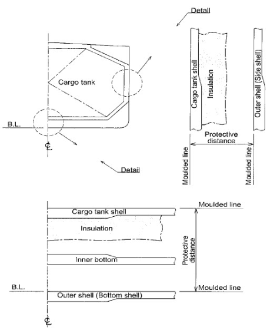
  **Fig 7.5.1**
- **2.** **Hazardous area 【See Rule】**
  - **(1)** The "within 3 m of possible sources of gas release" referred to in **105. 23** (7) of the Rules is to be measured as a sphere above outlets and openings, and as a cylinder below.
  - **(2)** The "area on the open deck up to a height of 2.4 $\mathrm{m}$ above the weather deck" referred to in **105. 23** (9) of the Rules is, for example, as shown in (a) through (d) of **Fig 7.5.2** of the Guidance.
  - **(3)** The "direct opening into" referred to in **105. 23** (12) of the Rules includes those openings such as hatches normally used for access which are closed by doors, covers, etc. Bolted plates for removal of machinery need not be regarded as direct openings where another means for access are provided.
    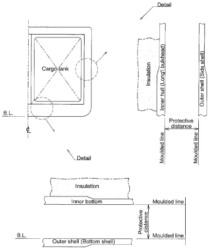
    **Fig 7.5.2**
- **3.** **Hold space 【See Rule】**
  "Hold spaces" in the requirements in **105. 25** of the Rules includes the peripheral compartments of cargo tanks in the case of integral tanks. (See **Fig 7.5.3** of the Guidance)
- **4.** **Independent 【See Rule】**
  The "provisions available for the potential connection to other systems" referred to in **105. 26** of the Rules include the blank flanges.
- **5.** **Interbarrier space 【See Rule】**
  "Inter-barrier space" referred to in **105. 28** of the Rules means the peripheral compartments of the cargo tanks in the case of integral tanks. (See **Fig 7.5.3** of the Guidance)
  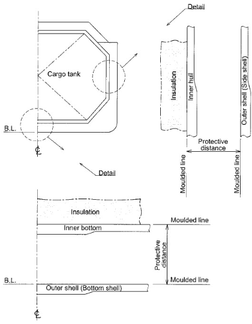
  **Fig 7.5.3**

### Section 2 Ship Survival Capability and Location of Cargo Tanks

#### 202. Freeboard and stability

- **1.** In applying the requirement in **2** of the Rules, for the ships assigned tropical loadline, 'all seagoing conditions' is to be included loading condition relating to tropical loadline.
- **2.** **Solid ballast 【 See Rule】**
  In applying the requirements in **202. 4** of the Rules, the solid ballast is to comply with the following requirements.
  - **(1)** In case where solid ballast is arranged under unavoidable reasons to ensure stability of the ship, the distance between such solid ballast and the cargo tank is to be not less than $d$ at **204. 1**.
  - **(2)** The solid ballast is to be of concrete blocks and similar materials which can be fitted securely to the hull structure of the ship. No solid ballast consisting of scrap iron in bulk, etc. is accepted.
- **3.** In applying the requirements in **202. 6** of the Rules, the performance standards recommended by the Organization refer to following: **【See Rule】**
  - part B, chapter 4, of the International Code on Intact Stability, 2008 (2008 IS Code)
  - the Guidelines for the Approval of Stability Instruments (MSC. 1/Circ.1229), annex, section 4;
  - the technical standards defined in part 1 of the Guidelines for verification of damage stability requirements for tankers (MSC.1/Circ.1461)
- **4.** In applying the requirements in **202. 6** (3) of the Rules, "where deemed appropriate by the Society" means that the following ships provided the procedures employed for intact and damage stability verification maintain the same degree of safety, as being loaded in accordance with the approved conditions.
  - **(1)** ships which are on a dedicated service, with a limited number of permutations of loading such that all anticipated conditions have been approved in the stability information provided to the master in accordance with the requirements of paragraph **202. 5** of the Rules:
  - **(2)** ships where stability verification is made remotely by a means approved by the Society.
  - **(3)** ships which are loaded within an approved range of loading conditions; or
  - **(4)** ships constructed before 1 July 2016 provided with approved limiting KG/GM curves covering all applicable intact and damage stability requirements.
- **5.** In applying the requirements in **4** “the approved conditions” refer to following:
  - Operational guidance provided in part 2 of the Guidelines for verification of damage stability requirements for tankers (MSC.1/Circ.1461).

#### 203. Damage assumptions

- **1.** **Other damages 【 See Rule】**
  For the purpose of the requirements in **203. 2** (2) of the Rules, the transverse bulkheads assumed to remain intact in the requirements in **206. 1** (4) to (6) of the Rules may also be assumed that they remain free from local damages.

#### 204. Location of cargo tanks 【See Rule】

- **1.** For the purpose of the requirements in **204. 3** of the Rules, the suction wells are not to be installed less than $d$ from the shell plating according to **204. 1** of the Rules.

#### 205. Flooding assumptions 【 See Rule】

- **1.** **General**
  - **(1)** Conditions that are anticipated to cause more severe results are to be selected of all anticipated conditions of loading, and consideration is to be given to the following (A) through (H) in making calculation according to **205. 1** of the Rules.
    - **(A)** Tanks in way of the assumed damage filled with liquid at increments of about 25 % between empty and the maximum weight of liquid, or liquids, intended to be carried in the particular tanks under consideration.
    - **(B)** The distribution of liquids in the adjacent tanks concerned which will give the most severe result, taking trim into account.
    - **(C)** A number of draughts over the operating range, up to and including the tropical freeboard mark. The fresh water free boards need not be considered.
    - **(D)** The effect of damage involving the machinery space and adjacent tanks containing liquids over a number of draughts as in (C) above.
    - **(E)** The ship in either the departure or the arrival condition, whichever will give the most severe result.
    - **(F)** The ship without trim and a sufficient number of trims covering the operating range, in order to permit interpolation.
    - **(G)** Where the assumed damage causes the ship to trim by the stern, condition having the largest allowable trim by the stern, consistent with operational requirements.
    - **(H)** Where the assumed damage causes the ship to trim by the bow, condition having the largest allowable trim by the bow, consistent with operational requirements.
  - **(2)** The free surface effects of intact cargo tanks in the damage stability calculation are to be computed for the actual angle of heel caused by assumed damage and for each angle of heel within the stability limit.
  - **(3)** In calculating the effect of free surface of consumable liquids, it is to be assumed that, for each type of liquid, at least one transverse pair or a single centre line tank has maximum free surface, and the tank or combination of tanks to be taken into account are to be those where the effect of free surfaces is the greatest ; in each tank the centre of gravity of the contents is to be taken at the centre of volume of the tank. The remaining tanks are to be assumed either completely empty or completely filled, and the distribution of consumable liquids among these tanks is to be such as to obtain the greatest possible height above the keel for the centre of gravity.
  - **(4)** In calculating free surface effects given in the preceding (3), the requirements are to be complied with preceding (2).
- **2.** **Permeability**
  For the purpose of the requirements in **205. 2** of the Rules, the Society may approve a lesser permeability in consideration of volume of the insulations etc. provided within the compartment.
- **3.** **Damage of transverse bulkhead**
  In applying the requirements for damage of transverse bulkhead specified in **205. 4** of the Rules, the extent of damage when the transverse bulkhead is stepped or recessed, are for example, as shown in Fig **7.5.4** of the Guidance.
  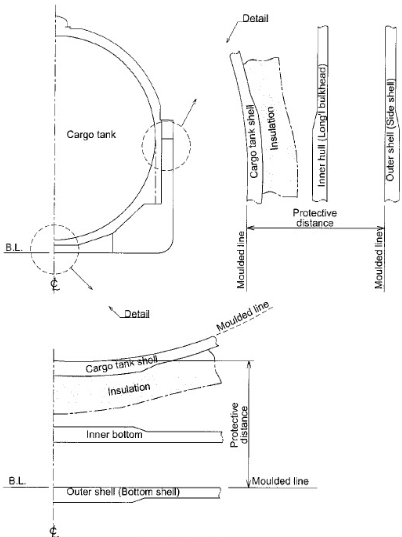
  **Fig 7.5.4 Damage extend of transverse bulkhead**
- **4.** **Equalization arrangements**
  - **(1)** The equalization arrangements specified in **205. 6** of the Rules are to be made operable from a readily accessible place in the damaged condition before using the equalization arrangement.
  - **(2)** The righting arm curve of the ship without using the equalization arrangement referred to in the preceding (1) is to be determined in accordance with the requirements in **205. 3** of the Rules, but calculation in this case is to be made assuming that the cross-levelling pipe is closed or this equalization arrangement is not effectively functioning.
  - **(3)** The cross sectional area of the cross-levelling pipe used for the equalization arrangement referred to in the preceding (1) is to satisfy the value obtained from the following equation :
    $A \geq 7.5 \frac{V}{\sqrt {H}} (\mathrm{cm} ^{2} )$
    where:
    $A$ : cross sectional area of cross-levelling pipe ($\mathrm{cm} ^{2}$)
    $V$ : estimated flooding volume in flooded compartment ($\mathrm{cm} ^{3}$)
    $H$ : height from the draught line before flooding to the centre line of pipe ($\mathrm{m}$)
  - **(4)** "ducts of large cross-sectional area" referred to in **205. 6** of the Rules are to satisfy both of the following equations :
    $A \geq 150 \frac{V}{\sqrt {H}} (\mathrm{cm} ^{2} )$, $A \geq 2Sh (\mathrm{cm} ^{2} )$
    where:
    $V$ : value obtained by the preceding (3)
    $H$ : height obtained by the preceding (3) to the centre of duct
    $S$ : frame distance ($\mathrm{cm}$). However, in case of longitudinal framing system, $S$ may be obtained from the following equation but not to be less than 61 $\mathrm{cm}$ :
    $S=45+0.2L _{f} (\mathrm{cm})$
    $h$ : $B$/15 ($\mathrm{cm}$)
- **5.** **Progressive flooding**
  The "arrangements should be such that progressive flooding cannot thereby extend" referred to in the requirements in **205. 7** of the Rules may be such as a stop valve operable from the exposed deck and accommodation space, etc. provided outside the extent of damage. In this case, any part of operating systems is to effectively function for assumed damage.
- **6.** **Buoyancy of superstructure**
  - **(1)** For the purpose of **205. 8** of the Rules, the longitudinal extent of damage to superstructures above a machinery space located aft is to be the same as the longitudinal extent of the side damage to the machinery space specified **206. 1** of the Rules. (See Fig **7.5.5** of the Guidance)
    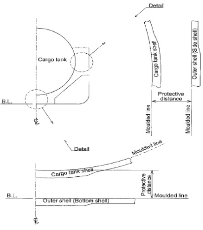
    **Fig 7.5.5 Buoyancy of superstructure**
  - **(2)** The sliding watertight doors specified in **205. 8** (2) of the Rules are to be remotely operable from a readily accessible place in case of damage. Further, the openings of weathertight accepted within the minimum range of residual stability are to be capable of being securely closed at final equilibrium.

#### 206. Standard of damage 【 See Rule】

- **1.** **General**
  - **(1)** For the purpose of the standard of damage specified in **206. 1** of the Rules, damage assumed to have sustained within 0.3 $L _{f}$ or there about from the stern are to be in accordance with the following requirements (A) and (B) :
    - **(A)** For bottom damage for 0.3 $L _{f}$ from the forward perpendicular and above (according to **203. 1** (2) of the Rules), such damage may not be considered beyond the point of 0.3 $L _{f}$ from the forward perpendicular.
    - **(B)** For cases of bottom damage which is applied to damage sustained in areas after the point of 0.3 $L _{f}$ from the forward perpendicular (according to **203. 1** (2) of the Rules), such damage is to be considered from the forward perpendicular up to the point corresponding to 0.3 $L _{f}$ - 1/3$L_f^2/3$ $\mathrm{m}$ or 0.3 $L _{f}$ - 14.5 $\mathrm{m}$ which is greater. *(2018)*
  - **(2)** For a type 3G ship less than 125 $\mathrm{m}$ in length($L _{f}$) specified in **206. 1** (6) of the Rules, the ability to survive the flooding of machinery space is to be in accordance with the following (A) and (B):
    - **(A)** The ability to survive the flooding of machinery space is to be in accordance with the requirements **207. 1** (1) and (2) of the Rules.
    - **(B)** Where $L _{f}$ is 70 $\mathrm{m}$ or more and less than 125 $\mathrm{m}$, the areas under the curve at least within 20° range beyond the position of equilibrium are to be 0.0175 $\mathrm{m} \cdot rad$ or more at final equilibrium after flooding.
    - **(C)** Where $L _{f}$ is less than 70 $\mathrm{m}$, the areas under curve are to be 0.0088 $\mathrm{m} \cdot rad$ or more.
  - **(3)** In case the bulkhead in machinery space is watertight structure at the flooding of machinery space referred to in the preceding (2), around machinery space areas of superstructures located aft may be considered the spare buoyancy. In this case the doors located at bulkhead of machinery space are to be sliding watertight doors remotely operated from superstructure deck.
- **2.** **Standard of damage for small ships**
  Small ships specified in **206. 2** of the Rules are ships less than 70 $\mathrm{m}$ of $L _{f}$. Special dispensations except type 1G ships may be in accordance with the following (1) through (4) :
  - **(1)** The extent of damage and the standard of damage are to be complied with the requirements **203.** and **206. 1** of the Rules respectively.
  - **(2)** It is to be in accordance with the requirements **207. 1** (1) and (2) of the Rules.
  - **(3)** The areas under the righting lever curve within 20° range beyond the position of equilibrium are to be 0.0175 $\mathrm{m} \cdot rad$ or more at final equilibrium after flooding.
  - **(4)** The maximum values of residual righting lever is not limited.

#### 207. Survival requirements 【 See Rule】

- **1.** **Survival requirements** ***(2017)***
  - **(1)** For the purpose of the requirements of **207. 1** (1) of the Rules, openings specified in the following (A) and (B) may be regarded as watertight flash deck openings.
    - **(A)** Openings protected by tank covers with strength equivalent to deck plating.
    - **(B)** Openings for cargo containment systems on the weather decks sealed with effectively packing of non-combustible material complied with the requirements in **Pt 8, Ch 3, 201.** of the Rules or equivalent and of sufficient strength.
    - **(C)** Sounding pipe with closing head
  - **(2)** For the purpose of **207. 2** (1) of the Rules, openings capable of being closed weathertight whose immersion are accepted within the required range of residual stability are to be closed securely at final equilibrium after flooding.
  - **(3)** Other openings capable of being closed weathertight do not include ventilators (complying with ILLC 19(4)) that for operational reasons have to remain open to supply air to the engine room or emergency generator room (if the same is considered buoyant in the stability calculation or protecting openings leading below) for the effective operation of the ship.

### Section 3 Ship Arrangements

#### 301. Segregation of the cargo area 【 See Rule】

- **1.** **Segregation of the hold space**
  - **(1)** "Forward of machinery spaces of category A" referred to in **301. 1** of the Rules means to be located forward of the forward bulkhead (including the stepped or recessed portions) in machinery spaces of category A. (See Fig **7.5.6** of the Guidance)
    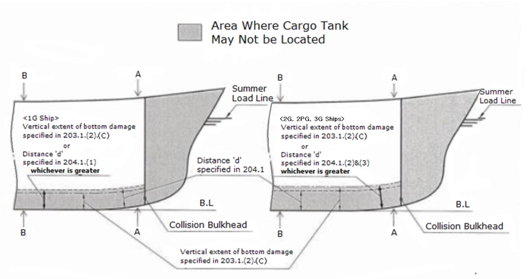
    **Fig 7.5.6 Segregation of the hold space**
  - **(2)** Where machinery spaces of category A are located forward of hold spaces specified in the requirements in **301. 1** of the Rules, the following requirements (A) and (B) are to be complied with. Further, the Society may give additional requirements when deemed necessary. :
    - **(A)** The requirements for fire protection and fire extinguishing for the machinery spaces of category A specified in **Pt 8** of the Rules are to be complied with.
    - **(B)** The requirements for periodically unmanned machinery spaces specified in **Pt 9, Ch 3** of the Rules and **Pt 8, Ch 2∼Ch 4** of the Guidance are to be complied with.
  - **(3)** Hold spaces are neither to be located forward of the collision bulkhead nor aftward of the aft peak bulkhead.
- **2.** **Segregation of the hold space in case of a cargo containment system not requiring full or partial secondary barrier**
  - **(1)** "If there is no source of ignition or fire hazard" referred to in the requirements in **301. 2** of the Rules means those compartments such as ballast tanks, fresh water tanks, cofferdams, fuel oil tanks, cargo service spaces where there is no source of ignition and is not normally entered by persons, cargo pump rooms and cargo compressor rooms, etc.
  - **(2)** The packing used for bolted watertight manholes fitted on the boundaries of ballast tanks, cofferdams, fuel oil tanks from among the compartments referred to the preceding (1) may not be of non-combustible material.
- **3.** **Segregation of the hold space in case of a cargo containment system requiring full or partial secondary barrier**
  "If there is no source of ignition or fire hazard" referred to in the requirements in **301. 3** of the Rules means the compartments specified in **301. 2** (1) above.
- **4.** **Openings for cargo containment system**
  "Arrangements for sealing the weather decks in way of openings for cargo containments systems" referred to in **301. 7** of the Rules means the arrangements complying with the requirements in **Pt 4, Ch 2, 102.** and **103.** of the Rules.

#### 302. Accommodation, service and machinery spaces and control stations 【 See Rule】

- **1.** **Segregation of hold spaces requiring a secondary barrier**
  "To be so located as to avoid the entry of gas from the hold space to such spaces through a single failure of a deck or bulkhead" referred to in **302. 1** of the Rules means that boundaries of the compartment are so arranged as not to make linear contact or point contact with hold spaces. (See Fig **7.5.8** of the Guidance)
  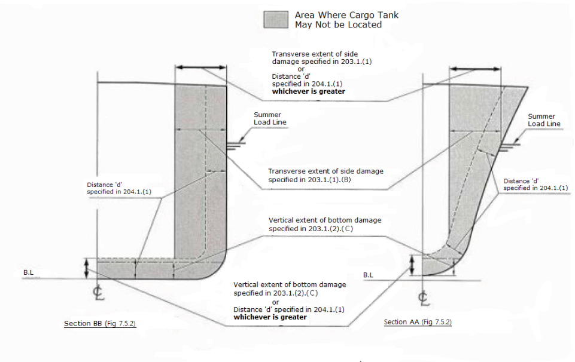
  **Fig 7.5.8 Segregation of hold spaces requiring a secondary barrier**
- **2.** **Arrangements of entrances, air inlets and openings**
  - **(1)** Windows and side-scuttles "so designed that a rapid and efficient gas and vapour tightening of the wheelhouse can be ensured" referred to in **302. 4** (2) of the Rules means those fitted with packing and clamping devices. These window and side scuttles are subject to hose tests or air tests in accordance with **Pt 8 Ch 2 402. 2** of the Guidance.
  - **(2)** In case where clear view screens are provided in wheelhouse within the restricted area specified in **302. 4** of the Rules, additional clamping devices are to be provided to the clear view screen or alternative arrangement of closing the window to make it gastight when the screen is not in rotating motion is to be made.
  - **(3)** The requirements in **302. 4** of the Rules may not apply to ships dedicated to the carriage of cargo which require neither F nor T in column f of **Table in Ch 5, Sec 19** of the Rules.
  - **(4)** In application of **302. 4** of the Rules, for gas carriers constructed on or after 1 July 1986 but before 1 July 2016, access to forecastle spaces containing sources of ignition may be permitted through doors facing the cargo area, provided the doors are located outside hazardous areas as defined in **Sec 10**. *(2024)*
- **3.** **Closing devices of air intakes and openings**
  - **(1)** For the purpose of the requirements in **302. 6** of the Rules, closing devices for air intakes and openings are to have suitable gas-tightness where steel made fire protection flaps without gaskets/seals are not accepted.
  - **(2)** For the purpose of the requirements in **302. 6** of the Rules, the closing devices in ships intended to carry toxic products which require T in column f of the Table in **Ch 5, Sec 19** of the Rules, the following requirements (A) through (D) are to be complied with :

    |   | **Usually manned space** | **Usually not manned space** |
    | --- | --- | --- |
    | **Space carrying toxic products** | Install inside space | May not installed inside space |
    | **Space not carrying toxic products** | May not installed inside space | May not installed inside space |
    - **(A)** The requirements in the preceding (1) are to be complied with.
    - **(B)** The closing devices need not be operable from within the single spaces and may be located in centralized positions. (refer to **Table 7.5.1-1**)*(2018)*
    - **(C)** Engine room casings, cargo machinery spaces, electric motor rooms and steering gear compartments are generally considered as spaces not covered by **302. 6.** of the Rules and therefore the requirement for closing devices need not be applied to these spaces. *(2017)*
  - **(3)** Regardless of (2), the closing devices should be operable from outside of the protected space. (**SOLAS** regulation II-2/5.2.1.1). *(2018)*

#### 303. Cargo machinery spaces and turret compartments 【 See Rule】

- **1.** **Location**
  - **(1)** For the purpose of the requirements in **303. 1** of the Rules, where cargo machinery spaces are permitted to be fitted at the after end of the after-most hold space or at the forward, the arrangements are, for example, as shown in Fig **7.5.9** of the Guidance.
    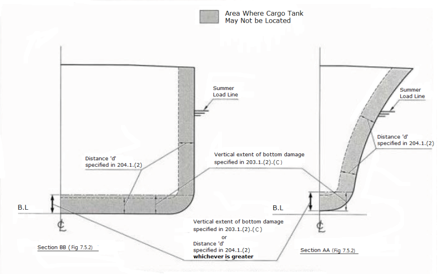
    **Fig 7.5.9 Cargo machinery spaces located at the after end of the after-most hold spaces or at the forward**
  - **(2)** The arrangement that cargo machinery spaces are located below the exposed deck is not accepted.
  - **(3)** The compartments within the cargo area extended according to the requirements in **303. 2** of the Rules may not be regarded as hazardous space as far as the following requirements (A) and (B) are complied with (See Fig **7.5.10** of the Guidance). However, consideration is to be given to the requirements in **303. 3** of the Rules.
    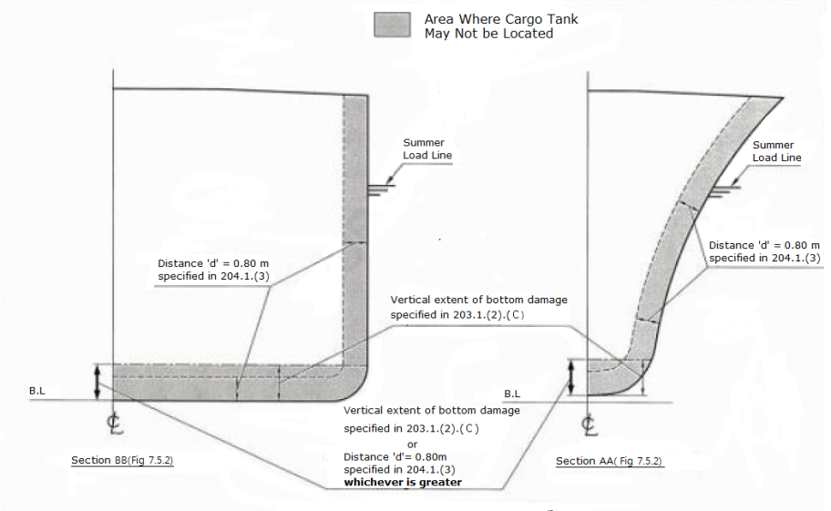
    **Fig 7.5.10 Non-hazardous space within cargo area**
    - **(A)** The access holes and air vents to the compartment are to have no openings to hazardous space.
    - **(B)** The compartment is not to fall under any compartments specified in **105. 23** and **1001. 1** of the Rules.
  - **(4)** The requirements in **303. 3** of the Rules are also to apply to cases where cargo area is not e tended according to the requirements in **303. 2** of the Rules.
- **2.** **Cargo pumps and cargo compressors**
  - **(1)** Shaft seals such as those manually feeding grease periodically are not considered as the "effective gastight segregation of the two space" referred to in **303. 4** of the Rules.
  - **(2)** The arrangement of motor rooms housing electric motors driving cargo pumps and cargo compressors referred to in **303. 4** of the Rules is to be as, for example, shown in Fig **7.5.11** (1) of the Guidance. If the arrangement can not be complied with the above requirement in case of such as a small ship, it may be as, for example, shown in Fig **7.5.11** (2) of the Guidance, where the openings of compartments such as chain lockers considered as the source of ignition are provided in the motor rooms, however, the openings are to be closed by steel watertight covers fitted with warning signs stating that "The openings are to be always kept closed. If opened, the motor room is to be sufficiently ventilated."
  - **(3)** The motor rooms referred to in the preceding (2) are to be arranged in non-hazardous spaces.
    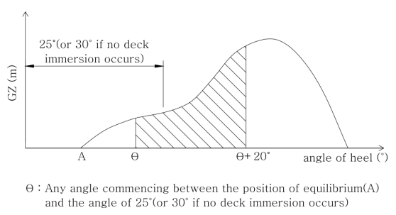
    **Fig 7.5.11 Non-hazardous spaces in cargo spaces**
- **3.** **Drainage**
  Drain plugs provided on the casing walls of the compartment for draining onto the exposed deck may be accepted, as the "Suitable arrangements...... to deal with drainage" referred to in **303. 6** of the Rules.

#### 304. Cargo control rooms 【 See Rule】

- **1.** **Location**
  The boundaries where "A-60" class insulation is required according to the requirements in **304. 1** (3) of the Rules are to be as, for example, shown in Fig **7.5.12** of the Guidance. The ceilings and floors of the cargo control room, asterisked in the drawing, are also to be applied with "A-60" class insulation.
  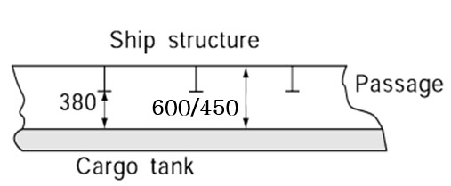
  **Fig 7.5.12 Insulation in cargo control rooms**
- **2.** **Source of ignition**
  For the purpose of the requirements in **304. 3** of the Rules, the electrical installations in the cargo control room are to comply with the requirements in **1002.** of the Rules depending on the location of the room. The cargo control room is to be provided with mechanical ventilation complying with the requirements in **1201.** of the Rules.

#### 305. Access to spaces in the cargo area 【 See Rule】

- **1.** **Access for inspection of insulation**
  According to the requirements in **305. 2** of the Rules, neither visual inspection may be required on one side of the insulation in hold spaces of membrane tanks and semi-membrane tanks nor apply the requirements in **305. 3** of the Rules.
- **2.** The minimum clear opening of 600 $\mathrm{mm}$ x 600 $\mathrm{mm}$ may have corner radii up to 100 $\mathrm{mm}$ maximum. In such a case where as a consequence of structural analysis of a given design the stress is to be reduced around the opening, it is considered appropriate to take measures to reduce the stress such as making the opening larger with increased radii, e.g. 600 $\mathrm{mm}$ x 800 $\mathrm{mm}$ with 300 $\mathrm{mm}$ radii, in which a clear opening of 600 $\mathrm{mm}$ x 600 $\mathrm{mm}$ with corner radii up to 100 mm maximum fits. *(2017)*
  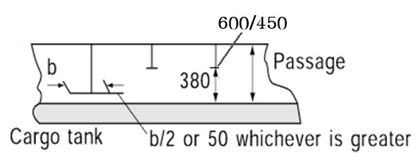
  **Fig 7.5.13 Minimum opening size**
- **3.** The details of minimum opening size required in **305. 3** (1) (C) of the Rules are to be as shown as follows. *(2017)*
  - **(1)** The minimum clear opening of not less than 600 $\mathrm{mm}$ x 800 $\mathrm{mm}$ may also include an opening with corner radii of 300 $\mathrm{mm}$. An opening of 600 $\mathrm{mm}$ in height x 800 $\mathrm{mm}$ in width may be accepted as access openings in vertical structures where it is not desirable to make large opening in the structural strength aspects, i.e. girders and floors in double bottom tanks.
  - **(2)** Subject to verification of easy evacuation of injured person on a stretcher the vertical opening 850 $\mathrm{mm}$ x 620 $\mathrm{mm}$ with wider upper half than 600 $\mathrm{mm}$, while the lower half may be less than 600 $\mathrm{mm}$ with the overall height not less than 850 mm is considered an acceptable alternative to the traditional opening of 600 $\mathrm{mm}$ x 800 $\mathrm{mm}$ with corner radii of 300 $\mathrm{mm}$.
    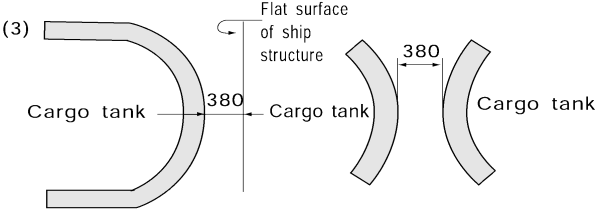
    **Fig 7.5.14 Acceptable alternative to the traditional opening**
  - **(3)** If a vertical opening is at a height of more than 600 $\mathrm{mm}$ steps and handgrips are to be provided. In such arrangements it is to be demonstrated that an injured person can be easily evacuated.
- **4.** **Access to spaces in the hold spaces, etc.**
  - **(1)** In applying the requirements in **305. 3** (1) (B) of the Rules, type C independent tanks may have the access holes from exposed spaces with a diameter not less than 600 $\mathrm{mm}$.
  - **(2)** In case where those tanks can not be provided with the access holes specified in the preceding (1) due to strength reasons in ships with $L _{f}$ not more than 70 $\mathrm{m}$, they may be replaced with circular holes with a diameter not less than 500 $\mathrm{mm}$ or oval holes with equivalent open area. However, they are to be sufficient to allow entry by a personnel wearing protective clothing and to allow unconscious personnel to be removed from the space.
  - **(3)** In case where direct or indirect access from open weather deck without access to gas-safe space, the requirements of **305. 3** (1) (B) and (C) of the Rules may not apply to spaces separated from hold spaces described in **105. 23.** (4) of the Rules.
  - **(4)** Access hole from weather deck specified in the preceding (3) may be opened at gas-dangerous space. In this case, it is to be applied the requirements for gas-dangerous space except the requirements of **305. 3** (1) (B) and (C) of the Rules.
  - **(5)** In applying the requirements in **305. 3** (3) of the Rules, access hole from the weather deck is to comply with the requirements in the preceding (4).
- **5.** **Access to gas-safe spaces**
  "Open weather deck" referred to in the requirements of **305. 4** of the Rules means the exposed part of the uppermost continuous deck within the cargo area.

#### 306. Air-locks 【 See Rule】

- **1.** **Location of gastight doors**
  For the purpose of the requirements in **306. 1** of the Rules, the steel doors for air-lock are to be verified for their gas-tightness by hose tests or other means considered appropriate by the Society, as necessary.
- **2.** **Drainage**
  “the Society's guidances” referred to in **306. 2** of the Rules means **IEC 60092-502:1999** or equivalent standards. *(2018)*
- **3.** **Maintenance of overpressure in the protected space**
  For the purpose of the requirements in **306. 4** of the Rules, maintenance of overpressure in spaces protected by air-locks is to be by the differential pressure sensing devices provided within the compartment, but alternatively, either of the following method (1) or (2) may be employed :
  - **(1)** The following means are considered acceptable alternatives to differential pressure sensing devices in spaces having a ventilation rate not less than 30 air changes per hour :
    - **(A)** monitoring of current or power in the electrical supply to the ventilation motors ; or
    - **(B)** air low sensors in the ventilation ducts.
  - **(2)** In spaces where the ventilation rate is less than 30 air changes per hour and where one of the means specified in the preceding (1) is fitted, in addition, the arrangements are to be made to de-energize electrical equipment which is not of the certified safe type, if more than one air-lock door is moved from the closed position.
- **4.** **Ventilation**
  - **(1)** For the purpose of the requirements in **306. 1** of the Rules, the ventilating fans for air-lock space and their air intakes are to be provided in the gas-safe space. However, in this case, the ventilating fans may not comply with the requirements in **1201.** of the Rules. Protection screens of not more than 13 $\mathrm{mm}$×13 $\mathrm{mm}$ square mesh are to be fitted in outside openings of ventilation ducts.
  - **(2)** For the purpose of the requirements in **306. 1** of the Rules, verification of maintenance of pressure in spaces protected by air-locks is to be by, for example, monitoring of current in electrical supply to the ventilation motors, air flow sensors in the ventilation ducts or differential pressure sensing devices. The standard ventilation rate in the air-lock space is 8 air changes per hour.

#### 307. Bilge, ballast and fuel oil arrangements 【 See Rule】

- **1.** **Drainage arrangements of hold spaces**
  - **(1)** For the purpose of the requirements in **307. 1** of the Rules, the drainage arrangements of hold spaces are to be of bilge pumps and bilge pipings provided with in the cargo area to be of bilge suction system by eductors.
  - **(2)** Where eductors are provided in accordance with the preceding **1**, root valves are to be provided in driving water lines at the aft end of the cargo area, and the branch lines of the driving water line are to be fitted with screw-down check valves.
  - **(3)** For the purpose of the requirements in **307. 1** of the Rules, the means to detect gas leakage in hold spaces, when the hold spaces are not inerted, may be commonly used for sounding pipes specified in **Pt 5, Ch 6, 203.** of the Rules. In case where the sounding pipes are provided together with gas leakage detecter, an automatic closing head is to be fitted at the each of upper end of the sounding pipes. When hold spaces are inerted, the requirements in (4) are to be complied with.
  - **(4)** For the purpose of the requirements in **307. 2** of the Rules, the drainage arrangements of hold spaces are to comply with the requirements in the preceding (1) and (2). The means of detecting gas leakage in hold spaces is to be of the level alarm system of closed type complying with the requirements in **1302. 2** (3) of the Rules.
  - **(5)** Cofferdam and void spaces are also to comply with this Article.
- **2.** **Drainage system of interbarrier spaces**
  For the purpose of the requirements in **307. 3** and **4.** of the Rules, the drainage arrangements for dealing with any leakage into the hold or insulation spaces are to comply with the following requirements (1) through (4) :
  - **(1)** Even in the case of a partial secondary barrier which is designed on condition that the total volume of leaked cargo would evaporate, the drainage arrangements are to be provided.
  - **(2)** In case where a complete secondary barrier is provided and estimation of leakage of liquid cargo is not carried out, the capacity of the drainage arrangements is to comply with the requirements in **Pt 5, Ch 6, Sec 4** of the Rules.
  - **(3)** The drainage arrangements to deal with the leaked cargo may commonly serve as those required in **307. 2** of the Rules.
  - **(4)** The piping system of the drainage arrangements of leaked cargo is to comply with the requirements in **Sec 5** of the Rules. The water-driven eductor is not accepted as such arrangement.
- **3.** The requirements of "Pump vents should not be open to machinery spaces" in **307. 5.** apply only to pumps in the machinery spaces serving dry duct keels through which ballast piping passes.

#### 308. Bow or stern loading and unloading arrangements 【 See Rule】

- **1.** **Arrangements of air inlets and openings**
  For the purpose of the requirements in **308. 4** of the Rules, the arrangements of air intakes and openings to accommodation spaces are, for example, not to be provided within the shadowed range in Fig **7.5.15** of the Guidance.

  | 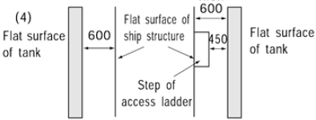 |
  | --- |
  | **Fig 7.5.15 Arrangement of air inlets and openings** |

### Section 4 Cargo Containment

#### 402. Application (2021) 【See Rule】

The requirements of this section of the **Rule** and **Guidance** do not cover all aspects of the design, fabrication and installation of Cargo Containment System.

#### 403. Functional requirements 【 See Rule】

- **1.** **Corrosion allowances**
  - **(1)** The corrosion allowance "where there is no environmental control around the cargo tank, such as inerting" referred to in the requirements in **403. 5** of the Rules, in the case of steel, is to be 1 $\mathrm{mm}$. Except for tanks carrying cargoes containing considerable amounts of impurities or corrosive substances such as chlorine and sulfur dioxide, no corrosion allowance may be required for aluminum alloys and stainless steel.
- **2.** **Environmental conditions**
  - **(1)** “North Atlantic environmental conditions and relevant long-term sea state scatter diagrams” referred in the requirements in **403. 2 of the Rules** is in accordance with the wave data in **Pt 3, Annex 3-2 II 5** of the Guidance. (**IACS Rec.34 "Standard wave data"**) *(2018)*

#### 405. Secondary barriers in relation to tank types 【 See Rule】

- **1.** **Tank type and secondary barrier**
  The conditions for approving partial secondary barrier for the semi-membrane tanks specified in Note 2 of **Table 7.5.1** of the Rules are to be in accordance with the following (1) through (6) :
  - **(1)** Detailed stress analysis is to be carried out. Wave loads as the design load are to be assumed in details according to the requirements in **414. 1** of the Rules. The results of stress analysis are to be verified for the accuracy by measuring the stresses at time of pressure tests on a real ship or model test.
  - **(2)** The results of stress analysis under the requirements in the preceding (1) are not to exceed the allowable stress specified in the requirements in **422. 3** (1) of the Rules.
  - **(3)** The requirements in **422. 1** (6), (7) and (9) of the Guidance are to be complied with.
  - **(4)** Cargo tanks are to be subjected to buckling analysis depending on their structural type whereby it is to be verified that they have sufficient strength against buckling.
  - **(5)** Repair procedures for cargo tanks are to be established. On the fatigue strength and crack propagation analysis in case such repair procedures have been applied, assessments are to be carried out by applying the requirements in **422. 4** (6) and (7) of the Guidance correspondingly.
  - **(6)** The hull structure adjacent to cargo tanks is to be subjected to strength analysis compatible with the case of cargo tanks. In addition to carrying out detailed stress analysis by the method of which accuracy has been verified by stress measurements, etc., it is to be verified that the strength is sufficient through the fatigue strength analysis and crack propagation analysis done by applying the requirements in **418.** of the Rules correspondingly.

#### 406. Design of secondary barriers 【 See Rule】

- **1.** **Standards of secondary barrier**
  - **(1)** For the purpose of the requirements in **406. 2** of the Rule, the secondary barriers of nonmetal material are to conform to the following requirements (A) to (C) :
    - **(A)** Compatibility with the cargo is to have been verified, and to have necessary mechanical properties at the cargo temperature under the atmospheric pressure.
    - **(B)** A model test may be required to prove that the secondary barrier has effective performance when the Society deems it necessary.
    - **(C)** For welded joints, welding procedure tests and production test are to be conducted. The test plans for the above are to have been approved by the Society beforehand.
  - **(2)** For the purpose of the requirements in **406. 2** (1) of the Rules, no special analysis of the complete secondary barrier for verifying that "it is capable of containing any envisaged leakage of liquid cargo for a period of 15 days" may be carried out except for cases where the Society deems it specially necessary.
  - **(3)** In principal, openings such as maahole are not to be provided in secondary barriers. *(2022)*
- **2.** **Periodical Inspection of Secondary Barrier**
  - **(1)** With respect to the requirement of **406. 2** (4), it is to be verified that secondary barriers keep a specific level of tightness required in the system design in accordance with an appropriated procedures.
  - **(2)** For cargo containment system with glued secondary barriers, at the time of construction, tightness test are to be carried out in accordance with approved system designers' procedure and acceptance criteria before and after initial cool down. The values recorded are to be used as reference for future assessment of secondary barrier tightness. *(2020)*
    - **(A)** Low differential pressures tests are not considered an acceptable test.
    - **(B)** If the designer's threshold values are exceeded, an investigation is to be carried out and additional testing such as differential pressure, thermographic or acoustic emissions testing is to be carried out as necessary.
  - **(3)** For containment systems with welded metallic secondary barriers, at the time of construction, tightness test after initial cool down is not required.
  - **(4)** For the purpose of the requirements in **406. 2** (4) of the Rules, the test procedure where visual inspection of the secondary barrier is not possible is to be in accordance with the following requirements (A) to (C) :
    - **(A)** The inspection method of the secondary barrier and its criteria relating to the performance to act as the secondary barrier are to be verified for their effectiveness through model test.
    - **(B)** The secondary barrier is to be verified by model test for the required performance. This model test is to be capable of verifying that the secondary barrier can maintain the necessary performance throughout the life of the ship.
    - **(C)** When sufficient data to prove the effectiveness and reliability relative to the preceding (A) and (B) are submitted to the satisfaction of the Society, this model test may be omitted.
- **3.** **Thermal stress analysis for hull structure**
  - **(1)** For the purpose of requirements in **406. 2** (2) of the Rules, thermal stress analysis is to be carried out for the calculation condition in case of cargo leakage specified in the requirements in **419. 1** of the Rules.
  - **(2)** The combined stress of the maximum membrane stress or the maximum bending stress obtained in the analysis of the preceding (1) and the static stress created by the static load specified in the requirements in **403.** of the Rules is not to exceed 90 % of the yield stress of the material.
  - **(3)** In the ship designed under the same design temperature and loading conditions of similar ships where it is verified that the thermal stress is sufficiently small, the Society may accept omission of the analysis referred to in the preceding (1).

#### 407. Partial secondary barriers and primary barrier small leak protection system

- **1.** **Partial secondary barrier 【 See Rule】**
  - **(1)** For the purpose of the requirements in **407. 1** and **2** of the Rules, the protection of the inner bottom plating at the lower part of cargo tanks is to conform to the following requirements (A) and (B) :
    - **(A)** According to the requirements in **406. 1** of the Rules, the inner bottom plating is to act as the secondary barrier.
    - **(B)** In case where a drip tray is provided as a secondary barrier for example as shown in **Fig 7.5.16** of the Guidance with consideration so as not to allow the leaked liquid cargo to overflow from the secondary barrier, no protection may be required. However, where no such consideration is taken, the inner bottom plating is to be protected by insulation materials.
  - **(2)** The spray shield specified in the requirements in **407. 1** of the Rules is to have been verified by test that it has satisfactory performance to act as the shield.
    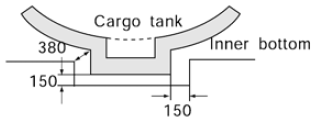
    **Fig 7.5.16 Drip Tray to protect the inner bottom plate**

#### 410. Insulations 【 See Rule】

- **1.** **General**
  In spaces between the refrigerated tanks and supports, suitable insulation materials are to be provided so that hull structure might not be cooled excessively through the supporting structures according to the requirement of **419. 1** of the Rules.

#### 413. Functional loads

- **1.** **Thermally induced loads 【See Rule】**
  - **(1)** For the purpose of the requirements in **413. 4** (1) of the Rules, arrangements for cooling down are to be provided so as not to cause excessive stress on the tank structures. (*2019*)
  - **(2)** The arrangements shown in the preceding (1) are to be such that safety in cooling down using the arrangements has been proved by records of cargo tanks of similar design or cooling down operation is performed at a rate not exceeding the safe temperature reduction curve which has been proved by thermal stress analysis.
  - **(3)** The installations shown in the preceding (1) are to be also capable of performing cooling down at time when excessive thermal loads may be anticipated due to splashing of the residual cargo liquid in ballast passage of the ship under heavy weather as well as at time of cargo loading.
  - **(4)** For the purpose of the requirements in **413. 4** (2) of the Rules, no thermal stress analysis may be required for cargo tanks with design temperature of -10°C or upward, in general. In cargo tanks with design temperature at -55°C or below, the structural strength is to be verified through thermal stress analysis by taking into account the vertical temperature distribution at time of cooling down and partial cargo loading, and when necessary, the temperature distribution in the direction of the plate thickness of plating of full loaded tanks.
  - **(5)** For tanks other than those specified in the preceding (4), the Society may request thermal stress analysis of the cargo tank by taking into account the constraining condition of the cargo tank by tank supporting structure in case where the tank supporting system is special, and thermal analysis in consideration of the effect of materials with different coefficients of thermal expansion in case where such materials are used.
  - **(6)** In the cases referred to in the preceding (4) and (5) where the type of tank supporting system is special, the Society may request thermal analysis on the tank supporting structure itself.
- **2.** Static heel loads **【See Rule】**
  - **(1)** For the purpose of the requirements in **413. 9** of the Rules, the added mass due to hull damage or flooding may not be considered.

#### 414. Environmental loads

- **1.** **Sloshing loads 【See Rule】**
  - **(1)** For the purpose of the requirements in **414. 3** of the Rules, sloshing loads are to be determined in such a way that assessments are made by model experiment for each type of cargo tanks. For cargo tanks where partial filling is intended, data concerning the resonant period of the hull and natural period of the liquids are to be available on board the ship for avoiding the danger of resonance.
  - **(2)** Notwithstanding the requirements in the preceding (1), in the type C independent tank in ships with $L _{f}$ not exceeding 90 $\mathrm{m}$, consideration for structural strength of cargo tanks due to sloshing loads may not be necessary. For tanks partial filling is intended, however, sufficient consideration is to be taken for the installation of equipment in cargo tanks such as cargo piping and cargo pump, against impact loads due to sloshing.

#### 418. Design conditions

- **1.** Fatigue design condition **【See Rule】**
  - **(1)** For the purpose of the requirements in **418. 2** of the Rules, the stress due to fatigue load may be generally determined by using the cumulative probability curve as shown in Fig **7.5.17**.
    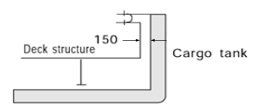
    **Fig 7.5.17 Cumulative probability curve**
  - **(2)** When the fatigue strength analysis specified in the requirements in **422. 2** of the Rules is carried out using the frequency distribution of cyclic stress shown in the preceding (1), the number of representative stress($\sigma _{i}$) is to be eight, and $\sigma _{i}$ and its number of repetition $n _{i}$ may be obtained from the following equation :
    $\sigma i = \frac{17-2 \cdot i}{16} \sigma _{eqalign{\max\#
    }}\#
    \#
    n i =0.9 \times 10 i$
    where :
    $i$ : 1, 2,...., 8
    $\sigma _{ma x}$ : stress induced by the predicted maximum dynamic load (half amplitude)
  - **(3)** For the purpose of **418. 2** (6) (C) of the Rules, the fatigue load used in the calculation of propagation speed of fatigue cracks is, as a rule, to be the predicted maximum load value that can occur at the most severe period in the trade area specified. In case where analysis is made by using the load frequency distribution given in Fig **7.5.13** of the Rules, the number of representative stress($\sigma _{i}$) is to be set at five and its number of repetition $n _{i}$ may be obtained from the following equations :
    $\sigma i = \frac{5.5-i}{5.3} \sigma m ax\#
    \#
    n i =1.8 \times 10 i$
    where :
    $i$ : 1, 2,..., 5
    $\sigma _{ma x}$ : stress created by the predicted maximum load
  - **(4)** The "ships engaged in particular voyages." referred to in **418. 2** (7) of the Rules means those ships with notations "Coasting Service" or "Smooth Water Service" affixed. In this case, the dynamic load may be determined by the results of calculation of ship motions carried out on the basis of the data on sea and weather conditions at the navigating area which are considered appropriately by the Society.

#### 419. Materials 【 See Rule】

- **1.** **Calculation the temperature of hull structures**
  For the purpose of the requirements in **419. 1** (1) of the Rules, the calculation conditions in computing the temperature of hull structures are to be in accordance with the following (1) through (4) :
  - **(1)** The loading condition of the ship for the calculation is to be full loaded condition.
  - **(2)** At the upright cargo leakage is to be considered for the calculation in accordance with the following (A) through (D). However, no leakage may be considered for integral tanks and type C independent tanks.
    - **(A)** It is to be assumed that the failure of all cargo tanks located between transverse watertight bulkheads are caused. However, in case where the cross section of the ship is divided into more than one compartments by longitudinal bulkheads of the ship, it is to be assumed that the failure of all cargo tanks within each such compartment is caused.
    - **(B)** It is to be assumed that the locations of the failure of the cargo tank cover all conceivable ones.
    - **(C)** It is to be assumed that only the liquid cargo leaks out where the cargo tank, supports and hull remain intact without involving any deflections or fracture.
    - **(D)** For cargo tanks where the complete secondary barrier is required, it is to be assumed that the leakage of liquid cargo occurs instantaneously and the levels of residual liquid cargo in damaged cargo tank and the leaked liquid level in the hold space reach the same level instantaneously.
  - **(3)** The boundary conditions of the calculation mode1 are to be in accordance with the following requirements (A) through (K) :
    - **(A)** The temperature of the compartment adjacent to hold spaces is to be determined by heat transmission calculation. The atmosphere of the compartment which is adjacent to the compartment contiguous to hold space may be taken as a still air at 0°C. In the case of machinery space, it may be assumed as a still air at 5°C.
    - **(B)** It is to be assumed that there is no radiation of sun beam.
    - **(C)** The atmospheric air and sea water are to be assumed as still atmospheric air at 5°C and still sea water at 0°C respectively.
    - **(D)** The structures in hold space such as insulation materials and supports are to be assumed that they do not absorb liquid cargo.
    - **(E)** In compartments where gases exist other than in hold spaces, it is to be assumed that they are in natural convection.
    - **(F)** It is to be assumed that the gas and liquid within the same compartment are at the same temperature.
    - **(G)** At time of damage to the cargo tank, the gaseous phase in the cargo tank and that in hold spaces are to be assumed to have a pressure equals to the atmospheric pressure.
    - **(H)** It is to be assumed that there is no transfer of gases within the insulation materials.
    - **(I)** It is to be assumed that there is no influence of moisture.
    - **(J)** The temperature of the secondary barrier in a state of leakage is to be assumed to be the same as the cargo temperature at the atmospheric pressure, whereas the temperature of the intact cargo tank is the design temperature. The ship is to be assumed to stay upright.
    - **(K)** It is to be assumed that there is no influence of paints.
  - **(4)** The calculation conditions in heat transmission calculation are to be in accordance with the following requirements (A) through (I) :

    **Table 7.5.1 The Heat Transfer Coefficient at Various Boundaries**

    | Boundaries | Heat transfer coefficients ($\mathrm{W}/m ^{2}$·°C) |
    | --- | --- |
    | Still gas ← → Hull or liquid | 5.8 |
    | Still sea water ← → Hull | 116.3 |
    | Cargo vapour ← → Hull contacted to air | 11.6 |
    - **(A)** Temperature distribution and heat transmission are to be dealt with as the phenomena in a steady state. No transient condition may be considered.
    - **(B)** Sea water is to be assumed to have a density of 1,025 $\mathrm{kg}/m ^{3}$ and a coagulation point of 　2.5°C with physical properties compatible with those of fresh water for other items.
    - **(C)** The liquid cargo is to be assumed to have uniform temperature distribution.
    - **(D)** The heat transfer coefficients at various boundaries can be computed by using the numeral values given in **Table 7.5.1** of the Guidance, but calculation may be carried out by using empirical equations given in the heat transfer engineering data which has been made public. In this case, heat transfer due to radiation is also to be taken into account.
    - **(E)** The substance for which temperature distribution is investigated is to be assumed to be of homogeneous one without directivity.
    - **(F)** Frames may be dealt with as fins.
    - **(G)** In case where hold spaces located forward and afterward the hold space under study are in the same conditions, they may be treated as a two dimensional problem.
    - **(H)** The cooling effect by the latent heat of evaporation of the liquid cargo may not be taken into account.
    - **(I)** The temperature of structural members is to be represented by the temperature at their half thickness, and for individual members, the following requirements (a) through (d) are to be complied with :
      - **(a)** The temperature of those frames fitted to plates is to be assumed to be the same as the temperature of the plates, but when the temperature distribution of the frame in the direction of depth is known, the area mean of the temperature distribution may be taken.
      - **(b)** The temperature of web frames supporting frames or plates is to be the temperature at their half depth for webs, and the temperature of face plates for these.
      - **(c)** The temperature of members connecting the inner shell and outer shell, e.g., brackets and girders is to be of the mean of the temperature of the inner shell and that of the outer shell.
      - **(d)** The temperature of brackets is to be the temperature at their centroid.
- **2.** **Hull material not forming secondary barrier**
  - **(1)** For the purpose of the requirements in **419. 1** (3) of the Rules, brackets, panel breakers on such as girders, tripping brackets and docking brackets provided to prevent buckling of structural members may be excluded from the application of the requirements.
  - **(2)** Notwithstanding the requirements in the preceding (1), for longitudinal strength members and stiffeners in deep tanks and watertight bulkheads among those shown above the requirements apply.
- **3.** **Heating system** ***(2019)***
  - **(1)** Heating system referred to in **1.** (6) (A) of the Rules is to be such that in case of a single failure of a mechanical or electrical component in any part of the system, heating can be maintained at not less than 100% of the theoretical heat requirement.
  - **(2)** Where the above requirements are met by duplication of the system components, i.e., heaters, glycol circulation pumps, electrical control panel, auxiliary boilers etc., all electrical components of at least one of the systems are to be supplied from the emergency source of electrical power.
  - **(3)** Where duplication of the primary source of heat, e.g., oil-fired boiler is not feasible, alternative proposals can be accepted such as an electric heater capable of providing 100% of the theoretical heat requirement provided and supplied by an individual circuit arranged separately on the emergency switchboard. Other solutions may be considered towards satisfying the requirements of **1.** (6) (A) of the Rules provided a suitable risk assessment is conducted to the satisfaction of the Administration. The requirement in (2) continues to apply to all other electrical components in the system.
- **4.** **Insulation materials**
  - **(1)** For the purpose of the requirements in **419. 3** (1) of the Rules, insulation materials of independent tanks and integral tanks are to be free from generating harmful defects that degrade the insulation performance even under such conditions of service that can actually take place in insulation structure including forced deflection and thermal expansion and contraction.
  - **(2)** The performance referred to in the preceding (1) is to be verified in the insulation procedure test specified in **8** below as necessary.
- **5.** **Protection of insulation**
  For the purpose of the requirements in **419. 3** (4) of the Rules, insulation materials are to be protected in accordance with the following requirements (1) to (3) :
  - **(1)** For insulation materials installed in hold spaces and tank covers, no fire protections and protections for mechanical damage may be provided except for cases where such are specially necessary. However, these insulation materials are to be applied with coating or subjected to surface treatment with aluminium foil, etc.
  - **(2)** Insulation materials provided at exposed areas are to be protected by galvanized iron sheets or to be of the non-combustible insulation materials specified in the requirements in **Pt 8, Ch 3, 201.** of the Rules applied with moisture-resistant coating. In case where the Society deems necessary, provision of steel covering may be requested as a protection against mechanical damage.
  - **(3)** The coating materials to be applied on the surface of insulation materials are to comply with the requirements in **Pt 8, Ch 4, Sec 1** of the Rules or equivalent.
- **6.** **Properties of insulation materials**
  - **(1)** For the purpose of the requirements in **419. 3** (2) of the Rules, the properties of insulation materials are, in general, to be verified by the tests given in **Table 7.5.4** of the Guidance.
  - **(2)** In addition to complying with the requirements in the preceding (1), property verification test may be requested by the Society depending on the insulation system.
  - **(3)** If the material, which has been approved according to the Guidance given by the Society, satisfies the performance requirements and such performance is considered to serve the purpose, the tests referred to in the preceding (1) may be omitted.
  - **(4)** For insulation materials to which the requirements in the preceding (1) to (3) do not apply, the following requirements (A) and (B) are to be complied with :
    - **(A)** For insulation materials used for supports of independent tanks, the requirements given in the column of membrane tank and semi-membrane tank in **Table 7.5.3** of the Guidance apply.
    - **(B)** For insulation materials provided in cargo tanks to which no provision of insulation is required according to the requirements in **410.** of the Rules, data on the necessary properties of those specified in **419. 3** (2) of the Rules depending on the insulation system is to be submitted to the Society.
  - **(5)** The test method for the properties specified in **419. 3** (2) of the Rules is to be **Table 7.5.4** of the Guidance or to the satisfaction of the Society.
- **7.** Use of low Temperature material for equipments at Low temperature area is as follows.

  | ~ welded to Equipment |   | Primary Barrier | Secondary Barrier and interbarrier | Back space of Secondary Barrier | Other |
  | --- | --- | --- | --- | --- | --- |
  | Pad |   | Low Temperature steel | Low Temperature steel | NA | NA |
  | Equipment | without Pad | Low Temperature steel | Low Temperature steel | NA | NA |
  | Equipment | with Pad | Low Temperature steel | NA | NA | NA |
  | cargo hold, manhole (including cover, coaming, excluding fitting) |   | Low Temperature steel | Low Temperature steel | NA | NA |

  | No. | Ensuring items |   | Integral tank | Membrane/ semi-membrane tank${} ^{3)}$ | Type A/B independent tank | Type C independent tank | Note |
  | --- | --- | --- | --- | --- | --- | --- | --- |
  | 1 | Compatibility with the cargo |   |   | ○${} ^{1)}$ | ○${} ^{1)}$ |   |   |
  | 2 | Solubility in the cargo |   |   | ○${} ^{1)}$ | ○${} ^{1)}$ |   |   |
  | 3 | Absorption of the cargo |   | □ | ○${} ^{1)}$ | ○${} ^{1)}$ |   |   |
  | 4 | Shrinkage |   |   | ○${} ^{1)}$ | ○${} ^{1)}$ |   |   |
  | 5 | Aging |   | □ | ○ | ○${} ^{1)}$ | □ |   |
  | 6 | Closed cell content |   | △ | △ | △ | △ | applied only to closed cell material |
  | 7 | Density |   | ○ | ○ | ○ | ○ |   |
  | 8 | Mechanical properties | Bending strength | ○ | ○ | ○ | ○ |   |
  | 8 | Mechanical properties | Compress. strength |   | ○ |   |   |   |
  | 8 | Mechanical properties | Tensile strength | ○ | ○ | ○ | ○ |   |
  | 8 | Mechanical properties | Shearing strength | ○ | ○ |   |   |   |
  | 9 | Thermal expansion |   | □ | ○ | ○${} ^{2)}$ | ○${} ^{2)}$ |   |
  | 10 | Abrasion |   |   | ○ |   |   |   |
  | 11 | Cohesion |   | □ | △ | △${} ^{1)}$ | □ | applied to cohered material |
  | 12 | Thermal conductibility |   | ○ | ○ | ○ | ○ |   |
  | 13 | Resistance to vabration |   | △ | △ | △${} ^{1)}$ |   | refer to **419. 3 (7)** of the Rules |
  | 14 | Resistance to fire and flame spread |   | ○ | ○ | ○ | ○ |   |
  | 15 | Resistance to fatigue failure and crack propagation |   |   | △ |   |   |   |
  | Remarks ○ : Items to be verified through verification test for properties. △ : Items to be verified through verification test where deemed necessary depending on the insulation material. □ : Items for which preparation of data on the properties is desirable. Notes : 1) Necessary when the insulation material acts as spray shield specified in the requirements in **407. 1** of the Rules. In other cases, data on the properties is to be prepared. 2) Not generally required for cargo tanks where the design temperature exceeds -10°C. 3) It is necessary to verify the fatigue strength characteristics. |   |   |   |   |   |   |   |

  | Test items | Test methods |
  | --- | --- |
  | 1. Compatibility with the cargo | Tensile, compress., shearing, bending test after dipping in the cargo (DIN 53428) |
  | 2. Solubility in the cargo | Changes in thesize and weight of test specimen before and after dipping in the cargo (DIN 53428) |
  | 3. Absorption of the cargo | Comparison of weight of test specimen or test of water absorbing properties before and after dipping in the cargo (DIN 53428) |
  | 4. Shrinkage | ISO 2796, ASTM D 2126 |
  | 5. Aging | - |
  | 6. Closed cell content | ISO 4590, ASTM D 2856, D 6226 |
  | 7. Density | ISO 845, ASTM D 1622 |
  | 8. Mechanical properties | Bending (ISO 1209, ASTM C 203, D 790) Compress.(ASTM D 695, D 1621) Tensile (ISO 1926, ASTM D 638, D 1623) Shearing (ISO 1922, ASTM C 273) |
  | 9. Thermal expansion | ASTM D 696, E 831 |
  | 10. Abrasion | - |
  | 11. Cohesion | ASTM D1623 |
  | 12. Thermal conductibility | ISO 8302, KS L 9016, ASTM C 177, C 518 |
  | 13. Resistance to vibration | ISO 10055 |
  | 14. Resistance to fire and flame spread | DIN 4102 |
  | 15. Resistance to fatigue failure and crack propagation | - |
- **8.** **Quality control of insulation materials**
  Control of Manufacture, storage, handling, assembly, quality control and effect from exposure of the sun is as shown in the following (1) and (2):
  - **(1)** The insulation materials are to be approved in accordance with the Guidance. In the above, tests and inspection are to be conducted according to the procedures on the manufacture, storage, handling and product quality control established by the manufacturer.
  - **(2)** The inspection for insulation work is to include the following items of tests and inspections (A) to (C):
    For insulation system and insulation procedure without previous records, tests are to be conducted in accordance with the test plan approved by the Society. The test may be conducted at the manufacturer of insulation materials or shipyard as necessary.
    In accordance with the test plan approved by the Society in advance, tests are to be conducted to verify the work control, working environment control and product quality control during insulation procedure.
    After the insulation work is completed, inspection is to be conducted for dimensions, shape, appearance, etc. in accordance with the procedures already approved by the Society, and in addition, the insulation performance is also to be verified in the test specified in **420. 3** (5) of the Rules.
    - **(A)** Insulation procedure test
    - **(B)** Insulation production test
    - **(C)** Completion inspection
- **9.** **Materials of primary and secondary barriers**
  - **(1)** The high manganese austenitic steel for cargo tank is to comply with **Annex 7A-4**. *(2023)*

#### 420. Construction processes 【 See Rule】

- **1.** **Independent tanks**
  - **(1)** For the purpose of the requirements in **420. 1** (1) of the Rules, the fillet weld of the full penetration type approved for joints between cargo tank plates and dome are, at least, to conform to the following requirements (A) or (B) depending on cargo tank type :
    - **(A)** In the case of Type A independent tank, non-destructive testing procedure is to be established.
    - **(B)** In the case of Type B and Type C independent tank, records of production are to be kept and fatigue strength is to be ensured by fatigue strength analysis and non-destructive testing procedures established for the proposed construction.
  - **(2)** The "dome-to-shell connections" referred to in the requirements in **420. 1** (1) of the Rules are applicable to tanks with MARVS is 0.07 $\mathrm{MPa}$ or below, and the connections mean ordinary cargo pipes or other penetrations of equivalent size sufficiently small when compared with the size of dome.
  - **(3)** The requirements in **420. 1** (1) of the Rules is applicable to independent tanks of type A or type B, primarily constructed of plane surfaces. This includes the tank corners which are constructed using bent plating which is aligned with the tank surfaces and connected with in-plane welding.
    - **(A)** The applicability of the expression “For dome-to-shell connections only” is clarified as follows:
      - **(a)** Welded corners(i.e. corners made of weld metal) shall not be used in the main tank shell construction, i.e. corners between shell side(sloped plane surfaces parallel to hopper or top side inclusive if any) and bottom or top of the tank, and between tank end transverse bulkheads and bottom, top or shell sides(sloped plane surfaces inclusive if any) of the tank. Instead, tank corners which are constructed using bent plating aligned with the tank surfaces and connected with in-plane welds are to be used.
      - **(b)** Tee welds can be accepted for other localised constructions of the shell such as suction well, sump, dome, etc. where tee welds of full penetration type shall also be used.
  - **(4)** In welding of the penetrations referred to in the preceding (2) full penetration type welding may not be required, but are to have proper grooves. In this case, all the weld lines for penetrations of pipes with outside diameter exceeding 100 $\mathrm{mm}$, and the partial weld lines for those with outside diameter of 100mm or below, are to be subjected to non-destructive test as appropriate.
  - **(5)** The requirements in **420. 1** (2) of the Rules is applicable to type C independent tanks including bi-lobe tanks, primarily constructed of curved surfaces fitted a centreline bulkhead. The applicability of the expression “Other edge preparations” is clarified as follows.
    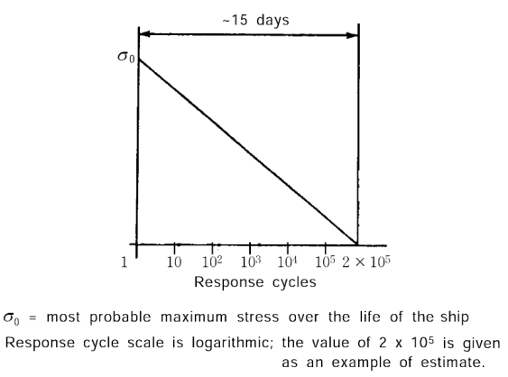
    - **(A)** Cruciform full penetration welded joints in a bi-lobe tank with centreline bulkhead can be accepted for the tank structure at tank centreline welds with bevel preparation subject to the approval of the Society, based on the results of the tests carried out at the approval of the welding procedure.(See below example)
  - **(6)** The "specifically approved by the Society" referred to in the requirements in **420. 1** (2) (A) of the Rules means the case of tanks where MARVS is 1.0 $\mathrm{MPa}$ or below and the design temperature is higher than -10°C satisfying both of the following requirements (A) and (B). However, this is to be limited to areas where non-destructive test is possible.
    - **(A)** Pressure vessels where removal of backing strip is operationally difficult and which are not used in an atmosphere liable to generating stress corrosion cracks.
    - **(B)** There is no excessive stress concentration.
- **2.** **Membrane tanks**
  - **(1)** For the purpose of the requirements in **420. 3** of the Rules, quality assurance procedure, welding control, design details, quality control of materials, construction method, inspection and standards of production testing of components for membrane tanks are to be developed during the prototype test specified in **424. 8** of the Rules or another prototype test separately conducted for development of production procedure, and their effectiveness is to be verified. The relevant data is to be noted in the construction procedure manual for cargo tanks including the insulation construction of membrane tanks.
  - **(2)** The construction procedure manual referred to in the preceding (1) is to be approved by the Society after being verified through prototype test.
- **3.** **Stress measurements instrumentation of type B independent tanks**
  For the purpose of the requirements in **420. 3.** (4) of the Rules, in case where stress measurements of the cargo tank previously built which can be regarded as the tank of the same design manufactured at the same shipyard had resulted in good agreement with design stress levels, provision of instrumentation of independent tanks stress levels for tanks subsequently built may be omitted.
- **4.** **Verification before and after the first loaded voyage** ***(2024)***
  In accordance with the requirements in **420. 3** (5) to (7), **513. 2** (5) and **1303. 5** of the Rules, surveyor attendance is required at the first cargo loading and first cargo unloading. Surveyor attendance during new building gas trials can be considered to comply with the below applicable verifications and examinations survey requirements, with the exceptions of the survey requirements marked (**).1
  - **(1)** Verifications and examinations at first full cargo loading, as applicable to cargo containment system
    Note: When attending at first full cargo loading, priority shall be given to latter stages of loading;
    - verify the satisfactory functionality of the emergency shutdown system during testing;
    - satisfactory operation of gas detection system;
    - satisfactory operation of cargo tank pressure monitoring system;
    - satisfactory operation of inter barrier space(s) and insulation space(s) pressure monitoring system, as applicable;
    - satisfactory operation of cargo tank temperature monitoring system;
    - satisfactory operation of cargo tank level indicating system;
    - satisfactory operation of inter barrier space(s) and inner hull temperature monitoring system, as applicable;
    - inert gas generator, if operating;
    - nitrogen generating plant, if operating;
    - nitrogen pressure control system for insulation, interbarrier, and annular spaces, as applicable;
    - reliquefaction plant, if fitted;
    - equipment fitted for the burning of cargo vapours such as boilers, engines, gas combustion units, etc., if operating;
    - examination of on-deck cargo piping systems including expansion and supporting arrangements;
    - verification and examination of all piping systems, including valves, fittings and associated equipment for handling cargo or vapours^2
    - advise Master to carry out cold spot examination of the hull and external insulation during transit voyage to unloading port and record in ship’s logbook;
    - advise Master to test high-level alarm(s) with liquid cargo during voyage and record in ship’s logbook, when loading condition permits.
    - satisfactory operation of cargo compressors;
  - **(2)** Verifications and examinations at first full cargo unloading, as applicable
    Note: When attending at first full cargo unloading, priority shall be given to the commencement of unloading.
    - examination of on-deck cargo piping systems including expansion and supporting arrangements;
    - review logbook entry of emergency shutdown system testing prior to commencement of unloading;
    - (**) review cargo logs and alarm reports for cargo tank pressure, temperature, and level indicating systems;
    - satisfactory operation of cargo compressors;
    - satisfactory operation of cargo pumps;
    - inert gas generator, if operating;
    - nitrogen generating plant, if operating;
    - nitrogen pressure control system for insulation, interbarrier, and annular spaces, as applicable;
    - (**) review of records for satisfactory operation of the reliquefaction plant, if fitted;
    - review of records for equipment fitted for the burning of cargo vapours such as boilers, engines, gas combustion units, etc.;
    - (**) on ships fitted with membrane tanks, review records of the cofferdam and inner hull temperature sensors to verify the readings are not below the allowable temperature for the selected grade of steel;
    - (**) cofferdam heating system, if in operation;
    - (**) review logbook entries for cold spot examination; and
    - (**) review logbook entry for testing of high-level alarm(s) with liquid cargo. If cargo conditions did not permit testing, surveyor to require testing at the first occasion where cargo conditions allow for testing. Master to be advised to record testing in ship’s logbook which is to be verified no later than the first annual survey.
  - **(3)** Documentation to be requested to the Master
    To demonstrate satisfactory functionality of the verifications, ship’s Master shall be required to arrange and provide to the surveyor print outs or screen shots showing:
    - trends of cargo tanks pressure and temperature;
    - trends of pressure and temperature distribution of inter-barrier space(s) and insulation space(s), and temperature distribution of inner hull, as applicable;
    - trends record of performance of cofferdam heating system, when fitted;
    - trends record of consumption of nitrogen gas, and whether any abnormality has been observed;
    - list of any gas alarms, if occurred;
    - Cargo Tanks Containment System Cold Spot Inspection Statement; and
    - activation of Cargo Tanks High-Level Alarm and Overfill Protection tests.
    Note 1: The symbol (**) indicates survey requirements only feasible to be carried out at the time of first full cargo loading/unloading.
    Note 2: Refer to **Table 7.5.5** Test Items at the Gas Trial.

    **Table 7.5.5 Test Items at Gas Trial**

    | Test item | ◎ : Attendance of the Surveyor ◯ : Submission of record | Inspection equipment | Survey item |
    | --- | --- | --- | --- |
    | 1. Drying test | ◯ | · Inert gas generator | · Dew point · Change of dryness in cargo tanks and hold spaces |
    | 2. Inerting test | ◯ | · Inert gas generator | · Operation of the inert gas generator · Measuring of atmosphere in cargo tanks |
    | 3. Inert gas purge test using cargo vapour | ◯ | · Cargo vapourizer · Compressor | · Change of O_2/temperature of cargo vapour in cargo tanks · Quantity of cargo vapour (or liquid) supply · Capacity of the vapourizer · Capacity of the compressor |
    | 4. Cool-down test | ◎/◯ | · Spray pump · Compressor · Cargo piping · Temperature indicators forcargo tank · Spray piping | · Temperature curve of cargo tanks${} ^{1)}$ · Inspection of hold spaces/condition of insulation of tanks (after cool-down) · Cooling condition of spray piping·Cooling condition of cargo piping · Capacity of spray pump · Cargo consumption · Capacity of compressor (property of return gas) · Temperature/pressure in cargo tank · Shrinkage of cargo tank${} ^{2)}$ |
    | 5. Loading test of cargo liquid | ◎/◯ | · Compressor · Cargo piping related for loading · level gauge/temperature indicator | · Temperature/pressure level in cargo tanks · Temperature/pressure in hold spaces · Temperature/pressure of cargo liquid/gas at manifolds · Service condition of cargo piping |
    | 6. Operation test of cargo pump | ◎/◯ | · All cargo pumps | · Discharge pressure/current of cargo pumps · Liquid level/pressure in cargo tanks · Stripping |
    | 7. Operation test of pressure/temperature control system | ◎/◯ | · Depend on the type of controls | · Depend on the type of controls |
    | Notes : 1) The Society may approve omission in consideration of the quality control status and manufacturing records of the insulation materials. 2) To be verified only in the case of independent tanks. |   |   |   |
- **5.** **Cold spot inspection**
  - **(1)** The cold spot inspection of cargo tanks specified in **420. 3** (7) of the Rules is to be carried out during the cargo full loading test to capacity specified in **420. 4** for the membrane tank, semi-membrane tank, internal insulation tank, and when necessary, independent tank.
  - **(2)** The cold spot inspection of cargo tanks specified in the preceding (1) may be confirmed when the inspection for discharging operation is carried out.
- **6.** **Additional information on the gas-trial and cargo full loading test** ***(2024)***
  - **(1)** Test:
    The tests are to be conducted to verify the performance of the cargo containment system cargo handling equipment and instrumentation using a suitable quantity of the cargo after the completion of all the construction work. Refer to **Table 7.5.5** for test items. However, for cargo tanks which do not require either cool-down operations or the cargo pressure / temperature control specified in **Section 7 701. 1 of the Rules,** the omission of this gas trials may be accepted if substitution is made by the operating test with the substituting medium at manufacturing plants or shipyards to verify the requirements given in **Table 7.5.5** of the Guidance except for the case where the tank is of the first cargo tank manufactured by the manufacturer of cargo tanks.
    The tests are to be conducted after completion of all the construction work to verify that the cargo containment installations, cargo handling equipment and instrumentation satisfy the design conditions under the fully loaded condition of cargo.
    - **(A)** Gas-trial
    - **(B)** Cargo full loading test
  - **(2)** The kinds of real liquid cargo and gas used in the gas-trial and cargo full loading test specified in the preceding (1) are to be such that reproduction of the most severe conditions of those design conditions of the cargo containment system, the transfer installations, the reliquefaction system, etc. and consideration is to be given to the following requirements (A) and (B) :
    - **(A)** The verification relative to design temperatures is to be made by reproducing the condition that the cargo on the basis of which design temperature has been determined is cooled down as close to the design temperature as practicable.
    - **(B)** For design conditions basing on the corrosivity or extreme toxicity, omission of verification through the use of these cargoes in gas-trial may be accepted in case where experimental data and information to prove the compliance of the construction and equipment including structural materials have been submitted to the Society.
  - **(3)** The quantities of the real cargo and vapour used in the gas-trial and cargo full loading test referred to in the preceding (1) are to be sufficient to conducting the tests specified in (1) above.

#### 421. Type A independent tanks 【 See Rule】

- **1.** Design basis
  - **(1)** "Recognized standards" of the requirements in **421. 1** (1) of the Rules means normally the requirements in **Pt 3, Ch 15** of the Rules.
- **2.** Structural analysis
  - **(1)** For the purpose of the requirements in **421. 2** (1) of the Rules, the corrosion allowance may be reduced or may not be required in accordance with the requirements in **403. 5** of the Rules. In structures where the membrane or axial force due to internal pressure can not be neglected, the calculation equation specified in **Pt 3, Ch 15** of the Rules may be used after suitable modification.
  - **(2)** In case where no corrosion allowance specified in **403. 5** of the Rules is required in accordance with the preceding (1), stiffeners may have section modulus more than 1/1.2 of one required in **Pt 3, Ch 15, Sec 2** of the Rules.
  - **(3)** For the purpose of the requirements in **421. 2** (2) of the Rules, the following (A) to (C) are to be considered for loads and ship deflections.
    - **(A)** Ship deflections due to longitudinal bending moment in waves and longitudinal still water bending moment.
    - **(B)** Ship deflections due to horizontal bending moment in waves and twisting moment, when necessary due to type of supporting structures.
    - **(C)** Internal pressure specified in **428. 1** of the Rules.
- **3.** **Allowable stresses** ***(2023)***
  - **(1)** The "classical analysis procedures" referred to in the requirements in **421. 3** (1) of the Rules means the beam theory where the type of stress to be assessed is the combined stress of bending stress and axial stress.
- **4.** **Hydrostatic or hydropneumatic test for independent tank**
  - **(1)** For the purpose of the requirements in **421. 5** and **422. 6** of the Rules, the hydrostatic or hydropneumatic test of cargo tanks is to be conducted by simulating the actual load conditions (static load + dynamic load) in accordance with the following requirements (A) and (B) :
    Hydrostatic-hydropneumatic test is to simulate the static pressure of cargo, acceleration by ship motions and internal pressure including the vapour pressure by water head and pneumatic pressure. (See Fig **7.5.18**, **7.5.19** and **7.5.20** of the Guidance)
    Hydraulic test is to simulate the cargo weight and the load created by the acceleration due to ship motions solely by the weight of water. (See Fig **7.5.21** of the Guidance)
    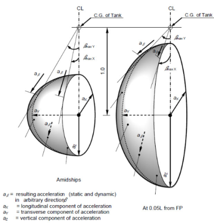
    **Fig 7.5.18 Simulating the Internal Pressure Distribution of Rectangular Tank** 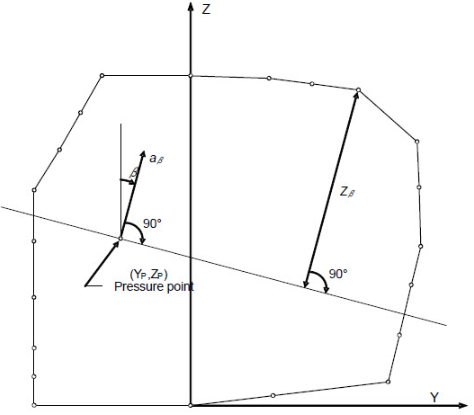
    **Fig 7.5.19 Simulating the Internal Pressure Distribution of Spherical Tank**
    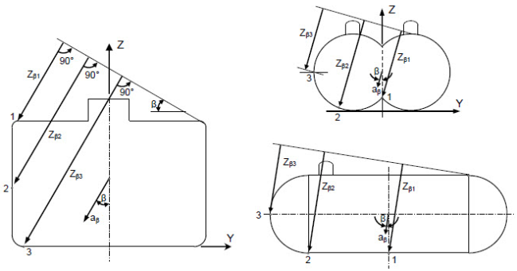
    **Fig 7.5.20 Simulating the Internal Pressure Distribution at Pressure Discharge** 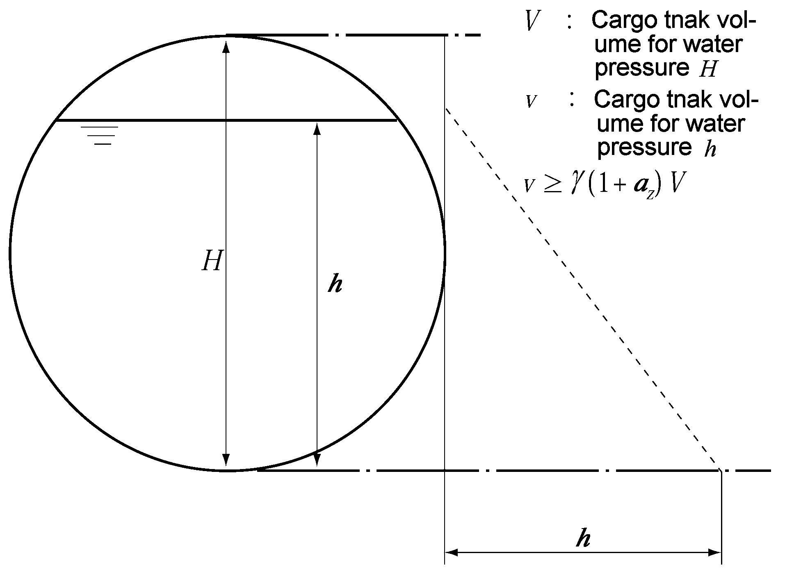
    **Fig 7.5.21 Simulating the Loading Condition of Support Structure**
    * Explanatory notes on symbols in Fig **7.5.18** to **7.5.21** of the Guidance
    ------ : maximum loading condition which is predicted to actually encounter
    … : pressure testing condition simulating as far as practicable ($P _{0} ^{''}$ and $h$ are to be chosen so that $P _{0} ^{'' } > P _{0}$ or $P _{0} ^{'' } > P _{0} ^{'}$ and $A _{2} +A _{3} > A _{1}$ as far as practicable)
    $H$ : depth of tank
    $h$ : water head
    $\gamma$ : specific gravity of cargo
    $a _{z}$ : maximum vertical acceleration (non-dimensional)
    $P _{0}$ : design vapour pressure at ordinary passage
    $P _{0} ^{'}$ : design vapour pressure during pressurized unloading in port
    $P _{0} ^{' '}$ : air pressure
    - **(A)** Test of cargo tanks
    - **(B)** Load test of supporting structures
  - **(2)** All tests specified in the preceding (1) (A) and (B) may be conducted individually.
  - **(3)** In the case of the cargo tank of supports which can be regarded as those of the same type manufactured at the same manufacturing plant, implementation of the second and subsequent tests of supports specified in the preceding (1) (B) may be omitted when deemed acceptable by the Society.
- **5.** **Structural Test and Tightness test for cargo tanks**
  In case where leakage of cargo tanks can not be inspected in the hydraulic test or hydrostatic-hydropneumatic test according to the requirements in **421. 5** of the Rules, the tightness test of cargo tanks is to be conducted separately. This test is to be of the airtightness test conducted at a pressure of MARVS or more of the cargo tank.

#### 422. Type B independent tanks 【 See Rule】

- **1.** **Structural analysis**
  In applying the requirements in **422. 2** of the Rules, the following requirements (1) through (10) are to be complied with :
  - **(1)** The cargo tank structure is to be analyzed by three dimensional frame structural analysis method or finite element method. The model for the analysis is to include concerned hull structures and support construction considering ship deflections and local deflections of hull due to vertical, horizontal and twisting moments.
  - **(2)** The strength members of cargo tanks are to be computed in details by the finite element method. In case where compatible results can be obtained, however, the frame structural analysis method may be used in replacement therewith.
  - **(3)** In the preceding (1) and (2), dynamic loads necessary for the calculation of interactions between the hull and cargo tanks specified in **422. 2** (2) of the Rules are, as a rule, to be determined by long-term distribution in accordance with the requirements in **414. 1** and **422. 2** (3) of the Rules where the most probable largest load in terms of the probability of occurrence as deemed appropriate by the Society is to be used. The dynamic stress($\sigma _{dyn}$) due to such loads are to be evaluated for their phase difference according to the requirements in **417. 3** of the Rules, and the total stress including dynamic stress is to be the sum of such dynamic stress and static stress($\sigma _{st}$). However, the load within cargo tanks may be considered as the internal pressure specified in the requirements in **428. 1** (2) of the Rules by using the value of long-term distribution of acceleration computed by direct calculation according to the requirements in **414. 1** and **422. 2** (3) of the Rules.
  - **(4)** The scantlings of cargo tank plates and stiffeners fitted to tank plates are to the satisfaction of the Society in consideration of the stress distribution and the mode of stress.
  - **(5)** In case where bulkheads are provided in cargo tanks, the scantlings of bulkhead plates and stiffeners fitted to the bulkhead plates are to the satisfaction of the Society.
  - **(6)** The strength members in cargo tanks are to be subjected to fatigue strength analysis for both the base metal and welded joints of high stress regions and stress concentration regions. S-N curves are to be plotted by experiment by the taking into account the following (A) through (F) :
    In the experiment, the number of test specimen is to be determined statistically and S-N curves are to be plotted against non-destruction probability $P$ = 50 %.
    - **(A)** Shape and size of test specimen
    - **(B)** Stress concentration and notch sensitivity
    - **(C)** Mode of stress
    - **(D)** Mean stress
    - **(E)** Welding conditions
    - **(F)** Ambient temperature
  - **(7)** Relative to the design standards for the secondary barrier, the crack propagation analysis specified in the requirements in **422. 2** (1) of the Rules is to be carried out to verify that the assumed initial cracks would not reach the critical crack length in a period. The rate of cargo leakage is to be computed on the basis of the crack length obtained by this analysis.
  - **(8)** It is to be verified that the cargo tank plates and associated structural members have sufficient strength against compressive buckling, tripping buckling of stiffeners, shearing buckling, and bending buckling of tripping brackets.
  - **(9)** The cargo tank plates and stiffeners are to have such scantlings as not to be caused harmful effects by resonance with the vibrations of exciting sources. The natural frequencies of the cargo tanks and stiffeners used in the above assessment are to be the minimum values in a state in contact with cargo liquid.
  - **(10)** The accuracy in stress analysis is to be verified by model tank test or pressure measurements taken at time of pressure tests on a real ship in accordance with the requirements in **420. 3** (4) of the Rules.
- **2.** **Allowable stresses**
  - **(1)** For the purpose of the requirements in **422. 3** (1) (B) of the Rules, the allowable stress for the primary stress of the prismatic Type B independent tanks is to be in accordance with the requirements in **422. 3** (1) (A) of the Rules.
  - **(2)** For the purpose of the requirements in **418. 1** (3) of the Rules, the values of $R _{e}$ and $R _{m}$ when the strength of welds is less than that of the parent metal as in the case of 9 % nickel steel are to be of the required values of mechanical properties of the weld metal. For welded joints of aluminium alloys R5083-O and R5083/5183 and 9 % nickel steel, the values of $R _{e}$ and $R _{m}$ may be modified in consideration of the increase in the yield stress and tensile stress at low temperature after taking into account the welding procedure employed.
  - **(3)** For the purpose of the requirements in **422. 3** (1) (C) of the Rules, if 9% nickel steel is used for the plates of the cargo tank, the allowable stress $R_e / 1.33$ is applied to the calculation of the tank plates. *(2021)*
- **3.** **Structural Test and Tightness test for cargo tanks**
  - **(1)** Refer to the requirements in **421. 4** and **5**.

#### 423. Type C independent tanks 【 See Rule】

- **1.** In applying the requirements of **423. 1** (2) of the Rules, if the carriage of products (it is only applicable to products having a relative density exceeding 1.0) not covered by the requirements in **Pt 7, Ch 5** of the Rules is intended, the following requirements (1) and (2) are to be complied with : *(2017)*
  - **(1)** The double amplitude of the primary membrane stress $\Delta \sigma _{m}$ created by the maximum dynamic pressure differential $\Delta P$ is not to exceed the allowable double amplitude of the dynamic membrane stress $\Delta \sigma _{A}$ as specified in **423. 1** (2) of the Rules, ie: $\Delta \sigma _{m} \leq \Delta \sigma _{A}$.
  - **(2)** The dynamic pressure differential $\Delta P$ is to be calculated as follows:
    $\Delta P = \rho (a _{\beta 1} Z _{\beta 1} -a _{\beta 2} Z _{\beta 2} )/(1.02 \times 10 ^{5} ) ( \mathrm{MPa})$
    $\rho$ is maximum liquid cargo density in $\mathrm{kg}/m ^{ 3}$ at the design temperature
    $a _{\beta }$, $Z _{\beta }$ are as defined in **428. 1** (2) of the Rules, see also **Fig 7.5.22** of the Guidance.
    $a _{\beta 1}$, $Z _{\beta 2}$ are the $a _{\beta }$ and $Z _{\beta }$ values giving the maximum liquid pressure $(P _{gd}) m ax$
    $a _{\beta 2}$, $Z _{\beta 2}$ are the $a _{\beta }$ and$Z _{\beta }$ values giving the minimum liquid pressure$(P _{gd}) mi n$
    In order to evaluate the maximum pressure differential $\Delta P$, pressure differentials is to be evaluated over the full range of the acceleration ellipse as shown in **Fig 7.5.22** of the Guidance.
- **2.** **Structural analysis**
  - **(1)** For the purpose of the requirements in **423. 2** of the Rules, for the scantlings, shapes and reinforcements of openings of cargo tanks against internal pressure in cargo tanks, the requirements for Class 1 pressure vessels in **Pt 5, Ch 5** of the Rules apply.
  - **(2)** $P _{4}$ among design external pressure $P _{0}$ is to be the value computed by applying the requirements in **Pt 3 Ch 10 Sec 2, Pt 3 Ch 16 Sec 2** and **Pt 3 Ch 17 Sec 2** of the Rules corresponding to the location of the tanks.
    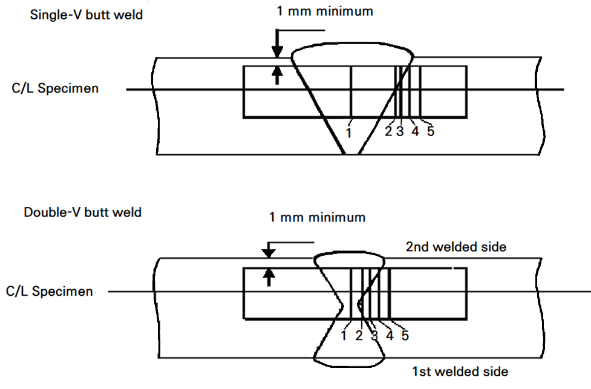
    **Fig 7.5.22 Acceleration Ellipse and Evaluation of Pressure Differentials**
- **3.** **Allowable stresses** ***(2017)***
  The circumferential stresses at supports shall be calculated by a procedure acceptable to the Classification Society for a sufficient number of load cases.
  - **(1)** Permissible stresses in stiffening rings:
    For horizontal cylindrical tanks made of C-Mn steel supported in saddles, the equivalent stress in the stiffening rings shall not exceed the following values if calculated using finite element method:
    $\sigma _{e} \leq \sigma _{all}$
    where:
    $\sigma _{ all}=\min(0.57R _{ m}; 0.85R _{ e})$
    $\sigma _{e}$ = $\sqrt {( \sigma _{n} + \sigma _{b} ) ^{2} +3 \tau ^{2}}$
    $\sigma _{e}$ : equivalent stress($\mathrm{N}/mm ^{2}$)
    $\sigma _{n}$ : nominal stress in the circumferential direction of the stiffening ring ($\mathrm{N}/mm ^{2}$)
    $\sigma _{b}$ : bending stress in the circumferential direction of the stiffening ring ($\mathrm{N}/mm ^{2}$)
    $\tau$ : shear stress in the stiffening ring ($\mathrm{N}/mm ^{2}$)
- **0.** 57 $R _{m}$ or 0.85 $R _{e}$
  $R _{m}$ and $R _{e}$ as defined in **418. 1** (3) of the Rules
  Equivalent stress values $\sigma _{e}$ is to be calculated over the full extent of the stiffening ring by a procedure acceptable to this Society, for a sufficient number of load cases as defined in **413. 9**, **414. 2** and **415.** of the Rules.
  - **(2)** The following assumptions are to be made for the stiffening rings:
    The effective width of the associated plating should be taken as:
    an effective width ($\mathrm{mm}$) not greater than 0.78$\sqrt {rt}$ on each side of the web.
    A double plate, if any, may be included within that distance.
    where:
    $r$ : mean radius of the cylindrical shell ($\mathrm{mm}$)
    $t$ : shell thickness ($\mathrm{mm}$)
    the effective width ($\mathrm{mm}$) is to be determined according to established standards.
    A value of 20 $t _{b}$ on each side of the web may be taken as a guidance value.
    where:
    $t _{b}$ : bulkhead thickness ($\mathrm{mm}$)
    - **(A)** The stiffening ring is to be considered as a circumferential beam formed by web, face plate, if any, and associated shell plating.
      - **(a)** For cylindrical shells:
      - **(b)** For longitudinal bulkheads (in the case of lobe tanks):
      - **(b)** The stiffening ring is to be loaded with circumferential forces, on each side of the ring, due to the shear stress, determined by the bi-dimensional shear flow theory from the shear force of the tank.
  - **(3)** For calculation of reaction forces at the supports, the following factors are to be taken into account:
    The final distribution of the reaction forces at the supports is not to show any tensile forces.
    - **(A)** Elasticity of support material (intermediate layer of wood or similar material)
    - **(B)** Change in contact surface between tank and support, and of the relevant reactions, due to:
      - **(a)** thermal shrinkage of tank
      - **(b)** elastic deformations of tank and support material
  - **(4)** The buckling strength of the stiffening rings is to be examined.
- **4.** **Hydrostatic or hydropneumatic test for independent tank**
  - **(1)** The "pressure vessels other than simple cylindrical and spherical pressure vessels" referred to in the requirements in **423. 6** (1) (A) of the Rules means those cylindrical or spherical pressure vessels with supporting structures of well proved records. In tanks of special shape having supporting structures likely to cause excessive bending stress or bicylindrical shape tanks, the stress levels are to be verified by strain measurement through prototype test.
  - **(2)** "Where necessary" referred to in the requirements in **423. 6** (4) (D) of the Rules means a case in which the shipbuilding berth or hull structure can not withstand the hydrostatic load when cargo tanks are filled with water to the tank top level and another case in which a large load exceeding the design load is imposed on the structural members of the tank or adjacent structures by conducting the hydrostatic test.
  - **(3)** For the purpose of the requirements in **423. 6** (6) of the Rules, the leakage test is to be of the airtightness test conducted at a pressure of MARVS or more of the pressure vessel.
- **5.** **Tightness test for cargo tanks**
  - **(1)** Refer to the requirements in **421. 4** and **5**.

#### 424. Membrane tanks 【 See Rule】

- **1.** **Design basis**
  In case where the design vapour pressure is made higher than 0.025 $\mathrm{MPa}$ in accordance with the provision to the requirements in **424. 1** (4) of the Rules, this vapour pressure is to be taken into account when model test specified in **424. 8** (1) of the Rules is conducted. In this case, special consideration is to be given to stress concentration for the welding and construction details of the adjacent hull structure.
- **2.** **Loads and load combinations**
  - **(1)** The assessments of collapse of the membrane referred to in the requirements of **424. 3** of the Rules are to be made in accordance with the following requirements (A) to (C) :
    - **(A)** For overpressure and negative pressure in the interbarrier space, collapse test is to be conducted on a prototype model of the membrane to verify its ultimate strength.
    - **(B)** For sloshing loads, impact load experiment is to be carried out on a prototype model of the membrane to verify its strength when the Society considers necessary.
    - **(C)** For vibrations, the natural frequency of the membrane is to be determined whereby it is to be verified that the membrane does not undergo resonance with the vibrations excited by propeller and main engine.
- **3.** **Structural analyses**
  - **(1)** For the purpose of the requirements in **424. 4** (2) of the Rules, the hull structure adjacent to membrane tanks is to comply with the requirements of relevant rules and, in addition, the stress in the hull structure is to be restricted in consideration of the structural strength of membrane tanks, if necessary. The allowable stresses of the membrane, membrane supporting structures and insulation materials are to be determined in each case according to the mechanical properties of materials, records of construction, product specifications and levels of product quality control practice.
- **4.** **Hull structure adjacent to membrane or semi-membrane tanks (*****2019*****)**
  - **(1)** The "hydrostatically tested" referred to in the requirements in **424. 9** of the Rules means the hydraulic test according to the requirements in **Pt 1, Annex1-16.** of the Guidance. In this case, hydraulic pressure may be applied from hull structures such as ballast tanks and cofferdams.
  - **(2)** The leakage test for the "other hold structure supporting the membrane" referred to in the requirements in **424. 9** of the Rules is to be in accordance with the requirements specified in **Pt 1, Annex1-16.** of the Guidance.

#### 425. Integral tanks 【 See Rule】

- **1.** Design basis
  In case where the design vapour pressure is made higher than 0.025 $\mathrm{MPa}$ in accordance with the requirements in **425. 1** of the Rules, special consideration is to be given to stress concentration for the welding and detailed construction of cargo tanks.
- **2.** **Testing**
  For the purpose of the requirements in **425. 5** of the Rules, the hydraulic test of integral tanks is to conform to the requirements in **Pt 1, Annex 1-16.** of the Guidance. However, for tanks whose design MARVS exceeds 0.025 $MPa$ or specific gravity of the cargo exceeds 0.6, the test may be such as to conform to the requirements specified in **421. 5** of the Rules correspondingly.

#### 426. Semi-membrane tanks 【 See Rule】

- **1.** **Structural analysis**
  - **(1)** For the purpose of the requirements in **426. 1** of the Rules, stress analysis is to be carried out on the structural members of cargo tanks in consideration of the loads specified in the requirements from **412.** to **414.** of the Rules. In this case, the requirements in **422. 3** (1) of the Rules apply correspondingly to the allowable stress.
  - **(2)** For stress analysis referred to in the preceding (1), the Society may request model test to verify the accuracy in such stress analysis or stress measurements at time of pressure test of cargo tanks when the Society deems necessary.

#### 428. Guidance notes for Sec 4 【 See Rule】

- **1.** **Internal pressure**
  - **(1)** As the "Equivalent calculation procedures" referred to in the requirements in **428. 1** (1) of the Rules, the following (A) to (B) may be based upon :
    $h _{j} =h _{j \cdot st} +h _{j \cdot dyn} (\mathrm{MPa})$
    $h _{j \cdot st} = P _{0} + \frac{\rho \cdot z _{j}}{1.02 \times 10 ^{5}} (\mathrm{MPa})$
    $h _{j \cdot dyn} = \frac{\rho \sqrt {(x _{j} \cdot a _{x} ) ^{2} +(y _{j} \cdot a _{y} ) ^{2} +(z _{j} \cdot a _{z} ) ^{2}}}{1.02 \times 10 ^{5}} (\mathrm{MPa})$
    $P _{0}$ and $\rho$ : as specified in **428. 1** of the Rules.
    $a _{x} , a _{y}$ and $a _{z}$ : as specified in Fig **7.5.23** of the Guidance and in **428. 1** of the Rules.
    $x _{j} , y _{j}$ and $z _{j } (\mathrm{m})$ : as specified in Fig **7.5.23** of the Guidance.
    $P( \phi , \theta ) _{st} =P _{0} + \rho \cdot R \cdot (1-\cos \theta )/ (1.02 \times 10 ^{5} )$ ($\mathrm{MPa}$)
    $P( \phi , \theta ) _{d y n} = \sqrt {P _{1} ^{2} +P _{2} ^{2} +P _{3} ^{2}}$ ($\mathrm{MPa}$)
    $P _{1} = \rho \cdot R( \sqrt {1+a _{x} ^{2}} -a _{x} \cdot \sin \phi \cdot \cos \theta -1)/(1.02 \times 10 ^{5} )$ ($\mathrm{MPa}$)
    $P _{2} = \rho \cdot R( \sqrt {1+a _{y} ^{2}} -a _{y} \cdot \sin \phi \cdot \cos \theta -1)/(1.02 \times 10 ^{5} )$ ($\mathrm{MPa}$)
    $P _{3} = \rho \cdot R \cdot a _{z} (1-\cos \theta )/(1.02 \times 10 ^{5} )$ ($\mathrm{MPa}$)
    where ;
    $P _{0} , \rho , a _{x} , a _{y}$ and $a _{z}$ : as specified in the preceding (A)
    $R$ : inner radius of sphere ($\mathrm{m}$)
    $\phi , \theta$ : as specified in Fig **7.5.24** of the Guidance.
    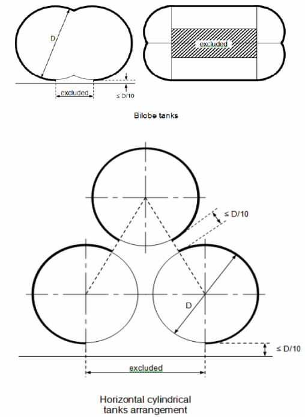
    **Fig 7.5.24** $\phi$**,** $\theta$ **at the spherical tank**
    $P( \phi , \theta ) _{\min} =P _{0} + \rho \cdot R(1+a _{z} ) \cdot (1-\cos \phi )/(1.02 \times 10 ^{5} )$ ($\mathrm{MPa}$)
    where;
    $P _{0} , \rho , R$ and $a _{z}$ : as specified in the preceding (A).
    $P(x _{j, } \phi ) _{s t} =P _{0} + \rho R(1-\cos \phi )/(1.02 \times 10 ^{5} )$($\mathrm{MPa}$)
    $P(x _{j} , \phi ) _{d y n} = \sqrt {P _{1} ^{2} +P _{2} ^{2} +P _{3} ^{2}}$ ($\mathrm{MPa}$)
    $P _{1} = \rho \cdot x _{j} \cdot a _{x} /(1.02 \times 10 ^{5} )$ ($\mathrm{MPa}$)
    $P _{2} = \rho \cdot R( \sqrt {1+a _{y} ^{2}} -a _{y} \sin \phi -1)/(1.02 \times 10 ^{5} )$ ($\mathrm{MPa}$)
    $P _{3} = \rho \cdot R \cdot a _{z} (1-\cos \phi )/(1.02 \times 10 ^{5} )$ ($\mathrm{MPa}$)
    where;
    $P _{0} , \rho , a _{x} , a _{y}$ and $a _{z}$ : as specified in the preceding (B)
    $R$ : inner radius of cylinder ($\mathrm{m}$)
    $\phi$, $x _{j}$ : as specified in Fig **7.5.25** of the Guidance.
    $P(x _{j} , \phi ) _{\min} =P _{0} + \rho \cdot R(1+a _{z} )(1-\cos \phi )/(1.02 \times 10 ^{5} ) \cdots (\mathrm{MPa})$
    - **(A)** In the case of square tanks, the water head at arbitrary point $j$ on the tank plate is to be obtained from the following equations :
    - **(B)** In the case of spherical tanks, pressure $P ( \phi , \theta )$, at arbitrary point on the tank plate is to be obtained from the following equations :
      - **(a)** $P( \phi , \theta )=P( \phi , \theta ) _{st} +P( \phi , \theta ) _{d y n}$ ($\mathrm{MPa}$)
      - **(b)** Notwithstanding the value specified in the preceding (a), the value of $P$ is not to be less than the following value :
    - **(C)** In the case of cylindrical tank arranged horizontally along the longitudinal direction of the ship, pressure $P (x _{j} , \phi )$ at an arbitrary point on the tank plate is to be obtained from the following equation :
      - **(a)** $P(x _{j, } \phi )=P \left( x _{j} , \phi \right) _{st} +P(x _{j} , \phi ) _{dyn}$
      - **(b)** Notwithstanding the value specified in the preceding (a), the value of $P$ is not to be less than the following value :

### Section 5 Process Pressure Vessels and Liquid, Vapour and Pressure Piping Systems

#### 501. General 【 See Rule】

- **1.** **Cargo and process piping**
  - **(1)** For the purpose of the requirements in **501. 1** of the Rules, "product and process piping" means the piping used for cargo operation, cooling, heating, processing and disposing of boil-off gases having a possibility of coming to contact with the cargo. The refrigerant piping which does not directly come to contact with the cargo is not included.
  - **(2)** For product and process piping referred to in the preceding (1), in addition to the requirements in **Sec. 5** of the Rules and, the requirements **Pt 5, Ch 6** of the Rules apply where considered as necessary by the Society.
  - **(3)** For the purpose of the requirements in **Ch 5** of the Rules, approval and test requirements of cargo and process equipment are to be in accordance with **Annex 1** of **Rules for the Classification of Ships Using Low-flashpoint Fuels.** For equipment of which the requirements are specified in the Rules, relevant requirements in **Annex 1** of **Rules for the Classification of Ships Using Low-flashpoint Fuels.** are to additionally apply.
- **2.** **Process pressure vessels**
  - **(1)** For the purpose of the requirements in **501. 2** of the Rules, "process pressure vessels" means the pressure vessels used for cargo operation, cooling, processing of boil-off gases and temporarily containing the cargo inside where heat exchangers are included. They, however, do not include those pressure vessels for refrigerant without containing cargo and parts of cargo pumps, compressors and valves subjected to internal pressure.
  - **(2)** Of those process pressure vessels referred to in the preceding (1), for the process pressure vessels that are not used for cargo storage, only the requirements in **403. 5, 419. 2** (1), **420. 1, 423. 2** (1) (C), (3), **3**, **6** and **7**, **604.**, **605. 6** (5) and **606. 2** (2) of the Rules apply.

#### 502. System requirements 【 See Rule】

- **1.** **Segregation of cargo piping** ***(2022)***
  - **(1)** "Vertical trunk-way" referred to in the requirements in **502. 2** (1) (C) of the Rules is to comply with the following requirements (A) through (G) :
    - **(A)** The access opening in the vertical trunk-way is to comply with the requirements in **305. 3** of the Rules.
    - **(B)** The bilge discharge system in the vertical trunk-way is to comply with the requirements in **307. 2, 3** and **4** of the Rules.
    - **(C)** Pressure relief system complying with the requirements in **802. 2** of the Rules is to be provided.
    - **(D)** Inerting system complying with the requirements in **902.** of the Rules is to be provided.
    - **(E)** The electrical installations within the vertical trunk-way are to comply with the requirements in **Sec. 10** of the Rules.
    - **(F)** Ventilation system complying with the requirements in **1202.** of the Rules is to be provided.
    - **(G)** Gas detecting system complying with the requirements in **1306. 2** of the Rules is to be provided.
- **2.** The "suitable means" referred to in the requirements in **502. 2** (2) of the Rules means the residual liquid discharging piping led to cargo tank, liquid cargo line or other drain tank.
- **3.** The "means to detect and dispose of any liquid cargo which may flow into the vent system" referred to in the requirements in **502. 2** (4) of the Rules means the fol1owing (See Fig **7.5.26** of the Guidance) :
  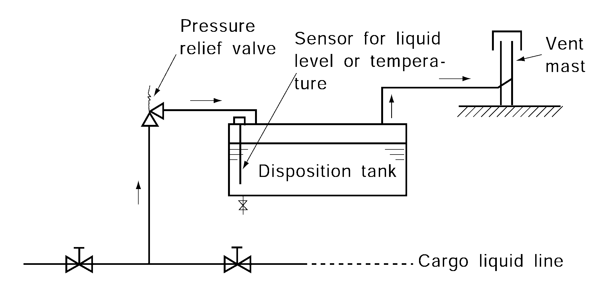
  **Fig 7.5.26 Example means to detect and****dispose of any liquid cargo which may flow into the vent system**
  - **(1)** As a means to dispose of the liquid cargo, a tank with a capacity larger than those determined in the followings are to be provided. The material of the disposition tank is to be of equivalent to the liquid cargo piping or higher grade, and in the case of pressurized cargo tanks, consideration is to be given to the temperature drop due to expansion and evaporation.
    - **(A)** By assuming possible state of liquid full condition that may actually take place, the quantity of liquid cargo to be covered is to be determined.
    - **(B)** Due to heat input from the fire, the quantity of expansion for the quantity of liquid indicated in (A) above to rise from the initial temperature (normally, the minimum design temperature of the pipeline) to the temperature of vapour saturation at the set pressure of the relief valve is to be obtained and on the basis of which the quantity of the liquid to the disposition tank is to be determined.
    - **(C)** By giving consideration to the back pressure of the vent pipeline, the liquid phase quantity in the disposition tank of the inflow quantity obtained in the preceding (B) is to be computed to obtain the capacity.
  - **(2)** As a means for detecting liquid cargo, a high level alarm sensor or low temperature alarm sensor in case of low temperature cargo tanks, and a high level alarm sensor in case of pressure cargo tanks, are to be provided in the disposition tank and to issue alarm when the sensor functions.

#### 503. Arrangements for cargo piping outside the cargo area 【 See Rule】

- **1.** **Emergency cargo jettisoning**
  For the purpose of the requirements in **503. 1** of the Rules, the emergency cargo jettisoning piping system is to comply with the requirements in **308. 6** and **510. 1** of the Rules. The Society may give additional requirements according to details of arrangement.

#### 504. Design pressure 【 See Rule】

- **1.** For the purpose of the requirements in **504. 2** of the Rules, where design vapour temperature higher or lower than 45°C is employed, the requirements in **401. 2** of the Rules apply.
- **2.** The expression "duct" in **504. 4** of the Rules means to include the equipment enclosure required in **1604. 3 (1)** and **(2)** of the Rules (e.g. GVU enclosure) as well as the structural pipe duct intended to contain any release of gas from inner pipe or equipment. The term "structural pipe duct" means an outer duct forming part of a structure such as a hull structure or superstructure or deck house, where permitted, other than gas valve unit rooms. The gas valve unit rooms are to be: *(2023)*
  - **(1)** gastight toward other enclosed spaces;
  - **(2)** equipped with mechanical exhaust ventilation having a capacity of at least 30 air changes per hour and arranged to maintain a pressure less than the atmospheric pressure; and
  - **(3)** able to withstand the maximum built-up pressure arising in the room in case of a gas pipe rupture, as documented by suitable calculations taking into account the ventilation arrangements.
- **3.** For the purpose of the requirements in **504. 4** of the Rules, the expression "design pressure of the outer pipe or duct" is either of the following: *(2021)*
  - **(1)** the maximum pressure that can act on the outer pipe or equipment enclosure after the inner pipe rupture as documented by suitable calculations taking into account the venting arrangements; or
  - **(2)** for gas fuel systems with inner pipe working pressure greater than 1 MPa, the "maximum built-up pressure arising in the annular space", after the inner pipe rupture, which is to be calculated in accordance with **Ch 9, 802. of Rules for the Classification of Ships Using Low-flashpoint Fuels.**

#### 505. Cargo system valve requirements

- **1.** **Stop valves fitted to the cargo tank 【 See Rule】**
  - **(1)** For the purpose of the requirements in **505. 2** of the Rules, no expansion joints are to be provided between the cargo tank and stop valves fitted to the cargo tank. "To provide full closure and are to be capable of local manual operation" referred to in the requirements means that the stop valve is fitted with manual operated closing means.
  - **(2)** For the purpose of the requirements in **505. 2** (2) of the Rules, the duplicated provisions of manual stop valve and emergency shutdown valve may be made in such a way as shown in Fig **7.5.27** of the Guidance.
    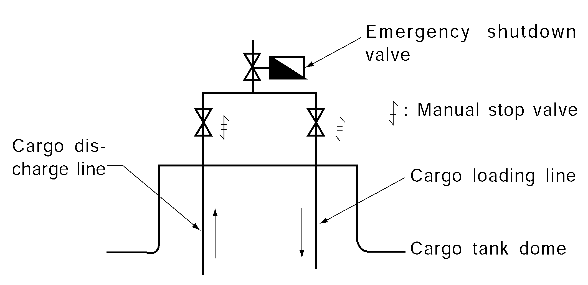
    **Fig 7.5.27 Duplicate provisions of stop valve and emergency shutdown valve**
- **2.** **Cargo hose connection 【 See Rule】**
  - **(1)** The "Transfer connections not in use" referred to in the requirements in **505. 3** of the Rules means those not used for cargo operation, for example, hose connection used for gas free operation. In this case, stop valve and blind flange are to be provided at the connection.
  - **(2)** For the purpose of the requirements in **505. 3** of the Rules, the connection between the cargo hose connection and shore line is to be electrically bonded.
- **3.** "All pipelines or components which may be isolated in a liquid full condition" referred to in the requirements in **505. 6** of the Rules means, for example, those pipelines given in the following: **【See Rule】**
  - **(1)** Pipeline between two adjacent stop valves.
  - **(2)** Pipeline between stop valve and compressor or pump likely to be liquid full. However, where the relief valve mounted on the compressor or pump is in effective condition, this requirement may be dispensed with.
  - **(3)** For the pipeline indicated in the preceding **3**, a relief valve is to be provided irrespective of its design pressure. However for the pipelines or components which may be isolated with a liquid volume of less than 0.05 $\mathrm{m} ^{3}$ entrapped, where installation of a relief valve is impractical due to small space between stop valves or stop valve are normal open with caution plate, a relief valve may not be provided. *(2022)*

#### 506. Cargo transfer arrangements 【See Rule】

- **1.** The cargo pumps specified in the requirements in **506. 1** of the Rules are to be approved in accordance with the requirements of the Guidance.
- **2.** For the purpose of the requirements in **506. 1** of the Rules, when the cargo transfer methods are of the submerged pumps or by deep well pumps, standby cargo pump or the cargo transfer installations according to the requirements in **506. 2** of the Rules are to be provided.
- **3.** The standby cargo pump referred to in the preceding **2** may be such as to conform to the following requirements :
  - **(1)** Where two sets or more cargo pumps are provided in one cargo tank, the provision of standby cargo pump may be omitted even when both of them are normally subjected to simultaneous operation. Where cargo tank of such a construction that it is separated by a bulkhead and connecting holes or bulkhead valve with remote control are not provided, each such tank separated by the bulkhead is to be regarded as one cargo tank.
  - **(2)** The stripping pump may be regarded as a standby cargo pump.
  - **(3)** The eductor may be regarded as a standby cargo pump. In this case, however, care is to be taken so that even when cargoes of different kinds are carried simultaneously, the driving fluid is available at all times.
- **4.** The "gas pressurization" referred to in the requirements in **506. 2** of the Rules means, for example, to pressurize the cargo tank with cargo vapour pressurized by cargo compressor or cargo heater.
- **5.** **506. 5** of the Rules is only applicable if such a sampling system is fitted on board. Connections used for control of atmosphere in cargo tanks during inerting or gassing up are not considered as cargo sampling connections. *(2021)*
- **6.** For the purpose of the requirements in **506. 6** of the Rules, means to indicate that filters are becoming blocked and filter maintenance is required is to be provided for fixed in-line filter arrangement and portable filter installations where dedicated filter housing piping is provided.
  Where portable filters for fitting to manifold presentation flanges are used without dedicated filter housing, and these can be visually inspected after each loading and discharging operation, no additional arrangements for indicating blockage or facilitating drainage are required. *(2021)*

#### 507. Installation requirements 【 See Rule】

- **1.** For the purpose of the requirements in **507. 2** of the Rules, for piping with design temperature lower than - 5°C, the following requirements (1) to (3) are to be complied with to protect the hull structure.
  - **(1)** The branches of the piping are to be insulated for thermally separating them from the hull structure. However, in case where the materials of hull structures comply with the requirements given in **Table 7.5.8** of the Rules against the temperature obtained by heat transmission calculation in consideration of the design temperature of the piping, these requirements may be dispensed with.
  - **(2)** As a means of protection for hull structures against cargo leakage from the piping, drain pans or equivalent manufactured from the materials specified in **Table 7.5.5, Table 7.5.6** and **Table 7.5.7** of the Guidance having sufficient capacity are to be arranged according to the design temperature of the piping at all locations where liquid leakage is likely.
- **2.** The materials of drain pans referred to in the preceding **1** (2) and (3) may be made such that they comply with the requirements of Korean Industrial Standards or recognized standards and are suitable for the design temperature of the piping system.
- **3.** For the purpose of the requirements in **507. 4** of the Rules, the electrical bonding is to conform to the requirements of **Pt 6, Ch 1, 201. 3** of the Rules. In case where the gasketed flange joint are used, the flange bolts only are not considered as an earthing, and the connections and earthing are to be provided with earthing conductors. Also, in case where electrical bondings are necessary for cargo tanks and secondary barriers, such bondings are to be provided at readily accessible places. **【See Rule】**

#### 508. Piping fabrication and joining details

- **1.** **Application**
  According to the requirements in **508. 1** of the Rules, the requirements specified in **508. 2** to 5 and 509. of the Rules may be modified in accordance with the following (1) and (3) :**【See Rule】**
  - **(1)** For pipes provided inside the cargo tanks with open end excluding pump discharging pipings, the following requirements (A) to (C) apply :
    - **(A)** Butt welded joints with backing strips, sleeve joints and screw joints may be used in all cases.
    - **(B)** Slip-on and socket welded joints may be used in all cases.
    - **(C)** Non-destructive testing for butt welded joints may be omitted.
  - **(2)** For pipes with open ends provided outside the cargo tanks are to conform to the requirements specified in the preceding (1) (A) and (B), and in addition, the non-destructive testing for butt welded joints may be reduced to 10% sampling.
- **2.** **Connection of pipes without flanges**
  The "screwed couplings" referred to in the requirements in **508. 2** (3) of the Rules are to conform to the requirements of KS B 0222 or equivalent. **【See Rule】**
- **3.** **Flange connection**
  For the purpose of the requirements in **508. 3** (2) of the Rules, type and size of flange connections are to comply with the **Pt 5, Ch 6, Fig 5.6.1** of the Rules for the welded neck, slip-on and socket welded type as following requirements (1) to (3) : **【See Rule】**
  The others except welding connection are to comply with the requirements of recognized standards for their type and size.
  - **(1)** Welded neck type : Type A in **Pt 5, Ch 6, Fig 5.6.1** of the Rules
  - **(2)** Slip-on welded type : Type B1 in **Pt 5, Ch 6, Fig 5.6.1** of the Rules
  - **(3)** Socket welded type : Type B2, B3 in **Pt 5, Ch 6, Fig 5.6.1** of the Rules
- **4.** In application to **508. 5** of the Rules, the term “the Society may consider alternative arrangementse" means the acceptance in accordance with **Pt 1, Ch 1, 105.** of the Rules. **【See Rule】**

#### 509. Welding, post-weld heat treatment and non-destructive testing

- **1.** For the purpose of the requirements in **509. 2** of the Rules, the post-weld heat treatment of pipes with thickness less than 10 $\mathrm{mm}$ may be omitted except for those required in the requirements in **Pt 5, Ch 6, 105. 5** of the Rules. **【See Rule】**
- **2.** For the purpose of the requirements in **509. 3** of the Rules, the radiographic inspection method and the judgement for acceptance are to conform to the requirements in **Pt 5, Ch 6, 1404.** of the Rules. **【See Rule】**
- **3.** The "other non-destructive inspection" referred to in **509. 3** (3) of the Rules means the ultrasonic inspection, and depending on use of pipes, magnetic particle inspection or liquid penetrant inspection, and the inspection procedures are to conform to the requirements in KS D 0250, KS D 0213, KS B 0816. **【See Rule】**

#### 511. Piping system component requirements

- **1.** **Scantlings based on internal pressure**
  For the purpose of the requirements in **511. 2** of the Rules, the following requirements are to be complied with :
  - **(1)** The joint efficiency of electric-resistance welded pipes where non-destructive testing for full length of weld lines is not conducted is to be 0.85.
  - **(2)** For methane, propane, butane, butadiene and propylene cargoes, the corrosion allowance is to be 0.3 $\mathrm{mm}$ for carbon-manganese steel and 0 $\mathrm{mm}$ for stainless steel and aluminium alloys. Where effective corrosion control are taken for the interior of carbon-manganese steel pipes, the corrosion allowance may be 0.15 $\mathrm{mm}$.
  - **(3)** In addition to the preceding (2), for carbon-manganese steel pipes arranged on open deck without any effective external corrosion control means, 1.2 $\mathrm{mm}$ is to be added to the required corrosion allowance.
  - **(4)** The negative manufacturing dimensional deviation in pipe thickness is, except for expressly provided otherwise, to be in accordance with the requirements in **Pt 2, Ch 1, 401. 7, 402. 7** and **404. 7** of the Rules.
- **2.** **2**. The "minimum wall thickness is to be in accordance with recognized standards" referred to in the requirements in **511. 2** (2) of the Rules means the value corresponding to Schedule 40 of KS SPPS for carbon-manganese steel, and the value corresponding to Schedule 10 $S$ for stainless steel. However, for steel pipes provided with effective corrosion control or those not arranged under corrosive environment, the value may be reduced to the extent acceptable to the Society with a limitation of 1 $\mathrm{mm}$. Further, the value for pipes in cargo tanks and pipes having open ends may also be reduced to the extent acceptable to the Society.
- **3.** The cases where increase in pipe size is required according to the requirements in **511. 2** (3) of the Rules are the cases in which such becomes necessary on the basis of the results of stress analysis specified in the requirements in **511. 5** of the Rules, and in which suitable supports and means to absorb structural expansion and contraction can not be arranged due to convenience of on-deck piping, etc. **【See Rule】**
- **4.** As a presumption for the condition indicated in the preceding 3, the supports for piping are to be so arranged as to prevent exertion of the own weight of the pipe on valves or other fittings and to prevent generation of excessive vibration.
- **5.** **Stress analysis**
  - **(1)** For the purpose of the requirements in **511. 5** of the Rules, the calculation conditions and allowable stress in the stress analysis are to be in accordance with the following requirements (A) through (E) as standard :
    - **(A)** As temperature condition, a state uniformly cooled down to the design temperature is to be considered. As the reference temperature (thermal stress = 0), 15°C is to be regarded as standard.
    - **(B)** Loading conditions are to be in accordance with the following requirements (a) through (d):
      - **(a)** As internal pressure, the design pressure specified in the requirements in **504. 2** of the Rules is to be considered.
      - **(b)** The own weight of pipelines, when can not be neglected, is to be considered including its acceleration.
      - **(c)** As forced displacement, the forced strains corresponding to allowable sagging moment and hogging moment for the hull are to be considered.
      - **(d)** As thermal load, one which can be determined according to the condition indicated in the preceding (A) is to be considered.
    - **(C)** Support conditions are to be as deemed appropriate by the Society depending on the construction, arrangement and materials of the pipe supports.
    - **(D)** Allowable stresses are to be as deemed appropriate by the Society depending on the calculation method and materials of pipelines.
    - **(E)** Insulation materials are to be considered to give no contribution at all to the strength of the pipeline.
  - **(2)** According to the requirements in **511. 5** of the Rules, stress analysis may be required for pipings with the design temperature higher than -110°C where the following (A) to (C) are relevant :
    - **(A)** Where suitable supports or means to absorb structural expansion and contraction can not be arranged due to convenience of on-deck piping arrangement.
    - **(B)** Where new supporting method or new means to absorb expansion and contraction are used.
    - **(C)** Other cases where the Society deems necessary.
- **6.** For the purpose of the requirements in **511. 6** (1) of the Rules, fittings are to comply with the following requirements: **【See Rule】**
  - **(1)** Valves, flanges and other fittings are to comply with the requirements of recognized standards for their type and size, and the requirements in **Pt 5, Ch 6, 104.** of the Rules for flanges.
  - **(2)** The design pressure of bellows type expansion joints to be used in vapour piping may be taken 0.2 $\mathrm{MPa}$ for those provided on pipelines with open ends, and 0.5 $\mathrm{MPa}$ for those provided on other pipelines.
- **7.** In application to **511. 6** (2) of the Rules, the term "the satisfaction of the Society" means the case where the temperature, the pressure and the size of the flange have values above certain limits and the complete calculation of bolts and flanges is to be carried out.

#### 512. Materials 【 See Rule】

- **1.** For the purpose of the requirements in **512. 1** of the Rules, the materials of pipings, valves and fittings are to comply with the relevant requirements in **Sec 6** of the Rules, and at the same time, to conform to the relevant requirements in **Pt 2, Ch 1** of the Rules. However, for materials used in pipings as specified in the following (1) through (2), those conforming to **Pt 5, Ch 6, Sec 1** of the Rules may be used. *(2019)*
  - **(1)** Pipes, valves and pipe fittings used for cargo piping and process piping with the design temperature of 0°C or more.
  - **(2)** Pipes, valves and pipe fittings used for accessory piping or instrumentation piping with diameter not exceeding 25 $\mathrm{mm}$ with the design temperature below 0°C. The materials are to comply with the relevant requirements in **Sec 6** of the Rules,
- **2.** Notwithstanding the requirements in the preceding 1, piping with the design temperature of –55 °C or more may comply with the followings.
  - **(1)** The piping having open ends not coming to contact with the liquid cargo led from the pressure relieving valves of cargo tanks and cargo piping or process piping with the design temperature of -55°C or higher may not be made of the steel for low temperature services specified in **Table 7.5.7** of the Rules. Further, its material may be such as to comply with recognized standards as deemed appropriate by the Society.
  - **(2)** Work’s certificate with manufacturing process approved by the Society may be accepted for material of valve and fittings. Where, however, it is deemed to be necessary by the Society, the attendance of the Surveyor is required for material tests.
- **3.** For the purpose of the requirements in **512. 2** of the Rules, the insulation applied on the short pipes with a melting point lower than 925°C fitted to the cargo tank, except for the minimum range of area necessary for inspection and maintenance of pipe flanges, is to be protected according to the requirements specified in **419. 5** (2) of the Guidance. Further, the insulation materials for cargo piping and other piping are to conform to the requirements in **419. 6** (4) (B) of the Guidance.
- **4.** With reference to **3.** (1) of the Rules, the expression ‘a thermal insulation system as required to minimize heat leak into the cargo during transfer operations’ means that properties of the piping insulation are to be taken into consideration when calculating the heat balance of the containment system and capacity of the pressure/temperature control system.
  The expression ‘cargo piping systems are to be provided with a thermal insulation system as required... to protect personnel from direct contact with cold surfaces’ means that surfaces of cargo piping systems with which personnel is likely to contact under normal conditions are to be protected by a thermal insulation, with the exception of the following examples; *(2020)*
  - **(1)** surfaces of cargo piping systems which are protected by physical screening measures to prevent such direct contact;
  - **(2)** surfaces of manual valves, having extended spindles that protect the operator from the cargo temperature; and
  - **(3)** surfaces of cargo piping systems whose design temperature (to be determined from inner fluid temperature) is above minus 10 °C.

#### 513. Testing requirements (2025)

- **1.** **Requirements of type tests 【 See Rule】**
  - **(1)** In application to **513. 1** (1) (B) of the Rules, for valves used for isolation of instrumentation in piping not greater than 25 mm, unit production testing need not be witnessed by the surveyor. Records of testing are to be submitted for review.
  - **(2)** For the purpose of the requirements in **513. 1** (2) of the Rules, all bellows type expansion joints provided on all cargo piping including the cargo liquid/vapour piping provided both inside and outside the tanks, and vent piping with open ends are to be of the approved ones in accordance with open ends are to be type approved.
  - **(3)** The "procedure as deemed appropriate by the Society" referred to in **513. 1** (1), (2) and (3) of the Rules means the procedure required in **Ch 3, Sec 15** of "Guidance for approval of Manufacturing Process and Type approval, Etc.". In application to this requirement, prototype test in accordance with Ch 3, Sec 15 of the "Guidance for Approval of Manufacturing Process and Type Approval, Etc." may be accepted instead of type approval. *(2022)*
  - **(4)** For the purpose of the requirements in **513. 1** of the Rules, relevant requirements in **Annex 1** of **Rules for the Classification of Ships Using Low-flashpoint Fuels.** are to additionally apply.
  - **(5)** For the purpose of the requirements in 513. 1 (3) (A) and 513. 1 (4) (A) of the Rules, the following requirements are to be considered.
    The manufacturer is to submit documentation indicating the equipment has been designed to comply with the above criteria.
    - **(A)** Compressors and pumps are to be suitable for their intended purpose. All equipment and machinery are to be adequately designed to ensure suitability within a marine environment with due consideration to **Ch 3, Sec 23** of the "**Guidance for Approval of Manufacturing Process and Type Approval, Etc.**" and **Pt 5, Ch 1, 103. of the Rules**. Such items to be considered would include, but not be limited to:
      - **(a)** environmental;
      - **(b)** shipboard vibrations and accelerations;
      - **(c)** effects of pitch, heave and roll motions, etc.; and
      - **(d)** physical and chemical properties of product
    - **(B)** For the design assessment of the pumps, ISO 13709:2009 and ISO 24490:2016, as applicable, can be used. For the design assessment of the gas compressors, API standards. 617:2014 (w. Errata 1:2016), 618:2016 or 619:2010, as applicable, can be used. Other applicable recognized standards acceptable to the Society may be considered
    - **(C)** Material tests for pump and compressor materials of the boundary components, which are in direct contact with the medium, and those with a design temperature below –55°C are to be witnessed by the Surveyor. In addition, the scope of the main structural components to which these material tests apply and the corresponding requirements are to be in accordance with the applicable requirements in **Annex 1** of **Rules for the Classification of Ships Using Low-flashpoint Fuels**.
    - **(D)** When the manufacturer requests the Society to waive the production test, the relevant material testing requirements in required in above (C) are to be applied in addition to the requirements in **513. 1** (3) (C) and **513. 1** (4) (C).
- **2.** **Application 【 See Rule】**
  For the purpose of the requirements in **513. 2** (1) of the Rules, for pipes within the cargo tank and pipes with open ends, the hydraulic test and leak test specified in the requirements in **513. 2** (2) and (3) of the Rules may be omitted. However, the hydraulic test specified in the requirements in **513. 2** (2) of the Rules is to be conducted for pipes without open ends and discharging pipes provided inside the cargo tanks.
- **3.** **Pressure test**
  For the purpose of the requirements in **513. 2** (4) of the Rules, the expression "maximum pressure at gas pipe rupture" is the maximum pressure to which the outer pipe or duct is subjected after the inner pipe rupture and for testing purposes it is the same as the design pressure used in **504. 4** of the Rules. The expression "duct" in **513. 2 (4)** of the Rules means to comply **504. 2.** *(2023)*
- **4.** **Test under operating condition**
  For the purpose of the requirements in **513. 2** (5) of the Rules, the test is to be conducted according to the requirements in **420. 4** of the Guidance.
- **5.** **Leak test** For the purpose of the requirements in **513. 2** (3) of the Rules, the leak test after installing the complete compressor assembly connected to the vessel systems is to be performed in a same manner in the presence of the Surveyor and considered satisfactory when no joint leaks are observed.

### Section 6 Materials of Construction and Quality Control

#### 603. General test requirements and specifications 【See Rule】

- **1.** **Mechanical properties**
  For the purpose of the requirements in **603. 1** of the Rules, the required values of tensile strength, yield stress and elongation of a material are to be in accordance with the requirements in **Pt 2, Ch 1** of the Rules applicable to the material.
- **2.** **Alternative materials**
  The design temperature of a material may falls under the higher temperature range than the specified one for the material from **Table 7.5.4** to **Table 7.5.7** of the Rules. In this case, the impact test temperature correspondingly to the design temperature may be used instead of the impact test temperature depending on the material. For example, in the case of 2.25 % nickel steel pipes used at the design temperature of -45°C, the impact test temperature may be -50°C, while in the case of 3.5 % nickel steel plates used at the design temperature of -61°C, the impact test temperature may be –70°C. The impact test of austenitic stainless steel may be omitted, subject to agreement with the Society.
- **3.** **Properties after post-weld heat treatment**
  When post-weld heat treatment is carried out, the properties of the base material are to be in accordance with the requirements given in **Table 7.5.4** to **Table 7.5.7** of the Rules in the heat treated condition or equivalent condition whether such post-weld heat treatment is regarded in **606.** or **504. 6** (2) of the Rules or not. The welds properties at welding procedure qualification tests and production weld tests specified in the requirements in **605.** of the Rules are to satisfy the requirements in **605. 3** and **5** of the Rules in the heat treated condition.
- **4.** **Toughness test**
  - **(1)** For the purpose of the requirements in **603. 2** (2) of the Rules, in the case where the material thickness is 40mm or below, the Charpy V-notch impact test specimens are to be cut with their edge within 2 mm from the “as rolled” surface with their longitudinal axes either parallel or transverse to the final direction of rolling of the material.
  - **(2)** In application to **603. 2** (4) of the Rules, the re-testing of Charpy V-notch impact test specimens is to be in accordance with **Pt 2, Ch 1, 109.** of the Rules.

#### 604. Requirements for metallic materials

- **1.** For the purpose of the requirements in **Table 7.5.4** of the Rules, the following requirements are to be complied with : **【See Rule】**
  - **(1)** The use of the longitudinally or spirally welded pipes given in the Note (1) of the Table is to be in accordance with the relevant requirements in **Pt 2, Ch 1, Sec 4** of the Rules.
  - **(2)** Fittings of type C independent tanks and process pressure vessels with the design pressure not exceeding 3.0$\mathrm{MPa}$ and design temperature of 0°C or more and nominal diameter less than 100A given in Note (1) may comply with the requirements of KS or other standards as deemed appropriate by the Society.
  - **(3)** The controlled rolling as a substitution for normalizing given in Note (4) may be of the temperature controlled rolling or Thermo-Mechanical Controlled Processing (TMCP). Also, the controlled rolling as a substitution for tempering and quenching may be of TMCP.
- **2.** The controlled rolling as a substitution for normalizing or tempering and quenching given in Note (4) of **Table 7.5.5** of the Rules may be of TMCP. **【See Rule】**
- **3.** For the purpose of the requirements in **Table 7.5.6** of the Rules, the following requirements are to be complied with : **【See Rule】**
  - **(1)** For the purpose of the requirements in Note (2) of the Table, aluminium alloy of 5083, austenitic stainless steel, 36 % nickel steel and 9 % nickel steel may be used at the design temperature up to 196°C.
  - **(2)** For the purpose of the requirements in Note (4) of the Table, 9 % nickel steel greater than 25$\mathrm{mm}$ and up to 40$\mathrm{mm}$ in thickness is to be in accordance with the requirements for 9 % nickel steel not greater than 25$\mathrm{mm}$. *(2018)*
  - **(3)** For the purpose of the requirements in Note (5) of the Table, the chemical composition limit of a material, if the material specified in **Pt 2** of the Rules, is to be in accordance with the relevant requirements in **Pt 2, Ch 1** of the Rules.
  - **(4)** For the purpose of the requirements in Note (9) of the Table, the omission of the impact test given in Note (9) of the Table may generally be accepted for the austenitic steel of the type referred to in the Table.
- **4.** For the purpose of the requirements in **Table 7.5.7** of the Rules, the following requirements are to be complied with : **【See Rule】**
  - **(1)** The use of longitudinally or spirally welded pipes given in Note (1) of the Table is to be in accordance with the requirements in the preceding (1) (A).
  - **(2)** The requirements for forgings and castings given in Note (2) of the Table are to be in accordance with the relevant requirements in **Pt 2, Ch 1** of the Rules if specified.
  - **(3)** For the design temperature given in Note (3) of the Table lower than -165°C, the provision in the preceding **3.** (1) are to apply.
  - **(4)** The chemical composition limit given in Note (5) of the Table is to be in accordance with the requirements in the preceding **3.** (3)
  - **(5)** The omission of the impact test given in Note (8) of this Table are to be in accordance with the requirements in the preceding **3.** (4)
- **5.** For the purpose of the requirements in **604. 1** of the Rules. *(2017)*
  - **(1)** The requirements for castings and forgings intended for cargo and process piping for design temperature above 0°C are to be accordance with **Pt 2, Ch 1** of the Rules.
  - **(2)** Materials with alternative chemical composition or mechanical properties may be accepted by special agreement with the Society.
  - **(3)** Where post-weld heat treatment is specified or required, the properties of the base materials are to be determined in the heat treated condition in accordance with the applicable table and the weld properties are to be determined in the heat treated condition in accordance with **605.**. In cases where a post-weld heat treatment is applied, the test requirements may be modified at the discretion of the Society.
  - **(4)** Where reference is made to hull structural steels, the requirements of **Pt 2, Ch 1, 301.** of the Rules for appropriate grades apply.

#### 605. Welding of metallic materials and non-destructive testing 【See Rule】

- **1.** **General**
  - **(1)** The requirements in **605.** of the Rules apply to independent tanks, semi-membrane tanks, process pressure vessels, integral tanks and piping. The requirements on membrane tanks, are to the satisfaction of the Society depending on the structural type of the tank.
  - **(2)** For the purpose of the requirements in **605. 5** of the Rules, the following requirements (A) and (B) are to be complied with.
    - **(A)** The impact test may generally be omitted for austenitic stainless steels of types given in **Table 7.5.6** and **Table 7.5.7** of the Rules.
    - **(B)** The impact test may generally be omitted for aluminum alloys of 5083 and welding material of 5183.
  - **(3)** Welding procedure tests for secondary barriers are to be in accordance with **Pt 2, Ch 2, Sec 4** of the Rules. *(2017)*
- **2.** **Welding procedure qualification tests of cargo tanks and process pressure vessels**
  - **(1)** Longitudinal bend tests which are required in lieu of transverse bend tests in the case where the base material and weld metal have different strength level specified in **605. 3** (4) (C) of the Rules, such as 9 % nickel steel, are to be in accordance with the requirements in **Pt 2, Ch 2, 402.** of the Rules.
  - **(2)** For the purpose of the requirements in **605. 3** (4) (E) of the Rules, for type C independent tanks and process pressure vessels, macroscopic and microscopic examinations and hardness tests are to be carried out according to the requirements of the Rules. For other independent tanks, integral tank and semi-membrane tanks, macroscopic examinations are to be carried out according to the requirements in **Pt 2, Ch 2, Sec 4** of the Rules.
  - **(3)** For the purpose of the requirements in **605. 3** (5) of the Rules, the welding procedure qualification test are also to comply with the relevant requirements in **Pt 2, Ch 2, Sec 4.** and **Pt 5, Ch 5, Sec 4** of the Rules.
  - **(4)** For the purpose of the requirements in **605. 3** (5) (B) of the Rules, bend tests are also to comply with the requirements in **Pt 2, Ch 2, 404. 5** of the Rules. In case where the base metal is of RLP9 specified in **Pt 2, Ch 1** of the Rules, bend tests may be omitted.
  - **(5)** For the purpose of the requirements in **605. 3** (5) of the Rules, the test temperature of impact tests may be determined in accordance with the requirements in **603. 2** of the Guidance.
  - **(6)** In application to **605. 3** (3) of the Rules, radiographic or ultrasonic testing may be performed at the option of the Society. *(2017)*
  - **(7)** In application to **605. 3** (5) of the Rules, besides aluminium alloys, it may also be accepted subject to agreement with the Society that the transverse weld tensile strength is not to be less than the specified minimum tensile strength for the deposited metal, where the weld metal has lower tensile strength than that of the parent metal. *(2017)*
- **3.** **Welding procedure qualification tests for piping**
  For the purpose of the requirements in **605. 4** of the Rules, welding procedure qualification tests for pipes are also to be in accordance with the relevant requirements in **Pt 2, Ch 1** and **Pt 2, Ch 2, Sec 4** of the Rules.
- **4.** **Production weld tests**
  - **(1)** For the purpose of the requirements in **605. 5** of the Rules, production weld tests are also to be in accordance with the relevant requirements in **Pt 2, Ch 2, Sec 3** of the Rules and **Pt 5, Ch 5, 405.** of the Rules.
  - **(2)** For the purpose of the requirements in **605. 5** (1) of the Rules, the number of test specimens for production weld tests of secondary barriers may be reduced to the extent as deemed appropriate by the Society considering the experience of same welding procedures in past, workmanship and quality control. In general, intervals of production weld tests for secondary barriers may be approximately 200 $\mathrm{m}$ of butt weld joints and the tests are to be representative of each welding position. Test requirements are to be in accordance with **605. 3** (5). of Rules. *(2017)*
  - **(3)** For the purpose of the requirements in **605. 5** (5) of the Rules, number of test specimens for the production weld tests for integral tanks may be reduced to the same level as in the case of secondary barrier given in the preceding (2). Production weld tests for membrane tanks are left to the discretion of the Society depending on the construction system of the tank.
- **5.** **Non-destructive testing**
  - **(1)** For the purpose of the requirements in **605. 6** (2) of the Rules, the following requirements are to be complied with.

    **Table 7.5.7-1 The acceptance levels and required quality levels for Radiographic Testing**

    | Quality Levels (ISO 5817:2014 applies)(1) | Testing Techniques/ levels (ISO 17636-1:2022 applies)(1) | Acceptance levels (ISO 10675-1:2021 applies)(1) |
    | --- | --- | --- |
    | B | B(class) | 1 |
    | Note: (1) Or any recognized standard agreed with the Society and demonstrated to be acceptable |   |   |

    **Table 7.5.7-2 The acceptance levels and required quality levels for Ultrasonic Testing**

    | Quality Levels (ISO 5817:2014 applies)(1) | Testing Techniques/Levels (ISO 17640:2018 applies)(1) | Acceptance Levels (ISO 11666:2018 applies)(1) |
    | --- | --- | --- |
    | B | at least B | 2 |
    | Note: (1) Or any recognized standard agreed with the Society and demonstrated to be acceptable |   |   |

    **Table 7.5.7-3 The acceptance levels and required quality levels for Magnetic Partcile Testing**

    | Quality Levels (ISO 5817:2014 applies)(1) | Acceptance Levels (ISO 11666:2018 applies)(1) |
    | --- | --- |
    | B | 2X |
    | Note: (1) Or any recognized standard agreed with the Society and demonstrated to be acceptable |   |

    **Table 7.5.7-4 The acceptance levels and required quality levels for Dye Panetrant Testing**

    | Quality Levels (ISO 5817:2014 applies)(1) | Acceptance Levels (ISO 11666:2018 applies)(1) |
    | --- | --- |
    | B | 2X |
    | Note: (1) Or any recognized standard agreed with the Society and demonstrated to be acceptable |   |
    - **(A)** For the non-destructive tests specified in the requirements in **605. 6** (4) of the Rules for the remaining welds of tank plates of type A and B independent tanks and semi-membrane tanks other than butt welds, fillet welds of highly stressed parts of main structural members of cargo tanks are to be examined magnetic particle or dye penetrant tests given in the following (B). Butt welds of highly stressed parts of main structural members such as face plates of girders are to be subjected to radiographic test given in the following (B).
    - **(B)** Non-destructive tests refered to in the requirements in **605. 6** (5) of the Rules are to be in accordance with **Pt 2. Annex 2-7** of the Rules. *(2024)*
      - **(a)** For radiographic tests, the quality level and acceptance levels are provided in **table 7.5.7-1** below. When If the requirements in table 7.5.7-1 are not met, the acceptance is left to the discretion of the Society in consideration of the importancy of the structural members and nature of defects, etc.
      - **(b)** For ultrasonic tests, the quality level and acceptance levels are provided in **table 7.5.7-2** below.
      - **(c)** For magnetic particle tests, the quality level and acceptance levels are provided in **table 7.5.7-3** below.
      - **(d)** For dye penetrant tests, the quality level and acceptance levels are provided in **table 7.5.7-4** below.
    - **(C)** Where ultrasonic tests are performed as a substitution for radio-graphic tests according to the requirements in **605. 6** (5) of the Rules, at least 10 % of the whole testing objects are to be subjected to radiographic tests.
  - **(2)** The welding inspection procedures and acceptance criteria for integral tanks are to comply with the requirements in **605. 6** (3) of the Rules correspondingly. The procedures and criteria for membrane tanks are to be to the satisfaction of the Society, depending on the structural type of the tanks.
  - **(3)** For the purpose of the requirements in **605. 6** (8) of the Rules, the radio-graphic tests of secondary barriers where the hull structure acts as the secondary barrier are to be performed for the double bottom tank top platings and bulkhead platings in accordance with the requirements for shell platings of ordinary ships specified in **Pt 2, Ch 2, 309.** of the Rules.

#### 606. Other requirements for construction in metallic materials 【See Rule】

- **1.** **Stress relieving by post-weld heat treatment**
  For the purpose of the requirements in **606. 2** (2) of the Rules, the stress relieving is to be in accordance with the following requirements (1) to (3) :
  - **(1)** The post-weld heat treatment is to comply with the requirements in **Pt 5, Ch 5, 403.** of the Rules.
  - **(2)** For 9 % nickel steel, 5 % nickel steel and aluminium alloy 5083-O, post-weld heat treatment may, in general, be omitted.
  - **(3)** For cargo tanks made of carbon steel and carbon manganese steel with the design temperature of -10°C or more, the requirements in **Pt 5, Ch 5, 403.** of the Rules may be based upon except for cargo tanks anticipated to carry chlorine, ammonia and toxic cargoes.

### Section 7 Cargo Pressure/Temperature Control

#### 701. Methods of control 【 See Rule】

- **1.** **Gas Combustion Units(GCU)**
  For the purpose of the requirements in **701. 1** of the Rules, a gas combustion unit for disposal of cargo vapour is to be comply with the followings. *(2022)*
  - **(1)** For ships carrying liquified gas in bulk fitted with a gas combustion unit, the an additional installation notation of GCU may be assigned. *(2022)*
  - **(2)** A gas combustion unit is consist of the following systems.
    - **(A)** Gas supply system
      - **(a)** Compressor
      - **(b)** Heat exchanger
      - **(c)** Automatic gas shut-off valves
      - **(d)** Piping
      - **(e)** Gas valve unit and venting system
    - **(B)** Gas burner system
      - **(a)** Gas burner unit
      - **(b)** Combustion chamber
      - **(c)** Forced draft fans
      - **(d)** Exhaust gas duct
  - **(3)** The compressors are to be designed in accordance with **506. 5** of the Guidance, except that the compressors are to be capable of being stopped locally and remotely from the cargo control room and from the bridge.
  - **(4)** The heat exchangers are to be in accordance with **Pt 5, Ch 5, Sec 3** of the Rules.
  - **(5)** Gas fuel supply piping is to be in accordance with **1604.** of the Rules. However, where the fuel gas supply piping system is a single wall design and the associated valves including the burner gas fuel connection at the gas combustion unit are located inside a gas tight compartment inside an engine room or other gas safe spaces, the arrangements are to be as follows:
    - **(A)** The pressure in the fuel gas supply line is not to exceed 1.0 $\mathrm{MPa}$.
    - **(B)** The pipes are to be of all-welded construction with flange connections only at connections to equipment.
    - **(C)** This compartment is to have access to the open deck. Where this is not possible, entrance and exits to this compartment from a gas safe space are to be through a self-closing gastight door.
    - **(D)** The compartment is to be fitted with a mechanical exhaust ventilation system complying with (11).
    - **(E)** The compartment is to be fitted with a gas detection system complying with (12).
  - **(6)** The gas burner unit is to be as follows:
    - **(A)** Gas nozzles are to be fitted in such a way that gas fuel is ignited by the flame of the oil pilot burner or by an electrical ignition system.
    - **(B)** The gas burner is to be fitted with a flame scanner. The flame scanner is to be dual scanners or a scanner of the self-checking type. The flame is to be surely established in within period of not more than 10 seconds. If the flame is not established within 10 seconds, the gas fuel supply to the burner is to be immediately shut off automatically. In the case of flame failure, shut-off is to be achieved within four 4 seconds following flame extinguishment. In the case of failure of the flame scanner, the gas fuel is to be shut off automatically.
    - **(C)** An installation is to be provided for purging the gas supply piping and combustion chamber in accordnace with 1606. 2 and 3 of the Rules after the extinguishing of the gas burner.
    - **(D)** The burner management system is to be arranged such that the gas burner cannot be ignited until forced draft and dilution air fan flow is established.
    - **(E)** The gas burner unit is to have the capability of automatic operation with manual local controls.
    - **(F)** A manually operated shut-off valve is to be fitted on the pipe of each gas burner.
  - **(7)** Each gas fuel burner unit is to be fitted with an oil pilot burner or electrical igniter. The oil pilot burner is to be designed to automatically shut off the fuel supply to the burner within 6 seconds in the event of flame failure. In the case of failure of the flame scanner, the fuel to the oil pilot burner is to be shut off automatically.
  - **(8)** Each gas combustion unit is to be fitted with minimum of two forced draft fans and two dilution fans as follows. Forced draft fans and dilution fans can be combinedly used. *(2017)*
    - **(A)** Each fan is to be sized such that the total capacity is not less than 100 % of the total capacity required to support the full rated capacity of the GCU with one fan kept in reserve. Forced draft fan motors are to be located in a gas-safe space. Where it is impossible to install the motors in the gas-safe space, the motors are to be of increased safety type or pressurized protected type.
    - **(B)** Each dilution fan is to be sized such that the total capacity is not less than 100 % of the total capacity required to support the full rated capacity of the GCU with one fan kept in reserve.
    - **(C)** Means are to be provided for measuring and monitoring of air flow in the forced draft and the dilution air flow on the discharge side.
  - **(9)** Equivalent means(e.g. direct/indirect cooling device using fresh water and sea water, etc) may be accepted in lieu of dilution fans specified in (8) where data to demonstrate their equivalence to dilution fans are submitted to the Society. *(2017)*
  - **(10)** The combustion chamber is to be as follows: *(2017)*
    - **(A)** The combustion chamber walls are to be protected with insulated fire bricks and/or a cooling system. Hot surfaces likely to come in contact with the crew during operation are to be suitably guarded or insulated.
    - **(B)** The combustion chamber and the insulated fire bricks are to be designed to ensure that in the event of failure of the dilution fans or the equivalent means, the temperature of the casing does not exceed 230°C.
    - **(C)** Where the casing of the combustion chambers is required to be cooled due to temperature limitation of the material used, this may be achieved by dilution fans or equivalent means, as per (8) or (9).
    - **(D)** The combustion chamber is to be of suitable form such as not to present pockets where gas may accumulate.
  - **(11)** Exhaust gas temperature at the discharge from the gas combustion unit is not to exceed 535°C during operation.
  - **(12)** Ventilation arrangements are to comply with of the **1604.** of the Rules, except that where the gas fuel supply pipe is a single wall design, as described in **1** (5), the ventilation of the spaces containing the gas combustion unit is to be in accordance with the followings:
    - **(A)** The gas combustion unit compartment is to be fitted with a mechanical ventilation system having a capacity of at least 30 air changes per hour based on the gross volume of the compartment. The ventilation system is to be provided with at least two fans. The capacity of each fan is to be not less than 100% of the total capacity required.
    - **(B)** Ventilation ducting is to be situated in the gas combustion unit compartment in such a manner as to ensure immediate evacuation of the leaked gas from the entire compartment without the possibility of pockets of gas. Either a gas dispersion analysis or a physical smoke test is to be conducted in order to prove that the inlets in the ducting are positioned for the effective removal of the leaked gas from the compartment.
    - **(C)** The ventilation system in the gas combustion unit compartment is to be separate from those intended for other spaces. The ventilation inlet and discharge are to be respectively from and to a safe location.
    - **(D)** The ventilation fans are to be of non-sparking construction in accordance with **Pt 8, Ch 3, 104.** of the Rules and electric motors for these fans are to be located outside of the duct.
  - **(13)** Gas detection arrangements are to comply with **1604.** of the Rules, except that where the gas fuel supply pipe is a single wall design as described in **1** (5), the gas detection arrangements are to be in accordance with the followings:
    - **(A)** At least two independent fixed gas detection systems are to be installed in the gas combustion unit compartment for continuous monitoring of the presence of leaked gas.
    - **(B)** Each gas detection system is to be of the self-monitoring type.
    - **(C)** In the case that a detection system fault is detected by the self-monitoring functions, the output of the detection system is to be automatically disconnected such that the detector fault will not cause false emergency shutdown.
    - **(D)** Each gas detection system is to be so arranged that it provides functional redundancy when either one of the systems fails.
    - **(F)** Gas detection equipment is to be so designed that it may be readily tested.
  - **(14)** Alarm and safety systems are to be provided as given in **Table 7.5.8.**
    **Table 7.5.8 Alarm and Safety Systems for Gas Combustion Units**

    | Monitored parameters [H=High L=Low HH=High High O=Abnormal status] |   | Alarm Activation | Automatic shutdown of GCU | Automatic shutdown of master gas valve | Other safety systems |
    | --- | --- | --- | --- | --- | --- |
    | Gas supply - pressure | L | ● | ● |   |   |
    | Gas supply - temperature | H L | ● | ● |   |   |
    | Combustion fans, dilution fans or combinedly used fans - failure | O | ● |   |   | Auto start of the stand-by fan |
    | Flame-loss | O | ● | ● |   |   |
    | Flame monitoring device - failure | O | ● |   |   |   |
    | Flue gas - temperature | H HH | ● ● | ● |   |   |
    | GCU stop | O | ● | ● |   |   |
    | Control power supply - failure | O | ● |   |   |   |
    | Double wall gas piping system - gas detection | 30% LEL | ● |   |   |   |
    | Double wall gas piping system - gas detection | 60% LEL | ● | ● | ● |   |
    | Double wall piping systems - loss of exhaust ventilation | O | ● | ● | ● |   |
    | Single wall piping systems - gas detection in gas combustion unit compartment | 30% LEL | ● |   |   |   |
    | Single wall piping systems - gas detection in gas combustion unit compartment | 60% LEL | ● | ● | ● | disconnect of non-explosion protected electrical equipment |
    | Single wall piping systems - gas detection in GCU compartment | O | ● | ● | ● |   |
  - **(15)** Automatic shutdown systems are to comply with **1604.** of the Rules.
  - **(16)** Where gas combustion units are integrated with inert gas generator, appropriate means such as the followings are to be provided to prevent pilot fuel from being discharged overboard due to misfiring;
    - **(A)** providing a water seal in overboard discharge piping of the scrubber,
    - **(B)** using not pilot oil but spark as ignition medium, or
    - **(C)** submitting documentation demonstrate that it is not possible to discharged pilot oil overboard.
- **2.** **Means of control**
  The "pressure accumulation" referred to in the requirements in **701. 1** (3) of the Rules means the pressurized cargo tanks which are, in general, accepted for ships with limited area of service. The ambient design temperature and period of voyage as the design conditions of the system are to be to the satisfaction of the Society in consideration of the sea and weather conditions of the service area, and where necessary, possible extension of voyage for sheltering from heavy weather.
- **3.** **Design requirement for dangerous cargoes**
  The "certain highly dangerous cargoes specified in **Sec 17**" referred to in **701. 2** of the Rules means the cargoes to which **1703. 2** of the Rules applies as required in column i in Table of **Sec 19** of the Rules.

#### 703. Reliquefaction of cargo vapours 【 See Rule】

- **1.** **Design requirement of the system**
  - **(1)** For the purpose of the requirements in **703.** of the Rules, the cooling system is to comply with the following requirements (A) to (C) :
    - **(A)** For the refrigerating plant, the following requirements (a) and (b) are to be complied with :
      - **(a)** In the case of indirect system, the relevant requirements in **Pt 9, Ch 1** of the Rules are to be complied with.
      - **(b)** In the case of the direct system, the following requirements (i) through (vii) are to be complied with :
      - **(i)** The construction of compressors is to be such that causes only a small amount of gas leakage and without sparks.
        - **(ii)** A relief valve or overpressure preventing device is to be provided on the discharge from the compressor. However, when overpressure is unlikely, this requirement may be dispensed with. The vent pipe of the relief valve of the compressor is to be led to the vent system specified in the requirements in **802. 10** of the Rules.
        - **(iii)** A pressure gauge is to be provided on the discharge side of the compressor.
        - **(iv)** Means to avoid the entry of cargo liquid into the compressor are to be provided.
      - **(v)** The requirements in **Pt 9, Ch 1, 401.** and **404. 1** of the Rules apply correspondingly.
        - **(vi)** The temperature of the cooling sea water used in the calculation of capacity of the refrigeration plant is to be the ambient sea water temperature specified in **702.** of the Rules.
        - **(vii)** The compressors and heat exchangers are to be approved in accordance with **Annex 1** of **Rules for the Classification of Ships Using Low-flashpoint Fuels.**
    - **(B)** For pressure vessels and pipings, the relevant requirements in **Sec 5** of the Rules are to be complied with.
    - **(C)** For pressure relief valves, level gauges and other fittings, the relevant requirements in **Sec 5**, **8** and **13** of the Rules apply correspondingly as necessary.
  - **(2)** The increments/decrements of design ambient temperature specified in the requirements in **702.** of the Rules are to be in accordance with **413. 2** (2) of the Rules.
  - **(3)** The maximum temperature of steam and heating media within the cargo area is to be adjusted to take into account the temperature class of the cargoes.
- **2.** **Reliquefaction plant of methane(LNG)**
  For the purpose of the requirements in **703.** of the Rules, a reliquefaction plant of methane is to be comply with the followings. But, the cargoes other than methane may comply with following requirements taking into account the character of the products :
  - **(1)** For ships carrying liquefied gases in bulk fitted with a reliquefaction plant, the an additional installation notation of Reliquefaction may be assigned.
  - **(2)** The capacity is to be as follows:
    - **(A)** Mechanical refrigeration fitted as the primary system for cargo pressure control
      - **(a)** **703.** of the Rules is based on the assumption that **701. 1** of the Rules is being compiled with by using means defined in **701. 1** (1). That is to say, a mechanical refrigeration system is fitted as the primary means of maintaining the cargo tank pressure below MARVS.
      - **(b)** **703**. of the Rules is to apply to refrigeration systems when fitted on ships carrying liquefied gases in bulk, ie standby capacity will be required as detailed in **708.** A stand-by LNG/refrigerant heat exchanger need not be provided and the fitted LNG/refrigerant heat exchanger will not be required to have 25% excess capacity over that for normal requirements. Other heat exchangers utilizing water cooling should have a stand-by or have at least 25 per cent excess capacity.
    - **(B)** Mechanical refrigeration fitted as secondary system for cargo pressure control
      - **(a)** Where a refrigeration plant is fitted as a means of disposing of excess energy, no stand-by unit will be required for the refrigeration plant.
  - **(3)** The reliquefaction system consists of the followings.
    - **(A)** Boil off gas circuit which is vapor from the cargo tanks and LNG return to the cargo tanks.
    - **(B)** Refrigeration circuit for cooling down and re-liquefying the boil off gas.
  - **(4)** The LNG returned to cargo tanks is to be distributed in such a way so as not to exceed filling limits for cargo tanks. Where it is proposed that LNG from the re-liquefaction system is returned by way of a gravity return or pressure return system, pressure drop calculations for the asfitted system are to be submitted.
  - **(5)** Equipment composing boil off gas circuit is to be comply with the followings.
    - **(A)** Gas compressors is to be comply with the followings.
      - **(a)** Compressors for pressurizing the boil-off gas in are to be independent of all other gas duties associated with the cargo system.
      - **(b)** The compressors are to be designed in accordance with **506. 5** of the Guidance, except that the compressors are to be capable of being stopped locally and remotely from the cargo control room and from the bridge.
    - **(B)** Pumps for reliquefaction systems are to be entirely independent of all other cargo pumps and Material used in the pumps for reliquefaction systems are to be in accordance with **Sec 6** of the Rules.
    - **(C)** If necessary the separation system, the separation system is to be provided to remove impurities in the boil-off gas, as well as nitrogen, and details of the separation system are to be submitted.
  - **(6)** Equipment composing refrigeration circuit is to be comply with the followings.
    ① The cold box is to be designed to withstand nitrogen purge pressures likely to be encountered in service and is to be fitted with pressure and vacuum relief devices to prevent over- and under pressurization.
    ② To prevent overpressuring of the cold box by leaking nitrogen or BOG/LNG, a safety relief valve is to be provided. The vent from the cold box safety relief valve is to be led to the weather deck.
    ③ Means of detecting boil-off gas leakage within the cold box is to be provided. The detection system is to give an audible and visual alarm at the cargo control station and the bridge upon detection of gas leakage.
    ④ Where the cold box is insulated, means are to be provided for continuous purging of the insulation spaces with nitrogen or other suitable inert gas.
    - **(A)** The use of ozone depleting refrigerants and those refrigerants contributing to the global warming potential is not acceptable.
    - **(B)** Where nitrogen is used as the refrigerant supplied by the vessel's nitrogen generation system, there is to be a minimum of two independent units fitted, so that with any one unit inoperative, 100% of the required capacity will be available.
    - **(C)** Refrigerant compressors are to be in accordance with **Pt 9, Ch 1, Sec 3** of the Rules.
    - **(D)** Heat Exchangers are to be comply with the followings.
      - **(a)** The heat exchangers are to be in accordance with **Ch 5, Sec 5** of the Rules. If nitrogen refrigerant compressors are to be located in gas-safe spaces, the pressure in the refrigerant circuit is to be maintained greater than the pressure in the boil-off gas circuit at all times to mitigate the risks of boil-off gas returning to the refrigeration compressors through the refrigerant system.
      - **(b)** Where the cold box is provided, following requirements are to comply with.
      - **(i)** Piping inside the cold box is to be of all-welded construction. Where flanged connections are essential, details indicating the necessity for this connection are to be submitted for approval on a case-by-case basis.
        - **(ii)** Where the heat exchanger is enclosed in a cold box, the following requirements apply:
  - **(7)** Safety systems are to comply with the followings.
    **Table 7.5.9 Cargoes Which may React Chemically in a Dangerous Manner**

    | Monitored parameters [H=High L=Low HH=High-high, LL=Low-low O=Abnormal status] |   |   |   | Alarm Activation | Automatic shutdown |
    | --- | --- | --- | --- | --- | --- |
    | BOG compressor | Flow rate |   | L LL | ● ● | ● |
    | BOG compressor | Driving motors |   | O | ● |   |
    | BOG compressor | LO temperatures |   | H | ● |   |
    | BOG compressor | Suction side | Pressure | H L HH | ● ● | ● |
    | BOG compressor | Suction side | Temperature | H HH | ● ● | ● |
    | BOG compressor | Discharge side | Pressure | L LL | ● ● | ● |
    | BOG compressor | Discharge side | Temperature | H L HH | ● ● | ● |
    | BOG compressor | Gas detection in cold box |   | 30% LEL 60% LEL | ● ● | ● |
    | BOG compressor | heat exchanger inlet temperature |   | H | ● | ● |
    | Refrigerant compressor | Driving motors |   | O | ● |   |
    | Refrigerant compressor | Lubricating oil temperature |   | H HH | ● ● | ● |
    | Refrigerant compressor | Suction side | Pressure | L LL | ● ● | ● |
    | Refrigerant compressor | Suction side | Temperature | H L HH | ● ● | ● |
    | Refrigerant compressor | Discharge side | Pressure | H HH | ● ● | ● |
    | Refrigerant compressor | Discharge side | Temperature | H L | ● |   |
    | Refrigerant compressor | Seal gas pressure |   | L LL | ● ● | ● |
    - **(A)** The temperature and pressures in the re-liquefaction unit are to be controlled as follows:
      - **(a)** A control and monitoring system is to be provided in the cargo control room. Additionally, a motor control panel is to be provided in the vicinity of the boil-off gas compressor and the refrigerant compressor motors.
      - **(b)** The design of the control system is to be such as to ensure identification of faults in the equipment, as well as the process system.
      - **(c)** All electrical control systems are to have two means of power supply and each is to be individually monitored for faults.
    - **(B)** An independent shutdown system is to be provided as follows:
      - **(a)** Means are to be provided to indicate the parameters causing shutdown.
      - **(b)** Upon activation of the safety shutdown system, alarms are to be given at the normal control position and at the local control position.
      - **(c)** The safety shutdown system is to be supplied by two sources of power.
      - **(d)** Means are to be provided to evacuate cargoes remaining in the system after a shutdown.
    - **(C)** Alarm and safety systems are to be provided as given in **Table 7.5.9.**
- **3.** **Heat Exchange**
  For the purpose of the requirements in **703. 2** of the Rules, the compressors for the refrigerant and other equipment that directly handle the refrigerant are, as a rule, to be installed within the cargo area. However, in case where proper means of detecting the leakage of the cargo into the refrigerant and shutting-off the inflow of the leaked cargo to the spaces outside the cargo area after the detection of leakage is established depending on the possibility of cargo leakage into the refrigerant pipes within the heat exchangers, this requirement may be dispensed with.

#### 707. Segregation 【 See Rule】

- **1.** **Requirement for carrying simultaneously cargoes or chemical reaction**
  The "cargoes which may react chemically in a dangerous manner" referred to in **707.** of the Rules means those cargoes in combination as given in **Table 7.5.10** of the Guidance. For other cargoes not given in this Table, except for those given in the notes of the Table, decision is to be taken in each case upon investigating the physical properties.
  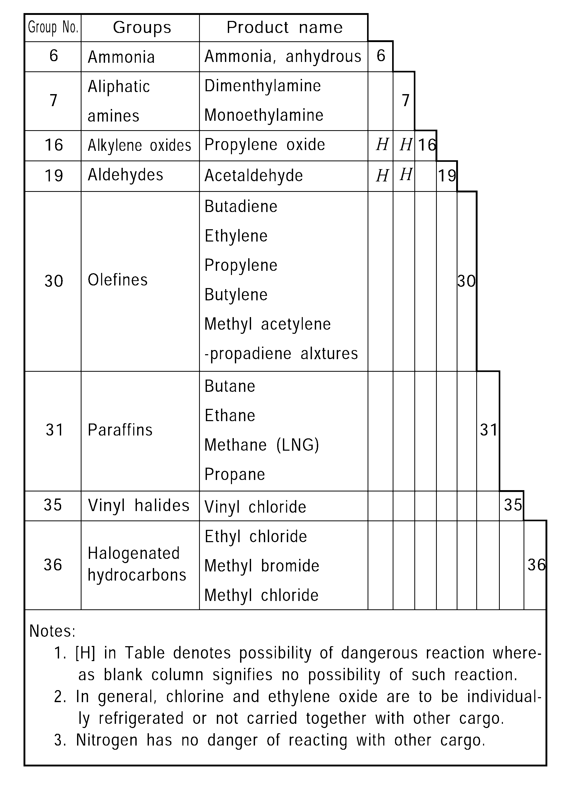
  **Table 7.5.10 Cargoes Which may React Chemically in a Dangerous Manner**

#### 708. Availability 【 See Rule】

- **1.** **Stand-by unit and heat exchanger**
  For the purpose of the requirements in **708.** of the Rules, the stand-by unit of the refrigeration system and stand-by heat exchangers are to comply with the following requirements :
  - **(1)** The stand-by refrigeration system referred to in the requirements of the Rules does not include heat exchanger.
  - **(2)** Where the whole necessary capacity is shared by multiple sets of units, the capacity of the stand-by unit may be made in such a way that it compensates the capacity of one unit having the largest capacity among others.
  - **(3)** Where the refrigeration plants are all driven by electric motors, electrical supply to the motors is to be fed from two or more generators.
  - **(4)** The piping of the stand-by heat exchangers may, for example, be made as given in Fig **7.5.30** of the Guidance. In this case, the total capacity of the heat exchangers including stand-by unit is to be 125 % or more of the maximum requirement.
    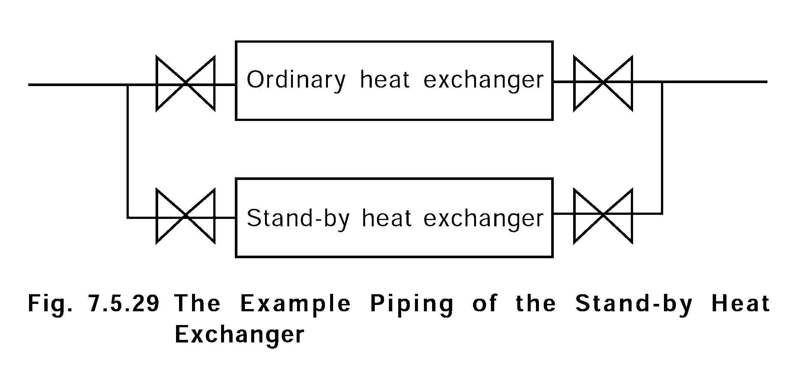
    **Fig 7.5.30 The example piping of the stand-by heat exchanger**
- **2.** **Cooling water**
  - **(1)** "Other essential service" referred to in the requirements in **708. 1** of the Rules means water supply to equipment necessary for propulsion, discharge of bilges, ballasting/deballasting and fire services specified in **Pt 5, Ch 1, 102. 1** of the Guidance. The service for the water spray system specified in the requirements in **1103.** of the Rules is to be included therein.
  - **(2)** In case where the stand-by cooling pump is used for service common to that given in the preceding (1), the capacity of this pump is not to be less than the total capacity of the maximum cooling requirement and the necessary capacity for the particular service.

### Section 8 Vent System for Cargo Containment

#### 801. General 【 See Rule】

- **1.** For the purpose of the requirements in **801.** of the Rules, the pressure relief system of hold spaces is to be in accordance with the following requirements :
  - **(1)** In hold spaces not regarded as the interbarrier space and in case where environmental control within the space is required in accordance with the provisions in **902.** and **903.** of the Rules, one or more pressure relief systems of sufficient capacity are to be provided. The set pressure of those pressure relief systems is to be so set as not to exceed the design pressure of the cargo containment system and hull construction under the condition of dry air sealing, inerting or voyaging. The location of the vent discharge outlet to which the exhaust from the pressure relief systems is to be in accordance with the requirements in **Pt 5, Ch 6, 201. 5** of the Rules, and in addition, consideration is to be given so as not to cause the inert gas to accumulate on deck.
  - **(2)** The pressure relief system of hold spaces regarded as the interbarrier space or part thereof is to conform to the requirements in **802. 1** of the Guidance.
  - **(3)** The evaluation of the adequacy of type C independent tank vent system is to be in accordance with requirements in **I MO Res. A. 829(19)**.
- **2.** For the purpose of the requirements in **801.** of the Rules, the pressure relief system of interbarrier spaces is to be in accordance with **802. 1**.

#### 802. Pressure relief systems 【See Rule】

- **1.** **Pressure relief system for interbarrier spaces**
  - **(1)** The "pressure relief devices referred to in the requirements in **802. 2** of the Rules means pressure relief valves, rupture discs or equivalent. Two or more of them in combination are to be provided in each space to be covered.
  - **(2)** When only pressure relief valves are provided as the pressure relief devices given in the preceding (1), the following requirements (A) and (B) are to be complied with :
    - **(A)** In case where the cargo tank is of the type A independent tank, semi-membrane tank provided with complete secondary barrier, membrane tank or integral tank, the following requirements (a) and (b) are to be complied with :
      - **(a)** The capacity of the pressure relief system is to be sufficient to relieve the greater of the maximum supply capacity of the inerting system and dry air supply system or the estimated volume of cargo evaporation in an event of failure of the cargo tank.
      - **(b)** Pressure relief valves are to be in accordance with the requirements in **802. 5** of the Rules.
    - **(B)** In case where the cargo tank is of the type B independent tank or semi-membrane tank provided with partial secondary barrier, the following requirements (a) and (b) are to be complied with :
      - **(a)** The capacity of pressure relief device is to be in accordance with the preceding (A) (a).
      - **(b)** Pressure relief valves may not be such as being approved in accordance with the requirements in **802. 5** (1) of the Rules. However, they are to be equivalent to those complying with the requirements for PV valves in **Pt 8, Ch 9, 501.** of the Guidance.
  - **(3)** When, as a pressure relief device referred to in the preceding (1), pressure relief valve and rupture disc are provided in combination, they are to conform to the following requirements (A) to (C) for the cargo tank types indicated in the preceding (2) (A) : *(2022)*
    - **(A)** Pressure relief valves are to be in accordance with the requirements in the preceding (2) (B) (b).
    - **(B)** The total capacity of rupture disc and the pressure relief valve is to be sufficient to relieve the volume of cargo evaporation in an event of failure of the cargo tank, and the construction is to be as deemed appropriate by the Society.
  - **(4)** The relieving capacity of pressure relief devices for interbarrier spaces is to be determined as followings :
    $Q _{sa} =3.4A _{c} \frac{\rho}{\rho _{v}} \sqrt {h} (\mathrm{m} ^{3} /s)$
    where:
    $Q _{sa}$ : minimum required discharge rate of air at standard conditions of 273$K$ and 0.1013 $\mathrm{MPa}$
    $A _{c}$ : design crack opening area ($\mathrm{m} ^{2}$), $\pi \delta l/4$
    $\delta$ : maximum crack opening width ($\mathrm{m}$), 0.2 $t$
    $t$ : thickness of tank bottom plating ($\mathrm{m}$)
    $l$ : design crack length equal to the diagonal of the largest plate panel of the tank bottom ($\mathrm{m}$), see Fig **7.5.31** of the Guidance
    $h$ : maximum liquid height above tank bottom plus 10·MARVS ($\mathrm{m}$)
    $\rho$ : density of product liquid phase at the set pressure of the interbarrier space relief device ($\mathrm{kg}/m ^{3}$)
    $\rho _{v}$ : density of product vapour phase at the set pressure of the interbarrier space relief device and a temperature of 273 $K$ ($\mathrm{kg}/m ^{3}$)
    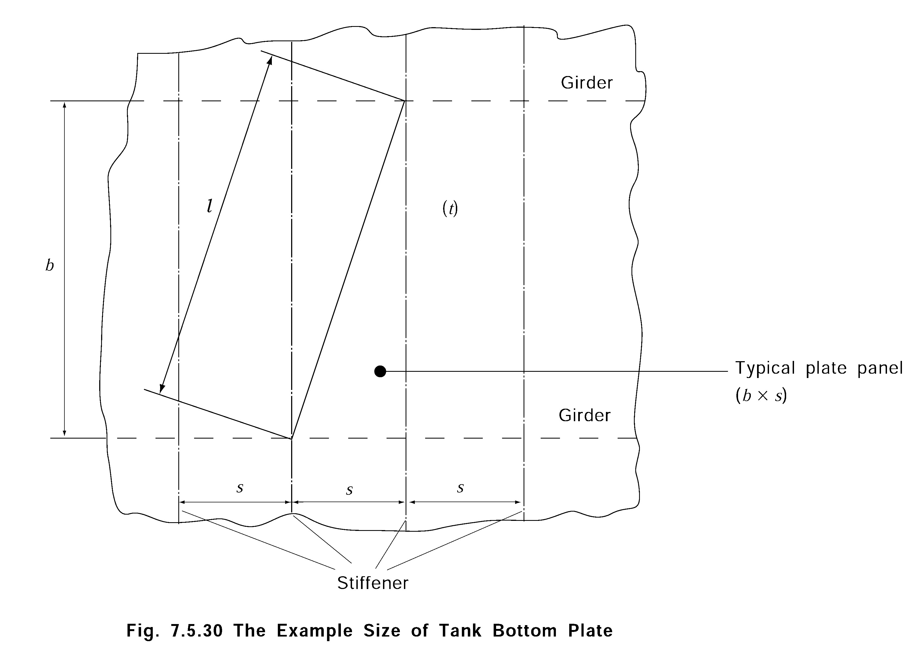
    **Fig 7.5.31 The example size of tank bottom plate**
    - **(A)** The combined relieving capacity of the pressure relief devices for interbarrier spaces surrounding type A independent cargo tanks where the insulation is fitted to the cargo tanks may be determined by the following formula :
    - **(B)** The relieving capacity of pressure relief devices of interbarrier spaces surrounding type B independent cargo tanks may be determined on the basis of the preceding (A). However, the leakage rate is to be determined in accordance with **407. 2** of the Rules.
    - **(C)** The relieving capacity of pressure relief devices of interbarrier spaces of membrane and semi-membrane tanks is to be evaluated on the basis of specific membrane or semi-membrane tank design.
    - **(D)** The relieving capacity of pressure relief devices of interbarrier spaces adjacent to integral type cargo tanks may, if applicable, be determined as for type A independent cargo tanks.
- **2.** **Arrangement of pressure relief valves**
  For the purpose of the requirements in **802. 4** of the Rules, for the cargo tank with the design temperature lower than 0°C, it is to be verified through temperature distribution calculation, etc. that the valve would not freeze or it is provided with anti-freezing construction. In ships where the requirements in **Guidance for Ships for Navigation in ICE** apply or ships regularly navigate through the sea of cold zone, the pressure relief valves are to have satisfactory proved function under freezing condition or to be provided with heating system to prevent functional inability due to freezing.
- **3.** **Changing of set pressure of relief valves**
  The means as "necessary for isolating the valves not in use from the cargo tank" referred to in **802. 7** of the Rules means, for example, the arrangement as shown in Fig **7.5.32** of the Guidance.
  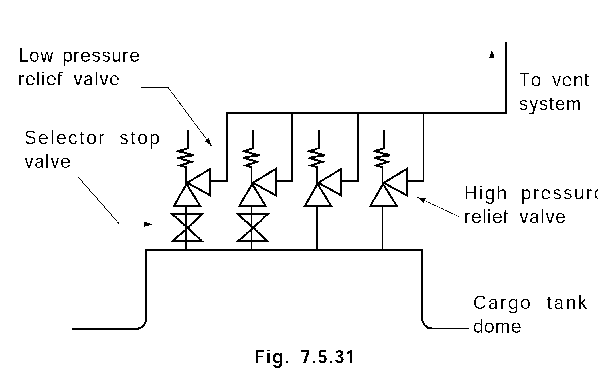
  **Fig 7.5.32**
- **4.** **Safe means of emergency isolation of pressure relief valves**
  The "safe means of emergency isolation", as required by **803. 9** of the Rules, is to be provided so that a PRV can be isolated on a temporary basis to reseat or repair the valve before putting the PRV back into service. Such means of emergency isolation is to be installed in a manner that does not allow their inadvertent operation.
- **5.** **Venting system**
  - **(1)** To "be so constructed that the discharge of gas will be directed upwards and so arranged as to minimize the possibility of water or snow entering the vent system" referred to in the requirements in **802. 10** of the Rules means for example, as shown in Fig **7.5.34** of the Guidance.
  - **(2)** For the purpose of the requirements in **802. 10** (3) of the Rules, the height of the vent discharge outlet is to be measured from the exposed deck at the place where the vent mast is provided.

    | 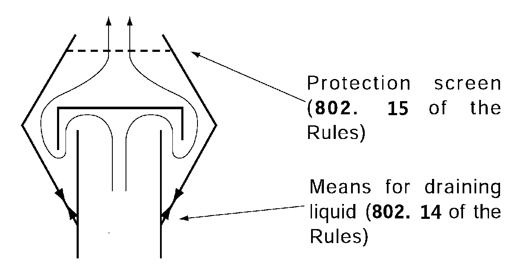 |
    | --- |
    | **Fig 7.5.34 Example of Construction of Vent Discharge Outlet** |
- **6.** **Arrangement of vent exits**
  For the purpose of the requirements in **802. 11** of the Rules, the distance to the vent discharge outlet is to be measured horizontally.
- **7.** **Arrangement of all other cargo vent exits**
  For the purpose of the requirements in **802. 12** of the Rules, vent discharge outlets from pressure relief valves or rupture discs of interbarrier spaces are to be installed in gas dangerous zones.
- **8.** **Pressure relief system for carrying incompatible cargoes simultaneously**
  The "separate pressure relief system" referred to in the requirements in **802. 13** of the Rules means the independent vent system including an independently provided pressure relief valve. In this case, no specific requirement is provided on the distance between vent discharge outlets.
- **9.** **Means for draining of vent piping system**
  For the purpose of the requirements in **802. 14** of the Rules, drain plugs or drain cocks are to be provided at places, such as vent post bottoms and bend parts of vent pipes, where drains are likely to accumulate.
- **10.** The "**IMO Res. A. 829(19)**" referred to in **802. 18** of the Rules means **Annex 7A-2.**

#### 803. Vacuum protection systems

- **1.** **Fitting of vacuum protection systems 【 See Rule】**
  - **(1)** For the purpose of the requirements in **803. 1** (5) of the Rules, the means to stop all suction of the cargo liquid or cargo vapour may be by shutting off valves or stopping the equipment provided that they are automatically operated.
  - **(2)** For the purpose of the requirements in **803. 1** (6) of the Rules, the vacuum relief valve is to conform to the requirements in **802. 5** of the Rules and to be approved in accordance with the Guidance. However, means as specified in the requirements in **803. 1** (5) of the Rules are to be provided, and where vacuum relief valve adjusted to function at a pressure lower than such means is provided as an additional device, the requirements may be dispensed with for this vacuum relief valve as an additional means.
- **2.** **Requirement of vacuum protection systems 【 See Rule】**
  For the purpose of the requirements in **803. 2** of the Rules, vacuum relief valves are to be in accordance with the following requirements (1) and (2) :
  - **(1)** Only for cases where vacuum relief valves adjusted to a set pressure lower than the operating pressure of the device specified in the requirements in **803. 1** (5) of the Rules, are provided for additional means of the devices, it may be accepted to admit the air to be introduced into the tank even in case of flammable cargoes except for the cases specified in the relevant requirements in **Sec 17** of the Rules.
  - **(2)** The air suction opening for the vacuum relief valve as an additional device indicated in the preceding (1) may be made in such a way that the requirements in **802. 10** and **11** of the Rules do not apply. However, the requirements in **Pt 5, Ch 6, 201. 5** of the Rules are to be complied with, and the construction of the suction opening is, for example, to be as shown in Fig **7.5.34** of the Guidance.

#### 804. Size of pressure relieving system

- **1.** **Size of valves 【 See Rule】**
  For the purpose of the requirements in **804. 1** (2) of the Rules, the fire exposure factor is to be in accordance with the following requirements (1) through (4) :
  - **(1)** The insulation materials used at exposed spaces when $F$ = 0.5 are to conform to the requirements in **419. 5** (2) of the Guidance.
  - **(2)** In the case of integral tanks, $F$ = 0.1.
  - **(3)** The fire exposure factor of the tank which partially protrudes beyond the tank cover having the fire integrity equivalent to the deck and deck structure is to be of such a value as obtained by proportional distribution of cargo tank surface areas above and below the deck or tank cover.
  - **(4)** In case where hold spaces filled with dry air is accepted for semi-membrane tanks provided with partial secondary barriers in accordance with the requirements in **902. 2** of the Rules, $F$ = 0.2.
- **2.** **External surface area of the tank for determining sizing of pressure relief valve**
  In application to **Fig 7.5.19** of the Rules, external surface area for prismatic tanks is to be in accordance with followings;
  - **(1)** Lmin, for non-tapered tanks, is the smaller of the horizontal dimensions of the flat bottom of the tank. For tapered tanks, as would be used for the forward tank, Lmin is the smaller of the length and the average width.
  - **(2)** For prismatic tanks whose distance between the flat bottom of the tank and bottom of the hold space is equal to or less than Lmin/10:
    A = external surface area minus flat bottom surface area.
  - **(3)** For prismatic tanks whose distance between the flat bottom of the tank and bottom of the hold space is greater than Lmin/10:
    A = external surface area.

### Section 9 Cargo Containment System Atmosphere Control

#### 901. Atmosphere control within cargo containment system 【See Rule】

- **1.** **Gas-free and purge systems of cargo tanks**
  For the purpose of the requirements in **901. 1** of the Rules, the design and arrangement of gas- freeing and purging piping systems of cargo tanks are to be in accordance with the following requirements (1) and (2) :
  - **(1)** For installation of piping and fixing of pipe fittings in cargo tanks, sufficient consideration is to be taken for possible transient temperature differential.
  - **(2)** The effectiveness of replacement of cargo tank atmosphere is to be verified at time of gas trial given in **420. 4** of the Guidance.
- **2.** **Inerting of cargo tanks**
  For the purpose of the requirements in **901. 2** of the Rules, for cargo tanks carrying petroleum products, etc. the requirements in this Chapter apply, and in addition, the requirements specified in **Pt 8, Ch 1, 103. 9** (2) of the Guidance are to be complied with.
- **3.** **Monitoring of purging and gas-freeing**
  For the purpose of the requirements in **901. 4** of the Rules, the arrangement of gas sampling points in cargo tanks is to be determined according to the cargo properties, cargo tank construction and capacity and the abilities of gas-freeing and purging systems, and where appropriate, the adequacy of the arrangement of gas sampling points is to be verified by the performance test. The locations of gas sampling points are, as standard, to be at the upper, middle and lower space of the cargo tank.

#### 902. Atmosphere control within the hold spaces (cargo containment systems other than type C independent tanks) 【 See Rule】

- **1.** **Environmental control, requiring full secondary barriers**
  - **(1)** For the purpose of the requirements in **902. 1** of the Rules, even in cases where full secondary barrier is not required according to the requirements in **405.** of the Rules, if flammable gases are carried in type A independent tank, integral tank, membrane tank and semi-membrane tank, the requirements in **902. 1** of the Rules apply correspondingly.
  - **(2)** The "suitable dry inert gas" referred to in the requirements in **902. 1** of the Rules means the inert gas of which dew point is controlled in accordance with **904. 1** (4) of the Guidance. Further, the "normal consumption for at least 30 days" referred to in the requirements in **902. 1** of the Rules is to be given consideration for the effects of atmospheric pressure and temperature variations during the passage and additional consumption by gas detection, etc.
- **2.** **Environmental control, requiring partial secondary barriers**
  - **(1)** For the purpose of the requirements in **902. 1 and 2** of the Rules, even in cases where the provision of partial secondary barriers is not required according to the requirements in **405.** of the Rules, when flammable gases are carried by type B independent tank, the requirements in **902. 1 and 2** of the Rules apply.
  - **(2)** In cases where dry air is introduced into the interbarrier spaces and hold spaces, at least the following requirements (A) to (C) are to be complied with :
    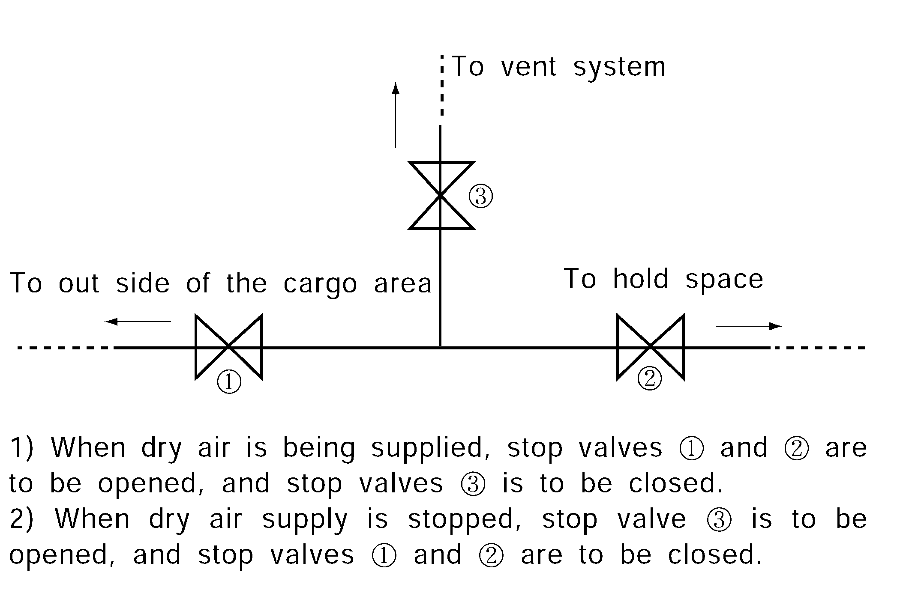
    **Fig 7.5.35**
    - **(A)** Dew point of dry air is to be controlled according to **904. 1** (4) of the Guidance.
    - **(B)** On the supply piping of dry air, one stop valve is to be provided at the inlet into the space which is filled with dry air, and two non-return valves are to be provided within the cargo area side near the forward or aft end of the cargo area. However, one of the two non-return valves may be substituted by 3-in one set as Fig **7.5.35** of the Guidance.
    - **(C)** Instrumentation is to be provided in accordance with the following requirements (a) to (c) :
      - **(a)** At the outlet of the dry air supply system, pressure gauge and thermometer are to be provided.
      - **(b)** One or more dew point meters as deemed appropriate by the Society are to be provided. However, in case where only one dew point meter is provided, a spare cell unit is to be provided.
      - **(c)** At the outlet of the dry air supply system, interbarrier spaces and hold spaces, connections for dew point meter are to be provided.
- **3.** **Environmental control for non-flammable gases**
  - **(1)** The "suitable dry air or inert atmosphere" referred to in the requirements in **902. 3** of the Rules means a state in which spaces are filled with the air with controlled dew point or inert gas according to the requirements in **904. 1** (4) of the Guidance. This inert gas system may not conform to the requirements in **904.** and **905.** of the Rules, but is to be provided with a storage system or generating system capable of making up a consumption for at least 30 days.
  - **(2)** In case where dry air is introduced according to the preceding (1), the requirements in **902. 2** (2) of the Guidance are to be complied with.
- **4.** **Environmental control for doble hull and double bottom spaces**
  Ventilation, inerting and gas measurements for double hull and double bottom spaces are to comply with the requirements in **Pt 8, Ch 2, 405. 1** (3), **407. 2** and **408.** of the Rules.

#### 903. Environmental control of spaces surrounding type C independent tanks 【 See Rule】

- **1.** **Environmental control of spaces surrounding type C independent tanks**
  For the purpose of the requirements in **903.** of the Rules, the environmental control of the compartment is to be in accordance with **902. 3** (1) and (2) of the Guidance.

#### 904. Inerting 【 See Rule】

- **1.** **Properties of inert-gas and its supply**
  For the purpose of the requirements in **904. 1** of the Rules, the following requirements (1) through (4) are to be complied with :
  - **(1)** For the inert gas supply piping, evaporator and heater, if necessary, are to be provided so that the compartment supplied with inert gas can be maintained at proper temperature and pressure and further, thermometer and pressure gauges are to be provided for monitoring.
  - **(2)** Where the inert gas is stored in inert gas bottles, the following requirements (A) through (D) are to be complied with :
    - **(A)** The inert gas bottles and piping are to be dealt with according to the following requirements (a) to (c) :
      - **(a)** The material of the piping may be according to the requirements of the standard as deemed appropriate by the Society.
      - **(b)** The gas bottle may be according to the requirements of the National Standards notwithstanding the requirements in **Pt 5, Ch 5, Sec 3** of the Rules.
      - **(c)** The hydraulic tests for pipes, valves and pipe fittings may be omitted.
    - **(B)** The location of installation of the bottles is to be as given in the following (a) and (b) :
      - **(a)** The inert gas bottles are, as a rule, to be located in the storage room within the cargo area.
      - **(b)** The storage room of inert gas bottles is to be well ventilated so as not to allow leaked gas accumulate the room and be capable of being accessed from the exposed deck.
    - **(C)** The inert gas bottles are to be so arranged to be safe against ship motions and vibrations, and are to be stored upright as far as practicable.
    - **(D)** The piping system, after assembly of board, is to be subjected to airtightness test at a pressure 1.25 times the maximum working pressure or more, and free flow test at a suitable pressure.
  - **(3)** Where the permanent storage tank installed on deck is used as the inert gas storage container, the requirements for the design, tests and inspection of the tank and the piping are to be in accordance with the relevant requirements specified for process pressure vessels and piping systems in **Sec 4** and **Sec 5** of the Rules. However, consideration may be given as appropriate depending on their service conditions.
  - **(4)** The dew point of dry inert gas is, in general, not exceed the minimum design temperature of the exposed surface of the insulation material of the cargo tank into the hold space and hul1 structural members of the space being inerted in normal condition.
- **2.** **Storage of inert gas at low temperature**
  For the purpose of the requirements in **904. 3** of the Rules, the thermal isolation between the hull structure and the storage tank, and where necessary, the inert gas supply piping is to be in accordance with **507. 1** of the Guidance.
- **3.** **Prevention of the back flow of cargo vapour**
  For the purpose of the requirements in **904. 4** of the Rules, the arrangement to prevent the back flow of cargo vapour from entering the inert gas system is to be in accordance with **502. 1** (1) of the Guidance. (See **Fig 7.5.36** of the Guidance)
- **4.** **Isolation of spaces being inerted**
  - **(1)** For the purpose of the requirements in **904. 5** of the Rules, the isolation of the spaces being inerted such as cargo tanks, cargo piping system, process pressure vessels and their piping system from the inert gas system are to be in accordance with the preceding **Par 3.**
  - **(2)** The isolation of the interbarrier spaces, hold spaces where the cargo vapour does not exist in normal condition and the outer side of double wall gas fuel piping specified in the requirements in **1604. 3** (1) of the Rules may be by a stop valve.
    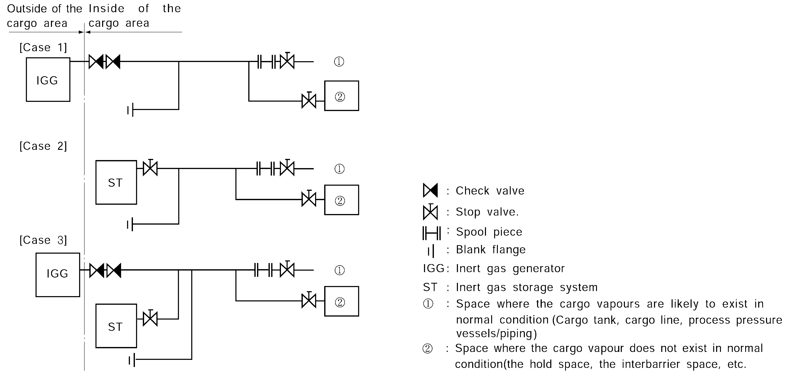
    **Fig 7.5.36**

#### 905. Inert gas production on board

- **1.** **Inert gas production equipment 【 See Rule】**
  - **(1)** For the purpose of the requirements in **905. 1** of the Rules, the combustion type inerting systems are to be in accordance with the relevant requirements of **Pt 8, Annex 8-5, 5** (1) to (5) of the Guidance and the following requirements (A) to (C). *(2020)*
    - **(A)** Inerting gas production equipment is to be provided with sufficient amount of suitable fuel oil.
    - **(B)** Where two sets or more inerting gas production equipments are provided, the stop valve is to be installed on the supply outlets of each equipment.
    - **(C)** Where the volumetric blower is provided in inerting gas production equipment, the pressure relief valves are to be installed on discharge outlets of blowers to prevent generating the over pressure.
  - **(2)** In addition to the preceding (1), nitrogen generating system is to be complied with the relevant requirements in **Pt 8, Annex 8-5, 5** (1) to (5) of the Guidance.
  - **(3)** The components of inerting gas production equipment given in the preceding (1) and (2) are to be approved by the Society.

### Section 10 Electrical Installations

#### 1002. General 【 See Rule】

- **1.** **Certified safe type equipment**
  - **(1)** Electrical equipment installed in hazardous areas is to be the explosion protected electrical equipment required by **Pt 6, Ch 1, Sec 9** of the Rules and having the performance classified by Gases and Vapours Group and Temperature Class according to **Table 7.5.11** of the Guidance by the type of vapour or equivalent.
  - **(2)** The words "recognized standards by the Society or equivalent thereto" referred to in **1002. 4** of the Rules mean **IEC 60079** series or equivalent thereto.
  - **(3)** In application to **1002. 4** of the Rules, if there is IECEx, ATEX, KC or equivalent explosion-proof certificate, type approval may be exempted.

    **Table 7.5.11 Gases and Vapours Groups and Temperature Class** ***(2020)***

    | Product name | UN number | Gases and vapours groups | Temperature class |
    | --- | --- | --- | --- |
    | Acetic aldehyde | 1089 | II A | T4 |
    | Ammonia, anhydrous | 1005 | II A | T1 |
    | Butadiene | 1010 | II B | T2 |
    | Butane | 1011 | II A | T2 |
    | Butane－propane mixtures | 1011/1978 | II A | T2 |
    | Butylenes | 1012 | ※ | ※ |
    | Chlorine | 1017 | － | － |
    | Diethyl ether | 1155 | II B | T4 |
    | Dimethylamine | 1032 | II A | T2 |
    | Ethane | 1961 | II A | T1 |
    | Ethyl chloride | 1037 | II A | T1 |
    | Ethylene | 1038 | II B | T2 |
    | Ethylene oxide | 1040 | II B | T2 |
    | Ethylene oxide－propylene oxide mixtures with ethylene oxide content of not more than 30 % by weight | 2983 | ※ | ※ |
    | Isoprene | 1218 | II B | T3 |
    | Isopropylamine | 1221 | II A | T2 |
    | Methane (LNG) | 1972 | II A | T1 |
    | Methyl acetylene-propadiene mixtrues | 1060 | ※ | ※ |
    | Methyl bromide | 1062 | ※ | ※ |
    | Methyl chloride | 1063 | II A | T1 |
    | Monoethylamine | 1036 | II A | T2 |
    | Nitrogen | 2040 | － | － |
    | Propane | 1978 | II A | T2 |
    | Propylene | 1077 | II A | T2 |
    | Propylene oxide | 1280 | II B | T2 |
    | Refrigerant gases (see notes) | － | － | － |
    | Sulphur dioxide | 1079 | － | － |
    | Vinyl chloride | 1086 | II A | T3 |
    | Vinyl ethyl ether | 1302 | II B | T3 |
    | Vinylidene chloride | 1303 | II A | T2 |
    | Notes: 1. Temperature classes and gases and vapours groups are as defined in IEC 60079. 2. 「─」 indicates that the product is non-flammable, and * is to be to satisfaction of the Societ |   |   |   |

### Section 11 Fire Protection and Fire Extinction

#### 1101. Fire safety requirements 【 See Rule】

- **1.** **Exclusion of ignition source**
  For the purpose of the requirements in **1101. 2** of the Rules, in the gas-dangerous zones or areas specified in the requirements in **105. 23** of the Rules, for ships carrying flammable substances, electrical equipment, windlasses, openings of chain lockers which are regarded as sources of ignition are not to be provided except for those approved under the relevant requirements in **Sec 10** of the Rules.

#### 1102. Fire main and hydrants

- **1.** **Fire pump and fire main 【 See Rule】**
  For the purpose of the requirements in **1102. 1** of the Rules, the minimum pressure at fire hydrant of the fire main is to be not less than 0.5 $\mathrm{MPa}$ gauge irrespective whether the fire pump and water main as used as part of water spray system or not.
- **2.** **Fire pump and fire main** ***(2022)*** **【See Rule】**
  For the purpose of the requirements in **1102. 3** of the Rules, the complete interpretation of the phrase "Stop valves are to be fitted in a protected location" would be that the valve should be located within an accommodation space, service spaces or control station. However, the valve may be located on the open deck aft of the cargo area provided that the valve is located:
  - **(1)** at least 5 m aft of the aft end of the aftermost cargo tank or
  - **(2)** if the above (1) is not practical, within 5 m aft of the aft end of the aftermost cargo tank provided the valve is protected by a permanent steel obstruction.
- **3.** **Nozzles 【 See Rule】**
  For the purpose of the requirements in **1102. 4** of the Rules, all nozzles provided for fire-fighting are to be in accordance with the relevant requirements of **Pt 8, Ch 8** of the Rules.

#### 1103. Water spray system

- **1.** **Area to be covered** ***(2024)*** **【See Rule】**
  - **(1)** For the purpose of the requirements in **1103. 1** (1) of the Rules, the area to be covered at the exposed tank dome is to include the areas where stop valves for cargo tanks and emergency shutdown valves specified in the requirements in **505. 2** of the Rules are fitted.
  - **(2)** T(2) For the purpose of the requirements in 1103.1 (4) and (5) of Rules, where vessels is provided with additional cargo transfer equipment including transfer loading arms, bunkering booms, transfer hoses, reducers, spool pieces and transfer hoses reels, this additional cargo transfer equipment is to comply with Annex 7A-3, 701.3.(2024)
  - **(3)** For the purpose of the requirements in 1103.1 (4) and (5) of Rules, where vessels is provided with additional cargo transfer quipment including transfer loading arms, bunkering booms, transfer hoses, reducers, spool pieces and transfer hoses reels, this dditional cargo transfer equipment is to comply with Annex 7A-3, 701.3.(2024)
  - **(4)** The "high fire risk items" referred to in the requirements in 1103. 1 (6) of the Rules are not to include the hydraulic machinery and electric motors.
  - **(5)** Survival crafts protection *(2019)*
    With reference to 1103. 1 (7) of Rules, the survival crafts on board including remote survival crafts (ref. SOLAS III/Reg. 31.1.4) facing the cargo area are to be protected by a water-spray system taking into consideration cargo area extension for fire-fighting purposes as stated in 1101. 4 of Rules. Remote liferafts located in areas covered by water-spray protection as required in 1103. 1 (6) of Rules may be considered as adequately protected.
- **2.** **Arrangement and capacity** ***(2024)*** **【See Rule】**
  For the purpose of the requirements in **1103. 2** of the Rules, the following requirements (1) to (2) are to be complied with :
  - **(1)** The nozzles for protecting vertical surfaces are to be arranged per every two tiers for the end walls of the accommodation spaces, as standard.
- **3.** **Tank groups in cargo area** ***(2019)***
  In applying the requirement in **1103. 3.** (1) of the Rules, “two complete athwartship tank groupings” means any two groups of tanks where one group is defined as tanks located in transverse direction from ship side to ship side. Where there is only one cargo tank occupying a hold space from ship side to ship side, it will be considered as a “grouping” for the purpose of this interpretation. “Any two complete athwartship tank groupings” represents an area equal to the combined area of the two largest tank groupings including any gas process units within these areas.
- **4.** **Fire pumps used as spray pumps 【 See Rule】**
  In cases where the emergency fire pump is used to meet **1103. 4** of Rules, its capacity, in addition to being capable of maintaining two jets of water as required by paragraph 12.2.2.1.1 of the FSS Code, is to be increased taking into account the spray application rates stated in **1103. 2** of Rules, but limiting coverage to boundaries of normally manned superstructures and deckhouses, survival crafts and their muster areas. For the purpose of **1103. 4** of Rules:
  - **(1)** the expression "one of the fire pumps or emergency fire pump" is related to fire pumps required by SOLAS regulation II-2/10.2.2 installed outside the space where spray pump(s) are located and
  - **(2)** the expression "fire in one compartment" means a compartment provided with Aclass boundaries in which is located the fire pump(s), or the source of power of the fire pump(s), serving the water-spray system in accordance with **1103. 3** of Rules.
- **5.** **Fire pumps used as spray pumps 【 See Rule】**
  - **(1)** For the purpose of the requirements in **1103. 4** of Rules the term "fire pumps" where not qualified by the word "emergency" refers to the fire pumps required in accordance with SOLAS Reg.II-2/10.2.2.2.2.
  - **(2)** If all the fire pumps mentioned in (1) above supplying the water spray system (for covering the superstructures and deckhouses) are disabled due to a fire in any one compartment; then the emergency fire pump is to be sized to cover:
    - **(A)** the water spray system for the boundaries of the superstructures and deckhouses, and lifeboats, liferafts and muster areas facing the cargo area, (as per **1103. 4** of Rules) and
    - **(B)** two fire hydrants (as per **1102** of Rules).
  - **(3)** When the ship is also fitted with a total flooding high expansion foam system protecting the engine-room (to comply with SOLAS II-2/10.4.1.1.2 and 10.5.1.1) and the emergency fire pump is intended to supply sea water to this system, then, the emergency fire pump is to also be sized to cover the foam system for dealing with an engine-room fire, when the main fire pumps are disabled.
  - **(4)** On the basis of the principle of dealing with one single fire incident at a time, the emergency fire pump does not need to be sized to cover all three systems in (2) and (3) above (i.e. water spray, hydrants and foam) at the same time and is to need only be sized to cover the most demanding area and required systems, as follows:
    - **(A)** the foam system + two hydrants or
    - **(B)** the water spray system + two hydrants; whichever is greater.
- **6.** **Use for other services 【 See Rule】**
  For the purpose of the requirements in **1103. 5** of the Rules, the ballast pump and bilge pump may be used commonly for the water spray system.
- **7.** **Back-flushing of the water-spray system**
  In application to **1103. 6** of the Rules, The last sentence i.e. "In addition, means shall be provided to back-flush the system with fresh water", is to be understood to mean that arrangements should be provided so that the water-spray system as a whole (i.e. piping, nozzles and in-line filters) can be flushed or back-flushed, as appropriate, with fresh water to prevent the blockage of pipes, nozzles and filters. (*2018*)
- **8.** **Extension of cargo area**
  Where "F.O. tanks" are installed at the after end of the aftermost hold space or at the forward end of the forwardmost hold space instead of cofferdams as allowed for in paragraphs **301. 2** and **3** of the Rules, the weather deck area above these tanks is to be regarded as a "cargo area" for the purpose of applying **1103. 6** of the Rules. *(2020)*

#### 1104. Dry chemical powder fire-extinguishing systems 【 See Rule】

- **1.** **Component of the systems**
  For the purpose of the requirements in **1104. 2** of the Rules, dry chemical powder fire-extinguishing systems may be accepted to be approved by flag administration in lieu of the Society. *(2017)*
- **2.** For the purpose of the requirements in **1104.1** and **3** of Rules, where vessels is provided with additional cargo transfer equipment including transfer loading arms, bunkering booms, transfer hoses, reducers, spool pieces and transfer hoses reels, this additional cargo transfer equipment is to comply with **Annex 7A-3, 701.3**.*(2024)*
- **3.** **Monitors and hand hose lines**
  For the purpose of the requirements in **1104. 3** of the Rules, the manifold areas may be protected by only one monitor provided that it can be so fixed to protect the manifold area used for cargo operation even if there are manifolds on both sides of the ship.
- **4.** **Capacity of dry chemical powder**
  For the purpose of the requirements in **1104. 5** of the Rules, when the areas to be covered are located higher than the installed positions of monitors and manual hose reels, the Society may request increase in the capacity of these monitors and manual hose reels depending on their arrangement.
- **5.** **Testing of systems**
  For the purpose of the requirements in **1104. 8** of the Rules, testing arrangements are to involve the discharge using dry chemical powder from all monitors and hand hose lines on board but it is not required that there is a full discharge of the installed quantity of dry powder. This testing can also be used to satisfy the requirement that the piping is free of obstructions, in lieu of blowing through with dry air all the distribution piping. However, after the completion of this testing, the system, including all monitors and hand hose lines, is to be blown through with dry air but only for the purpose of the system subsequently being clear from any residues of dry chemical powder. (*2020*)

#### 1105. Cargo compressor and pump rooms

- **1.** **Fixed fire-extinguishing installation for cargo compressor and pump rooms 【 See Rule】**
  For the purpose of the requirements in **1105. 1** of the Rules, the fixed gas fire-extinguishing systems for cargo compressor and pump rooms are to be in accordance with the requirements following (1) through (6). Independent inert gas system is to be provided, if the fire-extinguishing medium is not compatible with inerting.
  - **(1)** The fixed gas fire-extinguishing system is to conform to the relevant requirements in **Pt 8, Ch 8** of the Rules correspondingly.
  - **(2)** In the case of carbon dioxide hydro-carbon fire-extinguishing systems, the requirements in **Ch 6, 1102. 1** of the Rules are to be complied with.
  - **(3)** In the case of the nitrogen gas fire-extinguishing system, the volume of nitrogen gas is to be not less than that multiply following values by total volume of the relevant spaces and also to be in accordance with national requirements.
    $\frac{21-O _{2}}{21} \times 1.2$
    where :
    $O _{2}$ : limit volume of carbon (Vol%)
  - **(4)** The storage containers and pipings for nitrogen gas fire-extinguishing system are to be such that nitrogen gas equal to 85 % of the volume of preceding (3) can be discharged into the space within 2 minutes.
  - **(5)** The boundaries of cargo compressor and pump rooms in relation to the requirements in **1105.** of the Rules is to remain in a state corresponding to "A-0" class fire integrity including doors, etc. of the boundaries. Packing provided for doors is, as a rule, to be of non-combustible material defined in the relevant requirements in **Pt 8, Ch 1, 103.** of the Rules. However, in case where special consideration is taken for structural details in way of openings, materials and quantity of the packing, the packing need not be of non-combustible one.
  - **(6)** Notwithstanding the requirements in the preceding (5), when steel blind covers are provided for the windows fitted on the boundary of the compartment and the exposed area, these windows may not be "A-0" class. Further, at the boundary to electric motor room, no windows are to be provided unless they correspond to "A-0" class.

### Section 12 Mechanical Ventilation in the Cargo Area

#### 1201. Spaces required to be entered during normal cargo handling operations (2019)

- **1.** **Arrangement of ventilation intakes**
  For the purpose of the requirements in **1201. 2** of the Rules, ventilation intakes are, at least, to be located in the gas-safe areas.
- **2.** **Construction of ventilation fans 【 See Rule】**
  For the purpose of the requirements in **1201. 7** of the Rules, the following requirements (1) and (2) are to be complied with :
  - **(1)** Ventilation fans are to be approved in accordance with the Guidance.
  - **(2)** The ventilation fans for motor rooms where electric motors to drive cargo compressors and cargo pumps are installed are to conform to the requirements in **1201. 7** of the Rules, and in addition, to the following requirements (A) and (B) :
    - **(A)** To have a ventilation capacity of not less then 30 air changes of the total volume of the motor room per hour.
    - **(B)** Electric motors driving ventilation fans are to conform to the relevant requirements in **Ch 5, Sec 10** of the Rules depending on the location of motors, and in addition, to the requirements for exterior-mounted type specified in **Pt 8, Ch 12, 201. 4** (2) of the Guidance when motors are installed in exposed spaces.
- **3.** In application to **1201. 7** of the Rules, where electric motors for ventilation fans are certified for the same hazard zone as the space served, the motors may be located in ventilation ducts for hazardous space. *(2017)*

#### 1202. Spaces not normally entered 【 See Rule】

- **1.** **Ventilation of hold spaces**
  - **(1)** Natural ventilation alone is not acceptable.
  - **(2)** In application to **1202.** of the Rules, portable mechanical ventilation systems approved by the Society.

### Section 13 Instrumentation and Automation Systems

#### 1301. General

- **1.** **Centralization of controls equipments and indicators 【 See Rule】**
  For the purpose of the requirements in **1301. 2** of the Rules, in case where control equipment and indicators are unable to be centralized in the cargo control room or other suitable places, they are to be provided in the wheelhouse.
- **2.** **Calibration and test of measuring instruments 【 See Rule】**
  For the purpose of the requirements in **1301. 3** of the Rules, tests and inspections of measuring instruments are to be in accordance with the following requirements (1) to (3) :
  - **(1)** Tests and inspections of measuring instruments during manufacture of each are to conform to the following requirements (A) to (C) :
    - **(A)** Gas detection equipment are to be in accordance with the requirements in the Guidance.
    - **(B)** Level gauges are to be in accordance with the requirements in the Guidance for Approval of Manufacturing Process and Type Approval, Etc.
    - **(C)** Pressure gauges and temperature indicating devices are to be in accordance with the requirements of the standards recognized by the Society or are to be manufactured under effective quality control system and to be ensured for their reliability.
  - **(2)** After installation on board the ship, the instrument is to be subjected to operation test to verify that it has the specified performance. This test is not necessarily conducted with the actual cargo, but for gas detection equipment, suitable test gases are to be used in the test.
  - **(3)** For retests and testing procedures of instrumentation after installation on board the ship, at least the following items are to be noted in the Operation Manual specified in the requirements in **1803. 1** of the Rules :
    - **(A)** Check method and testing procedure before use
    - **(B)** Check method and testing procedure during use
    - **(C)** Periodical check method and intervals specified by the manufacturer
    - **(D)** Service life of equipment (excluding those permanent system components)
    - **(E)** Periodical inspection procedure specified in the requirements in **Pt 1, Ch 2, 204.** (4) of the Rules
    - **(F)** Other precautions

#### 1302. Level indicators for cargo tanks 【 See Rule】

- **1.** **General**
  For the purpose of the requirements **1302. 1** of the Rules, the following requirements (1) and (2) are to be complied with :
  - **(1)** The performance and construction of level gauges are to be approved according to the Guidance for Approval of Manufacturing Process and Type Approval, Etc.
  - **(2)** The effectiveness and number of units of level gauges are to be in accordance with the following requirements (A) and (B) :
    - **(A)** Where only one level gauge is fitted, it is to be arranged so that any necessary maintenance can be carried out while the cargo tank is in service.
    - **(B)** For example, in case where gauging of levels is limited at high level and low level, such level is considered effective on condition that cargo is loaded within such range.
- **2.** For the purpose of the requirements in **1302. 2** of the Rules, in order to assess whether or not only one level gauge is acceptable in relation to the aforesaid sentence, the expression “can be maintained” means that any part of the level gauge other than passive parts can be overhauled while the cargo tank is in service. However, passive parts are those parts assumed not subject to failures under normal service conditions. *(2020)*
- **3.** **Type of level indicators**
  For the purpose of the requirements in **1302. 3** of the Rules, in case where the prospective cargoes are plural and the type of level gauges required in column g in Table of **Sec 19** of the Rules is also plural where two or more level gauges are provided for each requirement (in the case shown in **1** (2) (A) above, may be one), they may be multiplicate. However, for the type of level gauge for less severe requirements, warning sign stating that the level gauge is not to be used for other cargoes than the specified cargoes is to be posted.

#### 1303. Overflow control 【 See Rule】

- **1.** **General**
  For the purpose of the requirements in **1303. 1** of the Rules, the following requirements are to be complied with :
  - **(1)** High level alarm systems are to be in accordance with **Pt 8, Ch 9, 503. 1** of the Rules.
  - **(2)** The sensor for automatic closing of the loading valve for overflow control may be combined with those of level gauges required in **1302. 1** of the Rules.
- **2.** **Omission of automatic shutoff**
  The "maximum possible pressure during the loading operation" referred to in the requirements in **1303. 4** (2) of the Rules is to be considered as the maximum pressure generated by the discharge pressure of shore-based transfer pump and cargo vapour pressure.
- **3.** **Test for cargo tank’s high level alarm** ***(2018)***
  For the purpose of the requirements in **1303. 2** and **5** of the Rules, the following requirements are to be complied with :
  - **(1)** The expression "each dry-docking" is considered to be the survey of the outside of the ship’s bottom required for the renewal of the Cargo Ship Safety Construction Certificate and/or the Cargo Ship Safety Certificate.

#### 1304. Pressure gauges

- **1.** **Pressure gauges and alarms of cargo tanks**
  - **(1)** The low pressure alarm provided on the navigation bridge under the requirements in **1304. 2** of the Rules, when the provision of vacuum relief valve is required by the provision in **803. 1** of the Rules, is to be capable of issuing alarm at a suitable differential pressure between inside and outside of cargo tank, which is lower than the maximum design external pressure of the cargo tank. **【See Rule】**
  - **(2)** The alarm system specified in the requirements in **1304. 2** and **3** of the Rules is to issue visible and audible alarms. **【See Rule】**

#### 1306. Gas detection

- **1.** For the purpose of the requirements in **1306. 4** of the Rules, two oxygen sensors are to be positioned at appropriate locations in the space or spaces containing the inert gas system, in accordance with paragraph 15.2.2.4.5.4 of the FSS Code, for all gas carriers, irrespective of the carriage of cargo indicated by an "A" in column "f" in the table in chapter 19 of the Code. *(2021)*
- **2.** **Gas detection equipment for toxic products 【 See Rule】**
  For the purpose of the requirements in **1306. 5** of the Rules, the use of portable gas detecting equipment is to be in accordance with the following requirements :
  - **(1)** At least two sets of portable gas detecting equipments are to be provided on board.
  - **(2)** In the case of the cargo expressed in "$F +T$" in column $f$ in Table of **Sec 19** of the Rules, the fixed type flammable gas detecting device specified in the requirements in **1306. 14** of the Rules is to be provided additionally.
  - **(3)** In case where the equipments are composed of consumables such as detecting tubes, suitable spare parts such as detecting tubes are to be provided on board in addition to the equipments specified in the preceding (1) by taking into account the shipboard work and the frequency of carriage of the cargo. In the case of the detecting tube type, detecting tubes are to be provided for each kind of loadings cargos as above requirement, but two suction pumps for each type of the portable detection equipments may be enough.
- **3.** **Gas detection for cargo containment systems other than independent tanks 【 See Rule】**
  For the purpose of the requirements in **1306. 14** of the Rules, the gas detection equipment for hold spaces and interbarrier spaces of cargo tanks other than independent tanks are to be in accordance with the following requirements :
  - **(1)** In the case of integral tanks, the requirements in **1306. 14** of the Rules do not apply. However, the requirements in **1306. 2** (2) of the Rules apply to the hold space of this cargo containment system.
  - **(2)** The available measuring range of gas detector is to be ordinarily made under the graduation where the lower explosive limit is taken as 100% but the range may be changeable to measure gas concentration between 0 % and 100 % in volumetric percent if necessary.
- **4.** **Instruments for measurement of oxygen levels 【 See Rule】**
  The "suitable instrument for the measurement of oxygen levels" referred to in the requirements in **1306. 20** of the Rules means the one that can measure oxygen concentration in an inert atmosphere and is adequate to international/national standards recognized by the Society or SOLAS Reg. XI-1/7. *(2024)*

#### 1307. Additional requirements for containment systems requiring a secondary barrier

- **1.** **Temperature indicating devices of hull structure when a cargo is carried at a temperature lower than –55°C 【 See Rule】**
  The word, "where applicable" referred to in the requirements in **1307. 2** (2) of the Rules means the case where provision is made for heating the structural hull members as specified in the requirements in **419. 1** (5) of the Rules. At four points, at least, on double bottom tank top platings, the temperature sensors are to be provided.
- **2.** **Temperature indicating devices of cargo tanks when a cargo is carried at a temperature lower than -55°C**
  For the purpose of the requirements in **1307. 2** (3) of the Rules, the temperature indicating devices for cases of carrying the cargo at a temperature lower than -55°C are to be in accordance with the following requirements :
  - **(1)** In order to verify the cooling down or loading procedures according to the requirements in **413. 4** (1) of the Guidance, temperature indicating devices required in the provisions in **1307. 2** (3) of the Rules are to be provided.
  - **(2)** The temperature sensors provided for verifying the cooling down procedure specified in the requirements in **1307. 2** (4) of the Rules are to be arranged under considering the arrangement of spray nozzles and construction of cargo containment system. For the other cargo tanks which can be regarded as having the same construction and arrangements as the cargo tanks provided with above sensors, the temperature indicating devices specified in the requirements in preceding **1305. 1** and **1307. 2** (3) of the Rules may only be provided.

#### 1309. System integration (2020) 【See Rule】

- **1.** For the purpose of the requirements in **1309. 3** of the Rules, the expression “integrated system” means a combination of computer-based systems which are used for the control, monitoring/alarm and safety functions required for the carriage, handling and conditioning of cargo liquid and vapours and are interconnected in order to allow communication between computer-based systems and to allow centralized access to monitoring/alarm and safety information and/or command/control.

### Section 15 Filling Limits for Cargo Tanks

#### 1504. Determination of increased filling limit (IGC Code 15.4) 【 See Rule】

- **1.** **Determining PRV inlet remains in vapour space**
  For the purpose of the requirements in **1504. 1** (2) of the Rules, the PRV inlet shall remain in the vapour space under conditions of 15° list and 0.015L trim.
- **2.** **Calculation of Allowances**
  For the purpose of the requirements in **1504. 1** (3) of the Rules, The following method may be used to determine the allowance. The Society may accept other methods to determine the allowance provided the method meets an equivalent level of safety.
  The parameters specified under **1504. 1** (3) of the Rules may be expressed by the expansion factors $\alpha _{1}$ through $\alpha _{4}$ as follows:
  $\alpha _{1}$ : relative increase in liquid volume due to tolerance of level gauges
  $\alpha _{2}$ : relative increase in liquid volume due to the tolerance of temperature gauges
  $\alpha _{3}$ : expansion of cargo volume due to pressure rise when pressure relief valves are relieving at maximum flow rate
  $\alpha _{4}$ : operational margin of 0.1%
  The factors $\alpha _{1}$ through $\alpha _{4}$ are to be determined as follows:
  $\alpha _{1} = \frac{dV}{dh} \left( \frac{\Delta h}{V} \right) \cdot 100 (\%)$
  where:
  $dV/dh$ : variation of tank volume per metre filling height at the filling height h ($\mathrm{m} ^{3} /m$).
  $h$ : filling height (m) at the filling limit FL to be investigated (FL > 98%) ($\mathrm{m}$).
  $V$ : accepted total tank volume ($\mathrm{m} ^{3}$)
  $\Delta h$ : max. total tolerance of level gauges (m).
  $\alpha _{2} = \beta \times \Delta T (\%)$
  where:
  $\beta$ : volumetric thermal expansion coefficient at reference temperature ($rm \%/K$)
  $\Delta T$ : max. tolerance of temperature gauge ($\mathrm{K}$).
  $\alpha _{3} = \left( \frac{\rho _{PRV}}{\rho _{PRV \cdot 1.2}} -1 \right) \cdot 100 (\%)$
  where:
  $\rho _PRV$ : $\rho _ R$ cargo density at reference conditions, i.e. corresponding to the temperature of the cargo at set opening pressure of the pressure relief valve
  $\rho _{PRV \cdot 1.2$ : cargo density corresponding to the temperature of the cargo at 1.2 times the set opening pressure of the pressure relief valve
  $\alpha _{4}$ : 0.1% operational margin
  Based on the factors $\alpha _{1}$ through $\alpha _{4}$ the following total expansion factor αt is to be determined.
  $\alpha _{t} = \sqrt {\alpha _{1} ^{2} + \alpha _{2} ^{2}} + \alpha _{3} + \alpha _{4} (\%)$

#### 1505. Maximum loading limit 【 See Rule】

- **1.** For ships constructed before 1 July 2016 and subject to **IMO Res. MSC.5(48)**, type C cargo tanks can be loaded in accordance with **1505. 2** of the Rules or alternatively, to **1505. 1**.

### Section 16 Use of Cargo as Fuel

#### 1601. General

- **1.** **In the application of 1601. 1, the Annex 7C applies to ships** which are prepared for conversion with the design or the partial installation for use of cargo as fuel during the new building phase(hereafter referred to as "Cargo fuel ready ships" in the Guidance) for the purpose of a conversion from a ship using conventional marine fuels to cargo fuel after delivery.

#### 1606. Special requirements for main boilers 【 See Rule】

- **1.** The "on the pipe of each gas burner, a manually operated shut-off valve is to be fitted" referred to the requirements in **1606. 3** of the Rules is to be in accordance with Fig **7.5.39** of the Guidance.
  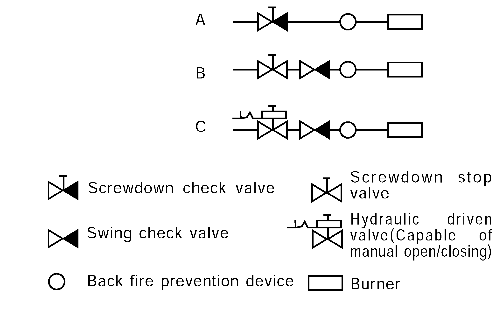
  **Fig 7.5.39**

#### 1607. Special requirements for gas-fired internal combustion engines 【 See Rule】

- **1.** For the purpose of the requirements in **1607.** of the Rules, dual-fuel diesel engines utilizing Methane gas as fuel(hereinafter referred to as DFD engines) are to comply with the followings.
  - **(1)** For LNG carriers fitted with DFD engines, the an additional installation notation of DFDE(LNG) may be assigned. *(2021)*
  - **(2)** Control and safety systems of DFD engines are to comply with **Pt 5**, **Annex 5-7** of the Guidance.
- **2.** A suitable pressure relief system for air inlet manifolds, scavenge spaces and exhaust system is to be provided unless designed to accommodate the worst-case overpressure due to ignited gas leaks or justified by the safety concept of the engine. A detailed evaluation regarding the hazard potential of overpressure in air inlet manifolds, scavenge spaces and exhaust system is to be carried out and reflected in the safety concept of the engine.
  In the case of crankcases, the explosion relief valves, as required by **1607. 1** (4) of the Rules, are to be considered suitable for the gas operation of the engine. For engines not covered by said Regulation, a detailed evaluation regarding the hazard potential of fuel gas accumulation in the crankcase is to be carried out. *(2021)*
- **3.** For the purpose of the requirements in **1607. 3** (3) of the Rules, gas detection for crankcases may be installed in crankcase vent.

### Section 17 Special Requirements

#### 1705. Cargoes requiring type 1G ship 【 See Rule】

- **1.** In application to **1705. 5** of the Rules, the term “the satisfaction of the Society" means a space designed and equipped to protect crew members considering designated number of occupants and prevention from ingress of cargo.

#### 1718. Propylene oxide and mixtures of ethylene oxide-propylene oxide with ethylene oxide (content of not more than 30 % by weight)

- **1.** **Valves, flanges and fittings 【 See Rule】**
  For the purpose of the requirements in **1718. 10** of the Rules, the materials for insulation and packing with neoprene, natural rubber, asbestos and binders used with asbestos are not to be used. The materials containing oxides of magnesium, also are not to be used.
- **2.** **Padding of nitrogen gas 【 See Rule】**
  For the purpose of the requirements in **1718. 27** of the Rules, the nitrogen gas generator of membrane type capable of ensuring a purity not less than 99% in volume may be used.

### Section 18 Operating Requirements

#### 1809. Cargo sampling

- **1.** 1809. of the Rules is only applicable if such a sampling system is fitted on board. Connections used for control of atmosphere in cargo tanks during inerting or gassing up are not considered as cargo sampling connections.

#### 1810. Cargo emergency shutdown (ESD) system

- **1.** **Emergency shutdown valves 【 See Rule】**
  The emergency shutdown valves specified in **1810. 2** (1) of the Rules are to be in accordance with the following requirements (1) to (4) :
  - **(1)** When ESD valve is actuated by hydraulic or pneumatic system, the following is to complied with *(2024)*
    - **(A)** Audible and visible alarm is to be given in the event of loss of pressure that causes activation of fail-close action. The alarm is to be provided in a normally manned control station (e.g. Cargo Control Room and/or the navigation bridge, etc.).
    - **(B)** The following conditions are to also be complied to ensure the fail-close action:
      - **(a)** Failure of hydraulic or pneumatic system is not to lead to loss of fail-close functionality (i.e. activated by spring or weight); or
      - **(b)** Hydraulic or pneumatic system for fail-close action is to be arranged with stored power and separated from normal valve operation.
  - **(2)** To "be capable of local manual closing operation" referred to in the requirements of the Rules means the one which can be directly manually closed, and in addition those shutdown by manual release of hydraulic pressure or pneumatic pressure or shutdown by manual pump.
  - **(3)** To "fully close under all service conditions within 30 s of actuation" referred to in the requirements of the Rules means that the emergency shutdown valve assumes the completely closed within 30 s from the issuance of closing signals of the valve. This provision may not apply to the manual emergency shutdown valves given in the preceding (3).
  - **(4)** No stop valve is to be provided on the hydraulic or pneumatic line for closing the emergency shutdown valve.
- **2.** In applying “operation of cargo pumps and the opening of manifold ESD valves is to be inhibited” of **note 4** of **Table 7.5.12**, a hardware system such as an electric or mechanical interlocking device is to be provided to prevent inadvertent operation of cargo pumps and inadvertent opening of manifold ESD valves. *(2021)*
- **3.** **3**. For the purpose of the requirements in **1801.3** (2) of Rules, where vessels is provided with additional cargo transfer equipment including transfer loading arms, bunkering booms, transfer hoses, reducers, spool pieces and transfer hoses reels, this additional cargo transfer equipment is to comply with **Annex 7A-3, 701.3**.*(2024)*
