# PART 7 Ships of Special Service (CH5, 6)

> RULES FOR CLASSIFICATION OF STEEL SHIPS / RA-07B-E / 2025 / EN / Guidance

## CHAPTER 6 SHIPS CARRYING DANGEROUS CHEMICALS IN BULK

### Section 1 General

#### 101. General

- **1.** **Application 【 See Rule】**
  - **(1)** Where the products specified in Table of **Sec 17** of the Rules are added to the cargo carried in bulk to maintain the properties of the cargo, the requirements in **Ch 6** of the Rules may not apply to such additive cargoes. However, in consideration of the properties and quantity of such additive cargoes, additional requirements for tank vent system, electrical installations, instrumentation, safety equipment, etc. may be applied.
  - **(2)** Where the mixed products not reacting with each other such as polymer, etc. are carried, all requirements for the product separated each other are to apply.

#### 106. Definitions 【 See Rule】

- **1.** **Definitions**
  - **(1)** For the purpose of **Ch 6** of the Rules and the Guidance, the term "adjacent" means all cases of facial contact, linear contact and point contact unless otherwise specified.
  - **(2)** The term "cargo area" referred to in **106. 6** of the Rules excludes the fuel oil tanks adjacent to the cargo tanks or slop tanks of the arrangement as given in Fig **7.6.1** of the Guidance. However, the requirements specified in **Ch 6, 304.** of the Rules apply.
  - **(3)** Regarding the cargo spaces in **106. 6** of the Rules, the following interpretation is provided: (refer to **Fig. 8.1.1** of the **Rule Pt 8 Ch 1**) *(2026)* **[See Rule]**
    - A non-hazardous space in the forecastle area which is protected from the cargo tanks by cofferdam, void space or other compartments, will not be defined as part of cargo area.
    - Compartments located above the Cofferdam, void or other compartments protecting the non-hazardous spaces will be defined as part of the cargo area.
  - **(4)** The piping system "separated" from each other as referred to in **106. 32** of the Rules mean either of the following : **【See Rule】**
    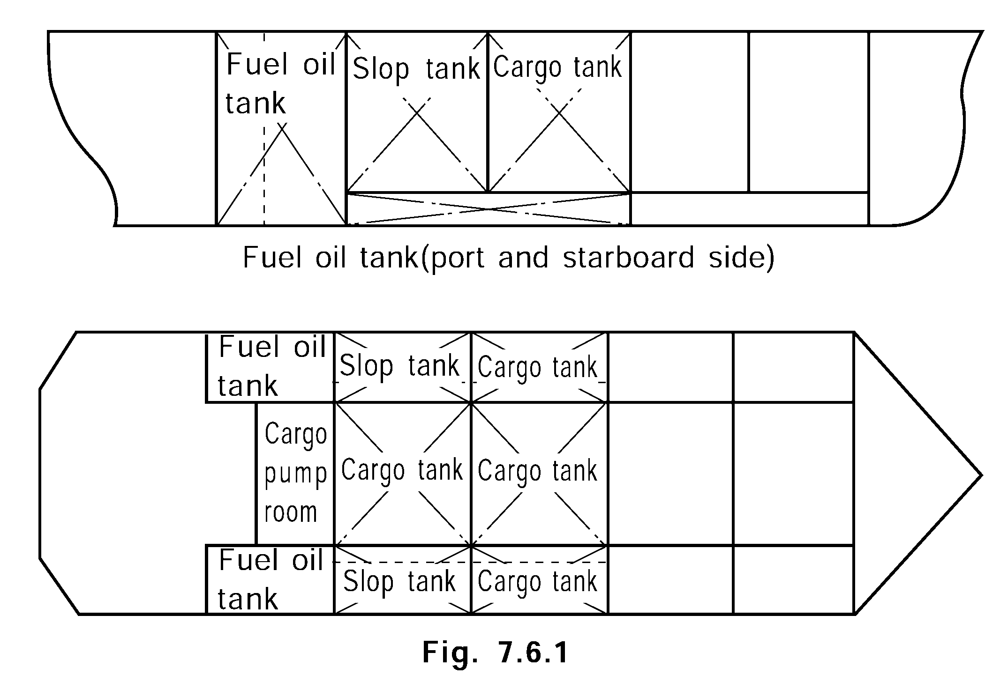
    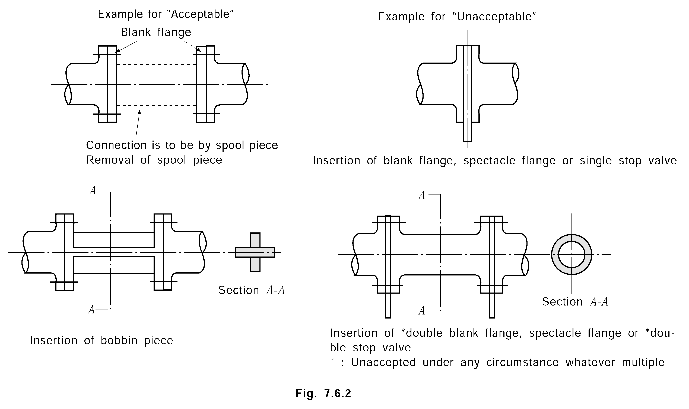
    - **(A)** Piping system completely independent from each other.
    - **(B)** The piping system that come through with the tank carrying other cargo, but can be separated by the means as exemplified in [Acceptable] in Fig **7.6.2** of the Guidance when cargoes likely to cause dangerous reaction with each other are carried may be regarded as those completely independent from each other. In case where separation can be achieved by this method, operational precautions are to be noted in the Operation Manual.

### Section 2 Ship Survival Capability and Location of Cargo Tanks

#### 202. Freeboard and intact stability 【 See Rule】

- **1.** **Solid ballast**
  Where the requirements for the initial stability are not satisfied, use of solid ballast may be approved. When solid ballast is provided directly below the tank, the distance between the top of solid ballast and cargo tank bottom is to be not less than the vertical extent of damage($V _{s}$) as given Fig **7.6.3** of the Guidance.
  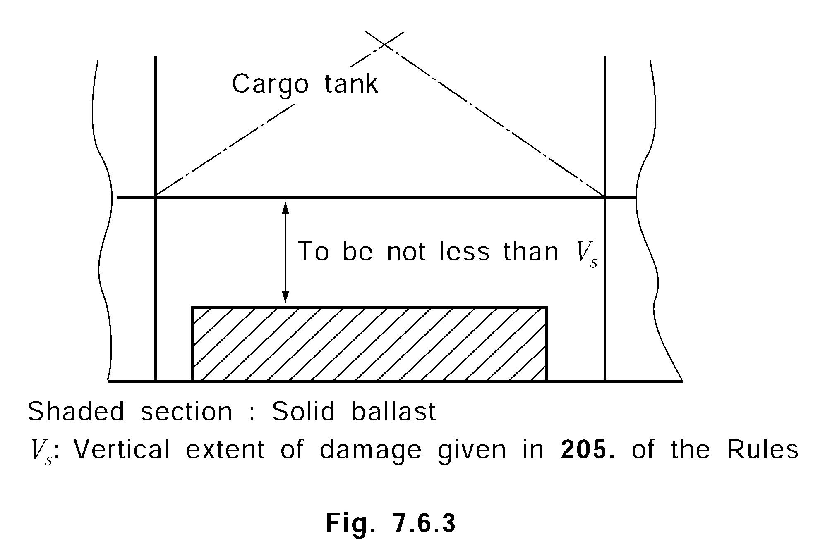
- **2.** In applying the requirement in **202. 2** of the Rules, for the ships assigned tropical loadline, 'all seagoing conditions' is to be included loading condition relating to tropical loadline.
- **3.** In applying the requirements in **202. 6** of the Rules, the performance standards recommended by the Organization refer to following: **【See Rule】**
  - part B, chapter 4, of the International Code on Intact Stability, 2008 (2008 IS Code)
  - the Guidelines for the Approval of Stability Instruments (MSC. 1/Circ.1229), annex, section 4
  - the technical standards defined in part 1 of the Guidelines for verification of damage stability requirements for tankers (MSC.1/Circ.1461)
- **4.** In applying the requirements in **202. 6** (3) of the Rules, "where deemed appropriate by the Society" means that the following ships provided the procedures employed for intact and damage stability verification maintain the same degree of safety, as being loaded in accordance with the approved conditions.
  - **(1)** ships which are on a dedicated service, with a limited number of permutations of loading such that all anticipated conditions have been approved in the stability information provided to the master in accordance with the requirements of paragraph **202. 5** of the Rules
  - **(2)** ships where stability verification is made remotely by a means approved by the Society
  - **(3)** ships which are loaded within an approved range of loading conditions or
  - **(4)** ships constructed before 1 July 2016 provided with approved limiting KG/GM curves covering all applicable intact and damage stability requirements.
- **5.** In applying the requirements in **4** “the approved conditions” refer to following:
  - Operational guidance provided in part 2 of the Guidelines for verification of damage stability requirements for tankers (MSC.1/Circ.1461).

#### 203. Shipside discharges below the freeboard deck 【 See Rule】

- **1.** For the purpose of the requirements in **203. 1** of the Rules, the following requirements (1) and (2) are to be complied with.
  - **(1)** The scupper pipes within the superstructure are to be in accordance with the requirements in **Pt 5, Ch 6, 303. 1** of the Guidance.
  - **(2)** The inboard open ends of scupper pipes are to be in accordance with the requirements in **Pt 5, Ch 6, 303. 2** (1) (A) of the Guidance.
- **2.** The requirements of **203. 1** of the Rules do not apply to the overboard discharges led through the shell from the superstructure and deckhouse located on or above the second deck on freeboard deck.
- **3.** The scupper pipe in hazardous area is not to pass through the safety area or engine room.

#### 205. Damage assumption 【 See Rule】

- **1.** **Assumed maximum extent of damage**
  For the purpose of the standard of damage specified in **205. 1** (2) of the Rules, damage assumed to have sustained within 0.3 $L _{f}$ from the forward perpendicular of the ship are to be in accordance with the following requirements (1) and (2) :
  - **(1)** For bottom damage for 0.3 $L _{f}$ from the forward perpendicular and forward (according to **205. 1** (2) of the Rules), such damage may not be considered beyond the point of 0.3 $L _{f}$ from the forward perpendicular.
  - **(2)** For cases of bottom damage which is applied to damage sustained in areas after the point of 0.3 $L _{f}$ from the forward perpendicular (according to **205. 1** (2) of the Rules), such damage is to be considered up to the point corresponding to 0.3 $L _{f}$ - 5.0 $\mathrm{m}$ from the forward perpendicular.

#### 206. Location of cargo tanks 【 See Rule】

- **1.** **Location of cargo tanks**
  Notwithstanding the requirements for the location of cargo tanks in **206.** of the Rules, cargo pump room bilges or tank washings may be thrown into any cargo tanks.
- **2.** **Suction well installed in cargo tanks**
  It is desirable that the area of suction well is not larger than the area necessary for the installation of cargo pumps, suction pipes, valves, heating coils, etc. added with the area necessary for sufficient suction, cleaning and maintenance.

#### 207. Flooding assumptions

- **1.** **Equalization arrangements 【 See Rule】**
  The "cross-levelling pipes" specified in **207. 6** of the Rules are to comply with the following requirements :
  - **(1)** Use of this equalization arrangement is to be accepted only for obtaining the GZ area of 0.0175 $\mathrm{m}.rad$ for the righting lever of 0.1 $\mathrm{m}$ and the range between the state of equilibrium and 20°. Without the use of this equalization arrangement, the requirements for heel angle and positive stability range are to be satisfied. (See Fig **7.6.4** of the Guidance)
    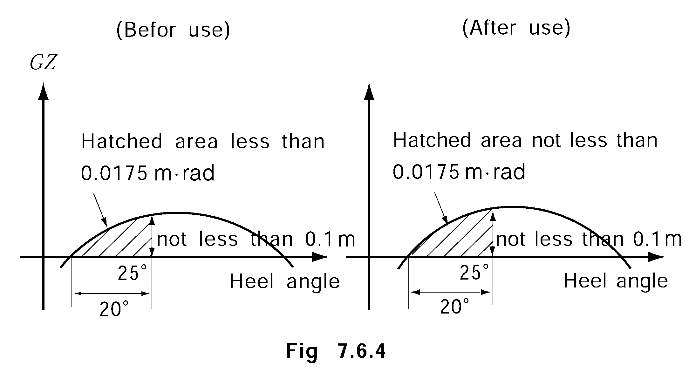
  - **(2)** When righting lever curves before use of this equalization arrangements are determined, the following assumptions are to be made :
    - **(A)** The cargo or consumable liquid in the damaged space has completely spilled out.
    - **(B)** The damaged space is filled with sea water to the water level outside the ship.
    - **(C)** The cross-levelling pipes are closed.
  - **(3)** The time required for horizontal adjustment is to be not more than 15 minutes.
  - **(4)** The cross sectional area A of piping used for horizontal adjustment is to be as follows :
    $A \geq 7.5V/ \sqrt {H} (\mathrm{cm} ^{2} )$
    where:
    $V$ : Quantity of water expected to enter the flooded space ($\mathrm{m} ^{3}$)
    $H$ : Height from the draught line before flooding to the centre line of the pipe ($\mathrm{m}$)
  - **(5)** It is not desirable to connect spaces on both sides of the ship with a large diameter duct to ensure the same rate of flooding as this aggravates the heeling moment of the ship in turning motion.
- **2.** **Buoyancy of superstructure 【 See Rule】**
  - **(1)** In the case of the side damage where the machinery space is regarded as one-space flooding in **207. 8** of the Rules, damage extent applicable to spaces other than the machinery space is applied to poop. With this reason, therefore, the space within poop surrounding the machinery space and enveloped by watertight bulkheads can not be treated as a reserve buoyancy unless watertight bulkheads are arranged as given in Fig **7.6.5** of the Guidance. However, in case where such treatment is accepted under the special requirements for small ships in accordance with **208. 2** of the Rules as a special relaxation by the Society, the above requirements may not be applied. Where the engine room bulkhead is knuckled, the space between the foremost end and the aftermost end is to be taken as the damaged space of the superstructure as given in Fig **7.6.6** of the Guidance.
    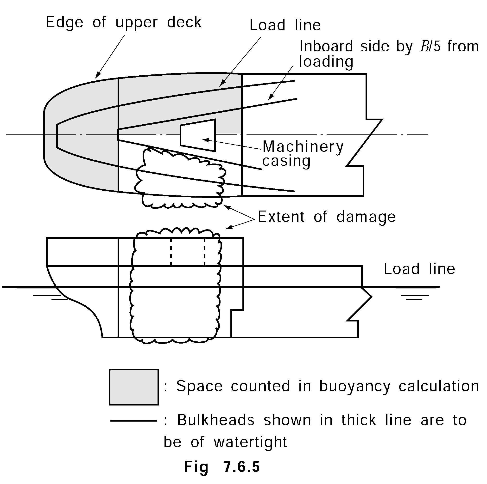 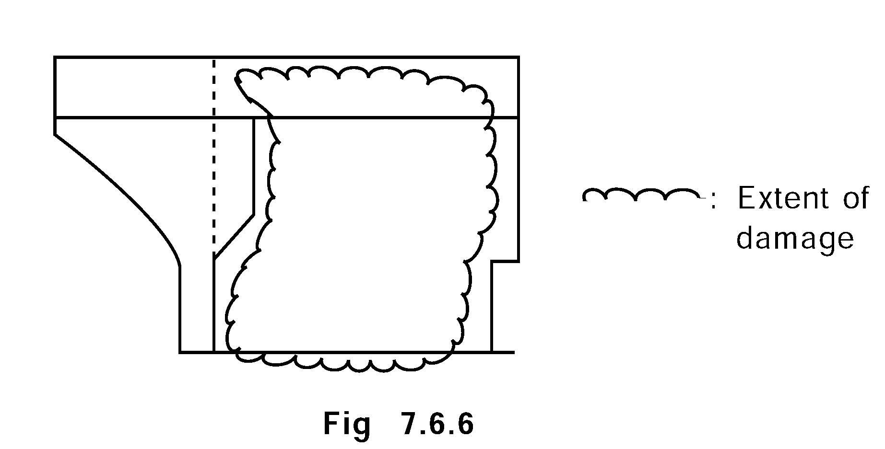
  - **(2)** In **207. 8** (2) of the Rules, the remotely operated sliding watertight doors are to be capable of being controlled from a safe and readily accessible place. Weathertight openings submerge in water under the minimum range of residual stability are to be capable of closing securely in a state of equilibrium.

#### 208. Standard of damage 【 See Rule】

- **1.** **Assumed extent of damage**
  - **(1)** In **208. 1** (3) and (5) of the Rules, the treatment of the stairway cases located forward or aft end bulkheads of the machinery space is to be in accordance with Fig **7.6.7** of the Guidance.
    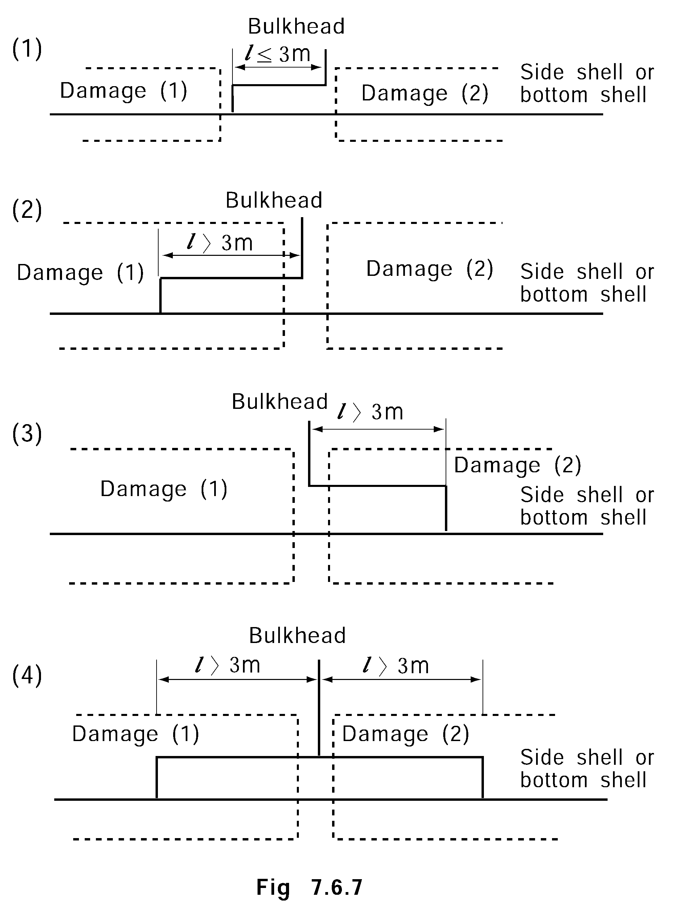
  - **(2)** In **208. 1** (6) of the Rules, the expression "should be considered by the Society" means that the survival requirements specified in 209. of the Rules under a condition of flooding only in the machinery space are satisfied, or the following requirements are satisfied (See Fig **7.6.8** of the Guidance) :
    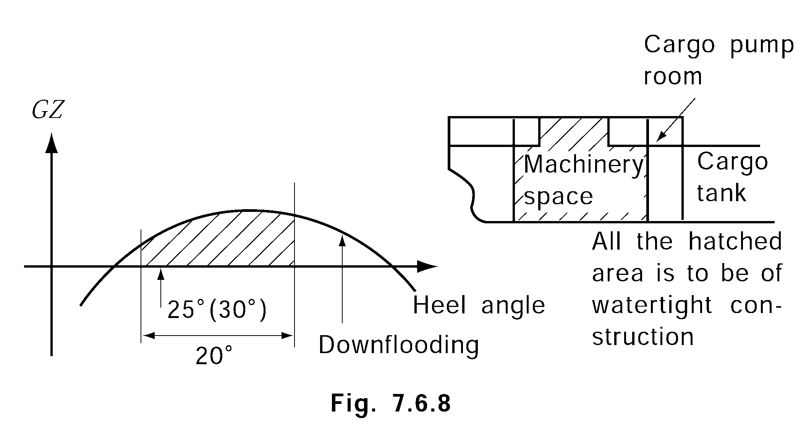
    - **(A)** The area with positive sign of the righting lever curve within the range from an arbitrary point between the final state of equilibrium after flooding and 25° (or 30° when the deck side line is not submerged) to 20° is to be :
      - **(a)** $70 \mathrm{m} \leq L _{f} < 125 \mathrm{m}$ : 0.0175 $\mathrm{m} . rad$ or more.
      - **(b)** $L _{f} < 70 \mathrm{m}$ : 0.0088 $\mathrm{m} \cdot rad$ or more
    - **(B)** The position of down flooding is to be in accordance with **209. 3** (1) of the Rules.
    - **(C)** The angle of heel is to be in accordance with **209. 2** (2) of the Rules. Where the machinery casing is of the watertight construction, the space in poop surrounding the machinery space may be treated as a reserve buoyancy. When a door is provided, it is to be of the watertight sliding door remotely operated from the poop deck.
- **2.** **Alternative measures**
  The "special dispensations" in **208. 2** of the Rules are to be in accordance with the following. (See Fig **7.6.9** of the Guidance)
  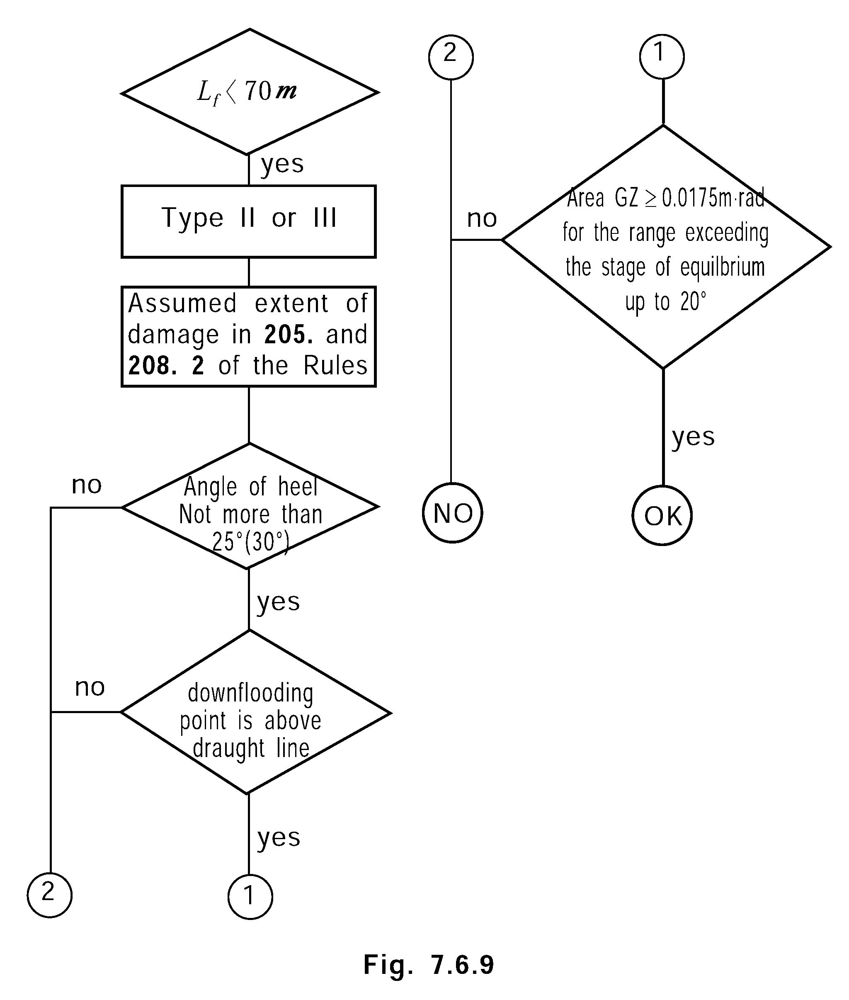
  - **(1)** No dispensations are to be accepted for Type I ships.
  - **(2)** Small ships mean as those whose $L _{f} < 70 \mathrm{m}$.
  - **(3)** Except for the case of flooding of machinery space of Type III ships(**208. 1** (6) of the Rules), it is to be in accordance with the following :
    - **(A)** Assumed extent of damage is to be in accordance with **205., 208. 1** (3) and (6) of the Rules.
    - **(B)** Down flooding point and angle of heel are to be in accordance with **209. 2** and **3** of the Rules.
    - **(C)** The area with positive sign of the righting lever curve within the range from an arbitrary point between the final stage of equilibrium after flooding and 25° (or 30° when the deck side line is not submerged) to 20° is to be 0.0175 $\mathrm{m}.rad$ or more.
    - **(D)** The maximum value of $GZ$ is not specified.

#### 209. Survival requirements 【 See Rule】

- **1.** **Stability criteria at any stage of flooding**
  The words "to the satisfaction of the Society" in **209. 2** (3) of the Rules mean as follows :
  In ordinary cases, the final stage of flooding is considered most severe, but the most severe condition may be encountered during intermediate stages of flooding involving replacement of sea water in the damaged space. In this connection, stability during such intermediate stages of flooding are to be considered when specifically requested by the Society.
- **2.** **Stability criteria at final equilibrium after flooding** ***(2017)***
  - **(1)** In **209. 3** of the Rules, floodable weathertight openings within the minimum stability range (20°) are to be capable of being securely closed at the final stage of equilibrium after flooding. Where safe access thereto is impracticable due to submersion of deck or large angle of heel, such weathertight openings may not be accepted.
  - **(2)** The survival requirements at the final stage of equilibrium after flooding are to be in accordance with Fig **7.6.10** of the Guidance.
  - **(3)** Other openings capable of being closed weathertight do not include ventilators (complying with ILLC 19(4)) that for operational reasons have to remain open to supply air to the engine room or emergency generator room (if the same is considered buoyant in the stability calculation or protecting openings leading below) for the effective operation of the ship.
    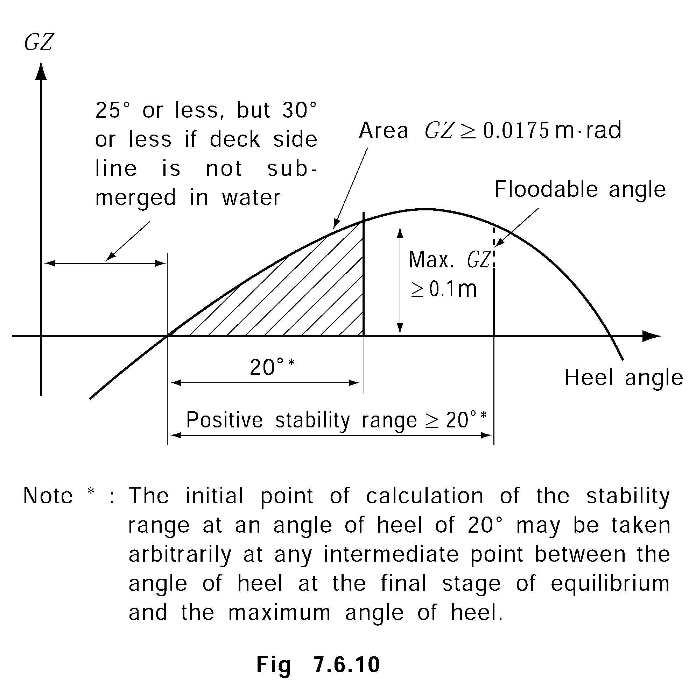

### Section 3 Ship Arrangements

#### 301. Cargo segregation 【 See Rule】

- **1.** **Segregation of tank containing cargo or residues of cargo**
  For cargo tanks and slop tanks, neither linear contacts nor point contacts with accommodation spaces, service spaces, machinery space, etc. are to be accepted. Further, no segregation of spaces in contact by means of slanting plates is to be accepted.
- **2.** **Segregation of cargoes which react with other cargoes**
  Where cargoes which react with other cargoes in a hazardous manner are loaded simultaneously, the ship arrangement as given in Fig **7.6.11** of the Guidance is not to be accepted. Only in the requirements for segregation of cargoes which react with each other, the linear contacts and point contacts as given in Fig **7.6.12** of the Guidance may be accepted. Where the cargo pipes are of common pipes, they are not to pass through cargo tanks carrying cargoes which react with each other in a hazardous manner except for the cases where pipe arrangement is provided a tunnel or made as given in Fig **7.6.13** of the Guidance.
  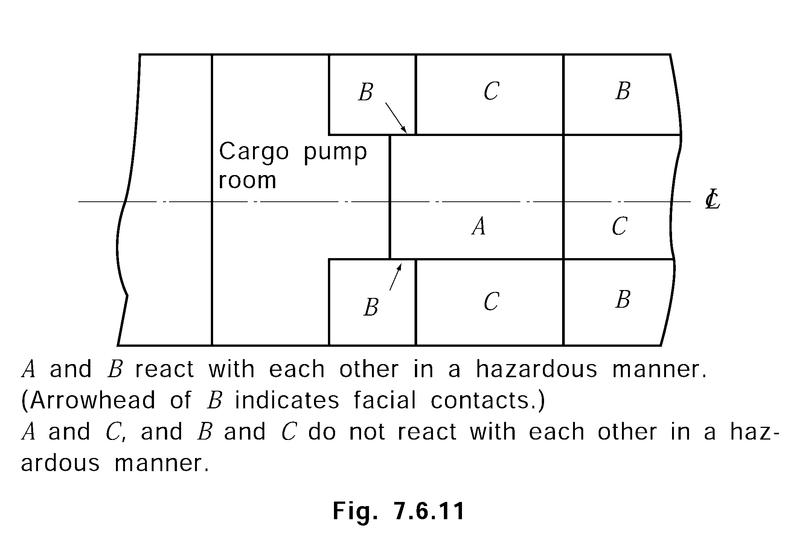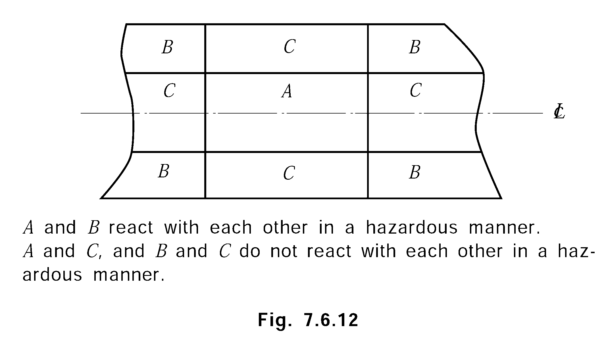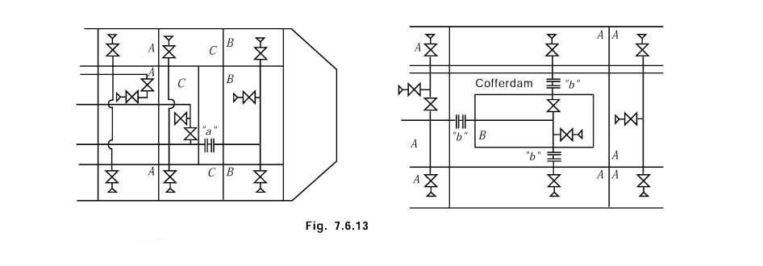

  | Notes : 1. "a" and "b" are to be separated within cofferdam or void spaces in the method specified in **301. 5** of the Rules. No separation in tanks is to be accepted. 2. A and B are cargoes which react with each other in a hazardous manner. 3. A and C, and B and C are safe cargoes which do not react with each other in a hazardous manner. In this case, however, cargo operation of cargo B by connecting the spool pieces of "a" and "b: after discharging cargo A is unacceptable, and therefore provisions of independent cargo pumps may be required for cargo operation on tanks segregated under the method given above. |
  | --- |
- **3.** **Cargo piping**
  Cargo piping is not to pass through the spaces specified in **301. 3** of the Rules and, in addition, spaces such as fuel oil tanks, fresh water tanks and control stations.

#### 302. Accommodation, service and machinery spaces and control stations 【 See Rule】

- **1.** **Arrangements**
  When segregated by a gastight deck and well ventilated, such a space is not electrically hazardous space, and in this case, arrangement of accommodation spaces, service spaces or control stations above fuel oil tanks adjacent to cargo tanks in the poop as given in **Fig 7.6.14** of the Guidance may be accepted. Paint lockers, regardless of their use, should not be located above the cargo area.
  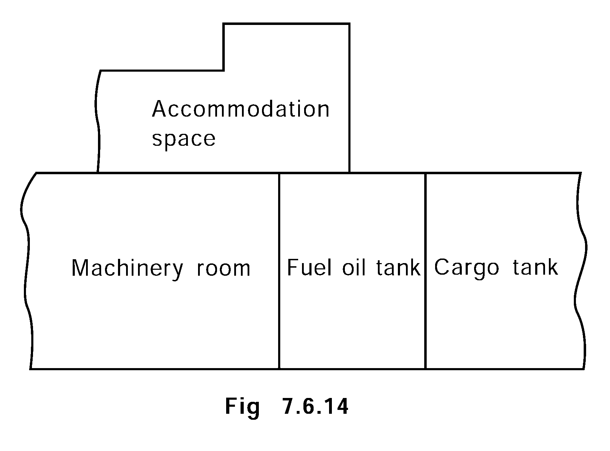
- **2.** Void space or ballast water tank protecting fuel oil tank as shown in **Fig. 8.2.2** of the **Guidance Pt 8 Ch 1**, need not be considered as "cargo area" defined in **106. 6** of **the Rules** even though they have a cruciform contact with the cargo oil tank or slop tank. The void space protecting fuel oil tank is not considered as a cofferdam. There is no objection to the locations of the void space shown in **Fig. 8.2.2** of the **Guidance Pt 8 Ch 1**, even though they have a cruciform contact with the slop tank. *(2026)*
- **3.** **Location of air intakes and openings**
  The locations of air intakes and openings are to comply with the requirements in **302. 3, 307. 4, 803. 2, 1201. 5** and **1512.** of the Rules.
- **4.** Entrances, air inlets and openings to accommodation, service and machinery spaces and control stations
  - **(1)** For exhaust air outlets of the mechanical ventilation system of accommodation, service and machinery spaces and exhaust air outlets specified in **302. 2, 307. 4, 803. 3** and **1512. 1** of the Rules the requirements in this Chapter also apply.
  - **(2)** Spaces where doors can be provided are to be restricted to lockers containing cargo gears and safety equipment, cargo control room and decontamination shower room. As given in **Fig 7.6.15** of the Guidance, these spaces are not provided with passageways led to accommodation spaces and service spaces and control station, and the casings, floors and ceilings adjacent to the accommodation spaces are to be insulated to "A-60" standard. However for ships carrying cargoes having a flash point above 60℃, the requirements for boundaries with cargo areas may apply to the provisions of **Pt.8 Ch. 7 103. of the Rule.** *(2020)*

    | 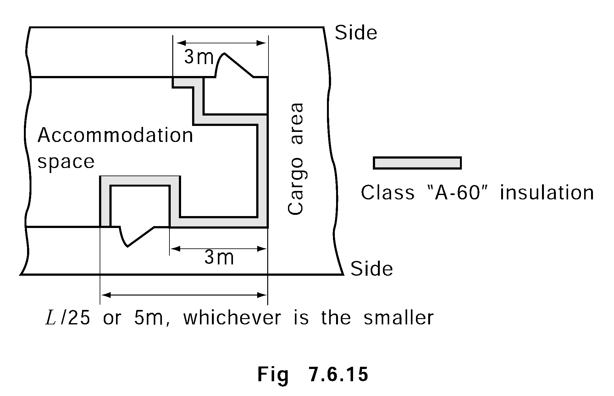 |
    | --- |
    | Insulation for ships carrying cargoes having a flash point above 60℃. *(2020)* |
  - **(3)** The gastight wheelhouse doors and windows are to be fitted with packing and dog bolts. These windows, doors and clear view screens are to be hose-tested at a pressure of 0.2$\mathrm{MPa}$. To ensure gastightness of the clear view screen, an additional window fitted with dog bolts or other means of gastight capable of tightening the window pane when the screen is not rotating are to be provided.
  - **(4)** For ships carrying dangerous chemicals in bulk, irrespective of the kind of cargo, coaming is to be provided at the forward end of the deckhouse to prevent the ingress of the cargo overflown on the deck into the deckhouse including the accommodation and service spaces and control stations as given in Fig **7.6.16** of the Guidance. The height of coaming is to be 300 $\mathrm{mm}$ from the deck, 50 $\mathrm{mm}$ above the upper edge of the sheer strake or 50 $\mathrm{mm}$ above the upper face of the deck longitudinals, whichever is the greatest.
    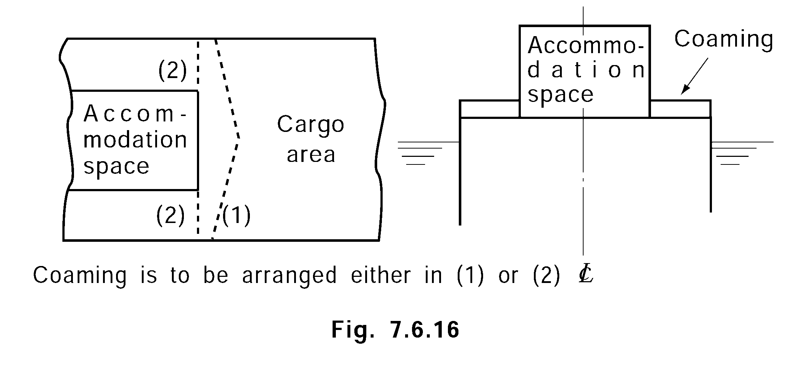
  - **(5)** In application of **302. 3** of the Rules, access to forecastle spaces containing sources of ignition may be permitted through doors facing the cargo area, provided the doors are located outside hazardous areas as defined in **Ch 5 Sec 10**. *(2024)*

#### 303. Cargo pump rooms 【 See Rule】

- **1.** **Arrangement of cargo pump rooms**
  Where cargo pump rooms are normally manned, or in case where cargo pump rooms are specially large, an additional escape trunk is to be provided. In this case, it is desirable that two escape routes led to the weather deck are available.
- **2.** **Permanent arrangement for hoisting an injured person**
  The permanent arrangement for hoisting an injured person from cargo pump room is to be in accordance with the following requirements :
  - **(1)** To be capable of being one-man-operated from the weather deck.
  - **(2)** To be capable of lifting an injured person up to the place on the weather deck.
  - **(3)** To be capable of lifting a weight of not less than 255 $\mathrm{kg}$.
- **3.** **Access ladders**
  The angle of normal access ladders provided in cargo pump room to a horizontal plane is to be not more than 60°.
- **4.** **Means for discharging cargoes and bilges**
  - **(1)** For pumps and valves dealing with cargoes likely to cause corrosions of structural members or contamination with other bilges within the cargo pump room due to leakage of corrosive cargoes, interactive cargoes or water prohibitive cargoes, proper bilge processing systems are to be provided according to degree of hazard. For instance, as the bilge processing systems for pumps dealing with interactive cargoes, provisions of independent bilge processing systems may be considered. In case where interactive cargoes are handled in the same cargo pump room, simultaneous cargo operations are to be avoided whereby the next cargo operation is to be carried out after complete bilge processing for the first cargo.
  - **(2)** Slop tanks specified in **303. 5** of the Rules are to comply with the following requirements (A) through (D) :
    - **(A)** In case of using the tank both as cargo tank and slop tank, the same requirements applicable to cargo tanks apply.
    - **(B)** Where no cargo is carried and only bilges or tank washings are contained, no requirements for ship type (only concerning the cargo tank arrangement) apply, notwithstanding kind of cargoes contained in bilges or tank washings. However, for the minimum requirements other than ship type, the following (a), (b) and (c) are to be complied with :
      - **(a)** For ventilation system, electrical installation and instrumentation, the severest of the requirements applicable to the cargoes contained in the slops is to apply.
      - **(b)** For tank environmental control and its special requirements, all the requirements for all cargoes contained in the slops are to be satisfied.
      - **(c)** For tank type, the requirements for the cargo contained in the slops are to be satisfied.
    - **(C)** For tank washings of tanks that carried the dangerous cargoes subjected to **1512.** of the Rules, slop tanks containing bilges of the cargo pump room used for the cargo operation of these cargoes and pipes serving them, the requirements of **1512.** of the Rules apply without exceptions.
    - **(D)** In case where two or more cargoes which react in a hazardous manner are carried, the tank washings and bilges containing these cargoes are not to be contained in the same slop tank. Therefore, slop tanks equal in number to that of cargoes which react in a hazardous manner carried at the same time are to be provided. In this case, when cargo tanks are used as slop tanks, these cargo tanks are to be provided with the pumps and pipelines to serve as the slop tanks.
    - **(E)** For ships carried the oil subjected to MARPOL 73/78 Annex 1, the capacity of slop tanks is to be complied with MARPOL 73/78 Annex 1.
- **5.** **Cargo pump discharge pressure gauges**
  "Cargo pumps" specified in **303. 6** of the Rules are the cargo pumps, tank cleaning pumps, bilge pumps, etc. used for handling cargoes and liquids containing cargoes in general.
- **6.** **Gas tightness of shafting passing through bulkhead or deck**
  The shaft seals of a type for periodical feeding of grease are not acceptable. Only continuous gastight sealing type is acceptable. These shaft seals are to be provided outside the cargo pump room. (See Fig **7.6.17** of the Guidance)
  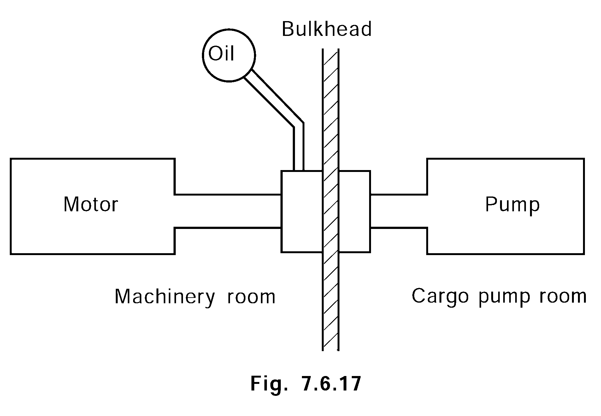

#### 304. Access to spaces in the cargo area 【 See Rule】

- **1.** **General**
  - **(1)** Spaces having direct openings to hold spaces containing independent tanks are to be to the requirements in **304.** of the Rules irrespective of the definition of the cargo area. Fuel oil tanks which have face contacts, linear contacts or point contacts with cargo tanks and those arranged directly below cargo pump room are not included in the cargo area, but subject to the following requirements.
    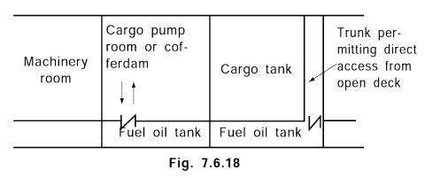
    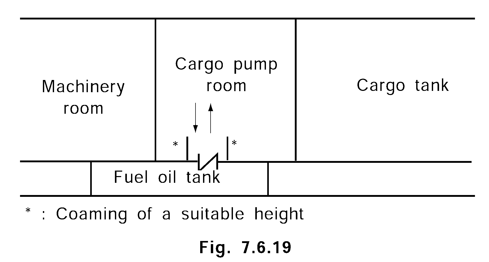
    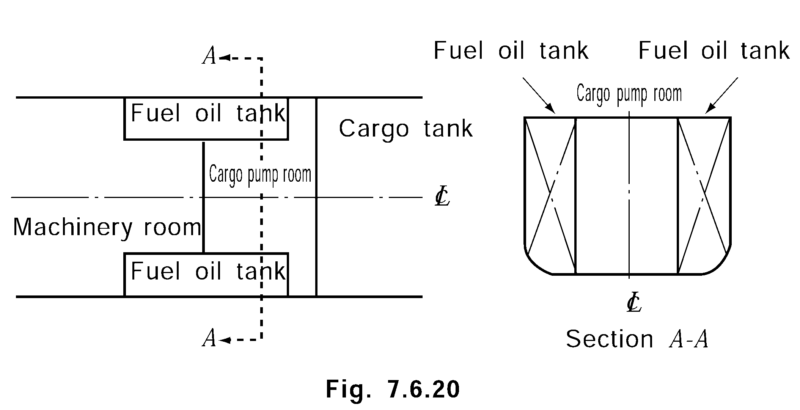
    - **(A)** Fuel oil tank adjacent to cargo tank or in linear or point contact therewith. (See Fig **7.6.18** of the Guidance) Access holes are to be to the requirements in this Paragraph, and access is to be from the cargo area.
    - **(B)** Fuel oil tank directly below cargo pump room. (See **Fig 7.6.19** of the Guidance) Access holes are to be to the requirements in this Paragraph, and in consideration of possible cargo leakage, access is to be from the cargo area.
    - **(C)** For fuel oil tanks given in Fig **7.6.20,** the requirements in this Paragraph do not apply. Access from the cargo area is desirable.
  - **(2)** For access openings of double bottom, etc., the following requirements are to be complied with :
    Two access routes are, as a rule, necessary for double bottom or similar other spaces as given in (1) to (3) of Fig **7.6.21** of the Guidance. The arrangement as given in (4) of Fig **7.6.21** of the Guidance is not to be accepted. On condition that easy access is provided and an unconscious injured person can be rescued, only one access route may be accepted for a relatively small space. On duct keel, access openings are to be provided at both ends, and an opening led to weather deck is to be provided at intervals not exceeding 60 $\mathrm{m}$.
    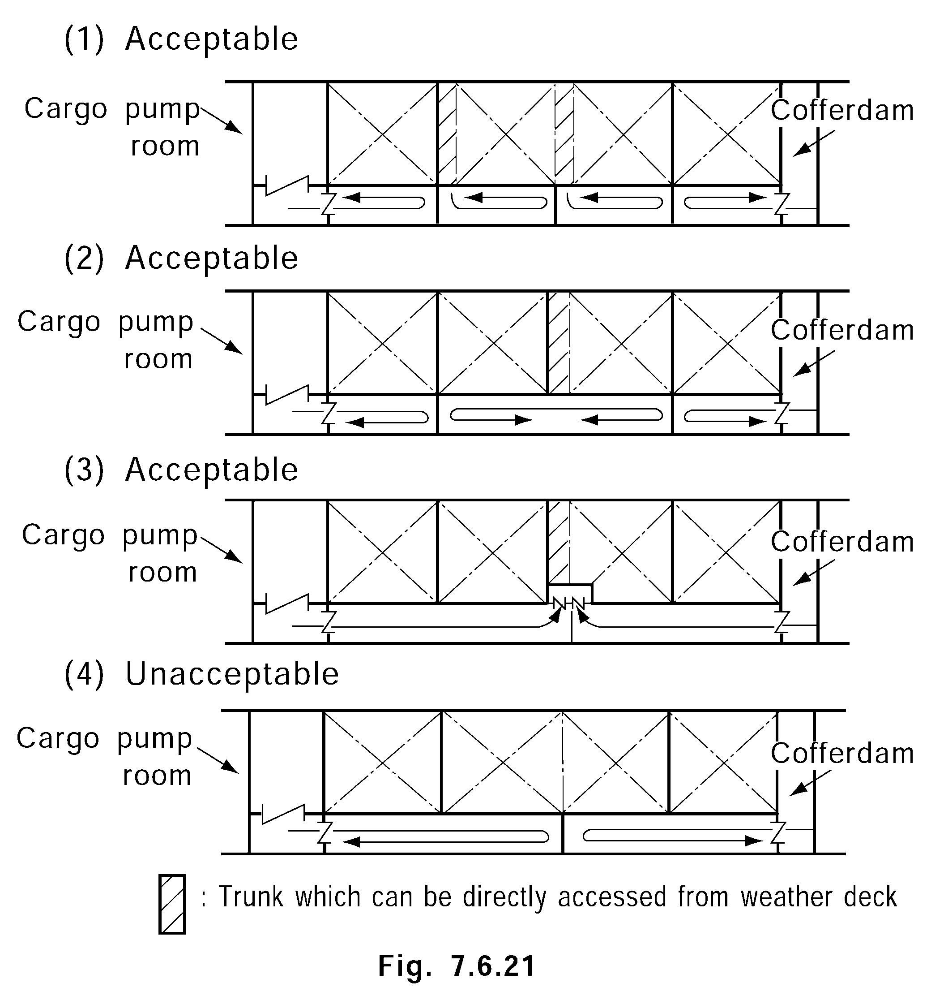
  - **(3)** Access openings to independent cargo tanks are to be in accordance with the following requirements :
    Independent cargo tanks are to be provided with trunks or domes protruding beyond the weather deck as given in Fig **7.6.22** of the Guidance and cargo tank hatches are to be provided on the top of these trunks or domes. No opening of any construction is to be provided on the cargo tank wall below the weather deck.
    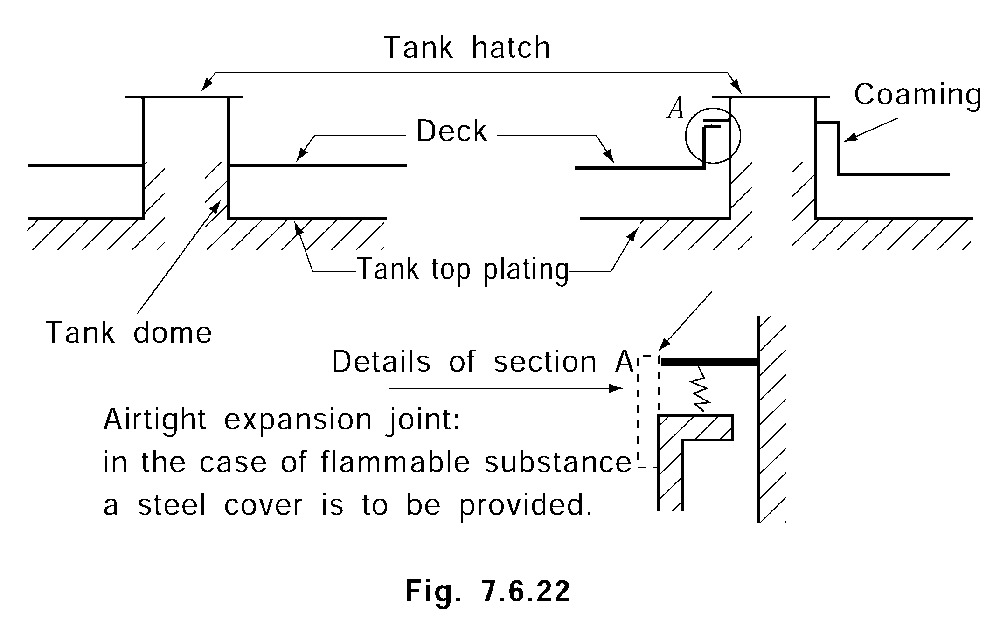
- **2.** **Minimum clear opening for access through horizontal openings**
  The minimum opening dimensions are to be 600 $\mathrm{mm}$ × 600 $\mathrm{mm}$ with rounded corners.
- **3.** **Minimum clear opening for access through vertical openings and arrangements of vertical openings**
  Access openings are to comply with the following requirements:
  - **(1)** Opening of 600 $\mathrm{mm}$ × 800 $\mathrm{mm}$ is to be so oriented that the major axis is taken in the vertical direction. However, where the major axis is difficult to be taken in the vertical direction under the structural reason, horizontal direction may be taken.
  - **(2)** At access openings and in the vicinity, no pipes or equipment that interfere with the assurance of access route are to be arranged.
- **4.** **Relaxation of opening dimension**
  Opening dimensions may be as given in **Table 7.6.1** of the Guidance provided that person wearing safety equipment has access to openings and an injured person is easily rescued from the bottom of spaces.

  **Table 7.6.1 Relaxation of Opening Dimension**

  | Spaces | Minimum dimension ($\mathrm{mm}$) |
  | --- | --- |
  | Cargo Tanks | 600×600 |
  | Void Spaces, W.B.T | $H$ : 500×500, $V$ : 500×650 |
  | F.O.T | $H$ : 450×450, $V$ : 400×500 |

#### 305. Bilge and ballast arrangements 【 See Rule】

- **1.** **General**
  - **(1)** The discharge arrangements of permanent ballast tanks adjacent to cargo tanks may be such that ballast pumps in the machinery space are used as given as Fig **7.6.23** of the Guidance and ballast or bilges are discharged overboard through the eductor in the cargo pump room. In this case, check valve is to be provided between the ballast pump and eductor and spool piece is to be provided on the weather deck within the cargo area.
    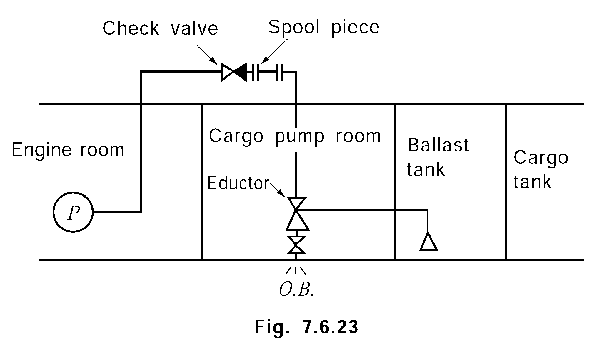
  - **(2)** The words "ensure filling from tank deck level and check valves are fitted" referred to in **305. 1** of the Rules mean that exclusively used for filling from the weather deck but can not be used for discharging fitted with stop valves on the weather deck or stop valves operable from the weather deck and additionally check valves are provided as given in Fig **7.6.24** of the Guidance. Further, sufficient consideration is to be taken so as not to cause non-compliance with the damage stability requirements due to damage to pipelines or spillage of dangerous ballast or cargo into other compartments.
    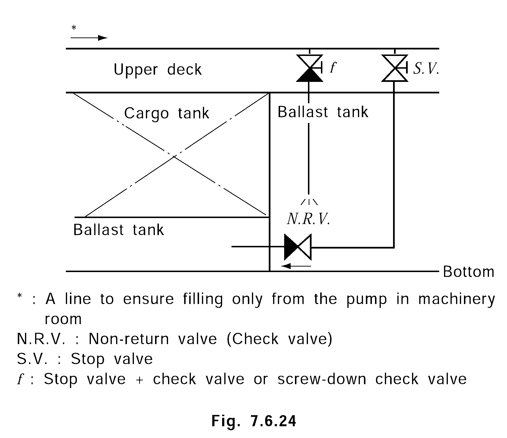
  - **(3)** Pipelines of ballast tanks adjacent to cargo tanks and not adjacent to cargo tanks are to be basically independent.
- **2.** **Filling of ballast in cargo tanks**
  - **(1)** The case referred to in **305. 2** of the Rules as "the filling line has no permanent connection to cargo tanks or piping and that check valves are fitted" is to be as given in Fig **7.6.25** of the Guidance. In this case, filling is to be limited to that from the open deck, where spool pieces or hoses and stop valves or check valves are required.
  - **(2)** When filling is made from the open deck according to the preceding (1), the piping arrangement in cargo tanks is to be such that the filling pipe is extended as close to the bottom as practicable to minimize generation of static electricity.
    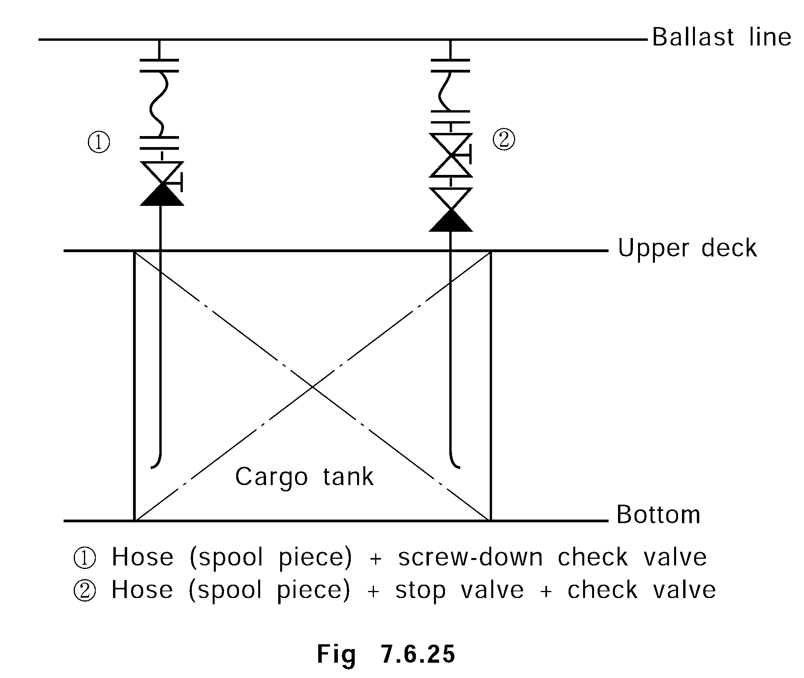
- **3.** **Bilge pumping arrangements for the cargo area**
  Pipes dealing with cargo or cargo residues passing through void spaces, double bottom and ballast tank spaces are to be treated within the bilge cargo spaces of the compartments even when they are segregated from tanks containing cargo or cargo residues by double bulkheads.

#### 306. Pump and pipeline identification 【 See Rule】

"Marking" referred to in **306.** of the Rules is to be made by peel-resisting tapes or paint coat to clearly identify respective pipes.

#### 307. Bow or stern loading and unloading arrangements 【 See Rule】

- **1.** **General**
  The bow or stern loading and unloading arrangements are to be given in Fig **7.6.26** of the Guidance, as a standard.
  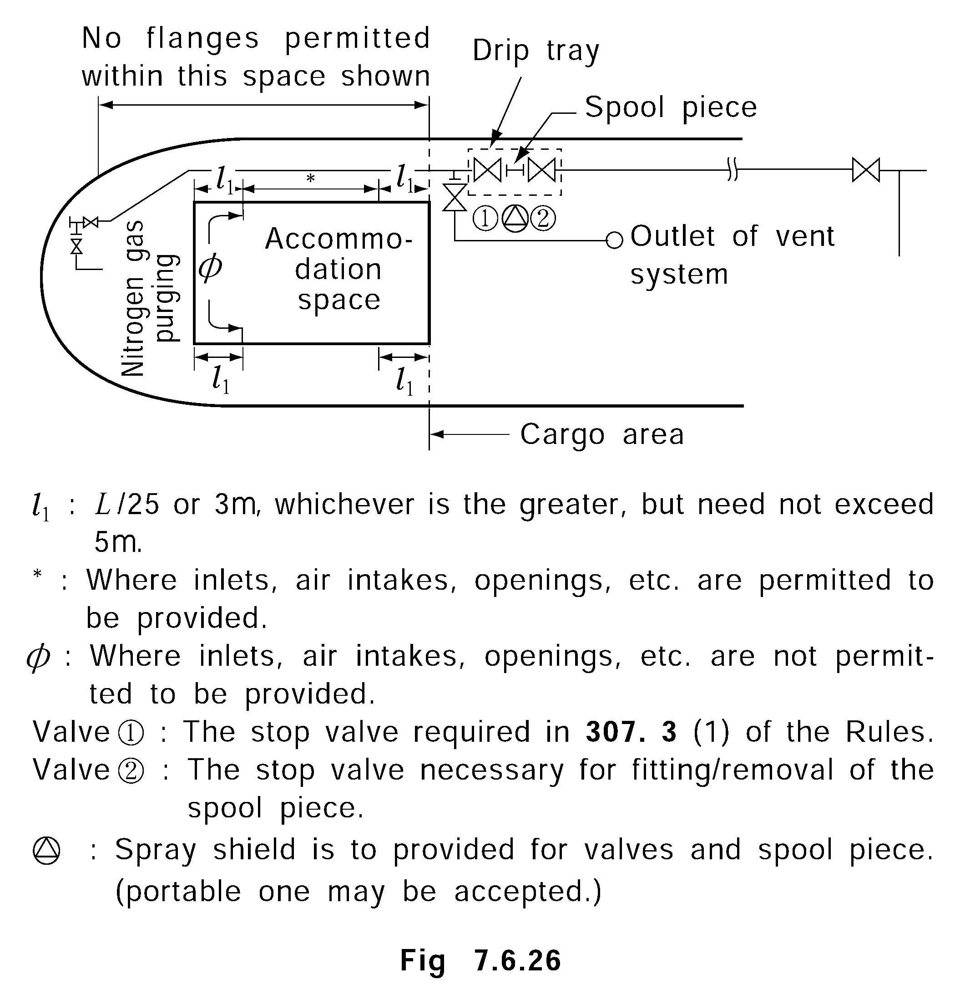
- **2.** **Entrances, air inlets and openings to accommodation, service and machinery spaces and control stations**
  All openings such as entrances, to accommodation, service and machinery spaces and control stations, air inlets, rope hatches, openings to machinery casing, openings in escape routes, etc. are to be arranged in areas outside the shaded sections given in Fig **7.6.27** of the Guidance. The standard height of superstructure is to be as given in **Table 7.6.2** of the Guidance.
  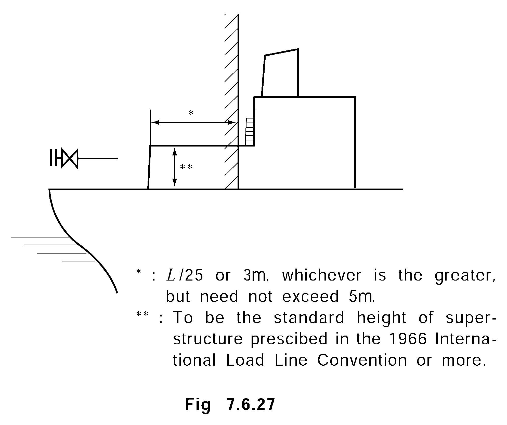

  | $L (\mathrm{m})$ | Low Poop | Other poop |
  | --- | --- | --- |
  | Not more than 30 75 Not less than 125 | 0.90 1.20 1.80 | 1.80 1.80 2.30 |
- **3.** **Escape route**
  The "escape route" referred to in **307. 6** of the Rules means the escape route from machinery space.
- **4.** **Continuous coamings**
  The "continuous coamings of suitable height" referred to in **307. 7** of the Rules are the coamings provided on the cargo handling machinery and gear with a height above deck of 150 $\mathrm{mm}$ or 50 $\mathrm{mm}$ above the upper edge of the sheer strake as given Fig **7.6.28** of the Guidance, whichever is the greater, and are to be arranged in direction of breadth of ships continuously.
  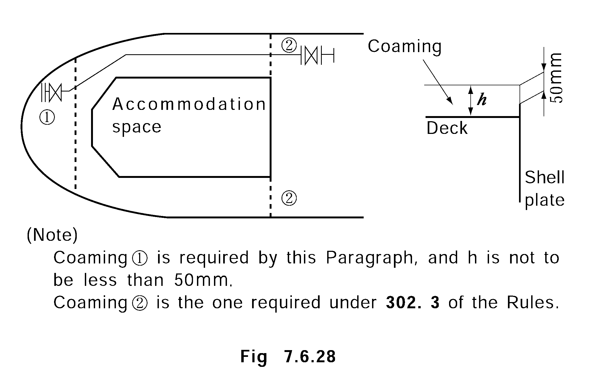
- **5.** **Fire-extinguishing arrangements**
  One each monitor for foam fire-extinguishing system and portable foam applicator unit required in the cargo area are to be provided. The hydrant connected with the portable foam applicator unit is to be arranged within the range effective for discharging the fire-extinguishing medium and the portable foam applicator unit is to be stowed in a space ready for immediate use.

### Section 5 Cargo Transfer

#### 501. Piping scantlings

- **1.** **Design standard for piping**
  - **(1)** In **501. 6** (1) of the Rules, the minimum thickness of stainless steel pipes is, in general, to be in accordance with the following requirements : **【See Rule】**
    ․ Cargo pipes passing through ballast tanks : Schedule 40 $S$
    However, the minimum thickness is to satisfy the requirements for thickness of pipes subjected to internal pressure specified in **501. 1** of the Rules.
  - **(2)** The protection for cases "Where necessary for mechanical strength" referred to in **501. 6** (2) of the Rules is to be provided as follows : **【See Rule】**
    - **(A)** No protection is required for steel pipes used for ordinary applications.
    - **(B)** Where aluminium pipes, stainless steel pipes of which thickness is reduced according to their tensile strength, etc. considered vulnerable to impact loads are used, suitable protection is to be provided.
    - **(C)** It is desirable that manifolds are to be made of steel.
    - **(D)** Pipes passing through bulkheads or decks, those arranged an elevated space above upper deck, those subjected to load of the loading arms at the manifold may be required to have increased thickness.
  - **(3)** In "Flanges, valves and other fittings" referred to in **501. 6** (3) of the Rules, the use of stop valves and expansion joints is to be in accordance with the following requirements : **【See Rule】**
    - **(A)** To comply with the requirements in **Pt 5, Ch 6** of the Rules (for both Class I and Class II pipes).
    - **(B)** Since use of expansion joints is not allowed for the cargo pipes within tanks containing the cargo for which special means for the maintenance of product quality are required, expansion of the pipes is to be absorbed by U-bends, etc.
    - **(C)** The materials of valves, seals, etc. are not to be of the ones of which use is prohibited.
  - **(4)** In application to **501. 6.** (4) of the Rules, the term "the satisfaction of the Society" means the case where the temperature, the pressure and the size of the flange have values above certain limits and the complete calculation of bolts and flanges is to be carried out. **【See Rule】**

#### 502. Piping fabrication and joining details

- **1.** **Joint of cargo piping 【 See Rule】**
  Cargo pipes are to be joined by welded joints except for the flange joints for shut-off valves and expansion joints, spool pieces and equivalent fittings approved in **502. 2** of the Rules and flange joints necessary for painting, lining, assembly, inspection or maintenance. Further, movable anti-acid shields to guard against spray are to be provided at flange welding of cargo pipes above the deck referred to in **1511.** of the Rules.
- **2.** **Direct connection of pipes without flanges 【 See Rule】**
  Where Class I pipes or Class II pipes are required under **504.** of the Rules for butt-welded joints in **502. 3** (1) of the Rules, the requirements in **Pt 5, Ch 6** of the Rules are to be complied with. The butt welding procedure for cargo pipes (including liquid cargo and vapour cargo) where use of Class III pipes are permitted is to be the same as in Class II pipes. However, nondestructive testing may not be carried out.
- **3.** **Expansion joints 【 See Rule】**
  The "bellows" referred to in **502. 4** (1) of the Rules are not to be used for cargoes having corrosive or polymerizing nature unless consideration is taken for the cargo drains trapped in the corrugated parts of the joints.

#### 503. Flange connections

- **1.** **Standards for flanges 【 See Rule】**
  The "standard approved by the Society" referred to in **503. 2** of the Rules means the requirements in **Pt 5, Ch 6, 104.** of the Rules.

#### 504. Tests requirements for piping 【 See Rule】

- **1.** **Application**
  The classification standard and test requirements for cargo piping are to be in accordance with **Tables 7.6.3** and **7.6.4** of the Guidance.

  **Table 7.6.3** ***(2021)***

  | Ship type | Classification of applicable cargo (See **Table 7.6.4** of the Guidance) | Remark |
  | --- | --- | --- |
  | Type 1 | Class I pipes | Irrespective of the design pressure and temperature, the requirements in the left-hand column apply, in principle. For compatibility between cargo and cargo piping materials, separate investigation may be made. |
  | Type 2 | Class II pipes | Irrespective of the design pressure and temperature, the requirements in the left-hand column apply, in principle. For compatibility between cargo and cargo piping materials, separate investigation may be made. |
  | Type 3 | Class III pipes | Irrespective of the design pressure and temperature, the requirements in the left-hand column apply, in principle. For compatibility between cargo and cargo piping materials, separate investigation may be made. |
  | Notes : (1) Cargo piping means the piping to transfer liquid cargo and vapour cargo. (2) Cargo piping for slop tanks arranged in accordance with the requirements of ship type 3 is to be classified into Class III irrespective of the ship type requirements for cargo contained in slop tanks. (3) Cargo piping passing through the tanks cargo with higher ship type requirements is to comply with the requirements of the piping specified for such cargo. (4) Open ended pipes(drains, overflows, vents, etc.) belong to Class Ⅲ. |   |   |

  **Table 7.6.4. Test Requirements for Piping**

  |   | Materials of pipe | Materials of valves, cocks and pipe fittings | Shop tests for pipe fabrication |   |   | Shop tests for valves and pipe fittings | Shipboard tests for piping |
  | --- | --- | --- | --- | --- | --- | --- | --- |
  |   | Materials of pipe | Materials of valves, cocks and pipe fittings | Welding procedure qualification tests | Non-destructive tests | Hydraulic tests | Shop tests for valves and pipe fittings | Shipboard tests for piping |
  | Class I | Materials complying, as a rule, with the requirements in **Pt 2, Ch 1** of the Rules. | Materials complying, as a rule, with the requirements in **Pt 2, Ch 1** of the Rules. However, materials complying with the requirements of KS or equivalent may be accepted at the discretion of the Society. | To be carried out on piping of Class I or Class II where the following ① to ③ are relevant : ① Joinings between pipes, pipes and valves, and pipes and fittings are made welding for the first time. ② When new welding method is employed. ③ When base material, type of welding materials or type of joints is changed. | ① Radiographic testing for the entire length of butt-welded joints between pipes, pipes and valves, and pipes and fittings with nominal diameter exceeding 65A. ② Radiographic testing for the sampled butt-welded joints between pipes, pipes and valves, and pipes and fittings with nominal diameter not more than 65A. ③ In place of radiographic testings, suitable other non-destructive testing may be accepted. ④ Magneticparticle testing or suitable other for fillet weld between pipes, pipes and valves, and pipes and fittings. | ① All pipings of Class Ⅰ, Class Ⅱ and Class Ⅲ, are to be subjected to hydraulic tests with fittings attached after fabrication at a test pressure 1.5 times the design pressure. ② The test pressure for hydraulic test for pipes with design temperature exceeding 300°C is to be specified separately. ③ The hydraulic test for welded joints between pipes or pipes and valves(or cocks) of piping arranged onboard the ship is to be specified separately. | Valves(or cocks) and fittings of piping of Class I or Class II are subject to hydraulic test at a pressure of 1.5 times the design pressure. | ① All pipings are subject to leak test in their service condition. ② All pipes are to be subjected to preliminary test together with the equipment they serve. ③ All cargo pipings are to be subjected to the hydraulic test at a pressure of 1.5 times the design pressure. |

  | Class II |   |   |   | ① Radiographic testing or suitable other testing for buttwelded pipes joints between pipes, pipes and valves(or cocks), and pipes and fittings with nominal diameter exceeding 80A. ② Magnetic particle testing or suitable other testing for fillet weld between pipes, pipes and valves(or cocks), and pipes and fittings |   |   |   |
  | --- | --- | --- | --- | --- | --- | --- | --- |
  | Class III | Materials complying with the requirements of KS or equivalent | Materials complying with the requirements of KS or equivalent |   |   |   |   |   |

#### 505. Piping arrangement

- **1.** **Cargo piping under deck 【 See Rule】**
  - **(1)** "the stop valve operable from the weather deck" referred to in **505. 2** of the Rules is to be located in the vicinity of each open end within each tank.
  - **(2)** "As an exception..." specified in **505. 2** of the Rules following is applicable only to the cargo piping arranged in one cargo tank or slop tank adjacent to the cargo pump room as given in the shaded section of **Fig 7.6.29** of the Guidance. In this case, an additional stop valve is to be provided between the bulkhead valve and cargo pump.
  - **(3)** The word "leakage" referred to in **505. 2** (1) of the Rules includes the leakage through packing.
    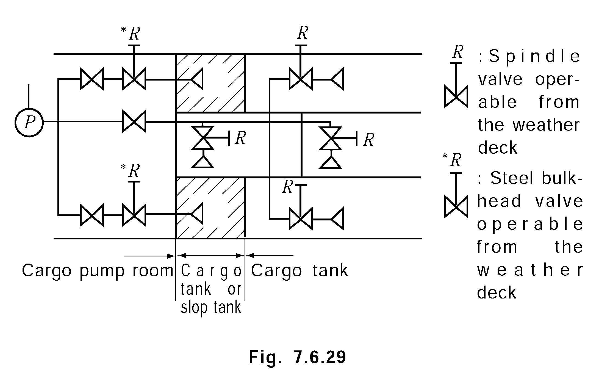

#### 506. Cargo transfer control systems 【 See Rule】

- **1.** **General**
  - **(1)** The "one stop valve capable of being manually operated on each tank filling and discharge line, located near the tank penetration" referred to in **506. 1** (1) of the Rules, for cargo pipes provided in cargo tanks as given in Fig **7.6.30** of the Guidance may be omitted if there are stop valve specified in **505. 2** of the Rules (stop valve located near the open end and operable from the weather deck) and bulkhead valve provided in the cargo pump room specified in **505. 3** of the Rules.
    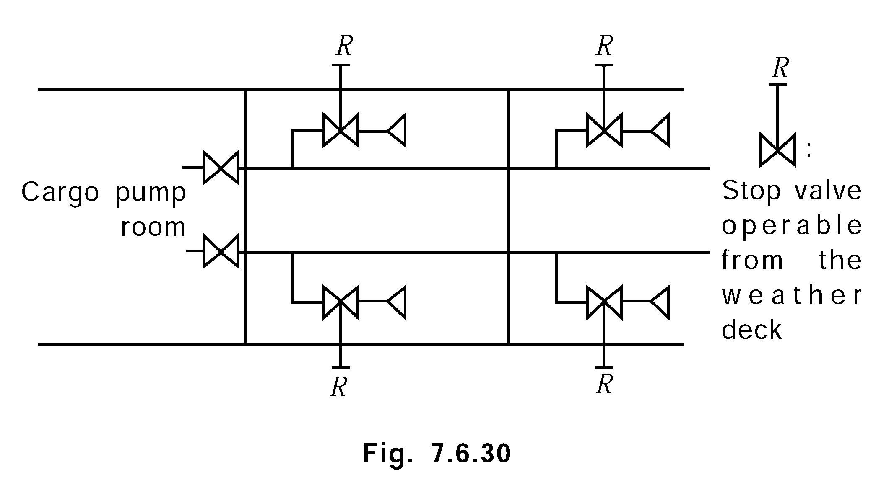
  - **(2)** Stop valve is not required at the deck penetration of the discharge piping of deep well pump or submerged pump provided independently in each tank, but a stop valve is to be provided near at each penetration of weather deck as given in Fig **7.6.31** of the Guidance for the direct cargo filling line(piping capable of filling cargo without being led through the cargo pump).
    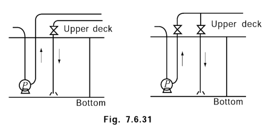
  - **(3)** When the "direct cargo filling line" specified in the preceding (2) is provided, the open end of such direct cargo filling line for flammable and/or toxic chemicals is to be extended to not more than 10 $\mathrm{cm}$ above the tank bottom or sump surface or the filling pipe radius, whichever is the greater. *(2022)*
  - **(4)** The "one stop valve" referred to in **506. 1** (2) of the Rules is also required for the hose connection used for the transfer of cargo vapour.
  - **(5)** In addition to the preceding (4), a stop valve is required for the hose connection to the shore vapour circulation. When the stop valve is of the portable type for fitting as necessary, stop valves equal to or greater, in number, than the maximum number of tanks scheduled for simultaneous loading of the cargo requiring shore circulation are to be provided at shore for the ship. The restriction to the number of loaded cargo tanks according to the number of these stop valves is to be noted in the Operation Manual of the ship carrying dangerous chemicals in bulk.
  - **(6)** It is desirable that the "remote shut-down devices" referred to in **506. 1** (3) of the Rules can be centrally controlled from a place manned at all times during the cargo operation (e.g. cargo control station).

#### 507. Ship's cargo hoses

- **1.** **General 【 See Rule】**
  - **(1)** The "hoses" referred to in **507. 1** of the Rules are to comply with the following requirements :
    - **(A)** When come in contact with the cargo, hoses are not to be mechanically damaged or caused extreme degrading in their function.
    - **(B)** The materials of cargo hoses are not to give hazardous effects on the cargo.
  - **(2)** In the preceding (1), if cargo hoses are integral with the emergency cargo pump or they are submerged in the tank connected to the pump, the requirements in the preceding (1) are to be considered for both the inside and outside surfaces of hoses.

### Section 7 Cargo Temperature Control

#### 701. General 【 See Rule】

- **1.** **General**
  The "cargo heating or cooling system" referred to in **701. 1** of the Rules is to comply with the following requirements :
  - **(1)** For possible failure of any component or the whole system serving as a source of heating in ships carrying the cargo requiring heating and to which the requirements in this Chapter apply, means are to be provided so as not to disable cargo heating, cargo operation or not to endanger the safety of the ship.
  - **(2)** For the refrigerating installations and insulation materials of ships carrying the cargo requiring cooling to which the requirements in this Chapter apply, the requirements in **Ch 5, Sec 4** to **Sec 7** of the Rules and those specified in **Pt 9, Ch 1** of the Rules for Refrigerating Installations apply correspondingly. Particular attention is to be paid to the cargo since propylene oxide for the refrigerating installation of which detailed requirements are specified.
  - **(3)** Cargo requiring heating means the dangerous chemicals with a melting point not less than 15°, as a standard, but if deemed necessary by the Society, heating means for cargo may be required according to the service area and operation condition of the ship. In this case, the temperature measuring equipment specified in **701. 5** of the Rules is to be of the fixed type.
  - **(4)** The maximum temperature of steam and heating media within the cargo area is to be adjusted to take into account the temperature class of the cargoes.
- **2.** **Control valves of cargo temperature control system**
  The "valves to isolate the system for each tank and to allow manual regulation of flow" referred to in **701. 3** of the Rules means the valves provided between the main vapour line and each tank and are capable of regulating flow rate. This also applies to the case of the refrigerating installations. In **Table 7.6.1** of the Rules where carriage of the water prohibiting cargoes to which the requirements of **1516. 1** of the Rules apply is intended, spool pieces are to be provided in addition to these valves.
- **3.** **Maintenance of pressure in cargo temperature control system lines**
  As the provision for the maintenance of the pressure specified in **701. 4** of the Rules, compressed air may be supplied from the deck general service air line fed from the air reservoirs and air compressors in the machinery space to the heating (cooling) piping.
  When it is solely planned to carry the heated (cooled) cargo in all tanks, compressed air may be fed from the compressed air main, but if it is intended to carry the heated (cooled) cargo in part of tanks with the rest of tanks used for the carriage of non-heated (non-cooled) cargo, compressed air is to be supplied from the connection on the tank side of the stop valve of the compressed air branch line as given in **Fig 7.6.32** of the Guidance. In case where carriage of the cargo not requiring heating (or cooling) but requiring to inert the tanks and cofferdams adjacent thereto, no air is to be sealed in the line but inert gas is to be filled in. Consideration is to be given so as not to cause dangerous mutual reaction between the sealing medium and the cargo. Where other means are employed for the maintenance of line pressure, the same requirements apply.
  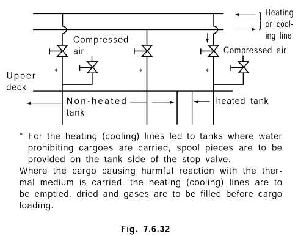
  **Fig 7.6.32**
  * For the heating (cooling) lines led to tanks where water prohibiting cargoes are carried, isolating means are to be provided on the tank side the stop valve. *(2021)*
  * Where the cargo causing harmful reaction with the thermal medium is carried, the heating (cooling) lines are to be emptied, dried and gases are to be filled before cargo loading.
- **4.** **Means for measuring the cargo temperature**
  "When overheating or overcooling could result in a dangerous condition" referred to in **701. 5** (4) of the Rules means such a case where the adjacent cargo tanks or fuel oil tanks are heated or cooled to the extent that they suffer from thermal effects. In this case, the temperature sensing ends are to be provided at least at two locations on the liquid surface and bottom of the tank.
- **5.** **Circuit operated with heating or cooling medium**
  - **(1)** The cargoes falling under the requirements in **701. 6** of the Rules are to be those to which application of the requirements of either **1512., 1512. 1** or **1512. 3** specified in **Table 7.6.1** of the Rules is required, but they also apply to the cargo with a notation of "$T$" in vapour detection of the Table.
  - **(2)** "where the medium is sampled to check for the presence of cargo" referred to in **701. 6** (3) of the Rules is to be of the detection tank fitted with a detection cock as given in Fig **7.6.33** of the Guidance for example. Although provision of a oil observation tank in the machinery space is required for ordinary tankers according to the requirements in **Pt 7, Ch 1, 1002. 9** of the Rules, in the case of carriers carrying dangerous chemicals in bulk, provision in the machinery space is not permitted and such means is to be provided on the weather deck within the cargo area without exception. Means of detection is to be by an effective toxic gas-detecting tube or suitable testing agent. The suitable testing agent is to have been procured from the manufacturer. *(2021)*
    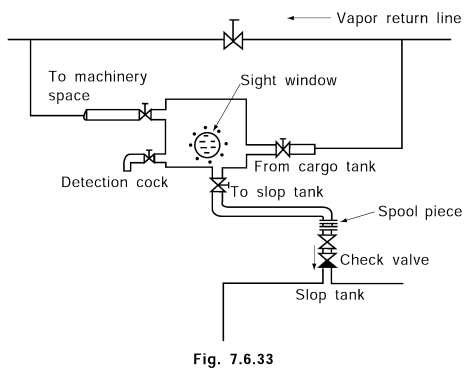

### Section 8 Cargo Tank Venting and Gas-freeing Arrangements

#### 802. Cargo tank venting

- **1.** **Venting systems 【 See Rule】**
  - **(1)** "Tank venting systems are to be arranged to prevent entrance of water into the cargo tanks and at the same time, vent outlet are to direct the vapour discharge upwards in the form of unimpeded jets" referred to in **802. 1** of the Rules mean the outlet as given in Fig **7.6.34** of the Guidance.
    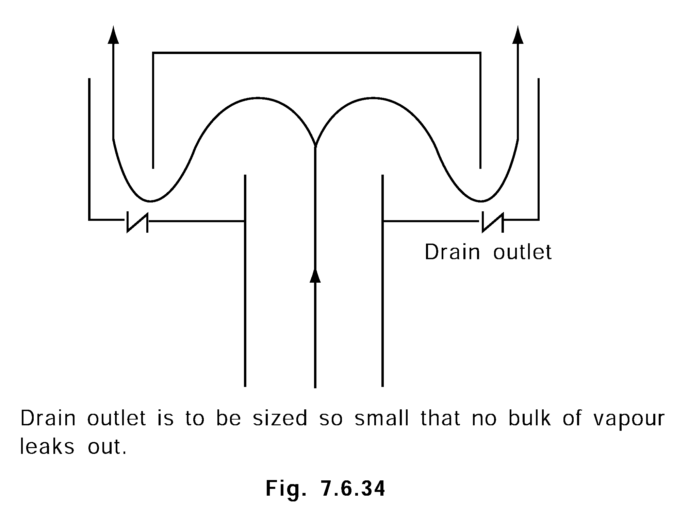
- **2.** **Provision for drainage of vent lines** ***(******2019)*** **【See Rule】**
  The "cargo vent lines are to be self-draining back to the cargo tanks" referred to in **802. 2** of the Rules is to be so arranged that drains of the vent lines will flow into cargo tanks by natural gravitation by heels and trims of the ship.
- **3.** **Provision to protect liquefied head exceeding design head 【 See Rule】**
  - **(1)** When the "provision made to ensure that the liquid head in any tank does not exceed the design head of the tank" referred to in **802. 3** of the Rules is designed, the following items are to be considered :
    - **(A)** loading and unloading rate
    - **(B)** filling of ballast and discharge rate
    - **(C)** gas evolution
    - **(D)** pressure loss considered resistance coefficient
    - **(E)** pressure loss in ventilation system
    - **(F)** operating pressure(suction/discharge setting pressure) where high velocity venting valves or relief valves are used
    - **(G)** density of equilibrium of the vapour/air mixture
    - **(H)** air supply rate by fixed type ventilation system
  - **(2)** Except for the case specified in **1519.** of the Rules, no independency is required among liquid level gauges, high liquid level alarm system and overflow control system. The high level alarm system or overflow control system required in **1519.** of the Rules may be used for the prevention of cargo tank overpressure. When the cargo having a larger specific gravity than the design specific gravity is carried in partial loading, the cargo tank is to be provided with the measuring systems required in 1301. of the Rules, and additionally, high liquid level alarm system capable of being set at arbitrary levels is to be provided for the protection of the cargo tank.
  - **(3)** The system fitted with valves and flanges for connecting cargo hoses at hatches on the top of cargo tank for preventing cargo tank overpressure as given in **Fig 7.6.35** of the Guidance may be accepted only when either of the following (A) or (B) is relevant :
    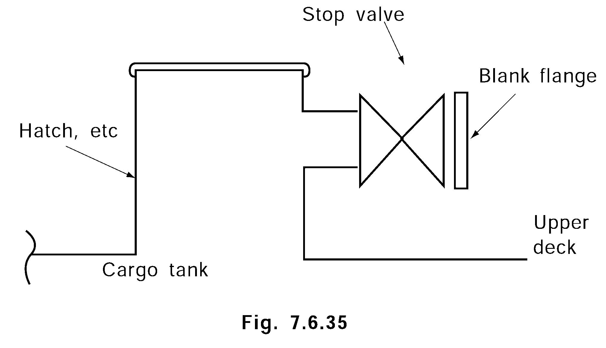
    In either case of (A) or (B), much difficulty is involved in observing the operational restrictions and hence it is desirable to install the high level alarm or overflow control system specified in **1519.** of the Rules. For tanks carrying the cargo with a flash point of not more than 60°C, provision of the high level alarm system or overflow control system conforming to **Pt 8, Ch 9, 503. 1** of the Rules is required where spill valves are not to be used. (Spill valves are not deemed equivalent.)
    - **(A)** Cargo loading is carried out only at ports fully equipped with circulating systems
    - **(B)** Where method of cargo transfer to other cargo tanks has been established. In this case, however, cargo loading may be restricted under the requirements for mutual reaction with each other.
- **4.** **Design parameter of venting systems 【 See Rule】**
  - **(1)** The size of vent system specified in **802. 4** of the Rules is to be given consideration so that the back pressure produced during the cargo operation at the maximum design loading rate does not exceed either of the following allowable pressures :
    - **(A)** Where no special consideration is taken for the strength of tank, the tank design pressure 2.45 $\mathrm{m}$ (head)
    - **(B)** Where cargo tank is suitably strengthened and the tank has been tested in the presence of the Surveyor of the Society, such tank test head.
  - **(2)** The parameters specified in **802. 4** of the Rules are to be considered in sizing of a tank venting system. In a cargo with a boiling point not more than 45°C having a high vapour pressure, the factor exceeding 1.25 may be required in connection to the gas evolution during loading specified in **802. 4** of the Rules.
  - **(3)** During the cargo loading/unloading, venting may be carried out through a by-pass line provided for the PV valve or high-speed discharge system. In this case, the height of atmospheric discharge opening of the by-pass line is to comply with the requirements for the height of the discharge outlet of the venting system specified in **803. 3** (1) and **1512. 1** (1) and (2) of the Rules. However, any venting arrangement to discharge the vapour directly by opening the high-speed discharge system is not accepted.
- **5.** High level alarms and overflow control systems specified in the **Ch 6 802. 3** of the Rules are to be type approved by this Society.

#### 803. Types of tank venting systems

- **1.** **Open tank venting system 【 See Rule】**
  The term "with due regard to cargo segregation" referred to in **803. 1** of the Rules means the design that restricts the ingress of the cargo of a cargo tank into other cargo tanks through vent lines even at times of heavy weather as given in Fig **7.6.36** of the Guidance. In consideration of possible degrading of product quality due to coming to contact with different dangerous chemicals or their vapours, however, it is desirable that even the open type vent system be of independent design as far as practicable.
  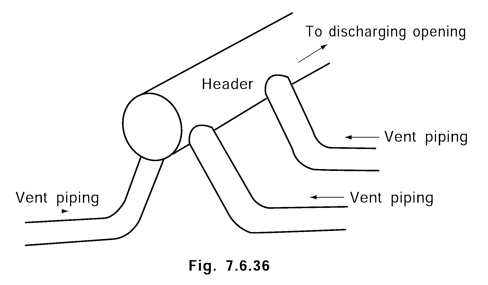
- **2.** **Controlled tank venting system 【 See Rule】**
  - **(1)** The words "such individual vents on the pressure side only may be combined into a common header or headers, with due regard to cargo segregation" referred to in **803. 2** of the Rules mean as follows :
    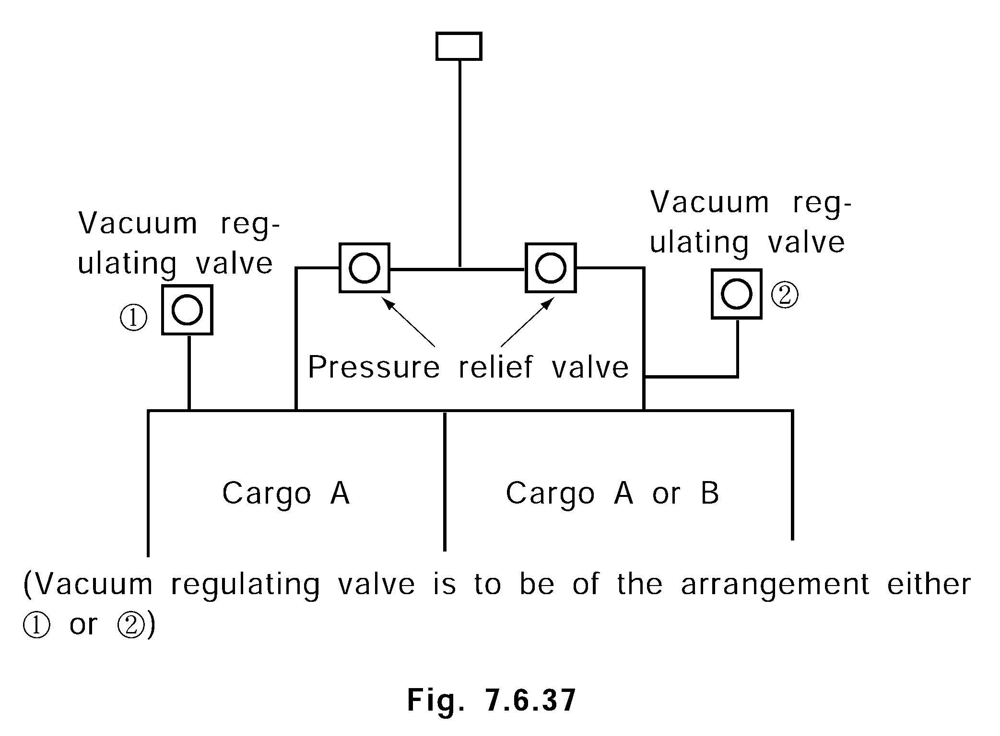
    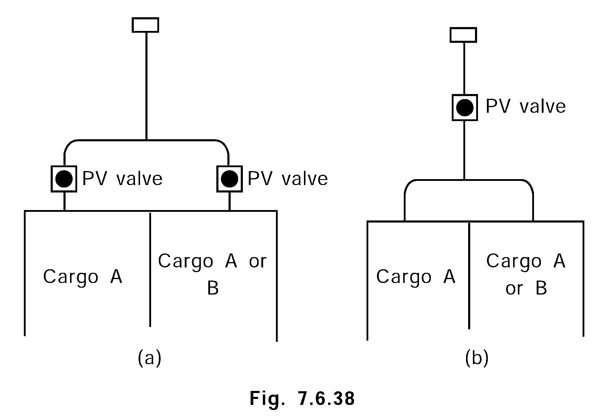
    - **(A)** In case where the controlled venting systems of the cargo tanks carrying the cargoes different from each other or the same cargoes are led to a common pipe header, the pressure relief valves and vacuum regulating valves are to be separate from each other, and any other arrangement than that given in Fig **7.6.37** of the Guidance is unacceptable. This requirement does not apply to tanks where cargoes which react in a dangerous manner are carried.
    - **(B)** When PV valves whose pressure side and vacuum side are led to the common pipe for the vent system of the cargo tank intended to carry cargoes different from each other or the same cargos are used, any arrangement other than the venting system independent for each tank is unacceptable. Accordingly, both the arrangements given as (a) and (b) of **Fig 7.6.38** of the Guidance are unacceptable.
  - **(2)** The measurement of the height of vent outlet "not less than 6 $\mathrm{m}$ above the weather deck" referred to in **803. 4** (1) of the Rules is to be taken as given in Fig **7.6.39** of the Guidance. As for the height of the opening of the vacuum regulating valve, it is to be not less than 760 $\mathrm{mm}$ above the freeboard deck for the cargo to which application of **1516. 1** of the Rules is not required. **【See Rule】**
    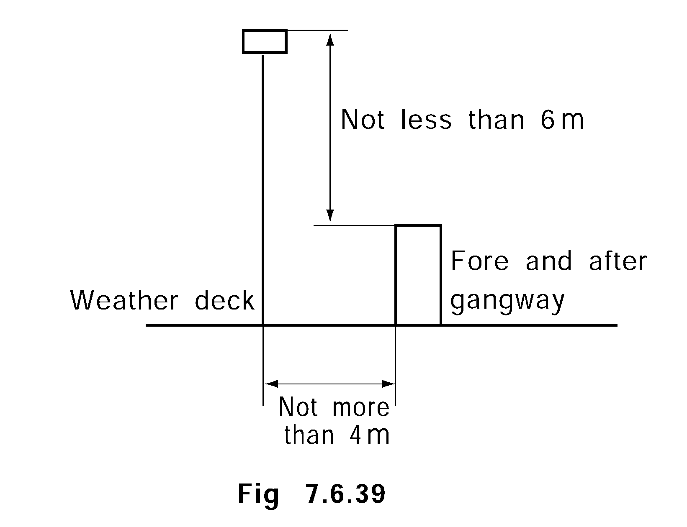
  - **(3)** As the countermeasures against the "freezing of cargo vapour or by icing up in adverse weather conditions" referred to in **803. 7** (3) of the Rules, ships operated in cold zone are to be provided with heating systems, etc. for the prevention thereof. In ships not provided with special heating systems, proper maintenance and inspection work procedures are to have been established. **【See Rule】**
  - **(4)** PV valves referred to **803. 2** of the Rules are to be type approved by the Society. The pressure setting, installation, tests and marking of the PV valves are to comply with the requirements of **Pt 8, Ch 9, 501** of the Guidance.
  - **(5)** Devices to prevent the passage of flame(including high velocity valves) referred to **803. 5** and **6** are to be type approved by the Society. The design, arrangement, inspection and etc., are to comply with the requirements of **Pt 8, Ch 2, 403. 2** of the Guidance. **【See Rule】**

#### 806. Cargo tank gas-freeing 【 See Rule】

- **1.** The method and instruction of cargo tank gas-freeing are to be described on the Cargo Operation Manual in detail.
- **2.** Openings for gas-freeing are to be arranged at places as far as at least the distance specified in **803.** or **1512.** of the Rules from all openings or air intakes of accommodation or service spaces.

### Section 9 Environmental Control

#### 901. General 【 See Rule】

- **1.** **Inerting or padding of cargo tanks**
  - **(1)** The inert gas supply system for ensuring "sufficient inert gas available on the ship to compensate for normal losses during transportation" referred to in **901. 3** (1) of the Rules is to be as follows : **【See Rule】**
    - **(A)** The nitrogen gas generating system that separates nitrogen from the air may be used in combination of the inert gas contained in a pressure vessel as a make-up system at sea.
    - **(B)** The required quantity of inert gas to be carried onboard the ship is to be taken into consideration for the ship’s structure, equipment and the expected loss that may occur during actual operation of ship, and the related calculation data is to be submitted. In addition, the above is to be reflected in the Cargo operation manual.
  - **(2)** The "means to be provided for monitoring" referred to in **901. 3** (4) of the Rules are to be as follows : **【See Rule】**
    - **(A)** Continuous monitoring system
      - **(a)** Continuous monitoring by fixed oxygen content meter, or
      - **(b)** Combined use of continuous pressure measurement of tank atmosphere and portable oxygen content meter.
    - **(B)** In the case of the cargo where the "closed type" is required for measurement instruments and inerted method is applied, the measurements by a portable oxygen content meter are to be taken at such measuring line from which no cargo is leaked onto the deck during and after the measurements, and means are provided to lead the exhaust gas to the cargo vent lines. In the case of the cargo where the "restricted type" is required, means are to be provided so that the opening for measurement are automatically closed.
- **2.** **Environmental control for double hull spaces, etc.**
  Ventilation, inerting and gas measurement for double hull and double bottom spaces are to comply with **Pt.8, Ch 2, 405. 1 (3), 407. 2** and **408.** of the Rules. *(2023)*

### Section 10 Electrical Installations

#### 1001. General

- **1.** **Electrical equipment installed in the flammable atmosphere 【 See Rule】**
  - **(1)** The words "to the satisfaction of the Society" referred to in **1001. 5** of the Rules are to be in accordance with the following (A) or (B) :
    - **(A)** Those complying with the requirements in **Pt 6, Ch 1, Sec 9** of the Rules, and having apparatus groups and temperature classes given in column i in table of **Sec 17** of the Rules according to the type of gas.
    - **(B)** Explosion-protected electrical equipment in **Pt 6, Ch 1, Sec 9** of the Rules and having type approval by the Society.
    - **(C)** Those approved as having no structural hazard to serve as a source of ignition.

#### 1002. Bonding

- **1.** **Bonding 【 See Rule】**
  In application to **1002.** of the Rules, the electrical bonding is to conform to the requirements of **Pt 6, Ch 1, 201. 3** of the Rules. In case where the gasketed flange joint are used, the flange bolts only are not considered as an earthing, and the connections and earthing are to be provided with earthing conductors.

### Section 11 Fire Protection and Fire Extinction

#### 1102. Cargo pump rooms 【 See Rule】

- **1.** **Fire-extinguishing system for the ships dedicated to the service of a restricted number of cargoes**
  The term "an appropriate fire-extinguishing system approved by the Society" referred to in **1102. 2** of the Rules means fixed carbon dioxide fire extinguishing system. The fire extinguishing system for ships carrying only the restricted number of cargoes as defined "No" in column $l$ in table of **Sec 17** of the Rules is left to the discretion of the Society.

#### 1103. Cargo area

- **1.** **Type of foam concentrate 【See Rule】**
  - **(1)** The "regular protein foam" referred to in **1103. 2** of the Rules means the foam without either any agents or anti-frozen agents added to be leveled the liquid point not higher than 0°C.
  - **(2)** Where plural fire extinguishing agents including foam are defined effective in column $\mathrm{l}$ in table of **Sec 17** of the Rules, foam fire extinguishing system is to be provided.
- **2.** **Arrangements for providing foam 【 See Rule】**
  For the purpose of the requirements in **1103. 3** of the Rules, the arrangements for providing foam are to be as follows :
  - **(1)** For the deck area of cargo tanks, reference is to be made to Fig **7.6.40** of the Guidance.
  - **(2)** In supplying foams to inside the cargo tanks, access hatches, etc. may be used.
    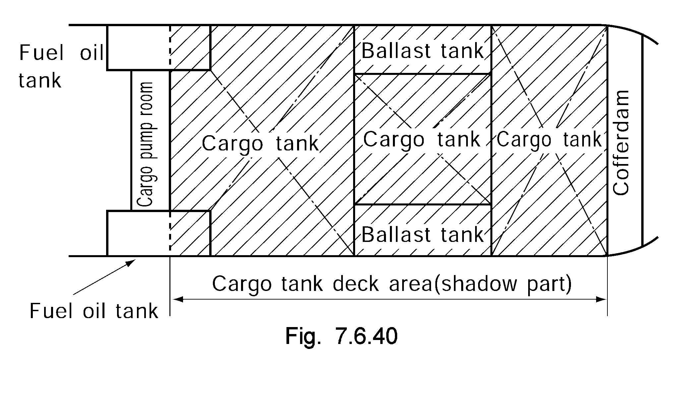
- **3.** **Rate of supply of foam solution 【 See Rule】**
  For the purpose of the requirements in **1103. 5** (3) of the Rules, the minimum capacity of the monitor for ships less than 4,000tons deadweight is to be 1,000 $l$ per minute and the rate of spray may be set at 10 $l/\mathrm{m} ^{2} /mi n$.
- **4.** **Specification of monitor and foam applicator 【 See Rule】**
  For the purpose of the requirements in **1103. 7** of the Rules, for the monitor and foam applicator for ships less than 4,000 $\mathrm{t} ons$ deadweight, the requirements in preceding 3 are to apply correspondingly.
- **5.** **Requirements of fire main 【 See Rule】**
  For the purpose of the requirements in **1103. 12** of the Rules, the fire main is to be capable of discharging at least two lines of water jet on deck, accommodation space, control rooms and machinery space during the fire-fighting operation by foam.
- **6.** **Alternative provisions installed in ships dedicated to the carriage of a restricted number of cargoes 【 See Rule】**
  The fire extinguishing systems for ships carrying the cargoes defined "No" in column l in table of **Sec 17** of the Rules are left to the discretion of the Society.
- **7.** **Portable fire-extinguishing equipment 【 See Rule】**
  As portable fire-extinguishing equipment, two fire extinguishers with a capacity of 9 $l$ to 13.5 $l$ using the fire-extinguishing agents suitable for the type of cargo carried are to be provided at each manifold. These fire extinguishers are to be stored at suitable places except for the time of cargo operation.
- **8.** **Exclusion of sources of ignition 【 See Rule】**
  For the purpose of the requirements in **1103. 15** of the Rules, the windlasses and chain lockers are to be regarded as sources of ignition and are not to be provided in the dangerous compartments given in **1002.** of the Rules. The relevant requirements in **Pt 8, Ch 2** of the Rules are also to be complied with.

#### 1104. Special requirements

- **1.** **Special requirements 【 See Rule】**
  - **(1)** For ships dedicated to exclusive carriage of one type of cargo relating to the fire-extinguishing installation given in column l in table of **Sec 17** of the Rules, either one of the alternative fire-extinguishing equipment specified therein may be selected and provided notwithstanding the requirements in column l. Further, the fire-extinguishing arrangements in ships carrying only the cargo defined "NF" in column i and "No" in column $l$ in table of **Sec 17** of the Rules are to be such that any places on deck within the cargo area can be covered by water spray from at least two lines of fire nozzles discharged from separate fire hydrants.
  - **(2)** The capacity of fire-extinguishing agent of dry chemical fire extinguishers is to be the greater or more of the following capacities :
    - **(A)** The capacity required in **Ch 5, 1104. 6** of the Rules.
    - **(B)** 1.5 $\mathrm{kg}/m ^{2}$ of the total deck area of the cargo tanks which are expected to carry simultaneously the cargo for which the fire-extinguishing equipment is required. For other requirements for installations, the requirements in **Ch 5, 1104.** of the Rules apply correspondingly.
  - **(3)** The "C-water spray" required in column $l$ in table of **Sec 17** of the Rules as the fire-extinguishing equipment of "ammonium solution of 28 % or less" may be replaced with the water spray from the fixed deck foam system.

### Section 12 Mechanical Ventilation in the Cargo Area

#### 1201. Spaces normally entered during cargo handling operations 【 See Rule】

- **1.** **Ventilation prior to entering the compartment**
  For the purpose of the requirements in **1201. 2** of the Rules, the ventilating period before the entrance of person in the compartments is to be 15 minutes as standard.
- **2.** **Type of ventilation systems**
  For the purpose of the requirements in **1201. 4** of the Rules, the ventilation ducts in cargo pump room are to be provided at the upper part of cargo pump room, and in addition, to be arranged in compliance with the requirements in **Pt 7, Ch 1, 105.** of the Rules. Further, the suction openings are to be arranged as far apart as practicable from each other, for instance on a diagonal line of cargo pump room, in consideration of the vapour density of the cargo and air intaking efficiency.
- **3.** **Arrangement of ventilation intakes**
  For the purpose of the requirements in **1201. 6** of the Rules, the ventilation intakes are to be so arranged as to minimize the possibility of recycling hazardous vapours.
- **4.** **Arrangement of ventilation ducts**
  For the purpose of the requirements in **1201. 7** of the Rules, in view of the difficulties involved in the maintenance when protection against the approved type of cargo to be carried is required, the location of ventilation ducts on the bulkhead bounding the cargo pump room and machinery room as given in Fig **7.6.41** of the Guidance is not allowed.
  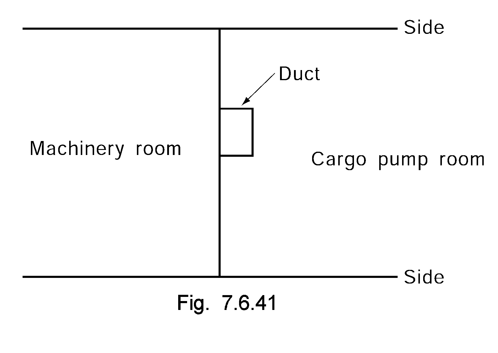
- **5.** **Requirements of electric motors driving fans**
  In application of **1201. 8** of the Rules, the ventilation fan "of non-sparking construction" is to be comply with the requirements specified in **Pt 8, Ch 2, 201. 4** of the Rules.
- **6.** **Spare parts for fan**
  For the purpose of the requirements in **1201. 9** of the Rules, one spare impeller is to be provided for each type of fan.
- **7.** **Protection screens fitted in the opening of ventilation ducts**
  For the purpose of the requirements in **1201. 10** of the Rules, the protection screens may be of wire gauze of 13 $\mathrm{mm}$ × 13 $\mathrm{mm}$ mesh. However, the wire gauze is to have suitable strength against the falling impact of foreign objects.

#### 1202. Pump rooms and other enclosed spaces normally entered 【 See Rule】

- **1.** In application to **1202.** of the Rules, the following requirements are to be complied with :
  - **(1)** The requirements in **1202.** of the Rules apply irrespective whether the control system of the pumps and valves in the pump room is provided outside the pump room or not.
  - **(2)** The pump room and other enclosed spaces normally entered are to have 20 air changes per hour and, in addition, the requirements in **1201.** of the Rules are to be complied with. In enclosed spaces normally entered, the special lockers and storage rooms specified in **1401. 2** of the Rules and suitable clearly marked locker specified in **1402. 5** of the Rules which are readily accessible for persons are to be included. However, for the enclosed small spaces where the maximum travel distance to the door is 5 $\mathrm{m}$ or less, it is difficult to install the fixed ventilation system, portable ventilation system may be permitted.
  - **(3)** The ballast pump room where no cargo piping whatever penetrates therethrough or where cargo pipings without having flange joints and valves penetrate therethrough is to be dealt with in accordance with the following requirements :
    - **(A)** The exhaust outlet of the mechanical ventilation fans of the ballast pump room may not undergo the restriction to its location specified in **1201. 5** of the Rules.
    - **(B)** The exhaust inlet and outlet of the mechanical ventilation fans serving the ballast pump room is to be provided with a protective wire gauge of 13 $\mathrm{mm}$ × 13 $\mathrm{mm}$ mesh.
    - **(C)** For the exhaust ventilation fans of the ballast pump room, spare parts as required for the ventilation fans of cargo pump room are to be provided for each type.
    - **(D)** The fire hydrants are to be provided as the fire-extinguishing arrangement of the ballast pump room, but no fixed gas fire-extinguishing system is required.

#### 1203. Spaces not normally entered 【 See Rule】

- **1.** **Spaces not normally entered**
  The ventilation system provided in spaces not normally entered is not allowed to be the natural ventilation alone. Where a fan is provided in the permanent duct, eight air changes per hour, and where no permanent duct is provided, sixteen air changes per hour are to be provided.

### Section 13 Instrumentation

#### 1301. General 【 See Rule】

- **1.** **Types of gauging devices**
  - **(1)** The openings for the restricted device and closed device of the types of gauging devices referred to in **1301. 1** of the Rules are to comply with the following requirements:
    The inside diameter of the opening is to be not more than 200 $\mathrm{mm}$ for both sounding pipe and ullage hatch and to be provided with self-closing type pipe head fitting. For cargo tank sounding/ullage measuring, the device is to be of the gas seal valve capable of being fitted with a measuring device of the construction restricting a massive leakage of cargo vapour. Glazed peeping window is to be provided separately as necessary.
    The closed construction is to be of all welded construction, as a rule, but flange construction for periodic inspection which is normally not open may be accepted as the closed device.
    - **(A)** Restricted device :
    - **(B)** Closed device :
  - **(2)** In types referred to in **1301. 1** (1), (2) and (3) of the Rules, the closed type may serve commonly with open type and restricted type, and the restricted type, with open type respectively. Namely, the degree of safety is the highest in the closed type followed by the restricted type and then open type, thus it descends in the order of description. In the cargo tank where loading of the cargo required to be provided with the closed devices is expected, restricted devices may be provided in addition to closed devices. In more specific terms, in case where carriage is made of the cargo for which the use of closed devices is required, only the closed devices are to be used, but when carriage is made of the cargo in this tank for which the use of restricted devices is required, either of the closed devices and/or restricted devices may be used. However, for tanks where use of either the closed devised or restricted devices is required, open devices are not to be provided from the safety point of view.
  - **(3)** Where peeping windows are provided as a means of gauging device, their construction, liquid and gas sealing performance are to be equivalent to that of tank top, and are to be fitted with protective covers of sufficient strength.
  - **(4)** The fitting of a gauging device on the bulkhead of tank with a flange is not allowed under any circumstances. Namely, the gauging device is to be housed in a recessed pipe as shown in Fig **7.6.42** of the Guidance.
    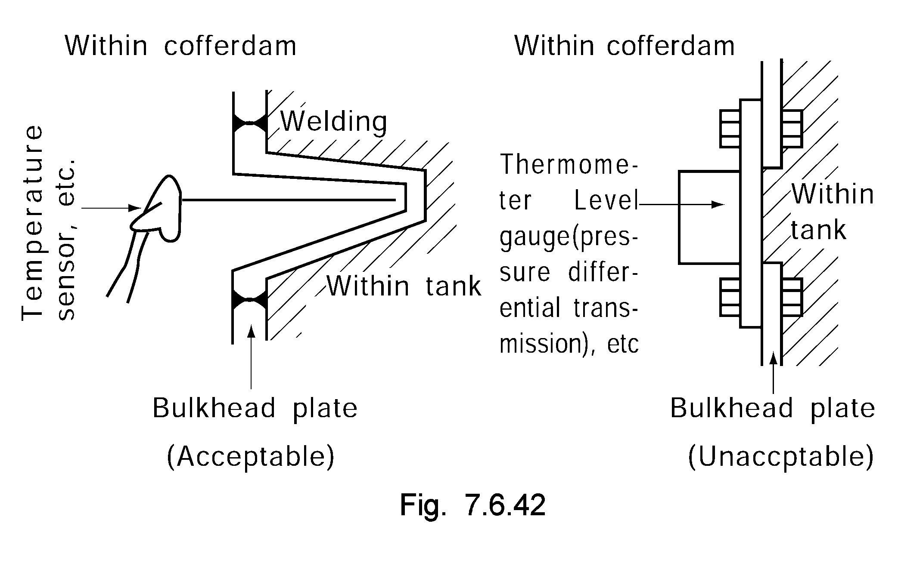
  - **(5)** The performance and construction of liquid level indicator are to have been approved in accordance with the Guidance for the Approval of Manufacturing Process and Type Approval, Etc.
  - **(6)** The tests (pressure, temperature, etc.) and inspection for other gauging devices are to be comply with the following requirements (A) and (B). However, the performance test does not necessarily require a test using the real cargo if as the effect of the device can be verified.
    Performance tests are to be conducted using the real cargo according to the test plan prepared by the manufacturer. However, in the case of devices which are of the same type previously approved, the performance test using the real cargo may be omitted on approval by the Society. In the case of fixed type device, tests and inspection are to be arranged in accordance with the shipboard test plan approved by the Society.
    For the gauging devices and equipment fitted onboard the ship, the data specifying the following items (the data are to have been approved by the Society) are to be placed onboard the ship.
    - **(A)** Testing procedure at time of manufacture
    - **(B)** Reinspection and retesting procedures onboard.
      - **(a)** Check procedure before use (including the testing procedure)
      - **(b)** Check procedure during use (including the testing procedure)
      - **(c)** The periodical check procedure established by the manufacturer and service frequency
      - **(d)** Service life
      - **(e)** Tests and inspection procedures at periodical inspection
      - **(f)** Other precautions

#### 1302. Vapour detection 【 See Rule】

- **1.** **Requirements for some products which are not available with toxic vapour detection**
  In case where a suitable vapour detection instrument for a specific cargo is not available, approval from the Society is to be obtained. However, it is desirable that fixed type vapour detection instruments are installed as far as such are available. At least against carbon disulfide and chlorsulfonic acid, fixed type vapour detection instruments are to be provided.

### Section 14 Personnel Protection

#### 1401. Protective equipment

- **1.** **Requirements for work clothes and protective equipment 【 See Rule】**
  Work clothes and protective equipment specified in the requirements in **1401. 1** of the Rules are to be capable of protecting the entire body of the wearer against cargo splashes in all directions, and the number of sets necessary for those working on deck and in cargo pump room are to be provided. Where one type of work clothes or protective equipment is not sufficient for all prospective types of cargo of the ship, necessary number of sets for respective types of cargo is to be provided.
- **2.** **Lockers for work clothes and protective equipment 【 See Rule】**
  The protective equipment used for once or more to handle the cargo to which the requirements in **Ch 6** of the Rules apply are, as a rule, to be stored in the lockers provided within the cargo area. One set of these is to be stored in the locker near the cargo pump room at all times. The construction of the special locker for the storage of protective equipment provided in the cargo area is to comply with the requirement in **Pt 3, Ch 17** of the Rules. When this can not be complied with under unavoidable reasons, protective equipment may be stored in the store room or locker having no openings to accommodation space and service space and located outside the cargo area as shown in Fig **7.6.43** of the Guidance. This requirement does not apply to brand new protective equipment, unused equipment, or equipment which has not been used since undergoing a thorough cleaning process.
  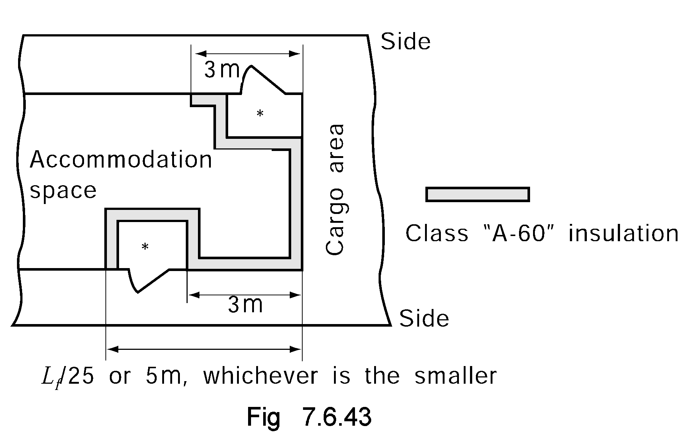

  | * : When the storage place of protective equipment is provided within the accommodation space or service space, such is only allowed at areas with openings as specified in **302. 3** of the Rules. In this case, it is desirable to provide showers, etc. within the room. the location of the store room of cargo specimens referred to in **1605. 4** of the Rules is to be dealt with in the same manner as above. |
  | --- |

#### 1402. Safety equipment

- **1.** The number of safety equipment is to be determined after carefully studying the arrangement and scheme of shipboard working persons. **【See Rule】**
- **2.** The safety equipment specified in **1402. 2** of the Rules is to comply with the following requirements : **【See Rule】**
  - **(1)** The term "perform work for at least 20 min." means a capacity in terms of the free air volume at atmospheric pressure is 800 $\mathrm{litres}$ or more.
  - **(2)** Work clothes and protective equipment of excellent acid-resisting, alkali-resisting and anti-toxic features against the types of prospective cargo are to be used. No duplicated use of work clothes and protective equipment with those required under **1401. 1** of the Rules, in number, is permitted.
  - **(3)** The length of the fire-resisting life line is to be 30 $\mathrm{m}$ or more so that it can be used also for signalling between the person who enters the enclosed compartment and the other person outside the compartment.
  - **(4)** The explosion-proof light is to be capable of lighting for a period not less than 3 hours.
  - **(5)** The suits for toxic cargoes are to be fitted with integral gloves and boots.
- **3.** The air compressor referred to in **1402. 3** (2) of the Rules is to be capable of charging the air bottles placed onboard to their maximum working pressure. **【See Rule】**
- **4.** The additional requirements for the cargo pump room of ships carrying cargo for which no effective vapour detection instruments are provided are to be as given in the following (1) and (2) : **【See Rule】**
  - **(1)** The additional air bottles for the work in the cargo pump room of ships carrying toxic cargo without being provided with effective vapour toxicity detection instruments are to be provided in addition to the number of spare air bottles specified in **1402. 3** of the Rules.
  - **(2)** The capacity of the equivalent air bottle in replacement with the low pressure air piping as an additional air breathing apparatus is to be not less than 4,800 $\mathrm{litres}$ under the atmospheric pressure.

#### 1403. Emergency equipment

In application to **1403. 2** of the Rules, reference is made to the Medical First Aid Guide for use in Accidents Involving Dangerous Goods (MFAG), which provides advice on the treatment of causalities in accordance with the symptoms exhibited as well as equipment and antidotes that may be appropriate for treating the casualty. **【See Rule】**

### Section 15 Special Requirements

#### 1502. Ammonium nitrate solution, 93 % or less

- **1.** **Temperature of the heat exchanging medium in the tank heating system 【 See Rule】**
  For the requirements in **1502. 4** of the Rules, the temperature alarm is to be of visible and audible alarm. The detecting temperature is to be the mean temperature within the tank, but the heating system is to be so arranged to avoid uneven heating.
- **2.** **Fixed installation for ammonia gas injection system 【 See Rule】**
  For the requirements in **1502. 6** of the Rules, where ammonia gas is injected into cargo, the cargo is to be circulated during the injection being made.
- **3.** **Type of cargo pump**
  The sealing system of centrifugal pump is to be of the stuffing box provided with lantern rings as shown in Fig **7.6.44** of the Guidance and the pressurized fresh water is to be injected into the stuffing box from lantern rings.
  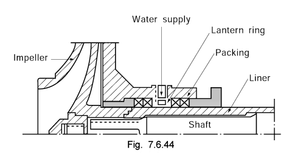

#### 1503. Carbon disulphide

- **1.** **Opening for emergency sounding 【 See Rule】**
  The opening for emergency sounding is to be provided with sluice valve and cock fitted with automatic closing devices. Further, warning signs banning their use other than in emergency cases are to be fitted.

#### 1505. Hydrogen peroxide solutions 【 See Rule】

- **1.** **Fixed water spray system**
  When the rate and estimated size of the spill referred to in **1505. 1** (10) (B) of the Rules are calculated, the piping and hoses are to be considered to have undergone total loss.

#### 1508. Propylene oxide and mixtures of ethylene oxide/propylene oxide with an ethylene oxide content of not more than 30 % by weight 【 See Rule】

- **1.** **Conditions of carriage**
  The nitrogen gas produced by the membrane type nitrogen gas generator capable of ensuring a purity of 99 % or more by volume may be used as the nitrogen gas to be sealed.

#### 1510. Sulphur, molten 【 See Rule】

- **1.** **Cargo temperature control system**
  For the requirements in **1510. 6** of the Rules, the cargo temperature control system may employ manual temperature control trip, etc. provided that the cargo tanks are equipped with cargo temperature indicators and high/low temperature alarms. In this case, tank temperatures are to be so monitored and controlled as not to allow them to exceed 155°C at any points of measurement. In case where the heating medium does not exceed 155°C, the requirements here may be reduced to the temperature indicator only. **【See Rule】**
- **2.** The double pipes or effective devices are to be provided so that cargo pipe or ventilation pipe is not to be solidified.

#### 1511. Acids

- **1.** **Anti-corrosive treatment 【 See Rule】**
  For the purpose of the requirements in **1511. 2** of the Rules, the use of lining or corrosion-resistant materials is to be applied also to the boundary walls of cargo pump room (the bottom and boundaries to a height of 1 $\mathrm{m}$ from the bottom). Where the effectiveness of lining or corrosion-resistant materials is not verified, the boundary walls are to be used corrosion-resistant materials. In this case, "lining" is an acid-resistant material that is applied to the tank or piping system in a solid state i.e. not spray on. The requirement for the elasticity of a lining to be not less than the supporting boundary plating is to prevent debonding at the interface between the lining and the lined surface. *(2023)*
- **2.** **Means of guard against the danger of cargo being sprayed and leakage 【 See Rule】**
  For the purpose of the requirements in **1511. 4** of the Rules, the shields to guard against the danger of cargo being sprayed and leakage are to be of acid-resistant materials.
- **3.** **Segregation of cargo from oil fuel tanks 【 See Rule】**
  For the purpose of the requirements in **1511. 6** of the Rules, in segregating cargo tanks carrying cargoes or cargo residues from oil fuel tanks, none of facial contacts, linear contacts and point contacts are accepted.
- **4.** **Apparatus for detection of leakage of cargo 【 See Rule】**
  For the purpose of the requirements in **1511. 7** of the Rules, the apparatus for detection of leakage of cargo is to be of the pH meter and hydrogen detector. These apparatuses may be of portable ones. Further, alternative means such as litmus papers may also be used.
- **5.** **Material of bilge pumping and drainage arrangements in cargo pump room 【 See Rule】**
  For the purpose of the requirements in **1511. 8** of the Rules, underneath the cargo pumps and associated flange joints, drain pans are to be provided and the collected drains are to be led to bilge wells through the drain lines. These drain lines are to be formed by corrosion-resistant materials or to be applied with effective coatings. Where the bottom of the cargo pump room and its casing walls to a height of 1m from the bottom are made corrosion-resistant, the requirements may be dispensed with.

#### 1512. Toxic products 【 See Rule】

- **1.** The tank venting systems referred to in **1512. 2** of the Rules are to be provided with the stop valve on return line to shore installation.

#### 1513. Cargoes protected by additives

- **1.** In application to **1513. 3** (2) of the Rules, if the additive is oxygen-dependent, the minimum level of oxygen required in the vapour space of the tank for the inhibitor to be effective is to be specified. (**MSC-MEPC.2/Circ.14**) **【See Rule】**
- **2.** In application to **1513. 3** (2) and **5** of the Rules, when a product containing an oxygen-dependent inhibitor is carried on a ship for which inerting is required under **SOLAS chapter II-2/4.5.5**, the inert gas system is to be operated as required to maintain the oxygen level in the vapour space of the tank at or above the minimum level of oxygen required under the Rules and as specified in the Certificate of Protection. (**MSC-MEPC.5/Circ.10) 【 See Rule】**

#### 1514. Cargoes with a vapour pressure greater than 0.1013 MPa absolute at 37.8°C

- **1.** For the purpose of the requirements in **1514. 4** of the Rules, the tank venting systems are to be provided with the stop valve on return line to shore installation. **【See Rule】**

#### 1516. Cargo contamination 【 See Rule】

- **1.** **No contamination of cargo with alkali or acidic materials**
  In segregating the cargo tanks carrying cargo to which the requirements in **1516.** of the Rules apply and the cargo tanks carrying cargo of either alkalinity or acidity, none of facial contacts, linear contacts and point contacts are accepted. Further, segregation of cargo pipes and tank venting systems is required.
- **2.** **No contamination with water** ***(2021)***
  - **(1)** The "permanent ballast or water tanks unless the tanks are empty or dry" referred to in **1516. 2** (3) of the Rules means that the tank casings, frames, etc. are free from attachments of water droplets or from moistened condition. In the cargo tanks adjacent to permanent ballast or water tanks not maintained in dry condition, no cargo to which the requirements in **1516. 2** of the Rules apply is to be carried. In this case, none of linear contacts and point contacts are accepted. However, the linear contacts and point contacts divided into the cross welding such as Fig **7.6.45** may be accepted.
    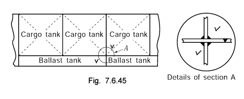
  - **(2)** Where cargo that reacts dangerously with water is carried in the cargo tank adjacent to ballast tanks, the ballast tank is to be made in dry condition and, at the same time, it is to be ensured that there is no possibility of introducing ballast water thereto by erroneous operation.
  - **(3)** Where cargo that reacts dangerously with water is heated, the thermal oil installations or the other indirect heating installations are to be provided.

#### 1517. Increased ventilation requirements 【 See Rule】

- **1.** **Increased ventilation requirements**
  The "work areas or other similar spaces" referred to in **1517.** of the Rules are the service spaces, cargo control rooms and other similar spaces but not include cargo manifolds where cargo operation is carried out.

#### 1518. Special cargo pump room requirements 【 See Rule】

Under any circumstances, no cargo pump room is arranged directly below open deck. Namely, for tanks carrying the cargo to which the requirements in **1518.** of the Rules apply, either submerged type cargo pump is to be provided therein or cargo pump room is to be provided on open deck.

#### 1519. Overflow control

- **1.** **Test of level alarm 【 See Rule】**
  In the test of alarms carried out prior to loading, their functions are to be capable of being tested by actual operation of level gauges. When verification by actual operation is impracticable, suitable means to verify that the alarm circuits in normal condition as shown in Fig **7.6.46** of the Guidance is to be provided.
  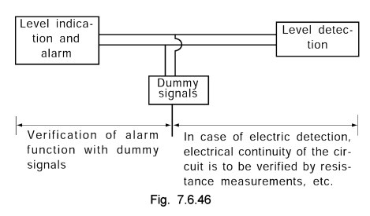
- **2.** **Independence of high level alarm 【 See Rule】**
  For cargoes required to have high level alarm system and overflow control system in the requirements, the provisions of closed type instruments are required in many cases. For such tanks, the following detecting ends are required :
  The above detecting ends (A), (B) and (C) are to be separate from each other. However, only for pipes to which the detecting ends of (B) and (C) (limit switch, float, electric device, etc.) are fitted, they may serve commonly. The electric, pneumatic or hydraulic circuits required for the detecting ends of (A), (B) and (C) are to be independent so that defect in one circuit may not cause functional disability in other circuits. In case where process units are provided on bridge, etc. for the purpose of visual display, the electric circuits concerned are to be independent at least up to the point of display. Power is to be supplied from distribution box.
- **3.** **Installation of high level alarm 【 See Rule】**
  When modular units are provided in the control room or on bridge as high level alarms specified in **1519. 6** of the Rules, level indicators and visible alarms independent from those (A), (B) and (C) given in the preceding 2 are to be provided. Visible and audible alarms are to be provided also at the such locations readily recognizable also from the cargo areas and visible alarms are to be provided at such locations readily recognizable also from shore side. In case where no control room is provided, audible and visible alarms are to be provided in the cargo control room. Except for entering the cargo tanks which have thoroughly been washed clean, the testing device for detecting ends is to be provided outside the tank. Simulation test of electric circuit or self-monitoring circuit may be accepted.

### Section 16 Operational Requirements

#### 1601. Maximum allowable quantity of cargo per tank 【 See Rule】

The maximum allowable quantity of cargo specified in **1601.** of the Rules is to be determined in consideration of the thermal expansion of the cargo at temperature of 45°C Care is to be taken so as to ensure that the open ends of the venting system in the tank may not submerge in the cargo but in the gaseous phase under any trim condition of the ship at sea. Further, the maximum allowable quantity of cargo in cases where the tank temperature will possibly exceed 45°C being affected by tank heating is to be determined on the basis of such a temperature.

#### 1604. Opening of and entry into cargo tanks 【 See Rule】

Covers of the cargo tank specified in **1604.** of the Rules, ullage hole covers and peeping hole covers or tank cleaning hatch covers are not to be opened except for cases where air is intaken in gas free operation, tank washing operation, gauging is taken of the tanks requiring the open devices and restricted devices and during gas detection and when samples are being taken.

#### 1605. Stowage of cargo samples 【 See Rule】

When the stowage of cargo samples is made within the cargo area, such stowage compartment is to be only accessible directly from the exposed areas of the ship provided with exhaust type independent mechanical ventilating fan capable of ensuring twenty air changes or more per hour. Where it is difficult to install the permanent ventilation system due to the confined stowage compartment, portable ventilation system may be permitted. However, for the stowage small compartment where the maximum travel distance to the door is 5 $\mathrm{m}$ or less, it is difficult to install the fixed ventilation system, portable ventilation system may be permitted.

#### 1606. Cargoes not to be exposed to excessive heat 【 See Rule】

In case where the tank carrying the cargo which is not to be exposed to excessive heat is subjected to tank heating or where the tank is adjacent to other tanks (cargo tanks, oil fuel tanks, etc.) which are heated, fixed type thermometers and temperature alarms are to be provided. 
