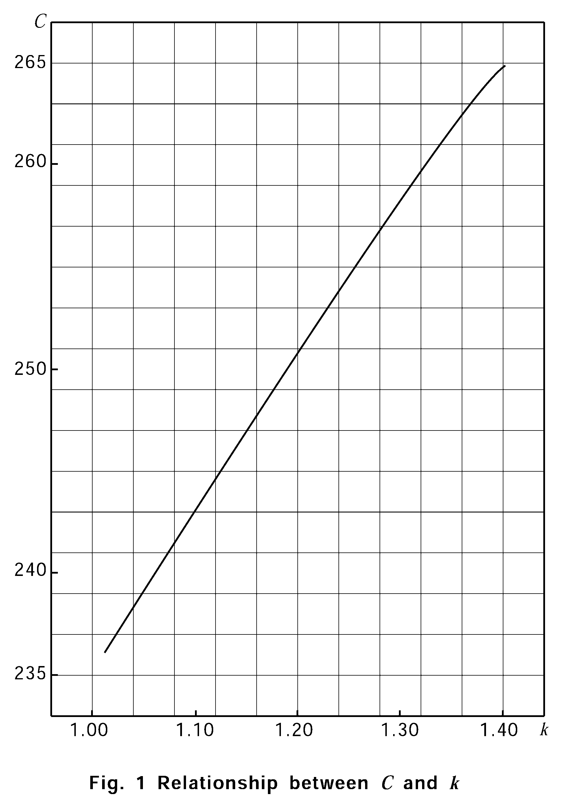

# PART 7 Ships of Special Service (CH5, 6)

> RULES FOR CLASSIFICATION OF STEEL SHIPS / RA-07B-E / 2025 / EN / Guidance

## Annex 7A-1 Requirements for Ships not having the International Certificate of Fitness for the Carriage of Liquefied Gases in Bulk 【See Rule】

### Section 1 General

#### 101. Application

- **1.** The construction, equipment and survey of ships intended to be classified as liquefied gas carriers not having the International Certificate of Fitness for the Carriage of Liquefied Gases in Bulk are to be in compliance with the requirements in this Annex. "Liquefied gas carrier" in this Annex means a ship designed to contain and carry liquid dangerous cargoes in bulk having a vapour pressure (the pressure is expressed in gauge, and the same is to apply hereinafter) of 2 $\mathrm{kg}/cm ^{2}$ or above at a temperature of 38°C. However, the tests prescribed in **104. 2** (10) of Annex may be omitted by carrying out at the time of initial cargo handling of the ship.
- **2.** General items not specified in this Annex, are to conform to the requirements specified in the relevant Parts of the Rules.
- **3.** As for construction and equipment as well as surveys of liquefied gas carriers intended to carry cargoes having different properties from the liquefied petroleum gas, special consideration is to be paid according to the properties of the cargoes.
- **4.** Loading facilities of liquefied gas carriers which are different from those specified in this Annex may be accepted by the Society, provided that those facilities are deemed equivalent to those required in this Annex.
- **5.** The requirements of **Sec 2** in this Annex apply to pressurized liquefied petroleum gas carrier and the requirements of **Sec 3** apply to low temperature liquefied petroleum gas carriers. Ships, however, which are intended to transport liquefied petroleum gas at temperature below -50°C, are to be at the discretion of the Society.

#### 102. Definitions

The definition of each nomenclature in this Annex is as follows :

- **1.** The "pressurized liquefied petroleum gas carriers" mean the ships intended to contain and transport of the liquefied petroleum gas with the vapour pressure of 0.2 $\mathrm{MPa}$ or above at 38°C in storage tanks permanently attached to hull structure at atmospheric temperature and under pressurized condition.
- **2.** The "low temperature liquefied petroleum gas carriers" mean the ships intended to contain and transport liquefied petroleum gas with vapour pressure of 0.2 $\mathrm{MPa}$ or above at 38°C, in fixed, independent from hulls and self-supporting type tanks thermally insulated from outside, at or near the atmospheric pressure under refrigerated condition.
- **3.** For the pressurized liquefied petroleum gas carriers, tanks include storage tanks and auxiliary tanks. Storage tank is a storage tank specified in preceding **1** and auxiliary tank is a tank to provide forced pressure head to cargo pumps.
  For the low temperature liquefied petroleum gas carriers, tanks are the tanks specified in preceding **2** in which liquefied petroleum gas is loaded.
- **4.** Tank hold is a compartment in which storage tanks of preceding **1** and tanks of preceding **2** are installed.
- **5.** Liquid is liquid phase of liquefied petroleum gas.
- **6.** Gas is gaseous phase of liquefied petroleum gas.
- **7.** Dangerous space is the space where inflammable or explosive substances are placed and where those are stored or are liable to escape into. For ships prescribed in this Annex, at least, following compartments and areas are to be considered as dangerous spaces:
  - **(1)** Tank.
  - **(2)** Compartment adjoining the tank.
  - **(3)** Compartment containing cargo handling machinery and equipment, such as cargo pump room, compressor room, etc.
  - **(4)** Zone or semi-enclosed space on open deck, within at least 3 $\mathrm{m}$ from any tank outlet, gas/vapour outlet, liquid outlet or cargo pipe flange.
    Tank outlet : Manhole, tank fittings
    Gas outlet : Entrances and ventilation openings of spaces specified in (3), (7) and (8) safety valves, shore connection
    Liquid outlet : Shore connection, overboard discharge pipe
    Cargo pipe means liquid and gas pipe except overboard discharge pipe
    Slip-on and screw type are considered as flanged type.
    - **(A)** Openings, as specified above, are the following openings ;
    - **(B)** Flange of cargo pipe is as follows ;
  - **(5)** Zone enclosed by the following width, height and length, on the weather deck:
    - **(A)** Full breadth of the ship ;
    - **(B)** 2.4 $\mathrm{m}$ in height above the weather deck ;
    - **(C)** Total length obtained by extending 3 $\mathrm{m}$ each in both fore and after directions, with length from leading edge of the foremost storage tank to the trailing edge of the rearmost storage tank.
    - **(D)** In the case of small ships where part of the forecastle deck corresponds to the dangerous space under the requirements of preceding (C) and when electrical equipment other than explosion-protected ones are installed between the leading edge of the foremost storage tank and extension of 3 $\mathrm{m}$ in fore direction under an inevitable reason, the following requirements are to be complied with:
      - **(a)** A steel gas barrier is to be provided on the forecastle deck.
      - **(b)** The height of the steel gas barrier is to be 2.4 $\mathrm{m}$ or more above the upper deck with the full width of the forecastle deck where the steel gas barrier is installed.
      - **(c)** The steel gas barrier is not to be provided with any opening.
      - **(d)** Electrical equipment is to be at least of the totally enclosed water-proof type.
  - **(6)** Exposed area within 2.4 $\mathrm{m}$ from the outer surface of storage tank.(in case where the tank is covered by insulator or protective enclosure, the distance is to be measured from its external surface.)
  - **(7)** Enclosed or semi-enclosed space where cargo piping is installed.
  - **(8)** Compartment where cargo hoses are stored.
  - **(9)** Enclosed or semi-enclosed space directly above the dangerous spaces prescribed in (2) or (3) above, except space which is partitioned by gastight bulkheads and is suitably ventilated. "suitably ventilated" means the mechanical ventilation separated from those for compartments specified in preceding (2), (3), (7) and (8), and the air charge rate are not limited.
  - **(10)** Any enclosed or semi-enclosed space which has a direct opening to any one of dangerous spaces prescribed in (1) to (9) above.
    The following items are not regarded as the direct openings.
    In case where double, metal self-closing doors are provided in addition to weather-tight doors, and the space between the double doors is provided with effective mechanic\l supply ventilating system which is interlocked with the non-explosion-protected electrical equipment within the compartment.
    The above (b) may a\so apply to the access opening doors specified in (a) above. The term "semi-enclosed spaces" specified in (4), (7), (9) and (10) above means the spaces separated by decks and bulkheads where the condition of ventilation is significantly different from that of exposed part of ship.
    - **(A)** For windows, manholes, etc.,
      - **(a)** Fixed type gastight portholes
      - **(b)** Bolted, gastight or watertight openings which are not necessary to be opened while the ship is at sea.
    - **(B)** For doors,
      - **(a)** In access opening doors of the living quarters on the upper deck where double, metal self-closing doors are provided in addition to weather-tight doors. Provided, however, that sufficient face-to-face contact is obtained for the self-closing type doors by applying packing to the contact face or by other adequate means.
      - **(b)** In case where double, metal self-closing doors are provided in addition to weather-tight doors for deck storeroom, etc., and the space between the double doors is provided with effective mechanical supply ventilation system.
- **8.** Void space in tank holds is an empty space around tanks in tank holds.
- **9.** Secondary barrier is a structure to hold leaked cargo for more than a fixed period so as not to lower the temperature of main hull structures below that specified in the design.

#### 103. Plans and documents to be approved

Where the loading facilities of liquefied petroleum gas are installed on board, at least, following plans and documents are to be approved by this Society.
**Pressurized liquefied petroleum gas carriers**

- **1.** Plans and documents to be submitted for approval are as follows:
  - **(1)** Specifications for manufacture of tanks including details of welding material and welding procedures.
  - **(2)** Overall assembly diagrams and details of tanks and pressure vessels including details of seats for attachment of accessories, nozzles, and also of inner fittings.
  - **(3)** Accessory layout on tanks and pressure vessels, detailed drawings of accessories including liquid level gauges, quick closing valves, excess flow valves, etc.
  - **(4)** Layout and installation diagrams of storage tanks and auxiliary tanks, details of an deck penetrations and its closing appliances, and details of working benches.
  - **(5)** Piping diagrams of liquefied petroleum gas and instrument.
  - **(6)** Bilge arrangement and ventilation systems in compartments provided with the loading facilities of liquefied petroleum gas.
  - **(7)** Arrangement of safety devices.
  - **(8)** Arrangement of sensors for gas detectors.
  - **(9)** Details of valves for special purpose, cargo handling hoses, expansion joints, filters, etc. for liquefied petroleum gas.
  - **(10)** Constructions of cargo pumps, gas compressors and their prime movers.
  - **(11)** Drawings showing dangerous spaces.
  - **(12)** Arrangement of earth connections for tanks, piping, equipment, etc.
  - **(13)** Electric wiring plans and a table of electrical equipment in dangerous spaces. In this case, the table of electrical equipment is to comply with **Pt 6, Ch 1, 102.** of the Guidance.
  - **(14)** Other plans and documents which deemed necessary by the Society.
- **2.** Documents to be submitted for reference are as follows:
  - **(1)** Specifications for cargo spaces.
  - **(2)** Compositions and physical properties of cargoes including a diagram of saturated vapour pressure within the temperature range from -10°C to 45°C.
  - **(3)** Strength calculation sheets of tanks and tank supports and calculation sheets of relieving capacity of safety valves including back pressure calculation of vent pipes.
  - **(4)** Piping arrangement of liquefied petroleum gas.
  - **(5)** Calculation sheets of filling limits for cargo.
  - **(6)** Operation manual prescribed in **106.** of this Annex.
    **Low temperature liquefied petroleum gas carriers**
- **1.** Plans and documents to be submitted for approval are as follows:
  - **(1)** Plans given in (5), (6), (9) to (14) of those required for pressurized liquefied petroleum gas carriers.
  - **(2)** Manufacturing specifications of tanks (including details of welding procedures, test and inspection plan of welds and tanks, properties of insulation materials and their processing manual).
  - **(3)** Construction and details of tanks.
  - **(4)** Accessory arrangement on tanks including details of fittings inside the tanks, and details of fittings including level gauges and valves for special purpose.
  - **(5)** Details of tank foundations, tank securing devices, deck portions through which tanks penetrate, and closing devices.
  - **(6)** Layout and attachment details of heat insulating materials.
  - **(7)** Details of secondary barriers, where they are provided.
  - **(8)** Details of emergency pressure relief devices from void spaces in tank holds, and details of discharging devices for leaked liquid.
  - **(9)** Details of pressure adjusting devices, where void spaces in tank holds are filled by inert gases.
  - **(10)** Sectional assembly, details of nozzles, fitting arrangement and details of fittings for various pressure vessels.
  - **(11)** Kinds and specifications of materials used for liquefied petroleum gas piping system in connection with the design pressures and/or temperatures.
  - **(12)** Piping diagram of refrigerant for re-liquefying devices of vapourized gas.
  - **(13)** Arrangements of sensors for gas detectors, temperature indicators, pressure gauges, etc.
  - **(14)** Construction of principal parts of re-liquefying devices of vapourized gas in accordance with the requirements for refrigerating devices.
- **2.** Documents to be submitted for reference are as follows :
  - **(1)** Documents given in (1), (3) to (6) those required for pressurized liquefied petroleum gas carriers.
  - **(2)** Composition and physical properties of cargo including a saturated vapour pressure diagram within the necessary temperature range.
  - **(3)** Calculation sheets of capacity of liquefying devices of vapourized gas.

#### 104. Tests and Inspections

Various tests and inspections are to be in accordance with the following requirements as well as the requirements in the relevant Chapters.

- **1.** **Pressurized liquefied petroleum gas carriers**
  - **(1)** Hydrostatic tests
    Tanks and pressure vessels, pipes, valves and their fittings for cargo, as well as cargo handling hoses are to be hydrostatically tested at the pressures specified below and are to be satisfactory before installation in the ships.
    - **(A)** Tanks and pressure vessels : 1.5 times the design pressure.
    - **(B)** Pipes, valves and fittings as well as cargo handling hoses : 2 times the design pressure (or the maximum working pressure).
    - **(C)** Cargo compressors and pumps : 1.5 times its maximum working pressure for the pressure parts.
    - **(D)** Cargo pipings : In case the welding is carried out at site, tests are to be performed after finishing of welding.
  - **(2)** Airtight tests
    - **(A)** Tanks and pressure vessels, pipings, valves and their fittings for cargo, as well as cargo handling hoses are to be tested for airtightness at the design pressure (or the maximum working pressure) and are to be satisfactory before installation in the ships.
    - **(B)** Piping systems for cargo, after installation in ships, are to be tested for airtightness at a pressure of 90 % or more of the set pressures of relief valves for the piping system and are to be satisfactory.
    - **(C)** Cargo compressors and pumps are to be tested for airtightness at the maximum working pressure for their pressure parts.
    - **(D)** Cargo pipings are to be tested after finishing of welding, where the welding is carried out at site.
  - **(3)** Radiographic tests
    Welded joints of piping system for cargo are to be radiographically tested in accordance with the instruction of the Surveyor and are to be satisfactory. For weld joints on the cargo piping, 10 % or more of the joints are to be radiographically tested and the joints tested are to be considered for materials, joint figure, welding position, welding control, experience, etc.
  - **(4)** Confirmation tests
    Safety valves, relief valves, pressure gauges, thermometers, safety devices, gas detectors, remote control devices, etc. are to be examined of their performance before or after being fitted up.
- **2.** **Low temperature liquefied petroleum gas carriers**
  - **(1)** Tests and surveys of secondary barriers
    Where secondary barriers are provided, their effectiveness is to be confirmed by suitable methods at the time of construction. It is also desirable to design them so that effectiveness may be checked at periodical surveys after having been placed in service. In case where the effectiveness of the secondary barriers cannot be checked after having been placed in service, their reliability is to be confirmed by suitable methods at the time of construction.
  - **(2)** Welding procedure qualification tests
    The welding procedures for use in tank welding are to be those which have been accepted by tests for the welding procedure qualification tests in accordance with the requirements in **Pt 2, Ch 2, Sec 4** of the Rules.
  - **(3)** Non-destructive inspections of weld joints
    - **(A)** All butt-welded joints of tank plates are to be radiographically examined. Where, however, approved by the Society in consideration of liquid temperature, defect detecting ability, etc., a part of the radiographic examination may be substituted by other types of non-destructive inspections. Even in this case, the radiographic examination is to be carried out for over 20 % of the total butt-welded length and near the intersections of weld lines.
    - **(B)** Welded joints for cargo piping are to be radiographically examined satisfactorily in accordance with the instruction of the Surveyor.
  - **(4)** Hydraulic tests of tanks
    - **(A)** At least one tank or more are to subject to the following tests after their fabrication and before applying heat insulations. Water is to be filled up to the top plate of the tank (excluding the dome, which will be excluded hereinafter) and tanks are to subject to pressure by either pneumatic or hydrostatic pressure corresponding to a water head of either 2.45 $\mathrm{m}$ above the tank top plate or up to 0.6 $\mathrm{m}$ above the top of hatch opening from the tank top plate, whichever is the greater. Confirmation is to be made that there is no leakage and/or no harmful deformation under such pressure. The remaining tanks may be tested by filling water up to 60 % of the tank depth then applying the pneumatic pressure specified above. However, as for at least one tank, the test pressure or equivalent test water head is to be raised to a pressure 1.2 times the set pressure of the safety valve for overpressure.
    - **(B)** Where the structure does not permit inspection of the outer surface of tank plate at the hydrostatic pressure test, any other suitable means to compensate the above is to be proposed for the approval by the Society.
  - **(5)** Tests of various pressure vessels
    Each pressure vessels and its fittings are to be hydrostatically tested and airtight tested by applying the provisions in preceding 1 (1) and (2) and are to be satisfactory.
  - **(6)** Heat insulating materials
    Where heat insulations are applied on the tanks, model tests are to be carried out in respect of the method of its application, and confirmation is to be made that the insulations will not come off or break under working condition.
  - **(7)** Tank fittings
    - **(A)** Safety valves for overpressure, vacuum relief valves and tank fittings not connected to piping are, prior to their installation, to be hydrostatically tested at a pressure of 0.2 $\mathrm{MPa}$ and airtight tested at a pressure not less than 0.1 $\mathrm{MPa}$, and are to be satisfactory.
    - **(B)** Fittings other than those specified in (A) are, prior to their installation, to be hydrostatically and airtight tested satisfactorily in accordance with (8) (A) and (B) below.
  - **(8)** Pipes, valves, pipe fittings, etc. for cargo
    - **(A)** Pipes, valves and pipe fittings for cargo and cargo hoses are, prior to their installation in the ship, to be hydrostatically tested satisfactorily at a pressure 2 times the maximum working pressure of the piping system or at a pressure of 1.0 $\mathrm{MPa}$, whichever is the greater.
    - **(B)** Pipes, valves, pipe fittings for cargo and cargo hoses are, prior to their installation in the ship, to be airtight tested satisfactorily at the maximum working pressures.
    - **(C)** Piping system for cargo is, after installed in the ship, to be airtight tested satisfactorily at a pressure 90 % or more of the set pressure of the relief valve for the piping system.
  - **(9)** Confirmation tests
    The requirements in preceding **1** (4) are also to apply low temperature liquefied petroleum gas carriers.
  - **(10)** Operation tests
    The low temperature liquefied petroleum gas carriers are to be confirmed that each of tanks and each of the facilities fulfill the respective conditions initially planned, upon completion of the entire building work and under the fully loaded design condition. In addition, cargo handling facilities are to be inspected under operation with actual cargo.

#### 105. Marking

- **1.** In case of pressurized liquefied petroleum gas carriers, the following particulars are to be marked on each storage tank in a place where easily visible after being installed:
  Design pressure, maximum working temperature, capacity, hydrostatic test pressure, date of manufacture, manufacturer's name and manufacturing number.
  In case of low temperature liquefied petroleum gas carriers, the following particulars are to be marked in the vicinity of tank dome at a place easily visible:
  Tank number, capacity, set pressure of safety valve for overpressure, maximum density of cargo, minimum working temperature, date of manufacture, and manufacturer's name.
- **2.** The maximum working pressure is to be marked on cargo hoses.
- **3.** All pipes connected to tanks are to be marked distinctly either for liquid or gas vapour.

#### 106. Operation manual

Shipbuilders are to supply operation manual to the ship owners outlining operations and maintenance of various facilities for cargo handling as well as safety measures.

### Section 2 Pressurized Liquefied Petroleum Gas carriers

#### 201. Arrangement and installation of tanks and compartments containing tanks

- **1.** **Arrangement of tanks**
  Tanks are not to be installed forward of the collision bulkhead nor afterward of the after peak bulkhead.
- **2.** **Tank spaces on weather decks**
  When tanks are either on weather decks or partly projecting out of weather decks, the tanks or protruded parts are to satisfy the following requirements:
  - **(1)** Not to interfere with the crew's traffic and working.
  - **(2)** To be kept sufficiently from living quarters, boats, embarkation places, fire hydrants and machinery or instruments liable to cause explosion of gas.
- **3.** **Distance between tanks and hull structure**
  - **(1)** The distance between tanks and hull structure such as inner edge of side frames (excepting frames specially provided), inner edge of bulkhead members (excepting girders) and top of inner plating of double bottoms is not to be less than 380 $\mathrm{mm}$ for maintenance and inspection, unless otherwise approved by the Society.
  - **(2)** For ships of 60 $\mathrm{m}$ or more in length, the distance between tanks and side plating is not to be less than 610 $\mathrm{mm}$. And, for ships of single bottom construction, the distance between tanks and bottom plating is not to be less than 610 $\mathrm{mm}$.
  - **(3)** Where two or more tanks are installed, the distance between tanks is not to be less than 380 $\mathrm{mm}$, unless specially approved by the Society.
- **4.** **Location of manholes**
  Manhole and accessories of tanks are to be provided above weather decks.
- **5.** **Tank supports**
  Tanks are to be supported securely on steel foundations arranged to avoid excessive concentration of load near the support.
- **6.** **Compartments for tank installation**
  Compartments for tank installation are to be watertight and not to contain any possible source for igniting liquefied petroleum gas (i.e. heat or spark sources, electric equipment, etc.). The spaces are not to have any air communication with other compartments containing such ignition sources.
- **7.** **Watertightness of weather deck**
  In case where tanks penetrate through weather decks, their watertightness is to be in compliance with the requirements specified in **Pt 4, Ch 2** of the Rules.
- **8.** **Earthing**
  Each tank is to be electrically earthed effectively.

#### 202. Tanks and pressure vessels

- **1.** **Application**
  Tanks and pressure vessels for cargo (hereinafter referred to as "pressure vessel") are to be of welded construction and are to be in compliance with the requirements for welded pressure vessels Class 1 specified in **Pt 5, Ch 5** of the Rules, except those specified in this Section.
- **2.** **Materials**
  The materials for tanks and pressure vessels are to have good weldability and notch toughness at low temperatures to which they may be exposed. The materials used are subject to the Society's approval in respect of design and fabrication procedure.
- **3.** **Minimum thickness of shell and end plates**
  The thickness of shell and end plates of tanks and pressure vessels is not to be less than 8 $\mathrm{mm}$. However, in cases where tanks and pressure vessels are not used for storing liquid continuously nor exceed 900 $\mathrm{mm}$ in diameter, the thickness may be reduced to 6 $\mathrm{mm}$.
- **4.** **Manholes**
  The tank is to be provided with a manhole of not less than 275 $\mathrm{mm}$ × 375 $\mathrm{mm}$ or of diameter not less than 375 $\mathrm{mm}$ on or close to tank top. Where access trunk is fitted up to any tank, the inside diameter of trunk is not to be less than 750 $\mathrm{mm}$.

#### 203. Pipes, valves, pipe fittings, pressure vessel fittings and tank accessories for cargo

- **1.** **Materials and workmanship**
  - **(1)** Valves, flanges, pipe fittings, pressure vessel fittings and tank accessories are to be of construction suitable for liquefied petroleum gas transported, and are to be made of steel or other materials approved by the Society.
  - **(2)** Valve seats, packings, gaskets, etc. are to be of material which has suitable properties against the corrosion by the liquid. The materials for gaskets of manholes or flanges are to withstand temperature of 530°C without failure.
  - **(3)** Pipes subjected to liquid or gas pressure are to be seamless or electric-resistance welded steel pipes.
  - **(4)** The workmanship of piping specified in preceding (3) is to comply with the requirements for Class 1 piping specified in **Pt 5, Ch 6** of the Rules.
- **2.** **Maximum working pressure of cargo piping system**
  - **(1)** The maximum working pressure of piping system is defined as that during ordinary service. Where additional pressure is applied on the system by pump, compressor, etc., this maximum pressure is to be properly adjusted taking account of such additional pressure.
  - **(2)** Where the maximum working pressure of piping system is less than 1.0 $\mathrm{MPa}$, the pipes and pipe fittings are to be so designed as to withstand a pressure not less than 1.0 $\mathrm{MPa}$, except for those of vent lines specified in **Par. 12** below.
- **3.** **Pipe joints**
  - **(1)** Pipe joints are to be butt weld or flanged coupling, and flanges are to be joined to pipes by welding.
  - **(2)** Pipe flanges are to be of 2.0$\mathrm{MPa}$ or above in nominal pressure stipulated by KS (Korean Industrial Standard) or equivalent thereto, except for those of vent lines specified in 12 below.
  - **(3)** Screw joints of KS B 0222, only with the dimensions of PT25 or under, may be used in places where they can be shut off from tanks, liquid pressure vessels and main pipes for cargo transfer, and furthermore where inspection can be made easily.
- **4.** **Expansion joints**
  Where expansion joints are used in piping subject to pressure of tank or pressure vessel, or delivery pressure of pumps or compressors, they are to be bent pipes made of seamless or electric- resistance welded steel pipes, or to be approved corrugated expansion joints or the equivalent.
- **5.** **Relief valves in pipe lines**
  Relief valves are to be fitted up on pipe lines which are filled with liquid and closed, and consequently where an excessive pressure may occur. Escaping gas from relief valves is to be led to a main discharge line of safety valves on storage tanks.
- **6.** **Pipe supports**
  Piping is to be provided with adequate supports to prevent its own weight being exerted on valves and their fittings as well as to prevent its excessive vibration.
- **7.** **Bonding and earthing**
  Each pipe line is to be electrically connected and to be earthed effectively.
- **8.** **Tank accessories and valves**
  - **(1)** Each storage tank is to be provided with shut-off valves for filling and discharging liquid or gas, safety valves, level gauges, thermometer wells and a pressure gauge, all of which are to be installed above the weather deck, and suitable access means are also to be provided for facilitating the operation. Where tanks are installed under the weather deck, these access means are to be placed on a trunk or a dome positioned on the weather deck. All connections to tanks are to be protected against mechanical damage.
  - **(2)** Manually operated stop valves for all the connections other than for safety valves and level gauging devices are to be provided as close to tanks as practicable.
  - **(3)** For tanks whose content is discharged outward with the level gauge opening exceeding 1.4 $\mathrm{mm}$ in diameter, excess flow valves are to be provided.
  - **(4)** Thermometer wells are to be terminated in liquid spaces and connections to the tank wall is to be welded or flanged and gastight lids are to be provided.
  - **(5)** A pressure gauge is to be fitted up at the highest location of each tank or its vicinity.
  - **(6)** Where the inside diameter of the pressure gauge exceeds 1.4 $\mathrm{mm}$, the connecting pipe is to be provided with an excess flow valve.
  - **(7)** The excess flow valve is to close automatically at the flow rate of gas or liquid specified by the maker. Piping including fittings and accessories protected by an excess flow valve, is to have a capacity greater than the rated flow of the excess valve. Excess flow valves may be provided with a bypass not exceeding 1 $\mathrm{mm}$ in diameter to equalize pressures.
- **9.** **Valves and accessories attached to pressure vessels**
  The requirements in preceding 8 are to be applied, as far as possible, to valves and accessories attached to pressure vessels.
- **10.** **Filling and discharge pipes of tanks**
  - **(1)** Either of the following valves is to be provided for each filling pipe:
    - **(A)** One check valve and one excess flow valve.
    - **(B)** One duplicate check valve.
    - **(C)** Two check valves.
  - **(2)** Except pipes to which filling connections, safety valves and liquid level gauges are provided, all liquid or gas connections to tanks are to be provided with automatic excess flow valves or internal-type quick shut-off valves being always closed except during filling or discharging operation. Such valves are to be provided with emergency shut-off devices by remote control with fusible plugs to melt at temperatures below 104°C thereby closing the shut-off valves automatically in case of fire, in addition to general shut-off devices.
  - **(3)** Where filling and discharging are to be performed through single connection and a screw-type stop valve and a quick shut-off valve specified in preceding (2) are provided, non-return valves or excess flow valves may be dispensed with.
  - **(4)** Excess flow valves, internal-type quick shut-off valves or non-return valves are to be fitted on the interior or exterior walls of tanks. Where, however, these valves are fitted up on the exterior walls of tanks, care is to be taken so that any undue strain may not cause breakage between the tanks and the valves.
- **11.** **Safety valves**
  - **(1)** Two or more safety valves are to be fitted on each tank, and are to be set to blow-off steam automatically at a pressure not exceeding the design pressure of each tank.
    Safety valves are to be among the following and other types of safety valves are to be approved by the Society whenever they are used.
    The valve lift is to be 1/15 and above, below 1/7 the inside diameter of valve seat. The required areas of steam passages at the chest inlet and outlet are not to be less than the same and 2 times the required valve seat area respectively.
    The valve seat is not to be less than 1.15 times the area at the throat.
    The area of steam passage at the valve seat is not to be less than 1.05 times the area at the throat, when the valve is open. And the minimum steam passage area at the outlet is not to be less than 2 times the area at the valve seat when the valve is open.
    - **(A)** High lift type
    - **(B)** Full bore type
  - **(2)** The total capacity of safety valves on each tank is to be sufficient to relieve the volume obtained from the following formula at a pressure not exceeding 1.2 times the approved working pressure. However, for tanks lagged with insulating material, the required quantity of discharge of safety valves may be reduced within the range down to $W _{r}$/2 depending on the degree of heat insulation effectiveness, where approved by the Society.
    $W _{r} =1.56 \times \frac{A ^{0.82}}{L _{h}} 10 ^{5}$
    where :
    $W _{r}$ : Required discharge quantity($\mathrm{kg}/h$)
    $A$ : The following value depending on the shape and dimensions of each tank:
    $D _{t} \times (U + 0.3 D _{t} )$-------for tanks of cylindrical form having dished or semi-elliptical heads.
    $D _{t } \times U$ --------------- for tanks of cylindrical form having hemispherical heads.
    $D _{t} ^{2}$ ------------------ for spherical tanks.
    $D _{t}$ : Outside diameter of tanks($\mathrm{m}$)
    $U$ : Overall external length of tanks($\mathrm{m}$)
    $L _{h}$ : Latent heat for vaporization of cargo at 1.2 times the approved working pressure of tanks($\mathrm{kcal}/kg$)
    The discharge quantity of safety valves is following formula.
    $W=KCA(10P+1) \sqrt {\frac{M}{ZT}}$
    where :
    $W$ : Discharge quantity($\mathrm{kg}/h$)
    $A$ : #eqnID-426_s2for high lift type
    $\frac{\pi}{4} D _{t} ^{2} (\mathrm{cm} ^{2} )$ for full bore type
    $D$ : Diameter of disc seat hole ($\mathrm{cm}$)
    $L$ : Valve lift ($\mathrm{cm}$)
    $D _{t}$ : Diameter of discharge part ($\mathrm{cm}$).
    $P$ : Pressure 1.2 times the limit pressure of tanks($\mathrm{MPa}$)
    $M$ : Atomic weight of fluid
    $T$ : Absolute temperature of fluid at $P$ ($K$)
    $Z$ : Compression coefficient of fluid gas at $P$ and $T$ (in case of uncertainty : 1)
    $K$ : 0.65
    $C=387 \sqrt {k \left( \frac{2}{k+1} \right) ^{\frac{k+1}{k-1}}}$
    $k$ : Specific heat ratio of fluid at $P$ and $T$ (It may be value at normal condition)
    
  - **(3)** Safety valves are to be attached to tanks near the highest part of vapour space so as to be able to discharge vapour gas during operation. No shut-off valve is to be fitted between the tanks and the safety valves, except where a set of interlocking type shut-off valves is so arranged that when one of them is closed the others are automatically opened. In this case, total capacity of two or more safety valves opened are at all times to satisfy the requirements in preceding (2).
  - **(4)** One or more safety valves are to be fitted on each pressure vessel for liquid. The capacity and attachment of safety valves are generally to be in accordance with the requirements of preceding (1), (2) and (3) respectively.
- **12.** **Vent pipes for safety valves and relief valves**
  - **(1)** Discharge from safety valves and relief valves is to be led to vent pipes.
  - **(2)** Stop valves are not to be fitted to vent pipes.
  - **(3)** Vent pipes are to be so designed as to prevent mechanical injury, intrusion of rain or snow and accumulation of drain.
  - **(4)** Vent pipes of safety valves on storage tanks are to be capable of discharging a quantity given in **Table 1** of this Annex according to the number of tanks connected to the vent pipe without interfering effective discharge from safety valves by excessive back pressure.

    **Table 1. Total Valve Discharge**

    | Number of tanks | 1 and 2 | 3 | 4 | 5 | 6 and more |
    | --- | --- | --- | --- | --- | --- |
    | Total valve discharge (%) | 100 | 90 | 80 | 70 | 60 |
  - **(5)** Openings of vent pipes are to be located at a position of 4.5 $\mathrm{m}$ or more above the top of tank. Where a deckhouse is situated within horizontal distance of 15 $\mathrm{m}$ from the opening, openings are also to be located at a place 3 $\mathrm{m}$ higher above the top of deckhouse. At opening of each vent pipe, an effective frame arrester is to be provided.
- **13.** **Level gauges**
  - **(1)** Level gauges of storage tanks are to be in compliance with the following requirements:
    Rotary tube type, slip tube type, fixed tube type, magnet type, automatic float type or similar types having equivalent effectiveness.
    - **(A)** Level gauges are to be capable of indicating the highest level of liquid which will be loaded in the range from -7°C to 45°C.
    - **(B)** Level gauges may be of any of the following types:
    - **(C)** Level gauges of float type or magnet type are to be used in conjunction with tube type level gauges.
    - **(D)** Where a level gauge is connected to a lead pipe fitted on the exterior of a tank, an automatic shut-off valve in case of failure of the lead pipe is to be fitted as close to the tank as practicable. Where, however, the lead pipe is of sufficiently robust construction, the automatic shut-off valve may be omitted.
    - **(E)** A flat type sight glass may be equipped on an automatic float tape reading level gauge. In this case, the glass is to satisfy the requirements specified in (4) below and to be protected effectively by a metallic cover.
  - **(2)** Level gauges of intermediate tanks are to be in compliance with the requirements in preceding (1) (B) to (E). But, in case where a self-closing valve or an excess flow valve is equipped in conjunction with the manual stop valve at the connected part of the tank, flat glass type level gauges may be used.
  - **(3)** Flat glass type level gauges of pressure vessels are to be in compliance with the requirements in (2) above.
  - **(4)** The flat type sight glasses used in level gauges are to be made of heat treated high strength materials and the thickness is not to be less than 12.7 $\mathrm{mm}$.
  - **(5)** Round type glass level gauges are not to be used in any case.

#### 204. Cargo handling facilities

- **1.** **Application**
  The requirements in **204.** apply to cargo handling facilities with compressors and liquid pumps or compressors only. Where any other type of facilities than those mentioned above is intended to be provided, full particulars of the installation are to be submitted to be the Society for approval.
- **2.** **Location of cargo handling facilities**
  Cargo handling facilities are not to be located on the weather deck except in compartments in which piping and/or compressors are installed.
- **3.** **Cargo hoses**
  Cargo hoses are to be of suitable material to resist against chemical action of liquid and to be designed for a bursting pressure not less than 5 times the maximum working pressure to which they may be subjected.
- **4.** **Connection to shore pipe**
  - **(1)** In the vicinity of connections between the shore pipes for cargo handling (for both liquid and gas) and the loading headers of ships, shut-off valves are to be provided, each of which can shut off each connection from shore pipes. Adequate shut-off valves are to be fitted on the connections so as to be able to release pressures in the pipes connected to the shore.
  - **(2)** The connections with shore pipes are to be arranged so that they may be electrically connected to each other.
- **5.** **Pumps and compressors**
  - **(1)** Pumps and compressors are to be capable of transporting liquefied petroleum gas effectively and are to be so constructed as to minimize gas leakage as far as practicable and free from sparking.
  - **(2)** Pumps and compressors are not to be used for purposes other than cargo handling of liquefied petroleum gas.
  - **(3)** Where pumps or compressors are driven by engines located in an adjacent compartment, gastight glands are to be provided at portions where driving shafts pass through the bulkhead and alignment of shaft center is to be easily adjusted.
  - **(4)** Relief valves or other overpressure protection devices are to be provided on the delivery side of pumps or compressors, except where overpressure is not anticipated. Discharged liquid from the relief valve provided on a pump is to be led to the suction of the pump and the discharge from that provided on a compressor is to be led to the discharge pipe of safety valves on storage tanks, respectively.
  - **(5)** Pressure gauges are to be fitted on the delivery side of the pumps and compressors.
  - **(6)** Compressors are to be arranged so that no liquid may be sucked in. For this purpose, where an auxiliary tank is provided, suitable means are to be provided to stop the compressors automatically when the liquid level in the intermediate tank reaches the predetermined level.
- **6.** **Installation of pumps and compressors**
  Pumps and compressors are to be installed on the weather deck or in the compartments isolated from adjacent compartments by gastight bulkheads.

#### 205. Ventilation, drainage, etc.

- **1.** **Ventilation system**
  - **(1)** An independent mechanical ventilation system of exhaust type capable of changing the air at a rate of 20 times or more the compartment volume per hour is to be installed in each compartment in which pumps and/or compressors are installed and isolated from adjacent compartment by gastight bulkheads.
  - **(2)** An independent mechanical ventilation of supply type having the capacity specified in preceding (1) is to be provided in each compartment in which electric motors or electrical equipment are installed and petroleum gas is liable to intrude.
  - **(3)** An effective ventilation system is to be provided for tank holds.
  - **(4)** Outlet ends of exhaust pipes of compartments to the atmosphere which come under the provisions in preceding (1) and (2) are to be situated at a distance of 3 $\mathrm{m}$ or more from the entrances of companions, deckhouses or superstructures, except where compartments communicated to these entrances are safe spaces from danger of gas explosion.
- **2.** **Ventilation system of engine rooms and other compartments containing ignition sources**
  - **(1)** The ventilation system of engine rooms and other compartments with possible ignition sources in them is to be of air supply type. Openings of air inlet and outlet are to be placed as high as possible from tank top and possibly apart from ventilation openings of tanks, tank holds and compartments in which pumps and/or compressors are installed, and/or outlet ends of vent pipes from the safety valves.
  - **(2)** The ventilation openings of compartments, where the internal combustion engines, boilers or non-explosion-proof type electric equipment are installed, are to be so arranged as to prevent accidental introduction of gas through ventilation openings into the compartments, particularly in the event of failure of cargo handling equipment.
- **3.** **Bilge system**
  - **(1)** The bilge system for the tank holds, pump rooms and compressor rooms for liquefied petroleum gas is to be independent from those of the other compartments.
  - **(2)** Not less than 2 sets of power pumps are to be provided in the compartments or on the deck for the purpose of drainage of the tank holds and the pump and/or compressor rooms. The capacity of each pump ($Q$) is not to be less than following formula. For ships less than 50 $\mathrm{m}$ in length, however, 2 sets of manual pumps may be substituted for one power pump.
    $Q = 0.575 d ^{2} (\mathrm{m} ^{3} /h)$
    $d$ : Inside diameter of the main bilge suction specified in preceding (4) ($\mathrm{cm}$).
  - **(3)** Where ejectors or eductors are used instead of power pumps, their details are to be submitted to the Society for approval.
  - **(4)** The inside diameter of the main bilge suction pipe is to be as specified in **Pt 5, Ch 6, 404. 1** of the Rules.
  - **(5)** One of the power pumps specified in preceding (2) may be substituted by a suitable independent power pump in the engine room connected to an emergency suction pipe, which is provided in the tank and the inside diameter of which is not to be less than that of the main bilge suction pipe specified in preceding (4). In this case, the suction pipe is to be of independent bilge suction and a shut-off valve and a blank flange are to be provided in the engine room at the place where the pipe passes through the watertight bulkhead with a notice "For emergency use only'' posted near the valve.
- **4.** **Cooling devices**
  Suitable cooling devices are to be provided on storage tanks to keep the liquid temperature in the tanks always below 45°C due to the rise of ambient temperature.
- **5.** **Prevention of discharging fire particle through exhaust pipe**
  Provisions are to be made to prevent discharging fire particles through exhaust pipes of boilers, internal combustion engines or cooking appliances.
- **6.** **Installation of equipment containing ignition sources**
  Any equipment containing ignition sources is not to be installed in the dangerous spaces specified in **102.** (7) of this Annex.
- **7.** **Gas detectors**
  An appropriate number of gas detector probes are to be arranged in tank holds, and a device which automatically detects gas concentration in the tank holds is to be installed.

#### 206. Electrical installations

- **1.** **Application**
  Electrical installations are to be in compliance with the requirements in **206.** as well as the requirements in **Pt 6, Ch 1** of the Rules.
- **2.** **Power distribution system**
  The system of power distribution is to be one of the following types;
  - **(1)** Direct current with two insulated wires
  - **(2)** Single-phase two insulated wires
  - **(3)** Three-phase three insulated wires.
    Earth indicating lamps or their alternative means and capacitors used for radio noise suppression may be earthed.
- **3.** **Switchboard, section board and power distribution board**
  Every outgoing circuit from switchboards, section boards or distribution boards is to be provided with a multi-pole circuit breaker or a multi-pole linked switch arranged to interrupt the circuit on each pole simultaneously.
- **4.** **Wiring in dangerous spaces**
  No cable is to be installed in the dangerous spaces specified in **102.** (7) of this Annex. Where it is inevitable to install cables in such spaces, the cables are to comply with the following requirements:
  - **(1)** Cables are of the type listed below.
    Where corrosion may be anticipated, impervious sheath or equivalent protection is to be applied over steel armour for corrosion protection;
    - **(A)** Lead sheath armoured
    - **(B)** Impervious sheath armoured
    - **(C)** Mineral insulated metallic sheathed
  - **(2)** Cables installed is spaces which are always exposed to liquid or vapour of cargo are to be of a type which is not liable to be corroded by liquid or gas, nor to be damaged at the temperature and pressure encountered in any working condition.
  - **(3)** Cables are to be installed in the vicinity of the center line of the hull as far as practicable.
  - **(4)** Cables are to be installed sufficiently separated from decks, bulkheads, tanks and various pipes.
  - **(5)** Where cables pass through bulkheads which constitute the partitions between the dangerous space and the safety spaces or through decks, the sections are to be gastight.
  - **(6)** Cables installed in regular corridors or decks are to be properly protected from mechanical damages. Cables and their supports are to be attached so as to withstand expansion, contraction and other actions of the hull structure.
  - **(7)** Wiring between the electrical equipment in dangerous spaces and the switches or control devices thereof in safety zones are to have sealing boxes installed on the side of switches or control devices so as to maintain gastightness.
  - **(8)** Wiring and cables of intrinsically safe type circuit are to be of exclusive use, and they are to be installed separately from cables for general circuits.
- **5.** **Electrical installations in dangerous spaces**
  - **(1)** No electrical installation is to be provided in the dangerous spaces specified in **102.** (7) of this Annex. Where it is inevitable to provide electrical installations in such spaces, they are to comply with the following requirements:
    Intrinsically safe type electrical equipment may be installed.
    Submerged type electric motors installed in tanks are to be of an explosion-proof type approved by the Society.
    The requirements in (D) may be applied. In addition, the cables may be provided with expansion and contraction portions.
    - **(A)** In all dangerous spaces
    - **(B)** In the dangerous spaces specified in **102.** (7) (A) of this Annex
    - **(C)** In the dangerous spaces specified in **102.** (7) (B), (C) or (H) of this Annex
      - **(a)** Electrical sounding devices with enclosed covering may be installed. However, their cables are to be run in galvanized steel pipes of heavy gauge, and pipe joints are to be gastight.
      - **(b)** When cables for cathodic anti-corrosion devices from external power sources are installed through these compartments, for protection of the hull, they are to comply with the requirements in preceding (a).
      - **(c)** Explosion-proof lighting fittings considered suitable by the Society may be installed. However, the lighting fittings are to be arranged on at least two independent circuits, and are to be controlled by double-pole switches which are connected to locking devices of lighting fittings installed in safety zones outside the compartment. In addition, the lighting fittings and their corresponding double-pole switches are to be clearly labelled for identification.
      - **(d)** Where power supply cables to electrical equipment other than mentioned in preceding (a), (b) and (c) are led through these spaces, their cables are to be kept to essential minimum, and the cables are to be run in galvanized steel pipes of heavy gauge which are maintained gastight. Cable expansion bends are not to be provided.
    - **(D)** In dangerous spaces specified in **102.** (7) (D), (G) or (I) of this Annex.
      - **(a)** Explosion-proof electrical equipment considered suitable by the Society may be installed.
      - **(b)** Cables may be installed through these spaces, however, as a rule, cable expansion bends are not to be provided.
    - **(E)** In dangerous spaces specified in **102.** (7) (E), (F) or (J) of this Annex.
  - **(2)** Where cargo pumps or compressors are driven by electric motors, the electric motors are to be installed in separate compartments which are partitioned by gastight bulkheads or decks from the compartments where pumps or compressors are installed. In case where it is difficult to comply with the above requirements, the documents are to be submitted in advance to the Society for approval.
  - **(3)** Where the separate compartments specified in preceding (2) conform to each of the requirements below, electrical equipment in those compartments may be of types other than explosion-proof type:
    - **(A)** The construction, where the shafts pass through bulkheads or decks, is to comply with the requirements in **204. 5** (3) of this Annex.
    - **(B)** Direct openings are not to be provided to the dangerous spaces specified in **102.** (7) of this Annex.
    - **(C)** Air supply type mechanical ventilation devices, with adequate safety measures, are to be installed.
  - **(4)** Where the dangerous spaces are illuminated by lamps installed in safety zones through bulkheads or decks, one of the following requirements is to be satisfied :
    - **(A)** To be illuminated from the safety zones through gastight glass windows fitted on bulkheads or decks. However, the gastight glass windows are not to reduce strength or watertightness of the bulkheads or decks to which the windows are fitted.
    - **(B)** Explosion-proof bulkhead lighting fittings considered suitable by the Society are to be used. However, their fittings to bulkheads or decks are to be gastight, and the electric lamps are to be replaced from the safe side.
  - **(5)** It is recommended that the electrical equipment used for measuring, monitoring, controlling or communication are of intrinsically safe type.
- **6.** **Portable lighting appliances**
  Portable lighting appliances for use in dangerous spaces are to be of self-contained battery lamps of explosion-proof type or of explosion-proof type considered suitable by the Society.

### Section 3 Low Temperature Liquefied Petroleum Gas carriers

#### 301. Structural arrangements

- **1.** **Size of tanks**
  The inner length of tanks is to be 0.2 $L$ or less. For ships less than 100m in $L$, the length of tanks is to be followings and over.
  $0.1 L +10 (\mathrm{m})$
- **2.** **Doble bottom**
  Unless specially approved by the Society, double bottoms are to be provided.
- **3.** **Cofferdams**
  Cofferdams are to be provided between the tank holds and the main engine rooms as well as the boiler rooms. The cofferdams may be concurrently used as tanks for storage of oil having a flashing point exceeding 60°C, ballast tanks, cargo pump rooms, etc. Further, in case where non-combustible insulations are applied on bulkheads between the tank holds and the main engine rooms as well as the boiler rooms, the above cofferdams may be omitted in accordance with the following requirements.
  - **(1)** This insulation in bulkheads is to be provided at the side of main engine rooms and of boiler rooms.
  - **(2)** For insulation materials, the fire test are to be carried out in accordance with the followings:
    The test specimen which is insulated on steel plate by the actual workmanship is to be complied with IMO Res. 754(18).
    The specimen is to be exposed in a test furnace to the temperatures corresponding approximately to the Standard Time-Temperature Curve.
    At the end of the first 5 minutes 576°C
    At the end of the first 10 minutes 679°C
    At the end of the first 15 minutes 738°C
    At the end of the first 30 minutes 841°C
    At the end of the first 60 minutes 945°C
    The average surface temperature rise of steel plates is not to be more than 140°C, and the temperature rise recorded by any of the individual surface is not to be more than 180°C above its initial temperature at any of the individual surface during 1 hour test duration.
    - **(A)** Test specimen
    - **(B)** Fire test
    - **(C)** Criteria
- **4.** **Arrangement of tanks**
  - **(1)** Tanks are not to be provided forward of the collision bulkhead nor aftward of the after peak bulkhead.
  - **(2)** Hull structural members, tanks, insulations, etc. are to be arranged so that at least one surface of hull structure and each tank may be seen, and the distance between the hull structure and the tank, except where the Society specially approved as to be adequate for maintenance and inspection, is not to be less than 380 $\mathrm{mm}$ from the inner edge of side frames excluding special frames, the inner edge of bulkhead members excluding girders and the lower edge of deck members excluding girders, and is not to be less than 610 $\mathrm{mm}$ from the top of inner bottom plating. Further, the distance between the tank and the side plating is not to be less than 900 $\mathrm{mm}$. The arrangement of tanks is to comply with **201.** of this Annex.
- **5.** **Emergency facilities**
  - **(1)** Emergency pressure relief devices are to be provided in the void spaces in tank holds. For leaked cargo, suitable discharging devices are to be provided.
  - **(2)** As a safeguard for the hull structure against major damage or failure of the tanks, devices are to be provided to throw away the cargo within a tank or tanks which have been damaged.
- **6.** **Gas detection, temperature detection, etc.**
  - **(1)** Pressure relief valves are to be provided in the void spaces in tank holds so that pressures in void spaces may not rise above the predetermined pressure.
  - **(2)** To detect any leakage of cargo, a suitable number of probes for gas detectors are to be located in the void spaces in tank holds, and devices to automatically detect gas concentration are to be provided. They are to automatically indicate position and concentration of leaked gas at the location where they are placed for surveillance, either in voyage or during cargo handling. They are also to be set so that a warning signal may be issued when gas concentration exceeds at least 1/5 of the lower explosion limit value.
  - **(3)** The hull structures, which are liable to be cooled by leakage, etc. of cargo, are to be provided with temperature probes at suitable positions. They are to automatically indicate position and temperature of leaked gas at the locations where they are placed for surveillance, either in voyage or during cargo handling. They are also to be set so that a warning signal may be issued when temperature around probe becomes excessively low.
- **7.** **Watertightness of weather deck**
  The watertightness of weather decks around the domes of tanks is to comply with the requirements in **Pt 4, Ch 2** of the Rules.
- **8.** **Earthing**
  Each tank is to be electrically earthed effectively.

#### 302. Hull Structures

- **1.** **Grades of steel in accordance with usage**
  - **(1)** Where secondary barriers are provided:
    Where secondary barriers are provided and layout are arranged so that hull structures may not be cooled excessively even in case of cargo leakage from tanks, the grades of steel used for hull structures are to be as specified in **Pt 3, Ch 1, 405.** and **406.** of the Rules.
  - **(2)** Where secondary barriers are not provided:
    RA steel 0°C
    RB or RD steel -10°C
    RE steel -20°C
    RA steel -10°C
    RB or RD steel -30°C
    RE steel -50°C
    However, for steel plates more than 15 $\mathrm{mm}$ in thickness, and where their temperatures become below -35°C, steel for low temperature service specified in **Pt 2, Ch 1, 304.** of the Rules is to be used. When the temperatures of hull structure, the following condition is to be considered.
    A. Ship condition
    A-1 Voyage with design load draft and design seagoing speed
    A-2 The hull is to be kept full load draft after damage outbreak, and trim and heeling are considered O condition.
    B. Tank damage condition
    B-1 The damaged tank is to be one. However, in case watertight bulkheads are to be comparted in tank, one compartment may be considered.
    B-2 The damaged part is to be on the bottom. the plates of vertical, tops and etc. may not be considered.
    B-3 When the tank is damaged, it is considered that tank, support, equipment, hull, etc, are not deformed and not destruct regarding cargo as leakage and flowing out.
    B-4 It is happened in a twinkle that cargos leak and flow out, and the remained liquid level in the damaged tank and the liquid level in the empty spaces is to be equal immediately.
    C. Boundary condition
    C-1 Damage is perceptible immediately.
    C-2 It is to be stationary vapour of +5°C in the compartments adjacent to vicinity empty spaces.
    C-3 The radiation of sunlight is to be ignored.
    C-4 Insulation material, supporting equipment and materials in the vicinity empty spaces are not to suck the cargo liquid except the materials for the discretion of the Society
    C-6 The phase of vapour in the vicinity empty spaces of damaged tank is that the evaporating gas is to rise at a uniform speed.
    C-7 The compartments filled with vapour other than the vicinity empty spaces of damaged tank are to be circulated naturally.
    C-8 Vapour and liquid in the same compartment may be at the same temperature.
    C-9 Vapour in the tank and phase of vapour in the vicinity empty spaces may be at the same pressure.
    C-10 The gas movement in the insulating material may be ignored.
    C-11 The humidity may be ignored.
    C-12 The effect of paint may be ignored.
    D. Calculation condition
    D-1 The humidity distribution and the heat transfer are to be in normal condition. However, it is to be in abnormal condition instantaneously after damage break out.
    D-2 Sea water is to be 1025 $\mathrm{kg}/m ^{3}$ of density, -2.5°C of freezing point, and others are marked with the property of fresh water.
    D-3 The temperature of cargo is to be equal.
    D-4 Heat transfer rate may be calculated by using the following values.
    Heat transfer rate ($\mathrm{kcal}/m ^{2} h {}^{\circ}\mathrm{C}$)
    Atmosphere ↔ Hull 10
    Outside sea water ↔ Hull 2000
    Stationary vapour ↔ Hull or liquid 5
    Stationary sea water ↔ Hull 100
    Cargo liquid ↔ Hull adjacent to sea water 3000
    Cargo liquid ↔ Hull adjacent to air 200
    D-5 It may be considered that the temperature distribution on object without direction is not to equal generally.
    D-6 Bone may be analyzed with fin.
    D-7 It may be treated two dimensional problem.
    D-8 The temperature of members is to be center temperature of the plate thickness, and the temperature of girder webs is to be average temperature of direction of web depth.
    - **(A)** At both atmospheric and sea water temperatures of 5°C and under normal conditions, the temperatures of the steel used for main hull structure are not to be equal to or lower than those listed below, depending on each grade.
    - **(B)** In case of leakage of cargo liquid from tanks, the temperatures of the steel used for main hull structure, at atmospheric and sea water temperatures of 5°C, are not to be equal to or lower than those listed below, depending on each grade.
- **2.** **Hull structural members**
  Main structural members for hull referred to preceding **1.** (2) mean the members of **Table 2** of this Annex.

  **Table 2. Main Structural Members for Hull**

  | Upper deck | Single hull | Deck, longitudinal beams, transverse beams, longitudinal & transverse girders |
  | --- | --- | --- |
  | Upper deck | Double hull (Topside tanks) | Inner shell plate, stiffeners, girders |
  | Side | Single hull | Shell plates, transverse frame, side longitudinals, special frames |
  | Side | Double hull | Longitudinal bulkhead plates, longitudinal bulkhead stiffeners and girders |
  | Bilge hopper |   | Slopping plates, stiffeners, girders |
  | Double bottom |   | Inner bottom plates, longitudinals, reverse frames of open floors |
  | Transverse bulkhead |   | Bulkhead plates, stiffeners and girders |
  | Others |   | Brackets (except tripping brackets) |
  | (Note) Above girders are included girder plates and face. However, stiffeners on girder plates are not included. |   |   |
- **3.** **Material classes**
  In case the calculation for hull temperature is omitted, material classes for main structural members for hull are to be those specified in **Table 3** of this Annex.

  **Table 3. Material Classes**

  | Member |   |   | Steel grades |
  | --- | --- | --- | --- |
  | Upper deck | Single hull | Deck, longitudinal beams, transverse beams, longitudinal girders and brackets | *RB* or *RD* |
  | Upper deck | Double hull (Topside tanks) | Inner shell plates | *RB* or *RD* |
  | Side | Single hull | All main structural member | *RE* |
  | Side | Double hull | Longitudinal bulkhead plates Main structure member (except above) | *RE*, *RT*-35 in case of *t*≥15 *RB* or *RD* |
  | Bilge hopper |   | Slopping plates Main structure member (except above) | *RE*, *RT*-35 in case of *t*≥15 *RB* or *RD* |
  | Double bottom |   | Inner bottom plates Main structure member (except above) | *RE*, *RT*-35 in case of *t*≥15 *RB* or *RD* |
  | Transverse bulkhead |   | Bulkhead plates Main structural member (except above) | *RE*, *RT*-35 in case of *t*≥15 *RB* or *RD* |
  | Tank support material |   | Materials for integrated tank support Materials for unintegrated tank support | Equivalent of tank material *RB* or *RD* |
  | (Note) 1. Main structural members mean members specified in **Table 2.** 2. The steel grades except main structural members specified in **Table 2** are to comply with **Pt 3, Ch 1, 405.** of the Rules. 3. *t* is thicknes |   |   |   |

#### 303. Tanks

- **1.** **Materials**
  The steel materials used in important parts of tanks are to be those specified in **Table 4** of this Annex or their equivalents.

  **Table 4 Kinds and Grades of Steel for Use in Tanks**

  | Range of temperatures in service $T$ (°C) | Thickness $t$ ($\mathrm{mm}$) |   |   |
  | --- | --- | --- | --- |
  | Range of temperatures in service $T$ (°C) | $t$ ≤ 15 | 15＜$t$≤20 | 20 ＜ $t$ |
  | －10 ＜ $T$ ≤ 0 | *RB* | *RD* | *RE* |
  | －25 ≤ $T$ ≤ －10 | *RE*, *RL* 24*A* |   |   |
  | －35 ≤ $T$ ＜ －25 | *RL* 24*A* or *RE* (for *t* ≤ 9) |   | *RL* 24*B*, *RL* 33 or *RL* 37 |
  | －50 ≤ $T$ ＜ －35 | *RL* 24*B*, *RL* 33, *RL* 37 |   | Material considered suitable by the Society. |
- **2.** **Workmanship**
  - **(1)** Tanks are to be shaped so that excessive stress concentration may be avoided, and any corners are to be smoothly rounded.
  - **(2)** The joining of tank plates are to be butt joints welded from both sides, except where specially approved by the Society.
- **3.** **Manholes**
  A manhole of each tank is to be provided above the weather deck, and its size is not to be less than 275 $\mathrm{mm}$ × 375 $\mathrm{mm}$ nor of diameter less than 375 $\mathrm{mm}$.
- **4.** **Layout and scantlings of tank material**
  - **(1)** The materials of which tanks are built are to be of sufficient strength in consideration of internal pressure of cargo, increased load due to inclination of tanks as well as dynamic loads due to ship motion, etc. However, the scantlings are to be in accordance with the following:
    $3.42S \sqrt {h} \times \sqrt {\frac{41}{\alpha}} +2.2 (\mathrm{mm})$
    where
    $S$ : Spacing of stiffeners ($\mathrm{m}$)
    $\alpha ^{}$ : Specified minimum tensile strength of material used ($\mathrm{kg}/mm ^{2}$)
    $h$ : Distance from the lower edge of tank plate to the top of hatch opening ($\mathrm{m}$)
    $CShl ^{2} \frac{41}{\alpha} (\mathrm{cm} ^{3} )$
    where:
    $C$ and $l$ : As specified in **Pt 3, Ch 15, 203.** of the Rules.
    $\alpha ^{}$ and $S$ : As specified in preceding (A)
    $h$ : Distance from the mid-point of $l$ for vertical stiffeners, or from the mid-point of distance between the adjacent stiffeners for horizontal stiffeners, to the top of hatch opening ($\mathrm{m}$)
    Depth of girder: 143 $l$ ($\mathrm{mm}$) or 2.5 $a$ ($\mathrm{mm}$), whichever is the greater.
    Thickness of web : 0.01*d*_0 + 2.0 ($\mathrm{mm}$). However, in any case, the thickness of web is not to be less than obtained from the following formula:
    $0.0417C \frac{Shl}{d _{1}} \times \frac{41}{\alpha} +1.5 (\mathrm{mm})$
    Face area : $71.3 \frac{Shl}{d _{0}} \times \frac{41}{\alpha} - \frac{d _{0} t}{600} (\mathrm{cm} ^{2} )$
    where
    $C, S, l$ and $d _{1}$ : As specified in **Pt 3, Ch 15, 204.** of the Rules.
    $d _{0}$ : Depth of girders ($\mathrm{mm}$)
    $a$ : Depth of slots for stiffeners ($\mathrm{mm}$)
    $t$ : Thickness of webs of girders
    $\alpha$ : As specified in preceding (A)
    $h$ : Distance from the mid-point of $l$ for vertical girders, or from the mid-point of S for horizontal girders, to the top of hatch opening ($\mathrm{m}$)
    - **(A)** The thickness of tank plates is not to be less than obtained from the following formula or 7 $mm$, whichever is the greater:
    - **(B)** The section modulus of stiffeners on tank plates is not to be less than obtained from the following formula:
    - **(C)** The depth, thickness of webs and face area of girders to support stiffeners on tank plates are not to be less than obtained from the following formulae respectively.
  - **(2)** Plates, stiffeners and girders of wash bulkheads provided in tanks are to be of sufficient strength in consideration of the size of tanks as well as of their opening ratio.
    The scantlings of wash bulkheads are not to be less than obtained in accordance with **Pt 3, Ch 15** of the Rules by taking $h _{s}$ obtained from the following formula instead of $h$. However, $h _{s}$ is to be not less than 2.0.
    $h _{s} = \rho \left( 0.176- \frac{0.025}{100} L \right) (1-a)l _{t}$
    where
    $\rho$ : Specific gravity of cargo
    $L$ : Length of ship ($\mathrm{m}$)
    $a$ : Opening rate of plates
    $l _{t}$ : Length of tanks ($\mathrm{m}$)

#### 304. Tank supports and fixings

- **1.** **Tank supports**
  Tank supports are to be made of suitable materials and are to be so constructed as to avoid any excessive load concentration on the hull structure as well as the tanks. They are also to be capable of coping with expansion or contraction due to change in tank temperature and are also to be of sufficient strength in consideration of the tank weight as well as the forces due to ship motion by rolling, pitching, etc.
- **2.** **Stopper of movement**
  Means of preventing movement of the tanks is to be provided so that the tanks may not move due to ship motion. This means of preventing the movement is to be capable of coping with expansion or contraction due to change in tank temperature and are also to be of sufficient strength in consideration of the forces due to ship motion by rolling, pitching, etc.
- **3.** **Prevention means of tank floating**
  Tanks are to be provided with devices to prevent floating of tanks, when void spaces in tank holds are flooded due to maritime disaster or other causes, thereby causing considerable damage to the hull structure by the floating of empty tanks.

#### 305. Heat insulation

- **1.** **Heat insulation of tanks**
  Periphery of tanks is to be effectively heat insulated so as not to cool the hull excessively.
- **2.** **Heat insulating materials**
  The insulating materials are to be such that they withstand external forces applied during service and that their properties will not change remarkably when in contact with cargo.

#### 306. Tank fittings

- **1.** **General**
  - **(1)** Tanks are to be provided with necessary fittings for cargo handling as well as for safety.
  - **(2)** The openings provided on tanks are to be provided on domes extending above the weather deck, except where specially approved by the Society.
  - **(3)** No flexible coupling other than of bending tube type, is to be provided between the tank and the valve fitted to the tank.
- **2.** **Materials**
  Materials for tank fittings are to be such that they are not easily affected by cargo and they reserve sufficient mechanical properties at the lowest cargo temperature.
- **3.** **Stop valves**
  - **(1)** A manual stop valve is to be provided on each piping connected to the tank, as close to the tank dome as possible, except the safety valves, vacuum relief valves and level gauges. Where the valve is remote-controlled, it is to be capable of being opened or closed manually.
  - **(2)** No stop valve is to be provided between the tank and the safety valves as well as the vacuum relief valves.
- **4.** **Pressure gauges and alarm devices for low pressure**
  A pressure gauging device which suitably indicates gas pressure in the tank is to be provided on each tank. It is to be of such type that the tank pressure can be checked near the dome and further the pressure is to be read at place from which surveillance is carried out in voyage and during cargo handling. Further, an alarm device is to be provided which operates at a pressure higher than the set pressure of the vacuum relief valve, when tank pressure decreases.
- **5.** **Thermometers**
  Means are to be provided for determining the temperature of the tank walls. Measuring points are to be arranged so that the temperature difference of the tank walls may be indicated.
- **6.** **Liquid level gauges and alarm devices**
  A liquid level gauging device is to be provided in each tank to determine the level of the liquid without opening the tank. Independent high level alarms are to be provided, which are to issue alarm signal at places where cargo handling is being watched or controlled.
- **7.** **Overpressure safety valves**
  - **(1)** Two or more safety valves against overpressure are to be provided on each tank at the uppermost point of gas part. In case of pilot-type safety valves, a separate pressure detecting terminal is to be provided respectively.
  - **(2)** The total capacity of safety valves against overpressure is to be such that it is capable of discharging the amount specified in (A) or (B), whichever is the greater, at a pressure not exceeding 1.2 times the set pressure:
    $Q _{h } = 12,200 A ^{0.82}$
    where
    $Q _{h}$ : Heat input ($\mathrm{kcal}/h$)
    $A$ : Total surface area of the tank, excluding the surface area below the minimum draught in ballast condition ($\mathrm{m} ^{2}$)
    - **(A)** The total amount of gas at ambient temperature of 45°C by adding the amount of gas generated due to heat input into the tank to the gas quantity discharged during loading at a full capacity.
    - **(B)** The quantity of gas to be generated by heat input into the tank in case of fire, represented by the amount of gas generated from the heat quantity obtained from the following formula. Where, however, specially approved by the Society in consideration of the hull structure and tank structure, the coefficient of 12,200 in the following formula may be reduced in the range down to 6,100. Further, where the shape construction, and layout of the tanks differ from those set forth in **102**. (2) of the Annex or where application of the following formula is not considered practical, the calculation method will be decided in each case.
- **8.** **Protection devices of tank against vacuum**
  The following protection devices are at least to be provided so as not to cause dangerous vacuum condition in each tank:
  - **(1)** Automatic stopping devices at low pressure for machinery, such as cargo pumps and refrigerating facilities which may cause vacuum condition in the tank. The pressure detecting arrangement of the automatic stopping device is to be separate from that of low pressure alarm specified in preceding **Par. 4.** However, the automatic stopping device may be considered as the alarm device, where the Society considers it to be equivalent to the alarm device in respect of its design.
  - **(2)** Vacuum relief valve which copes with the maximum unloading rate of the tank.
- **9.** **Precooling of tanks**
  Precooling arrangements are to be made on the tanks so as not to generate dangerous thermal stress at the time of loading.

#### 307. Cargo piping systems

- **1.** **Application**
  The piping systems are to comply with the requirements in **307.** as well as with those for Class 1 piping specified **Pt 5, Ch 6** of the Rules.
- **2.** **Arrangement**
  All of the cargo pipings other than those installed in tanks, pump rooms and gas compressor rooms, are to be installed on the weather decks, except where approved by the Society.
- **3.** **Maximum working pressure, materials and others for cargo piping system**
  - **(1)** The maximum working pressure of piping system is defined as the maximum value of the pressure of the system in ordinary service. Where additional pressure is applied by pumps, compressors, etc., the maximum value is to be decided taking account of such an additional pressure.
  - **(2)** Even where the maximum working pressure of the piping system is less than 0.5 $\mathrm{MPa}$, the pipe and pipe fittings are to be so designed as to withstand the standard pressure of 0.5 $\mathrm{MPa}$, except that of vent lines in **12.** below.
  - **(3)** The materials for the piping facilities are such that they are not easily affected by cargo and that they have sufficient mechanical properties even at the lowest cargo temperature.
- **4.** **Pipe joints**
  - **(1)** Pipe joints, other than those for piping within tanks and those for vent piping, are to be butt-welded or flanged couplings, and the pipes and flanges are to be welded.
  - **(2)** Pipe flanges other than those for vent piping are generally to be of raised-face type.
  - **(3)** Screw joints of KS B 0222 with dimensions of PT 25 or less may be used at visible locations where they can be shut off by valves from tanks and pressure vessels for liquid and from the main pipes for cargo handling.
- **5.** **Expansion joints**
  Expansion joints are to be provided at suitable locations within the piping system to prevent generation of excessive stress due to expansion or contraction. The expansion joints are to be bent pipes or to be of other approved construction.
- **6.** **Prevention of mis-handling**
  - **(1)** The piping devices for a number of tanks, some of which are for exclusive use for a certain cargo, are to be so arranged that an exclusive piping is to be provided individually for each different cargo, except where the common use of piping or mixing of cargoes will not cause any trouble.
  - **(2)** Where exclusive pipings are connected each other, means to avoid mis-operation is to be provided.
- **7.** **Shore connections**
  - **(1)** At the connections between shore pipes for cargo handling (for both liquid and gas) and load headers of ship, shut-off valves are to be provided, each of which can be remotely shut off in case of emergency. The valves are to be such that they can shut off from other easily accessible locations than the regular place as well.
  - **(2)** Connections between shore pipes and ship's piping are to be so arranged as to be electrically connected each other.
- **8.** **Relief valves in pipe lines**
  A relief valve is to be provided on each pipe line in which the pressure may possibly rise above the maximum working pressure and on each pipe line in which the liquid may possibly be locked.
- **9.** **Pipe supports and fixings**
  All pipe lines are to be provided with adequate supports to prevent the weight of pipe lines from acting on valves and fittings and also to prevent excessive vibration. Pipe lines for use at low temperature are to be fixed so that adjoining hull structures may not be cooled excessively.
- **10.** **Earthing**
  Each pipe line is to be electrically connected and earthed effectively.
- **11.** **Cargo hoses**
  Cargo hoses equipped in ships are to be of materials not easily affected by cargoes and to be of suitable mechanical properties even at the working temperature, and are to be designed for a bursting pressure not less than 5 times the maximum working pressure (at least 2.5 $\mathrm{MPa}$) to which they may be subjected.
- **12.** **Vent pipes**
  - **(1)** Discharge from safety valves and relief valves is to be led to vent pipes. However, discharge from relief valves in pipe lines may be led into tanks, where effectiveness of relief valves is not lowered.
  - **(2)** The provisions in **203. 12** (2), (3) and (4) of this Annex are to apply.
  - **(3)** Each outlet end of vent pipes is to be located at a position 1/3 of the ship's breadth above the weather deck and where it is not liable to impair safety of the ship as far as practicable. At each outlet of the vent pipes, a suitable flame arrester is to be provided, and it is to be arranged so that the discharge may not blow out downward from the horizontal.

#### 308. Cargo refrigerating facilities

- **1.** **Refrigerating facilities**
  At least two sets of refrigerating facilities are to be provided, and each of them is to be arranged for immediate use by switching.
- **2.** **Capacity**
  The capacity of refrigerating facilities is to be sufficient to maintain the cargo at the specified temperature, even in case where one set is out of service for 24 $\mathrm{hours}$ a day and only the remaining set or sets are in operation.
- **3.** **Re-liquefying facilities**
  - **(1)** Where refrigerating facilities are of a type in which refrigerant is used, **Pt 9, Ch 1, 401. 1** to **4, 403. 3, 4, 404.** and **405.** of the Rules are to be applied to these refrigerating facility.
  - **(2)** Where refrigerating facilities are of a type in which gas is directly liquefied under pressure, **204. 5** (1), (3) to (6) and 6 of this Annex as well as **Pt 9, Ch 1, 401. 1** to **4, 403. 4** (2), **404. 4** and **405.** of the Rules are to be applied.
  - **(3)** As for pressure vessels subjected to pressure of liquid and gas, the approved working pressure is to be at least 0.5 $\mathrm{MPa}$ and the requirements in **202. 1** to **4** of this Annex as well as **Pt 5, Ch 5** of the Rules are to be applied. As for safety valves, level gauges and other fittings, the requirements in **203. 9, 11, 13** (3) to (5) of this Annex are to be applied.
- **4.** **Automatic stopping devices against low pressure**
  The automatic stopping devices of refrigerating facilities specified in **306. 8** (1) of this Annex are to be so adjusted as to stop at a higher pressure than the set pressure of the vacuum relief valve on the tank. In addition, this automatic stopping device is not to lose its effectiveness even when the refrigerating facility is manually operated.
- **5.** **Earthing**
  All machinery and equipment for liquid and gas are to be earthed effectively.

#### 309. Cargo handling facilities

- **1.** **Cargo handling facilities**
  In addition to the regular cargo pump facilities, any ship is to be provided with stand-by units and the units may be as follows:
  - **(1)** In case of a tank provided with two or more pumps, the stand-by units may be omitted in spite of being used.
  - **(2)** The stripper pump may be permitted with stand-by units.
  - **(3)** The eductor may be permitted with stand-by units.
- **2.** **Materials**
  The materials for cargo handling facilities are to be suitable for kind of cargo and temperature to be encountered in service.
- **3.** **Cargo pumps**
  The requirements in **204. 5** (1) to (5) of this Annex are also to apply.
- **4.** **Automatic stopping and remote stopping devices of cargo pumps**
  - **(1)** Any pump is to be provided with an automatic stopping device or its equivalent to operate when liquid level in the tank reaches the predetermined low level, so as to protect the pump as well as its driving machinery.
  - **(2)** The automatic stopping device to operate at low pressure set forth in **306. 8** (1) of this Annex is to be so adjusted as to automatically stop at a higher pressure than the set pressure of the vacuum relief valve on the tank.
  - **(3)** The pumps are to be stopped from a remote location where cargo handling is watched or controlled.
- **5.** **Gas compressors and accessories**
  Where compressors are installed for delivery and loading of gas, the requirements in **308. 3** (2), (3) and **308. 4** of this Annex are to apply.
- **6.** **Earthing**
  All machinery and equipment for liquid and gas are to be electrically earthed effectively.

#### 310. Ventilation system, etc.

- **1.** **Ventilation system, etc.**
  - **(1)** The requirements in **205. 1** (1), (2), (4), 2 and **5** of this Annex are to apply.
  - **(2)** Tank holds are to be provided with bilge discharging facilities. The bilge suction pipe, however, is not to be led to non-dangerous spaces in the ship.
- **2.** **Installation of equipment causing ignition sources**
  Equipment which may cause ignition sources is not to be installed in the dangerous spaces specified in **102**. (7) of this Annex.

#### 311. Electrical installations

- **1.** **Application**
  The electrical installations are to comply with these requirements as well as the requirements in **206.** of this Annex.
- **2.** **Power supply to cargo refrigerating facilities**
  Where all the machinery of the cargo refrigerating facilities specified in 308. of this Annex are electrically driven, the power supply is to be arranged from two or more generators, and the power supply to electric motors are to be made from circuits divided into at least two or more groups, through a main switch board or equivalent distribution board. 
