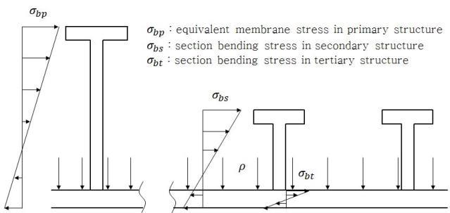

# PART 7 Ships of Special Service (CH5, 6)

> RULES FOR CLASSIFICATION OF STEEL SHIPS / RA-07B-E / 2025 / EN / Guidance

## Annex 7A-7 Standard for the Use of Limit State Methodologies in the Design of Cargo Containment Systems of Novel Configuration(IGC Code Appendix 5) 【See Rule】

### 101. General

#### 1. The purpose of this standard is to provide procedures and relevant design parameters of limit state design of cargo containment systems of a novel configuration in accordance with Ch 5, 427. of the Rule.

#### 2. Limit state design is a systematic approach where each structural element is evaluated with respect to possible failure modes related to the design conditions identified in Ch 5, 403. 4 of the Rule. A limit state can be defined as a condition beyond which the structure, or part of a structure, no longer satisfies the requirements.

#### 3. The limit states are divided into the three following categories:

- **(1)** Ultimate Limit States (ULS), which correspond to the maximum load carrying capacity or, in some cases, to the maximum applicable strain, deformation or instability in structure resulting from buckling and plastic collapse; under intact (undamaged) conditions;
- **(2)** Fatigue Limit States (FLS), which correspond to degradation due to the effect of cyclic loading; and
- **(3)** Accident Limit States (ALS), which concern the ability of the structure to resist accident situations.

#### 4. Ch 5, 401. through to 420. of the Rule are to be complied with as applicable depending on the cargo containment system concept.

### 102. Design format

#### 1. The design format in this standard is based on a Load and Resistance Factor Design format. The fundamental principle of the Load and Resistance Factor Design format is to verify that design load effects, _s2, do not exceed design resistances, _s2, for any of the considered failure modes in any scenario:

$L _{d} \leq R _{d}$

- **(1)** A design load $F _{dk}$ is obtained by multiplying the characteristic load by a load factor relevant for the given load category:
  $F _{dk} = \gamma _{f} \cdot F _{k}$
  where:
  $\gamma _{f}$ : load factor; and
  $F _{k}$ : the characteristic load as specified in **Ch 5, 411.** through to **418.** of the Rule
  A design load effect $L _{d}$ (e.g. stresses, strains, displacements and vibrations) is the most unfavorable combined load effect derived from the design loads, and may be expressed by:
  $L _{d} = q(F _{d1} , F _{d2} , \cdots , F _{dN} )$
  where
  $q$ : the functional relationship between load and load effect determined by structural analysis.
- **(2)** The design resistance $R _{d}$ is determined as follows:
  $R _{d} = \frac{R _{k}}{\gamma _{R} \cdot \gamma _{C}}$
  where:
  $R _{k}$ : the characteristic resistance. In case of materials covered by **Ch 5 Sec 6** of the Rule, it may be, but not limited to, specified minimum yield stress, specified minimum tensile strength, plastic resistance of cross sections, and ultimate buckling strength
  $\gamma _{R}$ : the resistance factor, which is determined as follows;
  $\gamma _{R} = \gamma _{m} \cdot \gamma _{s}$
  where
  $\gamma _{m}$ : the partial resistance factor to take account of the probabilistic distribution of the material properties(material factor)
  $\gamma _{s}$ : the partial resistance factor to take account of the uncertainties on the capacity of the structure, such as the quality of the construction, method considered for determination of the capacity including accuracy of analysis
  $\gamma _{C}$ : the consequence class factor, which accounts for the potential results of failure with regard to release of cargo and possible human injury.

#### 2. Cargo containment design is to take into account potential failure consequences. Consequence classes are defined in Table 1.1, to specify the consequences of failure when the mode of failure is related to the Ultimate Limit State, the Fatigue Limit State, or the Accident Limit State.

| **Consequence class** | **Definition** |
| --- | --- |
| Low | Failure implies minor release of the cargo. |
| Medium | Failure implies release of cargo and potential for human injury. |
| High | Failure implies significant release of the cargo and high potential for human injury /fatality |

### 103. Required analyses

#### 1. Three-dimensional finite element analyses are to be carried out as an integrated model of the tank and the ship hull, including supports and keying system as applicable. All the failure modes are to be identified to avoid unexpected failures. Hydrodynamic analyses are to be carried out to determine the particular ship accelerations and motions in irregular waves, and the response of the ship and its cargo containment systems to these forces and motions.

#### 2. Buckling strength analyses of cargo tanks subject to external pressure and other loads causing compressive stresses are to be carried out in accordance with recognized standards. The method is to adequately account for the difference in theoretical and actual buckling stress as a result of plate out of flatness, plate edge misalignment, straightness, ovality and deviation from true circular form over a specified arc or chord length, as relevant.

#### 3. Fatigue and crack propagation analysis is to be carried out in accordance with 105. 1.

### 104. Ultimate limit states

#### 1. Structural resistance may be established by testing or by complete analysis taking account of both elastic and plastic material properties. Safety margins for ultimate strength are to be introduced by partial factors of safety taking account of the contribution of stochastic nature of loads and resistance (dynamic loads, pressure loads, gravity loads, material strength, and buckling capacities).

#### 2. Appropriate combinations of permanent loads, functional loads and environmental loads including sloshing loads are to be considered in the analysis. At least two load combinations with partial load factors as given in Table 1.2 are to be used for the assessment of the ultimate limit states.

| **Load combination** | **Permanent loads** | **Functional loads** | **Environmental loads** |
| --- | --- | --- | --- |
| ‘a’ | 1.1 | 1.1 | 0.7 |
| ‘b’ | 1.0 | 1.0 | 1.3 |

The load factors for permanent and functional loads in load combination 'a' are relevant for the normally well-controlled and/or specified loads applicable to cargo containment systems such as vapour pressure, cargo weight, system self-weight, etc. Higher load factors may be relevant for permanent and functional loads where the inherent variability and/or uncertainties in the prediction models are higher.

#### 3. For sloshing loads, depending on the reliability of the estimation method, a larger load factor may be required by the Society.

#### 4. In cases where structural failure of the cargo containment system are considered to imply high potential for human injury and significant release of cargo, the consequence class factor is to be taken as _s2 = 1.2. This value may be reduced if it is justified through risk analysis and subject to the approval by the Society. The risk analysis is to take account of factors including, but not limited to, provision of complete or partial secondary barrier to protect hull structure from the leakage and less hazards associated with intended cargo. Conversely, higher values may be fixed by the Society, for example, for ships carrying more hazardous or higher pressure cargo. The consequence class factor is to in any case not be less than 1.0.

#### 5. The load factors and the resistance factors used are to be such that the level of safety is equivalent to that of the cargo containment systems as described in sections Ch 5, 421. to 426. of the Rule. This may be carried out by calibrating the factors against known successful designs.

#### 6. The material factor _s2 is to in general reflect the statistical distribution of the mechanical properties of the material, and needs to be interpreted in combination with the specified characteristic mechanical properties. For the materials defined in Ch 5 Sec 6 of the Rule, the material factor _s2 may be taken as:

#### 1.1 when the characteristic mechanical properties specified by the Society typically represents the lower 2.5% quantile in the statistical distribution of the mechanical properties; or

#### 1.0 when the characteristic mechanical properties specified by the Society represents a sufficiently small quantile such that the probability of lower mechanical properties than specified is extremely low and can be neglected.

#### 7. The partial resistance factors _s2 are to in general be established based on the uncertainties in the capacity of the structure considering construction tolerances, quality of construction, the accuracy of the analysis method applied, etc.

- **(1)** For design against excessive plastic deformation using the limit state criteria given in **8**, the partial resistance factors $\gamma _{si}$ are to be taken as follows:
  $\gamma _{s1} = 0.76 \cdot \frac{B}{\kappa1}$
  $\gamma _{s2} = 0.76 \cdot \frac{D}{\kappa 2}$
  $\kappa _{1} = Min \left( \frac{R _{m}}{R _{e}} \cdot \frac{B}{A} ; 1.0 \right)$
  $\kappa _{2} = Min \left( \frac{R _{m}}{R _{e}} \cdot \frac{D}{C} ; 1.0 \right)$
  where
  A, B, C and D = defined in **Ch 5, 422. 3** (1) of the Rule.
  $R _{m}$ and $R _{e}$ = defined in **Ch 5, 418. 1** (3) of the Rule.
  The partial resistance factors given above are the results of calibration to conventional type B independent tanks.

#### 8. Design against excessive plastic deformation

- **(1)** Stress acceptance criteria given below refer to elastic stress analyses.
- **(2)** Parts of cargo containment systems where loads are primarily carried by membrane response in the structure are to satisfy the following limit state criteria:
  $\sigma _{m} \leq f$
  $\sigma _{L} \leq 1.5f$
  $\sigma _{b} \leq 1.5F$
  $\sigma _{L} + \sigma _{b} \leq 1.5F$
  $\sigma _{m} + \sigma _{b} \leq 1.5F$
  $\sigma _{m} + \sigma _{b} + \sigma _{g} \leq 3.0F$
  $\sigma _{L} + \sigma _{b} + \sigma _{g} \leq 3.0F$
  where:
  $\sigma _{m}$ : equivalent primary general membrane stress
  $\sigma _{L}$ : equivalent primary local membrane stress
  $\sigma _{b}$ : equivalent primary bending stress
  $\sigma _{g}$ : equivalent secondary stress
  $f = \frac{R _{e}}{\gamma _{s1} \cdot \gamma _{m} \cdot \gamma _{c}}$
  $F = \frac{R _{e}}{\gamma _{s2} \cdot \gamma _{m} \cdot \gamma _{c}}$
  The stress summation described above is to be carried out by summing up each stress component ($\sigma _{x}$, $\sigma _{y}$, $\tau _{xy}$), and subsequently the equivalent stress is to be calculated based on the resulting stress components as shown in the example below.
  $\sigma _{L} + \sigma _{b} = \sqrt {( \sigma _{Lx} + \sigma _{bx} ) ^{2} -( \sigma _{Lx} + \sigma _{bx} )( \sigma _{Ly} + \sigma _{by} )+( \sigma _{Ly} + \sigma _{by} ) ^{2} +3(\tau _{Lxy} +\tau _{bxy} ) ^{2}}$
- **(3)** Parts of cargo containment systems where loads are primarily carried by bending of girders, stiffeners and plates, are to satisfy the following limit state criteria:
  $\sigma _{ms} + \sigma _{bp} \leq 1.25F$ (See notes 1,2)
  $\sigma _{ms} + \sigma _{bp} +\sigma _{bs} \leq 1.25F$ (See note 2)
  $\sigma _{ms} + \sigma _{bp} + \sigma _{bs} +\sigma _{bt} +\sigma _{g} \leq 3.0F$
  where:
  $\sigma _{ms}$ : equivalent section membrane stress in primary structure
  $\sigma _{bp}$ : equivalent membrane stress in primary structure and stress in secondary and tertiary structure caused by bending of primary structure
  $\sigma _{bs}$ : section bending stress in secondary structure and stress in tertiary structure caused by bending of secondary structure
  $\sigma _{bt}$ : section bending stress in tertiary structure
  $\sigma _{g}$ : equivalent secondary stress
  $F = \frac{R _{e}}{\gamma _{s2} \cdot \gamma _{m} \cdot \gamma _{c}}$
  $\sigma _{ms}$, $\sigma _{bp}$, $\sigma _{bs}$ and $\sigma _{bt}$ = defined in (4).
  Note 1: The sum of equivalent section membrane stress and equivalent membrane stress in primary structure ($\sigma _{ms}$+$\sigma _{bp}$) will normally be directly available from three-dimensional finite element analyses.
  Note 2: The coefficient, 1.25, may be modified by the Society considering the design concept, configuration of the structure, and the methodology used for calculation of stresses.
  Skin plates are to be designed in accordance with the requirements of the Society. When membrane stress is significant, the effect of the membrane stress on the plate bending capacity shall be appropriately considered in addition.
- **(4)** Section stress categories
  - **(A)** Normal stress is the component of stress normal to the plane of reference.
  - **(B)** Equivalent section membrane stress is the component of the normal stress that is uniformly distributed and equal to the average value of the stress across the cross section of the structure under consideration. If this is a simple shell section, the section membrane stress is identical to the membrane stress defined in (2).
  - **(C)** Section bending stress is the component of the normal stress that is linearly distributed over a structural section exposed to bending action, as illustrated in **Fig 1.1**.
    
    **Fig 1.1: Definition of the three categories of section stress****(Stresses** #eqnID-716 **and** #eqnID-717 **are normal to the cross section shown.)**

#### 9. The same factors _s2, _s2, _s2 shall be used for design against buckling unless otherwise stated in the applied recognized buckling standard. In any case the overall level of safety shall not be less than given by these factors.

### 105. Fatigue limit states

#### 1. Fatigue design condition as described in Ch 5, 418. 2 of the Rule shall be complied with as applicable depending on the cargo containment system concept. Fatigue analysis is required for the cargo containment system designed under Ch 5 427. and this standard.

#### 2. The load factors for fatigue limit states shall be taken as 1.0 for all load categories.

#### 3. Consequence class factor _s2 and resistance factor _s2 shall be taken as 1.0.

#### 4. Fatigue damage shall be calculated as described in Ch 5, 418. 2 (2) to (5) of the Rule. The calculated cumulative fatigue damage ratio for the cargo containment systems shall be less than or equal to the values given in Table 1.3.

|   | **Consequence class** |   |   |
| --- | --- | --- | --- |
| $C _{W}$ | Low | Medium | High |
| $C _{W}$ | 1.0 | 0.5 | 0.5* |
| * Lower value shall be used in accordance with **Ch 5, 418. 2** (7) to (9) of the Rule, depending on the detectability of defect or crack, etc. |   |   |   |

#### 5. Lower values may be fixed by the Society.

#### 6. Crack propagation analyses are required in accordance with Ch 5, 418. 2 (6) to (9) of the Rule.

### 106. Accident Limit States

#### 1. Accident design condition as described in Ch 5, 418. 3 of the Rule is to be complied with as applicable, depending on the cargo containment system concept.

#### 2. Load and resistance factors may be relaxed compared to the ultimate limit state considering that damages and deformations can be accepted as long as this does not escalate the accident scenario.

#### 3. The load factors for accident limit states are to be taken as 1.0 for permanent loads, functional loads and environmental loads.

#### 4. Loads mentioned in Ch 5, 413. 9 and 415.1 of th Rule need not be combined with each other or with environmental loads, as defined in Ch 5, 414. of the Rule.

#### 5. Resistance factor _s2 is to in general be taken as 1.0.

#### 6. Consequence class factors _s2 are to in general be taken as defined in 104. 4 of this standard, but may be relaxed considering the nature of the accident scenario.

#### 7. The characteristic resistance _s2 is to in general be taken as for the ultimate limit state, but may be relaxed considering the nature of the accident scenario.

#### 8. Additional relevant accident scenarios are to be determined based on a risk analysis.

### 107. Testing

#### 1. Cargo containment systems designed according to this standard are to be tested to the same extent as described in Ch 5, 420. 3 as applicable depending on the cargo containment system concept. #imgID-92_s2
