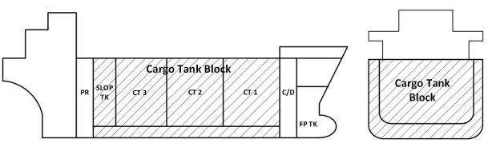
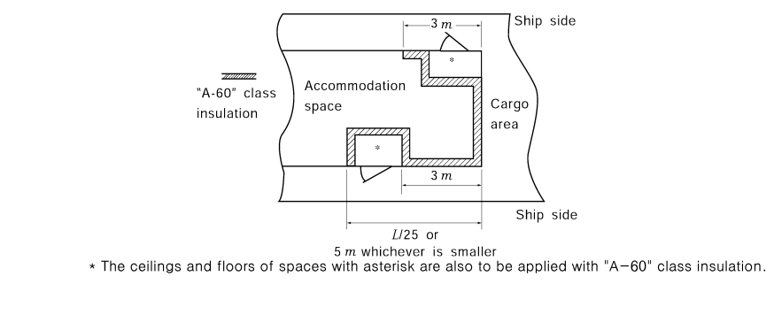
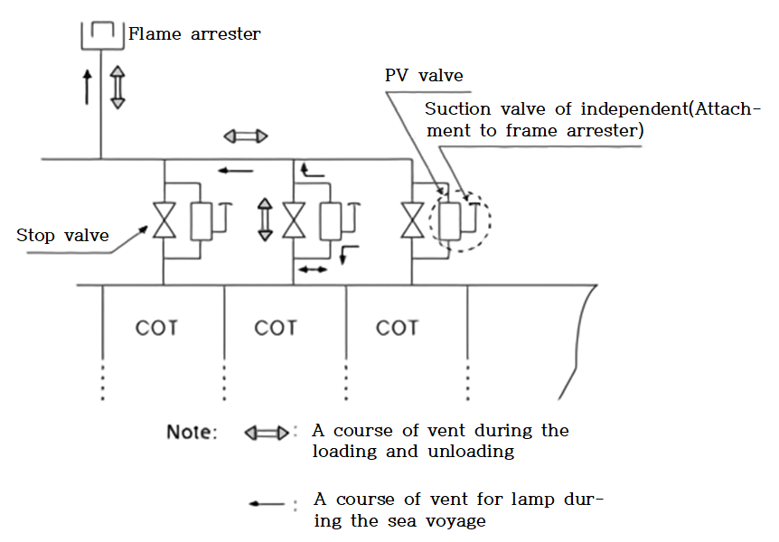

# PART 8 Fire Protection and Fire Extinction

> RULES FOR CLASSIFICATION OF STEEL SHIPS / RA-08-E / 2025 / EN / Guidance

## CHAPTER 2 PROBABILITY OF IGNITION

### Section 1 Arrangements for Oil Fuel, Lubrication Oil and Other Flammable Oils

#### 101. Limitations in the use of oils as fuel

- **1.** In applying **101. 4** of the Rules, machineries and piping systems for the usage of fuel oil having a flashpoint of 43℃ or less should comply with the follwing: **【See Rule】**
  - **(1)** provisions for the measurement of oil temperature should be provided on the suction pipe of oil fuel pump;
  - **(2)** stop valves and/or cocks should be provided to the inlet side and outlet side of the oil fuel strainers; and
  - **(3)** pipe joints of welded construction or of circular cone type or spherical type union joint should be applied as much as possible.
- **2.** Requirements concerning use of crude oil or slop as fuel for tanker boilers are to be in accordance with **Pt 7 Annex 7-1**.

#### 102. Arrangements for oil fuel

- **1.** In applying **102. 3** of the Rules, fuel oil tanks are to comply with **Pt 5, Ch 6, 901. 11.** (1) (A) of the Rules.
- **2.** In applying **102. 3** (1) of the Rules, when the ship of 400 tons gross tonnage and above is applied to the MARPOL convention, oil shall not be carried in a forepeak tank or a tank forward of the collision bulkhead.
- **3.** In applying **102. 3** (2) of the Rules, the one shown in **Fig 8.2.1** of the Guidance is to be referred to as the standard arrangement of fuel oil tanks in machinery spaces of category A. And "free standing oil tanks" are to be kept to a minimum.
- **4.** In applying **102. 3** (4) and **103. 2** of the Rules, when a filling pipes for fuel oil tank or lubricating oil tank are fitted at the place of the tank top nearby or above the overflow pipes, it is considered that there is no worry about the leakage arising from the damages. Pneumatic remote shut-down devices(of the type that requires compressed air only at the time of closing) of fuel oil tanks and lubricating oil tanks are to comply with the following requirements:
  - **(1)** an exclusive air bottle for remote shut-down is to be provided in an easily accessible position outside the compartment in which fuel oil tanks and lubricating oil tanks are situated.
  - **(2)** The capacity of air bottle is to be sufficient for closing all the main suction valves of fuel oil tanks at least twice.
  - **(3)** The air bottle is to be provided with a pressure measuring device at a position which can be easily seen from the position where the remote shut-down device is operated.
  - **(4)** Air pipes from the air bottle to the main suction valve's actuators are not to be provided with valves except for valves for remote control and blow-off valves for these pipes.
  - **(5)** Air pipes from the air bottle to the main suction valve's actuators are to be steel or copper pipes.
  - **(6)** Air charging pipes to the air bottle are to be provided with non-return valves.
  - **(7)** In case where air bottle are used commonly for remote opening of the sea water suction valve of the emergency fire pump, remote shut-down of dampers for the ventilating fans for machinery spaces, etc, the following requirements are to be complied with:
    - **(A)** the capacity of the air bottle is to be capable of operating simultaneously all remote controls belonging to at least for twice
    - **(B)** the air piping for the remote shut-down of the fuel oil tank and the lubricating oil tank is to be arranged separately from piping for other purposes, and the air outlet valve from the air bottle is to be fitted with a name tag for clear identification of the intended service.
- **5.** In applying **102. 3** (4) of the Rules, s separate location does not mean a separate space.
- **6.** In applying **102. 3** (5) of the Rules, short sounding pipes may be used for tanks other than double bottom tanks without the additional closed level gauge provided an overflow system is fitted. And level switches may be used below the tank top provided they are contained in a steel enclosure or other enclosure not capable of being destroyed by fire. In application to **102. 3** (5) (B) of the Rules, ships engaged on domestic voyage only are to be in accordance with **Annex 8-3, 1** (3) (E) of the Guidance. **【See Rule】**
- **7.** In applying **102. 4** and **103. 1** of the Rules, air pipes from oil fuel tanks or heated lubricating oil tanks should be led to a safe position on the open deck. They should not terminate in any place where a risk of ignition is present. Air pipes from unheated lubricating oil (including hydraulic oil) tanks may terminate in the machinery space, provided that the open ends are so situated that issuing oil cannot come into contact with electrical equipment or heated surfaces. **【See Rule】**
- **8.** In applying **102. 5** of the Rules, high pressure means having pressures of 10 MPa or above. *(2020)* **【See Rule】**
- **9.** In applying **102. 5** (1) of the Rules, hose clamps and similar types of attachments for flexible pipes should not be permitted. **【See Rule】**
- **10.** In applying **102. 5** (2) of the Rules, engines having single cylinder, multi-cylinder engines having separate fuel pumps and those having multiple fuel injection pump units are included, however, this regulation do not apply to gas turbine and lifeboat engines. Ships engaged on domestic voyage only are to be in accordance with **Annex 8-3, 1.** (3) (C) of the Guidance. **【See Rule】**

  | Plan | Section A-A' |
  | --- | --- |
  |  |  |
  | * Cofferdam Requirements for cofferdam: 1. To be gas-tight. 2. To be provided with sounding devices, air pipes and fittings for drainage(drain plug. etc.). *** Where the requirements of MARPOL I/Reg. 12A are met(aggregate oil fuel capacity of 600 $RM m ^{3}$ and above) **** "Small oil fuel tank" is an oil fuel tank with a maximum individual capacity no greater than 30 $RM m ^{3}$ | $f$ : Tank bottom may be knuckled only due to reasons of workmanship. ** : In case where the tip plates of fuel oil tanks are not common with upper deck, void spaces having sufficient depth are to be provided on the tops of fuel oil tanks, and are permitted to have opening. However, in cases where pipe passages for other than flammable liquids, and/or auxiliary machinery rooms having little fire risk, such as fan rooms, conditioning machinery rooms, refrigerating machinery rooms and rooms for hydraulic systems, are provided on the top of fuel oil tanks, it is not necessary to provide the aforementioned void space. |
- **11.** In application to the **102.5∼104.** of the Rules, where any one of following is fulfilled, The use of materials other than steel is considered acceptable by the Society. *(2017)*
  - **(1)** Internal pipes which cannot cause any release of flammable fluid onto the machinery or into the machinery space in case of failure
  - **(2)** Components that are only subject to liquid spray on the inside when the machinery is running, such as machinery covers, rocker box covers, camshaft end covers, inspection plates and sump tanks. It is a condition that the pressure inside these components and all the elements contained therein is less than 0.18 N/mm2 and that wet sumps have a volume not exceeding 100 litres
  - **(3)** Components attached to machinery which satisfy fire test criteria according to standard ISO 19921/19922 or other standards acceptable to the Society, and which retain mechanical properties adequate for the intended installation. *(2021)*

#### 104. Arrangements for other flammable oils 【See Rule】

This requirement is not applicable to hydraulic valves and cylinders located on weather decks, in tanks, cofferdams, or void spaces.

### Section 2 Arrangements for Gaseous Fuel for Domestic Purpose

#### 201. Arrangements for gaseous fuel for domestic purpose 【See Rule】

A portion of open deck, recessed into a deck structure, machinery casing, deck house, etc., utilized for the exclusive storage of gas bottles is considered acceptable, provided that such a recess has an unobstructed opening, except for small appurtenant structures, such as opening corner radii, small sills, pillars, etc.(The opening may be provided with grating walls and door) and the depth of such a recess is not greater than 1 m. A portion of open deck meeting the above should be considered as open deck in applying **Ch 7, Sec 1 tables 8.7.1** to **8.7.8** of the Rules.

### Section 3 Miscellaneous Items of Ignition Sources and Ignitability

#### 301. Electric radiators 【See Rule】

Reference is made to IEC 60092-Electrical installations in ships.

#### 302. Waste receptacles 【See Rule】

This regulation is not intended to preclude the use of containers constructed of combustible materials in galleys, pantries, bars, garbage handling or storage spaces and incinerator rooms provided they are intended purely for the carriage of wet waste, glass bottles and metal cans and are suitably marked.

#### 303. Insulation surfaces protected against oil penetration 【See Rule】

"Spaces where penetration of oil products is possible" means the spaces located in the vicinity of all types of equipment(purifiers, pumps and tanks) and pipe fittings(valves, flanges, strainers, flowmeters, etc.), handling oils(fuel oil, lubricating oil, hydraulic oil and thermal oil) with possible involvement of oils or oil vapours leaked or splashed during operation or in maintenance work to reach out thermal insulation. However, these do not apply to thermal insulation of pipes in machinery spaces. The fire insulation in such spaces can be covered by metal sheets(not perforated) or by vapour-proof glass cloth accurately sealed at the joint.

### Section 4 Cargo Areas of Tankers

#### 401. Separation of cargo oil tanks

- **1.** In applying **401. 1** of the Rules, “cofferdam” mean, for the purpose of this regulation, an isolating space between two adjacent steel bulkheads or decks. The minimum distance between the two bulkheads or decks should be sufficient for safe access and inspection. In order to meet the single failure principle, in the particular case when a corner-to-corner situation occurs, this principle may be met by welding a diagonal plate across the corner. No cargo, wastes or other goods should be contained in cofferdams. And ballast pump rooms are also to comply with **Pt 7, Ch 1, 1004.** of the Rules and then the lower part of the ballast pump rooms may be recessed into machinery space of category A to the same extent as provided for cargo pump rooms.
  Void spaces or ballast water tank protecting fuel oil tank as shown in **Fig 8.2.2** of the Guidance, need not be considered as "cargo area" defined in **Ch 1, 103. 6** of the Rules even though they have a cruciform contact with the cargo oil tank or slop tank.
  The void space protecting fuel oil tank is not considered as a cofferdam specified in this paragraph. There is no objection to the locations of the void space shown in **Fig 8.2.2** of the Guidance, even though they have a cruciform contact with the slop tank. **【See Rule】**
  
  **Fig 8.2.2 Separation of cargo oil tanks**
- **2.** In applying **401. 2** of the Rules, arrangement of main cargo control stations, control stations, accommodation spaces and service spaces is to comply with the following requirements: **【See Rule】**
  - **(1)** Main cargo control stations, control stations, accommodation spaces and service spaces(including chain lockers) are not to make point contact or linear contact with cargo oil tanks or slop tanks.
  - **(2)** Main cargo control stations, control stations, accommodation spaces and service spaces need not be arranged aft of the recess of the lower parts of cargo pump rooms and ballast pump rooms into machinery spaces of category A accepted under the requirements of **401. 1** of the Rules and aft of the oil fuel tanks or ballast tanks (see **Fig 8.2.3** of the Guidance).
- **3.** **3**. In applying **401. 3** of the Rules, lamp rooms, store rooms, paint rooms, lockers, etc. independently provided at the bow section which are seldom accessed by persons may be provided in cargo areas other than cargo tanks and slop tanks such as the upper part of the ballast tanks, cofferdams, etc. or ship side adjoining thereto. (see **Fig 8.2.4** of the Guidance). **【See Rule】**
- **4.** **4**. In applying **401. 2** & **3** of the Rules, Paint lockers, regardless of their use, cannot be located above the tanks and spaces defined in **2** for oil tankers and the cargo area for chemical tankers.
- **5.** **5**. In applying **401. 4** (1) of the Rules, the arrangements and separation of spaces in combination carriers are to comply with the requirements for ore/oil carriers specified in **Pt 7, Ch 2, 206.** and **207.** of the Rules, and the requirements of **Pt 7, Ch 3, Sec 15** of the Rules for bulk/oil carriers. **【See Rule】**
- **6.** In applying **401. 6** of the Rules, "a permanent continuous coaming" means a suitable place between the aft extreme end of cargo oil tanks and the front bulkheads of deckhouses and it is not to be made lower than 50 $\mathrm{mm}$ above the upper edge of shear strakes(see **Fig 8.2.5** of the Guidance). And special consideration for stern loading means that foam extinguishers or equivalent are to be provided in addition to the requirements of **Pt 7, Ch 1, 1002. 4** (4) and **1006.** of the Rules, and further, oil drip pans in sufficient size or spillage coaming are to be provided. **【See Rule】**
  
  **Fig 8.2.3 Arrangements of accommodation spaces, cargo oil tanks and machinery spaces of category A**
  
  **Fig 8.2.4 Arrangements of lamp rooms, store rooms, paint rooms, lockers, etc.**
  
  **Fig. 8.2.5 Coaming preventing spill into accommodation spaces and service saces**
- **7.** Arrangement of fuel tanks in cargo area on oil and chemical tankers, carrying liquid cargoes having a flashpoint not exceeding 60°C and/or toxic liquid cargoes is to comply with the following requirements: *(2019)*
  - **(1)** Fuel tanks located with a common boundary to cargo or slop tanks are not be situated within nor extend partly into the cargo tank block. Such tanks may, however, be situated aft and/or forward of the cargo tank block. Cargo tank block is the part of the ship extending from the aft bulkhead of the aftmost cargo or slop tank to the forward bulkhead of the forward most cargo or slop tank, extending to the full depth and beam of the ship, but not including the area above the deck of the cargo or slop tank shown in **Fig 8.2.6.**
    
    **Fig. 8.2.6 Cargo tank block**
  - **(2)** They may be accepted when located as independent tanks on open deck in the cargo area subject to spill and fire safety considerations.
  - **(3)** The arrangement of independent fuel tanks and associated fuel piping systems, including the pumps, can be as for fuel tanks and associated fuel piping systems located in the machinery spaces. For electrical equipment, requirements to hazardous area classification must however be met.
  - **(4)** For the purpose of this regulation, toxic liquid cargoes include those for which toxic vapour detection is specified in cloumn “k” of the table of **Pt 7 Annex 7B-1**.

#### 402. Restriction on boundary openings

- **1.** Owing to the design of a ship, where it is impossible or impractical to satisfy the requirements specified in **402. 1** of the Rules, access doors, air inlets and opening facing cargo areas may be provided subject to no sources of ignition in a hazardous areas as defined in **Pt 7, Ch 1, 1101. 2.** In such cases, explosion-protected electrical equipment complying with IEC 60092-502:1999 is not regarded as a source of ignition. In application of **402. 1** of the Rules, access to forecastle spaces containing sources of ignition may be permitted through doors facing the cargo area, provided the doors are located outside hazardous areas as defined in IEC 60092-502:1999. *(2024)* **【See Rule】**
- **2.** **In applying 402. 2 of the Rules, the boundaries of spaces, where application of "A-60" class** insulation is required, are to be insulated as exemplified in **Fig 8.2.7** of the Guidance. The ceilings and floors of spaces with asterisk are also to be applied with "A-60" class insulation. Incidentally, foam liquid tanks for the deck foam systems may be provided in these spaces. *(2019)*
  With respect to **402. 2** of the Rules, an access to a deck foam system room (including the foam tank and the control station) may be permitted within the limits mentioned in **402. 2** of the Rules, provided that the conditions specified in **402. 1** of the Rules are satisfied and that door is located flush with the bulkhead. *(2019)*
  And wheelhouse doors and wheelhouse windows which can be made rapidly and efficiently gas and vapour tight are to be such doors and windows that are provided with packing and clamping fittings, and are to be tested for gas tightness. Where hose tests are adopted instead of gas tightness, the following hose tests are to be carried out. **【See Rule】**
  - **(1)** Nozzle diameter is to be minimum 12 mm.
  - **(2)** Water pressure just before the nozzle is to be not less than 2 bar.
  - **(3)** Distance between the nozzle and the doors or windows is to be maximum 1.5 m.
    
    **Fig 8.2.7 A-60 class insulation to be required**
- **3.** **3**. In applying **402. 4** of the Rules, the Pipe ducts in double bottom under cargo oil tanks shall comply with the following requirements.
  - **(1)** They should not communicate with the engine room.
  - **(2)** Provision shall be made for at least two exits to the open deck arranged at a maximum distance from each other. One of these exits fitted with a watertight closure may lead to the cargo pump room.
  - **(3)** In the duct, provision shall be made for adequate mechanical ventilation. **【See Rule】**

#### 403. Cargo tank venting

- **1.** **1**. In applying **403. 2** (2) of the Rules, where the arrangements are in common combined with other cargo oil tanks, the arrangement and method in order to isolate each cargo oil tank are to be as follows. (See **Fig 8.2.8** of the Guidance) **【See Rule】**
  - **(1)** It is to be install the stop valve etc. to isolate each cargo oil tank in order to prevent fire and explosion in specific cargo oil tank from spreading other cargo oil tank pass through vent system.
  - **(2)** Stop valve is to be closed except loading and unloading and fitted in a locks in order not to mistaken operation and managed by responsible person.
  - **(3)** Even though stop valves are closed, PV valves are to installed with bypassing type for the stop valve in cargo tanks for the capable of controlling of a change of pressure occurring by a change of temperature at sea. In this case, where the cargo tank has a negative pressure, PV valves are to be constructed with the independent suction valves which are able to inhale the air form the outside.
    
    **Fig. 8.2.8 Examples of isolation of cargo oil tank**
- **2.** **2**. In applying **403. 3** of the Rules, refer to **MSC/Circ.677**(including amendments in accordance with **MSC/Circ.1009** and **MSC.1/Circ.1324** & **1325**) on revised standards for the design, testing and locating of devices to prevent the passage of flame into cargo tanks in tankers **MSC/Circ.450/Rev.1** on revised factors to be taken into consideration when designing cargo tank venting and gas-freeing arrangements. And ullage openings do not include cargo tank openings that are fitted with standpipe arrangements with its own manually operated shutoff valve. Examples include the common 1" to 2" diameter standpipe arrangements that are used for sampling, monitoring or measuring of ullage/temperature/interface, oxygen, liquid and hand dipping in the cargo tank. And ullage plugs, sighting ports and tank cleaning openings are not to be arranged in enclosed spaces.
  And then the designs, arrangements, tests of devices to prevent the passage of flame are to be in accordance with followings. The devices are to be type approved by this Society. **【See Rule】**
  - **(1)** The venting system is to be provided with devices to prevent the passage of flame into the cargo oil tanks.
    - **(A)** Flame screens, flame arresters or detonation flame arrester are to be fitted at the following openings.
      - **(a)** Air suction inlets, through which vapours cannot be vented to atmosphere, of the venting system for preventing the vacuum in the tanks specified **Ch 9, 501. 1** of the Rules.
      - **(b)** Air suction inlets, through which vapours cannot be vented to atmosphere, of the venting systems for preventing the vacuum in the tank specified in **Ch 9, 501. 2** of the Rules.
    - **(B)** Flame arrester, detonation flame arresters or high velocity vents are to be fitted for the following openings.
      - **(a)** Openings for pressure release specified in **Ch 9, 502.**, of the Rules.
      - **(b)** Vent outlets specified in **Ch 2, 403. 4** (1) (C) of the Rules.
      - **(c)** Discharge outlets specified in **Ch 2, 406. 3** (2) of the Rules.
    - **(C)** For the vent outlets specified in **Ch 2, 403. 4** (1) (D) of the Rules, the high velocity device is to be fitted.
  - **(2)** For determining the size of the devices to avoid pressure exceeding allowable one of vacuum in cargo tanks during loading of discharging calculations of pressure losses are to be carried out. The following parameters are to be taken into account.
    - **(A)** Loading/discharging rates
    - **(B)** Gas release
    - **(C)** Pressure loss across the devices, taking into account the resistance coefficient
    - **(D)** Pressure loss in the venting system
    - **(E)** Pressure at which the vent opens if a high velocity device is used
    - **(F)** Density of the mixture of the saturated vapour and air
  - **(3)** Tests and inspection
    It is to be ascertained by a suitable method that the high velocity valves can be operable smoothly after installed on board.
    - **(A)** The tests and inspection for the individual product are to be carried out in accordance with followings.
      - **(a)** Construction inspection
      - **(b)** Hydraulic test(only for high velocity valves)
      - **(c)** Confirmation of the pressure at which the valve opens and closes
    - **(B)** On board test
  - **(4)** Test report
    A test report for each finished device is to be prepared. This is to include
    - **(A)** detailed drawings of the device
    - **(B)** types of tests conducted. Where in-line devices are tested, this information is to include the maximum pressures and velocities observed in the test
    - **(C)** specific advice on approved attachments
    - **(D)** types of cargo for which the device is approved drawings of the test rig
    - **(E)** in the case of high velocity vent, the pressures at which the device opens and closes in the efflux velocity
    - **(F)** all the information marked on the device in following (6)
  - **(5)** Manufacturer's instruction manual
    The manufacturer is to supply a copy of the instruction manual, which is to be kept on board the tanker and which is to include followings.
    - **(A)** installation instructions
    - **(B)** operating instructions
    - **(C)** maintenance requirements, including cleaning
    - **(D)** copy of the laboratory report referred to in (8)
    - **(E)** flow test data, including flow rates under both positive and negative pressures, operating sensitivity, flow resistance and velocity, are to be provided.
  - **(6)** Marking of device
    Each device is to be permanently marked, or have a permanently fixed tag made of stainless steel or other corrosion-resistant material, to indicate
    (Ex; IIA, IIB, IIC, etc.)
    (including amendments in accordance with MSC/Circ.1009 and MSC.1/Circ.1324 & 1325)
    - **(A)** manufacturer's name or trade mark
    - **(B)** style, type, model or other manufacturer's designation for the device
    - **(C)** size of the outlet for which the device is approved
    - **(D)** approved location for installation, including maximum or minimum length of pipe, if any, between the device and the atmosphere
    - **(E)** direction of flow through the device
    - **(F)** apparatus group assigned to the tested device
    - **(G)** indication of the test laboratory and report number
    - **(H)** compliance with the requirements of MSC/Circ.677
- **3.** In applying **403. 4 (1) (C)** and **(D)** of the Rules, electrical equipment fitted in compliance with **IEC 60092-502:1999** is not considered a source of ignition or ignition hazard. ***(2022)*** **【See Rule】**
- **4.** In applying “not less than 10m measured horizontally from the nearest air intakes and openings to enclosed spaces containing a source of ignition and from deck machinery, which may include anchor windlass and chain locker openings, and equipment which may constitute an ignition hazard” specified in **403. 4 (1) (C)** of the Rules, Area Classification is to be carried out in accordance with the principles laid down in IEC 60092-502:1999 and the classes of hazardous areas are to be referred to **Pt 7, Ch 1, 1101. 2** of the Rules. ***(2023)*** **【See Rule】**
  - **(1)** Areas on open deck, or semi-enclosed spaces on open deck, within a vertical cylinder of unlimited height and 6m radius centred upon the centre of the outlet, and within a hemisphere of 6m radius below the outlet which permit the flow of large volumes of vapour, or gas mixtures during loading/discharging/ballasting are defined as **Zone 1** as specified by **IEC 60092-502:1999 para 4.2.2.8**.
  - **(2)** Areas within 4m beyond the zone specified in (1) above are defined as **Zone 2** as specified by I**EC 60092-502:1999 para 4.2.3.2.**
  - **(3)** Electrical equipment or cables shall not normally be installed in hazardous areas. Where essential for operational purposes, electrical equipment may be installed in accordance with **IEC 60092-502:1999**.

#### 404. Ventilation

In applying **404. 1** of the Rules, ventilation fan of non-sparking type is to be comply with the requirements specified in **Ch 3, 104.** of the Rules. **【See Rule】**

#### 405. Inert gas systems 【See Rule】

- **1.** Refer to **Annex 8-5.**
- **2.** In applying **405. 1** (3) of the Rules, double-hull spaces required to be fitted with suitable connections for the supply of inert gas are all ballast tanks and void spaces of double-hull and double-bottom spaces adjacent to the cargo tanks, including the forepeak tank and any other tanks and spaces under the bulkhead deck adjacent to cargo tanks, except cargo pump-rooms. *(2018)*
- **3.** In applying **405. 3** (2) of the Rules, "a permanently fitted inert gas distribution system" means that the branch lines for the supply of inert gas into the double hull spaces are to be connected to the position between the inert gas regulating valve and the water seal or equivalent measures.
- **4.** In applying **405. 3** (3) of the Rules, in case not permanently connected to an inert gas distribution system "appropriate means" means the arrangement consist of portable pipes or flexible hoses and blanking flange.

#### 406. Inerting, purging and gas freeing

- **1.** In applying **406. 2** of the Rules, "the Guidance as provided separated" means **21** of **Annex 8-6.** special requirements of the Guidance. **【See Rule】**
- **2.** **2**. In applying **406. 3** of the Rules, the outlets mentioned in (1) (2) (3) are to be located in compliance with **403. 4** (1) (C) of the Rules as far as the horizontal distance is concerned. **【See Rule】**

#### 407. Gas measurement and detection

- **1.** In applying **407. 1** of the Rules, in case where the portable instruments are provided onboard in accordance with (1) or (2), it is considered as satisfied with the requirements of the Rules for at least one portable instrument for measuring oxygen and one for measuring flammable vapour concentrations, together with a sufficient set of spares:
  - **(1)** Two(2) instruments, each capable of measuring both oxygen and flammable vapour concentrations
  - **(2)** Two(2) portable instruments for measuring oxygen and two portable instruments for measuring flammable vapour concentrations.
- **2.** In applying **407. 1** of the Rules, "suitable means are to be provided for the calibration of all such instruments" refers to portable atmosphere testing instruments being calibrated on board or ashore in accordance with the manufacturer's instructions. For the avoidance of any doubt, the above clarification refers to the calibration of portable atmosphere testing instruments, as required by SOLAS regulation XI-1/7, and not to any pre-operational accuracy tests as recommended by the manufacturer. *(2019)*
- **3.** For tankers fitted with inert gas systems in **407. 1** of the Rules, at least two portable gas detectors are to be capable of measuring concentrations of flammable vapours in inerted atmosphere (% gas by volume). *(2021)* **【See Rule】**
- **4.** In applying **407. 3** of the Rules, fixed hydrocarbon gas detection systems are to be type approved by the Society and to be designed, constructed and tested to the satisfaction of performance standards(MSC.1/Circ.1370) developed by the IMO.
- **5.** In applying **407. 3** of the Rules, fixed hydrocarbon gas detection systems shall comply with the requirement of Ch 16 of the FSS Code.
- **6.** In applying **407. 3** (1) of the rules, the following requirements are to be applied.
  - **(1)** "Cargo tanks" in the phrase "spaces adjacent to the cargo tanks" includes slop tanks except those arrange for the storage of oily water only.
  - **(2)** "Spaces" in the phrase "spaces under the bulkhead deck adjacent to cargo tanks" includes dry compartments such as ballast pump-rooms and bow thruster rooms and any tanks such as freshwater tanks, but excludes fuel oil tanks.
  - **(3)** "Adjacent" in the phrase "adjacent to the cargo tanks" includes ballast tanks, void spaces, other tanks or compartments located below the bulkhead deck located adjacent to cargo tanks and includes any spaces or tanks located below the bulkhead deck which form a cruciform (corner to corner) contact with the cargo tanks. **【See Rule】**

#### 410. Protection of cargo pump-rooms in Tanker 【See Rule】

- **1.** Pump-rooms intended solely for ballast transfer need not comply with the requirements of **410.**. The requirements of **410.** are only applicable to the pump-rooms, regardless of their location, where pumps for cargo, such as cargo pumps, stripping pumps, pumps for slop tanks, pumps for COW or similar pumps are provided. “Similar pumps” includes pumps intended for transfer of fuel oil having a flashpoint less than 60 ℃.
- **2.** In applying **410. 2** of the Rules, where the lighting in cargo pump-rooms can be commonly used as the emergency lighting, this lighting should be interlocked with the ventilation systems. However, this interlock should not prevent operation of the emergency lighting in case of the loss of the main source of electrical power. **【See Rule】**
- **3.** In applying **410. 3** of the Rules, a system for continuous monitoring of the concentration of hydrocarbon gases is to be in accordance with the followings: **【See Rule】**
  - **(1)** The system may be of a sampling type provided that the system is dedicated for cargo pump rooms. In this case a sampling period is to be as short as possible.
  - **(2)** "Suitable positions in order that potentially dangerous leakages are readily detected" means the zone where air circulation is reduced(e.g. recessed corners).
  - **(3)** Where a gas analysing units of the sampling type with non-explosion proof measuring equipment may be located in areas outside cargo areas, e.g. in cargo control room, navigation bridge or engine room when mounted on the forward bulkhead provided the following requirements are observed:
    - **(A)** Sampling lines shall not run through gas safe spaces, except where permitted under 5.
    - **(B)** The gas sampling pipes shall be equipped with flame arresters. Sample gas is to be led to the atmosphere with outlets arranged in a safe location.
    - **(C)** Bulkhead penetrations of sample pipes between safe and dangerous areas shall be of approved type and have same fire integrity as the division penetrated. A manual isolating valve shall be fitted in each of the sampling lines at the bulkhead on the gas safe side.
    - **(D)** The gas detection equipment including sample piping, sample pumps, solenoids, analysing units etc. shall be located in a reasonably gas tight enclosure (e.g. a fully enclosed steel cabinet with a gasketed door) which is to be monitored by its own sampling point. At gas concentrations above 30% LFL inside the enclosure the entire gas analysing unit is to be automatically shut down.
    - **(E)** Where the enclosure cannot be arranged directly on the bulkhead, sample pipes shall be of steel or other equivalent material and without detachable connections, except for the connection points for isolating valves at the bulkhead and analysing units, and are to be routed on their shortest ways. 
