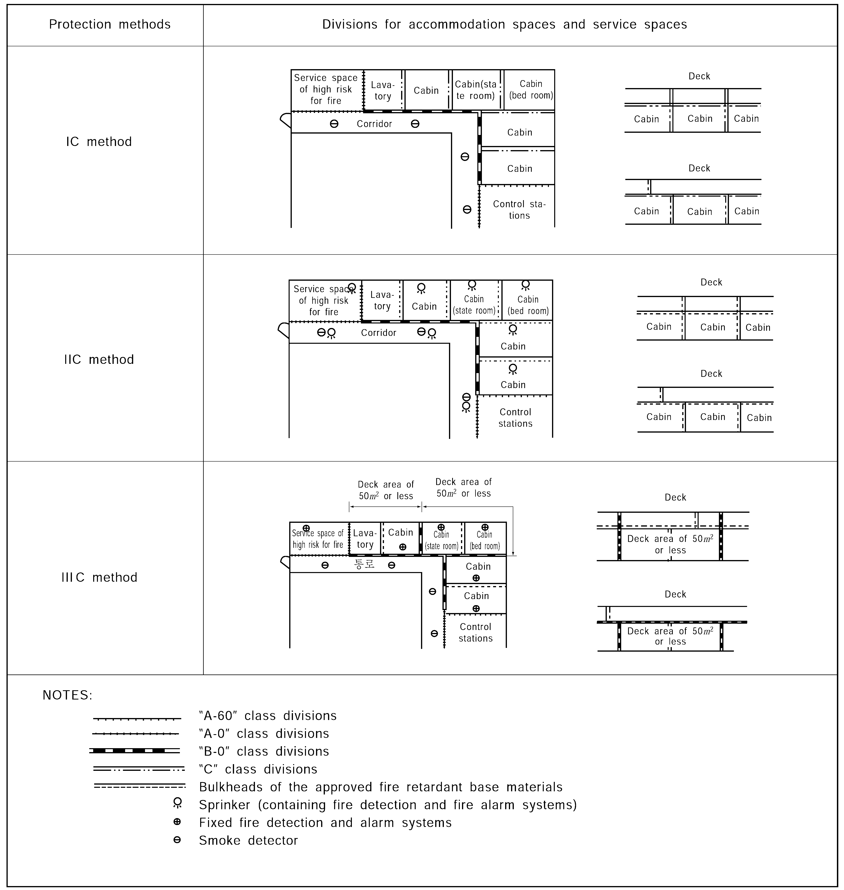

# PART 8 Fire Protection and Fire Extinction

> RULES FOR CLASSIFICATION OF STEEL SHIPS / RA-08-E / 2025 / EN / Guidance

## CHAPTER 5 DETECTION AND ALARM

### Section 1 General

#### 101. General requirements

- **1.** **1**. In applying **101. 1** of the Rules, fixed fire detection and fire alarm system are to be type approved by the Society and are also to be complied with the following requirements. **【See Rule】**
  - **(1)** In applying Ch 9, 2.1.6.4 of the FSS Code, the requirement that a system be so arranged to ensure that any fault occurring in the loop will not render the whole loop ineffective, is considered satisfied when a fault occurring in the loop only renders ineffective a part of the loop not being larger than a section of a system without means of remotely identifying each detector.
  - **(2)** In applying Ch 9, 2.2.4 of the FSS Code, the ‘30 minutes’ means the last 30 minutes of the periods required under SOLAS Reg. II-1/42 and II-1/43 (18 hours for cargo ships and 36 hours for passenger ships). *(2018)*
  - **(3)** Power supply to the alarm sounder system when not an integral part of the detection system specified in Ch 9, 2.5.1.1 of the FSS Code.
    - **(A)** There are to be not less than two sources of power supply for the alarm sounder system used in the operation of the fixed fire detection and fire alarm system, one of which is to be an emergency source of power.
    - **(B)** In vessels required by SOLAS Reg.Ⅱ-1/42 and 43 to be provided with a transitional source of emergency electrical power, the alarm sounder system is to be powered from this power source.
  - **(4)** A space in which a cargo control console is installed, but does not serve as a dedicated cargo control room(e.g. ship’s office, machinery control room), is to be regarded as a cargo control room for the purposes of Ch 9, 2.5.1.3 of the FSS Code, as amended by **IMO Res.MSC.339(91)**, and therefore be provided with an additional indicating unit. *(2017)*
  - **(5)** In applying Ch 9, 2.1.2.4.3 of the FSS Code, watertight doors complying with Reg.II-1/16 which also serve as fire doors are not to close automatically in case of fire detection. *(2022)*
- **2.** In applying **101. 2** of the Rules, Sample extraction smoke detection systems is to be type approved by the Society.
- **3.** In applying **101. 2** of the Rules, if the CO2 system discharge pipes are used for the sample extraction smoke detection system, the control panel can be located in the CO2 room provided that an indicating unit is located on the navigation bridge. Such arrangements are considered to satisfy the requirements of the regulation of FSS Code 10.2.4.1.2. Indicating unit has the same meaning as repeater panel and observation of smoke should be made either by electrical means or by visual on repeater panel. **【See Rule】**

### Section 2 Protection of Machinery Spaces

#### 201. Installation

These requirement applies to machinery spaces of category A. **【See Rule】**

#### 202. Design 【See Rule】

The fire detecting system for unattended machinery spaces shall be complied with the following requirements.

- **1.** An automatic fire detection system is to be fitted in the machinery spaces.
- **2.** The system is to be designed with self-monitoring properties. Power or system failures are to initiate an audible alarm distinguishable from the fire alarm.
- **3.** The fire detection indicating panel is to be located on the navigating bridge, fire control station, or other accessible place where a fire in the machinery space will not render it inoperative.
- **4.** The fire detection indicating panel is to indicate the place of the detected fire in accordance with the arranged fire zones by means of a visual signal. Audible signals clearly distinguishable in character from any other audible signals shall be audible throughout the navigating bridge and the accommodation area of the personnel responsible for the operation of the machinery space.
- **5.** Fire detectors are to be of types, and so located, that they will rapidly detect the onset of fire in conditions normally present in the machinery space. Consideration is to be given to avoiding false alarms. The type and location of detectors are to be approved by the Classification Society and a combination of detector types is recommended in order to enable the system to react to more than one type of fire symptom.
- **6.** Fire detector zones are to be arranged in a manner that will enable the operating staff to locate the seat of the fire. The arrangement and the number of loops and the location of detector heads is to be approved in each case. Air currents created by the machinery are not to render the detection system ineffective.
- **7.** When fire detectors are provided with the means to adjust their sensitivity, necessary arrangements are to be ensured to fix and identify the set point.
- **8.** When it is intended that a particular loop or detector is to be temporarily switched off, this state is to be clearly indicated. Reactivation of the loop or detector is to be performed automatically after a present time.
- **9.** The fire detection indicating panel is to be provided with facilities for functional testing.
- **10.** The fire detecting system shall be fed automatically from the emergency source of power by a separate feeder if the main source of power fails.
- **11.** Facilities are to be provided in the fire detecting system to release manually the fire alarm from the places of passageways having entrances to engine and boiler rooms, navigating bridge, and control station in engine room.

### Section 3 Protection of Accommodation and Service Spaces and Control Stations

#### 303. Requirements for passenger ships carrying not more than 36 passengers

In applying **303. 2** and **305** of the Rules, for sizing the sprinkler pumps and pressure tank of sprinkler system complying with Ch 8 of the FSS code, the calculation method is to be in accordance with the requirements of **MSC.1/Circ.1556**. *(2018)* **【See Rule】**

#### 305. Cargo ships

As for the methods of divisions and protections for accommodation spaces and service spaces, **Fig 8.5.1** of the Guidance is to be referred to as the standard arrangements. And in case of ships built in accordance with Method IIIC, the detection system is only relevant to the accommodation block and then service spaces built away from the accommodation block need not be fitted with a fixed fire detection system. **【See Rule】**

**Fig 8.5.1 Method of division and protection for accommodation spaces and service spaces**

### Section 5 Manually Operated Call Points

#### 501. Manually operated call points (2018) 【See Rule】

- **1.** **1**. In applying **501.** of the Rules, “Manually operated call points complying with the FSS Code shall be installed throughout the accommodation spaces, service spaces and control stations“ does not require the fitting of a manually operated call point in an individual space within the accommodation spaces, service spaces and control stations. However, the manually operated call points are to be installed at:
  - **(1)** A manually operated call point shall be located at each exit (inside or outside) to the open deck from the corridor such that no part of the corridor is more than 20 m from a manually operated call point.
  - **(2)** Service spaces and control stations which have only one access, leading directly to the open deck, shall have a manually operated call point not more than 20 m (measured along the access route using the deck, stairs and/or corridors) from the exit.
  - **(3)** A manually operated call point is not required to be installed for spaces having little or no fire risk, such as voids and carbon dioxide rooms, nor at each exit from the navigation bridge, in cases where the control panel is located in the navigation bridge.

### Section 8 Protection of cabin balconies on passenger ships

#### 801. Protection of cabin balconies on passenger ships 【See Rule】

- **1.** **1**. Fixed fire detection and fire alarm systems for cabin balconies shall be approved by the Society based on the Guidelines (**MSC.1/Circ. 1242**).
