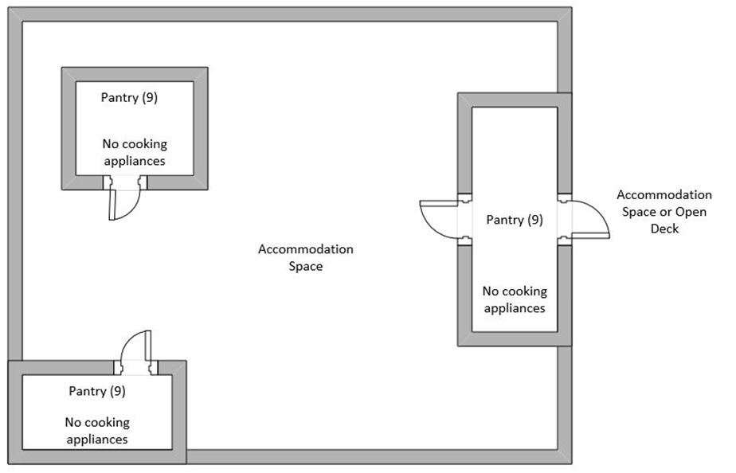
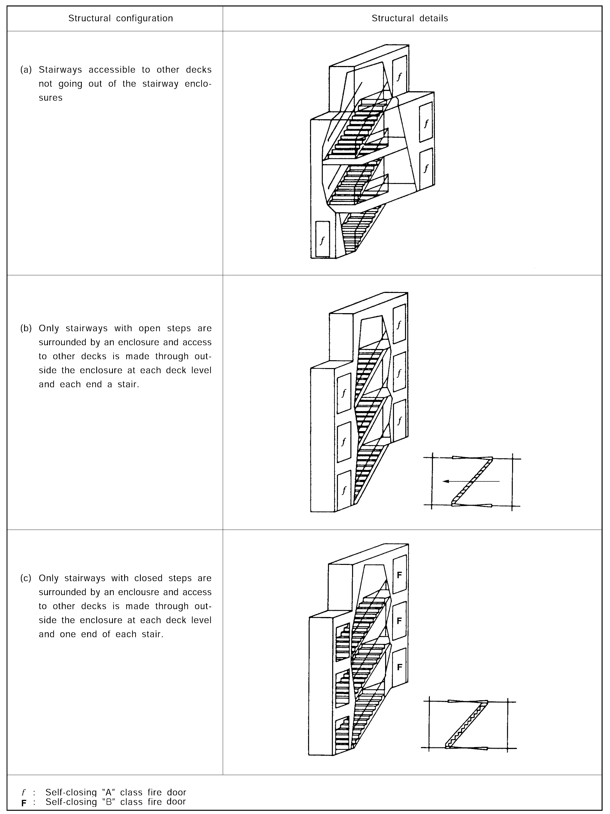
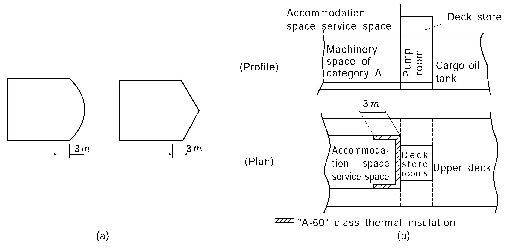
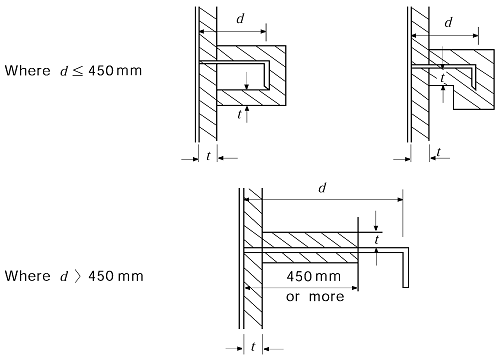
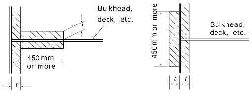
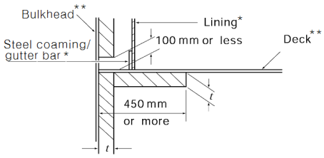
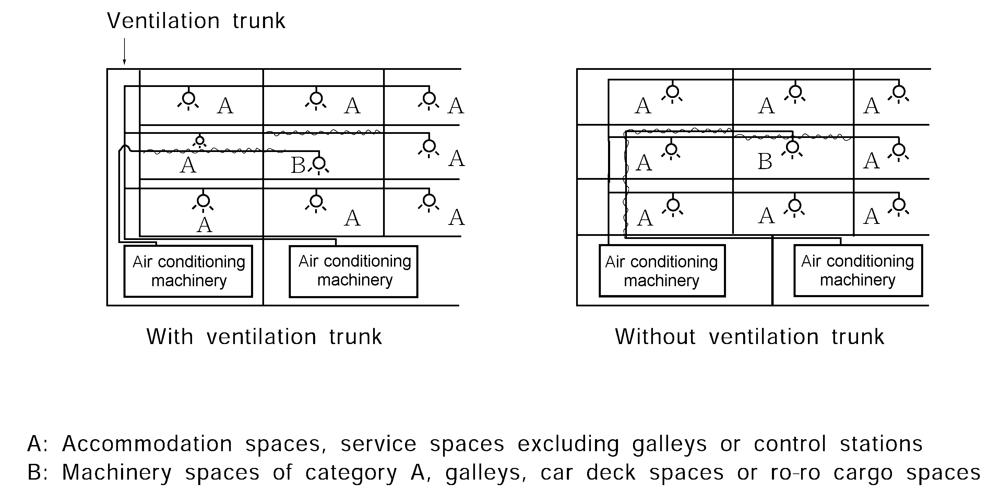
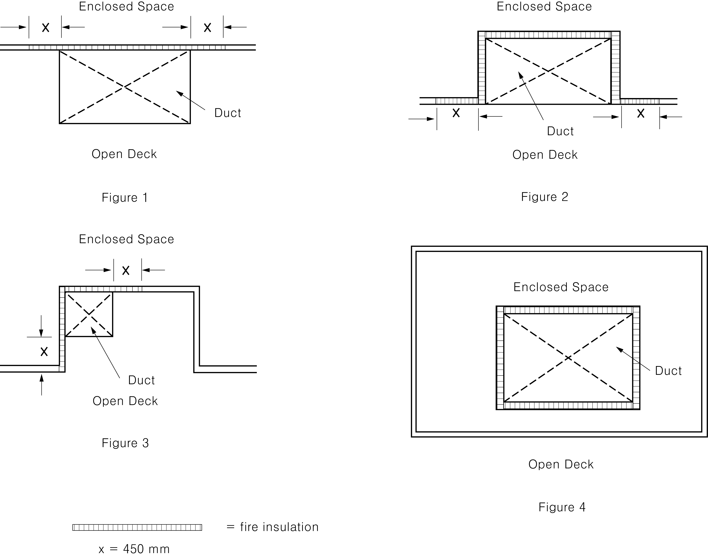

# PART 8 Fire Protection and Fire Extinction

> RULES FOR CLASSIFICATION OF STEEL SHIPS / RA-08-E / 2025 / EN / Guidance

## CHAPTER 7 CONTAINMENT OF FIRE

### Section 1 Thermal and Structural Boundaries

#### 101. Thermal and structural boundaries 【See Rule】

- **1.** Spaces of categories for the application of the standards of fire integrity are also to be complied with **Table 8.7.1** of the Guidance.
- **2.** In application to **Ch 7, 102. 4** (4), **103. 3** (4) and **104. 2** (4) of the Rules, the term "doors may be constructed of materials which are to the satisfaction of the Society." means those complying with the requirements for door required watertight and weathertight specified in Load Line Convention, and where the material of door is non-fire resistant materials is to be complied with the requirements for non-fire resistant materials specified in **Ch 3**, **202.** and **Ch 4**, **Sec 1** of the Rules. *(2017)*
  **Table 8.7.1 Categories of spaces of fire integrity**

  | Control stations | Spaces containing navigational apparatus (steering stand, compass and radar equipment), Electric rooms (where charging/discharging panels or battery charges are located), battery rooms, generator rooms(or inverter rooms) for navigational apparatus and radio, Spaces containing control systems and storage rooms of fire-extinguishing medium for fixed fire extinguishing systems(see Note (5) below), Navigation locker(see Note (6) below) |
  | --- | --- |
  | Service spaces (low risk) | Shore connection box rooms, accommodation ladder winch machinery rooms, spaces where distribution panels and starters are located, ballast control rooms, main cargo control rooms Electric rooms (where transformers, switchboards (see Note (7) below), motor-generators, etc. of less than 50 kVA (kW) are located and having area s of less than 4 m2) |
  | Other machinery spaces | Storage rooms for hydraulic units for deck machinery and cargo gears, steering gear room (see Note (1) below), Spaces containing deck foam systems (See Note (8) below), inert gas fan rooms, Electric rooms (except those categorized as control stations or service spaces with low risk of fire), Propulsion motor rooms, Propulsion motor control rooms, Emergency fire pump rooms (See Note (9) below), Spaces other than machinery spaces of category A where fuel oil piping lines are located |
  | Service spaces (high risk) | Oxygen or acetylene bottle storage rooms(see Note (2) below), provision store rooms(see Note (3) below), jumper lockers(see Note (4) below), Storage rooms for gaseous fuel (See Note (10) below) |
  | Others | 1. Passages under decks of container ships with self-closing gas-tight doors separating the spaces from cargo spaces effectively are to be regarded as void spaces. However, in case where they serve as escape route, they are to be regarded as corridors. (If they serve as second escape route for machinery spaces of category A, they are to be regarded as other machinery spaces.) *(2023)* 2. In this case, locker rooms, store rooms, lavatories for control stations, etc., in which someone may occupy temporarily, having no entrance to corridors but only entrance therefrom may be regarded as an integral part of such spaces. If a space is divided into two(or more) smaller spaces so that these new spaces form enclosed spaces(e.g. a cabinet built in a mess-room, a store room built in a mess-room), these new enclosed spaces are to be surrounded by fire-resistant bulkheads and decks in accordance with Rules. 3. Weather decks used to cargo stowage are to be considered as cargo spaces except for cargoes which constitute a low fire risk. 4. Ventilating fan rooms within refrigerated cargo spaces and cargo handling gear locker which can be accessible only from ro/ro spaces or vehicle spaces may be regarded as a part of Cargo spaces, ro-ro and vehicle spaces respectively. 5. Duct spaces and cable trunks are to apply to the requirements of **103. 4** of the Rules for lift trunks |

  **Table 8.7.1 Categories of spaces of fire integrity (continued)**

  | Notes: (1) In case where an emergency fire pump is installed in the steering gear room or spaces which are only accessible directly therefrom, the fire integrity of boundaries between the space where the main fire pump is installed and the steering gear room is to be in accordance with **Fig 8.8.2** of the Guidance. (2) In case where one side or more of the walls are open to exposed deck, such storage rooms may be regarded as those on open deck. (3) Refrigerated provision chambers are to be service spaces(high risk) if thermally insulated with combustible materials, or service spaces(low risk) if thermally insulated with non-combustible material. Provision chambers having areas of less than 4 $\mathrm{m}^{ 2}$ may be considered as a service space with low risk of fire. (4) In case where jumper lockers are used as Oil skin lockers, they are regarded as high risk service spaces, except for Oil skin lockers, they are regarded as accommodation spaces. (5) Except where permitted to be stored in the space protected by that fixed fire-extinguishing system according to the type of the system. (6) A navigation locker that can only be accessed from the wheelhouse should be considered as a control station, and the bulkhead separating the wheelhouse and such a locker should have fire integrity of at least "B-0" class. (7) Small distribution boards may be located behind panels/linings within accommodation spaces including stairway enclosures, provided no provision is made for storage. Such location need not to be considered as a separate space nor categorized as a service space with low risk of fire. (8) Attention is paid to the provisions of **Ch 2, 402. 2** of the Guidance. (9) The fire integrity of boundaries separating from the space where the main fire pump is installed is to be in accordance with **Ch 8, 102. 3** (2) (A) of the Rules. (10) The provisions of **Ch 2, 201.** of the Rules are to apply. In case where a portion of open deck, recessed into deck structure, machinery casing, deck house, etc., utilized for the exclusive storage of gas bottles in accordance with the provisions of **Ch 2, 201.** of the Guidance, such a location may be regarded as open decks. |
  | --- |

#### 102. Passenger ships

- **1.** In applying **102. 1** (2) of the Rules, if a stairway serves two main vertical zones, the maximum length of any one main vertical zone need not be measured from the far side of the stairway enclosure. In this case all boundaries of the stairway enclosure are to be insulated as main vertical zone bulkhead and access doors leading into the stairway are to be provided from the two outside zones. The number of main vertical zone of 48 $\mathrm{m}$ is not limited as long as they comply with all the requirements. **【See Rule】**
- **2.** In applying "acceptable material for "B" class divisions" in **102. 2** of the Rules, if the extended bulkhead is of B-0 class standard, then the extension may be made of thin steel plates of 1.6mm thickness or a suitably supported mineral wool (density at least 100 kg/m^3, thickness at least 50 mm).*(2018)* **【See Rule】**
- **3.** In applying **102. 2** (3) of the Rules, if an air gap between cabins results in an opening in the continuous class B-15 ceiling, the bulkheads on both sides of the air gap are to be of class B-15. **【See Rule】**
- **4.** In applying **102. 3** (1) of the Rules, distribution board may be located behind panels/linings within accommodation spaces including stairway enclosures, without the need to categorize the space, provided no provision is made for storage. **【See Rule】**
- **5.** Fire risk assessments for furniture and furnishings in external areas(e.g. evacuation stations and external escape routes, open deck space) in **102. 3** (2) of the Rules may refer to MSC.1/Circ.1274 (as amended). *(2020)*
- **6.** In applying **102. 3** (2) (B) ⑨ of the Rules, "Isolated pantries containing no cooking appliances in accommodation spaces" are pantries enclosed in an accommodation space and are only accessible from accommodation spaces and/or open deck. For the purpose of this categorization, "accommodation space" is as defined in **103. 1** of the Rules. These pantries should not have communicating openings to spaces other than accommodation spaces, such as "main galley" in category ⑫ (see **Fig 8.7.1** of the Guidance).
  
  **Fig 8.7.1 Example of isolated pantries containing no cooking appliances in accommodation spaces**

#### 103. Cargo Ships except tankers

- **1.** **1**. In applying **103. 1** (1) (C) of the Rules, increasing area for public spaces is, in principle, to be limited to 75 $\mathrm{m} ^{2}$. **【See Rule】**
- **2.** In applying **103. 4** (1) of the Rules, stairway penetrating more than a single deck are to be protected in accordance with the following requirements: **【See Rule】**
  - **(1)** In case where stairways and passages are provided in stairway enclosures and access to other decks is possible through such stairway enclosures, self-closing "A" class fire doors are to be provided at each deck level(see **Fig 8.7.2** (a) of the Guidance).
  - **(2)** In case where only stairways are provided in stairway enclosures and access to other decks is made through outside the enclosures at each deck level, the following requirements are to be complied with:
    - **(A)** In case of stairways with open steps, they are to be protected by self-closing "A" class fire doors at each deck level and at each end of a stair(see **Fig 8.7.2** (b) of the Guidance).
    - **(B)** In case of stairways with closed steps, self-closing "B" class fire doors are to be provided at least at one end of each stair (see **Fig 8.7.2** (c) of the Guidance).
- **3.** In applying **Table 8.7.5** and **8.7.6** of the Rules, the following requirements are to be applied.
  - **(1)** Decks and bulkheads
    Decks and bulkheads to be insulated to "A-30" fire integrity are those boundaries of single spaces protected by their own fire-extinguishing system.
  - **(2)** Hatches
    Class "A" fire integrity respectively does not apply to hatches fitted on open deck adjacent to ro-ro/vehicle spaces and on decks separating ro-ro/vehicle spaces, provided that such hatches are constructed of steel.
  - **(3)** Access doors
    "A-0" fire integrity does not apply to access doors to ro-ro/vehicle spaces fitted on open decks, provided that such access doors are constructed of steel.
  - **(4)** Movable ramps
    Movable ramps installed on decks referred to in (1) above which form boundaries of "A-30" fire integrity shall be constructed of steel and shall be insulated to "A-30" fire integrity, except for the "working parts" of such movable ramps (e.g. hydraulic cylinders, associated pipes/accessories) and members supporting such fittings which do not contribute to the structural strength of the boundary. Such movable ramps need not be subject to fire test. This is applicable to non-watertight doors used for loading/unloading of vehicles.
  - **(5)** Ventilation ducts
    Where ducts for a ro-ro/vehicle spaces pass through other ro-ro/vehicle spaces without serving those spaces, each duct shall be insulated all along itself to "A-30" fire integrity in ways of other ro-ro/vehicle spaces unless the sleeves and fire dampers in compliance with **Ch 7, 603. 1** of the Rules in order to prevent spread of fire through the ducts are fitted. *(2017)*
  - **(6)** Ventilators
    "A-0" fire integrity does not apply to ventilators constructed of steel fitted on open decks adjacent to ro-ro/vehicle spaces. *(2017)*
    
    **Fig 8.7.2 Protection of the stairway enclosures penetrating more than a single deck**

#### 104. Tankers

- **1.** In applying **104. 2** (5) of the Rules, insulation of superstructures and deckhouses facing the cargo area are to be in accordance with the following requirements: **【See Rule】**
  - **(1)** "The outward sides for a distance of 3 $\mathrm{m}$ from the end boundary" refer to the **Fig 8.7.3** (a) of the Guidance.
  - **(2)** In the case of the arrangement as shown in **Fig 8.7.3** (b) of the Guidance, "A-60" class insulation is to be applied to the aft end bulkhead of deck store and side walls of accommodation spaces and service spaces of 3 $\mathrm{m}$ from the fore end thereof where they form the external boundaries of accommodation spaces and service spaces.
  - **(3)** "A-60" class Insulation requirements for the side walls for 3 $\mathrm{m}$ aft of the front bulkhead are to apply to all areas in the vertical direction up to the underside of the deck of the navigation bridge for superstructures and deckhouses.
  - **(4)** The side walls of a wheelhouse having the structural arrangement unlikely to be exposed to flames in case of fire in way of cargo area(e.g. structural arrangement of a wheelhouse provided on the sponson deck) may not be provided with the insulation.
    
    **Fig 8.7.3 Insulation of superstructures and deckhouses facing the cargo area**
- **2.** In application to **Ch 3, 102. 4** (5), **103. 3** (4) and **104. 2** (4) of the Rules, the term "doors may be constructed of materials which are to the satisfaction of the Society." means those complying with the requirements for door required watertight and weathertight specified in Load Line Convention and material of door is to be complied with the requirements for non-fire resistant materials specified in **Ch 3**, **202.** and **Ch 4**, **Sec 1** of the Rules. **【See Rule】**

### Section 2 Penetration in Fire-resisting Divisions and Prevention of Heat Transmission

#### 201. Penetration in fire-resisting divisions and prevention of heat transmission 【See Rule】

- **1.** The structural arrangements penetrated through "A"or "B" class divisions are to be in accordance with **Annex 8-2** of the Guidance, and in addition electric cable penetrations are also to be complied with the requirement of **Pt 6, Ch1, 508.** of the Guidance.
- **2.** In applying **201. 4** of the Rules, treatment of terminal points and intersections of insulated bulkheads and decks" is to be in accordance with **Fig 8.7.4** of the Guidance.

  | Treatment of terminal points and intersections | Structural details |
  | --- | --- |
  | (1) Insulation of stiffeners, girders, etc., in case where their depth is 450 $\mathrm{mm}$ or less, is to be applied to the whole structure including the flanges or faceplates. Where the depth exceeds 450 $\mathrm{mm}$, such insulation is to be applied to at least 450 $\mathrm{mm}$ in depth from bulkheads or decks. However, in case where the fire integrity has been verified by a standard fire test, this requirement may be dispensed with. |  |
  | (2) The structural extension of insulation at intersections between uninsulated bulkheads, decks or brackets is to be 450 $\mathrm{mm}$ or more. |  |
  | (3) In case where the lower part of insulation has to be cut for drainage, the construction is to be in accordance with the structural details. |  * : Lining and steel coaming/gutter bar are for accommodation spaces only. ** : For the purpose of figure above, bulkhead and deck are of steel construction only. |
  | $t$ : Thickness of thermal insulation $d$ : Depth of stiffener or girder |   |

### Section 3 Protection of Openings in Fire-resisting Divisions

#### 301. Openings in bulkheads and decks in passenger ships

- **1.** In applying **301. 1** (7) of the Rules, doors which open to exposed areas from stairways need not apply the criteria of A class integrity, and the requirements of (5) need not apply. (For doors which open to outside stairways and open decks which are used for life saving appliances, evacuation stations, outside muster stations and escape routes, the doors are to be constructed of steel or other equivalent materials.) However, windows installed in the doors are to be constructed of A-60 or A-0 + sprinkler head for windows. *(2018)* **【See Rule】**
- **2.** Balancing openings or ducts between two enclosed spaces are prohibited except for openings as permitted by **301. 2** & **302.** of the Rules. **【See Rule】**
- **3.** In applying **301. 3** (3) (C) of the Rules, should be in accordance with the **Res.MSC.265(84) and Res.MSC.284(86)**. **【See Rule】**

#### 302. Doors in fire-resisting divisions in cargo ships 【See Rule】

- **1.** In applying **302. 1** of the Rules, where required divisions are replaced by divisions of a higher standard, the door need only conform to the required division.
- **2.** In applying **302. 2** of the Rules, "Remote release devices of fail-safe type" means the system which releases hooks or other equivalent devices by remote operation, and that the door is automatically closed even in case of failure of the system.
- **3.** In applying **302. 3** of the Rules, in case where ventilation openings are provided on corridor bulkheads, the following requirements are to be complied with
  - **(1)** For corridor bulkheads except stairway enclosures required to have "B" class fire integrity, "B" class fire door with louvres of approved type leading to lavatories, offices, pantries, lockers and store rooms may be provided. In this case, the louvres are to be capable of being closed from the corridor side.
  - **(2)** For duct trunks adjoining to corridor bulkheads, ventilation openings with manual closing appliances may be provided. In this case, grids made of non-combustible materials are to be fitted to the ventilation openings. Furthermore, in case where the sectional area of such a ventilation opening exceeds 0.075 $\mathrm{m} ^{2}$, self-closing type fire damper is to be provided in addition to the manual closing appliances.

### Section 5 Protection of Cargo Space Boundaries

#### 501. Protection of cargo space boundaries

When ships are designed to transport alternatively oil or dry cargoes, openings which may be used for cargo operations are not permitted in bulkheads and decks separating oil cargo spaces from other spaces not designed and equipped for the carriage of oil cargoes unless alternative approved means are provided to ensure equivalent integrity. **【See Rule】**

### Section 6 Ventilation Systems 【See Rule】

#### 601. General

- **1.** Exhaust ventilations of accommodation spaces, service spaces and control stations to be effected through the exhaust ventilation ducts except where ventilation openings are accepted under **302. 3** of the Guidance.
- **2.** In applying **601. 1.** of the Rules, a ventilation duct made of material other than steel may be considered equivalent to a ventilation duct made of steel, provided the material is non-combustible and has passed a standard fire test in accordance with Annex 1: Part 3 of the FTP Code as non-load bearing structure for 30 minutes following the requirements for testing "B" class divisions.(SC264)
- **3.** In applying **601. 1.** (1) of the Rules, the measurement of calorific value is to be in accordance with **ISO 1716**.

#### 602. Arrangement of ducts

- **1.** In applying **602. 4** of the Rules, "A-60" class insulation" is, as a standard, to be an insulation with rock-wool approved as non-combustible material, or insulation approved as "A-60" class standard and arrangement of ducts are to be in accordance with **Fig 8.7.5** of the Guidance.
- **2.** In applying **602.** and **605. 1** & **2** of the Rules for determining fire insulation for trunks and ducts which pass through an enclosed space, the term "pass through" means the part of the trunk/duct contiguous to the enclosed space. (see **Fig 8.7.6** of the Guidance.) *(2024)*
  
  **Fig 8.7.5 Examples for arrangements of Ventilation system**
  
  **Fig 8.7.6 Examples of ducts contiguous to enclosed space**

#### 603. Details of fire dampers and duct penetrations

- **1.** In applying **603. 1** (3) of the Rules, "Fire dampers automatically" is to be the fuse type dampers or those considered to be equivalent by the Society. "Being closed manually" means closing by mechanical means of release or by remote operation of the fire damper by means of a fail-safe electrical switch or pneumatic release(spring-loaded, etc.) on both sides of the division.
- **2.** Ventilation inlets and outlets located at outside boundaries are to be fitted with closing appliances as required by **Ch 3 101.** of the Rules and need not comply with **603.** of the Rules.
- **3.** In applying **603. 1** of the Rules, ducts or pipes with free sectional area of 0.075 $m ^{2}$ or less need to be fitted with fire damper at their passage through Class "A" divisions in those cases indicated in **602. 2** and **3** of the Rules. The fire damper can be omitted if the duct is arranged in compliance with the requirements of **602. 4** (5) and (6) of the Rules.
- **4.** When a duct passing through a division is to be in accordance with **201. 2** and **603. 2** of the Rules, no clearance should be allowed between the duct and the B class division. *(2024)*

#### 605. Exhaust ducts from galley ranges (2017)

- **1.** The exhaust ducts from galley ranges are to be in accordance with the following requirements: *(2021)*
  - **(1)** The exhaust ducts from galley ranges are, in principle, to be independent from other ducts. In case where this is impracticable, self-closing type fire dampers which can be remotely operated are to be fitted to the other branch ducts in order to be capable of closing these dampers together with those for galley ranges simultaneously.
  - **(2)** Unless otherwise permitted by the Society, the term of "spaces containing combustible materials" will normally apply to all spaces in accommodation.
  - **(3)** With respect to fixed means for extinguishing a fire specified in **1** (3) & **3** (4) of the rules, these are to be apply ISO 15371 which is given as an example of a suitable performance standard for pre-engineered galley duct fixed fire-extinguishing systems. CO2 fire-extinguishing systems, which are not applicable to ISO 15371 should be designed according to the requirements set out in **Ch 8**, **503. 1** (1) of the Rules (spaces containing flammable liquids) or another suitable standard acceptable to the Society. *(2020)*
- **2.** In applying **605. 1** of the Rules, the requirements to exhaust ducts from galley ranges in which grease or fat is likely to accumulate will apply to all exhaust ducts from galley ranges.(SC 108)
- **3.** In applying 605. 1 and 3 of the Rules, fire dampers do not need to pass the fire test in either Res. A. 754(18) or FTP code Annex 1 Part 3, but should be of steel and capable of stopping the draught. The requirements to “A” class applies only to the part of the duct outside of the galley. And the term"spaces containing combustible materials" will normally apply to all spaces in accommodation. The provisions of this 3 should be applied to ships built before January 1, 2016. 
