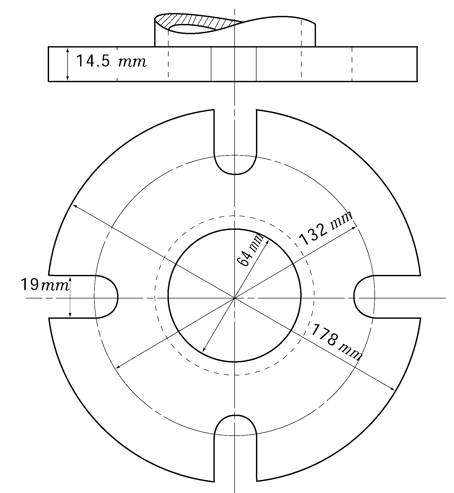
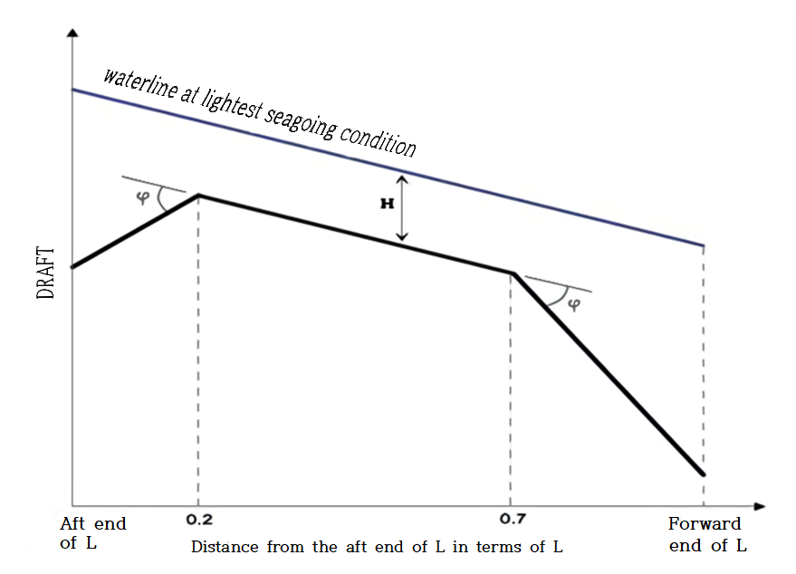
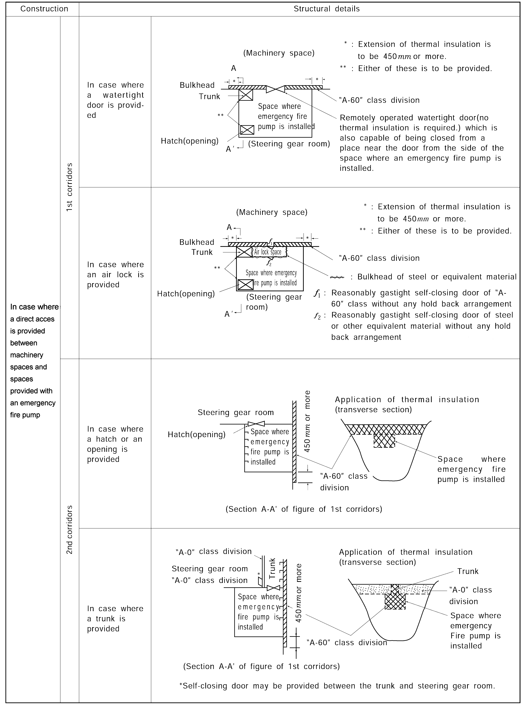
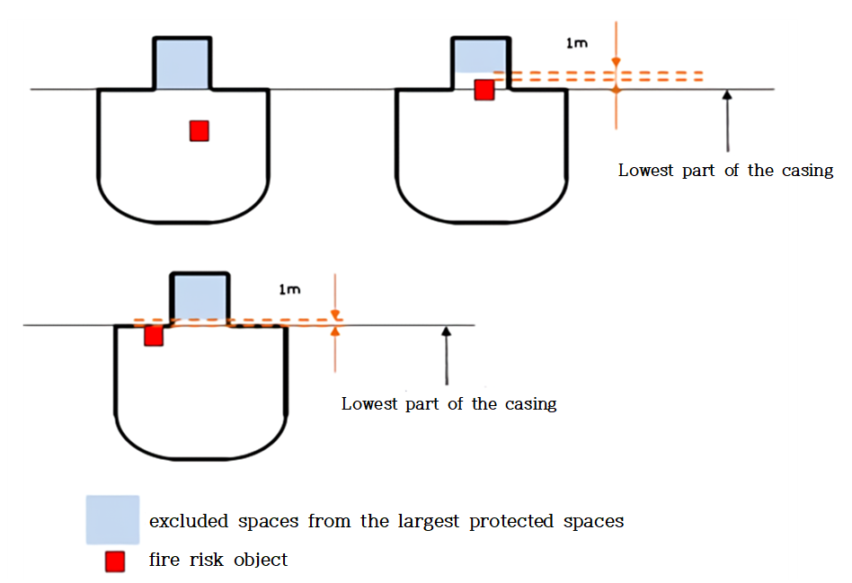
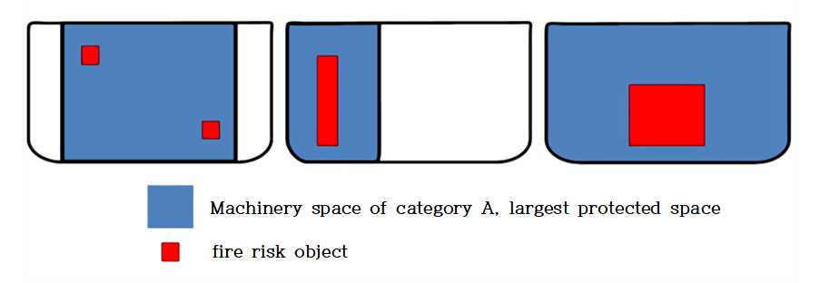
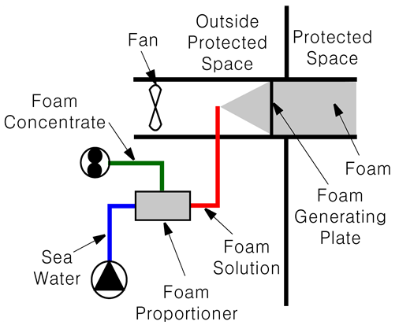
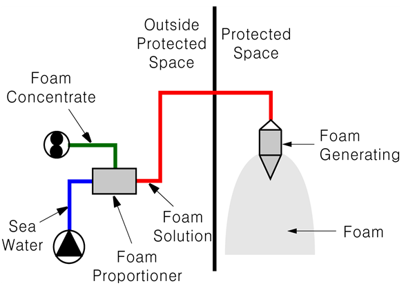
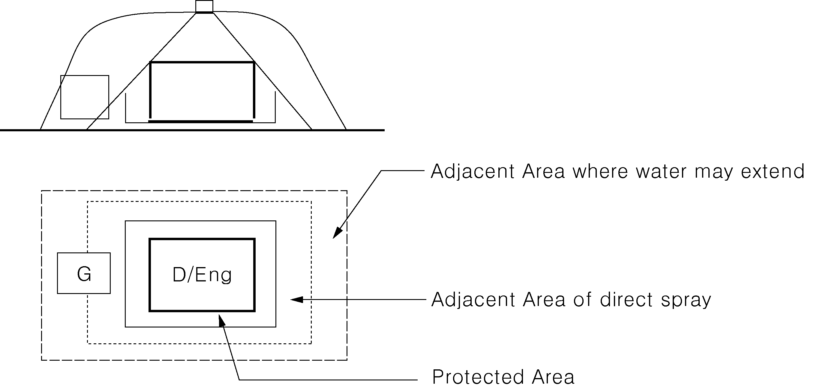

# PART 8 Fire Protection and Fire Extinction

> RULES FOR CLASSIFICATION OF STEEL SHIPS / RA-08-E / 2025 / EN / Guidance

## CHAPTER 8 FIRE FIGHTING

### Section 1 Water Supply System

#### 101. Water supply systems

- **1.** In application to **101. 4** (1) of the Rules, the following requirements are to be complied with. **【See Rule】**
  - **(1)** Any part of the fire main routed through a category A machinery space, except for short lengths of suction or discharge piping complying with **101. 4** (1) of the Rules, shall be fitted with isolating valves outside of the space. The arrangements of the fire mains shall allow for fire water from the fire pumps or emergency fire pump to reach all hydrants outside of the isolated space. Isolating valves are not applicable to the piping from fire pumps located in spaces other than category A machinery spaces.
  - **(2)** In cases where suction or discharge piping penetrating machinery spaces are enclosed in a substantial steel casing, or insulated to “A-60” class standards, it is not necessary to insulate distance pieces, sea inlet valves and sea-chests.
  - **(3)** The method for insulating pipes to “A-60” class standards is that they are to be covered/protected in a practical manner by insulation material which is approved as a part of “A-60” class divisions in accordance with the FTP Code.
  - **(4)** Where the sea inlet valve is in the machinery space, the valve should not be a fail-close type. Where the sea inlet valve is in the machinery space and is not a fail-open type, measures should be taken so that the valve can be opened in the event of fire, e.g. control piping, actuating devices and/or electric cables with fire resistant protection equivalent to “A-60” class standards.
  - **(5)** In cases where main fire pumps are provided in compartments outside machinery spaces and where the emergency fire pump suction or discharge piping penetrates such compartments, the above interpretation is to be applied to the piping.
- **2.** In application to **101. 4** (4) of the Rules, the complete interpretation of the phrase "the isolation valves shall be fitted in the fire main at the poop front in a protected position" would be that the valve should be located within an accommodation space, service spaces or control station. However, the valve may be located on the open deck aft of the cargo area provided that the valve is located: *(2018)* **【See Rule】**
  - **(1)** at least 5 m aft of the aft end of the aftermost cargo tank; or
  - **(2)** if the above.1 is not practical, within 5 m aft of the aft end of the aftermost cargo tank provided the valve is protected by a permanent steel obstruction.
- **3.** In applying **101. 6** of the Rules, the minimum pressure is to be sufficient to produce a 12 $\mathrm{m}$ jet throw, through any adjacent hydrants, to any part of the ships referred to **401. 5** (1) of the Rules, on passenger and cargo ships under 1,000 tonnes gross tonnage. **【See Rule】**
- **4.** In applying **101. 7** of the Rules, Standard dimensions of flanges for the international shore connection shall be in accordance with the **Table 8.8.1** of the Guidance. And International shore connections shall be of steel or other equivalent material and shall be designed for 1.0 $\mathrm{MPa}$ services. The flange shall have a flat face on one side and, on the other side, it shall be permanently attached to a coupling that will fit the ship's hydrant and hose. The connection shall be kept aboard the ship together with a gasket of any material suitable for 1.0 $\mathrm{MPa}$ services. **【See Rule】**
  **Table 8.8.1 Standard dimensions of flanges for the international shore connection**

  | Description | Dimension |  |
  | --- | --- | --- |
  | Outside diameter | 178 $\mathrm{mm}$ |   |
  | Inside diameter | 64 $\mathrm{mm}$ |   |
  | Bolt circle diameter | 132 $\mathrm{mm}$ |   |
  | Slots in flange | 4 holes 19 $\mathrm{mm}$ in diameter spaced equidistantly on a bolt circle of the above diameter, slotted to the flange periphery |   |
  | Flange thickness | 14.5 $\mathrm{mm}$ minimum |   |
  | Bolts and nuts | 4 ea, each of 16 $\mathrm{mm}$ diameter, 50 $\mathrm{mm}$ in length including eight(8) washers |   |

#### 102. Fire pump

- **1.** In applying **102. 3** of the Rules, on ships for navigation in ice, on ships for navigation in polar water and on ships for navigation in polar and ice breaking service is to be in accordance with the relevant requirements in **Ch 1, 702., Ch2 308.** and **Ch 2 408.** of **Guidance for Ships for Navigation in Ice. 【See Rule】**
- **2.** In applying **102. 3** (1) (B) of the Rules, the following requirements are to be complied with.
  - **(1)** The electrical cables to the emergency fire pump are not to pass through the machinery spaces containing the main fire pumps and their sources of power and prime movers. They are to be of a fire resistant type approve by the Society, where they pass through other high fire risk areas.
  - **(2)** Unless the two main fire pumps, their sea suctions and the fuel supply or source of power for each pump are situated within compartments separated at least by A-0 divisions, so that a fire in any one compartment will not render both fire pumps inoperable, an emergency fire pump should be fitted.
  - **(3)** An arrangement in which one main fire pump is located in a compartment having more than one bulkhead adjacent to the compartment containing the other main fire pump should also require an emergency fire pump.
- **3.** In applying **102. 3** (2) of the Rules, emergency fire pumps is not applicable to passenger ships of l,000 gross tonnage and upwards and is also, in principle, to be complied with as follows,
  - **(1)** The emergency fire pump shall be of a fixed independently driven power-operated pump.
  - **(2)** Capacity of emergency fire pump **【See Rule】**

    | Nozzle size Pressure at Hydrant | 16 mm | 19 mm |
    | --- | --- | --- |
    | 0.27 $\mathrm{N}/mm ^{2}$ | 16 $\mathrm{m} ^{3} /h$ | 23.5 $\mathrm{m} ^{3} /h$ |
    - **(A)** The capacity of the pump shall not be less than 40 % of the total capacity of the fire pumps specified in **102. 4** of the Rules and in any case not less than
      - **(a)** for passenger ships less than 1000 gross tonnage and for cargo ships of 2000 gross tonnage and upwards ; 25 cubic meters/h
      - **(b)** for cargo ships less than 2000 gross tonnage ; 15 cubic meters/h.
    - **(B)** In applying **301. 1** of the Rules, where a fixed water-based fire extinguishing system installed for the protection of the machinery space of cargo ships is supplied by the emergency fire pump, the emergency fire pump capacity shall be adequate to supply the fixed fire extinguishing system at the required pressure plus two jets of water. The capacity of the two jets shall in any case be calculated by that emanating from the biggest nozzle size available onboard from the **Table 8.8.2** of the Guidance(When selecting the biggest nozzle size available onboard, the nozzles located in the space where the main fire pumps are located can be excluded), but shall not be less than 25 $\mathrm{m} ^{3} /h$
  - **(3)** When the pump is delivering the quantity of water required by paragraph (2) the pressure at any hydrants shall be not less than the minimum pressure specified in the Rules.
  - **(4)** The total suction head and the net positive suction head of the pump are to be determined having due regard to the requirements on the pump capacity and on the hydrant pressure under all conditions of list, trim, roll and pitch likely to be encountered in service. The ballast condition of a ship on entering or leaving a dry dock need not be considered a service condition. In all cases the net positive suction head (NPSH) available for the pump is to be greater than the NPSH required. Upon completion of the emergency fire pump installation, a performance test confirming the capacity required in **102. 3** (2) of the Guidance is to be carried out and, if the emergency fire pump is the main supply of water for any fixed fire extinguishing system provided to protect the spaces where the main fire pumps are located, the pump is to have the capacity for this system. As far as practicable, the test should be carried out at lightest seagoing draught at the suction position. It is to be documented that the suction inlet is fully submerged under “all conditions of list, trim, roll and pitch likely to be encountered in service” as given below.

    | L (m) | 75 and below | 100 | 125 | 150 | 175 | 200 | 225 | 250 | 300 | 350 and above |
    | --- | --- | --- | --- | --- | --- | --- | --- | --- | --- | --- |
    | ᛰ (deg) | 4.5 | 4 | 3.2 | 2.7 | 2.3 | 2.1 | 1.8 | 1.7 | 1.6 | 1.5 |
    | H (m) | 0.73 | 0.8 | 0.87 | 0.93 | 0.98 | 1.03 | 1.07 | 1.11 | 1.19 | 1.25 |

    Note: Values at the intermediate length of ships are to be obtained by linear interpolation.
    Where:
    L : length of the ship, in meters, as defined in the International Convention on Load Lines in force, or length between perpendiculars at the ballast draught, whichever is greater
    φ : pitch angle (measured from still waterline and downwards) as defined in **Fig 8.8.1** of the Guidance
    H : heave amplitude as defined in **Fig 8.8.1** of the Guidance
    Heave combined roll angle(measured from still waterline and downwards) is to be taken as:
    (ⅰ) ships with bilge keels: 11°
    (ⅱ) ships without bilge keels: 13°
    
    **Fig 8.8.1 Waterline for which heave combined pitch is taken into account**
    - **(A)** Operational seagoing condition for which roll, pitch and heave are to be applied is as follows. The lightest seagoing condition is to be considered, which is defined as the ballast condition which gives the are shallowest draught at the position of the sea chest and emergency fire pump as given in the approved stability booklet(or preliminary stability calculation for new building). The following table is to be applied for the calculation of roll, pitch and heave. The heave combined pitch and heave combined roll are taken into account separately.
      - **(a)** Heave combined pitch (The heave combined pitch is taken into account as in **Fig 8.8.1** of the Guidance.) in head sea
      - **(b)** Heave combined roll in beam sea
    - **(B)** The emergency fire pump suction is to be submerged at the waterlines corresponding to the two following conditions and for either condition, roll, pitch and heave need not be applied.
      - **(a)** a static waterline drawn through the level of 2/3 immersion of the propeller at even keel (for pod or thruster driven ship, special consideration should be given)
      - **(b)** the ship in the arrival ballast condition, as per the approved trim and stability booklet, without cargo and with 10% stores and fuel remaining.
    - **(C)** A ship operating solely in sheltered water is to be subject to compliance with the still water submergence requirements set out in paragraph (B) (a)
  - **(5)** Any diesel driven power source for the pump shall be capable of being readily started in its cold condition down to the temperature of 0 ℃ by hand(manual) cranking. Where ready starting cannot be assured, if this is impracticable, or if lower temperatures are likely to be encountered, and if the room for the diesel driven power source is not heated, electric heating of the diesel engine cooling water or lubricating oil system is to be fitted, to the satisfaction of the Society. If hand(manual) starting is impracticable, the Society may permit compressed air, electricity, or other sources of stored energy, including hydraulic power or starting cartridges to be used as a means of starting. These means shall be such as to enable the diesel driven power source to be started at least six times within a period of 30 min and at least twice within the first 10 min.
  - **(6)** Any service fuel tank shall contain sufficient fuel to enable the pump to run on full load for at least three hours and sufficient reserves of fuel shall be available outside the machinery space of category A to enable the pump to be run on full load for an additional 15 h.
  - **(7)** The room where the pump and prime mover are installed is to have adequate space for maintenance work and inspections.
  - **(8)** Where necessary to ensure priming, the emergency fire pump should be of the self priming type.
  - **(9)** Where a power-operated emergency fire pump is fitted, its fuel or power supply is to be so arranged that it will not readily be affected by a fire in the compartment containing the main fire pumps. *(2024)*
- **4.** In applying **102. 3** (2) (A) of the Rule, when a single access to the emergency fire pump room is through another spaces adjoining a machinery space of category A or the spaces containing the main fire pumps, class A-60 boundary is required between the other space and the machinery space of category A or the spaces containing the main fire pumps.
- **5.** In applying **102. 3** (2) (B) of the Rule, if a direct access between machinery spaces provided with the main fire pumps are installed and spaces provided with an emergency fire pump or the second means of access to the space provided with an emergency fire pump is inevitably provided, **Fig 8.8.2** of the Guidance is to be referred to as the standard arrangements.
- **6.** In applying **102. 3** (3) of the Rules, this paragraph does not force designers to choose pumps with capacity and pressure characteristics other than that being optimal for the service intended, just to make their connection to the fire main possible, provided the required number and capacity of fire pumps are already fitted.

#### 103. Fire hoses and nozzles 【See Rule】

Aluminium alloys may be used for fire hose couplings and nozzles, except in open deck areas of oil tankers and chemical tankers. And fire hose nozzles made of plastic type material, e.g. polycarbonate, are considered acceptable provided capacity and serviceability are documented and the nozzles are found suitable for the marine environment.

**Fig 8.8.2 Corridors in machinery spaces and spaces provided with emergency fire pumps**

### Section 2 Portable Fire Extinguisher

#### 201. Portable fire extinguisher 【See Rule】

- **1.** All fire extinguishers shall be of approved types and designs based on the guidelines **Res. A. 951(23)** developed by the IMO.
- **2.** Each powder or carbon dioxide extinguisher shall have a capacity of at least 5 $\mathrm{kg}$, and each foam extinguisher shall have a capacity of at least 9 $\mathrm{L}$. The mass of all portable fire extinguishers shall not exceed 23 $\mathrm{kg}$, and they shall have a fire-extinguishing capability at least equivalent to that of a 9 $\mathrm{L}$ fluid extinguisher.
- **3.** Only refills approved for the fire extinguisher in question shall be used for recharging.
- **4.** In applying **401. 2** (1) and **402. 2** (2) of the Rules, a portable foam applicator unit shall consist of a foam nozzle/branch pipe, either of a self-inducing type or in combination with a separate inductor, capable of being connected to the fire main by a fire hose, together with a portable tank containing at least 20 $\mathrm{L}$ of foam concentrate and at least one spare tank of foam concentrate of the same capacity, and the System performance is as follows.
  - **(1)** The nozzle/branch pipe and inductor shall be capable of producing effective foam suitable for extinguishing an oil fire, at a foam solution flow rate of at least 200 $\mathrm{L}$/min at the nominal pressure in the fire main.
  - **(2)** The foam concentrate shall be approved by the Flag Administration in which the ship is registered or to be registered based on the guideline developed by the IMO. However, in case where there is no expressly provided national regulations, the foam concentrate shall be approved by the Contracting Government of the SOLAS or the Society.
    * Refer to the Guidelines for the performance and testing criteria and surveys of low-expansion foam concentrates for fixed fire-extinguishing systems (MSC/Circ.582/Corr.1).
  - **(3)** The values of the foam expansion and drainage time of the foam produced by the portable foam applicator unit shall not differ more than ± 10 % of that determined in (B).
  - **(4)** The portable foam applicator unit shall be designed to withstand clogging, ambient temperature changes, vibration, humidity, shock, impact and corrosion normally encountered on ships.
    **20 2. Arrangement of fire extinguishers 【See Rule】**
- **1.** Number and arrangement of portable fire extinguishers are to be complied with as follows.
  - **(1)** If a space is locked when unmanned, portable fire extinguishers required for that space may be kept inside or outside the space.
  - **(2)** The selection of portable fire extinguishers should be appropriate to the fire hazard(s) in the space in accordance with the Guidelines for marine portable fire extinguishers, as adopted by **Res.A.951(23)**. The classes of portable fire extinguishers in the table are only for reference.
  - **(3)** Unless expressly provided by the IACS UI　SC30, the FSS Code, the FTP Code and related fire test procedures (MSC/Circ. 1120) or **Sec. 4** of the Rules, the number and arrangement of portable fire extinguishers in machinery spaces of category A are specified in **Table 8.8.3** of the Guidance.
- **2.** In applying **202. 2** of the Rules, it is recommended that the remaining portable fire extinguishers in the public spaces and workshops be located at or near the main entrances and exits.

  **Table 8.8.3 < Minimum numbers and distribution of portable fire extinguishers in the various types of spaces on board ships >** Type of spaces ; Minimum number of extinguishers ; Class(es) of extinguisher(s)(6) Accommo. spaces ; Public spaces ; 1 per 250 m² of deck area or fraction thereof ; A Corridors ; Travel distance to extinguishers should not exceed 25 m within each deck and main vertical zone ; A Stairway ; 0 Lavatories, cabins, offices, pantries containing no cooking appliances ; 0 Hospital ; 1 ; A Service spaces ; Laundry drying rooms, pantries containing cooking appliances ; 1(2) ; A or B Lockers and store rooms (having a deck area of 4 m² or more), mail and baggage rooms, specie rooms, workshops (not part of machinery spaces, galleys) ; 1(2) ; B Galleys ; 1 class B and 1 additional class F or K for galleys with deep fat fryers ; B, F or K Lockers and store rooms (deck area is less than 4 m²) ; 0 Other spaces in which flammable liquids are stowed ; In accordance with **Ch 8, 503.** of the Rules Control stations ; Control stations (other than wheelhouse) ; 1 ; A or C Wheelhouse ; 2, if the wheelhouse is less than 50 m² only 1 extinguisher is required(3) ; A or C Machinery spaces of category A ; Central control station for propulsion machinery ; 1, and 1 additional extinguisher suitable for electrical fires when main switchboards are arranged in central control station ; A and/or C Vicinity of the main switchboards ; 2 ; C Workshops ; 1 ; A or B Enclosed space with oil-fired inert gas generators, incinerators and waste disposal units ; 2 ; B Separately enclosed room with fuel oil purifiers(7) ; 0 Periodically unattended Machinery spaces of category A ; 1 at each entrance(1) ; B Other spaces ; Workshops forming part of machinery spaces and other machinery spaces (auxiliary spaces, electrical equipment spaces, auto - telephone exchange rooms, air conditioning spaces and other similar spaces) ; 1 ; B or C Weather deck ; 0(4) ; B Ro-ro spaces and vehicle spaces ; No point if space is more than 20 m walking distance from an extinguisher at each deck level(4),(5) Cargo spaces ; 0(4) ; B Cargo pump-room ; 2 ; B Helidecks ; In accordance with **Ch 11, Sec 4** of the Rules ; B Type of spaces Minimum number of extinguishers Class(es) of extinguisher(s)(6) Accommo. spaces Public spaces 1 per 250 m² of deck area or fraction thereof A Corridors Travel distance to extinguishers should not exceed 25 m within each deck and main vertical zone A Stairway 0 Lavatories, cabins, offices, pantries containing no cooking appliances 0 Hospital 1 A Service spaces Laundry drying rooms, pantries containing cooking appliances 1(2) A or B Lockers and store rooms (having a deck area of 4 m² or more), mail and baggage rooms, specie rooms, workshops (not part of machinery spaces, galleys) 1(2) B Galleys 1 class B and 1 additional class F or K for galleys with deep fat fryers B, F or K Lockers and store rooms (deck area is less than 4 m²) 0 Other spaces in which flammable liquids are stowed In accordance with **Ch 8, 503.** of the Rules Control stations Control stations (other than wheelhouse) 1 A or C Wheelhouse 2, if the wheelhouse is less than 50 m² only 1 extinguisher is required(3) A or C Machinery spaces of category A Central control station for propulsion machinery 1, and 1 additional extinguisher suitable for electrical fires when main switchboards are arranged in central control station A and/or C Vicinity of the main switchboards 2 C Workshops 1 A or B Enclosed space with oil-fired inert gas generators, incinerators and waste disposal units 2 B Separately enclosed room with fuel oil purifiers(7) 0 Periodically unattended Machinery spaces of category A 1 at each entrance(1) B Other spaces Workshops forming part of machinery spaces and other machinery spaces (auxiliary spaces, electrical equipment spaces, auto - telephone exchange rooms, air conditioning spaces and other similar spaces) 1 B or C Weather deck 0(4) B Ro-ro spaces and vehicle spaces No point if space is more than 20 m walking distance from an extinguisher at each deck level(4),(5) Cargo spaces 0(4) B Cargo pump-room 2 B Helidecks In accordance with **Ch 11, Sec 4** of the Rules B

  | Type of spaces |   | Minimum number of extinguishers | Class(es) of extinguisher(s)(6) |
  | --- | --- | --- | --- |
  | Accommo. spaces | Public spaces | 1 per 250 m² of deck area or fraction thereof | A |
  | Accommo. spaces | Corridors | Travel distance to extinguishers should not exceed 25 m within each deck and main vertical zone | A |
  | Accommo. spaces | Stairway | 0 |   |
  | Accommo. spaces | Lavatories, cabins, offices, pantries containing no cooking appliances | 0 |   |
  | Accommo. spaces | Hospital | 1 | A |
  | Service spaces | Laundry drying rooms, pantries containing cooking appliances | 1(2) | A or B |
  | Service spaces | Lockers and store rooms (having a deck area of 4 m² or more), mail and baggage rooms, specie rooms, workshops (not part of machinery spaces, galleys) | 1(2) | B |
  | Service spaces | Galleys | 1 class B and 1 additional class F or K for galleys with deep fat fryers | B, F or K |
  | Service spaces | Lockers and store rooms (deck area is less than 4 m²) | 0 |   |
  | Service spaces | Other spaces in which flammable liquids are stowed | In accordance with **Ch 8, 503.** of the Rules |   |
  | Control stations | Control stations (other than wheelhouse) | 1 | A or C |
  | Control stations | Wheelhouse | 2, if the wheelhouse is less than 50 m² only 1 extinguisher is required(3) | A or C |
  | Machinery spaces of category A | Central control station for propulsion machinery | 1, and 1 additional extinguisher suitable for electrical fires when main switchboards are arranged in central control station | A and/or C |
  | Machinery spaces of category A | Vicinity of the main switchboards | 2 | C |
  | Machinery spaces of category A | Workshops | 1 | A or B |
  | Machinery spaces of category A | Enclosed space with oil-fired inert gas generators, incinerators and waste disposal units | 2 | B |
  | Machinery spaces of category A | Separately enclosed room with fuel oil purifiers(7) | 0 |   |
  | Machinery spaces of category A | Periodically unattended Machinery spaces of category A | 1 at each entrance(1) | B |
  | Other spaces | Workshops forming part of machinery spaces and other machinery spaces (auxiliary spaces, electrical equipment spaces, auto - telephone exchange rooms, air conditioning spaces and other similar spaces) | 1 | B or C |
  | Other spaces | Weather deck | 0(4) | B |
  | Other spaces | Ro-ro spaces and vehicle spaces | No point if space is more than 20 m walking distance from an extinguisher at each deck level(4),(5) |   |
  | Other spaces | Cargo spaces | 0(4) | B |
  | Other spaces | Cargo pump-room | 2 | B |
  | Other spaces | Helidecks | In accordance with **Ch 11, Sec 4** of the Rules | B |

  **NOTES: (1) A portable fire extinguisher required for a small space may be located outside and near the entrance to that space. (2) For service spaces, a portable fire extinguisher required for that small space placed outside or near the entrance to that space may also be considered as part of the requirement for the space in which it is located. (3) If the wheelhouse is adjacent with a chart room and has a door giving direct access to the chart room, no additional fire extinguisher is required in the chart room. The same applies to safety centres if they are within the boundaries of the wheelhouse in passenger ships. (4) Two portable fire extinguishers, each having a capacity of not less than 6 kg of dry powder or equivalent, should be provided when dangerous goods are carried on the weather deck, in open ro-ro spaces and vehicle spaces, and in cargo spaces as appropriate. Two portable fire extinguishers, each having a suitable capacity, should be provided on weather deck for tankers. (5) No portable fire extinguisher needs to be provided in cargo holds of containerships if motor vehicles with fuel in their tank for their own propulsion are carried in open or closed containers. (6) Classes of extinguishers are as **Table 8.8.3-1** in accordance with Res.A 951(23) (7) The separately enclosed room is to be enclosed by steel bulkheads extending from deck to deck and provided with self-closing steel doors. And, the room is to be provided with independent ventilation system, fire detecting system and fixed fire extinguishing installation. **Table 8.8.3-1 Class(es) of extinguisher(s)** International Organization for Standardization (ISO standard 3941) ; National Fire Protection Association (NFPA 10) Class A: Fires involving solid materials, usually of an organic nature, in which combustion normally takes place with the formation of glowing embers. ; Class A: Fires in ordinary combustible materials such as wood, cloth, paper, rubber and many plastics. Class B: Fires involving liquids or liquefiable solids. ; Class B: Fires in flammable liquids, oils, greases, tars, oil base paints, lacquers and flammable gases. Class C: Fires involving gases. ; Class C: Fires, which involve energized electrical equipment where the electrical non-conductivity of the extinguishing medium is of importance. (When electrical equipment is de-energized, extinguishers for class A or B fires may be used safely) Class D: Fires involving metals. ; Class D: Fires in combustible metals such as magnesium, titanium, zirconium, sodium, lithium and potassium. Class F: Fires involving cooking oils. ; Class K: Fires involving cooking grease, fats and oils. International Organization for Standardization (ISO standard 3941) National Fire Protection Association (NFPA 10) Class A: Fires involving solid materials, usually of an organic nature, in which combustion normally takes place with the formation of glowing embers. Class A: Fires in ordinary combustible materials such as wood, cloth, paper, rubber and many plastics. Class B: Fires involving liquids or liquefiable solids. Class B: Fires in flammable liquids, oils, greases, tars, oil base paints, lacquers and flammable gases. Class C: Fires involving gases. Class C: Fires, which involve energized electrical equipment where the electrical non-conductivity of the extinguishing medium is of importance. (When electrical equipment is de-energized, extinguishers for class A or B fires may be used safely) Class D: Fires involving metals. Class D: Fires in combustible metals such as magnesium, titanium, zirconium, sodium, lithium and potassium. Class F: Fires involving cooking oils. Class K: Fires involving cooking grease, fats and oils.**

  | International Organization for Standardization (ISO standard 3941) | National Fire Protection Association (NFPA 10) |
  | --- | --- |
  | Class A: Fires involving solid materials, usually of an organic nature, in which combustion normally takes place with the formation of glowing embers. | Class A: Fires in ordinary combustible materials such as wood, cloth, paper, rubber and many plastics. |
  | Class B: Fires involving liquids or liquefiable solids. | Class B: Fires in flammable liquids, oils, greases, tars, oil base paints, lacquers and flammable gases. |
  | Class C: Fires involving gases. | Class C: Fires, which involve energized electrical equipment where the electrical non-conductivity of the extinguishing medium is of importance. (When electrical equipment is de-energized, extinguishers for class A or B fires may be used safely) |
  | Class D: Fires involving metals. | Class D: Fires in combustible metals such as magnesium, titanium, zirconium, sodium, lithium and potassium. |
  | Class F: Fires involving cooking oils. | Class K: Fires involving cooking grease, fats and oils. |

### Section 3 Fixed Fire-extinguishing Systems

#### 301. Types of fixed fire extinguishing systems

- **1.** In applying **301. 1** (1) of the Rules, fixed gas fire-extinguishing system is also to be complied with as follows. **【See Rule】**
  - **(1)** Spare parts for the fixed gas fire-extinguishing system specified in Ch 5, 2.1.2.3 of the FSS Code are to be stored on board as below
    - **(A)** Rupture disc of all containers (including for working rupture disc and packing)
    - **(B)** Safety disc of 1/3 of all containers (including for working safety disc and packing)
    - **(C)** Necessary packing, o-ring and tools for maintenance, etc to recharge 1/10 of all containers
  - **(2)** In applying Ch 5, 2.1.2.6 of the FSS Code, these requirements may be checked by suitable calculations.
  - **(3)** Fixed gas fire-extinguishing systems for machinery spaces and cargo pump rooms, whose agent containers are stored within the area it protects are to comply with the following requirements.
    - **(A)** Agent containers stored in a protected space shall be distributed throughout the space with bottles or groups of bottles located in at least six separate locations except the below (C).
    - **(B)** Duplicate power release lines shall be arranged to release all bottles simultaneously. The release lines shall be so arranged that in the event of damage to any power release line, five sixths of the fire extinguishing gas can still be discharged. The bottle valves are to be considered to be part of the release lines and a single failure shall include also failure of the bottle valve.
    - **(C)** For systems that need less than six cylinders (using the smallest bottles available), agent containers need not to be distributed separately, provided that
      - **(a)** The total amount of extinguishing gas on the bottles shall be such that in the event of a single failure to one of the release lines (including bottle valve), five sixths of the fire extinguishing gas than required so that if one bottle is not discharging due to a single fault, the remaining bottles will discharge the minimum five sixths of the required amount of gas. This can be achieved with minimum two bottles.
      - **(b)** NOAEL(no-observed-adverse-effect-level) valves calculated at the highest expected engine room temperature are not to be exceeded when discharging the total amount of extinguishing gas simultaneously. Systems that can not comply with the above, for instance systems using only one bottle located inside the protected space, can not be accepted. Such systems shall be designed with the bottles located outside the protected space, in a dedicated room in compliance with **303.** of the Rules.
  - **(4)** In applying Ch 5, 2.2.1.7 of the FSS Code, the "quantity of gas" means that quantity required for the largest cargo space in accordance with the provisions of paragraph 2.1.1.1 of chapter 5. *(2018)*
  - **(5)** The requirements in Ch 5, 2.2.2 of the FSS Code apply to the spaces identified in Ch 5, 2.1.3.2 of the FSS Code. Conventional cargo spaces specified in Ch 5, 2.1.3.2 of the FSS Code means cargo spaces other than ro-ro spaces or container holds equipped with integral reefer containers, and they need not be provided with means for automatically giving audible and visual warning of th release.
  - **(6)** In applying Ch 5, 2.2.3 of the FSS Code, after installation, all pipes are to be tested with working pressure. From main isolating value to discharge nozzles also should be tested at a pressure of not less than 7 bar.
  - **(7)** Where a low-pressure CO2 system is fitted, the piping system is to be designed in such a way that the CO_2 pressure at the nozzles should not be less than 1 N/mm^2. *(2022)*
- **2.** In applying **301. 1** (2) of the Rules, fixed foam fire-extinguishing system is also to be complied with as follows. *(2018)*
  - **(1)** "Largest protected space" specified in Ch 6, 3.2.1.2 and 3.3.1.2 of FSS Code applies to a machinery space of category A protected by a fixed high-expansion foam fire-extinguishing system complying with the provisions of the FSS Code.
    - 1 m above the highest point of any such object; or
    - the lowest part of the casing,0
    whichever is higher (see **Fig 8.8.3**).
    
    **Fig 8.8.3 Machinery space including a casing**
    
    **Fig 8.8.4 Machinery space not including a casing**

    |  **Fig 8.8.5 Outside air supply type** **Fig 8.8.5 Outside air supply type** |  **Fig 8.8.6 Inside air supply type** **Fig 8.8.6 Inside air supply type** |
    | --- | --- |
    - **(A)** Where such a machinery space includes a casing (e.g. an engine casing in a machinery space of category A containing internal combustion machinery, and/or a boiler), the volume of such a casing, above the level up to which foam should be filled to protect the highest position of the fire risk objects within the machinery space, need not be included in the volume of the protected space (see **Fig 8.8.3**).
    - **(B)** The level up to which foam should be filled to protect the highest positioned fire risk objects within the machinery space should not be less than:
    - **(C)** Where such a machinery space does not include a casing, the volume of the largest protected space should be that of the space in its entirety, irrespective of the location of any fire risk object therein (see **Fig 8.8.4**).
    - **(D)** Fire risk objects include, but may not be limited to, those listed in **Ch 1, 103. 31** & **34** of the Rules. Although not referred to in those regulations, they may also include items having a similar fire risk such as exhaust gas boilers or oil fuel tanks.
    - **(B)** Fixed high-expansion foam fire-extinguishing system using outside air supply type refers to **Fig 8.8.5** of the Guidance and fixed high-expansion foam fire-extinguishing system using inside air type refers to **Fig 8.8.6** of the Guidance.
- **3.** In applying **301. 1** (3) of the Rules, fixed pressure water-spraying and water-mist fire-extinguishing systems are also to be complied with as follows.
  - **(1)** Fixed pressure water-spraying fire-extinguishing systems & equivalent water-mist fire-extinguishing systems for machinery spaces and cargo pump-rooms shall be approved by the Society based on the Guidelines(MSC/Circ.1165 & MSC.1/Circ.1269, MSC.1/Circ.1386, MSC.1/Circ.1458) developed by the IMO. *(2018)*
  - **(2)** Fixed pressure water spraying fire-extinguishing systems & equivalent water-mist fire-extinguishing systems for the cabin balconies of passenger ship shall be approved by the Society based on the Guidelines (MSC.1/Circ.1268) developed by the IMO.

#### 303. Storage rooms of fire extinguishing medium 【See Rule】

Storage room of fire extinguishing medium is used for carbon dioxide fire extinguishing system, Fire-extinguishing media protecting the cargo holds may be stored in a room located forward the cargo holds, but aft of the collision bulkhead, provided that both the local manual release mechanism and remote controls for the release of the media are fitted, and the latter is of robust construction or so protected as to remain operable in case of fire in the protected spaces. The remote controls shall be placed in the accommodation area in order to facilitate their accessibility by the crew. The capability to release different quantities of fire-extinguishing media into different cargo holds so protected shall be included in the remote release arrangement.

### Section 4 Fire Extinguishing Arrangements In Machinery Spaces

#### 401. Machinery spaces containing oil-fired boilers or oil fuel units 【See Rule】

Fire-extinguishing arrangements in boiler rooms are to be referred to the **Table 8.8.4** of the Guidance. And herein oil fired machinery other than boilers such as fired inert gas generators, incinerators and waste disposal units are to be considered the same as boilers insofar as the required number and type of fire fighting appliances are concerned.

#### 402. Machinery spaces of category A containing internal combustion machinery 【See Rule】

Fire-extinguishing arrangements in machinery spaces of category A containing internal combustion machinery are to be referred to the **Table 8.8.4** of the Guidance.

| System, Appliances & extinguishers Machinery spaces of category A |   | Fixed fire-extinguishing system | (1)Portable foam applicator | portable foam extinguisher | Additional portable foam extinguisher | 135 L foam extinguisher | (2)45L foam extinguisher | (3)sand box |
| --- | --- | --- | --- | --- | --- | --- | --- | --- |
| Boiler room | oil-fired boilers | 1 | 1 | 2N | NA | 1(4) | - | N |
| Boiler room | oil-fired boilers and oil fuel units | 1 | 1 | 2N + 2 | NA | 1(4) | - | N |
| Engine room | oil fuel units only | 1 | - | 2 | NA | - | - | - |
| Engine room | Internal combustion machinery | 1 | 1 | x |   | - | y | - |
| Engine room | Internal combustion machinery and oil fuel units | 1 | 1 | x |   | - | y | - |
| Boiler room / Engine room | Internal combustion machinery, oil-fired boilers and oil fuel units | 1 | 1 | (2N+2) or x whichever is greater |   | 1(4) | y(5) | N |
| - Notes - here in N = Number of firing spaces. “2N” means that two extinguishers are to located in each firing space. x = sufficient number, minimum two in each space, so located that there are at least one portable fire extinguisher within 10 $\mathrm{m}$ walking distance from any point. y = sufficient number to enable foam to be directed onto any part of the fuel and lubricating oil pressure systems, gearing and other hazards. (1) may be located at outside of the entrance to the room. (2) may be arranged outside of the space concerned for smaller spaces of cargo ships. (3) the amount of sand is to be at least 0.1 $\mathrm{m} ^{3}$. A shovel is to be provided. Sand boxes may be substituted by approval portable fire extinguisher. (4) not required for such spaces in cargo ships wherein all boilers contained therin are for domestic services and are less than 175 $\mathrm{kW}$, or boilers are protected by fixed water-based local application fire-extinguishing systems as required by **Ch 8, Sec 4, 406** of the Rules. ***(2023)*** (5) in case of machinery spaces containing both boilers and internal combustion engines the requirements apply, with the exception that one of the foam fire-extinguishers of at least 45 $L$ capacity or equivalent may be omitted on the condition that the 135 $L$ extinguisher can protect efficiently and readily the area covered by the 45 $L$ extinguisher. |   |   |   |   |   |   |   |   |

#### 405. Additional requirements for passenger ships 【See Rule】

A water fog applicator might consist of a metal L-shaped pipe, the long limb being about 2 $\mathrm{m}$ in length capable of being fitted to a fire hose and the short limb being about 250 $\mathrm{mm}$ in length fitted with a fixed water fog nozzle or capable of being fitted with a water spray nozzle.

#### 406. Fixed local application fire-fighting systems 【See Rule】

- **1.** The fire extinguishing capability of the systems fitted on ships is to be approved by the Society in accordance with the requirements of MSC/Circ.1387. As for fire nozzles they are to be approved by the Flag Administration in which the ship is registered or to be registered in accordance with the requirements of MSC/Circ.1165, as amended by MSC.1/Circ.1269 of IMO. However, in case where there is no expressly provided national regulations, the fire extinguishing capability of the system and nozzles fitted on ship are to be approved by the Contracting Government of the SOLAS or the Society.
- **2.** **Principal requirements for the system**
  - **(1)** System operation
    - **(A)** The system is to be capable of manual release.
    - **(B)** The activation of the system is not to require engine shutdown, closing fuel oil tank outlet valves, evacuation of personnel or sealing of the space, which could lead to loss of electrical power or reduction of maneuverability. This is not intended to place requirements on the electrical equipment in the protected area when the system is discharging freshwater.
    - **(C)** The operation controls are to be located at easily accessible positions inside and outside the protected space. The controls inside the space are not to be liable to be cut off by a fire in the protected areas.
    - **(D)** Pressure source components of the system are to be located outside the protected areas.
    - **(E)** Where automatically operated fire fighting systems are installed:
      - **(a)** a warning notice is to be displayed outside each entry point stating the type of medium used and the possibility of automatic release;
      - **(b)** the detection system is to ensure rapid operation while consideration is also to be given to preventing accidental release. The area of coverage of the detection system sections is to correspond to the area of coverage of the extinguishing system sections. The arrangements which setup of two approved flame detectors or setup of one approved flame detector and one approved smoke detector are acceptable. Other arrangements can be accepted by the Society. However, use of heat detectors is in general to be avoided for these systems;
      - **(c)** the discharge of water is to be controlled by the detection system. The detection system is to provide an alarm upon activation of any single detector and discharge if two or more detectors activate. The Society may accept other arrangements; and
      - **(d)** visual and audible indication of the activated section is to be provided in the engine control room and the navigation bridge or continuously manned central control station. Audible alarms may use a single tone.
    - **(F)** Operating instructions for the system are to be displayed at each operating position.
    - **(G)** Appropriate operational measures or inter-locks are to be provided if the engine room is fitted with a fixed high expansion foam or aerosol fire-fighting system, to prevent the local application system from interfering with the effectiveness of these systems.
  - **(2)** Arrangement of nozzles and water supply
    - **(A)** The system is to be capable of fire suppression based on testing conducted in accordance with the appendix to the MSC/Circ.1387 of IMO. Any installation of nozzles on board is to reflect the arrangement successfully tested in accordance with the appendix to the MSC/Circ.1387 of IMO. If a specific arrangement of the nozzles is foreseen on board, deviating from the one tested, it can be accepted provided such arrangement additionally passes fire tests based on the scenarios of the MSC/Circ.1387 of IMO.
    - **(B)** The location, type and characteristics of the nozzles are to be within the limits tested in accordance with the appendix to MSC/Circ.1387 of IMO. Nozzle positioning is to take into account obstructions to the spray of the fire-fighting system. The use of a single row of nozzles or single nozzles may be accepted for installation where this gives adequate protection according to paragraph 3.4.2.4 of the appendix to MSC/Circ.1387 of IMO.
    - **(C)** The piping system is to be sized in accordance with a hydraulic calculation technique such as the Hazen-Williams hydraulic calculation technique and the Darcy-Weisbach hydraulic calculation technique, to ensure availability of flows and pressures required for correct performance of the system.
    - **(D)** The system may be grouped into separate sections within a protected space. The capacity and design of the system are to be based on the section demanding the greatest volume of water. In any case the minimum capacity is to be adequate for a single section protecting the largest single engine, diesel generator or piece of machinery. In multiengine installations, at least two sections are to be arranged.
    - **(E)** Nozzles and piping are not to prevent access to engine or machinery for routine maintenance. In ships fitted with overhead hoists or other moving equipment, nozzles and piping is not to be located to prevent operation of such equipment.
  - **(3)** System components
    - **(A)** The system is to be available for immediate use and capable of continuously supplying water based medium for at least 20 min in order to suppress or extinguish the fire and to prepare for the discharge of the main fixed fire extinguishing system within that period of time.
    - **(B)** The system and its components are to be suitably designed to withstand ambient temperature changes, vibration, humidity, shock, impact, clogging and corrosion normally encountered in machinery spaces. Components within the protected spaces are to be designed to withstand the elevated temperatures which could occur during a fire. Components are to be tested in accordance with the listed sections of appendix A of MSC/Circ.1165, as amended by MSC.1/Circ.1269.
    - **(C)** The system and its components are to be designed and installed based on international tandards acceptable to the Society, and manufactured and tested in accordance with the appropriate elements of the appendix to MSC/Circ.1387 of IMO.
    - **(D)** The electrical components of the pressure source for the system are to have a minimum rating of IPX4 if located in the protected space. Systems requiring an external power source need only be supplied by the main power source.
    - **(E)** The water supply for local application systems may be fed from the supply to a water based main fire fighting system, providing that adequate water quantity and pressure are available to operate both systems for the required period of time. Local application systems may form a section(s) of a water based main fire extinguishing system provided that all requirements of **404.** of the Rules, IMO MSC/Circ.1387 and MSC/Circ.1165 (including amendmentds made by MSC.1/Circ.1237, MSC.1/Circ.1269 and MSC.1/Circ.1386) are met. And the systems are capable of being isolated from the other sections of the main system.
    - **(F)** A means for testing the operation of the system for assuring the required pressure and flow is to be provided.
    - **(G)** Spare parts and operating and maintenance instructions for the system are to be provided as recommended by the manufacturer.
    - **(H)** A fitting is to be installed on the discharge piping of open head systems to permit blowing air through the system during testing to check for possible obstructions.
- **3.** **Installation of electrical and electronic equipment in engine rooms protected by fixed water-based local application fire-fighting systems (FWBLAFFS)** ***(2019)***
  - **(1)** The protected spaces are to apply as follows, (See also **Fig 8.8.7** of the Guidance)
    - **(A)** The protected spaces means a machinery space where a local application fire-fighting system is installed.
    - **(B)** The protected areas means an area (an installation or part of an installation) within a protected space which is required to be protected by local application fire-fighting system.
    - **(C)** The adjacent areas means areas other than protected areas exposed to direct spray and areas other than those defined above where water may extend.
  - **(2)** The activation of the fire-extinguishing system should not result in loss of electrical power or reduction of the maneuverability of the ship. Electrical and electronic equipment enclosures located within areas protected by fixed water-based local application fire-fighting systems(FWBLAFFS) and those within adjacent areas exposed to direct spray are to have a degree of protection not less than IP44, except where evidence of suitability is submitted to and approved by the Society. Electrical and electronic equipment within adjacent areas not exposed to direct spray may have a lower degree of protection provided evidence of stability for use in those areas is submitted taking into account the design and equipment lay out, e.g. position of inlet ventilation openings, cooling airflow for the equipment are to be assured.
    
    **Fig 8.8.7 Protected areas**

### Section 5 Fire-extinguishing Arrangements In Control Stations, Accommodation and Service Spaces

#### 501. Sprinkler and water spray systems in passenger ships

In applying **501. 1** of the Rules, heat detectors are acceptable in refrigerated chambers and in other spaces where steam and fumes are produced such as saunas and laundries. And dry pipe sprinkler systems are acceptable in refrigerated chambers. **【See Rule】**

#### 503. Spaces containing flammable liquid

In applying **503. 2** & **3** of the Rules, these requirements given are not considered applicable for cargo service spaces intended for the stowage of cargo samples, when such spaces are positioned within cargo area onboard tankers. **【See Rule】**

#### 504. Deep-fat cooking equipment 【See Rule】

- **1.** In applying **504.** of the Rules, deep-fat cooking equipment means, in general, a fixed type cooking appliance in which cooking greases in depth are used. *(2018)*
- **2.** In applying **504. 1** of the Rules, ann international standard acceptable to the IMO means ISO 15371 or equivalent. *(2018)*

### Section 6 Fire-extinguishing Arrangements In Cargo Spaces

#### 601. Fixed gas fire-extinguishing systems for general cargo (2018) 【See Rule】

- **1.** The fire-fighting system for coal carriers is to comply with these requirements.
  - **(1)** Wiring and electrical equipment fitted in cargo holds, spaces having direct openings to cargo holds and zones within 3 $\mathrm{m}$ from ventilating openings of cargo holds are to comply with the requirements of electrical equipment for coal carriers in **Pt 7, Ch 3, Sec 16** of the Rules.
  - **(2)** Portable instruments to measure the atmosphere(densities of methane, oxygen and carbon monoxide) of upper parts in cargo holds are to be provided, and two restricted measuring holes (penetrating the walls and in use, permitting a small quantity of cargo vapour to be exposed to the atmosphere, but when not in use, completely closed) per hold, each both port and starboard sides of the hatch cover, are to be provided.
  - **(3)** Two self-contained breathing apparatuses required by **901.** of the Rules are to be provided, without no requirement of additional ones.
  - **(4)** Prohibition of arrangements adjacent to hot areas shall satisfy the following requirements.
    - **(A)** Hot areas of steam piping, exhaust gas piping, heaters, etc. in machinery spaces adjacent to cargo holds are to be separated as appropriate distances so as not to adjoin the cargo holds.
    - **(B)** In case where a bunker tank is provided in machinery spaces adjacent to cargo holds, heating coils are to be fitted so as not to adjoin the cargo holds as practicable, and appropriate measurements generally not exceeding 50 °C are to be taken.
    - **(C)** Heating coils in lubricating oil tanks adjacent to cargo holds are to be treated as same as the requirement of (B) above.
    - **(D)** In case where oil fuel systems of ships using oil fuel of low quality are fitted adjacent to cargo holds, their oil fuel tanks, in principle, are not to adjoin the cargo holds because of the higher normal operation temperature than limited temperature, but when avoidably fitted, appropriate measurements to prevent the temperature of bulkheads of cargo holds exceeding limited temperature are to be taken.
    - **(E)** In case where heating coils of tanks and their related equipment are provided so as not to exceed limited temperature, the Society may permit exemption from the requirements of (A), (B), (C) or (D) above in consideration of the data.
- **2.** In applying **601. 3** of the Rules, ships of less than 2.000 tons gross tonnage carrying petroleum products having a flash point exceeding 60 °C(closed cup test) are not required to be fitted with a fixed fire extinguishing system. And the cargoes for which a fixed gas fire-extinguishing system is ineffective and for which a fire-extinguishing system giving equivalent protection should be available, are aluminium nitrate, ammonium nitrate, ammonium nitrate fertilizers, barium nitrate, calcium nitrate, lead nitrate, magnesium nitrate, potassium nitrate, sodium nitrate, Chilean natural nitrate, sodium nitrate and potassium nitrate mixture, and Chilean natural potassic nitrate.
- **3.** In applying **601. 4** of the Rule, “cargoes which constitute a low fire risk" means that all cargoes listed in appendix 1, entry for coal of the IMSBC Code and the lists of solid bulk cargoes for which a fixed gas fire-extinguishing system may be exempted of for which a fixed gas fire-extinguishing system is in effective**(the latest version of MSC.1/Circ.1395)**. *(2022)*

#### 602. Fixed gas fire-extinguishing systems for dangerous goods 【See Rule】

In applying **601. 4** of the Rules, all cargo ships, are to be applied the requirement, engaged in the carriage of dangerous goods, of 500 tons gross tonnage and above. And water supplies defined in **Ch 12, 201. 1** (2) of the Rules are considered as acceptable protection for cargoes listed in Table 2 of the latest version of **MSC.1/Circ.1395** *(2022)*

#### 603. Firefighting for ships designed to carry containers on or above the weather deck

- **1.** In applying **603. 2** of the Rules, in cases where the mobile water monitors are supplied by separate pumps and piping system, the total capacity of the main fire pumps need not exceed 180 m3/h and the diameter of the fire main and water service pipes (hereinafter referred to "the pipework diameter") need only be sufficient for the discharge of 140 m3/h. *(2018)* **【See Rule】**
- **2.** In applying **603. 2** of the Rules, in cases where the mobile water monitors are supplied by the main fire pumps; the total capacity of required main fire pumps and the pipework diameter should be sufficient for simultaneously supplying both the required number of fire hoses and mobile water monitors. However, the total capacity should not be less than the following (1) or (2), whichever is smaller: *(2018)*
  - **(1)** four thirds of the quantity required under SOLAS Reg. II-1/35-1 to be dealt with by each of the independent bilge pumps in a passenger ship of the same dimension when employed in bilge pumping; or
  - **(2)** 180 m^3/h.
- **3.** In applying **603. 2** of the Rules, on board cargo ships designed to carry five or more tiers of containers on or above the weather deck, the total capacity of the emergency fire pump need not exceed 72 $\mathrm{m} ^{3} /h$.
- **4.** Refer to the Guidelines for the design, performance, testing and approval of mobile water monitors used for the protection of on-deck cargo areas of ships designed and constructed to carry five or more tiers of containers on or above the weather deck (MSC.1/Circ.1472).

### Section 7 Cargo Tank Protection

#### 701. Fixed deck foam systems 【See Rule】

Fixed deck foam systems is also to be complied as follows.

- **1.** In applying Ch 14, 2.1.2 of the FSS Code, the major equipment such as the foam concentrate tank and the pump may be located in the engine room.
- **2.** In applying Ch 14, 2.1.3 of the FSS Code, where the deck foam system is supplied by a common line from the fire main, a common line for fire main and deck foam line can only be accepted provided it can be demonstrated that the hose nozzles can be effectively controlled by one person when supplied from the common line at a pressure needed for operation of the monitors.
- **3.** In applying Ch 14, 2.3.2.3 of the FSS Code, the port and starboard monitors required may be located in the cargo area above oil bunker tanks adjacent to cargo tanks if capable of protecting the deck below and aft of each other. *(2022)*
- **4.** Where an enclosed pipe trunk is situated within the cargo tanks deck area, the pipe trunk:
  - **(1)** should be protected by a fixed fire-extinguishing system in accordance with **801.** of the Rules. The extinguishing system should be operated from a readily accessible position outside the pipe trunk;
  - **(2)** is not considered part of the cargo tanks deck area;
  - **(3)** The area of the pipe trunk need not be included in the calculation of the foam solution rate of supply for the deck foam system required by **701.** of the Rules.;
  - **(4)** should be adequately ventilated and protected in accordance with **Ch 2, 410. 2**, **3** of the Rules.; and
  - **(5)** should contain no flammable gas sources other than pipes and flanges. If the pipe trunk contains any other source of flammable gas, i.e. valves and pumps, it should be regarded as a cargo pump-room.

### Section 8 Protection of Cargo Pump Room

#### 801. Protection of cargo pump room 【See Rule】

- **1.** In tankers carrying flammable high pressure gases, in addition, two portable carbon dioxide extinguishers or dry powder extinguishers are to be provided, one at the pumps and one at the pump room entrance. Instruments monitoring gas in any space where flammable high pressure gas is able to leak are to be fitted.
- **2.** In applying **801. 1** of the Rules, the audible alarms are to be safe for use in a flammable cargo vapour/air mixture, and may be of the pneumatic type or electric type complying with the following requirements.
  - **(1)** In cases where the periodic testing of pneumatically operated alarms is required, CO_2 operated alarms are not to be used owing to the possibility of the generation of static electricity in the CO_2 cloud. Air operated alarms may be used, provided the air supply is clean and dry.
  - **(2)** When electrically operated alarms are used, the arrangements are to be such that the electric actuating mechanism is located outside the pump room except where the alarms are certified intrinsically safe.

### Section 9 Fire-fighter's Outfit

#### 901. Types of fire-fighter's outfits 【See Rule】

- **1.** A fire-fighter's outfit is also to be complied with the following requirements.
  - **(1)** Protective clothing: Reference is made to ISO standard 6942.
  - **(2)** Boots of rubber or other electrically non-conducting material: Reference is made to IEC 60903.
  - **(3)** Electric safety lamp on tankers and those intended to be used in hazardous areas shall be of an explosion-proof type: Reference is made to IEC 60079.
  - **(4)** In applying Ch 3, 2.1.2.2 of the FSS Code, requires an audible alarm and a visual or other device which will alert the user. In this context, a pressure indicator, with which the user can read that the volume of remaining air in the cylinder has been reduced to no less than 200 L, regardless of the need for supplemental lighting, may be regarded as a “visual device”. *(2018)*

#### 904. Fire-fighter's communication 【See Rule】

- **1.** Two-way portable radiotelephone apparatus for fire-fighter's communication required by **904.** of the Rules should be of certified safe type suitable for use in zone 1 hazardous areas, as defined in IEC Publication 60079. Certified safe type means electrical equipment that is certified safe by the relevant authorities recognized by the Society for operation in a flammable atmosphere based on a recognized standard (IEC 60079 series and IEC 60092-502). The minimum requirements in respect to the apparatus group and temperature class are to be consistent with the most restrictive requirements for the hazardous area zone on board which is accessible to fire party. *(2020)* 
