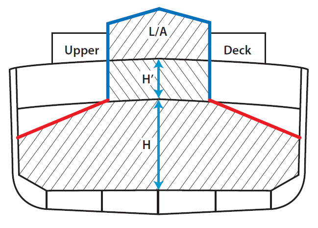
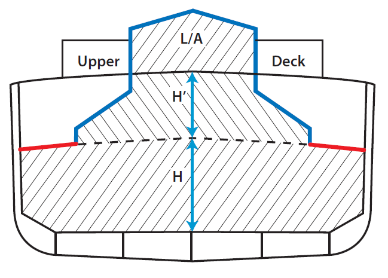
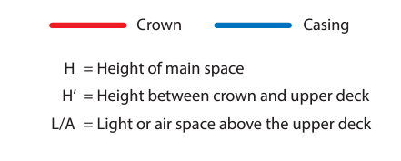
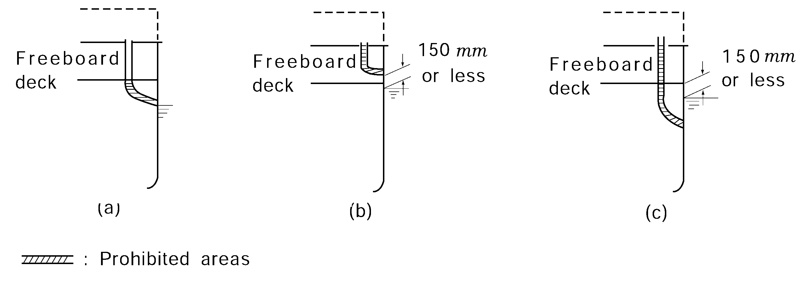

# PART 8 Fire Protection and Fire Extinction

> RULES FOR CLASSIFICATION OF STEEL SHIPS / RA-08-E / 2025 / EN / Guidance

## CHAPTER 9 STRUCTURAL INTEGRITY

### Section 1 Material

#### 101. Material of hull, superstructures, structural bulkheads, decks and deckhouses 【See Rule】

Deckhouses, boatswain's stores, etc. which are independently arranged away from a group of accommodation spaces may be regarded as independent service spaces respectively. Accordingly, internal divisions in these spaces may be of "C" class standard. Accordingly, access hatches to under deck spaces(for example, cargo space) from these spaces may be weathertight. Access hatches to the under deck spaces from other machinery spaces having little risk of fire which are independently arranged away from a group of accommodation spaces, may also be weathertight. And stairs in control stations, accommodation and service spaces are to be of steel or equivalent materials.

### Section 2 Structure of aluminium alloy

#### 201. Structure of aluminium alloy

- **1.** In applying **201. 1** of the Rules, “structure which is non-load bearing" means partition walls. **【See Rule】**
- **2.** If an aluminium deck is tested with insulation installed below the deck, then the result will apply to decks which are bare on the top in accordance with the **FTP code Annex 1 Part 3 4.3**.
- **3.** The use of aluminium coatings is prohibited in cargo tanks, cargo tank deck area, pump room, cofferdams or any other area where cargo vapour may accumulate.
- **4.** However, aluminized pipes may be permitted in ballast tanks, in inerted cargo tanks and, provided the pipes are protected from accidental impact, in hazardous area on open deck.

### Section 3 Machinery Spaces of Category A

#### 301. Machinery spaces of category A (2025)

- **1.** Crowns and casings exposed to the open air need not be insulated. **【See Rule】**
- **2.** **2**. The crown of a machinery space of category A should be understood to mean the underside of the deck and the uppermost horizontal part of the main space of the machinery space. If the upper side bulkheads are sloping, the sloping parts of the bulkheads should be included in the crown. *(2025)*

  |  |  |
  | --- | --- |
  |  |   |

### Section 4 Materials of Overboard Fittings

#### 401. Materials of overboard fittings 【See Rule】

The parts where the use of materials readily rendered ineffective by heat (PVC, FRP, aluminium alloys, lead, copper and copper alloys) is prohibited for overboard scuppers and sanitary discharges are to be in accordance with the following requirements:

- **1.** The parts of pipes for scuppers below the freeboard deck and sanitary discharges having open ends on the shell plating below the freeboard deck (see **Fig 8.9.2** (a) of the Guidance).
- **2.** In case where scuppers and sanitary discharges having open ends on the shell plating above the freeboard deck with their lower edges located at 150 $\mathrm{mm}$ or less above the load line, the parts of pipes in the spaces having such openings (see **Fig 8.9.2** (b) of the Guidance).
- **3.** In case **1.** above, if the distance between the freeboard deck and the load line is 150 $\mathrm{mm}$ or less, the requirements are also to apply to the parts of pipes in the spaces directly above the freeboard deck (see **Fig 8.9.2** (c) of the Guidance).
  
  **Fig 8.9.2 Areas prohibited from using materials readily rendered ineffective by heat**

### Section 5 Protection of Cargo Tank Structure Against Pressure or Vacuum In Tankers

#### 501. General

In applying **501. 1** of the Rules, the pressure setting, installation, tests and marking of "Pressure/Vacuum valve" are to be in accordance with following requirements. The Pressure/Vacuum valve is to be type approved by this Society. **【See Rule】**

- **1.** **Pressure setting**
  Pressure/Vacuum valves are to be set at a pressure within the range from 21 $\mathrm{kPa}$ to 14 $\mathrm{kPa}$ on the pressure side and 3 $\mathrm{kPa}$ to 7 $\mathrm{kPa}$ on the vacuum side. provided, however, that special reinforcements are made for the scantlings of cargo tanks, the set pressure on the pressure side may be of an appropriate value not exceeding 70 $\mathrm{kPa}$.
- **2.** **Installation**
  - **(1)** In case where a Pressure/Vacuum valve is fitted on a vent branch pipe of the common venting system, the discharge outlet and the suction inlet are to be separated. The suction inlet is not to be fitted to the vent branch pipe to the cargo tanks.
  - **(2)** Means are to be provided for easy access to the valves.
- **3.** **Tests and inspection**
  - **(1)** The tests and inspection for the individual product are to be carried out in accordance with followings.
    - **(A)** Construction inspection
    - **(B)** Hydraulic test
    - **(C)** Confirmation of the pressure at which the valve opens and closes
  - **(2)** On board test
    It is to be ascertained by a suitable method that the Pressure/Vacuum valves can be operable smoothly after installed on board.
- **4.** **Test report**
  A test report for each finished device is to be prepared. This is to include followings.
  - **(1)** detailed drawings of the device and its components
  - **(2)** the types of test conducted and the results obtained, with all recorded data
  - **(3)** specific advice on approved attachments
  - **(4)** drawings of the test rig, to include a description of the inlet and outlet piping attached
  - **(5)** a record of all markings(refer to **6**) found on the device tested
  - **(6)** a report number
- **5.** **Instruction manual**
  The manufacturer is to provide an instruction manual for each device. The instruction manual is to include the following items;
  - **(1)** Installation instructions
  - **(2)** Operating instructions, including information on the lowest MESG that the device is suitable for, if fitted with a flame screen or with a high-velocity vent. The instructions are to also include any service restrictions imposed for safe functioning of the device, including requirements imposed for the proper installation of the device
  - **(3)** Maintenance requirements, including information on maintenance of any corrosion protection system
    - **(A)** Instructions on how to determine when device cleaning is required and the method of cleaning. Where the manufacturer allows valve overhauls to be performed by the user, the manufacturer is to provide the necessary procedures, instructions and diagrams for the valve to restored to original, as-purchased condition with regard to set pressure and flow rate
    - **(B)** Instructions on the frequency of cleaning of the device to remove vapour condensate. The frequency of cleaning condensate residue from the valve will vary depending on the cargo
    - **(C)** Instruction clearly defining the method of setting the pressure, including information such as dismantling and reassembling the valve, numbering and ordering information, and diagrams for proper assembly of items
    - **(D)** Instructions to check valve lift by the user prior to each cargo loading and cargo unloading operation
    - **(E)** Instructions to conduct a complete inspection of the valve and the recommended frequency
  - **(4)** The test report described in **4**.
  - **(5)** Flow test data, including flow rates under both positive and negative pressures, operating sensitivity, flow resistance, velocity and maximum pipe length on the inlet side
  - **(6)** The manufacturer's certification that the device has been constructed and tested in accordance with this International Standard
- **6.** **Marking**
  Each device is to be permanently marked indicating followings.
  - **(1)** manufacturer's name or trademark
  - **(2)** style, type, model or other manufacturer's designation for the device, which is to form a unique identification of the device
  - **(3)** size of the inlet (and outlet, if applicable)
  - **(4)** serial number
  - **(5)** direction of flow through the device
  - **(6)** test laboratory and report number
  - **(7)** pressure and vacuum setting
  - **(8)** the reference number of this International Standard
- **7.** **Combination type Pressure/Vacuum valve**
  In case where an exclusive automatic pressure valve and an exclusive automatic vacuum valve are provided in combination, such an arrangement may be regarded as to be provided with a Pressure/Vacuum valve. In this case, the exclusive automatic pressure valve and the exclusive automatic vacuum valve are to comply with the requirements for the discharge side or the suction side of the Pressure/Vacuum valves specified in **1** and **2** respectively.

#### 502. Openings for small flow by thermal variations (2023) 【See Rule】

Area Classification is to be carried out in accordance with the principles laid down in **IEC 60092-502:1999** and the classes of hazardous areas are to be referred to **Pt 7, Ch 1, 1101. 2** of the Rules.

#### 503. Safety measures in cargo tanks

- **1.** In applying **503. 2** of the Rules, a P/V breaker fitted on the IG main may be utilized as the required as the required secondary means of venting. Where the cargo is homogenous or for multiple cargoes where the vapours are compatible and do not require isolation. The height requirements of **Ch 2, 403. 4** & **502.** of the Rules and the requirements for devices to prevent the passage of flame of **Ch 2, 403. 3** are not applicable to the P/V breaker provided the settings are above those of the venting arrangements required by **501.** of the Rules. Where the venting arrangements are of the free flow type and the masthead isolation valve is closed for the unloading condition, the IG systems will serve as the primary underpressure protection with the P/V breaker serving as the secondary means. **【See Rule】**
- **2.** Inadvertent closure or mechanical failure of the isolation valves required by **Ch 2, 403. 2** (2) of the Rules & **Annex 8-5, 2** (10) (B) need not be considered in established the secondary means where the cargo is homogenous or for multiple cargoes where the vapours are compatible and do not require isolation since the valves are operated under control of the responsible ships officer and a clear visual indication of the operational status of the valves, and the possibility of mechanical failure of the valves is remote to their simplicity.
- **3.** For ships that apply pressure sensors in each tank as an alternative secondary means of venting as per **503. 2** of the Rules, the setting of the over-pressure alarm is to be above the pressure setting of the P/V-valve and the setting of the under-pressure alarm is to be below the vacuum setting of the P/V-valve. The alarm settings are to be within the design pressures of the cargo tanks. The settings are to be fixed and not arranged for blocking or adjustment in operation. An exception is permitted for ships that carry different types of cargo and use P/V valves with different settings, one setting for each type of cargo. The settings may be adjusted to account for the different types of cargo.

#### 504. Size of vent outlets 【See Rule】

Together with IBC code and IGC code where areas on open deck, or semi-enclosed spaces on open deck, within a vertical cylinder of unlimited height and 6 $\mathrm{m}$ radius centred upon the center of the outlet, and within a hemisphere of 6 $\mathrm{m}$ radius below the outlet which permit the flow of large volume of vapour, air or inlet gas mixtures during loading/discharging/ballasting are defined Zone 1, electrical equipment shall be certified safe type equipments. And then areas within 4 $\mathrm{m}$ beyond zone 1 are defined as Zone 2 in which electrical equipment shall be of the following requirements.
