# PART 8 Fire Protection and Fire Extinction

> RULES FOR CLASSIFICATION OF STEEL SHIPS / RA-08-E / 2025 / EN / Guidance

## CHAPTER 10 ESCAPE

### Section 2 Means of escape

#### 201. General requirements 【See Rule】

- **1.** To facilitate a swift and safe means of escape to the lifeboat and liferaft embarkation deck, the following provisions apply to overhead hatches fitted along the escape routes addressed by this section of Rules.
  - **(1)** The securing devices are to be of a type which can be opened from both sides;
  - **(2)** The maximum force needed to open the hatch cover is not to exceed 150 N; and
  - **(3)** The use of a spring equalizing, counterbalance or other suitable device on the hinge side to reduce the force needed for opening is acceptable.

#### 202. Means of escape from control stations, accommodation and service spaces

- **1.** In application to **202. 1.** (3) of the Rules, the term "where the Society sanctions the use of other equivalent material" means those complying with the requirements specified in **Ch 1, 103. 43** of the Rules, etc. **【See Rule】**
- **2.** In applying **202. 1** (4) of the Rules, two means of escape from the radio room are to be those which are separated each other and the escape routes are not common. **【See Rule】**
- **3.** In applying **202. 1** (5) of the Rules, in case of a conflict with the requirements of ICLL Annex I Reg.12(2), the requirements of ICLL Annex I Reg.12(2) is to be applied first. *(2017)* **【See Rule】**
- **4.** In applying **202. 2** (4) (E) of the Rules, indication of the assembly station in passenger ships refers to **MSC/Circ.777**. **【See Rule】**
- **5.** In applying **202. 2** (5) (A) of the Rules, lighting or photoluminescent strip indicators shall comply with **IMO Res. A.752(18) and ISO 15370**. **【See Rule】**
- **6.** In applying **202. 2** (5) (C) of the Rules, "guidelines developed by the IMO" mean **MSC/Circ.1167** and **MSC/Circ.1168**. **【See Rule】**
- **7.** In applying **202. 2** (7) of the Rules, evacuation analysis for passenger ships refers to **MSC.1/Circ. 1533**. *(2019)* **【See Rule】**
- **8.** In applying **202. 3** of the Rules, the means of escape is, in principle, to be comply with as follows : **【See Rule】**
  - **(1)** Openings for escape are to be not less than 600 $\mathrm{mm}$ × 400 $\mathrm{mm}$ for Manhole (including window), 600 $\mathrm{mm}$ × 600 $\mathrm{mm}$ for Small hatch(in square) and *f* 600 $\mathrm{mm}$ for Small hatch(in circle).
  - **(2)** The embarkation deck is to be accessible from the open decks to which escape routes lead.
  - **(3)** The means of escape may be accepted even where lifeboats and liferafts area can not directly be reached, provided that such area can be reached through corridors and stairways in normal ways. Such arrangement as to reach the area only by passing through the cabins or using vertical ladders is not to be accepted.
  - **(4)** Stairways and corridors used as means of escape shall be not less than 700 $\mathrm{mm}$ in clear width and shall have a handrail on one side. Stairways and corridors with a clear width of 1,800 $\mathrm{mm}$ and over shall have handrails on both sides. "Clear width"” is considered the distance between the handrail and the bulkhead on the other side or between the handrails.
  - **(5)** The angle of inclination of stairways should be, in general, 45° but not greater than 50° and in machinery spaces and small spaces not more than 60° Doorways which give access to a stairway shall be of the same size as the stairway.
- **9.** In applying **202. 3** (2) of the Rules, the means of second escape is to be either stairway which directly leads to open deck from the place concerned or hatch capable of being operated from both sides.
- **10.** In applying **202. 3** (3) of the Rules, the following requirements shall be complied with :
  - **(1)** In case where two stairways protected by the divisions are provided, doors allowing to escape directly from at least two decks from where the lifeboats and liferafts area can be easily reached are to be provided on both sides (see **Fig 8.10.1** (a) of the Guidance).
  - **(2)** In case where only one stairway protected by the divisions is provided, at least one door through which direct escape to the open deck is possible, is to be provided on each deck (see **Fig 8.10.1** (b) of the Guidance).
    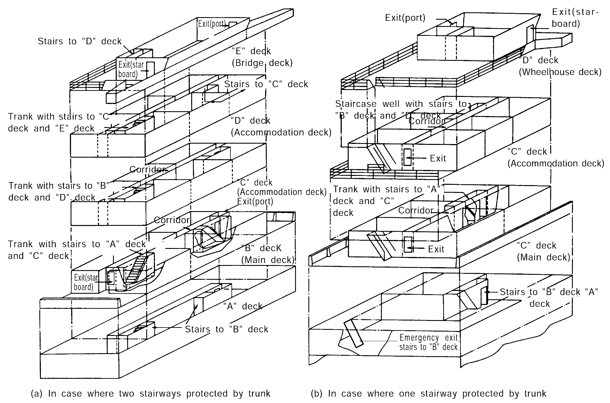
    **Fig 8.10.1 Means of Escape**
- **11.** In applying **202. 3** (2) & (3) of the Rules, the "Lowest open deck" should be a category ⑩ "Open deck" (as defined in **Ch 7 103. 3** (2) (B) & **104. 2** (2) (B) of the Rules) at the lowest height from baseline in way of accommodation spaces.
- **12.** In applying **202. 3** (4) of the Rules, dead-end corridors, which they can not be avoided, are to be so designed that persons do not easily enter such corridors in cases of emergency.
- **13.** In applying **202. 4** (1) of the Rules, Emergency escape breathing devices(EEBD) shall satisfy the following requirements. **【See Rule】**
  - **(1)** An EEBD is a supplied-air or oxygen device only used for escape from a compartment that has a hazardous atmosphere and shall be of an approved type.
  - **(2)** EEBDs shall not be used for fighting fires, entering oxygen deficient voids or tanks, or worn by fire-fighters. In these events, a self-contained breathing apparatus, which is specifically suited for such applications, shall be used.
  - **(3)** Face piece means a face covering that is designed to form a complete seal around the eyes, nose and mouth which is secured in position by a suitable means.
  - **(4)** Hood means a head covering which completely covers the head, neck, and may cover portions of the shoulders.
  - **(5)** Hazardous atmosphere means any atmosphere that is immediately dangerous to life or health.
  - **(6)** The EEBD shall have a service duration at least 10 minutes.
  - **(7)** The EEBD shall include a hood or full face piece, as appropriate, to protect the eyes, nose and mouth during escape. Hoods and face pieces shall be constructed of flame resistant materials and include a clear window for viewing.
  - **(8)** An inactivated EEBD shall be capable of being carried hands-free.
  - **(9)** An EEBD, when stored, shall be suitably protected from the environment.
  - **(10)** Brief instructions or diagrams clearly illustrating their use shall be clearly printed on the EEBD. The donning procedures shall be quick and easy to allow for situations where there is little time to seek safety from a hazardous atmosphere.
  - **(11)** Maintenance requirements, manufacturer's trademark and serial number, shelf life with accompanying manufacture date and name of approving authority shall be printed on each EEBD. All EEBD training units shall be clearly marked.

#### 203. Means of escape from machinery spaces

- **1.** In applying **203. 1** and **2** of the Rules, the means of escape to the open deck from machinery spaces of category A shall satisfy the following requirements. **【See Rule】**
  - **(1)** One of the means of escape required by the Rules is to be arranged as follows:
    - **(A)** It is to be enclosed and insulated as required for spaces of the Rules against the space it serves. Ladders are to be fixed in such a way that heat cannot, in case of a fire in the machinery space, be transferred to the ladder through non-insulated fixing points;
    - **(B)** The self-closing door is to have the fire integrity of the bulkhead in which it is fitted. If there are other exits to this trunk they are also to be provided with such doors;
  - **(2)** It is not desirable to use ro-ro spaces or vehicle spaces as a part of the escape routes from machinery space of category A to the open deck. In case where such arrangement is unavoidable, the following requirements shall be satisfied:
    - **(A)** The escape route through ro-ro spaces or vehicle spaces is to be restricted to one, and other routes are to be arranged either through spaces other than the above route or through enclosed escape trunks. The trunks are to be applied with insulation in accordance with the requirements of the Rules, as corridors.
    - **(B)** The escape route through ro-ro spaces and vehicle spaces is to be as short as possible, and a corridor is to be secured by the permanent and strong construction so that passage may not be hampered by cargo.
  - **(3)** Insulation of the shelter is to be taken as equivalent to that of the passage way or lobby and be in compliance with **Table 8.7.1** to **8.7.8** of the Rules.
  - **(4)** In case where only one set of means of escape other than the shelter for machinery spaces of category A is provided, self-closing doors required at the lower part of the shelter are to be provided at each deck level.
  - **(5)** "Ladder" means stairways and ladders. Ladders having strings of flexible steel wire ropes are not acceptable in such escape routes.
- **2.** In applying **203. 2** (3) of the Rules, for machinery spaces which are regarded as those having little or no fire risk, machinery spaces in which the crew is not normally employed, or small spaces, only one set of means of escape may be provided. In this case, however, the escape route is not to pass through machinery spaces of category A. Where shaft tunnel is provided, an escape route is to be provided aft of the shaft tunnel (see **Fig 8.10.3** of the Guidance). **【See Rule】**
  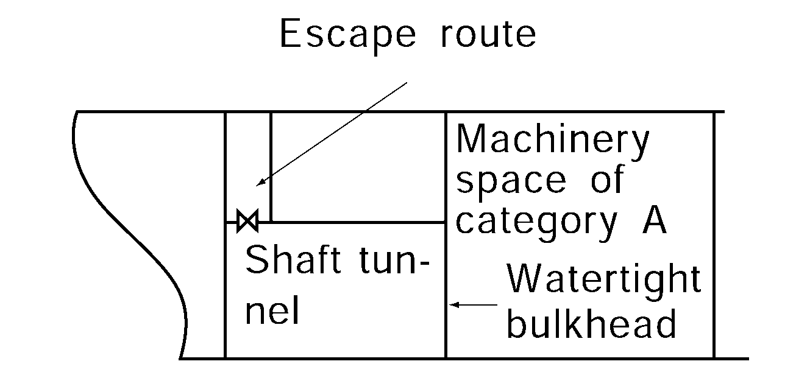
  **Fig 8.10.3 Escape of small spaces**
- **3.** In applying **203. 3** of the Rules, the minimum quantity of emergency escape breathing devices is to be as follows: **【See Rule】**
  - **(1)** In machinery spaces for category A containing internal combustion machinery used for main propulsion
    - **(A)** one (1) EEBD in the engine control room, if located within the machinery space;
    - **(B)** one (1) EEBD in workshop areas. If there is, however, a direct access to an escape way from the workshop, an EEBD is not required; and
    - **(C)** one (1) EEBD on each deck or platform level near the escape ladder constituting the second means of escape from the machinery space (the other means being an enclosed escape trunk or watertight door at the lower level of the space).
  - **(2)** For machinery spaces of category A other than those containing internal combustion machinery used for main propulsion, one (1) EEBD should, as a minimum, be provided on each deck or platform level near the escape ladder constituting the second means of escape from the space (the other means being an enclosed escape trunk or watertight door at the lower level of the space).
  - **(3)** Where the requirements of flag state are different from (1) and (2), the requirements of flag state are to be applied.
- **4.** In applying **203.** 3 (3) of the Rules, emergency escape breathing devices (EEBD) are to be complied with 202. 12 requirements of the Guidance. *(2017)*
- **5.** In applying **203. 1 & 2** of the Rules**,** the following requirements are to be applied.
  - **(1)** Inclined ladders/stairways in machinery spaces being part of, or providing access to, escape routes but not located within a protected enclosure should not have an inclination greater than 60° and should not be less than 600 mm in clear width.
    Such requirement need not be applied to ladders/stairways not forming part of an escape route, only provided for access to equipment or components, or similar areas, from one of the main platforms or deck levels within such spaces.
  - **(2)** Internal dimensions should be interpreted as clear width, so that a passage having diameter of 800 mm is available throughout the vertical enclosure, as shown in **Fig 8.10.4** of the Guidance, clear of ship's structure, with insulation and equipment, if any. The ladder within the enclosure can be included in the internal dimensions of the enclosure.
    When protected enclosures include horizontal portions their clear width should not be less than 600 mm. **Fig 8.10.4** of the Guidance is given as example of some possible arrangements which may be in line with the above interpretation.
- **6.** In applying **203. 1** (1), (4) and (6) of the Rules**,** the following requirements are to be applied.
  - **(1)** A "safe position" can be any space, such as steering gear spaces where hydraulic oils for the steering gear equipment are stowed, and special category spaces and ro-ro spaces, from which access is provided and maintained clear of obstacles to the embarkation decks. This excludes lockers and storerooms, cargo spaces and spaces where flammable liquids are stowed. *(2025)*
  - **(2)** Machinery spaces may include working platforms and passageways, or intermediate decks at more than one deck level. In such case, the lower part of the space should be regarded as the lowest deck level, platform or passageway within the space. Smaller working platforms in-between deck levels, or only for access to equipment or components, need not be provided with two means of escape.
  - **(3)** A protected enclosure providing escape from machinery spaces to an open deck may be fitted with a hatch as means of egress from the enclosure to the open deck. The hatch should have minimum internal dimensions of 800 mm x 800 mm.
    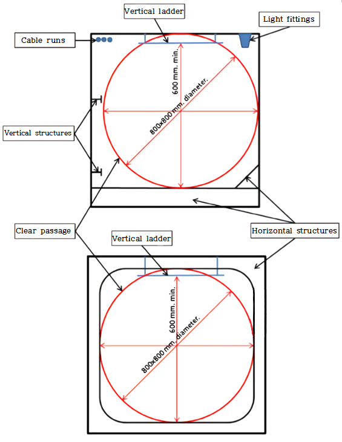
    **Fig 8.10.4 Internal dimensions of vertical enclosures**
- **7.** In applying **203. 1** (4), (6) & **2** (5), (6) of the Rules, the following requirements are to be applied.
  - **(1)** Main workshop
    A "main workshop" means a compartment enclosed on at least three sides by bulkheads or gratings, usually containing welding equipment, metal working machinery and workbenches.
  - **(2)** Machinery control rooms
    A "machinery control room" means a space which serves for control and/or monitoring of machinery used for ship's main propulsion.
  - **(3)** Continuous fire shelter
    A "continuous fire shelter" means a route from a main workshop, or from a machinery control room, which allows safe escape, without entering the machinery space, to a location outside the machinery space. Such a continuous fire shelter need not be a protected enclosure as envisaged by **203. 1** (1) & **2** (1) of the Rules. The boundaries of the continuous fire shelter shall be at least "A-0" class divisions and be protected by self-closing "A-0" class doors. The continuous fire shelter shall have minimum internal dimensions of at least 800 mm x 800 mm for vertical trunks and 600 mm in width for horizontal trunks, and shall have emergency lighting provisions. **Fig 8.10.5** of the Guidance represent typical arrangements of the continuous fire shelters through trunks or through spaces/rooms to a location outside the machinery space, which should be considered as effective.

    | 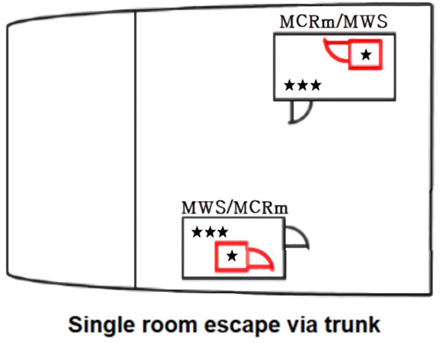 | 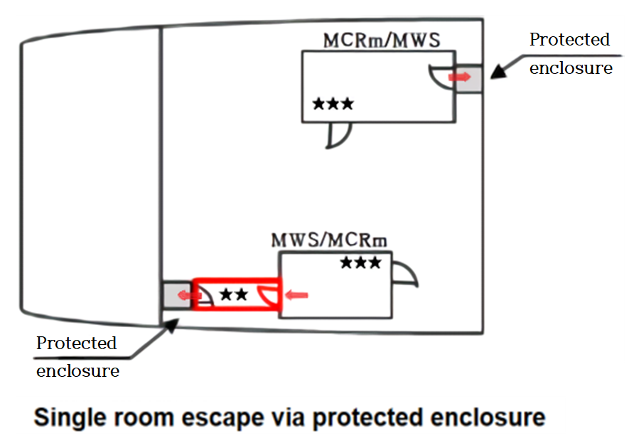 |
    | --- | --- |
    | 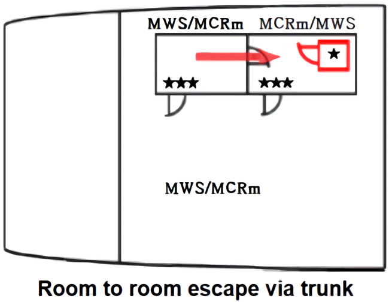 | 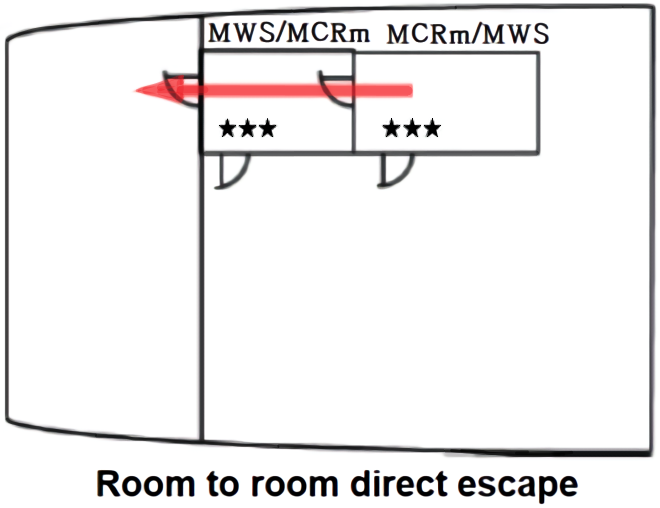 |
    | 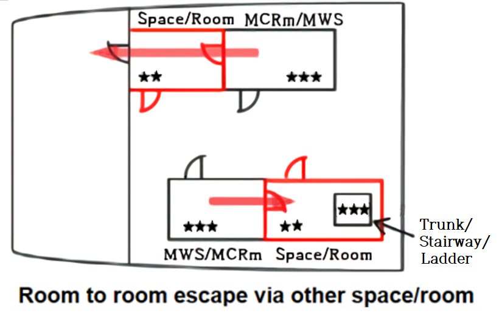 | 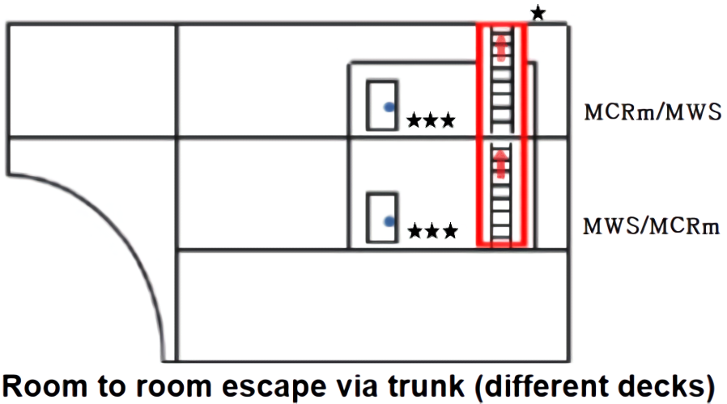 |
    |  | 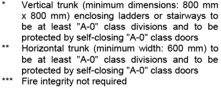 |
- **8.** In applying **203. 2** (1), (3), (5) and (6) of the Rules, the following requirements are to be applied.
  - **(1)** A "safe position" can be any space, such as steering gear spaces where hydraulic oils for the steering gear equipment are stowed, and vehicle and ro-ro spaces, from which access is provided and maintained clear of obstacles to the open deck. This excludes cargo spaces, lockers and storerooms, cargo pump-rooms and spaces where flammable liquids are stowed. *(2025)*
  - **(2)** Machinery spaces of category A may include working platforms and passageways, or intermediate decks at more than one deck level. In such case, the lower part of the space should be regarded as the lowest deck level, platform or passageway within the space.
    Smaller working platforms in-between deck levels, or only for access to equipment or components, need not be provided with two means of escape.
  - **(3)** A protected enclosure providing escape from machinery spaces of category A to an open deck may be fitted with a hatch as means of egress from the enclosure to the open deck. The hatch should have minimum internal dimensions of 800 mm x 800 mm.
  - **(4)** In Machinery spaces other than those of category A, which are not entered only occasionally, the travel distance should be measured from any point normally accessible to the crew, taking into account machinery and equipment within the space.
- **9.** In applying **203. 2** (2) & (3) of the Rules, means of escape from the steering gear space in cargo ships shall satisfy the following requirements.
  - **(1)** Steering gear spaces which do not contain the emergency steering position need only have one means of escape.
  - **(2)** Steering gear spaces containing the emergency steering position can have one means of escape provided it leads directly onto the open deck. Otherwise, two means of escape are to be provided but they do not need to lead directly onto the open deck.

#### 205. Means of escape from ro-ro spaces 【See Rule】

- **1.** In applying **205.** of the Rules, the escape (and access) routes are to be so arranged that there are adequate escape routes also during loading and unloading.
- **2.** Means of escape from ro-ro spaces shall satisfy the following requirements.
  - **(1)** A place where the crew are present to carry out their routine work duties, e.g. during the loading and unloading of a ro-ro deck, or during their ro-ro deck inspections whilst the ship is underway, is considered normally employed.
  - **(2)** Ro-ro deck inspections could for instance include: fire patrols, inspection of the cargo, check of bilge wells and their alarms, sounding of tanks, cargo deck cleaning, different types of maintenance work (removing of rust, painting, greasing, etc.).
  - **(3)** Ro-ro spaces should be fitted with at least two means of escape, one located at the fore end and the other at the aft end of the space, from which access is provided to the lifeboat and liferaft embarkation decks. One of the means of escape should be a stairway, the second escape may be a trunk or a stairway.
  - **(4)** The fore and aft ends of the ro-ro space are considered as the areas being within the distance equal to the breadth of the ro-ro space, measured at its widest point, from its forward most and aftmost point. (see **Fig 8.10.6** of the Guidance)
  - **(5)** Suitable signs and markings should be provided to indicate the route to the means of escape. 
    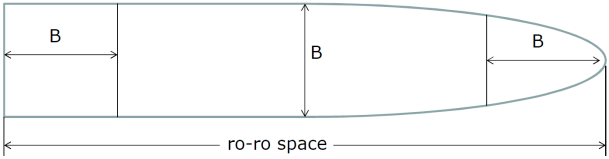
    **Fig 8.10.6 Fore and aft ends of the ro-ro space**
