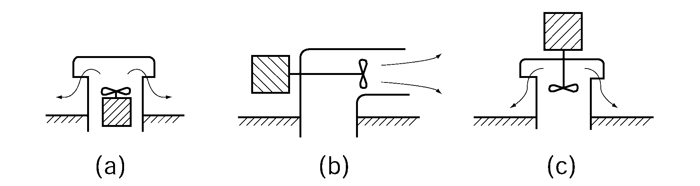
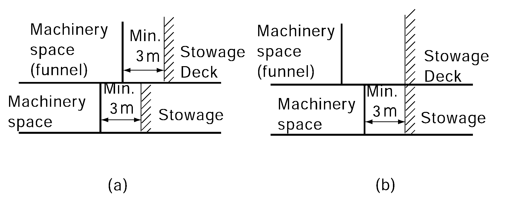

# PART 8 Fire Protection and Fire Extinction

> RULES FOR CLASSIFICATION OF STEEL SHIPS / RA-08-E / 2025 / EN / Guidance

## CHAPTER 12 CARRIAGE OF DANGEROUS GOODS

### Section 1 General Requirements

#### 101. General requirements 【See Rule】

- **1.** In applying **101. 1** of the Rules, limited quantities and excepted quantities refer to **3.4** and **3.5** of the **IMDG Code**. *(2020)*
- **2.** In applying **101. 2** (2) of the Rules, A purpose built container space is a cargo spaces fitted with cell guides for stowage securing of containers;
- **3.** In applying **101. 2** (3) of the Rules, Ro-ro spaces include special category spaces and vehicle spaces;

### Section 2 Special Requirements

#### 201. Special requirements

- **1.** **Water supplies 【See Rule】**
  - **(1)** In applying **201. 1** of the Rules, for Open-Top Container Ships of dangerous goods the following requirements may comply with in lieu of the water spray system.
    - **(A)** Open top container holds are to be protected by a fixed water spray system. The system is to be capable of spraying water into the cargo hold from deck level downward. The system is to be designed and arranged to take account of the specific hold and container configuration. If found necessary, the Society may require a full-scale test.
    - **(B)** The water spray system is to be able to effectively contain a fire in the container bay of origin. The spray system is to be subdivided, with each subdivision to consist of a ring-line at deck in an open cargo hold around a container bay.
    - **(C)** The water spray system is to be capable of spraying the outer vertical boundaries of each container bay in an open cargo hold and of cooling the adjacent structure. The uniform application density is to be not less than 1.1 $\mathrm{L} /m ^{2}$. At least one dedicated fire-extinguishing pump for the hold water spray system with a capacity to serve all container bays in any one open top container hold simultaneously is to be provided. The pump(s) is to be installed outside the open top area. The availability of water to the water spray system is to be at least 50 % of the total capacity, with adequate spray patterns in the open top container hold, and with any one dedicated pump inoperable. For the case of a single dedicated water spray pump this may be accomplished by an interconnection to an alternative source of water. The extinguishing system is to be supplemented by hose supply from the weather deck.
    - **(D)** The amount of water required for fire-fighting purposes in the largest hold is to allow simultaneous use of the water spray system plus four jets of water from hose nozzles.
  - **(2)** In applying **201. 1** (2) of the Rules, the number and position of hydrants should be such that at least two of the required four jets of water, when supplied by single lengths of hose, may reach any part of the cargo space when empty; and all four jets of water, each supplied by single lengths of hose may reach any part of ro-ro cargo spaces. And the mount of water required for fire fighting purposes in the largest hold is to satisfy simultaneous use from the water spray systems plus 4 jets of water from hose nozzles.
  - **(3)** In application to **201. 1** (3) of the Rules, the term "the adverse effect upon stability of the added weight and free surface of water shall be taken into account to the extent deemed necessary by the Society in its approval of the stability information" means that the ships are to be complied with requirements of stability criteria specified in **Pt 1, Annex 1-2 2.** (3) of the Guidance, etc.
  - **(4)** In applying **201. 1** (4) of the Rules, a high expansion foam system is acceptable except if cargoes dangerously react with water.
  - **(5)** In applying **201. 1** (5) of the Rules, in cases where the mobile water monitors and the "water spray system" (fixed arrangement of spraying nozzles or flooding the cargo space with water) required by **201. 1** (3) of the Rules are supplied by the main fire pumps, the total capacity of the main fire pumps and the pipework diameter need only be sufficient to supply whichever of the following is the greater:
    The total capacity, however, should not be less than the capacity required in **603. 2**, whichever is smaller.
    - **(A)** the mobile water monitors and the four nozzles required by **201. 1** (2) of the Rules; or
    - **(B)** the four nozzles required by **201. 1** (2) of the Rules and the water spray system required by (3).
- **2.** **Sources of ignition** ***(******2022)*** **【See Rule】**
  The electrical equipment are to be complied with the following requirements.
  - **(1)** The electrical equipment provided in the enclosed cargo spaces or vehicle spaces which are regarded as hazardous environment are to be of those approved by the Society taking into account the requirements of IMDG Code. However, even electrical equipment not approved by the Society may be provided in the above-mentioned spaces if they are of IP55 or equivalent, provided that they are not used while dangerous goods are loaded in such spaces.
  - **(2)** In case where electric cables, which are used while dangerous substances are loaded likely to evolve explosive mixture gases, are arranged in cargo spaces, the following requirements are to apply:
    - **(A)** Cables are to be mineral-insulated copper sheathed cables, lead sheathed and armoured cables or non-metal sheathed and armoured cables.
    - **(B)** Through runs of cables and those led to electrical equipment installed in cargo spaces are to be protected by metal coverings or the like.
  - **(3)** For electrical equipment other than specified in (A) and (B) above, refer to **IEC 60092-506:2003**.
  - **(4)** the following requirements are to be regarded as sources of ignition, and they are not to be installed in the proximity of the openings of ventilation for cargo spaces:
    - **(A)** Electrical equipment other than those of safe type approved for use in hazardous environment
    - **(B)** Windlasses and openings for chain lockers
  - **(5)** Reference is to be made to **IEC 60092-506:2003.**
  - **(6)** For pipes having open ends(e.g., ventilation and bilge pipes, etc.) in hazardous area, the pipe itself is to be classified as hazardous area. See **IEC 60092-506:2003 table B1, item B**).
  - **(7)** When carrying flammable liquids having flashpoints less than 23 ºC as Class3, 6.1 or 8 in cargo spaces, the bilge pipes with flanges, valves, pumps, etc. constitute a source of release and the enclosing spaces (e. g. pipe tunnels, bilge pump rooms, etc.) are to be classified as an extended hazardous area (comparable with Zone 2) unless these spaces are continuously mechanically ventilated with a capacity for at least six air changes per hour. Except where the space is protected with redundant mechanical ventilation capable of starting automatically, equipment not certified for Zone 2 are to be automatically disconnected following loss of ventilation while essential systems such as bilge and ballast systems are to be certified for Zone 2.
    Where redundant mechanical ventilation is employed, equipment and essential systems not certified for zone 2 shall be interlocked so as to prevent inadvertent operation if the ventilation is not operational. Audible and visible alarm shall be provided at a manned station if failure occurs. *(2019)*
- **4.** **Ventilation arrangement 【See Rule】**
  - **(1)** In applying **201. 4** of the Rules, If the enclosed cargo space has access from another enclosed space, the door shall be self-closing.
  - **(2)** In applying **201. 4** of the Rules, the following requirements are to be complied with.
    - **(A)** If adjacent spaces are not separated from cargo spaces by gastight bulkheads or decks, then they are considered as part of the enclosed cargo space and the ventilation requirements are to apply to the adjacent space as for the enclosed cargo space itself.
    - **(B)** Where the IMSBC Code requires 2 fans per hold, a common ventilation system with 2 fans connected is acceptable.
    - **(C)** Where the IMSBC Code requires continuous ventilation, this does not prohibit ventilators from being fitted with a means of closure as required for fire protection purposes under **Ch 2, 201. 1** (1) of the Rules provided the minimum height to the ventilator opening is to be in accordance with ICLL(4.5 m for Position 1 and 2.3 m for Position 2).
    - **(D)** For open top container ships, power ventilation is to required only for the lower part of the cargo hold for which purpose ducting is required. The ventilation capacity is to be at least 2 air changes per hour, based on the empty hold volume below weather deck.
  - **(3)** In applying **201. 4** (2) of the Rules, in case where electric motor driven ventilating fans are installed, the following requirements are to be complied with:
    
    **Fig 8.12.1 Ventilating fans of motor-driven type**
    - **(A)** Where a ventilating fan of internal motor-driven type is installed, the motor is to be of the one approved by the Society for use in hazardous environment taking into account the requirements of the IMDG Code (see **Fig. 8.12.1** (a) of the Guidance).
    - **(B)** Where a ventilating fan of external motor-driven type is installed on exposed deck, the motor is to be of the covering equivalent to IP55 or upward (see **Fig. 8.12.1** (b) of the Guidance).
    - **(C)** Even in the case of (2) above, where the motor is installed in the proximity of the exhaust opening, the motor is to comply with the requirements of (1) above (see **Fig. 8.12.1** (c) of the Guidance).
    - **(D)** Ventilation fan of non-sparking type is to be provided and complied with the requirements specified in **Ch 3, 104.** of the Rules.
  - **(4)** The reduced air changes per hour as per Note 1 of Table 8.12.1 of the Rules apply equally to the ventilation air change requirements in **201. 4** (1) and in **201. 5** (4) of the Rules, when the bilge pump is located directly inside a container cargo space.
    In such a case, where several container cargo spaces are served by the same bilge pump, the bilge pump is to be installed in the container cargo space with the highest ventilation rate, compared to the other container cargo spaces. *(2020)*
- **5.** **Bilge pumping 【See Rule】**
  - **(1)** In applying **201. 5** of the Rules, bilge systems for open top container holds should be independent of the machinery space bilge system and be located outside of the machinery space.
  - **(2)** In applying **201. 5** (2) of the Rules, if a single drainage system completely independent of the machinery space is provided, the system is to comply with the Rules requirement to redundancy and capacity based on the size of the space or space which it services.
  - **(3)** In applying **201. 5** (3) of the Rules, in case where bilge pipes are led to machinery spaces, the following requirements are to be complied with :
    - **(A)** Caution plate stating that the bilge pipes are to be blocked while dangerous goods are loaded on board are to be posted in the vicinity of the above-mentioned closed lockable valve or blank flanges.
    - **(B)** Eductors are to be provided as the means of bilge discharging for cargo spaces so that bilges can be discharged overboard without passing through machinery spaces.
- **6.** **Personnel protection 【See Rule】**
  - **(1)** In applying **201. 6** (1) of the Rules, for solid bulk cargoes the protective clothing is to satisfy the equipment requirements specified in Appendix 1 of the IMSBC Code for the individual substances. For packaged goods the protective clothing is to satisfy the equipment requirements specified in emergency procedures (EmS) of the Supplement to IMDG Code for the individual substances.
  - **(2)** In applying **201. 6** (2) of the Rules, These spare bottles are to be in addition to the spare bottles required for fireman's outfit.
- **7.** **Portable fire extinguishers 【See Rule】**
  Two portable fire extinguishers, each having a capacity of not less than 6 kg of dry powder or equivalent, should be provided when dangerous goods are carried on the weather deck, in open ro-ro spaces and vehicle spaces, and in cargo spaces as appropriate. The type has to correspond to the Class B ones specified in **Table 8.8.3-1** of this Guidance.
- **8.** **Insulation of machinery space boundaries 【See Rule】**
  In applying **201. 8** of the Rules, In the case that a closed or semi-closed cargo space is located partly above a machinery space and the deck above the machinery space is not insulated, dangerous goods are prohibited in the whole of that cargo space. If the uninsulated deck above the machinery space is a weather deck, dangerous goods are prohibited only for the portion of the deck located above the machinery space.
  In a case where dangerous goods are carried, no direct access is, in principle, to be provided between machinery spaces and cargo spaces. However, the access may be acceptable provided that air lock space with double self-closing steel doors of reasonably gastight is provided between those spaces. However, when dangerous goods without involving the hazard of generating noxious gas (including the case of fire) are carried, this requirement may be dispensed with.
  In a case where explosives are stowed at least 3 $\mathrm{m}$ horizontally away from the machinery space boundaries, refer to **Fig 8.12.2** of the Guidance.
  
  **Fig 8.12.2 Areas acceptable to stowage of explosives**
- **9.** In applying **201. Table 8.12.1** of the Rules, a ro-ro space fully open above and with full openings in both ends may be treated as a weather deck. **【See Rule】**

### Section 3 Document of compliance

#### 301. Document of compliance 【See Rule】

- **1.** Refer to Document of compliance with the special requirements for ships carrying dangerous goods under the provisions of regulation II-2/19, as amended, and paragraph 7.17 of the 2000 HSC Code, as amended (MSC.1/Circ.1266)
- **2.** Certification for carriage of solid dangerous bulk cargoes covers only those cargoes listed in Group B in the IMSBC Code except cargoes classified solely as MHB. Other solid dangerous bulk cargoes may only be permitted subject to acceptance by the Administrations involved.
- **3.** Refer to the MSC/Circ.1148, issuing and renewal of document of compliance with the special requirements applicable to ships carrying dangerous goods 
